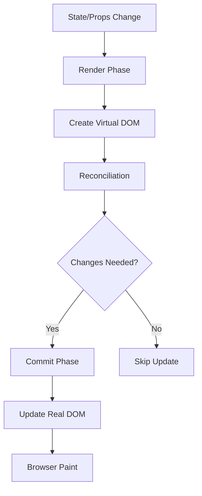
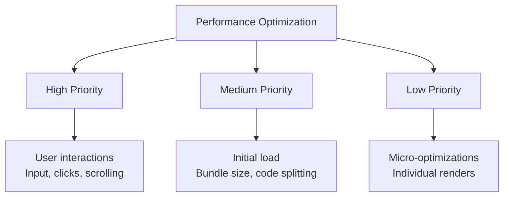

# Topic 36: React Performance Fundamentals

[← Previous: Fragments](./35_fragments.md) | [Back to Main](../README.md) | [Next: React.memo →](./37_react_memo.md)

---

## Table of Contents

1. [Overview](#overview)
2. [Understanding React Performance](#understanding-react-performance)
3. [Identifying Performance Issues](#identifying-performance-issues)
4. [React DevTools Profiler](#react-devtools-profiler)
5. [Common Performance Bottlenecks](#common-performance-bottlenecks)
6. [Optimization Strategies](#optimization-strategies)
7. [When to Optimize](#when-to-optimize)
8. [Performance Budgets](#performance-budgets)
9. [Measurement Tools](#measurement-tools)
10. [Best Practices](#best-practices)

---

## Overview

**Performance optimization** in React is about identifying and eliminating unnecessary work. Understanding React's rendering behavior is crucial for building fast, responsive applications.

**What You'll Learn:**
- How React renders and what causes re-renders
- Tools for identifying performance issues
- Common performance bottlenecks
- When and how to optimize
- Performance measurement strategies
- React DevTools Profiler usage
- Optimization best practices

**Prerequisites:**
- React rendering lifecycle
- Component re-render behavior
- Basic JavaScript performance concepts

**Version Coverage:**
- React 16.5+ (Profiler API)
- React 18+ (Concurrent features)
- React 19 (React Compiler)
- React 19.2

---

## Understanding React Performance

### The Render-Commit Cycle



### What Causes Re-renders

```tsx
// 1. State changes
const [count, setCount] = useState(0);
setCount(1);  // Component re-renders

// 2. Props changes
<Child value={value} />  // Child re-renders when value changes

// 3. Parent re-renders
function Parent() {
  const [state, setState] = useState(0);
  
  return <Child />;  // Child re-renders when Parent does!
}

// 4. Context changes
const value = useContext(MyContext);  // Re-renders when context changes

// 5. Force update (rarely used)
forceUpdate();  // Class components only
```

### Re-render vs Re-paint

```tsx
// Re-render (cheap): React creates new virtual DOM
function Component() {
  return <div>Content</div>;
}
// Just JavaScript object creation

// Re-commit (expensive): React updates real DOM
// Only happens if virtual DOM changed

// Re-paint (most expensive): Browser redraws screen
// Only happens if DOM changed
```

---

## Identifying Performance Issues

### Symptoms of Poor Performance

```tsx
// 🐌 Laggy interactions
// - Typing in input feels slow
// - Button clicks have delay
// - Scrolling stutters

// 🐌 Slow initial load
// - White screen for seconds
// - Large bundle size
// - Too much initial JavaScript

// 🐌 Memory issues
// - App slows down over time
// - Browser tab crashes
// - High memory usage
```

### Performance Profiling

```tsx
// 1. Use browser's Performance tab
// Record interaction → Analyze flame chart
// Look for:
// - Long tasks (>50ms)
// - Function calls taking time
// - React render phases

// 2. Use React DevTools Profiler
// Record → Interact → Stop
// See:
// - Which components rendered
// - How long each render took
// - Why components rendered

// 3. Use console.time for specific operations
console.time('expensive-operation');
expensiveOperation();
console.timeEnd('expensive-operation');
// Logs: expensive-operation: 234ms
```

---

## React DevTools Profiler

### Using the Profiler

```tsx
// 1. Install React DevTools extension
// 2. Open DevTools → Profiler tab
// 3. Click record (⚫)
// 4. Perform action
// 5. Click stop (⏹️)
// 6. Analyze results
```

### Reading Flame Graph

```tsx
// Flame graph shows:
// - Component hierarchy
// - Render time (width)
// - Why rendered (color)

// Colors:
// - Green: Fast render (<2ms)
// - Yellow: Medium render (2-10ms)
// - Orange: Slow render (10-50ms)
// - Red: Very slow render (>50ms)
```

### Why Did This Render?

```tsx
// Profiler shows render reasons:
// - Props changed
// - State changed
// - Parent rendered
// - Context changed
// - Hooks changed

// Click component to see:
// - Render duration
// - Props that changed
// - State that changed
```

---

## Common Performance Bottlenecks

### 1. Unnecessary Re-renders

```tsx
// Problem: Child re-renders when parent state changes
function Parent() {
  const [count, setCount] = useState(0);
  
  return (
    <>
      <button onClick={() => setCount(count + 1)}>
        Count: {count}
      </button>
      <ExpensiveChild />  {/* Re-renders every time! */}
    </>
  );
}

// Solution: Memoize child
const MemoizedChild = React.memo(ExpensiveChild);

function Parent() {
  const [count, setCount] = useState(0);
  
  return (
    <>
      <button onClick={() => setCount(count + 1)}>Count: {count}</button>
      <MemoizedChild />  {/* Doesn't re-render! */}
    </>
  );
}
```

### 2. Expensive Computations

```tsx
// Problem: Heavy calculation on every render
function Component({ items }) {
  const processed = items.map(expensiveTransform);  // Runs every render!
  
  return <div>{processed.length}</div>;
}

// Solution: Memoize calculation
function Component({ items }) {
  const processed = useMemo(
    () => items.map(expensiveTransform),
    [items]
  );
  
  return <div>{processed.length}</div>;
}
```

### 3. Creating Objects/Arrays in Render

```tsx
// Problem: New reference every render
function Parent() {
  return <Child config={{ api: '/api', timeout: 5000 }} />;  // New object!
}

// Solution: Memoize or move outside
const config = { api: '/api', timeout: 5000 };  // Outside component

function Parent() {
  return <Child config={config} />;  // Same reference
}

// Or memoize
function Parent() {
  const config = useMemo(() => ({ api: '/api', timeout: 5000 }), []);
  return <Child config={config} />;
}
```

### 4. Large Lists

```tsx
// Problem: Rendering 10,000 items
function HugeList({ items }) {
  return (
    <div>
      {items.map(item => <Item key={item.id} item={item} />)}
    </div>
  );
}

// Solution: Virtualization
import { FixedSizeList } from 'react-window';

function VirtualizedList({ items }) {
  return (
    <FixedSizeList
      height={600}
      itemCount={items.length}
      itemSize={50}
      width="100%"
    >
      {({ index, style }) => (
        <div style={style}>
          <Item item={items[index]} />
        </div>
      )}
    </FixedSizeList>
  );
}
```

---

## Optimization Strategies

### Strategy 1: Prevent Unnecessary Renders

```tsx
// Use React.memo for components
const ExpensiveComponent = React.memo(function ExpensiveComponent({ data }) {
  return <div>{/* Expensive rendering */}</div>;
});

// Use useMemo for values
const expensiveValue = useMemo(() => computeExpensive(data), [data]);

// Use useCallback for functions
const handleClick = useCallback(() => {
  // Handler logic
}, []);
```

### Strategy 2: Code Splitting

```tsx
// Lazy load components
const HeavyComponent = lazy(() => import('./HeavyComponent'));

function App() {
  return (
    <Suspense fallback={<Loading />}>
      <HeavyComponent />
    </Suspense>
  );
}
```

### Strategy 3: Optimize Reconciliation

```tsx
// Proper keys
{items.map(item => (
  <Item key={item.id} item={item} />  // Use stable IDs
))}

// Avoid index as key for dynamic lists
{items.map((item, index) => (
  <Item key={index} item={item} />  // ❌ Bad for dynamic lists
))}
```

---

## When to Optimize

### The 70/20/10 Rule

```tsx
// 70% of users: Modern devices, fast
// - Don't need heavy optimization
// - Focus on good patterns

// 20% of users: Mid-range devices
// - Some optimization needed
// - Code splitting helps

// 10% of users: Old/slow devices
// - Heavy optimization needed
// - Every millisecond counts
```

### Optimization Priority



### When NOT to Optimize

```tsx
// ❌ Don't optimize prematurely
// - Before measuring
// - Without user complaints
// - Micro-optimizations that don't matter

// ✅ Optimize when:
// - Profiling shows issues
// - Users report lag
// - You have performance budget
```

---

## Performance Budgets

### Setting Budgets

```tsx
// Example performance budgets:
const budgets = {
  // Time to Interactive
  tti: 3000,  // 3 seconds
  
  // First Contentful Paint
  fcp: 1000,  // 1 second
  
  // Bundle size
  mainBundle: 200 * 1024,  // 200KB
  
  // Component render time
  componentRender: 16,  // 16ms (60fps)
};

// Measure against budgets
if (renderTime > budgets.componentRender) {
  console.warn('Component render too slow');
}
```

---

## Measurement Tools

### Performance API

```tsx
// Mark and measure
performance.mark('render-start');
// ... rendering code
performance.mark('render-end');

performance.measure('render-time', 'render-start', 'render-end');

const measure = performance.getEntriesByName('render-time')[0];
console.log('Render took:', measure.duration, 'ms');
```

### React Profiler Component

```tsx
import { Profiler } from 'react';

function App() {
  return (
    <Profiler id="App" onRender={onRenderCallback}>
      <Component />
    </Profiler>
  );
}

function onRenderCallback(
  id,                    // Profiler id
  phase,                 // "mount" or "update"
  actualDuration,        // Time spent rendering
  baseDuration,          // Estimated time without memoization
  startTime,             // When render started
  commitTime,            // When React committed
  interactions           // Set of interactions
) {
  console.log(`${id} ${phase} took ${actualDuration}ms`);
}
```

---

## Best Practices

### 1. Measure Before Optimizing

```tsx
// ❌ Blind optimization
function Component() {
  // Adding React.memo everywhere
  // useMemo for everything
  // Premature optimization!
}

// ✅ Measure first
// 1. Use DevTools Profiler
// 2. Identify slow components
// 3. Optimize those specific components
// 4. Measure again to verify improvement
```

### 2. Fix the Biggest Issues First

```tsx
// Pareto principle: 80% of performance issues
// come from 20% of the code

// Focus on:
// - Large lists (virtualize)
// - Heavy components (code split)
// - Expensive computations (memoize)

// Don't focus on:
// - Micro-optimizations
// - Components that render rarely
// - Already fast code
```

### 3. Maintain Good Patterns

```tsx
// ✅ Good patterns prevent issues
// - Lift state only as high as needed
// - Split large components
// - Use keys correctly
// - Avoid inline object/array creation

// Don't need optimization if you follow patterns
```

---

## Higher-Order Thinking FAQs

### 1. Why does React re-render child components when parent re-renders, and how does this relate to React's declarative model?

**Deep Answer:**

React's default "re-render children" behavior stems from its **declarative philosophy** - UI is a function of state, so when state changes, recompute UI.

**The Philosophy:**

```tsx
// React's mental model
UI = f(state)

// When state changes, call f again
// f returns new UI description
// React compares old vs new

function Component({ items }) {
  return (
    <div>
      {items.map(item => <Item key={item.id} item={item} />)}
    </div>
  );
}

// Every render:
// 1. Call Component()
// 2. Component returns new JSX
// 3. React sees <Item> elements
// 4. React assumes Items might have changed
// 5. Re-renders all Items to be safe
```

**Why Not Smart by Default:**

```tsx
// React could check if props changed:
// if (prevProps === nextProps) skip render

// But this is expensive for:
// - Complex props (deep comparison)
// - Functions (always different references)
// - Objects (new objects every render)

// Cheaper to just re-render!
// Most re-renders are fast
```

**When This Breaks Down:**

```tsx
// Problem: Expensive child components
function Parent() {
  const [count, setCount] = useState(0);
  
  return (
    <>
      <button onClick={() => setCount(count + 1)}>Count: {count}</button>
      <ExpensiveChart data={chartData} />  {/* 100ms to render */}
    </>
  );
}

// Every click:
// - Parent re-renders (fast)
// - ExpensiveChart re-renders (slow)
// - Total: 100ms+ delay
// - User feels lag
```

**The Solution:**

```tsx
// Opt into optimization
const MemoizedChart = React.memo(ExpensiveChart);

function Parent() {
  const [count, setCount] = useState(0);
  
  return (
    <>
      <button onClick={() => setCount(count + 1)}>Count: {count}</button>
      <MemoizedChart data={chartData} />  {/* Skip re-render if data unchanged */}
    </>
  );
}
```

**Deep Implication:**

React prioritizes **correctness over performance** by default. It assumes you want correct UI more than fast UI. This is **defensive design** - better to be slow and correct than fast and wrong. When you know a component can skip updates safely, you opt into optimization (React.memo, useMemo). This makes optimization **explicit and visible** in code.

### 2. Why is measuring performance crucial before optimizing, and what are the risks of premature optimization in React?

**Deep Answer:**

Premature optimization adds **complexity without benefit** and can even make things slower.

**The Risks:**

```tsx
// ❌ Over-optimization
function Component({ value }) {
  // Memoize everything!
  const doubled = useMemo(() => value * 2, [value]);
  const greeting = useMemo(() => `Hello, ${value}`, [value]);
  const uppercased = useMemo(() => value.toUpperCase(), [value]);
  
  // useMemo overhead > benefit for simple operations
  // More memory usage
  // More complex code
  // Harder to maintain
}

// ✅ Just compute directly
function Component({ value }) {
  const doubled = value * 2;  // Instant
  const greeting = `Hello, ${value}`;  // Instant
  const uppercased = value.toUpperCase();  // Instant
}
```

**When Optimization Hurts:**

```tsx
// React.memo overhead
const Component = React.memo(function Component({ data }) {
  return <div>{data}</div>;
});

// React.memo cost:
// 1. Props comparison on every parent render
// 2. Memory for previous props
// 3. Function call overhead

// If component:
// - Renders fast (<1ms)
// - Props change often
// - Parent renders rarely

// React.memo overhead > benefit!
```

**Measurement Example:**

```tsx
// Measure to decide
import { Profiler } from 'react';

function App() {
  return (
    <Profiler id="MyComponent" onRender={logRenderTime}>
      <MyComponent />
    </Profiler>
  );
}

function logRenderTime(id, phase, actualDuration) {
  console.log(`${id} (${phase}) took ${actualDuration}ms`);
  
  if (actualDuration > 16) {
    console.warn('Slower than 60fps!');
  }
}

// Results guide optimization:
// - <5ms: Don't optimize
// - 5-16ms: Maybe optimize if renders often
// - >16ms: Definitely optimize
```

**Deep Implication:**

Performance optimization is a **tradeoff**: complexity vs speed. Every optimization adds code, memory, and mental overhead. Without measurement, you're guessing which tradeoffs are worth it. Premature optimization is **technical debt** - you pay the cost (complexity) without getting the benefit (speed). Measure first, optimize second.

### 3. How does React 19's Compiler change the performance optimization landscape?

**Deep Answer:**

React Compiler **automatically optimizes**, shifting focus from **manual memoization** to **algorithmic efficiency**.

**Before Compiler:**

```tsx
// Manual optimization required
function Component({ items, filter }) {
  // Must wrap in useMemo
  const filtered = useMemo(() => {
    return items.filter(item => item.type === filter);
  }, [items, filter]);
  
  // Must use useCallback
  const handleClick = useCallback((id) => {
    console.log(id);
  }, []);
  
  // Must use React.memo
  return (
    <>
      {filtered.map(item => (
        <MemoizedItem key={item.id} onClick={handleClick} />
      ))}
    </>
  );
}
```

**With Compiler:**

```tsx
// Automatic optimization!
function Component({ items, filter }) {
  // Compiler auto-memoizes
  const filtered = items.filter(item => item.type === filter);
  
  // Compiler auto-memoizes
  const handleClick = (id) => console.log(id);
  
  // Compiler auto-memoizes component
  return (
    <>
      {filtered.map(item => (
        <Item key={item.id} onClick={handleClick} />
      ))}
    </>
  );
}
```

**What Changes:**

| Aspect | Pre-Compiler | With Compiler |
|--------|--------------|---------------|
| **useMemo** | Manual | Automatic |
| **useCallback** | Manual | Automatic |
| **React.memo** | Manual | Often unnecessary |
| **Focus** | Memoization | Algorithm efficiency |
| **Code** | Verbose | Clean |

**Still Need to Optimize:**

```tsx
// Compiler doesn't help with:

// 1. Algorithmic complexity
const result = items.map(i => 
  items.map(j => expensiveOperation(i, j))  // O(n²)
);

// 2. Large data structures
const huge = Array(1000000).fill(0).map(process);

// 3. Network/IO
await fetch('/api/data');

// 4. Third-party libraries
thirdPartyLib.expensiveOperation();
```

**Deep Implication:**

React Compiler eliminates **tactical optimization** (memoization) so you can focus on **strategic optimization** (algorithms, architecture, data). This is React's evolution: from "how to make this fast" to "how to design this well." Good design will be automatically fast; bad design (O(n²) algorithms, excessive data) still needs fixing.

---

## Senior SDE Interview Questions

### Question 1: Performance Investigation

**Question:** "Users report your React app feels sluggish. Walk through your systematic approach to identifying and fixing performance issues."

**Key Concepts Being Tested:**
- Systematic debugging approach
- Tool knowledge
- Priority assessment
- Solution strategies

**Expected Answer Should Cover:**

1. **Reproduction:**
```tsx
// 1. Reproduce the issue
// - Which actions feel slow?
// - Specific user flows?
// - All users or specific devices?

// 2. Quantify the problem
// - How slow? (measure)
// - Compared to what? (baseline)
```

2. **Measurement:**
```tsx
// 3. Use React DevTools Profiler
// - Record slow interaction
// - Identify components taking time
// - Check why they rendered

// 4. Use browser Performance tab
// - Record interaction
// - Look for long tasks
// - Identify bottlenecks

// 5. Check bundle size
// - webpack-bundle-analyzer
// - Are bundles too large?
```

3. **Common Fixes:**
```tsx
// Based on findings:
// - Unnecessary re-renders → React.memo
// - Expensive computations → useMemo
// - Large lists → Virtualization
// - Big bundles → Code splitting
// - Heavy components → Lazy loading
```

4. **Verification:**
```tsx
// 6. Measure again
// - Did optimization help?
// - By how much?
// - Any new issues?

// 7. Monitor in production
// - Real user metrics
// - Performance budgets
```

**Follow-ups:**
1. "What if profiling shows many small slow components vs one big slow component?"
2. "How do you optimize for mobile vs desktop?"
3. "What metrics do you track in production?"

**Red Flags:**
- Adding React.memo everywhere without measuring
- Not reproducing the issue first
- No verification after optimization

**Green Flags:**
- Systematic approach (reproduce → measure → fix → verify)
- Uses multiple tools
- Prioritizes based on impact
- Mentions monitoring

---

[← Previous: Fragments](./35_fragments.md) | [Back to Main](../README.md) | [Next: React.memo →](./37_react_memo.md)

---

**Progress**: Topic 36/220 completed | Part IV: Performance (11% complete)
