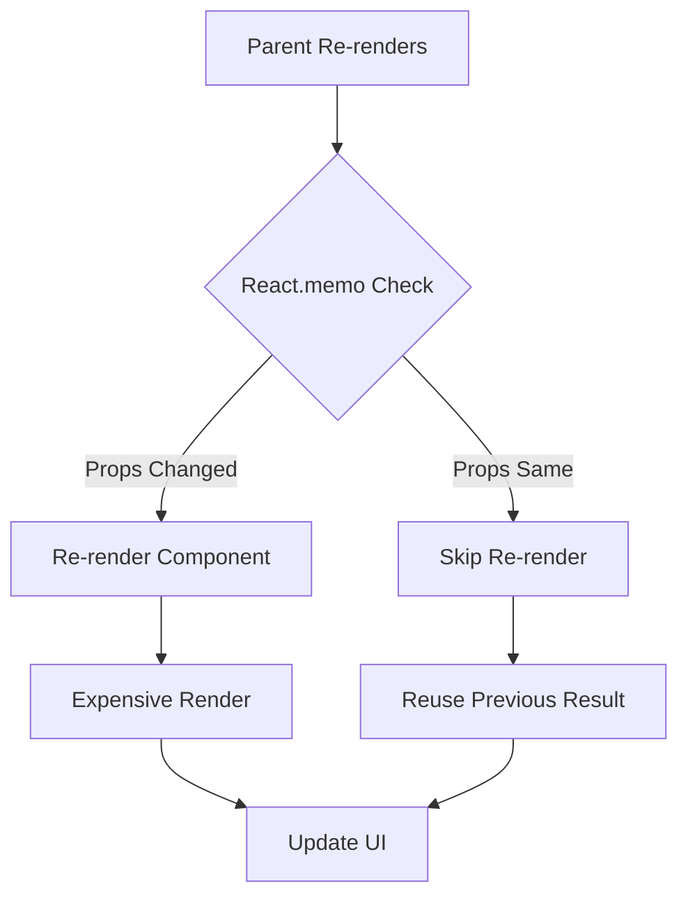

# Topic 37: React.memo - Component Memoization

[← Previous: Performance Basics](./36_performance_basics.md) | [Back to Main](../README.md) | [Next: Memoization Deep Dive →](./38_memoization_deep.md)

---

## Table of Contents

1. [Overview](#overview)
2. [What is React.memo?](#what-is-reactmemo)
3. [Basic Usage](#basic-usage)
4. [Custom Comparison](#custom-comparison)
5. [When to Use React.memo](#when-to-use-reactmemo)
6. [Common Pitfalls](#common-pitfalls)
7. [React.memo with Hooks](#reactmemo-with-hooks)
8. [TypeScript with React.memo](#typescript-with-reactmemo)
9. [Performance Impact](#performance-impact)
10. [Best Practices](#best-practices)

---

## Overview

**React.memo** is a higher-order component that memoizes a component, preventing re-renders when props haven't changed. It's React's built-in performance optimization for components.

**What You'll Learn:**
- What React.memo is and how it works
- When to use React.memo
- Custom comparison functions
- Common pitfalls (prop references)
- Performance impact measurement
- Integration with Hooks
- TypeScript patterns

**Prerequisites:**
- Understanding of re-renders
- Reference equality concept
- useMemo and useCallback basics

**Version Coverage:**
- React 16.6+ (React.memo introduction)
- React 19 (Compiler reduces need)
- React 19.2

---

## What is React.memo?

### Core Concept

React.memo wraps a component and **prevents re-renders** if props haven't changed (shallow comparison).

```tsx
// Without React.memo
function ExpensiveComponent({ data }) {
  console.log('Rendering ExpensiveComponent');
  
  return <div>{/* Expensive rendering */}</div>;
}

// Parent re-renders → ExpensiveComponent always re-renders

// With React.memo
const ExpensiveComponent = React.memo(function ExpensiveComponent({ data }) {
  console.log('Rendering ExpensiveComponent');
  
  return <div>{/* Expensive rendering */}</div>;
});

// Parent re-renders → ExpensiveComponent only re-renders if data changed
```

### How It Works



---

## Basic Usage

### Simple Memoization

```tsx
// Component without memo
function UserCard({ user }) {
  return (
    <div>
      <h2>{user.name}</h2>
      <p>{user.email}</p>
    </div>
  );
}

// Memoized version
const MemoizedUserCard = React.memo(UserCard);

// Or inline
const UserCard = React.memo(function UserCard({ user }) {
  return (
    <div>
      <h2>{user.name}</h2>
      <p>{user.email}</p>
    </div>
  );
});

// Usage
function Parent() {
  const [count, setCount] = useState(0);
  
  return (
    <>
      <button onClick={() => setCount(count + 1)}>Count: {count}</button>
      <MemoizedUserCard user={user} />  {/* Doesn't re-render! */}
    </>
  );
}
```

---

## Custom Comparison

### arePropsEqual Function

```tsx
// Default: Shallow comparison
const MemoizedComponent = React.memo(Component);

// Custom: Deep comparison
const MemoizedComponent = React.memo(
  Component,
  (prevProps, nextProps) => {
    // Return true if props are equal (skip re-render)
    // Return false if props are different (re-render)
    return prevProps.user.id === nextProps.user.id;
  }
);

// Example: Compare specific fields
const UserCard = React.memo(
  function UserCard({ user }) {
    return <div>{user.name}</div>;
  },
  (prevProps, nextProps) => {
    // Only re-render if ID changes
    return prevProps.user.id === nextProps.user.id;
  }
);
```

---

## When to Use React.memo

### Good Use Cases

```tsx
// ✅ 1. Expensive rendering
const ExpensiveChart = React.memo(function ExpensiveChart({ data }) {
  // Complex D3 visualization
  // Takes 100ms to render
  return <svg>{/* Complex rendering */}</svg>;
});

// ✅ 2. Large lists
function List({ items }) {
  return (
    <>
      {items.map(item => (
        <MemoizedItem key={item.id} item={item} />
      ))}
    </>
  );
}

const MemoizedItem = React.memo(Item);

// ✅ 3. Pure presentational components
const Button = React.memo(function Button({ label, onClick }) {
  return <button onClick={onClick}>{label}</button>;
});
```

### When NOT to Use

```tsx
// ❌ 1. Props change frequently
function Timer({ time }) {
  return <div>{time}</div>;
}
// time changes every second, memo is useless

// ❌ 2. Fast rendering components
const Simple = React.memo(function Simple({ text }) {
  return <span>{text}</span>;  // <1ms to render
});
// Memo overhead > render time

// ❌ 3. Always re-renders anyway
function Parent() {
  const [count, setCount] = useState(0);
  
  const data = { count };  // New object every render!
  
  return <MemoizedChild data={data} />;  // Props always "different"
}
```

---

## Common Pitfalls

### Pitfall 1: Inline Objects/Arrays

```tsx
// ❌ Memo doesn't help (new object every render)
const MemoizedChild = React.memo(Child);

function Parent() {
  return <MemoizedChild config={{ api: '/api' }} />;  // New object!
}

// ✅ Memoize the object
function Parent() {
  const config = useMemo(() => ({ api: '/api' }), []);
  return <MemoizedChild config={config} />;
}

// ✅ Or move outside
const config = { api: '/api' };
function Parent() {
  return <MemoizedChild config={config} />;
}
```

### Pitfall 2: Inline Functions

```tsx
// ❌ Memo doesn't help (new function every render)
const MemoizedChild = React.memo(Child);

function Parent() {
  return <MemoizedChild onClick={() => console.log('click')} />;
}

// ✅ Use useCallback
function Parent() {
  const handleClick = useCallback(() => console.log('click'), []);
  return <MemoizedChild onClick={handleClick} />;
}
```

### Pitfall 3: Children Prop

```tsx
// ❌ Children prop breaks memo
const MemoizedCard = React.memo(Card);

function Parent() {
  return (
    <MemoizedCard>
      <div>Content</div>  {/* New element every render! */}
    </MemoizedCard>
  );
}

// ✅ Memoize children or extract
const cardContent = <div>Content</div>;

function Parent() {
  return <MemoizedCard>{cardContent}</MemoizedCard>;
}
```

---

## React.memo with Hooks

### Combining with useMemo/useCallback

```tsx
// Proper memoization chain
function Parent() {
  const [count, setCount] = useState(0);
  
  // Memoize data
  const data = useMemo(() => ({
    id: 1,
    name: 'Alice'
  }), []);
  
  // Memoize callback
  const handleClick = useCallback(() => {
    console.log('Clicked');
  }, []);
  
  return (
    <>
      <button onClick={() => setCount(count + 1)}>Count: {count}</button>
      <MemoizedChild data={data} onClick={handleClick} />
    </>
  );
}

const MemoizedChild = React.memo(function Child({ data, onClick }) {
  console.log('Child rendering');
  return <div onClick={onClick}>{data.name}</div>;
});

// Child doesn't re-render when count changes!
```

---

## TypeScript with React.memo

### Typed Components

```tsx
interface Props {
  name: string;
  age: number;
  onUpdate?: () => void;
}

// Type inference
const MemoizedComponent = React.memo(function Component({ name, age, onUpdate }: Props) {
  return <div>{name} is {age}</div>;
});

// Explicit typing
const MemoizedComponent: React.MememoizedComponent<Props> = React.memo(
  function Component({ name, age }) {
    return <div>{name} is {age}</div>;
  }
);
```

### Custom Comparison with Types

```tsx
interface UserProps {
  user: {
    id: number;
    name: string;
    email: string;
  };
}

const UserCard = React.memo<UserProps>(
  function UserCard({ user }) {
    return <div>{user.name}</div>;
  },
  (prevProps, nextProps) => {
    // TypeScript knows props structure
    return prevProps.user.id === nextProps.user.id;
  }
);
```

---

## Performance Impact

### Measuring Impact

```tsx
// Measure with Profiler
import { Profiler } from 'react';

function App() {
  return (
    <>
      <Profiler id="Without-Memo" onRender={logTime}>
        <RegularComponent />
      </Profiler>
      
      <Profiler id="With-Memo" onRender={logTime}>
        <MemoizedComponent />
      </Profiler>
    </>
  );
}

function logTime(id, phase, actualDuration) {
  console.log(`${id} took ${actualDuration}ms`);
}
```

---

## Best Practices

### 1. Don't Memoize Everything

```tsx
// ❌ Over-memoization
const A = React.memo(ComponentA);
const B = React.memo(ComponentB);
const C = React.memo(ComponentC);
// Every component memoized = overhead everywhere

// ✅ Selective memoization
function App() {
  return (
    <>
      <Header />  {/* Fast, no memo needed */}
      <MemoizedExpensiveList />  {/* Slow, memo helps */}
      <Footer />  {/* Fast, no memo needed */}
    </>
  );
}
```

### 2. Ensure Props are Stable

```tsx
// ✅ Complete optimization
function Parent() {
  // Stable props
  const data = useMemo(() => ({ id: 1 }), []);
  const handler = useCallback(() => {}, []);
  
  return <MemoizedChild data={data} onClick={handler} />;
}

const MemoizedChild = React.memo(Child);
```

### 3. Profile Before and After

```tsx
// ✅ Verify optimization helps
// 1. Measure without React.memo
// 2. Add React.memo
// 3. Measure again
// 4. Compare results

// If no improvement or worse, remove memo
```

---

## Higher-Order Thinking FAQs

### 1. Why does React.memo use shallow comparison by default instead of deep comparison?

**Deep Answer:**

Shallow comparison is a **performance tradeoff** - fast but limited vs slow but thorough.

**Shallow vs Deep:**

```tsx
// Shallow (React.memo default)
prevProps.user === nextProps.user  // Reference equality
// Fast: O(1) comparison
// Limited: Doesn't check object contents

// Deep (would be expensive)
JSON.stringify(prevProps.user) === JSON.stringify(nextProps.user)
// Slow: O(n) where n = object size
// Thorough: Checks all properties

// Or recursive deep equal
function deepEqual(obj1, obj2) {
  // Must traverse entire object tree
  // Very expensive!
}
```

**Why Shallow is Default:**

```tsx
// The irony: Deep comparison could be slower than re-rendering!

// Example:
const user = {
  id: 1,
  name: 'Alice',
  profile: {
    bio: 'Long bio...',
    settings: {
      // ... deeply nested
    }
  }
};

// Deep comparison:
// - Traverse entire object
// - Compare every property
// - For complex objects: 5-10ms

// Component re-render:
// - Simple UI: 1-2ms

// Deep comparison is SLOWER than just re-rendering!
```

**When Custom Comparison Helps:**

```tsx
// ✅ Compare only what matters
const UserCard = React.memo(
  function UserCard({ user }) {
    return <div>{user.name}</div>;
  },
  (prev, next) => {
    // Only compare ID (fast)
    return prev.user.id === next.user.id;
  }
);

// Faster than deep comparison
// More accurate than shallow comparison
```

**Deep Implication:**

React's default (shallow) is the **80/20 solution** - handles 80% of cases efficiently. For the 20% that need custom logic, you can provide your own comparison. This is React's pattern: good defaults, escape hatches for power users.

### 2. Can React.memo cause bugs, and how do you avoid them?

**Deep Answer:**

React.memo can cause **stale UI bugs** if used incorrectly with mutable data or missing dependencies.

**Bug 1: Mutating Props:**

```tsx
const Item = React.memo(function Item({ item }) {
  return <div>{item.name} - {item.count}</div>;
});

function Parent() {
  const [items, setItems] = useState([{ id: 1, name: 'A', count: 0 }]);
  
  const increment = () => {
    // ❌ Mutate object
    items[0].count++;
    setItems(items);  // Same array reference!
  };
  
  return (
    <>
      <button onClick={increment}>Increment</button>
      <Item item={items[0]} />  {/* Doesn't re-render! item ref same */}
    </>
  );
}

// Fix: Immutable updates
const increment = () => {
  setItems(prev => [
    { ...prev[0], count: prev[0].count + 1 }  // New object
  ]);
};
```

**Bug 2: Stale Callbacks:**

```tsx
const Child = React.memo(function Child({ onClick }) {
  return <button onClick={onClick}>Click</button>;
});

function Parent() {
  const [count, setCount] = useState(0);
  
  const handleClick = () => {
    console.log(count);  // Captures count from closure
  };
  
  return <Child onClick={handleClick} />;
}

// If handleClick isn't memoized:
// - New function every render
// - Child re-renders every time
// - React.memo is useless!

// Fix: useCallback
const handleClick = useCallback(() => {
  console.log(count);
}, [count]);
```

**Bug 3: Missing Comparison Logic:**

```tsx
const Component = React.memo(
  function Component({ config }) {
    return <div>{config.value}</div>;
  },
  (prev, next) => {
    // ❌ Wrong comparison
    return prev.config === next.config;  // Still reference equality!
    
    // ✅ Should be:
    return prev.config.value === next.config.value;
  }
);
```

**Deep Implication:**

React.memo is **safe by default** (shallow comparison won't skip when it shouldn't) but can be **misused**. Bugs come from breaking React's immutability contract (mutating objects) or misunderstanding reference equality (thinking React.memo does deep comparison). The lesson: React.memo doesn't change how you should write React code (immutable updates), it just optimizes it.

### 3. How does React.memo interact with React Compiler, and will the Compiler make React.memo unnecessary?

**Deep Answer:**

React Compiler **often eliminates the need** for React.memo, but not always.

**Compiler's Approach:**

```tsx
// Without Compiler: Manual memo
const Item = React.memo(function Item({ data }) {
  return <div>{data.name}</div>;
});

// With Compiler: Automatic
function Item({ data }) {
  return <div>{data.name}</div>;
}

// Compiler analyzes:
// - Component is "pure" (same props → same output)
// - Automatically memoizes
// - No React.memo needed!
```

**When React.memo Still Needed:**

```tsx
// 1. Custom comparison logic
const Component = React.memo(
  MyComponent,
  (prev, next) => {
    // Custom logic compiler can't infer
    return complexComparison(prev, next);
  }
);

// 2. Explicit opt-in for important components
const CriticalComponent = React.memo(MyComponent);
// Make optimization explicit in code

// 3. Pre-Compiler codebases
// If not using Compiler yet, React.memo still needed
```

**Compiler Limitations:**

```tsx
// Compiler can't optimize everything

// 1. Side effects (not pure)
function Component({ id }) {
  analytics.track(id);  // Side effect!
  return <div>{id}</div>;
}
// Not pure, compiler can't memo safely

// 2. Refs (mutable)
function Component({ id }) {
  const ref = useRef(0);
  ref.current = id;  // Mutation!
  return <div>{ref.current}</div>;
}
// Uses mutable ref, compiler cautious

// 3. Dynamic children
function Component({ children }) {
  return <div>{children}</div>;
}
// children might be different, compiler can't assume
```

**Deep Implication:**

React Compiler makes React.memo **mostly unnecessary** but not obsolete. Compiler handles the common case (pure components), React.memo handles edge cases (custom comparison, explicit control). This division of labor is React's evolution: automatic for most, manual for exceptions.

---

## Senior SDE Interview Questions

### Question 1: React.memo Strategy

**Question:** "You have a list of 1000 product cards. Each card is expensive to render. Walk through your optimization strategy using React.memo."

**Key Concepts Being Tested:**
- React.memo usage
- Prop stability understanding
- Performance measurement
- Complete optimization approach

**Expected Answer Should Cover:**

1. **Measure First:**
```tsx
// Profile to confirm cards are actually slow
// If each card renders in <5ms, maybe optimization not needed
```

2. **Memoize Component:**
```tsx
const ProductCard = React.memo(function ProductCard({ product, onAddToCart }) {
  // Expensive rendering
  return <div>{/* Complex card UI */}</div>;
});
```

3. **Ensure Stable Props:**
```tsx
function ProductList({ products }) {
  // ✅ Stable callback
  const handleAddToCart = useCallback((productId) => {
    addToCart(productId);
  }, []);
  
  return (
    <>
      {products.map(product => (
        <ProductCard
          key={product.id}
          product={product}
          onAddToCart={handleAddToCart}
        />
      ))}
    </>
  );
}
```

4. **Verify Improvement:**
```tsx
// Use Profiler to confirm:
// - Cards don't re-render when list scrolls
// - Cards only re-render when product data changes
```

**Follow-ups:**
1. "What if products array changes frequently?"
2. "How do you handle card selection state?"
3. "Would virtualization be better than memo?"

**Red Flags:**
- Just adding React.memo without measuring
- Not handling callback stability
- Missing verification

**Green Flags:**
- Measures before and after
- Ensures prop stability
- Considers alternatives (virtualization)
- Verifies optimization works

---

[← Previous: Performance Basics](./36_performance_basics.md) | [Back to Main](../README.md) | [Next: Memoization Deep Dive →](./38_memoization_deep.md)

---

**Progress**: Topic 37/220 completed | Part IV: Performance (22% complete)
