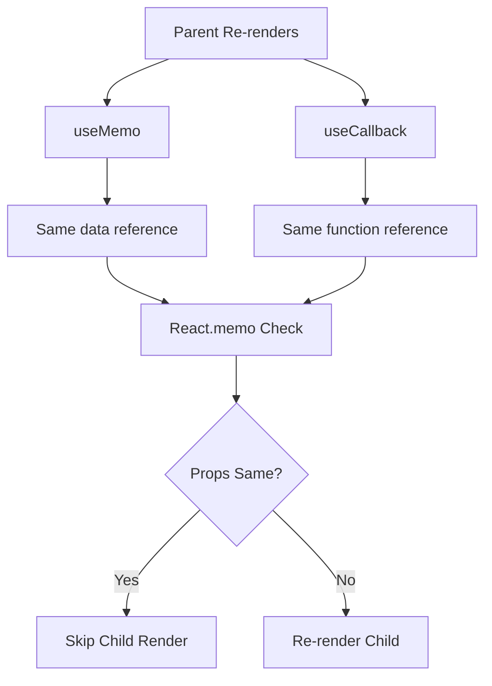

# Topic 38: Memoization Deep Dive - useMemo & useCallback

[← Previous: React.memo](./37_react_memo.md) | [Back to Main](../README.md) | [Next: Code Splitting →](./39_code_splitting.md)

---

## Table of Contents

1. [Overview](#overview)
2. [Complete Memoization Strategy](#complete-memoization-strategy)
3. [When Each Tool Applies](#when-each-tool-applies)
4. [Reference Equality Deep Dive](#reference-equality-deep-dive)
5. [Memoization Patterns](#memoization-patterns)
6. [Common Mistakes](#common-mistakes)
7. [Performance Tradeoffs](#performance-tradeoffs)
8. [React Compiler Impact](#react-compiler-impact)
9. [Real-World Examples](#real-world-examples)
10. [Decision Framework](#decision-framework)

---

## Overview

Understanding **when and how** to use React.memo, useMemo, and useCallback together is crucial for React performance optimization. This topic provides a comprehensive guide to memoization strategies.

**What You'll Learn:**
- Complete memoization strategy
- When to use each tool (React.memo, useMemo, useCallback)
- Reference equality mastery
- Common memoization patterns
- Performance tradeoffs
- React Compiler's impact
- Real-world optimization examples

**Prerequisites:**
- React.memo understanding
- useMemo and useCallback basics
- Reference equality concept

**Version Coverage:**
- React 16.6+ (React.memo)
- React 16.8+ (Hooks)
- React 19 (Compiler)
- React 19.2

---

## Complete Memoization Strategy

### The Three Tools

```tsx
// React.memo: Memoize component
const MemoizedComponent = React.memo(Component);

// useMemo: Memoize value
const memoizedValue = useMemo(() => computeValue(), [deps]);

// useCallback: Memoize function
const memoizedFn = useCallback(() => doSomething(), [deps]);
```

### When to Use Each

| Tool | Use For | Example |
|------|---------|---------|
| **React.memo** | Prevent component re-renders | `React.memo(ExpensiveComponent)` |
| **useMemo** | Cache expensive calculations | `useMemo(() => sort(items), [items])` |
| **useCallback** | Cache function references | `useCallback(() => onClick(), [])` |

### Complete Example

```tsx
// Parent component
function ProductList({ products }) {
  // 1. useMemo: Cache filtered/sorted data
  const processedProducts = useMemo(() => {
    return products
      .filter(p => p.inStock)
      .sort((a, b) => a.price - b.price);
  }, [products]);
  
  // 2. useCallback: Cache event handler
  const handleAddToCart = useCallback((productId) => {
    addToCart(productId);
  }, []);
  
  return (
    <div>
      {processedProducts.map(product => (
        // 3. React.memo: Prevent card re-renders
        <MemoizedProductCard
          key={product.id}
          product={product}
          onAddToCart={handleAddToCart}
        />
      ))}
    </div>
  );
}

// Memoized component
const MemoizedProductCard = React.memo(function ProductCard({ 
  product, 
  onAddToCart 
}) {
  return (
    <div>
      <h3>{product.name}</h3>
      <p>${product.price}</p>
      <button onClick={() => onAddToCart(product.id)}>
        Add to Cart
      </button>
    </div>
  );
});
```

---

## Reference Equality Deep Dive

### The Core Problem

```tsx
// Primitive values: Same value = same reference
1 === 1  // true
'hello' === 'hello'  // true

// Objects/Arrays: Same content ≠ same reference
{ id: 1 } === { id: 1 }  // false!
[1, 2, 3] === [1, 2, 3]  // false!

// Functions: Always different
const fn1 = () => {};
const fn2 = () => {};
fn1 === fn2  // false
```

### Impact on React

```tsx
function Parent() {
  // New object every render
  const config = { api: '/api' };  // Different reference each time
  
  return <MemoizedChild config={config} />;
  // props.config !== prevProps.config
  // Child re-renders even with React.memo!
}

// Solutions:
// 1. Move outside (if static)
const config = { api: '/api' };

// 2. useMemo (if dynamic)
const config = useMemo(() => ({ api: '/api' }), []);

// 3. Use primitives
<MemoizedChild apiUrl="/api" timeout={5000} />
```

---

## Memoization Patterns

### Pattern 1: Expensive List Processing

```tsx
function ProductCatalog({ products, category, sortBy }) {
  // Memoize expensive filtering & sorting
  const displayProducts = useMemo(() => {
    console.log('Processing products...');
    
    return products
      .filter(p => p.category === category)
      .sort((a, b) => {
        if (sortBy === 'price') return a.price - b.price;
        if (sortBy === 'name') return a.name.localeCompare(b.name);
        return 0;
      });
  }, [products, category, sortBy]);
  
  // Memoize callback
  const handleSelect = useCallback((productId) => {
    console.log('Selected:', productId);
  }, []);
  
  return (
    <>
      {displayProducts.map(product => (
        <MemoizedProductCard
          key={product.id}
          product={product}
          onSelect={handleSelect}
        />
      ))}
    </>
  );
}

const MemoizedProductCard = React.memo(ProductCard);
```

### Pattern 2: Context with Memoization

```tsx
// Split context for better performance
const UserContext = createContext(null);
const UserActionsContext = createContext(null);

function UserProvider({ children }) {
  const [user, setUser] = useState(null);
  
  // Memoize actions (never change)
  const actions = useMemo(() => ({
    updateUser: (data) => setUser(data),
    logout: () => setUser(null)
  }), []);
  
  return (
    <UserContext.Provider value={user}>
      <UserActionsContext.Provider value={actions}>
        {children}
      </UserActionsContext.Provider>
    </UserContext.Provider>
  );
}

// Consumers only subscribe to what they need
function UserDisplay() {
  const user = useContext(UserContext);  // Re-renders on user change
  return <div>{user?.name}</div>;
}

function LogoutButton() {
  const { logout } = useContext(UserActionsContext);  // Never re-renders!
  return <button onClick={logout}>Logout</button>;
}
```

---

## Common Mistakes

### Mistake 1: Incomplete Memoization

```tsx
// ❌ Memoized component but unstable props
const MemoizedChild = React.memo(Child);

function Parent() {
  return (
    <MemoizedChild 
      data={{ id: 1 }}  // New object!
      onClick={() => {}}  // New function!
    />
  );
}
// React.memo is useless here!

// ✅ Complete memoization
function Parent() {
  const data = useMemo(() => ({ id: 1 }), []);
  const onClick = useCallback(() => {}, []);
  
  return <MemoizedChild data={data} onClick={onClick} />;
}
```

### Mistake 2: Memoizing Everything

```tsx
// ❌ Over-memoization
function Component({ a, b, c }) {
  const sum = useMemo(() => a + b, [a, b]);  // Overkill!
  const product = useMemo(() => a * b, [a, b]);  // Overkill!
  const greeting = useMemo(() => `Hello ${c}`, [c]);  // Overkill!
  
  // More overhead than benefit
}

// ✅ Selective memoization
function Component({ a, b, c }) {
  const sum = a + b;  // Fast, don't memoize
  const product = a * b;  // Fast, don't memoize
  const greeting = `Hello ${c}`;  // Fast, don't memoize
  
  // Only memoize truly expensive operations
  const analyzed = useMemo(() => expensiveAnalysis(a, b, c), [a, b, c]);
}
```

---

## Performance Tradeoffs

### Cost-Benefit Analysis

```tsx
// Each optimization has cost:

// React.memo cost:
// - Shallow props comparison
// - Memory for previous props
// - Function wrapper overhead

// useMemo cost:
// - Function call
// - Dependency comparison
// - Memory for cached value

// useCallback cost:
// - Function call
// - Dependency comparison  
// - Memory for function

// Use when: Benefit > Cost
```

---

## React Compiler Impact

### Before Compiler

```tsx
// Manual optimization
function Component({ items, filter }) {
  const filtered = useMemo(() => 
    items.filter(i => i.type === filter),
    [items, filter]
  );
  
  const handleClick = useCallback((id) => {
    console.log(id);
  }, []);
  
  return (
    <>
      {filtered.map(item => (
        <MemoizedItem key={item.id} onClick={handleClick} />
      ))}
    </>
  );
}

const MemoizedItem = React.memo(Item);
```

### With Compiler

```tsx
// Automatic!
function Component({ items, filter }) {
  const filtered = items.filter(i => i.type === filter);
  const handleClick = (id) => console.log(id);
  
  return (
    <>
      {filtered.map(item => (
        <Item key={item.id} onClick={handleClick} />
      ))}
    </>
  );
}
```

---

## Decision Framework

### Optimization Checklist

```tsx
// Ask these questions:

// 1. Is component slow? (>10ms render)
// YES → Consider React.memo
// NO → Skip

// 2. Is computation expensive? (>5ms)
// YES → Consider useMemo
// NO → Skip

// 3. Is function passed to memoized child?
// YES → Consider useCallback
// NO → Skip

// 4. Does profiling show improvement?
// YES → Keep optimization
// NO → Remove (adds complexity)
```

---

## Higher-Order Thinking FAQs

### 1. Why must useMemo, useCallback, and React.memo work together, and what happens if you only use one?

**Deep Answer:**

Memoization is a **chain** - breaking any link breaks the whole chain.

**Incomplete Chain:**

```tsx
// ❌ React.memo alone (doesn't help)
const Child = React.memo(function Child({ data, onClick }) {
  return <div onClick={onClick}>{data.name}</div>;
});

function Parent() {
  return (
    <Child
      data={{ id: 1, name: 'Alice' }}  // New object!
      onClick={() => console.log('click')}  // New function!
    />
  );
}
// Child re-renders every time despite React.memo

// ✅ Complete chain
function Parent() {
  const data = useMemo(() => ({ id: 1, name: 'Alice' }), []);
  const onClick = useCallback(() => console.log('click'), []);
  
  return <Child data={data} onClick={onClick} />;
}
// Now Child truly memoized
```

**Why All Three:**



**Deep Implication:**

Memoization is **all-or-nothing**. One unstable prop ruins the whole optimization. This is why React Compiler is valuable - it handles the entire chain automatically. Manual memoization is error-prone because you must remember all three tools.

---

[← Previous: React.memo](./37_react_memo.md) | [Back to Main](../README.md) | [Next: Code Splitting →](./39_code_splitting.md)

---

**Progress**: Topic 38/220 completed | Part IV: Performance (33% complete)
