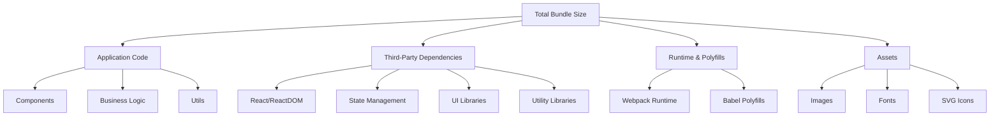
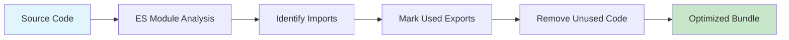
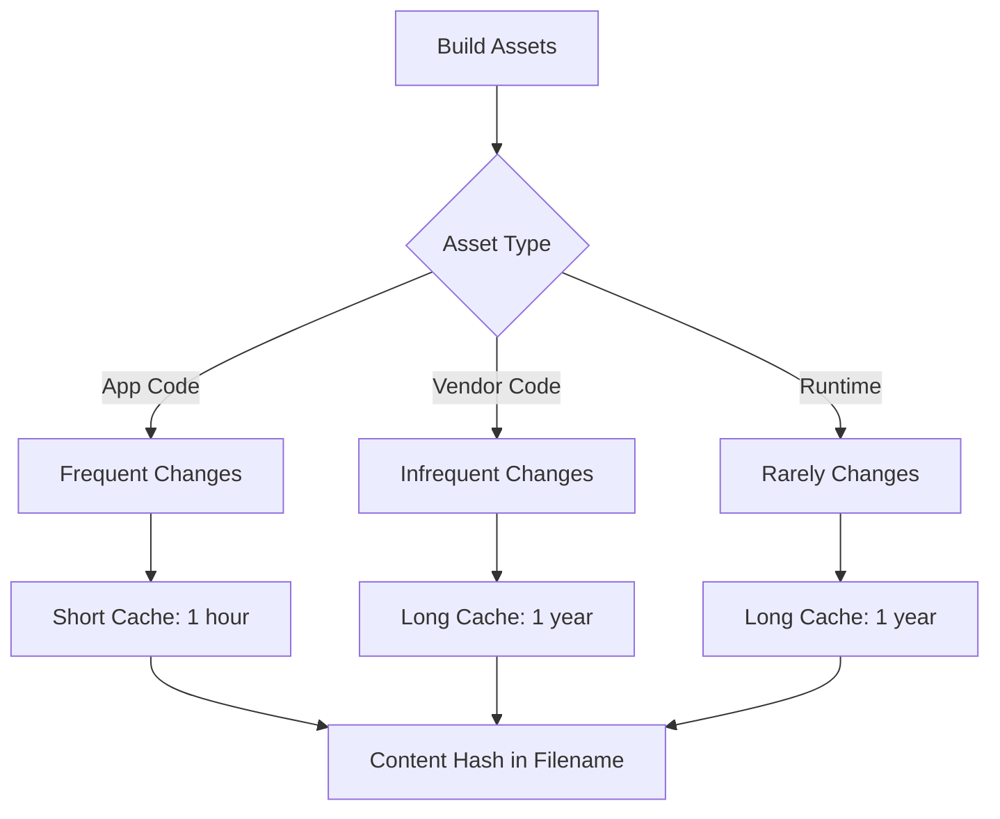

# Topic 43: Bundle Optimization - Production-Ready Asset Management

## Overview

Bundle optimization is critical for delivering fast, efficient React applications. This comprehensive guide covers tree shaking, code splitting, compression, analysis tools, and advanced optimization techniques that reduce bundle size and improve load times in production.

**What You'll Master:**
- Bundle analysis and visualization techniques
- Tree shaking and dead code elimination
- Webpack and Vite optimization strategies
- Compression and minification techniques
- Dynamic imports and lazy loading
- Asset optimization (images, fonts, CSS)
- Production build configuration
- Performance budgets and monitoring

## 1. Understanding Bundle Anatomy

### 1.1 What Gets Bundled

Modern JavaScript bundlers combine multiple files into optimized bundles:

```typescript
// Source Structure
src/
├── index.tsx           // Entry point
├── App.tsx            // Main component
├── components/        // UI components
├── utils/            // Helper functions
├── hooks/            // Custom hooks
└── assets/           // Images, fonts, styles

// Build Output
dist/
├── index.html
├── assets/
│   ├── index-abc123.js      // Main bundle
│   ├── vendor-def456.js     // Third-party code
│   ├── styles-ghi789.css    // CSS bundle
│   └── images/              // Optimized images
```

### 1.2 Bundle Size Components



## 2. Bundle Analysis Tools

### 2.1 Webpack Bundle Analyzer

**Installation & Configuration:**

```bash
npm install --save-dev webpack-bundle-analyzer
```

```typescript
// webpack.config.js
import { BundleAnalyzerPlugin } from 'webpack-bundle-analyzer';

export default {
  plugins: [
    new BundleAnalyzerPlugin({
      analyzerMode: 'static',
      reportFilename: 'bundle-report.html',
      openAnalyzer: false,
      generateStatsFile: true,
      statsFilename: 'bundle-stats.json',
    }),
  ],
};
```

**Complete Analysis Example:**

```typescript
// analyze-bundle.ts
import { readFileSync } from 'fs';
import path from 'path';

interface BundleStats {
  name: string;
  size: number;
  parsedSize: number;
  gzipSize: number;
  modules: ModuleStats[];
}

interface ModuleStats {
  name: string;
  size: number;
  reasons: string[];
}

class BundleAnalyzer {
  private stats: BundleStats;
  private sizeThreshold = 244 * 1024; // 244KB warning threshold

  constructor(statsPath: string) {
    const data = readFileSync(statsPath, 'utf-8');
    this.stats = JSON.parse(data);
  }

  // Identify large dependencies
  findLargeDependencies(minSize: number = 50 * 1024): ModuleStats[] {
    return this.stats.modules
      .filter(module => module.size > minSize)
      .sort((a, b) => b.size - a.size);
  }

  // Find duplicate dependencies
  findDuplicates(): Map<string, ModuleStats[]> {
    const duplicates = new Map<string, ModuleStats[]>();
    
    this.stats.modules.forEach(module => {
      const baseName = this.extractPackageName(module.name);
      if (!duplicates.has(baseName)) {
        duplicates.set(baseName, []);
      }
      duplicates.get(baseName)!.push(module);
    });

    // Filter to only actual duplicates
    return new Map(
      Array.from(duplicates.entries())
        .filter(([_, modules]) => modules.length > 1)
    );
  }

  // Calculate tree-shakeable opportunities
  calculateTreeShakeOpportunity(): {
    totalSize: number;
    unusedSize: number;
    percentage: number;
  } {
    const unusedModules = this.stats.modules.filter(
      module => module.reasons.length === 0
    );

    const unusedSize = unusedModules.reduce(
      (sum, module) => sum + module.size,
      0
    );

    return {
      totalSize: this.stats.size,
      unusedSize,
      percentage: (unusedSize / this.stats.size) * 100,
    };
  }

  // Generate optimization recommendations
  generateRecommendations(): string[] {
    const recommendations: string[] = [];

    // Check total bundle size
    if (this.stats.parsedSize > this.sizeThreshold) {
      recommendations.push(
        `⚠️ Bundle size (${this.formatSize(this.stats.parsedSize)}) ` +
        `exceeds recommended ${this.formatSize(this.sizeThreshold)}`
      );
    }

    // Check for large dependencies
    const largeDeps = this.findLargeDependencies();
    if (largeDeps.length > 0) {
      recommendations.push(
        `📦 ${largeDeps.length} large dependencies found. ` +
        `Consider lazy loading or finding lighter alternatives.`
      );
      largeDeps.slice(0, 3).forEach(dep => {
        recommendations.push(
          `  - ${dep.name}: ${this.formatSize(dep.size)}`
        );
      });
    }

    // Check for duplicates
    const duplicates = this.findDuplicates();
    if (duplicates.size > 0) {
      recommendations.push(
        `🔄 ${duplicates.size} duplicate dependencies detected. ` +
        `Use webpack's resolve.alias or dedupe plugin.`
      );
    }

    // Check tree-shake opportunity
    const treeShake = this.calculateTreeShakeOpportunity();
    if (treeShake.percentage > 5) {
      recommendations.push(
        `🌳 ${treeShake.percentage.toFixed(1)}% of bundle may be ` +
        `tree-shakeable (${this.formatSize(treeShake.unusedSize)})`
      );
    }

    return recommendations;
  }

  private extractPackageName(modulePath: string): string {
    const match = modulePath.match(/node_modules\/(@?[^/]+(?:\/[^/]+)?)/);
    return match ? match[1] : modulePath;
  }

  private formatSize(bytes: number): string {
    if (bytes < 1024) return `${bytes}B`;
    if (bytes < 1024 * 1024) return `${(bytes / 1024).toFixed(2)}KB`;
    return `${(bytes / (1024 * 1024)).toFixed(2)}MB`;
  }

  // Generate detailed report
  generateReport(): void {
    console.log('\n📊 Bundle Analysis Report\n');
    console.log(`Total Size: ${this.formatSize(this.stats.parsedSize)}`);
    console.log(`Gzipped: ${this.formatSize(this.stats.gzipSize)}`);
    console.log(`Modules: ${this.stats.modules.length}\n`);

    const recommendations = this.generateRecommendations();
    if (recommendations.length > 0) {
      console.log('🎯 Recommendations:\n');
      recommendations.forEach(rec => console.log(rec));
    } else {
      console.log('✅ Bundle is well optimized!');
    }
  }
}

// Usage
const analyzer = new BundleAnalyzer('./dist/bundle-stats.json');
analyzer.generateReport();
```

### 2.2 Vite Bundle Analysis

```typescript
// vite.config.ts
import { defineConfig } from 'vite';
import react from '@vitejs/plugin-react';
import { visualizer } from 'rollup-plugin-visualizer';

export default defineConfig({
  plugins: [
    react(),
    visualizer({
      open: true,
      gzipSize: true,
      brotliSize: true,
      filename: 'dist/stats.html',
    }),
  ],
  build: {
    rollupOptions: {
      output: {
        manualChunks: {
          vendor: ['react', 'react-dom'],
          router: ['react-router-dom'],
          ui: ['@mui/material', '@emotion/react', '@emotion/styled'],
        },
      },
    },
  },
});
```

## 3. Tree Shaking

### 3.1 How Tree Shaking Works



### 3.2 Writing Tree-Shakeable Code

**Example: Utils Library**

```typescript
// ❌ BAD: Not tree-shakeable
// utils/index.ts
export default {
  formatDate: (date: Date) => date.toISOString(),
  formatCurrency: (amount: number) => `$${amount.toFixed(2)}`,
  formatPercentage: (value: number) => `${(value * 100).toFixed(2)}%`,
  // ... 50 more utility functions
};

// ✅ GOOD: Tree-shakeable
// utils/date.ts
export const formatDate = (date: Date): string => {
  return date.toISOString();
};

export const formatDateTime = (date: Date): string => {
  return date.toLocaleString();
};

// utils/currency.ts
export const formatCurrency = (amount: number, currency = 'USD'): string => {
  return new Intl.NumberFormat('en-US', {
    style: 'currency',
    currency,
  }).format(amount);
};

// utils/index.ts - Barrel exports (still tree-shakeable)
export * from './date';
export * from './currency';
export * from './number';
```

**Component Library Optimization:**

```typescript
// ❌ BAD: Imports entire library
import { Button } from 'component-library'; // 500KB

// ✅ GOOD: Imports specific component
import Button from 'component-library/Button'; // 5KB

// ✅ BETTER: Library supports tree shaking
import { Button } from 'component-library'; // Only Button code included
```

### 3.3 Configuring Tree Shaking

**TypeScript Configuration:**

```json
// tsconfig.json
{
  "compilerOptions": {
    "module": "ES2020",
    "moduleResolution": "node",
    "esModuleInterop": true,
    "allowSyntheticDefaultImports": true,
    "target": "ES2019",
    "lib": ["ES2020", "DOM", "DOM.Iterable"],
    "jsx": "react-jsx",
    "declaration": true,
    "declarationMap": true,
    "sourceMap": true,
    "removeComments": false,
    "preserveConstEnums": false,
    "importHelpers": true
  }
}
```

**Package.json Configuration:**

```json
{
  "name": "my-library",
  "version": "1.0.0",
  "sideEffects": false,
  "main": "./dist/index.js",
  "module": "./dist/index.mjs",
  "types": "./dist/index.d.ts",
  "exports": {
    ".": {
      "import": "./dist/index.mjs",
      "require": "./dist/index.js",
      "types": "./dist/index.d.ts"
    },
    "./components/*": {
      "import": "./dist/components/*.mjs",
      "require": "./dist/components/*.js",
      "types": "./dist/components/*.d.ts"
    }
  }
}
```

## 4. Code Splitting Strategies

### 4.1 Route-Based Splitting

```typescript
// App.tsx
import React, { Suspense, lazy } from 'react';
import { BrowserRouter, Routes, Route } from 'react-router-dom';
import LoadingSpinner from './components/LoadingSpinner';

// Lazy load route components
const Home = lazy(() => import('./pages/Home'));
const Dashboard = lazy(() => import('./pages/Dashboard'));
const Profile = lazy(() => import('./pages/Profile'));
const Settings = lazy(() => import('./pages/Settings'));
const AdminPanel = lazy(() => import('./pages/AdminPanel'));

const App: React.FC = () => {
  return (
    <BrowserRouter>
      <Suspense fallback={<LoadingSpinner />}>
        <Routes>
          <Route path="/" element={<Home />} />
          <Route path="/dashboard" element={<Dashboard />} />
          <Route path="/profile" element={<Profile />} />
          <Route path="/settings" element={<Settings />} />
          <Route path="/admin" element={<AdminPanel />} />
        </Routes>
      </Suspense>
    </BrowserRouter>
  );
};

export default App;
```

### 4.2 Component-Based Splitting

```typescript
// DashboardPage.tsx
import React, { Suspense, lazy, useState } from 'react';

// Heavy components loaded on demand
const HeavyChart = lazy(() => import('./components/HeavyChart'));
const DataTable = lazy(() => import('./components/DataTable'));
const ReportGenerator = lazy(() => import('./components/ReportGenerator'));

interface DashboardPageProps {
  userId: string;
}

const DashboardPage: React.FC<DashboardPageProps> = ({ userId }) => {
  const [activeTab, setActiveTab] = useState<'overview' | 'charts' | 'reports'>('overview');

  return (
    <div className="dashboard">
      <nav>
        <button onClick={() => setActiveTab('overview')}>Overview</button>
        <button onClick={() => setActiveTab('charts')}>Charts</button>
        <button onClick={() => setActiveTab('reports')}>Reports</button>
      </nav>

      <div className="content">
        {activeTab === 'overview' && (
          <div>Quick stats and metrics</div>
        )}

        {activeTab === 'charts' && (
          <Suspense fallback={<div>Loading charts...</div>}>
            <HeavyChart userId={userId} />
          </Suspense>
        )}

        {activeTab === 'reports' && (
          <Suspense fallback={<div>Loading reports...</div>}>
            <ReportGenerator userId={userId} />
          </Suspense>
        )}
      </div>
    </div>
  );
};

export default DashboardPage;
```

### 4.3 Library Splitting

```typescript
// Dynamic import for heavy libraries
import React, { useState } from 'react';

const DocumentEditor: React.FC = () => {
  const [editor, setEditor] = useState<any>(null);

  const loadEditor = async () => {
    // Only load Monaco Editor when needed (3MB+)
    const monaco = await import('monaco-editor');
    const editor = monaco.editor.create(
      document.getElementById('editor')!,
      {
        value: '',
        language: 'typescript',
        theme: 'vs-dark',
      }
    );
    setEditor(editor);
  };

  return (
    <div>
      {!editor ? (
        <button onClick={loadEditor}>Open Editor</button>
      ) : (
        <div id="editor" style={{ height: '600px' }} />
      )}
    </div>
  );
};
```

## 5. Webpack Optimization

### 5.1 Complete Production Configuration

```typescript
// webpack.prod.config.ts
import path from 'path';
import webpack from 'webpack';
import HtmlWebpackPlugin from 'html-webpack-plugin';
import MiniCssExtractPlugin from 'mini-css-extract-plugin';
import CssMinimizerPlugin from 'css-minimizer-webpack-plugin';
import TerserPlugin from 'terser-webpack-plugin';
import CompressionPlugin from 'compression-webpack-plugin';
import { BundleAnalyzerPlugin } from 'webpack-bundle-analyzer';

const config: webpack.Configuration = {
  mode: 'production',
  
  entry: {
    main: './src/index.tsx',
  },

  output: {
    path: path.resolve(__dirname, 'dist'),
    filename: 'assets/js/[name].[contenthash:8].js',
    chunkFilename: 'assets/js/[name].[contenthash:8].chunk.js',
    assetModuleFilename: 'assets/media/[name].[hash][ext]',
    clean: true,
    publicPath: '/',
  },

  resolve: {
    extensions: ['.ts', '.tsx', '.js', '.jsx'],
    alias: {
      '@': path.resolve(__dirname, 'src'),
      '@components': path.resolve(__dirname, 'src/components'),
      '@utils': path.resolve(__dirname, 'src/utils'),
    },
  },

  module: {
    rules: [
      {
        test: /\.(ts|tsx)$/,
        use: {
          loader: 'babel-loader',
          options: {
            presets: [
              ['@babel/preset-env', {
                modules: false,
                useBuiltIns: 'usage',
                corejs: 3,
              }],
              ['@babel/preset-react', {
                runtime: 'automatic',
              }],
              '@babel/preset-typescript',
            ],
            plugins: [
              ['@babel/plugin-transform-runtime', {
                regenerator: true,
              }],
            ],
          },
        },
        exclude: /node_modules/,
      },
      {
        test: /\.css$/,
        use: [
          MiniCssExtractPlugin.loader,
          'css-loader',
          'postcss-loader',
        ],
      },
      {
        test: /\.(png|jpg|jpeg|gif|svg)$/,
        type: 'asset',
        parser: {
          dataUrlCondition: {
            maxSize: 10 * 1024, // 10KB
          },
        },
      },
      {
        test: /\.(woff|woff2|eot|ttf|otf)$/,
        type: 'asset/resource',
      },
    ],
  },

  optimization: {
    minimize: true,
    minimizer: [
      new TerserPlugin({
        terserOptions: {
          parse: {
            ecma: 2020,
          },
          compress: {
            ecma: 5,
            comparisons: false,
            inline: 2,
            drop_console: true,
            drop_debugger: true,
          },
          mangle: {
            safari10: true,
          },
          output: {
            ecma: 5,
            comments: false,
            ascii_only: true,
          },
        },
      }),
      new CssMinimizerPlugin(),
    ],

    splitChunks: {
      chunks: 'all',
      cacheGroups: {
        // React vendor chunk
        react: {
          test: /[\\/]node_modules[\\/](react|react-dom|scheduler)[\\/]/,
          name: 'react-vendor',
          priority: 40,
        },
        // Router vendor chunk
        router: {
          test: /[\\/]node_modules[\\/](react-router|react-router-dom|history)[\\/]/,
          name: 'router-vendor',
          priority: 30,
        },
        // UI library chunk
        ui: {
          test: /[\\/]node_modules[\\/](@mui|@emotion)[\\/]/,
          name: 'ui-vendor',
          priority: 20,
        },
        // Other vendors
        vendors: {
          test: /[\\/]node_modules[\\/]/,
          name: 'vendors',
          priority: 10,
        },
        // Common code
        common: {
          minChunks: 2,
          priority: 5,
          reuseExistingChunk: true,
        },
      },
    },

    runtimeChunk: {
      name: 'runtime',
    },

    moduleIds: 'deterministic',
  },

  plugins: [
    new HtmlWebpackPlugin({
      template: './public/index.html',
      minify: {
        removeComments: true,
        collapseWhitespace: true,
        removeRedundantAttributes: true,
        useShortDoctype: true,
        removeEmptyAttributes: true,
        removeStyleLinkTypeAttributes: true,
        keepClosingSlash: true,
        minifyJS: true,
        minifyCSS: true,
        minifyURLs: true,
      },
    }),

    new MiniCssExtractPlugin({
      filename: 'assets/css/[name].[contenthash:8].css',
      chunkFilename: 'assets/css/[name].[contenthash:8].chunk.css',
    }),

    new CompressionPlugin({
      algorithm: 'gzip',
      test: /\.(js|css|html|svg)$/,
      threshold: 10240,
      minRatio: 0.8,
    }),

    new webpack.DefinePlugin({
      'process.env.NODE_ENV': JSON.stringify('production'),
    }),

    new BundleAnalyzerPlugin({
      analyzerMode: 'static',
      openAnalyzer: false,
      reportFilename: 'bundle-report.html',
    }),
  ],

  performance: {
    maxEntrypointSize: 512000,
    maxAssetSize: 512000,
    hints: 'warning',
  },
};

export default config;
```

## 6. Vite Optimization

### 6.1 Advanced Vite Configuration

```typescript
// vite.config.ts
import { defineConfig, splitVendorChunkPlugin } from 'vite';
import react from '@vitejs/plugin-react';
import { visualizer } from 'rollup-plugin-visualizer';
import { compression } from 'vite-plugin-compression2';
import legacy from '@vitejs/plugin-legacy';

export default defineConfig({
  plugins: [
    react({
      babel: {
        plugins: [
          ['@babel/plugin-transform-react-jsx', { runtime: 'automatic' }],
        ],
      },
    }),

    splitVendorChunkPlugin(),

    compression({
      algorithm: 'gzip',
      exclude: [/\.(br)$/, /\.(gz)$/],
    }),

    compression({
      algorithm: 'brotliCompress',
      exclude: [/\.(br)$/, /\.(gz)$/],
    }),

    legacy({
      targets: ['defaults', 'not IE 11'],
      additionalLegacyPolyfills: ['regenerator-runtime/runtime'],
    }),

    visualizer({
      open: false,
      gzipSize: true,
      brotliSize: true,
      filename: 'dist/stats.html',
    }),
  ],

  build: {
    target: 'es2015',
    minify: 'terser',
    terserOptions: {
      compress: {
        drop_console: true,
        drop_debugger: true,
      },
    },
    cssMinify: true,
    reportCompressedSize: true,
    chunkSizeWarningLimit: 500,

    rollupOptions: {
      output: {
        manualChunks: (id) => {
          if (id.includes('node_modules')) {
            if (id.includes('react') || id.includes('react-dom')) {
              return 'react-vendor';
            }
            if (id.includes('react-router')) {
              return 'router-vendor';
            }
            if (id.includes('@mui') || id.includes('@emotion')) {
              return 'ui-vendor';
            }
            return 'vendor';
          }
        },
        assetFileNames: 'assets/[ext]/[name]-[hash][extname]',
        chunkFileNames: 'assets/js/[name]-[hash].js',
        entryFileNames: 'assets/js/[name]-[hash].js',
      },
    },
  },

  resolve: {
    alias: {
      '@': '/src',
      '@components': '/src/components',
      '@utils': '/src/utils',
      '@hooks': '/src/hooks',
      '@assets': '/src/assets',
    },
  },

  optimizeDeps: {
    include: ['react', 'react-dom', 'react-router-dom'],
  },
});
```

## 7. Asset Optimization

### 7.1 Image Optimization

```typescript
// ImageOptimizer.tsx
import React, { useState, useEffect } from 'react';

interface OptimizedImageProps {
  src: string;
  alt: string;
  width: number;
  height: number;
  className?: string;
}

const OptimizedImage: React.FC<OptimizedImageProps> = ({
  src,
  alt,
  width,
  height,
  className,
}) => {
  const [imageSrc, setImageSrc] = useState<string>('');
  const [isLoading, setIsLoading] = useState(true);

  useEffect(() => {
    const img = new Image();
    img.src = src;
    img.onload = () => {
      setImageSrc(src);
      setIsLoading(false);
    };
  }, [src]);

  return (
    <picture>
      <source
        type="image/webp"
        srcSet={`${src.replace(/\.(jpg|png)$/, '.webp')}`}
      />
      <source
        type="image/avif"
        srcSet={`${src.replace(/\.(jpg|png)$/, '.avif')}`}
      />
      
    </picture>
  );
};

// Usage with responsive images
const ResponsiveImage: React.FC = () => {
  return (
    
  );
};

export default OptimizedImage;
```

### 7.2 Font Optimization

```css
/* Optimized font loading */
@font-face {
  font-family: 'CustomFont';
  src: url('/fonts/custom-font.woff2') format('woff2'),
       url('/fonts/custom-font.woff') format('woff');
  font-weight: 400;
  font-style: normal;
  font-display: swap; /* Critical for performance */
}

/* Preload critical fonts */
/* <link rel="preload" href="/fonts/custom-font.woff2" as="font" type="font/woff2" crossorigin> */
```

### 7.3 SVG Optimization

```typescript
// SVG component with optimization
import React from 'react';

interface IconProps {
  name: string;
  size?: number;
  color?: string;
}

const Icon: React.FC<IconProps> = ({ name, size = 24, color = 'currentColor' }) => {
  // Dynamic SVG import
  const [SvgComponent, setSvgComponent] = useState<React.FC<any> | null>(null);

  useEffect(() => {
    import(`@/assets/icons/${name}.svg?react`)
      .then(module => setSvgComponent(() => module.default))
      .catch(err => console.error('Failed to load icon:', err));
  }, [name]);

  if (!SvgComponent) return null;

  return (
    <SvgComponent
      width={size}
      height={size}
      style={{ color }}
    />
  );
};

export default Icon;
```

## 8. Performance Budgets

### 8.1 Setting Performance Budgets

```typescript
// performance-budget.config.ts
export const performanceBudget = {
  // Size budgets
  maxBundleSize: 244 * 1024, // 244KB
  maxVendorSize: 200 * 1024, // 200KB
  maxAssetSize: 50 * 1024,   // 50KB
  maxCssSize: 50 * 1024,     // 50KB

  // Count budgets
  maxRequests: 50,
  maxJsRequests: 15,
  maxCssRequests: 5,
  maxImageRequests: 20,

  // Timing budgets (milliseconds)
  maxFCP: 1800,  // First Contentful Paint
  maxLCP: 2500,  // Largest Contentful Paint
  maxTTI: 3800,  // Time to Interactive
  maxCLS: 0.1,   // Cumulative Layout Shift
  maxFID: 100,   // First Input Delay
};

// Budget checker
class BudgetChecker {
  private stats: any;
  private budget = performanceBudget;

  constructor(stats: any) {
    this.stats = stats;
  }

  checkBundleSizes(): { passed: boolean; violations: string[] } {
    const violations: string[] = [];

    const mainBundle = this.stats.assets.find((a: any) => a.name.includes('main'));
    if (mainBundle && mainBundle.size > this.budget.maxBundleSize) {
      violations.push(
        `Main bundle (${this.formatSize(mainBundle.size)}) exceeds ` +
        `budget (${this.formatSize(this.budget.maxBundleSize)})`
      );
    }

    const vendorBundle = this.stats.assets.find((a: any) => a.name.includes('vendor'));
    if (vendorBundle && vendorBundle.size > this.budget.maxVendorSize) {
      violations.push(
        `Vendor bundle (${this.formatSize(vendorBundle.size)}) exceeds ` +
        `budget (${this.formatSize(this.budget.maxVendorSize)})`
      );
    }

    return {
      passed: violations.length === 0,
      violations,
    };
  }

  private formatSize(bytes: number): string {
    if (bytes < 1024) return `${bytes}B`;
    if (bytes < 1024 * 1024) return `${(bytes / 1024).toFixed(2)}KB`;
    return `${(bytes / (1024 * 1024)).toFixed(2)}MB`;
  }
}

// Usage in CI/CD
const checker = new BudgetChecker(buildStats);
const result = checker.checkBundleSizes();

if (!result.passed) {
  console.error('❌ Performance budget exceeded:');
  result.violations.forEach(v => console.error(`  - ${v}`));
  process.exit(1);
}
```

### 8.2 Enforcing Budgets in CI/CD

```yaml
# .github/workflows/performance-budget.yml
name: Performance Budget Check

on:
  pull_request:
    branches: [main]

jobs:
  check-bundle-size:
    runs-on: ubuntu-latest
    steps:
      - uses: actions/checkout@v3
      
      - name: Setup Node
        uses: actions/setup-node@v3
        with:
          node-version: '18'
          cache: 'npm'
      
      - name: Install dependencies
        run: npm ci
      
      - name: Build production bundle
        run: npm run build
      
      - name: Check bundle size
        uses: andresz1/size-limit-action@v1
        with:
          github_token: ${{ secrets.GITHUB_TOKEN }}
          
      - name: Upload bundle analysis
        uses: actions/upload-artifact@v3
        with:
          name: bundle-stats
          path: dist/stats.html
```

## 9. Advanced Optimization Techniques

### 9.1 Module Federation (Micro-Frontends)

```typescript
// webpack.config.js - Host Application
import { ModuleFederationPlugin } from 'webpack/lib/container/ModuleFederationPlugin';

export default {
  plugins: [
    new ModuleFederationPlugin({
      name: 'host',
      remotes: {
        dashboard: 'dashboard@http://localhost:3001/remoteEntry.js',
        profile: 'profile@http://localhost:3002/remoteEntry.js',
      },
      shared: {
        react: { singleton: true, requiredVersion: '^18.0.0' },
        'react-dom': { singleton: true, requiredVersion: '^18.0.0' },
      },
    }),
  ],
};

// Remote Application - Dashboard
import { ModuleFederationPlugin } from 'webpack/lib/container/ModuleFederationPlugin';

export default {
  plugins: [
    new ModuleFederationPlugin({
      name: 'dashboard',
      filename: 'remoteEntry.js',
      exposes: {
        './Dashboard': './src/Dashboard',
        './Analytics': './src/Analytics',
      },
      shared: {
        react: { singleton: true },
        'react-dom': { singleton: true },
      },
    }),
  ],
};

// Usage in Host
import React, { Suspense, lazy } from 'react';

const RemoteDashboard = lazy(() => import('dashboard/Dashboard'));
const RemoteAnalytics = lazy(() => import('dashboard/Analytics'));

const App: React.FC = () => {
  return (
    <Suspense fallback={<div>Loading...</div>}>
      <RemoteDashboard />
      <RemoteAnalytics />
    </Suspense>
  );
};
```

### 9.2 Preloading and Prefetching

```typescript
// PreloadManager.tsx
import React, { useEffect } from 'react';

interface PreloadManagerProps {
  routes: Array<{
    path: string;
    component: string;
    preload?: boolean;
    prefetch?: boolean;
  }>;
}

const PreloadManager: React.FC<PreloadManagerProps> = ({ routes }) => {
  useEffect(() => {
    routes.forEach(route => {
      if (route.preload) {
        // Preload (high priority, blocking)
        const link = document.createElement('link');
        link.rel = 'preload';
        link.as = 'script';
        link.href = `/chunks/${route.component}.js`;
        document.head.appendChild(link);
      }
      
      if (route.prefetch) {
        // Prefetch (low priority, non-blocking)
        const link = document.createElement('link');
        link.rel = 'prefetch';
        link.as = 'script';
        link.href = `/chunks/${route.component}.js`;
        document.head.appendChild(link);
      }
    });
  }, [routes]);

  return null;
};

// Intelligent prefetching based on user behavior
const usePredictivePrefetch = () => {
  useEffect(() => {
    let mouseIdleTimer: NodeJS.Timeout;
    
    const handleMouseMove = () => {
      clearTimeout(mouseIdleTimer);
      
      mouseIdleTimer = setTimeout(() => {
        // Mouse is idle, prefetch likely next routes
        const currentPath = window.location.pathname;
        
        if (currentPath === '/') {
          // User on homepage, prefetch dashboard
          import(/* webpackPrefetch: true */ './pages/Dashboard');
        } else if (currentPath === '/dashboard') {
          // User on dashboard, prefetch profile
          import(/* webpackPrefetch: true */ './pages/Profile');
        }
      }, 2000);
    };
    
    document.addEventListener('mousemove', handleMouseMove);
    return () => {
      document.removeEventListener('mousemove', handleMouseMove);
      clearTimeout(mouseIdleTimer);
    };
  }, []);
};

export default PreloadManager;
```

### 9.3 Service Worker Caching

```typescript
// service-worker.ts
import { precacheAndRoute } from 'workbox-precaching';
import { registerRoute } from 'workbox-routing';
import { CacheFirst, NetworkFirst, StaleWhileRevalidate } from 'workbox-strategies';
import { ExpirationPlugin } from 'workbox-expiration';
import { CacheableResponsePlugin } from 'workbox-cacheable-response';

declare const self: ServiceWorkerGlobalScope;

// Precache app shell
precacheAndRoute(self.__WB_MANIFEST);

// Cache JS/CSS with StaleWhileRevalidate
registerRoute(
  ({ request }) => 
    request.destination === 'script' || 
    request.destination === 'style',
  new StaleWhileRevalidate({
    cacheName: 'static-resources',
    plugins: [
      new CacheableResponsePlugin({
        statuses: [0, 200],
      }),
      new ExpirationPlugin({
        maxEntries: 60,
        maxAgeSeconds: 30 * 24 * 60 * 60, // 30 Days
      }),
    ],
  })
);

// Cache images with CacheFirst
registerRoute(
  ({ request }) => request.destination === 'image',
  new CacheFirst({
    cacheName: 'images',
    plugins: [
      new CacheableResponsePlugin({
        statuses: [0, 200],
      }),
      new ExpirationPlugin({
        maxEntries: 100,
        maxAgeSeconds: 60 * 24 * 60 * 60, // 60 Days
      }),
    ],
  })
);

// Cache API calls with NetworkFirst
registerRoute(
  ({ url }) => url.pathname.startsWith('/api/'),
  new NetworkFirst({
    cacheName: 'api-cache',
    networkTimeoutSeconds: 10,
    plugins: [
      new CacheableResponsePlugin({
        statuses: [0, 200],
      }),
      new ExpirationPlugin({
        maxEntries: 50,
        maxAgeSeconds: 5 * 60, // 5 Minutes
      }),
    ],
  })
);
```

## 10. Monitoring and Continuous Optimization

### 10.1 Real User Monitoring (RUM)

```typescript
// PerformanceMonitor.tsx
import React, { useEffect } from 'react';

interface PerformanceMetrics {
  fcp: number;  // First Contentful Paint
  lcp: number;  // Largest Contentful Paint
  fid: number;  // First Input Delay
  cls: number;  // Cumulative Layout Shift
  ttfb: number; // Time to First Byte
}

const usePerformanceMonitoring = () => {
  useEffect(() => {
    const metrics: Partial<PerformanceMetrics> = {};

    // Measure Web Vitals
    if ('PerformanceObserver' in window) {
      // FCP & LCP
      const paintObserver = new PerformanceObserver((list) => {
        for (const entry of list.getEntries()) {
          if (entry.name === 'first-contentful-paint') {
            metrics.fcp = entry.startTime;
          }
        }
      });
      paintObserver.observe({ entryTypes: ['paint'] });

      const lcpObserver = new PerformanceObserver((list) => {
        const entries = list.getEntries();
        const lastEntry = entries[entries.length - 1];
        metrics.lcp = lastEntry.startTime;
      });
      lcpObserver.observe({ entryTypes: ['largest-contentful-paint'] });

      // FID
      const fidObserver = new PerformanceObserver((list) => {
        for (const entry of list.getEntries()) {
          metrics.fid = entry.processingStart - entry.startTime;
        }
      });
      fidObserver.observe({ entryTypes: ['first-input'] });

      // CLS
      let clsScore = 0;
      const clsObserver = new PerformanceObserver((list) => {
        for (const entry of list.getEntries()) {
          if (!(entry as any).hadRecentInput) {
            clsScore += (entry as any).value;
          }
        }
        metrics.cls = clsScore;
      });
      clsObserver.observe({ entryTypes: ['layout-shift'] });
    }

    // TTFB from Navigation Timing
    const navTiming = performance.getEntriesByType('navigation')[0] as PerformanceNavigationTiming;
    if (navTiming) {
      metrics.ttfb = navTiming.responseStart - navTiming.requestStart;
    }

    // Send metrics to analytics
    const sendMetrics = () => {
      if (Object.keys(metrics).length > 0) {
        fetch('/api/analytics/performance', {
          method: 'POST',
          headers: { 'Content-Type': 'application/json' },
          body: JSON.stringify({
            url: window.location.href,
            timestamp: Date.now(),
            metrics,
            userAgent: navigator.userAgent,
          }),
        }).catch(err => console.error('Failed to send metrics:', err));
      }
    };

    // Send metrics on page unload
    window.addEventListener('beforeunload', sendMetrics);

    return () => {
      window.removeEventListener('beforeunload', sendMetrics);
    };
  }, []);
};

const PerformanceMonitor: React.FC = () => {
  usePerformanceMonitoring();
  return null;
};

export default PerformanceMonitor;
```

### 10.2 Bundle Size Tracking Over Time

```typescript
// track-bundle-size.ts
import fs from 'fs';
import path from 'path';

interface BundleSizeRecord {
  date: string;
  commit: string;
  branch: string;
  bundles: Array<{
    name: string;
    size: number;
    gzipSize: number;
  }>;
}

class BundleSizeTracker {
  private historyFile = 'bundle-size-history.json';
  
  async trackBundleSize(buildDir: string): Promise<void> {
    const history = this.loadHistory();
    
    const bundles = fs.readdirSync(buildDir)
      .filter(file => file.endsWith('.js'))
      .map(file => {
        const filePath = path.join(buildDir, file);
        const stats = fs.statSync(filePath);
        return {
          name: file,
          size: stats.size,
          gzipSize: this.getGzipSize(filePath),
        };
      });
    
    const record: BundleSizeRecord = {
      date: new Date().toISOString(),
      commit: await this.getCurrentCommit(),
      branch: await this.getCurrentBranch(),
      bundles,
    };
    
    history.push(record);
    this.saveHistory(history);
    this.reportChanges(history);
  }
  
  private loadHistory(): BundleSizeRecord[] {
    try {
      const data = fs.readFileSync(this.historyFile, 'utf-8');
      return JSON.parse(data);
    } catch {
      return [];
    }
  }
  
  private saveHistory(history: BundleSizeRecord[]): void {
    fs.writeFileSync(
      this.historyFile,
      JSON.stringify(history, null, 2)
    );
  }
  
  private getGzipSize(filePath: string): number {
    const { gzipSync } = require('zlib');
    const content = fs.readFileSync(filePath);
    return gzipSync(content).length;
  }
  
  private async getCurrentCommit(): Promise<string> {
    const { execSync } = require('child_process');
    return execSync('git rev-parse HEAD').toString().trim();
  }
  
  private async getCurrentBranch(): Promise<string> {
    const { execSync } = require('child_process');
    return execSync('git branch --show-current').toString().trim();
  }
  
  private reportChanges(history: BundleSizeRecord[]): void {
    if (history.length < 2) return;
    
    const current = history[history.length - 1];
    const previous = history[history.length - 2];
    
    console.log('\n📊 Bundle Size Changes:\n');
    
    current.bundles.forEach(bundle => {
      const prevBundle = previous.bundles.find(b => b.name === bundle.name);
      if (prevBundle) {
        const sizeDiff = bundle.size - prevBundle.size;
        const percentChange = (sizeDiff / prevBundle.size) * 100;
        
        const emoji = sizeDiff > 0 ? '📈' : '📉';
        const sign = sizeDiff > 0 ? '+' : '';
        
        console.log(
          `${emoji} ${bundle.name}: ${this.formatSize(bundle.size)} ` +
          `(${sign}${this.formatSize(sizeDiff)}, ${sign}${percentChange.toFixed(2)}%)`
        );
      }
    });
  }
  
  private formatSize(bytes: number): string {
    if (bytes < 1024) return `${bytes}B`;
    if (bytes < 1024 * 1024) return `${(bytes / 1024).toFixed(2)}KB`;
    return `${(bytes / (1024 * 1024)).toFixed(2)}MB`;
  }
}

// Usage
const tracker = new BundleSizeTracker();
tracker.trackBundleSize('./dist');
```

## 11. Higher-Order Thinking: Bundle Optimization Strategy

### FAQ 1: When should I prioritize bundle splitting over tree shaking?

**Short Answer:** Tree shake first (quick wins), then split bundles strategically based on usage patterns.

**Deep Dive:**

Tree shaking removes unused code at build time with minimal configuration effort, while code splitting requires careful route and component analysis. The optimal strategy:

**Phase 1: Tree Shaking (Immediate Impact)**
- Configure `sideEffects: false` in package.json
- Use ES modules throughout
- Import only what you need
- **Expected Impact:** 20-40% size reduction

**Phase 2: Strategic Splitting (Sustained Optimization)**
- Route-level splitting first (highest ROI)
- Component-level for heavy features
- Vendor chunking for stable dependencies
- **Expected Impact:** Additional 30-50% initial load reduction

**Trade-off Consideration:**
- Tree shaking: Zero runtime cost, build-time overhead
- Code splitting: Additional HTTP requests, potential latency
- **Best Practice:** Tree shake everything, split judiciously

### FAQ 2: How do I balance bundle size with caching efficiency?

**Short Answer:** Use content-based hashing, split vendor code separately, and leverage long-term caching for stable dependencies.

**Caching Strategy:**



**Optimal Configuration:**
- **Vendor chunks:** Cache for 1 year (react, react-dom, etc.)
- **App chunks:** Cache for 1 hour (your code changes frequently)
- **Runtime:** Cache for 1 year (webpack runtime is stable)

**Cache Headers:**
```
Cache-Control: public, max-age=31536000, immutable  // Vendor
Cache-Control: public, max-age=3600                 // App code
```

### FAQ 3: Should I optimize for 3G networks or modern connections?

**Short Answer:** Target P75 mobile performance (4G with throttling), not average desktop users.

**Performance Targeting:**

The median user is not your bottleneck—the 75th percentile mobile user is. Google's research shows:

- **P50 (Median):** 4G, modern device, good connection
- **P75 (Target):** 4G with congestion, mid-range device
- **P95 (Reality Check):** 3G, older device, poor connection

**Budget Allocation:**
```typescript
const performanceTargets = {
  // P75 mobile on 4G (throttled)
  fcp: 1.8s,  // First Contentful Paint
  lcp: 2.5s,  // Largest Contentful Paint
  tti: 3.8s,  // Time to Interactive
  
  // P95 mobile on 3G
  fcp: 3.0s,
  lcp: 4.0s,
  tti: 6.0s,
};
```

**Optimization Priority:**
1. **Critical path:** < 14KB (first TCP round trip)
2. **Initial bundle:** < 244KB (2.5s on slow 4G)
3. **Total page weight:** < 1MB (acceptable on 3G)

### FAQ 4: How do I prevent bundle size regression in CI/CD?

**Short Answer:** Implement automated size tracking, fail builds that exceed budgets, and require performance reviews for large changes.

**Complete CI/CD Integration:**

```typescript
// .github/workflows/bundle-size.yml
name: Bundle Size Check

on:
  pull_request:
    types: [opened, synchronize]

jobs:
  check-size:
    runs-on: ubuntu-latest
    steps:
      - uses: actions/checkout@v3
        with:
          fetch-depth: 0
      
      - name: Setup Node
        uses: actions/setup-node@v3
        with:
          node-version: '18'
      
      - name: Install dependencies
        run: npm ci
      
      - name: Build
        run: npm run build
      
      - name: Check bundle size
        run: |
          node scripts/check-bundle-size.js
          if [ $? -ne 0 ]; then
            echo "❌ Bundle size exceeds budget"
            exit 1
          fi
      
      - name: Comment PR
        uses: actions/github-script@v6
        with:
          script: |
            const fs = require('fs');
            const report = fs.readFileSync('bundle-report.md', 'utf-8');
            github.rest.issues.createComment({
              issue_number: context.issue.number,
              owner: context.repo.owner,
              repo: context.repo.repo,
              body: report
            });
```

**Enforcement Strategy:**
- **Soft limit:** 90% of budget triggers warning
- **Hard limit:** 100% of budget fails build
- **Trend analysis:** Flag 5% growth over 30 days

### FAQ 5: What's the ROI of advanced bundle optimization techniques?

**Short Answer:** Diminishing returns after basic optimizations; focus on high-impact, low-effort wins first.

**Optimization ROI Matrix:**

| Technique | Effort | Impact | ROI | Priority |
|-----------|--------|--------|-----|----------|
| Tree shaking | Low | High | ⭐⭐⭐⭐⭐ | Do First |
| Route splitting | Low | High | ⭐⭐⭐⭐⭐ | Do First |
| Vendor chunking | Low | Medium | ⭐⭐⭐⭐ | Do Early |
| Image optimization | Medium | High | ⭐⭐⭐⭐ | Do Early |
| Compression (gzip/br) | Low | Medium | ⭐⭐⭐⭐ | Do Early |
| Component splitting | Medium | Medium | ⭐⭐⭐ | Do Later |
| Module federation | High | Low | ⭐⭐ | Rare cases |
| Custom bundler config | High | Low | ⭐ | Last resort |

**Measurement Framework:**
```typescript
const calculateROI = (
  timeSaved: number,      // hours
  impactedUsers: number,  // percentage
  implementationTime: number // hours
): number => {
  const userValue = timeSaved * impactedUsers * 100; // Arbitrary value units
  return userValue / implementationTime;
};

// Example: Tree shaking
calculateROI(0.5, 100, 2);  // ROI = 25 (Excellent)

// Example: Module federation
calculateROI(0.1, 10, 40);  // ROI = 0.25 (Poor)
```

## 12. Senior SDE Interview Questions

### Question 1: Design a bundle optimization strategy for a large-scale React application

**What Interviewers Assess:**
- System design thinking
- Performance engineering experience
- Trade-off analysis
- Pragmatic decision-making

**Model Answer Structure:**

"I'd approach this systematically, starting with measurement, then optimization, then validation.

**Phase 1: Baseline & Analysis (Week 1)**
- Establish current bundle metrics (size, load time, coverage)
- Analyze bundle composition with webpack-bundle-analyzer
- Identify largest dependencies and dead code
- Measure real-user performance (RUM data)

**Phase 2: Quick Wins (Week 2-3)**
- Enable tree shaking (sideEffects: false, ES modules)
- Implement route-based code splitting
- Configure vendor chunk separation
- Enable compression (Brotli + Gzip)
- Expected impact: 40-60% initial load reduction

**Phase 3: Strategic Optimization (Month 2)**
- Component-level splitting for heavy features
- Dynamic imports for rarely-used code
- Image optimization pipeline
- Font subsetting and optimization
- Implement performance budgets in CI/CD

**Phase 4: Advanced Techniques (Ongoing)**
- Service worker caching strategy
- Predictive prefetching based on user behavior
- Module federation for micro-frontends (if applicable)
- CDN configuration and edge caching

**Validation:**
- A/B test with real users
- Monitor Core Web Vitals (FCP, LCP, TTI)
- Track business metrics (conversion, engagement)
- Set up alerts for bundle size regression

**Trade-offs I'd consider:**
- Initial vs. total bundle size
- HTTP/2 multiplexing vs. fewer chunks
- Build complexity vs. maintenance burden
- Developer experience vs. optimal performance"

**Follow-up Discussion Points:**
- How to prioritize optimizations with limited time
- Handling legacy code during migration
- Cross-team coordination for shared dependencies
- Balancing performance with feature velocity

### Question 2: Explain how you would debug a production bundle that's 3x larger than expected

**What Interviewers Assess:**
- Debugging methodology
- Tools knowledge
- Root cause analysis
- Problem-solving under pressure

**Model Answer:**

"I'd follow a systematic debugging approach:

**Step 1: Reproduce & Verify**
```bash
# Build production bundle locally
npm run build

# Compare sizes
ls -lh dist/assets/js/
# Expected: ~500KB, Actual: ~1.5MB
```

**Step 2: Generate Bundle Analysis**
```bash
# Install analyzer
npm install --save-dev webpack-bundle-analyzer

# Generate report
npm run build -- --stats
npx webpack-bundle-analyzer dist/stats.json
```

**Step 3: Identify Culprits**

Common causes I'd investigate:

1. **Duplicate Dependencies**
   - Look for multiple versions of same library
   - Check for improper hoisting in monorepo
   - Solution: Use `npm dedupe` or resolve.alias

2. **Development Code in Production**
   - Verify NODE_ENV=production
   - Check for console.log statements
   - Ensure source maps are external
   - Solution: Fix webpack DefinePlugin

3. **Unoptimized Assets**
   - Large images/fonts bundled inline
   - SVGs not optimized
   - Solution: Configure asset size limits

4. **Missing Tree Shaking**
   - Default imports instead of named imports
   - CommonJS modules blocking tree shaking
   - Solution: Refactor to ES modules

5. **Included Test Code**
   - Test utilities accidentally imported
   - Mock data in production bundle
   - Solution: Fix import paths

**Step 4: Drill Down**
```typescript
// Check for specific bloat
npx source-map-explorer dist/assets/js/*.js

// Identify largest modules
import-cost-vscode // In IDE
```

**Step 5: Fix & Verify**
- Apply fixes incrementally
- Test each change
- Ensure functionality intact
- Monitor bundle size

**Prevention:**
- Set up bundle size limits in CI
- Require bundle analysis on PRs
- Implement performance budgets
- Regular dependency audits"

**Evaluation Rubric:**

| Level | Approach | Expected Answer |
|-------|----------|-----------------|
| Junior | Trial and error, unclear methodology | "I'd try removing things until it's smaller" |
| Mid | Uses tools, systematic investigation | Described answer above |
| Senior | Proactive prevention, automation, team process | Above + prevention strategy |
| Staff | Architectural solutions, team enablement | Above + tools/processes for entire org |

## Self-Assessment Checklist

Test your bundle optimization mastery:

**Fundamentals:**
- [ ] Can explain tree shaking and its requirements
- [ ] Understand difference between development and production builds
- [ ] Know how to analyze bundle composition
- [ ] Can configure webpack/Vite for production

**Intermediate:**
- [ ] Implement effective code splitting strategies
- [ ] Configure chunk splitting optimization
- [ ] Set up compression (Gzip/Brotli)
- [ ] Create performance budgets

**Advanced:**
- [ ] Design module federation architecture
- [ ] Implement intelligent prefetching
- [ ] Configure advanced caching strategies
- [ ] Build custom bundle analysis tools

**Expert:**
- [ ] Optimize build pipeline for monorepos
- [ ] Create organization-wide bundle standards
- [ ] Design progressive loading strategies
- [ ] Mentor team on performance engineering

## Summary

Bundle optimization is a critical skill for production React applications. Key takeaways:

1. **Measure First:** Use bundle analyzers to understand current state
2. **Tree Shake:** Enable ES modules and eliminate dead code
3. **Split Strategically:** Route-level first, then component-level
4. **Compress Everything:** Gzip minimum, Brotli preferred
5. **Set Budgets:** Enforce performance budgets in CI/CD
6. **Monitor Continuously:** Track bundle size over time
7. **Optimize Assets:** Images, fonts, and SVGs matter
8. **Cache Intelligently:** Long-term caching for vendor code
9. **Automate:** Make optimization part of development workflow
10. **Balance Trade-offs:** Performance vs. complexity vs. maintainability

**Next Steps:**
- Topic 44: React Compiler - Automatic memoization and optimization
- Part V: React Router - Client-side routing and navigation
- Advanced State Management - Redux, Zustand, and beyond

---

*Bundle optimization is not a one-time task—it's an ongoing process of measurement, optimization, and validation that ensures your React applications remain fast and efficient as they grow.*
