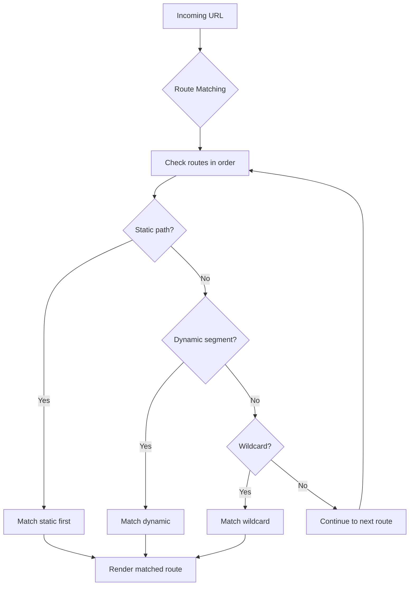

# Topic 45: React Router Basics - Client-Side Navigation Foundation

## Overview

React Router is the standard routing library for React applications, enabling navigation between different views without full page reloads. This comprehensive guide covers React Router v6.x fundamentals, from basic setup to advanced routing patterns, providing the foundation for building complex single-page applications.

**What You'll Master:**
- React Router architecture and core concepts
- Setting up BrowserRouter and routing infrastructure
- Creating routes and handling navigation
- Understanding client-side vs. server-side routing
- Route matching and rendering strategies
- Browser history API integration
- TypeScript integration with React Router
- Best practices for scalable routing

## 1. Understanding Client-Side Routing

### 1.1 Traditional vs. SPA Routing

```mermaid
graph TD
    subgraph Traditional Multi-Page App
        A1[User clicks link] --> B1[Browser sends request to server]
        B1 --> C1[Server processes request]
        C1 --> D1[Server sends new HTML]
        D1 --> E1[Browser loads new page]
        E1 --> F1[Full page reload]
    end
    
    subgraph Single-Page App with React Router
        A2[User clicks link] --> B2[React Router intercepts]
        B2 --> C2[Update URL without reload]
        C2 --> D2[Match URL to route]
        D2 --> E2[Render new component]
        E2 --> F2[Update UI instantly]
    end
```



**Comparison:**

| Aspect | Traditional Routing | React Router (SPA) |
|--------|-------------------|-------------------|
| Page Load | Full page reload | No reload |
| Speed | Slower (network request) | Instant |
| User Experience | Jarring transitions | Smooth transitions |
| State Preservation | Lost on navigation | Maintained |
| SEO | Better by default | Requires SSR/SSG |
| Initial Load | Faster | Slower (larger bundle) |
| Subsequent Navigation | Slower | Faster |

### 1.2 React Router Architecture

```typescript
// Core concepts visualization
interface RouterConcepts {
  // 1. Router Provider
  router: BrowserRouter | HashRouter | MemoryRouter;
  
  // 2. Routes Configuration
  routes: {
    path: string;
    element: ReactElement;
    children?: Route[];
  }[];
  
  // 3. Navigation
  navigation: {
    Link: ComponentType;
    NavLink: ComponentType;
    Navigate: ComponentType;
    useNavigate: Hook;
  };
  
  // 4. Route Matching
  matching: {
    useParams: Hook;
    useSearchParams: Hook;
    useLocation: Hook;
    useMatch: Hook;
  };
}
```

## 2. Installation and Setup

### 2.1 Installation

```bash
# Install React Router
npm install react-router-dom

# TypeScript types (included by default in v6+)
# Types are already included, no @types package needed
```

### 2.2 Basic Setup

```typescript
// App.tsx - Basic Router Setup
import React from 'react';
import { BrowserRouter, Routes, Route } from 'react-router-dom';

// Page Components
const Home: React.FC = () => <h1>Home Page</h1>;
const About: React.FC = () => <h1>About Page</h1>;
const Contact: React.FC = () => <h1>Contact Page</h1>;
const NotFound: React.FC = () => <h1>404 - Page Not Found</h1>;

const App: React.FC = () => {
  return (
    <BrowserRouter>
      <Routes>
        <Route path="/" element={<Home />} />
        <Route path="/about" element={<About />} />
        <Route path="/contact" element={<Contact />} />
        <Route path="*" element={<NotFound />} />
      </Routes>
    </BrowserRouter>
  );
};

export default App;
```

### 2.3 Router Types

```typescript
// Different Router Types

// 1. BrowserRouter - Production standard (HTML5 History API)
import { BrowserRouter } from 'react-router-dom';

const App1: React.FC = () => (
  <BrowserRouter>
    {/* Uses clean URLs: /about, /contact */}
    <Routes>
      <Route path="/about" element={<About />} />
    </Routes>
  </BrowserRouter>
);

// 2. HashRouter - Legacy/static hosting fallback
import { HashRouter } from 'react-router-dom';

const App2: React.FC = () => (
  <HashRouter>
    {/* Uses hash URLs: /#/about, /#/contact */}
    <Routes>
      <Route path="/about" element={<About />} />
    </Routes>
  </HashRouter>
);

// 3. MemoryRouter - Testing/non-browser environments
import { MemoryRouter } from 'react-router-dom';

const App3: React.FC = () => (
  <MemoryRouter initialEntries={['/about']}>
    {/* URL not visible in address bar */}
    <Routes>
      <Route path="/about" element={<About />} />
    </Routes>
  </MemoryRouter>
);

// 4. StaticRouter - Server-side rendering
import { StaticRouter } from 'react-router-dom/server';

const App4: React.FC<{ location: string }> = ({ location }) => (
  <StaticRouter location={location}>
    {/* Used for SSR - renders at specific URL */}
    <Routes>
      <Route path="/about" element={<About />} />
    </Routes>
  </StaticRouter>
);
```

## 3. Creating Routes

### 3.1 Basic Route Configuration

```typescript
// Complete route configuration example
import React from 'react';
import {
  BrowserRouter,
  Routes,
  Route,
  Link,
} from 'react-router-dom';

// Page Components
interface PageProps {
  title?: string;
}

const HomePage: React.FC<PageProps> = () => (
  <div>
    <h1>Home Page</h1>
    <p>Welcome to our application!</p>
    <nav>
      <Link to="/about">About</Link>
      <Link to="/services">Services</Link>
      <Link to="/contact">Contact</Link>
    </nav>
  </div>
);

const AboutPage: React.FC = () => (
  <div>
    <h1>About Us</h1>
    <p>Learn more about our company.</p>
  </div>
);

const ServicesPage: React.FC = () => (
  <div>
    <h1>Our Services</h1>
    <ul>
      <li>Web Development</li>
      <li>Mobile Apps</li>
      <li>Cloud Solutions</li>
    </ul>
  </div>
);

const ContactPage: React.FC = () => (
  <div>
    <h1>Contact Us</h1>
    <form>
      <input type="email" placeholder="Your email" />
      <textarea placeholder="Your message" />
      <button type="submit">Send</button>
    </form>
  </div>
);

const NotFoundPage: React.FC = () => (
  <div>
    <h1>404 - Page Not Found</h1>
    <p>The page you're looking for doesn't exist.</p>
    <Link to="/">Go Home</Link>
  </div>
);

const App: React.FC = () => {
  return (
    <BrowserRouter>
      <Routes>
        {/* Exact match routes */}
        <Route path="/" element={<HomePage />} />
        <Route path="/about" element={<AboutPage />} />
        <Route path="/services" element={<ServicesPage />} />
        <Route path="/contact" element={<ContactPage />} />
        
        {/* Catch-all route for 404 */}
        <Route path="*" element={<NotFoundPage />} />
      </Routes>
    </BrowserRouter>
  );
};

export default App;
```

### 3.2 Index Routes

```typescript
// Index routes - default child route
import React from 'react';
import { Routes, Route, Outlet, Link } from 'react-router-dom';

// Layout component
const DashboardLayout: React.FC = () => (
  <div>
    <h1>Dashboard</h1>
    <nav>
      <Link to="/dashboard">Overview</Link>
      <Link to="/dashboard/stats">Stats</Link>
      <Link to="/dashboard/settings">Settings</Link>
    </nav>
    {/* Child routes render here */}
    <Outlet />
  </div>
);

// Child components
const DashboardOverview: React.FC = () => (
  <div>
    <h2>Overview</h2>
    <p>Welcome to your dashboard!</p>
  </div>
);

const DashboardStats: React.FC = () => (
  <div>
    <h2>Statistics</h2>
    <p>Your stats go here.</p>
  </div>
);

const DashboardSettings: React.FC = () => (
  <div>
    <h2>Settings</h2>
    <p>Manage your settings.</p>
  </div>
);

const App: React.FC = () => {
  return (
    <Routes>
      <Route path="/dashboard" element={<DashboardLayout />}>
        {/* Index route - renders at /dashboard */}
        <Route index element={<DashboardOverview />} />
        <Route path="stats" element={<DashboardStats />} />
        <Route path="settings" element={<DashboardSettings />} />
      </Route>
    </Routes>
  );
};
```

### 3.3 Route Props and Elements

```typescript
// Different ways to pass props to route components

// Method 1: Inline element with props
<Route 
  path="/product/:id" 
  element={<ProductPage apiUrl="/api/products" />} 
/>

// Method 2: Wrapper component
interface ProductWrapperProps {
  apiUrl: string;
}

const ProductWrapper: React.FC<ProductWrapperProps> = ({ apiUrl }) => {
  const { id } = useParams<{ id: string }>();
  return <ProductPage id={id!} apiUrl={apiUrl} />;
};

<Route 
  path="/product/:id" 
  element={<ProductWrapper apiUrl="/api/products" />} 
/>

// Method 3: Component with useOutletContext
interface OutletContextType {
  apiUrl: string;
  user: User;
}

const Layout: React.FC = () => {
  const context: OutletContextType = {
    apiUrl: '/api',
    user: { id: 1, name: 'John' },
  };
  
  return (
    <div>
      <Nav />
      <Outlet context={context} />
    </div>
  );
};

const ProductPage: React.FC = () => {
  const { apiUrl, user } = useOutletContext<OutletContextType>();
  return <div>Product for {user.name}</div>;
};
```

## 4. Navigation

### 4.1 Link Component

```typescript
// Link component - declarative navigation
import React from 'react';
import { Link } from 'react-router-dom';

const NavigationExample: React.FC = () => {
  return (
    <nav>
      {/* Basic link */}
      <Link to="/">Home</Link>
      
      {/* Link with search params */}
      <Link to="/search?q=react&sort=newest">Search</Link>
      
      {/* Link with state */}
      <Link 
        to="/profile" 
        state={{ from: 'navigation' }}
      >
        Profile
      </Link>
      
      {/* Link with relative path */}
      <Link to="../previous">Back</Link>
      
      {/* Replace current entry in history */}
      <Link to="/login" replace>Login</Link>
      
      {/* Prevent default scroll behavior */}
      <Link to="/about" preventScrollReset>About</Link>
      
      {/* Link with custom styling */}
      <Link 
        to="/dashboard"
        style={({ isActive }) => ({
          color: isActive ? 'red' : 'blue',
        })}
      >
        Dashboard
      </Link>
    </nav>
  );
};
```

### 4.2 NavLink Component

```typescript
// NavLink - Link with active state styling
import React from 'react';
import { NavLink } from 'react-router-dom';

const NavigationMenu: React.FC = () => {
  return (
    <nav>
      {/* NavLink with className function */}
      <NavLink
        to="/"
        className={({ isActive, isPending }) => 
          isActive ? 'nav-link active' : 
          isPending ? 'nav-link pending' : 
          'nav-link'
        }
      >
        Home
      </NavLink>
      
      {/* NavLink with style function */}
      <NavLink
        to="/about"
        style={({ isActive }) => ({
          color: isActive ? '#fff' : '#545e6f',
          background: isActive ? '#7600dc' : '#f0f0f0',
          textDecoration: 'none',
          padding: '10px 20px',
          borderRadius: '5px',
        })}
      >
        About
      </NavLink>
      
      {/* NavLink with children function */}
      <NavLink to="/products">
        {({ isActive }) => (
          <span>
            {isActive ? '🔹' : '▫️'} Products
          </span>
        )}
      </NavLink>
      
      {/* NavLink with end prop (only active for exact match) */}
      <NavLink to="/settings" end>
        Settings
      </NavLink>
    </nav>
  );
};

// Complete navigation component with styling
const Navigation: React.FC = () => {
  return (
    <nav className="main-navigation">
      <NavLink
        to="/"
        className={({ isActive }) => 
          `nav-item ${isActive ? 'active' : ''}`
        }
        end
      >
        Home
      </NavLink>
      
      <NavLink
        to="/dashboard"
        className={({ isActive }) => 
          `nav-item ${isActive ? 'active' : ''}`
        }
      >
        Dashboard
      </NavLink>
      
      <NavLink
        to="/profile"
        className={({ isActive }) => 
          `nav-item ${isActive ? 'active' : ''}`
        }
      >
        Profile
      </NavLink>
    </nav>
  );
};

export default Navigation;
```

### 4.3 Programmatic Navigation

```typescript
// useNavigate hook - programmatic navigation
import React, { useState } from 'react';
import { useNavigate, useLocation } from 'react-router-dom';

// Example 1: Basic navigation
const LoginForm: React.FC = () => {
  const navigate = useNavigate();
  const [email, setEmail] = useState('');
  const [password, setPassword] = useState('');

  const handleSubmit = async (e: React.FormEvent) => {
    e.preventDefault();
    
    try {
      await login(email, password);
      
      // Navigate to dashboard after successful login
      navigate('/dashboard');
    } catch (error) {
      console.error('Login failed:', error);
    }
  };

  return (
    <form onSubmit={handleSubmit}>
      <input 
        type="email" 
        value={email}
        onChange={(e) => setEmail(e.target.value)}
      />
      <input 
        type="password" 
        value={password}
        onChange={(e) => setPassword(e.target.value)}
      />
      <button type="submit">Login</button>
    </form>
  );
};

// Example 2: Navigation with state
const ProductList: React.FC = () => {
  const navigate = useNavigate();

  const handleProductClick = (productId: string) => {
    navigate(`/product/${productId}`, {
      state: { from: 'product-list' },
    });
  };

  return (
    <div>
      {products.map(product => (
        <div 
          key={product.id}
          onClick={() => handleProductClick(product.id)}
        >
          {product.name}
        </div>
      ))}
    </div>
  );
};

// Example 3: Replace vs Push
const NavigationExamples: React.FC = () => {
  const navigate = useNavigate();

  const pushNavigation = () => {
    // Adds new entry to history stack
    navigate('/new-page');
  };

  const replaceNavigation = () => {
    // Replaces current entry in history stack
    navigate('/new-page', { replace: true });
  };

  const navigateBack = () => {
    // Go back one entry
    navigate(-1);
  };

  const navigateForward = () => {
    // Go forward one entry
    navigate(1);
  };

  const navigateMultiple = () => {
    // Go back multiple entries
    navigate(-2);
  };

  return (
    <div>
      <button onClick={pushNavigation}>Push Navigation</button>
      <button onClick={replaceNavigation}>Replace Navigation</button>
      <button onClick={navigateBack}>Go Back</button>
      <button onClick={navigateForward}>Go Forward</button>
      <button onClick={navigateMultiple}>Go Back 2 Pages</button>
    </div>
  );
};

// Example 4: Conditional navigation with state
const CheckoutPage: React.FC = () => {
  const navigate = useNavigate();
  const location = useLocation();

  const handleCheckout = async () => {
    try {
      const order = await processCheckout();
      
      // Navigate with order data
      navigate('/confirmation', {
        state: { 
          order,
          previousPath: location.pathname,
        },
      });
    } catch (error) {
      navigate('/error', {
        state: { error: error.message },
        replace: true, // Don't keep failed checkout in history
      });
    }
  };

  return (
    <button onClick={handleCheckout}>Complete Purchase</button>
  );
};
```

### 4.4 Navigate Component

```typescript
// Navigate component - declarative redirection
import React from 'react';
import { Navigate, useAuth } from 'react-router-dom';

// Example 1: Simple redirect
const OldProductPage: React.FC = () => {
  return <Navigate to="/products" replace />;
};

// Example 2: Conditional redirect
const ProtectedPage: React.FC = () => {
  const { isAuthenticated } = useAuth();

  if (!isAuthenticated) {
    return <Navigate to="/login" replace />;
  }

  return <div>Protected Content</div>;
};

// Example 3: Redirect with state
const LoginPage: React.FC = () => {
  const { isAuthenticated } = useAuth();
  const location = useLocation();

  if (isAuthenticated) {
    // Redirect to intended destination or home
    const from = location.state?.from?.pathname || '/';
    return <Navigate to={from} replace />;
  }

  return <LoginForm />;
};

// Example 4: Redirect based on user role
interface User {
  id: string;
  role: 'admin' | 'user';
}

const Dashboard: React.FC = () => {
  const { user } = useAuth() as { user: User | null };

  if (!user) {
    return <Navigate to="/login" replace />;
  }

  if (user.role === 'admin') {
    return <Navigate to="/admin/dashboard" replace />;
  }

  return <Navigate to="/user/dashboard" replace />;
};
```

## 5. Route Matching

### 5.1 Path Patterns

```typescript
// Different path pattern examples

const App: React.FC = () => {
  return (
    <Routes>
      {/* Exact match */}
      <Route path="/" element={<Home />} />
      
      {/* Static path */}
      <Route path="/about" element={<About />} />
      
      {/* Dynamic segment */}
      <Route path="/users/:userId" element={<UserProfile />} />
      
      {/* Multiple dynamic segments */}
      <Route path="/posts/:postId/comments/:commentId" element={<Comment />} />
      
      {/* Optional segment */}
      <Route path="/products/:category?" element={<Products />} />
      
      {/* Wildcard (catches all) */}
      <Route path="/docs/*" element={<Documentation />} />
      
      {/* Catch-all (404) - must be last */}
      <Route path="*" element={<NotFound />} />
    </Routes>
  );
};

// Using dynamic segments
import { useParams } from 'react-router-dom';

const UserProfile: React.FC = () => {
  const { userId } = useParams<{ userId: string }>();
  
  return <div>User ID: {userId}</div>;
};

const Comment: React.FC = () => {
  const { postId, commentId } = useParams<{ 
    postId: string; 
    commentId: string;
  }>();
  
  return (
    <div>
      Post: {postId}, Comment: {commentId}
    </div>
  );
};
```

### 5.2 Route Priority



```typescript
// Route priority demonstration
const App: React.FC = () => {
  return (
    <Routes>
      {/* 
        Routes are matched in order:
        1. More specific routes first
        2. Static paths before dynamic
        3. Wildcards last
      */}
      
      {/* Specific static route - highest priority */}
      <Route path="/users/new" element={<CreateUser />} />
      
      {/* Dynamic route - matches after static */}
      <Route path="/users/:userId" element={<UserProfile />} />
      
      {/* Nested wildcard */}
      <Route path="/users/*" element={<UsersSection />} />
      
      {/* Global catch-all - lowest priority */}
      <Route path="*" element={<NotFound />} />
    </Routes>
  );
};
```

### 5.3 Route Hooks

```typescript
// Essential routing hooks

import { 
  useParams, 
  useSearchParams, 
  useLocation, 
  useNavigate,
  useMatch,
} from 'react-router-dom';

// 1. useParams - Access URL parameters
const UserProfile: React.FC = () => {
  const { userId } = useParams<{ userId: string }>();
  
  return <div>Viewing user {userId}</div>;
};

// 2. useSearchParams - Access and modify query parameters
const SearchPage: React.FC = () => {
  const [searchParams, setSearchParams] = useSearchParams();
  
  const query = searchParams.get('q') || '';
  const page = searchParams.get('page') || '1';
  
  const handleSearch = (newQuery: string) => {
    setSearchParams({ q: newQuery, page: '1' });
  };
  
  const nextPage = () => {
    const currentPage = parseInt(page);
    setSearchParams({ q: query, page: String(currentPage + 1) });
  };
  
  return (
    <div>
      <input 
        value={query}
        onChange={(e) => handleSearch(e.target.value)}
      />
      <p>Page: {page}</p>
      <button onClick={nextPage}>Next Page</button>
    </div>
  );
};

// 3. useLocation - Access current location object
const LocationDemo: React.FC = () => {
  const location = useLocation();
  
  return (
    <div>
      <p>Pathname: {location.pathname}</p>
      <p>Search: {location.search}</p>
      <p>Hash: {location.hash}</p>
      <p>State: {JSON.stringify(location.state)}</p>
    </div>
  );
};

// 4. useMatch - Check if current location matches pattern
const Navigation: React.FC = () => {
  const isHome = useMatch('/');
  const isDashboard = useMatch('/dashboard/*');
  
  return (
    <nav>
      <Link 
        to="/" 
        style={{ fontWeight: isHome ? 'bold' : 'normal' }}
      >
        Home
      </Link>
      <Link 
        to="/dashboard" 
        style={{ fontWeight: isDashboard ? 'bold' : 'normal' }}
      >
        Dashboard
      </Link>
    </nav>
  );
};

// Complete example combining all hooks
interface Product {
  id: string;
  name: string;
  category: string;
}

const ProductPage: React.FC = () => {
  const { productId } = useParams<{ productId: string }>();
  const [searchParams] = useSearchParams();
  const location = useLocation();
  const navigate = useNavigate();
  
  const variant = searchParams.get('variant') || 'default';
  const referrer = location.state?.referrer || 'direct';
  
  const [product, setProduct] = useState<Product | null>(null);
  
  useEffect(() => {
    fetchProduct(productId!).then(setProduct);
  }, [productId]);
  
  const handleAddToCart = () => {
    addToCart(product!);
    navigate('/cart', {
      state: { from: location.pathname },
    });
  };
  
  if (!product) return <div>Loading...</div>;
  
  return (
    <div>
      <h1>{product.name}</h1>
      <p>Variant: {variant}</p>
      <p>Came from: {referrer}</p>
      <button onClick={handleAddToCart}>Add to Cart</button>
    </div>
  );
};
```

## 6. Layout Routes

### 6.1 Shared Layouts with Outlet

```typescript
// Layout pattern with Outlet
import React from 'react';
import { Outlet, Link } from 'react-router-dom';

// Root layout component
const RootLayout: React.FC = () => {
  return (
    <div className="app">
      <header>
        <nav>
          <Link to="/">Home</Link>
          <Link to="/about">About</Link>
          <Link to="/dashboard">Dashboard</Link>
        </nav>
      </header>
      
      <main>
        {/* Child routes render here */}
        <Outlet />
      </main>
      
      <footer>
        <p>&copy; 2025 My App</p>
      </footer>
    </div>
  );
};

// Dashboard layout (nested)
const DashboardLayout: React.FC = () => {
  return (
    <div className="dashboard">
      <aside>
        <nav>
          <Link to="/dashboard">Overview</Link>
          <Link to="/dashboard/analytics">Analytics</Link>
          <Link to="/dashboard/settings">Settings</Link>
        </nav>
      </aside>
      
      <div className="dashboard-content">
        {/* Nested child routes render here */}
        <Outlet />
      </div>
    </div>
  );
};

// App with nested layouts
const App: React.FC = () => {
  return (
    <Routes>
      <Route path="/" element={<RootLayout />}>
        <Route index element={<HomePage />} />
        <Route path="about" element={<AboutPage />} />
        
        {/* Nested dashboard routes */}
        <Route path="dashboard" element={<DashboardLayout />}>
          <Route index element={<DashboardOverview />} />
          <Route path="analytics" element={<Analytics />} />
          <Route path="settings" element={<Settings />} />
        </Route>
        
        <Route path="*" element={<NotFoundPage />} />
      </Route>
    </Routes>
  );
};
```

### 6.2 Layout with Context

```typescript
// Sharing data through layout context
import React, { createContext, useContext, useState } from 'react';
import { Outlet, useOutletContext } from 'react-router-dom';

interface LayoutContext {
  user: User | null;
  theme: 'light' | 'dark';
  toggleTheme: () => void;
}

const AppLayout: React.FC = () => {
  const [user, setUser] = useState<User | null>(null);
  const [theme, setTheme] = useState<'light' | 'dark'>('light');
  
  const toggleTheme = () => {
    setTheme(prev => prev === 'light' ? 'dark' : 'light');
  };
  
  const context: LayoutContext = {
    user,
    theme,
    toggleTheme,
  };
  
  return (
    <div className={`app theme-${theme}`}>
      <header>
        <nav>
          <Link to="/">Home</Link>
          {user && <Link to="/profile">Profile</Link>}
          <button onClick={toggleTheme}>
            Toggle Theme
          </button>
        </nav>
      </header>
      
      <main>
        <Outlet context={context} />
      </main>
    </div>
  );
};

// Child component accessing layout context
const ProfilePage: React.FC = () => {
  const { user, theme } = useOutletContext<LayoutContext>();
  
  return (
    <div>
      <h1>Profile</h1>
      <p>User: {user?.name}</p>
      <p>Theme: {theme}</p>
    </div>
  );
};
```

## 7. Error Handling

### 7.1 Error Boundaries with Routes

```typescript
// Error boundary for route errors
import React, { Component, ErrorInfo, ReactNode } from 'react';
import { Link } from 'react-router-dom';

interface Props {
  children: ReactNode;
}

interface State {
  hasError: boolean;
  error: Error | null;
}

class RouteErrorBoundary extends Component<Props, State> {
  constructor(props: Props) {
    super(props);
    this.state = {
      hasError: false,
      error: null,
    };
  }

  static getDerivedStateFromError(error: Error): State {
    return {
      hasError: true,
      error,
    };
  }

  componentDidCatch(error: Error, errorInfo: ErrorInfo) {
    console.error('Route error:', error, errorInfo);
  }

  render() {
    if (this.state.hasError) {
      return (
        <div className="error-page">
          <h1>Something went wrong</h1>
          <p>{this.state.error?.message}</p>
          <Link to="/">Go Home</Link>
        </div>
      );
    }

    return this.props.children;
  }
}

// Usage with routes
const App: React.FC = () => {
  return (
    <BrowserRouter>
      <RouteErrorBoundary>
        <Routes>
          <Route path="/" element={<Home />} />
          <Route path="/about" element={<About />} />
          <Route path="*" element={<NotFound />} />
        </Routes>
      </RouteErrorBoundary>
    </BrowserRouter>
  );
};
```

### 7.2 404 and Not Found Handling

```typescript
// Complete 404 handling
import React from 'react';
import { Link, useLocation } from 'react-router-dom';

const NotFoundPage: React.FC = () => {
  const location = useLocation();

  return (
    <div className="not-found">
      <h1>404 - Page Not Found</h1>
      <p>The page <code>{location.pathname}</code> doesn't exist.</p>
      <div className="actions">
        <Link to="/">Go Home</Link>
        <Link to="/search">Search</Link>
        <button onClick={() => window.history.back()}>
          Go Back
        </button>
      </div>
    </div>
  );
};

// App with 404 route
const App: React.FC = () => {
  return (
    <Routes>
      <Route path="/" element={<Home />} />
      <Route path="/about" element={<About />} />
      <Route path="/contact" element={<Contact />} />
      
      {/* Catch-all 404 route - must be last */}
      <Route path="*" element={<NotFoundPage />} />
    </Routes>
  );
};
```

## 8. TypeScript Integration

### 8.1 Type-Safe Routes

```typescript
// Define route types
type AppRoutes = 
  | '/'
  | '/about'
  | '/contact'
  | `/users/${string}`
  | `/products/${string}`;

// Type-safe Link component
const TypedLink: React.FC<{ to: AppRoutes; children: ReactNode }> = ({ 
  to, 
  children 
}) => {
  return <Link to={to}>{children}</Link>;
};

// Usage
<TypedLink to="/">Home</TypedLink>
<TypedLink to="/users/123">User 123</TypedLink>
// <TypedLink to="/invalid">Error</TypedLink> // TypeScript error!
```

### 8.2 Typed Route Parameters

```typescript
// Type-safe useParams
import { useParams } from 'react-router-dom';

interface UserParams {
  userId: string;
}

const UserProfile: React.FC = () => {
  const { userId } = useParams<UserParams>();
  
  // userId is typed as string | undefined
  if (!userId) {
    return <div>Invalid user ID</div>;
  }

  return <div>User ID: {userId}</div>;
};

// Multiple parameters
interface PostCommentParams {
  postId: string;
  commentId: string;
}

const CommentView: React.FC = () => {
  const params = useParams<PostCommentParams>();
  
  return (
    <div>
      Post: {params.postId}
      Comment: {params.commentId}
    </div>
  );
};
```

### 8.3 Typed Location State

```typescript
// Define location state types
interface LocationState {
  from?: string;
  message?: string;
  data?: any;
}

// Type-safe navigation with state
const ProductList: React.FC = () => {
  const navigate = useNavigate();

  const handleClick = (productId: string) => {
    navigate(`/product/${productId}`, {
      state: {
        from: 'product-list',
        message: 'Viewing product details',
      } as LocationState,
    });
  };

  return <div>{/* ... */}</div>;
};

// Type-safe location state access
const ProductDetail: React.FC = () => {
  const location = useLocation();
  const state = location.state as LocationState | null;

  return (
    <div>
      <p>From: {state?.from || 'Unknown'}</p>
      <p>Message: {state?.message}</p>
    </div>
  );
};
```

## 9. Higher-Order Thinking: Routing Architecture

### FAQ 1: When should I use BrowserRouter vs HashRouter?

**Short Answer:** Use BrowserRouter for modern apps with server configuration; use HashRouter only for static hosting without server control.

**Deep Dive:**

**BrowserRouter (Recommended):**
- Uses HTML5 History API (`/about`, `/products/123`)
- Clean, SEO-friendly URLs
- Requires server configuration for deep linking
- Better user experience

**HashRouter (Legacy):**
- Uses URL hash (`/#/about`, `/#/products/123`)
- Works without server configuration
- Not ideal for SEO
- Use only when server config impossible

**Server Configuration Required:**

```nginx
# Nginx configuration for BrowserRouter
location / {
    try_files $uri $uri/ /index.html;
}
```

```apache
# Apache .htaccess for BrowserRouter
<IfModule mod_rewrite.c>
    RewriteEngine On
    RewriteBase /
    RewriteRule ^index\.html$ - [L]
    RewriteCond %{REQUEST_FILENAME} !-f
    RewriteCond %{REQUEST_FILENAME} !-d
    RewriteRule . /index.html [L]
</IfModule>
```

**Decision Matrix:**

| Factor | BrowserRouter | HashRouter |
|--------|--------------|------------|
| URL Appearance | Clean ✅ | Hash-based ❌ |
| SEO | Good ✅ | Poor ❌ |
| Server Config | Required ❌ | Not needed ✅ |
| Modern Apps | Yes ✅ | No ❌ |
| Static Hosting | With config ⚠️ | Yes ✅ |

### FAQ 2: Should I use relative or absolute paths in routes?

**Short Answer:** Use relative paths for nested routes and absolute paths for top-level navigation.

**Best Practices:**

```typescript
// ✅ GOOD: Relative paths in nested routes
<Route path="dashboard" element={<Dashboard />}>
  <Route path="analytics" element={<Analytics />} />
  <Route path="settings" element={<Settings />} />
</Route>

// ✅ GOOD: Absolute paths for top-level
<Route path="/login" element={<Login />} />
<Route path="/register" element={<Register />} />

// ❌ BAD: Mixing styles inconsistently
<Route path="dashboard" element={<Dashboard />}>
  <Route path="/dashboard/analytics" element={<Analytics />} />
</Route>
```

**Navigation Patterns:**

```typescript
// Relative navigation within feature
<Link to="settings">Settings</Link>  // ./settings
<Link to="../">Back</Link>            // Parent route

// Absolute navigation across features
<Link to="/dashboard">Dashboard</Link>
<Link to="/profile">Profile</Link>
```

### FAQ 3: How do I handle authentication-protected routes?

**Short Answer:** Create a ProtectedRoute wrapper component that checks authentication and redirects if necessary.

**Complete Implementation:**

```typescript
import React from 'react';
import { Navigate, Outlet, useLocation } from 'react-router-dom';

interface ProtectedRouteProps {
  isAuthenticated: boolean;
  redirectPath?: string;
  children?: React.ReactNode;
}

const ProtectedRoute: React.FC<ProtectedRouteProps> = ({
  isAuthenticated,
  redirectPath = '/login',
  children,
}) => {
  const location = useLocation();

  if (!isAuthenticated) {
    return (
      <Navigate 
        to={redirectPath} 
        replace 
        state={{ from: location }}
      />
    );
  }

  return children ? <>{children}</> : <Outlet />;
};

// Usage
const App: React.FC = () => {
  const { isAuthenticated } = useAuth();

  return (
    <Routes>
      <Route path="/login" element={<Login />} />
      <Route path="/register" element={<Register />} />
      
      {/* Protected routes */}
      <Route element={<ProtectedRoute isAuthenticated={isAuthenticated} />}>
        <Route path="/dashboard" element={<Dashboard />} />
        <Route path="/profile" element={<Profile />} />
        <Route path="/settings" element={<Settings />} />
      </Route>
    </Routes>
  );
};
```

### FAQ 4: What's the difference between Navigate component and useNavigate hook?

**Short Answer:** Use Navigate for declarative redirects (render-based), useNavigate for imperative navigation (action-based).

**Navigate Component (Declarative):**
```typescript
// Use when navigation is based on render conditions
const Dashboard: React.FC = () => {
  const { isAuthenticated } = useAuth();

  if (!isAuthenticated) {
    return <Navigate to="/login" replace />;
  }

  return <div>Dashboard Content</div>;
};
```

**useNavigate Hook (Imperative):**
```typescript
// Use when navigation happens in response to events
const LoginForm: React.FC = () => {
  const navigate = useNavigate();

  const handleSubmit = async (e: FormEvent) => {
    e.preventDefault();
    await login();
    navigate('/dashboard'); // Navigate after action
  };

  return <form onSubmit={handleSubmit}>{/* ... */}</form>;
};
```

**Decision Guide:**

| Situation | Use |
|-----------|-----|
| Conditional rendering | Navigate component |
| Event handlers | useNavigate hook |
| After async operations | useNavigate hook |
| Role-based redirects | Navigate component |
| Form submissions | useNavigate hook |
| Guard clauses | Navigate component |

### FAQ 5: How do I preserve scroll position across navigation?

**Short Answer:** React Router v6 handles scroll restoration automatically, but you can customize it for specific needs.

**Automatic Scroll Restoration:**

```typescript
// BrowserRouter handles scroll automatically
<BrowserRouter>
  <Routes>{/* ... */}</Routes>
</BrowserRouter>

// Prevent automatic scroll on specific links
<Link to="/page" preventScrollReset>
  Navigate without scroll
</Link>
```

**Custom Scroll Behavior:**

```typescript
import { useEffect } from 'react';
import { useLocation } from 'react-router-dom';

const ScrollToTop: React.FC = () => {
  const { pathname } = useLocation();

  useEffect(() => {
    window.scrollTo(0, 0);
  }, [pathname]);

  return null;
};

// Add to app root
<BrowserRouter>
  <ScrollToTop />
  <Routes>{/* ... */}</Routes>
</BrowserRouter>
```

**Scroll to Element:**

```typescript
const ScrollToAnchor: React.FC = () => {
  const location = useLocation();

  useEffect(() => {
    if (location.hash) {
      const element = document.querySelector(location.hash);
      if (element) {
        element.scrollIntoView({ behavior: 'smooth' });
      }
    }
  }, [location]);

  return null;
};
```

## 10. Senior SDE Interview Questions

### Question 1: Design a scalable routing architecture for a large enterprise application

**What Interviewers Assess:**
- System design thinking
- Scalability considerations
- Code organization
- Performance awareness

**Model Answer:**

"I'd design a modular, lazy-loaded routing architecture:

**1. Feature-Based Route Structure:**
```typescript
// routes/
├── index.tsx           // Root routes
├── auth/               // Authentication routes
│   ├── index.tsx
│   ├── Login.tsx
│   └── Register.tsx
├── dashboard/          // Dashboard routes
│   ├── index.tsx
│   ├── Analytics.tsx
│   └── Settings.tsx
└── admin/              // Admin routes
    ├── index.tsx
    └── Users.tsx
```

**2. Route Configuration:**
```typescript
// Centralized route configuration
interface RouteConfig {
  path: string;
  component: LazyExoticComponent<ComponentType<any>>;
  children?: RouteConfig[];
  protected?: boolean;
  roles?: string[];
}

const routes: RouteConfig[] = [
  {
    path: '/',
    component: lazy(() => import('./layouts/RootLayout')),
    children: [
      {
        path: 'dashboard',
        component: lazy(() => import('./features/dashboard')),
        protected: true,
      },
      {
        path: 'admin',
        component: lazy(() => import('./features/admin')),
        protected: true,
        roles: ['admin'],
      },
    ],
  },
];
```

**3. Dynamic Route Generation:**
```typescript
const generateRoutes = (routes: RouteConfig[]) => {
  return routes.map(route => {
    const Component = route.component;
    const element = (
      <Suspense fallback={<Loading />}>
        <Component />
      </Suspense>
    );

    if (route.protected) {
      element = (
        <ProtectedRoute roles={route.roles}>
          {element}
        </ProtectedRoute>
      );
    }

    return (
      <Route 
        key={route.path} 
        path={route.path} 
        element={element}
      >
        {route.children && generateRoutes(route.children)}
      </Route>
    );
  });
};
```

**Key Considerations:**
- Lazy loading for code splitting
- Route-based access control
- Centralized configuration
- Type safety with TypeScript
- Error boundaries per feature
- Analytics tracking integration
- SEO optimization strategy"

### Question 2: How would you implement deep linking with complex state preservation?

**What Interviewers Assess:**
- State management understanding
- URL design principles
- User experience consideration
- Technical implementation skills

**Model Answer:**

"I'd implement a comprehensive deep linking strategy:

**1. URL Structure Design:**
```
/products?
  category=electronics&
  sort=price-asc&
  page=2&
  filters=brand:apple,samsung|price:500-1000
```

**2. State Serialization:**
```typescript
interface ProductFilters {
  category?: string;
  sort?: string;
  page?: number;
  filters?: {
    brand?: string[];
    priceRange?: [number, number];
  };
}

const serializeFilters = (filters: ProductFilters): string => {
  const params = new URLSearchParams();
  
  if (filters.category) params.set('category', filters.category);
  if (filters.sort) params.set('sort', filters.sort);
  if (filters.page) params.set('page', String(filters.page));
  
  if (filters.filters) {
    const filterStr = Object.entries(filters.filters)
      .map(([key, value]) => `${key}:${Array.isArray(value) ? value.join(',') : value}`)
      .join('|');
    params.set('filters', filterStr);
  }
  
  return params.toString();
};

const deserializeFilters = (search: string): ProductFilters => {
  const params = new URLSearchParams(search);
  // Parse back to object structure
};
```

**3. Implementation:**
```typescript
const ProductList: React.FC = () => {
  const [searchParams, setSearchParams] = useSearchParams();
  const filters = deserializeFilters(searchParams.toString());
  
  const updateFilters = (newFilters: Partial<ProductFilters>) => {
    const updated = { ...filters, ...newFilters };
    setSearchParams(serializeFilters(updated));
  };
  
  // Sync with URL on mount
  useEffect(() => {
    loadProducts(filters);
  }, [filters]);
};
```

**Benefits:**
- Shareable URLs
- Browser back/forward support
- Bookmarkable states
- SEO-friendly parameters"

## Self-Assessment Checklist

Test your React Router basics mastery:

**Fundamentals:**
- [ ] Understand client-side vs server-side routing
- [ ] Can set up BrowserRouter correctly
- [ ] Know how to create basic routes
- [ ] Understand route matching priorities

**Intermediate:**
- [ ] Can use Link and NavLink effectively
- [ ] Implement programmatic navigation with useNavigate
- [ ] Work with URL parameters and search params
- [ ] Create nested routes with Outlet

**Advanced:**
- [ ] Design protected route patterns
- [ ] Handle error boundaries in routing
- [ ] Implement type-safe routing with TypeScript
- [ ] Optimize routing for performance

**Expert:**
- [ ] Design scalable routing architecture
- [ ] Implement deep linking strategies
- [ ] Create reusable route abstractions
- [ ] Mentor team on routing best practices

## Summary

React Router Basics provides the foundation for building sophisticated single-page applications. Key takeaways:

1. **Client-Side Navigation:** React Router enables instant navigation without page reloads
2. **BrowserRouter:** Standard choice for modern applications with clean URLs
3. **Route Configuration:** Declarative route definitions with nested support
4. **Navigation Methods:** Link, NavLink, useNavigate for different navigation patterns
5. **Route Matching:** Understand path patterns, priorities, and dynamic segments
6. **Layout Routes:** Use Outlet for shared layouts and nested routing
7. **TypeScript Integration:** Type-safe routing with proper parameter typing
8. **Error Handling:** Implement error boundaries and 404 pages
9. **Best Practices:** Feature-based organization, lazy loading, protected routes
10. **Performance:** Code splitting and optimized route loading

**Next Steps:**
- Topic 46: Advanced Routing - Nested routes, data loading, route transitions
- Topic 47: Route Protection - Authentication, authorization, guards
- Topic 48: Data Loading - Loaders, actions, defer, React Router v6.4+ features

---

*React Router is more than just navigation—it's the backbone of your application's architecture. Master these basics to build scalable, maintainable single-page applications with excellent user experience.*
