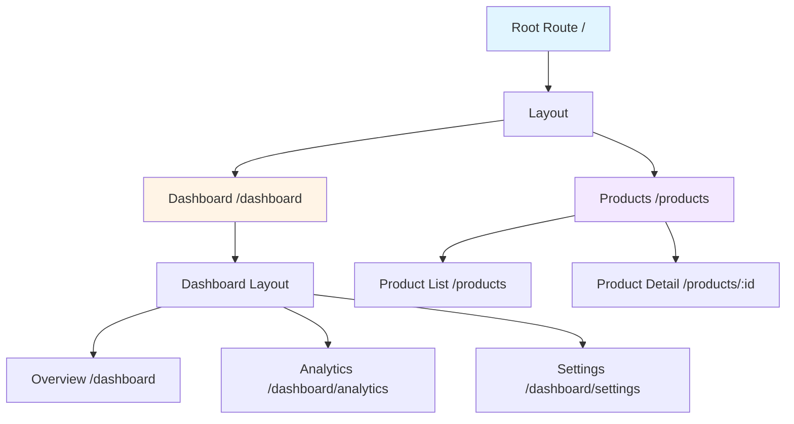

# Topic 46: Advanced Routing - Mastering Complex Navigation Patterns

## Overview

Advanced routing in React Router v6 goes beyond basic navigation to handle complex scenarios like nested routes, route-based data loading, dynamic route generation, and sophisticated navigation patterns. This comprehensive guide covers everything needed to build production-grade routing architectures.

**What You'll Master:**
- Nested routing patterns and multi-level hierarchies
- Route-based data loading with loaders and actions
- Dynamic route generation and configuration
- Breadcrumb navigation and active trail tracking
- Modal routes and parallel routing
- Route-based code splitting strategies
- Advanced TypeScript patterns for routing
- Performance optimization for complex routing

## 1. Nested Routing Architecture

### 1.1 Understanding Nested Routes



### 1.2 Multi-Level Nested Routes

```typescript
// Complete nested routing example
import React from 'react';
import {
  BrowserRouter,
  Routes,
  Route,
  Outlet,
  Link,
  useParams,
} from 'react-router-dom';

// Root Layout - Level 1
const RootLayout: React.FC = () => {
  return (
    <div className="app">
      <header>
        <nav>
          <Link to="/">Home</Link>
          <Link to="/dashboard">Dashboard</Link>
          <Link to="/products">Products</Link>
        </nav>
      </header>
      <main>
        <Outlet />
      </main>
      <footer>© 2025 My App</footer>
    </div>
  );
};

// Dashboard Layout - Level 2
const DashboardLayout: React.FC = () => {
  return (
    <div className="dashboard">
      <aside className="sidebar">
        <nav>
          <Link to="/dashboard">Overview</Link>
          <Link to="/dashboard/analytics">Analytics</Link>
          <Link to="/dashboard/analytics/reports">Reports</Link>
          <Link to="/dashboard/settings">Settings</Link>
        </nav>
      </aside>
      <div className="content">
        <Outlet />
      </div>
    </div>
  );
};

// Analytics Layout - Level 3
const AnalyticsLayout: React.FC = () => {
  return (
    <div className="analytics">
      <h2>Analytics</h2>
      <nav>
        <Link to="/dashboard/analytics">Overview</Link>
        <Link to="/dashboard/analytics/reports">Reports</Link>
        <Link to="/dashboard/analytics/exports">Exports</Link>
      </nav>
      <div className="analytics-content">
        <Outlet />
      </div>
    </div>
  );
};

// Page Components
const DashboardOverview: React.FC = () => (
  <div>
    <h3>Dashboard Overview</h3>
    <p>Welcome to your dashboard!</p>
  </div>
);

const AnalyticsOverview: React.FC = () => (
  <div>
    <h3>Analytics Overview</h3>
    <p>View your analytics data here.</p>
  </div>
);

const AnalyticsReports: React.FC = () => (
  <div>
    <h3>Analytics Reports</h3>
    <p>Generate and view reports.</p>
  </div>
);

const AnalyticsExports: React.FC = () => (
  <div>
    <h3>Data Exports</h3>
    <p>Export your analytics data.</p>
  </div>
);

const Settings: React.FC = () => (
  <div>
    <h3>Settings</h3>
    <p>Manage your settings.</p>
  </div>
);

// App with nested routes
const App: React.FC = () => {
  return (
    <BrowserRouter>
      <Routes>
        {/* Level 1: Root */}
        <Route path="/" element={<RootLayout />}>
          <Route index element={<Home />} />
          
          {/* Level 2: Dashboard */}
          <Route path="dashboard" element={<DashboardLayout />}>
            <Route index element={<DashboardOverview />} />
            
            {/* Level 3: Analytics */}
            <Route path="analytics" element={<AnalyticsLayout />}>
              <Route index element={<AnalyticsOverview />} />
              <Route path="reports" element={<AnalyticsReports />} />
              <Route path="exports" element={<AnalyticsExports />} />
            </Route>
            
            <Route path="settings" element={<Settings />} />
          </Route>
          
          <Route path="products" element={<ProductsLayout />}>
            <Route index element={<ProductList />} />
            <Route path=":productId" element={<ProductDetail />} />
          </Route>
        </Route>
      </Routes>
    </BrowserRouter>
  );
};

export default App;
```

### 1.3 Relative Routing in Nested Routes

```typescript
// Leveraging relative paths in nested structures
import React from 'react';
import { Link, useNavigate } from 'react-router-dom';

const DashboardNav: React.FC = () => {
  const navigate = useNavigate();

  return (
    <nav>
      {/* Relative to current route */}
      <Link to=".">Current (Dashboard)</Link>
      <Link to="analytics">Analytics</Link>
      <Link to="settings">Settings</Link>
      
      {/* Parent route */}
      <Link to="..">Up one level</Link>
      
      {/* Sibling route */}
      <Link to="../products">Products</Link>
      
      {/* Programmatic relative navigation */}
      <button onClick={() => navigate('analytics')}>
        Go to Analytics
      </button>
      <button onClick={() => navigate('..')}>
        Go Up
      </button>
    </nav>
  );
};

// Example: Product navigation with relative paths
const ProductDetail: React.FC = () => {
  const { productId } = useParams<{ productId: string }>();
  const navigate = useNavigate();

  return (
    <div>
      <h2>Product {productId}</h2>
      
      {/* Relative navigation within product context */}
      <Link to="reviews">Reviews</Link>
      <Link to="specifications">Specifications</Link>
      
      {/* Back to product list */}
      <Link to="..">Back to Products</Link>
      
      {/* Navigate to specific product */}
      <button onClick={() => navigate('../another-product')}>
        View Another Product
      </button>
    </div>
  );
};
```

## 2. Route-Based Data Loading

### 2.1 React Router v6.4+ Loaders

```typescript
// Modern data loading with loaders
import {
  createBrowserRouter,
  RouterProvider,
  LoaderFunctionArgs,
  useLoaderData,
} from 'react-router-dom';

// Type-safe loader data
interface User {
  id: string;
  name: string;
  email: string;
}

interface Product {
  id: string;
  name: string;
  price: number;
  description: string;
}

// Loader function for user data
const userLoader = async ({ params }: LoaderFunctionArgs): Promise<User> => {
  const response = await fetch(`/api/users/${params.userId}`);
  if (!response.ok) {
    throw new Response('User not found', { status: 404 });
  }
  return response.json();
};

// Loader function for products
const productsLoader = async (): Promise<Product[]> => {
  const response = await fetch('/api/products');
  return response.json();
};

// Component using loader data
const UserProfile: React.FC = () => {
  const user = useLoaderData() as User;

  return (
    <div>
      <h1>{user.name}</h1>
      <p>Email: {user.email}</p>
    </div>
  );
};

const ProductList: React.FC = () => {
  const products = useLoaderData() as Product[];

  return (
    <div>
      <h1>Products</h1>
      {products.map(product => (
        <div key={product.id}>
          <h3>{product.name}</h3>
          <p>${product.price}</p>
        </div>
      ))}
    </div>
  );
};

// Router configuration with loaders
const router = createBrowserRouter([
  {
    path: '/',
    element: <RootLayout />,
    children: [
      {
        path: 'users/:userId',
        element: <UserProfile />,
        loader: userLoader,
      },
      {
        path: 'products',
        element: <ProductList />,
        loader: productsLoader,
      },
    ],
  },
]);

const App: React.FC = () => {
  return <RouterProvider router={router} />;
};
```

### 2.2 Advanced Loader Patterns

```typescript
// Complex loader with multiple data sources
interface DashboardData {
  user: User;
  stats: Statistics;
  notifications: Notification[];
}

const dashboardLoader = async ({ 
  params, 
  request 
}: LoaderFunctionArgs): Promise<DashboardData> => {
  // Access URL search params
  const url = new URL(request.url);
  const filter = url.searchParams.get('filter') || 'all';

  // Parallel data fetching
  const [user, stats, notifications] = await Promise.all([
    fetch('/api/user').then(r => r.json()),
    fetch(`/api/stats?filter=${filter}`).then(r => r.json()),
    fetch('/api/notifications').then(r => r.json()),
  ]);

  return { user, stats, notifications };
};

// Component with loaded data
const Dashboard: React.FC = () => {
  const { user, stats, notifications } = useLoaderData() as DashboardData;

  return (
    <div>
      <h1>Welcome, {user.name}</h1>
      <StatsDisplay stats={stats} />
      <NotificationsList notifications={notifications} />
    </div>
  );
};

// Loader with error handling
const safeLoader = async (args: LoaderFunctionArgs) => {
  try {
    return await dashboardLoader(args);
  } catch (error) {
    // Redirect on auth error
    if (error instanceof AuthError) {
      throw redirect('/login');
    }
    // Re-throw for error boundary
    throw error;
  }
};
```

### 2.3 Actions for Data Mutations

```typescript
// Action for form submissions
import { 
  ActionFunctionArgs, 
  redirect,
  useActionData,
  Form,
} from 'react-router-dom';

interface ActionResult {
  success: boolean;
  errors?: Record<string, string>;
  data?: any;
}

// Action function for creating a product
const createProductAction = async ({ 
  request 
}: ActionFunctionArgs): Promise<ActionResult | Response> => {
  const formData = await request.formData();
  
  const product = {
    name: formData.get('name') as string,
    price: parseFloat(formData.get('price') as string),
    description: formData.get('description') as string,
  };

  // Validation
  const errors: Record<string, string> = {};
  if (!product.name) errors.name = 'Name is required';
  if (!product.price || product.price <= 0) errors.price = 'Price must be positive';

  if (Object.keys(errors).length > 0) {
    return { success: false, errors };
  }

  // Submit to API
  try {
    const response = await fetch('/api/products', {
      method: 'POST',
      headers: { 'Content-Type': 'application/json' },
      body: JSON.stringify(product),
    });

    if (!response.ok) {
      throw new Error('Failed to create product');
    }

    // Redirect on success
    return redirect('/products');
  } catch (error) {
    return {
      success: false,
      errors: { general: 'Failed to create product' },
    };
  }
};

// Component with form and action
const CreateProduct: React.FC = () => {
  const actionData = useActionData() as ActionResult | undefined;

  return (
    <div>
      <h1>Create Product</h1>
      
      {actionData?.errors?.general && (
        <div className="error">{actionData.errors.general}</div>
      )}

      <Form method="post">
        <div>
          <label>Name:</label>
          <input type="text" name="name" required />
          {actionData?.errors?.name && (
            <span className="error">{actionData.errors.name}</span>
          )}
        </div>

        <div>
          <label>Price:</label>
          <input type="number" name="price" step="0.01" required />
          {actionData?.errors?.price && (
            <span className="error">{actionData.errors.price}</span>
          )}
        </div>

        <div>
          <label>Description:</label>
          <textarea name="description" />
        </div>

        <button type="submit">Create Product</button>
      </Form>
    </div>
  );
};

// Router configuration with action
const router = createBrowserRouter([
  {
    path: '/products',
    children: [
      {
        path: 'new',
        element: <CreateProduct />,
        action: createProductAction,
      },
    ],
  },
]);
```

### 2.4 Defer for Streaming Data

```typescript
// Deferred data loading for better UX
import { 
  defer, 
  Await,
  useAsyncValue,
  LoaderFunctionArgs 
} from 'react-router-dom';
import { Suspense } from 'react';

interface PageData {
  criticalData: User;
  slowData: Promise<Report[]>;
}

// Loader with deferred data
const pageLoader = async ({ params }: LoaderFunctionArgs) => {
  // Load critical data immediately
  const criticalData = await fetch(`/api/users/${params.id}`).then(r => r.json());

  // Defer slow data - don't await!
  const slowData = fetch('/api/reports').then(r => r.json());

  return defer({
    criticalData,
    slowData, // Promise, not awaited
  });
};

// Component with deferred rendering
const UserPage: React.FC = () => {
  const data = useLoaderData() as PageData;

  return (
    <div>
      {/* Render immediately with critical data */}
      <h1>{data.criticalData.name}</h1>
      <p>{data.criticalData.email}</p>

      {/* Defer rendering until slow data loads */}
      <Suspense fallback={<div>Loading reports...</div>}>
        <Await
          resolve={data.slowData}
          errorElement={<div>Error loading reports</div>}
        >
          <ReportsList />
        </Await>
      </Suspense>
    </div>
  );
};

// Component that uses async value
const ReportsList: React.FC = () => {
  const reports = useAsyncValue() as Report[];

  return (
    <div>
      <h2>Reports</h2>
      {reports.map(report => (
        <div key={report.id}>{report.title}</div>
      ))}
    </div>
  );
};
```

## 3. Dynamic Route Generation

### 3.1 Configuration-Based Routes

```typescript
// Dynamic route configuration system
import { lazy, LazyExoticComponent, ComponentType } from 'react';
import { RouteObject } from 'react-router-dom';

interface RouteConfig {
  path: string;
  component?: LazyExoticComponent<ComponentType<any>>;
  loader?: (args: LoaderFunctionArgs) => Promise<any>;
  action?: (args: ActionFunctionArgs) => Promise<any>;
  children?: RouteConfig[];
  protected?: boolean;
  roles?: string[];
  meta?: {
    title?: string;
    description?: string;
    breadcrumb?: string;
  };
}

// Route definitions
const routeConfigs: RouteConfig[] = [
  {
    path: '/',
    component: lazy(() => import('./layouts/RootLayout')),
    children: [
      {
        path: '',
        component: lazy(() => import('./pages/Home')),
        meta: {
          title: 'Home',
          breadcrumb: 'Home',
        },
      },
      {
        path: 'dashboard',
        component: lazy(() => import('./pages/Dashboard')),
        protected: true,
        meta: {
          title: 'Dashboard',
          breadcrumb: 'Dashboard',
        },
        children: [
          {
            path: 'analytics',
            component: lazy(() => import('./pages/Analytics')),
            meta: {
              title: 'Analytics',
              breadcrumb: 'Analytics',
            },
          },
        ],
      },
      {
        path: 'admin',
        component: lazy(() => import('./pages/Admin')),
        protected: true,
        roles: ['admin'],
        meta: {
          title: 'Admin Panel',
          breadcrumb: 'Admin',
        },
      },
    ],
  },
];

// Generate React Router routes from config
const generateRoutes = (configs: RouteConfig[]): RouteObject[] => {
  return configs.map(config => {
    const route: RouteObject = {
      path: config.path,
    };

    if (config.component) {
      const Component = config.component;
      let element = (
        <Suspense fallback={<LoadingSpinner />}>
          <Component />
        </Suspense>
      );

      // Wrap with protection if needed
      if (config.protected) {
        element = (
          <ProtectedRoute roles={config.roles}>
            {element}
          </ProtectedRoute>
        );
      }

      // Wrap with meta data provider
      if (config.meta) {
        element = (
          <MetaProvider meta={config.meta}>
            {element}
          </MetaProvider>
        );
      }

      route.element = element;
    }

    if (config.loader) route.loader = config.loader;
    if (config.action) route.action = config.action;
    if (config.children) {
      route.children = generateRoutes(config.children);
    }

    return route;
  });
};

// Create router from configuration
const router = createBrowserRouter(generateRoutes(routeConfigs));
```

### 3.2 Plugin-Based Route System

```typescript
// Extensible plugin system for routes
interface RoutePlugin {
  name: string;
  routes: RouteConfig[];
  init?: () => void;
  beforeRoute?: (route: RouteConfig) => RouteConfig;
  afterRoute?: (route: RouteConfig) => void;
}

class RouterManager {
  private plugins: RoutePlugin[] = [];
  private routes: RouteConfig[] = [];

  registerPlugin(plugin: RoutePlugin): void {
    this.plugins.push(plugin);
    plugin.init?.();
  }

  addRoutes(routes: RouteConfig[]): void {
    this.routes.push(...routes);
  }

  generateRoutes(): RouteObject[] {
    // Collect all routes from plugins
    const allRoutes = [
      ...this.routes,
      ...this.plugins.flatMap(p => p.routes),
    ];

    // Apply before hooks
    const processedRoutes = allRoutes.map(route => {
      let processed = route;
      for (const plugin of this.plugins) {
        if (plugin.beforeRoute) {
          processed = plugin.beforeRoute(processed);
        }
      }
      return processed;
    });

    // Generate React Router routes
    const generated = generateRoutes(processedRoutes);

    // Apply after hooks
    processedRoutes.forEach(route => {
      this.plugins.forEach(plugin => {
        plugin.afterRoute?.(route);
      });
    });

    return generated;
  }
}

// Example plugins
const analyticsPlugin: RoutePlugin = {
  name: 'analytics',
  routes: [],
  afterRoute: (route) => {
    console.log(`Route accessed: ${route.path}`);
    trackPageView(route.path);
  },
};

const authPlugin: RoutePlugin = {
  name: 'auth',
  routes: [
    {
      path: '/login',
      component: lazy(() => import('./pages/Login')),
    },
  ],
  beforeRoute: (route) => {
    if (route.protected && !isAuthenticated()) {
      // Modify route to redirect
      return {
        ...route,
        element: <Navigate to="/login" />,
      };
    }
    return route;
  },
};

// Usage
const manager = new RouterManager();
manager.registerPlugin(analyticsPlugin);
manager.registerPlugin(authPlugin);
manager.addRoutes(routeConfigs);

const router = createBrowserRouter(manager.generateRoutes());
```

## 4. Breadcrumb Navigation

### 4.1 Automatic Breadcrumb Generation

```typescript
// Breadcrumb system based on route configuration
import React from 'react';
import { useMatches, Link } from 'react-router-dom';

interface RouteMatch {
  id: string;
  pathname: string;
  params: Record<string, string>;
  data: any;
  handle?: {
    crumb?: (data: any) => React.ReactNode;
  };
}

// Breadcrumb component
const Breadcrumbs: React.FC = () => {
  const matches = useMatches() as RouteMatch[];

  // Generate breadcrumb items from matches
  const crumbs = matches
    .filter(match => match.handle?.crumb)
    .map(match => ({
      path: match.pathname,
      label: match.handle!.crumb!(match.data),
    }));

  return (
    <nav className="breadcrumbs">
      {crumbs.map((crumb, index) => {
        const isLast = index === crumbs.length - 1;
        
        return (
          <span key={crumb.path}>
            {isLast ? (
              <span>{crumb.label}</span>
            ) : (
              <>
                <Link to={crumb.path}>{crumb.label}</Link>
                <span className="separator">/</span>
              </>
            )}
          </span>
        );
      })}
    </nav>
  );
};

// Route configuration with breadcrumb handles
const router = createBrowserRouter([
  {
    path: '/',
    element: <RootLayout />,
    handle: {
      crumb: () => 'Home',
    },
    children: [
      {
        path: 'products',
        element: <ProductList />,
        loader: productsLoader,
        handle: {
          crumb: () => 'Products',
        },
        children: [
          {
            path: ':productId',
            element: <ProductDetail />,
            loader: productLoader,
            handle: {
              crumb: (data: Product) => data.name,
            },
          },
        ],
      },
    ],
  },
]);

// Root layout with breadcrumbs
const RootLayout: React.FC = () => {
  return (
    <div>
      <Header />
      <Breadcrumbs />
      <main>
        <Outlet />
      </main>
    </div>
  );
};
```

### 4.2 Dynamic Breadcrumbs with Data

```typescript
// Advanced breadcrumb system with data loading
interface BreadcrumbConfig {
  label: string | ((data: any, params: any) => string);
  path?: string;
  dynamic?: boolean;
}

const useBreadcrumbs = () => {
  const matches = useMatches();
  const [breadcrumbs, setBreadcrumbs] = useState<Array<{
    label: string;
    path: string;
  }>>([]);

  useEffect(() => {
    const crumbs = matches
      .filter(match => match.handle?.breadcrumb)
      .map(match => {
        const config = match.handle.breadcrumb as BreadcrumbConfig;
        
        let label: string;
        if (typeof config.label === 'function') {
          label = config.label(match.data, match.params);
        } else {
          label = config.label;
        }

        return {
          label,
          path: match.pathname,
        };
      });

    setBreadcrumbs(crumbs);
  }, [matches]);

  return breadcrumbs;
};

// Example usage
const ProductDetailPage: React.FC = () => {
  const product = useLoaderData() as Product;
  const breadcrumbs = useBreadcrumbs();

  return (
    <div>
      <nav className="breadcrumbs">
        {breadcrumbs.map((crumb, index) => (
          <span key={crumb.path}>
            <Link to={crumb.path}>{crumb.label}</Link>
            {index < breadcrumbs.length - 1 && ' / '}
          </span>
        ))}
      </nav>
      
      <h1>{product.name}</h1>
      <p>{product.description}</p>
    </div>
  );
};
```

## 5. Modal Routes

### 5.1 Background Location Pattern

```typescript
// Modal routes that preserve background location
import React, { useState } from 'react';
import {
  useNavigate,
  useLocation,
  Location,
} from 'react-router-dom';

interface LocationState {
  backgroundLocation?: Location;
}

const App: React.FC = () => {
  const location = useLocation();
  const state = location.state as LocationState;
  const backgroundLocation = state?.backgroundLocation;

  return (
    <>
      {/* Main routes */}
      <Routes location={backgroundLocation || location}>
        <Route path="/" element={<Home />} />
        <Route path="/products" element={<ProductList />} />
        <Route path="/products/:id" element={<ProductDetail />} />
      </Routes>

      {/* Modal routes */}
      {backgroundLocation && (
        <Routes>
          <Route path="/products/:id" element={<ProductModal />} />
          <Route path="/login" element={<LoginModal />} />
        </Routes>
      )}
    </>
  );
};

// Component that opens modal route
const ProductCard: React.FC<{ product: Product }> = ({ product }) => {
  const navigate = useNavigate();
  const location = useLocation();

  const openModal = () => {
    navigate(`/products/${product.id}`, {
      state: { backgroundLocation: location },
    });
  };

  return (
    <div onClick={openModal}>
      <h3>{product.name}</h3>
      <p>{product.price}</p>
    </div>
  );
};

// Modal component
const ProductModal: React.FC = () => {
  const navigate = useNavigate();
  const { id } = useParams<{ id: string }>();
  const [product, setProduct] = useState<Product | null>(null);

  useEffect(() => {
    fetchProduct(id!).then(setProduct);
  }, [id]);

  const closeModal = () => {
    navigate(-1);
  };

  if (!product) return <div>Loading...</div>;

  return (
    <div className="modal-overlay" onClick={closeModal}>
      <div className="modal-content" onClick={(e) => e.stopPropagation()}>
        <button onClick={closeModal}>×</button>
        <h2>{product.name}</h2>
        <p>{product.description}</p>
        <p>${product.price}</p>
      </div>
    </div>
  );
};
```

### 5.2 Modal with Search Params

```typescript
// Alternative modal pattern using search params
const ProductListWithModals: React.FC = () => {
  const [searchParams, setSearchParams] = useSearchParams();
  const modalProductId = searchParams.get('modal');

  const openModal = (productId: string) => {
    setSearchParams({ modal: productId });
  };

  const closeModal = () => {
    setSearchParams({});
  };

  return (
    <div>
      <h1>Products</h1>
      <div className="product-grid">
        {products.map(product => (
          <div key={product.id} onClick={() => openModal(product.id)}>
            <h3>{product.name}</h3>
          </div>
        ))}
      </div>

      {modalProductId && (
        <ProductModal
          productId={modalProductId}
          onClose={closeModal}
        />
      )}
    </div>
  );
};
```

## 6. Parallel Routes

### 6.1 Multiple Outlets Pattern

```typescript
// Advanced layout with multiple outlets
import React from 'react';
import {
  Outlet,
  useOutlet,
  useMatches,
} from 'react-router-dom';

// Layout with multiple content areas
const DualPaneLayout: React.FC = () => {
  const mainOutlet = useOutlet();
  const matches = useMatches();
  
  // Find sidebar route data
  const sidebarMatch = matches.find(m => m.pathname.includes('sidebar'));

  return (
    <div className="dual-pane">
      <div className="main-pane">
        <Outlet />
      </div>
      
      <aside className="sidebar-pane">
        {sidebarMatch ? (
          <Outlet context={{ type: 'sidebar' }} />
        ) : (
          <DefaultSidebar />
        )}
      </aside>
    </div>
  );
};

// Router configuration for parallel routes
const router = createBrowserRouter([
  {
    path: '/',
    element: <DualPaneLayout />,
    children: [
      {
        path: 'products',
        element: <ProductList />,
        children: [
          {
            path: 'sidebar',
            element: <ProductFilters />,
          },
        ],
      },
      {
        path: 'dashboard',
        element: <Dashboard />,
        children: [
          {
            path: 'sidebar',
            element: <DashboardNav />,
          },
        ],
      },
    ],
  },
]);
```

## 7. Route-Based Code Splitting

### 7.1 Strategic Lazy Loading

```typescript
// Intelligent code splitting strategy
import { lazy, Suspense } from 'react';
import { RouteObject } from 'react-router-dom';

// Critical routes - not lazy loaded
import Home from './pages/Home';
import Login from './pages/Login';

// Heavy routes - lazy loaded
const Dashboard = lazy(() => import(/* webpackChunkName: "dashboard" */ './pages/Dashboard'));
const Analytics = lazy(() => import(/* webpackChunkName: "analytics" */ './pages/Analytics'));
const AdminPanel = lazy(() => import(/* webpackChunkName: "admin" */ './pages/AdminPanel'));

// Route configuration with strategic splitting
const routes: RouteObject[] = [
  {
    path: '/',
    element: <Home />, // Critical, not lazy
  },
  {
    path: '/login',
    element: <Login />, // Critical, not lazy
  },
  {
    path: '/dashboard',
    element: (
      <Suspense fallback={<DashboardSkeleton />}>
        <Dashboard />
      </Suspense>
    ),
  },
  {
    path: '/analytics',
    element: (
      <Suspense fallback={<AnalyticsSkeleton />}>
        <Analytics />
      </Suspense>
    ),
  },
  {
    path: '/admin',
    element: (
      <Suspense fallback={<AdminSkeleton />}>
        <AdminPanel />
      </Suspense>
    ),
  },
];
```

### 7.2 Prefetching Routes

```typescript
// Prefetch routes on hover or viewport entry
import { prefetchRouteData } from './utils/prefetch';

const NavigationItem: React.FC<{ to: string; label: string }> = ({ to, label }) => {
  const handleMouseEnter = () => {
    // Prefetch route component and data
    prefetchRouteData(to);
  };

  return (
    <Link to={to} onMouseEnter={handleMouseEnter}>
      {label}
    </Link>
  );
};

// Prefetch utility
const prefetchMap = new Map<string, Promise<any>>();

export const prefetchRouteData = async (path: string) => {
  if (prefetchMap.has(path)) {
    return prefetchMap.get(path);
  }

  const promise = (async () => {
    // Prefetch based on path
    switch (path) {
      case '/dashboard':
        await import('./pages/Dashboard');
        break;
      case '/analytics':
        await import('./pages/Analytics');
        break;
    }
  })();

  prefetchMap.set(path, promise);
  return promise;
};
```

## 8. Higher-Order Thinking: Advanced Routing Strategy

### FAQ 1: Should I use React Router's data loading or traditional useEffect?

**Short Answer:** Use React Router loaders for route-level data; use useEffect for component-level data that changes based on interactions.

**Deep Dive:**

**React Router Loaders (Route-Level):**
```typescript
// ✅ GOOD: Route-level data loading
const productLoader = async ({ params }: LoaderFunctionArgs) => {
  return fetch(`/api/products/${params.id}`).then(r => r.json());
};

// Data available before component renders
const ProductPage: React.FC = () => {
  const product = useLoaderData() as Product;
  return <div>{product.name}</div>;
};
```

**useEffect (Component-Level):**
```typescript
// ✅ GOOD: Interactive data loading
const ProductReviews: React.FC<{ productId: string }> = ({ productId }) => {
  const [reviews, setReviews] = useState([]);
  const [page, setPage] = useState(1);

  useEffect(() => {
    fetch(`/api/reviews?product=${productId}&page=${page}`)
      .then(r => r.json())
      .then(setReviews);
  }, [productId, page]);

  return <div>{/* Paginated reviews */}</div>;
};
```

**Decision Matrix:**

| Scenario | Use Loader | Use useEffect |
|----------|-----------|---------------|
| Initial page data | ✅ | ❌ |
| Navigation-dependent | ✅ | ❌ |
| User interactions | ❌ | ✅ |
| Polling/Real-time | ❌ | ✅ |
| Form submissions | Use actions | ❌ |
| Search/Filters | ✅ (via URL params) | ⚠️ (if not URL-based) |

### FAQ 2: How deep should my nested routes go?

**Short Answer:** Maximum 3-4 levels; beyond that, consider feature-based routing or tabs.

**Routing Depth Guidelines:**

```typescript
// ✅ GOOD: Reasonable nesting (3 levels)
/dashboard                    // Level 1: Section
/dashboard/analytics          // Level 2: Feature
/dashboard/analytics/reports  // Level 3: Sub-feature

// ⚠️ QUESTIONABLE: Deep nesting (5+ levels)
/dashboard/analytics/reports/monthly/2024/january

// ✅ BETTER: Flatten with params
/dashboard/analytics/reports?type=monthly&year=2024&month=january
```

**When to Flatten:**
1. More than 4 levels deep
2. Siblings at same level > 10
3. Conditional rendering based on user role
4. Performance issues with nested outlets

**Alternative Patterns:**
```typescript
// Use tabs instead of routes for closely related content
const AnalyticsPage: React.FC = () => {
  const [tab, setTab] = useState('overview');
  
  return (
    <div>
      <Tabs value={tab} onChange={setTab}>
        <Tab value="overview">Overview</Tab>
        <Tab value="reports">Reports</Tab>
        <Tab value="exports">Exports</Tab>
      </Tabs>
      {tab === 'overview' && <Overview />}
      {tab === 'reports' && <Reports />}
      {tab === 'exports' && <Exports />}
    </div>
  );
};
```

### FAQ 3: When should I use modal routes vs traditional modals?

**Short Answer:** Use modal routes for shareable/bookmarkable modals; use traditional modals for transient UI interactions.

**Modal Routes (URL-based):**
```typescript
// ✅ GOOD: Shareable, bookmarkable content
- Product details modal: /products/123
- Image gallery: /photos/456
- Video player: /videos/789
- User profile preview: /users/john
```

**Traditional Modals (State-based):**
```typescript
// ✅ GOOD: Temporary UI interactions
- Confirmation dialogs
- Form validation errors  
- Success/error notifications
- Tooltips and popovers
- Quick actions (delete, archive)
```

**Implementation Comparison:**

```typescript
// Modal Route (URL-based)
const openProductModal = (id: string) => {
  navigate(`/products/${id}`, {
    state: { backgroundLocation: location }
  });
};

// Traditional Modal (state-based)
const [isOpen, setIsOpen] = useState(false);
const deleteProduct = () => {
  setIsOpen(true);
};
```

**Decision Criteria:**

| Criterion | Modal Route | Traditional Modal |
|-----------|-------------|-------------------|
| Shareable URL | ✅ | ❌ |
| Browser back button | ✅ | ❌ |
| Bookmarkable | ✅ | ❌ |
| Quick interactions | ❌ | ✅ |
| Transient state | ❌ | ✅ |
| SEO important | ✅ | ❌ |

### FAQ 4: How do I handle route-based authentication without flickering?

**Short Answer:** Use loaders with redirect, combined with root-level auth check and suspense boundaries.

**Complete Solution:**

```typescript
// 1. Auth loader that redirects before rendering
const protectedLoader = async ({ request }: LoaderFunctionArgs) => {
  const user = await getCurrentUser();
  
  if (!user) {
    const url = new URL(request.url);
    throw redirect(`/login?from=${url.pathname}`);
  }
  
  return user;
};

// 2. Root-level auth provider with suspense
const AuthProvider: React.FC<{ children: ReactNode }> = ({ children }) => {
  const [user, setUser] = useState<User | null | undefined>(undefined);

  useEffect(() => {
    // Check auth on mount
    checkAuth().then(setUser);
  }, []);

  // Show nothing while checking auth
  if (user === undefined) {
    return <SplashScreen />;
  }

  return (
    <AuthContext.Provider value={{ user, setUser }}>
      {children}
    </AuthContext.Provider>
  );
};

// 3. Route configuration
const router = createBrowserRouter([
  {
    path: '/',
    element: (
      <AuthProvider>
        <RootLayout />
      </AuthProvider>
    ),
    children: [
      {
        path: 'login',
        element: <Login />,
      },
      {
        path: 'dashboard',
        element: <Dashboard />,
        loader: protectedLoader, // Redirects before render
      },
    ],
  },
]);
```

**Anti-Pattern (Causes Flicker):**
```typescript
// ❌ BAD: Renders then redirects
const ProtectedPage: React.FC = () => {
  const { user } = useAuth();

  if (!user) {
    return <Navigate to="/login" />; // Flicker!
  }

  return <div>Protected Content</div>;
};
```

### FAQ 5: What's the best way to handle route transitions and animations?

**Short Answer:** Use view transitions API for modern browsers, fallback to CSS transitions for older browsers.

**Modern Approach (View Transitions API):**

```typescript
import { useViewTransition } from './hooks/useViewTransition';

const AnimatedLink: React.FC<{ to: string; children: ReactNode }> = ({ 
  to, 
  children 
}) => {
  const navigate = useNavigate();
  const startTransition = useViewTransition();

  const handleClick = (e: React.MouseEvent) => {
    e.preventDefault();
    
    startTransition(() => {
      navigate(to);
    });
  };

  return (
    <a href={to} onClick={handleClick}>
      {children}
    </a>
  );
};

// Hook implementation
const useViewTransition = () => {
  return (callback: () => void) => {
    if ('startViewTransition' in document) {
      (document as any).startViewTransition(callback);
    } else {
      callback();
    }
  };
};
```

**Fallback (CSS Transitions):**

```typescript
// AnimatedRoutes.tsx
const AnimatedRoutes: React.FC = () => {
  const location = useLocation();
  
  return (
    <TransitionGroup>
      <CSSTransition
        key={location.pathname}
        classNames="page"
        timeout={300}
      >
        <Routes location={location}>
          <Route path="/" element={<Home />} />
          <Route path="/about" element={<About />} />
        </Routes>
      </CSSTransition>
    </TransitionGroup>
  );
};

// CSS
.page-enter {
  opacity: 0;
  transform: translateX(100%);
}

.page-enter-active {
  opacity: 1;
  transform: translateX(0);
  transition: opacity 300ms, transform 300ms;
}

.page-exit {
  opacity: 1;
}

.page-exit-active {
  opacity: 0;
  transition: opacity 300ms;
}
```

## 9. Senior SDE Interview Questions

### Question 1: Design a scalable routing system for a micro-frontend architecture

**What Interviewers Assess:**
- Micro-frontend understanding
- Routing complexity management
- Cross-app communication
- Performance considerations

**Model Answer:**

"I'd design a federated routing system with a host-remote architecture:

**Architecture:**
```typescript
// Host App Router
const hostRouter = createBrowserRouter([
  {
    path: '/',
    element: <Shell />,
    children: [
      {
        path: 'dashboard/*',
        lazy: () => import('dashboard-remote/Router'),
      },
      {
        path: 'analytics/*',
        lazy: () => import('analytics-remote/Router'),
      },
    ],
  },
]);

// Remote App (Dashboard) Router
export const DashboardRouter = () => (
  <Routes>
    <Route path="/" element={<DashboardHome />} />
    <Route path="/reports" element={<Reports />} />
  </Routes>
);
```

**Key Considerations:**
1. **Route Isolation:** Each micro-frontend owns its routes
2. **Shared Navigation:** Common shell with unified navigation
3. **State Management:** Cross-app communication via custom events
4. **Bundle Optimization:** Independent deployment and versioning
5. **Error Boundaries:** Isolated error handling per micro-frontend

**Trade-offs:**
- Complexity vs. autonomy
- Bundle size vs. independence
- Shared dependencies vs. duplication"

### Question 2: Implement an optimistic UI pattern with React Router actions

**What Interviewers Assess:**
- Optimistic updates understanding
- Error handling strategies
- UX considerations
- State management skills

**Model Answer:**

```typescript
// Optimistic UI action implementation
const updateProductAction = async ({ 
  request, 
  params 
}: ActionFunctionArgs) => {
  const formData = await request.formData();
  const updates = Object.fromEntries(formData);

  try {
    // Optimistic update (immediate feedback)
    const response = await fetch(`/api/products/${params.id}`, {
      method: 'PATCH',
      headers: { 'Content-Type': 'application/json' },
      body: JSON.stringify(updates),
    });

    if (!response.ok) {
      throw new Error('Update failed');
    }

    return { success: true, data: await response.json() };
  } catch (error) {
    // Return error for pessimistic rollback
    return { success: false, error: error.message };
  }
};

// Component with optimistic updates
const ProductForm: React.FC = () => {
  const product = useLoaderData() as Product;
  const actionData = useActionData() as ActionResult;
  const navigation = useNavigation();
  
  // Show optimistic state while submitting
  const isUpdating = navigation.state === 'submitting';
  const displayProduct = isUpdating 
    ? { ...product, ...getFormData() }
    : product;

  return (
    <Form method="patch">
      <input 
        name="name" 
        defaultValue={displayProduct.name}
        disabled={isUpdating}
      />
      
      {actionData?.error && (
        <div className="error">{actionData.error}</div>
      )}
      
      <button disabled={isUpdating}>
        {isUpdating ? 'Saving...' : 'Save'}
      </button>
    </Form>
  );
};
```

**Key Points:**
- Immediate UI feedback
- Graceful error handling
- State rollback on failure
- Loading state indication"

## Self-Assessment Checklist

Test your advanced routing mastery:

**Fundamentals:**
- [ ] Understand multi-level nested routing
- [ ] Can implement route-based data loading with loaders
- [ ] Know how to use actions for form submissions
- [ ] Understand defer for streaming data

**Intermediate:**
- [ ] Implement dynamic route generation from configuration
- [ ] Create breadcrumb navigation systems
- [ ] Build modal routes with background location
- [ ] Use relative routing effectively

**Advanced:**
- [ ] Design plugin-based routing systems
- [ ] Implement parallel routes with multiple outlets
- [ ] Create strategic code splitting patterns
- [ ] Handle complex authentication flows

**Expert:**
- [ ] Architect micro-frontend routing
- [ ] Optimize route performance at scale
- [ ] Design route transition strategies
- [ ] Build reusable routing abstractions

## Summary

Advanced routing enables sophisticated navigation patterns in React applications. Key takeaways:

1. **Nested Routes:** Multi-level hierarchies with shared layouts
2. **Data Loading:** Loaders and actions for route-based data management
3. **Dynamic Generation:** Configuration-based route systems
4. **Breadcrumbs:** Automatic navigation trail generation
5. **Modal Routes:** URL-based modals for shareable content
6. **Parallel Routes:** Multiple content areas with separate routing
7. **Code Splitting:** Strategic lazy loading for optimal performance
8. **TypeScript:** Type-safe routing patterns
9. **Best Practices:** Flatten deep nesting, use loaders appropriately
10. **Performance:** Optimize with prefetching and caching

**Next Steps:**
- Topic 47: Route Protection - Advanced authentication and authorization
- Topic 48: Data Loading - Deep dive into loaders, actions, and defer
- Topic 49: Route Transitions - Animations and smooth navigation

---

*Advanced routing transforms your application architecture. Master these patterns to build scalable, performant navigation systems that enhance user experience while maintaining code quality.*
