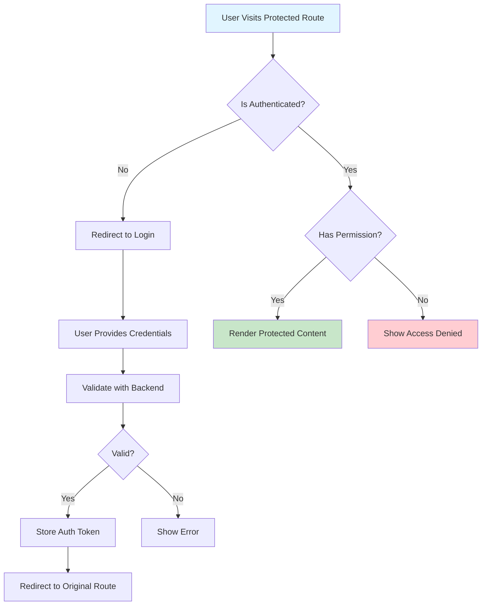
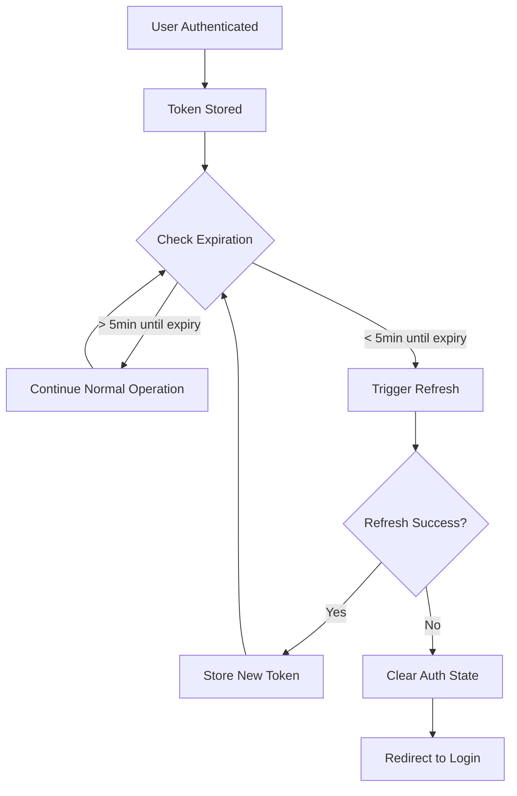

# Topic 47: Route Protection - Authentication and Authorization Mastery

## Overview

Route protection is critical for securing React applications by controlling access to routes based on authentication status, user roles, and permissions. This comprehensive guide covers authentication patterns, protected routes, role-based access control (RBAC), and security best practices for building secure React applications.

**What You'll Master:**
- Authentication strategies and implementation patterns
- Protected route components and guards
- Role-based and permission-based access control
- Token management and refresh strategies
- Auth state persistence and rehydration
- Multi-factor authentication (MFA) flows
- Session management and timeout handling
- Security best practices and common vulnerabilities

## 1. Authentication Fundamentals

### 1.1 Authentication Flow Overview



### 1.2 Auth Context Setup

```typescript
// Complete authentication context
import React, { 
  createContext, 
  useContext, 
  useState, 
  useEffect, 
  ReactNode 
} from 'react';

interface User {
  id: string;
  email: string;
  name: string;
  roles: string[];
  permissions: string[];
}

interface AuthContextType {
  user: User | null;
  isLoading: boolean;
  isAuthenticated: boolean;
  login: (email: string, password: string) => Promise<void>;
  logout: () => Promise<void>;
  checkAuth: () => Promise<void>;
  hasRole: (role: string) => boolean;
  hasPermission: (permission: string) => boolean;
}

const AuthContext = createContext<AuthContextType | undefined>(undefined);

export const useAuth = () => {
  const context = useContext(AuthContext);
  if (!context) {
    throw new Error('useAuth must be used within AuthProvider');
  }
  return context;
};

// Auth Provider Implementation
export const AuthProvider: React.FC<{ children: ReactNode }> = ({ children }) => {
  const [user, setUser] = useState<User | null>(null);
  const [isLoading, setIsLoading] = useState(true);

  // Check authentication on mount
  useEffect(() => {
    checkAuth();
  }, []);

  const checkAuth = async () => {
    try {
      const token = localStorage.getItem('authToken');
      if (!token) {
        setIsLoading(false);
        return;
      }

      const response = await fetch('/api/auth/me', {
        headers: {
          'Authorization': `Bearer ${token}`,
        },
      });

      if (response.ok) {
        const userData = await response.json();
        setUser(userData);
      } else {
        // Token invalid, clear it
        localStorage.removeItem('authToken');
      }
    } catch (error) {
      console.error('Auth check failed:', error);
    } finally {
      setIsLoading(false);
    }
  };

  const login = async (email: string, password: string) => {
    try {
      const response = await fetch('/api/auth/login', {
        method: 'POST',
        headers: { 'Content-Type': 'application/json' },
        body: JSON.stringify({ email, password }),
      });

      if (!response.ok) {
        throw new Error('Login failed');
      }

      const { token, user: userData } = await response.json();
      
      // Store token
      localStorage.setItem('authToken', token);
      
      // Update user state
      setUser(userData);
    } catch (error) {
      throw new Error('Invalid credentials');
    }
  };

  const logout = async () => {
    try {
      await fetch('/api/auth/logout', {
        method: 'POST',
        headers: {
          'Authorization': `Bearer ${localStorage.getItem('authToken')}`,
        },
      });
    } finally {
      // Clear local state regardless of API call result
      localStorage.removeItem('authToken');
      setUser(null);
    }
  };

  const hasRole = (role: string): boolean => {
    return user?.roles.includes(role) ?? false;
  };

  const hasPermission = (permission: string): boolean => {
    return user?.permissions.includes(permission) ?? false;
  };

  const value: AuthContextType = {
    user,
    isLoading,
    isAuthenticated: !!user,
    login,
    logout,
    checkAuth,
    hasRole,
    hasPermission,
  };

  return (
    <AuthContext.Provider value={value}>
      {children}
    </AuthContext.Provider>
  );
};
```

## 2. Protected Route Components

### 2.1 Basic Protected Route

```typescript
// Simple protected route wrapper
import React, { ReactNode } from 'react';
import { Navigate, useLocation } from 'react-router-dom';
import { useAuth } from './AuthContext';

interface ProtectedRouteProps {
  children: ReactNode;
  redirectTo?: string;
}

export const ProtectedRoute: React.FC<ProtectedRouteProps> = ({ 
  children, 
  redirectTo = '/login' 
}) => {
  const { isAuthenticated, isLoading } = useAuth();
  const location = useLocation();

  // Show loading state while checking auth
  if (isLoading) {
    return <div>Loading...</div>;
  }

  // Redirect to login if not authenticated
  if (!isAuthenticated) {
    return (
      <Navigate 
        to={redirectTo} 
        state={{ from: location }} 
        replace 
      />
    );
  }

  return <>{children}</>;
};

// Usage in router
import { BrowserRouter, Routes, Route } from 'react-router-dom';

const App: React.FC = () => {
  return (
    <AuthProvider>
      <BrowserRouter>
        <Routes>
          <Route path="/login" element={<Login />} />
          <Route path="/register" element={<Register />} />
          
          {/* Protected routes */}
          <Route
            path="/dashboard"
            element={
              <ProtectedRoute>
                <Dashboard />
              </ProtectedRoute>
            }
          />
          
          <Route
            path="/profile"
            element={
              <ProtectedRoute>
                <Profile />
              </ProtectedRoute>
            }
          />
        </Routes>
      </BrowserRouter>
    </AuthProvider>
  );
};
```

### 2.2 Role-Based Protected Route

```typescript
// Protected route with role requirements
interface RoleProtectedRouteProps {
  children: ReactNode;
  allowedRoles: string[];
  redirectTo?: string;
}

export const RoleProtectedRoute: React.FC<RoleProtectedRouteProps> = ({ 
  children, 
  allowedRoles,
  redirectTo = '/unauthorized' 
}) => {
  const { isAuthenticated, isLoading, hasRole } = useAuth();
  const location = useLocation();

  if (isLoading) {
    return <div>Loading...</div>;
  }

  if (!isAuthenticated) {
    return <Navigate to="/login" state={{ from: location }} replace />;
  }

  // Check if user has at least one of the allowed roles
  const hasRequiredRole = allowedRoles.some(role => hasRole(role));

  if (!hasRequiredRole) {
    return <Navigate to={redirectTo} replace />;
  }

  return <>{children}</>;
};

// Usage
<Route
  path="/admin"
  element={
    <RoleProtectedRoute allowedRoles={['admin', 'superadmin']}>
      <AdminPanel />
    </RoleProtectedRoute>
  }
/>
```

### 2.3 Permission-Based Protected Route

```typescript
// Protected route with permission checks
interface PermissionProtectedRouteProps {
  children: ReactNode;
  requiredPermissions: string[];
  requireAll?: boolean; // true = AND, false = OR
  redirectTo?: string;
}

export const PermissionProtectedRoute: React.FC<PermissionProtectedRouteProps> = ({ 
  children, 
  requiredPermissions,
  requireAll = false,
  redirectTo = '/unauthorized' 
}) => {
  const { isAuthenticated, isLoading, hasPermission } = useAuth();
  const location = useLocation();

  if (isLoading) {
    return <div>Loading...</div>;
  }

  if (!isAuthenticated) {
    return <Navigate to="/login" state={{ from: location }} replace />;
  }

  // Check permissions based on requireAll flag
  const hasRequiredPermissions = requireAll
    ? requiredPermissions.every(hasPermission)
    : requiredPermissions.some(hasPermission);

  if (!hasRequiredPermissions) {
    return <Navigate to={redirectTo} replace />;
  }

  return <>{children}</>;
};

// Usage
<Route
  path="/users/edit"
  element={
    <PermissionProtectedRoute 
      requiredPermissions={['users.edit', 'users.view']}
      requireAll={true}
    >
      <UserEditor />
    </PermissionProtectedRoute>
  }
/>
```

### 2.4 Outlet-Based Protected Routes

```typescript
// Protected routes using Outlet pattern
import { Outlet } from 'react-router-dom';

export const ProtectedOutlet: React.FC = () => {
  const { isAuthenticated, isLoading } = useAuth();
  const location = useLocation();

  if (isLoading) {
    return <LoadingSpinner />;
  }

  if (!isAuthenticated) {
    return <Navigate to="/login" state={{ from: location }} replace />;
  }

  return <Outlet />;
};

// Usage in router
const router = createBrowserRouter([
  {
    path: '/',
    element: <RootLayout />,
    children: [
      {
        path: 'login',
        element: <Login />,
      },
      {
        // Protected routes group
        element: <ProtectedOutlet />,
        children: [
          {
            path: 'dashboard',
            element: <Dashboard />,
          },
          {
            path: 'profile',
            element: <Profile />,
          },
          {
            path: 'settings',
            element: <Settings />,
          },
        ],
      },
    ],
  },
]);
```

## 3. React Router v6.4+ Loaders with Auth

### 3.1 Protected Loader Pattern

```typescript
// Loader that checks authentication
import { 
  redirect, 
  LoaderFunctionArgs 
} from 'react-router-dom';

// Auth check utility
async function requireAuth(request: Request): Promise<User> {
  const token = localStorage.getItem('authToken');
  
  if (!token) {
    const url = new URL(request.url);
    throw redirect(`/login?from=${url.pathname}`);
  }

  try {
    const response = await fetch('/api/auth/me', {
      headers: { 'Authorization': `Bearer ${token}` },
    });

    if (!response.ok) {
      throw redirect('/login');
    }

    return await response.json();
  } catch (error) {
    throw redirect('/login');
  }
}

// Protected loader example
export const dashboardLoader = async ({ request }: LoaderFunctionArgs) => {
  const user = await requireAuth(request);
  
  // Fetch dashboard data
  const data = await fetch('/api/dashboard', {
    headers: {
      'Authorization': `Bearer ${localStorage.getItem('authToken')}`,
    },
  }).then(r => r.json());

  return { user, data };
};

// Component using protected loader
const Dashboard: React.FC = () => {
  const { user, data } = useLoaderData() as DashboardData;

  return (
    <div>
      <h1>Welcome, {user.name}</h1>
      <DashboardContent data={data} />
    </div>
  );
};

// Router configuration
const router = createBrowserRouter([
  {
    path: '/dashboard',
    element: <Dashboard />,
    loader: dashboardLoader,
  },
]);
```

### 3.2 Role-Based Loader

```typescript
// Loader with role checking
async function requireRole(
  request: Request, 
  allowedRoles: string[]
): Promise<User> {
  const user = await requireAuth(request);
  
  const hasRole = allowedRoles.some(role => 
    user.roles.includes(role)
  );

  if (!hasRole) {
    throw redirect('/unauthorized');
  }

  return user;
}

// Admin loader
export const adminLoader = async ({ request }: LoaderFunctionArgs) => {
  const user = await requireRole(request, ['admin', 'superadmin']);
  
  const adminData = await fetch('/api/admin/data', {
    headers: {
      'Authorization': `Bearer ${localStorage.getItem('authToken')}`,
    },
  }).then(r => r.json());

  return { user, adminData };
};

// Router configuration
const router = createBrowserRouter([
  {
    path: '/admin',
    element: <AdminPanel />,
    loader: adminLoader,
    errorElement: <ErrorBoundary />,
  },
]);
```

## 4. Token Management

### 4.1 Token Refresh Strategy

```typescript
// Automatic token refresh implementation
class TokenManager {
  private refreshTimer: NodeJS.Timeout | null = null;
  private readonly refreshThreshold = 5 * 60 * 1000; // 5 minutes before expiry

  // Decode JWT to get expiration
  private decodeToken(token: string): { exp: number } {
    const payload = token.split('.')[1];
    return JSON.parse(atob(payload));
  }

  // Set up automatic refresh
  startRefreshTimer(token: string): void {
    this.stopRefreshTimer();

    const { exp } = this.decodeToken(token);
    const expiresAt = exp * 1000; // Convert to milliseconds
    const now = Date.now();
    const timeUntilRefresh = expiresAt - now - this.refreshThreshold;

    if (timeUntilRefresh > 0) {
      this.refreshTimer = setTimeout(() => {
        this.refreshToken();
      }, timeUntilRefresh);
    }
  }

  stopRefreshTimer(): void {
    if (this.refreshTimer) {
      clearTimeout(this.refreshTimer);
      this.refreshTimer = null;
    }
  }

  async refreshToken(): Promise<string | null> {
    try {
      const currentToken = localStorage.getItem('authToken');
      
      const response = await fetch('/api/auth/refresh', {
        method: 'POST',
        headers: {
          'Authorization': `Bearer ${currentToken}`,
        },
      });

      if (!response.ok) {
        throw new Error('Token refresh failed');
      }

      const { token } = await response.json();
      localStorage.setItem('authToken', token);
      
      // Start new refresh timer
      this.startRefreshTimer(token);
      
      return token;
    } catch (error) {
      console.error('Token refresh failed:', error);
      // Logout user on refresh failure
      localStorage.removeItem('authToken');
      window.location.href = '/login';
      return null;
    }
  }
}

// Use in auth provider
export const tokenManager = new TokenManager();

// In login function
const login = async (email: string, password: string) => {
  const { token, user } = await authAPI.login(email, password);
  localStorage.setItem('authToken', token);
  tokenManager.startRefreshTimer(token);
  setUser(user);
};

// In logout function
const logout = async () => {
  tokenManager.stopRefreshTimer();
  localStorage.removeItem('authToken');
  setUser(null);
};
```

### 4.2 Axios Interceptor for Token

```typescript
// Axios interceptor for automatic token injection and refresh
import axios, { 
  AxiosInstance, 
  AxiosError, 
  InternalAxiosRequestConfig 
} from 'axios';

class ApiClient {
  private client: AxiosInstance;
  private isRefreshing = false;
  private failedQueue: Array<{
    resolve: (value: string) => void;
    reject: (error: any) => void;
  }> = [];

  constructor(baseURL: string) {
    this.client = axios.create({
      baseURL,
      timeout: 10000,
    });

    this.setupInterceptors();
  }

  private setupInterceptors(): void {
    // Request interceptor - add token
    this.client.interceptors.request.use(
      (config: InternalAxiosRequestConfig) => {
        const token = localStorage.getItem('authToken');
        if (token && config.headers) {
          config.headers.Authorization = `Bearer ${token}`;
        }
        return config;
      },
      (error) => Promise.reject(error)
    );

    // Response interceptor - handle 401 and refresh token
    this.client.interceptors.response.use(
      (response) => response,
      async (error: AxiosError) => {
        const originalRequest = error.config as InternalAxiosRequestConfig & { 
          _retry?: boolean 
        };

        // Handle 401 Unauthorized
        if (error.response?.status === 401 && !originalRequest._retry) {
          if (this.isRefreshing) {
            // Queue this request until token is refreshed
            return new Promise((resolve, reject) => {
              this.failedQueue.push({ resolve, reject });
            }).then(token => {
              originalRequest.headers.Authorization = `Bearer ${token}`;
              return this.client(originalRequest);
            });
          }

          originalRequest._retry = true;
          this.isRefreshing = true;

          try {
            const newToken = await this.refreshToken();
            
            // Retry all queued requests with new token
            this.failedQueue.forEach(({ resolve }) => {
              resolve(newToken);
            });
            this.failedQueue = [];

            // Retry original request
            originalRequest.headers.Authorization = `Bearer ${newToken}`;
            return this.client(originalRequest);
          } catch (refreshError) {
            // Token refresh failed - logout user
            this.failedQueue.forEach(({ reject }) => {
              reject(refreshError);
            });
            this.failedQueue = [];
            
            localStorage.removeItem('authToken');
            window.location.href = '/login';
            
            return Promise.reject(refreshError);
          } finally {
            this.isRefreshing = false;
          }
        }

        return Promise.reject(error);
      }
    );
  }

  private async refreshToken(): Promise<string> {
    const response = await axios.post('/api/auth/refresh', {}, {
      headers: {
        Authorization: `Bearer ${localStorage.getItem('authToken')}`,
      },
    });

    const { token } = response.data;
    localStorage.setItem('authToken', token);
    return token;
  }

  get<T>(url: string, config?: any) {
    return this.client.get<T>(url, config);
  }

  post<T>(url: string, data?: any, config?: any) {
    return this.client.post<T>(url, data, config);
  }

  // Add other HTTP methods as needed
}

// Export singleton instance
export const apiClient = new ApiClient('/api');
```

## 5. Login and Registration Flows

### 5.1 Login Component

```typescript
// Complete login component with error handling
import React, { useState } from 'react';
import { useNavigate, useLocation, Link } from 'react-router-dom';
import { useAuth } from './AuthContext';

interface LocationState {
  from?: { pathname: string };
}

export const Login: React.FC = () => {
  const [email, setEmail] = useState('');
  const [password, setPassword] = useState('');
  const [error, setError] = useState('');
  const [isLoading, setIsLoading] = useState(false);

  const { login, isAuthenticated } = useAuth();
  const navigate = useNavigate();
  const location = useLocation();

  // Get the page user was trying to access
  const state = location.state as LocationState;
  const from = state?.from?.pathname || '/dashboard';

  // Redirect if already authenticated
  useEffect(() => {
    if (isAuthenticated) {
      navigate(from, { replace: true });
    }
  }, [isAuthenticated, from, navigate]);

  const handleSubmit = async (e: React.FormEvent) => {
    e.preventDefault();
    setError('');
    setIsLoading(true);

    try {
      await login(email, password);
      // Redirect happens via useEffect after state updates
    } catch (err) {
      setError(err instanceof Error ? err.message : 'Login failed');
    } finally {
      setIsLoading(false);
    }
  };

  return (
    <div className="login-container">
      <h1>Login</h1>
      
      {error && (
        <div className="error-message">{error}</div>
      )}

      <form onSubmit={handleSubmit}>
        <div className="form-group">
          <label htmlFor="email">Email</label>
          <input
            id="email"
            type="email"
            value={email}
            onChange={(e) => setEmail(e.target.value)}
            required
            disabled={isLoading}
            autoComplete="email"
          />
        </div>

        <div className="form-group">
          <label htmlFor="password">Password</label>
          <input
            id="password"
            type="password"
            value={password}
            onChange={(e) => setPassword(e.target.value)}
            required
            disabled={isLoading}
            autoComplete="current-password"
          />
        </div>

        <button 
          type="submit" 
          disabled={isLoading}
        >
          {isLoading ? 'Logging in...' : 'Login'}
        </button>
      </form>

      <div className="links">
        <Link to="/forgot-password">Forgot Password?</Link>
        <Link to="/register">Create Account</Link>
      </div>
    </div>
  );
};
```

### 5.2 Registration Component

```typescript
// Registration component with validation
export const Register: React.FC = () => {
  const [formData, setFormData] = useState({
    name: '',
    email: '',
    password: '',
    confirmPassword: '',
  });
  const [errors, setErrors] = useState<Record<string, string>>({});
  const [isLoading, setIsLoading] = useState(false);

  const navigate = useNavigate();

  const validate = (): boolean => {
    const newErrors: Record<string, string> = {};

    if (!formData.name) {
      newErrors.name = 'Name is required';
    }

    if (!formData.email) {
      newErrors.email = 'Email is required';
    } else if (!/\S+@\S+\.\S+/.test(formData.email)) {
      newErrors.email = 'Email is invalid';
    }

    if (!formData.password) {
      newErrors.password = 'Password is required';
    } else if (formData.password.length < 8) {
      newErrors.password = 'Password must be at least 8 characters';
    }

    if (formData.password !== formData.confirmPassword) {
      newErrors.confirmPassword = 'Passwords do not match';
    }

    setErrors(newErrors);
    return Object.keys(newErrors).length === 0;
  };

  const handleSubmit = async (e: React.FormEvent) => {
    e.preventDefault();

    if (!validate()) {
      return;
    }

    setIsLoading(true);

    try {
      const response = await fetch('/api/auth/register', {
        method: 'POST',
        headers: { 'Content-Type': 'application/json' },
        body: JSON.stringify({
          name: formData.name,
          email: formData.email,
          password: formData.password,
        }),
      });

      if (!response.ok) {
        const error = await response.json();
        throw new Error(error.message || 'Registration failed');
      }

      // Redirect to login after successful registration
      navigate('/login', {
        state: { message: 'Registration successful! Please login.' },
      });
    } catch (err) {
      setErrors({
        general: err instanceof Error ? err.message : 'Registration failed',
      });
    } finally {
      setIsLoading(false);
    }
  };

  const handleChange = (field: string, value: string) => {
    setFormData(prev => ({ ...prev, [field]: value }));
    // Clear error for this field
    if (errors[field]) {
      setErrors(prev => {
        const newErrors = { ...prev };
        delete newErrors[field];
        return newErrors;
      });
    }
  };

  return (
    <div className="register-container">
      <h1>Create Account</h1>

      {errors.general && (
        <div className="error-message">{errors.general}</div>
      )}

      <form onSubmit={handleSubmit}>
        <div className="form-group">
          <label htmlFor="name">Name</label>
          <input
            id="name"
            type="text"
            value={formData.name}
            onChange={(e) => handleChange('name', e.target.value)}
            disabled={isLoading}
          />
          {errors.name && <span className="error">{errors.name}</span>}
        </div>

        <div className="form-group">
          <label htmlFor="email">Email</label>
          <input
            id="email"
            type="email"
            value={formData.email}
            onChange={(e) => handleChange('email', e.target.value)}
            disabled={isLoading}
          />
          {errors.email && <span className="error">{errors.email}</span>}
        </div>

        <div className="form-group">
          <label htmlFor="password">Password</label>
          <input
            id="password"
            type="password"
            value={formData.password}
            onChange={(e) => handleChange('password', e.target.value)}
            disabled={isLoading}
          />
          {errors.password && <span className="error">{errors.password}</span>}
        </div>

        <div className="form-group">
          <label htmlFor="confirmPassword">Confirm Password</label>
          <input
            id="confirmPassword"
            type="password"
            value={formData.confirmPassword}
            onChange={(e) => handleChange('confirmPassword', e.target.value)}
            disabled={isLoading}
          />
          {errors.confirmPassword && (
            <span className="error">{errors.confirmPassword}</span>
          )}
        </div>

        <button type="submit" disabled={isLoading}>
          {isLoading ? 'Creating Account...' : 'Register'}
        </button>
      </form>

      <div className="links">
        <Link to="/login">Already have an account? Login</Link>
      </div>
    </div>
  );
};
```

## 6. Session Management

### 6.1 Idle Timeout

```typescript
// Automatic logout on inactivity
import { useEffect, useRef } from 'react';

interface UseIdleTimeoutOptions {
  timeout: number; // milliseconds
  onIdle: () => void;
  onActive?: () => void;
}

export const useIdleTimeout = ({
  timeout,
  onIdle,
  onActive,
}: UseIdleTimeoutOptions) => {
  const idleTimerRef = useRef<NodeJS.Timeout | null>(null);
  const isIdleRef = useRef(false);

  const resetTimer = () => {
    // Clear existing timer
    if (idleTimerRef.current) {
      clearTimeout(idleTimerRef.current);
    }

    // If was idle, trigger onActive
    if (isIdleRef.current && onActive) {
      onActive();
      isIdleRef.current = false;
    }

    // Set new timer
    idleTimerRef.current = setTimeout(() => {
      isIdleRef.current = true;
      onIdle();
    }, timeout);
  };

  useEffect(() => {
    // Events that indicate user activity
    const events = [
      'mousedown',
      'mousemove',
      'keypress',
      'scroll',
      'touchstart',
      'click',
    ];

    // Reset timer on any activity
    events.forEach(event => {
      document.addEventListener(event, resetTimer);
    });

    // Start initial timer
    resetTimer();

    // Cleanup
    return () => {
      events.forEach(event => {
        document.removeEventListener(event, resetTimer);
      });
      if (idleTimerRef.current) {
        clearTimeout(idleTimerRef.current);
      }
    };
  }, [timeout, onIdle, onActive]);
};

// Usage in app
const App: React.FC = () => {
  const { logout, isAuthenticated } = useAuth();
  const [showWarning, setShowWarning] = useState(false);

  // 15 minutes idle timeout
  useIdleTimeout({
    timeout: 15 * 60 * 1000,
    onIdle: () => {
      if (isAuthenticated) {
        setShowWarning(true);
        // Give user 1 minute to respond
        setTimeout(() => {
          logout();
        }, 60 * 1000);
      }
    },
    onActive: () => {
      setShowWarning(false);
    },
  });

  return (
    <div>
      {showWarning && (
        <IdleWarningModal onContinue={() => setShowWarning(false)} />
      )}
      {/* Rest of app */}
    </div>
  );
};
```

### 6.2 Session Storage vs Local Storage

```typescript
// Configurable storage strategy
type StorageType = 'local' | 'session';

class AuthStorage {
  private storage: Storage;

  constructor(type: StorageType = 'local') {
    this.storage = type === 'local' ? localStorage : sessionStorage;
  }

  setToken(token: string): void {
    this.storage.setItem('authToken', token);
  }

  getToken(): string | null {
    return this.storage.getItem('authToken');
  }

  removeToken(): void {
    this.storage.removeItem('authToken');
  }

  clear(): void {
    this.storage.clear();
  }
}

// Usage
const authStorage = new AuthStorage('session'); // or 'local'

// Session storage: Clears on browser/tab close
// Local storage: Persists across sessions
```

## 7. Security Best Practices

### 7.1 XSS Protection

```typescript
// Sanitize user input to prevent XSS attacks
import DOMPurify from 'dompurify';

// Safe rendering of user-generated content
const SafeUserContent: React.FC<{ content: string }> = ({ content }) => {
  const sanitized = DOMPurify.sanitize(content, {
    ALLOWED_TAGS: ['b', 'i', 'em', 'strong', 'a', 'p', 'br'],
    ALLOWED_ATTR: ['href', 'target'],
  });

  return (
    <div dangerouslySetInnerHTML={{ __html: sanitized }} />
  );
};

// Never use dangerouslySetInnerHTML without sanitization
// ❌ BAD
const UnsafeComponent = ({ html }) => (
  <div dangerouslySetInnerHTML={{ __html: html }} />
);

// ✅ GOOD
const SafeComponent = ({ html }) => (
  <div dangerouslySetInnerHTML={{ __html: DOMPurify.sanitize(html) }} />
);
```

### 7.2 CSRF Protection

```typescript
// CSRF token management
class CSRFProtection {
  private token: string | null = null;

  async getToken(): Promise<string> {
    if (!this.token) {
      const response = await fetch('/api/csrf-token');
      const data = await response.json();
      this.token = data.token;
    }
    return this.token;
  }

  async addTokenToRequest(config: RequestInit): Promise<RequestInit> {
    const token = await this.getToken();
    return {
      ...config,
      headers: {
        ...config.headers,
        'X-CSRF-Token': token,
      },
    };
  }
}

// Usage with fetch
const csrfProtection = new CSRFProtection();

const makeProtectedRequest = async (url: string, options: RequestInit) => {
  const config = await csrfProtection.addTokenToRequest(options);
  return fetch(url, config);
};
```

### 7.3 Secure HTTP-Only Cookies

```typescript
// Backend: Set HTTP-only cookies for auth tokens
// Express example
app.post('/api/auth/login', async (req, res) => {
  const { email, password } = req.body;
  
  // Validate credentials
  const user = await validateCredentials(email, password);
  
  if (!user) {
    return res.status(401).json({ error: 'Invalid credentials' });
  }

  // Generate token
  const token = generateToken(user);

  // Set HTTP-only cookie
  res.cookie('authToken', token, {
    httpOnly: true,      // Prevents JavaScript access
    secure: true,        // HTTPS only
    sameSite: 'strict',  // CSRF protection
    maxAge: 24 * 60 * 60 * 1000, // 24 hours
    path: '/',
  });

  res.json({ user });
});

// Frontend: Token automatically sent with requests
// No localStorage access needed - more secure
```

## 8. Higher-Order Thinking: Auth Architecture

### FAQ 1: Should I store JWT tokens in localStorage or cookies?

**Short Answer:** Use HTTP-only cookies for production applications; localStorage is acceptable for development but has security risks.

**Security Comparison:**

| Storage Method | XSS Vulnerable | CSRF Vulnerable | Best Practice |
|----------------|----------------|-----------------|---------------|
| localStorage | ✅ Yes | ❌ No | Development only |
| sessionStorage | ✅ Yes | ❌ No | Short-term sessions |
| HTTP-only Cookie | ❌ No | ⚠️ Mitigable | Production recommended |
| Memory only | ❌ No | ❌ No | Maximum security |

**Recommendation:**
```typescript
// ✅ PRODUCTION: HTTP-only cookies
// Backend sets cookie, frontend doesn't touch it
// Token automatically sent with requests

// ⚠️ DEVELOPMENT: localStorage with caution
localStorage.setItem('token', token);
// Vulnerable to XSS attacks
// Easier for development/testing

// 🔒 MAXIMUM SECURITY: Memory only
// Store token in memory state
// Requires refresh on page reload
// Most secure but least convenient
```

### FAQ 2: How do I handle authentication in a micro-frontend architecture?

**Short Answer:** Use a centralized authentication shell with shared auth state via custom events or shared state management.

**Architecture:**

```typescript
// Central Auth Shell
class AuthShell {
  private static instance: AuthShell;
  
  private constructor() {
    // Listen for auth events from micro-frontends
    window.addEventListener('auth:login', this.handleLogin);
    window.addEventListener('auth:logout', this.handleLogout);
  }

  static getInstance(): AuthShell {
    if (!AuthShell.instance) {
      AuthShell.instance = new AuthShell();
    }
    return AuthShell.instance;
  }

  async login(credentials: Credentials) {
    const user = await authAPI.login(credentials);
    
    // Broadcast to all micro-frontends
    window.dispatchEvent(new CustomEvent('auth:state-change', {
      detail: { user, isAuthenticated: true },
    }));
    
    return user;
  }

  async logout() {
    await authAPI.logout();
    
    window.dispatchEvent(new CustomEvent('auth:state-change', {
      detail: { user: null, isAuthenticated: false },
    }));
  }
}

// In each micro-frontend
const useSharedAuth = () => {
  const [user, setUser] = useState(null);

  useEffect(() => {
    const handleAuthChange = (e: CustomEvent) => {
      setUser(e.detail.user);
    };

    window.addEventListener('auth:state-change', handleAuthChange);
    return () => window.removeEventListener('auth:state-change', handleAuthChange);
  }, []);

  return { user, isAuthenticated: !!user };
};
```

### FAQ 3: What's the best way to handle auth token expiration?

**Short Answer:** Implement automatic token refresh before expiration, with fallback to login redirect on refresh failure.

**Complete Strategy:**



**Implementation:**
- Set refresh timer based on token expiration
- Refresh 5 minutes before expiry
- Queue failed requests during refresh
- Retry queued requests with new token
- Redirect to login if refresh fails

### FAQ 4: How do I handle authentication in SSR (Server-Side Rendering)?

**Short Answer:** Use cookies for SSR-compatible auth; validate tokens on both server and client.

**SSR Auth Pattern:**

```typescript
// Server-side (Next.js example)
export async function getServerSideProps(context) {
  const token = context.req.cookies.authToken;
  
  if (!token) {
    return {
      redirect: {
        destination: '/login',
        permanent: false,
      },
    };
  }

  try {
    const user = await validateToken(token);
    return {
      props: { user },
    };
  } catch (error) {
    return {
      redirect: {
        destination: '/login',
        permanent: false,
      },
    };
  }
}

// Client-side hydration
const ProtectedPage = ({ user }) => {
  const { setUser } = useAuth();
  
  useEffect(() => {
    // Hydrate auth state from server
    setUser(user);
  }, [user]);

  return <div>Protected Content for {user.name}</div>;
};
```

### FAQ 5: Should I implement "remember me" functionality?

**Short Answer:** Yes, but with proper security: use separate long-lived refresh tokens with rotation, not extended access tokens.

**Secure Implementation:**

```typescript
// Backend: Issue refresh token for "remember me"
app.post('/api/auth/login', (req, res) => {
  const { email, password, rememberMe } = req.body;
  
  const user = await validateCredentials(email, password);
  
  // Short-lived access token (15 minutes)
  const accessToken = generateToken(user, '15m');
  
  // Long-lived refresh token (7-30 days)
  const refreshToken = generateToken(user, rememberMe ? '30d' : '7d');
  
  // Store refresh token in database for rotation
  await storeRefreshToken(user.id, refreshToken);
  
  res.cookie('accessToken', accessToken, {
    httpOnly: true,
    maxAge: 15 * 60 * 1000,
  });
  
  res.cookie('refreshToken', refreshToken, {
    httpOnly: true,
    maxAge: rememberMe ? 30 * 24 * 60 * 60 * 1000 : 7 * 24 * 60 * 60 * 1000,
  });
  
  res.json({ user });
});

// Refresh token rotation on use
app.post('/api/auth/refresh', async (req, res) => {
  const oldRefreshToken = req.cookies.refreshToken;
  
  // Validate and rotate token
  const user = await validateRefreshToken(oldRefreshToken);
  await invalidateRefreshToken(oldRefreshToken);
  
  // Issue new tokens
  const newAccessToken = generateToken(user, '15m');
  const newRefreshToken = generateToken(user, '30d');
  
  await storeRefreshToken(user.id, newRefreshToken);
  
  // Send new tokens
  res.cookie('accessToken', newAccessToken, { httpOnly: true });
  res.cookie('refreshToken', newRefreshToken, { httpOnly: true });
  
  res.json({ success: true });
});
```

## 9. Senior SDE Interview Questions

### Question 1: Design a scalable authentication system for a multi-tenant SaaS application

**What Interviewers Assess:**
- System design thinking
- Security awareness
- Scalability considerations
- Real-world problem-solving

**Model Answer:**

"I'd design a multi-layered authentication system:

**Architecture:**
1. **Auth Service** - Centralized authentication microservice
2. **Tenant Isolation** - Database-per-tenant or row-level security
3. **SSO Integration** - Support for SAML, OAuth2, OIDC
4. **Token Strategy** - JWT with tenant context

**Key Components:**

```typescript
interface AuthToken {
  userId: string;
  tenantId: string;
  roles: string[];
  permissions: string[];
  exp: number;
}

// Multi-tenant auth middleware
const authenticate = async (req, res, next) => {
  const token = extractToken(req);
  const decoded = await verifyToken(token);
  
  // Validate tenant context
  const tenant = await getTenant(decoded.tenantId);
  if (!tenant.isActive) {
    return res.status(403).json({ error: 'Tenant inactive' });
  }
  
  // Attach to request
  req.user = decoded;
  req.tenant = tenant;
  next();
};
```

**Security Considerations:**
- Rate limiting per tenant
- Tenant data isolation
- Audit logging per tenant
- SSO with SAML/OIDC
- MFA support

**Scalability:**
- Stateless JWT tokens
- Redis for token blacklist
- CDN for public keys
- Horizontal scaling of auth service"

### Question 2: Implement OAuth2 authentication flow in a React application

**What Interviewers Assess:**
- OAuth understanding
- Async flow handling
- Security best practices
- Implementation skills

**Model Answer:**

```typescript
// OAuth2 Authorization Code Flow
class OAuth2Client {
  private readonly clientId: string;
  private readonly redirectUri: string;
  private readonly authEndpoint: string;
  private readonly tokenEndpoint: string;

  constructor(config: OAuth2Config) {
    this.clientId = config.clientId;
    this.redirectUri = config.redirectUri;
    this.authEndpoint = config.authEndpoint;
    this.tokenEndpoint = config.tokenEndpoint;
  }

  // Step 1: Generate authorization URL
  getAuthorizationUrl(): string {
    const state = this.generateState();
    const codeVerifier = this.generateCodeVerifier();
    const codeChallenge = this.generateCodeChallenge(codeVerifier);

    // Store for verification
    sessionStorage.setItem('oauth_state', state);
    sessionStorage.setItem('code_verifier', codeVerifier);

    const params = new URLSearchParams({
      client_id: this.clientId,
      redirect_uri: this.redirectUri,
      response_type: 'code',
      state,
      code_challenge: codeChallenge,
      code_challenge_method: 'S256',
      scope: 'openid profile email',
    });

    return `${this.authEndpoint}?${params}`;
  }

  // Step 2: Handle callback
  async handleCallback(callbackUrl: string): Promise<TokenResponse> {
    const url = new URL(callbackUrl);
    const code = url.searchParams.get('code');
    const state = url.searchParams.get('state');

    // Verify state
    const storedState = sessionStorage.getItem('oauth_state');
    if (state !== storedState) {
      throw new Error('State mismatch - potential CSRF attack');
    }

    // Exchange code for tokens
    const codeVerifier = sessionStorage.getItem('code_verifier');
    const tokens = await this.exchangeCodeForTokens(code!, codeVerifier!);

    // Cleanup
    sessionStorage.removeItem('oauth_state');
    sessionStorage.removeItem('code_verifier');

    return tokens;
  }

  // Step 3: Exchange authorization code for tokens
  private async exchangeCodeForTokens(
    code: string,
    codeVerifier: string
  ): Promise<TokenResponse> {
    const response = await fetch(this.tokenEndpoint, {
      method: 'POST',
      headers: { 'Content-Type': 'application/x-www-form-urlencoded' },
      body: new URLSearchParams({
        grant_type: 'authorization_code',
        code,
        redirect_uri: this.redirectUri,
        client_id: this.clientId,
        code_verifier: codeVerifier,
      }),
    });

    if (!response.ok) {
      throw new Error('Token exchange failed');
    }

    return response.json();
  }

  // PKCE helpers
  private generateState(): string {
    return this.base64URLEncode(crypto.getRandomValues(new Uint8Array(32)));
  }

  private generateCodeVerifier(): string {
    return this.base64URLEncode(crypto.getRandomValues(new Uint8Array(32)));
  }

  private async generateCodeChallenge(verifier: string): Promise<string> {
    const encoder = new TextEncoder();
    const data = encoder.encode(verifier);
    const hash = await crypto.subtle.digest('SHA-256', data);
    return this.base64URLEncode(new Uint8Array(hash));
  }

  private base64URLEncode(buffer: Uint8Array): string {
    return btoa(String.fromCharCode(...buffer))
      .replace(/\+/g, '-')
      .replace(/\//g, '_')
      .replace(/=/g, '');
  }
}

// Usage in React component
const useOAuth2 = () => {
  const navigate = useNavigate();
  const [isLoading, setIsLoading] = useState(false);

  const oauth2Client = new OAuth2Client({
    clientId: process.env.REACT_APP_OAUTH_CLIENT_ID,
    redirectUri: 'http://localhost:3000/callback',
    authEndpoint: 'https://oauth.example.com/authorize',
    tokenEndpoint: 'https://oauth.example.com/token',
  });

  const login = () => {
    const authUrl = oauth2Client.getAuthorizationUrl();
    window.location.href = authUrl;
  };

  const handleCallback = async () => {
    setIsLoading(true);
    try {
      const tokens = await oauth2Client.handleCallback(window.location.href);
      // Store tokens and redirect
      localStorage.setItem('access_token', tokens.access_token);
      navigate('/dashboard');
    } catch (error) {
      console.error('OAuth callback failed:', error);
      navigate('/login');
    } finally {
      setIsLoading(false);
    }
  };

  return { login, handleCallback, isLoading };
};
```

**Key Points:**
- PKCE for security (code verifier/challenge)
- State parameter for CSRF protection
- Token exchange server-side when possible
- Secure token storage
- Error handling and validation"

## Self-Assessment Checklist

Test your route protection mastery:

**Fundamentals:**
- [ ] Understand authentication vs authorization
- [ ] Can implement basic protected routes
- [ ] Know how to manage auth state with Context
- [ ] Understand JWT token structure

**Intermediate:**
- [ ] Implement role-based access control
- [ ] Handle token refresh automatically
- [ ] Build login and registration flows
- [ ] Manage session timeouts

**Advanced:**
- [ ] Implement permission-based authorization
- [ ] Handle OAuth2 flows securely
- [ ] Build MFA (multi-factor authentication)
- [ ] Implement secure token storage strategies

**Expert:**
- [ ] Design multi-tenant auth systems
- [ ] Implement SSO with SAML/OIDC
- [ ] Handle complex auth flows in micro-frontends
- [ ] Design scalable auth architectures

## Summary

Route protection is essential for building secure React applications. Key takeaways:

1. **Auth Context:** Centralized authentication state management
2. **Protected Routes:** Wrapper components for access control
3. **Role-Based Access:** Control access by user roles
4. **Permission-Based:** Fine-grained access control
5. **Token Management:** Automatic refresh and secure storage
6. **Session Management:** Idle timeout and storage strategies
7. **Security Best Practices:** XSS, CSRF, HTTP-only cookies
8. **OAuth2 Integration:** Industry-standard auth flows
9. **SSR Compatibility:** Cookie-based auth for server rendering
10. **Scalability:** Design for multi-tenant and micro-frontend architectures

**Next Steps:**
- Topic 48: Data Loading - Advanced data fetching patterns
- Topic 49: Route Transitions - Smooth navigation animations
- Topic 50: Testing Routes - Comprehensive routing tests

---

*Security is not an afterthought—it's the foundation. Master these authentication patterns to build applications that protect user data while delivering excellent user experience.*
