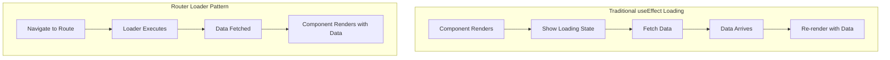

# Topic 48: Data Loading - Advanced Fetching Patterns with React Router

## Overview

React Router v6.4+ introduces powerful data loading capabilities with loaders, actions, and deferred data, enabling better UX through optimistic updates, streaming, and parallel loading. This comprehensive guide covers everything from basic data fetching to advanced patterns for production applications.

**What You'll Master:**
- Loader functions and data fetching strategies
- Actions for mutations and form handling
- Deferred data and streaming patterns
- Error handling and validation
- Optimistic UI updates
- Cache strategies and revalidation
- Parallel and serial data loading
- Type-safe data loading with TypeScript

## 1. Understanding React Router Data Loading

### 1.1 Traditional vs Router-Based Loading



**Comparison:**

| Aspect | useEffect | Router Loaders |
|--------|-----------|----------------|
| Timing | After render | Before render |
| Loading State | Manual | Automatic |
| Error Handling | Try-catch in component | Error boundaries |
| Race Conditions | Possible | Prevented |
| Waterfall Requests | Common | Preventable |
| Code Colocation | Separate | Centralized |

### 1.2 Data Loading Architecture

```typescript
// Complete data loading flow
interface DataLoadingFlow {
  // 1. Navigation starts
  navigation: {
    from: string;
    to: string;
    state: 'idle' | 'loading' | 'submitting';
  };
  
  // 2. Loader executes
  loader: {
    params: Record<string, string>;
    request: Request;
    context: any;
  };
  
  // 3. Data returned
  data: any;
  
  // 4. Component renders
  render: {
    data: any;
    navigation: NavigationState;
  };
}
```

## 2. Loader Functions

### 2.1 Basic Loaders

```typescript
// Simple data loader
import { LoaderFunctionArgs, useLoaderData } from 'react-router-dom';

interface User {
  id: string;
  name: string;
  email: string;
}

// Loader function
export const userLoader = async ({ 
  params 
}: LoaderFunctionArgs): Promise<User> => {
  const response = await fetch(`/api/users/${params.userId}`);
  
  if (!response.ok) {
    throw new Response('User not found', { status: 404 });
  }
  
  return response.json();
};

// Component using loader data
const UserProfile: React.FC = () => {
  const user = useLoaderData() as User;

  return (
    <div>
      <h1>{user.name}</h1>
      <p>Email: {user.email}</p>
    </div>
  );
};

// Router configuration
import { createBrowserRouter } from 'react-router-dom';

const router = createBrowserRouter([
  {
    path: '/users/:userId',
    element: <UserProfile />,
    loader: userLoader,
  },
]);
```

### 2.2 Parallel Data Loading

```typescript
// Load multiple data sources in parallel
interface DashboardData {
  user: User;
  stats: Statistics;
  notifications: Notification[];
  recentActivity: Activity[];
}

export const dashboardLoader = async ({ 
  request 
}: LoaderFunctionArgs): Promise<DashboardData> => {
  const token = localStorage.getItem('authToken');
  const headers = { 'Authorization': `Bearer ${token}` };

  // Fetch all data in parallel
  const [user, stats, notifications, recentActivity] = await Promise.all([
    fetch('/api/user', { headers }).then(r => r.json()),
    fetch('/api/stats', { headers }).then(r => r.json()),
    fetch('/api/notifications', { headers }).then(r => r.json()),
    fetch('/api/activity', { headers }).then(r => r.json()),
  ]);

  return { user, stats, notifications, recentActivity };
};

// Component with all data loaded
const Dashboard: React.FC = () => {
  const { user, stats, notifications, recentActivity } = 
    useLoaderData() as DashboardData;

  return (
    <div>
      <h1>Welcome, {user.name}</h1>
      <StatsWidget stats={stats} />
      <NotificationsList notifications={notifications} />
      <ActivityFeed activities={recentActivity} />
    </div>
  );
};
```

### 2.3 Dependent Data Loading

```typescript
// Serial data loading when dependencies exist
interface ProductPageData {
  product: Product;
  reviews: Review[];
  recommendations: Product[];
}

export const productLoader = async ({ 
  params 
}: LoaderFunctionArgs): Promise<ProductPageData> => {
  // Step 1: Load product first
  const product = await fetch(`/api/products/${params.productId}`)
    .then(r => r.json());

  // Step 2: Load dependent data in parallel
  const [reviews, recommendations] = await Promise.all([
    fetch(`/api/products/${product.id}/reviews`).then(r => r.json()),
    fetch(`/api/products/${product.id}/recommendations`).then(r => r.json()),
  ]);

  return { product, reviews, recommendations };
};
```

### 2.4 Conditional Data Loading

```typescript
// Load data conditionally based on parameters
export const searchLoader = async ({ 
  request 
}: LoaderFunctionArgs) => {
  const url = new URL(request.url);
  const query = url.searchParams.get('q');
  const category = url.searchParams.get('category');
  const sort = url.searchParams.get('sort') || 'relevance';

  // Only search if query provided
  if (!query) {
    return {
      results: [],
      totalCount: 0,
      query: '',
    };
  }

  // Build search parameters
  const searchParams = new URLSearchParams({
    q: query,
    sort,
    ...(category && { category }),
  });

  const response = await fetch(`/api/search?${searchParams}`);
  const data = await response.json();

  return {
    results: data.results,
    totalCount: data.totalCount,
    query,
    category,
    sort,
  };
};

// Component
const SearchPage: React.FC = () => {
  const { results, totalCount, query } = useLoaderData() as SearchData;

  if (!query) {
    return <SearchEmpty />;
  }

  return (
    <div>
      <h1>Search Results for "{query}"</h1>
      <p>{totalCount} results found</p>
      <SearchResults results={results} />
    </div>
  );
};
```

## 3. Action Functions

### 3.1 Form Actions

```typescript
// Action for form submission
import { 
  ActionFunctionArgs, 
  redirect,
  useActionData,
  Form,
} from 'react-router-dom';

interface ActionResult {
  success: boolean;
  errors?: Record<string, string>;
  data?: any;
}

// Create user action
export const createUserAction = async ({ 
  request 
}: ActionFunctionArgs): Promise<ActionResult | Response> => {
  const formData = await request.formData();
  
  const userData = {
    name: formData.get('name') as string,
    email: formData.get('email') as string,
    role: formData.get('role') as string,
  };

  // Server-side validation
  const errors: Record<string, string> = {};
  
  if (!userData.name) {
    errors.name = 'Name is required';
  }
  
  if (!userData.email) {
    errors.email = 'Email is required';
  } else if (!/\S+@\S+\.\S+/.test(userData.email)) {
    errors.email = 'Email is invalid';
  }

  if (Object.keys(errors).length > 0) {
    return { success: false, errors };
  }

  // Submit to API
  try {
    const response = await fetch('/api/users', {
      method: 'POST',
      headers: { 
        'Content-Type': 'application/json',
        'Authorization': `Bearer ${localStorage.getItem('authToken')}`,
      },
      body: JSON.stringify(userData),
    });

    if (!response.ok) {
      const error = await response.json();
      throw new Error(error.message);
    }

    const createdUser = await response.json();

    // Redirect on success
    return redirect(`/users/${createdUser.id}`);
  } catch (error) {
    return {
      success: false,
      errors: { 
        general: error instanceof Error ? error.message : 'Failed to create user' 
      },
    };
  }
};

// Component with form
const CreateUserForm: React.FC = () => {
  const actionData = useActionData() as ActionResult | undefined;

  return (
    <div>
      <h1>Create User</h1>

      {actionData?.errors?.general && (
        <div className="error-alert">{actionData.errors.general}</div>
      )}

      <Form method="post">
        <div className="form-group">
          <label htmlFor="name">Name</label>
          <input 
            type="text" 
            name="name" 
            id="name" 
            required 
          />
          {actionData?.errors?.name && (
            <span className="error">{actionData.errors.name}</span>
          )}
        </div>

        <div className="form-group">
          <label htmlFor="email">Email</label>
          <input 
            type="email" 
            name="email" 
            id="email" 
            required 
          />
          {actionData?.errors?.email && (
            <span className="error">{actionData.errors.email}</span>
          )}
        </div>

        <div className="form-group">
          <label htmlFor="role">Role</label>
          <select name="role" id="role" required>
            <option value="user">User</option>
            <option value="admin">Admin</option>
          </select>
        </div>

        <button type="submit">Create User</button>
      </Form>
    </div>
  );
};
```

### 3.2 Update and Delete Actions

```typescript
// Update action
export const updateUserAction = async ({ 
  request, 
  params 
}: ActionFunctionArgs): Promise<ActionResult | Response> => {
  const formData = await request.formData();
  const intent = formData.get('intent');

  // Handle different intents
  if (intent === 'delete') {
    await fetch(`/api/users/${params.userId}`, {
      method: 'DELETE',
      headers: {
        'Authorization': `Bearer ${localStorage.getItem('authToken')}`,
      },
    });
    return redirect('/users');
  }

  // Update user
  const updates = Object.fromEntries(formData);
  delete updates.intent;

  const response = await fetch(`/api/users/${params.userId}`, {
    method: 'PATCH',
    headers: { 
      'Content-Type': 'application/json',
      'Authorization': `Bearer ${localStorage.getItem('authToken')}`,
    },
    body: JSON.stringify(updates),
  });

  if (!response.ok) {
    return { 
      success: false, 
      errors: { general: 'Update failed' } 
    };
  }

  return { success: true, data: await response.json() };
};

// Component with multiple actions
const UserEditForm: React.FC = () => {
  const user = useLoaderData() as User;
  const actionData = useActionData() as ActionResult;
  const navigate = useNavigate();

  const handleDelete = () => {
    if (confirm('Are you sure you want to delete this user?')) {
      submit({ intent: 'delete' }, { method: 'post' });
    }
  };

  return (
    <div>
      <h1>Edit User</h1>

      {actionData?.success && (
        <div className="success">User updated successfully!</div>
      )}

      <Form method="post">
        <input type="text" name="name" defaultValue={user.name} />
        <input type="email" name="email" defaultValue={user.email} />
        
        <div className="actions">
          <button type="submit" name="intent" value="update">
            Update
          </button>
          <button 
            type="button" 
            onClick={handleDelete}
            className="danger"
          >
            Delete
          </button>
        </div>
      </Form>
    </div>
  );
};
```

### 3.3 Optimistic UI with Actions

```typescript
// Optimistic updates with immediate feedback
import { useFetcher, useNavigation } from 'react-router-dom';

const TodoItem: React.FC<{ todo: Todo }> = ({ todo }) => {
  const fetcher = useFetcher();
  
  // Optimistic state
  const isCompleted = fetcher.formData
    ? fetcher.formData.get('completed') === 'true'
    : todo.completed;
  
  const isDeleting = fetcher.formData?.get('intent') === 'delete';

  if (isDeleting) {
    return <div className="todo-item deleting">Deleting...</div>;
  }

  return (
    <div className={`todo-item ${isCompleted ? 'completed' : ''}`}>
      <fetcher.Form method="post" action={`/todos/${todo.id}`}>
        <input
          type="checkbox"
          name="completed"
          value="true"
          checked={isCompleted}
          onChange={(e) => {
            fetcher.submit(
              { completed: e.target.checked },
              { method: 'post' }
            );
          }}
        />
        <span>{todo.title}</span>
        
        <button
          type="submit"
          name="intent"
          value="delete"
          className="delete-btn"
        >
          Delete
        </button>
      </fetcher.Form>
    </div>
  );
};

// Action handler
export const todoAction = async ({ 
  request, 
  params 
}: ActionFunctionArgs) => {
  const formData = await request.formData();
  const intent = formData.get('intent');

  if (intent === 'delete') {
    await fetch(`/api/todos/${params.todoId}`, {
      method: 'DELETE',
    });
    return redirect('/todos');
  }

  // Update completed status
  const completed = formData.get('completed') === 'true';
  
  await fetch(`/api/todos/${params.todoId}`, {
    method: 'PATCH',
    headers: { 'Content-Type': 'application/json' },
    body: JSON.stringify({ completed }),
  });

  return { success: true };
};
```

## 4. Deferred Data (Streaming)

### 4.1 Basic Defer Usage

```typescript
// Defer slow data loading for better UX
import { 
  defer, 
  Await, 
  useLoaderData,
  useAsyncValue,
} from 'react-router-dom';
import { Suspense } from 'react';

interface PageData {
  critical: User;          // Loaded immediately
  slow: Promise<Report[]>; // Streamed later
}

// Loader with deferred data
export const pageLoader = async ({ params }: LoaderFunctionArgs) => {
  // Critical data - await it
  const critical = await fetch(`/api/users/${params.id}`)
    .then(r => r.json());

  // Slow data - don't await, return promise
  const slow = fetch('/api/reports')
    .then(r => r.json());

  return defer({
    critical,
    slow, // Promise, not resolved value
  });
};

// Component with deferred rendering
const UserDashboard: React.FC = () => {
  const data = useLoaderData() as PageData;

  return (
    <div>
      {/* Renders immediately */}
      <h1>Welcome, {data.critical.name}</h1>
      <UserInfo user={data.critical} />

      {/* Renders when promise resolves */}
      <Suspense fallback={<ReportsSkeleton />}>
        <Await
          resolve={data.slow}
          errorElement={<ReportsError />}
        >
          <ReportsList />
        </Await>
      </Suspense>
    </div>
  );
};

// Component that uses async value
const ReportsList: React.FC = () => {
  const reports = useAsyncValue() as Report[];

  return (
    <div>
      <h2>Reports</h2>
      {reports.map(report => (
        <ReportCard key={report.id} report={report} />
      ))}
    </div>
  );
};
```

### 4.2 Multiple Deferred Sections

```typescript
// Defer multiple slow data sources
interface ComplexPageData {
  user: User;                    // Critical
  stats: Promise<Statistics>;    // Deferred 1
  reports: Promise<Report[]>;    // Deferred 2
  charts: Promise<ChartData[]>;  // Deferred 3
}

export const complexPageLoader = async ({ 
  params 
}: LoaderFunctionArgs): Promise<ComplexPageData> => {
  // Critical data first
  const user = await fetch(`/api/users/${params.id}`)
    .then(r => r.json());

  // Defer all slow data
  return defer({
    user,
    stats: fetch('/api/stats').then(r => r.json()),
    reports: fetch('/api/reports').then(r => r.json()),
    charts: fetch('/api/charts').then(r => r.json()),
  });
};

// Component with multiple deferred sections
const ComplexDashboard: React.FC = () => {
  const data = useLoaderData() as ComplexPageData;

  return (
    <div>
      {/* Immediate */}
      <Header user={data.user} />

      <div className="dashboard-grid">
        {/* Deferred section 1 */}
        <Suspense fallback={<StatsSkeleton />}>
          <Await resolve={data.stats}>
            <StatsSection />
          </Await>
        </Suspense>

        {/* Deferred section 2 */}
        <Suspense fallback={<ReportsSkeleton />}>
          <Await resolve={data.reports}>
            <ReportsSection />
          </Await>
        </Suspense>

        {/* Deferred section 3 */}
        <Suspense fallback={<ChartsSkeleton />}>
          <Await resolve={data.charts}>
            <ChartsSection />
          </Await>
        </Suspense>
      </div>
    </div>
  );
};

// Individual sections use useAsyncValue
const StatsSection: React.FC = () => {
  const stats = useAsyncValue() as Statistics;
  return <StatsDisplay stats={stats} />;
};

const ReportsSection: React.FC = () => {
  const reports = useAsyncValue() as Report[];
  return <ReportsList reports={reports} />;
};

const ChartsSection: React.FC = () => {
  const charts = useAsyncValue() as ChartData[];
  return <ChartsDisplay charts={charts} />;
};
```

## 5. Error Handling

### 5.1 Loader Error Handling

```typescript
// Comprehensive error handling in loaders
export const productLoader = async ({ 
  params 
}: LoaderFunctionArgs): Promise<Product> => {
  try {
    const response = await fetch(`/api/products/${params.productId}`);

    if (response.status === 404) {
      throw new Response('Product not found', {
        status: 404,
        statusText: 'Not Found',
      });
    }

    if (response.status === 403) {
      throw new Response('Access denied', {
        status: 403,
        statusText: 'Forbidden',
      });
    }

    if (!response.ok) {
      throw new Response('Failed to load product', {
        status: response.status,
      });
    }

    return response.json();
  } catch (error) {
    if (error instanceof Response) {
      throw error;
    }
    
    // Network or other errors
    throw new Response('Network error', {
      status: 500,
      statusText: 'Internal Server Error',
    });
  }
};

// Error boundary component
import { useRouteError, isRouteErrorResponse, Link } from 'react-router-dom';

export const ProductErrorBoundary: React.FC = () => {
  const error = useRouteError();

  if (isRouteErrorResponse(error)) {
    if (error.status === 404) {
      return (
        <div className="error-page">
          <h1>404 - Product Not Found</h1>
          <p>The product you're looking for doesn't exist.</p>
          <Link to="/products">View All Products</Link>
        </div>
      );
    }

    if (error.status === 403) {
      return (
        <div className="error-page">
          <h1>403 - Access Denied</h1>
          <p>You don't have permission to view this product.</p>
          <Link to="/">Go Home</Link>
        </div>
      );
    }

    return (
      <div className="error-page">
        <h1>{error.status} - {error.statusText}</h1>
        <p>Something went wrong.</p>
      </div>
    );
  }

  return (
    <div className="error-page">
      <h1>Unexpected Error</h1>
      <p>An unexpected error occurred.</p>
    </div>
  );
};

// Router configuration with error element
const router = createBrowserRouter([
  {
    path: '/products/:productId',
    element: <ProductDetail />,
    loader: productLoader,
    errorElement: <ProductErrorBoundary />,
  },
]);
```

### 5.2 Action Error Handling

```typescript
// Action with comprehensive error handling
export const updateProfileAction = async ({ 
  request 
}: ActionFunctionArgs): Promise<ActionResult | Response> => {
  const formData = await request.formData();
  
  try {
    const response = await fetch('/api/profile', {
      method: 'PATCH',
      headers: { 
        'Content-Type': 'application/json',
        'Authorization': `Bearer ${localStorage.getItem('authToken')}`,
      },
      body: JSON.stringify(Object.fromEntries(formData)),
    });

    if (response.status === 400) {
      const { errors } = await response.json();
      return { success: false, errors };
    }

    if (response.status === 401) {
      // Session expired
      throw redirect('/login?session=expired');
    }

    if (!response.ok) {
      throw new Error('Update failed');
    }

    return { 
      success: true, 
      data: await response.json(),
      message: 'Profile updated successfully',
    };
  } catch (error) {
    if (error instanceof Response) {
      throw error;
    }

    return {
      success: false,
      errors: { 
        general: error instanceof Error ? error.message : 'Unknown error' 
      },
    };
  }
};
```

## 6. useFetcher for Non-Navigation Mutations

### 6.1 Basic Fetcher Usage

```typescript
// useFetcher for actions without navigation
import { useFetcher } from 'react-router-dom';

const NewsletterSignup: React.FC = () => {
  const fetcher = useFetcher();
  
  const isSubmitting = fetcher.state === 'submitting';
  const isSuccess = fetcher.data?.success;

  return (
    <div>
      <h3>Subscribe to Newsletter</h3>
      
      {isSuccess ? (
        <div className="success">Thanks for subscribing!</div>
      ) : (
        <fetcher.Form method="post" action="/api/newsletter">
          <input 
            type="email" 
            name="email" 
            placeholder="Your email"
            required
            disabled={isSubmitting}
          />
          <button type="submit" disabled={isSubmitting}>
            {isSubmitting ? 'Subscribing...' : 'Subscribe'}
          </button>
        </fetcher.Form>
      )}
    </div>
  );
};

// Action handler
export const newsletterAction = async ({ 
  request 
}: ActionFunctionArgs) => {
  const formData = await request.formData();
  const email = formData.get('email');

  await fetch('/api/newsletter', {
    method: 'POST',
    headers: { 'Content-Type': 'application/json' },
    body: JSON.stringify({ email }),
  });

  return { success: true };
};
```

### 6.2 Multiple Fetchers

```typescript
// Managing multiple concurrent fetchers
const ProductPage: React.FC = () => {
  const product = useLoaderData() as Product;
  const likeFetcher = useFetcher();
  const saveFetcher = useFetcher();

  const isLiked = likeFetcher.formData 
    ? likeFetcher.formData.get('liked') === 'true'
    : product.isLiked;

  const isSaved = saveFetcher.formData
    ? saveFetcher.formData.get('saved') === 'true'
    : product.isSaved;

  return (
    <div>
      <h1>{product.name}</h1>

      {/* Like button */}
      <likeFetcher.Form method="post" action="/api/like">
        <input type="hidden" name="productId" value={product.id} />
        <input type="hidden" name="liked" value={String(!isLiked)} />
        <button type="submit">
          {isLiked ? '❤️ Liked' : '🤍 Like'}
        </button>
      </likeFetcher.Form>

      {/* Save button */}
      <saveFetcher.Form method="post" action="/api/save">
        <input type="hidden" name="productId" value={product.id} />
        <input type="hidden" name="saved" value={String(!isSaved)} />
        <button type="submit">
          {isSaved ? '🔖 Saved' : '📑 Save'}
        </button>
      </saveFetcher.Form>
    </div>
  );
};
```

## 7. Cache and Revalidation

### 7.1 Manual Revalidation

```typescript
// Force revalidation of loader data
import { useRevalidator } from 'react-router-dom';

const Dashboard: React.FC = () => {
  const data = useLoaderData() as DashboardData;
  const revalidator = useRevalidator();

  const handleRefresh = () => {
    revalidator.revalidate();
  };

  return (
    <div>
      <button onClick={handleRefresh} disabled={revalidator.state === 'loading'}>
        {revalidator.state === 'loading' ? 'Refreshing...' : 'Refresh Data'}
      </button>
      
      <DashboardContent data={data} />
    </div>
  );
};
```

### 7.2 Automatic Revalidation

```typescript
// Auto-revalidate on focus/reconnect
import { useEffect } from 'react';
import { useRevalidator } from 'react-router-dom';

export const useAutoRevalidate = (options?: {
  onFocus?: boolean;
  onReconnect?: boolean;
  interval?: number;
}) => {
  const revalidator = useRevalidator();
  const { onFocus = true, onReconnect = true, interval } = options || {};

  useEffect(() => {
    if (onFocus) {
      const handleFocus = () => {
        revalidator.revalidate();
      };
      window.addEventListener('focus', handleFocus);
      return () => window.removeEventListener('focus', handleFocus);
    }
  }, [onFocus, revalidator]);

  useEffect(() => {
    if (onReconnect) {
      const handleOnline = () => {
        revalidator.revalidate();
      };
      window.addEventListener('online', handleOnline);
      return () => window.removeEventListener('online', handleOnline);
    }
  }, [onReconnect, revalidator]);

  useEffect(() => {
    if (interval) {
      const timer = setInterval(() => {
        revalidator.revalidate();
      }, interval);
      return () => clearInterval(timer);
    }
  }, [interval, revalidator]);
};

// Usage
const Dashboard: React.FC = () => {
  const data = useLoaderData() as DashboardData;
  
  // Revalidate on focus, reconnect, and every 30 seconds
  useAutoRevalidate({
    onFocus: true,
    onReconnect: true,
    interval: 30000,
  });

  return <DashboardContent data={data} />;
};
```

### 7.3 Cache Strategy

```typescript
// Implement cache layer for loaders
class LoaderCache {
  private cache = new Map<string, {
    data: any;
    timestamp: number;
    ttl: number;
  }>();

  set(key: string, data: any, ttl: number = 5 * 60 * 1000): void {
    this.cache.set(key, {
      data,
      timestamp: Date.now(),
      ttl,
    });
  }

  get(key: string): any | null {
    const cached = this.cache.get(key);
    
    if (!cached) {
      return null;
    }

    const age = Date.now() - cached.timestamp;
    
    if (age > cached.ttl) {
      this.cache.delete(key);
      return null;
    }

    return cached.data;
  }

  clear(): void {
    this.cache.clear();
  }

  invalidate(pattern: RegExp): void {
    for (const [key] of this.cache) {
      if (pattern.test(key)) {
        this.cache.delete(key);
      }
    }
  }
}

export const loaderCache = new LoaderCache();

// Cached loader
export const cachedProductLoader = async ({ 
  params 
}: LoaderFunctionArgs): Promise<Product> => {
  const cacheKey = `product:${params.productId}`;
  
  // Check cache first
  const cached = loaderCache.get(cacheKey);
  if (cached) {
    return cached;
  }

  // Fetch from API
  const product = await fetch(`/api/products/${params.productId}`)
    .then(r => r.json());

  // Cache result (5 minutes TTL)
  loaderCache.set(cacheKey, product, 5 * 60 * 1000);

  return product;
};

// Invalidate cache after mutations
export const updateProductAction = async ({ 
  request, 
  params 
}: ActionFunctionArgs) => {
  const updates = await request.formData();
  
  await fetch(`/api/products/${params.productId}`, {
    method: 'PATCH',
    body: updates,
  });

  // Invalidate product cache
  loaderCache.invalidate(new RegExp(`^product:${params.productId}`));

  return redirect(`/products/${params.productId}`);
};
```

## 8. Higher-Order Thinking: Data Loading Strategy

### FAQ 1: When should I use defer vs loading all data upfront?

**Short Answer:** Defer slow, non-critical data to render fast; load critical data upfront.

**Decision Matrix:**

| Data Type | Critical Path? | Load Time | Strategy |
|-----------|---------------|-----------|----------|
| User profile | Yes | Fast (<100ms) | Load upfront |
| Page title | Yes | Fast | Load upfront |
| Analytics data | No | Slow (>1s) | Defer |
| Comments | No | Medium | Defer |
| Product images | Yes | Medium | Defer with skeleton |
| SEO metadata | Yes | Fast | Load upfront |

**Performance Impact:**

```typescript
// Without defer: Slow
export const slowLoader = async () => {
  const [critical, slow1, slow2] = await Promise.all([
    fetch('/api/critical'),     // 100ms
    fetch('/api/slow1'),        // 2s
    fetch('/api/slow2'),        // 3s
  ]);
  return { critical, slow1, slow2 };
};
// Total: 3s before render

// With defer: Fast
export const fastLoader = async () => {
  const critical = await fetch('/api/critical'); // 100ms
  
  return defer({
    critical,
    slow1: fetch('/api/slow1'),
    slow2: fetch('/api/slow2'),
  });
};
// First render: 100ms
// Full page: 3s (but user sees content immediately)
```

**Best Practice:** Defer data that takes >500ms and isn't needed for initial render.

### FAQ 2: Should I use loaders or useEffect for data fetching?

**Short Answer:** Use loaders for route-level data; use useEffect for component-level interactions.

**When to Use Loaders:**
- Initial route data
- Data dependent on URL params
- Form submissions (use actions)
- SEO-critical data
- Data that determines page structure

**When to Use useEffect:**
- Data that changes based on user interactions
- Polling/real-time updates
- Data dependent on component state
- Third-party integrations
- WebSocket connections

**Example:**

```typescript
// ✅ Loader: Route-level product data
export const productLoader = async ({ params }) => {
  return fetch(`/api/products/${params.id}`).then(r => r.json());
};

// ✅ useEffect: Interactive reviews with pagination
const ProductReviews: React.FC<{ productId: string }> = ({ productId }) => {
  const [reviews, setReviews] = useState([]);
  const [page, setPage] = useState(1);

  useEffect(() => {
    fetch(`/api/reviews?product=${productId}&page=${page}`)
      .then(r => r.json())
      .then(setReviews);
  }, [productId, page]);

  return <ReviewList reviews={reviews} onPageChange={setPage} />;
};
```

### FAQ 3: How do I handle race conditions in data loading?

**Short Answer:** React Router loaders prevent race conditions automatically; for useEffect, use AbortController.

**Router Loaders (No Race Conditions):**
```typescript
// React Router cancels previous loaders automatically
export const searchLoader = async ({ request }) => {
  const url = new URL(request.url);
  const query = url.searchParams.get('q');
  
  // If user navigates away, this is automatically cancelled
  return fetch(`/api/search?q=${query}`).then(r => r.json());
};
```

**useEffect (Manual Cancellation):**
```typescript
// ✅ Prevent race conditions with AbortController
const SearchResults: React.FC = () => {
  const [query, setQuery] = useState('');
  const [results, setResults] = useState([]);

  useEffect(() => {
    const controller = new AbortController();

    const search = async () => {
      try {
        const response = await fetch(`/api/search?q=${query}`, {
          signal: controller.signal,
        });
        const data = await response.json();
        setResults(data);
      } catch (error) {
        if (error.name !== 'AbortError') {
          console.error('Search failed:', error);
        }
      }
    };

    if (query) {
      search();
    }

    return () => controller.abort();
  }, [query]);

  return <div>{/* ... */}</div>;
};
```

### FAQ 4: What's the best pattern for loading paginated data?

**Short Answer:** Use URL search params for pagination to enable bookmarking and back/forward navigation.

**Complete Implementation:**

```typescript
// Loader with pagination
export const productsLoader = async ({ request }: LoaderFunctionArgs) => {
  const url = new URL(request.url);
  const page = parseInt(url.searchParams.get('page') || '1');
  const limit = parseInt(url.searchParams.get('limit') || '20');

  const response = await fetch(
    `/api/products?page=${page}&limit=${limit}`
  );
  const data = await response.json();

  return {
    products: data.items,
    pagination: {
      page,
      limit,
      total: data.total,
      totalPages: Math.ceil(data.total / limit),
    },
  };
};

// Component
const ProductList: React.FC = () => {
  const { products, pagination } = useLoaderData() as ProductListData;
  const [searchParams, setSearchParams] = useSearchParams();

  const goToPage = (newPage: number) => {
    setSearchParams({ 
      page: String(newPage),
      limit: String(pagination.limit),
    });
  };

  return (
    <div>
      <div className="products">
        {products.map(p => <ProductCard key={p.id} product={p} />)}
      </div>

      <div className="pagination">
        <button 
          disabled={pagination.page === 1}
          onClick={() => goToPage(pagination.page - 1)}
        >
          Previous
        </button>
        
        <span>Page {pagination.page} of {pagination.totalPages}</span>
        
        <button
          disabled={pagination.page === pagination.totalPages}
          onClick={() => goToPage(pagination.page + 1)}
        >
          Next
        </button>
      </div>
    </div>
  );
};
```

### FAQ 5: How do I handle optimistic updates that might fail?

**Short Answer:** Show optimistic state immediately, revert on error, provide clear feedback.

**Robust Pattern:**

```typescript
const LikeButton: React.FC<{ post: Post }> = ({ post }) => {
  const fetcher = useFetcher();
  const [localLiked, setLocalLiked] = useState(post.isLiked);

  // Optimistic state
  const isLiked = fetcher.state === 'submitting'
    ? !localLiked  // Toggle optimistically
    : fetcher.data?.isLiked ?? localLiked;

  // Revert on error
  useEffect(() => {
    if (fetcher.data?.error) {
      setLocalLiked(post.isLiked); // Revert to original
    }
  }, [fetcher.data, post.isLiked]);

  const handleLike = () => {
    setLocalLiked(!localLiked);
    fetcher.submit(
      { postId: post.id, liked: !localLiked },
      { method: 'post', action: '/api/like' }
    );
  };

  return (
    <button onClick={handleLike} disabled={fetcher.state === 'submitting'}>
      {isLiked ? '❤️' : '🤍'} 
      {fetcher.state === 'submitting' && ' ...'}
      {fetcher.data?.error && ' Failed!'}
    </button>
  );
};
```

## 9. Senior SDE Interview Questions

### Question 1: Design a data loading strategy for a data-heavy dashboard with multiple widgets

**What Interviewers Assess:**
- Performance optimization
- UX considerations
- System design
- Trade-off analysis

**Model Answer:**

"I'd implement a tiered loading strategy with critical path optimization:

**Architecture:**
```typescript
// 1. Critical data (immediate)
const critical = await fetch('/api/user'); // 100ms

// 2. Important data (deferred, visible)
const important = defer({
  stats: fetch('/api/stats'),     // 500ms
  alerts: fetch('/api/alerts'),   // 300ms
});

// 3. Nice-to-have data (lazy loaded on interaction)
// Load on tab switch or scroll into view

// 4. Background data (lowest priority)
// Prefetch for likely next actions
```

**Implementation:**
```typescript
export const dashboardLoader = async () => {
  // Critical: User and permissions
  const user = await fetch('/api/user').then(r => r.json());

  // Defer everything else
  return defer({
    user,
    stats: fetch('/api/stats').then(r => r.json()),
    charts: fetch('/api/charts').then(r => r.json()),
    reports: fetch('/api/reports').then(r => r.json()),
  });
};

// Component with progressive loading
const Dashboard = () => {
  const data = useLoaderData();

  return (
    <>
      <Header user={data.user} />
      
      <Suspense fallback={<StatsSkeleton />}>
        <Await resolve={data.stats}>
          <StatsWidget />
        </Await>
      </Suspense>

      <Tabs>
        <Tab label="Charts">
          <Suspense fallback={<ChartsSkeleton />}>
            <Await resolve={data.charts}>
              <ChartsWidget />
            </Await>
          </Suspense>
        </Tab>
        <Tab label="Reports">
          <Suspense fallback={<ReportsSkeleton />}>
            <Await resolve={data.reports}>
              <ReportsWidget />
            </Await>
          </Suspense>
        </Tab>
      </Tabs>
    </>
  );
};
```

**Key Principles:**
- Load critical data first (user sees something in <200ms)
- Defer non-critical data with suspense boundaries
- Cache aggressively with appropriate TTLs
- Implement error boundaries per widget
- Measure and optimize based on real-world metrics"

### Question 2: How would you implement offline-first data loading in a React Router application?

**What Interviewers Assess:**
- Offline capability understanding
- Service worker knowledge
- Sync strategies
- Edge case handling

**Model Answer:**

```typescript
// Offline-first loader pattern
export const offlineFirstLoader = async ({ 
  params 
}: LoaderFunctionArgs) => {
  const cacheKey = `product:${params.id}`;

  try {
    // Try network first
    const response = await fetch(`/api/products/${params.id}`, {
      // Short timeout for offline detection
      signal: AbortSignal.timeout(5000),
    });
    
    const product = await response.json();
    
    // Cache for offline use
    await cacheAPI.put(cacheKey, product);
    
    return product;
  } catch (error) {
    // Network failed, try cache
    const cached = await cacheAPI.get(cacheKey);
    
    if (cached) {
      return {
        ...cached,
        isStale: true,
        cachedAt: cached.timestamp,
      };
    }
    
    throw new Response('Product unavailable offline', {
      status: 503,
    });
  }
};

// Service worker strategy
self.addEventListener('fetch', (event) => {
  event.respondWith(
    caches.match(event.request).then((cached) => {
      // Return cached response if available
      if (cached) {
        // Update cache in background
        fetch(event.request).then((response) => {
          caches.open('dynamic').then((cache) => {
            cache.put(event.request, response.clone());
          });
        });
        return cached;
      }

      // No cache, fetch from network
      return fetch(event.request);
    })
  );
});
```

**Components:**
1. Service worker for offline caching
2. Background sync for queued mutations
3. IndexedDB for structured offline data
4. Conflict resolution strategy
5. UI indicators for offline/stale data"

## Self-Assessment Checklist

Test your data loading mastery:

**Fundamentals:**
- [ ] Understand loader vs useEffect trade-offs
- [ ] Can implement basic loaders and actions
- [ ] Know how to use useLoaderData and useActionData
- [ ] Understand error handling in loaders

**Intermediate:**
- [ ] Implement parallel data loading patterns
- [ ] Use defer for streaming data
- [ ] Handle form actions with validation
- [ ] Use useFetcher for non-navigation mutations

**Advanced:**
- [ ] Implement cache strategies for loaders
- [ ] Build optimistic UI patterns
- [ ] Handle automatic revalidation
- [ ] Manage multiple concurrent fetchers

**Expert:**
- [ ] Design offline-first data loading
- [ ] Optimize data loading for performance
- [ ] Implement complex dependent data patterns
- [ ] Build reusable data loading abstractions

## Summary

Advanced data loading with React Router enables exceptional user experiences. Key takeaways:

1. **Loaders:** Load data before component renders
2. **Actions:** Handle mutations and form submissions
3. **Defer:** Stream slow data for faster initial renders
4. **useFetcher:** Non-navigation mutations with optimistic UI
5. **Error Handling:** Comprehensive error boundaries and validation
6. **Caching:** Implement smart cache strategies
7. **Revalidation:** Automatic and manual refresh patterns
8. **Parallel Loading:** Fetch multiple resources efficiently
9. **Type Safety:** TypeScript for loader and action data
10. **Performance:** Optimize with defer, cache, and strategic loading

**Next Steps:**
- Topic 49: Route Transitions - Smooth animations and navigation
- Topic 50: Testing Routes - Comprehensive router testing
- Topic 51: Router Performance - Optimization strategies

---

*Data loading is the bridge between user intent and application state. Master these patterns to build applications that feel instant while handling complex data requirements.*
