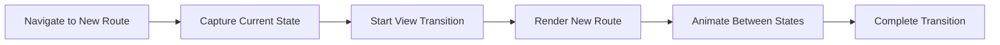

# Topic 49: Route Transitions - Smooth Navigation Animations

## Overview

Route transitions and animations enhance user experience by providing visual continuity during navigation. This comprehensive guide covers modern view transitions, CSS animations, animation libraries, and performance considerations for creating smooth, professional route transitions in React applications.

**What You'll Master:**
- View Transitions API for modern browsers
- CSS-based route transitions
- React Transition Group integration
- Framer Motion for advanced animations
- Page transition patterns and best practices
- Performance optimization for animations
- Accessibility considerations
- Cross-browser compatibility strategies

## 1. Modern View Transitions API

### 1.1 Native View Transitions



### 1.2 Basic View Transition Hook

```typescript
// Custom hook for view transitions
import { useNavigate } from 'react-router-dom';

export const useViewTransition = () => {
  const navigate = useNavigate();

  const transitionTo = (to: string, options?: NavigateOptions) => {
    // Check if View Transitions API is supported
    if ('startViewTransition' in document) {
      (document as any).startViewTransition(() => {
        navigate(to, options);
      });
    } else {
      // Fallback for unsupported browsers
      navigate(to, options);
    }
  };

  return transitionTo;
};

// Usage
const Navigation: React.FC = () => {
  const transitionTo = useViewTransition();

  return (
    <nav>
      <button onClick={() => transitionTo('/')}>Home</button>
      <button onClick={() => transitionTo('/about')}>About</button>
      <button onClick={() => transitionTo('/products')}>Products</button>
    </nav>
  );
};
```

### 1.3 Animated Link Component

```typescript
// Link component with automatic view transitions
import React from 'react';
import { Link, LinkProps, useNavigate } from 'react-router-dom';

interface AnimatedLinkProps extends Omit<LinkProps, 'onClick'> {
  transition?: boolean;
}

export const AnimatedLink: React.FC<AnimatedLinkProps> = ({
  to,
  transition = true,
  children,
  ...props
}) => {
  const navigate = useNavigate();

  const handleClick = (e: React.MouseEvent<HTMLAnchorElement>) => {
    if (!transition) return;

    e.preventDefault();

    if ('startViewTransition' in document) {
      (document as any).startViewTransition(() => {
        navigate(to as string);
      });
    } else {
      navigate(to as string);
    }
  };

  return (
    <Link to={to} onClick={handleClick} {...props}>
      {children}
    </Link>
  );
};

// Usage
const App: React.FC = () => {
  return (
    <nav>
      <AnimatedLink to="/">Home</AnimatedLink>
      <AnimatedLink to="/about">About</AnimatedLink>
      <AnimatedLink to="/products" transition={false}>
        Products (No Transition)
      </AnimatedLink>
    </nav>
  );
};
```

### 1.4 CSS for View Transitions

```css
/* View transition styles */
::view-transition-old(root) {
  animation: fade-out 0.3s ease-out;
}

::view-transition-new(root) {
  animation: fade-in 0.3s ease-in;
}

@keyframes fade-out {
  from {
    opacity: 1;
  }
  to {
    opacity: 0;
  }
}

@keyframes fade-in {
  from {
    opacity: 0;
  }
  to {
    opacity: 1;
  }
}

/* Slide transition */
::view-transition-old(root) {
  animation: slide-out 0.3s ease-out;
}

::view-transition-new(root) {
  animation: slide-in 0.3s ease-in;
}

@keyframes slide-out {
  from {
    transform: translateX(0);
  }
  to {
    transform: translateX(-100%);
  }
}

@keyframes slide-in {
  from {
    transform: translateX(100%);
  }
  to {
    transform: translateX(0);
  }
}

/* Named transitions for specific elements */
.hero-image {
  view-transition-name: hero;
}

::view-transition-old(hero),
::view-transition-new(hero) {
  animation-duration: 0.5s;
  animation-timing-function: ease-in-out;
}
```

## 2. CSS-Based Transitions

### 2.1 Basic CSS Transitions

```typescript
// CSS transitions with React Router
import React, { useEffect, useState } from 'react';
import { useLocation } from 'react-router-dom';

const AnimatedRoutes: React.FC<{ children: React.ReactNode }> = ({ children }) => {
  const location = useLocation();
  const [displayLocation, setDisplayLocation] = useState(location);
  const [transitionStage, setTransitionStage] = useState('fadeIn');

  useEffect(() => {
    if (location.pathname !== displayLocation.pathname) {
      setTransitionStage('fadeOut');
    }
  }, [location, displayLocation]);

  const onAnimationEnd = () => {
    if (transitionStage === 'fadeOut') {
      setTransitionStage('fadeIn');
      setDisplayLocation(location);
    }
  };

  return (
    <div
      className={`page-container ${transitionStage}`}
      onAnimationEnd={onAnimationEnd}
    >
      {children}
    </div>
  );
};

// CSS
.page-container {
  animation-duration: 0.3s;
  animation-fill-mode: forwards;
}

.fadeOut {
  animation-name: fadeOut;
}

.fadeIn {
  animation-name: fadeIn;
}

@keyframes fadeOut {
  from { opacity: 1; }
  to { opacity: 0; }
}

@keyframes fadeIn {
  from { opacity: 0; }
  to { opacity: 1; }
}
```

### 2.2 Direction-Aware Transitions

```typescript
// Transition based on navigation direction
import React, { useEffect, useState, useRef } from 'react';
import { useLocation } from 'react-router-dom';

type TransitionDirection = 'forward' | 'backward' | 'none';

const useNavigationDirection = (): TransitionDirection => {
  const location = useLocation();
  const prevLocation = useRef(location);
  const [direction, setDirection] = useState<TransitionDirection>('none');

  useEffect(() => {
    const prev = prevLocation.current;
    const current = location;

    // Determine direction based on pathname depth or history
    if (current.key && prev.key) {
      // Using location key to determine direction
      setDirection(current.key > prev.key ? 'forward' : 'backward');
    } else {
      setDirection('forward');
    }

    prevLocation.current = current;
  }, [location]);

  return direction;
};

// Animated routes with direction
const DirectionalAnimatedRoutes: React.FC<{ children: ReactNode }> = ({ 
  children 
}) => {
  const direction = useNavigationDirection();
  const [displayLocation, setDisplayLocation] = useState(useLocation());
  const [transitionStage, setTransitionStage] = useState('in');

  useEffect(() => {
    if (location.pathname !== displayLocation.pathname) {
      setTransitionStage('out');
    }
  }, [location, displayLocation]);

  const getTransitionClass = () => {
    if (transitionStage === 'out') {
      return direction === 'forward' ? 'slide-out-left' : 'slide-out-right';
    }
    return direction === 'forward' ? 'slide-in-right' : 'slide-in-left';
  };

  return (
    <div className={`page ${getTransitionClass()}`}>
      {children}
    </div>
  );
};

// CSS
.slide-out-left {
  animation: slideOutLeft 0.3s ease-out forwards;
}

.slide-out-right {
  animation: slideOutRight 0.3s ease-out forwards;
}

.slide-in-left {
  animation: slideInLeft 0.3s ease-in;
}

.slide-in-right {
  animation: slideInRight 0.3s ease-in;
}

@keyframes slideOutLeft {
  from { transform: translateX(0); }
  to { transform: translateX(-100%); }
}

@keyframes slideOutRight {
  from { transform: translateX(0); }
  to { transform: translateX(100%); }
}

@keyframes slideInLeft {
  from { transform: translateX(-100%); }
  to { transform: translateX(0); }
}

@keyframes slideInRight {
  from { transform: translateX(100%); }
  to { transform: translateX(0); }
}
```

## 3. React Transition Group

### 3.1 Setup and Basic Usage

```bash
npm install react-transition-group
npm install --save-dev @types/react-transition-group
```

```typescript
// Complete transition group implementation
import React from 'react';
import { Routes, Route, useLocation } from 'react-router-dom';
import { TransitionGroup, CSSTransition } from 'react-transition-group';

const AnimatedApp: React.FC = () => {
  const location = useLocation();

  return (
    <TransitionGroup>
      <CSSTransition
        key={location.pathname}
        classNames="page"
        timeout={300}
        unmountOnExit
      >
        <Routes location={location}>
          <Route path="/" element={<Home />} />
          <Route path="/about" element={<About />} />
          <Route path="/products" element={<Products />} />
          <Route path="/contact" element={<Contact />} />
        </Routes>
      </CSSTransition>
    </TransitionGroup>
  );
};

// CSS transitions
.page-enter {
  opacity: 0;
  transform: scale(0.9);
}

.page-enter-active {
  opacity: 1;
  transform: scale(1);
  transition: opacity 300ms, transform 300ms;
}

.page-exit {
  opacity: 1;
  transform: scale(1);
}

.page-exit-active {
  opacity: 0;
  transform: scale(1.1);
  transition: opacity 300ms, transform 300ms;
}

export default AnimatedApp;
```

### 3.2 Complex Transition Patterns

```typescript
// Multiple transition types based on route
const getTransitionClass = (pathname: string): string => {
  if (pathname.startsWith('/products')) return 'slide';
  if (pathname.startsWith('/about')) return 'fade';
  if (pathname.startsWith('/contact')) return 'zoom';
  return 'default';
};

const AdaptiveAnimatedApp: React.FC = () => {
  const location = useLocation();
  const transitionClass = getTransitionClass(location.pathname);

  return (
    <TransitionGroup>
      <CSSTransition
        key={location.pathname}
        classNames={transitionClass}
        timeout={300}
        unmountOnExit
      >
        <div className="page-wrapper">
          <Routes location={location}>
            <Route path="/" element={<Home />} />
            <Route path="/about" element={<About />} />
            <Route path="/products/*" element={<Products />} />
            <Route path="/contact" element={<Contact />} />
          </Routes>
        </div>
      </CSSTransition>
    </TransitionGroup>
  );
};

// CSS for different transitions
/* Slide transition */
.slide-enter {
  transform: translateX(100%);
}

.slide-enter-active {
  transform: translateX(0);
  transition: transform 300ms;
}

.slide-exit {
  transform: translateX(0);
}

.slide-exit-active {
  transform: translateX(-100%);
  transition: transform 300ms;
}

/* Fade transition */
.fade-enter {
  opacity: 0;
}

.fade-enter-active {
  opacity: 1;
  transition: opacity 300ms;
}

.fade-exit {
  opacity: 1;
}

.fade-exit-active {
  opacity: 0;
  transition: opacity 300ms;
}

/* Zoom transition */
.zoom-enter {
  opacity: 0;
  transform: scale(0.8);
}

.zoom-enter-active {
  opacity: 1;
  transform: scale(1);
  transition: opacity 300ms, transform 300ms;
}

.zoom-exit {
  opacity: 1;
  transform: scale(1);
}

.zoom-exit-active {
  opacity: 0;
  transform: scale(1.2);
  transition: opacity 300ms, transform 300ms;
}
```

## 4. Framer Motion

### 4.1 Setup and Basic Usage

```bash
npm install framer-motion
```

```typescript
// Framer Motion with React Router
import React from 'react';
import { Routes, Route, useLocation } from 'react-router-dom';
import { AnimatePresence, motion } from 'framer-motion';

// Page transition variants
const pageVariants = {
  initial: {
    opacity: 0,
    x: '-100%',
  },
  animate: {
    opacity: 1,
    x: 0,
  },
  exit: {
    opacity: 0,
    x: '100%',
  },
};

const pageTransition = {
  type: 'tween',
  ease: 'anticipate',
  duration: 0.5,
};

// Animated page wrapper
const AnimatedPage: React.FC<{ children: ReactNode }> = ({ children }) => {
  return (
    <motion.div
      variants={pageVariants}
      initial="initial"
      animate="animate"
      exit="exit"
      transition={pageTransition}
    >
      {children}
    </motion.div>
  );
};

// App with Framer Motion
const App: React.FC = () => {
  const location = useLocation();

  return (
    <AnimatePresence mode="wait">
      <Routes location={location} key={location.pathname}>
        <Route path="/" element={<AnimatedPage><Home /></AnimatedPage>} />
        <Route path="/about" element={<AnimatedPage><About /></AnimatedPage>} />
        <Route path="/products" element={<AnimatedPage><Products /></AnimatedPage>} />
      </Routes>
    </AnimatePresence>
  );
};

export default App;
```

### 4.2 Advanced Framer Motion Patterns

```typescript
// Complex animations with Framer Motion
const complexVariants = {
  initial: {
    opacity: 0,
    scale: 0.8,
    rotateX: -10,
  },
  animate: {
    opacity: 1,
    scale: 1,
    rotateX: 0,
    transition: {
      duration: 0.5,
      ease: 'easeOut',
      staggerChildren: 0.1,
    },
  },
  exit: {
    opacity: 0,
    scale: 1.2,
    rotateX: 10,
    transition: {
      duration: 0.3,
    },
  },
};

// Staggered children animation
const containerVariants = {
  animate: {
    transition: {
      staggerChildren: 0.1,
    },
  },
};

const itemVariants = {
  initial: { opacity: 0, y: 20 },
  animate: { opacity: 1, y: 0 },
  exit: { opacity: 0, y: -20 },
};

const ProductList: React.FC = () => {
  const products = useLoaderData() as Product[];

  return (
    <motion.div
      variants={complexVariants}
      initial="initial"
      animate="animate"
      exit="exit"
    >
      <h1>Products</h1>
      
      <motion.div 
        className="product-grid"
        variants={containerVariants}
      >
        {products.map(product => (
          <motion.div
            key={product.id}
            variants={itemVariants}
            className="product-card"
          >
            <h3>{product.name}</h3>
            <p>${product.price}</p>
          </motion.div>
        ))}
      </motion.div>
    </motion.div>
  );
};
```

### 4.3 Shared Element Transitions

```typescript
// Shared element transitions with layoutId
import { motion } from 'framer-motion';

// Product card in list
const ProductCard: React.FC<{ product: Product }> = ({ product }) => {
  return (
    <Link to={`/products/${product.id}`}>
      <motion.div layoutId={`product-${product.id}`}>
        <motion.img
          layoutId={`product-image-${product.id}`}
          src={product.image}
          alt={product.name}
        />
        <h3>{product.name}</h3>
      </motion.div>
    </Link>
  );
};

// Product detail page
const ProductDetail: React.FC = () => {
  const product = useLoaderData() as Product;

  return (
    <motion.div layoutId={`product-${product.id}`}>
      <motion.img
        layoutId={`product-image-${product.id}`}
        src={product.image}
        alt={product.name}
      />
      <h1>{product.name}</h1>
      <p>{product.description}</p>
    </motion.div>
  );
};
```

## 5. Loading State Transitions

### 5.1 Loading Indicators

```typescript
// Smooth loading transitions
import { useNavigation } from 'react-router-dom';
import { motion, AnimatePresence } from 'framer-motion';

const LoadingBar: React.FC = () => {
  const navigation = useNavigation();
  const isLoading = navigation.state === 'loading';

  return (
    <AnimatePresence>
      {isLoading && (
        <motion.div
          className="loading-bar"
          initial={{ scaleX: 0, opacity: 0 }}
          animate={{ scaleX: 1, opacity: 1 }}
          exit={{ scaleX: 1, opacity: 0 }}
          transition={{ duration: 0.3 }}
          style={{ transformOrigin: 'left' }}
        />
      )}
    </AnimatePresence>
  );
};

// Global loading indicator
const GlobalLoadingIndicator: React.FC = () => {
  const navigation = useNavigation();
  const isLoading = navigation.state !== 'idle';

  return (
    <>
      <LoadingBar />
      
      <AnimatePresence>
        {isLoading && (
          <motion.div
            className="loading-overlay"
            initial={{ opacity: 0 }}
            animate={{ opacity: 1 }}
            exit={{ opacity: 0 }}
          >
            <motion.div
              className="spinner"
              animate={{ rotate: 360 }}
              transition={{ duration: 1, repeat: Infinity, ease: 'linear' }}
            />
          </motion.div>
        )}
      </AnimatePresence>
    </>
  );
};
```

### 5.2 Skeleton Screens

```typescript
// Skeleton screens during loading
import { Suspense } from 'react';
import { Await, defer } from 'react-router-dom';
import { motion } from 'framer-motion';

// Skeleton component
const ProductSkeleton: React.FC = () => {
  return (
    <div className="product-skeleton">
      <motion.div
        className="skeleton-image"
        animate={{ opacity: [0.5, 1, 0.5] }}
        transition={{ duration: 1.5, repeat: Infinity }}
      />
      <motion.div
        className="skeleton-title"
        animate={{ opacity: [0.5, 1, 0.5] }}
        transition={{ duration: 1.5, repeat: Infinity, delay: 0.1 }}
      />
      <motion.div
        className="skeleton-text"
        animate={{ opacity: [0.5, 1, 0.5] }}
        transition={{ duration: 1.5, repeat: Infinity, delay: 0.2 }}
      />
    </div>
  );
};

// Loader with deferred data
export const productLoader = async ({ params }: LoaderFunctionArgs) => {
  return defer({
    product: fetch(`/api/products/${params.id}`).then(r => r.json()),
  });
};

// Component with skeleton
const ProductPage: React.FC = () => {
  const data = useLoaderData() as { product: Promise<Product> };

  return (
    <Suspense fallback={<ProductSkeleton />}>
      <Await resolve={data.product}>
        <ProductContent />
      </Await>
    </Suspense>
  );
};

const ProductContent: React.FC = () => {
  const product = useAsyncValue() as Product;

  return (
    <motion.div
      initial={{ opacity: 0, y: 20 }}
      animate={{ opacity: 1, y: 0 }}
      transition={{ duration: 0.5 }}
    >
      
      <h1>{product.name}</h1>
      <p>{product.description}</p>
    </motion.div>
  );
};
```

## 6. Modal Transitions

### 6.1 Animated Modal Routes

```typescript
// Modal with smooth animations
import { motion, AnimatePresence } from 'framer-motion';
import { useNavigate, useLocation } from 'react-router-dom';

const modalVariants = {
  hidden: {
    opacity: 0,
    scale: 0.8,
  },
  visible: {
    opacity: 1,
    scale: 1,
    transition: {
      duration: 0.3,
      ease: 'easeOut',
    },
  },
  exit: {
    opacity: 0,
    scale: 0.8,
    transition: {
      duration: 0.2,
    },
  },
};

const overlayVariants = {
  hidden: { opacity: 0 },
  visible: { opacity: 1 },
  exit: { opacity: 0 },
};

interface ProductModalProps {
  productId: string;
}

const ProductModal: React.FC<ProductModalProps> = ({ productId }) => {
  const navigate = useNavigate();
  const [product, setProduct] = useState<Product | null>(null);

  useEffect(() => {
    fetch(`/api/products/${productId}`)
      .then(r => r.json())
      .then(setProduct);
  }, [productId]);

  const closeModal = () => {
    navigate(-1);
  };

  if (!product) return null;

  return (
    <motion.div
      className="modal-overlay"
      variants={overlayVariants}
      initial="hidden"
      animate="visible"
      exit="exit"
      onClick={closeModal}
    >
      <motion.div
        className="modal-content"
        variants={modalVariants}
        onClick={(e) => e.stopPropagation()}
      >
        <button className="close-button" onClick={closeModal}>×</button>
        <h2>{product.name}</h2>
        <p>{product.description}</p>
        <p>${product.price}</p>
      </motion.div>
    </motion.div>
  );
};

// App with modal routes
const App: React.FC = () => {
  const location = useLocation();
  const state = location.state as { backgroundLocation?: Location };
  const backgroundLocation = state?.backgroundLocation;

  return (
    <>
      <Routes location={backgroundLocation || location}>
        <Route path="/" element={<Home />} />
        <Route path="/products" element={<ProductList />} />
      </Routes>

      <AnimatePresence>
        {backgroundLocation && (
          <Routes>
            <Route 
              path="/products/:productId" 
              element={<ProductModal productId={params.productId} />} 
            />
          </Routes>
        )}
      </AnimatePresence>
    </>
  );
};
```

## 7. Performance Optimization

### 7.1 Transition Performance

```typescript
// Optimize transitions for performance
const optimizedVariants = {
  initial: {
    opacity: 0,
    // Use transform instead of left/top
    transform: 'translateY(20px)',
  },
  animate: {
    opacity: 1,
    transform: 'translateY(0)',
    transition: {
      duration: 0.3,
      // Use GPU-accelerated properties
      ease: 'easeOut',
    },
  },
  exit: {
    opacity: 0,
    transform: 'translateY(-20px)',
    transition: {
      duration: 0.2,
    },
  },
};

// Performance monitoring
const useTransitionPerformance = () => {
  const location = useLocation();

  useEffect(() => {
    const startTime = performance.now();

    return () => {
      const endTime = performance.now();
      const duration = endTime - startTime;
      
      console.log(`Route transition to ${location.pathname}: ${duration}ms`);
      
      // Alert if transition is slow
      if (duration > 300) {
        console.warn('Slow transition detected');
      }
    };
  }, [location]);
};
```

### 7.2 Reducing Animation Jank

```css
/* Optimize animations for 60fps */
.animated-page {
  /* Force hardware acceleration */
  will-change: transform, opacity;
  
  /* Use transform and opacity only */
  /* Avoid: margin, padding, width, height */
}

/* Disable animations on low-end devices */
@media (prefers-reduced-motion: reduce) {
  * {
    animation-duration: 0.01ms !important;
    animation-iteration-count: 1 !important;
    transition-duration: 0.01ms !important;
  }
}

/* Optimize for mobile */
@media (max-width: 768px) {
  .page-transition {
    /* Simpler animations on mobile */
    animation-duration: 200ms;
  }
}
```

## 8. Accessibility Considerations

### 8.1 Respecting User Preferences

```typescript
// Respect prefers-reduced-motion
const useReducedMotion = (): boolean => {
  const [prefersReducedMotion, setPrefersReducedMotion] = useState(false);

  useEffect(() => {
    const mediaQuery = window.matchMedia('(prefers-reduced-motion: reduce)');
    setPrefersReducedMotion(mediaQuery.matches);

    const handleChange = (e: MediaQueryListEvent) => {
      setPrefersReducedMotion(e.matches);
    };

    mediaQuery.addEventListener('change', handleChange);
    return () => mediaQuery.removeEventListener('change', handleChange);
  }, []);

  return prefersReducedMotion;
};

// Conditional animations
const AccessibleAnimatedPage: React.FC<{ children: ReactNode }> = ({ 
  children 
}) => {
  const prefersReducedMotion = useReducedMotion();

  const variants = prefersReducedMotion
    ? {
        initial: { opacity: 0 },
        animate: { opacity: 1 },
        exit: { opacity: 0 },
      }
    : {
        initial: { opacity: 0, x: -20 },
        animate: { opacity: 1, x: 0 },
        exit: { opacity: 0, x: 20 },
      };

  const transition = prefersReducedMotion
    ? { duration: 0.01 }
    : { duration: 0.3, ease: 'easeInOut' };

  return (
    <motion.div
      variants={variants}
      initial="initial"
      animate="animate"
      exit="exit"
      transition={transition}
    >
      {children}
    </motion.div>
  );
};
```

### 8.2 Screen Reader Announcements

```typescript
// Announce route changes to screen readers
import { useEffect } from 'react';
import { useLocation } from 'react-router-dom';

const RouteAnnouncer: React.FC = () => {
  const location = useLocation();
  const [announcement, setAnnouncement] = useState('');

  useEffect(() => {
    // Get page title or route name
    const pageTitle = document.title || location.pathname;
    setAnnouncement(`Navigated to ${pageTitle}`);
    
    // Clear announcement after read
    const timer = setTimeout(() => setAnnouncement(''), 1000);
    return () => clearTimeout(timer);
  }, [location]);

  return (
    <div
      role="status"
      aria-live="polite"
      aria-atomic="true"
      className="sr-only"
    >
      {announcement}
    </div>
  );
};

// CSS for screen reader only
.sr-only {
  position: absolute;
  width: 1px;
  height: 1px;
  padding: 0;
  margin: -1px;
  overflow: hidden;
  clip: rect(0, 0, 0, 0);
  white-space: nowrap;
  border-width: 0;
}
```

## 9. Higher-Order Thinking: Transition Strategy

### FAQ 1: Should I animate every route transition?

**Short Answer:** No, animate strategically based on user flow and context; avoid animations that slow down navigation.

**When to Animate:**
- Major section changes (Home → Dashboard)
- Modal open/close
- Drawer slide-in/out
- Content reveal/hide
- State changes that need emphasis

**When to Skip:**
- Rapid navigation (list → detail → list)
- Form submissions
- Error pages
- Loading states > 100ms
- Low-end devices

**Decision Matrix:**

| Navigation Type | Animate? | Reason |
|----------------|----------|---------|
| Home → About | ✅ Yes | Major section change |
| List → Detail | ⚠️ Maybe | Quick navigation, keep subtle |
| Detail → Detail | ❌ No | User wants speed |
| Form → Success | ✅ Yes | Celebrate success |
| Page → 404 | ❌ No | Don't delay error message |

### FAQ 2: What's the performance cost of route animations?

**Short Answer:** Minimal if done correctly (< 16ms per frame); use transform/opacity and avoid layout thrashing.

**Performance Comparison:**

| Property | Triggers | Performance | Use? |
|----------|----------|-------------|------|
| transform | Composite | 60fps ✅ | Yes |
| opacity | Composite | 60fps ✅ | Yes |
| left/top | Layout | 30fps ❌ | No |
| width/height | Layout | 30fps ❌ | No |
| margin/padding | Layout | 30fps ❌ | No |
| background-color | Paint | 45fps ⚠️ | Sparingly |

**Best Practices:**
```typescript
// ✅ GOOD: GPU-accelerated properties
const goodVariants = {
  initial: { opacity: 0, transform: 'translateY(20px)' },
  animate: { opacity: 1, transform: 'translateY(0)' },
};

// ❌ BAD: Layout-triggering properties
const badVariants = {
  initial: { opacity: 0, top: '20px' },
  animate: { opacity: 1, top: '0' },
};
```

### FAQ 3: How do I handle transitions with code-split routes?

**Short Answer:** Show skeleton/loading state during chunk loading, then animate content in.

**Complete Pattern:**

```typescript
const LazyProductPage = lazy(() => import('./pages/Products'));

const ProductsRoute: React.FC = () => {
  return (
    <Suspense fallback={<PageSkeleton />}>
      <AnimatedPage>
        <LazyProductPage />
      </AnimatedPage>
    </Suspense>
  );
};

// Two-stage animation
const AnimatedPage: React.FC<{ children: ReactNode }> = ({ children }) => {
  return (
    <motion.div
      initial={{ opacity: 0 }}
      animate={{ opacity: 1 }}
      transition={{ duration: 0.2 }}
    >
      {children}
    </motion.div>
  );
};
```

### FAQ 4: Should I use View Transitions API or animation libraries?

**Short Answer:** Use View Transitions API for simple fades; use libraries for complex choreography.

**Comparison:**

| Feature | View Transitions API | Framer Motion |
|---------|---------------------|---------------|
| Browser Support | Limited (Chrome 111+) | Universal |
| Bundle Size | 0KB | ~35KB |
| Complexity | Simple fades/slides | Advanced choreography |
| Performance | Native (best) | Excellent |
| Shared Elements | Built-in | Requires layoutId |
| Learning Curve | Shallow | Moderate |

**Recommendation:**
```typescript
// Use View Transitions API with fallback
const navigate = useNavigate();

const transitionTo = (path: string) => {
  if ('startViewTransition' in document) {
    (document as any).startViewTransition(() => navigate(path));
  } else {
    navigate(path); // Instant fallback
  }
};
```

### FAQ 5: How do I prevent layout shift during transitions?

**Short Answer:** Reserve space with min-height, use absolute positioning, or fixed aspect ratios.

**Strategies:**

```typescript
// 1. Reserve minimum height
<motion.div
  style={{ minHeight: '500px' }}
  initial={{ opacity: 0 }}
  animate={{ opacity: 1 }}
>
  {content}
</motion.div>

// 2. Absolute positioning for transitioning elements
<div style={{ position: 'relative', height: '500px' }}>
  <AnimatePresence mode="popLayout">
    <motion.div
      key={location.pathname}
      style={{ position: 'absolute', width: '100%' }}
      initial={{ opacity: 0, x: 100 }}
      animate={{ opacity: 1, x: 0 }}
      exit={{ opacity: 0, x: -100, position: 'absolute' }}
    >
      {content}
    </motion.div>
  </AnimatePresence>
</div>

// 3. Fixed aspect ratio containers
<div className="aspect-ratio-box">
  <motion.div className="content">
    {content}
  </motion.div>
</div>

// CSS
.aspect-ratio-box {
  position: relative;
  padding-bottom: 56.25%; /* 16:9 aspect ratio */
}

.aspect-ratio-box .content {
  position: absolute;
  top: 0;
  left: 0;
  width: 100%;
  height: 100%;
}
```

## 10. Senior SDE Interview Questions

### Question 1: Design a transition system that works across different devices and connection speeds

**What Interviewers Assess:**
- Adaptive design thinking
- Performance awareness
- User experience focus
- Implementation pragmatism

**Model Answer:**

"I'd implement an adaptive transition system:

**Detection Strategy:**
```typescript
interface DeviceCapabilities {
  cpuTier: 'low' | 'medium' | 'high';
  connectionSpeed: 'slow' | 'moderate' | 'fast';
  prefersReducedMotion: boolean;
}

const detectCapabilities = (): DeviceCapabilities => {
  // CPU tier detection
  const cores = navigator.hardwareConcurrency || 2;
  const cpuTier = cores >= 8 ? 'high' : cores >= 4 ? 'medium' : 'low';

  // Connection speed
  const connection = (navigator as any).connection;
  const effectiveType = connection?.effectiveType || '4g';
  const connectionSpeed = 
    effectiveType === '4g' ? 'fast' :
    effectiveType === '3g' ? 'moderate' : 'slow';

  // Motion preference
  const prefersReducedMotion = window.matchMedia(
    '(prefers-reduced-motion: reduce)'
  ).matches;

  return { cpuTier, connectionSpeed, prefersReducedMotion };
};
```

**Adaptive Transition Logic:**
```typescript
const getTransitionConfig = (
  capabilities: DeviceCapabilities
) => {
  if (capabilities.prefersReducedMotion) {
    return { duration: 0.01, type: 'instant' };
  }

  if (capabilities.cpuTier === 'low' || capabilities.connectionSpeed === 'slow') {
    return { duration: 0.15, type: 'simple-fade' };
  }

  if (capabilities.cpuTier === 'medium') {
    return { duration: 0.3, type: 'fade-slide' };
  }

  return { duration: 0.5, type: 'complex' };
};
```

**Key Principles:**
- Detect device capabilities on mount
- Adjust animation complexity dynamically
- Respect user preferences always
- Monitor frame rate, adapt if dropping
- Provide instant fallback for slow connections"

### Question 2: Implement shared element transitions between list and detail views

**What Interviewers Assess:**
- Advanced animation knowledge
- State management
- Implementation details
- Edge case handling

**Model Answer:**

```typescript
// Shared element transition implementation
import { motion, AnimateSharedLayout } from 'framer-motion';

// List view
const ProductList: React.FC = () => {
  const products = useLoaderData() as Product[];

  return (
    <motion.div layout>
      {products.map(product => (
        <Link 
          key={product.id}
          to={`/products/${product.id}`}
          state={{ from: 'list' }}
        >
          <motion.div layoutId={`product-container-${product.id}`}>
            <motion.img
              layoutId={`product-image-${product.id}`}
              src={product.thumbnail}
              alt={product.name}
            />
            <motion.h3 layoutId={`product-title-${product.id}`}>
              {product.name}
            </motion.h3>
          </motion.div>
        </Link>
      ))}
    </motion.div>
  );
};

// Detail view
const ProductDetail: React.FC = () => {
  const product = useLoaderData() as Product;
  const location = useLocation();
  const fromList = location.state?.from === 'list';

  return (
    <motion.div
      layoutId={fromList ? `product-container-${product.id}` : undefined}
      initial={!fromList ? { opacity: 0 } : undefined}
      animate={{ opacity: 1 }}
    >
      <motion.img
        layoutId={fromList ? `product-image-${product.id}` : undefined}
        src={product.image}
        alt={product.name}
      />
      <motion.h1 
        layoutId={fromList ? `product-title-${product.id}` : undefined}
      >
        {product.name}
      </motion.h1>
      <p>{product.description}</p>
    </motion.div>
  );
};
```

**Key Considerations:**
- Use layoutId for shared elements
- Handle navigation from multiple sources
- Graceful fallback when no shared element
- Manage z-index during transition
- Handle image loading states"

## Self-Assessment Checklist

Test your route transitions mastery:

**Fundamentals:**
- [ ] Understand View Transitions API basics
- [ ] Can implement CSS-based transitions
- [ ] Know when to use animations
- [ ] Respect prefers-reduced-motion

**Intermediate:**
- [ ] Use React Transition Group effectively
- [ ] Implement Framer Motion animations
- [ ] Create loading state transitions
- [ ] Build skeleton screens

**Advanced:**
- [ ] Implement shared element transitions
- [ ] Optimize transition performance
- [ ] Handle direction-aware animations
- [ ] Build adaptive transition systems

**Expert:**
- [ ] Design cross-browser transition strategies
- [ ] Implement complex choreographed animations
- [ ] Build reusable transition abstractions
- [ ] Mentor team on animation best practices

## Summary

Route transitions enhance user experience through visual continuity. Key takeaways:

1. **View Transitions API:** Modern, native solution for simple transitions
2. **CSS Transitions:** Lightweight, performant for basic animations
3. **React Transition Group:** Declarative transition management
4. **Framer Motion:** Advanced animations and choreography
5. **Performance:** Use transform/opacity, avoid layout triggers
6. **Accessibility:** Respect user preferences and provide announcements
7. **Loading States:** Skeleton screens and progress indicators
8. **Modal Transitions:** Smooth modal animations
9. **Adaptive Design:** Adjust based on device capabilities
10. **Strategic Use:** Animate purposefully, not universally

**Next Steps:**
- Topic 50: Testing Routes - Comprehensive router testing strategies
- Topic 51: Router Performance - Advanced optimization techniques
- Complete Part V: React Router

---

*Transitions are the difference between functional and delightful. Use them wisely to guide users through your application with confidence and clarity.*
