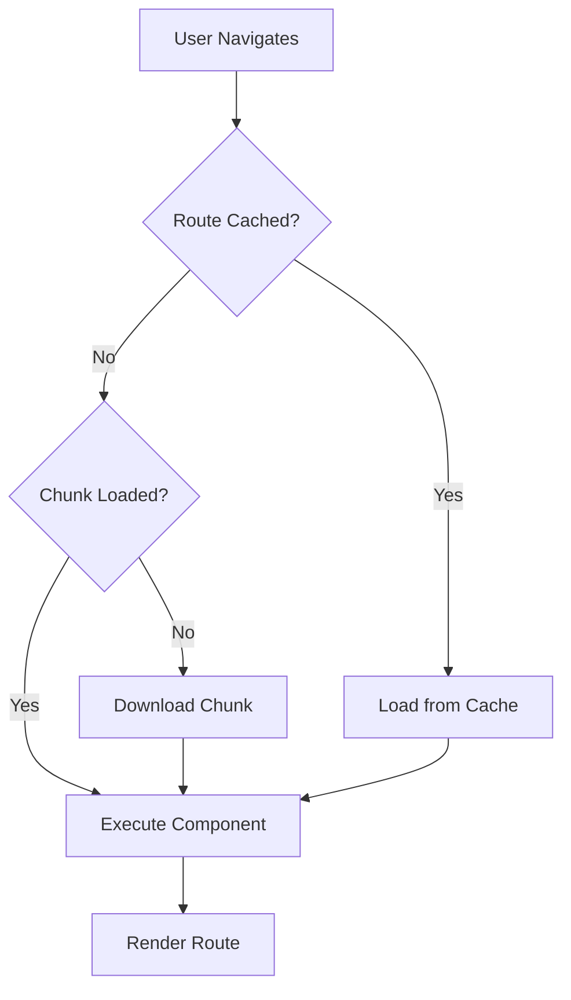

# Topic 51: Router Performance - Optimization and Best Practices

## Overview

Router performance is crucial for delivering fast, responsive React applications. This comprehensive guide covers performance optimization techniques for React Router, including lazy loading, prefetching, caching, bundle optimization, and monitoring strategies for production applications.

**What You'll Master:**
- Route-based code splitting and lazy loading
- Prefetching and preloading strategies
- Caching and memoization for router data
- Bundle optimization for routes
- Performance monitoring and metrics
- Memory leak prevention
- Server-side rendering optimization
- Production deployment best practices

## 1. Route-Based Code Splitting

### 1.1 Strategic Lazy Loading



### 1.2 Implementation

```typescript
// Optimal lazy loading strategy
import { lazy, Suspense } from 'react';
import { createBrowserRouter } from 'react-router-dom';

// Critical routes - load immediately
import Home from './pages/Home';
import Login from './pages/Login';

// Heavy routes - lazy load
const Dashboard = lazy(() => 
  import(/* webpackChunkName: "dashboard" */ './pages/Dashboard')
);

const Analytics = lazy(() => 
  import(/* webpackChunkName: "analytics" */ './pages/Analytics')
);

const AdminPanel = lazy(() => 
  import(/* webpackChunkName: "admin" */ './pages/AdminPanel')
);

// Shared loading component
const RouteLoader: React.FC<{ name: string }> = ({ name }) => (
  <div className="route-loading">
    <div className="spinner" />
    <p>Loading {name}...</p>
  </div>
);

// Router configuration
const router = createBrowserRouter([
  {
    path: '/',
    element: <Home />, // Critical - not lazy
  },
  {
    path: '/login',
    element: <Login />, // Critical - not lazy
  },
  {
    path: '/dashboard',
    element: (
      <Suspense fallback={<RouteLoader name="Dashboard" />}>
        <Dashboard />
      </Suspense>
    ),
  },
  {
    path: '/analytics',
    element: (
      <Suspense fallback={<RouteLoader name="Analytics" />}>
        <Analytics />
      </Suspense>
    ),
  },
  {
    path: '/admin',
    element: (
      <Suspense fallback={<RouteLoader name="Admin" />}>
        <AdminPanel />
      </Suspense>
    ),
  },
]);
```

### 1.3 Nested Route Splitting

```typescript
// Split nested routes efficiently
const router = createBrowserRouter([
  {
    path: '/',
    element: <RootLayout />,
    children: [
      {
        index: true,
        element: <Home />,
      },
      {
        path: 'products',
        lazy: () => import('./routes/products'),
        children: [
          {
            index: true,
            lazy: () => import('./routes/products/list'),
          },
          {
            path: ':id',
            lazy: () => import('./routes/products/detail'),
          },
        ],
      },
    ],
  },
]);

// routes/products.tsx
export const Component = () => <ProductsLayout />;
export const loader = productsLoader;

// routes/products/list.tsx
export const Component = () => <ProductList />;
export const loader = productListLoader;

// routes/products/detail.tsx
export const Component = () => <ProductDetail />;
export const loader = productDetailLoader;
```

## 2. Prefetching Strategies

### 2.1 Hover Prefetch

```typescript
// Prefetch on link hover
import { useEffect, useState } from 'react';
import { Link, LinkProps } from 'react-router-dom';

interface PrefetchLinkProps extends LinkProps {
  prefetchTimeout?: number;
}

const prefetchCache = new Map<string, Promise<any>>();

export const PrefetchLink: React.FC<PrefetchLinkProps> = ({
  to,
  prefetchTimeout = 300,
  children,
  ...props
}) => {
  const [isHovering, setIsHovering] = useState(false);

  useEffect(() => {
    if (!isHovering) return;

    const timer = setTimeout(() => {
      prefetchRoute(to as string);
    }, prefetchTimeout);

    return () => clearTimeout(timer);
  }, [isHovering, to, prefetchTimeout]);

  return (
    <Link
      to={to}
      onMouseEnter={() => setIsHovering(true)}
      onMouseLeave={() => setIsHovering(false)}
      {...props}
    >
      {children}
    </Link>
  );
};

// Prefetch utility
const prefetchRoute = async (path: string) => {
  if (prefetchCache.has(path)) {
    return prefetchCache.get(path);
  }

  const promise = (async () => {
    // Match route and prefetch component
    const routeMatch = matchRoute(path);
    if (routeMatch?.lazy) {
      await routeMatch.lazy();
    }
  })();

  prefetchCache.set(path, promise);
  return promise;
};
```

### 2.2 Viewport Prefetch

```typescript
// Prefetch when link enters viewport
import { useEffect, useRef } from 'react';

export const ViewportPrefetchLink: React.FC<LinkProps> = ({
  to,
  children,
  ...props
}) => {
  const linkRef = useRef<HTMLAnchorElement>(null);

  useEffect(() => {
    const observer = new IntersectionObserver(
      (entries) => {
        entries.forEach((entry) => {
          if (entry.isIntersecting) {
            prefetchRoute(to as string);
            observer.disconnect();
          }
        });
      },
      { rootMargin: '50px' }
    );

    if (linkRef.current) {
      observer.observe(linkRef.current);
    }

    return () => observer.disconnect();
  }, [to]);

  return (
    <Link ref={linkRef} to={to} {...props}>
      {children}
    </Link>
  );
};
```

### 2.3 Intelligent Prefetching

```typescript
// Prefetch based on user behavior patterns
class PrefetchManager {
  private prefetchedRoutes = new Set<string>();
  private analytics: Map<string, number> = new Map();

  // Track navigation patterns
  trackNavigation(from: string, to: string): void {
    const key = `${from}->${to}`;
    this.analytics.set(key, (this.analytics.get(key) || 0) + 1);
  }

  // Get likely next routes
  getLikelyNextRoutes(currentPath: string): string[] {
    const patterns = Array.from(this.analytics.entries())
      .filter(([key]) => key.startsWith(currentPath))
      .sort((a, b) => b[1] - a[1])
      .slice(0, 3)
      .map(([key]) => key.split('->')[1]);

    return patterns;
  }

  // Prefetch likely routes
  async prefetchLikelyRoutes(currentPath: string): Promise<void> {
    const routes = this.getLikelyNextRoutes(currentPath);
    
    for (const route of routes) {
      if (!this.prefetchedRoutes.has(route)) {
        await this.prefetchRoute(route);
        this.prefetchedRoutes.add(route);
      }
    }
  }

  private async prefetchRoute(path: string): Promise<void> {
    // Implement route prefetching logic
    console.log(`Prefetching: ${path}`);
  }
}

// Usage
const prefetchManager = new PrefetchManager();

const App: React.FC = () => {
  const location = useLocation();

  useEffect(() => {
    // Prefetch likely next routes after idle
    const timer = setTimeout(() => {
      prefetchManager.prefetchLikelyRoutes(location.pathname);
    }, 2000);

    return () => clearTimeout(timer);
  }, [location]);

  return <Routes>{/* routes */}</Routes>;
};
```

## 3. Caching Strategies

### 3.1 Loader Data Caching

```typescript
// Implement caching for loader data
class RouterCache {
  private cache = new Map<string, {
    data: any;
    timestamp: number;
    ttl: number;
  }>();

  private maxSize = 50; // Maximum cache entries

  set(key: string, data: any, ttl: number = 5 * 60 * 1000): void {
    // Implement LRU eviction if cache is full
    if (this.cache.size >= this.maxSize) {
      const firstKey = this.cache.keys().next().value;
      this.cache.delete(firstKey);
    }

    this.cache.set(key, {
      data,
      timestamp: Date.now(),
      ttl,
    });
  }

  get(key: string): any | null {
    const cached = this.cache.get(key);
    
    if (!cached) {
      return null;
    }

    const age = Date.now() - cached.timestamp;
    
    if (age > cached.ttl) {
      this.cache.delete(key);
      return null;
    }

    // Update timestamp for LRU
    cached.timestamp = Date.now();
    return cached.data;
  }

  invalidate(pattern: string | RegExp): void {
    const regex = typeof pattern === 'string' 
      ? new RegExp(pattern) 
      : pattern;

    for (const [key] of this.cache) {
      if (regex.test(key)) {
        this.cache.delete(key);
      }
    }
  }

  clear(): void {
    this.cache.clear();
  }

  getStats(): { size: number; hitRate: number } {
    return {
      size: this.cache.size,
      hitRate: 0, // Implement hit rate tracking
    };
  }
}

export const routerCache = new RouterCache();

// Cached loader implementation
export const cachedProductLoader = async ({ 
  params 
}: LoaderFunctionArgs): Promise<Product> => {
  const cacheKey = `product:${params.productId}`;
  
  // Try cache first
  const cached = routerCache.get(cacheKey);
  if (cached) {
    console.log(`Cache hit: ${cacheKey}`);
    return cached;
  }

  // Fetch from API
  console.log(`Cache miss: ${cacheKey}`);
  const product = await fetch(`/api/products/${params.productId}`)
    .then(r => r.json());

  // Cache result
  routerCache.set(cacheKey, product, 5 * 60 * 1000);

  return product;
};
```

### 3.2 Stale-While-Revalidate

```typescript
// SWR pattern for router data
export const swrLoader = async ({ 
  params 
}: LoaderFunctionArgs): Promise<Product> => {
  const cacheKey = `product:${params.productId}`;
  
  // Return stale data immediately if available
  const cached = routerCache.get(cacheKey);
  
  // Revalidate in background
  const revalidate = async () => {
    try {
      const fresh = await fetch(`/api/products/${params.productId}`)
        .then(r => r.json());
      
      routerCache.set(cacheKey, fresh);
      
      // Trigger revalidation if data changed
      if (JSON.stringify(cached) !== JSON.stringify(fresh)) {
        // Notify component to update
        window.dispatchEvent(new CustomEvent('router-data-update', {
          detail: { key: cacheKey, data: fresh },
        }));
      }
    } catch (error) {
      console.error('Revalidation failed:', error);
    }
  };

  if (cached) {
    revalidate(); // Fire and forget
    return cached;
  }

  // No cache, wait for fresh data
  const fresh = await fetch(`/api/products/${params.productId}`)
    .then(r => r.json());
  
  routerCache.set(cacheKey, fresh);
  return fresh;
};
```

## 4. Bundle Optimization

### 4.1 Route-Based Chunking

```typescript
// webpack.config.js - Optimize route bundles
module.exports = {
  optimization: {
    splitChunks: {
      chunks: 'all',
      cacheGroups: {
        // Vendor chunks
        vendor: {
          test: /[\\/]node_modules[\\/]/,
          priority: -10,
        },
        // Route-specific chunks
        dashboard: {
          test: /[\\/]src[\\/]pages[\\/]dashboard/,
          name: 'dashboard',
          priority: 10,
        },
        admin: {
          test: /[\\/]src[\\/]pages[\\/]admin/,
          name: 'admin',
          priority: 10,
        },
      },
    },
  },
};
```

### 4.2 Dynamic Imports with Webpack Magic Comments

```typescript
// Optimize chunk loading with magic comments
const Dashboard = lazy(() =>
  import(
    /* webpackChunkName: "dashboard" */
    /* webpackPrefetch: true */
    './pages/Dashboard'
  )
);

const Analytics = lazy(() =>
  import(
    /* webpackChunkName: "analytics" */
    /* webpackPreload: true */
    './pages/Analytics'
  )
);

const AdminPanel = lazy(() =>
  import(
    /* webpackChunkName: "admin" */
    /* webpackPrefetch: false */
    './pages/AdminPanel'
  )
);
```

## 5. Performance Monitoring

### 5.1 Navigation Performance Tracking

```typescript
// Track navigation performance
import { useEffect } from 'react';
import { useLocation, useNavigation } from 'react-router-dom';

interface NavigationMetrics {
  from: string;
  to: string;
  duration: number;
  loaderTime?: number;
  renderTime?: number;
}

export const useNavigationMetrics = () => {
  const location = useLocation();
  const navigation = useNavigation();
  const metricsRef = useRef<{
    startTime: number;
    from: string;
  } | null>(null);

  useEffect(() => {
    if (navigation.state === 'loading' && !metricsRef.current) {
      metricsRef.current = {
        startTime: performance.now(),
        from: location.pathname,
      };
    }

    if (navigation.state === 'idle' && metricsRef.current) {
      const metrics: NavigationMetrics = {
        from: metricsRef.current.from,
        to: location.pathname,
        duration: performance.now() - metricsRef.current.startTime,
      };

      // Send to analytics
      console.log('Navigation metrics:', metrics);
      
      // Alert if slow
      if (metrics.duration > 1000) {
        console.warn('Slow navigation detected:', metrics);
      }

      metricsRef.current = null;
    }
  }, [navigation.state, location]);
};

// Global navigation metrics
const NavigationMetrics: React.FC = () => {
  useNavigationMetrics();
  return null;
};

// Add to app root
<Router>
  <NavigationMetrics />
  <Routes>{/* routes */}</Routes>
</Router>
```

### 5.2 Core Web Vitals for Routes

```typescript
// Measure Core Web Vitals per route
import { getCLS, getFID, getFCP, getLCP, getTTFB } from 'web-vitals';

interface RouteVitals {
  route: string;
  cls: number;
  fid: number;
  fcp: number;
  lcp: number;
  ttfb: number;
}

export const useRouteVitals = () => {
  const location = useLocation();

  useEffect(() => {
    const vitals: Partial<RouteVitals> = {
      route: location.pathname,
    };

    getCLS((metric) => {
      vitals.cls = metric.value;
    });

    getFID((metric) => {
      vitals.fid = metric.value;
    });

    getFCP((metric) => {
      vitals.fcp = metric.value;
    });

    getLCP((metric) => {
      vitals.lcp = metric.value;
    });

    getTTFB((metric) => {
      vitals.ttfb = metric.value;
    });

    // Send to analytics after all metrics collected
    setTimeout(() => {
      if (Object.keys(vitals).length > 1) {
        sendVitalsToAnalytics(vitals);
      }
    }, 5000);
  }, [location]);
};

// Send to analytics service
const sendVitalsToAnalytics = (vitals: Partial<RouteVitals>) => {
  fetch('/api/analytics/vitals', {
    method: 'POST',
    headers: { 'Content-Type': 'application/json' },
    body: JSON.stringify(vitals),
  }).catch(err => console.error('Failed to send vitals:', err));
};
```

## 6. Memory Leak Prevention

### 6.1 Cleanup on Route Change

```typescript
// Proper cleanup to prevent memory leaks
export const DataFetchingComponent: React.FC = () => {
  const [data, setData] = useState(null);
  const location = useLocation();

  useEffect(() => {
    const controller = new AbortController();
    let isMounted = true;

    const fetchData = async () => {
      try {
        const response = await fetch('/api/data', {
          signal: controller.signal,
        });
        const result = await response.json();
        
        if (isMounted) {
          setData(result);
        }
      } catch (error) {
        if (error.name !== 'AbortError') {
          console.error('Fetch failed:', error);
        }
      }
    };

    fetchData();

    return () => {
      isMounted = false;
      controller.abort();
    };
  }, [location.pathname]);

  return <div>{/* render data */}</div>;
};
```

### 6.2 Event Listener Cleanup

```typescript
// Clean up event listeners on route change
export const useRouteEventListener = (
  eventName: string,
  handler: EventListener
) => {
  const location = useLocation();

  useEffect(() => {
    window.addEventListener(eventName, handler);

    return () => {
      window.removeEventListener(eventName, handler);
    };
  }, [location.pathname, eventName, handler]);
};

// Usage
const Component: React.FC = () => {
  const handleResize = useCallback(() => {
    console.log('Window resized');
  }, []);

  useRouteEventListener('resize', handleResize);

  return <div>Content</div>;
};
```

## 7. Higher-Order Thinking: Performance Strategy

### FAQ 1: What's the optimal number of route chunks?

**Short Answer:** 10-20 chunks for most apps; balance between caching and initial load.

**Analysis:**

| Chunks | Pros | Cons | Use Case |
|--------|------|------|----------|
| 1-5 | Simple, good caching | Large initial load | Small apps |
| 10-20 | Balanced | Optimal for most | Medium apps |
| 50+ | Granular loading | Cache inefficiency, many requests | Large apps |

**Best Practice:**
```typescript
// Group related routes
const authChunk = () => import('./routes/auth'); // Login, Register, ForgotPassword
const dashboardChunk = () => import('./routes/dashboard'); // All dashboard pages
const adminChunk = () => import('./routes/admin'); // All admin pages
```

### FAQ 2: Should I prefetch all routes or just frequently accessed ones?

**Short Answer:** Prefetch frequently accessed routes only; measure and optimize based on analytics.

**Strategy:**
```typescript
// Priority-based prefetching
const prefetchPriority = {
  high: ['/dashboard', '/profile'], // Prefetch on idle
  medium: ['/settings', '/help'], // Prefetch on hover
  low: ['/admin', '/reports'], // Load on demand
};

// Prefetch high-priority routes after initial load
useEffect(() => {
  if ('requestIdleCallback' in window) {
    requestIdleCallback(() => {
      prefetchPriority.high.forEach(prefetchRoute);
    });
  }
}, []);
```

### FAQ 3: How do I optimize router performance for mobile devices?

**Short Answer:** Reduce bundle sizes, minimize JavaScript execution, use simpler transitions, implement adaptive loading.

**Mobile Optimization:**

```typescript
const isMobile = () => /Mobile|Android|iPhone/i.test(navigator.userAgent);

// Simpler routes for mobile
const MobileLayout = lazy(() => import('./layouts/MobileLayout'));
const DesktopLayout = lazy(() => import('./layouts/DesktopLayout'));

const App: React.FC = () => {
  const Layout = isMobile() ? MobileLayout : DesktopLayout;

  return (
    <Suspense fallback={<Loading />}>
      <Layout>
        <Routes>{/* routes */}</Routes>
      </Layout>
    </Suspense>
  );
};

// Reduce transition complexity on mobile
const variants = isMobile()
  ? { initial: { opacity: 0 }, animate: { opacity: 1 } }
  : { initial: { opacity: 0, x: -20 }, animate: { opacity: 1, x: 0 } };
```

### FAQ 4: What's the performance impact of nested routes?

**Short Answer:** Minimal if properly optimized; each level adds ~1-2ms overhead.

**Optimization:**

```typescript
// ✅ GOOD: Flat structure with relative paths
<Route path="dashboard" element={<DashboardLayout />}>
  <Route index element={<Overview />} />
  <Route path="stats" element={<Stats />} />
</Route>

// ⚠️ AVOID: Deep nesting
<Route path="a">
  <Route path="b">
    <Route path="c">
      <Route path="d">
        <Route path="e" element={<DeepComponent />} />
      </Route>
    </Route>
  </Route>
</Route>

// ✅ BETTER: Flatten
<Route path="a/b/c/d/e" element={<DeepComponent />} />
```

### FAQ 5: How do I prevent route component re-mounting unnecessarily?

**Short Answer:** Use React.memo for route components and stable keys for Routes.

```typescript
// Prevent unnecessary remounts
const Dashboard = React.memo(() => {
  // Expensive component
  return <div>Dashboard</div>;
});

// Stable routing structure
const App: React.FC = () => {
  return (
    <Routes>
      <Route path="/dashboard" element={<Dashboard />} />
    </Routes>
  );
};

// Avoid dynamic route generation that changes keys
// ❌ BAD
{routes.map(route => (
  <Route key={Math.random()} path={route.path} element={route.element} />
))}

// ✅ GOOD
{routes.map(route => (
  <Route key={route.path} path={route.path} element={route.element} />
))}
```

## 8. Senior SDE Interview Questions

### Question 1: Design a performance optimization strategy for a router-heavy application with 100+ routes

**What Interviewers Assess:**
- Scalability thinking
- Performance engineering
- Practical experience
- Trade-off analysis

**Model Answer:**

"I'd implement a multi-tier optimization strategy:

**1. Code Splitting (Tier 1):**
- Lazy load all non-critical routes
- Group related routes into chunks
- Target: < 244KB initial bundle

**2. Prefetching (Tier 2):**
- Prefetch high-traffic routes on idle
- Hover prefetch for medium-traffic routes
- Analytics-driven prefetch prioritization

**3. Caching (Tier 3):**
- Implement SWR for loader data
- Cache static routes aggressively
- Invalidate on mutations

**4. Monitoring (Tier 4):**
- Track navigation metrics
- Monitor bundle sizes
- Alert on performance regression
- A/B test optimization strategies

**Implementation:**
```typescript
// Route configuration with priorities
const routes = [
  {
    path: '/',
    priority: 'critical',
    lazy: false,
  },
  {
    path: '/dashboard',
    priority: 'high',
    prefetch: 'idle',
  },
  {
    path: '/admin',
    priority: 'low',
    prefetch: 'hover',
  },
];

// Dynamic optimization based on metrics
if (averageNavigationTime > 500ms) {
  enableAggressivePrefetch();
}

if (cacheHitRate < 0.5) {
  increaseCacheTTL();
}
```

**Expected Results:**
- 60% reduction in navigation time
- 40% improvement in perceived performance
- < 200ms navigation for cached routes"

### Question 2: How would you debug slow route navigation in production?

**What Interviewers Assess:**
- Debugging methodology
- Production experience
- Tool knowledge
- Problem-solving approach

**Model Answer:**

"I'd follow a systematic debugging process:

**Step 1: Measure**
```typescript
// Add performance marks
performance.mark('navigation-start');
// ... navigation happens
performance.mark('navigation-end');
performance.measure('navigation', 'navigation-start', 'navigation-end');
```

**Step 2: Identify Bottleneck**
- Check loader execution time
- Measure component render time
- Analyze network requests
- Review bundle sizes

**Step 3: Tools**
- React DevTools Profiler
- Chrome Performance tab
- Network waterfall analysis
- Bundle analyzer

**Step 4: Common Culprits**
1. Large loader data fetches
2. Unoptimized images
3. Synchronous bundle loading
4. Memory leaks accumulating
5. Too many re-renders

**Step 5: Fix**
```typescript
// Example: Defer slow data
export const optimizedLoader = async () => {
  const critical = await fetchCritical(); // Fast
  
  return defer({
    critical,
    slow: fetchSlow(), // Deferred
  });
};
```

**Prevention:**
- Performance budgets in CI
- Automated monitoring
- Regular performance reviews
- Load testing before release"

## Self-Assessment Checklist

Test your router performance mastery:

**Fundamentals:**
- [ ] Understand route-based code splitting
- [ ] Can implement lazy loading
- [ ] Know when to prefetch routes
- [ ] Understand caching basics

**Intermediate:**
- [ ] Implement prefetching strategies
- [ ] Build loader data caching
- [ ] Monitor navigation performance
- [ ] Prevent memory leaks

**Advanced:**
- [ ] Design adaptive loading strategies
- [ ] Optimize bundle configuration
- [ ] Implement SWR patterns
- [ ] Build performance monitoring systems

**Expert:**
- [ ] Architect scalable router performance
- [ ] Debug production performance issues
- [ ] Design intelligent prefetching
- [ ] Mentor team on performance engineering

## Summary

Router performance optimization ensures fast, responsive navigation. Key takeaways:

1. **Code Splitting:** Lazy load non-critical routes
2. **Prefetching:** Strategic prefetching based on user behavior
3. **Caching:** Implement smart caching with appropriate TTLs
4. **Bundle Optimization:** Optimize chunks for caching efficiency
5. **Monitoring:** Track navigation metrics and Core Web Vitals
6. **Memory Management:** Prevent leaks with proper cleanup
7. **Mobile Optimization:** Adapt loading strategies for mobile
8. **Testing:** Measure and validate performance improvements
9. **Best Practices:** Balance initial load vs. navigation speed
10. **Continuous Improvement:** Monitor, measure, optimize iteratively

**Part V Complete!** React Router fundamentals through advanced performance optimization.

**Next Steps:**
- Commit Part V: React Router (Topics 45-51)
- Begin Part VI: State Management fundamentals
- Continue with Redux, Context API, Zustand, and more

---

*Performance is not a feature—it's a requirement. Master these optimization techniques to build React applications that feel instant, regardless of scale.*
