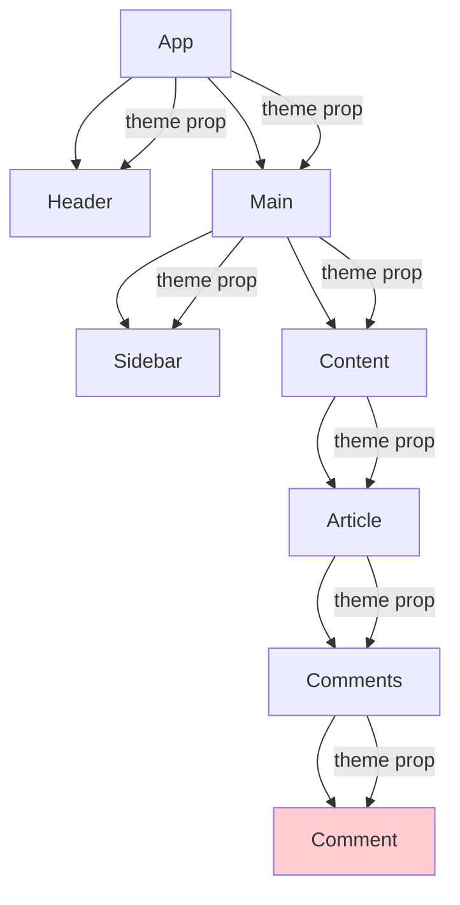

# Topic 52: Context API Deep Dive - State Management with Context

## Overview

React Context API provides a way to share data across the component tree without prop drilling. This comprehensive guide covers Context fundamentals, advanced patterns, performance optimization, and best practices for building scalable applications with Context.

**What You'll Master:**
- Context API fundamentals and use cases
- Creating and consuming context effectively
- Provider patterns and composition
- Performance optimization with Context
- TypeScript integration with Context
- Context vs prop drilling trade-offs
- Multiple context patterns
- Testing Context-based code

## 1. Understanding Context API

### 1.1 The Prop Drilling Problem



**Prop Drilling Example:**

```typescript
// Without Context - Prop drilling through multiple levels
interface ThemeProps {
  theme: 'light' | 'dark';
}

const App: React.FC = () => {
  const [theme, setTheme] = useState<'light' | 'dark'>('light');

  return <Header theme={theme} setTheme={setTheme} />;
};

const Header: React.FC<ThemeProps & { setTheme: (theme: 'light' | 'dark') => void }> = ({ 
  theme, 
  setTheme 
}) => {
  return <Nav theme={theme} setTheme={setTheme} />;
};

const Nav: React.FC<ThemeProps & { setTheme: (theme: 'light' | 'dark') => void }> = ({ 
  theme, 
  setTheme 
}) => {
  return <ThemeToggle theme={theme} setTheme={setTheme} />;
};

const ThemeToggle: React.FC<ThemeProps & { setTheme: (theme: 'light' | 'dark') => void }> = ({ 
  theme, 
  setTheme 
}) => {
  return (
    <button onClick={() => setTheme(theme === 'light' ? 'dark' : 'light')}>
      Toggle Theme
    </button>
  );
};
```

### 1.2 Context Solution

```typescript
// With Context - Direct access without prop drilling
import React, { createContext, useContext, useState, ReactNode } from 'react';

type Theme = 'light' | 'dark';

interface ThemeContextType {
  theme: Theme;
  toggleTheme: () => void;
}

// Create Context
const ThemeContext = createContext<ThemeContextType | undefined>(undefined);

// Custom hook for consuming context
export const useTheme = () => {
  const context = useContext(ThemeContext);
  if (!context) {
    throw new Error('useTheme must be used within ThemeProvider');
  }
  return context;
};

// Provider component
export const ThemeProvider: React.FC<{ children: ReactNode }> = ({ children }) => {
  const [theme, setTheme] = useState<Theme>('light');

  const toggleTheme = () => {
    setTheme(prev => prev === 'light' ? 'dark' : 'light');
  };

  const value: ThemeContextType = {
    theme,
    toggleTheme,
  };

  return (
    <ThemeContext.Provider value={value}>
      {children}
    </ThemeContext.Provider>
  );
};

// Components can now access theme directly
const ThemeToggle: React.FC = () => {
  const { theme, toggleTheme } = useTheme();

  return (
    <button onClick={toggleTheme}>
      Current: {theme}, Click to toggle
    </button>
  );
};

// App structure - no prop drilling
const App: React.FC = () => {
  return (
    <ThemeProvider>
      <Header />
      <Main>
        <Sidebar />
        <Content>
          <Article>
            <Comments>
              <ThemeToggle />
            </Comments>
          </Article>
        </Content>
      </Main>
    </ThemeProvider>
  );
};
```

## 2. Creating Context

### 2.1 Complete Context Setup Pattern

```typescript
// Complete Context pattern with TypeScript
import React, { 
  createContext, 
  useContext, 
  useState, 
  useCallback,
  useMemo,
  ReactNode 
} from 'react';

// 1. Define types
interface User {
  id: string;
  name: string;
  email: string;
  role: 'admin' | 'user';
}

interface AuthContextType {
  user: User | null;
  isAuthenticated: boolean;
  isLoading: boolean;
  login: (email: string, password: string) => Promise<void>;
  logout: () => Promise<void>;
  updateUser: (updates: Partial<User>) => void;
}

// 2. Create context with undefined default
const AuthContext = createContext<AuthContextType | undefined>(undefined);

// 3. Custom hook with error handling
export const useAuth = () => {
  const context = useContext(AuthContext);
  if (context === undefined) {
    throw new Error('useAuth must be used within an AuthProvider');
  }
  return context;
};

// 4. Provider component with state and methods
export const AuthProvider: React.FC<{ children: ReactNode }> = ({ children }) => {
  const [user, setUser] = useState<User | null>(null);
  const [isLoading, setIsLoading] = useState(true);

  // Check auth on mount
  useEffect(() => {
    checkAuthStatus().then(user => {
      setUser(user);
      setIsLoading(false);
    });
  }, []);

  const login = useCallback(async (email: string, password: string) => {
    setIsLoading(true);
    try {
      const user = await authAPI.login(email, password);
      setUser(user);
    } finally {
      setIsLoading(false);
    }
  }, []);

  const logout = useCallback(async () => {
    await authAPI.logout();
    setUser(null);
  }, []);

  const updateUser = useCallback((updates: Partial<User>) => {
    setUser(prev => prev ? { ...prev, ...updates } : null);
  }, []);

  // Memoize context value to prevent unnecessary re-renders
  const value = useMemo<AuthContextType>(() => ({
    user,
    isAuthenticated: !!user,
    isLoading,
    login,
    logout,
    updateUser,
  }), [user, isLoading, login, logout, updateUser]);

  return (
    <AuthContext.Provider value={value}>
      {children}
    </AuthContext.Provider>
  );
};

// 5. Usage in components
const UserProfile: React.FC = () => {
  const { user, logout } = useAuth();

  if (!user) return null;

  return (
    <div>
      <h1>{user.name}</h1>
      <p>{user.email}</p>
      <button onClick={logout}>Logout</button>
    </div>
  );
};
```

### 2.2 Context with Reducer Pattern

```typescript
// Context with useReducer for complex state
import React, { createContext, useContext, useReducer, ReactNode } from 'react';

// State and actions
interface CartState {
  items: CartItem[];
  total: number;
}

type CartAction =
  | { type: 'ADD_ITEM'; payload: CartItem }
  | { type: 'REMOVE_ITEM'; payload: string }
  | { type: 'UPDATE_QUANTITY'; payload: { id: string; quantity: number } }
  | { type: 'CLEAR_CART' };

interface CartItem {
  id: string;
  name: string;
  price: number;
  quantity: number;
}

// Reducer
const cartReducer = (state: CartState, action: CartAction): CartState => {
  switch (action.type) {
    case 'ADD_ITEM': {
      const existingItem = state.items.find(item => item.id === action.payload.id);
      
      if (existingItem) {
        return {
          items: state.items.map(item =>
            item.id === action.payload.id
              ? { ...item, quantity: item.quantity + 1 }
              : item
          ),
          total: state.total + action.payload.price,
        };
      }

      return {
        items: [...state.items, { ...action.payload, quantity: 1 }],
        total: state.total + action.payload.price,
      };
    }

    case 'REMOVE_ITEM': {
      const item = state.items.find(i => i.id === action.payload);
      if (!item) return state;

      return {
        items: state.items.filter(i => i.id !== action.payload),
        total: state.total - (item.price * item.quantity),
      };
    }

    case 'UPDATE_QUANTITY': {
      const item = state.items.find(i => i.id === action.payload.id);
      if (!item) return state;

      const quantityDiff = action.payload.quantity - item.quantity;

      return {
        items: state.items.map(i =>
          i.id === action.payload.id
            ? { ...i, quantity: action.payload.quantity }
            : i
        ),
        total: state.total + (item.price * quantityDiff),
      };
    }

    case 'CLEAR_CART':
      return { items: [], total: 0 };

    default:
      return state;
  }
};

// Context type
interface CartContextType {
  state: CartState;
  addItem: (item: Omit<CartItem, 'quantity'>) => void;
  removeItem: (id: string) => void;
  updateQuantity: (id: string, quantity: number) => void;
  clearCart: () => void;
}

// Create context
const CartContext = createContext<CartContextType | undefined>(undefined);

// Custom hook
export const useCart = () => {
  const context = useContext(CartContext);
  if (!context) {
    throw new Error('useCart must be used within CartProvider');
  }
  return context;
};

// Provider with useReducer
export const CartProvider: React.FC<{ children: ReactNode }> = ({ children }) => {
  const [state, dispatch] = useReducer(cartReducer, {
    items: [],
    total: 0,
  });

  const addItem = useCallback((item: Omit<CartItem, 'quantity'>) => {
    dispatch({ type: 'ADD_ITEM', payload: { ...item, quantity: 1 } });
  }, []);

  const removeItem = useCallback((id: string) => {
    dispatch({ type: 'REMOVE_ITEM', payload: id });
  }, []);

  const updateQuantity = useCallback((id: string, quantity: number) => {
    dispatch({ type: 'UPDATE_QUANTITY', payload: { id, quantity } });
  }, []);

  const clearCart = useCallback(() => {
    dispatch({ type: 'CLEAR_CART' });
  }, []);

  const value = useMemo<CartContextType>(() => ({
    state,
    addItem,
    removeItem,
    updateQuantity,
    clearCart,
  }), [state, addItem, removeItem, updateQuantity, clearCart]);

  return (
    <CartContext.Provider value={value}>
      {children}
    </CartContext.Provider>
  );
};

// Usage
const CartSummary: React.FC = () => {
  const { state, clearCart } = useCart();

  return (
    <div>
      <h2>Cart Summary</h2>
      <p>Items: {state.items.length}</p>
      <p>Total: ${state.total.toFixed(2)}</p>
      <button onClick={clearCart}>Clear Cart</button>
    </div>
  );
};
```

## 3. Context Composition

### 3.1 Multiple Context Providers

```typescript
// Composing multiple contexts
const App: React.FC = () => {
  return (
    <ThemeProvider>
      <AuthProvider>
        <CartProvider>
          <NotificationProvider>
            <Router>
              <Routes>
                {/* app routes */}
              </Routes>
            </Router>
          </NotificationProvider>
        </CartProvider>
      </AuthProvider>
    </ThemeProvider>
  );
};

// Helper for cleaner composition
const AppProviders: React.FC<{ children: ReactNode }> = ({ children }) => {
  return (
    <ThemeProvider>
      <AuthProvider>
        <CartProvider>
          <NotificationProvider>
            {children}
          </NotificationProvider>
        </CartProvider>
      </AuthProvider>
    </ThemeProvider>
  );
};

// Usage
const App: React.FC = () => {
  return (
    <AppProviders>
      <Router>
        <Routes>{/* routes */}</Routes>
      </Router>
    </AppProviders>
  );
};
```

### 3.2 Compound Provider Pattern

```typescript
// Compound provider for related contexts
interface AppContexts {
  theme: ThemeContextType;
  auth: AuthContextType;
  cart: CartContextType;
}

const AppContext = createContext<AppContexts | undefined>(undefined);

export const useAppContext = () => {
  const context = useContext(AppContext);
  if (!context) {
    throw new Error('useAppContext must be used within AppProvider');
  }
  return context;
};

// Convenience hooks
export const useTheme = () => useAppContext().theme;
export const useAuth = () => useAppContext().auth;
export const useCart = () => useAppContext().cart;

// Combined provider
export const AppProvider: React.FC<{ children: ReactNode }> = ({ children }) => {
  // Theme state
  const [theme, setTheme] = useState<'light' | 'dark'>('light');
  
  // Auth state
  const [user, setUser] = useState<User | null>(null);
  
  // Cart state
  const [cartState, dispatchCart] = useReducer(cartReducer, { items: [], total: 0 });

  // Memoize all context values
  const themeContext = useMemo(() => ({
    theme,
    toggleTheme: () => setTheme(prev => prev === 'light' ? 'dark' : 'light'),
  }), [theme]);

  const authContext = useMemo(() => ({
    user,
    isAuthenticated: !!user,
    login: async (email: string, password: string) => {
      const user = await authAPI.login(email, password);
      setUser(user);
    },
    logout: () => setUser(null),
  }), [user]);

  const cartContext = useMemo(() => ({
    state: cartState,
    addItem: (item: CartItem) => dispatchCart({ type: 'ADD_ITEM', payload: item }),
    removeItem: (id: string) => dispatchCart({ type: 'REMOVE_ITEM', payload: id }),
  }), [cartState]);

  const value = useMemo(() => ({
    theme: themeContext,
    auth: authContext,
    cart: cartContext,
  }), [themeContext, authContext, cartContext]);

  return (
    <AppContext.Provider value={value}>
      {children}
    </AppContext.Provider>
  );
};
```

## 4. Performance Optimization

### 4.1 Preventing Unnecessary Re-renders

```typescript
// Problem: Context updates trigger all consumers to re-render
interface UserContextType {
  user: User | null;
  preferences: UserPreferences;
  updateUser: (user: User) => void;
  updatePreferences: (prefs: UserPreferences) => void;
}

// ❌ BAD: Single context with mixed concerns
const UserContext = createContext<UserContextType>(null);

// Component only needs user, but re-renders when preferences change
const UserName: React.FC = () => {
  const { user } = useContext(UserContext);
  return <span>{user?.name}</span>;
};

// ✅ GOOD: Split contexts by update frequency
const UserContext = createContext<User | null>(null);
const PreferencesContext = createContext<UserPreferences>(null);

// Now components only re-render when their data changes
const UserName: React.FC = () => {
  const user = useContext(UserContext);
  return <span>{user?.name}</span>;
};
```

### 4.2 Context Selector Pattern

```typescript
// Advanced: Custom selector to prevent unnecessary renders
import { createContext, useContext, useRef, useSyncExternalStore } from 'react';

interface Store<T> {
  getState: () => T;
  subscribe: (callback: () => void) => () => void;
}

function createStore<T>(initialState: T): Store<T> {
  let state = initialState;
  const listeners = new Set<() => void>();

  return {
    getState: () => state,
    subscribe: (callback) => {
      listeners.add(callback);
      return () => listeners.delete(callback);
    },
    setState: (newState: T) => {
      state = newState;
      listeners.forEach(listener => listener());
    },
  };
}

// Context with selector support
function createSelectableContext<T>(initialState: T) {
  const StoreContext = createContext<Store<T> | null>(null);

  const Provider: React.FC<{ children: ReactNode }> = ({ children }) => {
    const storeRef = useRef<Store<T>>();
    
    if (!storeRef.current) {
      storeRef.current = createStore(initialState);
    }

    return (
      <StoreContext.Provider value={storeRef.current}>
        {children}
      </StoreContext.Provider>
    );
  };

  function useSelector<S>(selector: (state: T) => S): S {
    const store = useContext(StoreContext);
    if (!store) throw new Error('Store not found');

    return useSyncExternalStore(
      store.subscribe,
      () => selector(store.getState()),
      () => selector(store.getState())
    );
  }

  return { Provider, useSelector, StoreContext };
}

// Usage
interface AppState {
  user: User | null;
  theme: Theme;
  cart: CartState;
}

const { Provider: AppProvider, useSelector } = createSelectableContext<AppState>({
  user: null,
  theme: 'light',
  cart: { items: [], total: 0 },
});

// Component only re-renders when user.name changes
const UserName: React.FC = () => {
  const userName = useSelector(state => state.user?.name);
  return <span>{userName}</span>;
};
```

## 5. Higher-Order Thinking: Context Strategy

### FAQ 1: When should I use Context vs lifting state up?

**Short Answer:** Use Context when state is needed by many components at different nesting levels; lift state up when only a few siblings need it.

**Decision Matrix:**

| Scenario | Solution | Reason |
|----------|----------|---------|
| 2-3 sibling components | Lift state | Simpler, more explicit |
| Deep nesting (5+ levels) | Context | Avoid prop drilling |
| Frequently changing data | Lift state or useState | Better performance |
| Global settings (theme, locale) | Context | Truly global data |
| Form state | Local state | Scoped to form |

**Example:**
```typescript
// ✅ GOOD: Lift state for siblings
const Parent = () => {
  const [count, setCount] = useState(0);
  return (
    <>
      <ChildA count={count} />
      <ChildB setCount={setCount} />
    </>
  );
};

// ✅ GOOD: Context for deep nesting
<ThemeProvider>
  <Layout>
    <Sidebar>
      <Menu>
        <MenuItem /> {/* Needs theme, no prop drilling */}
      </Menu>
    </Sidebar>
  </Layout>
</ThemeProvider>
```

### FAQ 2: Does Context API replace Redux?

**Short Answer:** For simple apps, yes; for complex state logic, Redux or other libraries offer better developer experience.

**Comparison:**

| Feature | Context API | Redux |
|---------|-------------|--------|
| Setup complexity | Low | Medium |
| DevTools | No | Yes (excellent) |
| Middleware | No | Yes |
| Time-travel debugging | No | Yes |
| Performance | Good (with optimization) | Excellent |
| Learning curve | Low | Medium-High |
| Boilerplate | Low | Medium (RTK reduces) |

**Use Context When:**
- Theme, locale, auth state
- Small to medium apps
- Infrequent updates
- Simple state shape

**Use Redux When:**
- Complex state logic
- Need DevTools/middleware
- Large applications
- Frequent updates
- Team needs structured approach

### FAQ 3: Why does my Context cause performance issues?

**Short Answer:** Context updates re-render all consumers; split contexts and memoize values to optimize.

**Common Performance Issues:**

```typescript
// ❌ PROBLEM 1: Not memoizing context value
const Provider = ({ children }) => {
  const [state, setState] = useState({});
  
  // New object every render!
  const value = {
    state,
    setState,
  };
  
  return <Context.Provider value={value}>{children}</Context.Provider>;
};

// ✅ SOLUTION 1: Memoize value
const Provider = ({ children }) => {
  const [state, setState] = useState({});
  
  const value = useMemo(() => ({
    state,
    setState,
  }), [state]);
  
  return <Context.Provider value={value}>{children}</Context.Provider>;
};

// ❌ PROBLEM 2: Single context with mixed update frequencies
const AppContext = createContext({
  user: null,        // Changes rarely
  notifications: [], // Changes frequently
});

// ✅ SOLUTION 2: Split contexts
const UserContext = createContext(null);
const NotificationsContext = createContext([]);
```

### FAQ 4: Can I use Context for frequently updating state?

**Short Answer:** Not recommended; Context isn't optimized for high-frequency updates. Use state management libraries or local state.

**Performance Analysis:**

```typescript
// ❌ BAD: High-frequency updates in Context
const MouseContext = createContext({ x: 0, y: 0 });

const MouseProvider = ({ children }) => {
  const [position, setPosition] = useState({ x: 0, y: 0 });
  
  useEffect(() => {
    const handleMove = (e) => {
      setPosition({ x: e.clientX, y: e.clientY }); // 60fps updates!
    };
    window.addEventListener('mousemove', handleMove);
    return () => window.removeEventListener('mousemove', handleMove);
  }, []);
  
  return <MouseContext.Provider value={position}>{children}</MouseContext.Provider>;
};
// All consumers re-render 60 times per second!

// ✅ GOOD: Use local state or specialized library
const useMousePosition = () => {
  const [position, setPosition] = useState({ x: 0, y: 0 });
  
  useEffect(() => {
    const handleMove = (e) => setPosition({ x: e.clientX, y: e.clientY });
    window.addEventListener('mousemove', handleMove);
    return () => window.removeEventListener('mousemove', handleMove);
  }, []);
  
  return position;
};
```

**Update Frequency Guidelines:**

| Update Frequency | Use | Don't Use |
|------------------|-----|-----------|
| On mount | ✅ Context | - |
| User actions (clicks) | ✅ Context | - |
| Every few seconds | ⚠️ Context (with optimization) | - |
| Multiple times per second | - | ❌ Context |
| Animation frame (60fps) | - | ❌ Context |

### FAQ 5: How do I test components using Context?

**Short Answer:** Wrap components in test provider with mock values; test provider and consumers separately.

**Testing Pattern:**

```typescript
// Test utilities
const mockThemeValue: ThemeContextType = {
  theme: 'light',
  toggleTheme: jest.fn(),
};

const renderWithTheme = (
  ui: React.ReactElement,
  value: ThemeContextType = mockThemeValue
) => {
  return render(
    <ThemeContext.Provider value={value}>
      {ui}
    </ThemeContext.Provider>
  );
};

// Test consumer
describe('ThemeToggle', () => {
  it('should toggle theme when clicked', async () => {
    const toggleTheme = jest.fn();
    renderWithTheme(<ThemeToggle />, { 
      theme: 'light', 
      toggleTheme 
    });

    const button = screen.getByRole('button');
    await userEvent.click(button);

    expect(toggleTheme).toHaveBeenCalled();
  });
});

// Test provider
describe('ThemeProvider', () => {
  it('should provide theme context', () => {
    render(
      <ThemeProvider>
        <ThemeConsumer />
      </ThemeProvider>
    );

    expect(screen.getByText(/light/i)).toBeInTheDocument();
  });
});
```

## 6. Senior SDE Interview Questions

### Question 1: Design a Context-based state management system for a large e-commerce application

**What Interviewers Assess:**
- System design thinking
- Context API deep understanding
- Performance awareness
- Scalability considerations

**Model Answer:**

"I'd design a multi-context architecture with clear separation of concerns:

**Architecture:**
```typescript
// 1. Split by domain and update frequency
<App>
  <ConfigProvider>        {/* Rarely changes */}
    <AuthProvider>        {/* Changes on login/logout */}
      <CartProvider>      {/* Changes on cart actions */}
        <UIProvider>      {/* Theme, locale - rare */}
          <NotificationProvider> {/* Frequent but isolated */}
            <Router />
          </NotificationProvider>
        </UIProvider>
      </CartProvider>
    </AuthProvider>
  </ConfigProvider>
</App>
```

**Key Principles:**
1. **Separate by update frequency** - Fast-changing contexts don't affect slow ones
2. **Domain-driven contexts** - Each business domain gets its own context
3. **Memoization everywhere** - useMemo for values, useCallback for methods
4. **Selective consumption** - Consumers import only what they need
5. **Performance monitoring** - Track render counts in dev mode

**Trade-offs:**
- Multiple contexts increase complexity
- More providers to test
- Better performance at scale
- Easier to reason about data flow"

### Question 2: How would you migrate from Context API to Redux in a production application?

**What Interviewers Assess:**
- Migration planning
- Risk management
- Understanding of both systems
- Production experience

**Model Answer:**

"I'd execute a gradual, risk-mitigated migration:

**Phase 1: Preparation**
- Audit current Context usage
- Identify migration candidates (complex state logic)
- Set up Redux alongside Context
- No breaking changes yet

**Phase 2: Parallel Running**
```typescript
// Run both systems side-by-side
<ReduxProvider store={store}>
  <LegacyContextProviders>
    <App />
  </LegacyContextProviders>
</ReduxProvider>
```

**Phase 3: Gradual Migration**
- Migrate one context at a time
- Start with least critical features
- Keep Context for simple data (theme, locale)
- Migrate complex logic to Redux

**Phase 4: Cleanup**
- Remove unused Context providers
- Consolidate patterns
- Update documentation

**Key Considerations:**
- Feature flags for rollback
- Comprehensive testing at each phase
- Team training on Redux
- Monitor performance metrics"

## Self-Assessment Checklist

Test your Context API mastery:

**Fundamentals:**
- [ ] Understand when to use Context vs props
- [ ] Can create context with TypeScript
- [ ] Know how to consume context with useContext
- [ ] Understand Provider pattern

**Intermediate:**
- [ ] Can implement custom context hooks
- [ ] Know how to compose multiple contexts
- [ ] Understand context with useReducer
- [ ] Can handle context errors properly

**Advanced:**
- [ ] Optimize context performance
- [ ] Implement context selectors
- [ ] Split contexts strategically
- [ ] Test context-based code effectively

**Expert:**
- [ ] Design context architecture for large apps
- [ ] Know when Context isn't the right solution
- [ ] Build reusable context abstractions
- [ ] Mentor team on Context patterns

## Summary

Context API is a powerful tool for sharing state across React applications. Key takeaways:

1. **Purpose:** Eliminate prop drilling for cross-cutting concerns
2. **Provider Pattern:** Wrap app with context providers
3. **Custom Hooks:** Create useXYZ hooks for type-safe consumption
4. **Performance:** Memoize context values, split by update frequency
5. **Composition:** Combine multiple contexts cleanly
6. **TypeScript:** Strong typing prevents runtime errors
7. **Testing:** Mock context values in tests
8. **Best Practices:** Use for global/semi-global state only
9. **Trade-offs:** Performance vs convenience
10. **When Not to Use:** High-frequency updates, complex state logic

**Next Steps:**
- Topic 53: Advanced Context Patterns
- Topic 54: Context Performance Optimization
- Topic 55: Multiple Contexts Management

---

*Context API is not a replacement for all state management—it's a tool for eliminating prop drilling. Master when to use it and when to choose alternatives.*
