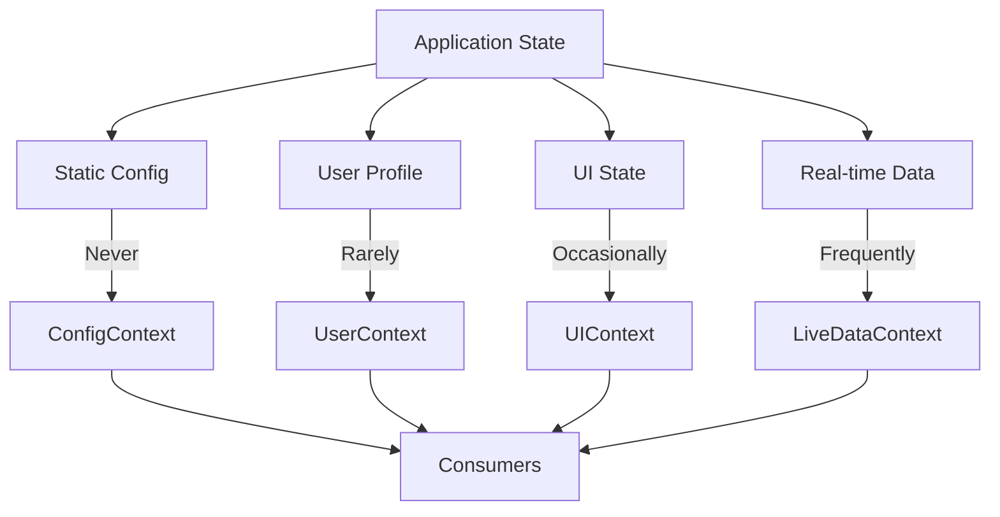

# Topic 54: Multiple Contexts Management - Organizing Complex Context Architectures

## Overview

Managing multiple contexts effectively is crucial for scalable React applications. This comprehensive guide covers strategies for organizing, composing, and optimizing multiple contexts, including context splitting, selective consumption, and architectural patterns for complex state management scenarios.

**What You'll Master:**
- Context splitting strategies
- Selective context consumption
- Context dependency management
- Performance optimization with multiple contexts
- Context organization patterns
- Avoiding context hell
- Testing multiple contexts
- Production-ready multi-context architectures

## 1. Context Splitting Strategies

### 1.1 By Update Frequency



**Implementation:**

```typescript
// Split contexts by how often they update

// 1. Static/Rarely Changing - Single context
interface AppConfigContextType {
  apiUrl: string;
  appName: string;
  version: string;
  features: FeatureFlags;
}

const AppConfigContext = createContext<AppConfigContextType | undefined>(undefined);

export const AppConfigProvider: React.FC<{ children: ReactNode }> = ({ children }) => {
  // Load once on mount, never changes
  const [config] = useState<AppConfigContextType>(() => loadConfig());

  return (
    <AppConfigContext.Provider value={config}>
      {children}
    </AppConfigContext.Provider>
  );
};

// 2. Infrequent Updates - Separate contexts
const UserContext = createContext<User | null>(null);
const ThemeContext = createContext<Theme>('light');
const LocaleContext = createContext<Locale>('en');

// 3. Frequent Updates - Keep isolated
const NotificationsContext = createContext<Notification[]>([]);
const ChatMessagesContext = createContext<Message[]>([]);

// App structure
const App: React.FC = () => {
  return (
    <AppConfigProvider>      {/* Static */}
      <UserProvider>          {/* Rare */}
        <ThemeProvider>       {/* Rare */}
          <LocaleProvider>    {/* Rare */}
            <NotificationProvider> {/* Frequent */}
              <ChatProvider>       {/* Frequent */}
                <Router />
              </ChatProvider>
            </NotificationProvider>
          </LocaleProvider>
        </ThemeProvider>
      </UserProvider>
    </AppConfigProvider>
  );
};
```

### 1.2 By Domain/Feature

```typescript
// Split contexts by business domain
const contexts = {
  // Auth domain
  auth: {
    UserContext,
    SessionContext,
    PermissionsContext,
  },
  
  // E-commerce domain
  commerce: {
    CartContext,
    CheckoutContext,
    OrderContext,
  },
  
  // UI domain
  ui: {
    ThemeContext,
    ModalContext,
    ToastContext,
  },
  
  // Data domain
  data: {
    CacheContext,
    SyncContext,
  },
};

// Domain-specific provider groups
const AuthProviders: React.FC<{ children: ReactNode }> = ({ children }) => (
  <UserProvider>
    <SessionProvider>
      <PermissionsProvider>
        {children}
      </PermissionsProvider>
    </SessionProvider>
  </UserProvider>
);

const CommerceProviders: React.FC<{ children: ReactNode }> = ({ children }) => (
  <CartProvider>
    <CheckoutProvider>
      <OrderProvider>
        {children}
      </OrderProvider>
    </CheckoutProvider>
  </CartProvider>
);

const UIProviders: React.FC<{ children: ReactNode }> = ({ children }) => (
  <ThemeProvider>
    <ModalProvider>
      <ToastProvider>
        {children}
      </ToastProvider>
    </ModalProvider>
  </ThemeProvider>
);

// App composition
const App: React.FC = () => (
  <AuthProviders>
    <CommerceProviders>
      <UIProviders>
        <Router />
      </UIProviders>
    </CommerceProviders>
  </AuthProviders>
);
```

## 2. Selective Context Consumption

### 2.1 Granular Context Access

```typescript
// Split single large context into smaller pieces
// ❌ BAD: Monolithic context
interface AppContextType {
  user: User;
  theme: Theme;
  locale: Locale;
  cart: Cart;
  notifications: Notification[];
  settings: Settings;
}

const AppContext = createContext<AppContextType>(null);

// All consumers re-render on any change

// ✅ GOOD: Granular contexts
const UserContext = createContext<User>(null);
const ThemeContext = createContext<Theme>('light');
const LocaleContext = createContext<Locale>('en');
const CartContext = createContext<Cart>(null);
const NotificationsContext = createContext<Notification[]>([]);
const SettingsContext = createContext<Settings>(null);

// Components only re-render when their specific data changes
const UserName: React.FC = () => {
  const user = useContext(UserContext); // Only re-renders on user change
  return <span>{user?.name}</span>;
};

const ThemeToggle: React.FC = () => {
  const theme = useContext(ThemeContext); // Only re-renders on theme change
  return <button>{theme}</button>;
};
```

### 2.2 Context Slice Pattern

```typescript
// Create slices from larger context for selective updates
interface AppState {
  user: User | null;
  cart: Cart;
  ui: UIState;
}

// Main context
const AppStateContext = createContext<AppState | undefined>(undefined);

// Slice contexts (derived from main context)
const UserSliceContext = createContext<User | null | undefined>(undefined);
const CartSliceContext = createContext<Cart | undefined>(undefined);
const UISliceContext = createContext<UIState | undefined>(undefined);

export const AppStateProvider: React.FC<{ children: ReactNode }> = ({ children }) => {
  const [state, setState] = useState<AppState>({
    user: null,
    cart: { items: [], total: 0 },
    ui: { theme: 'light', sidebarOpen: false },
  });

  // Memoize slices separately
  const userSlice = useMemo(() => state.user, [state.user]);
  const cartSlice = useMemo(() => state.cart, [state.cart]);
  const uiSlice = useMemo(() => state.ui, [state.ui]);

  return (
    <AppStateContext.Provider value={state}>
      <UserSliceContext.Provider value={userSlice}>
        <CartSliceContext.Provider value={cartSlice}>
          <UISliceContext.Provider value={uiSlice}>
            {children}
          </UISliceContext.Provider>
        </CartSliceContext.Provider>
      </UserSliceContext.Provider>
    </AppStateContext.Provider>
  );
};

// Consumers use specific slices
export const useUser = () => {
  const user = useContext(UserSliceContext);
  if (user === undefined) throw new Error('Must be within Provider');
  return user;
};

export const useCart = () => {
  const cart = useContext(CartSliceContext);
  if (!cart) throw new Error('Must be within Provider');
  return cart;
};

// Component only re-renders when user changes, not cart or ui
const UserDisplay: React.FC = () => {
  const user = useUser();
  return <div>{user?.name}</div>;
};
```

## 3. Context Dependency Management

### 3.1 Context Dependency Graph

```typescript
// Manage context dependencies explicitly
interface ContextDependencies {
  [key: string]: string[];
}

const dependencies: ContextDependencies = {
  'Config': [],                          // No dependencies
  'Auth': ['Config'],                    // Depends on Config
  'UserPreferences': ['Auth'],           // Depends on Auth
  'Cart': ['Auth'],                      // Depends on Auth
  'Notifications': ['Auth', 'UserPreferences'], // Depends on both
};

// Validate dependency order
function validateContextOrder(providers: string[]): void {
  const provided = new Set<string>();

  for (const provider of providers) {
    const deps = dependencies[provider] || [];
    
    for (const dep of deps) {
      if (!provided.has(dep)) {
        throw new Error(
          `${provider} depends on ${dep}, but ${dep} is not yet provided. ` +
          `Reorder providers to satisfy dependencies.`
        );
      }
    }
    
    provided.add(provider);
  }
}

// Usage
const providerOrder = ['Config', 'Auth', 'UserPreferences', 'Cart', 'Notifications'];
validateContextOrder(providerOrder); // Throws if order is wrong

// Auto-sort providers by dependencies
function sortProvidersByDependencies(providers: string[]): string[] {
  const sorted: string[] = [];
  const remaining = new Set(providers);

  while (remaining.size > 0) {
    let added = false;

    for (const provider of remaining) {
      const deps = dependencies[provider] || [];
      const depsSatisfied = deps.every(dep => sorted.includes(dep));

      if (depsSatisfied) {
        sorted.push(provider);
        remaining.delete(provider);
        added = true;
      }
    }

    if (!added && remaining.size > 0) {
      throw new Error('Circular dependency detected in contexts');
    }
  }

  return sorted;
}

// Usage
const orderedProviders = sortProvidersByDependencies([
  'Notifications',
  'UserPreferences',
  'Cart',
  'Auth',
  'Config',
]);
// Result: ['Config', 'Auth', 'UserPreferences', 'Cart', 'Notifications']
```

## 4. Higher-Order Thinking: Multi-Context Strategy

### FAQ 1: How many contexts is too many?

**Short Answer:** 5-10 contexts is reasonable; beyond 15-20, consider state management libraries.

**Analysis:**

| Context Count | Complexity | Maintenance | Recommendation |
|---------------|------------|-------------|----------------|
| 1-5 | Low | Easy | Perfect for most apps |
| 6-10 | Medium | Moderate | Acceptable with good organization |
| 11-20 | High | Difficult | Consider Redux/Zustand |
| 20+ | Very High | Very Difficult | Definitely use state library |

**When to Consolidate:**
- Related data that updates together
- Similar access patterns
- Tightly coupled domains

**When to Split:**
- Different update frequencies
- Independent domains
- Performance bottlenecks

### FAQ 2: Should I create a "God Context" with all app state?

**Short Answer:** No, split contexts by domain and update frequency for better performance and maintainability.

**Anti-Pattern:**

```typescript
// ❌ BAD: God Context
interface GodContextType {
  // Auth
  user: User;
  session: Session;
  permissions: Permission[];
  
  // UI
  theme: Theme;
  locale: Locale;
  modals: Modal[];
  
  // Business
  cart: Cart;
  orders: Order[];
  products: Product[];
  
  // Real-time
  notifications: Notification[];
  messages: Message[];
}

const GodContext = createContext<GodContextType>(null);
// Every consumer re-renders on ANY state change!
```

**Better Pattern:**

```typescript
// ✅ GOOD: Domain-specific contexts
const AuthContext = createContext<AuthState>(null);
const UIContext = createContext<UIState>(null);
const CommerceContext = createContext<CommerceState>(null);
const RealtimeContext = createContext<RealtimeState>(null);

// Components consume only what they need
const UserName = () => {
  const { user } = useContext(AuthContext); // Only auth updates
  return <span>{user.name}</span>;
};
```

### FAQ 3: How do I avoid "Provider Hell"?

**Short Answer:** Use provider composition utilities, group related providers, and organize by feature.

**Solutions:**

```typescript
// 1. Composition helper
const compose = (...providers) => ({ children }) =>
  providers.reduceRight((acc, Provider) => <Provider>{acc}</Provider>, children);

const AllProviders = compose(
  ThemeProvider,
  AuthProvider,
  CartProvider,
  NotificationProvider
);

// 2. Feature-based grouping
const FeatureProviders = ({ children }) => (
  <FeatureAProvider>
    <FeatureBProvider>
      {children}
    </FeatureBProvider>
  </FeatureAProvider>
);

// 3. Configuration-based
const providers = [
  { Component: ThemeProvider, props: {} },
  { Component: AuthProvider, props: { apiUrl: '/api' } },
];

const DynamicProviders = ({ children }) =>
  providers.reduce(
    (acc, { Component, props }) => <Component {...props}>{acc}</Component>,
    children
  );
```

### FAQ 4: Should related contexts share a single provider or have separate providers?

**Short Answer:** Use single provider for tightly coupled data; separate providers for independent concerns.

**Decision Guide:**

```typescript
// ✅ SINGLE Provider: Tightly coupled
const ShoppingProvider = () => {
  const [cart, setCart] = useState([]);
  const [checkout, setCheckout] = useState(null);
  
  // Cart and checkout are coupled
  const proceedToCheckout = () => {
    setCheckout({ items: cart, total: calculateTotal(cart) });
  };
  
  return (
    <CartContext.Provider value={{ cart, setCart }}>
      <CheckoutContext.Provider value={{ checkout, proceedToCheckout }}>
        {children}
      </CheckoutContext.Provider>
    </CartContext.Provider>
  );
};

// ✅ SEPARATE Providers: Independent
<ThemeProvider>  {/* UI concern */}
  <AuthProvider>  {/* Auth concern */}
    <CartProvider>  {/* Business concern */}
      {children}
    </CartProvider>
  </AuthProvider>
</ThemeProvider>
```

### FAQ 5: How do I handle context updates from sibling contexts?

**Short Answer:** Use custom events, pub-sub pattern, or a coordination context.

**Coordination Pattern:**

```typescript
// Event coordinator context
interface EventCoordinator {
  subscribe: (event: string, handler: Function) => () => void;
  publish: (event: string, data: any) => void;
}

const EventContext = createContext<EventCoordinator | undefined>(undefined);

export const EventCoordinatorProvider: React.FC<{ children: ReactNode }> = ({ 
  children 
}) => {
  const listeners = useRef(new Map<string, Set<Function>>());

  const coordinator = useMemo<EventCoordinator>(() => ({
    subscribe: (event, handler) => {
      if (!listeners.current.has(event)) {
        listeners.current.set(event, new Set());
      }
      listeners.current.get(event)!.add(handler);

      return () => {
        listeners.current.get(event)?.delete(handler);
      };
    },
    publish: (event, data) => {
      listeners.current.get(event)?.forEach(handler => handler(data));
    },
  }), []);

  return (
    <EventContext.Provider value={coordinator}>
      {children}
    </EventContext.Provider>
  );
};

// Context A publishes events
const CartProvider = ({ children }) => {
  const coordinator = useContext(EventContext);
  const [cart, setCart] = useState([]);

  const addItem = (item) => {
    setCart(prev => [...prev, item]);
    coordinator?.publish('cart:item-added', item);
  };

  return <CartContext.Provider value={{ cart, addItem }}>{children}</CartContext.Provider>;
};

// Context B subscribes to events
const NotificationProvider = ({ children }) => {
  const coordinator = useContext(EventContext);
  const [notifications, setNotifications] = useState([]);

  useEffect(() => {
    return coordinator?.subscribe('cart:item-added', (item) => {
      setNotifications(prev => [...prev, {
        message: `Added ${item.name} to cart`,
        type: 'success',
      }]);
    });
  }, [coordinator]);

  return <NotificationContext.Provider value={notifications}>{children}</NotificationContext.Provider>;
};
```

## 5. Senior SDE Interview Questions

### Question 1: Design a context architecture that scales to 50+ contexts

**What Interviewers Assess:**
- Scalability thinking
- Architectural experience
- Performance awareness
- Practical solutions

**Model Answer:**

"At 50+ contexts, I'd implement a structured architecture:

**1. Registry Pattern:**
```typescript
class ContextRegistry {
  private static contexts = new Map<string, React.Context<any>>();
  
  static register<T>(name: string, context: React.Context<T>): void {
    this.contexts.set(name, context);
  }
  
  static get<T>(name: string): React.Context<T> {
    const context = this.contexts.get(name);
    if (!context) throw new Error(`Context ${name} not registered`);
    return context;
  }
}
```

**2. Auto-Generated Provider Tree:**
- Define contexts declaratively
- Auto-sort by dependencies
- Lazy load providers
- Generate composed provider

**3. Monitoring:**
- Track provider mount/unmount
- Monitor re-render frequencies
- Alert on performance issues

**Key Principle:** At this scale, consider migrating to Redux/Zustand, but if using Context:
- Strict naming conventions
- Automated documentation
- Context dependency graph
- Performance budgets per context"

### Question 2: Debug a performance issue caused by multiple context updates

**What Interviewers Assess:**
- Debugging methodology
- Performance analysis
- Problem-solving
- Tool knowledge

**Model Answer:**

"I'd follow systematic debugging:

**Step 1: Identify Problem**
- Use React DevTools Profiler
- Check component render frequency
- Identify unnecessary re-renders

**Step 2: Trace Context Updates**
```typescript
// Add debug logging
const useContextDebug = (name, value) => {
  useEffect(() => {
    console.log(`${name} updated:`, value);
  }, [value]);
};
```

**Step 3: Common Issues**
1. Not memoizing context values
2. Single context with mixed concerns
3. Context in hot render path
4. Missing memo on consumer components

**Step 4: Fix**
- Split contexts by update frequency
- Memoize all context values
- Use React.memo on consumers
- Consider context selectors

**Prevention:**
- Performance testing in CI
- Render count monitoring
- Context update tracking
- Regular performance reviews"

## Self-Assessment Checklist

Test your multiple contexts mastery:

**Fundamentals:**
- [ ] Understand context splitting strategies
- [ ] Can organize contexts by domain
- [ ] Know selective consumption patterns
- [ ] Understand provider composition

**Intermediate:**
- [ ] Implement context dependency management
- [ ] Create context slice patterns
- [ ] Handle context coordination
- [ ] Test multiple contexts effectively

**Advanced:**
- [ ] Design scalable multi-context architectures
- [ ] Implement context registries
- [ ] Debug multi-context performance issues
- [ ] Build context composition utilities

**Expert:**
- [ ] Architect enterprise-scale context systems
- [ ] Design context migration strategies
- [ ] Optimize context performance at scale
- [ ] Mentor team on context architecture

## Summary

Managing multiple contexts requires careful architecture. Key takeaways:

1. **Split Strategically:** By update frequency and domain
2. **Selective Consumption:** Components use only needed contexts
3. **Dependency Management:** Explicit dependency tracking
4. **Composition:** Clean provider composition utilities
5. **Performance:** Memoization and optimization critical
6. **Organization:** Domain-driven context structure
7. **Testing:** Test contexts independently and together
8. **Scalability:** Registry and automation for many contexts
9. **Monitoring:** Track performance and re-renders
10. **When to Stop:** Know when to use state management libraries

**Next Steps:**
- Topic 55: Context Performance Optimization - Final context topic
- Topic 56: Redux Fundamentals - Begin Redux section
- Continue with comprehensive state management coverage

---

*Multiple contexts require architectural discipline. Master these patterns to build maintainable state management systems that scale with your application.*
