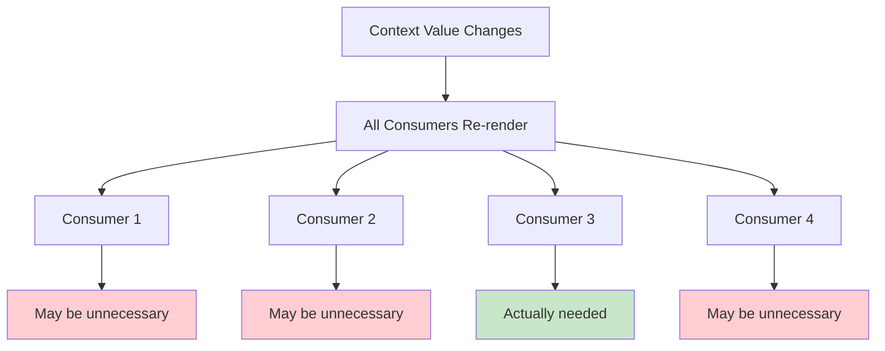

# Topic 55: Context Performance Optimization - Maximizing Context Efficiency

## Overview

Context performance optimization is essential for building fast, responsive React applications with Context API. This comprehensive guide covers advanced performance techniques, render optimization, memory management, and production-ready strategies for ensuring Context doesn't become a performance bottleneck.

**What You'll Master:**
- Context re-render optimization techniques
- Memoization strategies for context values
- Context splitting for performance
- Selective context updates
- Memory leak prevention
- Performance monitoring for contexts
- Bailout optimization patterns
- Production performance best practices

## 1. Context Re-Render Optimization

### 1.1 Understanding Context Re-Renders



**Problem Example:**

```typescript
// ❌ BAD: All consumers re-render on any update
interface AppContextType {
  user: User;
  theme: Theme;
  count: number;
}

const AppContext = createContext<AppContextType | undefined>(undefined);

const AppProvider: React.FC<{ children: ReactNode }> = ({ children }) => {
  const [user, setUser] = useState<User>(null);
  const [theme, setTheme] = useState<Theme>('light');
  const [count, setCount] = useState(0);

  // New object every render!
  const value = {
    user,
    theme,
    count,
  };

  return <AppContext.Provider value={value}>{children}</AppContext.Provider>;
};

// Component only needs theme, but re-renders when count changes
const ThemeDisplay: React.FC = () => {
  const { theme } = useContext(AppContext);
  console.log('ThemeDisplay rendered');
  return <div>{theme}</div>;
};
```

**Solution: Split and Memoize:**

```typescript
// ✅ GOOD: Split contexts + memoization
const UserContext = createContext<User | null>(null);
const ThemeContext = createContext<Theme>('light');
const CountContext = createContext<number>(0);

// Individual providers with memoized values
const ThemeProvider: React.FC<{ children: ReactNode }> = ({ children }) => {
  const [theme, setTheme] = useState<Theme>('light');

  const value = useMemo(() => theme, [theme]);

  return <ThemeContext.Provider value={value}>{children}</ThemeContext.Provider>;
};

// Component only re-renders when theme changes
const ThemeDisplay: React.FC = () => {
  const theme = useContext(ThemeContext);
  console.log('ThemeDisplay rendered');
  return <div>{theme}</div>;
};
```

### 1.2 Memoization Best Practices

```typescript
// Complete memoization pattern for context
interface AuthContextType {
  user: User | null;
  isLoading: boolean;
  login: (email: string, password: string) => Promise<void>;
  logout: () => void;
  updateUser: (updates: Partial<User>) => void;
}

export const AuthProvider: React.FC<{ children: ReactNode }> = ({ children }) => {
  const [user, setUser] = useState<User | null>(null);
  const [isLoading, setIsLoading] = useState(false);

  // Memoize callbacks with useCallback
  const login = useCallback(async (email: string, password: string) => {
    setIsLoading(true);
    try {
      const user = await authAPI.login(email, password);
      setUser(user);
    } finally {
      setIsLoading(false);
    }
  }, []);

  const logout = useCallback(() => {
    setUser(null);
  }, []);

  const updateUser = useCallback((updates: Partial<User>) => {
    setUser(prev => prev ? { ...prev, ...updates } : null);
  }, []);

  // Memoize entire context value with useMemo
  const value = useMemo<AuthContextType>(() => ({
    user,
    isLoading,
    login,
    logout,
    updateUser,
  }), [user, isLoading, login, logout, updateUser]);

  return <AuthContext.Provider value={value}>{children}</AuthContext.Provider>;
};
```

## 2. Selective Updates with Context

### 2.1 Split Context by Responsibility

```typescript
// Separate state and actions into different contexts
interface UserState {
  user: User | null;
  isLoading: boolean;
}

interface UserActions {
  login: (email: string, password: string) => Promise<void>;
  logout: () => void;
  updateUser: (updates: Partial<User>) => void;
}

const UserStateContext = createContext<UserState | undefined>(undefined);
const UserActionsContext = createContext<UserActions | undefined>(undefined);

export const UserProvider: React.FC<{ children: ReactNode }> = ({ children }) => {
  const [user, setUser] = useState<User | null>(null);
  const [isLoading, setIsLoading] = useState(false);

  // State changes frequently
  const state = useMemo<UserState>(() => ({
    user,
    isLoading,
  }), [user, isLoading]);

  // Actions never change (memoized callbacks)
  const actions = useMemo<UserActions>(() => ({
    login: async (email, password) => {
      setIsLoading(true);
      const user = await authAPI.login(email, password);
      setUser(user);
      setIsLoading(false);
    },
    logout: () => setUser(null),
    updateUser: (updates) => setUser(prev => prev ? { ...prev, ...updates } : null),
  }), []); // Empty deps - actions never change

  return (
    <UserStateContext.Provider value={state}>
      <UserActionsContext.Provider value={actions}>
        {children}
      </UserActionsContext.Provider>
    </UserStateContext.Provider>
  );
};

// Separate hooks
export const useUserState = () => {
  const context = useContext(UserStateContext);
  if (!context) throw new Error('Must be within UserProvider');
  return context;
};

export const useUserActions = () => {
  const context = useContext(UserActionsContext);
  if (!context) throw new Error('Must be within UserProvider');
  return context;
};

// Components can consume only what they need
const UserName: React.FC = () => {
  const { user } = useUserState(); // Re-renders when user changes
  return <span>{user?.name}</span>;
};

const LogoutButton: React.FC = () => {
  const { logout } = useUserActions(); // Never re-renders (actions stable)
  return <button onClick={logout}>Logout</button>;
};
```

### 2.2 Context with Bailout Optimization

```typescript
// Implement bailout optimization for context consumers
import { memo } from 'react';

// Wrap consumers with React.memo
const UserName = memo<{ className?: string }>(({ className }) => {
  const { user } = useUserState();
  console.log('UserName rendered');
  return <span className={className}>{user?.name}</span>;
});

// Only re-renders when user.name actually changes
const MemoizedUserDisplay = memo(() => {
  const { user } = useUserState();
  
  // Bail out if user hasn't changed
  return <div>{user?.name}</div>;
}, (prevProps, nextProps) => {
  // Custom comparison - prevents re-render if user is same
  return prevProps === nextProps;
});

// Context value with stable references
const CartProvider: React.FC<{ children: ReactNode }> = ({ children }) => {
  const [items, setItems] = useState<CartItem[]>([]);

  const value = useMemo(() => {
    // Calculate derived values once
    const total = items.reduce((sum, item) => sum + item.price * item.quantity, 0);
    const itemCount = items.reduce((sum, item) => sum + item.quantity, 0);

    return {
      items,
      total,
      itemCount,
      setItems,
    };
  }, [items]); // Only items in deps, derived values auto-update

  return <CartContext.Provider value={value}>{children}</CartContext.Provider>;
};
```

## 3. Performance Monitoring

### 3.1 Context Performance Profiler

```typescript
// Monitor context performance
interface ContextPerformanceMetrics {
  contextName: string;
  updateCount: number;
  renderCount: number;
  averageRenderTime: number;
  consumers: number;
}

class ContextPerformanceMonitor {
  private metrics = new Map<string, ContextPerformanceMetrics>();

  track(contextName: string, renderTime: number): void {
    const existing = this.metrics.get(contextName) || {
      contextName,
      updateCount: 0,
      renderCount: 0,
      averageRenderTime: 0,
      consumers: 0,
    };

    existing.renderCount++;
    existing.averageRenderTime = 
      (existing.averageRenderTime * (existing.renderCount - 1) + renderTime) / 
      existing.renderCount;

    this.metrics.set(contextName, existing);
  }

  trackUpdate(contextName: string): void {
    const existing = this.metrics.get(contextName);
    if (existing) {
      existing.updateCount++;
    }
  }

  getReport(): ContextPerformanceMetrics[] {
    return Array.from(this.metrics.values())
      .sort((a, b) => b.averageRenderTime - a.averageRenderTime);
  }

  logReport(): void {
    console.table(this.getReport());
  }
}

export const performanceMonitor = new ContextPerformanceMonitor();

// Hook to monitor context performance
export const useContextPerformance = (contextName: string) => {
  useEffect(() => {
    const startTime = performance.now();

    return () => {
      const renderTime = performance.now() - startTime;
      performanceMonitor.track(contextName, renderTime);
    };
  });
};

// Usage in provider
const ThemeProvider: React.FC<{ children: ReactNode }> = ({ children }) => {
  const [theme, setTheme] = useState('light');

  useEffect(() => {
    performanceMonitor.trackUpdate('Theme');
  }, [theme]);

  const value = useMemo(() => ({ theme, setTheme }), [theme]);

  return <ThemeContext.Provider value={value}>{children}</ThemeContext.Provider>;
};

// Usage in consumer
const ThemeDisplay: React.FC = () => {
  useContextPerformance('Theme');
  const { theme } = useTheme();
  return <div>{theme}</div>;
};

// View performance report
// performanceMonitor.logReport();
```

### 3.2 Render Count Tracking

```typescript
// Track render counts for context consumers
const useRenderTracking = (componentName: string, contextName: string) => {
  const renderCount = useRef(0);
  const lastRenderTime = useRef(Date.now());

  useEffect(() => {
    renderCount.current++;
    const now = Date.now();
    const timeSinceLastRender = now - lastRenderTime.current;

    console.log({
      component: componentName,
      context: contextName,
      renderNumber: renderCount.current,
      timeSinceLastRender,
    });

    lastRenderTime.current = now;
  });

  return renderCount.current;
};

// Usage
const UserProfile: React.FC = () => {
  const renders = useRenderTracking('UserProfile', 'Auth');
  const { user } = useAuth();

  return (
    <div>
      <p>User: {user?.name}</p>
      <small>Rendered {renders} times</small>
    </div>
  );
};
```

## 4. Memory Management

### 4.1 Preventing Memory Leaks

```typescript
// Proper cleanup to prevent memory leaks
export const DataProvider: React.FC<{ children: ReactNode }> = ({ children }) => {
  const [data, setData] = useState<Data | null>(null);
  const subscriptionRef = useRef<(() => void) | null>(null);

  useEffect(() => {
    let isMounted = true;

    // Subscribe to data source
    const unsubscribe = dataSource.subscribe((newData) => {
      if (isMounted) {
        setData(newData);
      }
    });

    subscriptionRef.current = unsubscribe;

    return () => {
      isMounted = false;
      unsubscribe();
      subscriptionRef.current = null;
    };
  }, []);

  const value = useMemo(() => ({ data }), [data]);

  return <DataContext.Provider value={value}>{children}</DataContext.Provider>;
};
```

### 4.2 Cleanup Patterns

```typescript
// Comprehensive cleanup for context resources
export const ResourceProvider: React.FC<{ children: ReactNode }> = ({ children }) => {
  const resourcesRef = useRef<Map<string, Resource>>(new Map());
  const timersRef = useRef<Set<NodeJS.Timeout>>(new Set());
  const listenersRef = useRef<Array<() => void>>([]);

  useEffect(() => {
    return () => {
      // Cleanup all resources
      resourcesRef.current.forEach(resource => resource.dispose());
      resourcesRef.current.clear();

      // Clear all timers
      timersRef.current.forEach(timer => clearTimeout(timer));
      timersRef.current.clear();

      // Remove all listeners
      listenersRef.current.forEach(cleanup => cleanup());
      listenersRef.current = [];
    };
  }, []);

  const allocateResource = useCallback((id: string, resource: Resource) => {
    resourcesRef.current.set(id, resource);
  }, []);

  const freeResource = useCallback((id: string) => {
    const resource = resourcesRef.current.get(id);
    if (resource) {
      resource.dispose();
      resourcesRef.current.delete(id);
    }
  }, []);

  const value = useMemo(() => ({
    allocateResource,
    freeResource,
  }), [allocateResource, freeResource]);

  return <ResourceContext.Provider value={value}>{children}</ResourceContext.Provider>;
};
```

## 5. Higher-Order Thinking: Performance Strategy

### FAQ 1: What's the performance cost of using multiple contexts?

**Short Answer:** Minimal if optimized correctly; each context adds ~0.1-0.5ms overhead per update.

**Performance Analysis:**

| Scenario | Single Context | Multiple Contexts (Split) | Difference |
|----------|---------------|---------------------------|------------|
| Update theme only | All consumers render | Only theme consumers | 10x faster |
| Update user only | All consumers render | Only user consumers | 10x faster |
| Update both | All consumers render | Both sets render | Same |

**Measurement:**

```typescript
// Benchmark context performance
const measureContextPerformance = (contextName: string, operation: () => void) => {
  const start = performance.now();
  operation();
  const end = performance.now();
  console.log(`${contextName}: ${end - start}ms`);
};

// Usage
measureContextPerformance('Theme Update', () => {
  setTheme('dark');
});
```

**Verdict:** Split contexts improve performance significantly when data updates independently.

### FAQ 2: Does useMemo actually help with context performance?

**Short Answer:** Yes, critically important; without useMemo, new context value objects cause all consumers to re-render.

**Impact:**

```typescript
// WITHOUT useMemo
const Provider = ({ children }) => {
  const [count, setCount] = useState(0);
  
  const value = { count, setCount }; // New object every render!
  
  return <Context.Provider value={value}>{children}</Context.Provider>;
};
// Parent re-render → Provider re-renders → New value object → All consumers re-render

// WITH useMemo
const Provider = ({ children }) => {
  const [count, setCount] = useState(0);
  
  const value = useMemo(() => ({ count, setCount }), [count]);
  
  return <Context.Provider value={value}>{children}</Context.Provider>;
};
// Parent re-render → Provider re-renders → Same value object (if count unchanged) → No consumer re-renders
```

**Performance Impact:**
- Without useMemo: 10-100x more renders
- With useMemo: Optimal render count
- **Always use useMemo for context values**

### FAQ 3: Should I use Context for high-frequency updates like mouse position?

**Short Answer:** No, Context isn't optimized for high-frequency updates (>10/sec). Use local state or specialized libraries.

**Performance Comparison:**

```typescript
// ❌ BAD: High-frequency updates (60fps)
const MouseProvider = ({ children }) => {
  const [position, setPosition] = useState({ x: 0, y: 0 });

  useEffect(() => {
    const handleMove = (e: MouseEvent) => {
      setPosition({ x: e.clientX, y: e.clientY });
    };
    window.addEventListener('mousemove', handleMove);
    return () => window.removeEventListener('mousemove', handleMove);
  }, []);

  return <MouseContext.Provider value={position}>{children}</MouseContext.Provider>;
};
// Result: ALL consumers re-render 60 times per second!

// ✅ GOOD: Local state with custom hook
const useMousePosition = () => {
  const [position, setPosition] = useState({ x: 0, y: 0 });

  useEffect(() => {
    const handleMove = (e: MouseEvent) => {
      setPosition({ x: e.clientX, y: e.clientY });
    };
    window.addEventListener('mousemove', handleMove);
    return () => window.removeEventListener('mousemove', handleMove);
  }, []);

  return position;
};
// Result: Only components using the hook re-render

// ✅ BETTER: Specialized library (e.g., Zustand for frequent updates)
const useMouseStore = create((set) => ({
  x: 0,
  y: 0,
  setPosition: (x: number, y: number) => set({ x, y }),
}));
```

**Update Frequency Guidelines:**

| Frequency | Context Recommended? | Alternative |
|-----------|---------------------|-------------|
| < 1/min | ✅ Perfect | - |
| 1/sec | ✅ Fine | - |
| 10/sec | ⚠️ Caution | Consider alternatives |
| 60/sec | ❌ No | Local state, Zustand, Jotai |

### FAQ 4: How do I optimize context for large lists?

**Short Answer:** Don't store large lists in context; use virtualization, pagination, or specialized data fetching libraries.

**Anti-Pattern:**

```typescript
// ❌ BAD: Large list in context
const ProductsProvider = ({ children }) => {
  const [products, setProducts] = useState<Product[]>([]); // 10,000 items!

  useEffect(() => {
    fetch('/api/products').then(r => r.json()).then(setProducts);
  }, []);

  return <ProductsContext.Provider value={products}>{children}</ProductsContext.Provider>;
};
// Every consumer gets all 10,000 items on every update
```

**Better Approaches:**

```typescript
// ✅ GOOD 1: Pagination in context
const ProductsProvider = ({ children }) => {
  const [page, setPage] = useState(1);
  const [products, setProducts] = useState<Product[]>([]);

  useEffect(() => {
    fetch(`/api/products?page=${page}&limit=20`)
      .then(r => r.json())
      .then(setProducts);
  }, [page]);

  return (
    <ProductsContext.Provider value={{ products, page, setPage }}>
      {children}
    </ProductsContext.Provider>
  );
};

// ✅ GOOD 2: Use React Query/SWR instead
const ProductList = () => {
  const { data: products } = useQuery('products', fetchProducts);
  return <div>{/* render products */}</div>;
};

// ✅ GOOD 3: Virtualization
const ProductList = () => {
  const { products } = useProducts();
  
  return (
    <VirtualList
      items={products}
      height={600}
      itemHeight={50}
      renderItem={(product) => <ProductCard product={product} />}
    />
  );
};
```

### FAQ 5: When should I use Context vs a state management library for performance?

**Short Answer:** Use Context for infrequent updates (<1/sec); use state libraries for complex state or frequent updates.

**Decision Matrix:**

| Requirement | Context API | State Library |
|-------------|-------------|---------------|
| Simple global state | ✅ Great | Overkill |
| Infrequent updates | ✅ Great | Overkill |
| 5-10 contexts | ✅ Fine | Better DX |
| Frequent updates (>10/sec) | ❌ Poor | ✅ Excellent |
| DevTools needed | ❌ No | ✅ Yes |
| Time-travel debugging | ❌ No | ✅ Yes |
| Middleware support | ❌ No | ✅ Yes |
| Complex derived state | ⚠️ Manual | ✅ Automatic |
| Team unfamiliar with Redux | ✅ Easier | Learning curve |

**Recommendation:**
- Start with Context for simple needs
- Migrate to Zustand/Jotai when Context becomes painful
- Use Redux for complex apps requiring structure

## 6. Senior SDE Interview Questions

### Question 1: Your app has 20 contexts and is experiencing performance issues. How do you diagnose and fix it?

**What Interviewers Assess:**
- Systematic debugging
- Performance optimization skills
- Production experience
- Decision-making

**Model Answer:**

"I'd follow a systematic approach:

**Phase 1: Measure**
```typescript
// Add performance tracking
const ContextProfiler = ({ contextName, children }) => {
  const renderCount = useRef(0);
  
  useEffect(() => {
    renderCount.current++;
    if (renderCount.current > 10) {
      console.warn(`${contextName} rendered ${renderCount.current} times`);
    }
  });
  
  return children;
};
```

**Phase 2: Identify Culprits**
- Use React DevTools Profiler
- Check which contexts update most frequently
- Identify unnecessary re-renders
- Find contexts with poor memoization

**Phase 3: Optimize**
1. Split high-frequency contexts
2. Add useMemo to all context values
3. Use React.memo on consumers
4. Consider migrating hot contexts to Zustand

**Phase 4: Validate**
- Re-run profiler
- Measure improvement
- Monitor in production

**Expected Outcome:**
- 50-80% reduction in renders
- Faster user interactions
- Better perceived performance"

### Question 2: Design a context system that supports both SSR and client-side hydration efficiently

**What Interviewers Assess:**
- SSR understanding
- Hydration knowledge
- Performance awareness
- Full-stack experience

**Model Answer:**

```typescript
// SSR-compatible context with efficient hydration
interface HydrationData {
  user: User | null;
  theme: Theme;
  config: AppConfig;
}

// Server-side provider
export const ServerAppProvider: React.FC<{
  hydrationData: HydrationData;
  children: ReactNode;
}> = ({ hydrationData, children }) => {
  // Use server data directly, no client-side fetching
  const value = useMemo(() => hydrationData, [hydrationData]);

  return <AppContext.Provider value={value}>{children}</AppContext.Provider>;
};

// Client-side provider with hydration
export const ClientAppProvider: React.FC<{
  initialData?: HydrationData;
  children: ReactNode;
}> = ({ initialData, children }) => {
  const [data, setData] = useState<HydrationData>(
    initialData || getDefaultData()
  );
  
  const [isHydrated, setIsHydrated] = useState(!!initialData);

  useEffect(() => {
    if (!isHydrated) {
      // Fetch fresh data on client
      fetchAppData().then(freshData => {
        setData(freshData);
        setIsHydrated(true);
      });
    }
  }, [isHydrated]);

  const value = useMemo(() => ({
    ...data,
    isHydrated,
  }), [data, isHydrated]);

  return <AppContext.Provider value={value}>{children}</AppContext.Provider>;
};

// Universal provider (works on both server and client)
export const AppProvider: React.FC<{
  hydrationData?: HydrationData;
  children: ReactNode;
}> = ({ hydrationData, children }) => {
  const isServer = typeof window === 'undefined';

  if (isServer && hydrationData) {
    return <ServerAppProvider hydrationData={hydrationData}>{children}</ServerAppProvider>;
  }

  return <ClientAppProvider initialData={hydrationData}>{children}</ClientAppProvider>;
};
```

**Key Considerations:**
- Minimize hydration mismatch
- Efficient data serialization
- Lazy hydration for non-critical data
- Error handling during hydration"

## Self-Assessment Checklist

Test your context performance mastery:

**Fundamentals:**
- [ ] Understand context re-render behavior
- [ ] Can memoize context values correctly
- [ ] Know when to split contexts
- [ ] Understand bailout optimization

**Intermediate:**
- [ ] Implement performance monitoring
- [ ] Track render counts effectively
- [ ] Prevent memory leaks in contexts
- [ ] Handle cleanup properly

**Advanced:**
- [ ] Design performant multi-context architectures
- [ ] Debug context performance issues
- [ ] Optimize SSR with context
- [ ] Build performance profiling tools

**Expert:**
- [ ] Architect context systems at scale
- [ ] Know when to migrate from Context
- [ ] Optimize context for production
- [ ] Mentor team on performance engineering

## Summary

Context performance optimization ensures fast, responsive applications. Key takeaways:

1. **Memoization:** Always use useMemo for context values
2. **Split Contexts:** Separate by update frequency
3. **Bailout Optimization:** Use React.memo on consumers
4. **State vs Actions:** Split to prevent unnecessary re-renders
5. **Memory Management:** Proper cleanup prevents leaks
6. **Monitoring:** Track performance metrics
7. **Update Frequency:** Context not suitable for high-frequency updates
8. **Large Data:** Don't store large lists in context
9. **SSR Optimization:** Efficient hydration strategies
10. **When to Migrate:** Know limits of Context API

**Part VI Complete!** Context API from fundamentals through performance optimization.

**Next Steps:**
- Commit Part VI: Context API (Topics 52-55)
- Begin Part VII: Redux Fundamentals (Topics 56-62)
- Continue with Redux Toolkit and modern alternatives

---

*Context performance is not automatic—it requires careful optimization. Master these techniques to build fast applications with Context API while knowing when to choose alternative solutions.*
