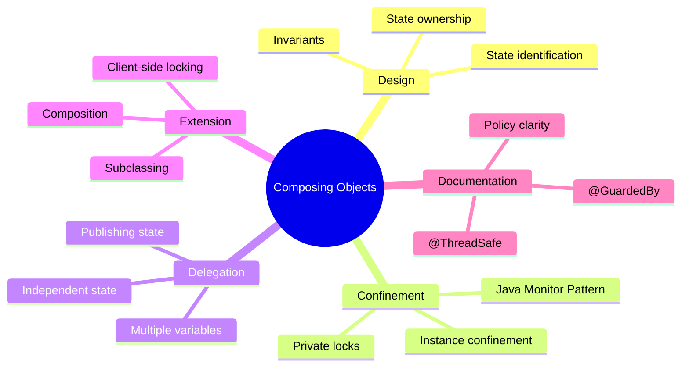
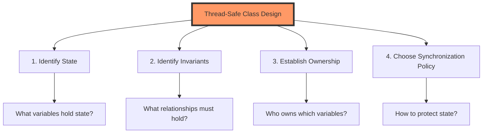
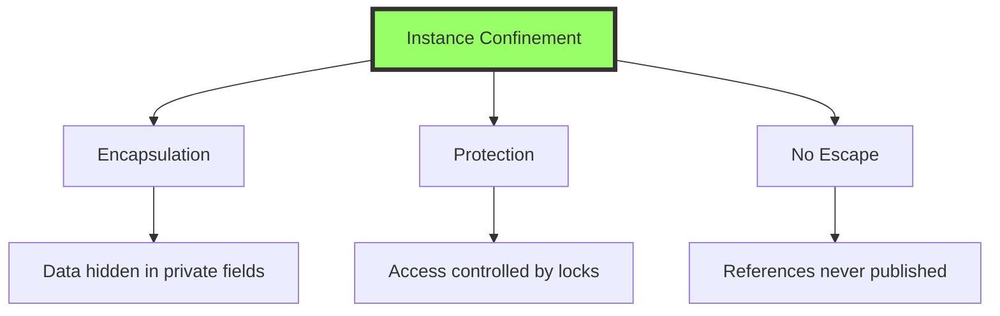
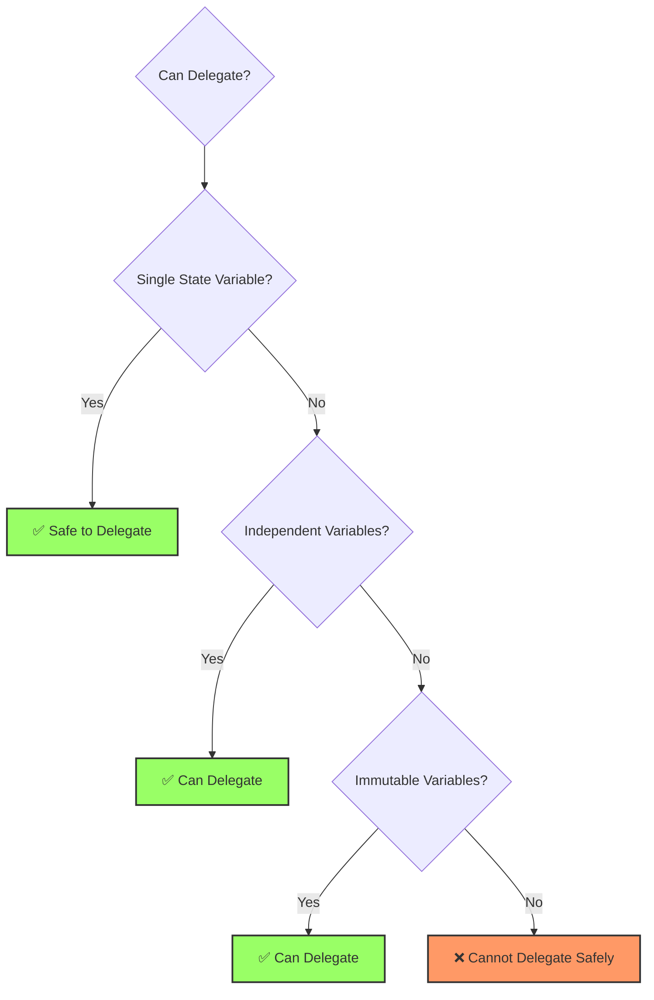
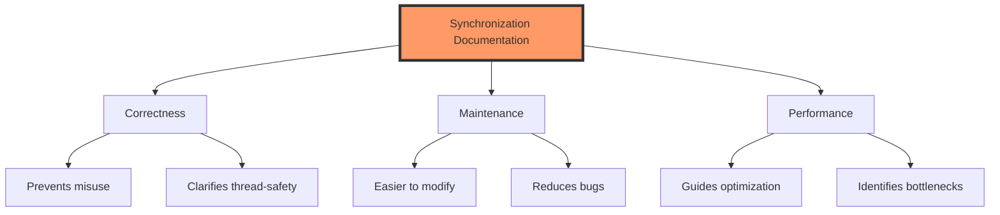
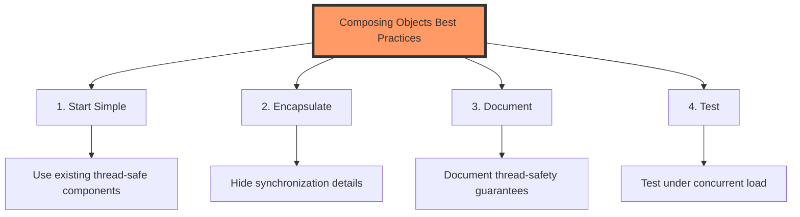
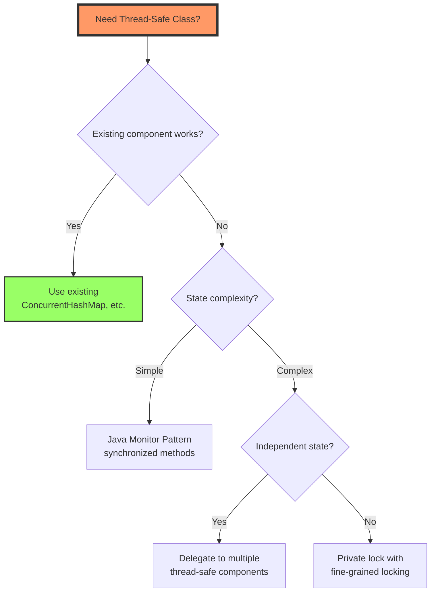

# 📚 Chapter 4: Composing Objects

> **Learn to build thread-safe classes by composing thread-safe components - the art of designing robust concurrent systems**

---

## 📖 Table of Contents

1. [Overview](#-overview)
2. [Designing a Thread-Safe Class](#-41-designing-a-thread-safe-class)
3. [Instance Confinement](#-42-instance-confinement)
4. [Delegating Thread Safety](#-43-delegating-thread-safety)
5. [Adding Functionality to Thread-Safe Classes](#-44-adding-functionality-to-existing-thread-safe-classes)
6. [Documenting Synchronization Policies](#-45-documenting-synchronization-policies)
7. [Best Practices](#-best-practices)
8. [Practice Exercises](#-practice-exercises)

---

## 🎯 Overview

So far we've covered the low-level mechanisms (locks, volatile) and principles (visibility, atomicity) of thread safety. Now it's time to learn how to **compose** these building blocks into larger thread-safe classes and components.

### **Why This Chapter Matters:**
- 🏗️ **Design Patterns**: Learn proven patterns for building thread-safe classes
- 🔒 **Encapsulation**: Keep synchronization details hidden from clients
- 🎯 **Composition**: Build complex thread-safe components from simpler ones
- 📝 **Documentation**: Communicate thread-safety guarantees clearly
- 🛡️ **Delegation**: Leverage existing thread-safe classes effectively

### **Key Learning Objectives:**



---

## 🏗️ 4.1 Designing a Thread-Safe Class

### **The Design Process**

Building a thread-safe class requires careful consideration of several factors:



---

### **🎯 Step 1: Identify the Object's State**

State consists of any data that affects the externally visible behavior:

```java
/**
 * Simple counter - state is the count value
 */
public class Counter {
    // State: just one variable
    private long count = 0;
    
    public synchronized long getCount() {
        return count;
    }
    
    public synchronized long increment() {
        return ++count;
    }
}

/**
 * Person - state is multiple variables
 */
public class Person {
    // State: name, age, and address
    private String name;
    private int age;
    private Address address;
    
    // All three variables comprise the object's state
}

/**
 * Vehicle tracker - state is in a collection
 */
public class VehicleTracker {
    // State: the entire map and all Point objects in it
    private final Map<String, Point> locations = new HashMap<>();
    
    // State includes both the map structure AND the points
}
```

---

### **🎯 Step 2: Identify Invariants**

Invariants are conditions that must always hold true:

```java
/**
 * Number range with invariants
 */
public class NumberRange {
    // State variables
    private int lower;
    private int upper;
    
    // INVARIANT: lower <= upper
    // This must ALWAYS be true!
    
    public NumberRange(int lower, int upper) {
        if (lower > upper) {
            throw new IllegalArgumentException("lower > upper");
        }
        this.lower = lower;
        this.upper = upper;
    }
    
    // Must maintain invariant
    public synchronized void setLower(int value) {
        if (value > upper) {  // ← Checking invariant
            throw new IllegalArgumentException("lower > upper");
        }
        lower = value;
    }
    
    public synchronized void setUpper(int value) {
        if (value < lower) {  // ← Checking invariant
            throw new IllegalArgumentException("upper < lower");
        }
        upper = value;
    }
}
```

**Common Invariants:**

| Type | Example | Description |
|------|---------|-------------|
| **Range** | `0 <= count <= max` | Values within bounds |
| **Relationship** | `lower <= upper` | Variables related by constraint |
| **Non-null** | `reference != null` | Required references |
| **Collection size** | `size() == elements.length` | Consistency between related state |
| **State validity** | `state ∈ {OPEN, CLOSED}` | Limited set of valid states |

---

### **🎯 Step 3: Establish State Ownership**

Who owns which state? Who's responsible for maintaining invariants?

```java
/**
 * Clear ownership model
 */
public class Car {
    // Car OWNS engine
    private final Engine engine = new Engine();
    
    // Car has REFERENCE to driver (doesn't own)
    private Person driver;
    
    // Car OWNS collection and its contents
    private final List<Passenger> passengers = new ArrayList<>();
    
    public synchronized void addPassenger(Passenger p) {
        // Car is responsible for thread-safety of passengers list
        passengers.add(p);
    }
}
```

---

### **🎯 Step 4: Choose Synchronization Policy**

Decide how to protect state and maintain invariants:

```java
/**
 * Different synchronization strategies
 */

// Strategy 1: Intrinsic locking
public class IntrinsicLockCounter {
    private int count = 0;
    
    public synchronized void increment() {
        count++;
    }
}

// Strategy 2: Explicit locking
public class ExplicitLockCounter {
    private final Lock lock = new ReentrantLock();
    private int count = 0;
    
    public void increment() {
        lock.lock();
        try {
            count++;
        } finally {
            lock.unlock();
        }
    }
}

// Strategy 3: Atomic variables
public class AtomicCounter {
    private final AtomicInteger count = new AtomicInteger(0);
    
    public void increment() {
        count.incrementAndGet();
    }
}

// Strategy 4: Immutability
public final class ImmutableCounter {
    private final int count;
    
    public ImmutableCounter(int count) {
        this.count = count;
    }
    
    public ImmutableCounter increment() {
        return new ImmutableCounter(count + 1);
    }
}

// Strategy 5: Thread confinement
public class ThreadConfinedCounter {
    private static final ThreadLocal<Integer> count = 
        ThreadLocal.withInitial(() -> 0);
    
    public void increment() {
        count.set(count.get() + 1);
    }
}
```

---

### **📐 The Java Monitor Pattern**

The most common pattern for thread-safe classes:

```java
/**
 * Classic Java Monitor Pattern
 * - All mutable state is private and guarded by the object's lock
 * - All public methods are synchronized
 */
public final class Counter {
    @GuardedBy("this")
    private long value = 0;
    
    public synchronized long getValue() {
        return value;
    }
    
    public synchronized long increment() {
        if (value == Long.MAX_VALUE) {
            throw new IllegalStateException("Counter overflow");
        }
        return ++value;
    }
    
    public synchronized long decrement() {
        if (value == Long.MIN_VALUE) {
            throw new IllegalStateException("Counter underflow");
        }
        return --value;
    }
}
```

**Monitor Pattern Benefits:**
- ✅ Simple to understand and implement
- ✅ All accesses automatically synchronized
- ✅ Easy to verify correctness
- ✅ Good for simple cases

**Monitor Pattern Drawbacks:**
- ❌ Can be inefficient (all methods synchronized)
- ❌ Doesn't scale well for complex classes
- ❌ May hold locks longer than necessary

---

## 🔒 4.2 Instance Confinement

### **What is Instance Confinement?**

> **Instance confinement means encapsulating data within an object and protecting it with the object's lock, so the data never escapes.**



---

### **✅ Example: Confined Tracking**

```java
/**
 * Person tracker with confined state
 */
@ThreadSafe
public class PersonTracker {
    @GuardedBy("this")
    private final Map<String, Person> people = new HashMap<>();
    
    public synchronized void addPerson(String id, Person person) {
        // Defensive copy to ensure confinement
        people.put(id, new Person(person));
    }
    
    public synchronized Person getPerson(String id) {
        Person p = people.get(id);
        // Return defensive copy to maintain confinement
        return p == null ? null : new Person(p);
    }
    
    public synchronized Set<String> getAllIds() {
        // Return copy of keys to prevent modification
        return new HashSet<>(people.keySet());
    }
    
    // State never escapes!
}
```

**Why Confinement Works:**

```
External Code          PersonTracker          Internal State
────────────          ─────────────          ──────────────
addPerson(p) ────────▶ synchronized ────────▶ Copy stored
                       method                 in HashMap
                                              
getPerson() ◀─────────  synchronized ◀──────── Copy returned
             Copy       method                 from HashMap

Original objects never escape!
Copies ensure isolation!
```

---

### **🔐 Private Lock Object**

Using a private lock object instead of `this`:

```java
/**
 * Using private lock for better encapsulation
 */
public class PrivateLock {
    // Private lock object - cannot be accessed by external code
    private final Object lock = new Object();
    
    @GuardedBy("lock")
    private int value = 0;
    
    public void increment() {
        synchronized (lock) {  // ← Using private lock
            value++;
        }
    }
    
    public int getValue() {
        synchronized (lock) {
            return value;
        }
    }
}
```

**Benefits of Private Lock:**

| Aspect | `synchronized(this)` | `synchronized(privateLock)` |
|--------|---------------------|----------------------------|
| **Client can synchronize** | ✅ Yes (might interfere) | ❌ No (encapsulated) |
| **Encapsulation** | ❌ Exposes lock | ✅ Lock is hidden |
| **Flexibility** | ❌ Limited | ✅ Can use multiple locks |
| **Security** | ❌ Clients can hold lock | ✅ Only class controls lock |

---

### **🎯 Example: Vehicle Tracker with Confinement**

```java
/**
 * Monitors vehicle locations with mutable Point class
 */
@ThreadSafe
public class MonitorVehicleTracker {
    @GuardedBy("this")
    private final Map<String, MutablePoint> locations;
    
    public MonitorVehicleTracker(Map<String, MutablePoint> locations) {
        this.locations = deepCopy(locations);
    }
    
    public synchronized Map<String, MutablePoint> getLocations() {
        return deepCopy(locations);  // ← Defensive copy
    }
    
    public synchronized MutablePoint getLocation(String id) {
        MutablePoint loc = locations.get(id);
        return loc == null ? null : new MutablePoint(loc);  // ← Copy
    }
    
    public synchronized void setLocation(String id, int x, int y) {
        MutablePoint loc = locations.get(id);
        if (loc == null) {
            throw new IllegalArgumentException("No such vehicle: " + id);
        }
        loc.x = x;
        loc.y = y;
    }
    
    private static Map<String, MutablePoint> deepCopy(
            Map<String, MutablePoint> m) {
        Map<String, MutablePoint> result = new HashMap<>();
        for (String id : m.keySet()) {
            result.put(id, new MutablePoint(m.get(id)));
        }
        return Collections.unmodifiableMap(result);
    }
}

/**
 * Mutable point class
 */
class MutablePoint {
    public int x, y;
    
    public MutablePoint() {
        x = 0;
        y = 0;
    }
    
    public MutablePoint(MutablePoint p) {
        this.x = p.x;
        this.y = p.y;
    }
}
```

**Key Points:**
- ✅ Mutable state (`Map` and `MutablePoint`) is confined
- ✅ All access is synchronized
- ✅ Defensive copying prevents escape
- ❌ Performance cost of copying

---

## 🎯 4.3 Delegating Thread Safety

### **When Can You Delegate?**

Sometimes you can delegate thread safety to existing thread-safe components:



---

### **✅ Example: Delegating to ConcurrentHashMap**

```java
/**
 * Delegates thread safety to ConcurrentHashMap
 */
@ThreadSafe
public class DelegatingVehicleTracker {
    private final ConcurrentMap<String, Point> locations;
    private final Map<String, Point> unmodifiableMap;
    
    public DelegatingVehicleTracker(Map<String, Point> points) {
        locations = new ConcurrentHashMap<>(points);
        unmodifiableMap = Collections.unmodifiableMap(locations);
    }
    
    // No synchronization needed!
    public Map<String, Point> getLocations() {
        return unmodifiableMap;  // Returns live view
    }
    
    public Point getLocation(String id) {
        return locations.get(id);
    }
    
    public void setLocation(String id, int x, int y) {
        if (locations.replace(id, new Point(x, y)) == null) {
            throw new IllegalArgumentException("Invalid vehicle: " + id);
        }
    }
}

/**
 * Immutable Point class
 */
@Immutable
public class Point {
    public final int x, y;
    
    public Point(int x, int y) {
        this.x = x;
        this.y = y;
    }
}
```

**Why This Works:**
- ✅ `Point` is immutable (thread-safe)
- ✅ `ConcurrentHashMap` is thread-safe
- ✅ No invariants span multiple variables
- ✅ No compound operations needed

---

### **📊 Comparison: Monitor vs Delegation**

| Feature | MonitorVehicleTracker | DelegatingVehicleTracker |
|---------|----------------------|--------------------------|
| **Locking** | All methods synchronized | No explicit locking |
| **State** | Mutable `MutablePoint` | Immutable `Point` |
| **Copying** | Returns snapshot (copy) | Returns live view |
| **Performance** | Slower (copying overhead) | Faster (no copying) |
| **Consistency** | Snapshot is consistent | Live view may change |
| **Complexity** | More code | Less code |

---

### **⚠️ When Delegation Fails**

```java
/**
 * BROKEN: Cannot safely delegate when invariants span variables
 */
public class NumberRange {
    // Invariant: lower <= upper
    private final AtomicInteger lower = new AtomicInteger(0);
    private final AtomicInteger upper = new AtomicInteger(0);
    
    // ❌ NOT THREAD-SAFE despite using AtomicInteger!
    public void setLower(int i) {
        if (i > upper.get()) {  // ← Check
            throw new IllegalArgumentException();
        }
        lower.set(i);  // ← Act (not atomic with check!)
    }
    
    public void setUpper(int i) {
        if (i < lower.get()) {  // ← Check
            throw new IllegalArgumentException();
        }
        upper.set(i);  // ← Act (not atomic with check!)
    }
}
```

**Timeline of the Race:**

```
Initial: lower=0, upper=10

Thread A: setLower(5)         Thread B: setUpper(4)
─────────────────────         ─────────────────────
Check: 5 > 10? No ✅           
                              Check: 4 < 0? No ✅
Set lower=5                   
                              Set upper=4
                              
Result: lower=5, upper=4 ❌ Invariant violated!
```

**The Fix: Synchronization**

```java
public class SafeNumberRange {
    @GuardedBy("this")
    private int lower = 0;
    @GuardedBy("this")
    private int upper = 0;
    
    // ✅ THREAD-SAFE: Atomic check-then-act
    public synchronized void setLower(int i) {
        if (i > upper) {
            throw new IllegalArgumentException();
        }
        lower = i;
    }
    
    public synchronized void setUpper(int i) {
        if (i < lower) {
            throw new IllegalArgumentException();
        }
        upper = i;
    }
}
```

---

### **🎯 Publishing Underlying State**

```java
/**
 * Safe to publish because Point is immutable and map is thread-safe
 */
@ThreadSafe
public class SafeStatePublisher {
    private final ConcurrentMap<String, Point> locations = 
        new ConcurrentHashMap<>();
    
    // ✅ Safe to publish: returns unmodifiable view
    public Map<String, Point> getLocations() {
        return Collections.unmodifiableMap(locations);
    }
    
    // ✅ Safe: Point is immutable
    public Point getLocation(String id) {
        return locations.get(id);
    }
}

/**
 * UNSAFE to publish because MutablePoint is mutable!
 */
public class UnsafeStatePublisher {
    private final ConcurrentMap<String, MutablePoint> locations = 
        new ConcurrentHashMap<>();
    
    // ❌ UNSAFE: Returns mutable objects
    public Map<String, MutablePoint> getLocations() {
        return locations;  // Clients can modify MutablePoints!
    }
    
    // ❌ UNSAFE: MutablePoint can be modified
    public MutablePoint getLocation(String id) {
        return locations.get(id);
    }
}
```

---

## 🔧 4.4 Adding Functionality to Existing Thread-Safe Classes

### **The Problem**

You have a thread-safe class but need additional atomic operations:

```java
List<E> list = Collections.synchronizedList(new ArrayList<E>());

// Want: put-if-absent operation
// ❌ WRONG: This is NOT atomic!
if (!list.contains(element)) {
    list.add(element);
}
```

---

### **🎯 Solution 1: Client-Side Locking**

Lock on the same lock the class uses internally:

```java
/**
 * Client-side locking for put-if-absent
 */
public class ListHelper<E> {
    public List<E> list = Collections.synchronizedList(new ArrayList<E>());
    
    // ✅ CORRECT: Locks on the list object
    public boolean putIfAbsent(E x) {
        synchronized (list) {  // ← Lock on the list
            boolean absent = !list.contains(x);
            if (absent) {
                list.add(x);
            }
            return absent;
        }
    }
}
```

**Why This Works:**

```
Collections.synchronizedList uses THIS as its lock:
┌─────────────────────────────────┐
│ SynchronizedList                │
│  synchronized(this) {           │  ← Internal locking
│    // list operations           │
│  }                              │
└─────────────────────────────────┘

Client-side locking uses SAME lock:
┌─────────────────────────────────┐
│ synchronized(list) {            │  ← External locking
│   if (!list.contains(x))        │  ← Uses internal lock
│     list.add(x);                │  ← Uses internal lock
│ }                               │
└─────────────────────────────────┘
```

---

### **❌ Common Mistake: Wrong Lock**

```java
/**
 * BROKEN: Uses wrong lock!
 */
public class BrokenListHelper<E> {
    public List<E> list = Collections.synchronizedList(new ArrayList<E>());
    
    // ❌ WRONG: Locks on this, not on list!
    public synchronized boolean putIfAbsent(E x) {
        boolean absent = !list.contains(x);
        if (absent) {
            list.add(x);
        }
        return absent;
    }
}
```

**Why This Fails:**

```
synchronized method locks on 'this' (the Helper object):
┌─────────────────────────────────┐
│ synchronized(Helper.this) {     │  ← Locks Helper
│   list.contains(x)              │  ← Locks list internally
│   list.add(x)                   │  ← Locks list internally
│ }                               │
└─────────────────────────────────┘

Two different locks = No mutual exclusion!
```

---

### **🎯 Solution 2: Composition**

Wrap the class and provide the new functionality:

```java
/**
 * Composition-based extension
 */
@ThreadSafe
public class ImprovedList<E> implements List<E> {
    private final List<E> list;
    
    public ImprovedList(List<E> list) {
        this.list = list;
    }
    
    // ✅ CORRECT: Uses 'this' as lock for ALL operations
    public synchronized boolean putIfAbsent(E x) {
        boolean absent = !list.contains(x);
        if (absent) {
            list.add(x);
        }
        return absent;
    }
    
    // Delegate all List methods with synchronization
    public synchronized void clear() {
        list.clear();
    }
    
    public synchronized boolean contains(Object o) {
        return list.contains(o);
    }
    
    public synchronized boolean add(E e) {
        return list.add(e);
    }
    
    // ... implement all other List methods similarly
}
```

**Why This Is Better:**

```
All operations use the SAME lock (ImprovedList.this):
┌─────────────────────────────────┐
│ ImprovedList                    │
│  synchronized(this) {           │  ← Single consistent lock
│    // all operations            │
│  }                              │
└─────────────────────────────────┘

✅ No lock ordering issues
✅ Complete control over locking
✅ Clear encapsulation
```

---

### **📊 Comparison: Extension Strategies**

| Strategy | Pros | Cons | When to Use |
|----------|------|------|-------------|
| **Client-Side Locking** | • No new class needed<br/>• Direct access | • Fragile (depends on internal lock)<br/>• Lock must be documented<br/>• Easy to get wrong | When you control both client and class |
| **Composition** | • Robust<br/>• Clear encapsulation<br/>• Lock independence | • More code<br/>• Performance overhead<br/>• Must implement full interface | When extending third-party classes<br/>Production code |
| **Subclassing** | • Natural extension<br/>• Access to internals | • Fragile (depends on implementation)<br/>• Limited to extensible classes | When class designed for extension |

---

## 📝 4.5 Documenting Synchronization Policies

### **Why Documentation Matters**



---

### **🎯 Annotation-Based Documentation**

```java
import net.jcip.annotations.*;

/**
 * Thread-safe vehicle tracker
 * 
 * @ThreadSafe
 */
@ThreadSafe
public class DocumentedTracker {
    /**
     * Maps vehicle IDs to locations.
     * Guarded by this object's intrinsic lock.
     * 
     * @GuardedBy("this")
     */
    @GuardedBy("this")
    private final Map<String, Location> locations = new HashMap<>();
    
    /**
     * Maximum number of vehicles.
     * Immutable after construction - no synchronization needed.
     */
    private final int maxVehicles;
    
    /**
     * Current number of vehicles.
     * Thread-safe through use of atomic variable.
     */
    private final AtomicInteger vehicleCount = new AtomicInteger(0);
    
    public DocumentedTracker(int maxVehicles) {
        this.maxVehicles = maxVehicles;
    }
    
    /**
     * Adds a vehicle at the specified location.
     * Thread-safe. Synchronized on this object.
     * 
     * @param id vehicle identifier
     * @param location initial location
     * @throws IllegalStateException if max vehicles exceeded
     */
    public synchronized void addVehicle(String id, Location location) {
        if (vehicleCount.get() >= maxVehicles) {
            throw new IllegalStateException("Maximum vehicles reached");
        }
        locations.put(id, location);
        vehicleCount.incrementAndGet();
    }
    
    /**
     * Returns current location of vehicle.
     * Thread-safe. Synchronized on this object.
     * Returns defensive copy to prevent modification.
     * 
     * @param id vehicle identifier
     * @return location or null if vehicle not found
     */
    public synchronized Location getLocation(String id) {
        Location loc = locations.get(id);
        return loc == null ? null : new Location(loc);
    }
}

/**
 * Immutable location class
 * 
 * @Immutable
 */
@Immutable
public final class Location {
    public final double latitude;
    public final double longitude;
    
    public Location(double latitude, double longitude) {
        this.latitude = latitude;
        this.longitude = longitude;
    }
    
    public Location(Location other) {
        this.latitude = other.latitude;
        this.longitude = other.longitude;
    }
}
```

---

### **📋 Documentation Template**

```java
/**
 * [Class Description]
 * 
 * Thread Safety: [ThreadSafe | NotThreadSafe | Conditionally ThreadSafe]
 * 
 * Locking Policy:
 * - [Describe which locks guard which state]
 * - [Describe lock acquisition order if multiple locks]
 * 
 * Invariants:
 * - [List any invariants that must be maintained]
 * 
 * Performance Characteristics:
 * - [Note any performance considerations]
 * 
 * @ThreadSafe | @NotThreadSafe | @Immutable
 */
public class ExampleClass {
    /**
     * [Field description]
     * [Thread-safety notes]
     * 
     * @GuardedBy("[lock]") | @Immutable | @ThreadSafe
     */
    private FieldType field;
    
    /**
     * [Method description]
     * 
     * Thread Safety: [Describe synchronization approach]
     * Lock Acquisition: [Describe locks acquired]
     * Blocking: [Yes/No - describe if blocks]
     * 
     * @param [parameters]
     * @return [return value]
     * @throws [exceptions]
     */
    public ReturnType method(Parameters params) {
        // Implementation
    }
}
```

---

### **🎯 Real-World Example**

```java
/**
 * Thread-safe cache with LRU eviction policy.
 * 
 * Thread Safety: Fully thread-safe. All public methods are synchronized.
 * 
 * Locking Policy:
 * - Single lock (this object's intrinsic lock) guards all mutable state
 * - Lock is acquired for all cache operations
 * - No lock ordering issues (single lock)
 * 
 * Invariants:
 * - size <= maxSize
 * - accessOrder.size() == cache.size()
 * - All entries in cache are also in accessOrder
 * 
 * Performance:
 * - O(1) for get() and put() operations
 * - Eviction is O(1) due to LinkedHashMap
 * - Synchronized methods may cause contention under high load
 * 
 * @ThreadSafe
 */
@ThreadSafe
public class LRUCache<K, V> {
    /**
     * Maximum cache size. Immutable after construction.
     */
    private final int maxSize;
    
    /**
     * Cache storage with LRU ordering.
     * LinkedHashMap provides O(1) operations and maintains access order.
     * 
     * @GuardedBy("this")
     */
    @GuardedBy("this")
    private final Map<K, V> cache;
    
    /**
     * Cache hit statistics.
     * AtomicLong provides thread-safe increment without locking.
     */
    

private final AtomicLong hits = new AtomicLong(0);
    private final AtomicLong misses = new AtomicLong(0);
    
    /**
     * Creates cache with specified maximum size.
     * 
     * @param maxSize maximum number of entries
     * @throws IllegalArgumentException if maxSize <= 0
     */
    public LRUCache(int maxSize) {
        if (maxSize <= 0) {
            throw new IllegalArgumentException("maxSize must be positive");
        }
        this.maxSize = maxSize;
        this.cache = new LinkedHashMap<K, V>(maxSize, 0.75f, true) {
            @Override
            protected boolean removeEldestEntry(Map.Entry<K, V> eldest) {
                return size() > LRUCache.this.maxSize;
            }
        };
    }
    
    /**
     * Retrieves value for key.
     * Updates access order for LRU. Increments hit/miss statistics.
     * 
     * Thread Safety: Synchronized on this object
     * Blocking: Blocks until lock acquired
     * 
     * @param key the key
     * @return value or null if not present
     */
    public synchronized V get(K key) {
        V value = cache.get(key);
        if (value != null) {
            hits.incrementAndGet();
        } else {
            misses.incrementAndGet();
        }
        return value;
    }
    
    /**
     * Stores key-value pair. May evict LRU entry if cache is full.
     * 
     * Thread Safety: Synchronized on this object
     * Blocking: Blocks until lock acquired
     * 
     * @param key the key
     * @param value the value
     * @return previous value or null
     */
    public synchronized V put(K key, V value) {
        return cache.put(key, value);
    }
    
    /**
     * Returns hit rate as percentage.
     * 
     * Thread Safety: Does not acquire lock. Uses atomic reads.
     * Blocking: Non-blocking
     * 
     * @return hit rate (0.0 to 1.0)
     */
    public double getHitRate() {
        long h = hits.get();
        long m = misses.get();
        long total = h + m;
        return total == 0 ? 0.0 : (double) h / total;
    }
}
```

---

## ✅ Best Practices

### **🎯 Design Principles**



---

### **1️⃣ Favor Composition Over Inheritance**

```java
// ❌ AVOID: Inheritance for thread-safety
public class SynchronizedArrayList<E> extends ArrayList<E> {
    public synchronized boolean add(E e) {
        return super.add(e);
    }
    // Must override EVERY method - fragile!
}

// ✅ PREFER: Composition
@ThreadSafe
public class SynchronizedList<E> implements List<E> {
    private final List<E> list;
    
    public SynchronizedList(List<E> list) {
        this.list = new ArrayList<>(list);
    }
    
    public synchronized boolean add(E e) {
        return list.add(e);
    }
    // Clear ownership and control
}
```

---

### **2️⃣ Make Fields final Unless They Need to Be Mutable**

```java
// ✅ GOOD: final fields
@ThreadSafe
public class GoodDesign {
    private final Map<String, String> cache;  // final
    private final int maxSize;                 // final
    private final Lock lock;                   // final
    
    @GuardedBy("lock")
    private int currentSize = 0;  // Must be mutable
    
    public GoodDesign(int maxSize) {
        this.cache = new HashMap<>();
        this.maxSize = maxSize;
        this.lock = new ReentrantLock();
    }
}

// ❌ BAD: Non-final fields
public class BadDesign {
    private Map<String, String> cache;  // Not final - why?
    private int maxSize;                // Not final - suspicious
    private Lock lock;                  // Not final - dangerous
}
```

---

### **3️⃣ Document Lock Acquisition Order**

```java
/**
 * Account transfer with documented lock order
 * 
 * Lock Acquisition Order: Always acquire locks in increasing account ID order
 * to prevent deadlock.
 * 
 * @ThreadSafe
 */
@ThreadSafe
public class AccountManager {
    /**
     * Transfers amount between accounts.
     * Acquires locks on both accounts in ID order to prevent deadlock.
     * 
     * @param from source account
     * @param to destination account
     * @param amount amount to transfer
     */
    public void transfer(Account from, Account to, BigDecimal amount) {
        // Ensure consistent lock ordering
        Account first = from.getId() < to.getId() ? from : to;
        Account second = from.getId() < to.getId() ? to : from;
        
        synchronized (first) {
            synchronized (second) {
                from.debit(amount);
                to.credit(amount);
            }
        }
    }
}
```

---

### **4️⃣ Keep Synchronized Blocks Small**

```java
// ❌ BAD: Large synchronized block
public class BadExample {
    private final Map<String, Data> cache = new HashMap<>();
    
    public synchronized Data getData(String key) {
        Data data = cache.get(key);
        if (data == null) {
            data = loadFromDatabase(key);  // ← Slow I/O with lock held!
            cache.put(key, data);
        }
        processData(data);  // ← Computation with lock held!
        logAccess(key);     // ← More I/O with lock held!
        return data;
    }
}

// ✅ GOOD: Minimal synchronized block
public class GoodExample {
    private final Map<String, Data> cache = new HashMap<>();
    
    public Data getData(String key) {
        Data data;
        
        synchronized (this) {
            data = cache.get(key);
        }  // ← Release lock before I/O
        
        if (data == null) {
            data = loadFromDatabase(key);  // ← I/O without lock
            
            synchronized (this) {
                // Double-check after acquiring lock
                Data existing = cache.get(key);
                if (existing != null) {
                    data = existing;
                } else {
                    cache.put(key, data);
                }
            }
        }
        
        processData(data);  // ← Computation without lock
        logAccess(key);     // ← I/O without lock
        return data;
    }
}
```

---

### **5️⃣ Use Standard Concurrent Collections**

```java
// ❌ AVOID: DIY concurrent collection
public class DIYConcurrentMap<K, V> {
    private final Map<K, V> map = new HashMap<>();
    
    public synchronized V get(K key) {
        return map.get(key);
    }
    
    public synchronized V put(K key, V value) {
        return map.put(key, value);
    }
    // Reinventing the wheel, likely with bugs
}

// ✅ USE: Standard concurrent collection
public class StandardApproach<K, V> {
    private final ConcurrentMap<K, V> map = new ConcurrentHashMap<>();
    
    public V get(K key) {
        return map.get(key);  // Already thread-safe
    }
    
    public V put(K key, V value) {
        return map.put(key, value);
    }
    // Tested, optimized, correct
}
```

---

## 🎓 Practice Exercises

### **Exercise 1: Design Thread-Safe Stack**

**Task:** Design a thread-safe bounded stack with:
- `push(E e)` - adds element (blocks if full)
- `pop()` - removes and returns element (blocks if empty)
- `size()` - returns current size
- Maximum capacity enforced

<details>
<summary>💡 Solution</summary>

```java
import java.util.ArrayList;
import java.util.List;
import java.util.concurrent.locks.*;

/**
 * Thread-safe bounded stack with blocking operations
 * 
 * @ThreadSafe
 */
@ThreadSafe
public class BoundedStack<E> {
    @GuardedBy("lock")
    private final List<E> items;
    private final int capacity;
    private final Lock lock = new ReentrantLock();
    private final Condition notFull = lock.newCondition();
    private final Condition notEmpty = lock.newCondition();
    
    public BoundedStack(int capacity) {
        if (capacity <= 0) {
            throw new IllegalArgumentException("Capacity must be positive");
        }
        this.capacity = capacity;
        this.items = new ArrayList<>(capacity);
    }
    
    /**
     * Pushes element onto stack. Blocks if full.
     */
    public void push(E item) throws InterruptedException {
        lock.lock();
        try {
            while (items.size() >= capacity) {
                notFull.await();  // Wait until not full
            }
            items.add(item);
            notEmpty.signal();  // Signal waiting poppers
        } finally {
            lock.unlock();
        }
    }
    
    /**
     * Pops element from stack. Blocks if empty.
     */
    public E pop() throws InterruptedException {
        lock.lock();
        try {
            while (items.isEmpty()) {
                notEmpty.await();  // Wait until not empty
            }
            E item = items.remove(items.size() - 1);
            notFull.signal();  // Signal waiting pushers
            return item;
        } finally {
            lock.unlock();
        }
    }
    
    /**
     * Returns current stack size.
     */
    public int size() {
        lock.lock();
        try {
            return items.size();
        } finally {
            lock.unlock();
        }
    }
}
```

**Test:**
```java
public class BoundedStackTest {
    public static void main(String[] args) throws InterruptedException {
        BoundedStack<Integer> stack = new BoundedStack<>(5);
        
        // Producer thread
        Thread producer = new Thread(() -> {
            try {
                for (int i = 0; i < 10; i++) {
                    stack.push(i);
                    System.out.println("Pushed: " + i);
                    Thread.sleep(100);
                }
            } catch (InterruptedException e) {
                Thread.currentThread().interrupt();
            }
        });
        
        // Consumer thread
        Thread consumer = new Thread(() -> {
            try {
                Thread.sleep(500);  // Let producer get ahead
                for (int i = 0; i < 10; i++) {
                    Integer value = stack.pop();
                    System.out.println("Popped: " + value);
                    Thread.sleep(200);
                }
            } catch (InterruptedException e) {
                Thread.currentThread().interrupt();
            }
        });
        
        producer.start();
        consumer.start();
        producer.join();
        consumer.join();
    }
}
```
</details>

---

### **Exercise 2: Improve Vehicle Tracker**

**Task:** Improve the `DelegatingVehicleTracker` to:
1. Track vehicle history (last 10 locations)
2. Calculate distance traveled
3. Provide snapshot of all locations at a point in time

<details>
<summary>💡 Solution</summary>

```java
import java.util.*;
import java.util.concurrent.ConcurrentHashMap;

/**
 * Enhanced vehicle tracker with history
 * 
 * @ThreadSafe
 */
@ThreadSafe
public class EnhancedVehicleTracker {
    private final ConcurrentMap<String, VehicleHistory> vehicles = 
        new ConcurrentHashMap<>();
    
    /**
     * Updates vehicle location
     */
    public void setLocation(String id, Point location) {
        vehicles.computeIfAbsent(id, k -> new VehicleHistory())
                .addLocation(location);
    }
    
    /**
     * Gets current location
     */
    public Point getLocation(String id) {
        VehicleHistory history = vehicles.get(id);
        return history != null ? history.getCurrentLocation() : null;
    }
    
    /**
     * Gets location history for vehicle
     */
    public List<Point> getHistory(String id) {
        VehicleHistory history = vehicles.get(id);
        return history != null ? history.getHistory() : Collections.emptyList();
    }
    
    /**
     * Gets total distance traveled
     */
    public double getDistanceTraveled(String id) {
        VehicleHistory history = vehicles.get(id);
        return history != null ? history.getTotalDistance() : 0.0;
    }
    
    /**
     * Gets snapshot of all current locations
     */
    public Map<String, Point> getLocations() {
        Map<String, Point> snapshot = new HashMap<>();
        vehicles.forEach((id, history) -> 
            snapshot.put(id, history.getCurrentLocation())
        );
        return Collections.unmodifiableMap(snapshot);
    }
}

/**
 * Vehicle history - thread-safe via synchronization
 */
class VehicleHistory {
    private static final int MAX_HISTORY = 10;
    
    @GuardedBy("this")
    private final LinkedList<Point> history = new LinkedList<>();
    
    @GuardedBy("this")
    private double totalDistance = 0.0;
    
    public synchronized void addLocation(Point location) {
        if (!history.isEmpty()) {
            Point last = history.getLast();
            totalDistance += last.distanceTo(location);
        }
        
        history.add(location);
        if (history.size() > MAX_HISTORY) {
            history.removeFirst();
        }
    }
    
    public synchronized Point getCurrentLocation() {
        return history.isEmpty() ? null : history.getLast();
    }
    
    public synchronized List<Point> getHistory() {
        return new ArrayList<>(history);
    }
    
    public synchronized double getTotalDistance() {
        return totalDistance;
    }
}

@Immutable
class Point {
    public final double x, y;
    
    public Point(double x, double y) {
        this.x = x;
        this.y = y;
    }
    
    public double distanceTo(Point other) {
        double dx = this.x - other.x;
        double dy = this.y - other.y;
        return Math.sqrt(dx * dx + dy * dy);
    }
}
```
</details>

---

### **Exercise 3: Fix Broken Composition**

```java
/**
 * BROKEN: Identify and fix the thread-safety issues
 */
public class BrokenCache<K, V> {
    private final Map<K, V> cache = new HashMap<>();
    private final Map<K, Long> timestamps = new HashMap<>();
    
    public V get(K key) {
        synchronized (cache) {
            return cache.get(key);
        }
    }
    
    public void put(K key, V value) {
        synchronized (cache) {
            cache.put(key, value);
        }
        synchronized (timestamps) {
            timestamps.put(key, System.currentTimeMillis());
        }
    }
    
    public void removeOld(long maxAge) {
        long now = System.currentTimeMillis();
        synchronized (timestamps) {
            Iterator<Map.Entry<K, Long>> it = timestamps.entrySet().iterator();
            while (it.hasNext()) {
                Map.Entry<K, Long> entry = it.next();
                if (now - entry.getValue() > maxAge) {
                    it.remove();
                    synchronized (cache) {
                        cache.remove(entry.getKey());
                    }
                }
            }
        }
    }
}
```

**Questions:**
1. What are the thread-safety issues?
2. What deadlock scenarios exist?
3. How would you fix it?

<details>
<summary>💡 Solution</summary>

**Problems:**
1. **Inconsistent lock ordering**: `put()` locks cache then timestamps, `removeOld()` locks timestamps then cache → deadlock risk
2. **Split operations**: `put()` updates cache and timestamps as two separate operations → inconsistency possible
3. **Visibility**: Another thread might see updated cache but not timestamp, or vice versa

**Fix: Use single lock and consistent ordering**

```java
@ThreadSafe
public class FixedCache<K, V> {
    private final Object lock = new Object();
    
    @GuardedBy("lock")
    private final Map<K, V> cache = new HashMap<>();
    
    @GuardedBy("lock")
    private final Map<K, Long> timestamps = new HashMap<>();
    
    public V get(K key) {
        synchronized (lock) {
            return cache.get(key);
        }
    }
    
    public void put(K key, V value) {
        synchronized (lock) {
            cache.put(key, value);
            timestamps.put(key, System.currentTimeMillis());
        }
    }
    
    public void removeOld(long maxAge) {
        synchronized (lock) {
            long now = System.currentTimeMillis();
            Iterator<Map.Entry<K, Long>> it = timestamps.entrySet().iterator();
            while (it.hasNext()) {
                Map.Entry<K, Long> entry = it.next();
                if (now - entry.getValue() > maxAge) {
                    it.remove();
                    cache.remove(entry.getKey());
                }
            }
        }
    }
}
```

**Alternative: Use ConcurrentHashMap with atomic operations**

```java
@ThreadSafe
public class BetterCache<K, V> {
    private static class TimestampedValue<V> {
        final V value;
        final long timestamp;
        
        TimestampedValue(V value) {
            this.value = value;
            this.timestamp = System.currentTimeMillis();
        }
    }
    
    private final ConcurrentMap<K, TimestampedValue<V>> cache = 
        new ConcurrentHashMap<>();
    
    public V get(K key) {
        TimestampedValue<V> tv = cache.get(key);
        return tv != null ? tv.value : null;
    }
    
    public void put(K key, V value) {
        cache.put(key, new TimestampedValue<>(value));
    }
    
    public void removeOld(long maxAge) {
        long now = System.currentTimeMillis();
        cache.entrySet().removeIf(entry -> 
            now - entry.getValue().timestamp > maxAge
        );
    }
}
```
</details>

---

## 📚 Summary

### **🎯 Key Takeaways**

| Concept | Key Points |
|---------|-----------|
| **Design** | Identify state, invariants, and ownership before implementing |
| **Confinement** | Encapsulate mutable state and protect with locks |
| **Delegation** | Leverage thread-safe components when possible |
| **Extension** | Use composition over client-side locking |
| **Documentation** | Always document synchronization policies |

---

### **✅ Composing Objects Checklist**

- [ ] **Identified all state variables**
- [ ] **Documented all invariants**
- [ ] **Established clear ownership**
- [ ] **Chosen appropriate synchronization strategy**
- [ ] **Made fields final where possible**
- [ ] **Used private locks for encapsulation**
- [ ] **Documented thread-safety guarantees**
- [ ] **Tested under concurrent load**
- [ ] **Reviewed for deadlock potential**
- [ ] **Minimized lock scope**

---

### **🎓 Decision Framework**



---

## 🔗 What's Next?

### **Chapter 5: Building Blocks**
Explore Java's concurrent building blocks:
- Synchronized collections
- Concurrent collections (ConcurrentHashMap, CopyOnWriteArrayList)
- Blocking queues and producer-consumer
- Synchronizers (CountDownLatch, Semaphore, Barrier)
- Building efficient caches

---

## 📚 Additional Resources

### **Official Documentation:**
- 🌐 [Collections Framework](https://docs.oracle.com/javase/tutorial/collections/)
- 🌐 [Concurrent Collections](https://docs.oracle.com/javase/8/docs/api/java/util/concurrent/package-summary.html)
- 🌐 [JCIP Annotations](http://jcip.net/annotations/doc/)

### **Related Tutorials:**
- [`../tutorials/08-reentrant-lock-from-zero.md`](../00_Java_Multithreading/08-reentrant-lock-from-zero.md)
- [`../tutorials/14-concurrent-collections-complete.md`](../00_Java_Multithreading/14-concurrent-collections-complete.md)

---

## 💭 Final Thoughts

> **"Good concurrent class design is about managing complexity through encapsulation and clear contracts."**

**Key Insights:**

1. 🎯 **Start with Requirements**: Understand state, invariants, and ownership
2. 🔒 **Encapsulate Synchronization**: Hide locking details from clients
3. 🏗️ **Compose from Proven Parts**: Use existing thread-safe components
4. 📝 **Document Everything**: Make thread-safety explicit and clear
5. 🧪 **Test Thoroughly**: Concurrent bugs are subtle and hard to find

**Remember:**
- Simple designs are easier to get right
- Composition beats inheritance for thread-safety
- Document your synchronization policy
- Use standard concurrent collections when possible
- Test under realistic concurrent load

**You now understand how to design and compose thread-safe classes. Ready to explore Java's rich library of concurrent building blocks in Chapter 5!**

---

**[← Previous: Chapter 3 - Sharing Objects](./03-sharing-objects.md)** | **[Back to README](./README.md)** | **[Next: Chapter 5 - Building Blocks →](./05-building-blocks.md)**

---

*Chapter 4 completed! You now master the art of composing thread-safe objects from simpler components.*
