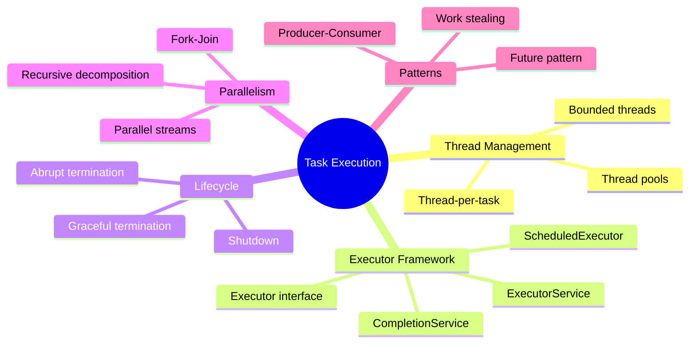
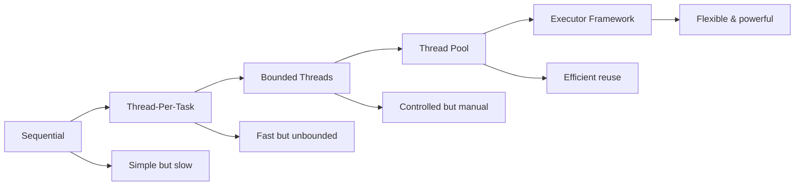
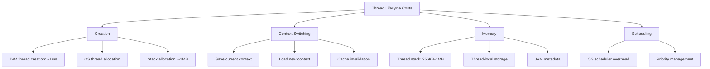
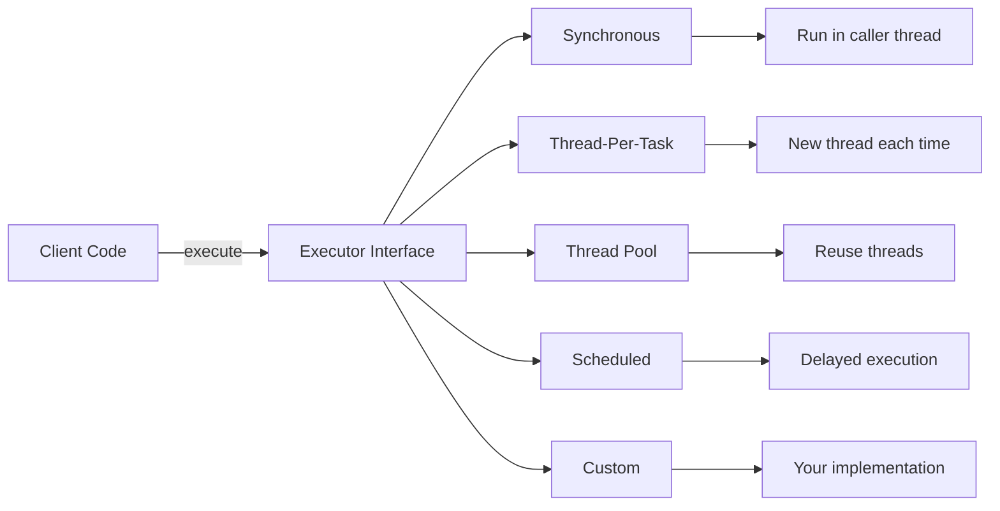
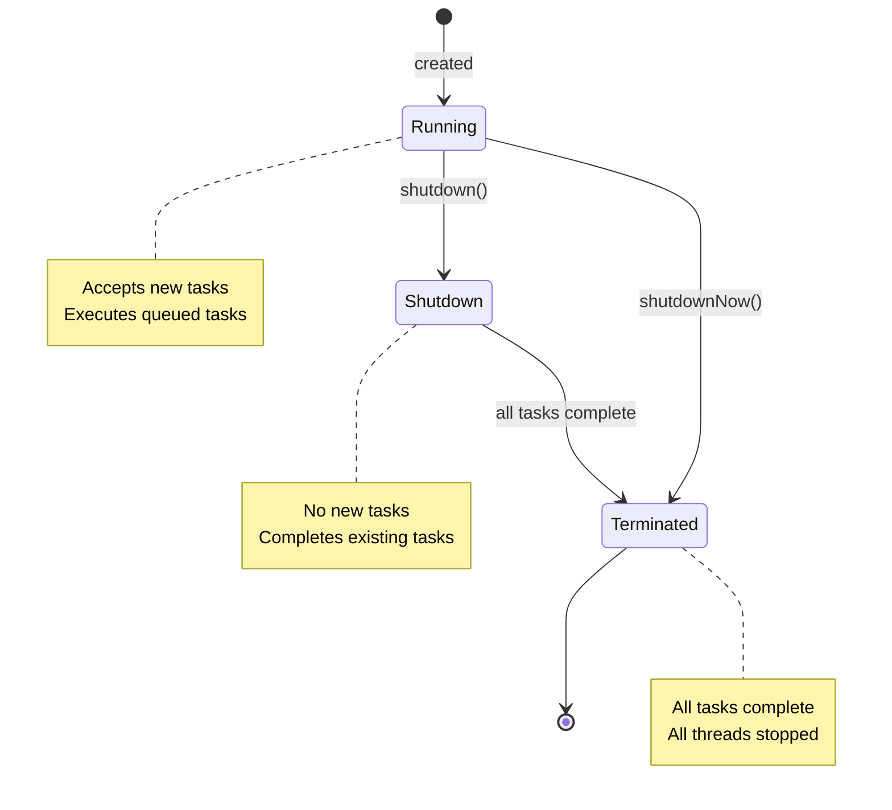
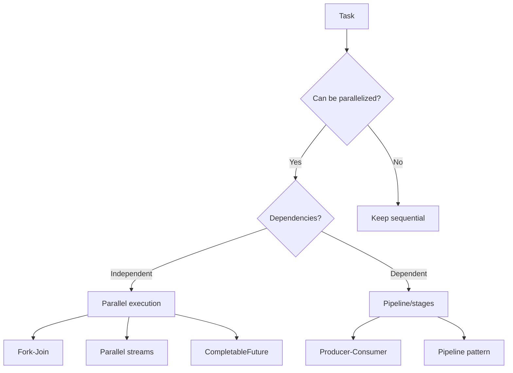

# 📚 Chapter 6: Task Execution

> **Master the art of structuring concurrent applications using the Executor framework - from simple thread-per-task to sophisticated thread pools**

---

## 📖 Table of Contents

1. [Overview](#-overview)
2. [Executing Tasks in Threads](#-61-executing-tasks-in-threads)
3. [The Executor Framework](#-62-the-executor-framework)
4. [Finding Exploitable Parallelism](#-63-finding-exploitable-parallelism)
5. [Advanced Executor Patterns](#-advanced-executor-patterns)
6. [Best Practices](#-best-practices)
7. [Practice Exercises](#-practice-exercises)

---

## 🎯 Overview

Most concurrent applications are organized around **task execution**. A task is an abstract unit of work that can be executed independently. This chapter explores how to structure applications around task execution using Java's powerful Executor framework.

### **Why This Chapter Matters:**
- 🏗️ **Structure**: Learn to organize concurrent applications effectively
- ⚡ **Performance**: Maximize throughput with proper thread management
- 🎯 **Scalability**: Build applications that scale with available resources
- 🔧 **Flexibility**: Decouple task submission from execution policy
- 🛡️ **Reliability**: Handle failures and manage resources gracefully

### **Key Learning Objectives:**



---

## 🧵 6.1 Executing Tasks in Threads

### **Evolution of Task Execution**



---

### **❌ Approach 1: Sequential Execution**

```java
/**
 * Sequential web server - handles one request at a time
 */
public class SingleThreadedWebServer {
    public static void main(String[] args) throws IOException {
        ServerSocket socket = new ServerSocket(80);
        
        while (true) {
            Socket connection = socket.accept();
            handleRequest(connection);  // ← Blocks until complete
        }
    }
    
    private static void handleRequest(Socket connection) {
        // Read request
        // Process request
        // Send response
        // May take several seconds!
    }
}
```

**Problems:**
```
Request 1: [████████████████████] 5 seconds
Request 2:                        [████████████████████] 5 seconds
Request 3:                                              [████████████████████]

Throughput: 0.2 requests/second (terrible!)
Latency: Queue time + processing time (high!)
Resource utilization: CPU mostly idle during I/O
```

---

### **⚠️ Approach 2: Thread-Per-Task**

```java
/**
 * Thread-per-task web server - creates a new thread for each request
 */
public class ThreadPerTaskWebServer {
    public static void main(String[] args) throws IOException {
        ServerSocket socket = new ServerSocket(80);
        
        while (true) {
            final Socket connection = socket.accept();
            
            // ⚠️ Create new thread for each request
            new Thread(new Runnable() {
                @Override
                public void run() {
                    handleRequest(connection);
                }
            }).start();
        }
    }
    
    private static void handleRequest(Socket connection) {
        // Process request in dedicated thread
    }
}
```

**Better, but...**

```
Request 1: [████████] Thread 1 (5 seconds)
Request 2: [████████] Thread 2 (5 seconds) ← Concurrent!
Request 3: [████████] Thread 3 (5 seconds) ← Concurrent!

Throughput: Much better!
BUT: What if we get 10,000 requests? → 10,000 threads! 💥
```

---

### **💣 The Problems with Unlimited Thread Creation**

```java
/**
 * Demonstrating thread creation overhead
 */
public class ThreadCreationOverhead {
    public static void main(String[] args) throws InterruptedException {
        // Test 1: Create 10,000 threads
        long start = System.currentTimeMillis();
        for (int i = 0; i < 10_000; i++) {
            new Thread(() -> {
                try {
                    Thread.sleep(1000);
                } catch (InterruptedException e) {
                    Thread.currentThread().interrupt();
                }
            }).start();
        }
        long time = System.currentTimeMillis() - start;
        System.out.println("Time to create 10,000 threads: " + time + "ms");
        
        Thread.sleep(2000);  // Let threads complete
        
        // Check memory usage
        Runtime runtime = Runtime.getRuntime();
        long usedMemory = (runtime.totalMemory() - runtime.freeMemory()) / (1024 * 1024);
        System.out.println("Memory used: " + usedMemory + "MB");
    }
}
```

**Typical Results:**

```
Time to create 10,000 threads: 2,347ms
Memory used: ~10,000MB (10GB!) 💥

Issues:
├─ Thread creation overhead: ~1ms per thread
├─ Memory overhead: ~1MB per thread stack
├─ Context switching: CPU thrashing with 10K threads
├─ GC pressure: Many short-lived objects
└─ Resource exhaustion: May crash JVM!
```

---

### **📊 Thread Lifecycle Costs**



---

### **✅ Approach 3: Bounded Thread Pool**

```java
/**
 * Web server with bounded thread pool
 */
public class ThreadPoolWebServer {
    private static final int NTHREADS = 100;
    private static final Executor exec = Executors.newFixedThreadPool(NTHREADS);
    
    public static void main(String[] args) throws IOException {
        ServerSocket socket = new ServerSocket(80);
        
        while (true) {
            final Socket connection = socket.accept();
            
            // ✅ Submit task to thread pool
            exec.execute(new Runnable() {
                @Override
                public void run() {
                    handleRequest(connection);
                }
            });
        }
    }
    
    private static void handleRequest(Socket connection) {
        // Process request
    }
}
```

**Benefits:**

```
Thread Pool (100 threads):
┌─────────────────────────────────────┐
│ [T1][T2][T3]...[T99][T100]         │
│  ↑   ↑   ↑         ↑    ↑          │
│  │   │   │         │    │          │
│ [────── Task Queue ──────]         │
│  R1  R2  R3 ... R1000              │
└─────────────────────────────────────┘

✅ Bounded resource usage
✅ Thread reuse (no creation overhead)
✅ Better throughput under load
✅ Predictable performance
```

---

## 🚀 6.2 The Executor Framework

### **The Executor Interface**

```java
/**
 * The simplest executor interface
 */
public interface Executor {
    void execute(Runnable command);
}
```

**Power of Abstraction:**



---

### **🎯 Executor Implementations**

```java
/**
 * Different executor implementations
 */
public class ExecutorExamples {
    
    // 1. Synchronous executor (for testing)
    static class DirectExecutor implements Executor {
        @Override
        public void execute(Runnable r) {
            r.run();  // ← Runs in caller's thread
        }
    }
    
    // 2. Thread-per-task executor
    static class ThreadPerTaskExecutor implements Executor {
        @Override
        public void execute(Runnable r) {
            new Thread(r).start();  // ← New thread each time
        }
    }
    
    // 3. Using standard executors
    public static void demo() {
        // Fixed thread pool
        ExecutorService fixedPool = Executors.newFixedThreadPool(10);
        
        // Cached thread pool (unbounded, creates as needed)
        ExecutorService cachedPool = Executors.newCachedThreadPool();
        
        // Single thread executor (serializes tasks)
        ExecutorService singleThread = Executors.newSingleThreadExecutor();
        
        // Scheduled executor (for delayed/periodic tasks)
        ScheduledExecutorService scheduled = 
            Executors.newScheduledThreadPool(5);
        
        // Work-stealing pool (Java 8+)
        ExecutorService workStealing = 
            Executors.newWorkStealingPool();
    }
}
```

---

### **📊 Executor Types Comparison**

| Type | Thread Count | Queue | Use Case | Pros | Cons |
|------|-------------|-------|----------|------|------|
| **newFixedThreadPool(n)** | Fixed (n) | Unbounded | Known workload | Predictable resources | Queue can grow unbounded |
| **newCachedThreadPool()** | 0 to ∞ | SynchronousQueue | Many short tasks | Scales automatically | Can create too many threads |
| **newSingleThreadExecutor()** | 1 | Unbounded | Sequential tasks | Ordering guaranteed | No parallelism |
| **newScheduledThreadPool(n)** | Fixed (n) | DelayQueue | Scheduled tasks | Flexible scheduling | More overhead |
| **newWorkStealingPool()** | CPU count | Per-thread queues | CPU-bound tasks | Load balancing | More complex |

---

### **🔧 ExecutorService**

```java
/**
 * ExecutorService extends Executor with lifecycle management
 */
public interface ExecutorService extends Executor {
    // Lifecycle management
    void shutdown();                    // Graceful shutdown
    List<Runnable> shutdownNow();      // Forceful shutdown
    boolean isShutdown();
    boolean isTerminated();
    boolean awaitTermination(long timeout, TimeUnit unit) 
        throws InterruptedException;
    
    // Task submission with Future
    <T> Future<T> submit(Callable<T> task);
    <T> Future<T> submit(Runnable task, T result);
    Future<?> submit(Runnable task);
    
    // Bulk operations
    <T> List<Future<T>> invokeAll(Collection<? extends Callable<T>> tasks)
        throws InterruptedException;
    <T> T invokeAny(Collection<? extends Callable<T>> tasks)
        throws InterruptedException, ExecutionException;
}
```

---

### **🔄 Executor Lifecycle**



---

### **💡 Shutdown Example**

```java
/**
 * Proper executor shutdown
 */
public class ExecutorShutdownExample {
    private final ExecutorService executor = Executors.newFixedThreadPool(10);
    
    public void processRequests(List<Request> requests) {
        // Submit all tasks
        for (Request request : requests) {
            executor.submit(() -> process(request));
        }
        
        // Initiate shutdown
        executor.shutdown();
        
        try {
            // Wait for tasks to complete
            if (!executor.awaitTermination(60, TimeUnit.SECONDS)) {
                // Forceful shutdown if timeout
                executor.shutdownNow();
                
                // Wait again for tasks to respond to interruption
                if (!executor.awaitTermination(60, TimeUnit.SECONDS)) {
                    System.err.println("Executor did not terminate");
                }
            }
        } catch (InterruptedException e) {
            // Re-interrupt if interrupted while waiting
            executor.shutdownNow();
            Thread.currentThread().interrupt();
        }
    }
    
    private void process(Request request) {
        // Process request
    }
    
    static class Request {}
}
```

---

### **🎯 Callable and Future**

```java
/**
 * Callable: Task that returns a result
 */
public interface Callable<V> {
    V call() throws Exception;
}

/**
 * Future: Represents result of asynchronous computation
 */
public interface Future<V> {
    boolean cancel(boolean mayInterruptIfRunning);
    boolean isCancelled();
    boolean isDone();
    V get() throws InterruptedException, ExecutionException;
    V get(long timeout, TimeUnit unit) 
        throws InterruptedException, ExecutionException, TimeoutException;
}
```

---

### **📝 Using Callable and Future**

```java
/**
 * Complete example of Callable and Future
 */
public class CallableFutureExample {
    private final ExecutorService executor = Executors.newFixedThreadPool(10);
    
    public void demonstrateFuture() throws Exception {
        // Submit task that returns result
        Future<Integer> future = executor.submit(new Callable<Integer>() {
            @Override
            public Integer call() throws Exception {
                Thread.sleep(1000);  // Simulate work
                return 42;
            }
        });
        
        // Do other work while task executes
        System.out.println("Task submitted, doing other work...");
        doOtherWork();
        
        // Get result (blocks if not ready)
        Integer result = future.get();
        System.out.println("Result: " + result);
        
        executor.shutdown();
    }
    
    /**
     * Example with timeout
     */
    public Integer computeWithTimeout(Callable<Integer> task) 
            throws Exception {
        Future<Integer> future = executor.submit(task);
        
        try {
            // Wait maximum 5 seconds for result
            return future.get(5, TimeUnit.SECONDS);
        } catch (TimeoutException e) {
            // Cancel task if it takes too long
            future.cancel(true);
            throw new TimeoutException("Task timed out");
        }
    }
    
    /**
     * Example: Multiple tasks with futures
     */
    public List<Integer> processParallel(List<DataItem> items) 
            throws InterruptedException, ExecutionException {
        List<Future<Integer>> futures = new ArrayList<>();
        
        // Submit all tasks
        for (DataItem item : items) {
            Future<Integer> future = executor.submit(() -> processItem(item));
            futures.add(future);
        }
        
        // Collect all results
        List<Integer> results = new ArrayList<>();
        for (Future<Integer> future : futures) {
            results.add(future.get());  // Blocks until result available
        }
        
        return results;
    }
    
    private Integer processItem(DataItem item) {
        // Process item
        return 0;
    }
    
    private void doOtherWork() {
        // Do something useful
    }
    
    static class DataItem {}
}
```

---

### **⏰ ScheduledExecutorService**

```java
/**
 * Scheduled task execution
 */
public class ScheduledExecutorExample {
    private final ScheduledExecutorService scheduler = 
        Executors.newScheduledThreadPool(5);
    
    public void demonstrateScheduling() {
        // 1. Execute after delay
        scheduler.schedule(
            () -> System.out.println("Executed after 5 seconds"),
            5,
            TimeUnit.SECONDS
        );
        
        // 2. Execute periodically with fixed delay
        scheduler.scheduleWithFixedDelay(
            () -> System.out.println("Periodic task"),
            0,              // Initial delay
            5,              // Period
            TimeUnit.SECONDS
        );
        
        // 3. Execute periodically at fixed rate
        scheduler.scheduleAtFixedRate(
            () -> System.out.println("Fixed rate task"),
            0,              // Initial delay
            5,              // Period
            TimeUnit.SECONDS
        );
        
        // Shutdown after 30 seconds
        scheduler.schedule(
            () -> scheduler.shutdown(),
            30,
            TimeUnit.SECONDS
        );
    }
    
    /**
     * Real-world example: Periodic cache cleanup
     */
    public class CacheWithCleanup<K, V> {
        private final Map<K, V> cache = new ConcurrentHashMap<>();
        private final ScheduledExecutorService cleaner = 
            Executors.newScheduledThreadPool(1);
        
        public CacheWithCleanup() {
            // Schedule cleanup every 10 minutes
            cleaner.scheduleAtFixedRate(
                this::cleanup,
                10,
                10,
                TimeUnit.MINUTES
            );
        }
        
        private void cleanup() {
            // Remove expired entries
            cache.entrySet().removeIf(entry -> isExpired(entry));
        }
        
        private boolean isExpired(Map.Entry<K, V> entry) {
            // Check if entry is expired
            return false;
        }
        
        public void shutdown() {
            cleaner.shutdown();
        }
    }
}
```

**Fixed Delay vs Fixed Rate:**

```
scheduleWithFixedDelay (5 second delay):
Task 1: [███] 2s
        └─ 5s delay ─┐
                     ↓
Task 2:              [███] 2s
                     └─ 5s delay ─┐
                                  ↓
Task 3:                            [███]

Total time between starts: 7s (2s execution + 5s delay)

scheduleAtFixedRate (5 second rate):
Task 1: [███] 2s
        └─ 5s period ─┐
Task 2:              [███] 2s
                     └─ 5s period ─┐
Task 3:                            [███]

Total time between starts: 5s (fixed rate)
```

---

### **🎭 CompletionService**

```java
/**
 * CompletionService: Process results as they complete
 */
public class CompletionServiceExample {
    private final ExecutorService executor = Executors.newFixedThreadPool(10);
    private final CompletionService<Result> completionService = 
        new ExecutorCompletionService<>(executor);
    
    /**
     * Render page elements as they become available
     */
    public void renderPage(List<ImageInfo> images) throws Exception {
        // Submit all image download tasks
        for (ImageInfo image : images) {
            completionService.submit(() -> downloadImage(image));
        }
        
        // Process results as they complete
        for (int i = 0; i < images.size(); i++) {
            Future<Result> future = completionService.take();  // ← Blocks until one completes
            Result result = future.get();
            renderImage(result);
        }
    }
    
    /**
     * Fetch ad with time budget
     */
    public Ad fetchAd(long budget, TimeUnit unit) throws Exception {
        List<AdProvider> providers = getAdProviders();
        
        // Submit tasks to all providers
        for (AdProvider provider : providers) {
            completionService.submit(() -> provider.getAd());
        }
        
        long deadline = System.nanoTime() + unit.toNanos(budget);
        
        // Take first successful result
        for (int i = 0; i < providers.size(); i++) {
            long remaining = deadline - System.nanoTime();
            if (remaining <= 0) {
                break;
            }
            
            Future<Ad> future = completionService.poll(remaining, TimeUnit.NANOSECONDS);
            if (future != null) {
                try {
                    return future.get();  // First success wins!
                } catch (ExecutionException e) {
                    // Try next provider
                }
            }
        }
        
        throw new TimeoutException("No ad available within budget");
    }
    
    private Result downloadImage(ImageInfo image) {
        // Download image
        return new Result();
    }
    
    private void renderImage(Result result) {
        // Render image on page
    }
    
    private List<AdProvider> getAdProviders() {
        return new ArrayList<>();
    }
    
    static class ImageInfo {}
    static class Result {}
    static class Ad {}
    static interface AdProvider {
        Ad getAd();
    }
}
```

---

## 🔍 6.3 Finding Exploitable Parallelism

### **Identifying Parallel Opportunities**



---

### **🎯 Example: Page Rendering**

#### **Sequential Rendering**

```java
/**
 * Sequential page rendering - slow!
 */
public class SequentialRenderer {
    public void renderPage(CharSequence source) {
        renderText(source);
        
        List<ImageData> imageData = new ArrayList<>();
        for (ImageInfo imageInfo : scanForImageInfo(source)) {
            imageData.add(imageInfo.downloadImage());  // ← Blocks!
        }
        
        for (ImageData data : imageData) {
            renderImage(data);
        }
    }
    
    private void renderText(CharSequence source) {
        // Render text
    }
    
    private List<ImageInfo> scanForImageInfo(CharSequence source) {
        return new ArrayList<>();
    }
    
    private void renderImage(ImageData data) {
        // Render image
    }
    
    static class ImageInfo {
        ImageData downloadImage() {
            return new ImageData();
        }
    }
    static class ImageData {}
}
```

**Timeline:**

```
Sequential:
Render text: [█████] 100ms
Download 1:          [████████] 200ms
Download 2:                    [████████] 200ms
Download 3:                              [████████] 200ms
Render images:                                     [███] 50ms

Total: 750ms
```

---

#### **Parallel Rendering with Future**

```java
/**
 * Parallel image download with Future
 */
public class FutureRenderer {
    private final ExecutorService executor = Executors.newCachedThreadPool();
    
    public void renderPage(CharSequence source) {
        List<ImageInfo> imageInfos = scanForImageInfo(source);
        
        // Submit download tasks immediately
        Callable<List<ImageData>> task = new Callable<List<ImageData>>() {
            @Override
            public List<ImageData> call() {
                List<ImageData> result = new ArrayList<>();
                for (ImageInfo imageInfo : imageInfos) {
                    result.add(imageInfo.downloadImage());
                }
                return result;
            }
        };
        Future<List<ImageData>> future = executor.submit(task);
        
        // Render text while images download
        renderText(source);
        
        try {
            // Wait for downloads to complete
            List<ImageData> imageData = future.get();
            for (ImageData data : imageData) {
                renderImage(data);
            }
        } catch (InterruptedException e) {
            Thread.currentThread().interrupt();
            future.cancel(true);
        } catch (ExecutionException e) {
            throw new RuntimeException(e.getCause());
        }
    }
    
    private void renderText(CharSequence source) {}
    private List<ImageInfo> scanForImageInfo(CharSequence source) { 
        return new ArrayList<>();
    }
    private void renderImage(ImageData data) {}
    
    static class ImageInfo {
        ImageData downloadImage() {
            return new ImageData();
        }
    }
    static class ImageData {}
}
```

**Timeline:**

```
Parallel:
Render text:  [█████] 100ms
Download 1:   [████████] 200ms
Download 2:   [████████] 200ms    ← Concurrent
Download 3:   [████████] 200ms    ← Concurrent
Render images:        [███] 50ms

Total: 250ms (3x faster!)
```

---

#### **Maximum Parallelism with CompletionService**

```java
/**
 * Render each image as it becomes available
 */
public class CompletionServiceRenderer {
    private final ExecutorService executor;
    
    public CompletionServiceRenderer(ExecutorService executor) {
        this.executor = executor;
    }
    
    public void renderPage(CharSequence source) {
        List<ImageInfo> info = scanForImageInfo(source);
        CompletionService<ImageData> completionService = 
            new ExecutorCompletionService<>(executor);
        
        // Submit all download tasks
        for (final ImageInfo imageInfo : info) {
            completionService.submit(new Callable<ImageData>() {
                @Override
                public ImageData call() {
                    return imageInfo.downloadImage();
                }
            });
        }
        
        // Render text
        renderText(source);
        
        // Render images as they complete
        try {
            for (int t = 0, n = info.size(); t < n; t++) {
                Future<ImageData> f = completionService.take();
                ImageData imageData = f.get();
                renderImage(imageData);  // ← Render immediately when ready
            }
        } catch (InterruptedException e) {
            Thread.currentThread().interrupt();
        } catch (ExecutionException e) {
            throw new RuntimeException(e.getCause());
        }
    }
    
    private void renderText(CharSequence source) {}
    private List<ImageInfo> scanForImageInfo(CharSequence source) {
        return new ArrayList<>();
    }
    private void renderImage(ImageData data) {}
    
    static class ImageInfo {
        ImageData downloadImage() {
            return new ImageData();
        }
    }
    static class ImageData {}
}
```

**Timeline:**

```
Maximum Parallelism:
Render text:     [█████] 100ms
Download/Render 1: [████████][█] 200ms + 10ms
Download/Render 2: [████████][█] 200ms + 10ms  ← Start rendering as soon as downloaded
Download/Render 3: [████████][█] 200ms + 10ms  ← Start rendering as soon as downloaded

Total: 210ms (3.5x faster than parallel, 7x faster than sequential!)
User sees content progressively!
```

---

### **🎲 Parallelizing Heterogeneous Tasks**

```java
/**
 * Example: Travel quote aggregator
 */
public class QuoteAggregator {
    private final ExecutorService executor = Executors.newCachedThreadPool();
    
    public List<TravelQuote> getRankedTravelQuotes(
            TravelInfo travelInfo,
            Set<TravelCompany> companies,
            Comparator<TravelQuote> ranking,
            long time,
            TimeUnit unit) throws InterruptedException {
        
        List<QuoteTask> tasks = new ArrayList<>();
        for (TravelCompany company : companies) {
            tasks.add(new QuoteTask(company, travelInfo));
        }
        
        // Execute all tasks with timeout
        List<Future<TravelQuote>> futures = 
            executor.invokeAll(tasks, time, unit);
        
        // Collect successful results
        List<TravelQuote> quotes = new ArrayList<>();
        for (Future<TravelQuote> f : futures) {
            try {
                if (!f.isCancelled()) {
                    quotes.add(f.get());
                }
            } catch (ExecutionException e) {
                // Log and continue with other quotes
                System.err.println("Quote failed: " + e.getCause());
            }
        }
        
        // Sort by ranking
        quotes.sort(ranking);
        return quotes;
    }
    
    class QuoteTask implements Callable<TravelQuote> {
        private final TravelCompany company;
        private final TravelInfo travelInfo;
        
        QuoteTask(TravelCompany company, TravelInfo travelInfo) {
            this.company = company;
            this.travelInfo = travelInfo;
        }
        
        @Override
        public TravelQuote call() throws Exception {
            return company.solicitQuote(travelInfo);
        }
    }
    
    interface TravelCompany {
        TravelQuote solicitQuote(TravelInfo info) throws Exception;
    }
    
    static class TravelInfo {}
    static class TravelQuote {}
}
```

---

### **🌳 Recursive Decomposition**

java
/**
 * Puzzle solver using recursive decomposition
 */
public class ConcurrentPuzzleSolver<P, M> {
    private final Puzzle<P, M> puzzle;
    private final ExecutorService exec;
    private final ConcurrentMap<P, Boolean> seen;
    protected final ValueLatch<PuzzleNode<P, M>> solution = 
        new ValueLatch<>();
    
    public ConcurrentPuzzleSolver(Puzzle<P, M> puzzle) {
        this.puzzle = puzzle;
        this.exec = initThreadPool();
        this.seen = new ConcurrentHashMap<>();
        if (exec instanceof ThreadPoolExecutor) {
            ThreadPoolExecutor tpe = (ThreadPoolExecutor) exec;
            tpe.setRejectedExecutionHandler(
                new ThreadPoolExecutor.DiscardPolicy());
        }
    }
    
    private ExecutorService initThreadPool() {
        return Executors.newCachedThreadPool();
    }
    
    public List<M> solve() throws InterruptedException {
        try {
            P p = puzzle.initialPosition();
            exec.execute(newTask(p, null, null));
            
            // Wait for solution
            PuzzleNode<P, M> solnNode = solution.getValue();
            return (solnNode == null) ? null : solnNode.asMoveList();
        } finally {
            exec.shutdown();
        }
    }
    
    protected Runnable newTask(P p, M m, PuzzleNode<P, M> n) {
        return new SolverTask(p, m, n);
    }
    
    protected class SolverTask extends PuzzleNode<P, M> implements Runnable {
        SolverTask(P pos, M move, PuzzleNode<P, M> prev) {
            super(pos, move, prev);
        }
        
        @Override
        public void run() {
            if (solution.isSet() || seen.putIfAbsent(pos, true) != null) {
                return;  // Already solved or seen
            }
            
            if (puzzle.isGoal(pos)) {
                solution.setValue(this);
            } else {
                for (M m : puzzle.legalMoves(pos)) {
                    exec.execute(newTask(puzzle.move(pos, m), m, this));
                }
            }
        }
    }
    
    static class ValueLatch<T> {
        @GuardedBy("this")
        private T value = null;
        private final CountDownLatch done = new CountDownLatch(1);
        
        public boolean isSet() {
            return (done.getCount() == 0);
        }
        
        public synchronized void setValue(T newValue) {
            if (!isSet()) {
                value = newValue;
                done.countDown();
            }
        }
        
        public T getValue() throws InterruptedException {
            done.await();
            synchronized (this) {
                return value;
            }
        }
    }
    
    interface Puzzle<P, M> {
        P initialPosition();
        boolean isGoal(P position);
        Set<M> legalMoves(P position);
        P move(P position, M move);
    }
    
    static class PuzzleNode<P, M> {
        final P pos;
        final M move;
        final PuzzleNode<P, M> prev;
        
        PuzzleNode(P pos, M move, PuzzleNode<P, M> prev) {
            this.pos = pos;
            this.move = move;
            this.prev = prev;
        }
        
        List<M> asMoveList() {
            List<M> solution = new LinkedList<>();
            for (PuzzleNode<P, M> n = this; n.move != null; n = n.prev) {
                solution.add(0, n.move);
            }
            return solution;
        }
    }
}
```

---

## 🎨 Advanced Executor Patterns

### **1️⃣ Custom ThreadFactory**

```java
/**
 * Custom thread factory for better control
 */
public class CustomThreadFactory implements ThreadFactory {
    private final String namePrefix;
    private final AtomicInteger threadNumber = new AtomicInteger(1);
    private final Thread.UncaughtExceptionHandler handler;
    
    public CustomThreadFactory(String namePrefix, 
                              Thread.UncaughtExceptionHandler handler) {
        this.namePrefix = namePrefix;
        this.handler = handler;
    }
    
    @Override
    public Thread newThread(Runnable r) {
        Thread t = new Thread(r);
        t.setName(namePrefix + "-" + threadNumber.getAndIncrement());
        t.setDaemon(false);
        t.setPriority(Thread.NORM_PRIORITY);
        if (handler != null) {
            t.setUncaughtExceptionHandler(handler);
        }
        return t;
    }
}

/**
 * Usage example
 */
public class ThreadFactoryExample {
    public static void main(String[] args) {
        ThreadFactory factory = new CustomThreadFactory(
            "MyWorker",
            (t, e) -> System.err.println("Thread " + t.getName() + 
                                       " threw exception: " + e)
        );
        
        ExecutorService executor = Executors.newFixedThreadPool(10, factory);
        
        // All threads will have meaningful names and exception handling
        for (int i = 0; i < 100; i++) {
            executor.submit(() -> {
                System.out.println(Thread.currentThread().getName() + " executing");
            });
        }
        
        executor.shutdown();
    }
}
```

---

### **2️⃣ Monitoring Thread Pool**

```java
/**
 * Extended thread pool with monitoring
 */
public class MonitoredThreadPoolExecutor extends ThreadPoolExecutor {
    private final ThreadLocal<Long> startTime = new ThreadLocal<>();
    private final AtomicLong numTasks = new AtomicLong();
    private final AtomicLong totalTime = new AtomicLong();
    
    public MonitoredThreadPoolExecutor(int corePoolSize, 
                                       int maximumPoolSize,
                                       long keepAliveTime,
                                       TimeUnit unit,
                                       BlockingQueue<Runnable> workQueue) {
        super(corePoolSize, maximumPoolSize, keepAliveTime, unit, workQueue);
    }
    
    @Override
    protected void beforeExecute(Thread t, Runnable r) {
        super.beforeExecute(t, r);
        startTime.set(System.nanoTime());
        System.out.println(Thread.currentThread().getName() + 
                          " starting " + r);
    }
    
    @Override
    protected void afterExecute(Runnable r, Throwable t) {
        try {
            long endTime = System.nanoTime();
            long taskTime = endTime - startTime.get();
            numTasks.incrementAndGet();
            totalTime.addAndGet(taskTime);
            System.out.println(Thread.currentThread().getName() + 
                              " completed " + r + " in " + 
                              taskTime / 1_000_000 + "ms");
        } finally {
            super.afterExecute(r, t);
        }
    }
    
    @Override
    protected void terminated() {
        try {
            System.out.println("Terminated: avg time = " + 
                             totalTime.get() / numTasks.get() / 1_000_000 + "ms");
        } finally {
            super.terminated();
        }
    }
}
```

---

### **3️⃣ Result Cache with Executor**

```java
/**
 * Efficient result cache using executor
 */
public class Memoizer<A, V> implements Computable<A, V> {
    private final ConcurrentMap<A, Future<V>> cache = new ConcurrentHashMap<>();
    private final Computable<A, V> c;
    private final ExecutorService executor;
    
    public Memoizer(Computable<A, V> c, ExecutorService executor) {
        this.c = c;
        this.executor = executor;
    }
    
    @Override
    public V compute(final A arg) throws InterruptedException, ExecutionException {
        while (true) {
            Future<V> f = cache.get(arg);
            if (f == null) {
                Callable<V> eval = () -> c.compute(arg);
                FutureTask<V> ft = new FutureTask<>(eval);
                f = cache.putIfAbsent(arg, ft);
                if (f == null) {
                    f = ft;
                    executor.execute(ft);  // ← Execute in thread pool
                }
            }
            try {
                return f.get();
            } catch (CancellationException e) {
                cache.remove(arg, f);
            }
        }
    }
}

interface Computable<A, V> {
    V compute(A arg) throws InterruptedException;
}
```

---

## ✅ Best Practices

### **🎯 Executor Best Practices**

```mermaid
graph TD
    A[Executor Best Practices] --> B[1. Choose Right Type]
    A --> C[2. Configure Properly]
    A --> D[3. Handle Lifecycle]
    A --> E[4. Monitor Performance]
    A --> F[5. Handle Errors]
    
    B --> B1[Fixed for known workload]
    B --> B2[Cached for many short tasks]
    B --> B3[Single for ordering]
    
    C --> C1[Right pool size]
    C --> C2[Appropriate queue]
    C --> C3[Custom ThreadFactory]
    
    D --> D1[Always shutdown]
    D --> D2[Graceful termination]
    D --> D3[Handle interrupts]
    
    E --> E1[Track metrics]
    E --> E2[Detect bottlenecks]
    E --> E3[Adjust sizing]
    
    F --> F1[UncaughtExceptionHandler]
    F --> F2[Try-catch in tasks]
    F --> F3[Future.get() handling]
```

---

### **1️⃣ Always Shutdown Executors**

```java
// ❌ BAD: Executor never shutdown
public class BadExecutorUsage {
    private final ExecutorService executor = Executors.newFixedThreadPool(10);
    
    public void process() {
        executor.submit(() -> doWork());
        // Executor keeps running! Prevents JVM from exiting
    }
}

// ✅ GOOD: Proper shutdown
public class GoodExecutorUsage {
    private final ExecutorService executor = Executors.newFixedThreadPool(10);
    
    public void process() {
        try {
            executor.submit(() -> doWork());
        } finally {
            shutdownAndAwait();
        }
    }
    
    private void shutdownAndAwait() {
        executor.shutdown();
        try {
            if (!executor.awaitTermination(60, TimeUnit.SECONDS)) {
                executor.shutdownNow();
                if (!executor.awaitTermination(60, TimeUnit.SECONDS)) {
                    System.err.println("Pool did not terminate");
                }
            }
        } catch (InterruptedException ie) {
            executor.shutdownNow();
            Thread.currentThread().interrupt();
        }
    }
}
```

---

### **2️⃣ Handle Exceptions in Tasks**

```java
// ❌ BAD: Exception silently swallowed
executor.submit(() -> {
    int result = 1 / 0;  // ArithmeticException thrown but swallowed!
});

// ✅ GOOD: Handle exceptions explicitly
executor.submit(() -> {
    try {
        int result = 1 / 0;
    } catch (Exception e) {
        System.err.println("Task failed: " + e);
        // Handle or rethrow
    }
});

// ✅ BETTER: Check Future for exceptions
Future<?> future = executor.submit(() -> {
    int result = 1 / 0;
});

try {
    future.get();  // Will throw ExecutionException wrapping the cause
} catch (ExecutionException e) {
    System.err.println("Task failed: " + e.getCause());
}
```

---

### **3️⃣ Choose Appropriate Queue**

```java
/**
 * Different queue types for different scenarios
 */
public class QueueChoices {
    
    // Unbounded queue - never rejects tasks
    ExecutorService unbounded = new ThreadPoolExecutor(
        10, 10,
        0L, TimeUnit.MILLISECONDS,
        new LinkedBlockingQueue<>()  // ← Can grow without bound!
    );
    
    // Bounded queue - rejects when full
    ExecutorService bounded = new ThreadPoolExecutor(
        10, 10,
        0L, TimeUnit.MILLISECONDS,
        new ArrayBlockingQueue<>(100),  // ← Max 100 queued tasks
        new ThreadPoolExecutor.CallerRunsPolicy()  // Run in caller if full
    );
    
    // Synchronous handoff - no queueing
    ExecutorService handoff = new ThreadPoolExecutor(
        0, Integer.MAX_VALUE,
        60L, TimeUnit.SECONDS,
        new SynchronousQueue<>()  // ← Direct handoff, no queue
    );
}
```

---

### **4️⃣ Size Thread Pools Appropriately**

```java
/**
 * Thread pool sizing guidelines
 */
public class ThreadPoolSizing {
    
    /**
     * For CPU-bound tasks: N_threads = N_cpu + 1
     */
    public static ExecutorService cpuBoundPool() {
        int cpus = Runtime.getRuntime().availableProcessors();
        return Executors.newFixedThreadPool(cpus + 1);
    }
    
    /**
     * For I/O-bound tasks: N_threads = N_cpu * U_cpu * (1 + W/C)
     * where:
     * - N_cpu = number of CPUs
     * - U_cpu = target CPU utilization (0-1)
     * - W/C = ratio of wait time to compute time
     */
    public static ExecutorService ioBoundPool(double targetUtilization, 
                                              double waitComputeRatio) {
        int cpus = Runtime.getRuntime().availableProcessors();
        int poolSize = (int) (cpus * targetUtilization * 
                             (1 + waitComputeRatio));
        return Executors.newFixedThreadPool(poolSize);
    }
    
    /**
     * Example: Database operations (mostly waiting)
     * W/C = 50 (50ms wait, 1ms compute)
     * U_cpu = 0.9 (90% utilization)
     * N_cpu = 8
     * N_threads = 8 * 0.9 * (1 + 50) = 367
     */
    public static ExecutorService databasePool() {
        return ioBoundPool(0.9, 50);
    }
}
```

---

## 🎓 Practice Exercises

### **Exercise 1: Parallel File Processor**

**Task:** Create a parallel file processor that:
- Scans a directory recursively
- Processes each file in parallel
- Collects results
- Handles errors gracefully

<details>
<summary>💡 Solution</summary>

```java
import java.io.*;
import java.nio.file.*;
import java.util.*;
import java.util.concurrent.*;

public class ParallelFileProcessor {
    private final ExecutorService executor;
    private final int maxThreads;
    
    public ParallelFileProcessor(int maxThreads) {
        this.maxThreads = maxThreads;
        this.executor = Executors.newFixedThreadPool(maxThreads);
    }
    
    public Map<Path, ProcessResult> processDirectory(Path directory) 
            throws InterruptedException, ExecutionException {
        // Collect all files
        List<Path> files = new ArrayList<>();
        try {
            Files.walk(directory)
                .filter(Files::isRegularFile)
                .forEach(files::add);
        } catch (IOException e) {
            throw new RuntimeException("Failed to scan directory", e);
        }
        
        // Submit processing tasks
        Map<Path, Future<ProcessResult>> futures = new HashMap<>();
        for (Path file : files) {
            Future<ProcessResult> future = executor.submit(() -> processFile(file));
            futures.put(file, future);
        }
        
        // Collect results
        Map<Path, ProcessResult> results = new HashMap<>();
        for (Map.Entry<Path, Future<ProcessResult>> entry : futures.entrySet()) {
            try {
                results.put(entry.getKey(), entry.getValue().get());
            } catch (ExecutionException e) {
                System.err.println("Failed to process " + entry.getKey() + 
                                 ": " + e.getCause());
                results.put(entry.getKey(), 
                           ProcessResult.failure(e.getCause().getMessage()));
            }
        }
        
        return results;
    }
    
    private ProcessResult processFile(Path file) throws IOException {
        // Process file (example: count lines)
        long lines = Files.lines(file).count();
        return ProcessResult.success(lines);
    }
    
    public void shutdown() {
        executor.shutdown();
        try {
            if (!executor.awaitTermination(60, TimeUnit.SECONDS)) {
                executor.shutdownNow();
            }
        } catch (InterruptedException e) {
            executor.shutdownNow();
            Thread.currentThread().interrupt();
        }
    }
    
    static class ProcessResult {
        final boolean success;
        final long value;
        final String error;
        
        private ProcessResult(boolean success, long value, String error) {
            this.success = success;
            this.value = value;
            this.error = error;
        }
        
        static ProcessResult success(long value) {
            return new ProcessResult(true, value, null);
        }
        
        static ProcessResult failure(String error) {
            return new ProcessResult(false, 0, error);
        }
    }
    
    public static void main(String[] args) throws Exception {
        ParallelFileProcessor processor = new ParallelFileProcessor(10);
        
        Path directory = Paths.get(".");
        Map<Path, ProcessResult> results = processor.processDirectory(directory);
        
        System.out.println("Processed " + results.size() + " files");
        long totalLines = results.values().stream()
            .filter(r -> r.success)
            .mapToLong(r -> r.value)
            .sum();
        System.out.println("Total lines: " + totalLines);
        
        processor.shutdown();
    }
}
```
</details>

---

## 📚 Summary

### **🎯 Key Takeaways**

| Topic | Key Points |
|-------|-----------|
| **Task vs Thread** | Decouple task submission from execution policy |
| **Executor Framework** | Flexible, powerful abstraction for task execution |
| **Thread Pools** | Reuse threads for better performance and resource management |
| **Future** | Represents asynchronous computation result |
| **Lifecycle** | Always shutdown executors gracefully |

---

## 🔗 What's Next?

### **Chapter 7: Cancellation and Shutdown**
Learn to gracefully stop tasks and services:
- Task cancellation mechanisms
- Stopping thread-based services
- Handling abnormal termination
- JVM shutdown hooks

---

**[← Previous: Chapter 5 - Building Blocks](./05-building-blocks.md)** | **[Back to README](./README.md)** | **[Next: Chapter 7 - Cancellation and Shutdown →](./07-cancellation-shutdown.md)**

---

*Chapter 6 completed! You now understand how to structure concurrent applications using the Executor framework.*
