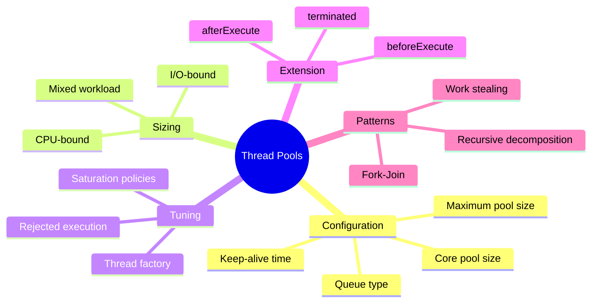
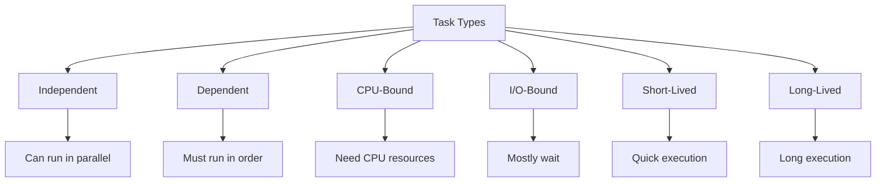
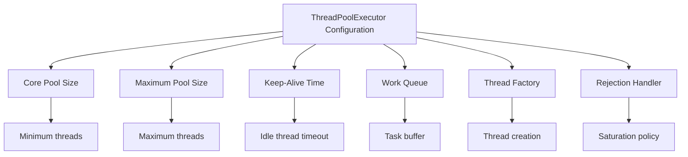

# 📚 Chapter 8: Applying Thread Pools

> **Master the art of configuring, tuning, and optimizing thread pools for maximum performance and reliability**

---

## 📖 Table of Contents

1. [Overview](#-overview)
2. [Thread Pool Configuration](#-81-implicit-couplings-between-tasks-and-execution-policies)
3. [Sizing Thread Pools](#-82-sizing-thread-pools)
4. [Configuring ThreadPoolExecutor](#-83-configuring-threadpoolexecutor)
5. [Extending ThreadPoolExecutor](#-84-extending-threadpoolexecutor)
6. [Parallelizing Recursive Algorithms](#-85-parallelizing-recursive-algorithms)
7. [Best Practices](#-best-practices)
8. [Practice Exercises](#-practice-exercises)

---

## 🎯 Overview

Thread pools are powerful but require careful configuration. This chapter explores how to configure and tune thread pools for optimal performance, and covers advanced patterns for parallel execution.

### **Why This Chapter Matters:**
- ⚙️ **Configuration**: Learn to configure thread pools correctly
- 📊 **Sizing**: Determine optimal thread pool sizes
- ⚡ **Performance**: Maximize throughput and minimize latency
- 🎯 **Tuning**: Adjust pools for specific workload characteristics
- 🛡️ **Reliability**: Handle saturation and failures gracefully

### **Key Learning Objectives:**



---

## 🔧 8.1 Implicit Couplings Between Tasks and Execution Policies

### **Task Characteristics**

Different tasks have different execution requirements:



---

### **⚠️ Thread Starvation Deadlock**

```java
/**
 * DANGER: Task deadlock in single-threaded executor
 */
public class ThreadStarvationDeadlock {
    private final ExecutorService exec = Executors.newSingleThreadExecutor();
    
    /**
     * This will DEADLOCK!
     */
    public void submitDependentTasks() {
        // Task A submits Task B and waits for its result
        Future<String> futureA = exec.submit(new TaskA());
        
        try {
            String result = futureA.get();  // ← DEADLOCK!
            System.out.println(result);
        } catch (Exception e) {
            e.printStackTrace();
        }
    }
    
    class TaskA implements Callable<String> {
        @Override
        public String call() throws Exception {
            System.out.println("Task A starting...");
            
            // Submit Task B
            Future<String> futureB = exec.submit(new TaskB());
            
            // Wait for Task B (but it's queued behind Task A!)
            return futureB.get();  // ← DEADLOCK! Task A waits for Task B,
                                   //   but Task B can't run because Task A
                                   //   is using the only thread!
        }
    }
    
    class TaskB implements Callable<String> {
        @Override
        public String call() {
            System.out.println("Task B running");
            return "Result from B";
        }
    }
}
```

**Deadlock Visualization:**

```
Single-Threaded Executor:
┌────────────────────────────┐
│ [Thread 1]                 │
│  Running: Task A           │
│  Waiting for: Task B       │
└────────────────────────────┘
         ↓
┌────────────────────────────┐
│ Queue: [Task B]            │
│  Waiting for: Thread       │
└────────────────────────────┘

Task A holds the only thread and waits for Task B
Task B is queued waiting for the only thread
→ DEADLOCK!
```

**Solutions:**

```java
// Solution 1: Use larger thread pool
ExecutorService exec = Executors.newFixedThreadPool(10);

// Solution 2: Use unbounded thread pool
ExecutorService exec = Executors.newCachedThreadPool();

// Solution 3: Don't wait for subtasks
// Submit all tasks, then collect results
```

---

## 📊 8.2 Sizing Thread Pools

### **The Sizing Formula**

```
For CPU-bound tasks:
N_threads = N_cpu + 1

For I/O-bound tasks:
N_threads = N_cpu * U_target * (1 + W/C)

Where:
- N_cpu = Number of CPUs
- U_target = Target CPU utilization (0 ≤ U_target ≤ 1)
- W/C = Ratio of wait time to compute time
```

---

### **🖥️ CPU-Bound Tasks**

```java
/**
 * Optimal sizing for CPU-bound tasks
 */
public class CPUBoundPoolSizing {
    
    /**
     * For pure CPU computation: N_cpu + 1
     */
    public static ExecutorService createCPUBoundPool() {
        int cpus = Runtime.getRuntime().availableProcessors();
        return Executors.newFixedThreadPool(cpus + 1);
    }
    
    /**
     * Example: Matrix multiplication (CPU-intensive)
     */
    public static class MatrixMultiplier {
        private final ExecutorService executor = createCPUBoundPool();
        
        public double[][] multiply(double[][] a, double[][] b) 
                throws InterruptedException, ExecutionException {
            int n = a.length;
            double[][] result = new double[n][n];
            
            List<Future<?>> futures = new ArrayList<>();
            
            // Each row computed by separate task
            for (int i = 0; i < n; i++) {
                final int row = i;
                Future<?> future = executor.submit(() -> {
                    for (int j = 0; j < n; j++) {
                        double sum = 0;
                        for (int k = 0; k < n; k++) {
                            sum += a[row][k] * b[k][j];
                        }
                        result[row][j] = sum;
                    }
                });
                futures.add(future);
            }
            
            // Wait for all rows to complete
            for (Future<?> future : futures) {
                future.get();
            }
            
            return result;
        }
    }
}
```

---

### **💾 I/O-Bound Tasks**

```java
/**
 * Optimal sizing for I/O-bound tasks
 */
public class IOBoundPoolSizing {
    
    /**
     * For I/O-heavy tasks: Much larger pool
     * 
     * Example: Database queries
     * - Query takes 100ms total
     * - 95ms waiting for database (W)
     * - 5ms processing (C)
     * - W/C = 95/5 = 19
     * - U_target = 0.9 (90% utilization)
     * - N_cpu = 8 cores
     * - N_threads = 8 * 0.9 * (1 + 19) = 144 threads
     */
    public static ExecutorService createIOBoundPool() {
        int cpus = Runtime.getRuntime().availableProcessors();
        double targetUtilization = 0.9;
        double waitToComputeRatio = 19.0;  // 95% wait, 5% compute
        
        int poolSize = (int) (cpus * targetUtilization * (1 + waitToComputeRatio));
        return Executors.newFixedThreadPool(poolSize);
    }
    
    /**
     * Example: Web scraper (I/O-intensive)
     */
    public static class WebScraper {
        private final ExecutorService executor = createIOBoundPool();
        
        public List<PageContent> scrapeUrls(List<URL> urls) 
                throws InterruptedException, ExecutionException {
            List<Future<PageContent>> futures = new ArrayList<>();
            
            for (URL url : urls) {
                Future<PageContent> future = executor.submit(() -> {
                    // Mostly waiting for network I/O
                    return downloadPage(url);  // 95% waiting, 5% processing
                });
                futures.add(future);
            }
            
            List<PageContent> results = new ArrayList<>();
            for (Future<PageContent> future : futures) {
                results.add(future.get());
            }
            
            return results;
        }
        
        private PageContent downloadPage(URL url) {
            // Download and parse page
            return new PageContent();
        }
    }
    
    static class PageContent {}
}
```

---

### **📐 Dynamic Sizing Based on Monitoring**

```java
/**
 * Dynamically adjust pool size based on metrics
 */
public class DynamicThreadPool {
    private final ThreadPoolExecutor executor;
    private final ScheduledExecutorService monitor;
    
    public DynamicThreadPool(int initialSize, int maxSize) {
        executor = new ThreadPoolExecutor(
            initialSize,
            maxSize,
            60L,
            TimeUnit.SECONDS,
            new LinkedBlockingQueue<>()
        );
        
        // Monitor every 10 seconds
        monitor = Executors.newScheduledThreadPool(1);
        monitor.scheduleAtFixedRate(
            this::adjustPoolSize,
            10,
            10,
            TimeUnit.SECONDS
        );
    }
    
    private void adjustPoolSize() {
        int activeCount = executor.getActiveCount();
        int poolSize = executor.getPoolSize();
        int queueSize = executor.getQueue().size();
        
        double utilization = (double) activeCount / poolSize;
        
        // Increase pool if high utilization and queued tasks
        if (utilization > 0.9 && queueSize > 0) {
            int newSize = Math.min(poolSize + 5, executor.getMaximumPoolSize());
            executor.setCorePoolSize(newSize);
            System.out.println("Increased pool size to " + newSize);
        }
        // Decrease pool if low utilization
        else if (utilization < 0.5 && poolSize > executor.getCorePoolSize()) {
            int newSize = Math.max(poolSize - 5, executor.getCorePoolSize());
            executor.setCorePoolSize(newSize);
            System.out.println("Decreased pool size to " + newSize);
        }
    }
    
    public void shutdown() {
        monitor.shutdown();
        executor.shutdown();
    }
}
```

---

## ⚙️ 8.3 Configuring ThreadPoolExecutor

### **ThreadPoolExecutor Constructor**

```java
public ThreadPoolExecutor(
    int corePoolSize,              // Minimum threads to keep alive
    int maximumPoolSize,           // Maximum threads to create
    long keepAliveTime,            // Time to keep idle threads
    TimeUnit unit,                 // Time unit for keepAliveTime
    BlockingQueue<Runnable> workQueue,  // Queue for tasks
    ThreadFactory threadFactory,   // Factory for creating threads
    RejectedExecutionHandler handler    // What to do when saturated
)
```

---

### **🎯 Configuration Parameters**



---

### **📦 Queue Options**

```java
/**
 * Different queue strategies
 */
public class QueueStrategies {
    
    // 1. Unbounded queue (no rejections, but can grow unbounded)
    ExecutorService unbounded = new ThreadPoolExecutor(
        10, 10,
        0L, TimeUnit.MILLISECONDS,
        new LinkedBlockingQueue<>()  // ← Unlimited capacity
    );
    
    // 2. Bounded queue (rejects when full)
    ExecutorService bounded = new ThreadPoolExecutor(
        10, 10,
        0L, TimeUnit.MILLISECONDS,
        new ArrayBlockingQueue<>(100)  // ← Max 100 queued tasks
    );
    
    // 3. Synchronous handoff (no queue)
    ExecutorService handoff = new ThreadPoolExecutor(
        0, Integer.MAX_VALUE,
        60L, TimeUnit.SECONDS,
        new SynchronousQueue<>()  // ← Direct handoff, creates threads as needed
    );
    
    // 4. Priority queue (ordered by priority)
    ExecutorService priority = new ThreadPoolExecutor(
        10, 10,
        0L, TimeUnit.MILLISECONDS,
        new PriorityBlockingQueue<>()
    );
}
```

---

### **🚫 Saturation Policies**

```java
/**
 * Different rejected execution policies
 */
public class SaturationPolicies {
    
    /**
     * 1. AbortPolicy (default) - throws exception
     */
    public void abortPolicy() {
        ThreadPoolExecutor executor = new ThreadPoolExecutor(
            2, 2,
            0L, TimeUnit.MILLISECONDS,
            new ArrayBlockingQueue<>(2),
            new ThreadPoolExecutor.AbortPolicy()  // ← Throws RejectedExecutionException
        );
        
        try {
            for (int i = 0; i < 10; i++) {
                executor.submit(() -> {
                    try {
                        Thread.sleep(1000);
                    } catch (InterruptedException e) {
                        Thread.currentThread().interrupt();
                    }
                });
            }
        } catch (RejectedExecutionException e) {
            System.err.println("Task rejected: " + e.getMessage());
        }
    }
    
    /**
     * 2. CallerRunsPolicy - runs in caller's thread
     */
    public void callerRunsPolicy() {
        ThreadPoolExecutor executor = new ThreadPoolExecutor(
            2, 2,
            0L, TimeUnit.MILLISECONDS,
            new ArrayBlockingQueue<>(2),
            new ThreadPoolExecutor.CallerRunsPolicy()  // ← Runs in submitter thread
        );
        
        // When saturated, this blocks the submitter
        for (int i = 0; i < 10; i++) {
            executor.submit(() -> {
                System.out.println("Task in: " + Thread.currentThread().getName());
            });
        }
    }
    
    /**
     * 3. DiscardPolicy - silently discards task
     */
    public void discardPolicy() {
        ThreadPoolExecutor executor = new ThreadPoolExecutor(
            2, 2,
            0L, TimeUnit.MILLISECONDS,
            new ArrayBlockingQueue<>(2),
            new ThreadPoolExecutor.DiscardPolicy()  // ← Silently drops task
        );
        // Tasks may be lost!
    }
    
    /**
     * 4. DiscardOldestPolicy - discards oldest queued task
     */
    public void discardOldestPolicy() {
        ThreadPoolExecutor executor = new ThreadPoolExecutor(
            2, 2,
            0L, TimeUnit.MILLISECONDS,
            new ArrayBlockingQueue<>(2),
            new ThreadPoolExecutor.DiscardOldestPolicy()  // ← Drops oldest
        );
    }
    
    /**
     * 5. Custom policy - log and retry
     */
    public void customPolicy() {
        ThreadPoolExecutor executor = new ThreadPoolExecutor(
            2, 2,
            0L, TimeUnit.MILLISECONDS,
            new ArrayBlockingQueue<>(2),
            new RejectedExecutionHandler() {
                @Override
                public void rejectedExecution(Runnable r, ThreadPoolExecutor e) {
                    System.err.println("Task rejected, retrying...");
                    try {
                        // Retry with timeout
                        if (!e.getQueue().offer(r, 1, TimeUnit.SECONDS)) {
                            System.err.println("Retry failed, task lost");
                        }
                    } catch (InterruptedException ie) {
                        Thread.currentThread().interrupt();
                    }
                }
            }
        );
    }
}
```

**Policy Comparison:**

| Policy | Behavior | Use Case | Data Loss Risk |
|--------|----------|----------|----------------|
| **Abort** | Throw exception | Critical tasks | ❌ None (explicit) |
| **CallerRuns** | Run in caller | Throttling | ❌ None (backpressure) |
| **Discard** | Drop silently | Non-critical tasks | ✅ Yes (silent) |
| **DiscardOldest** | Drop oldest | Newest most important | ✅ Yes (silent) |
| **Custom** | Your logic | Specific needs | Depends |

---

## 📏 8.2 Sizing Thread Pools

### **CPU-Bound vs I/O-Bound**

```java
/**
 * Comprehensive pool sizing utility
 */
public class ThreadPoolSizer {
    
    /**
     * Calculate optimal pool size
     * 
     * @param targetUtilization desired CPU utilization (0.0 to 1.0)
     * @param waitTime average wait time per task (ms)
     * @param computeTime average compute time per task (ms)
     * @return recommended pool size
     */
    public static int calculatePoolSize(double targetUtilization,
                                       long waitTime,
                                       long computeTime) {
        int cpus = Runtime.getRuntime().availableProcessors();
        double ratio = (double) waitTime / computeTime;
        return (int) (cpus * targetUtilization * (1 + ratio));
    }
    
    /**
     * Example calculations
     */
    public static void main(String[] args) {
        int cpus = Runtime.getRuntime().availableProcessors();
        System.out.println("Available CPUs: " + cpus);
        
        // CPU-bound (e.g., image processing)
        int cpuBound = calculatePoolSize(1.0, 0, 100);
        System.out.println("CPU-bound pool size: " + cpuBound);
        // Result: ~9 threads (8 CPUs + 1)
        
        // Balanced (e.g., web requests)
        int balanced = calculatePoolSize(0.9, 50, 50);
        System.out.println("Balanced pool size: " + balanced);
        // Result: ~16 threads
        
        // I/O-bound (e.g., database queries)
        int ioBound = calculatePoolSize(0.9, 950, 50);
        System.out.println("I/O-bound pool size: " + ioBound);
        // Result: ~152 threads
        
        // Network I/O (e.g., HTTP requests)
        int network = calculatePoolSize(0.9, 1900, 100);
        System.out.println("Network I/O pool size: " + network);
        // Result: ~152 threads
    }
}
```

---

### **🎯 Benchmarking to Find Optimal Size**

```java
/**
 * Benchmark different pool sizes
 */
public class PoolSizeBenchmark {
    
    public static void benchmark(int poolSize, Runnable task, int iterations) 
            throws InterruptedException {
        ExecutorService executor = Executors.newFixedThreadPool(poolSize);
        
        long start = System.nanoTime();
        
        CountDownLatch latch = new CountDownLatch(iterations);
        for (int i = 0; i < iterations; i++) {
            executor.submit(() -> {
                try {
                    task.run();
                } finally {
                    latch.countDown();
                }
            });
        }
        
        latch.await();
        long time = (System.nanoTime() - start) / 1_000_000;
        
        executor.shutdown();
        executor.awaitTermination(60, TimeUnit.SECONDS);
        
        System.out.printf("Pool size %d: %d ms%n", poolSize, time);
    }
    
    public static void main(String[] args) throws InterruptedException {
        // Simulate I/O-bound task
        Runnable ioTask = () -> {
            try {
                Thread.sleep(100);  // 100ms I/O
                // 5ms computation
                int sum = 0;
                for (int i = 0; i < 100_000; i++) {
                    sum += i;
                }
            } catch (InterruptedException e) {
                Thread.currentThread().interrupt();
            }
        };
        
        int iterations = 1000;
        
        // Test different pool sizes
        for (int poolSize : new int[]{1, 2, 4, 8, 16, 32, 64, 128}) {
            benchmark(poolSize, ioTask, iterations);
        }
    }
}
```

**Typical Results:**

```
Pool size 1: 105,234 ms
Pool size 2: 52,891 ms
Pool size 4: 26,543 ms
Pool size 8: 13,412 ms
Pool size 16: 6,823 ms   ← Sweet spot starts here
Pool size 32: 3,521 ms
Pool size 64: 3,498 ms   ← Diminishing returns
Pool size 128: 3,512 ms  ← No improvement
```

---

## 🔧 8.3 Configuring ThreadPoolExecutor

### **Complete Configuration Example**

```java
/**
 * Fully configured ThreadPoolExecutor
 */
public class FullyConfiguredPool {
    
    public static ThreadPoolExecutor createOptimalPool() {
        int coreSize = Runtime.getRuntime().availableProcessors();
        int maxSize = coreSize * 2;
        long keepAlive = 60L;
        
        // Custom thread factory
        ThreadFactory factory = new ThreadFactory() {
            private final AtomicInteger threadNumber = new AtomicInteger(1);
            
            @Override
            public Thread newThread(Runnable r) {
                Thread t = new Thread(r);
                t.setName("Worker-" + threadNumber.getAndIncrement());
                t.setDaemon(false);
                t.setPriority(Thread.NORM_PRIORITY);
                t.setUncaughtExceptionHandler((thread, throwable) -> {
                    System.err.println("Uncaught exception in " + 
                                     thread.getName() + ": " + throwable);
                });
                return t;
            }
        };
        
        // Custom rejection handler
        RejectedExecutionHandler handler = new RejectedExecutionHandler() {
            @Override
            public void rejectedExecution(Runnable r, ThreadPoolExecutor executor) {
                System.err.println("Task rejected: " + r);
                // Log, alert, or implement retry logic
            }
        };
        
        // Create executor
        ThreadPoolExecutor executor = new ThreadPoolExecutor(
            coreSize,
            maxSize,
            keepAlive,
            TimeUnit.SECONDS,
            new LinkedBlockingQueue<>(1000),
            factory,
            handler
        );
        
        // Allow core threads to timeout
        executor.allowCoreThreadTimeOut(true);
        
        return executor;
    }
}
```

---

### **🎚️ ThreadPoolExecutor Knobs and Dials**

```java
/**
 * Tuning thread pool at runtime
 */
public class ThreadPoolTuning {
    private final ThreadPoolExecutor executor;
    
    public ThreadPoolTuning() {
        executor = (ThreadPoolExecutor) Executors.newFixedThreadPool(10);
    }
    
    /**
     * Adjust core pool size dynamically
     */
    public void adjustCoreSize(int newSize) {
        executor.setCorePoolSize(newSize);
        System.out.println("Core pool size: " + executor.getCorePoolSize());
    }
    
    /**
     * Adjust maximum pool size
     */
    public void adjustMaxSize(int newSize) {
        executor.setMaximumPoolSize(newSize);
        System.out.println("Max pool size: " + executor.getMaximumPoolSize());
    }
    
    /**
     * Adjust keep-alive time
     */
    public void adjustKeepAlive(long time, TimeUnit unit) {
        executor.setKeepAliveTime(time, unit);
        System.out.println("Keep-alive: " + time + " " + unit);
    }
    
    /**
     * Get metrics
     */
    public void printMetrics() {
        System.out.println("=== Thread Pool Metrics ===");
        System.out.println("Active threads: " + executor.getActiveCount());
        System.out.println("Pool size: " + executor.getPoolSize());
        System.out.println("Core pool size: " + executor.getCorePoolSize());
        System.out.println("Max pool size: " + executor.getMaximumPoolSize());
        System.out.println("Largest pool size: " + executor.getLargestPoolSize());
        System.out.println("Task count: " + executor.getTaskCount());
        System.out.println("Completed tasks: " + executor.getCompletedTaskCount());
        System.out.println("Queue size: " + executor.getQueue().size());
        System.out.println("Queue remaining capacity: " + 
                         executor.getQueue().remainingCapacity());
    }
}
```

---

## 🎨 8.4 Extending ThreadPoolExecutor

### **Hook Methods**

```java
/**
 * Monitoring thread pool with hooks
 */
public class MonitoredExecutor extends ThreadPoolExecutor {
    private final ThreadLocal<Long> startTime = new ThreadLocal<>();
    private final AtomicLong numTasks = new AtomicLong();
    private final AtomicLong totalTime = new AtomicLong();
    private final AtomicLong numFailures = new AtomicLong();
    
    public MonitoredExecutor(int corePoolSize, int maximumPoolSize,
                           long keepAliveTime, TimeUnit unit,
                           BlockingQueue<Runnable> workQueue) {
        super(corePoolSize, maximumPoolSize, keepAliveTime, unit, workQueue);
    }
    
    @Override
    protected void beforeExecute(Thread t, Runnable r) {
        super.beforeExecute(t, r);
        System.out.println(String.format("%s: starting %s", 
                                        t.getName(), r));
        startTime.set(System.nanoTime());
    }
    
    @Override
    protected void afterExecute(Runnable r, Throwable t) {
        try {
            long endTime = System.nanoTime();
            long taskTime = endTime - startTime.get();
            numTasks.incrementAndGet();
            totalTime.addAndGet(taskTime);
            
            if (t != null) {
                numFailures.incrementAndGet();
                System.err.println(String.format("Task %s failed: %s", r, t));
            } else {
                System.out.println(String.format("Task %s completed in %d ms",
                                                r, taskTime / 1_000_000));
            }
        } finally {
            super.afterExecute(r, t);
        }
    }
    
    @Override
    protected void terminated() {
        try {
            System.out.println("=== Final Statistics ===");
            System.out.println("Total tasks: " + numTasks.get());
            System.out.println("Failed tasks: " + numFailures.get());
            
            if (numTasks.get() > 0) {
                long avgTime = totalTime.get() / numTasks.get();
                System.out.println("Average task time: " + avgTime / 1_000_000 + " ms");
            }
        } finally {
            super.terminated();
        }
    }
}
```

---

## 🌲 8.5 Parallelizing Recursive Algorithms

### **Sequential Recursive Algorithm**

```java
/**
 * Sequential recursive processing
 */
public class SequentialRecursive {
    
    public <T> void sequentialRecursive(List<Node<T>> nodes, 
                                       Collection<T> results) {
        for (Node<T> node : nodes) {
            results.add(node.compute());
            sequentialRecursive(node.getChildren(), results);
        }
    }
    
    static class Node<T> {
        T compute() {
            return null;
        }
        List<Node<T>> getChildren() {
            return new ArrayList<>();
        }
    }
}
```

---

### **Parallel Recursive Algorithm**

```java
/**
 * Parallel recursive processing using ExecutorService
 */
public class ParallelRecursive {
    private final ExecutorService executor;
    
    public ParallelRecursive(ExecutorService executor) {
        this.executor = executor;
    }
    
    public <T> void parallelRecursive(List<Node<T>> nodes, 
                                     Collection<T> results) 
            throws InterruptedException {
        List<Future<T>> futures = new ArrayList<>();
        
        for (Node<T> node : nodes) {
            // Submit computation
            Future<T> future = executor.submit(() -> node.compute());
            futures.add(future);
            
            // Recursively process children
            parallelRecursive(node.getChildren(), results);
        }
        
        // Collect results
        for (Future<T> future : futures) {
            try {
                results.add(future.get());
            } catch (ExecutionException e) {
                throw new RuntimeException(e.getCause());
            }
        }
    }
    
    static class Node<T> {
        T compute() {
            return null;
        }
        List<Node<T>> getChildren() {
            return new ArrayList<>();
        }
    }
}
```

---

## 📚 Summary

### **🎯 Key Takeaways**

| Topic | Key Points |
|-------|-----------|
| **Configuration** | Core size, max size, queue, and policies must match workload |
| **Sizing** | CPU-bound: N_cpu+1; I/O-bound: Much larger based on W/C ratio |
| **Saturation** | Choose policy based on criticality: Abort, CallerRuns, Discard |
| **Extension** | Use hooks for monitoring and debugging |
| **Parallelism** | Executor framework enables

 easy parallelization of recursive algorithms |

---

## 🔗 What's Next?

### **Chapter 9: GUI Applications**
Special considerations for GUI programming:
- Single-threaded GUI frameworks
- Long-running tasks in GUIs
- Responsive user interfaces
- SwingWorker and JavaFX concurrency

---

## 📚 Additional Resources

### **Official Documentation:**
- 🌐 [ThreadPoolExecutor](https://docs.oracle.com/javase/8/docs/api/java/util/concurrent/ThreadPoolExecutor.html)
- 🌐 [Executors](https://docs.oracle.com/javase/8/docs/api/java/util/concurrent/Executors.html)

### **Related Tutorials:**
- [`../tutorials/17-forkjoin-parallel-algorithms.md`](../00_Java_Multithreading/17-forkjoin-parallel-algorithms.md)

---

## 💭 Final Thoughts

> **"A poorly configured thread pool is worse than no thread pool at all."**

**Key Insights:**

1. 🎯 **Size Matters**: CPU-bound vs I/O-bound require very different pool sizes
2. ⚙️ **Configuration**: Match pool configuration to workload characteristics
3. 📊 **Monitor**: Track metrics to validate sizing decisions
4. 🎚️ **Tune**: Adjust pool size dynamically based on load
5. 🔍 **Extend**: Use hooks for debugging and monitoring

**Remember:**
- Start with formula, refine with benchmarks
- Monitor pool metrics in production
- Choose appropriate saturation policy
- Use custom thread factory for naming/debugging
- Test under realistic load

**You now understand how to configure and optimize thread pools for any workload. Ready for Chapter 9 on GUI applications!**

---

**[← Previous: Chapter 7 - Cancellation and Shutdown](./07-cancellation-shutdown.md)** | **[Back to README](./README.md)** | **[Next: Chapter 9 - GUI Applications →](./09-gui-applications.md)**

---

*Chapter 8 completed! You now master thread pool configuration and optimization for production systems.*
