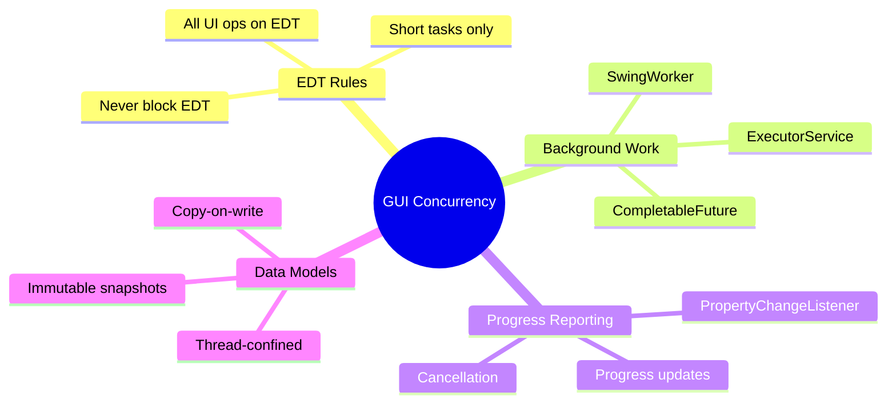
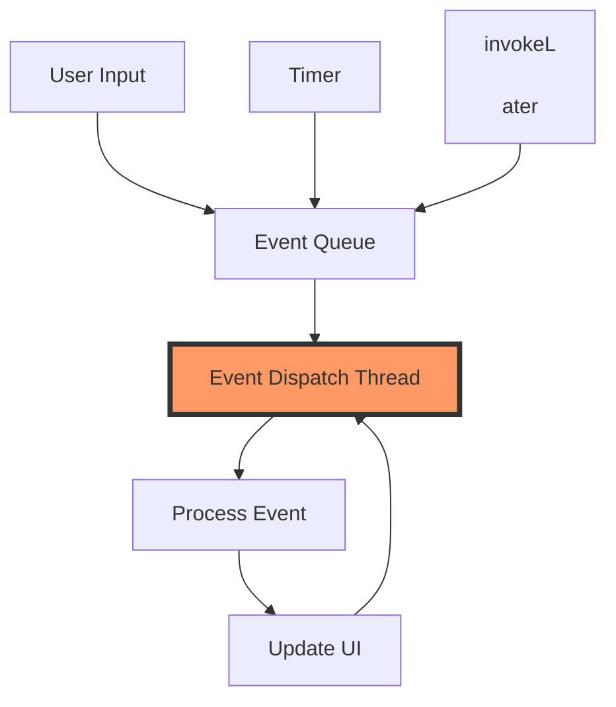
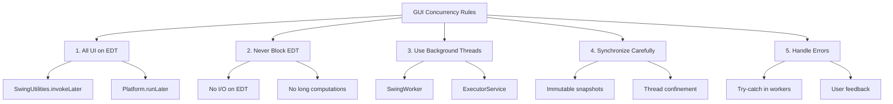

# 📚 Chapter 9: GUI Applications

> **Master concurrency in single-threaded GUI frameworks - keeping interfaces responsive while performing background work**

---

## 📖 Table of Contents

1. [Overview](#-overview)
2. [Why Are GUIs Single-Threaded?](#-91-why-are-guis-single-threaded)
3. [Short-Running GUI Tasks](#-92-short-running-gui-tasks)
4. [Long-Running GUI Tasks](#-93-long-running-gui-tasks)
5. [Shared Data Models](#-94-shared-data-models)
6. [Best Practices](#-best-practices)
7. [Practice Exercises](#-practice-exercises)

---

## 🎯 Overview

GUI frameworks like Swing and JavaFX are fundamentally single-threaded. All GUI operations must occur on a dedicated event dispatch thread (EDT). This chapter explores how to build responsive GUIs while performing concurrent background work.

### **Why This Chapter Matters:**
- 🎨 **Responsiveness**: Keep UI responsive during long operations
- 🧵 **Thread Safety**: Understand GUI threading models
- ⚡ **Performance**: Leverage concurrency without freezing UI
- 🎯 **Patterns**: Master SwingWorker and JavaFX Task patterns
- 🛡️ **Data Models**: Safely share data between UI and background threads



---

## 🖼️ 9.1 Why Are GUIs Single-Threaded?

### **Historical Context**

Early GUI toolkits tried multi-threading but faced problems:

```
Multi-Threaded GUI (attempted):
Thread 1: Repaints button
Thread 2: Moves button        ← Race condition!
Thread 3: Resizes window      ← Inconsistent state!

Result: Visual glitches, crashes, deadlocks
```

### **The EDT Solution**



---

### **⚠️ The Frozen UI Problem**

```java
/**
 * DANGER: Long operation on EDT freezes UI
 */
public class FrozenUI extends JFrame {
    private JButton button = new JButton("Start");
    private JProgressBar progressBar = new JProgressBar(0, 100);
    
    public FrozenUI() {
        button.addActionListener(e -> {
            // ❌ BAD: Long operation on EDT!
            for (int i = 0; i <= 100; i++) {
                doExpensiveWork();  // 100ms per iteration
                progressBar.setValue(i);  // UI can't update!
                // User can't interact with window for 10 seconds!
            }
        });
        
        add(button, BorderLayout.NORTH);
        add(progressBar, BorderLayout.CENTER);
        setSize(400, 200);
        setDefaultCloseOperation(EXIT_ON_CLOSE);
    }
    
    private void doExpensiveWork() {
        try {
            Thread.sleep(100);
        } catch (InterruptedException e) {
            Thread.currentThread().interrupt();
        }
    }
}
```

**User Experience:**
```
User clicks button
         ↓
[████████████████] 10 seconds of frozen UI
         ↓
Progress bar suddenly shows 100%

During freeze:
- Can't click anything
- Can't move window
- Can't close window
- Appears "Not Responding"
- User frustrated 😠
```

---

## ⚡ 9.2 Short-Running GUI Tasks

### **The Golden Rule**

> **All GUI operations must run on the EDT, and the EDT must not be blocked.**

### **Executing on EDT**

```java
/**
 * Safely executing UI operations
 */
public class EDTExecution {
    
    /**
     * Swing: Use SwingUtilities.invokeLater()
     */
    public void updateSwingUI() {
        // From any thread
        SwingUtilities.invokeLater(() -> {
            // This code runs on EDT
            label.setText("Updated!");
            button.setEnabled(true);
        });
    }
    
    /**
     * JavaFX: Use Platform.runLater()
     */
    public void updateJavaFXUI() {
        // From any thread
        Platform.runLater(() -> {
            // This code runs on JavaFX Application Thread
            label.setText("Updated!");
            button.setDisable(false);
        });
    }
    
    /**
     * Check if on EDT
     */
    public void assertEDT() {
        if (!SwingUtilities.isEventDispatchThread()) {
            throw new IllegalStateException("Not on EDT!");
        }
    }
    
    private JLabel label = new JLabel();
    private JButton button = new JButton();
}
```

---

## 🏃 9.3 Long-Running GUI Tasks

### **SwingWorker Pattern**

```java
/**
 * ✅ CORRECT: Long operation on background thread
 */
public class ResponsiveUI extends JFrame {
    private JButton button = new JButton("Start");
    private JProgressBar progressBar = new JProgressBar(0, 100);
    private JLabel statusLabel = new JLabel("Ready");
    
    public ResponsiveUI() {
        button.addActionListener(e -> {
            button.setEnabled(false);
            
            // Create SwingWorker for background task
            SwingWorker<String, Integer> worker = new SwingWorker<String, Integer>() {
                @Override
                protected String doInBackground() throws Exception {
                    // ✅ Runs on background thread
                    for (int i = 0; i <= 100; i++) {
                        if (isCancelled()) {
                            break;
                        }
                        doExpensiveWork();
                        publish(i);  // Publish progress
                        setProgress(i);
                    }
                    return "Completed!";
                }
                
                @Override
                protected void process(List<Integer> chunks) {
                    // ✅ Runs on EDT
                    int value = chunks.get(chunks.size() - 1);
                    progressBar.setValue(value);
                }
                
                @Override
                protected void done() {
                    // ✅ Runs on EDT
                    button.setEnabled(true);
                    try {
                        statusLabel.setText(get());
                    } catch (Exception e) {
                        statusLabel.setText("Error: " + e.getMessage());
                    }
                }
            };
            
            worker.execute();  // Start background work
        });
        
        add(button, BorderLayout.NORTH);
        add(progressBar, BorderLayout.CENTER);
        add(statusLabel, BorderLayout.SOUTH);
        setSize(400, 200);
        setDefaultCloseOperation(EXIT_ON_CLOSE);
    }
    
    private void doExpensiveWork() throws InterruptedException {
        Thread.sleep(100);
    }
}
```

**Threading Model:**

```
User clicks button (EDT)
         ↓
SwingWorker.execute()
         ├──> doInBackground() runs on background thread
         │    ├─ Work iteration 1
         │    ├─ publish(1) ──> process([1]) on EDT
         │    ├─ Work iteration 2
         │    ├─ publish(2) ──> process([2]) on EDT
         │    └─ ...
         └──> done() runs on EDT

EDT stays responsive throughout! ✅
```

---

### **Cancellable Long-Running Tasks**

```java
/**
 * Long-running task with cancellation support
 */
public class CancellableTask extends JFrame {
    private JButton startButton = new JButton("Start");
    private JButton cancelButton = new JButton("Cancel");
    private JProgressBar progressBar = new JProgressBar(0, 100);
    private SwingWorker<String, Void> currentWorker;
    
    public CancellableTask() {
        startButton.addActionListener(e -> startWork());
        cancelButton.addActionListener(e -> cancelWork());
        
        JPanel buttons = new JPanel();
        buttons.add(startButton);
        buttons.add(cancelButton);
        
        add(buttons, BorderLayout.NORTH);
        add(progressBar, BorderLayout.CENTER);
        
        cancelButton.setEnabled(false);
        setSize(400, 150);
        setDefaultCloseOperation(EXIT_ON_CLOSE);
    }
    
    private void startWork() {
        startButton.setEnabled(false);
        cancelButton.setEnabled(true);
        
        currentWorker = new SwingWorker<String, Void>() {
            @Override
            protected String doInBackground() throws Exception {
                for (int i = 0; i <= 100; i++) {
                    // Check for cancellation
                    if (isCancelled()) {
                        return "Cancelled";
                    }
                    
                    Thread.sleep(100);
                    setProgress(i);
                }
                return "Completed";
            }
            
            @Override
            protected void done() {
                startButton.setEnabled(true);
                cancelButton.setEnabled(false);
                try {
                    String result = get();
                    JOptionPane.showMessageDialog(
                        CancellableTask.this,
                        result
                    );
                } catch (CancellationException e) {
                    JOptionPane.showMessageDialog(
                        CancellableTask.this,
                        "Task was cancelled"
                    );
                } catch (Exception e) {
                    JOptionPane.showMessageDialog(
                        CancellableTask.this,
                        "Error: " + e.getMessage()
                    );
                }
            }
        };
        
        currentWorker.addPropertyChangeListener(evt -> {
            if ("progress".equals(evt.getPropertyName())) {
                progressBar.setValue((Integer) evt.getNewValue());
            }
        });
        
        currentWorker.execute();
    }
    
    private void cancelWork() {
        if (currentWorker != null) {
            currentWorker.cancel(true);  // ← Interrupt if running
        }
    }
}
```

---

### **JavaFX Task**

```java
/**
 * JavaFX equivalent using Task
 */
public class JavaFXLongTask extends Application {
    
    @Override
    public void start(Stage primaryStage) {
        Button startButton = new Button("Start");
        ProgressBar progressBar = new ProgressBar(0);
        Label statusLabel = new Label("Ready");
        
        startButton.setOnAction(e -> {
            Task<String> task = new Task<String>() {
                @Override
                protected String call() throws Exception {
                    for (int i = 0; i <= 100; i++) {
                        if (isCancelled()) {
                            break;
                        }
                        
                        Thread.sleep(100);
                        updateProgress(i, 100);
                        updateMessage("Processing " + i + "%");
                    }
                    return "Completed!";
                }
            };
            
            // Bind progress
            progressBar.progressProperty().bind(task.progressProperty());
            statusLabel.textProperty().bind(task.messageProperty());
            
            // Handle completion
            task.setOnSucceeded(event -> {
                statusLabel.textProperty().unbind();
                statusLabel.setText(task.getValue());
            });
            
            // Execute in background
            new Thread(task).start();
        });
        
        VBox root = new VBox(10, startButton, progressBar, statusLabel);
        root.setPadding(new Insets(20));
        Scene scene = new Scene(root, 400, 150);
        primaryStage.setScene(scene);
        primaryStage.setTitle("JavaFX Long Task");
        primaryStage.show();
    }
}
```

---

## 📊 9.4 Shared Data Models

### **The Data Model Problem**

```java
/**
 * DANGER: Shared mutable data model
 */
public class UnsafeDataModel {
    // Model accessed from both EDT and background threads
    private final List<DataItem> items = new ArrayList<>();
    
    // Called from EDT
    public void displayItems(JList<DataItem> list) {
        list.setListData(items.toArray(new DataItem[0]));  // ❌ Race condition!
    }
    
    // Called from background thread
    public void loadItems() {
        List<DataItem> loaded = loadFromDatabase();
        items.clear();  // ❌ Race condition!
        items.addAll(loaded);  // ❌ Race condition!
        
        // Update UI
        SwingUtilities.invokeLater(() -> {
            // items might have changed again!
        });
    }
}
```

---

### **✅ Solution 1: Thread Confinement**

```java
/**
 * Model confined to EDT
 */
@ThreadSafe
public class EDTConfinedModel {
    @GuardedBy("EDT")
    private final List<DataItem> items = new ArrayList<>();
    
    /**
     * All access must be on EDT
     */
    public void addItem(DataItem item) {
        assertOnEDT();
        items.add(item);
    }
    
    public List<DataItem> getItems() {
        assertOnEDT();
        return new ArrayList<>(items);
    }
    
    /**
     * Load data in background, update on EDT
     */
    public void loadItemsAsync() {
        SwingWorker<List<DataItem>, Void> worker = 
            new SwingWorker<List<DataItem>, Void>() {
                @Override
                protected List<DataItem> doInBackground() {
                    return loadFromDatabase();  // Background thread
                }
                
                @Override
                protected void done() {
                    try {
                        List<DataItem> loaded = get();
                        // ✅ Update model on EDT
                        items.clear();
                        items.addAll(loaded);
                        fireModelChanged();
                    } catch (Exception e) {
                        handleError(e);
                    }
                }
            };
        
        worker.execute();
    }
    
    private void assertOnEDT() {
        if (!SwingUtilities.isEventDispatchThread()) {
            throw new IllegalStateException("Not on EDT!");
        }
    }
    
    private List<DataItem> loadFromDatabase() {
        return new ArrayList<>();
    }
    
    private void fireModelChanged() {
        // Notify listeners
    }
    
    private void handleError(Exception e) {
        // Handle error
    }
}

class DataItem {}
```

---

### **✅ Solution 2: Immutable Snapshots**

```java
/**
 * Thread-safe model using immutable snapshots
 */
@ThreadSafe
public class SnapshotModel {
    @GuardedBy("this")
    private List<DataItem> items = Collections.emptyList();
    
    /**
     * Replace entire list atomically
     */
    public synchronized void setItems(List<DataItem> newItems) {
        items = Collections.unmodifiableList(new ArrayList<>(newItems));
    }
    
    /**
     * Get immutable snapshot
     */
    public synchronized List<DataItem> getItems() {
        return items;  // Already immutable
    }
    
    /**
     * Load in background, publish on EDT
     */
    public void loadAsync(JList<DataItem> listComponent) {
        SwingWorker<List<DataItem>, Void> worker = 
            new SwingWorker<List<DataItem>, Void>() {
                @Override
                protected List<DataItem> doInBackground() {
                    return loadFromDatabase();
                }
                
                @Override
                protected void done() {
                    try {
                        List<DataItem> loaded = get();
                        setItems(loaded);  // Thread-safe
                        
                        // Update UI on EDT
                        listComponent.setListData(
                            loaded.toArray(new DataItem[0])
                        );
                    } catch (Exception e) {
                        handleError(e);
                    }
                }
            };
        
        worker.execute();
    }
    
    private List<DataItem> loadFromDatabase() {
        return new ArrayList<>();
    }
    
    private void handleError(Exception e) {
        JOptionPane.showMessageDialog(null, 
                                     "Error: " + e.getMessage());
    }
}
```

---

### **✅ Solution 3: Split Model**

```java
/**
 * Presentation model (EDT) + Domain model (thread-safe)
 */
public class SplitModelApproach {
    
    /**
     * Domain model - thread-safe
     */
    @ThreadSafe
    static class DomainModel {
        private final ConcurrentMap<String, DataItem> items = 
            new ConcurrentHashMap<>();
        
        public void updateItem(String id, DataItem item) {
            items.put(id, item);  // Thread-safe
        }
        
        public DataItem getItem(String id) {
            return items.get(id);
        }
        
        public List<DataItem> getAllItems() {
            return new ArrayList<>(items.values());
        }
    }
    
    /**
     * Presentation model - EDT-confined
     */
    static class PresentationModel {
        @GuardedBy("EDT")
        private final DefaultListModel<DataItem> listModel = 
            new DefaultListModel<>();
        
        public void updateFromDomain(DomainModel domain) {
            assertOnEDT();
            
            listModel.clear();
            for (DataItem item : domain.getAllItems()) {
                listModel.addElement(item);
            }
        }
        
        public DefaultListModel<DataItem> getListModel() {
            assertOnEDT();
            return listModel;
        }
        
        private void assertOnEDT() {
            if (!SwingUtilities.isEventDispatchThread()) {
                throw new IllegalStateException("Not on EDT!");
            }
        }
    }
    
    /**
     * Controller coordinates between models
     */
    static class Controller {
        private final DomainModel domain = new DomainModel();
        private final PresentationModel presentation = new PresentationModel();
        
        public void loadData() {
            // Background thread loads data
            SwingWorker<Void, Void> worker = new SwingWorker<Void, Void>() {
                @Override
                protected Void doInBackground() {
                    List<DataItem> items = loadFromDatabase();
                    for (DataItem item : items) {
                        domain.updateItem(item.getId(), item);
                    }
                    return null;
                }
                
                @Override
                protected void done() {
                    // Update presentation model on EDT
                    presentation.updateFromDomain(domain);
                }
            };
            
            worker.execute();
        }
        
        private List<DataItem> loadFromDatabase() {
            return new ArrayList<>();
        }
    }
}

class DataItem {
    private String id;
    public String getId() { return id; }
}
```

---

## ✅ Best Practices

### **🎯 GUI Concurrency Rules**



---

## 📚 Summary

### **🎯 Key Takeaways**

| Topic | Key Points |
|-------|-----------|
| **EDT** | All UI operations must run on Event Dispatch Thread |
| **Responsiveness** | Never block EDT with long operations |
| **Background Work** | Use SwingWorker or JavaFX Task for long operations |
| **Data Models** | Use thread confinement, immutable snapshots, or split models |

---

## 🔗 What's Next?

### **Chapter 10: Avoiding Liveness Hazards**
Learn to prevent deadlocks and ensure progress:
- Deadlock causes and detection
- Lock ordering strategies
- Livelock and starvation
- Timeout-based locking

---

**[← Previous: Chapter 8 - Applying Thread Pools](./08-thread-pools.md)** | **[Back to README](./README.md)** | **[Next: Chapter 10 - Avoiding Liveness Hazards →](./10-liveness-hazards.md)**

---

*Chapter 9 completed! You now master GUI concurrency patterns for responsive user interfaces.*
