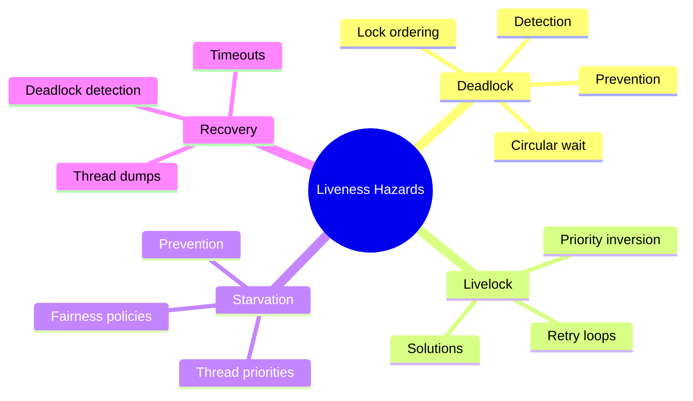
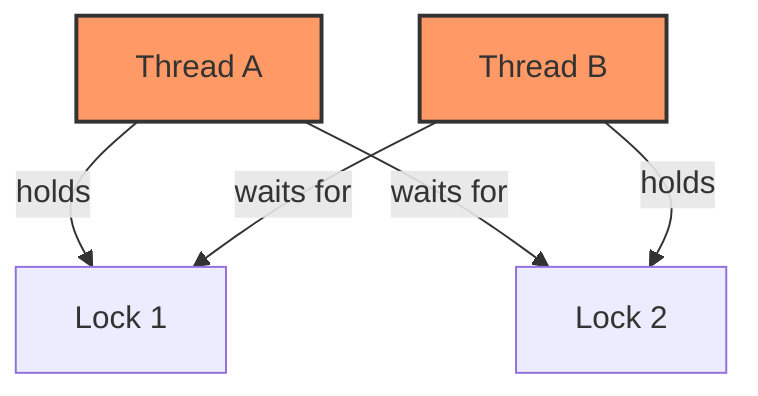
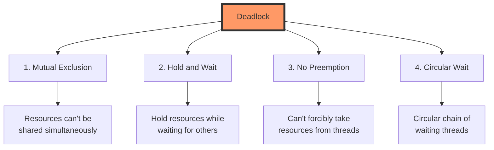
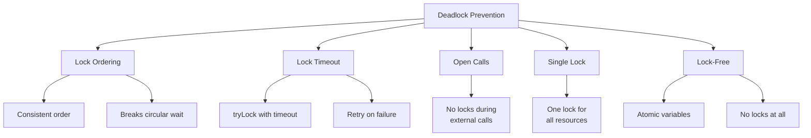

# 📚 Chapter 10: Avoiding Liveness Hazards

> **Master the art of preventing deadlocks, livelock, and starvation - ensuring your concurrent programs make progress**

---

## 📖 Table of Contents

1. [Overview](#-overview)
2. [Deadlock](#-101-deadlock)
3. [Avoiding and Diagnosing Deadlocks](#-102-avoiding-and-diagnosing-deadlocks)
4. [Other Liveness Hazards](#-103-other-liveness-hazards)
5. [Best Practices](#-best-practices)
6. [Practice Exercises](#-practice-exercises)

---

## 🎯 Overview

**Liveness** means that something good eventually happens. A liveness failure occurs when an activity cannot make progress. The three main liveness hazards are deadlock, livelock, and starvation.

### **Why This Chapter Matters:**
- 🚫 **Prevention**: Learn to prevent deadlocks before they occur
- 🔍 **Detection**: Diagnose and fix existing deadlocks
- ⚡ **Progress**: Ensure all threads can make progress
- 🎯 **Reliability**: Build systems that never hang
- 🛡️ **Recovery**: Handle liveness failures gracefully



---

## 💀 10.1 Deadlock

### **What is Deadlock?**

> **Deadlock occurs when each thread is waiting for a resource held by another thread, forming a circular wait condition.**



---

### **🔴 Classic Deadlock Example**

```java
/**
 * DANGER: Simple lock-ordering deadlock
 */
public class DeadlockExample {
    private final Object lock1 = new Object();
    private final Object lock2 = new Object();
    
    // Thread A calls this
    public void methodA() {
        synchronized (lock1) {              // ← A acquires lock1
            System.out.println("A got lock1");
            
            try { Thread.sleep(100); } catch (InterruptedException e) {}
            
            synchronized (lock2) {          // ← A waits for lock2
                System.out.println("A got lock2");
            }
        }
    }
    
    // Thread B calls this
    public void methodB() {
        synchronized (lock2) {              // ← B acquires lock2
            System.out.println("B got lock2");
            
            try { Thread.sleep(100); } catch (InterruptedException e) {}
            
            synchronized (lock1) {          // ← B waits for lock1
                System.out.println("B got lock1");
            }
        }
    }
    
    public static void main(String[] args) {
        DeadlockExample demo = new DeadlockExample();
        
        Thread threadA = new Thread(() -> demo.methodA(), "Thread-A");
        Thread threadB = new Thread(() -> demo.methodB(), "Thread-B");
        
        threadA.start();
        threadB.start();
        
        // Program hangs here! 😱
    }
}
```

**Timeline:**

```
Time    Thread A                    Thread B
────    ────────                    ────────
t0                                  
t1      Lock lock1 ✅                
t2                                  Lock lock2 ✅
t3      Try lock lock2 ⏳ WAITING    
t4                                  Try lock lock1 ⏳ WAITING

DEADLOCK! Neither thread can proceed.
```

---

### **🏦 Real-World Example: Bank Transfer Deadlock**

```java
/**
 * DANGER: Transfer deadlock
 */
public class TransferDeadlock {
    
    public void transferMoney(Account from, Account to, Amount amount) 
            throws InsufficientFundsException {
        synchronized (from) {               // ← Lock from account
            synchronized (to) {             // ← Lock to account
                if (from.getBalance().compareTo(amount) < 0) {
                    throw new InsufficientFundsException();
                }
                from.debit(amount);
                to.credit(amount);
            }
        }
    }
    
    static class Account {
        private Amount balance = new Amount(1000);
        
        void debit(Amount amount) {
            balance = balance.subtract(amount);
        }
        
        void credit(Amount amount) {
            balance = balance.add(amount);
        }
        
        Amount getBalance() {
            return balance;
        }
    }
    
    static class Amount implements Comparable<Amount> {
        private final int value;
        Amount(int value) { this.value = value; }
        Amount add(Amount other) { return new Amount(value + other.value); }
        Amount subtract(Amount other) { return new Amount(value - other.value); }
        public int compareTo(Amount other) { return Integer.compare(value, other.value); }
    }
    
    static class InsufficientFundsException extends Exception {}
}
```

**Deadlock Scenario:**

```
Thread 1: transferMoney(accountA, accountB, $100)
Thread 2: transferMoney(accountB, accountA, $50)

Thread 1                          Thread 2
────────                          ────────
Lock accountA ✅                   
                                  Lock accountB ✅
Try lock accountB ⏳ WAITING       
                                  Try lock accountA ⏳ WAITING

→ DEADLOCK!
```

---

### **🛠️ Four Necessary Conditions for Deadlock**

Deadlock requires ALL four conditions simultaneously:



**Breaking ANY one condition prevents deadlock!**

---

## 🛡️ 10.2 Avoiding and Diagnosing Deadlocks

### **✅ Solution 1: Lock Ordering**

```java
/**
 * CORRECT: Consistent lock ordering prevents deadlock
 */
public class DeadlockFree {
    private static final Object tieLock = new Object();
    
    public void transferMoney(Account from, Account to, Amount amount)
            throws InsufficientFundsException {
        // Define consistent ordering based on account ID
        Account first, second;
        if (from.getId() < to.getId()) {
            first = from;
            second = to;
        } else if (from.getId() > to.getId()) {
            first = to;
            second = from;
        } else {
            // Same account (shouldn't happen, but handle it)
            throw new IllegalArgumentException("Cannot transfer to same account");
        }
        
        synchronized (first) {
            synchronized (second) {
                if (from.getBalance().compareTo(amount) < 0) {
                    throw new InsufficientFundsException();
                }
                from.debit(amount);
                to.credit(amount);
            }
        }
    }
    
    static class Account {
        private final int id;
        private Amount balance;
        
        Account(int id, Amount balance) {
            this.id = id;
            this.balance = balance;
        }
        
        int getId() { return id; }
        Amount getBalance() { return balance; }
        void debit(Amount amount) { balance = balance.subtract(amount); }
        void credit(Amount amount) { balance = balance.add(amount); }
    }
    
    static class Amount implements Comparable<Amount> {
        private final int value;
        Amount(int value) { this.value = value; }
        Amount add(Amount other) { return new Amount(value + other.value); }
        Amount subtract(Amount other) { return new Amount(value - other.value); }
        public int compareTo(Amount other) { return Integer.compare(value, other.value); }
    }
    
    static class InsufficientFundsException extends Exception {}
}
```

**Why This Works:**

```
Thread 1: transfer(accountB=2, accountA=1, $100)
Thread 2: transfer(accountA=1, accountB=2, $50)

Both threads lock in same order: accountA (ID=1) then accountB (ID=2)

Thread 1                          Thread 2
────────                          ────────
Lock accountA (ID=1) ✅            
Lock accountB (ID=2) ✅            
Transfer complete                 Wait for accountA ⏳
Unlock accountB                   
Unlock accountA                   Lock accountA ✅
                                  Lock accountB ✅
                                  Transfer complete

No circular wait = No deadlock! ✅
```

---

### **✅ Solution 2: Open Calls**

```java
/**
 * Using open calls to avoid deadlock
 */
public class OpenCallsPattern {
    
    /**
     * DANGER: Calls alien method with lock held
     */
    static class TaxiDispatcher {
        @GuardedBy("this")
        private final Set<Taxi> taxis = new HashSet<>();
        @GuardedBy("this")
        private final Set<Taxi> availableTaxis = new HashSet<>();
        
        // ❌ BAD: Calls setLocation with lock held
        public synchronized void notifyAvailable(Taxi taxi) {
            availableTaxis.add(taxi);
        }
        
        public synchronized Image getImage() {
            Image image = new Image();
            for (Taxi t : taxis) {
                image.drawMarker(t.getLocation());  // ← Alien method with lock!
            }
            return image;
        }
    }
    
    static class Taxi {
        @GuardedBy("this")
        private Point location;
        private final TaxiDispatcher dispatcher;
        
        public Taxi(TaxiDispatcher dispatcher) {
            this.dispatcher = dispatcher;
        }
        
        // ❌ BAD: Calls notifyAvailable with lock held
        public synchronized void setLocation(Point location) {
            this.location = location;
            if (isAvailable()) {
                dispatcher.notifyAvailable(this);  // ← Alien method with lock!
            }
        }
        
        public synchronized Point getLocation() {
            return location;
        }
        
        private boolean isAvailable() {
            return true;
        }
    }
    
    /**
     * BETTER: Using open calls (no locks held during alien methods)
     */
    static class BetterTaxiDispatcher {
        @GuardedBy("this")
        private final Set<Taxi> taxis = new HashSet<>();
        @GuardedBy("this")
        private final Set<Taxi> availableTaxis = new HashSet<>();
        
        public synchronized void notifyAvailable(Taxi taxi) {
            availableTaxis.add(taxi);
        }
        
        public Image getImage() {
            Set<Taxi> copy;
            synchronized (this) {
                copy = new HashSet<>(taxis);
            }  // ← Release lock before calling alien method
            
            Image image = new Image();
            for (Taxi t : copy) {
                image.drawMarker(t.getLocation());  // ✅ Open call
            }
            return image;
        }
    }
    
    static class BetterTaxi {
        @GuardedBy("this")
        private Point location;
        private final TaxiDispatcher dispatcher;
        
        public BetterTaxi(TaxiDispatcher dispatcher) {
            this.dispatcher = dispatcher;
        }
        
        public void setLocation(Point location) {
            boolean shouldNotify;
            synchronized (this) {
                this.location = location;
                shouldNotify = isAvailable();
            }  // ← Release lock before calling alien method
            
            if (shouldNotify) {
                dispatcher.notifyAvailable(this);  // ✅ Open call
            }
        }
        
        public synchronized Point getLocation() {
            return location;
        }
        
        private boolean isAvailable() {
            return true;
        }
    }
    
    static class Point {
        final int x, y;
        Point(int x, int y) { this.x = x; this.y = y; }
    }
    
    static class Image {
        void drawMarker(Point p) {}
    }
}
```

---

### **✅ Solution 3: Timed Lock Attempts**

```java
/**
 * Using tryLock with timeout to avoid deadlock
 */
public class TimedLocking {
    
    public boolean transferMoney(Account from, Account to, Amount amount,
                                long timeout, TimeUnit unit)
            throws InsufficientFundsException, InterruptedException {
        long fixedDelay = getFixedDelayComponentNanos(timeout, unit);
        long randMod = getRandomDelayModulusNanos(timeout, unit);
        long stopTime = System.nanoTime() + unit.toNanos(timeout);
        
        while (true) {
            if (from.lock.tryLock()) {
                try {
                    if (to.lock.tryLock()) {
                        try {
                            if (from.getBalance().compareTo(amount) < 0) {
                                throw new InsufficientFundsException();
                            }
                            from.debit(amount);
                            to.credit(amount);
                            return true;  // ✅ Success
                        } finally {
                            to.lock.unlock();
                        }
                    }
                } finally {
                    from.lock.unlock();
                }
            }
            
            // Couldn't acquire both locks
            if (System.nanoTime() >= stopTime) {
                return false;  // ❌ Timeout
            }
            
            // Random backoff to reduce livelock
            TimeUnit.NANOSECONDS.sleep(fixedDelay + 
                                     (long) (Math.random() * randMod));
        }
    }
    
    private long getFixedDelayComponentNanos(long timeout, TimeUnit unit) {
        return 100_000;  // 0.1ms
    }
    
    private long getRandomDelayModulusNanos(long timeout, TimeUnit unit) {
        return 100_000;  // Up to 0.1ms additional random delay
    }
    
    static class Account {
        final Lock lock = new ReentrantLock();
        private Amount balance;
        
        Account(Amount balance) {
            this.balance = balance;
        }
        
        Amount getBalance() { return balance; }
        void debit(Amount amount) { balance = balance.subtract(amount); }
        void credit(Amount amount) { balance = balance.add(amount); }
    }
    
    static class Amount implements Comparable<Amount> {
        private final int value;
        Amount(int value) { this.value = value; }
        Amount add(Amount other) { return new Amount(value + other.value); }
        Amount subtract(Amount other) { return new Amount(value - other.value); }
        public int compareTo(Amount other) { return Integer.compare(value, other.value); }
    }
    
    static class InsufficientFundsException extends Exception {}
}
```

---

### **🔍 Detecting Deadlocks**

#### **Thread Dumps**

```bash
# Get thread dump on Unix/Linux
kill -3 <pid>

# Or use jstack
jstack <pid>
```

**Example Thread Dump Output:**

```
"Thread-B":
  waiting to lock monitor 0x00007f9c4c001200 (object 0x00000007d5f3f8a0, Lock1)
  which is held by "Thread-A"

"Thread-A":
  waiting to lock monitor 0x00007f9c4c001300 (object 0x00000007d5f3f8b0, Lock2)
  which is held by "Thread-B"

Found 1 deadlock.
```

---

#### **Programmatic Deadlock Detection**

```java
/**
 * Detect deadlocks programmatically
 */
public class DeadlockDetector {
    
    public static void detectDeadlocks() {
        ThreadMXBean tmx = ManagementFactory.getThreadMXBean();
        long[] deadlockedThreads = tmx.findDeadlockedThreads();
        
        if (deadlockedThreads != null) {
            ThreadInfo[] threadInfos = tmx.getThreadInfo(deadlockedThreads);
            
            System.out.println("Deadlock detected!");
            for (ThreadInfo info : threadInfos) {
                System.out.println("\nThread: " + info.getThreadName());
                System.out.println("  State: " + info.getThreadState());
                System.out.println("  Locked on: " + info.getLockName());
                System.out.println("  Locked by: " + info.getLockOwnerName());
                
                StackTraceElement[] stackTrace = info.getStackTrace();
                for (StackTraceElement element : stackTrace) {
                    System.out.println("    at " + element);
                }
            }
        } else {
            System.out.println("No deadlocks detected");
        }
    }
    
    /**
     * Periodic deadlock monitoring
     */
    public static void startDeadlockMonitor() {
        ScheduledExecutorService monitor = 
            Executors.newScheduledThreadPool(1);
        
        monitor.scheduleAtFixedRate(
            DeadlockDetector::detectDeadlocks,
            10,
            10,
            TimeUnit.SECONDS
        );
    }
}
```

---

## 🔄 10.3 Other Liveness Hazards

### **🔁 Livelock**

```java
/**
 * Livelock: Threads keep changing state in response to each other
 */
public class LivelockExample {
    
    static class Spoon {
        private Diner owner;
        
        public Spoon(Diner d) {
            owner = d;
        }
        
        public Diner getOwner() {
            return owner;
        }
        
        public synchronized void setOwner(Diner d) {
            owner = d;
        }
        
        public synchronized void use() {
            System.out.printf("%s is eating!", owner.name);
        }
    }
    
    static class Diner {
        private String name;
        private boolean isHungry;
        
        public Diner(String n) {
            name = n;
            isHungry = true;
        }
        
        public void eatWith(Spoon spoon, Diner spouse) {
            while (isHungry) {
                // Don't have the spoon, wait
                if (spoon.owner != this) {
                    try {
                        Thread.sleep(1);
                    } catch (InterruptedException e) {
                        continue;
                    }
                    continue;
                }
                
                // Spouse is hungry, give them the spoon
                if (spouse.isHungry) {
                    System.out.printf("%s: You eat first %s!%n", name, spouse.name);
                    spoon.setOwner(spouse);
                    continue;  // ← Both keep giving spoon to each other! Livelock!
                }
                
                // Eat
                spoon.use();
                isHungry = false;
                System.out.printf("%s: I'm done eating%n", name);
                spoon.setOwner(spouse);
            }
        }
    }
    
    public static void main(String[] args) {
        final Diner husband = new Diner("Husband");
        final Diner wife = new Diner("Wife");
        final Spoon spoon = new Spoon(husband);
        
        new Thread(() -> husband.eatWith(spoon, wife)).start();
        new Thread(() -> wife.eatWith(spoon, husband)).start();
        
        // Both threads keep running but make no progress! 🔄
    }
}
```

**Fix: Add randomization**

```java
// Break symmetry with random delays
if (spouse.isHungry) {
    System.out.printf("%s: You eat first %s!%n", name, spouse.name);
    spoon.setOwner(spouse);
    Thread.sleep((long) (Math.random() * 100));  // ← Random delay
    continue;
}
```

---

### **⏳ Starvation**

```java
/**
 * Thread starvation due to priority or unfair scheduling
 */
public class StarvationExample {
    
    /**
     * High-priority threads starve low-priority threads
     */
    public static void demonstratePriorityStarvation() {
        // Low priority thread
        Thread lowPriority = new Thread(() -> {
            long count = 0;
            while (!Thread.currentThread().isInterrupted()) {
                count++;
            }
            System.out.println("Low priority count: " + count);
        });
        lowPriority.setPriority(Thread.MIN_PRIORITY);
        
        // High priority threads
        for (int i = 0; i < 10; i++) {
            Thread highPriority = new Thread(() -> {
                long count = 0;
                while (count < 1_000_000_000L) {
                    count++;
                }
                System.out.println("High priority done: " + count);
            });
            highPriority.setPriority(Thread.MAX_PRIORITY);
            highPriority.start();
        }
        
        lowPriority.start();
        
        // Low priority thread may get very little CPU time! 😞
    }
    
    /**
     * Solution: Fair scheduling
     */
    public static void fairScheduling() {
        // Use fair locks
        Lock fairLock = new ReentrantLock(true);  // ← Fair mode
        
        // Or use fairness in ThreadPoolExecutor
        BlockingQueue<Runnable> queue = new LinkedBlockingQueue<>();
        ThreadPoolExecutor executor = new ThreadPoolExecutor(
            10, 10,
            0L, TimeUnit.MILLISECONDS,
            queue
        );
        // Note: Default is non-fair for better throughput
    }
}
```

---

## ✅ Best Practices

### **🎯 Deadlock Prevention Strategies**



---

## 📚 Summary

### **🎯 Key Takeaways**

| Hazard | Cause | Prevention |
|--------|-------|------------|
| **Deadlock** | Circular wait on locks | Lock ordering, timeouts, open calls |
| **Livelock** | Symmetric retry logic | Random backoff, asymmetric handling |
| **Starvation** | Unfair scheduling | Fair locks, proper priorities |

---

## 🔗 What's Next?

### **Chapter 11: Performance and Scalability**
Optimize concurrent applications:
- Amdahl's law
- Thread overhead costs
- Reducing lock contention
- Performance testing

---

**[← Previous: Chapter 9 - GUI Applications](./09-gui-applications.md)** | **[Back to README](./README.md)** | **[Next: Chapter 11 - Performance and Scalability →](./11-performance-scalability.md)**

---

*Chapter 10 completed! You now know how to prevent and diagnose liveness hazards in concurrent programs.*
