# 📈 Chapter 11: Performance and Scalability

> **Master the art of building high-performance, scalable concurrent applications through understanding performance trade-offs, Amdahl's law, and advanced optimization techniques.**

---

## 🎯 Learning Objectives

By the end of this chapter, you will be able to:

- ✅ Distinguish between performance and scalability and their trade-offs
- ✅ Apply Amdahl's law to analyze and predict scalability limitations
- ✅ Understand all costs introduced by threads and synchronization
- ✅ Identify and eliminate lock contention in concurrent applications
- ✅ Choose optimal synchronization strategies for your use case
- ✅ Measure and reduce context switch overhead effectively
- ✅ Compare and select appropriate concurrent data structures
- ✅ Make informed engineering decisions balancing safety and performance
- ✅ Profile and optimize real-world concurrent applications

---

## 📚 Prerequisites

Before diving into this chapter, ensure you understand:

- ✅ **Thread Safety** (Chapter 2) - Synchronization fundamentals
- ✅ **Locking Mechanisms** - synchronized, ReentrantLock, volatile
- ✅ **Concurrent Collections** (Chapter 5) - ConcurrentHashMap, BlockingQueue
- ✅ **Thread Pools** (Chapters 6-8) - Executor framework, configuration
- ✅ **Liveness Issues** (Chapter 10) - Deadlock, contention basics
- ✅ **Basic Computer Architecture** - CPU caches, memory hierarchy

---

## 📋 Table of Contents

1. [Thinking About Performance](#-111-thinking-about-performance)
2. [Amdahl's Law](#-112-amdahls-law)
3. [Costs Introduced by Threads](#-113-costs-introduced-by-threads)
4. [Reducing Lock Contention](#-114-reducing-lock-contention)
5. [Example: Comparing Map Performance](#-115-example-comparing-map-performance)
6. [Reducing Context Switch Overhead](#-116-reducing-context-switch-overhead)
7. [Practical Examples](#-practical-examples)
8. [Common Pitfalls](#-common-pitfalls)
9. [Best Practices](#-best-practices)
10. [Summary](#-summary)

---

## 🔍 11.1 Thinking About Performance

### **Performance vs. Scalability: Understanding the Difference**

These concepts are often conflated but represent distinct aspects of system behavior:


| Aspect | **Performance** | **Scalability** |
|--------|----------------|-----------------|
| **Definition** | How fast the system completes a task | How throughput/latency changes with more resources |
| **Focus** | Single execution efficiency | Behavior with increased capacity |
| **Measurement** | ms, ops/sec, CPU utilization | Speedup ratio, efficiency percentage |
| **Goal** | Minimize latency, maximize throughput | Maintain performance gains with added cores |
| **Example** | "Process 1M records in 5 seconds" | "2x cores gives 1.8x throughput" |

### **The Performance-Scalability Trade-off Space**

```
                  Performance ↑
                       |
         Simple ←------+-----→ Complex
                       |
                 Scalability ↑
```

**Key Trade-offs:**

1. **Safety ↔ Performance**
   - More synchronization = safer but slower
   - Less locking = faster but riskier

2. **Simplicity ↔ Scalability**  
   - Simple designs (single lock) may not scale
   - Complex designs (lock-free) harder to maintain

3. **Latency ↔ Throughput**
   - Optimizing for low latency may reduce total throughput
   - Batch processing improves throughput but increases latency

4. **Memory ↔ Speed**
   - Caching trades memory for faster access
   - Memory pooling reduces allocation cost

### **Setting Clear Performance Goals**

> **"If you cannot measure it, you cannot improve it."** — Lord Kelvin

**Define SMART Performance Requirements:**

```java
/**
 * Example: Concrete Performance Requirements
 */
public class PerformanceRequirements {
    
    // ✅ Throughput Goals
    public static final int TARGET_THROUGHPUT = 10_000;  // requests/second
    public static final int PEAK_THROUGHPUT = 15_000;    // burst capacity
    
    // ✅ Latency Goals (percentiles matter!)
    public static final int P50_LATENCY_MS = 10;    // 50th percentile
    public static final int P95_LATENCY_MS = 50;    // 95th percentile  
    public static final int P99_LATENCY_MS = 100;   // 99th percentile
    public static final int P999_LATENCY_MS = 500;  // 99.9th percentile
    
    // ✅ Scalability Goals
    public static final double MIN_SCALING_EFFICIENCY = 0.70;  // 70% efficiency
    // Example: 8 cores should give at least 5.6x speedup over 1 core
    
    // ✅ Resource Utilization
    public static final double MAX_CPU_UTILIZATION = 0.80;   // 80% max sustained
    public static final long MAX_MEMORY_MB = 2048;           // 2GB heap max
    public static final int MAX_THREADS = 200;               // Thread pool limit
    
    // ✅ Reliability Under Load
    public static final double MAX_ERROR_RATE = 0.001;       // 0.1% max errors
    public static final int MAX_QUEUE_SIZE = 10_000;         // Bounded queues
}
```

### **Performance Optimization Workflow**

```mermaid
graph LR
    A[1. Make it Work] --> B[2. Make it Right]
    B --> C[3. Profile & Measure]
    C --> D{Fast Enough?}
    D -->|No| E[4. Identify Bottleneck]
    E --> F[5. Optimize Hot Path]
    F --> G[6. Measure Again]
    G --> D
    D -->|Yes| H[Done! ✅]
    
    style A fill:#FFE4B5
    style B fill:#FFE4B5
    style C fill:#90EE90
    style E fill:#87CEEB
    style F fill:#87CEEB
    style H fill:#98FB98
```



**The Golden Rules:**

1. **First**: Ensure correctness and thread safety
2. **Second**: Write clean, maintainable code
3. **Third**: Profile to find ACTUAL bottlenecks (not guessed ones)
4. **Fourth**: Optimize hot paths only
5. **Always**: Measure before and after optimization

### **Premature Optimization is Evil**

> **"We should forget about small efficiencies, say about 97% of the time: premature optimization is the root of all evil."** — Donald Knuth

```java
/**
 * Example: Don't Optimize Prematurely
 */
public class PrematureOptimizationExample {
    
    // ❌ BAD: Complex, hard to maintain, probably not needed
    public String badFormatMessage(String user, int count) {
        // Using StringBuilder for "performance"  
        StringBuilder sb = new StringBuilder(50);
        sb.append("User ");
        sb.append(user);
        sb.append(" has ");
        sb.append(count);
        sb.append(" messages");
        return sb.toString();
    }
    
    // ✅ GOOD: Simple, readable, fast enough
    public String goodFormatMessage(String user, int count) {
        // String concatenation is fine for simple cases
        // JVM optimizes this anyway!
        return "User " + user + " has " + count + " messages";
    }
    
    // ✅ BEST: Profile first, then optimize if needed
    public String profiledFormatMessage(String user, int count) {
        // If profiling shows this is a bottleneck AND called
        // millions of times per second, THEN optimize:
        return String.format("User %s has %d messages", user, count);
        // Or use StringBuilder if that's faster after measuring
    }
}
```

---

## 📊 11.2 Amdahl's Law

### **Understanding Amdahl's Law**

**Amdahl's Law** is the fundamental equation governing parallel speedup:

```
                    1
Speedup = ─────────────────────
           (1 - P) + (P / N)

Where:
• P = Fraction of program that can be parallelized (0.0 to 1.0)
• N = Number of processors/cores
• (1 - P) = Serial fraction (cannot be parallelized)
```

### **Visual Representation of Amdahl's Law**


### **The Impact of Serial Portions**

```
┌─────────────────────────────────────────────────────────────┐
│ Amdahl's Law: Maximum Speedup vs. Serial Fraction          │
│                                                              │
│ Speedup                                                      │
│   64 ┤                                              ╱─ P=99% │
│   32 ┤                                          ╱───         │
│   16 ┤                                      ╱───     P=95%   │
│    8 ┤                                  ╱───      ╱──        │
│    4 ┤                              ╱───      ╱──    P=90%   │
│    2 ┤          ╱───────────────────      ╱──       P=75%   │
│    1 ┤──────────                     ╱────        P=50%     │
│    0 └─────┴─────┴─────┴─────┴─────┴─────> Processors      │
│        1     2     4     8    16    32    64                │
│                                                              │
│ Key Insight: Even 5% serial code limits speedup to ~20x!   │
└─────────────────────────────────────────────────────────────┘
```

### **Practical Amdahl's Law Calculator**

```java
/**
 * Comprehensive Amdahl's Law Analysis Tool
 */
public class AmdahlsLawCalculator {
    
    /**
     * Calculate theoretical maximum speedup
     */
    public static double calculateSpeedup(double parallelFraction, int processors) {
        if (parallelFraction < 0.0 || parallelFraction > 1.0) {
            throw new IllegalArgumentException("Parallel fraction must be 0.0-1.0");
        }
        if (processors < 1) {
            throw new IllegalArgumentException("Processors must be >= 1");
        }
        
        double serialFraction = 1.0 - parallelFraction;
        return 1.0 / (serialFraction + (parallelFraction / processors));
    }
    
    /**
     * Calculate parallel efficiency (speedup / processors)
     */
    public static double calculateEfficiency(double parallelFraction, int processors) {
        return calculateSpeedup(parallelFraction, processors) / processors;
    }
    
    /**
     * Calculate time with parallelization
     */
    public static double calculateTime(double serialTime, double parallelFraction, 
                                      int processors) {
        double serialPortion = serialTime * (1.0 - parallelFraction);
        double parallelPortion = (serialTime * parallelFraction) / processors;
        return serialPortion + parallelPortion;
    }
    
    /**
     * Find optimal number of processors for given efficiency target
     */
    public static int findOptimalProcessors(double parallelFraction, 
                                           double targetEfficiency) {
        for (int n = 1; n <= 1024; n++) {
            double efficiency = calculateEfficiency(parallelFraction, n);
            if (efficiency < targetEfficiency) {
                return n - 1;  // Return previous value
            }
        }
        return 1024;  // Max tested
    }
    
    /**
     * Comprehensive analysis report
     */
    public static void printAnalysis() {
        System.out.println("=" .repeat(70));
        System.out.println("AMDAHL'S LAW ANALYSIS");
        System.out.println("=" .repeat(70));
        
        // Table header
        System.out.printf("\n%-12s", "Processors");
        for (double p : new double[]{0.50, 0.75, 0.90, 0.95, 0.99}) {
            System.out.printf(" | P=%.0f%%", p * 100);
        }
        System.out.println("\n" + "-".repeat(70));
        
        // Speedup for different processor counts
        for (int procs : new int[]{1, 2, 4, 8, 16, 32, 64, 128}) {
            System.out.printf("%-12d", procs);
            for (double p : new double[]{0.50, 0.75, 0.90, 0.95, 0.99}) {
                double speedup = calculateSpeedup(p, procs);
                System.out.printf(" | %6.2f", speedup);
            }
            System.out.println();
        }
        
        // Efficiency analysis
        System.out.println("\n" + "=".repeat(70));
        System.out.println("PARALLEL EFFICIENCY (Speedup / Processors)");
        System.out.println("=".repeat(70));
        
        System.out.printf("\n%-12s", "Processors");
        for (double p : new double[]{0.50, 0.75, 0.90, 0.95, 0.99}) {
            System.out.printf(" | P=%.0f%%", p * 100);
        }
        System.out.println("\n" + "-".repeat(70));
        
        for (int procs : new int[]{1, 2, 4, 8, 16, 32, 64, 128}) {
            System.out.printf("%-12d", procs);
            for (double p : new double[]{0.50, 0.75, 0.90, 0.95, 0.99}) {
                double efficiency = calculateEfficiency(p, procs);
                System.out.printf(" | %5.1f%%", efficiency * 100);
            }
            System.out.println();
        }
    }
    
    /**
     * Real-world example: Web application
     */
    public static void webApplicationExample() {
        System.out.println("\n" + "=".repeat(70));
        System.out.println("REAL-WORLD EXAMPLE: Web Application");
        System.out.println("=".repeat(70));
        
        // Typical web app breakdown
        double requestHandling = 0.70;     // 70% parallelizable
        double databasePool = 0.20;        // 20% serial (connection pooling)
        double globalState = 0.10;         // 10% serial (shared state updates)
        
        double parallelFraction = requestHandling;
        
        System.out.println("\nWorkload Analysis:");
        System.out.println("• Request handling: 70% (parallelizable)");
        System.out.println("• Database pooling: 20% (serial bottleneck)");
        System.out.println("• Global state updates: 10% (serial bottleneck)");
        System.out.println("• Total parallelizable: 70%\n");
        
        System.out.println("Performance Predictions:");
        System.out.println("-".repeat(70));
        System.out.printf("%-10s | %-10s | %-12s | %-15s%n", 
                         "CPUs", "Speedup", "Efficiency", "Worth Adding?");
        System.out.println("-".repeat(70));
        
        for (int cpus : new int[]{1, 2, 4, 8, 16, 32}) {
            double speedup = calculateSpeedup(parallelFraction, cpus);
            double efficiency = calculateEfficiency(parallelFraction, cpus) * 100;
            String worthIt = efficiency > 60 ? "Yes ✅" : 
                           efficiency > 40 ? "Maybe ⚠️" : "No ❌";
            
            System.out.printf("%-10d | %-10.2fx | %-11.1f%% | %-15s%n",
                            cpus, speedup, efficiency, worthIt);
        }
        
        System.out.println("\nKey Insights:");
        System.out.println("• 4 CPUs: 2.11x speedup (52.6% efficiency) - Good value");
        System.out.println("• 8 CPUs: 2.76x speedup (34.5% efficiency) - Diminishing returns");
        System.out.println("• 16+ CPUs: <25% efficiency - Not cost-effective");
        System.out.println("\n💡 Recommendation: Reduce serial portions before adding more CPUs!");
    }
    
    public static void main(String[] args) {
        printAnalysis();
        webApplicationExample();
    }
}
```

**Output:**
```
======================================================================
AMDAHL'S LAW ANALYSIS
======================================================================

Processors   | P=50% | P=75% | P=90% | P=95% | P=99%
----------------------------------------------------------------------
1            |   1.00 |   1.00 |   1.00 |   1.00 |   1.00
2            |   1.33 |   1.60 |   1.82 |   1.90 |   1.98
4            |   1.60 |   2.29 |   3.08 |   3.48 |   3.88
8            |   1.78 |   2.91 |   4.71 |   6.05 |   7.48
16           |   1.88 |   3.37 |   6.40 |   9.14 |  13.91
32           |   1.94 |   3.66 |   7.80 |  12.31 |  24.43
64           |   1.97 |   3.83 |   8.77 |  14.75 |  39.02
128          |   1.98 |   3.91 |   9.35 |  16.55 |  56.89

======================================================================
PARALLEL EFFICIENCY (Speedup / Processors)
======================================================================

Processors   | P=50% | P=75% | P=90% | P=95% | P=99%
----------------------------------------------------------------------
1            |  100.0% |  100.0% |  100.0% |  100.0% |  100.0%
2            |   66.7% |   80.0% |   90.9% |   95.2% |   99.0%
4            |   40.0% |   57.1% |   77.0% |   87.1% |   97.0%
8            |   22.2% |   36.4% |   58.9% |   75.7% |   93.5%
16           |   11.8% |   21.1% |   40.0% |   57.1% |   86.9%
32           |    6.1% |   11.4% |   24.4% |   38.5% |   76.3%
64           |    3.1% |    6.0% |   13.7% |   23.0% |   61.0%
128          |    1.5% |    3.1% |    7.3% |   12.9% |   44.4%

======================================================================
REAL-WORLD EXAMPLE: Web Application
======================================================================

Workload Analysis:
• Request handling: 70% (parallelizable)
• Database pooling: 20% (serial bottleneck)
• Global state updates: 10% (serial bottleneck)
• Total parallelizable: 70%

Performance Predictions:
----------------------------------------------------------------------
CPUs       | Speedup    | Efficiency   | Worth Adding?  
----------------------------------------------------------------------
1          | 1.00x      | 100.0%       | Yes ✅         
2          | 1.54x      | 77.0%        | Yes ✅         
4          | 2.11x      | 52.6%        | Maybe ⚠️       
8          | 2.76x      | 34.5%        | No ❌         
16         | 3.37x      | 21.1%        | No ❌         
32         | 3.70x      | 11.6%        | No ❌         

Key Insights:
• 4 CPUs: 2.11x speedup (52.6% efficiency) - Good value
• 8 CPUs: 2.76x speedup (34.5% efficiency) - Diminishing returns
• 16+ CPUs: <25% efficiency - Not cost-effective

💡 Recommendation: Reduce serial portions before adding more CPUs!
```

### **Key Takeaways from Amdahl's Law**

```mermaid
mindmap
  root((Amdahl's Law))
    Serial Bottleneck
      Even 5% serial limits to 20x
      Even 1% serial limits to 100x
      Focus optimization here!
    Diminishing Returns
      More cores ≠ linear speedup
      Efficiency drops with cores
      Cost-benefit analysis needed
    Architecture First
      Design for parallelism
      Minimize serial sections
      Profile before scaling
    Realistic Goals
      Perfect scaling impossible
      70-80% efficiency is good
      Know your limits
```



**Critical Insights:**

1. **Serial portions dominate** - Even 5% serial code limits speedup to ~20x
2. **Diminishing returns** - Doubling cores rarely doubles performance
3. **Architecture matters** - Design choices affect parallelizable fraction
4. **Measure first** - Profile to find actual serial bottlenecks

---

## 💰 11.3 Costs Introduced by Threads

### **Overview: The Hidden Costs of Concurrency**

Threading isn't free. Every thread and synchronization operation carries costs:


### **Cost Comparison Table**

| Operation | Typical Cost | Impact |
|-----------|-------------|---------|
| **Uncontended synchronized** | ~25 ns | Low |
| **Contended synchronized** | ~500 ns - 10 µs | Medium-High |
| **volatile read** | ~5 ns | Very Low |
| **volatile write** | ~10 ns | Low |
| **CAS operation** | ~10-50 ns | Low-Medium |
| **Context switch** | ~1-10 µs | Medium-High |
| **Thread creation** | ~100-500 µs | Very High |
| **Cache miss (L1→L2)** | ~10 ns | Low |
| **Cache miss (L2→L3)** | ~40 ns | Medium |
| **Cache miss (L3→RAM)** | ~100-200 ns | High |

---

### **1. Context Switching Cost**

#### **What Happens During Context Switch?**

```
┌──────────────────────────────────────────────────────────┐
│ Context Switch Sequence                                   │
│                                                            │
│ Thread A Running                                          │
│     ↓                                                      │
│ 1. Timer interrupt / System call                         │
│     ↓                                                      │
│ 2. Save Thread A state:                                  │
│    • CPU registers (RAX, RBX, RCX, RDX, ...)           │
│    • Program counter (RIP)                               │
│    • Stack pointer (RSP)                                 │
│    • FPU state, SIMD registers                          │
│     ↓                                                      │
│ 3. OS Scheduler selects Thread B                         │
│     ↓                                                      │
│ 4. Load Thread B state:                                  │
│    • Restore all registers                               │
│    • Switch page tables (TLB flush!)                    │
│    • Reload caches (expensive!)                         │
│     ↓                                                      │
│ Thread B Running                                          │
│                                                            │
│ Direct Cost: ~1-2 µs                                     │
│ Indirect Cost: Cache misses >> 10 µs                    │
└──────────────────────────────────────────────────────────┘
```

#### **Measuring Context Switch Overhead**

```java
/**
 * Demonstrates and measures context switch cost
 */
public class ContextSwitchCost {
    
    /**
     * Baseline: Single-threaded execution
     */
    static class Baseline {
        public long run(int iterations) {
            long start = System.nanoTime();
            long sum = 0;
            for (int i = 0; i < iterations; i++) {
                sum += i;
            }
            long end = System.nanoTime();
            return end - start;
        }
    }
    
    /**
     * Multi-threaded with forced context switches
     */
    static class ContextSwitchTest implements Runnable {
        private final CyclicBarrier barrier;
        private final int iterations;
        private volatile long result;
        
        ContextSwitchTest(CyclicBarrier barrier, int iterations) {
            this.barrier = barrier;
            this.iterations = iterations;
        }
        
        @Override
        public void run() {
            try {
                barrier.await();  // Synchronize start
                
                long start = System.nanoTime();
                long sum = 0;
                
                for (int i = 0; i < iterations; i++) {
                    sum += i;
                    Thread.yield();  // Force context switch opportunity
                }
                
                long end = System.nanoTime();
                result = end - start;
                
            } catch (Exception e) {
                e.printStackTrace();
            }
        }
        
        public long getResult() {
            return result;
        }
    }
    
    public static void main(String[] args) throws Exception {
        int iterations = 100_000;
        int numThreads = Runtime.getRuntime().availableProcessors() * 2;
        
        System.out.println("Context Switch Overhead Analysis");
        System.out.println("=".repeat(70));
        System.out.println("Iterations: " + iterations);
        System.out.println("Threads: " + numThreads);
        System.out.println();
        
        // Baseline: Single-threaded
        Baseline baseline = new Baseline();
        long baselineTime = baseline.run(iterations);
        System.out.printf("Baseline (single-threaded): %,d ns (%.2f ms)%n", 
                         baselineTime, baselineTime / 1_000_000.0);
        
        // Multi-threaded with context switches
        CyclicBarrier barrier = new CyclicBarrier(numThreads);
        ContextSwitchTest[] tests = new ContextSwitchTest[numThreads];
        Thread[] threads = new Thread[numThreads];
        
        for (int i = 0; i < numThreads; i++) {
            tests[i] = new ContextSwitchTest(barrier, iterations);
            threads[i] = new Thread(tests[i], "Worker-" + i);
            threads[i].start();
        }
        
        for (Thread t : threads) {
            t.join();
        }
        
        // Calculate average
        long totalTime = 0;
        for (ContextSwitchTest test : tests) {
            totalTime += test.getResult();
        }
        long avgTime = totalTime / numThreads;
        
        System.out.printf("Multi-threaded (with yields): %,d ns (%.2f ms)%n",
                         avgTime, avgTime / 1_000_000.0);
        
        // Calculate overhead
        long overhead = avgTime - baselineTime;
        double overheadPerSwitch = overhead / (double) iterations;
        
        System.out.println();
        System.out.println("Analysis:");
        System.out.println("-".repeat(70));
        System.out.printf("Total overhead: %,d ns (%.2f ms)%n",
                         overhead, overhead / 1_000_000.0);
        System.out.printf("Overhead per iteration: %.2f ns%n", overheadPerSwitch);
        System.out.printf("Slowdown factor: %.2fx%n", 
                         avgTime / (double) baselineTime);
        
        System.out.println("\n💡 Context switching is expensive!");
        System.out.println("   Minimize thread count and reduce contention.");
    }
}
```

---

### **2. Memory Synchronization Costs**

#### **Cache Coherency Protocol (MESI)**

```
┌─────────────────────────────────────────────────────────────┐
│ Multi-Core Cache Architecture                                │
│                                                               │
│  CPU 0          CPU 1          CPU 2          CPU 3          │
│  ┌───┐          ┌───┐          ┌───┐          ┌───┐         │
│  │L1 │          │L1 │          │L1 │          │L1 │         │
│  │32K│          │32K│          │32K│          │32K│         │
│  └─┬─┘          └─
