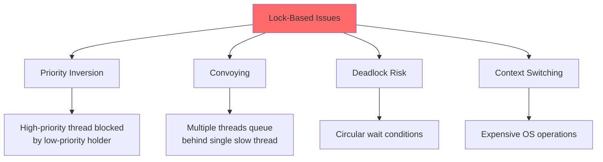
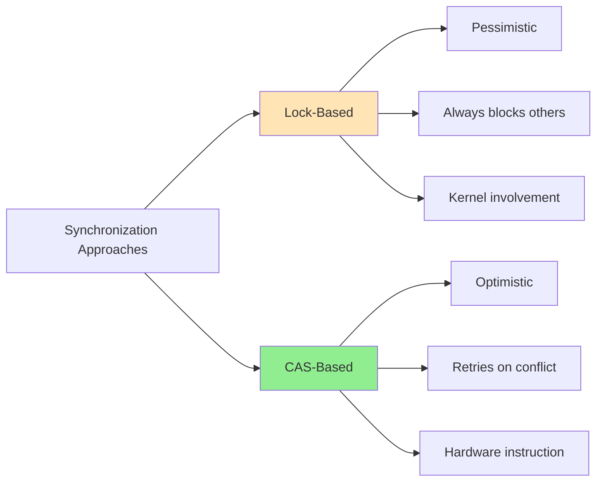
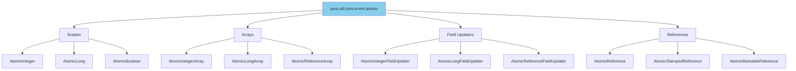
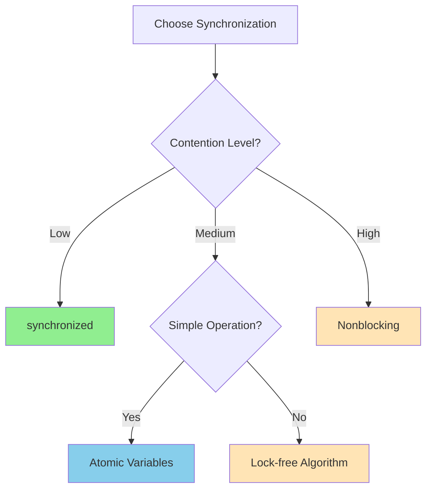

# ⚛️ Chapter 15: Atomic Variables and Nonblocking Synchronization

> **Master lock-free programming with atomic variables, compare-and-swap operations, and nonblocking algorithms for maximum performance and scalability.**

---

## 🎯 Learning Objectives

By the end of this chapter, you will be able to:

- ✅ Understand the disadvantages of lock-based synchronization
- ✅ Master compare-and-swap (CAS) operations
- ✅ Use atomic variable classes effectively
- ✅ Implement nonblocking algorithms and data structures
- ✅ Understand the ABA problem and solutions
- ✅ Apply lock-free techniques for high-performance systems
- ✅ Choose between blocking and nonblocking approaches

---

## 📚 Prerequisites

- ✅ **Locking** (Chapters 2, 13) - synchronized, ReentrantLock
- ✅ **Performance** (Chapter 11) - Lock contention, scalability
- ✅ **Memory Model** - Visibility, happens-before (preview of Chapter 16)
- ✅ **Hardware Architecture** - CPU caches, atomic operations

---

## 📋 Table of Contents

1. [Disadvantages of Locking](#-151-disadvantages-of-locking)
2. [Hardware Support for Concurrency](#-152-hardware-support-for-concurrency)
3. [Atomic Variable Classes](#-153-atomic-variable-classes)
4. [Nonblocking Algorithms](#-154-nonblocking-algorithms)
5. [Practical Examples](#-practical-examples)
6. [Common Pitfalls](#-common-pitfalls)
7. [Best Practices](#-best-practices)
8. [Summary](#-summary)

---

## 🔒 15.1 Disadvantages of Locking

### **Problems with Lock-Based Synchronization**



### **Priority Inversion**

```java
/**
 * Example: Priority inversion scenario
 */
public class PriorityInversionExample {
    private final Object lock = new Object();
    
    // Low priority thread holds lock
    class LowPriorityTask implements Runnable {
        public void run() {
            synchronized (lock) {
                // Long-running operation
                expensiveComputation();
            }
        }
    }
    
    // High priority thread blocked by low priority
    class HighPriorityTask implements Runnable {
        public void run() {
            synchronized (lock) {  // ← Blocked by low priority!
                criticalOperation();
            }
        }
    }
    
    private void expensiveComputation() { /* ... */ }
    private void criticalOperation() { /* ... */ }
}
```

### **Lock Convoying**

```
┌────────────────────────────────────────────────────────┐
│ Lock Convoying: Thread Performance Degradation         │
│                                                          │
│ Time →                                                   │
│                                                          │
│ Thread A: [■■■■■■■■■■■■■■■■■■■■] (holds lock long)     │
│ Thread B: [···········■] (blocked, then quick)          │
│ Thread C: [···············■] (blocked, then quick)      │
│ Thread D: [·················■] (blocked, then quick)    │
│                                                          │
│ Result: All threads slow down to speed of slowest!     │
└────────────────────────────────────────────────────────┘
```

---

## 🔧 15.2 Hardware Support for Concurrency

### **Compare-and-Swap (CAS) Operation**

Modern processors provide atomic compare-and-swap instructions:

```java
/**
 * Simulated CAS operation (actual implementation is native)
 */
public class SimulatedCAS {
    
    /**
     * CAS: Atomically compares and swaps value
     * 
     * if (variable == expectedValue) {
     *     variable = newValue;
     *     return true;
     * } else {
     *     return false;
     * }
     */
    public synchronized boolean compareAndSwap(
            AtomicReference<Integer> variable,
            int expectedValue,
            int newValue) {
        
        int currentValue = variable.get();
        if (currentValue == expectedValue) {
            variable.set(newValue);
            return true;  // ✅ Success
        }
        return false;  // ❌ Failed (value changed)
    }
}
```

### **CAS vs. Locking**



| Aspect | **Locking** | **CAS** |
|--------|-------------|---------|
| **Approach** | Pessimistic | Optimistic |
| **Blocking** | Yes, always | No (retry on failure) |
| **Deadlock** | Possible | Impossible |
| **Priority Inversion** | Yes | No |
| **Context Switch** | Frequent | Rare |
| **Performance** | Good for low contention | Better for moderate contention |
| **Complexity** | Simple to use | Requires careful coding |

---

### **Hardware Instructions**

```
┌─────────────────────────────────────────────────────┐
│ CPU Atomic Instructions                              │
│                                                       │
│ x86/x64:                                             │
│   CMPXCHG  (Compare and Exchange)                   │
│   LOCK prefix (Memory barrier + atomicity)          │
│                                                       │
│ ARM:                                                 │
│   LDREX/STREX (Load/Store Exclusive)               │
│                                                       │
│ SPARC:                                               │
│   CAS/CASX (Compare and Swap)                       │
│                                                       │
│ All provide single-instruction atomicity!           │
└─────────────────────────────────────────────────────┘
```

---

## ⚛️ 15.3 Atomic Variable Classes

### **Atomic Variable Family**



### **AtomicInteger Example**

```java
/**
 * Using AtomicInteger for thread-safe counter
 */
public class AtomicCounter {
    private final AtomicInteger count = new AtomicInteger(0);
    
    public void increment() {
        count.incrementAndGet();  // ✅ Atomic, lock-free
    }
    
    public void decrement() {
        count.decrementAndGet();
    }
    
    public int get() {
        return count.get();
    }
    
    /**
     * Conditional increment (only if less than max)
     */
    public boolean incrementIfLessThan(int max) {
        while (true) {
            int current = count.get();
            if (current >= max) {
                return false;  // ❌ At maximum
            }
            
            // Try to CAS from current to current+1
            if (count.compareAndSet(current, current + 1)) {
                return true;  // ✅ Success
            }
            // CAS failed, retry (optimistic approach)
        }
    }
}
```

### **Performance Comparison: Atomic vs. Synchronized**

```java
/**
 * Benchmark: Atomic vs. Synchronized
 */
public class AtomicVsSynchronizedBenchmark {
    
    static class SynchronizedCounter {
        private int count = 0;
        
        public synchronized void increment() {
            count++;
        }
        
        public synchronized int get() {
            return count;
        }
    }
    
    static class AtomicCounterImpl {
        private final AtomicInteger count = new AtomicInteger(0);
        
        public void increment() {
            count.incrementAndGet();
        }
        
        public int get() {
            return count.get();
        }
    }
    
    public static void main(String[] args) throws Exception {
        int threads = Runtime.getRuntime().availableProcessors();
        int iterations = 1_000_000;
        
        // Test synchronized
        SynchronizedCounter syncCounter = new SynchronizedCounter();
        long syncTime = benchmark(threads, iterations, 
            () -> syncCounter.increment());
        
        // Test atomic
        AtomicCounterImpl atomicCounter = new AtomicCounterImpl();
        long atomicTime = benchmark(threads, iterations,
            () -> atomicCounter.increment());
        
        System.out.printf("Synchronized: %d ms%n", syncTime);
        System.out.printf("Atomic:       %d ms%n", atomicTime);
        System.out.printf("Speedup:      %.2fx%n", 
                         syncTime / (double) atomicTime);
    }
    
    private static long benchmark(int threads, int iterations, 
                                 Runnable task) throws Exception {
        CyclicBarrier barrier = new CyclicBarrier(threads + 1);
        Thread[] threadArray = new Thread[threads];
        
        for (int i = 0; i < threads; i++) {
            threadArray[i] = new Thread(() -> {
                try {
                    barrier.await();  // Start together
                    for (int j = 0; j < iterations; j++) {
                        task.run();
                    }
                } catch (Exception e) {
                    throw new RuntimeException(e);
                }
            });
            threadArray[i].start();
        }
        
        long start = System.currentTimeMillis();
        barrier.await();  // Release threads
        
        for (Thread t : threadArray) {
            t.join();
        }
        
        return System.currentTimeMillis() - start;
    }
}
```

**Typical Results:**
- **Low contention** (1-2 threads): Similar performance
- **Moderate contention** (4-8 threads): Atomic 2-3x faster
- **High contention** (16+ threads): Atomic 5-10x faster

---

### **AtomicReference for Object Updates**

```java
/**
 * Thread-safe immutable update pattern
 */
public class AtomicReferenceExample {
    
    static class ImmutableState {
        final int value1;
        final int value2;
        
        ImmutableState(int value1, int value2) {
            this.value1 = value1;
            this.value2 = value2;
        }
    }
    
    private final AtomicReference<ImmutableState> stateRef =
        new AtomicReference<>(new ImmutableState(0, 0));
    
    /**
     * Update both values atomically
     */
    public void updateBoth(int newValue1, int newValue2) {
        while (true) {
            ImmutableState current = stateRef.get();
            ImmutableState newState = new ImmutableState(newValue1, newValue2);
            
            if (stateRef.compareAndSet(current, newState)) {
                return;  // ✅ Success
            }
            // Retry on failure
        }
    }
    
    public ImmutableState getState() {
        return stateRef.get();
    }
}
```

---

## 🚀 15.4 Nonblocking Algorithms

### **Nonblocking Stack (Treiber's Algorithm)**

```java
/**
 * Lock-free stack using Treiber's algorithm
 */
public class NonblockingStack<E> {
    
    private static class Node<E> {
        final E item;
        Node<E> next;
        
        Node(E item) {
            this.item = item;
        }
    }
    
    private final AtomicReference<Node<E>> top = 
        new AtomicReference<>();
    
    /**
     * Push element onto stack (lock-free)
     */
    public void push(E item) {
        Node<E> newHead = new Node<>(item);
        
        while (true) {
            Node<E> oldHead = top.get();
            newHead.next = oldHead;
            
            // Try to CAS top from oldHead to newHead
            if (top.compareAndSet(oldHead, newHead)) {
                return;  // ✅ Success
            }
            // CAS failed, retry
        }
    }
    
    /**
     * Pop element from stack (lock-free)
     */
    public E pop() {
        while (true) {
            Node<E> oldHead = top.get();
            
            if (oldHead == null) {
                return null;  // Stack is empty
            }
            
            Node<E> newHead = oldHead.next;
            
            // Try to CAS top from oldHead to newHead
            if (top.compareAndSet(oldHead, newHead)) {
                return oldHead.item;  // ✅ Success
            }
            // CAS failed, retry
        }
    }
}
```

**Algorithm Analysis:**
- ✅ **Lock-free:** No thread can block another
- ✅ **Wait-free progress:** System-wide progress guaranteed
- ✅ **Linearizable:** Operations appear atomic
- ⚠️ **ABA Problem:** Requires careful handling (see below)

---

### **Nonblocking Queue (Michael-Scott Algorithm)**

```java
/**
 * Lock-free queue using Michael-Scott algorithm
 */
public class NonblockingQueue<E> {
    
    private static class Node<E> {
        final E item;
        final AtomicReference<Node<E>> next;
        
        Node(E item, Node<E> next) {
            this.item = item;
            this.next = new AtomicReference<>(next);
        }
    }
    
    private final Node<E> dummy = new Node<>(null, null);
    private final AtomicReference<Node<E>> head = 
        new AtomicReference<>(dummy);
    private final AtomicReference<Node<E>> tail = 
        new AtomicReference<>(dummy);
    
    /**
     * Enqueue element (lock-free)
     */
    public void enqueue(E item) {
        Node<E> newNode = new Node<>(item, null);
        
        while (true) {
            Node<E> curTail = tail.get();
            Node<E> tailNext = curTail.next.get();
            
            if (curTail == tail.get()) {  // Still consistent?
                if (tailNext != null) {
                    // Tail is lagging, advance it
                    tail.compareAndSet(curTail, tailNext);
                } else {
                    // Try to link new node
                    if (curTail.next.compareAndSet(null, newNode)) {
                        // Success, try to advance tail
                        tail.compareAndSet(curTail, newNode);
                        return;  // ✅ Success
                    }
                }
            }
        }
    }
    
    /**
     * Dequeue element (lock-free)
     */
    public E dequeue() {
        while (true) {
            Node<E> curHead = head.get();
            Node<E> curTail = tail.get();
            Node<E> headNext = curHead.next.get();
            
            if (curHead == head.get()) {  // Still consistent?
                if (curHead == curTail) {
                    if (headNext == null) {
                        return null;  // Queue is empty
                    }
                    // Tail is lagging, advance it
                    tail.compareAndSet(curTail, headNext);
                } else {
                    // Read value before CAS
                    E item = headNext.item;
                    
                    // Try to swing head
                    if (head.compareAndSet(curHead, headNext)) {
                        return item;  // ✅ Success
                    }
                }
            }
        }
    }
}
```

---

### **The ABA Problem**

```java
/**
 * Demonstrating the ABA problem
 */
public class ABAProblemExample {
    
    /**
     * PROBLEM: Stack with ABA issue
     */
    static class ProblematicStack<E> {
        private final AtomicReference<Node<E>> top = 
            new AtomicReference<>();
        
        static class Node<E> {
            E item;
            Node<E> next;
            
            Node(E item, Node<E> next) {
                this.item = item;
                this.next = next;
            }
        }
        
        public E pop() {
            while (true) {
                Node<E> oldTop = top.get();      // Read A
                if (oldTop == null) return null;
                
                Node<E> newTop = oldTop.next;
                
                // Problem: Between read and CAS:
                // - Another thread pops A
                // - Another thread pops B  
                // - Another thread pushes A back (same object!)
                // CAS succeeds but stack is corrupted!
                
                if (top.compareAndSet(oldTop, newTop)) {  // A→B CAS
                    return oldTop.item;
                }
            }
        }
    }
    
    /**
     * SOLUTION: Use AtomicStampedReference
     */
    static class SafeStack<E> {
        private final AtomicStampedReference<Node<E>> top =
            new AtomicStampedReference<>(null, 0);
        
        static class Node<E> {
            E item;
            Node<E> next;
            
            Node(E item, Node<E> next) {
                this.item = item;
                this.next = next;
            }
        }
        
        public void push(E item) {
            Node<E> newNode = new Node<>(item, null);
            int[] stampHolder = new int[1];
            
            while (true) {
                Node<E> oldTop = top.get(stampHolder);
                int oldStamp = stampHolder[0];
                
                newNode.next = oldTop;
                
                // CAS with stamp increment
                if (top.compareAndSet(oldTop, newNode, 
                                     oldStamp, oldStamp + 1)) {
                    return;  // ✅ Success
                }
            }
        }
        
        public E pop() {
            int[] stampHolder = new int[1];
            
            while (true) {
                Node<E> oldTop = top.get(stampHolder);
                int oldStamp = stampHolder[0];
                
                if (oldTop == null) return null;
                
                Node<E> newTop = oldTop.next;
                
                // CAS with stamp check - detects ABA!
                if (top.compareAndSet(oldTop, newTop,
                                     oldStamp, oldStamp + 1)) {
                    return oldTop.item;  // ✅ Success
                }
            }
        }
    }
}
```

**ABA Problem Solutions:**
1. **AtomicStampedReference** - Version number with each update
2. **AtomicMarkableReference** - Boolean mark with each update
3. **Garbage Collection** - Prevents object reuse
4. **Hazard Pointers** - Advanced technique for manual memory management

---

## ✅ Best Practices

### **When to Use Nonblocking Algorithms**



**Use Nonblocking When:**
- ✅ High contention expected
- ✅ Priority inversion unacceptable
- ✅ Deadlock-freedom required
- ✅ Maximum scalability needed
- ✅ Simple atomic operations sufficient

**Use Locking When:**
- ✅ Low contention
- ✅ Complex critical sections
- ✅ Simplicity preferred
- ✅ Coordinating multiple variables
- ✅ Blocking semantics needed

---

## 📝 Summary

### **Key Takeaways**

| Topic | Key Point |
|-------|-----------|
| **CAS** | Hardware-supported atomic compare-and-swap |
| **Atomic Variables** | Lock-free, volatile-like semantics with atomicity |
| **Nonblocking Algorithms** | No thread can block another, maximum scalability |
| **ABA Problem** | Use stamped/markable references for safety |
| **Trade-offs** | Complexity vs. performance, use judiciously |

### **Performance Characteristics**

```
Contention vs. Performance

Performance
    ↑
    │               Nonblocking ─────────
    │          ╱────
    │     ╱────     
    │╱────          
    │               synchronized ───────
    │          ────╱
    │     ────╱    
    │────╱         
    └──────────────────────────────────> Contention
    Low          Medium           High
```

---

## 🔗 What's Next?

### **Chapter 16: The Java Memory Model**
Understanding memory semantics:
- Happens-before relationships
- Publication safety
- Initialization guarantees
- Memory model specification

---

**[← Previous: Chapter 14 - Custom Synchronizers](./14-custom-synchronizers.md)** | **[Back to README](./README.md)** | **[Next: Chapter 16 - Java Memory Model →](./16-memory-model.md)**

---

*Nonblocking algorithms offer ultimate performance but require careful design. Master CAS first!* ⚛️🚀
