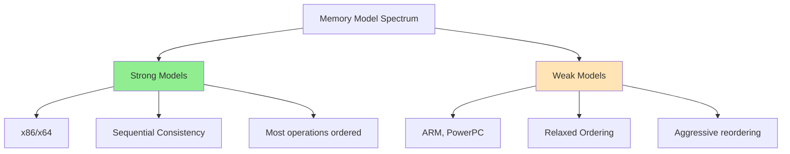
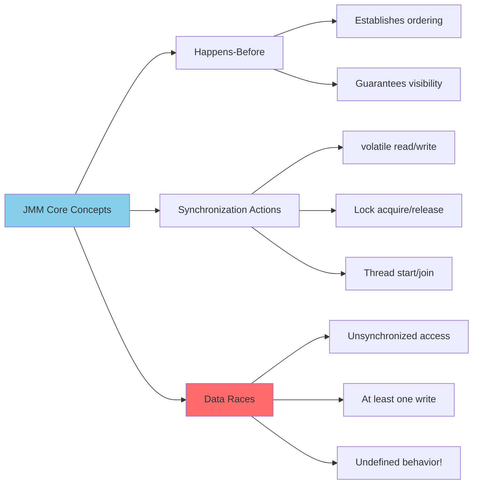
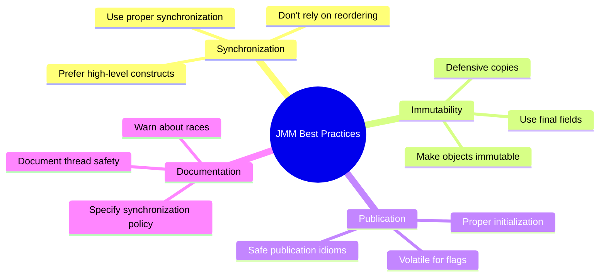

# 🧠 Chapter 16: The Java Memory Model

> **Master the Java Memory Model (JMM) - understanding happens-before relationships, publication safety, and the foundation of all Java concurrency guarantees.**

---

## 🎯 Learning Objectives

By the end of this chapter, you will be able to:

- ✅ Understand what a memory model is and why it's essential
- ✅ Apply happens-before relationships correctly
- ✅ Reason about publication safety and visibility
- ✅ Understand initialization safety guarantees
- ✅ Avoid common memory model pitfalls (DCL, etc.)
- ✅ Write correct concurrent code based on JMM guarantees
- ✅ Understand the foundation of all synchronization in Java

---

## 📚 Prerequisites

- ✅ **All Previous Chapters** - This builds on everything
- ✅ **Synchronization** - synchronized, volatile, locks
- ✅ **Atomic Variables** (Chapter 15) - CAS operations
- ✅ **Basic Computer Architecture** - CPU caches, memory hierarchy

---

## 📋 Table of Contents

1. [What is a Memory Model?](#-161-what-is-a-memory-model)
2. [Publication](#-162-publication)
3. [Initialization Safety](#-163-initialization-safety)
4. [Practical Examples](#-practical-examples)
5. [Common Pitfalls](#-common-pitfalls)
6. [Best Practices](#-best-practices)
7. [Summary](#-summary)

---

## 🔍 16.1 What is a Memory Model, and Why Would I Want One?

### **The Problem: Memory Inconsistency**

Without a memory model, this seemingly simple program could behave unexpectedly:

```java
/**
 * DANGER: Without proper synchronization, this can fail!
 */
public class PossibleReordering {
    static int x = 0, y = 0;
    static int a = 0, b = 0;
    
    public static void main(String[] args) throws InterruptedException {
        Thread one = new Thread(() -> {
            a = 1;  // Write 1
            x = b;  // Read 2
        });
        
        Thread two = new Thread(() -> {
            b = 1;  // Write 3
            y = a;  // Read 4
        });
        
        one.start();
        two.start();
        one.join();
        two.join();
        
        // Possible outcomes:
        // x=0, y=1  ✅ Thread one first
        // x=1, y=0  ✅ Thread two first
        // x=1, y=1  ✅ Interleaved
        // x=0, y=0  😱 WTF?! But possible due to reordering!
    }
}
```

**Why x=0, y=0 is possible:**
- Compiler/CPU can reorder independent operations
- Without synchronization, no guarantees about visibility or ordering

---

### **Platform Memory Models**



| Architecture | **Ordering Guarantees** | **Optimization** |
|--------------|------------------------|------------------|
| **x86/x64** | Strong (TSO - Total Store Order) | Less aggressive |
| **ARM** | Weak | Very aggressive |
| **PowerPC** | Weak | Very aggressive |
| **SPARC TSO** | Strong | Moderate |

**Java's Solution:** The JMM provides consistent guarantees across ALL platforms!

---

### **The Java Memory Model in 500 Words**

The JMM specifies:

1. **When actions are visible to other threads**
2. **What orderings are guaranteed**
3. **What optimizations are allowed**



---

### **Happens-Before Relationships**

**Definition:** Action A happens-before action B if:
- A's effects are visible to B
- A is ordered before B

**Key Happens-Before Rules:**

```java
/**
 * Demonstrating happens-before rules
 */
public class HappensBeforeRules {
    
    /**
     * 1. PROGRAM ORDER RULE
     * Each action happens-before every subsequent action in the same thread
     */
    void programOrder() {
        int x = 1;  // A
        int y = 2;  // B (happens-after A in program order)
        int z = 3;  // C (happens-after B in program order)
    }
    
    /**
     * 2. MONITOR LOCK RULE
     * Unlock happens-before every subsequent lock on the same monitor
     */
    private final Object lock = new Object();
    private int sharedValue;
    
    void monitorLockRule() {
        // Thread A
        synchronized (lock) {
            sharedValue = 42;  // A
        }  // Unlock (H)
        
        // Thread B (later)
        synchronized (lock) {  // Lock (happens-after H)
            int value = sharedValue;  // B (sees A's write!)
        }
    }
    
    /**
     * 3. VOLATILE VARIABLE RULE
     * Write to volatile happens-before every subsequent read
     */
    private volatile boolean flag;
    private int data;
    
    void volatileRule() {
        // Thread A
        data = 42;        // A
        flag = true;      // B (volatile write)
        
        // Thread B (later)
        if (flag) {       // C (volatile read, happens-after B)
            int value = data;  // D (sees A's write!)
        }
    }
    
    /**
     * 4. THREAD START RULE
     * Thread.start() happens-before first action in started thread
     */
    void threadStartRule() {
        int x = 42;  // A
        
        Thread t = new Thread(() -> {
            int y = x;  // B (sees A's write due to start)
        });
        
        t.start();  // happens-before B
    }
    
    /**
     * 5. THREAD TERMINATION RULE
     * Last action in thread happens-before Thread.join() returns
     */
    void threadTerminationRule() throws InterruptedException {
        final int[] result = new int[1];
        
        Thread t = new Thread(() -> {
            result[0] = 42;  // A
        });  // Last action happens-before join returns
        
        t.start();
        t.join();
        
        int value = result[0];  // B (sees A's write!)
    }
    
    /**
     * 6. TRANSITIVITY RULE
     * If A happens-before B, and B happens-before C,
     * then A happens-before C
     */
    private volatile boolean ready;
    private int answer;
    
    void transitivityRule() {
        // Thread A
        answer = 42;      // A
        ready = true;     // B (happens-after A by program order)
        
        // Thread B
        if (ready) {      // C (happens-after B by volatile rule)
            int value = answer;  // D (sees A by transitivity!)
        }
    }
}
```

---

### **Synchronization-Order Consistency**

```
┌─────────────────────────────────────────────────────────┐
│ Synchronization Creates Happens-Before Edges            │
│                                                           │
│ Thread A                    Thread B                     │
│ ────────                    ────────                     │
│ write x = 1                                              │
│ write y = 2                                              │
│ synchronized(lock) {        synchronized(lock) {         │
│   write z = 3 ──────────────→ read z                    │
│ } (unlock)                  } (lock)                     │
│                             read x ← sees write!         │
│                             read y ← sees write!         │
│                                                           │
│ Lock acts as memory barrier, making prior writes visible│
└─────────────────────────────────────────────────────────┘
```

---

### **Piggybacking on Synchronization**

```java
/**
 * Using existing synchronization for visibility
 */
public class PiggybackingSynchronization {
    
    /**
     * FutureTask's get() provides synchronization
     */
    static class FutureTaskExample {
        public void example() {
            FutureTask<String> task = new FutureTask<>(() -> {
                // Prepare data
                return "result";
            });
            
            new Thread(task).start();
            
            try {
                String result = task.get();  // Synchronization point!
                // All writes before task completion are visible here
            } catch (Exception e) {
                e.printStackTrace();
            }
        }
    }
    
    /**
     * BlockingQueue provides happens-before guarantees
     */
    static class BlockingQueueExample {
        private final BlockingQueue<Data> queue = 
            new LinkedBlockingQueue<>();
        
        // Producer thread
        void produce(Data data) throws InterruptedException {
            // All these writes happen-before queue.put()
            data.field1 = 1;
            data.field2 = 2;
            queue.put(data);  // Synchronization point!
        }
        
        // Consumer thread
        void consume() throws InterruptedException {
            Data data = queue.take();  // Synchronization point!
            // All producer's writes are visible here!
            assert data.field1 == 1;
            assert data.field2 == 2;
        }
    }
    
    static class Data {
        int field1, field2;
    }
}
```

---

## 📤 16.2 Publication

### **Unsafe Publication**

```java
/**
 * DANGER: Unsafe publication can expose partially constructed objects
 */
public class UnsafePublication {
    private Resource resource;
    
    /**
     * BROKEN: Race condition in publication
     */
    public void initializeResource() {
        resource = new Resource();  // ❌ Not thread-safe!
    }
    
    public Resource getResource() {
        // Another thread might see partially constructed Resource!
        return resource;
    }
    
    static class Resource {
        private final int value;
        
        Resource() {
            // Problem: Another thread might see 'this' before
            // constructor completes!
            this.value = 42;
        }
    }
}
```

**What can go wrong:**

```
Thread A                      Thread B
────────                      ────────
Allocate Resource object
Set Resource.value = 0
                             Read resource (not null!)
                             Read resource.value (0! Not 42!)
Set Resource.value = 42
Constructor completes
```

---

### **Safe Publication Idioms**

```java
/**
 * Safe publication techniques
 */
public class SafePublication {
    
    /**
     * 1. STATIC INITIALIZER
     */
    private static final Resource STATIC_RESOURCE = new Resource();
    
    /**
     * 2. VOLATILE FIELD
     */
    private volatile Resource volatileResource;
    
    public void initializeVolatile() {
        volatileResource = new Resource();  // ✅ Safe
    }
    
    /**
     * 3. ATOMIC REFERENCE
     */
    private final AtomicReference<Resource> atomicResource = 
        new AtomicReference<>();
    
    public void initializeAtomic() {
        atomicResource.set(new Resource());  // ✅ Safe
    }
    
    /**
     * 4. SYNCHRONIZED
     */
    private Resource synchronizedResource;
    
    public synchronized void initializeSynchronized() {
        synchronizedResource = new Resource();  // ✅ Safe
    }
    
    public synchronized Resource getSynchronizedResource() {
        return synchronizedResource;  // ✅ Safe
    }
    
    /**
     * 5. FINAL FIELD (from constructor)
     */
    private final Resource finalResource;
    
    public SafePublication() {
        finalResource = new Resource();  // ✅ Safe
    }
    
    /**
     * 6. CONCURRENT COLLECTION
     */
    private final ConcurrentHashMap<String, Resource> map = 
        new ConcurrentHashMap<>();
    
    public void initializeInMap() {
        map.put("key", new Resource());  // ✅ Safe
    }
    
    static class Resource {
        private final int value = 42;
    }
}
```

---

### **Safe Initialization Idioms**

```java
/**
 * Common safe initialization patterns
 */
public class SafeInitialization {
    
    /**
     * 1. EAGER INITIALIZATION
     */
    static class EagerInitialization {
        private static final Resource resource = new Resource();
        
        public static Resource getInstance() {
            return resource;  // ✅ Thread-safe, initialized at class load
        }
    }
    
    /**
     * 2. LAZY INITIALIZATION HOLDER CLASS IDIOM
     */
    static class LazyInitialization {
        private static class ResourceHolder {
            static final Resource resource = new Resource();
        }
        
        public static Resource getInstance() {
            return ResourceHolder.resource;  // ✅ Thread-safe lazy init
        }
    }
    
    /**
     * 3. DOUBLE-CHECKED LOCKING (CORRECT VERSION)
     */
    static class DoubleCheckedLocking {
        private volatile Resource resource;  // ← volatile is ESSENTIAL!
        
        public Resource getInstance() {
            Resource r = resource;
            if (r == null) {  // First check (no locking)
                synchronized (this) {
                    r = resource;
                    if (r == null) {  // Second check (with lock)
                        r = new Resource();
                        resource = r;
                    }
                }
            }
            return r;
        }
    }
    
    /**
     * 4. THREAD-SAFE LAZY INITIALIZATION (SIMPLE)
     */
    static class SynchronizedLazy {
        private Resource resource;
        
        public synchronized Resource getInstance() {
            if (resource == null) {
                resource = new Resource();
            }
            return resource;  // ✅ Simple but less performant
        }
    }
    
    static class Resource {
        final int value = 42;
    }
}
```

---

### **Double-Checked Locking: The Broken Pattern**

```java
/**
 * DANGER: Classic DCL bug (without volatile)
 */
public class BrokenDoubleCheckedLocking {
    private Resource resource;  // ❌ NOT volatile!
    
    /**
     * BROKEN: Don't use this!
     */
    public Resource getInstance() {
        if (resource == null) {  // Check 1
            synchronized (this) {
                if (resource == null) {  // Check 2
                    resource = new Resource();  // ❌ BROKEN!
                    // Another thread might see partially constructed object!
                }
            }
        }
        return resource;
    }
    
    static class Resource {
        final int value = 42;
    }
}
```

**Why it's broken:**

```
Thread A                               Thread B
────────                               ────────
Check resource == null (yes)
Enter synchronized
Check resource == null (yes)
Allocate Resource memory
Assign resource = memory address  ──→  Check resource == null (NO!)
                                       Return resource
                                       Read resource.value (0! Not 42!)
Initialize Resource.value = 42
```

**The Fix:** Make field `volatile`!

```java
private volatile Resource resource;  // ✅ Prevents reordering
```

---

## 🛡️ 16.3 Initialization Safety

### **Final Fields and Initialization Safety**

```java
/**
 * Final fields provide initialization safety guarantees
 */
public class InitializationSafety {
    
    /**
     * SAFE: Final fields guarantee visibility after construction
     */
    static class ImmutableHolder {
        private final int value;
        private final String name;
        
        public ImmutableHolder(int value, String name) {
            this.value = value;
            this.name = name;
            // After constructor completes, all final fields are
            // guaranteed visible to all threads!
        }
        
        public int getValue() {
            return value;  // ✅ Always sees initialized value
        }
        
        public String getName() {
            return name;  // ✅ Always sees initialized value
        }
    }
    
    /**
     * UNSAFE: Non-final fields don't have this guarantee
     */
    static class MutableHolder {
        private int value;  // ❌ Not final
        private String name;  // ❌ Not final
        
        public MutableHolder(int value, String name) {
            this.value = value;
            this.name = name;
            // Without synchronization, other threads might see
            // default values (0, null) even after construction!
        }
    }
    
    /**
     * Example: Safely publishing immutable objects
     */
    static class SafePublisher {
        private ImmutableHolder holder;
        
        public void initialize() {
            // No synchronization needed!
            holder = new ImmutableHolder(42, "answer");
        }
        
        public ImmutableHolder getHolder() {
            // Even without synchronization, will see fully
            // constructed object (but might see null or old reference)
            return holder;
        }
    }
}
```

**Initialization Safety Rules:**

1. **Final fields:** Guaranteed visible after construction
2. **Non-final fields:** No guarantees without synchronization
3. **Final reference:** Object referred to is also safely published

---

### **Immutable Objects Are Thread-Safe**

```java
/**
 * Properly constructed immutable objects are inherently thread-safe
 */
public final class ImmutableValue {
    private final int value;
    private final String name;
    private final List<String> tags;
    
    public ImmutableValue(int value, String name, List<String> tags) {
        this.value = value;
        this.name = name;
        // Defensive copy ensures immutability
        this.tags = new ArrayList<>(tags);
    }
    
    public int getValue() {
        return value;
    }
    
    public String getName() {
        return name;
    }
    
    public List<String> getTags() {
        // Return unmodifiable view
        return Collections.unmodifiableList(tags);
    }
    
    /**
     * Thread-safe usage without synchronization
     */
    public static void example() {
        ImmutableValue value = new ImmutableValue(42, "answer", 
                                                  List.of("tag1", "tag2"));
        
        // Can be safely published and shared across threads
        // No synchronization needed!
    }
}
```

---

## ✅ Best Practices

### **Memory Model Guidelines**



---

### **Quick Reference: Synchronization Guarantees**

| Mechanism | **Visibility** | **Ordering** | **Atomicity** | **Use Case** |
|-----------|---------------|-------------|--------------|--------------|
| **synchronized** | ✅ Full | ✅ Full | ✅ Block | General purpose |
| **volatile** | ✅ Full | ✅ Partial | ❌ No | Flags, state |
| **final** | ✅ After constructor | ✅ Initialization | ❌ No | Immutable fields |
| **AtomicXxx** | ✅ Full | ✅ For that variable | ✅ Single variable | Counters, references |
| **Lock** | ✅ Full | ✅ Full | ✅ Block | Explicit control |
| **Concurrent collections** | ✅ Full | ✅ Full | ✅ Operations | Data structures |

---

## 📝 Summary

### **Key Takeaways**

| Concept | Key Point |
|---------|-----------|
| **Memory Model** | Defines visibility and ordering guarantees |
| **Happens-Before** | Foundation of all synchronization |
| **Publication** | Must be done safely to avoid races |
| **Final Fields** | Provide initialization safety guarantees |
| **Immutability** | Inherently thread-safe when properly constructed |

### **The Three Rules of Concurrent Programming**

```
1. DON'T DO IT
   (Seriously, avoid shared mutable state if possible)

2. IF YOU MUST, DON'T SHARE IT
   (Use immutability and thread confinement)

3. IF YOU MUST SHARE IT, SYNCHRONIZE IT
   (Use proper synchronization mechanisms)
```

---

### **Happens-Before Summary**

```
Happens-Before Relationships That Matter:

1. Program Order        (within thread)
2. Monitor Lock         (synchronized)
3. Volatile Variable    (volatile read/write)
4. Thread Start         (Thread.start())
5. Thread Termination   (Thread.join())
6. Transitivity         (A→B, B→C implies A→C)
7. Interruption         (interrupt() / isInterrupted())
8. Finalizer           (Object construction → finalize())

Use these to reason about correctness!
```

---

## 🎓 Conclusion: Mastering Java Concurrency

You've now completed all 16 chapters of Java Concurrency in Practice! You've learned:

### **Part I: Fundamentals** (Chapters 1-5)
- ✅ Thread safety principles
- ✅ Sharing objects safely
- ✅ Composing thread-safe classes
- ✅ Using concurrent building blocks

### **Part II: Structuring Applications** (Chapters 6-9)
- ✅ Task execution with Executors
- ✅ Cancellation and shutdown
- ✅ Thread pool configuration
- ✅ GUI applications

### **Part III: Liveness & Performance** (Chapters 10-12)
- ✅ Avoiding deadlocks
- ✅ Performance and scalability
- ✅ Testing concurrent programs

### **Part IV: Advanced Topics** (Chapters 13-16)
- ✅ Explicit locks
- ✅ Building custom synchronizers
- ✅ Atomic variables and lock-free algorithms
- ✅ The Java Memory Model

---

## 🚀 What's Next?

Continue your concurrency journey:

1. **Practice:** Build real concurrent applications
2. **Study:** Read source code of java.util.concurrent
3. **Experiment:** Profile and optimize performance
4. **Contribute:** Help others learn concurrency
5. **Stay Current:** Follow updates in newer Java versions (Virtual Threads, etc.)

---

## 📚 Final Resources

### **Essential Reading:**
- **Java Language Specification** - Chapter 17 (Memory Model)
- **JSR 133** - Java Memory Model spec
- **Doug Lea's Website** - Concurrency papers and presentations
- **Java Concurrency in Practice** - The definitive book

### **Online Resources:**
- [OpenJDK Mailing Lists](https://mail.openjdk.java.net/)
- [Aleksey Shipilëv's Blog](https://shipilev.net/) - JVM internals
- [Martin Thompson's Blog](https://mechanical-sympathy.blogspot.com/) - Performance
- [Java Memory Model FAQ](http://www.cs.umd.edu/~pugh/java/memoryModel/)

---

**[← Previous: Chapter 15 - Atomic Variables](./15-atomic-nonblocking.md)** | **[Back to README](./README.md)**

---

*Congratulations on completing Java Concurrency in Practice! You now have the knowledge to write correct, efficient, and scalable concurrent programs.* 🎓🚀

*"Concurrency is not about threads, it's about managing access to shared, mutable state."* — Brian Goetz

---

**END OF JAVA CONCURRENCY IN PRACTICE TUTORIAL SERIES** ✨
