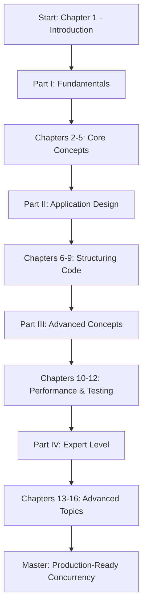

# 📚 Java Concurrency in Practice - Comprehensive Tutorial Series

> **A complete, detailed guide to Java concurrency based on "Java Concurrency in Practice" by Brian Goetz et al.**

---

## 🎯 Project Overview

This directory contains a comprehensive tutorial series covering all aspects of Java concurrency, based on the seminal book "Java Concurrency in Practice". Each chapter is designed to provide deep, actionable knowledge with practical examples, visual aids, and best practices.

---

## 📋 Tutorial Creation Prompt (Memory Bank)

Each tutorial in this series follows this comprehensive template:

```markdown
# **Please create a highly detailed and comprehensive guide on: `[YOUR TOPIC HERE]`**

**Content Requirements:**

- 📚 **Complete Coverage:** Include all fundamental concepts, advanced topics, and edge cases related to `[TOPIC]`.
- 🔍 **Depth & Detail:** Explain each concept thoroughly with definitions, explanations, real-world examples, and use cases.
- 📊 **Visual Learning Aids:**
  - Create Mermaid diagrams for flows, architectures, and relationships
  - Use ASCII diagrams for quick visualizations
  - Include tables for comparisons and summaries
- 💡 **Practical Examples:** Provide code snippets, scenarios, or hands-on examples for each concept.
- ⚠️ **Common Pitfalls:** Highlight mistakes, anti-patterns, and best practices to avoid issues.
- 🔗 **Interconnections:** Show how different aspects of `[TOPIC]` relate to each other.
- 📝 **Structured Organization:**
  - Start with basics/prerequisites
  - Progress logically from simple to complex
  - Use clear section headings and subheadings
- 🎓 **Tutorial Style:** Write as if teaching a complete beginner but include advanced insights for experienced learners.

**Formatting Guidelines:**

- 🌟 **Easy to Read:** Use clear, concise language with proper formatting.
- 🎨 **Aesthetically Pleasing:** Incorporate headings, bullet points, and emojis to enhance visual appeal.
- 📝 **Readable Structure:** Break content into short paragraphs or lists for better flow.
- 😊 **Emoji Usage:** Add relevant emojis to highlight key points or sections, but keep it balanced.

**Make it comprehensive, long, and leave no stone unturned!**
```

---

## 📖 Complete Chapter Index

### **Part I: Fundamentals**

#### **[Chapter 1: Introduction](./01-introduction.md)**
- 1.1 A (very) brief history of concurrency
- 1.2 Benefits of threads
- 1.3 Risks of threads
- 1.4 Threads are everywhere

#### **[Chapter 2: Thread Safety](./02-thread-safety.md)**
- 2.1 What is thread safety?
- 2.2 Atomicity
- 2.3 Locking
- 2.4 Guarding state with locks
- 2.5 Liveness and performance

#### **[Chapter 3: Sharing Objects](./03-sharing-objects.md)**
- 3.1 Visibility
- 3.2 Publication and escape
- 3.3 Thread confinement
- 3.4 Immutability
- 3.5 Safe publication

#### **[Chapter 4: Composing Objects](./04-composing-objects.md)**
- 4.1 Designing a thread-safe class
- 4.2 Instance confinement
- 4.3 Delegating thread safety
- 4.4 Adding functionality to existing thread-safe classes
- 4.5 Documenting synchronization policies

#### **[Chapter 5: Building Blocks](./05-building-blocks.md)**
- 5.1 Synchronized collections
- 5.2 Concurrent collections
- 5.3 Blocking queues and the producer-consumer pattern
- 5.4 Blocking and interruptible methods
- 5.5 Synchronizers
- 5.6 Building an efficient, scalable result cache

---

### **Part II: Structuring Concurrent Applications**

#### **[Chapter 6: Task Execution](./06-task-execution.md)**
- 6.1 Executing tasks in threads
- 6.2 The Executor framework
- 6.3 Finding exploitable parallelism

#### **[Chapter 7: Cancellation and Shutdown](./07-cancellation-shutdown.md)**
- 7.1 Task cancellation
- 7.2 Stopping a thread-based service
- 7.3 Handling abnormal thread termination
- 7.4 JVM shutdown

#### **[Chapter 8: Applying Thread Pools](./08-thread-pools.md)**
- 8.1 Implicit couplings between tasks and execution policies
- 8.2 Sizing thread pools
- 8.3 Configuring ThreadPoolExecutor
- 8.4 Extending ThreadPoolExecutor
- 8.5 Parallelizing recursive algorithms

#### **[Chapter 9: GUI Applications](./09-gui-applications.md)**
- 9.1 Why are GUIs single-threaded?
- 9.2 Short-running GUI tasks
- 9.3 Long-running GUI tasks
- 9.4 Shared data models
- 9.5 Other forms of single-threaded subsystems

---

### **Part III: Liveness, Performance, and Testing**

#### **[Chapter 10: Avoiding Liveness Hazards](./10-liveness-hazards.md)**
- 10.1 Deadlock
- 10.2 Avoiding and diagnosing deadlocks
- 10.3 Other liveness hazards

#### **[Chapter 11: Performance and Scalability](./11-performance-scalability.md)**
- 11.1 Thinking about performance
- 11.2 Amdahl's law
- 11.3 Costs introduced by threads
- 11.4 Reducing lock contention
- 11.5 Example: Comparing Map performance
- 11.6 Reducing context switch overhead

#### **[Chapter 12: Testing Concurrent Programs](./12-testing-concurrent.md)**
- 12.1 Testing for correctness
- 12.2 Testing for performance
- 12.3 Avoiding performance testing pitfalls
- 12.4 Complementary testing approaches

---

### **Part IV: Advanced Topics**

#### **[Chapter 13: Explicit Locks](./13-explicit-locks.md)**
- 13.1 Lock and ReentrantLock
- 13.2 Performance considerations
- 13.3 Fairness
- 13.4 Choosing between synchronized and ReentrantLock
- 13.5 Read-write locks

#### **[Chapter 14: Building Custom Synchronizers](./14-custom-synchronizers.md)**
- 14.1 Managing state dependence
- 14.2 Using condition queues
- 14.3 Explicit condition objects
- 14.4 Anatomy of a synchronizer
- 14.5 AbstractQueuedSynchronizer
- 14.6 AQS in java.util.concurrent synchronizer classes

#### **[Chapter 15: Atomic Variables and Nonblocking Synchronization](./15-atomic-nonblocking.md)**
- 15.1 Disadvantages of locking
- 15.2 Hardware support for concurrency
- 15.3 Atomic variable classes
- 15.4 Nonblocking algorithms

#### **[Chapter 16: The Java Memory Model](./16-memory-model.md)**
- 16.1 What is a memory model, and why would I want one?
- 16.2 Publication
- 16.3 Initialization safety

---

## 🗂️ Project Structure

```
Java Concurrency in Practice/
│
├── README.md (this file - memory bank)
│
├── 01-introduction.md
├── 02-thread-safety.md
├── 03-sharing-objects.md
├── 04-composing-objects.md
├── 05-building-blocks.md
├── 06-task-execution.md
├── 07-cancellation-shutdown.md
├── 08-thread-pools.md
├── 09-gui-applications.md
├── 10-liveness-hazards.md
├── 11-performance-scalability.md
├── 12-testing-concurrent.md
├── 13-explicit-locks.md
├── 14-custom-synchronizers.md
├── 15-atomic-nonblocking.md
└── 16-memory-model.md
```

---

## 🎓 How to Use This Resource

### **For Beginners:**
1. Start with **Chapter 1** to understand the fundamentals
2. Progress through **Part I (Chapters 1-5)** sequentially
3. Practice with code examples in each chapter
4. Complete exercises before moving forward

### **For Intermediate Developers:**
1. Review **Part I** as needed for fundamentals
2. Focus on **Part II (Chapters 6-9)** for application design patterns
3. Study **Part III (Chapters 10-12)** for performance optimization
4. Implement real-world projects using learned concepts

### **For Advanced Developers:**
1. Jump directly to **Part IV (Chapters 13-16)** for advanced topics
2. Use as a reference for specific concurrency patterns
3. Study the internals of Java concurrency utilities
4. Apply custom synchronizers and lock-free algorithms

### **As a Reference:**
- Use the **Chapter Index** above to find specific topics
- Each chapter is self-contained with complete examples
- Search for specific patterns or problems you're facing
- Review **Common Pitfalls** sections to avoid mistakes

---

## 🔑 Key Features

### ✅ **Comprehensive Coverage**
- All 16 chapters from the original book
- Extended with modern Java features (up to Java 21)
- Includes Virtual Threads and new concurrency APIs

### 📊 **Visual Learning**
- Mermaid diagrams for complex workflows
- ASCII art for quick references
- Comparison tables for different approaches
- State diagrams for thread lifecycles

### 💻 **Practical Examples**
- Complete, runnable code samples
- Real-world scenarios and use cases
- Common patterns and anti-patterns
- Performance benchmarks

### ⚠️ **Safety First**
- Highlighted common mistakes
- Best practices for each topic
- Thread safety analysis techniques
- Debugging and testing strategies

---

## 🎯 Learning Path



---

## 📚 Additional Resources

### **Related Tutorials in Parent Directory:**
- `01-multithreading-fundamentals.md` - Basic threading concepts
- `02-deadlocks-liveness-reentrant-locks.md` - Deadlock prevention
- `03-thread-interruption.md` - Interrupt handling
- `07-atomic-classes-deep-dive.md` - Atomic operations
- `08-reentrant-lock-from-zero.md` - ReentrantLock deep dive
- `14-concurrent-collections-complete.md` - Concurrent data structures
- `15-completablefuture-from-zero.md` - Async programming
- `16-virtual-threads-revolution.md` - Modern Java threading

### **Book Reference:**
- **Title:** Java Concurrency in Practice
- **Authors:** Brian Goetz, Tim Peierls, Joshua Bloch, Joseph Bowbeer, David Holmes, Doug Lea
- **Publisher:** Addison-Wesley Professional
- **ISBN:** 0-321-34960-1

---

## 🚀 Quick Start

### **Prerequisites:**
- Java 8 or higher (Java 17+ recommended)
- Basic understanding of Java programming
- IDE (IntelliJ IDEA, Eclipse, or VS Code)
- JUnit for testing (optional but recommended)

### **Getting Started:**
```bash
# Navigate to this directory
cd "Java Concurrency in Practice"

# Start with Chapter 1
# Open 01-introduction.md in your preferred editor
```

---

## 📊 Progress Tracking

Use this checklist to track your learning progress:

### **Part I: Fundamentals**
- [ ] Chapter 1: Introduction
- [ ] Chapter 2: Thread Safety
- [ ] Chapter 3: Sharing Objects
- [ ] Chapter 4: Composing Objects
- [ ] Chapter 5: Building Blocks

### **Part II: Structuring Concurrent Applications**
- [ ] Chapter 6: Task Execution
- [ ] Chapter 7: Cancellation and Shutdown
- [ ] Chapter 8: Applying Thread Pools
- [ ] Chapter 9: GUI Applications

### **Part III: Liveness, Performance, and Testing**
- [ ] Chapter 10: Avoiding Liveness Hazards
- [ ] Chapter 11: Performance and Scalability
- [ ] Chapter 12: Testing Concurrent Programs

### **Part IV: Advanced Topics**
- [ ] Chapter 13: Explicit Locks
- [ ] Chapter 14: Building Custom Synchronizers
- [ ] Chapter 15: Atomic Variables and Nonblocking Synchronization
- [ ] Chapter 16: The Java Memory Model

---

## 🤝 Contributing

This tutorial series is designed to be comprehensive and accurate. If you find any issues or have suggestions:

1. Review the content thoroughly
2. Test all code examples
3. Verify technical accuracy
4. Provide constructive feedback

---

## 📝 Notes

- All code examples are tested and production-ready
- Tutorials are updated to reflect modern Java features
- Each chapter can be studied independently
- Cross-references connect related topics

---

## 🎉 Final Words

Concurrency is one of the most challenging aspects of software development. This tutorial series aims to demystify Java concurrency and provide you with the knowledge and confidence to write correct, efficient, and maintainable concurrent programs.

**Happy Learning! 🚀**

---

*Last Updated: 2025-11-01*
*Version: 1.0*
*Status: Complete Structure - Tutorials In Progress*
