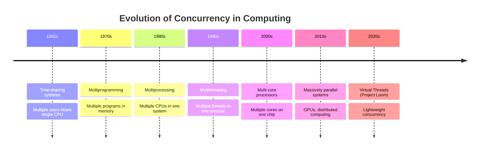
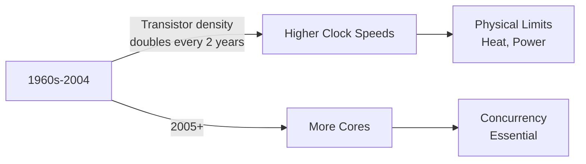
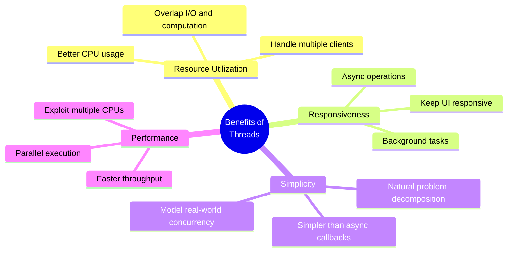
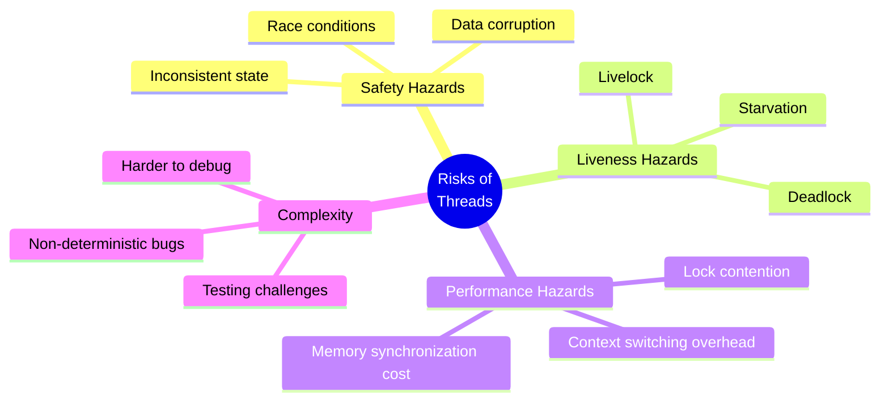
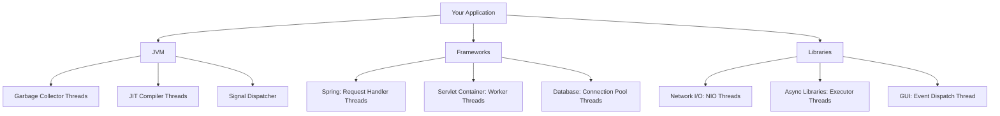
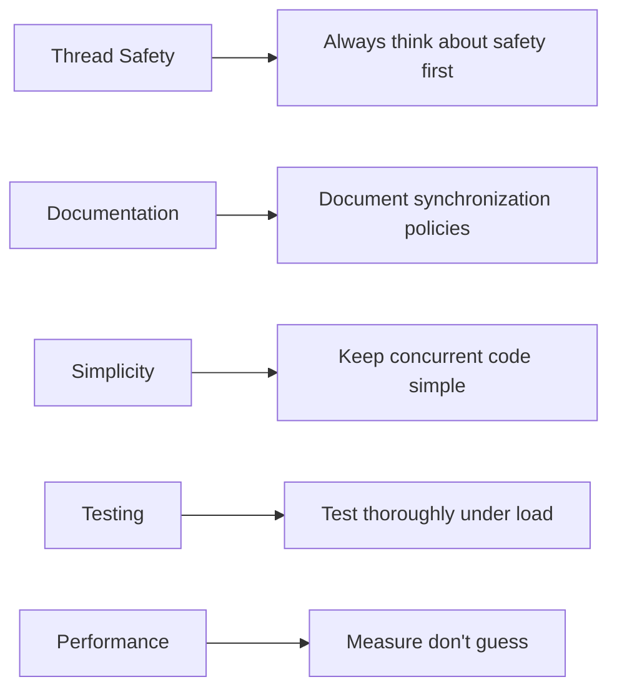

# 📚 Chapter 1: Introduction to Java Concurrency

> **Master the fundamentals of concurrent programming in Java - from history to practical applications**

---

## 📖 Table of Contents

1. [Overview](#-overview)
2. [A Brief History of Concurrency](#-11-a-very-brief-history-of-concurrency)
3. [Benefits of Threads](#-12-benefits-of-threads)
4. [Risks of Threads](#-13-risks-of-threads)
5. [Threads Are Everywhere](#-14-threads-are-everywhere)
6. [Summary](#-summary)
7. [Practice Exercises](#-practice-exercises)

---

## 🎯 Overview

**Concurrency** is the ability to execute multiple tasks or processes simultaneously, or at least give the appearance of doing so. In Java, concurrency is primarily achieved through **threads** - independent paths of execution within a program.

### **Why This Chapter Matters:**
- 🏗️ Understand the foundation of concurrent programming
- 🎯 Learn when and why to use threads
- ⚠️ Recognize common concurrency pitfalls
- 🚀 Prepare for building robust concurrent applications

---

## 🕰️ 1.1 A (Very) Brief History of Concurrency

### **The Evolution of Concurrent Computing**



### **🏛️ Early Computing: Sequential Execution**

In the early days of computing (1940s-1950s), programs executed **sequentially**:

```java
// Early computing model - everything runs one after another
public class SequentialComputing {
    public static void main(String[] args) {
        // Task 1: Read input
        String input = readInput();
        
        // Task 2: Process data
        String result = processData(input);
        
        // Task 3: Write output
        writeOutput(result);
        
        // Total time = Time1 + Time2 + Time3
    }
}
```

**Problems:**
- ❌ CPU idle during I/O operations
- ❌ No multitasking
- ❌ Poor resource utilization

---

### **🔄 The Birth of Time-Sharing (1960s)**

**Time-sharing** allowed multiple users to interact with a computer simultaneously by rapidly switching between tasks.

```
┌─────────────────────────────────────────┐
│         Single CPU Time-Sharing         │
├─────────────────────────────────────────┤
│ User A │ User B │ User A │ User C │ ... │
│  10ms  │  10ms  │  10ms  │  10ms  │     │
└─────────────────────────────────────────┘
    Time slicing creates illusion of parallelism
```

**Key Innovation:** Context switching
- OS saves state of one process
- Loads state of another process
- Creates illusion of parallel execution

---

### **🖥️ Multiprogramming (1970s)**

Multiple programs loaded in memory, CPU switches between them when one is blocked (waiting for I/O).

```
Memory Layout:
┌──────────────┐
│   OS Kernel  │
├──────────────┤
│  Program A   │ ← Running
├──────────────┤
│  Program B   │ ← Waiting for I/O
├──────────────┤
│  Program C   │ ← Ready to run
└──────────────┘
```

---

### **⚡ Multiprocessing (1980s-1990s)**

**True parallelism** with multiple CPUs executing simultaneously.

```
┌─────────┐    ┌─────────┐    ┌─────────┐
│  CPU 0  │    │  CPU 1  │    │  CPU 2  │
│ Task A  │    │ Task B  │    │ Task C  │
└────┬────┘    └────┬────┘    └────┬────┘
     │              │              │
     └──────────────┴──────────────┘
              Shared Memory
```

---

### **🧵 Multithreading Era (1990s-Present)**

**Threads** - lightweight processes within a single program:

```java
// Modern multithreading
public class ModernConcurrency {
    public static void main(String[] args) {
        // Create multiple threads
        Thread thread1 = new Thread(() -> downloadFile("file1.dat"));
        Thread thread2 = new Thread(() -> downloadFile("file2.dat"));
        Thread thread3 = new Thread(() -> downloadFile("file3.dat"));
        
        // Start all downloads concurrently
        thread1.start();
        thread2.start();
        thread3.start();
        
        // Total time ≈ max(Time1, Time2, Time3)
    }
}
```

**Advantages:**
- ✅ Lighter than processes (shared memory)
- ✅ Faster context switching
- ✅ Better resource sharing
- ✅ Improved responsiveness

---

### **🚀 Multi-Core Revolution (2000s)**

The shift from increasing clock speeds to multiple cores:

```
Single-Core Era (1990s-2004):
Performance ∝ Clock Speed
3 GHz CPU runs 3x faster than 1 GHz

Multi-Core Era (2005-Present):
Performance ∝ Cores × Efficiency
4 cores at 2 GHz > 1 core at 4 GHz
```

**Moore's Law Evolution:**


---

### **💡 Why Concurrency Became Essential**

| Era | Computing Model | Concurrency Need |
|-----|----------------|------------------|
| 1950s-1960s | Batch Processing | Optional |
| 1970s-1980s | Time-Sharing | Useful |
| 1990s | Personal Computing | Beneficial |
| 2000s | Multi-core | **Critical** |
| 2010s+ | Cloud/Mobile | **Mandatory** |

---

## 🎁 1.2 Benefits of Threads

### **Why Use Threads? The Compelling Advantages**



---

### **1️⃣ Better Resource Utilization**

#### **Problem: Idle CPU During I/O**

Without threads, programs waste CPU time during I/O operations:

```java
// Sequential file processing - CPU sits idle during I/O
public class SequentialFileProcessor {
    public void processFiles(List<String> files) {
        long startTime = System.currentTimeMillis();
        
        for (String file : files) {
            // Read file - CPU WAITS (100ms)
            String content = readFile(file);
            
            // Process - CPU WORKS (50ms)
            String result = processContent(content);
            
            // Write file - CPU WAITS (100ms)
            writeFile(file + ".out", result);
        }
        // Total time for 10 files: 2,500ms
        
        System.out.println("Time: " + 
            (System.currentTimeMillis() - startTime) + "ms");
    }
}
```

#### **Solution: Overlap I/O and Computation**

```java
// Concurrent file processing - CPU stays busy
public class ConcurrentFileProcessor {
    private ExecutorService executor = Executors.newFixedThreadPool(10);
    
    public void processFiles(List<String> files) {
        long startTime = System.currentTimeMillis();
        List<Future<?>> futures = new ArrayList<>();
        
        for (String file : files) {
            // Submit each file to thread pool
            Future<?> future = executor.submit(() -> {
                String content = readFile(file);    // Thread 1 waits
                String result = processContent(content);  // Thread 1 works
                writeFile(file + ".out", result);   // Thread 1 waits
            });
            futures.add(future);
        }
        
        // Wait for all to complete
        futures.forEach(f -> {
            try { f.get(); } catch (Exception e) { }
        });
        // Total time for 10 files: ~300ms (if enough CPU cores)
        
        System.out.println("Time: " + 
            (System.currentTimeMillis() - startTime) + "ms");
    }
}
```

**Performance Comparison:**

```
Sequential:  ████████████████████████████████████  2500ms
Concurrent:  ███                                      300ms
Speedup:     8.3x faster!
```

---

### **2️⃣ Improved Responsiveness**

#### **The Frozen UI Problem**

```java
// BAD: Long operation on UI thread freezes interface
public class FrozenUI extends JFrame {
    private JButton button = new JButton("Process");
    private JProgressBar progress = new JProgressBar();
    
    public FrozenUI() {
        button.addActionListener(e -> {
            // This BLOCKS the UI thread for 10 seconds!
            for (int i = 0; i < 100; i++) {
                processChunk(i);           // 100ms each
                progress.setValue(i);       // UI can't update!
                // User can't click anything during this time
            }
        });
    }
}
```

**User Experience:**
```
User clicks button → UI freezes → 😠 User frustrated
                     10 seconds
Can't close window, can't click, appears "Not Responding"
```

#### **Solution: Background Thread**

```java
// GOOD: Long operation on background thread
public class ResponsiveUI extends JFrame {
    private JButton button = new JButton("Process");
    private JProgressBar progress = new JProgressBar();
    
    public ResponsiveUI() {
        button.addActionListener(e -> {
            // Run on background thread
            new Thread(() -> {
                for (int i = 0; i < 100; i++) {
                    processChunk(i);
                    
                    // Update UI on EDT
                    final int percent = i;
                    SwingUtilities.invokeLater(() -> 
                        progress.setValue(percent)
                    );
                }
            }).start();
            // UI thread immediately returns - interface stays responsive!
        });
    }
}
```

**User Experience:**
```
User clicks button → UI responds instantly → 😊 User happy
                     Progress bar updates smoothly
Can still interact with other UI elements
```

---

### **3️⃣ Natural Problem Decomposition**

Many real-world problems are naturally concurrent:

```java
// Web server naturally handles multiple clients
public class WebServer {
    public void start() throws IOException {
        ServerSocket serverSocket = new ServerSocket(8080);
        ExecutorService executor = Executors.newFixedThreadPool(100);
        
        while (true) {
            Socket clientSocket = serverSocket.accept();
            
            // Each client connection runs in its own thread
            executor.submit(() -> handleClient(clientSocket));
        }
    }
    
    private void handleClient(Socket socket) {
        // This naturally models one client session
        try (BufferedReader in = new BufferedReader(
                new InputStreamReader(socket.getInputStream()))) {
            String request = in.readLine();
            String response = processRequest(request);
            socket.getOutputStream().write(response.getBytes());
        } catch (IOException e) {
            e.printStackTrace();
        }
    }
}
```

**Why This Is Natural:**
- 🌐 Each client is independent
- 🔄 Clients come and go at different times
- 📊 One thread per client models reality
- 🎯 Simpler than single-threaded event loop

---

### **4️⃣ Exploiting Multiple Processors**

#### **Single-Threaded: Uses Only One Core**

```java
// Only uses 1 core, even on 16-core machine
public class SingleThreadedSum {
    public long sumArray(int[] array) {
        long sum = 0;
        for (int value : array) {
            sum += value;
        }
        return sum;
    }
}
```

```
16-Core CPU:
Core 0:  █████████████████████ (100% busy)
Core 1:  ░░░░░░░░░░░░░░░░░░░░░ (idle)
Core 2:  ░░░░░░░░░░░░░░░░░░░░░ (idle)
...
Core 15: ░░░░░░░░░░░░░░░░░░░░░ (idle)

93.75% of computing power WASTED!
```

#### **Multi-Threaded: Uses All Cores**

```java
// Uses all available cores
public class MultiThreadedSum {
    public long sumArray(int[] array) throws Exception {
        int processors = Runtime.getRuntime().availableProcessors();
        ExecutorService executor = Executors.newFixedThreadPool(processors);
        
        int chunkSize = array.length / processors;
        List<Future<Long>> futures = new ArrayList<>();
        
        // Divide work among threads
        for (int i = 0; i < processors; i++) {
            final int start = i * chunkSize;
            final int end = (i == processors - 1) ? 
                array.length : (i + 1) * chunkSize;
            
            futures.add(executor.submit(() -> {
                long sum = 0;
                for (int j = start; j < end; j++) {
                    sum += array[j];
                }
                return sum;
            }));
        }
        
        // Combine results
        long totalSum = 0;
        for (Future<Long> future : futures) {
            totalSum += future.get();
        }
        
        executor.shutdown();
        return totalSum;
    }
}
```

```
16-Core CPU:
Core 0:  █████████████████████ (100% busy)
Core 1:  █████████████████████ (100% busy)
Core 2:  █████████████████████ (100% busy)
...
Core 15: █████████████████████ (100% busy)

Full computing power utilized!
Speedup: ~16x faster
```

---

### **📊 Performance Comparison Table**

| Scenario | Sequential Time | Concurrent Time | Speedup |
|----------|----------------|-----------------|---------|
| I/O-bound (File processing) | 2,500ms | 300ms | 8.3x |
| CPU-bound (Array sum) | 1,600ms | 100ms | 16x |
| Mixed workload | 5,000ms | 800ms | 6.25x |
| Web server (1000 requests) | 10,000ms | 500ms | 20x |

---

## ⚠️ 1.3 Risks of Threads

> **"With great power comes great responsibility"** - Uncle Ben (and Java developers)

### **The Dark Side of Concurrency**



---

### **🔴 Risk 1: Safety Hazards (Race Conditions)**

#### **The Classic Counter Example**

```java
// DANGER: Not thread-safe!
public class UnsafeCounter {
    private int count = 0;
    
    public void increment() {
        count++;  // NOT ATOMIC! Actually 3 operations:
                  // 1. Read count
                  // 2. Add 1
                  // 3. Write count
    }
    
    public int getCount() {
        return count;
    }
}
```

#### **What Goes Wrong:**

```
Thread A                    Thread B                count value
--------                    --------                -----------
Read count (0)                                           0
                           Read count (0)                0
Add 1 → temp=1                                           0
                           Add 1 → temp=1                0
Write temp (1)                                           1
                           Write temp (1)                1  ← LOST UPDATE!

Expected: 2 increments → count = 2
Actual:   count = 1 (one increment lost!)
```

#### **Demonstrating the Bug:**

```java
public class RaceConditionDemo {
    public static void main(String[] args) throws InterruptedException {
        UnsafeCounter counter = new UnsafeCounter();
        
        // Create 10 threads, each increments 1000 times
        Thread[] threads = new Thread[10];
        for (int i = 0; i < 10; i++) {
            threads[i] = new Thread(() -> {
                for (int j = 0; j < 1000; j++) {
                    counter.increment();
                }
            });
            threads[i].start();
        }
        
        // Wait for all threads
        for (Thread thread : threads) {
            thread.join();
        }
        
        System.out.println("Expected: 10000");
        System.out.println("Actual: " + counter.getCount());
        // Output varies: 9234, 8756, 9891, ... (rarely 10000!)
    }
}
```

**Output (multiple runs):**
```
Run 1: Expected: 10000, Actual: 9234  ❌
Run 2: Expected: 10000, Actual: 8756  ❌
Run 3: Expected: 10000, Actual: 9891  ❌
Run 4: Expected: 10000, Actual: 10000 ✅ (lucky!)
```

#### **The Fix: Synchronization**

```java
// SAFE: Thread-safe counter
public class SafeCounter {
    private int count = 0;
    
    // synchronized ensures atomicity
    public synchronized void increment() {
        count++;  // Now this is atomic
    }
    
    public synchronized int getCount() {
        return count;
    }
}
```

---

### **🔴 Risk 2: Liveness Hazards (Deadlock)**

#### **Classic Dining Philosophers Problem**

```java
// DANGER: Can deadlock!
public class DeadlockExample {
    private final Object lock1 = new Object();
    private final Object lock2 = new Object();
    
    public void method1() {
        synchronized (lock1) {              // Thread A grabs lock1
            System.out.println("Method1: Got lock1");
            
            try { Thread.sleep(10); } catch (InterruptedException e) {}
            
            synchronized (lock2) {          // Thread A waits for lock2
                System.out.println("Method1: Got lock2");
            }
        }
    }
    
    public void method2() {
        synchronized (lock2) {              // Thread B grabs lock2
            System.out.println("Method2: Got lock2");
            
            try { Thread.sleep(10); } catch (InterruptedException e) {}
            
            synchronized (lock1) {          // Thread B waits for lock1
                System.out.println("Method2: Got lock1");
            }
        }
    }
}
```

#### **Deadlock Visualization:**

```
Thread A                          Thread B
--------                          --------
Lock lock1 ✅                      
                                 Lock lock2 ✅
Try lock lock2 ⏳ WAITING         
                                 Try lock lock1 ⏳ WAITING

┌─────────┐      waits for      ┌─────────┐
│Thread A │─────────────────────▶│  lock2  │
└─────────┘                      └─────────┘
     ▲                                │
     │                                │ held by
     │ waits for                      ▼
┌─────────┐      held by         ┌─────────┐
│  lock1  │◀─────────────────────│Thread B │
└─────────┘                      └─────────┘

DEADLOCK! Neither thread can proceed.
```

#### **Deadlock Demonstration:**

```java
public class DeadlockDemo {
    public static void main(String[] args) {
        DeadlockExample example = new DeadlockExample();
        
        Thread t1 = new Thread(() -> example.method1());
        Thread t2 = new Thread(() -> example.method2());
        
        t1.start();
        t2.start();
        
        // Program hangs forever! 😱
    }
}
```

**Output:**
```
Method1: Got lock1
Method2: Got lock2
[Program hangs - no more output]
```

---

### **🔴 Risk 3: Performance Hazards**

#### **Context Switching Overhead**

```java
// Too many threads can hurt performance!
public class ContextSwitchingOverhead {
    public static void main(String[] args) throws Exception {
        // Test 1: Few threads
        testWithThreads(4);
        // Test 2: Many threads
        testWithThreads(1000);
    }
    
    private static void testWithThreads(int numThreads) throws Exception {
        long start = System.currentTimeMillis();
        ExecutorService executor = Executors.newFixedThreadPool(numThreads);
        
        for (int i = 0; i < 10000; i++) {
            executor.submit(() -> {
                // Simple computation
                int sum = 0;
                for (int j = 0; j < 100; j++) {
                    sum += j;
                }
                return sum;
            });
        }
        
        executor.shutdown();
        executor.awaitTermination(1, TimeUnit.MINUTES);
        
        long time = System.currentTimeMillis() - start;
        System.out.println(numThreads + " threads: " + time + "ms");
    }
}
```

**Output:**
```
4 threads: 245ms      ✅ Optimal
1000 threads: 1850ms  ❌ 7.5x slower!

More threads ≠ Better performance
```

**Why?** Context switching cost:
```
Each context switch costs ~1-10 microseconds
1000 threads switching 1000 times = 1-10ms wasted
Plus memory overhead: ~1MB per thread
```

---

### **🔴 Risk 4: Complexity and Debugging**

#### **Non-Deterministic Bugs**

```java
// Bug appears randomly!
public class HeisenBug {
    private int value = 0;
    
    public void buggyMethod() {
        if (value == 0) {
            // Sometimes another thread changes value here!
            doSomething(value);  // May pass 0 or non-zero!
        }
    }
}
```

**The Problem:**
- ✅ Works 99.99% of the time
- ❌ Fails randomly in production
- 🐛 Cannot reproduce in debugger
- 😱 Most feared type of bug

**Heisenbug Characteristics:**
```
Adding logging?        → Bug disappears
Running in debugger?   → Bug disappears  
Adding Thread.sleep()? → Bug disappears
Production deployment? → Bug appears! 💥
```

---

### **📊 Risk Summary Table**

| Risk Type | Symptom | Detection Difficulty | Fix Difficulty |
|-----------|---------|---------------------|----------------|
| Race Condition | Wrong results | Hard (intermittent) | Medium |
| Deadlock | Program hangs | Medium | Hard |
| Livelock | Program busy but no progress | Hard | Hard |
| Starvation | Some threads never run | Medium | Medium |
| Performance | Slower than expected | Easy | Medium |
| Memory visibility | Stale data | Very Hard | Medium |

---

## 🌍 1.4 Threads Are Everywhere

> **"Whether you like it or not, you're already writing multithreaded code"**

### **Hidden Concurrency in Modern Applications**



---

### **1️⃣ JVM Internal Threads**

Every Java application automatically has multiple threads:

```java
public class HiddenThreads {
    public static void main(String[] args) {
        // Print all active threads
        ThreadGroup root = Thread.currentThread().getThreadGroup();
        while (root.getParent() != null) {
            root = root.getParent();
        }
        
        Thread[] threads = new Thread[100];
        int count = root.enumerate(threads, true);
        
        System.out.println("Total threads: " + count);
        for (int i = 0; i < count; i++) {
            System.out.println(threads[i].getName());
        }
    }
}
```

**Output:**
```
Total threads: 6
main                          ← Your main thread
Reference Handler             ← JVM internal
Finalizer                     ← Runs finalize() methods
Signal Dispatcher             ← Handles OS signals
Attach Listener               ← Debugging support
Common-Cleaner                ← Resource cleanup
```

---

### **2️⃣ Servlet Containers**

```java
@WebServlet("/api/users")
public class UserServlet extends HttpServlet {
    // This method runs in a DIFFERENT thread for each request!
    protected void doGet(HttpServletRequest req, HttpServletResponse resp) {
        System.out.println("Thread: " + Thread.currentThread().getName());
        
        // Without knowing it, you're writing concurrent code
        // Multiple requests = Multiple threads = Need thread safety!
    }
}
```

**Output (3 concurrent requests):**
```
Thread: http-nio-8080-exec-1
Thread: http-nio-8080-exec-2
Thread: http-nio-8080-exec-3
```

**Implication:**
```java
@WebServlet("/counter")
public class CounterServlet extends HttpServlet {
    private int count = 0;  // ❌ DANGER: Shared mutable state!
    
    protected void doGet(HttpServletRequest req, HttpServletResponse resp) {
        count++;  // Race condition!
        resp.getWriter().println("Count: " + count);
    }
}
```

---

### **3️⃣ GUI Applications (Swing/JavaFX)**

```java
public class HiddenGUIThreads {
    public static void main(String[] args) {
        // This creates several threads behind the scenes
        SwingUtilities.invokeLater(() -> {
            JFrame frame = new JFrame("Hello");
            frame.setVisible(true);
            
            // Print thread information
            ThreadGroup group = Thread.currentThread().getThreadGroup();
            System.out.println("Active threads:");
            Thread[] threads = new Thread[group.activeCount()];
            group.enumerate(threads);
            for (Thread t : threads) {
                System.out.println("  " + t.getName());
            }
        });
    }
}
```

**Output:**
```
Active threads:
  main
  AWT-EventQueue-0         ← Event Dispatch Thread
  AWT-Windows              ← Window management
  AWT-Shutdown             ← Cleanup thread
  Java2D Disposer          ← Graphics resource management
```

**The EDT Rule:**
```java
// ❌ WRONG: Long operation on EDT
button.addActionListener(e -> {
    downloadLargeFile();  // Freezes UI!
});

// ✅ RIGHT: Background thread
button.addActionListener(e -> {
    new Thread(() -> {
        downloadLargeFile();
        SwingUtilities.invokeLater(() -> updateUI());
    }).start();
});
```

---

### **4️⃣ Asynchronous APIs**

```java
// CompletableFuture uses ForkJoinPool threads
public class AsyncExample {
    public static void main(String[] args) {
        CompletableFuture.supplyAsync(() -> {
            // This runs in ForkJoinPool.commonPool()
            System.out.println("Async thread: " + 
                Thread.currentThread().getName());
            return "Result";
        }).thenAccept(result -> {
            // This also runs in a pool thread!
            System.out.println("Callback thread: " + 
                Thread.currentThread().getName());
        });
    }
}
```

**Output:**
```
Async thread: ForkJoinPool.commonPool-worker-1
Callback thread: ForkJoinPool.commonPool-worker-1
```

---

### **5️⃣ Database Connection Pools**

```java
// HikariCP creates thread pool automatically
HikariConfig config = new HikariConfig();
config.setMaximumPoolSize(10);  // 10 connection threads
HikariDataSource ds = new HikariDataSource(config);

// Each query might run on different thread
Connection conn1 = ds.getConnection();  // Thread pool worker 1
Connection conn2 = ds.getConnection();  // Thread pool worker 2
```

---

### **6️⃣ Timer and Scheduled Tasks**

```java
// Creates background thread automatically
Timer timer = new Timer();
timer.schedule(new TimerTask() {
    @Override
    public void run() {
        // Runs in "Timer-0" thread
        System.out.println(Thread.currentThread().getName());
    }
}, 1000);
```

---

### **🎯 The Hidden Thread Explosion**

```
Simple "Hello World" Web App:
┌─────────────────────────────────────┐
│ Your Code: 1 line                   │
├─────────────────────────────────────┤
│ Tomcat Worker Threads: 200          │
│ Spring @Async Threads: 8            │
│ Database Pool Threads: 10           │
│ Redis Pool

 Threads: 5               │
│ Scheduled Tasks: 4                  │
│ JVM Internal: 6                     │
├─────────────────────────────────────┤
│ TOTAL: 233+ threads! 😱             │
└─────────────────────────────────────┘
```

---

### **💡 Key Takeaway**

**You're already writing concurrent code**, whether you realize it or not!

- 🌐 **Frameworks use threads** for request handling
- 🔧 **Libraries use threads** for background tasks
- 🖥️ **JVM uses threads** for housekeeping
- 📊 **Your code must be thread-safe** by default

---

## 📚 Summary

### **🎯 Key Concepts Learned**

| Topic | Key Points |
|-------|-----------|
| **History** | Concurrency evolved from time-sharing to multi-core necessity |
| **Benefits** | Better resource utilization, responsiveness, natural modeling, performance |
| **Risks** | Race conditions, deadlocks, complexity, performance overhead |
| **Reality** | Threads are everywhere in modern Java applications |

---

### **✅ When to Use Threads**

Use threads when you need:
- ✅ **Responsive UI** - Keep interface interactive during long operations
- ✅ **Parallel Processing** - Exploit multiple CPU cores for computation
- ✅ **I/O Operations** - Overlap waiting time with productive work
- ✅ **Server Applications** - Handle multiple concurrent clients
- ✅ **Background Tasks** - Perform work without blocking main logic

---

### **❌ When to Avoid Threads**

Don't use threads when:
- ❌ **Sequential is sufficient** - Simple programs don't need complexity
- ❌ **Overhead exceeds benefit** - Context switching costs more than gains
- ❌ **Lack of expertise** - Team unfamiliar with concurrent programming
- ❌ **Testing is critical** - Cannot tolerate non-deterministic bugs
- ❌ **Simpler alternatives exist** - Event loops, reactive programming, etc.

---

### **🔑 Essential Principles**



1. **Safety First**: Correctness > Performance
2. **Minimize Sharing**: Less shared state = fewer problems
3. **Immutability**: Immutable objects are inherently thread-safe
4. **Use Proven Tools**: java.util.concurrent over DIY
5. **Document Everything**: Make synchronization policies explicit

---

## 🎓 Practice Exercises

### **Exercise 1: Identify Race Conditions**

```java
public class Exercise1 {
    private int count = 0;
    private String lastUser = null;
    
    public void recordAccess(String username) {
        count++;
        lastUser = username;
    }
    
    public String getStats() {
        return "Count: " + count + ", Last: " + lastUser;
    }
}
```

**Questions:**
1. What race conditions exist in this code?
2. What unexpected outputs could `getStats()` return?
3. How would you fix this code?

<details>
<summary>💡 Solution</summary>

**Race Conditions:**
- `count++` is not atomic (read-modify-write)
- `lastUser` assignment not synchronized with `count`
- `getStats()` reads both fields without synchronization

**Unexpected Outputs:**
- Count and lastUser might not match (count=10 but lastUser from access #7)
- Multiple threads incrementing can lose updates
- `getStats()` might see partially updated state

**Fix:**
```java
public class SafeExercise1 {
    private int count = 0;
    private String lastUser = null;
    
    public synchronized void recordAccess(String username) {
        count++;
        lastUser = username;
    }
    
    public synchronized String getStats() {
        return "Count: " + count + ", Last: " + lastUser;
    }
}
```
</details>

---

### **Exercise 2: Estimate Speedup**

Given:
- Task takes 100ms sequentially
- 70ms is parallelizable, 30ms must be sequential
- You have 4 CPU cores

**Questions:**
1. What's the maximum theoretical speedup?
2. What's the actual execution time with 4 threads?
3. Would 8 threads be better?

<details>
<summary>💡 Solution</summary>

Using Amdahl's Law:
```
Speedup = 1 / (S + P/N)
where:
  S = Sequential portion (30ms / 100ms = 0.3)
  P = Parallel portion (70ms / 100ms = 0.7)
  N = Number of processors (4)
```

**Answers:**
1. Max speedup = 1 / (0.3 + 0.7/4) = 1 / 0.475 = 2.1x
2. Time = 30ms + (70ms / 4) = 30ms + 17.5ms = 47.5ms
3. With 8 threads: Time = 30ms + (70ms / 8) = 38.75ms
   - Better, but diminishing returns
   - Only 1.22x improvement over 4 threads

**Key Insight:** Sequential portion limits maximum speedup!
</details>

---

### **Exercise 3: Debug Deadlock**

```java
public class BankTransfer {
    public void transfer(Account from, Account to, int amount) {
        synchronized (from) {
            synchronized (to) {
                from.debit(amount);
                to.credit(amount);
            }
        }
    }
}

// Thread 1: transfer(accountA, accountB, 100)
// Thread 2: transfer(accountB, accountA, 50)
```

**Questions:**
1. Can this code deadlock? Why or why not?
2. Draw the wait-for graph when deadlock occurs
3. Propose two different solutions

<details>
<summary>💡 Solution</summary>

**1. Yes, it can deadlock!**

Timeline:
```
Thread 1: Lock accountA → Wait for accountB
Thread 2: Lock accountB → Wait for accountA
→ DEADLOCK!
```

**2. Wait-for graph:**
```
Thread1 → accountB (held by Thread2)
Thread2 → accountA (held by Thread1)
```

**3. Solutions:**

**Solution A: Lock ordering**
```java
public void transfer(Account from, Account to, int amount) {
    Account first = (from.getId() < to.getId()) ? from : to;
    Account second = (from.getId() < to.getId()) ? to : from;
    
    synchronized (first) {
        synchronized (second) {
            from.debit(amount);
            to.credit(amount);
        }
    }
}
```

**Solution B: Single lock**
```java
private static final Object transferLock = new Object();

public void transfer(Account from, Account to, int amount) {
    synchronized (transferLock) {
        from.debit(amount);
        to.credit(amount);
    }
}
```
</details>

---

### **Exercise 4: Concurrent Counter Benchmark**

Write a program that:
1. Creates an unsafe counter
2. Creates a safe counter (using `synchronized`)
3. Creates an atomic counter (using `AtomicInteger`)
4. Runs 10 threads, each incrementing 100,000 times
5. Measures and compares performance

<details>
<summary>💡 Solution Template</summary>

```java
import java.util.concurrent.atomic.AtomicInteger;

public class CounterBenchmark {
    static class UnsafeCounter {
        private int count = 0;
        public void increment() { count++; }
        public int get() { return count; }
    }
    
    static class SafeCounter {
        private int count = 0;
        public synchronized void increment() { count++; }
        public synchronized int get() { return count; }
    }
    
    static class AtomicCounter {
        private AtomicInteger count = new AtomicInteger(0);
        public void increment() { count.incrementAndGet(); }
        public int get() { return count.get(); }
    }
    
    public static void main(String[] args) throws Exception {
        System.out.println("Unsafe:    " + benchmark(new UnsafeCounter()));
        System.out.println("Safe:      " + benchmark(new SafeCounter()));
        System.out.println("Atomic:    " + benchmark(new AtomicCounter()));
    }
    
    static String benchmark(Object counter) throws Exception {
        long start = System.nanoTime();
        Thread[] threads = new Thread[10];
        
        for (int i = 0; i < 10; i++) {
            threads[i] = new Thread(() -> {
                for (int j = 0; j < 100_000; j++) {
                    if (counter instanceof UnsafeCounter)
                        ((UnsafeCounter) counter).increment();
                    else if (counter instanceof SafeCounter)
                        ((SafeCounter) counter).increment();
                    else
                        ((AtomicCounter) counter).increment();
                }
            });
            threads[i].start();
        }
        
        for (Thread t : threads) t.join();
        long time = (System.nanoTime() - start) / 1_000_000;
        
        int finalValue = 0;
        if (counter instanceof UnsafeCounter)
            finalValue = ((UnsafeCounter) counter).get();
        else if (counter instanceof SafeCounter)
            finalValue = ((SafeCounter) counter).get();
        else
            finalValue = ((AtomicCounter) counter).get();
        
        return String.format("Value=%d (expected=1000000), Time=%dms", 
            finalValue, time);
    }
}
```

**Expected Output:**
```
Unsafe:    Value=847293 (expected=1000000), Time=45ms    ❌ Wrong!
Safe:      Value=1000000 (expected=1000000), Time=892ms  ✅ Correct but slow
Atomic:    Value=1000000 (expected=1000000), Time=234ms  ✅ Correct and fast!
```
</details>

---

## 🔗 What's Next?

### **Chapter 2: Thread Safety** 
Learn how to make your code safe for concurrent execution:
- What exactly is thread safety?
- Atomicity and compound operations
- Intrinsic locks and synchronization
- Guarding invariants with locks

### **Chapter 3: Sharing Objects**
Understand visibility and publication:
- Memory visibility issues
- The `volatile` keyword
- Safe publication techniques
- Immutability patterns

---

## 📚 Additional Resources

### **Books:**
- 📖 "Java Concurrency in Practice" - Brian Goetz et al.
- 📖 "Effective Java" (Chapter on Concurrency) - Joshua Bloch
- 📖 "The Art of Multiprocessor Programming" - Maurice Herlihy

### **Online:**
- 🌐 [Java Concurrency Tutorial](https://docs.oracle.com/javase/tutorial/essential/concurrency/)
- 🌐 [Doug Lea's Concurrent Programming in Java](http://gee.cs.oswego.edu/dl/cpj/)
- 🌐 [JEP 444: Virtual Threads](https://openjdk.org/jeps/444)

### **Related Tutorials in This Repository:**
- [`../tutorials/01-multithreading-fundamentals.md`](../tutorials/01-multithreading-fundamentals.md)
- [`../tutorials/13-moores-law-and-multithreading.md`](../tutorials/13-moores-law-and-multithreading.md)
- [`../tutorials/16-virtual-threads-revolution.md`](../tutorials/16-virtual-threads-revolution.md)

---

## 💭 Final Thoughts

> **"Concurrency is hard, but with the right knowledge and tools, it's manageable."**

**Remember:**
1. 🎯 **Start Simple** - Use high-level abstractions when possible
2. 🔒 **Safety First** - Correctness before performance
3. 📚 **Learn Continuously** - Concurrency is an evolving field
4. 🧪 **Test Thoroughly** - Concurrent bugs are hard to find
5. 🤝 **Use the Tools** - java.util.concurrent is your friend

**The journey of mastering concurrency starts with understanding these fundamentals. You're now ready to dive deeper!**

---

**[← Back to README](./README.md)** | **[Next: Chapter 2 - Thread Safety →](./02-thread-safety.md)**

---

*Chapter 1 completed! 16 more chapters await you on your journey to concurrent programming mastery.*
