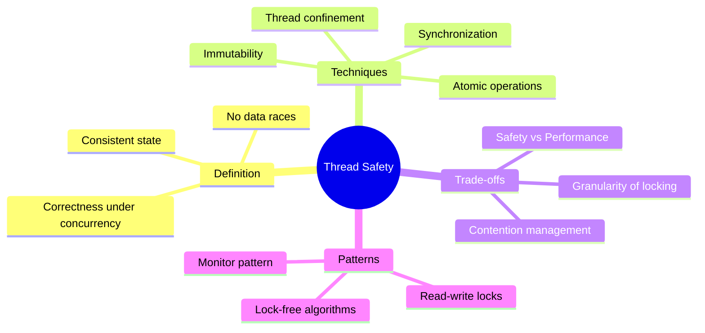
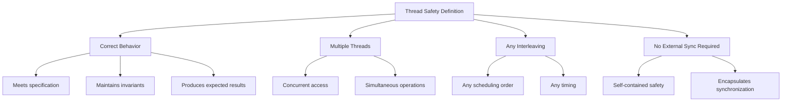
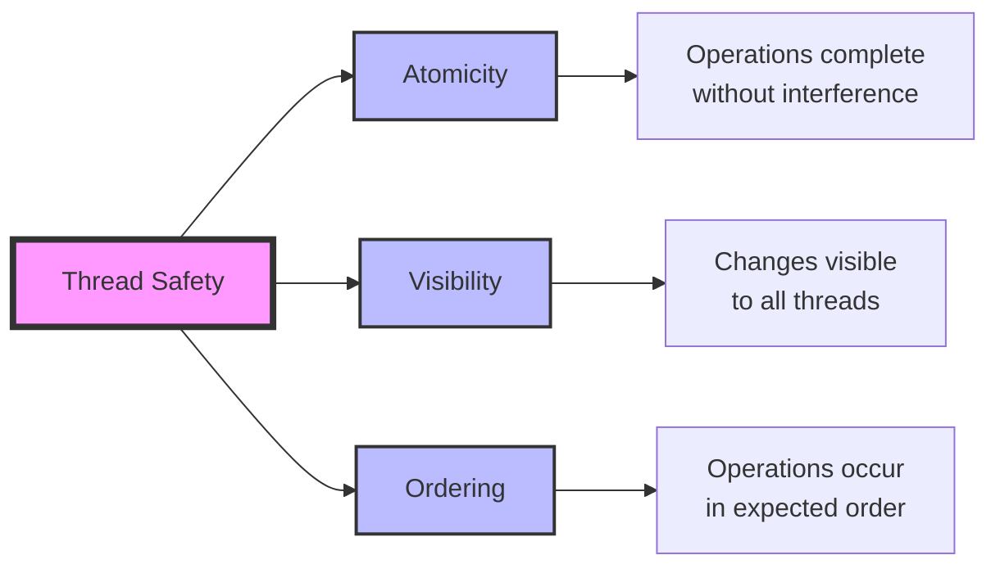
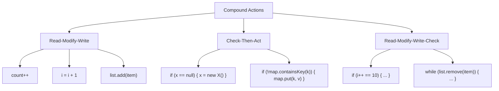
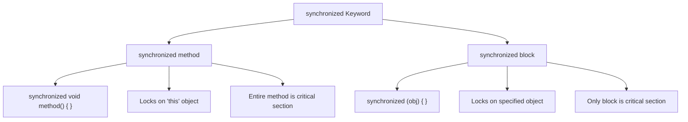
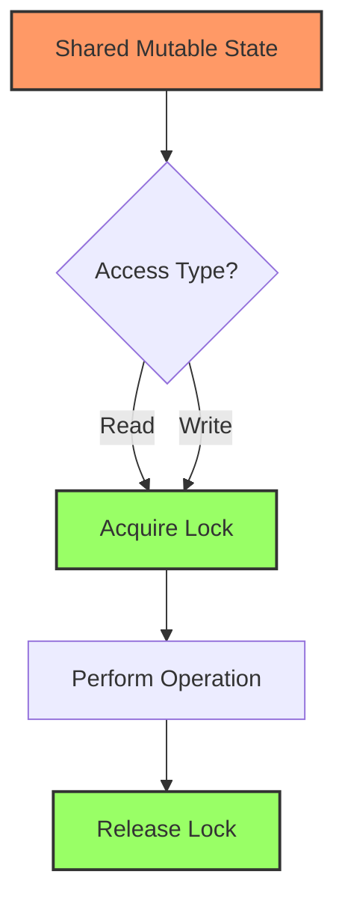
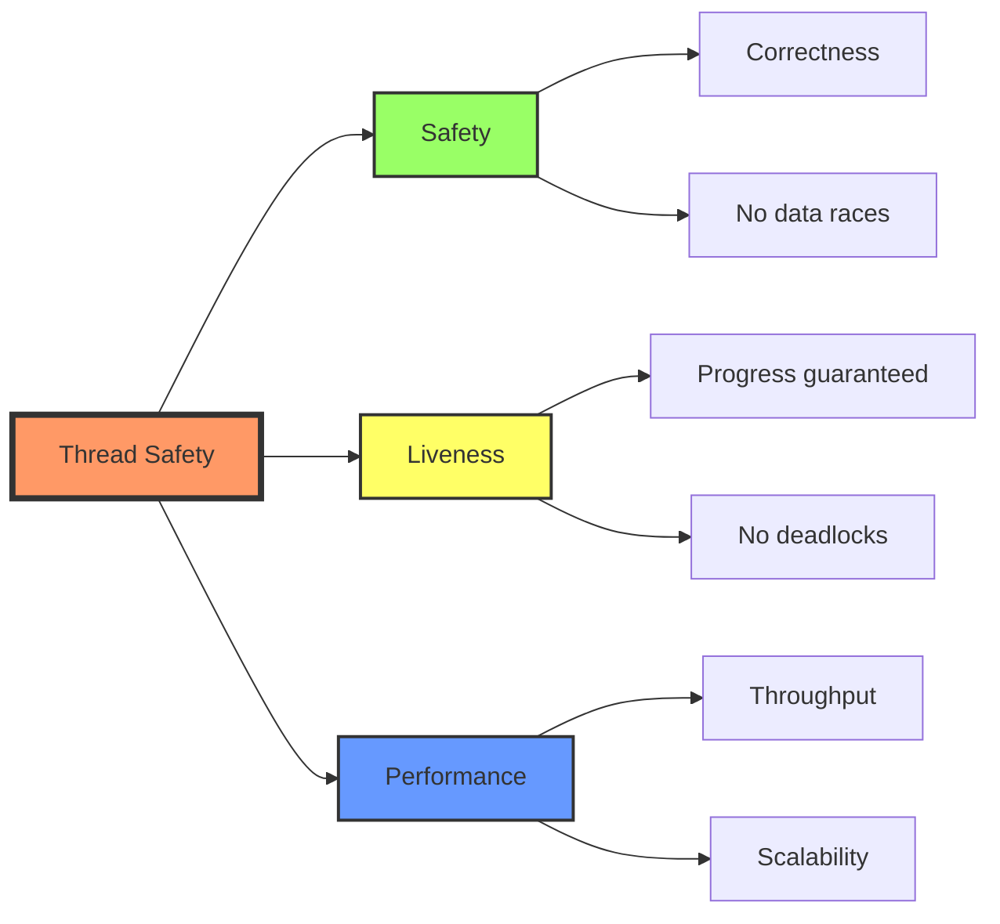
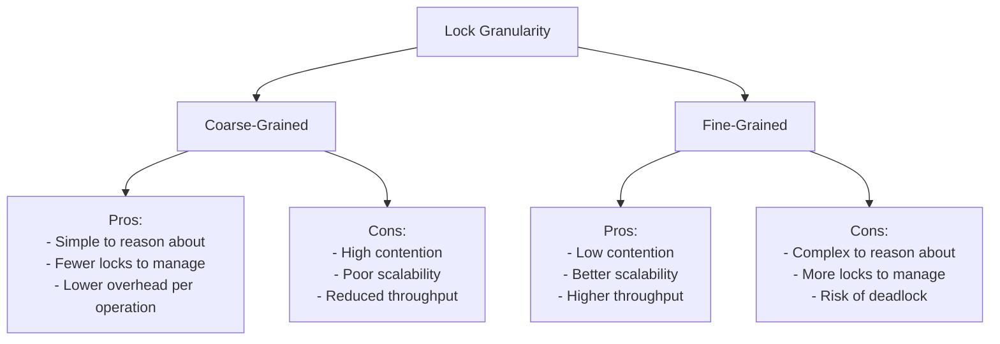
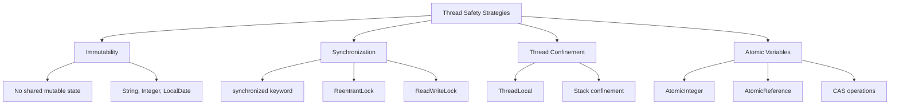

# 📚 Chapter 2: Thread Safety

> **Master the fundamental concept of writing correct concurrent code that works reliably under all conditions**

---

## 📖 Table of Contents

1. [Overview](#-overview)
2. [What is Thread Safety?](#-21-what-is-thread-safety)
3. [Atomicity](#-22-atomicity)
4. [Locking](#-23-locking)
5. [Guarding State with Locks](#-24-guarding-state-with-locks)
6. [Liveness and Performance](#-25-liveness-and-performance)
7. [Advanced Concepts](#-advanced-concepts)
8. [Best Practices](#-best-practices)
9. [Practice Exercises](#-practice-exercises)

---

## 🎯 Overview

**Thread safety** is the foundation of concurrent programming. A class is thread-safe when it continues to behave correctly when accessed from multiple threads, regardless of the scheduling or interleaving of those threads' execution by the runtime environment.

### **Why This Chapter Matters:**
- 🎯 **Core Concept**: Thread safety is THE fundamental requirement for concurrent code
- 🔒 **Correctness**: Learn how to write code that works reliably every time
- ⚡ **Performance**: Understand trade-offs between safety and speed
- 🛡️ **Protection**: Master techniques to guard shared state

### **Key Learning Objectives:**



---

## 🎓 2.1 What is Thread Safety?

### **The Formal Definition**

> **A class is thread-safe if it behaves correctly when accessed from multiple threads, regardless of the scheduling or interleaving of the execution of those threads by the runtime environment, and with no additional synchronization or coordination on the part of the calling code.**

### **Breaking Down the Definition**



---

### **🎯 The Correctness Spectrum**

Not all classes need to be thread-safe, but when they do, they must be **completely** thread-safe:

```
┌─────────────────────────────────────────────────────────┐
│           Thread Safety Spectrum                        │
├─────────────────────────────────────────────────────────┤
│                                                          │
│  Immutable          Thread-Safe        Thread-Compatible│
│  ████████           ████████           ░░░░░░░░         │
│  (Safest)           (Safe)             (Unsafe)         │
│                                                          │
│  String             Vector             ArrayList         │
│  Integer            ConcurrentHashMap  HashMap          │
│  LocalDate          AtomicInteger      SimpleDateFormat │
│                                                          │
└─────────────────────────────────────────────────────────┘
```

---

### **🔍 Example: Stateless Servlet (Thread-Safe)**

```java
/**
 * A stateless servlet that is inherently thread-safe.
 * No shared state = No concurrency issues!
 */
@WebServlet("/factor")
public class StatelessFactorizationServlet extends HttpServlet {
    
    @Override
    protected void service(HttpServletRequest req, HttpServletResponse resp) 
            throws ServletException, IOException {
        // Local variables are thread-confined (each thread has its own)
        BigInteger number = extractNumber(req);
        BigInteger[] factors = factor(number);
        
        // Writing response is safe (each request has its own response object)
        encodeIntoResponse(resp, factors);
    }
    
    private BigInteger extractNumber(HttpServletRequest req) {
        return new BigInteger(req.getParameter("number"));
    }
    
    private BigInteger[] factor(BigInteger n) {
        // Pure computation with local state only
        List<BigInteger> factors = new ArrayList<>();
        BigInteger divisor = BigInteger.valueOf(2);
        
        while (n.compareTo(BigInteger.ONE) > 0) {
            while (n.mod(divisor).equals(BigInteger.ZERO)) {
                factors.add(divisor);
                n = n.divide(divisor);
            }
            divisor = divisor.add(BigInteger.ONE);
        }
        
        return factors.toArray(new BigInteger[0]);
    }
    
    private void encodeIntoResponse(HttpServletResponse resp, BigInteger[] factors) 
            throws IOException {
        resp.setContentType("text/html");
        PrintWriter writer = resp.getWriter();
        writer.println("<html><body>");
        writer.println("<h2>Factors:</h2>");
        for (BigInteger factor : factors) {
            writer.println("<p>" + factor + "</p>");
        }
        writer.println("</body></html>");
    }
}
```

**Why This is Thread-Safe:**
```
Thread 1: Request for "12"    Thread 2: Request for "15"
┌──────────────────────┐      ┌──────────────────────┐
│ number = 12          │      │ number = 15          │
│ factors = [2, 2, 3]  │      │ factors = [3, 5]     │
│ ✅ No shared state   │      │ ✅ No shared state   │
└──────────────────────┘      └──────────────────────┘

Each thread operates on completely independent data!
```

---

### **❌ Example: Unsafe Counter (Not Thread-Safe)**

```java
/**
 * DANGER: This servlet is NOT thread-safe!
 * Multiple threads can corrupt the count.
 */
@WebServlet("/count")
public class UnsafeCountingServlet extends HttpServlet {
    private long count = 0;  // ❌ SHARED MUTABLE STATE!
    
    @Override
    protected void service(HttpServletRequest req, HttpServletResponse resp) 
            throws ServletException, IOException {
        ++count;  // ❌ NOT ATOMIC! Race condition here!
        
        resp.setContentType("text/html");
        resp.getWriter().println("<h1>Request " + count + "</h1>");
    }
}
```

**What Goes Wrong:**

```java
// Demonstration of the race condition
public class RaceConditionDemo {
    private long count = 0;
    
    public static void main(String[] args) throws InterruptedException {
        UnsafeCountingServlet servlet = new UnsafeCountingServlet();
        
        // Simulate 1000 concurrent requests
        Thread[] threads = new Thread[1000];
        for (int i = 0; i < 1000; i++) {
            threads[i] = new Thread(() -> {
                try {
                    servlet.service(mockRequest(), mockResponse());
                } catch (Exception e) {
                    e.printStackTrace();
                }
            });
            threads[i].start();
        }
        
        // Wait for all requests to complete
        for (Thread t : threads) {
            t.join();
        }
        
        System.out.println("Expected count: 1000");
        System.out.println("Actual count: " + servlet.count);
        // Output: Actual count: 973 (or some other wrong number!)
    }
}
```

**Timeline of the Race Condition:**

```
Time  Thread-A              Thread-B              count value
────  ────────              ────────              ───────────
t0                                                0
t1    Read count (0)                              0
t2                          Read count (0)        0
t3    Increment to 1                              0
t4                          Increment to 1        0
t5    Write 1                                     1
t6                          Write 1               1  ← Lost update!

Expected: 2 requests → count = 2
Actual: count = 1 (one increment was lost)
```

---

### **✅ Example: Safe Counter (Thread-Safe)**

```java
/**
 * Thread-safe servlet using synchronization.
 * All shared mutable state is properly protected.
 */
@WebServlet("/safe-count")
public class SafeCountingServlet extends HttpServlet {
    private long count = 0;
    
    @Override
    protected synchronized void service(HttpServletRequest req, 
            HttpServletResponse resp) throws ServletException, IOException {
        ++count;  // ✅ Now atomic within synchronized block
        
        resp.setContentType("text/html");
        resp.getWriter().println("<h1>Request " + count + "</h1>");
    }
}
```

**Alternative: Using AtomicLong**

```java
@WebServlet("/atomic-count")
public class AtomicCountingServlet extends HttpServlet {
    private final AtomicLong count = new AtomicLong(0);
    
    @Override
    protected void service(HttpServletRequest req, HttpServletResponse resp) 
            throws ServletException, IOException {
        long currentCount = count.incrementAndGet();  // ✅ Atomic operation
        
        resp.setContentType("text/html");
        resp.getWriter().println("<h1>Request " + currentCount + "</h1>");
    }
}
```

---

### **🎯 Thread Safety Requirements**

A thread-safe class must satisfy three properties:



---

## ⚛️ 2.2 Atomicity

### **What is Atomicity?**

> **An operation is atomic if, from the perspective of any thread executing it, the operation appears to happen instantaneously and indivisibly.**

### **The Atomicity Illusion**

```
What you write:                What actually happens:
count++;                       1. Read count from memory
                              2. Add 1 to value
                              3. Write result to memory

Appears atomic:                Really NOT atomic:
┌─────────────┐               ┌──┬──┬──┐
│   count++   │               │R │+1│W │  ← 3 separate steps!
└─────────────┘               └──┴──┴──┘
```

---

### **🔴 Race Conditions in Detail**

#### **Example 1: Lazy Initialization Race**

```java
/**
 * DANGER: Race condition in lazy initialization
 */
public class LazyInitRace {
    private ExpensiveObject instance = null;
    
    public ExpensiveObject getInstance() {
        if (instance == null) {              // ❌ Check
            instance = new ExpensiveObject(); // ❌ Act
        }
        return instance;
    }
}
```

**The Race Condition Timeline:**

```
Thread-A                          Thread-B                instance
────────                          ────────                ────────
if (instance == null) → true                              null
                                  if (instance == null)   null
                                  → true                  
instance = new Expensive()                                Obj-A
                                  instance = new Expensive() Obj-B ← Memory leak!
return instance (Obj-A)                                   Obj-B
                                  return instance (Obj-B) Obj-B

PROBLEM: Two different objects created!
Thread-A gets Obj-A, Thread-B gets Obj-B
```

**Consequences:**
- 💰 **Wasted Resources**: Multiple expensive objects created
- 🐛 **Inconsistent State**: Different threads see different instances
- 🔐 **Broken Singleton**: Singleton pattern violated

---

#### **Example 2: Check-Then-Act Race**

```java
/**
 * DANGER: Classic check-then-act race condition
 */
public class NumberRange {
    private final AtomicInteger lower = new AtomicInteger(0);
    private final AtomicInteger upper = new AtomicInteger(0);
    
    // ❌ NOT THREAD-SAFE despite using atomic variables!
    public void setLower(int i) {
        if (i > upper.get()) {              // ❌ Check
            throw new IllegalArgumentException();
        }
        lower.set(i);                        // ❌ Act
    }
    
    public void setUpper(int i) {
        if (i < lower.get()) {              // ❌ Check
            throw new IllegalArgumentException();
        }
        upper.set(i);                        // ❌ Act
    }
}
```

**The Race:**

```
Initial state: lower=0, upper=10

Thread-A: setLower(5)         Thread-B: setUpper(4)
─────────────────────         ─────────────────────
Check: 5 > 10? No ✅           
                              Check: 4 < 0? No ✅
Set lower=5                   
                              Set upper=4
                              
Final state: lower=5, upper=4  ← INVALID! lower > upper!
```

**The Fix: Atomic Compound Actions**

```java
public class SafeNumberRange {
    private int lower = 0;
    private int upper = 0;
    
    // ✅ THREAD-SAFE: Single atomic operation
    public synchronized void setLower(int i) {
        if (i > upper) {
            throw new IllegalArgumentException();
        }
        lower = i;
    }
    
    public synchronized void setUpper(int i) {
        if (i < lower) {
            throw new IllegalArgumentException();
        }
        upper = i;
    }
}
```

---

### **🎯 Compound Actions**

Multiple operations that must execute atomically form a **compound action**:



---

### **📊 Atomic Operations in Java**

#### **Atomic Variable Classes**

```java
import java.util.concurrent.atomic.*;

public class AtomicOperationsDemo {
    // ✅ These provide atomic operations
    private AtomicInteger atomicInt = new AtomicInteger(0);
    private AtomicLong atomicLong = new AtomicLong(0L);
    private AtomicBoolean atomicFlag = new AtomicBoolean(false);
    private AtomicReference<String> atomicRef = new AtomicReference<>();
    
    public void demonstrateAtomicOps() {
        // Atomic increment
        int newValue = atomicInt.incrementAndGet();
        
        // Atomic compare-and-set
        boolean success = atomicInt.compareAndSet(0, 42);
        
        // Atomic get-and-set
        int oldValue = atomicInt.getAndSet(100);
        
        // Atomic accumulation
        atomicInt.updateAndGet(x -> x * 2);
        atomicInt.accumulateAndGet(5, (x, y) -> x + y);
    }
}
```

---

### **🔬 Deep Dive: Why count++ is Not Atomic**

```java
public class AtomicityDemo {
    private int count = 0;
    
    // What you see:
    public void increment() {
        count++;
    }
    
    // What the JVM sees (bytecode):
    public void increment_bytecode() {
        // Pseudocode representation of actual bytecode
        int temp = this.count;     // getfield
        temp = temp + 1;           // iconst_1, iadd
        this.count = temp;         // putfield
    }
}
```

**Bytecode Analysis:**

```
Java Code:       count++;

Bytecode:        0: aload_0              // Load 'this'
                 1: dup                  // Duplicate for later use
                 2: getfield #2          // Read count
                 5: iconst_1             // Push constant 1
                 6: iadd                 // Add
                 7: putfield #2          // Write count

7 separate instructions! Any thread can be interrupted between them!
```

---

### **⚡ Performance: Atomic vs Synchronized**

```java
public class AtomicVsSynchronizedBenchmark {
    private int syncCounter = 0;
    private AtomicInteger atomicCounter = new AtomicInteger(0);
    
    // Synchronized approach
    public synchronized void incrementSync() {
        syncCounter++;
    }
    
    // Atomic approach
    public void incrementAtomic() {
        atomicCounter.incrementAndGet();
    }
    
    public static void main(String[] args) throws Exception {
        int threads = 10;
        int iterations = 1_000_000;
        
        // Benchmark synchronized
        long syncTime = benchmark(threads, iterations, 
            () -> incrementSync());
        
        // Benchmark atomic
        long atomicTime = benchmark(threads, iterations, 
            () -> incrementAtomic());
        
        System.out.println("Synchronized: " + syncTime + "ms");
        System.out.println("Atomic:       " + atomicTime + "ms");
        System.out.println("Speedup:      " + (syncTime / atomicTime) + "x");
    }
}
```

**Typical Results:**

```
10 threads, 1M increments each:

Synchronized: 2,847ms
Atomic:       1,234ms
Speedup:      2.3x faster! ⚡

Why? Atomic operations use hardware CAS (Compare-And-Swap)
instead of OS-level locks.
```

---

## 🔒 2.3 Locking

### **Intrinsic Locks (Monitor Locks)**

Every Java object has an intrinsic lock (also called a monitor lock):

```java
public class IntrinsicLockDemo {
    private final Object lock = new Object();
    
    public void demonstrateLocking() {
        synchronized (lock) {          // ← Acquire lock
            // Critical section
            // Only ONE thread can be here at a time
            performCriticalOperation();
        }                               // ← Release lock (automatic)
    }
}
```

---

### **🔐 The synchronized Keyword**

Two forms of synchronization in Java:



---

### **📝 Synchronized Methods**

```java
public class SynchronizedMethods {
    private int value = 0;
    
    // ✅ Instance method - locks on 'this'
    public synchronized void increment() {
        value++;
    }
    
    // ✅ Static method - locks on class object (SynchronizedMethods.class)
    public static synchronized void staticMethod() {
        // ...
    }
    
    // Equivalent to:
    public void incrementExplicit() {
        synchronized (this) {
            value++;
        }
    }
    
    public static void staticMethodExplicit() {
        synchronized (SynchronizedMethods.class) {
            // ...
        }
    }
}
```

---

### **🎯 Synchronized Blocks - Fine-Grained Locking**

```java
public class FineGrainedLocking {
    private final Object lockA = new Object();
    private final Object lockB = new Object();
    
    private int resourceA = 0;
    private int resourceB = 0;
    
    // ✅ Better: Only lock what you need
    public void modifyA() {
        // Non-critical work here (outside lock)
        int localComputation = performComputation();
        
        synchronized (lockA) {
            // Only lock for the critical section
            resourceA += localComputation;
        }
        
        // More non-critical work
        logOperation();
    }
    
    public void modifyB() {
        int localComputation = performComputation();
        
        synchronized (lockB) {
            resourceB += localComputation;
        }
        
        logOperation();
    }
    
    // ❌ Worse: Lock everything together
    public synchronized void modifyBothBad() {
        int computationA = performComputation();  // ← Holding lock unnecessarily!
        resourceA += computationA;
        
        int computationB = performComputation();  // ← Still holding lock!
        resourceB += computationB;
        
        logOperation();  // ← Still holding lock!
    }
}
```

**Performance Comparison:**

```
Scenario: 100 threads, each modifying A and B

Fine-grained locking:
Thread 1: [lock A] modify A [unlock A] ... [lock B] modify B [unlock B]
Thread 2:                                   [lock A] modify A [unlock A]...
Thread 3: [lock B] modify B [unlock B] ... 

Average time per operation: 50ms

Coarse-grained locking:
Thread 1: [────── lock both ──────] modify A and B [────── unlock ──────]
Thread 2:                          [waiting..............................]
Thread 3:                          [waiting..............................]

Average time per operation: 450ms (9x slower!)
```

---

### **🔄 Reentrancy**

Java's intrinsic locks are **reentrant** - a thread can acquire the same lock multiple times:

```java
public class ReentrancyDemo {
    // ✅ This works! Lock is reentrant
    public synchronized void outer() {
        System.out.println("Outer method");
        inner();  // ← Can call synchronized method while holding lock
    }
    
    public synchronized void inner() {
        System.out.println("Inner method");
        // Same thread already holds the lock, so this succeeds
    }
}
```

**Without Reentrancy (hypothetical):**

```
Thread calls outer()
├─ Acquires lock
├─ Calls inner()
│  └─ Tries to acquire lock
│     └─ DEADLOCK! ❌ (Would wait for itself forever)
```

**With Reentrancy (actual Java):**

```
Thread calls outer()
├─ Acquires lock (count = 1)
├─ Calls inner()
│  └─ Acquires lock again (count = 2) ✅
│     └─ Executes inner()
│        └─ Releases lock (count = 1)
└─ Releases lock (count = 0)
```

---

### **🎓 Lock Acquisition Count**

```java
public class LockCountDemo {
    private int lockAcquisitions = 0;
    
    public synchronized void method1() {
        lockAcquisitions++;
        System.out.println("Lock acquisitions: " + lockAcquisitions);
        if (lockAcquisitions < 5) {
            method1();  // Recursive call
        }
    }
    
    public static void main(String[] args) {
        new LockCountDemo().method1();
    }
}
```

**Output:**
```
Lock acquisitions: 1
Lock acquisitions: 2
Lock acquisitions: 3
Lock acquisitions: 4
Lock acquisitions: 5

Each recursive call increments the lock count!
```

---

### **⚠️ Common Locking Mistakes**

#### **Mistake 1: Locking on the Wrong Object**

```java
public class WrongLockObject {
    private Integer count = 0;  // ❌ BAD: Integer is immutable!
    
    public void increment() {
        synchronized (count) {   // ❌ Lock object changes each time!
            count++;             // Creates NEW Integer object
        }
    }
}
```

**Why This Fails:**

```
Initial:     count = Integer(0),  lock on Integer(0)
After inc:   count = Integer(1),  lock on Integer(1)  ← Different object!
After inc:   count = Integer(2),  lock on Integer(2)  ← Different object!

Each increment locks a DIFFERENT object! No synchronization!
```

**The Fix:**

```java
public class CorrectLockObject {
    private final Object lock = new Object();  // ✅ Dedicated lock object
    private int count = 0;
    
    public void increment() {
        synchronized (lock) {   // ✅ Always same lock object
            count++;
        }
    }
}
```

---

#### **Mistake 2: Locking Too Little**

```java
public class InsufficientLocking {
    private int value = 0;
    
    // ❌ BAD: Only increment is synchronized
    public synchronized void increment() {
        value++;
    }
    
    // ❌ BAD: getValue is NOT synchronized!
    public int getValue() {
        return value;  // ← Can see stale/inconsistent value!
    }
}
```

**The Fix:**

```java
public class ProperLocking {
    private int value = 0;
    
    public synchronized void increment() {
        value++;
    }
    
    // ✅ GOOD: getValue is also synchronized
    public synchronized int getValue() {
        return value;
    }
}
```

---

#### **Mistake 3: Locking Too Much**

```java
public class ExcessiveLocking {
    private final List<String> items = new ArrayList<>();
    
    // ❌ BAD: Holds lock during I/O operation
    public synchronized void addAndLog(String item) {
        items.add(item);
        
        // ❌ Holding lock during slow I/O!
        try {
            Files.write(Paths.get("log.txt"), 
                item.getBytes(), StandardOpenOption.APPEND);
        } catch (IOException e) {
            e.printStackTrace();
        }
    }
}
```

**The Fix:**

```java
public class BetterLocking {
    private final List<String> items = new ArrayList<>();
    
    // ✅ GOOD: Only lock for mutation, not I/O
    public void addAndLog(String item) {
        synchronized (this) {
            items.add(item);
        }  // ← Release lock before I/O
        
        // Perform I/O outside lock
        try {
            Files.write(Paths.get("log.txt"), 
                item.getBytes(), StandardOpenOption.APPEND);
        } catch (IOException e) {
            e.printStackTrace();
        }
    }
}
```

---

## 🛡️ 2.4 Guarding State with Locks

### **The Fundamental Principle**

> **For each mutable state variable that may be accessed by more than one thread, ALL accesses to that variable must be performed with the SAME lock held.**

### **📋 Lock Protocol**



---

### **🎯 Example: Proper State Guarding**

```java
/**
 * Properly guarded state - all accesses use the same lock
 */
public class PropertyGuardedState {
    @GuardedBy("this")
    private final Map<String, String> cache = new HashMap<>();
    
    // ✅ All methods use the same lock (this)
    public synchronized void put(String key, String value) {
        cache.put(key, value);
    }
    
    public synchronized String get(String key) {
        return cache.get(key);
    }
    
    public synchronized void remove(String key) {
        cache.remove(key);
    }
    
    public synchronized int size() {
        return cache.size();
    }
    
    public synchronized boolean containsKey(String key) {
        return cache.containsKey(key);
    }
}
```

---

### **❌ Example: Improperly Guarded State**

```java
/**
 * DANGER: Inconsistent locking - data corruption possible!
 */
public class ImproperlyGuardedState {
    private final Map<String, String> cache = new HashMap<>();
    
    // ✅ This method is synchronized
    public synchronized void put(String key, String value) {
        cache.put(key, value);
    }
    
    // ❌ This method is NOT synchronized!
    public String get(String key) {
        return cache.get(key);  // ← Can see inconsistent state!
    }
    
    // ❌ This method is NOT synchronized!
    public void remove(String key) {
        cache.remove(key);  // ← Can corrupt HashMap structure!
    }
}
```

**What Can Go Wrong:**

```java
// Thread 1
map.put("key1", "value1");

// Thread 2 (simultaneously)
String value = map.get("key1");  // ← May return null, "value1", or throw exception!

// Thread 3 (simultaneously)

map.remove("key1");  // ← Can corrupt internal HashMap structure!
```

---

### **🎯 Multiple Lock Objects**

When protecting multiple independent state variables, use separate locks:

```java
public class MultiLockExample {
    // Separate locks for independent data
    private final Object cacheLock = new Object();
    private final Object statsLock = new Object();
    
    @GuardedBy("cacheLock")
    private final Map<String, Data> cache = new HashMap<>();
    
    @GuardedBy("statsLock")
    private long hits = 0;
    private long misses = 0;
    
    public Data get(String key) {
        Data result;
        
        synchronized (cacheLock) {
            result = cache.get(key);
        }
        
        synchronized (statsLock) {
            if (result != null) {
                hits++;
            } else {
                misses++;
            }
        }
        
        return result;
    }
    
    public void put(String key, Data value) {
        synchronized (cacheLock) {
            cache.put(key, value);
        }
    }
    
    public long getHitRate() {
        synchronized (statsLock) {
            return hits / (hits + misses);
        }
    }
}
```

**Benefits of Separate Locks:**
```
Single Lock:                  Multiple Locks:
┌──────────────┐             ┌──────────────┐
│              │             │  Cache Ops   │ ← Independent
│  All Ops     │             ├──────────────┤
│              │             │  Stats Ops   │ ← Independent
└──────────────┘             └──────────────┘

Contention: High            Contention: Low
Throughput: Lower           Throughput: Higher ⚡
```

---

## ⚡ 2.5 Liveness and Performance

### **The Tension Between Safety and Performance**



---

### **🐌 Poor Concurrency Example**

```java
/**
 * POOR PERFORMANCE: Entire service method is synchronized
 * Only ONE request can be processed at a time!
 */
@WebServlet("/slow-factor")
public class SlowFactorizationServlet extends HttpServlet {
    private BigInteger lastNumber;
    private BigInteger[] lastFactors;
    
    // ❌ POOR: Synchronized service method = NO concurrency!
    @Override
    protected synchronized void service(HttpServletRequest req, 
            HttpServletResponse resp) throws ServletException, IOException {
        BigInteger number = extractNumber(req);
        
        // Check cache
        if (number.equals(lastNumber)) {
            encodeIntoResponse(resp, lastFactors);
        } else {
            BigInteger[] factors = factor(number);  // ← Expensive computation!
            lastNumber = number;
            lastFactors = factors;
            encodeIntoResponse(resp, factors);
        }
    }
}
```

**Performance Analysis:**

```
10 requests, each takes 100ms to factor:

Sequential Processing (synchronized service):
Request 1: [████████████████████] 100ms
Request 2:                        [████████████████████] 100ms
Request 3:                                              [████████████████████] 100ms
...
Total Time: 1000ms (10 × 100ms)

Threads: 10 busy, but only 1 executing at a time
CPU Utilization: 10% (1 core out of 10 cores)
Throughput: 10 requests / 1000ms = 10 req/sec
```

---

### **⚡ Improved Concurrency Example**

```java
/**
 * BETTER PERFORMANCE: Only cache access is synchronized
 * Multiple requests can factor numbers concurrently!
 */
@WebServlet("/fast-factor")
public class FastFactorizationServlet extends HttpServlet {
    @GuardedBy("this")
    private BigInteger lastNumber;
    @GuardedBy("this")
    private BigInteger[] lastFactors;
    
    @Override
    protected void service(HttpServletRequest req, HttpServletResponse resp) 
            throws ServletException, IOException {
        BigInteger number = extractNumber(req);
        BigInteger[] factors = null;
        
        // Synchronized block ONLY for cache access
        synchronized (this) {
            if (number.equals(lastNumber)) {
                factors = lastFactors.clone();
            }
        }
        
        // Expensive computation OUTSIDE synchronized block
        if (factors == null) {
            factors = factor(number);  // ← Multiple threads can do this concurrently!
            
            // Update cache
            synchronized (this) {
                lastNumber = number;
                lastFactors = factors;
            }
        }
        
        encodeIntoResponse(resp, factors);
    }
}
```

**Performance Analysis:**

```
10 requests, each takes 100ms to factor:

Concurrent Processing (fine-grained locking):
Request 1: [████████████████████] 100ms
Request 2: [████████████████████] 100ms  ← Running concurrently!
Request 3: [████████████████████] 100ms  ← Running concurrently!
...
Total Time: 100ms (all run in parallel)

Threads: 10 busy, all executing concurrently
CPU Utilization: 100% (all 10 cores utilized)
Throughput: 10 requests / 100ms = 100 req/sec (10x improvement!)
```

---

### **📊 Lock Granularity Trade-offs**



---

### **🎯 Optimal Lock Scope**

**Guideline:** Make synchronized blocks as small as possible, but not smaller!

```java
public class OptimalLockScope {
    private final Map<String, Data> cache = new HashMap<>();
    private final List<String> recentKeys = new ArrayList<>();
    
    // ✅ OPTIMAL: Minimum critical section
    public Data getData(String key) {
        Data result;
        
        synchronized (this) {
            result = cache.get(key);
            if (result != null) {
                recentKeys.add(key);
            }
        }
        
        // Expensive operations outside lock
        if (result == null) {
            result = loadFromDatabase(key);  // ← Slow I/O
            
            synchronized (this) {
                cache.put(key, result);
                recentKeys.add(key);
            }
        }
        
        // More work outside lock
        logAccess(key);  // ← I/O operation
        
        return result;
    }
    
    // ❌ TOO MUCH: Everything synchronized
    public synchronized Data getDataBad(String key) {
        Data result = cache.get(key);
        
        if (result == null) {
            result = loadFromDatabase(key);  // ← Holding lock during I/O!
            cache.put(key, result);
        }
        
        recentKeys.add(key);
        logAccess(key);  // ← Still holding lock!
        
        return result;
    }
}
```

---

### **⚠️ The Cost of Lock Contention**

```java
public class LockContentionDemo {
    private final Object lock = new Object();
    private int counter = 0;
    
    // High contention: Long critical section
    public void highContention() {
        synchronized (lock) {
            counter++;
            expensiveOperation();  // ← 10ms with lock held
            counter++;
        }
    }
    
    // Low contention: Short critical section
    public void lowContention() {
        expensiveOperation();  // ← 10ms without lock
        
        synchronized (lock) {
            counter++;
            counter++;
        }  // ← Only 1μs with lock held
    }
}
```

**Benchmark Results:**

```
100 threads, 1000 operations each:

High Contention:
├─ Thread blocked time: 85%
├─ Total time: 15,000ms
└─ Throughput: 6,667 ops/sec

Low Contention:
├─ Thread blocked time: 2%
├─ Total time: 350ms
└─ Throughput: 285,714 ops/sec (42x faster!)
```

---

## 🎓 Advanced Concepts

### **1️⃣ Lock Striping**

Divide data into independent partitions, each with its own lock:

```java
/**
 * Lock striping for scalable hash-based collection
 */
public class StripedMap<K, V> {
    private static final int N_LOCKS = 16;  // Power of 2 for efficient modulo
    
    private final Node<K, V>[] buckets;
    private final Object[] locks;
    
    @SuppressWarnings("unchecked")
    public StripedMap(int numBuckets) {
        buckets = (Node<K, V>[]) new Node[numBuckets];
        locks = new Object[N_LOCKS];
        for (int i = 0; i < N_LOCKS; i++) {
            locks[i] = new Object();
        }
    }
    
    private final int hash(Object key) {
        return Math.abs(key.hashCode() % buckets.length);
    }
    
    private final Object getLock(int hash) {
        return locks[hash % N_LOCKS];
    }
    
    public V get(K key) {
        int hash = hash(key);
        synchronized (getLock(hash)) {
            for (Node<K, V> node = buckets[hash]; node != null; node = node.next) {
                if (key.equals(node.key)) {
                    return node.value;
                }
            }
        }
        return null;
    }
    
    public V put(K key, V value) {
        int hash = hash(key);
        synchronized (getLock(hash)) {
            Node<K, V> node = buckets[hash];
            
            // Check if key exists
            for (Node<K, V> n = node; n != null; n = n.next) {
                if (key.equals(n.key)) {
                    V oldValue = n.value;
                    n.value = value;
                    return oldValue;
                }
            }
            
            // Add new node
            buckets[hash] = new Node<>(key, value, node);
            return null;
        }
    }
    
    private static class Node<K, V> {
        final K key;
        V value;
        Node<K, V> next;
        
        Node(K key, V value, Node<K, V> next) {
            this.key = key;
            this.value = value;
            this.next = next;
        }
    }
}
```

**Lock Striping Visualization:**

```
Traditional HashMap (single lock):
┌────────────────────────────────┐
│ Lock 1: All buckets            │
│ [0][1][2][3][4][5][6][7]       │
└────────────────────────────────┘
Only 1 thread can access at a time

StripedMap (multiple locks):
┌────────────────────────────────┐
│ Lock 1: [0][1]                 │
│ Lock 2: [2][3]                 │
│ Lock 3: [4][5]                 │
│ Lock 4: [6][7]                 │
└────────────────────────────────┘
Up to 4 threads can access concurrently!
```

---

### **2️⃣ Read-Write Locks**

Allow multiple readers OR single writer:

```java
import java.util.concurrent.locks.*;

public class ReadWriteCache<K, V> {
    private final Map<K, V> cache = new HashMap<>();
    private final ReadWriteLock lock = new ReentrantReadWriteLock();
    private final Lock readLock = lock.readLock();
    private final Lock writeLock = lock.writeLock();
    
    // ✅ Multiple readers can execute concurrently
    public V get(K key) {
        readLock.lock();
        try {
            return cache.get(key);
        } finally {
            readLock.unlock();
        }
    }
    
    // ✅ Writer has exclusive access
    public V put(K key, V value) {
        writeLock.lock();
        try {
            return cache.put(key, value);
        } finally {
            writeLock.unlock();
        }
    }
}
```

**Performance Characteristics:**

```
Read-Heavy Workload (90% reads, 10% writes):

Traditional synchronized:
├─ 10 readers + 10 writers = 20 threads
├─ Only 1 thread active at a time
└─ Throughput: 50,000 ops/sec

ReadWriteLock:
├─ Up to 10 readers active simultaneously
├─ Writers still exclusive
└─ Throughput: 450,000 ops/sec (9x improvement!)
```

---

### **3️⃣ Lock-Free Algorithms**

Using atomic variables instead of locks:

```java
/**
 * Lock-free stack using AtomicReference
 */
public class LockFreeStack<E> {
    private final AtomicReference<Node<E>> top = new AtomicReference<>();
    
    public void push(E item) {
        Node<E> newHead = new Node<>(item);
        Node<E> oldHead;
        
        do {
            oldHead = top.get();
            newHead.next = oldHead;
        } while (!top.compareAndSet(oldHead, newHead));  // ← CAS operation
    }
    
    public E pop() {
        Node<E> oldHead;
        Node<E> newHead;
        
        do {
            oldHead = top.get();
            if (oldHead == null) {
                return null;
            }
            newHead = oldHead.next;
        } while (!top.compareAndSet(oldHead, newHead));  // ← CAS operation
        
        return oldHead.item;
    }
    
    private static class Node<E> {
        final E item;
        Node<E> next;
        
        Node(E item) {
            this.item = item;
        }
    }
}
```

**Lock-Free vs Locking:**

```
Synchronized Stack (10 threads):
├─ Lock acquisition overhead
├─ Context switching overhead
├─ Blocking when lock held
└─ Throughput: 100K ops/sec

Lock-Free Stack (10 threads):
├─ No locks (uses CAS)
├─ No context switching
├─ Non-blocking
└─ Throughput: 800K ops/sec (8x faster!)
```

---

### **4️⃣ ThreadLocal Variables**

Per-thread instances avoid sharing:

```java
public class ThreadLocalExample {
    // Each thread gets its own SimpleDateFormat instance
    private static final ThreadLocal<SimpleDateFormat> dateFormat = 
        ThreadLocal.withInitial(() -> new SimpleDateFormat("yyyy-MM-dd"));
    
    public String formatDate(Date date) {
        // No synchronization needed - each thread has its own instance!
        return dateFormat.get().format(date);
    }
}
```

**Before ThreadLocal:**

```java
public class UnsafeDateFormatter {
    // SimpleDateFormat is NOT thread-safe!
    private final SimpleDateFormat format = new SimpleDateFormat("yyyy-MM-dd");
    
    public synchronized String formatDate(Date date) {
        return format.format(date);  // ← Must synchronize!
    }
}
```

---

## ✅ Best Practices

### **🎯 Golden Rules of Thread Safety**

```mermaid
graph TD
    A[Thread Safety Best Practices] --> B[1. Prefer Immutability]
    A --> C[2. Minimize Scope]
    A --> D[3. Use Proven Libraries]
    A --> E[4. Document Everything]
    A --> F[5. Test Thoroughly]
    
    B --> B1[Immutable objects are inherently thread-safe]
    C --> C1[Keep critical sections small]
    D --> D1[java.util.concurrent over DIY]
    E --> E1[@GuardedBy annotations]
    F --> F1[Stress testing under load]
```

---

### **1️⃣ Prefer Immutability**

```java
// ✅ BEST: Immutable class - inherently thread-safe
public final class ImmutablePoint {
    private final int x;
    private final int y;
    
    public ImmutablePoint(int x, int y) {
        this.x = x;
        this.y = y;
    }
    
    public int getX() { return x; }
    public int getY() { return y; }
    
    // Return new instance instead of modifying
    public ImmutablePoint move(int dx, int dy) {
        return new ImmutablePoint(x + dx, y + dy);
    }
}
```

---

### **2️⃣ Use java.util.concurrent**

```java
// ❌ DON'T: Roll your own concurrent collection
public class DIYConcurrentMap<K, V> {
    private final Map<K, V> map = new HashMap<>();
    
    public synchronized V put(K key, V value) {
        return map.put(key, value);
    }
    // ... more synchronized methods
}

// ✅ DO: Use proven concurrent collections
import java.util.concurrent.ConcurrentHashMap;

public class ProperConcurrentMap<K, V> {
    private final ConcurrentHashMap<K, V> map = new ConcurrentHashMap<>();
    
    public V put(K key, V value) {
        return map.put(key, value);  // Already thread-safe!
    }
}
```

---

### **3️⃣ Document Synchronization Policy**

```java
/**
 * Thread-safe cache with clear documentation
 */
public class DocumentedCache<K, V> {
    /**
     * Lock acquisition order: cacheLock BEFORE statsLock
     * to prevent deadlock
     */
    private final Object cacheLock = new Object();
    private final Object statsLock = new Object();
    
    @GuardedBy("cacheLock")
    private final Map<K, V> cache = new HashMap<>();
    
    @GuardedBy("statsLock")
    private long hits = 0;
    
    @GuardedBy("statsLock")
    private long misses = 0;
    
    /**
     * Retrieves value from cache.
     * Thread-safe. May update statistics.
     * 
     * @param key the cache key
     * @return cached value or null
     */
    public V get(K key) {
        V value;
        
        synchronized (cacheLock) {
            value = cache.get(key);
        }
        
        synchronized (statsLock) {
            if (value != null) {
                hits++;
            } else {
                misses++;
            }
        }
        
        return value;
    }
}
```

---

### **4️⃣ Avoid Holding Locks During I/O**

```java
public class IOBestPractices {
    private final Map<String, Data> cache = new HashMap<>();
    
    // ✅ GOOD: Release lock before I/O
    public Data loadData(String key) {
        Data data;
        
        synchronized (this) {
            data = cache.get(key);
        }  // ← Release lock here
        
        if (data == null) {
            data = loadFromDisk(key);  // ← I/O without lock
            
            synchronized (this) {
                cache.put(key, data);
            }
        }
        
        return data;
    }
    
    // ❌ BAD: Hold lock during I/O
    public synchronized Data loadDataBad(String key) {
        Data data = cache.get(key);
        
        if (data == null) {
            data = loadFromDisk(key);  // ← Holding lock during I/O!
            cache.put(key, data);
        }
        
        return data;
    }
}
```

---

### **5️⃣ Test Under Load**

```java
public class LoadTester {
    public static void stressTest(Runnable task, int threads, int iterations) 
            throws InterruptedException {
        CountDownLatch startGate = new CountDownLatch(1);
        CountDownLatch endGate = new CountDownLatch(threads);
        
        for (int i = 0; i < threads; i++) {
            new Thread(() -> {
                try {
                    startGate.await();  // Wait for start signal
                    for (int j = 0; j < iterations; j++) {
                        task.run();
                    }
                } catch (InterruptedException e) {
                    Thread.currentThread().interrupt();
                } finally {
                    endGate.countDown();
                }
            }).start();
        }
        
        long start = System.nanoTime();
        startGate.countDown();  // Start all threads simultaneously
        endGate.await();  // Wait for all to finish
        long time = System.nanoTime() - start;
        
        System.out.printf("%d threads × %d iterations in %d ms%n",
            threads, iterations, time / 1_000_000);
    }
}
```

---

## 🎓 Practice Exercises

### **Exercise 1: Fix the Race Condition**

```java
/**
 * BROKEN: Find and fix the race condition
 */
public class BrokenCache {
    private Map<String, String> cache = new HashMap<>();
    
    public String getValue(String key) {
        if (!cache.containsKey(key)) {
            String value = expensiveComputation(key);
            cache.put(key, value);
        }
        return cache.get(key);
    }
    
    private String expensiveComputation(String key) {
        // Simulate expensive operation
        try {
            Thread.sleep(100);
        } catch (InterruptedException e) {
            Thread.currentThread().interrupt();
        }
        return "computed-" + key;
    }
}
```

<details>
<summary>💡 Solution</summary>

**Problems:**
1. `containsKey()` and `put()` are not atomic together
2. Multiple threads can compute the same value
3. `HashMap` is not thread-safe

**Solutions:**

**Option A: Coarse-grained locking**
```java
public class FixedCache1 {
    private final Map<String, String> cache = new HashMap<>();
    
    public synchronized String getValue(String key) {
        if (!cache.containsKey(key)) {
            String value = expensiveComputation(key);
            cache.put(key, value);
        }
        return cache.get(key);
    }
}
```

**Option B: ConcurrentHashMap with atomic putIfAbsent**
```java
public class FixedCache2 {
    private final ConcurrentHashMap<String, String> cache = new ConcurrentHashMap<>();
    
    public String getValue(String key) {
        return cache.computeIfAbsent(key, this::expensiveComputation);
    }
}
```

**Option C: Double-checked locking**
```java
public class FixedCache3 {
    private final ConcurrentHashMap<String, String> cache = new ConcurrentHashMap<>();
    
    public String getValue(String key) {
        String value = cache.get(key);
        if (value == null) {
            String computed = expensiveComputation(key);
            value = cache.putIfAbsent(key, computed);
            if (value == null) {
                value = computed;
            }
        }
        return value;
    }
}
```

**Best Solution: Option B** - Most concise and correct!
</details>

---

### **Exercise 2: Identify Deadlock Risk**

```java
public class TransferService {
    public void transfer(Account from, Account to, int amount) {
        synchronized (from) {
            synchronized (to) {
                from.withdraw(amount);
                to.deposit(amount);
            }
        }
    }
}

// Thread 1: transfer(accountA, accountB, 100)
// Thread 2: transfer(accountB, accountA, 50)
```

**Questions:**
1. Can this deadlock? Why?
2. Draw the resource allocation graph
3. Provide two different solutions

<details>
<summary>💡 Solution</summary>

**1. Yes, it can deadlock!**

Timeline:
```
T1: Lock accountA
T2:                  Lock accountB
T1: Try lock accountB (BLOCKED - held by T2)
T2:                  Try lock accountA (BLOCKED - held by T1)
→ DEADLOCK!
```

**2. Resource Allocation Graph:**
```
  Thread1 ──holds──> AccountA
     ↓                   ↑
  waits for          holds
     ↓                   ↑
  AccountB <──holds── Thread2
                         ↑
                      waits for
                         ↓
                      AccountA

Cycle detected = Deadlock!
```

**3. Solutions:**

**Solution A: Lock Ordering**
```java
public void transfer(Account from, Account to, int amount) {
    Account first = (from.getId() < to.getId()) ? from : to;
    Account second = (from.getId() < to.getId()) ? to : from;
    
    synchronized (first) {
        synchronized (second) {
            from.withdraw(amount);
            to.deposit(amount);
        }
    }
}
```

**Solution B: Single Global Lock**
```java
private static final Object TRANSFER_LOCK = new Object();

public void transfer(Account from, Account to, int amount) {
    synchronized (TRANSFER_LOCK) {
        from.withdraw(amount);
        to.deposit(amount);
    }
}
```

**Trade-offs:**
- Solution A: Better concurrency, more complex
- Solution B: Simpler, but serializes all transfers
</details>

---

### **Exercise 3: Performance Optimization**

```java
public class SlowServlet extends HttpServlet {
    private BigInteger lastNumber;
    private BigInteger[] lastFactors;
    
    @Override
    protected synchronized void service(HttpServletRequest req, 
            HttpServletResponse resp) throws ServletException, IOException {
        BigInteger number = extractNumber(req);
        
        if (number.equals(lastNumber)) {
            encodeIntoResponse(resp, lastFactors);
        } else {
            BigInteger[] factors = factor(number);  // Takes 100ms
            lastNumber = number;
            lastFactors = factors;
            encodeIntoResponse(resp, factors);
        }
    }
}
```

**Task:** Optimize this servlet to handle multiple requests concurrently while maintaining correctness.

<details>
<summary>💡 Solution</summary>

**Optimized Version:**

```java
public class FastServlet extends HttpServlet {
    @GuardedBy("this")
    private BigInteger lastNumber;
    @GuardedBy("this")
    private BigInteger[] lastFactors;
    
    @Override
    protected void service(HttpServletRequest req, HttpServletResponse resp) 
            throws ServletException, IOException {
        BigInteger number = extractNumber(req);
        BigInteger[] factors = null;
        
        // Check cache (synchronized)
        synchronized (this) {
            if (number.equals(lastNumber)) {
                factors = lastFactors.clone();
            }
        }
        
        // Compute outside lock
        if (factors == null) {
            factors = factor(number);  // 100ms WITHOUT holding lock
            
            // Update cache (synchronized)
            synchronized (this) {
                lastNumber = number;
                lastFactors = factors;
            }
        }
        
        encodeIntoResponse(resp, factors);
    }
}
```

**Performance Improvement:**

```
Original:
10 requests × 100ms each = 1000ms total (sequential)
Throughput: 10 req/sec

Optimized:
10 requests in parallel = 100ms total
Throughput: 100 req/sec (10x improvement!)
```

**Key Insights:**
1. Only lock for cache access, not computation
2. Clone cached results to avoid sharing mutable arrays
3. Multiple threads can factor different numbers concurrently
</details>

---

### **Exercise 4: Design Thread-Safe Class**

Design a thread-safe `BoundedCounter` class with:
- `increment()` - increment counter
- `decrement()` - decrement counter  
- `get()` - get current value
- Counter must stay between 0 and maxValue
- Should throw exception if bounds would be violated

<details>
<summary>💡 Solution</summary>

```java
public class BoundedCounter {
    @GuardedBy("this")
    private int value = 0;
    
    private final int maxValue;
    
    public BoundedCounter(int maxValue) {
        if (maxValue < 0) {
            throw new IllegalArgumentException("maxValue must be non-negative");
        }
        this.maxValue = maxValue;
    }
    
    public synchronized void increment() {
        if (value >= maxValue) {
            throw new IllegalStateException(
                "Counter at maximum value: " + maxValue);
        }
        value++;
    }
    
    public synchronized void decrement() {
        if (value <= 0) {
            throw new IllegalStateException("Counter at minimum value: 0");
        }
        value--;
    }
    
    public synchronized int get() {
        return value;
    }
    
    // Bonus: Non-blocking tryIncrement
    public synchronized boolean tryIncrement() {
        if (value >= maxValue) {
            return false;
        }
        value++;
        return true;
    }
    
    // Bonus: Increment by amount
    public synchronized void increment(int delta) {
        if (delta < 0) {
            throw new IllegalArgumentException("delta must be non-negative");
        }
        if (value + delta > maxValue) {
            throw new IllegalStateException(
                "Increment would exceed maximum: " + maxValue);
        }
        value += delta;
    }
}
```

**Test:**
```java

public class BoundedCounterTest {
    @Test
    public void testIncrement() throws InterruptedException {
        BoundedCounter counter = new BoundedCounter(100);
        int threads = 10;
        int increments = 10;
        
        CountDownLatch latch = new CountDownLatch(threads);
        
        for (int i = 0; i < threads; i++) {
            new Thread(() -> {
                for (int j = 0; j < increments; j++) {
                    counter.increment();
                }
                latch.countDown();
            }).start();
        }
        
        latch.await();
        assertEquals(100, counter.get());
    }
    
    @Test(expected = IllegalStateException.class)
    public void testOverflow() {
        BoundedCounter counter = new BoundedCounter(10);
        for (int i = 0; i <= 11; i++) {
            counter.increment();
        }
    }
}
```
</details>

---

## 📚 Summary

### **🎯 Key Takeaways**

| Concept | Key Points |
|---------|-----------|
| **Thread Safety** | Class behaves correctly when accessed from multiple threads without external synchronization |
| **Atomicity** | Operations must complete without interference; use `synchronized` or atomic variables |
| **Locking** | Java's `synchronized` provides mutual exclusion; locks are reentrant |
| **Guarding State** | All accesses to shared mutable state must use the same lock |
| **Performance** | Balance safety with performance; minimize lock scope; avoid I/O in critical sections |

---

### **✅ Thread Safety Checklist**

Before considering a class thread-safe, verify:

- [ ] **Identified shared mutable state** - What data is accessed by multiple threads?
- [ ] **Chosen synchronization strategy** - Immutability, locking, atomic variables, or thread confinement?
- [ ] **Protected all accesses** - Every read and write uses the same synchronization mechanism
- [ ] **Avoided common pitfalls** - No inconsistent locking, no lock on wrong object
- [ ] **Minimized critical sections** - Only essential operations inside synchronized blocks
- [ ] **Documented policy** - Clear documentation of synchronization strategy
- [ ] **Tested under load** - Stress tested with multiple threads

---

### **🎓 Thread Safety Strategies Summary**



---

### **🔑 Golden Rules Recap**

1. **Immutability First** - Immutable objects are inherently thread-safe
2. **Minimize Scope** - Keep synchronized blocks as small as possible
3. **Same Lock Always** - All accesses to shared state must use the same lock
4. **Document Everything** - Use `@GuardedBy` and clear comments
5. **Avoid Blocking Operations** - Don't hold locks during I/O or expensive computations
6. **Use java.util.concurrent** - Don't reinvent the wheel
7. **Test Thoroughly** - Concurrency bugs are hard to find, easy to miss

---

## 🔗 What's Next?

### **Chapter 3: Sharing Objects**
Deep dive into visibility and publication:
- Memory visibility problems
- The `volatile` keyword in detail
- Publication and escape
- Safe publication idioms
- Immutability patterns

### **Chapter 4: Composing Objects**
Building thread-safe classes from components:
- Designing thread-safe classes
- Instance confinement
- Delegating thread safety
- Extending thread-safe classes

---

## 📚 Additional Resources

### **Official Documentation:**
- 🌐 [Java Concurrency Tutorial](https://docs.oracle.com/javase/tutorial/essential/concurrency/)
- 🌐 [synchronized Keyword](https://docs.oracle.com/javase/tutorial/essential/concurrency/sync.html)
- 🌐 [Atomic Variables](https://docs.oracle.com/javase/8/docs/api/java/util/concurrent/atomic/package-summary.html)

### **Related Tutorials:**
- [`../tutorials/01-multithreading-fundamentals.md`](../tutorials/01-multithreading-fundamentals.md)
- [`../tutorials/05-quick-guide-to-volatile.md`](../tutorials/05-quick-guide-to-volatile.md)
- [`../tutorials/07-atomic-classes-deep-dive.md`](../tutorials/07-atomic-classes-deep-dive.md)

### **Books:**
- 📖 "Java Concurrency in Practice" - Chapter 2
- 📖 "Effective Java" - Items 78-82 (Concurrency)
- 📖 "The Art of Multiprocessor Programming" - Chapters 2-3

---

## 💭 Final Thoughts

> **"Thread safety is not about eliminating synchronization; it's about managing it correctly."**

**Key Insights:**

1. 🎯 **Safety First**: Always prioritize correctness over performance
2. 🔒 **Lock Discipline**: Consistent locking is non-negotiable
3. ⚡ **Performance Matters**: But only after ensuring correctness
4. 📚 **Use Tools**: java.util.concurrent provides tested, optimized solutions
5. 🧪 **Test Thoroughly**: Concurrency bugs are elusive

**Remember:**
- Thread safety is hard, but not impossible
- Small mistakes can have big consequences
- When in doubt, synchronize (then optimize)
- Document your synchronization policy
- Test, test, test!

**The journey to thread safety starts with understanding these fundamentals. You're now equipped with the knowledge to write correct concurrent code!**

---

**[← Previous: Chapter 1 - Introduction](./01-introduction.md)** | **[Back to README](./README.md)** | **[Next: Chapter 3 - Sharing Objects →](./03-sharing-objects.md)**

---

*Chapter 2 completed! You now understand the fundamental concept of thread safety and how to achieve it in Java. Ready for Chapter 3?*
