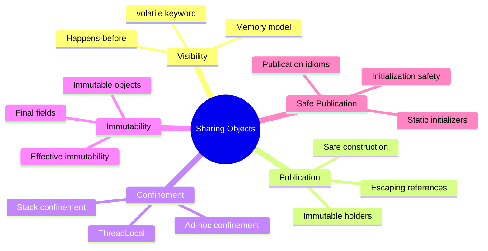
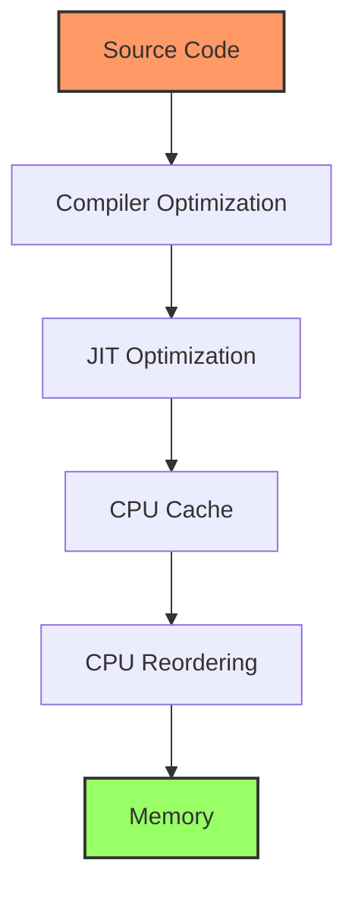
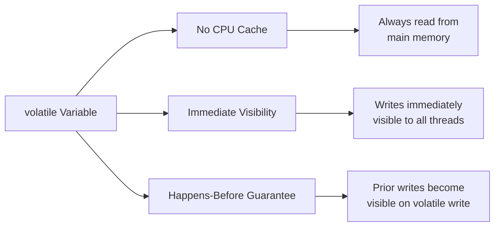
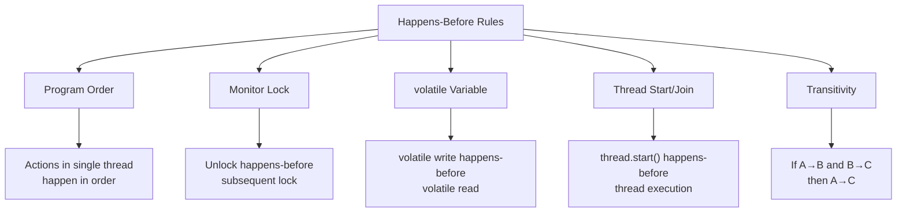
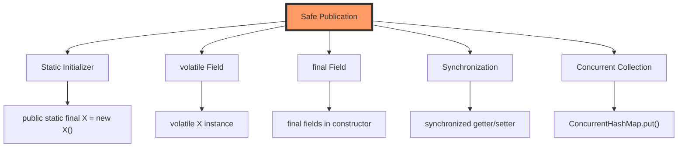
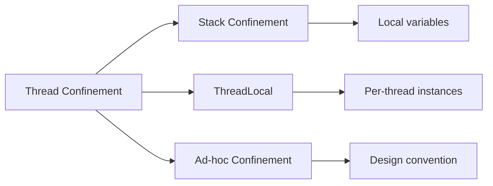
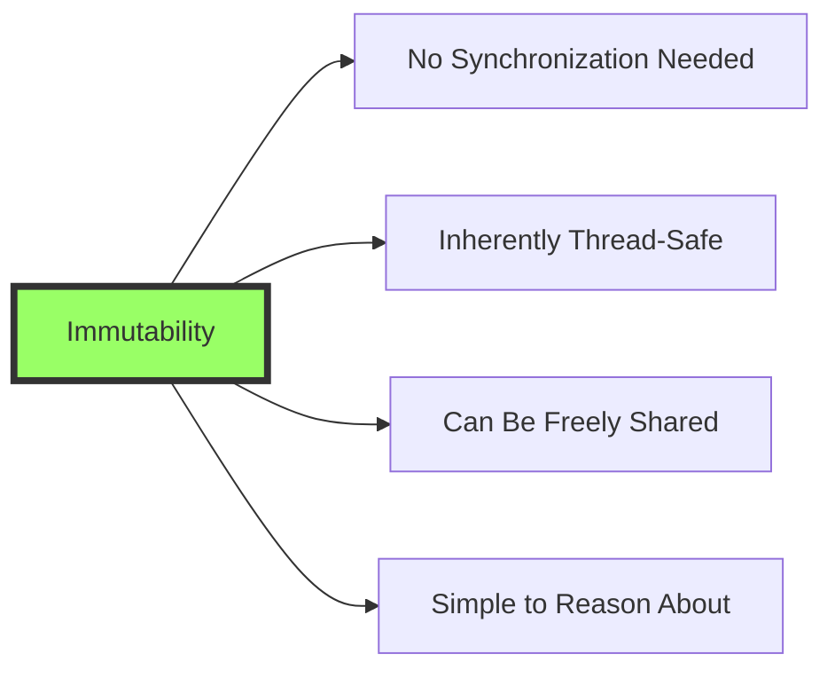
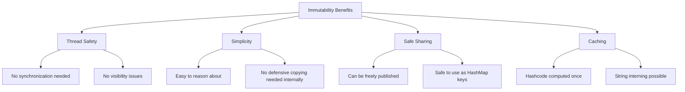
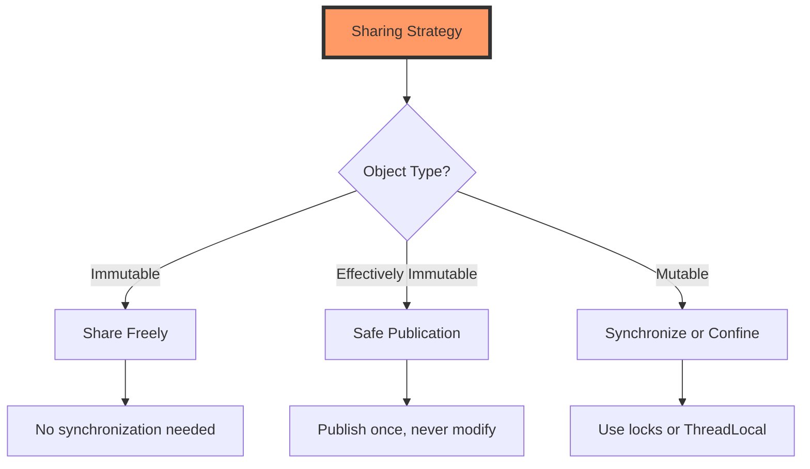
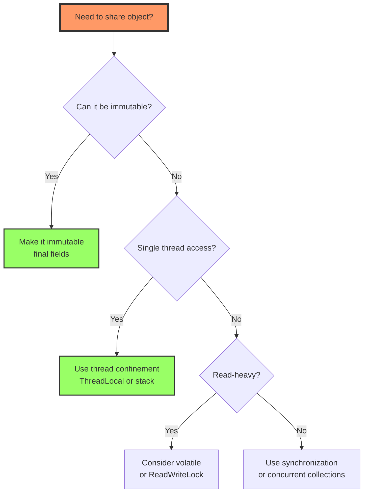

# 📚 Chapter 3: Sharing Objects

> **Master the art of safely sharing data between threads - understanding visibility, publication, and immutability**

---

## 📖 Table of Contents

1. [Overview](#-overview)
2. [Visibility](#-31-visibility)
3. [Publication and Escape](#-32-publication-and-escape)
4. [Thread Confinement](#-33-thread-confinement)
5. [Immutability](#-34-immutability)
6. [Safe Publication](#-35-safe-publication)
7. [Best Practices](#-best-practices)
8. [Practice Exercises](#-practice-exercises)

---

## 🎯 Overview

Writing correct concurrent programs is not just about atomicity and locking - it's also about **visibility**. When one thread modifies an object's state, how and when can other threads see those changes? Understanding visibility is crucial for writing correct concurrent code.

### **Why This Chapter Matters:**
- 👁️ **Visibility**: Learn how changes become visible across threads
- 🚪 **Publication**: Safely share objects between threads
- 🔒 **Confinement**: Keep data thread-private for safety
- 💎 **Immutability**: The ultimate thread-safety technique
- 📦 **Safe Publication**: Guarantee other threads see initialized objects

### **Key Learning Objectives:**



---

## 👁️ 3.1 Visibility

### **The Visibility Problem**

> **Visibility is about ensuring that when one thread modifies a variable, other threads can actually see that modification.**

Without proper synchronization, the Java Memory Model allows surprising behaviors:

```java
/**
 * DANGER: This code might never terminate!
 */
public class NoVisibility {
    private static boolean ready;
    private static int number;
    
    private static class ReaderThread extends Thread {
        @Override
        public void run() {
            while (!ready) {        // ← Might NEVER see ready=true!
                Thread.yield();
            }
            System.out.println(number);  // ← Might print 0!
        }
    }
    
    public static void main(String[] args) {
        new ReaderThread().start();
        
        number = 42;
        ready = true;
    }
}
```

**Possible Outputs:**
```
1. Program never terminates (ready never seen as true)
2. Prints 0 (number change not visible)
3. Prints 42 (correct, but not guaranteed!)
```

---

### **🔬 Why Visibility Fails**

Modern processors and compilers perform optimizations that can reorder operations:



**Example: CPU Caching**

```
Thread 1 (Writer):                Thread 2 (Reader):
─────────────────                 ─────────────────
number = 42                       
  ↓                               
[CPU1 Cache]                      
  number = 42                     
                                  while (!ready)
                                    ↓
                                  [CPU2 Cache]
                                    ready = false  ← Stale value!
ready = true                      
  ↓                               
[CPU1 Cache]                      
  ready = true                    
  ↓                               
[Main Memory]                     
  ready = true                    
  number = 42                     

Thread 2 might never see the updates!
```

---

### **🔧 The Solution: Synchronization**

#### **Option 1: synchronized**

```java
public class WithSynchronization {
    private static boolean ready;
    private static int number;
    
    private static synchronized void setValues() {
        number = 42;
        ready = true;
    }
    
    private static synchronized boolean isReady() {
        return ready;
    }
    
    private static class ReaderThread extends Thread {
        @Override
        public void run() {
            while (!isReady()) {  // ← Now visibility guaranteed!
                Thread.yield();
            }
            System.out.println(number);  // ← Will always print 42
        }
    }
    
    public static void main(String[] args) {
        new ReaderThread().start();
        setValues();
    }
}
```

**How synchronized Ensures Visibility:**

```
Thread 1 (synchronized write):    Thread 2 (synchronized read):
──────────────────────────        ──────────────────────────
Lock acquisition                  
  ↓                               
Write: number = 42                
Write: ready = true               
  ↓                               
Lock release                      
  ↓                               
[Flush to main memory]            
                                  Lock acquisition
                                    ↓
                                  [Read from main memory]
                                    ↓
                                  Read: ready = true ✅
                                  Read: number = 42 ✅
```

---

#### **Option 2: volatile**

```java
public class WithVolatile {
    private static volatile boolean ready;  // ← volatile keyword
    private static int number;
    
    private static class ReaderThread extends Thread {
        @Override
        public void run() {
            while (!ready) {  // ← volatile read always sees latest value
                Thread.yield();
            }
            System.out.println(number);  // ← Still might print 0! ⚠️
        }
    }
    
    public static void main(String[] args) {
        new ReaderThread().start();
        
        number = 42;
        ready = true;  // ← volatile write flushes all prior writes
    }
}
```

**volatile Guarantees:**
- ✅ Visibility of the volatile variable itself
- ✅ Visibility of all variables modified before volatile write
- ❌ Does NOT provide atomicity for compound operations

---

### **⚡ The volatile Keyword Deep Dive**

#### **What volatile Does**



---

#### **volatile vs synchronized**

```java
public class VolatileVsSynchronized {
    // Scenario 1: Simple flag (volatile sufficient)
    private volatile boolean flag = false;
    
    public void setFlag() {
        flag = true;  // ✅ volatile provides visibility
    }
    
    public boolean getFlag() {
        return flag;  // ✅ Always sees latest value
    }
    
    // Scenario 2: Counter (volatile NOT sufficient!)
    private volatile int count = 0;
    
    public void increment() {
        count++;  // ❌ NOT ATOMIC! Still has race condition
                  // count++ is actually:
                  // 1. read count
                  // 2. add 1
                  // 3. write count
    }
    
    // Fix: Use synchronized or AtomicInteger
    public synchronized void incrementSafe() {
        count++;  // ✅ Now atomic
    }
}
```

**Comparison Table:**

| Feature | volatile | synchronized |
|---------|----------|--------------|
| **Visibility** | ✅ Yes | ✅ Yes |
| **Atomicity** | ❌ No | ✅ Yes |
| **Mutual Exclusion** | ❌ No | ✅ Yes |
| **Performance** | ⚡ Very fast | 🐌 Slower |
| **Use Case** | Flags, status | Compound operations |
| **Blocks Threads** | ❌ No | ✅ Yes |

---

#### **When to Use volatile**

```java
/**
 * ✅ GOOD: Using volatile for status flags
 */
public class VolatileFlag {
    private volatile boolean shutdown = false;
    
    public void shutdown() {
        shutdown = true;  // ✅ Perfect use of volatile
    }
    
    public void run() {
        while (!shutdown) {  // ✅ Always sees latest value
            doWork();
        }
    }
}

/**
 * ✅ GOOD: Using volatile with immutable objects
 */
public class VolatileCache {
    private volatile CacheEntry cache;  // Holder is volatile
    
    public void update(String key, Object value) {
        // Create new immutable holder
        cache = new CacheEntry(key, value);  // ✅ Safe publication
    }
    
    private static class CacheEntry {
        final String key;
        final Object value;
        
        CacheEntry(String key, Object value) {
            this.key = key;
            this.value = value;
        }
    }
}

/**
 * ❌ BAD: Using volatile for compound operations
 */
public class VolatileMisuse {
    private volatile int count = 0;
    
    public void increment() {
        count++;  // ❌ WRONG! Race condition exists
    }
    
    // Should use:
    private final AtomicInteger atomicCount = new AtomicInteger(0);
    
    public void incrementCorrect() {
        atomicCount.incrementAndGet();  // ✅ Atomic operation
    }
}
```

---

### **🎯 Happens-Before Relationship**

The Java Memory Model defines a **happens-before** relationship that guarantees memory visibility:

```java
public class HappensBeforeDemo {
    private int x = 0;
    private int y = 0;
    private volatile boolean flag = false;
    
    // Thread 1
    public void writer() {
        x = 42;          // Action 1
        y = 10;          // Action 2
        flag = true;     // Action 3 (volatile write)
        
        // Happens-before guarantee:
        // Actions 1 & 2 happen-before Action 3
        // So when another thread sees flag=true,
        // it's guaranteed to see x=42 and y=10
    }
    
    // Thread 2
    public void reader() {
        if (flag) {      // Action 4 (volatile read)
            // If we reach here, we're guaranteed to see:
            assert x == 42;  // ✅ Always true
            assert y == 10;  // ✅ Always true
        }
    }
}
```

**Happens-Before Rules:**



---

### **💣 Reordering and Its Consequences**

Without synchronization, the JVM can reorder operations:

```java
/**
 * DANGER: Reordering can cause unexpected behavior
 */
public class Reordering {
    private int x = 0;
    private int y = 0;
    private int a = 0;
    private int b = 0;
    
    // Thread 1
    public void thread1() {
        a = 1;
        x = b;
    }
    
    // Thread 2
    public void thread2() {
        b = 1;
        y = a;
    }
    
    // Possible outcomes:
    // x=0, y=0  ← Both threads executed before seeing writes
    // x=0, y=1  ← Thread 2 saw a=1 before Thread 1 read b
    // x=1, y=0  ← Thread 1 saw b=1 before Thread 2 read a
    // x=1, y=1  ← Both threads saw each other's writes
    // x=0, y=0  ← SURPRISING! Due to reordering
    
    // Reordered execution:
    // Thread 1: x = b;  a = 1;  (reordered!)
    // Thread 2: y = a;  b = 1;  (reordered!)
    // Result: x=0 (read b before b=1), y=0 (read a before a=1)
}
```

**Prevention:**

```java
public class NoReordering {
    private volatile int x = 0;  // volatile prevents reordering
    private volatile int y = 0;
    private volatile int a = 0;
    private volatile int b = 0;
    
    // Now reordering is prevented around volatile operations
}
```

---

## 🚪 3.2 Publication and Escape

### **What is Publication?**

> **Publishing an object means making it available to code outside its current scope.**

```java
public class Publication {
    // ✅ Published through public field
    public static Set<Secret> secrets = new HashSet<>();
    
    // ✅ Published through getter
    private List<Item> items = new ArrayList<>();
    public List<Item> getItems() {
        return items;  // Publishing internal state
    }
    
    // ✅ Published by passing to another method
    public void initialize() {
        SomeClass.doSomething(items);  // Publishing to doSomething
    }
}
```

---

### **🔴 The Problem: Object Escape**

An object **escapes** when it's published before it's fully constructed:

```java
/**
 * DANGER: this reference escapes during construction!
 */
public class ThisEscape {
    private final int value;
    
    public ThisEscape(EventSource source) {
        source.registerListener(new EventListener() {
            @Override
            public void onEvent(Event e) {
                // ❌ Using ThisEscape.this before constructor completes!
                doSomething(e);
            }
        });
        
        // More initialization...
        value = 42;  // ← But listener might execute BEFORE this!
    }
    
    private void doSomething(Event e) {
        // Might see value = 0 instead of 42!
        System.out.println("Value: " + value);
    }
}
```

**Timeline of the Escape:**

```
Time  Main Thread                      Listener Thread
────  ───────────                      ───────────────
t0    new ThisEscape()                 
t1    ├─ source.registerListener()    
t2    │  ├─ Create EventListener      
t3    │  │  (contains this reference) 
t4    │  └─ Listener now active        → Can receive events!
t5    │                                → onEvent() called
t6    │                                → doSomething() called
t7    │                                → Sees value = 0 ❌
t8    └─ value = 42                    
```

---

### **✅ Solution: Factory Method Pattern**

```java
/**
 * SAFE: Use factory method to prevent escape
 */
public class SafeListener {
    private final int value;
    private final EventListener listener;
    
    // Private constructor
    private SafeListener(int value) {
        this.value = value;
        
        // Safe: listener created but not yet registered
        this.listener = new EventListener() {
            @Override
            public void onEvent(Event e) {
                doSomething(e);  // ✅ Safe: object fully constructed
            }
        };
    }
    
    // Public factory method
    public static SafeListener newInstance(EventSource source, int value) {
        SafeListener instance = new SafeListener(value);
        
        // ✅ Register AFTER construction complete
        source.registerListener(instance.listener);
        
        return instance;
    }
    
    private void doSomething(Event e) {
        // Always sees value = 42 ✅
        System.out.println("Value: " + value);
    }
}
```

---

### **🎯 Safe Publication Idioms**

#### **1. Static Initializer**

```java
public class StaticInit {
    // ✅ Thread-safe publication via static initializer
    public static final Resource INSTANCE = new Resource();
    
    // JVM guarantees this happens-before any thread accesses INSTANCE
}
```

---

#### **2. volatile Field**

```java
public class VolatileInit {
    private volatile Resource resource;
    
    public Resource getResource() {
        Resource r = resource;
        if (r == null) {
            synchronized (this) {
                r = resource;
                if (r == null) {
                    // ✅ volatile write ensures safe publication
                    resource = r = new Resource();
                }
            }
        }
        return r;
    }
}
```

---

#### **3. final Field**

```java
public class FinalFieldInit {
    private final Map<String, String> config;
    
    public FinalFieldInit() {
        config = new HashMap<>();
        config.put("key1", "value1");
        config.put("key2", "value2");
        
        // ✅ final field guarantees visibility after construction
    }
    
    // Other threads are guaranteed to see fully initialized config
}
```

---

#### **4. Proper Lock**

```java
public class LockedInit {
    @GuardedBy("this")
    private Resource resource;
    
    public synchronized void initialize() {
        resource = new Resource();  // ✅ Lock ensures visibility
    }
    
    public synchronized Resource getResource() {
        return resource;  // ✅ Same lock ensures visibility
    }
}
```

---

### **📊 Publication Safety Summary**



---

## 🔒 3.3 Thread Confinement

### **What is Thread Confinement?**

> **Thread confinement is a technique where data is only accessible from a single thread, eliminating the need for synchronization.**



---

### **1️⃣ Stack Confinement**

Local variables are always thread-confined:

```java
public class StackConfinement {
    public void processData(List<Integer> data) {
        // ✅ list is stack-confined (local variable)
        List<Integer> results = new ArrayList<>();
        
        for (Integer item : data) {
            // ✅ temp is also stack-confined
            int temp = item * 2;
            results.add(temp);
        }
        
        // results never escapes this method
        System.out.println("Processed: " + results.size());
    }
}
```

**Why It's Safe:**

```
Thread 1:                    Thread 2:
┌──────────────────┐        ┌──────────────────┐
│ processData()    │        │ processData()    │
│  ├─ results (A)  │        │  ├─ results (B)  │
│  ├─ temp = 10    │        │  ├─ temp = 20    │
│  └─ ...          │        │  └─ ...          │
└──────────────────┘        └──────────────────┘

Each thread has its own stack!
No sharing = No synchronization needed!
```

---

### **2️⃣ ThreadLocal Variables**

```java
/**
 * ThreadLocal provides per-thread instances
 */
public class ThreadLocalExample {
    // Each thread gets its own SimpleDateFormat instance
    private static final ThreadLocal<SimpleDateFormat> dateFormat = 
        ThreadLocal.withInitial(() -> new SimpleDateFormat("yyyy-MM-dd"));
    
    // Each thread gets its own database connection
    private static final ThreadLocal<Connection> connection = 
        ThreadLocal.withInitial(() -> {
            try {
                return DriverManager.getConnection(DB_URL);
            } catch (SQLException e) {
                throw new RuntimeException(e);
            }
        });
    
    public String formatDate(Date date) {
        // ✅ No synchronization needed - each thread has its own instance
        return dateFormat.get().format(date);
    }
    
    public void executeQuery(String sql) {
        // ✅ Each thread uses its own connection
        try (PreparedStatement stmt = connection.get().prepareStatement(sql)) {
            stmt.execute();
        } catch (SQLException e) {
            e.printStackTrace();
        }
    }
    
    // Important: Clean up when thread exits
    public static void cleanup() {
        try {
            connection.get().close();
        } catch (SQLException e) {
            e.printStackTrace();
        } finally {
            connection.remove();  // ← Prevent memory leaks!
            dateFormat.remove();
        }
    }
}
```

**ThreadLocal Visualization:**

```
Thread 1:                    Thread 2:                    Thread 3:
┌──────────────────┐        ┌──────────────────┐        ┌──────────────────┐
│ dateFormat.get() │        │ dateFormat.get() │        │ dateFormat.get() │
│      ↓           │        │      ↓           │        │      ↓           │
│  Instance A      │        │  Instance B      │        │  Instance C      │
└──────────────────┘        └──────────────────┘        └──────────────────┘

Each thread has its own private instance!
```

---

### **⚠️ ThreadLocal Pitfalls**

```java
/**
 * DANGER: ThreadLocal memory leak
 */
public class ThreadLocalLeak {
    private static final ThreadLocal<byte[]> buffer = 
        ThreadLocal.withInitial(() -> new byte[1024 * 1024]);  // 1MB
    
    public void process() {
        byte[] buf = buffer.get();
        // Use buffer...
        
        // ❌ FORGET to remove() → Memory leak in thread pools!
    }
    
    // ✅ CORRECT: Always clean up
    public void processCorrect() {
        try {
            byte[] buf = buffer.get();
            // Use buffer...
        } finally {
            buffer.remove();  // ← Essential for thread pools!
        }
    }
}
```

**Why Memory Leaks Occur:**

```
Thread Pool (reuses threads):
┌────────────────────────────────────┐
│ Thread 1                           │
│  ├─ Task 1: buffer.get() → 1MB    │
│  ├─ Task 2: buffer.get() → 1MB    │  ← Reuses same thread!
│  ├─ Task 3: buffer.get() → 1MB    │  ← Still same 1MB buffer
│  └─ ...                            │  ← But no remove()!
└────────────────────────────────────┘

If not removed, ThreadLocal data persists across tasks!
In thread pools, this causes memory leaks!
```

---

### **3️⃣ Ad-hoc Thread Confinement**

Confinement maintained by design/convention, not enforced by language:

```java
/**
 * Ad-hoc confinement through design
 */
public class EventQueue {
    private final Queue<Event> events = new LinkedList<>();
    private final Object lock = new Object();
    
    // Only the consumer thread calls this
    public Event take() {
        synchronized (lock) {
            while (events.isEmpty()) {
                try {
                    lock.wait();
                } catch (InterruptedException e) {
                    Thread.currentThread().interrupt();
                    return null;
                }
            }
            return events.poll();  // ← Confined to consumer thread
        }
    }
    
    // Multiple producer threads can call this
    public void put(Event event) {
        synchronized (lock) {
            events.offer(event);
            lock.notifyAll();
        }
    }
}
```

---

## 💎 3.4 Immutability

### **The Ultimate Thread Safety**

> **Immutable objects are always thread-safe. If an object cannot be modified after construction, no synchronization is needed when sharing it between threads.**



---

### **🎯 Requirements for Immutability**

An object is immutable if:

1. **Its state cannot be modified after construction**
2. **All fields are final**
3. **It is properly constructed** (no `this` reference escapes)

---

### **✅ Example: Immutable Class**

```java
/**
 * Properly immutable class
 */
public final class ImmutablePoint {  // ← final class
    private final int x;  // ← final fields
    private final int y;
    
    public ImmutablePoint(int x, int y) {
        this.x = x;
        this.y = y;
        // ← this doesn't escape
    }
    
    public int getX() { return x; }
    public int getY() { return y; }
    
    // ✅ Returns new instance instead of modifying
    public ImmutablePoint move(int dx, int dy) {
        return new ImmutablePoint(x + dx, y + dy);
    }
    
    //

✅ Proper equals and hashCode
    @Override
    public boolean equals(Object o) {
        if (this == o) return true;
        if (!(o instanceof ImmutablePoint)) return false;
        ImmutablePoint that = (ImmutablePoint) o;
        return x == that.x && y == that.y;
    }
    
    @Override
    public int hashCode() {
        return 31 * x + y;
    }
    
    @Override
    public String toString() {
        return "Point(" + x + ", " + y + ")";
    }
}
```

**Why This Is Thread-Safe:**

```
Thread 1:                          Thread 2:
┌────────────────────────┐        ┌────────────────────────┐
│ point = new Imm...(5,10)│        │ same point reference   │
│ x=5, y=10              │        │ x=5, y=10              │
│                        │        │                        │
│ newPoint = point.move()│        │ y = point.getY()       │
│ Creates NEW object     │        │ Always returns 10 ✅   │
└────────────────────────┘        └────────────────────────┘

No shared mutable state!
No synchronization needed!
```

---

### **❌ Common Immutability Mistakes**

#### **Mistake 1: Mutable Fields**

```java
/**
 * NOT IMMUTABLE! Arrays are mutable!
 */
public final class BrokenImmutable {
    private final int[] values;  // ❌ Arrays are mutable!
    
    public BrokenImmutable(int[] values) {
        this.values = values;  // ❌ Storing reference to mutable array
    }
    
    public int[] getValues() {
        return values;  // ❌ Exposing mutable internal state
    }
}
```

**The Problem:**

```java
int[] data = {1, 2, 3};
BrokenImmutable obj = new BrokenImmutable(data);

// ❌ External modification affects "immutable" object!
data[0] = 999;

// ❌ Getting reference allows modification
obj.getValues()[1] = 888;
```

**The Fix:**

```java
/**
 * ✅ PROPER IMMUTABLE: Defensive copying
 */
public final class ProperImmutable {
    private final int[] values;
    
    public ProperImmutable(int[] values) {
        this.values = values.clone();  // ✅ Defensive copy on construction
    }
    
    public int[] getValues() {
        return values.clone();  // ✅ Defensive copy on access
    }
}
```

---

#### **Mistake 2: Mutable References**

```java
/**
 * NOT IMMUTABLE! Date is mutable!
 */
public final class BrokenPerson {
    private final String name;
    private final Date birthDate;  // ❌ Date is mutable!
    
    public BrokenPerson(String name, Date birthDate) {
        this.name = name;
        this.birthDate = birthDate;  // ❌ Storing mutable reference
    }
    
    public Date getBirthDate() {
        return birthDate;  // ❌ Exposing mutable reference
    }
}
```

**The Fix:**

```java
/**
 * ✅ PROPER IMMUTABLE: Use immutable types or defensive copying
 */
public final class ProperPerson {
    private final String name;
    private final LocalDate birthDate;  // ✅ LocalDate is immutable
    
    public ProperPerson(String name, LocalDate birthDate) {
        this.name = name;
        this.birthDate = birthDate;  // ✅ Safe - LocalDate is immutable
    }
    
    public LocalDate getBirthDate() {
        return birthDate;  // ✅ Safe to return
    }
}

// Or with Date (if you must use it):
public final class ProperPersonWithDate {
    private final String name;
    private final Date birthDate;
    
    public ProperPersonWithDate(String name, Date birthDate) {
        this.name = name;
        this.birthDate = new Date(birthDate.getTime());  // ✅ Defensive copy
    }
    
    public Date getBirthDate() {
        return new Date(birthDate.getTime());  // ✅ Return copy
    }
}
```

---

### **💎 Benefits of Immutability**



---

### **🎯 Effective Immutability**

Objects that are technically mutable but never actually modified:

```java
/**
 * Effectively immutable - never modified after construction
 */
public class EffectivelyImmutable {
    private Map<String, String> cache;  // Not final, not truly immutable
    
    public void initialize(Map<String, String> data) {
        if (cache != null) {
            throw new IllegalStateException("Already initialized");
        }
        cache = new HashMap<>(data);  // Defensive copy
    }
    
    public String get(String key) {
        return cache.get(key);
    }
    
    // No methods modify cache after initialization
    // Effectively immutable if properly used
}
```

---

## 📦 3.5 Safe Publication

### **The Publication Problem**

Simply making a field `volatile` or `final` doesn't guarantee safe publication if the object itself isn't properly constructed:

```java
/**
 * DANGER: Unsafe publication
 */
public class UnsafePublication {
    private Holder holder;
    
    public void initialize() {
        holder = new Holder(42);  // ❌ Unsafe publication
    }
    
    public void assertSanity() {
        if (holder != null) {
            int value = holder.getValue();
            // ❌ Might see 0 instead of 42!
            // ❌ Might see 42 first time, 0 second time!
        }
    }
}

class Holder {
    private int value;
    
    public Holder(int value) {
        this.value = value;
    }
    
    public void assertSanity() {
        if (value != value) {  // ← This can actually happen!
            throw new AssertionError("This is impossible!");
        }
    }
    
    public int getValue() {
        return value;
    }
}
```

**Why `value != value` Can Be True:**

```
Constructor execution:        Reader thread sees:
──────────────────────        ────────────────────
Allocate memory               
Initialize value = 0          Read value → 0 (default)
Write value = 42              
                              Read value → 42 (initialized)

Without proper synchronization, reader might see:
- First read: value = 42
- Second read: value = 0  ← Reordering/caching!
Therefore: value != value is TRUE! 💥
```

---

### **✅ Safe Publication Idioms**

#### **1. Static Initializer**

```java
public class SafeStatic {
    // ✅ JVM guarantees safe publication
    public static final Holder INSTANCE = new Holder(42);
    
    static {
        // ✅ Also safe - happens in class initialization
        System.out.println("Class initialized");
    }
}
```

**Guarantees:**
- Thread-safe by JVM spec
- Visible to all threads after class initialization
- No race conditions possible

---

#### **2. volatile Field**

```java
public class SafeVolatile {
    private volatile Holder holder;
    
    public void initialize() {
        holder = new Holder(42);  // ✅ volatile ensures visibility
    }
    
    public void assertSanity() {
        Holder h = holder;
        if (h != null) {
            int value = h.getValue();  // ✅ Always sees 42
        }
    }
}
```

---

#### **3. final Field**

```java
public class SafeFinal {
    private final Holder holder;  // ✅ final field
    
    public SafeFinal() {
        holder = new Holder(42);
        // ✅ final field guarantee: other threads see
        // fully constructed Holder after constructor completes
    }
    
    public void assertSanity() {
        int value = holder.getValue();  // ✅ Always sees 42
    }
}
```

**final Field Guarantee:**

```
Constructor:                   Other Thread:
────────────                   ─────────────
Allocate SafeFinal             
holder = new Holder(42)        
  ├─ Holder fully constructed  
  └─ Happens-before guarantee  
Constructor completes          Can now see SafeFinal
                               ├─ holder is not null
                               └─ holder.value is 42 ✅
```

---

#### **4. Synchronized Access**

```java
public class SafeSynchronized {
    @GuardedBy("this")
    private Holder holder;
    
    public synchronized void initialize() {
        holder = new Holder(42);  // ✅ Lock ensures visibility
    }
    
    public synchronized void assertSanity() {
        if (holder != null) {
            int value = holder.getValue();  // ✅ Always sees 42
        }
    }
}
```

---

#### **5. Concurrent Collections**

```java
public class SafeConcurrentCollection {
    private final ConcurrentHashMap<String, Holder> map = 
        new ConcurrentHashMap<>();
    
    public void put(String key) {
        // ✅ ConcurrentHashMap guarantees safe publication
        map.put(key, new Holder(42));
    }
    
    public void get(String key) {
        Holder h = map.get(key);
        if (h != null) {
            int value = h.getValue();  // ✅ Always sees 42
        }
    }
}
```

---

### **📊 Safe Publication Summary**

| Publication Method | Safe for Immutable? | Safe for Mutable? | Performance |
|-------------------|---------------------|-------------------|-------------|
| **Static initializer** | ✅ Yes | ✅ Yes | ⚡ Excellent |
| **volatile field** | ✅ Yes | ⚠️ Only initial state | ⚡ Good |
| **final field** | ✅ Yes | ⚠️ Only if object is immutable | ⚡ Excellent |
| **synchronized** | ✅ Yes | ✅ Yes | 🐌 Slower |
| **Concurrent collection** | ✅ Yes | ✅ Yes | ⚡ Good |
| **Atomic variable** | ✅ Yes | ⚠️ Only initial state | ⚡ Excellent |

---

### **🎯 Immutable Objects and Safe Publication**

**Immutable objects can be published safely without additional synchronization:**

```java
/**
 * ✅ Immutable object - can be safely published
 */
public final class ImmutableHolder {
    private final int value;
    
    public ImmutableHolder(int value) {
        this.value = value;
    }
    
    public int getValue() {
        return value;
    }
}

public class SafePublicationOfImmutable {
    private ImmutableHolder holder;  // Not volatile, not synchronized!
    
    public void initialize() {
        holder = new ImmutableHolder(42);
        // ✅ Safe because ImmutableHolder is immutable and
        // has final field that establishes happens-before
    }
    
    public void assertSanity() {
        ImmutableHolder h = holder;
        if (h != null) {
            int value = h.getValue();  // ✅ Always sees 42
        }
    }
}
```

---

## ✅ Best Practices

### **🎯 Guidelines for Sharing Objects**



---

### **1️⃣ Prefer Immutability**

```java
// ✅ BEST: Immutable
public final class BestPractice {
    private final String name;
    private final int value;
    
    public BestPractice(String name, int value) {
        this.name = name;
        this.value = value;
    }
    
    // Getters only, no setters
    public String getName() { return name; }
    public int getValue() { return value; }
}

// ❌ AVOID: Unnecessarily mutable
public class BadPractice {
    private String name;
    private int value;
    
    // Mutable when immutable would work
    public void setName(String name) { this.name = name; }
    public void setValue(int value) { this.value = value; }
}
```

---

### **2️⃣ Use Final Fields**

```java
public class FinalFieldsBestPractice {
    // ✅ GOOD: final fields
    private final Map<String, String> cache;
    private final ExecutorService executor;
    
    public FinalFieldsBestPractice() {
        // Initialize in constructor
        this.cache = new ConcurrentHashMap<>();
        this.executor = Executors.newFixedThreadPool(10);
    }
    
    // ❌ BAD: Non-final fields that never change
    private Map<String, String> badCache;
    private ExecutorService badExecutor;
    
    public void initialize() {
        badCache = new ConcurrentHashMap<>();  // Should be final!
        badExecutor = Executors.newFixedThreadPool(10);
    }
}
```

---

### **3️⃣ Document Thread Safety**

```java
/**
 * Thread-safe cache with clearly documented safety properties
 * 
 * @ThreadSafe
 */
public class DocumentedCache {
    /**
     * Guarded by 'this'. All access must be synchronized.
     */
    @GuardedBy("this")
    private final Map<String, Data> cache = new HashMap<>();
    
    /**
     * Immutable after construction. Safe to access without synchronization.
     */
    private final int maxSize;
    
    /**
     * Thread-safe. Can be accessed concurrently.
     */
    private final AtomicInteger size = new AtomicInteger(0);
    
    public DocumentedCache(int maxSize) {
        this.maxSize = maxSize;
    }
    
    /**
     * Thread-safe. Synchronized access to cache.
     * 
     * @param key the cache key
     * @return cached value or null
     */
    public synchronized Data get(String key) {
        return cache.get(key);
    }
}
```

---

### **4️⃣ Avoid `this` Escape in Constructors**

```java
// ❌ BAD: this escapes in constructor
public class ThisEscapeBad {
    private final int value;
    
    public ThisEscapeBad(EventSource source) {
        source.register(this);  // ❌ this escapes before fully constructed!
        value = 42;
    }
}

// ✅ GOOD: Factory method prevents escape
public class ThisEscapeGood {
    private final int value;
    
    private ThisEscapeGood() {
        value = 42;
    }
    
    public static ThisEscapeGood create(EventSource source) {
        ThisEscapeGood instance = new ThisEscapeGood();
        source.register(instance);  // ✅ Register after construction
        return instance;
    }
}
```

---

### **5️⃣ Use Appropriate Publication**

```java
public class PublicationBestPractices {
    // ✅ Static final for constants
    public static final String CONSTANT = "value";
    
    // ✅ volatile for mutable flags
    private volatile boolean shutdown = false;
    
    // ✅ final for immutable configuration
    private final Configuration config;
    
    // ✅ Synchronized for mutable state
    @GuardedBy("this")
    private int count = 0;
    
    // ✅ Concurrent collection for shared mutable data
    private final ConcurrentHashMap<String, Data> cache = 
        new ConcurrentHashMap<>();
    
    public PublicationBestPractices(Configuration config) {
        this.config = config;  // Safe - final field
    }
    
    public void shutdown() {
        shutdown = true;  // Safe - volatile write
    }
    
    public synchronized void increment() {
        count++;  // Safe - synchronized
    }
    
    public void cache(String key, Data value) {
        cache.put(key, value);  // Safe - concurrent collection
    }
}
```

---

## 🎓 Practice Exercises

### **Exercise 1: Fix Visibility Problem**

```java
/**
 * BROKEN: Visibility problem
 */
public class BrokenVisibility {
    private boolean ready = false;
    private int value = 0;
    
    public void prepare() {
        value = 42;
        ready = true;
    }
    
    public void use() {
        while (!ready) {
            Thread.yield();
        }
        System.out.println(value);  // Might print 0 or 42
    }
}
```

**Task:** Fix this class to guarantee correct visibility.

<details>
<summary>💡 Solution</summary>

**Option A: volatile**
```java
public class FixedWithVolatile {
    private volatile boolean ready = false;
    private int value = 0;
    
    public void prepare() {
        value = 42;
        ready = true;  // volatile write flushes prior writes
    }
    
    public void use() {
        while (!ready) {  // volatile read sees latest value
            Thread.yield();
        }
        System.out.println(value);  // Always prints 42
    }
}
```

**Option B: synchronized**
```java
public class FixedWithSynchronized {
    private boolean ready = false;
    private int value = 0;
    
    public synchronized void prepare() {
        value = 42;
        ready = true;
    }
    
    public synchronized void use() {
        while (!ready) {
            try {
                wait(100);
            } catch (InterruptedException e) {
                Thread.currentThread().interrupt();
                return;
            }
        }
        System.out.println(value);  // Always prints 42
    }
}
```

**Option C: AtomicBoolean**
```java
public class FixedWithAtomic {
    private final AtomicBoolean ready = new AtomicBoolean(false);
    private volatile int value = 0;
    
    public void prepare() {
        value = 42;
        ready.set(true);
    }
    
    public void use() {
        while (!ready.get()) {
            Thread.yield();
        }
        System.out.println(value);  // Always prints 42
    }
}
```
</details>

---

### **Exercise 2: Create Immutable Class**

**Task:** Create an immutable `Person` class with:
- String name
- LocalDate birthDate
- List<String> hobbies
- Method to add hobby (returns new instance)

<details>
<summary>💡 Solution</summary>

```java
import java.time.LocalDate;
import java.util.ArrayList;
import java.util.Collections;
import java.util.List;

public final class Person {
    private final String name;
    private final LocalDate birthDate;
    private final List<String> hobbies;
    
    public Person(String name, LocalDate birthDate, List<String> hobbies) {
        this.name = name;
        this.birthDate = birthDate;
        // Defensive copy
        this.hobbies = Collections.unmodifiableList(
            new ArrayList<>(hobbies)
        );
    }
    
    public String getName() {
        return name;
    }
    
    public LocalDate getBirthDate() {
        return birthDate;  // LocalDate is immutable
    }
    
    public List<String> getHobbies() {
        return hobbies;  // Already unmodifiable
    }
    
    // Returns new instance with added hobby
    public Person withHobby(String hobby) {
        List<String> newHobbies = new ArrayList<>(hobbies);
        newHobbies.add(hobby);
        return new Person(name, birthDate, newHobbies);
    }
    
    @Override
    public boolean equals(Object o) {
        if (this == o) return true;
        if (!(o instanceof Person)) return false;
        Person person = (Person) o;
        return name.equals(person.name) &&
               birthDate.equals(person.birthDate) &&
               hobbies.equals(person.hobbies);
    }
    
    @Override
    public int hashCode() {
        int result = name.hashCode();
        result = 31 * result + birthDate.hashCode();
        result = 31 * result + hobbies.hashCode();
        return result;
    }
    
    @Override
    public String toString() {
        return "Person{name='" + name + "', birthDate=" + birthDate +
               ", hobbies=" + hobbies + '}';
    }
}
```

**Usage:**
```java
Person john = new Person(
    "John",
    LocalDate.of(1990, 1, 1),
    Arrays.asList("Reading", "Coding")
);

Person johnWithGaming = john.withHobby("Gaming");

System.out.println(john.getHobbies());           // [Reading, Coding]
System.out.println(johnWithGaming.getHobbies()); // [Reading, Coding, Gaming]
```
</details>

---

### **Exercise 3: Fix Publication Problem**

```java
/**
 * BROKEN: Unsafe publication
 */
public class BrokenHolder {
    private Holder holder;
    
    public void initialize() {
        holder = new Holder(42);
    }
    
    public int getValue() {
        return holder.value;  // Might see 0 or 42!
    }
}

class Holder {
    int value;  // Not final!
    
    Holder(int value) {
        this.value = value;
    }
}
```

**Task:** Fix to guarantee safe publication.

<details>
<summary>💡 Solution</summary>

**Best Solution: Make Holder immutable with final field**
```java
public class FixedHolder {
    private volatile Holder holder;  // volatile for visibility
    
    public void initialize() {
        holder = new Holder(42);
    }
    
    public int getValue() {
        Holder h = holder;
        return h != null ? h.value : 0;  // Always sees 42
    }
}

class Holder {
    final int value;  // final field!
    
    Holder(int value) {
        this.value = value;
    }
}
```

**Alternative: Synchronized access**
```java
public class FixedWithSync {
    @GuardedBy("this")
    private Holder holder;
    
    public synchronized void initialize() {
        holder = new Holder(42);
    }
    
    public synchronized int getValue() {
        return holder != null ? holder.value : 0;
    }
}
```
</details>

---

### **Exercise 4: ThreadLocal Pattern**

**Task:** Create a `DateFormatter` utility that uses ThreadLocal to provide thread-safe date formatting without synchronization.

<details>
<summary>💡 Solution</summary>

```java
import java.text.DateFormat;
import java.text.SimpleDateFormat;
import java.util.Date;

public class DateFormatter {
    private static final ThreadLocal<DateFormat> formatter = 
        ThreadLocal.withInitial(() -> new SimpleDateFormat("yyyy-MM-dd HH:mm:ss"));
    
    /**
     * Format date using thread-local formatter
     */
    public static String format(Date date) {
        return formatter.get().format(date);
    }
    
    /**
     * Parse string using thread-local formatter
     */
    public static Date parse(String dateString) throws Exception {
        return formatter.get().parse(dateString);
    }
    
    /**
     * Clean up thread-local when thread finishes
     */
    public static void cleanup() {
        formatter.remove();
    }
}

// Usage in thread pool:
public class ThreadPoolExample {
    public static void main(String[] args) {
        ExecutorService executor = Executors.newFixedThreadPool(10);
        
        for (int i = 0; i < 100; i++) {
            executor.submit(() -> {
                try {
                    Date now = new Date();
                    String formatted = DateFormatter.format(now);
                    System.out.println(Thread.currentThread().getName() + 
                                     ": " + formatted);
                } finally {
                    DateFormatter.cleanup();  // Important for thread pools!
                }
            });
        }
        
        executor.shutdown();
    }
}
```
</details>

---

## 📚 Summary

### **🎯 Key Takeaways**

| Concept | Key Points |
|---------|-----------|
| **Visibility** | Changes must be properly synchronized to be visible across threads |
| **volatile** | Guarantees visibility but not atomicity; use for flags and status |
| **Publication** | Objects must be safely published to be correctly visible |
| **Escape** | Avoid letting `this` escape during construction |
| **Confinement** | Thread-confined data needs no synchronization |
| **Immutability** | Immutable objects are inherently thread-safe |
| **Safe Publication** | Use static initializers, volatile, final, or synchronization |

---

### **✅ Sharing Objects Checklist**

- [ ] **All shared mutable state is properly synchronized**
- [ ] **volatile used only for simple flags, not compound operations**
- [ ] **Immutability preferred where possible**
- [ ] **Final fields used for all immutable references**
- [ ] **No `this` escape in constructors**
- [ ] **Objects safely published using proper idioms**
- [ ] **ThreadLocal cleaned up in thread pools**
- [ ] **Defensive copying for mutable inputs/outputs**

---

### **🎓 Decision Tree for Sharing**



---

## 🔗 What's Next?

### **Chapter 4: Composing Objects**
Learn to build thread-safe classes from components:
- Designing thread-safe classes
- Instance confinement
- Delegating thread safety
- Adding functionality to thread-safe classes
- Documenting synchronization policies

---

## 📚 Additional Resources

### **Official Documentation:**
- 🌐 [Java Memory Model](https://docs.oracle.com/javase/specs/jls/se17/html/jls-17.html#jls-17.4)
- 🌐 [volatile Keyword](https://docs.oracle.com/javase/tutorial/essential/concurrency/atomic.html)
- 🌐 [ThreadLocal](https://docs.oracle.com/javase/8/docs/api/java/lang/ThreadLocal.html)

### **Related Tutorials:**
- [`../tutorials/05-quick-guide-to-volatile.md`](../tutorials/05-quick-guide-to-volatile.md)
- [`../tutorials/06-FAQ-caching-volatile-synchronized.md`](../tutorials/06-FAQ-caching-volatile-synchronized.md)
- [`../tutorials/18-threadlocal-context-management.md`](../tutorials/18-threadlocal-context-management.md)

---

## 💭 Final Thoughts

> **"Visibility is the silent killer of concurrent programs. What you don't see CAN hurt you."**

**Key Insights:**

1. 🎯 **Visibility != Atomicity**: synchronized provides both, volatile only visibility
2. 💎 **Immutability Wins**: When possible, make objects immutable
3. 🔒 **Proper Publication**: Simply assigning isn't enough for thread safety
4. 📦 **final Fields**: Your best friend for immutability and safe publication
5. 🧵 **ThreadLocal**: Powerful but remember to clean up

**Remember:**
- Synchronization is about more than just mutual exclusion
- Memory visibility problems are subtle and hard to debug
- Immutable objects are your safest bet
- When in doubt, synchronize properly
- Test thoroughly under concurrent load

**You now understand how to safely share data between threads. Ready to compose these concepts into larger systems in Chapter 4!**

---

**[← Previous: Chapter 2 - Thread Safety](./02-thread-safety.md)** | **[Back to README](./README.md)** | **[Next: Chapter 4 - Composing Objects →](./04-composing-objects.md)**

---

*Chapter 3 completed! You now master visibility, publication, and immutability - the foundations of safe object sharing in concurrent programs.*
