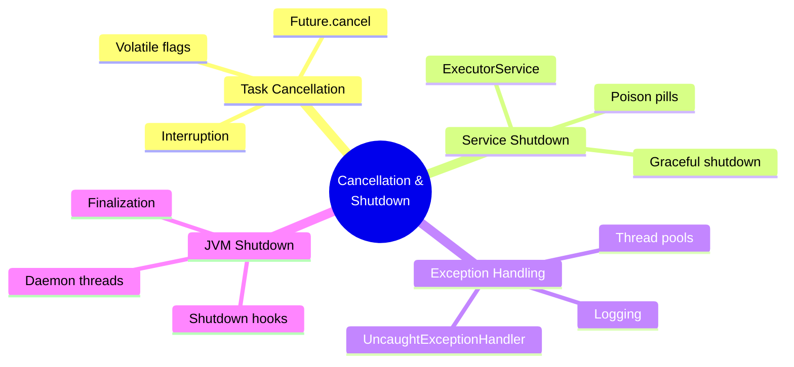
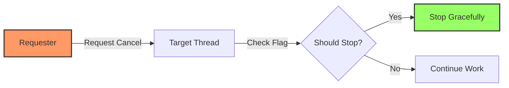
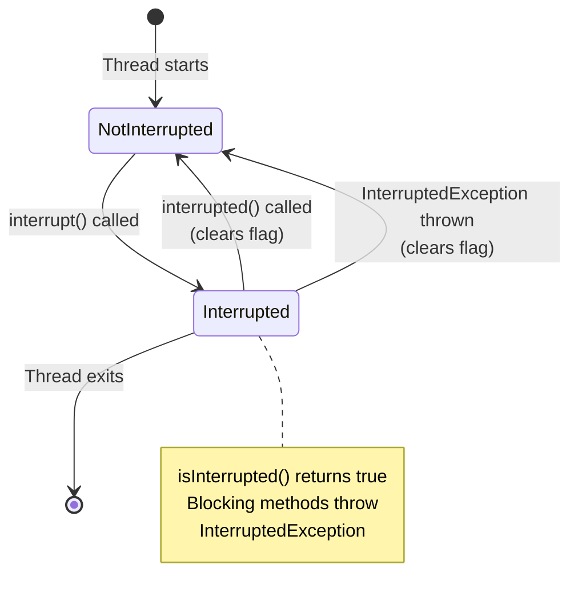
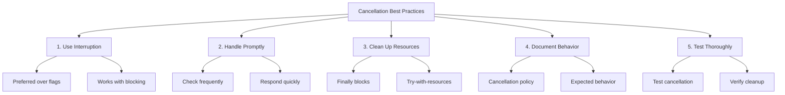

# 📚 Chapter 7: Cancellation and Shutdown

> **Master the art of gracefully stopping tasks and services - one of the most challenging aspects of concurrent programming**

---

## 📖 Table of Contents

1. [Overview](#-overview)
2. [Task Cancellation](#-71-task-cancellation)
3. [Stopping Thread-Based Services](#-72-stopping-a-thread-based-service)
4. [Handling Abnormal Thread Termination](#-73-handling-abnormal-thread-termination)
5. [JVM Shutdown](#-74-jvm-shutdown)
6. [Best Practices](#-best-practices)
7. [Practice Exercises](#-practice-exercises)

---

## 🎯 Overview

Tasks and services in concurrent applications need to be stopped gracefully. This chapter explores the mechanisms and patterns for safe cancellation and shutdown - one of the most error-prone aspects of concurrent programming.

### **Why This Chapter Matters:**
- 🛑 **Safe Termination**: Learn to stop tasks without data corruption
- 🎯 **Resource Cleanup**: Properly release resources on shutdown
- ⚡ **Responsiveness**: Ensure timely response to cancellation requests
- 🔧 **Reliability**: Handle abnormal termination gracefully
- 🛡️ **Data Integrity**: Maintain consistency during shutdown

### **Key Learning Objectives:**



---

## 🛑 7.1 Task Cancellation

### **Why Cancellation is Hard**

Cancellation in Java is **cooperative** - the target thread must cooperate in being cancelled:



---

### **❌ Broken Cancellation: Thread.stop()**

```java
/**
 * NEVER USE Thread.stop()! It's deprecated and dangerous!
 */
public class BrokenCancellation {
    public static void main(String[] args) throws InterruptedException {
        Thread worker = new Thread(() -> {
            try {
                while (true) {
                    processData();  // May leave data in inconsistent state
                }
            } catch (ThreadDeath e) {
                // Thread.stop() throws ThreadDeath
                // Data may be corrupted!
            }
        });
        
        worker.start();
        Thread.sleep(1000);
        
        // ❌ NEVER DO THIS!
        // worker.stop();  // Deprecated, unsafe, corrupts data!
    }
    
    static void processData() {
        // Complex operation that might be interrupted mid-way
    }
}
```

**Why Thread.stop() is Dangerous:**
```
Thread executing:
1. Update database record
2. Update cache         ← stop() called here!
3. Send notification    ← Never executed!

Result: Inconsistent state between database and cache! 💥
```

---

### **✅ Approach 1: Volatile Flag**

```java
/**
 * Cancellation using volatile flag
 */
public class VolatileCancellation {
    private volatile boolean cancelled = false;
    
    public void cancel() {
        cancelled = true;
    }
    
    public void run() {
        while (!cancelled) {
            // Check flag frequently
            processTask();
        }
        // Cleanup before exit
        cleanup();
    }
    
    private void processTask() {
        // Do work
    }
    
    private void cleanup() {
        // Release resources
    }
}
```

**Advantages:**
- ✅ Simple to understand
- ✅ Explicit control
- ✅ Safe for non-blocking code

**Limitations:**
- ❌ Doesn't work if thread is blocked (I/O, wait, sleep)
- ❌ Requires frequent flag checks
- ❌ May not be timely

---

### **🎯 Approach 2: Interruption (Preferred)**

```java
/**
 * Cancellation using interruption - THE RIGHT WAY
 */
public class InterruptionCancellation {
    private final BlockingQueue<Task> queue;
    
    public InterruptionCancellation(BlockingQueue<Task> queue) {
        this.queue = queue;
    }
    
    public void run() {
        try {
            while (!Thread.currentThread().isInterrupted()) {
                Task task = queue.take();  // ← Responds to interruption
                task.execute();
            }
        } catch (InterruptedException e) {
            // Thread was interrupted, cleanup and exit
            Thread.currentThread().interrupt();  // ← Restore interrupt status
        } finally {
            cleanup();
        }
    }
    
    private void cleanup() {
        // Release resources
    }
    
    static class Task {
        void execute() {}
    }
}
```

---

### **🔬 Deep Dive: Interruption Mechanics**

```java
/**
 * Understanding interruption
 */
public class InterruptionMechanics {
    
    /**
     * Interruption status is a boolean flag in Thread
     */
    public void demonstrateInterruption() {
        Thread t = new Thread(() -> {
            while (!Thread.currentThread().isInterrupted()) {
                // Do work
                System.out.println("Working...");
                try {
                    Thread.sleep(100);
                } catch (InterruptedException e) {
                    // sleep() clears interrupt status!
                    // Must restore it or handle appropriately
                    Thread.currentThread().interrupt();
                    break;
                }
            }
            System.out.println("Thread stopped");
        });
        
        t.start();
        
        // Interrupt after 1 second
        try {
            Thread.sleep(1000);
            t.interrupt();  // ← Set interrupt flag
            t.join();
        } catch (InterruptedException e) {
            Thread.currentThread().interrupt();
        }
    }
}
```

**Interruption State Diagram:**



---

### **📋 Interruption Best Practices**

```java
/**
 * Handling InterruptedException correctly
 */
public class InterruptionHandling {
    
    // ✅ OPTION 1: Propagate exception
    public void propagateException() throws InterruptedException {
        Task task = queue.take();  // May throw InterruptedException
        task.execute();
        // Let caller handle interruption
    }
    
    // ✅ OPTION 2: Restore interrupt status
    public void restoreStatus() {
        try {
            Task task = queue.take();
            task.execute();
        } catch (InterruptedException e) {
            Thread.currentThread().interrupt();  // ← Restore status
            // Handle cleanup
        }
    }
    
    // ❌ WRONG: Swallow exception
    public void swallowException() {
        try {
            Task task = queue.take();
            task.execute();
        } catch (InterruptedException e) {
            // ❌ DON'T DO NOTHING!
            // Interrupt status lost!
        }
    }
    
    // ❌ WRONG: Log and continue
    public void logAndContinue() {
        try {
            Task task = queue.take();
            task.execute();
        } catch (InterruptedException e) {
            log.error("Interrupted", e);  // ❌ Interrupt status lost!
            // Continues as if nothing happened
        }
    }
    
    private BlockingQueue<Task> queue = new LinkedBlockingQueue<>();
    private static final Logger log = Logger.getLogger(InterruptionHandling.class.getName());
    
    static class Task {
        void execute() {}
    }
}
```

---

### **🎯 Prime Number Generator Example**

```java
/**
 * Complete example: Cancellable prime number generator
 */
public class PrimeGenerator implements Runnable {
    private final List<BigInteger> primes = new ArrayList<>();
    private volatile boolean cancelled = false;
    
    @Override
    public void run() {
        BigInteger p = BigInteger.ONE;
        while (!cancelled) {
            p = p.nextProbablePrime();
            synchronized (this) {
                primes.add(p);
            }
        }
    }
    
    public void cancel() {
        cancelled = true;
    }
    
    public synchronized List<BigInteger> get() {
        return new ArrayList<>(primes);
    }
    
    /**
     * Better version using interruption
     */
    static class InterruptiblePrimeGenerator implements Runnable {
        private final BlockingQueue<BigInteger> primes = new LinkedBlockingQueue<>();
        
        @Override
        public void run() {
            try {
                BigInteger p = BigInteger.ONE;
                while (!Thread.currentThread().isInterrupted()) {
                    p = p.nextProbablePrime();
                    primes.put(p);  // ← Responds to interruption
                }
            } catch (InterruptedException e) {
                // Exit gracefully
            }
        }
        
        public void cancel() {
            Thread.currentThread().interrupt();
        }
        
        public List<BigInteger> get() {
            return new ArrayList<>(primes);
        }
    }
}

/**
 * Usage
 */
public class PrimeGeneratorDemo {
    public static void main(String[] args) throws InterruptedException {
        PrimeGenerator.InterruptiblePrimeGenerator generator = 
            new PrimeGenerator.InterruptiblePrimeGenerator();
        
        Thread t = new Thread(generator);
        t.start();
        
        try {
            Thread.sleep(1000);  // Generate for 1 second
        } finally {
            t.interrupt();  // Cancel generation
        }
        
        t.join();
        List<BigInteger> primes = generator.get();
        System.out.println("Generated " + primes.size() + " primes");
    }
}
```

---

### **⏰ Timed Cancellation with Future**

```java
/**
 * Cancelling tasks with timeout using Future
 */
public class TimedCancellation {
    private final ExecutorService executor = Executors.newCachedThreadPool();
    
    /**
     * Execute task with timeout
     */
    public <T> T executeWithTimeout(Callable<T> task, long timeout, TimeUnit unit) 
            throws InterruptedException, ExecutionException, TimeoutException {
        Future<T> future = executor.submit(task);
        try {
            return future.get(timeout, unit);  // ← Throws TimeoutException
        } catch (TimeoutException e) {
            // Cancel task on timeout
            future.cancel(true);  // ← Interrupt if running
            throw e;
        }
    }
    
    /**
     * Example: Fetching ad with time budget
     */
    public Ad fetchAd(long budget, TimeUnit unit) {
        Future<Ad> future = executor.submit(() -> fetchAdFromProvider());
        
        try {
            return future.get(budget, unit);
        } catch (TimeoutException e) {
            System.out.println("Ad fetch timed out");
            return DEFAULT_AD;
        } catch (ExecutionException e) {
            System.err.println("Ad fetch failed: " + e.getCause());
            return DEFAULT_AD;
        } catch (InterruptedException e) {
            Thread.currentThread().interrupt();
            future.cancel(true);
            return DEFAULT_AD;
        }
    }
    
    private Ad fetchAdFromProvider() {
        // Slow operation
        return new Ad();
    }
    
    private static final Ad DEFAULT_AD = new Ad();
    
    static class Ad {}
}
```

---

### **🔄 Cancelling Non-Interruptible Operations**

```java
/**
 * Cancelling operations that don't respond to interruption
 */
public class NonInterruptibleCancellation {
    
    /**
     * Socket I/O doesn't respond to interruption
     * Solution: Close the socket
     */
    static class ReaderThread extends Thread {
        private final Socket socket;
        private final InputStream in;
        
        public ReaderThread(Socket socket) throws IOException {
            this.socket = socket;
            this.in = socket.getInputStream();
        }
        
        @Override
        public void interrupt() {
            try {
                socket.close();  // ← Closes underlying socket
            } catch (IOException ignored) {
            } finally {
                super.interrupt();
            }
        }
        
        @Override
        public void run() {
            try {
                byte[] buf = new byte[1024];
                while (true) {
                    int count = in.read(buf);  // ← Blocks on I/O
                    if (count < 0) {
                        break;
                    }
                    processBuffer(buf, count);
                }
            } catch (IOException e) {
                // Socket closed, exit gracefully
            }
        }
        
        private void processBuffer(byte[] buf, int count) {
            // Process data
        }
    }
    
    /**
     * Synchronous lock acquisition doesn't respond to interruption
     * Solution: Use lockInterruptibly()
     */
    static class InterruptibleLocking {
        private final Lock lock = new ReentrantLock();
        
        public void doWork() throws InterruptedException {
            // ✅ Use lockInterruptibly() instead of lock()
            lock.lockInterruptibly();  // ← Responds to interruption
            try {
                // Critical section
                performWork();
            } finally {
                lock.unlock();
            }
        }
        
        private void performWork() {
            // Do work
        }
    }
}
```

---

## 🏭 7.2 Stopping a Thread-Based Service

### **Producer-Consumer with Cancellation**

```java
/**
 * Producer-consumer service with proper shutdown
 */
public class LogService {
    private final BlockingQueue<String> queue = new LinkedBlockingQueue<>();
    private final LoggerThread loggerThread = new LoggerThread();
    private boolean isShutdown = false;
    private int reservations = 0;
    
    public void start() {
        loggerThread.start();
    }
    
    /**
     * Producer: Log a message
     */
    public void log(String msg) throws InterruptedException {
        synchronized (this) {
            if (isShutdown) {
                throw new IllegalStateException("Service is shutdown");
            }
            ++reservations;  // ← Reserve a slot
        }
        queue.put(msg);
    }
    
    /**
     * Graceful shutdown
     */
    public void stop() {
        synchronized (this) {
            isShutdown = true;
        }
        loggerThread.interrupt();
    }
    
    /**
     * Consumer: Process log messages
     */
    private class LoggerThread extends Thread {
        @Override
        public void run() {
            try {
                while (true) {
                    try {
                        synchronized (LogService.this) {
                            if (isShutdown && reservations == 0) {
                                break;  // ← Exit when shutdown and queue empty
                            }
                        }
                        String msg = queue.take();
                        synchronized (LogService.this) {
                            --reservations;  // ← Consume reservation
                        }
                        System.out.println(msg);  // Write to log
                    } catch (InterruptedException e) {
                        // Retry
                    }
                }
            } finally {
                System.out.println("Logger thread exiting");
            }
        }
    }
}
```

---

### **📦 Poison Pill Pattern**

```java
/**
 * Using poison pill for shutdown
 */
public class IndexingService {
    private static final File POISON_PILL = new File("");
    private final IndexerThread consumer = new IndexerThread();
    private final CrawlerThread producer = new CrawlerThread();
    private final BlockingQueue<File> queue = new LinkedBlockingQueue<>();
    private final FileFilter fileFilter;
    private final File root;
    
    public IndexingService(File root, FileFilter fileFilter) {
        this.root = root;
        this.fileFilter = fileFilter;
    }
    
    public void start() {
        producer.start();
        consumer.start();
    }
    
    public void stop() {
        producer.interrupt();
    }
    
    public void awaitTermination() throws InterruptedException {
        consumer.join();
    }
    
    /**
     * Producer: Crawl files
     */
    class CrawlerThread extends Thread {
        @Override
        public void run() {
            try {
                crawl(root);
            } catch (InterruptedException e) {
                // Exit
            } finally {
                // Put poison pill when done
                while (true) {
                    try {
                        queue.put(POISON_PILL);  // ← Signal shutdown
                        break;
                    } catch (InterruptedException e1) {
                        // Retry
                    }
                }
            }
        }
        
        private void crawl(File root) throws InterruptedException {
            File[] entries = root.listFiles(fileFilter);
            if (entries != null) {
                for (File entry : entries) {
                    if (entry.isDirectory()) {
                        crawl(entry);
                    } else {
                        queue.put(entry);
                    }
                }
            }
        }
    }
    
    /**
     * Consumer: Index files
     */
    class IndexerThread extends Thread {
        @Override
        public void run() {
            try {
                while (true) {
                    File file = queue.take();
                    if (file == POISON_PILL) {  // ← Check for poison pill
                        break;
                    }
                    indexFile(file);
                }
            } catch (InterruptedException e) {
                // Exit
            }
        }
        
        private void indexFile(File file) {
            // Index the file
        }
    }
}
```

---

### **🎯 ExecutorService Shutdown**

```java
/**
 * Proper ExecutorService shutdown
 */
public class ExecutorServiceShutdown {
    private final ExecutorService executor = Executors.newCachedThreadPool();
    
    /**
     * Graceful shutdown with timeout
     */
    public void shutdown() {
        executor.shutdown();  // ← No new tasks accepted
        
        try {
            // Wait for existing tasks to complete
            if (!executor.awaitTermination(60, TimeUnit.SECONDS)) {
                // Force shutdown if timeout
                executor.shutdownNow();  // ← Cancel running tasks
                
                // Wait again for tasks to respond to cancellation
                if (!executor.awaitTermination(60, TimeUnit.SECONDS)) {
                    System.err.println("Executor did not terminate");
                }
            }
        } catch (InterruptedException e) {
            // Re-interrupt current thread
            executor.shutdownNow();
            Thread.currentThread().interrupt();
        }
    }
    
    /**
     * Shutdown with unfinished task tracking
     */
    public List<Runnable> shutdownAndGetUnfinishedTasks() {
        executor.shutdown();
        
        try {
            if (!executor.awaitTermination(30, TimeUnit.SECONDS)) {
                // Force shutdown and get unfinished tasks
                return executor.shutdownNow();
            }
        } catch (InterruptedException e) {
            return executor.shutdownNow();
        }
        
        return Collections.emptyList();
    }
}
```

**Shutdown Timeline:**

```
Normal Shutdown (shutdown()):
Active tasks:  [████] [████] [███]
Queued tasks:  [▓▓▓▓] [▓▓▓▓]
               └─────────────┘
shutdown() called
               No new tasks accepted
Active tasks:  [████] [████] [███] ← Continue
Queued tasks:  [▓▓▓▓] [▓▓▓▓]       ← Will be executed
               └─────────────────┘
All tasks complete → Terminated

Forceful Shutdown (shutdownNow()):
Active tasks:  [████] [████] [███]
Queued tasks:  [▓▓▓▓] [▓▓▓▓]
               └─────────────┘
shutdownNow() called
Active tasks:  [STOP] [STOP] [STOP] ← Interrupted
Queued tasks:  [▓▓▓▓] [▓▓▓▓]        ← Returned as list
               └────────────────────┘
Immediate termination (best effort)
```

---

## 💥 7.3 Handling Abnormal Thread Termination

### **UncaughtExceptionHandler**

```java
/**
 * Handling uncaught exceptions in threads
 */
public class UncaughtExceptionHandling {
    
    /**
     * Custom exception handler
     */
    static class CustomExceptionHandler implements Thread.UncaughtExceptionHandler {
        @Override
        public void uncaughtException(Thread t, Throwable e) {
            System.err.println("Thread " + t.getName() + 
                             " threw exception: " + e);
            // Log to file, send alert, restart thread, etc.
        }
    }
    
    /**
     * Setting handler for a specific thread
     */
    public void demoThreadHandler() {
        Thread t = new Thread(() -> {
            throw new RuntimeException("Oops!");
        });
        
        t.setUncaughtExceptionHandler(new CustomExceptionHandler());
        t.start();
    }
    
    /**
     * Setting default handler for all threads
     */
    public void demoDefaultHandler() {
        Thread.setDefaultUncaughtExceptionHandler(new CustomExceptionHandler());
        
        // All threads will use this handler
        new Thread(() -> {
            throw new RuntimeException("Oops!");
        }).start();
    }
    
    /**
     * Handler that logs and restarts thread
     */
    static class RestartingExceptionHandler implements Thread.UncaughtExceptionHandler {
        private final Runnable task;
        
        public RestartingExceptionHandler(Runnable task) {
            this.task = task;
        }
        
        @Override
        public void uncaughtException(Thread t, Throwable e) {
            System.err.println("Thread " + t.getName() + " failed: " + e);
            System.out.println("Restarting thread...");
            
            Thread newThread = new Thread(task, t.getName() + "-restart");
            newThread.setUncaughtExceptionHandler(this);
            newThread.start();
        }
    }
}
```

---

### **Thread Pool Exception Handling**

```java
/**
 * Exception handling in thread pools
 */
public class ThreadPoolExceptionHandling {
    
    /**
     * Custom ThreadFactory with exception handler
     */
    static class HandlingThreadFactory implements ThreadFactory {
        private final Thread.UncaughtExceptionHandler handler;
        private final AtomicInteger threadNumber = new AtomicInteger(1);
        
        public HandlingThreadFactory(Thread.UncaughtExceptionHandler handler) {
            this.handler = handler;
        }
        
        @Override
        public Thread newThread(Runnable r) {
            Thread t = new Thread(r);
            t.setName("Worker-" + threadNumber.getAndIncrement());
            t.setUncaughtExceptionHandler(handler);
            return t;
        }
    }
    
    /**
     * Creating executor with exception handling
     */
    public ExecutorService createHandlingExecutor() {
        ThreadFactory factory = new HandlingThreadFactory(
            (t, e) -> System.err.println("Thread " + t.getName() + 
                                       " threw: " + e)
        );
        
        return Executors.newFixedThreadPool(10, factory);
    }
    
    /**
     * Handling exceptions from Future
     */
    public void handleFutureExceptions() {
        ExecutorService executor = Executors.newCachedThreadPool();
        
        Future<?> future = executor.submit(() -> {
            throw new RuntimeException("Task failed!");
        });
        
        try {
            future.get();  // ← Exception thrown here
        } catch (ExecutionException e) {
            Throwable cause = e.getCause();
            System.err.println("Task failed: " + cause);
            // Handle exception
        } catch (InterruptedException e) {
            Thread.currentThread().interrupt();
        }
        
        executor.shutdown();
    }
}
```

---

## 🔌 7.4 JVM Shutdown

### **Shutdown Hooks**

```java
/**
 * Using shutdown hooks for cleanup
 */
public class ShutdownHooks {
    
    /**
     * Registering a shutdown hook
     */
    public static void main(String[] args) {
        // Register shutdown hook
        Runtime.getRuntime().addShutdownHook(new Thread(() -> {
            System.out.println("Shutdown hook running...");
            performCleanup();
            System.out.println("Cleanup complete");
        }));
        
        // Application logic
        System.out.println("Application starting...");
        doWork();
        System.out.println("Application exiting...");
        // Shutdown hook will run here
    }
    
    /**
     * Service with shutdown hook
     */
    public static class ManagedService {
        private final ExecutorService executor = Executors.newCachedThreadPool();
        
        public void start() {
            // Register shutdown hook
            Runtime.getRuntime().addShutdownHook(new Thread(() -> {
                shutdownService();
            }));
            
            // Start service
            System.out.println("Service started");
        }
        
        private void shutdownService() {
            System.out.println("Shutting down service...");
            executor.shutdown();
            try {
                if (!executor.awaitTermination(60, TimeUnit.SECONDS)) {
                    executor.shutdownNow();
                }
            } catch (InterruptedException e) {
                executor.shutdownNow();
            }
            System.out.println("Service shutdown complete");
        }
    }
    
    private static void doWork() {
        try {
            Thread.sleep(5000);
        } catch (InterruptedException e) {
            Thread.currentThread().interrupt();
        }
    }
    
    private static void performCleanup() {
        // Close resources, flush buffers, etc.
    }
}
```

**Shutdown Hook Timeline:**

```
Normal JVM Shutdown:
1. Main thread exits
2. Shutdown hooks start
3. All hooks run concurrently
4. Hooks complete (or timeout)
5. JVM exits

Forced Shutdown (Runtime.halt()):
1. JVM exits immediately
2. No hooks run! 💥
3. Resources may leak

System.exit(status):
1. Triggers normal shutdown
2. Hooks run
3. JVM exits with status
```

---

### **Daemon Threads**

```java
/**
 * Understanding daemon threads
 */
public class DaemonThreads {
    
    /**
     * Daemon vs Non-Daemon threads
     */
    public static void main(String[] args) throws InterruptedException {
        // Non-daemon thread (keeps JVM alive)
        Thread userThread = new Thread(() -> {
            try {
                Thread.sleep(10000);
                System.out.println("User thread finished");
            } catch (InterruptedException e) {
                Thread.currentThread().interrupt();
            }
        });
        userThread.start();
        
        // Daemon thread (won't keep JVM alive)
        Thread daemonThread = new Thread(() -> {
            try {
                while (true) {
                    System.out.println("Daemon working...");
                    Thread.sleep(1000);
                }
            } catch (InterruptedException e) {
                Thread.currentThread().interrupt();
            }
        });
        daemonThread.setDaemon(true);  // ← Mark as daemon
        daemonThread.start();
        
        System.out.println("Main thread exiting...");
        // JVM will wait for userThread, but not daemonThread
    }
    
    /**
     * Daemon thread for periodic tasks
     */
    public static class PeriodicCleaner {
        private final ScheduledExecutorService scheduler;
        
        public PeriodicCleaner() {
            // Create daemon thread factory
            ThreadFactory daemonFactory = r -> {
                Thread t = new Thread(r);
                t.setDaemon(true);
                return t;
            };
            
            // Create scheduler with daemon threads
            scheduler = Executors.newScheduledThreadPool(1, daemonFactory);
        }
        
        public void start() {
            scheduler.scheduleAtFixedRate(
                this::cleanup,
                0,
                10,
                TimeUnit.MINUTES
            );
        }
        
        private void cleanup() {
            System.out.println("Performing cleanup...");
            // Cleanup logic
        }
    }
}
```

---

## ✅ Best Practices

### **🎯 Cancellation Best Practices**



---

### **1️⃣ Always Restore Interrupt Status**

```java
// ❌ BAD: Swallows interruption
try {
    Thread.sleep(1000);
} catch (InterruptedException e) {
    // Lost interrupt status!
}

// ✅ GOOD: Restores interrupt status
try {
    Thread.sleep(1000);
} catch (InterruptedException e) {
    Thread.currentThread().interrupt();  // ← Restore
    // Handle appropriately
}
```

---

### **2️⃣ Use ExecutorService for Lifecycle Management**

java
// ❌ AVOID: Manual thread management
Thread t = new Thread(task);
t.start();
// How do you stop it?

// ✅ PREFER: ExecutorService
ExecutorService executor = Executors.newCachedThreadPool();
Future<?> future = executor.submit(task);
future.cancel(true);  // Cancel specific task
executor.shutdown();  // Shutdown entire service
```

---

### **3️⃣ Document Cancellation Policy**

```java
/**
 * Well-documented cancellable service
 * 
 * Cancellation Policy:
 * - Responds to interruption within 1 second
 * - Closes all resources before exit
 * - In-progress operations complete or rollback atomically
 * - Queued tasks are not executed after shutdown
 */
public class DocumentedCancellableService {
    /**
     * Executes task. May be cancelled via interruption.
     * 
     * @param task task to execute
     * @throws InterruptedException if interrupted while waiting
     */
    public void execute(Task task) throws InterruptedException {
        // Implementation
    }
}
```

---

### **4️⃣ Shutdown Hook Template**

```java
/**
 * Comprehensive shutdown hook template
 */
public class ShutdownHookTemplate {
    private final ExecutorService executor = Executors.newCachedThreadPool();
    private final DataSource dataSource;
    
    public ShutdownHookTemplate(DataSource dataSource) {
        this.dataSource = dataSource;
        registerShutdownHook();
    }
    
    private void registerShutdownHook() {
        Runtime.getRuntime().addShutdownHook(new Thread(() -> {
            System.out.println("Shutdown initiated...");
            
            try {
                // 1. Stop accepting new work
                executor.shutdown();
                
                // 2. Wait for existing work to complete
                if (!executor.awaitTermination(30, TimeUnit.SECONDS)) {
                    System.err.println("Forcing shutdown...");
                    executor.shutdownNow();
                    
                    if (!executor.awaitTermination(10, TimeUnit.SECONDS)) {
                        System.err.println("Executor did not terminate");
                    }
                }
                
                // 3. Close database connections
                dataSource.close();
                
                // 4. Flush logs
                flushLogs();
                
                System.out.println("Shutdown complete");
            } catch (InterruptedException e) {
                executor.shutdownNow();
                Thread.currentThread().interrupt();
            } catch (Exception e) {
                System.err.println("Error during shutdown: " + e);
            }
        }));
    }
    
    private void flushLogs() {
        // Flush any pending log entries
    }
    
    interface DataSource {
        void close() throws Exception;
    }
}
```

---

## 🎓 Practice Exercises

### **Exercise 1: Implement Cancellable Task**

**Task:** Create a long-running data processing task that:
- Can be cancelled via interruption
- Cleans up resources on cancellation
- Completes current item before stopping

<details>
<summary>💡 Solution</summary>

```java
public class CancellableDataProcessor implements Callable<ProcessingResult> {
    private final List<DataItem> items;
    private final DataSink sink;
    
    public CancellableDataProcessor(List<DataItem> items, DataSink sink) {
        this.items = items;
        this.sink = sink;
    }
    
    @Override
    public ProcessingResult call() throws InterruptedException {
        int processed = 0;
        int failed = 0;
        
        try {
            for (DataItem item : items) {
                // Check interruption status before each item
                if (Thread.currentThread().isInterrupted()) {
                    throw new InterruptedException("Cancelled");
                }
                
                try {
                    ProcessedData result = processItem(item);
                    sink.write(result);  // ← May throw InterruptedException
                    processed++;
                } catch (ProcessingException e) {
                    System.err.println("Failed to process: " + item);
                    failed++;
                }
            }
        } finally {
            // Always cleanup, even if cancelled
            sink.close();
        }
        
        return new ProcessingResult(processed, failed);
    }
    
    private ProcessedData processItem(DataItem item) throws ProcessingException {
        // Simulate processing
        return new ProcessedData();
    }
    
    static class ProcessingResult {
        final int processed;
        final int failed;
        
        ProcessingResult(int processed, int failed) {
            this.processed = processed;
            this.failed = failed;
        }
    }
    
    static class DataItem {}
    static class ProcessedData {}
    static class ProcessingException extends Exception {}
    
    interface DataSink {
        void write(ProcessedData data) throws InterruptedException;
        void close();
    }
}
```
</details>

---

### **Exercise 2: Service with Graceful Shutdown**

**Task:** Create a web crawler service with:
- Start/stop methods
- Graceful shutdown (finishes current pages)
- Forced shutdown (stops immediately)
- Resource cleanup

<details>
<summary>💡 Solution</summary>

```java
public class WebCrawlerService {
    private final ExecutorService executor;
    private final Set<URL> visited = ConcurrentHashMap.newKeySet();
    private volatile boolean shutdown = false;
    private final CountDownLatch terminationLatch = new CountDownLatch(1);
    
    public WebCrawlerService(int poolSize) {
        this.executor = Executors.newFixedThreadPool(poolSize);
    }
    
    public void start(URL startUrl) {
        crawl(startUrl);
    }
    
    private void crawl(URL url) {
        if (shutdown || !visited.add(url)) {
            return;
        }
        
        executor.submit(() -> {
            try {
                Page page = download(url);
                for (URL link : page.getLinks()) {
                    crawl(link);
                }
            } catch (IOException e) {
                System.err.println("Failed to crawl: " + url);
            }
        });
    }
    
    /**
     * Graceful shutdown - completes queued tasks
     */
    public void shutdown() {
        shutdown = true;
        executor.shutdown();
        
        try {
            if (!executor.awaitTermination(60, TimeUnit.SECONDS)) {
                System.err.println("Forcing shutdown...");
                shutdownNow();
            }
        } catch (InterruptedException e) {
            shutdownNow();
            Thread.currentThread().interrupt();
        } finally {
            terminationLatch.countDown();
        }
    }
    
    /**
     * Forced shutdown - cancels running tasks
     */
    public List<Runnable> shutdownNow() {
        shutdown = true;
        List<Runnable> unfinished = executor.shutdownNow();
        terminationLatch.countDown();
        return unfinished;
    }
    
    /**
     * Wait for service to terminate
     */
    public void awaitTermination() throws InterruptedException {
        terminationLatch.await();
    }
    
    public boolean isShutdown() {
        return shutdown;
    }
    
    private Page download(URL url) throws IOException {
        // Download page
        return new Page();
    }
    
    static class Page {
        List<URL> getLinks() {
            return new ArrayList<>();
        }
    }
}
```
</details>

---

## 📚 Summary

### **🎯 Key Takeaways**

| Topic | Key Points |
|-------|-----------|
| **Cancellation** | Use interruption, not flags or deprecated methods |
| **Interruption** | Cooperative mechanism requiring target thread cooperation |
| **Service Shutdown** | Use ExecutorService shutdown methods or poison pills |
| **Exception Handling** | UncaughtExceptionHandler for thread-level exceptions |
| **JVM Shutdown** | Shutdown hooks for cleanup, daemon threads for background |

---

### **✅ Cancellation Checklist**

- [ ] **Use interruption as primary cancellation mechanism**
- [ ] **Always restore interrupt status after catching InterruptedException**
- [ ] **Handle InterruptedException promptly**
- [ ] **Clean up resources in finally blocks**
- [ ] **Use Future.cancel() for task-level cancellation**
- [ ] **Use ExecutorService shutdown methods for service-level shutdown**
- [ ] **Register shutdown hooks for critical cleanup**
- [ ] **Document cancellation policy clearly**
- [ ] **Test cancellation under various scenarios**

---

## 🔗 What's Next?

### **Chapter 8: Applying Thread Pools**
Learn to configure and optimize thread pools:
- Thread pool sizing
- Configuring ThreadPoolExecutor
- Saturation policies
- Extending thread pools

---

## 📚 Additional Resources

### **Related Tutorials:**
- [`../tutorials/03-thread-interruption.md`](../tutorials/03-thread-interruption.md)
- [`../tutorials/comprehensive-thread-interruption.md`](../tutorials/comprehensive-thread-interruption.md)

---

## 💭 Final Thoughts

> **"Stopping things is harder than starting them. Cancellation and shutdown deserve as much attention as the main logic."**

**Key Insights:**

1. 🎯 **Interruption is King**: Use Thread.interrupt() as primary mechanism
2. 🛑 **Cooperative**: Target must check and respond to cancellation
3. 🧹 **Cleanup Always**: Use finally blocks for guaranteed cleanup
4. 📝 **Document Policy**: Make cancellation behavior explicit
5. 🧪 **Test Cancellation**: As important as testing happy path

**Remember:**
- Never use Thread.stop()
- Always restore interrupt status
- Use ExecutorService for lifecycle management
- Shutdown hooks for critical cleanup
- Test cancellation scenarios thoroughly

**You now understand how to gracefully stop tasks and services. Ready to optimize thread pools in Chapter 8!**

---

**[← Previous: Chapter 6 - Task Execution](./06-task-execution.md)** | **[Back to README](./README.md)** | **[Next: Chapter 8 - Applying Thread Pools →](./08-thread-pools.md)**

---

*Chapter 7 completed! You now master cancellation and shutdown - critical skills for production systems.*
