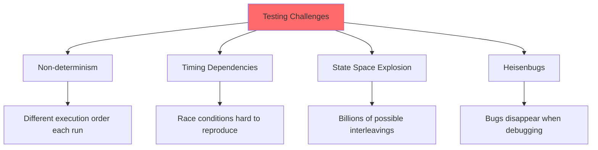
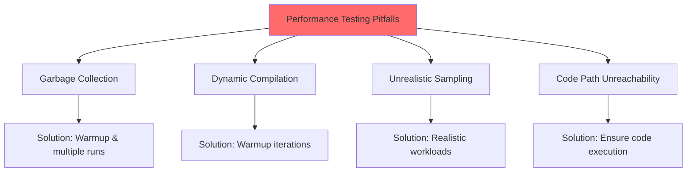
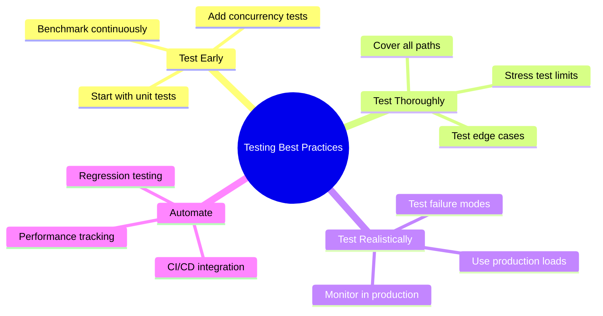

# 🧪 Chapter 12: Testing Concurrent Programs

> **Master the art and science of testing concurrent code - from correctness verification to performance benchmarking and stress testing.**

---

## 🎯 Learning Objectives

By the end of this chapter, you will be able to:

- ✅ Write effective unit tests for concurrent classes
- ✅ Test for safety and liveness properties systematically
- ✅ Generate more thread interleavings to expose race conditions
- ✅ Measure and validate performance characteristics
- ✅ Avoid common pitfalls in performance testing
- ✅ Use complementary testing approaches (static analysis, code review)
- ✅ Build confidence in concurrent code through comprehensive testing
- ✅ Create reproducible test cases for concurrency bugs

---

## 📚 Prerequisites

- ✅ **Thread Safety** (Chapter 2) - Understanding race conditions
- ✅ **Synchronization** (Chapters 2-5) - Locks, atomics, barriers
- ✅ **Liveness** (Chapter 10) - Deadlock, starvation
- ✅ **Performance** (Chapter 11) - Metrics, profiling
- ✅ **JUnit or TestNG** - Unit testing framework basics

---

## 📋 Table of Contents

1. [Testing for Correctness](#-121-testing-for-correctness)
2. [Testing for Performance](#-122-testing-for-performance)
3. [Avoiding Performance Testing Pitfalls](#-123-avoiding-performance-testing-pitfalls)
4. [Complementary Testing Approaches](#-124-complementary-testing-approaches)
5. [Practical Examples](#-practical-examples)
6. [Common Pitfalls](#-common-pitfalls)
7. [Best Practices](#-best-practices)
8. [Summary](#-summary)

---

## 🔍 12.1 Testing for Correctness

### **The Challenge of Testing Concurrent Code**

Concurrent programs are notoriously difficult to test:



### **Testing Strategy Pyramid**

```
              ┌───────────────┐
              │  Integration  │  ← Few, slow, realistic
              │     Tests     │
              ├───────────────┤
              │  Concurrency  │  ← Moderate, focus on races
              │     Tests     │
              ├───────────────┤
              │  Unit Tests   │  ← Many, fast, isolated
              └───────────────┘
```

---

### **1. Testing Basic Functionality**

Start with sequential tests before concurrent ones:

```java
/**
 * Example: Testing a bounded buffer
 */
@Test
public class BoundedBufferTest {
    
    private static final long LOCKUP_DETECT_TIMEOUT = 1000; // ms
    
    /**
     * Test basic functionality sequentially
     */
    @Test
    public void testIsEmptyWhenConstructed() {
        BoundedBuffer<Integer> buffer = new BoundedBuffer<>(10);
        assertTrue(buffer.isEmpty());
        assertFalse(buffer.isFull());
    }
    
    @Test
    public void testIsFullAfterPuts() throws InterruptedException {
        BoundedBuffer<Integer> buffer = new BoundedBuffer<>(10);
        for (int i = 0; i < 10; i++) {
            buffer.put(i);
        }
        assertTrue(buffer.isFull());
        assertFalse(buffer.isEmpty());
    }
    
    @Test
    public void testTakeBlocksWhenEmpty() {
        final BoundedBuffer<Integer> buffer = new BoundedBuffer<>(10);
        Thread taker = new Thread(() -> {
            try {
                int unused = buffer.take();  // Should block
                fail("take() should block on empty buffer");
            } catch (InterruptedException success) {
                // Expected
            }
        });
        
        try {
            taker.start();
            Thread.sleep(LOCKUP_DETECT_TIMEOUT);
            taker.interrupt();
            taker.join(LOCKUP_DETECT_TIMEOUT);
            assertFalse(taker.isAlive());  // Thread should have terminated
        } catch (InterruptedException e) {
            fail();
        }
    }
    
    /**
     * Test interruption handling
     */
    @Test
    public void testTakeRespondsToInterrupt() throws InterruptedException {
        final BoundedBuffer<Integer> buffer = new BoundedBuffer<>(10);
        Thread taker = new Thread(() -> {
            try {
                buffer.take();
                fail("Expected InterruptedException");
            } catch (InterruptedException success) {
                // Expected - test passes
            }
        });
        
        taker.start();
        Thread.sleep(100);  // Give thread time to block
        taker.interrupt();
        taker.join(LOCKUP_DETECT_TIMEOUT);
        assertFalse(taker.isAlive());
    }
}
```

---

### **2. Testing Safety (No Data Corruption)**

Use multiple threads to expose race conditions:

```java
/**
 * Producer-Consumer test for thread safety
 */
public class ProducerConsumerTest {
    
    @Test
    public void testProducerConsumer() throws Exception {
        final BoundedBuffer<Integer> buffer = new BoundedBuffer<>(10);
        final int nTrials = 10_000;
        final int nPairs = 10;
        
        final BarrierTimer timer = new BarrierTimer();
        final CyclicBarrier barrier = new CyclicBarrier(nPairs * 2 + 1, timer);
        
        // Create producers
        for (int i = 0; i < nPairs; i++) {
            new Thread(new Producer(buffer, barrier, nTrials)).start();
        }
        
        // Create consumers
        for (int i = 0; i < nPairs; i++) {
            new Thread(new Consumer(buffer, barrier, nTrials)).start();
        }
        
        // Wait for all threads to be ready
        barrier.await();
        
        // Wait for all threads to finish
        barrier.await();
        
        // Verify no data corruption
        long nsPerItem = timer.getTime() / (nTrials * nPairs);
        System.out.println("Throughput: " + nsPerItem + " ns/item");
        
        assertEquals(0, buffer.size());
    }
    
    static class Producer implements Runnable {
        private final BoundedBuffer<Integer> buffer;
        private final CyclicBarrier barrier;
        private final int nTrials;
        
        Producer(BoundedBuffer<Integer> buffer, CyclicBarrier barrier, int nTrials) {
            this.buffer = buffer;
            this.barrier = barrier;
            this.nTrials = nTrials;
        }
        
        @Override
        public void run() {
            try {
                int seed = (this.hashCode() ^ (int) System.nanoTime());
                int sum = 0;
                barrier.await();  // Wait for all threads to be ready
                
                for (int i = nTrials; i > 0; --i) {
                    buffer.put(seed);
                    sum += seed;
                    seed = xorShift(seed);
                }
                
                barrier.await();  // Wait for all threads to finish
            } catch (Exception e) {
                throw new RuntimeException(e);
            }
        }
        
        // Simple but fast PRNG
        private int xorShift(int y) {
            y ^= (y << 6);
            y ^= (y >>> 21);
            y ^= (y << 7);
            return y;
        }
    }
    
    static class Consumer implements Runnable {
        private final BoundedBuffer<Integer> buffer;
        private final CyclicBarrier barrier;
        private final int nTrials;
        
        Consumer(BoundedBuffer<Integer> buffer, CyclicBarrier barrier, int nTrials) {
            this.buffer = buffer;
            this.barrier = barrier;
            this.nTrials = nTrials;
        }
        
        @Override
        public void run() {
            try {
                barrier.await();  // Wait for all threads to be ready
                
                int sum = 0;
                for (int i = nTrials; i > 0; --i) {
                    sum += buffer.take();
                }
                
                barrier.await();  // Wait for all threads to finish
            } catch (Exception e) {
                throw new RuntimeException(e);
            }
        }
    }
}
```

---

### **3. Generating More Interleavings**

Use `Thread.yield()` to increase chances of exposing race conditions:

```java
/**
 * Testing with yields to generate more interleavings
 */
public class InterleavingTest {
    
    @Test
    public void testWithYields() {
        final Counter counter = new Counter();
        final int iterations = 10_000;
        final int threads = 10;
        
        List<Thread> threadList = new ArrayList<>();
        
        for (int i = 0; i < threads; i++) {
            Thread t = new Thread(() -> {
                for (int j = 0; j < iterations; j++) {
                    counter.increment();
                    Thread.yield();  // ← Increase interleaving chances
                }
            });
            threadList.add(t);
            t.start();
        }
        
        // Wait for all threads
        for (Thread t : threadList) {
            try {
                t.join();
            } catch (InterruptedException e) {
                fail("Thread interrupted");
            }
        }
        
        // Verify correctness
        assertEquals(threads * iterations, counter.getValue());
    }
    
    static class Counter {
        private final AtomicInteger count = new AtomicInteger(0);
        
        public void increment() {
            count.incrementAndGet();
        }
        
        public int getValue() {
            return count.get();
        }
    }
}
```

---

## 📊 12.2 Testing for Performance

### **Barrier-Based Timer Pattern**

```java
/**
 * Precision timer using barriers
 */
public class BarrierTimer implements Runnable {
    private boolean started;
    private long startTime, endTime;
    
    @Override
    public synchronized void run() {
        long t = System.nanoTime();
        if (!started) {
            started = true;
            startTime = t;
        } else {
            endTime = t;
        }
    }
    
    public synchronized void clear() {
        started = false;
    }
    
    public synchronized long getTime() {
        return endTime - startTime;
    }
}
```

### **Multi-threaded Performance Test**

```java
/**
 * Comprehensive performance test framework
 */
public class PerformanceTest {
    
    @Test
    public void testThroughput() throws Exception {
        int nTrials = 100_000;
        int nThreads = 10;
        
        BoundedBuffer<Integer> buffer = new BoundedBuffer<>(100);
        
        // Measure throughput
        long totalTime = runThroughputTest(buffer, nThreads, nTrials);
        
        System.out.println("Throughput: " + 
            (nTrials * nThreads * 1_000_000_000L / totalTime) + " ops/sec");
    }
    
    private long runThroughputTest(BoundedBuffer<Integer> buffer,
                                   int nThreads, int nTrials) throws Exception {
        BarrierTimer timer = new BarrierTimer();
        CyclicBarrier barrier = new CyclicBarrier(nThreads + 1, timer);
        
        for (int i = 0; i < nThreads; i++) {
            new Thread(() -> {
                try {
                    Random rnd = new Random();
                    barrier.await();  // Start timing
                    
                    for (int j = 0; j < nTrials; j++) {
                        buffer.put(rnd.nextInt());
                        buffer.take();
                    }
                    
                    barrier.await();  // Stop timing
                } catch (Exception e) {
                    throw new RuntimeException(e);
                }
            }).start();
        }
        
        barrier.await();  // Wait for start
        barrier.await();  // Wait for finish
        
        return timer.getTime();
    }
    
    /**
     * Test scalability across different thread counts
     */
    @Test
    public void testScalability() throws Exception {
        int nTrials = 10_000;
        BoundedBuffer<Integer> buffer = new BoundedBuffer<>(100);
        
        System.out.println("Scalability Analysis:");
        System.out.println("Threads | Time (ms) | Throughput (ops/sec)");
        System.out.println("--------|-----------|--------------------");
        
        for (int nThreads = 1; nThreads <= 32; nThreads *= 2) {
            long time = runThroughputTest(buffer, nThreads, nTrials);
            long throughput = nTrials * nThreads * 1_000_000_000L / time;
            
            System.out.printf("%7d | %9.2f | %,18d%n",
                            nThreads,
                            time / 1_000_000.0,
                            throughput);
        }
    }
}
```

---

## ⚠️ 12.3 Avoiding Performance Testing Pitfalls

### **Common Pitfalls and Solutions**



### **1. Garbage Collection Effects**

```java
/**
 * Account for GC in performance tests
 */
public class GCAwareTest {
    
    @Test
    public void testWithGCControl() {
        // Warm up
        for (int i = 0; i < 10; i++) {
            runTest();
            System.gc();  // Suggest GC between runs
            Thread.sleep(100);
        }
        
        // Actual measurements
        List<Long> times = new ArrayList<>();
        for (int i = 0; i < 10; i++) {
            System.gc();  // Clear before each run
            Thread.sleep(100);
            
            long time = runTest();
            times.add(time);
        }
        
        // Report statistics (exclude outliers)
        Collections.sort(times);
        times = times.subList(1, times.size() - 1);  // Remove min/max
        
        long avg = times.stream().mapToLong(Long::longValue).sum() / times.size();
        System.out.println("Average (excluding outliers): " + avg + " ns");
    }
    
    private long runTest() {
        // Test implementation
        return System.nanoTime();
    }
}
```

### **2. Dynamic Compilation (JIT) Effects**

```java
/**
 * Proper warmup for JIT compilation
 */
public class JITAwareTest {
    
    @Test
    public void testWithWarmup() {
        int warmupIterations = 10_000;
        int testIterations = 100_000;
        
        // Warmup phase - let JIT optimize
        System.out.println("Warming up...");
        for (int i = 0; i < warmupIterations; i++) {
            doWork();
        }
        
        // Measurement phase
        System.out.println("Measuring...");
        long start = System.nanoTime();
        for (int i = 0; i < testIterations; i++) {
            doWork();
        }
        long end = System.nanoTime();
        
        long avgTime = (end - start) / testIterations;
        System.out.println("Average time: " + avgTime + " ns");
    }
    
    private void doWork() {
        // Actual work to benchmark
    }
}
```

---

## 🔧 12.4 Complementary Testing Approaches

### **1. Static Analysis Tools**

```java
/**
 * Using annotations for static analysis
 */
@ThreadSafe
public class AnalyzableClass {
    @GuardedBy("this")
    private int count;
    
    public synchronized void increment() {
        count++;  // ✅ Static analyzer verifies lock held
    }
    
    public int getCount() {
        return count;  // ⚠️ Static analyzer warns: not synchronized
    }
}
```

### **2. Code Review Checklist**

```markdown
## Concurrency Code Review Checklist

### Thread Safety
- [ ] All shared mutable state is properly synchronized
- [ ] No unsafe publication of objects
- [ ] Immutable objects used where possible
- [ ] Thread confinement properly documented

### Liveness
- [ ] No circular wait conditions (deadlock)
- [ ] Lock ordering is consistent
- [ ] No unbounded waits
- [ ] Timeouts on blocking operations

### Performance
- [ ] Lock scope minimized
- [ ] No contention on hot paths
- [ ] Appropriate concurrent collections used
- [ ] Thread pool properly configured

### Testing
- [ ] Unit tests for sequential behavior
- [ ] Concurrency tests with multiple threads
- [ ] Performance benchmarks included
- [ ] Edge cases covered
```

---

## ✅ Best Practices

### **Testing Guidelines**



**Key Principles:**

1. **Start Simple** - Test sequential behavior first
2. **Build Up** - Add concurrency gradually
3. **Measure** - Use precise timing and statistics
4. **Repeat** - Run tests multiple times
5. **Automate** - Integrate into CI/CD pipeline

---

## 📝 Summary

### **Key Takeaways**

| Aspect | Approach |
|--------|----------|
| **Correctness** | Unit tests, safety tests, stress tests |
| **Performance** | Barrier-based timing, scalability tests |
| **Pitfalls** | Warmup, GC control, realistic workloads |
| **Tools** | Static analysis, code review, profiling |

### **Testing Strategy**

```
1. Write sequential tests ← Start here
2. Add basic concurrent tests
3. Generate more interleavings (yields)
4. Measure performance (barriers)
5. Test scalability
6. Use complementary approaches
7. Automate everything ← End goal
```

---

## 🔗 What's Next?

### **Chapter 13: Explicit Locks**
Advanced locking mechanisms:
- ReentrantLock and features
- Read-write locks
- Lock fairness
- When to use explicit locks

---

**[← Previous: Chapter 11 - Performance](./11-performance-scalability.md)** | **[Back to README](./README.md)** | **[Next: Chapter 13 - Explicit Locks →](./13-explicit-locks.md)**

---

*Testing concurrent code is challenging but essential. Use systematic approaches, automation, and multiple complementary techniques!* 🧪✅
