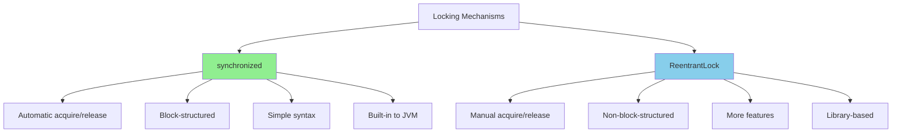
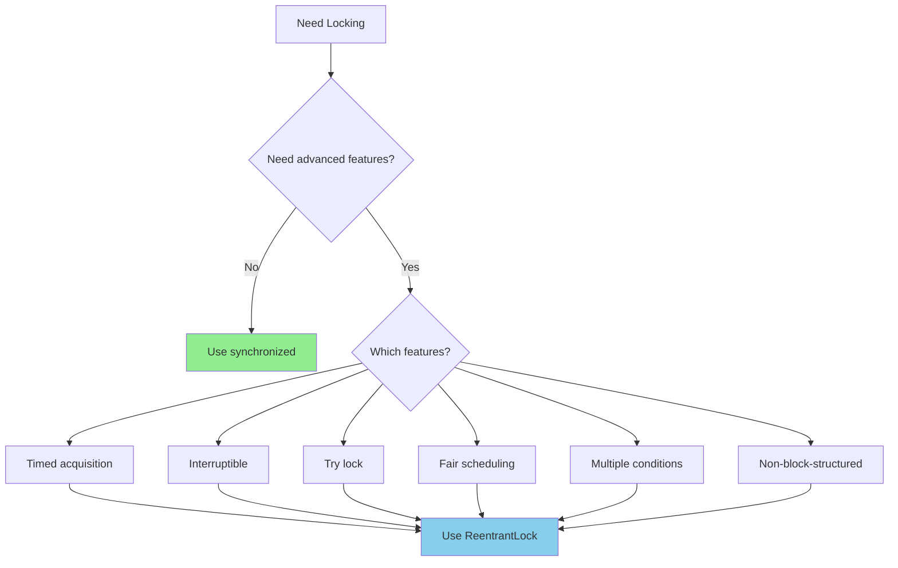
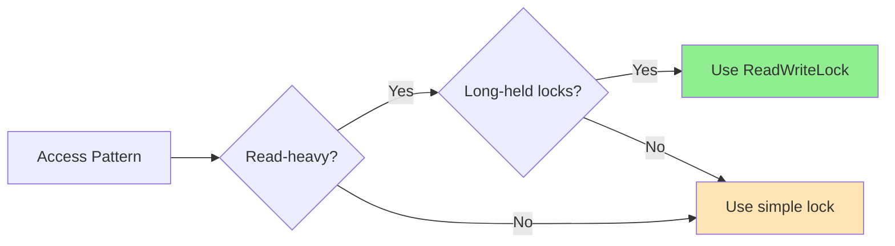
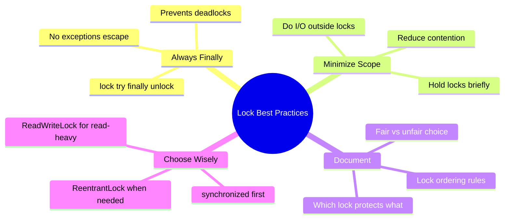

# 🔐 Chapter 13: Explicit Locks

> **Master ReentrantLock, ReadWriteLock, and advanced locking techniques for fine-grained concurrency control beyond synchronized.**

---

## 🎯 Learning Objectives

By the end of this chapter, you will be able to:

- ✅ Use ReentrantLock for advanced locking scenarios
- ✅ Implement timed and interruptible lock acquisition
- ✅ Understand and apply lock fairness policies
- ✅ Use ReadWriteLock for read-heavy workloads
- ✅ Choose between synchronized and explicit locks appropriately
- ✅ Implement non-block-structured locking patterns
- ✅ Optimize performance with appropriate lock strategies

---

## 📚 Prerequisites

- ✅ **Intrinsic Locks** (Chapter 2) - synchronized keyword
- ✅ **Thread Safety** - Race conditions, atomicity
- ✅ **Liveness** (Chapter 10) - Deadlock prevention
- ✅ **Performance** (Chapter 11) - Lock contention

---

## 📋 Table of Contents

1. [Lock and ReentrantLock](#-131-lock-and-reentrantlock)
2. [Performance Considerations](#-132-performance-considerations)
3. [Fairness](#-133-fairness)
4. [Choosing Between synchronized and ReentrantLock](#-134-choosing-between-synchronized-and-reentrantlock)
5. [Read-Write Locks](#-135-read-write-locks)
6. [Practical Examples](#-practical-examples)
7. [Common Pitfalls](#-common-pitfalls)
8. [Best Practices](#-best-practices)
9. [Summary](#-summary)

---

## 🔒 13.1 Lock and ReentrantLock

### **The Lock Interface**

```java
public interface Lock {
    void lock();
    void lockInterruptibly() throws InterruptedException;
    boolean tryLock();
    boolean tryLock(long timeout, TimeUnit unit) throws InterruptedException;
    void unlock();
    Condition newCondition();
}
```

### **Lock vs. synchronized Comparison**



| Feature | **synchronized** | **ReentrantLock** |
|---------|-----------------|-------------------|
| **Syntax** | Simple, built-in | Explicit calls |
| **Lock acquisition** | Automatic | Manual (lock/unlock) |
| **Structured** | Must be block-structured | Can span methods |
| **Try lock** | ❌ No | ✅ Yes |
| **Timed lock** | ❌ No | ✅ Yes |
| **Interruptible** | ❌ No | ✅ Yes |
| **Fairness** | ❌ No | ✅ Optional |
| **Condition variables** | 1 (implicit) | Multiple (explicit) |
| **Memory overhead** | Lower | Higher |
| **Performance** | Similar | Similar |

---

### **Basic ReentrantLock Usage**

```java
/**
 * Simple example of ReentrantLock
 */
public class ReentrantLockExample {
    private final Lock lock = new ReentrantLock();
    private int count = 0;
    
    /**
     * Standard pattern: lock/try/finally/unlock
     */
    public void increment() {
        lock.lock();  // ← Acquire lock
        try {
            count++;  // ← Critical section
        } finally {
            lock.unlock();  // ← Always release in finally!
        }
    }
    
    public int getCount() {
        lock.lock();
        try {
            return count;
        } finally {
            lock.unlock();
        }
    }
}
```

**⚠️ Critical Rule:** ALWAYS unlock in a `finally` block!

---

### **Polled Lock Acquisition (tryLock)**

```java
/**
 * Avoiding deadlock with tryLock
 */
public class TryLockExample {
    
    /**
     * Transfer money between accounts using tryLock
     */
    public boolean transferMoney(Account from, Account to, Amount amount)
            throws InsufficientFundsException {
        
        // Try to acquire both locks
        if (from.lock.tryLock()) {
            try {
                if (to.lock.tryLock()) {
                    try {
                        // Both locks acquired - proceed with transfer
                        if (from.getBalance().compareTo(amount) < 0) {
                            throw new InsufficientFundsException();
                        }
                        from.debit(amount);
                        to.credit(amount);
                        return true;  // ✅ Success
                        
                    } finally {
                        to.lock.unlock();
                    }
                }
            } finally {
                from.lock.unlock();
            }
        }
        return false;  // ❌ Couldn't acquire locks
    }
    
    static class Account {
        final Lock lock = new ReentrantLock();
        private Amount balance;
        
        Account(Amount balance) {
            this.balance = balance;
        }
        
        Amount getBalance() { return balance; }
        void debit(Amount amount) { balance = balance.subtract(amount); }
        void credit(Amount amount) { balance = balance.add(amount); }
    }
    
    static class Amount implements Comparable<Amount> {
        private final int value;
        Amount(int value) { this.value = value; }
        Amount add(Amount other) { return new Amount(value + other.value); }
        Amount subtract(Amount other) { return new Amount(value - other.value); }
        public int compareTo(Amount other) { return Integer.compare(value, other.value); }
    }
    
    static class InsufficientFundsException extends Exception {}
}
```

---

### **Timed Lock Acquisition**

```java
/**
 * Using tryLock with timeout
 */
public class TimedLockExample {
    private final Lock lock = new ReentrantLock();
    
    /**
     * Acquire lock with timeout
     */
    public boolean doSomething(long timeout, TimeUnit unit) 
            throws InterruptedException {
        
        if (lock.tryLock(timeout, unit)) {
            try {
                // Perform work with lock held
                performWork();
                return true;  // ✅ Success
            } finally {
                lock.unlock();
            }
        }
        
        return false;  // ❌ Timeout
    }
    
    /**
     * Retry with exponential backoff
     */
    public void doWithRetry() throws InterruptedException {
        long wait = 10;  // Start with 10ms
        long maxWait = 1000;  // Max 1 second
        
        while (true) {
            if (lock.tryLock(wait, TimeUnit.MILLISECONDS)) {
                try {
                    performWork();
                    return;  // ✅ Success
                } finally {
                    lock.unlock();
                }
            }
            
            // Exponential backoff
            wait = Math.min(wait * 2, maxWait);
            System.out.println("Waiting " + wait + "ms before retry");
        }
    }
    
    private void performWork() {
        // Do work here
    }
}
```

---

### **Interruptible Lock Acquisition**

```java
/**
 * Interruptible locking for cancellable operations
 */
public class InterruptibleLockExample {
    private final Lock lock = new ReentrantLock();
    private final List<String> data = new ArrayList<>();
    
    /**
     * Process data with interruptible lock
     */
    public void processData(String item) throws InterruptedException {
        // lockInterruptibly() throws InterruptedException
        lock.lockInterruptibly();  // ← Can be interrupted while waiting
        try {
            data.add(item);
            // Long-running processing
            Thread.sleep(1000);
        } finally {
            lock.unlock();
        }
    }
    
    /**
     * Example: Cancellable task using interruptible lock
     */
    static class CancellableTask implements Runnable {
        private final InterruptibleLockExample example;
        private final String data;
        
        CancellableTask(InterruptibleLockExample example, String data) {
            this.example = example;
            this.data = data;
        }
        
        @Override
        public void run() {
            try {
                example.processData(data);
                System.out.println("Processed: " + data);
            } catch (InterruptedException e) {
                System.out.println("Interrupted while waiting for lock");
                Thread.currentThread().interrupt();  // Restore interrupt status
            }
        }
    }
    
    public static void main(String[] args) throws InterruptedException {
        InterruptibleLockExample example = new InterruptibleLockExample();
        
        // Start a task
        Thread task = new Thread(new CancellableTask(example, "important data"));
        task.start();
        
        // Cancel it after 100ms
        Thread.sleep(100);
        task.interrupt();
        
        task.join();
        System.out.println("Task cancelled");
    }
}
```

---

### **Non-Block-Structured Locking**

```java
/**
 * Hand-over-hand locking (lock coupling)
 */
public class LinkedListWithHandOverHand<T> {
    
    private static class Node<T> {
        final T item;
        final Lock lock = new ReentrantLock();
        Node<T> next;
        
        Node(T item, Node<T> next) {
            this.item = item;
            this.next = next;
        }
    }
    
    private final Node<T> head = new Node<>(null, null);
    
    /**
     * Insert element using hand-over-hand locking
     */
    public void insert(T item) {
        Node<T> pred = head;
        pred.lock.lock();
        try {
            Node<T> curr = pred.next;
            while (curr != null) {
                curr.lock.lock();
                try {
                    if (item.hashCode() < curr.item.hashCode()) {
                        // Insert before curr
                        Node<T> newNode = new Node<>(item, curr);
                        pred.next = newNode;
                        return;
                    }
                    pred.lock.unlock();  // ← Release previous lock
                    pred = curr;         // ← Move forward
                    curr = curr.next;
                } finally {
                    if (curr != pred) {
                        curr.lock.unlock();  // Unlock if we're moving on
                    }
                }
            }
            // Insert at end
            pred.next = new Node<>(item, null);
        } finally {
            pred.lock.unlock();
        }
    }
}
```

---

## ⚡ 13.2 Performance Considerations

### **synchronized vs. ReentrantLock Performance**

```java
/**
 * Performance comparison
 */
public class LockPerformanceComparison {
    private final Object syncLock = new Object();
    private final Lock reentrantLock = new ReentrantLock();
    private int counter = 0;
    
    /**
     * Benchmark synchronized
     */
    public void useSynchronized() {
        synchronized (syncLock) {
            counter++;
        }
    }
    
    /**
     * Benchmark ReentrantLock
     */
    public void useReentrantLock() {
        reentrantLock.lock();
        try {
            counter++;
        } finally {
            reentrantLock.unlock();
        }
    }
    
    /**
     * Run performance test
     */
    public static void main(String[] args) throws Exception {
        LockPerformanceComparison test = new LockPerformanceComparison();
        int iterations = 10_000_000;
        
        // Warmup
        for (int i = 0; i < 1_000_000; i++) {
            test.useSynchronized();
            test.useReentrantLock();
        }
        
        // Test synchronized
        long start = System.nanoTime();
        for (int i = 0; i < iterations; i++) {
            test.useSynchronized();
        }
        long syncTime = System.nanoTime() - start;
        
        // Test ReentrantLock
        start = System.nanoTime();
        for (int i = 0; i < iterations; i++) {
            test.useReentrantLock();
        }
        long lockTime = System.nanoTime() - start;
        
        System.out.println("synchronized: " + syncTime / 1_000_000 + " ms");
        System.out.println("ReentrantLock: " + lockTime / 1_000_000 + " ms");
        System.out.println("Difference: " + 
            Math.abs(syncTime - lockTime) * 100 / syncTime + "%");
    }
}
```

**Result:** In modern JVMs (Java 6+), performance is nearly identical for uncontended locks.

---

## ⚖️ 13.3 Fairness

### **Fair vs. Unfair Locks**

```java
/**
 * Demonstrating fair vs. unfair locks
 */
public class FairnessExample {
    
    /**
     * Unfair lock (default) - better throughput
     */
    private static final Lock unfairLock = new ReentrantLock(false);
    
    /**
     * Fair lock - better for preventing starvation
     */
    private static final Lock fairLock = new ReentrantLock(true);
    
    /**
     * Test worker thread
     */
    static class Worker implements Runnable {
        private final Lock lock;
        private final String name;
        private final AtomicInteger acquisitions = new AtomicInteger(0);
        
        Worker(Lock lock, String name) {
            this.lock = lock;
            this.name = name;
        }
        
        @Override
        public void run() {
            for (int i = 0; i < 100; i++) {
                lock.lock();
                try {
                    acquisitions.incrementAndGet();
                    // Simulate work
                    Thread.sleep(1);
                } catch (InterruptedException e) {
                    Thread.currentThread().interrupt();
                    return;
                } finally {
                    lock.unlock();
                }
            }
        }
        
        public int getAcquisitions() {
            return acquisitions.get();
        }
    }
    
    public static void testFairness(boolean fair) throws InterruptedException {
        Lock lock = new ReentrantLock(fair);
        List<Worker> workers = new ArrayList<>();
        List<Thread> threads = new ArrayList<>();
        
        // Create 10 worker threads
        for (int i = 0; i < 10; i++) {
            Worker worker = new Worker(lock, "Worker-" + i);
            workers.add(worker);
            Thread thread = new Thread(worker);
            threads.add(thread);
            thread.start();
        }
        
        // Wait for completion
        for (Thread thread : threads) {
            thread.join();
        }
        
        // Analyze distribution
        System.out.println((fair ? "Fair" : "Unfair") + " Lock Results:");
        for (Worker worker : workers) {
            System.out.println(worker.name + ": " + worker.getAcquisitions());
        }
        System.out.println();
    }
    
    public static void main(String[] args) throws InterruptedException {
        testFairness(false);  // Unfair - may show imbalance
        testFairness(true);   // Fair - more balanced
    }
}
```

### **Trade-offs**

| Aspect | **Unfair (default)** | **Fair** |
|--------|---------------------|----------|
| **Throughput** | ✅ Higher (2-3x better) | ❌ Lower |
| **Latency** | ⚠️ Variable | ✅ More predictable |
| **Starvation** | ⚠️ Possible | ✅ Prevents |
| **Overhead** | ✅ Lower | ❌ Higher |
| **When to use** | High-throughput scenarios | Fairness-critical systems |

---

## 🤔 13.4 Choosing Between synchronized and ReentrantLock

### **Decision Tree**



### **Use synchronized when:**

✅ Simple, straightforward locking
✅ Block-structured (method or block scope)
✅ JVM optimizations matter (escape analysis, lock elision)
✅ Less code, less chance of errors
✅ Automatic lock release (no finally needed)

### **Use ReentrantLock when:**

✅ Need timed lock attempts
✅ Need interruptible lock acquisition
✅ Need try-lock capability
✅ Need fair lock ordering
✅ Need multiple condition variables
✅ Need hand-over-hand locking
✅ Need lock polling

---

## 📖 13.5 Read-Write Locks

### **ReadWriteLock Interface**

```java
public interface ReadWriteLock {
    Lock readLock();
    Lock writeLock();
}
```

### **When to Use Read-Write Locks**



**Optimal for:**
- Read-heavy workloads (>70% reads)
- Long-held locks
- Moderate contention
- Data structures like caches, registries

---

### **ReadWriteLock Example**

```java
/**
 * Comprehensive ReadWriteLock example
 */
public class ReadWriteMapExample<K, V> {
    private final Map<K, V> map = new HashMap<>();
    private final ReadWriteLock lock = new ReentrantReadWriteLock();
    private final Lock readLock = lock.readLock();
    private final Lock writeLock = lock.writeLock();
    
    /**
     * Get value (uses read lock)
     */
    public V get(K key) {
        readLock.lock();
        try {
            return map.get(key);
        } finally {
            readLock.unlock();
        }
    }
    
    /**
     * Put value (uses write lock)
     */
    public V put(K key, V value) {
        writeLock.lock();
        try {
            return map.put(key, value);
        } finally {
            writeLock.unlock();
        }
    }
    
    /**
     * Remove value (uses write lock)
     */
    public V remove(K key) {
        writeLock.lock();
        try {
            return map.remove(key);
        } finally {
            writeLock.unlock();
        }
    }
    
    /**
     * Size (uses read lock)
     */
    public int size() {
        readLock.lock();
        try {
            return map.size();
        } finally {
            readLock.unlock();
        }
    }
    
    /**
     * Clear (uses write lock)
     */
    public void clear() {
        writeLock.lock();
        try {
            map.clear();
        } finally {
            writeLock.unlock();
        }
    }
}
```

---

### **Advanced: Lock Downgrading**

```java
/**
 * Lock downgrading pattern
 */
public class LockDowngradingExample {
    private final ReadWriteLock rwLock = new ReentrantReadWriteLock();
    private volatile Data cachedData;
    private volatile boolean cacheValid;
    
    /**
     * Get data with lazy initialization and lock downgrading
     */
    public Data getData() {
        // First try with read lock
        rwLock.readLock().lock();
        if (cacheValid) {
            Data data = cachedData;
            rwLock.readLock().unlock();
            return data;
        }
        
        // Need to update - upgrade to write lock
        rwLock.readLock().unlock();  // ← Release read lock first
        
        rwLock.writeLock().lock();
        try {
            // Double-check after acquiring write lock
            if (!cacheValid) {
                cachedData = loadData();
                cacheValid = true;
            }
            
            // Downgrade to read lock before returning
            rwLock.readLock().lock();  // ← Acquire read lock
        } finally {
            rwLock.writeLock().unlock();  // ← Release write lock
        }
        
        try {
            return cachedData;
        } finally {
            rwLock.readLock().unlock();
        }
    }
    
    private Data loadData() {
        // Expensive operation
        return new Data();
    }
    
    static class Data {}
}
```

**⚠️ Warning:** Lock upgrading (read → write) is NOT supported! Always release read lock before acquiring write lock.

---

## ✅ Best Practices

### **Lock Usage Guidelines**



---

## 📝 Summary

### **Key Takeaways**

| Topic | Key Point |
|-------|-----------|
| **ReentrantLock** | More flexible than synchronized, but requires discipline |
| **tryLock** | Avoids deadlock, enables timeouts |
| **Fairness** | Prevents starvation, costs performance |
| **ReadWriteLock** | Optimal for read-heavy workloads |
| **Choice** | Start with synchronized, upgrade when needed |

---

## 🔗 What's Next?

### **Chapter 14: Building Custom Synchronizers**
Deep dive into synchronization internals:
- Condition queues
- AbstractQueuedSynchronizer (AQS)
- Building custom locks
- Implementing synchronizers

---

**[← Previous: Chapter 12 - Testing](./12-testing-concurrent.md)** | **[Back to README](./README.md)** | **[Next: Chapter 14 - Custom Synchronizers →](./14-custom-synchronizers.md)**

---

*Explicit locks provide powerful tools for advanced concurrency control. Use them wisely!* 🔐✨
