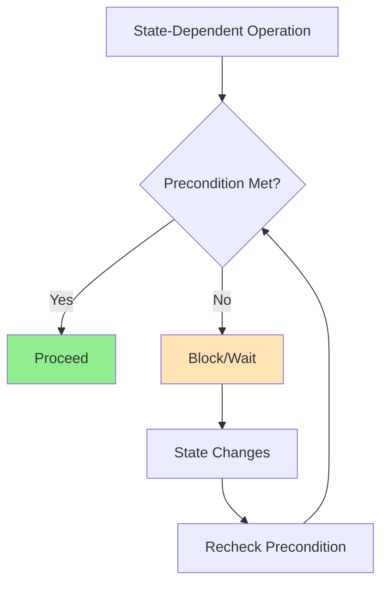
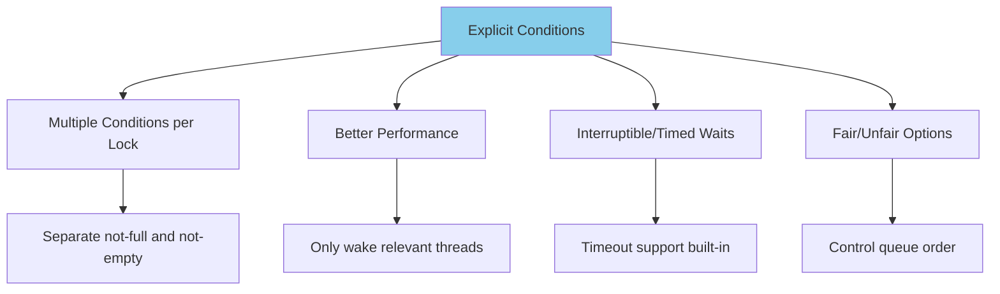
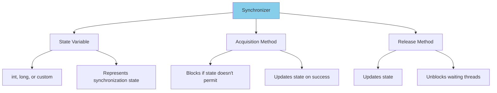
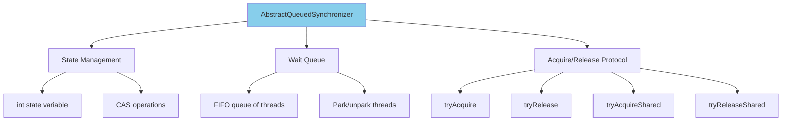
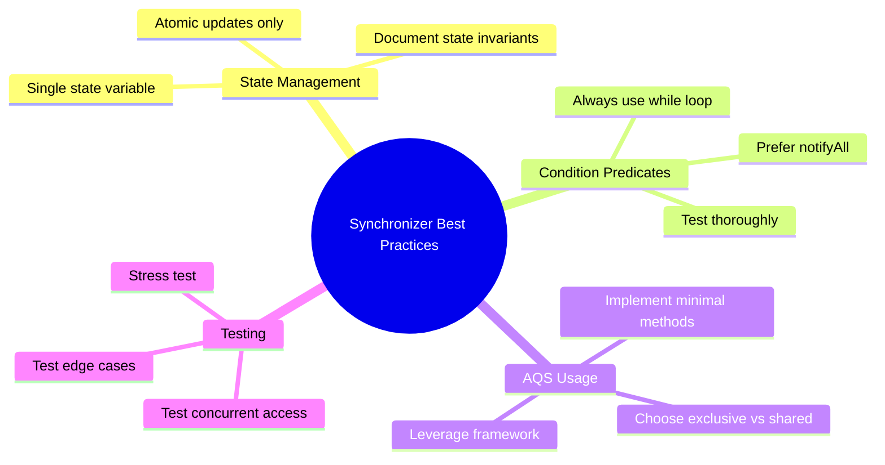

# 🔧 Chapter 14: Building Custom Synchronizers

> **Master the art of building custom synchronization primitives using condition queues, AbstractQueuedSynchronizer (AQS), and advanced concurrency patterns.**

---

## 🎯 Learning Objectives

By the end of this chapter, you will be able to:

- ✅ Understand state-dependent operations and condition predicates
- ✅ Use condition queues with wait/notify effectively
- ✅ Build custom synchronizers using explicit Condition objects
- ✅ Master AbstractQueuedSynchronizer (AQS) internals
- ✅ Implement custom locks and synchronization primitives
- ✅ Understand how java.util.concurrent synchronizers work internally
- ✅ Apply best practices for building reliable synchronizers

---

## 📚 Prerequisites

- ✅ **Intrinsic Locks** (Chapter 2) - synchronized, wait/notify
- ✅ **Explicit Locks** (Chapter 13) - ReentrantLock, Condition
- ✅ **Thread Safety** - Atomicity, visibility, ordering
- ✅ **Blocking Operations** - Understanding when threads block

---

## 📋 Table of Contents

1. [Managing State Dependence](#-141-managing-state-dependence)
2. [Using Condition Queues](#-142-using-condition-queues)
3. [Explicit Condition Objects](#-143-explicit-condition-objects)
4. [Anatomy of a Synchronizer](#-144-anatomy-of-a-synchronizer)
5. [AbstractQueuedSynchronizer](#-145-abstractqueuedsynchronizer)
6. [AQS in java.util.concurrent](#-146-aqs-in-javautilconcurrent)
7. [Practical Examples](#-practical-examples)
8. [Best Practices](#-best-practices)
9. [Summary](#-summary)

---

## 🎭 14.1 Managing State Dependence

### **State-Dependent Operations**

Operations whose preconditions depend on object state:



**Examples:**
- `take()` from queue - requires queue to be non-empty
- `acquire()` semaphore - requires available permits
- `await()` latch - requires latch to be released

---

### **Approaches to Handling State Dependence**

```java
/**
 * Three approaches to state-dependent operations
 */
public class StateDependenceStrategies {
    
    /**
     * 1. THROWING EXCEPTION - Client must handle
     */
    static class ThrowingBuffer<T> {
        private final Queue<T> queue = new LinkedList<>();
        private final int capacity;
        
        ThrowingBuffer(int capacity) {
            this.capacity = capacity;
        }
        
        public synchronized void put(T item) throws BufferFullException {
            if (queue.size() >= capacity) {
                throw new BufferFullException();  // ❌ Not helpful
            }
            queue.add(item);
        }
        
        public synchronized T take() throws BufferEmptyException {
            if (queue.isEmpty()) {
                throw new BufferEmptyException();  // ❌ Forces polling
            }
            return queue.remove();
        }
    }
    
    /**
     * 2. POLLING AND SLEEPING - Wasteful
     */
    static class PollingBuffer<T> {
        private final Queue<T> queue = new LinkedList<>();
        private final int capacity;
        
        PollingBuffer(int capacity) {
            this.capacity = capacity;
        }
        
        public void put(T item) throws InterruptedException {
            while (true) {
                synchronized (this) {
                    if (queue.size() < capacity) {
                        queue.add(item);
                        return;  // ✅ Success
                    }
                }
                Thread.sleep(100);  // ❌ Wastes CPU, adds latency
            }
        }
        
        public T take() throws InterruptedException {
            while (true) {
                synchronized (this) {
                    if (!queue.isEmpty()) {
                        return queue.remove();  // ✅ Success
                    }
                }
                Thread.sleep(100);  // ❌ Wastes CPU, adds latency
            }
        }
    }
    
    /**
     * 3. CONDITION QUEUES - Efficient blocking
     */
    static class WaitingBuffer<T> {
        private final Queue<T> queue = new LinkedList<>();
        private final int capacity;
        
        WaitingBuffer(int capacity) {
            this.capacity = capacity;
        }
        
        public synchronized void put(T item) throws InterruptedException {
            while (queue.size() >= capacity) {
                wait();  // ✅ Efficient blocking
            }
            queue.add(item);
            notifyAll();  // Wake up takers
        }
        
        public synchronized T take() throws InterruptedException {
            while (queue.isEmpty()) {
                wait();  // ✅ Efficient blocking
            }
            T item = queue.remove();
            notifyAll();  // Wake up putters
            return item;
        }
    }
    
    static class BufferFullException extends Exception {}
    static class BufferEmptyException extends Exception {}
}
```

---

## 🔔 14.2 Using Condition Queues

### **wait/notify Mechanics**

```
┌─────────────────────────────────────────────────────────┐
│ Condition Queue Lifecycle                                │
│                                                           │
│ Thread calls wait()                                      │
│     ↓                                                     │
│ 1. Release lock                                          │
│ 2. Add to wait set                                       │
│ 3. Block (sleep)                                         │
│     ↓                                                     │
│ Another thread calls notify()/notifyAll()               │
│     ↓                                                     │
│ 4. Remove from wait set                                  │
│ 5. Block on lock (reacquire)                            │
│ 6. Reacquire lock                                        │
│ 7. Return from wait()                                    │
│     ↓                                                     │
│ Recheck condition (ALWAYS!)                              │
└─────────────────────────────────────────────────────────┘
```

### **Canonical Form for Condition Queues**

```java
/**
 * Standard pattern for using condition queues
 */
public class ConditionQueuePattern {
    
    /**
     * CANONICAL WAIT PATTERN
     */
    public synchronized void awaitCondition() throws InterruptedException {
        // ALWAYS use while loop, not if!
        while (!conditionPredicate()) {
            wait();  // Release lock and wait
        }
        // Condition is now true
        performAction();
    }
    
    /**
     * CANONICAL NOTIFY PATTERN
     */
    public synchronized void signalCondition() {
        modifyState();  // Change state
        notifyAll();    // Wake up waiting threads
    }
    
    private boolean conditionPredicate() {
        // Check if condition is satisfied
        return true;
    }
    
    private void modifyState() {
        // Modify object state
    }
    
    private void performAction() {
        // Perform the state-dependent action
    }
}
```

**⚠️ Critical Rules:**

1. **ALWAYS** use `while` loop, never `if`
2. **ALWAYS** hold lock when calling wait/notify
3. **ALWAYS** recheck condition after wait() returns
4. **Prefer** notifyAll() over notify()

---

### **Complete Bounded Buffer with Condition Queues**

```java
/**
 * Production-ready bounded buffer using condition queues
 */
public class BoundedBuffer<T> {
    private final T[] buffer;
    private int head, tail, count;
    
    @SuppressWarnings("unchecked")
    public BoundedBuffer(int capacity) {
        buffer = (T[]) new Object[capacity];
    }
    
    /**
     * Put item - blocks if full
     */
    public synchronized void put(T item) throws InterruptedException {
        // Wait while buffer is full
        while (count == buffer.length) {
            wait();
        }
        
        // Add item
        buffer[tail] = item;
        tail = (tail + 1) % buffer.length;
        count++;
        
        // Notify takers
        notifyAll();
    }
    
    /**
     * Take item - blocks if empty
     */
    public synchronized T take() throws InterruptedException {
        // Wait while buffer is empty
        while (count == 0) {
            wait();
        }
        
        // Remove item
        T item = buffer[head];
        buffer[head] = null;  // Help GC
        head = (head + 1) % buffer.length;
        count--;
        
        // Notify putters
        notifyAll();
        
        return item;
    }
    
    public synchronized int size() {
        return count;
    }
    
    public synchronized boolean isEmpty() {
        return count == 0;
    }
    
    public synchronized boolean isFull() {
        return count == buffer.length;
    }
}
```

---

### **notify() vs. notifyAll()**

```java
/**
 * Demonstrating when to use notify vs notifyAll
 */
public class NotifyVsNotifyAll {
    
    /**
     * DANGER: Using notify() incorrectly
     */
    static class UsingNotify {
        private boolean condition1 = false;
        private boolean condition2 = false;
        
        public synchronized void awaitCondition1() throws InterruptedException {
            while (!condition1) {
                wait();
            }
        }
        
        public synchronized void awaitCondition2() throws InterruptedException {
            while (!condition2) {
                wait();
            }
        }
        
        public synchronized void signalCondition1() {
            condition1 = true;
            notify();  // ❌ Might wake wrong thread!
        }
    }
    
    /**
     * SAFE: Using notifyAll()
     */
    static class UsingNotifyAll {
        private boolean condition1 = false;
        private boolean condition2 = false;
        
        public synchronized void awaitCondition1() throws InterruptedException {
            while (!condition1) {
                wait();
            }
        }
        
        public synchronized void awaitCondition2() throws InterruptedException {
            while (!condition2) {
                wait();
            }
        }
        
        public synchronized void signalCondition1() {
            condition1 = true;
            notifyAll();  // ✅ All threads recheck their conditions
        }
    }
}
```

**When you CAN use `notify()`:**
- Single condition predicate
- One-in, one-out protocol (one put, one take)
- All waiting threads are homogeneous

**When you MUST use `notifyAll()`:**
- Multiple condition predicates
- Complex state dependencies
- Safety is more important than performance

---

## 🎛️ 14.3 Explicit Condition Objects

### **Condition Interface**

```java
public interface Condition {
    void await() throws InterruptedException;
    boolean await(long time, TimeUnit unit) throws InterruptedException;
    long awaitNanos(long nanosTimeout) throws InterruptedException;
    void awaitUninterruptibly();
    boolean awaitUntil(Date deadline) throws InterruptedException;
    void signal();
    void signalAll();
}
```

### **Advantages of Explicit Conditions**



---

### **Bounded Buffer with Explicit Conditions**

```java
/**
 * High-performance bounded buffer using explicit conditions
 */
public class ConditionBoundedBuffer<T> {
    private final Lock lock = new ReentrantLock();
    private final Condition notFull = lock.newCondition();
    private final Condition notEmpty = lock.newCondition();
    
    private final T[] buffer;
    private int head, tail, count;
    
    @SuppressWarnings("unchecked")
    public ConditionBoundedBuffer(int capacity) {
        buffer = (T[]) new Object[capacity];
    }
    
    /**
     * Put item - blocks if full
     */
    public void put(T item) throws InterruptedException {
        lock.lock();
        try {
            while (count == buffer.length) {
                notFull.await();  // ← Specific condition
            }
            
            buffer[tail] = item;
            tail = (tail + 1) % buffer.length;
            count++;
            
            notEmpty.signal();  // ← Wake one taker (optimized!)
        } finally {
            lock.unlock();
        }
    }
    
    /**
     * Take item - blocks if empty
     */
    public T take() throws InterruptedException {
        lock.lock();
        try {
            while (count == 0) {
                notEmpty.await();  // ← Specific condition
            }
            
            T item = buffer[head];
            buffer[head] = null;
            head = (head + 1) % buffer.length;
            count--;
            
            notFull.signal();  // ← Wake one putter (optimized!)
            
            return item;
        } finally {
            lock.unlock();
        }
    }
    
    /**
     * Try to put with timeout
     */
    public boolean offer(T item, long timeout, TimeUnit unit)
            throws InterruptedException {
        long nanos = unit.toNanos(timeout);
        lock.lock();
        try {
            while (count == buffer.length) {
                if (nanos <= 0) {
                    return false;  // ❌ Timeout
                }
                nanos = notFull.awaitNanos(nanos);
            }
            
            buffer[tail] = item;
            tail = (tail + 1) % buffer.length;
            count++;
            notEmpty.signal();
            return true;  // ✅ Success
        } finally {
            lock.unlock();
        }
    }
}
```

---

## 🏗️ 14.4 Anatomy of a Synchronizer

### **Three Essential Components**



### **Simple Latch Implementation**

```java
/**
 * Simple latch using condition queue
 */
public class SimpleLatch {
    @GuardedBy("this")
    private boolean latched = false;
    
    /**
     * Wait for latch to open
     */
    public synchronized void await() throws InterruptedException {
        while (!latched) {
            wait();
        }
    }
    
    /**
     * Open the latch
     */
    public synchronized void countDown() {
        latched = true;
        notifyAll();
    }
}
```

---

## 🎯 14.5 AbstractQueuedSynchronizer

### **AQS Overview**

AbstractQueuedSynchronizer (AQS) is the foundation for most synchronizers in java.util.concurrent:



### **AQS Contract**

Subclasses must implement:

```java
/**
 * Methods to override in AQS subclass
 */
public abstract class CustomSynchronizer extends AbstractQueuedSynchronizer {
    
    // For exclusive mode (locks)
    protected boolean tryAcquire(int arg) {
        throw new UnsupportedOperationException();
    }
    
    protected boolean tryRelease(int arg) {
        throw new UnsupportedOperationException();
    }
    
    // For shared mode (semaphores, read locks)
    protected int tryAcquireShared(int arg) {
        throw new UnsupportedOperationException();
    }
    
    protected boolean tryReleaseShared(int arg) {
        throw new UnsupportedOperationException();
    }
    
    // Check if currently held exclusively
    protected boolean isHeldExclusively() {
        throw new UnsupportedOperationException();
    }
}
```

---

### **Binary Latch Using AQS**

```java
/**
 * OneShotLatch: Can be triggered only once
 */
public class OneShotLatch {
    
    private final Sync sync = new Sync();
    
    public void signal() {
        sync.releaseShared(0);
    }
    
    public void await() throws InterruptedException {
        sync.acquireSharedInterruptibly(0);
    }
    
    /**
     * Inner synchronizer class
     */
    private static class Sync extends AbstractQueuedSynchronizer {
        
        @Override
        protected int tryAcquireShared(int ignored) {
            // Return 1 if latch is open (state == 1)
            // Return -1 if latch is closed (state == 0)
            return (getState() == 1) ? 1 : -1;
        }
        
        @Override
        protected boolean tryReleaseShared(int ignored) {
            setState(1);  // Open latch
            return true;  // Always succeeds
        }
    }
}
```

---

### **Simple Mutex Using AQS**

```java
/**
 * Non-reentrant mutex using AQS
 */
public class SimpleMutex implements Lock {
    
    private final Sync sync = new Sync();
    
    @Override
    public void lock() {
        sync.acquire(1);
    }
    
    @Override
    public void unlock() {
        sync.release(1);
    }
    
    @Override
    public boolean tryLock() {
        return sync.tryAcquire(1);
    }
    
    private static class Sync extends AbstractQueuedSynchronizer {
        
        @Override
        protected boolean tryAcquire(int ignored) {
            // Try to CAS state from 0 (unlocked) to 1 (locked)
            if (compareAndSetState(0, 1)) {
                setExclusiveOwnerThread(Thread.currentThread());
                return true;
            }
            return false;
        }
        
        @Override
        protected boolean tryRelease(int ignored) {
            if (getState() == 0) {
                throw new IllegalMonitorStateException();
            }
            setExclusiveOwnerThread(null);
            setState(0);
            return true;
        }
        
        @Override
        protected boolean isHeldExclusively() {
            return getState() == 1;
        }
    }
    
    // Other Lock methods delegated to sync...
    @Override
    public void lockInterruptibly() throws InterruptedException {
        sync.acquireInterruptibly(1);
    }
    
    @Override
    public boolean tryLock(long time, TimeUnit unit) throws InterruptedException {
        return sync.tryAcquireNanos(1, unit.toNanos(time));
    }
    
    @Override
    public Condition newCondition() {
        return sync.newCondition();
    }
}
```

---

## 🔍 14.6 AQS in java.util.concurrent

### **How Standard Synchronizers Use AQS**

```java
/**
 * Examples of how JDK synchronizers use AQS
 */
public class AQSExamples {
    
    /**
     * ReentrantLock's tryAcquire (simplified)
     */
    static class ReentrantLockAQS extends AbstractQueuedSynchronizer {
        @Override
        protected boolean tryAcquire(int acquires) {
            final Thread current = Thread.currentThread();
            int c = getState();
            
            if (c == 0) {
                // Lock is free
                if (compareAndSetState(0, acquires)) {
                    setExclusiveOwnerThread(current);
                    return true;
                }
            } else if (current == getExclusiveOwnerThread()) {
                // Reentrant acquisition
                int nextc = c + acquires;
                if (nextc < 0) { // overflow
                    throw new Error("Maximum lock count exceeded");
                }
                setState(nextc);
                return true;
            }
            return false;
        }
    }
    
    /**
     * Semaphore's tryAcquireShared (simplified)
     */
    static class SemaphoreAQS extends AbstractQueuedSynchronizer {
        SemaphoreAQS(int permits) {
            setState(permits);
        }
        
        @Override
        protected int tryAcquireShared(int acquires) {
            for (;;) {
                int available = getState();
                int remaining = available - acquires;
                
                if (remaining < 0 ||
                    compareAndSetState(available, remaining)) {
                    return remaining;
                }
            }
        }
        
        @Override
        protected boolean tryReleaseShared(int releases) {
            for (;;) {
                int current = getState();
                int next = current + releases;
                if (next < current) { // overflow
                    throw new Error("Maximum permit count exceeded");
                }
                if (compareAndSetState(current, next)) {
                    return true;
                }
            }
        }
    }
    
    /**
     * CountDownLatch's tryAcquireShared (simplified)
     */
    static class CountDownLatchAQS extends AbstractQueuedSynchronizer {
        CountDownLatchAQS(int count) {
            setState(count);
        }
        
        @Override
        protected int tryAcquireShared(int acquires) {
            return (getState() == 0) ? 1 : -1;
        }
        
        @Override
        protected boolean tryReleaseShared(int releases) {
            // Decrement count
            for (;;) {
                int c = getState();
                if (c == 0) {
                    return false;
                }
                int nextc = c - 1;
                if (compareAndSetState(c, nextc)) {
                    return nextc == 0;
                }
            }
        }
    }
}
```

---

## ✅ Best Practices

### **Building Reliable Synchronizers**



---

## 📝 Summary

### **Key Takeaways**

| Topic | Key Point |
|-------|-----------|
| **State Dependence** | Use condition queues for efficient blocking |
| **wait/notify** | Always in while loop, prefer notifyAll |
| **Explicit Conditions** | Multiple conditions per lock, better performance |
| **AQS** | Foundation for building custom synchronizers |
| **Best Practice** | Use existing synchronizers when possible |

---

## 🔗 What's Next?

### **Chapter 15: Atomic Variables and Nonblocking Synchronization**
Lock-free programming:
- Compare-and-swap operations
- Atomic variable classes
- Nonblocking algorithms
- Performance benefits

---

**[← Previous: Chapter 13 - Explicit Locks](./13-explicit-locks.md)** | **[Back to README](./README.md)** | **[Next: Chapter 15 - Atomic Variables →](./15-atomic-nonblocking.md)**

---

*Building custom synchronizers requires deep understanding, but AQS makes it manageable!* 🔧⚙️
