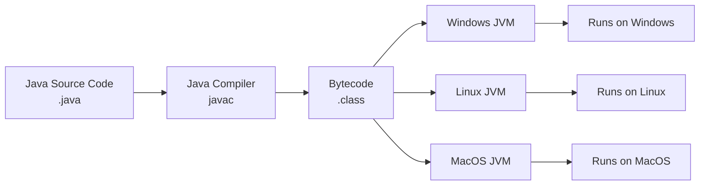
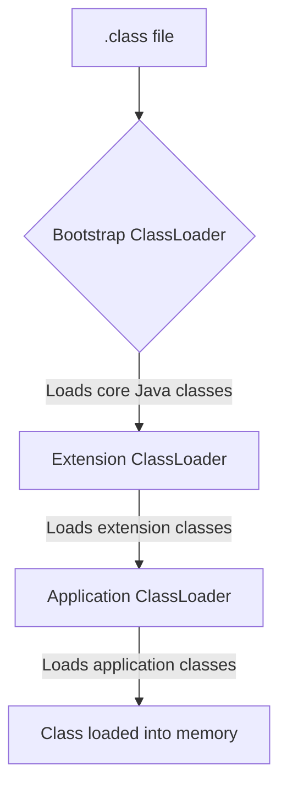
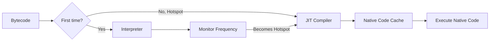
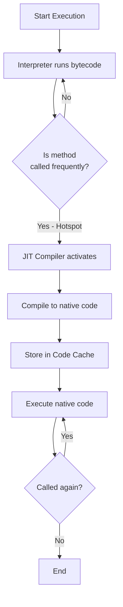
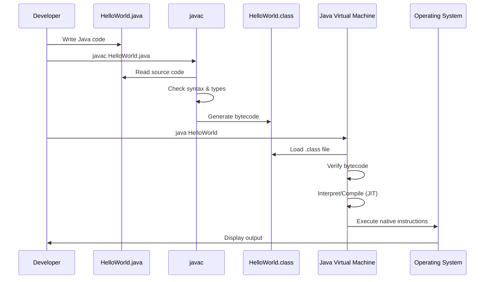
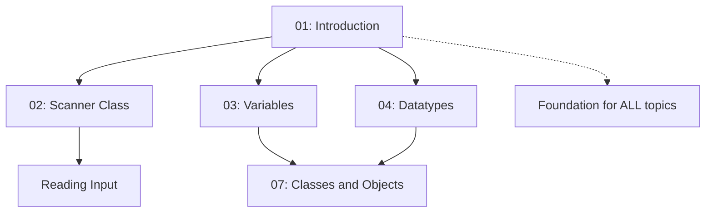

# Introduction to Java 🚀

> *"Java is to JavaScript what Car is to Carpet."* – Chris Heilmann

---

## 📚 Prerequisites / Basics

Before diving into Java, you should have:

- ✅ Basic computer literacy (file management, using command line)
- ✅ Understanding of basic programming concepts (variables, functions) – helpful but not required
- ✅ A computer with internet access for downloading Java Development Kit (JDK)
- ✅ Willingness to learn and experiment!

**No prior programming experience is required** – this tutorial assumes you're starting from scratch.

---

## 🧭 Core Concepts (in logical order)

### 1️⃣ What is Java? – *Definition*

**What it is:**  
Java is a **high-level, class-based, object-oriented programming language** designed to have as few implementation dependencies as possible. It follows the principle of **"Write Once, Run Anywhere" (WORA)**, meaning compiled Java code can run on all platforms that support Java without the need for recompilation.

**Why it matters:**  
Java powers billions of devices worldwide – from Android smartphones to enterprise servers, web applications, IoT devices, and big data platforms. Learning Java opens doors to numerous career opportunities in software development.

**Real-world analogy:**  
Think of Java as a universal translator. Just as a universal translator allows different species to communicate regardless of their native language, Java allows your code to run on any device regardless of the underlying operating system (Windows, Mac, Linux).

### 2️⃣ History of Java – *Origins*

- **Created by:** James Gosling at Sun Microsystems (now owned by Oracle)
- **Initial Release:** 1995
- **Original Name:** "Oak" (later renamed to Java)
- **Original Purpose:** Programming language for interactive television
- **Current Version:** Java 21 (LTS - Long Term Support)

**Evolution Timeline:**

```
1995: Java 1.0 (JDK 1.0)
1998: Java 2 (J2SE 1.2)
2004: Java 5 (Major update - Generics, Annotations)
2011: Java 7 (Try-with-resources, Diamond operator)
2014: Java 8 (Lambda expressions, Stream API) ⭐ Most popular
2017: Java 9 (Module system)
2021: Java 17 (LTS)
2023: Java 21 (LTS) ⭐ Current LTS
```

### 3️⃣ Features of Java – *Why Java?*

#### ✨ Simple and Easy to Learn

- **Clean syntax** derived from C/C++ but simpler
- **No pointers** – reduces complexity and errors
- **Automatic memory management** – Garbage Collection handles memory deallocation

#### 🔒 Secure

- **No explicit pointers** prevent direct memory access
- **Bytecode verification** before execution
- **Security manager** defines access rules
- **Sandbox execution** for untrusted code

#### 🌐 Platform Independent (WORA)



**How it works:**
1. Write Java code once (`.java` file)
2. Compile to bytecode (`.class` file)
3. Run on any platform with JVM installed

#### 🎯 Object-Oriented

Everything in Java is an object (except primitive types):
- **Encapsulation** – Data hiding
- **Inheritance** – Code reusability
- **Polymorphism** – One interface, multiple implementations
- **Abstraction** – Hiding implementation details

#### 🏃 High Performance

- **JIT (Just-In-Time) Compiler** compiles bytecode to native machine code at runtime
- **Optimizations** during runtime based on actual usage patterns
- **Multithreading support** for concurrent execution

#### 🔧 Robust

- **Strong type checking** at compile-time
- **Exception handling** for error management
- **Automatic memory management** prevents memory leaks
- **No pointer arithmetic** reduces errors

#### 🌍 Distributed

- Built-in support for **networking** (sockets, RMI, URL)
- **CORBA** support for distributed object communication
- Easy to create distributed applications

#### 🧵 Multithreaded

- Built-in support for **concurrent programming**
- Thread synchronization mechanisms
- Efficient CPU utilization

### 4️⃣ JDK vs JRE vs JVM – *Understanding the Ecosystem*

```
┌─────────────────────────────────────────────┐
│              JDK (Development Kit)          │
│  ┌───────────────────────────────────────┐  │
│  │         JRE (Runtime Environment)     │  │
│  │  ┌─────────────────────────────────┐  │  │
│  │  │   JVM (Virtual Machine)         │  │  │
│  │  │   - Bytecode Execution          │  │  │
│  │  │   - Memory Management           │  │  │
│  │  │   - Garbage Collection          │  │  │
│  │  └─────────────────────────────────┘  │  │
│  │  - Core Libraries (java.lang, etc.)   │  │
│  │  - Runtime Support                    │  │
│  └───────────────────────────────────────┘  │
│  - Compiler (javac)                         │
│  - Debugger (jdb)                           │
│  - Documentation Generator (javadoc)        │
│  - Archive Tool (jar)                       │
└─────────────────────────────────────────────┘
```

#### JVM (Java Virtual Machine)

**What it is:**  
An abstract machine that provides a runtime environment to execute Java bytecode.

**Key responsibilities:**
- Load bytecode
- Verify bytecode
- Execute bytecode
- Provide runtime environment

**Platform-specific:**  
Different JVM implementations for Windows, Linux, MacOS, etc.

#### JRE (Java Runtime Environment)

**What it is:**  
JVM + Libraries + Runtime support files

**Purpose:**  
Run Java applications (not for development)

**Contains:**
- JVM
- Core libraries (`java.lang`, `java.util`, etc.)
- Configuration files

#### JDK (Java Development Kit)

**What it is:**  
JRE + Development tools

**Purpose:**  
Develop and run Java applications

**Contains:**
- JRE (includes JVM)
- Compiler (`javac`)
- Debugger (`jdb`)
- Documentation tool (`javadoc`)
- Archive tool (`jar`)

**Comparison Table:**

| Feature | JVM | JRE | JDK |
|---------|-----|-----|-----|
| **Execute Java programs** | ✅ | ✅ | ✅ |
| **Develop Java programs** | ❌ | ❌ | ✅ |
| **Includes compiler** | ❌ | ❌ | ✅ |
| **Includes libraries** | ❌ | ✅ | ✅ |
| **Platform specific** | ✅ | ✅ | ✅ |
| **Size** | Smallest | Medium | Largest |
| **Use case** | Core execution | Run apps | Develop apps |

### 5️⃣ JVM Architecture – *Under the Hood*

```
┌────────────────────────────────────────────────────────────┐
│                    JVM ARCHITECTURE                        │
├────────────────────────────────────────────────────────────┤
│                                                            │
│  ┌──────────────────────────────────────────────────────┐ │
│  │        Class Loader Subsystem                        │ │
│  │  ┌──────────┐  ┌──────────┐  ┌──────────────────┐  │ │
│  │  │ Loading  │→ │ Linking  │→ │ Initialization   │  │ │
│  │  └──────────┘  └──────────┘  └──────────────────┘  │ │
│  └──────────────────────────────────────────────────────┘ │
│                         ↓                                  │
│  ┌──────────────────────────────────────────────────────┐ │
│  │        Runtime Data Areas (Memory)                   │ │
│  │  ┌─────────┐  ┌─────────┐  ┌──────────────────────┐│ │
│  │  │ Method  │  │  Heap   │  │ PC Registers         ││ │
│  │  │  Area   │  │         │  │ (per thread)         ││ │
│  │  │(Shared) │  │(Shared) │  ┌──────────────────────┐│ │
│  │  └─────────┘  └─────────┘  │ JVM Stacks           ││ │
│  │                             │ (per thread)         ││ │
│  │                             └──────────────────────┘│ │
│  │                             ┌──────────────────────┐│ │
│  │                             │ Native Method Stacks ││ │
│  │                             │ (per thread)         ││ │
│  │                             └──────────────────────┘│ │
│  └──────────────────────────────────────────────────────┘ │
│                         ↓                                  │
│  ┌──────────────────────────────────────────────────────┐ │
│  │        Execution Engine                              │ │
│  │  ┌───────────┐  ┌──────────┐  ┌──────────────────┐ │ │
│  │  │Interpreter│  │ JIT      │  │ Garbage          │ │ │
│  │  │           │  │ Compiler │  │ Collector        │ │ │
│  │  └───────────┘  └──────────┘  └──────────────────┘ │ │
│  └──────────────────────────────────────────────────────┘ │
│                         ↓                                  │
│  ┌──────────────────────────────────────────────────────┐ │
│  │        Native Method Interface (JNI)                 │ │
│  └──────────────────────────────────────────────────────┘ │
│                         ↓                                  │
│  ┌──────────────────────────────────────────────────────┐ │
│  │        Native Method Libraries (C/C++)               │ │
│  └──────────────────────────────────────────────────────┘ │
└────────────────────────────────────────────────────────────┘
```

#### 🔄 Class Loader Subsystem

**Purpose:** Load `.class` files into JVM memory

**Three Phases:**

**1. Loading:**


- **Bootstrap ClassLoader:** Loads core Java classes (`java.lang.*`)
- **Extension ClassLoader:** Loads classes from extension directories
- **Application ClassLoader:** Loads classes from classpath

**2. Linking:**

Consists of three sub-phases:

a) **Verification:**
   - Verifies bytecode correctness
   - Checks for illegal code
   - Ensures type safety

b) **Preparation:**
   - Allocates memory for static variables
   - Initializes with default values

c) **Resolution:**
   - Replaces symbolic references with direct references
   - Resolves class, field, and method references

**3. Initialization:**
- Executes static initializers
- Initializes static variables with actual values
- Runs static blocks

#### 🗂️ Runtime Data Areas (Memory Management)

**1. Method Area (Shared among all threads):**
- Stores class structures
- Method data
- Runtime constant pool
- Field data
- Static variables

**2. Heap (Shared among all threads):**
- Object instances
- Instance variables
- Arrays
- Garbage Collection target

```
Heap Memory Layout:
┌────────────────────────────────────┐
│      Young Generation              │
│  ┌────────┐  ┌─────────────────┐  │
│  │ Eden   │  │ Survivor 0 & 1  │  │
│  └────────┘  └─────────────────┘  │
├────────────────────────────────────┤
│      Old Generation                │
│  (Long-lived objects)              │
└────────────────────────────────────┘
```

**3. JVM Stack (One per thread):**
- Stores frames
- Local variables
- Partial results
- Method invocation/return

**Stack Frame Components:**
```
┌─────────────────────────┐
│   Local Variable Array  │ ← Method parameters, local vars
├─────────────────────────┤
│   Operand Stack         │ ← Intermediate calculations
├─────────────────────────┤
│   Frame Data            │ ← Method info, exception table
└─────────────────────────┘
```

**4. PC (Program Counter) Register (One per thread):**
- Holds address of current JVM instruction
- Points to next instruction to execute

**5. Native Method Stack (One per thread):**
- Stores native method information
- Used for native code (C/C++)

#### ⚙️ Execution Engine

**Components:**

**1. Interpreter:**
- Reads bytecode line by line
- Interprets and executes
- Slower than compiled code

**2. JIT (Just-In-Time) Compiler:**
- Compiles frequently used bytecode (hotspots) to native machine code
- Stores compiled code in cache
- Subsequent calls execute native code directly
- **Much faster** than interpretation

**JIT Workflow:**


**3. Garbage Collector:**
- Automatically frees unused memory
- Removes unreferenced objects from heap
- Runs periodically

**Garbage Collection Process:**
```
1. Mark Phase:    Identify live objects
2. Sweep Phase:   Remove dead objects
3. Compact Phase: Defragment memory (optional)
```

### 6️⃣ Just-In-Time (JIT) Compiler – *Performance Booster*

**What is JIT?**  
A component of JVM that improves performance by compiling bytecode into native machine code at runtime.

**Why JIT?**

| Approach | Speed | Memory | Description |
|----------|-------|--------|-------------|
| **Pure Interpretation** | 🐌 Slow | 💾 Low | Interprets every instruction every time |
| **Pure Compilation** | ⚡ Fast | 💾💾 High | Compiles everything upfront (long startup) |
| **JIT (Hybrid)** | ⚡ Fast | 💾 Medium | Compiles hotspots only (best of both) |

**JIT Process:**



**JIT Optimization Techniques:**

1. **Method Inlining:** Replace method call with method body
2. **Dead Code Elimination:** Remove unused code
3. **Loop Optimization:** Unroll loops for better performance
4. **Escape Analysis:** Determine object scope for optimization

**Types of JIT Compilers:**

- **C1 (Client Compiler):** Fast compilation, basic optimizations
- **C2 (Server Compiler):** Slower compilation, aggressive optimizations
- **Tiered Compilation:** Uses both C1 and C2 for optimal balance

---

## 💻 Hands-On Code Samples

### Example 1: Your First Java Program

```java
// HelloWorld.java
// This is a simple Java program that prints "Hello, World!" to the console

public class HelloWorld {
    // main method - entry point of every Java application
    public static void main(String[] args) {
        // System.out.println() prints text to console
        System.out.println("Hello, World!");
    }
}
```

**Line-by-line Explanation:**

1. **Line 1:** Comment explaining the file
2. **Line 4:** `public` - accessible from anywhere
3. **Line 4:** `class` - defines a class (blueprint for objects)
4. **Line 4:** `HelloWorld` - class name (must match filename)
5. **Line 6:** `public` - method is accessible from anywhere
6. **Line 6:** `static` - method belongs to class, not instance
7. **Line 6:** `void` - method returns nothing
8. **Line 6:** `main` - method name (special name for entry point)
9. **Line 6:** `String[] args` - command-line arguments parameter
10. **Line 8:** `System.out.println()` - prints text with newline

**Expected Output:**
```
Hello, World!
```

**How to Compile and Run:**

```bash
# Step 1: Compile the Java source code
javac HelloWorld.java
# This creates HelloWorld.class (bytecode file)

# Step 2: Run the compiled bytecode
java HelloWorld
# Output: Hello, World!
```

### Example 2: Understanding Class Structure

```java
// Student.java
// Demonstrates basic class structure with fields and methods

public class Student {
    // Fields (instance variables)
    String name;
    int age;
    String major;
    
    // Method to display student information
    public void displayInfo() {
        System.out.println("Name: " + name);
        System.out.println("Age: " + age);
        System.out.println("Major: " + major);
    }
    
    // main method to test the class
    public static void main(String[] args) {
        // Create a new Student object
        Student student1 = new Student();
        
        // Set field values
        student1.name = "Alice";
        student1.age = 20;
        student1.major = "Computer Science";
        
        // Call method to display information
        student1.displayInfo();
    }
}
```

**Expected Output:**
```
Name: Alice
Age: 20
Major: Computer Science
```

### Example 3: Demonstrating WORA (Platform Independence)

```java
// PlatformInfo.java
// Shows platform independence - same bytecode runs on any OS

public class PlatformInfo {
    public static void main(String[] args) {
        // Get system properties
        String os = System.getProperty("os.name");
        String version = System.getProperty("os.version");
        String arch = System.getProperty("os.arch");
        String javaVersion = System.getProperty("java.version");
        
        // Display platform information
        System.out.println("Operating System: " + os);
        System.out.println("OS Version: " + version);
        System.out.println("Architecture: " + arch);
        System.out.println("Java Version: " + javaVersion);
        System.out.println("\nThis same .class file runs on any platform!");
    }
}
```

**Expected Output (Windows):**
```
Operating System: Windows 10
OS Version: 10.0
Architecture: amd64
Java Version: 17.0.1

This same .class file runs on any platform!
```

**Expected Output (Mac):**
```
Operating System: Mac OS X
OS Version: 12.3.1
Architecture: x86_64
Java Version: 17.0.1

This same .class file runs on any platform!
```

---

## 🎨 Visual Aids

### Java Compilation and Execution Process



### Memory Organization in JVM

```
┌─────────────────────────────────────────────────────────────┐
│                         JVM MEMORY                          │
├─────────────────────────────────────────────────────────────┤
│                                                             │
│  SHARED MEMORY (All Threads)                               │
│  ┌───────────────────────────────────────────────────────┐ │
│  │  METHOD AREA                                          │ │
│  │  - Class metadata                                     │ │
│  │  - Static variables                                   │ │
│  │  - Method code                                        │ │
│  └───────────────────────────────────────────────────────┘ │
│  ┌───────────────────────────────────────────────────────┐ │
│  │  HEAP                                                 │ │
│  │  ┌─────────────┐  ┌─────────────┐  ┌─────────────┐  │ │
│  │  │   Young     │  │     Old     │  │  Permanent  │  │ │
│  │  │ Generation  │→ │ Generation  │  │  (Metaspace)│  │ │
│  │  └─────────────┘  └─────────────┘  └─────────────┘  │ │
│  │  - Objects                                            │ │
│  │  - Instance variables                                 │ │
│  │  - Arrays                                             │ │
│  └───────────────────────────────────────────────────────┘ │
│                                                             │
│  PER-THREAD MEMORY                                         │
│  ┌───────────────┐  ┌───────────────┐  ┌───────────────┐ │
│  │  JVM Stack 1  │  │  JVM Stack 2  │  │  JVM Stack N  │ │
│  │  ┌─────────┐  │  │  ┌─────────┐  │  │  ┌─────────┐  │ │
│  │  │ Frame 1 │  │  │  │ Frame 1 │  │  │  │ Frame 1 │  │ │
│  │  ├─────────┤  │  │  ├─────────┤  │  │  ├─────────┤  │ │
│  │  │ Frame 2 │  │  │  │ Frame 2 │  │  │  │ Frame 2 │  │ │
│  │  └─────────┘  │  │  └─────────┘  │  │  └─────────┘  │ │
│  └───────────────┘  └───────────────┘  └───────────────┘ │
│  ┌───────────────┐  ┌───────────────┐  ┌───────────────┐ │
│  │  PC Register  │  │  PC Register  │  │  PC Register  │ │
│  └───────────────┘  └───────────────┘  └───────────────┘ │
│  ┌───────────────┐  ┌───────────────┐  ┌───────────────┐ │
│  │Native Method  │  │Native Method  │  │Native Method  │ │
│  │    Stack 1    │  │    Stack 2    │  │    Stack N    │ │
│  └───────────────┘  └───────────────┘  └───────────────┘ │
└─────────────────────────────────────────────────────────────┘
```

### Java vs Other Languages

| Feature | Java | C/C++ | Python | JavaScript |
|---------|------|-------|--------|------------|
| **Type System** | Static, Strong | Static, Weak | Dynamic, Strong | Dynamic, Weak |
| **Memory Mgmt** | Automatic (GC) | Manual | Automatic (GC) | Automatic (GC) |
| **Platform** | JVM (WORA) | Native | Interpreter | Browser/Node.js |
| **Speed** | Fast (JIT) | Fastest | Slower | Fast (JIT) |
| **Concurrency** | Multithreading | Multithreading | GIL (limited) | Event Loop |
| **Learning Curve** | Medium | Steep | Gentle | Gentle |
| **Use Cases** | Enterprise, Android | Systems, Games | Data Science, Web | Web, Full-stack |
| **Pointers** | ❌ | ✅ | ❌ | ❌ |
| **OOP** | Pure OOP | Multi-paradigm | Multi-paradigm | Prototype-based |

---

## ⚠️ Common Pitfalls & Anti-Patterns

### Pitfall 1: Class Name Doesn't Match Filename

**❌ Wrong:**
```java
// File: MyProgram.java
public class HelloWorld {  // Class name doesn't match filename
    public static void main(String[] args) {
        System.out.println("Hello");
    }
}
```

**Error:**
```
MyProgram.java:2: error: class HelloWorld is public, should be declared in a file named HelloWorld.java
```

**✅ Correct:**
```java
// File: HelloWorld.java
public class HelloWorld {  // Matches filename
    public static void main(String[] args) {
        System.out.println("Hello");
    }
}
```

**Fix:** Always ensure the public class name matches the filename exactly (case-sensitive).

---

### Pitfall 2: Missing main Method Signature

**❌ Wrong:**
```java
public class Test {
    public void main(String[] args) {  // Missing 'static'
        System.out.println("Hello");
    }
}
```

**Error:**
```
Error: Main method not found in class Test
```

**✅ Correct:**
```java
public class Test {
    public static void main(String[] args) {  // Correct signature
        System.out.println("Hello");
    }
}
```

**Fix:** The `main` method must be `public static void` with `String[] args` parameter.

---

### Pitfall 3: Confusing JDK, JRE, and JVM

**❌ Wrong Assumption:**  
"I have JRE installed, so I can compile Java programs."

**✅ Reality:**  
JRE only runs Java programs. You need JDK to compile (develop) Java programs.

**Best Practice:**
- **For development:** Install JDK (includes JRE and JVM)
- **For running only:** JRE is sufficient
- **Understanding:** JDK ⊃ JRE ⊃ JVM

---

### Pitfall 4: Case Sensitivity Issues

**❌ Wrong:**
```java
public class demo {  // Lowercase class name
    public static void Main(String[] args) {  // Capital M in Main
        system.out.println("Hello");  // Lowercase system
    }
}
```

**✅ Correct:**
```java
public class Demo {  // Capital D
    public static void main(String[] args) {  // Lowercase m
        System.out.println("Hello");  // Capital S
    }
}
```

**Fix:** Java is case-sensitive. Follow naming conventions:
- Classes: `PascalCase` (capitalize first letter)
- Methods: `camelCase` (lowercase first letter)
- Constants: `UPPER_CASE`

---

## 🔗 Inter-Topic Connections

### Flow to Next Topics



### Concepts Used in Later Topics

| Concept Introduced | Used Later In |
|--------------------|---------------|
| **JVM Architecture** | [16: Threads](16_Threads.md) (Thread stacks, synchronization) |
| **Garbage Collection** | [10: OOP Concepts](10_Object_Oriented_Concepts.md) (Object lifecycle) |
| **Class Loading** | [14: Packages](14_Packages.md) (Package organization) |
| **Memory Areas** | [07: Classes and Objects](07_Classes_and_Objects.md) (Object creation) |
| **Bytecode** | Understanding how Java achieves platform independence |
| **Static keyword** | [08: Static Variables and Methods](08_Static_Variables_and_Methods.md) |

### Why This Matters for Future Learning

Understanding Java's internal architecture helps you:
- Write more efficient code
- Debug memory issues
- Optimize performance
- Understand multithreading behavior
- Make informed design decisions

---

## 📑 Summary & Quick-Reference Checklist

### ✅ Key Takeaways

- ✅ Java is a **platform-independent**, **object-oriented** programming language
- ✅ **JVM** executes bytecode, providing "Write Once, Run Anywhere"
- ✅ **JRE** = JVM + Libraries (for running Java apps)
- ✅ **JDK** = JRE + Development Tools (for developing Java apps)
- ✅ Java uses **automatic memory management** (Garbage Collection)
- ✅ **JIT Compiler** optimizes performance by compiling hotspots to native code
- ✅ Java is **strongly-typed** and **case-sensitive**
- ✅ Every Java application must have a `main` method as entry point
- ✅ Public class name must match filename exactly

### 🎯 Interview Quick-Prep

**Q: Explain "Write Once, Run Anywhere"**  
A: Java source code compiles to platform-independent bytecode. This bytecode runs on any platform with a JVM, eliminating the need for recompilation.

**Q: What's the difference between JDK, JRE, and JVM?**  
A: 
- **JVM** - Executes bytecode
- **JRE** - JVM + libraries (runtime environment)
- **JDK** - JRE + development tools (compiler, debugger)

**Q: How does JIT compiler improve performance?**  
A: JIT identifies frequently executed code (hotspots) and compiles it to native machine code at runtime, storing it in cache for faster subsequent executions.

**Q: What are Java's main features?**  
A: Simple, Object-Oriented, Platform-Independent, Secure, Robust, Multithreaded, High-Performance (JIT), Distributed

**Q: Explain JVM Architecture**  
A: JVM consists of:
1. **Class Loader** - Loads, links, initializes classes
2. **Runtime Data Areas** - Method area, heap, stacks, PC registers
3. **Execution Engine** - Interpreter, JIT compiler, garbage collector
4. **Native Interface** - Interacts with native libraries

### 📋 One-Page Cheat Sheet

| Component | Purpose | Key Points |
|-----------|---------|------------|
| **Java Source** | `.java` file | Human-readable code |
| **Bytecode** | `.class` file | Platform-independent intermediate code |
| **javac** | Compiler | Converts `.java` to `.class` |
| **java** | Launcher | Runs bytecode on JVM |
| **JVM** | Virtual Machine | Executes bytecode, manages memory |
| **Garbage Collector** | Memory Manager | Automatic memory cleanup |
| **JIT Compiler** | Optimizer | Compiles hotspots to native code |
| **Class Loader** | Loader | Loads classes into memory |
| **Heap** | Object Memory | Stores objects and arrays |
| **Stack** | Method Memory | Stores method frames, local variables |

### 🔧 Essential Commands

```bash
# Compile Java source file
javac FileName.java

# Run Java program
java FileName

# Check Java version
java -version

# Display JDK version
javac -version

# Compile with specific Java version
javac -source 11 -target 11 FileName.java

# Run with specific classpath
java -cp /path/to/classes FileName

# View bytecode (requires javap)
javap -c FileName.class
```

### 📚 Memory Allocation Summary

| Memory Area | Scope | Contents | Garbage Collected? |
|-------------|-------|----------|-------------------|
| **Heap** | All threads | Objects, arrays, instance variables | ✅ Yes |
| **Method Area** | All threads | Class metadata, static variables | ❌ No (Rarely) |
| **Stack** | Per thread | Local variables, method frames | ✅ Yes (automatic) |
| **PC Register** | Per thread | Current instruction address | N/A |
| **Native Stack** | Per thread | Native method data | ❌ No |

---

## 📚 Further Reading / External Resources

### Official Documentation

- **[Oracle Java Documentation](https://docs.oracle.com/en/java/)** – Official Java docs
- **[Java SE Specifications](https://docs.oracle.com/javase/specs/)** – Language and JVM specs
- **[Java Tutorials by Oracle](https://docs.oracle.com/javase/tutorial/)** – Comprehensive tutorials
- **[Java API Documentation](https://docs.oracle.com/en/java/javase/17/docs/api/)** – Complete API reference

### JVM Internals

- **[JVM Specification](https://docs.oracle.com/javase/specs/jvms/se17/html/index.html)** – Complete JVM spec
- **[Understanding the JVM](https://www.oracle.com/technical-resources/articles/java/architect-evans-pt1.html)** – Architecture deep dive
- **[Java Memory Model](https://docs.oracle.com/javase/specs/jls/se17/html/jls-17.html#jls-17.4)** – Memory semantics

### Performance and Optimization

- **[Java Performance Tuning](https://www.oracle.com/java/technologies/javase/performance.html)** – Performance guidelines
- **[JIT Compiler Documentation](https://www.oracle.com/technical-resources/articles/java/architect-evans-pt1.html)** – JIT internals
- **[Garbage Collection Tuning](https://docs.oracle.com/en/java/javase/17/gctuning/)** – GC optimization guide

### Books (Highly Recommended)

- **Effective Java (3rd Edition)** by Joshua Bloch – Best practices
- **Head First Java (3rd Edition)** by Kathy Sierra – Beginner-friendly
- **Java: The Complete Reference** by Herbert Schildt – Comprehensive reference
- **Inside the Java Virtual Machine** by Bill Venners – JVM internals

### Video Resources

- **[Java Full Course - freeCodeCamp](https://www.youtube.com/watch?v=A74TOX803D0)** – Complete beginner course
- **[Java Tutorial - Programming with Mosh](https://www.youtube.com/watch?v=eIrMbAQSU34)** – Quick start guide
- **[JVM Internals - Devoxx](https://www.youtube.com/watch?v=UwB0OSmkOtQ)** – Advanced JVM concepts

### Interactive Learning

- **[Codecademy - Learn Java](https://www.codecademy.com/learn/learn-java)** – Interactive exercises
- **[JetBrains Academy](https://www.jetbrains.com/academy/)** – Project-based learning
- **[LeetCode Java Problems](https://leetcode.com/)** – Practice problems

### Community Resources

- **[Stack Overflow - Java Tag](https://stackoverflow.com/questions/tagged/java)** – Q&A community
- **[r/learnjava](https://www.reddit.com/r/learnjava/)** – Reddit learning community
- **[Java Code Geeks](https://www.javacodegeeks.com/)** – Articles and tutorials

---

## 🗂️ Video Index

**This tutorial corresponds to the following videos from the RBR Java playlist:**

### Section 1: Introduction (15 videos)

1. `Java- Introduction to java part -1.mp4`
2. `Java- Introduction to java part -2.mp4`
3. `Java- Features of java.mp4`
4. `Java- Difference between JDK, JVM and JRE.mp4`
5. `Java- Just in time compiler.mp4`
6. `Java- Overview of JIT compiler.mp4`
7. `Java- Introduction to JVM Architecture.mp4`
8. `Java- Class loader subsystem(Loading)[JVM].mp4`
9. `Java- Class loader subsystem(Linking and Initialization)[JVM].mp4`
10. `Java- Over view of stack frame[JVM].mp4`
11. `Java- Runtime Data Area[JVM].mp4`
12. `Java- Execution Engine[JVM].mp4`
13. `Java- Understading First java program.mp4`
14. `Java- First Java Program (Code).mp4`
15. `Java- Scanner class.mp4`

**Supporting Materials:**
- `1.basics_of_java.pdf`
- `2.difference_jvm_jdk.pdf`
- `3.jvm_architecure.pdf`

---

## 🎓 Next Steps

Now that you understand Java fundamentals and JVM architecture, you're ready to move forward!

**Continue to:** [02 - Scanner Class](02_Scanner_Class.md) to learn about reading user input.

**Or explore related topics:**
- [03 - Variables](03_Variables.md) – Understanding different variable types
- [04 - Datatypes and Literals](04_Datatypes_and_Literals.md) – Primitive and reference types
- [07 - Classes and Objects](07_Classes_and_Objects.md) – Object-oriented programming basics

---

## 💬 Practice Exercises

### Exercise 1: Environment Setup
1. Install JDK on your system
2. Verify installation with `java -version` and `javac -version`
3. Set up your IDE (IntelliJ IDEA, Eclipse, or VS Code)

### Exercise 2: Hello World Variations
Create programs that:
1. Print your name and favorite programming quote
2. Display Java version and OS information
3. Use command-line arguments to customize output

### Exercise 3: Exploration
1. Compile a Java file and examine the generated `.class` file
2. Use `javap -c` to view the bytecode
3. Experiment with running the same `.class` file on different machines/OSs

---

**🎉 Congratulations!** You've completed the Introduction to Java tutorial. You now understand:
- What Java is and why it matters
- The Java ecosystem (JDK, JRE, JVM)
- How Java achieves platform independence
- JVM architecture and execution process
- The role of JIT compiler in performance

**Keep practicing and happy coding!** 💻✨

---

*End of Introduction tutorial.*  
*Part of the [RBR Java Complete Tutorial Suite](README.md)*
