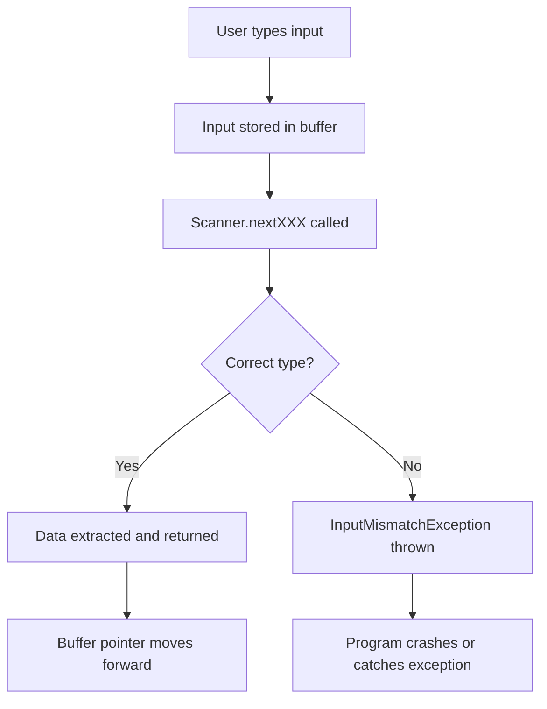
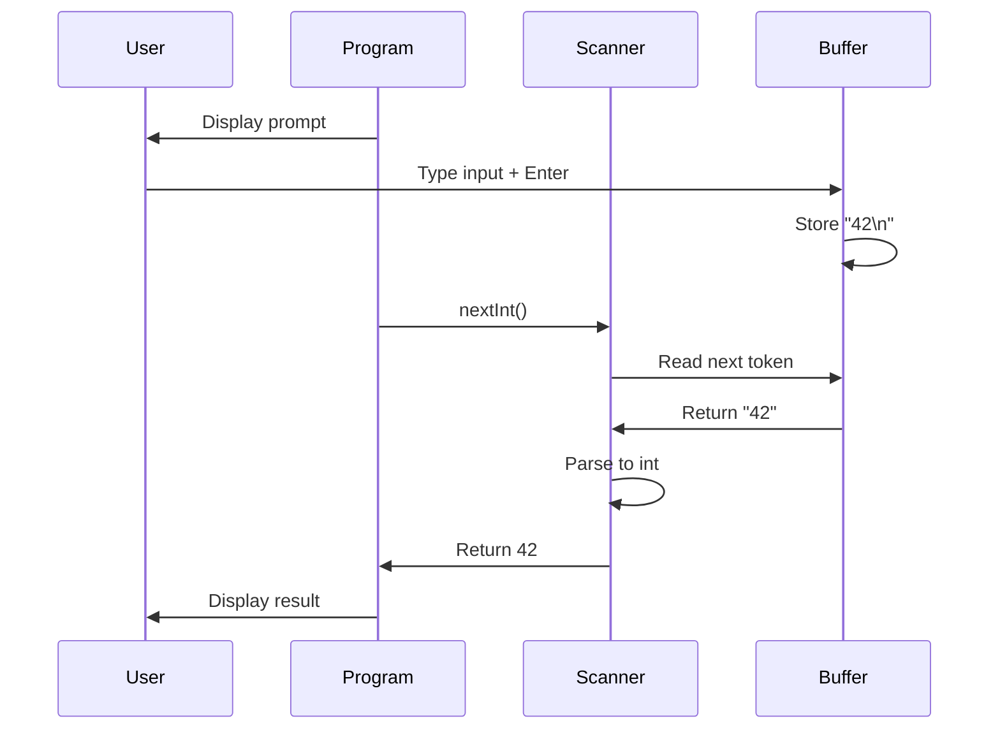
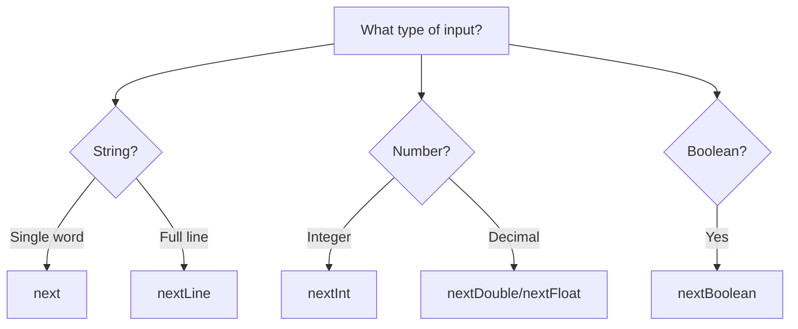
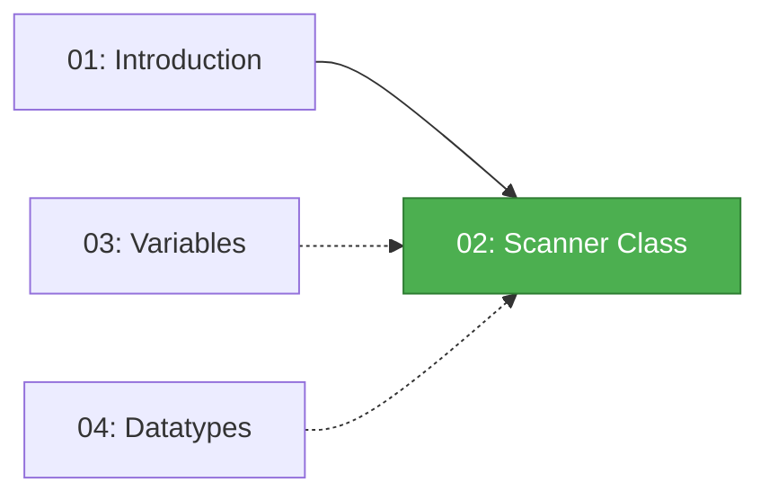

# Scanner Class 🔍

> *"Reading user input is the first step to making your programs interactive."*

---

## 📚 Prerequisites / Basics

Before learning about the Scanner class, you should understand:

- ✅ **[01: Introduction to Java](01_Introduction.md)** – Java basics, compilation, and execution
- ✅ **Basic I/O concepts** – Understanding input and output
- ✅ **Data types** – Knowledge of int, String, double, etc. (covered in [04: Datatypes](04_Datatypes_and_Literals.md))
- ✅ **Variables** – How to declare and use variables (covered in [03: Variables](03_Variables.md))

**What you'll learn:** How to read user input from the console using Java's Scanner class.

---

## 🧭 Core Concepts (in logical order)

### 1️⃣ What is the Scanner Class? – *Definition*

**What it is:**  
`Scanner` is a class in the `java.util` package that makes it easy to read input from various sources, including:
- **Console (keyboard input)**
- **Files**
- **Strings**
- **Input streams**

**Why it matters:**  
Without user input, programs can only perform static operations. The Scanner class enables dynamic, interactive applications where users can provide data at runtime.

**Real-world analogy:**  
Think of Scanner as a questionnaire form. Just as a form asks questions and waits for answers, the Scanner class prompts for input and reads what the user types.

### 2️⃣ Importing the Scanner Class – *Setup*

**How to import:**
```java
import java.util.Scanner;  // At the top of your file
```

**Why import?**  
Java organizes classes into packages. The `Scanner` class lives in the `java.util` package, so we need to import it to use it in our code.

**Alternative (not recommended):**
```java
import java.util.*;  // Imports ALL classes from java.util
```

**Best Practice:** Import specific classes (like `Scanner`) rather than using wildcards (`*`) for better code clarity and compile-time optimization.

### 3️⃣ Creating a Scanner Object – *Instantiation*

**Basic Syntax:**
```java
Scanner scanner = new Scanner(System.in);
```

**Breaking it down:**
- `Scanner` – The class type
- `scanner` – Variable name (can be any valid identifier)
- `new` – Creates a new object
- `Scanner(...)` – Constructor
- `System.in` – Standard input stream (keyboard)

**Memory Visualization:**
```
┌─────────────────────────┐
│  Scanner Object         │
│  ┌───────────────────┐  │
│  │ Input Source:     │  │
│  │ System.in         │  │
│  │ (Keyboard)        │  │
│  └───────────────────┘  │
│  ┌───────────────────┐  │
│  │ Buffer            │  │
│  │ [waiting for      │  │
│  │  user input...]   │  │
│  └───────────────────┘  │
└─────────────────────────┘
```

### 4️⃣ Scanner Methods – *Reading Different Data Types*

The Scanner class provides different methods for reading different types of input:

| Method | Return Type | Description | Example Input |
|--------|-------------|-------------|---------------|
| `next()` | `String` | Reads next token (word) | `"Hello"` |
| `nextLine()` | `String` | Reads entire line | `"Hello World"` |
| `nextInt()` | `int` | Reads an integer | `42` |
| `nextDouble()` | `double` | Reads a double | `3.14` |
| `nextFloat()` | `float` | Reads a float | `2.5f` |
| `nextLong()` | `long` | Reads a long | `1000000L` |
| `nextBoolean()` | `boolean` | Reads a boolean | `true` or `false` |
| `nextByte()` | `byte` | Reads a byte | `127` |
| `nextShort()` | `short` | Reads a short | `32000` |

**Key Distinction:**

```
next()     : Reads until whitespace (space, tab, newline)
nextLine() : Reads until newline character (\n)
```

### 5️⃣ Common Scanner Methods – *Utility Functions*

**Checking for Input:**

| Method | Description |
|--------|-------------|
| `hasNext()` | Returns `true` if there's more input |
| `hasNextInt()` | Returns `true` if next token is an int |
| `hasNextDouble()` | Returns `true` if next token is a double |
| `hasNextLine()` | Returns `true` if there's another line |

**Example Usage:**
```java
if (scanner.hasNextInt()) {
    int num = scanner.nextInt();
    // Process the integer
} else {
    System.out.println("Please enter a valid integer");
}
```

**Closing the Scanner:**
```java
scanner.close();  // Release resources
```

**Important:** Always close Scanner objects when done to prevent resource leaks.

### 6️⃣ Scanner Input Flow – *How It Works*



**Buffer Concept:**

When you type input and press Enter, the entire line (including the newline character) goes into a buffer. Scanner methods read from this buffer.

```
User types: "42 Hello\n"

Buffer: [4][2][ ][H][e][l][l][o][\n]
         ^
         |
    Scanner pointer

After nextInt():
Buffer: [4][2][ ][H][e][l][l][o][\n]
               ^
               |
          Scanner pointer (moved past "42")
```

---

## 💻 Hands-On Code Samples

### Example 1: Reading Basic Input

```java
import java.util.Scanner;

public class BasicScannerExample {
    public static void main(String[] args) {
        // Create Scanner object
        Scanner scanner = new Scanner(System.in);
        
        // Read a string (single word)
        System.out.print("Enter your name: ");
        String name = scanner.next();
        
        // Read an integer
        System.out.print("Enter your age: ");
        int age = scanner.nextInt();
        
        // Display the input
        System.out.println("\nHello, " + name + "!");
        System.out.println("You are " + age + " years old.");
        
        // Close the scanner
        scanner.close();
    }
}
```

**Sample Run:**
```
Enter your name: Alice
Enter your age: 25

Hello, Alice!
You are 25 years old.
```

**Line-by-line Explanation:**
1. Import Scanner class
2. Create Scanner object reading from `System.in` (keyboard)
3. `scanner.next()` waits for user to type a word and press Enter
4. `scanner.nextInt()` reads the next integer from input
5. Display the collected information
6. Close the scanner to free resources

---

### Example 2: Reading Multiple Data Types

```java
import java.util.Scanner;

public class MultipleInputTypes {
    public static void main(String[] args) {
        Scanner scanner = new Scanner(System.in);
        
        // Read different data types
        System.out.print("Enter product name: ");
        String product = scanner.nextLine();  // Reads entire line
        
        System.out.print("Enter quantity: ");
        int quantity = scanner.nextInt();
        
        System.out.print("Enter price: ");
        double price = scanner.nextDouble();
        
        // Calculate total
        double total = quantity * price;
        
        // Display receipt
        System.out.println("\n===== RECEIPT =====");
        System.out.println("Product: " + product);
        System.out.println("Quantity: " + quantity);
        System.out.println("Price: $" + price);
        System.out.println("Total: $" + total);
        System.out.println("===================");
        
        scanner.close();
    }
}
```

**Sample Run:**
```
Enter product name: Laptop Computer
Enter quantity: 2
Enter price: 999.99

===== RECEIPT =====
Product: Laptop Computer
Quantity: 2
Price: $999.99
Total: $1999.98
===================
```

---

### Example 3: Input Validation

```java
import java.util.Scanner;

public class InputValidation {
    public static void main(String[] args) {
        Scanner scanner = new Scanner(System.in);
        
        // Validate integer input
        System.out.print("Enter a number between 1 and 100: ");
        
        while (!scanner.hasNextInt()) {
            System.out.println("Invalid input! Please enter a number.");
            scanner.next(); // Consume invalid input
            System.out.print("Enter a number between 1 and 100: ");
        }
        
        int number = scanner.nextInt();
        
        while (number < 1 || number > 100) {
            System.out.println("Number must be between 1 and 100!");
            System.out.print("Try again: ");
            number = scanner.nextInt();
        }
        
        System.out.println("You entered: " + number);
        scanner.close();
    }
}
```

**Sample Run:**
```
Enter a number between 1 and 100: abc
Invalid input! Please enter a number.
Enter a number between 1 and 100: 150
Number must be between 1 and 100!
Try again: 50
You entered: 50
```

---

### Example 4: Calculator Program

```java
import java.util.Scanner;

public class SimpleCalculator {
    public static void main(String[] args) {
        Scanner scanner = new Scanner(System.in);
        
        System.out.println("===== SIMPLE CALCULATOR =====");
        
        // Read first number
        System.out.print("Enter first number: ");
        double num1 = scanner.nextDouble();
        
        // Read operator
        System.out.print("Enter operator (+, -, *, /): ");
        char operator = scanner.next().charAt(0);
        
        // Read second number
        System.out.print("Enter second number: ");
        double num2 = scanner.nextDouble();
        
        // Perform calculation
        double result;
        
        switch (operator) {
            case '+':
                result = num1 + num2;
                System.out.println("Result: " + num1 + " + " + num2 + " = " + result);
                break;
            case '-':
                result = num1 - num2;
                System.out.println("Result: " + num1 + " - " + num2 + " = " + result);
                break;
            case '*':
                result = num1 * num2;
                System.out.println("Result: " + num1 + " * " + num2 + " = " + result);
                break;
            case '/':
                if (num2 != 0) {
                    result = num1 / num2;
                    System.out.println("Result: " + num1 + " / " + num2 + " = " + result);
                } else {
                    System.out.println("Error: Division by zero!");
                }
                break;
            default:
                System.out.println("Invalid operator!");
        }
        
        scanner.close();
    }
}
```

**Sample Run:**
```
===== SIMPLE CALCULATOR =====
Enter first number: 15
Enter operator (+, -, *, /): *
Enter second number: 4
Result: 15.0 * 4.0 = 60.0
```

---

## 🎨 Visual Aids

### Scanner Workflow



### next() vs nextLine()

```
Input Buffer: "Hello World\n"

Using next():
┌──────┐
│Hello │  ← Reads only "Hello"
└──────┘
       │ World\n│ ← Remains in buffer

Using nextLine():
┌──────────────┐
│Hello World   │  ← Reads entire line
└──────────────┘
                 ← Buffer empty
```

### Scanner Methods Decision Tree



---

## ⚠️ Common Pitfalls & Anti-Patterns

### Pitfall 1: Mixing nextLine() with Other Methods

**❌ Problem:**
```java
Scanner scanner = new Scanner(System.in);

System.out.print("Enter age: ");
int age = scanner.nextInt();  // Leaves \n in buffer

System.out.print("Enter name: ");
String name = scanner.nextLine();  // Reads the leftover \n!

System.out.println("Name: " + name);  // Name is empty!
```

**Why it fails:**
- `nextInt()` reads "25" but leaves "\n" in the buffer
- `nextLine()` immediately reads the leftover "\n" and returns empty string

**✅ Solution 1: Add extra nextLine()**
```java
Scanner scanner = new Scanner(System.in);

System.out.print("Enter age: ");
int age = scanner.nextInt();
scanner.nextLine();  // Consume leftover newline

System.out.print("Enter name: ");
String name = scanner.nextLine();

System.out.println("Name: " + name);  // Works correctly!
```

**✅ Solution 2: Use nextLine() for everything**
```java
Scanner scanner = new Scanner(System.in);

System.out.print("Enter age: ");
int age = Integer.parseInt(scanner.nextLine());

System.out.print("Enter name: ");
String name = scanner.nextLine();

System.out.println("Name: " + name);
```

---

### Pitfall 2: Not Handling InputMismatchException

**❌ Wrong:**
```java
Scanner scanner = new Scanner(System.in);
System.out.print("Enter a number: ");
int num = scanner.nextInt();  // Crashes if user enters "abc"
```

**✅ Correct:**
```java
Scanner scanner = new Scanner(System.in);
System.out.print("Enter a number: ");

try {
    int num = scanner.nextInt();
    System.out.println("You entered: " + num);
} catch (InputMismatchException e) {
    System.out.println("Invalid input! Please enter a number.");
    scanner.next(); // Clear invalid input
}
```

**Better: Use hasNextInt()**
```java
Scanner scanner = new Scanner(System.in);
System.out.print("Enter a number: ");

if (scanner.hasNextInt()) {
    int num = scanner.nextInt();
    System.out.println("You entered: " + num);
} else {
    System.out.println("Invalid input!");
    scanner.next(); // Clear invalid input
}
```

---

### Pitfall 3: Forgetting to Close Scanner

**❌ Resource Leak:**
```java
public void readInput() {
    Scanner scanner = new Scanner(System.in);
    String input = scanner.nextLine();
    // Scanner never closed - resource leak!
}
```

**✅ Always Close:**
```java
public void readInput() {
    Scanner scanner = new Scanner(System.in);
    try {
        String input = scanner.nextLine();
        // Use input...
    } finally {
        scanner.close();  // Always closes, even if exception occurs
    }
}
```

**✅ Better: Try-with-resources (Java 7+)**
```java
public void readInput() {
    try (Scanner scanner = new Scanner(System.in)) {
        String input = scanner.nextLine();
        // Use input...
    } // Scanner automatically closed
}
```

---

### Pitfall 4: Reading from Closed Scanner

**❌ Wrong:**
```java
Scanner scanner = new Scanner(System.in);
scanner.close();
String input = scanner.nextLine();  // IllegalStateException!
```

**✅ Correct:**
```java
Scanner scanner = new Scanner(System.in);
String input = scanner.nextLine();
scanner.close();  // Close after all reading is done
```

---

## 🔗 Inter-Topic Connections

### Prerequisites Flow



### Used In Later Topics

| Concept | Used In | Purpose |
|---------|---------|---------|
| **User Input** | [07: Classes and Objects](07_Classes_and_Objects.md) | Creating objects with user-provided data |
| **Data Validation** | [17: Exception Handling](17_Exception_Handling.md) | Handling invalid input gracefully |
| **Reading Files** | [21: Java IO](21_Java_IO.md) | Scanner can read from files too |
| **Parsing Input** | [12: Strings](12_Strings.md) | String manipulation of user input |

### Real-World Applications

- **Console-based games** – Player input
- **Data collection tools** – Gathering information
- **Interactive CLIs** – Command-line interfaces
- **Testing tools** – Manual test data entry

---

## 📑 Summary & Quick-Reference Checklist

### ✅ Key Takeaways

- ✅ `Scanner` class is in `java.util` package – must import it
- ✅ Create with `new Scanner(System.in)` for keyboard input
- ✅ Use `next()` for single word, `nextLine()` for full line
- ✅ Use `nextInt()`, `nextDouble()`, etc. for specific types
- ✅ **Always close** Scanner with `scanner.close()`
- ✅ Use `hasNextInt()` etc. to validate before reading
- ✅ Be careful mixing `nextLine()` with other methods
- ✅ Handle `InputMismatchException` for robust programs

### 📋 Scanner Method Quick Reference

```java
// Import
import java.util.Scanner;

// Create
Scanner sc = new Scanner(System.in);

// Read Input
String word = sc.next();           // Single word
String line = sc.nextLine();       // Entire line
int num = sc.nextInt();             // Integer
double decimal = sc.nextDouble();   // Double
boolean flag = sc.nextBoolean();    // Boolean

// Validate
if (sc.hasNext()) { ... }
if (sc.hasNextInt()) { ... }
if (sc.hasNextDouble()) { ... }

// Close
sc.close();
```

### 🎯 Interview Questions

**Q: What's the difference between next() and nextLine()?**  
A: `next()` reads until whitespace (space, tab, newline), while `nextLine()` reads until newline character (\n), including spaces.

**Q: Why do we need to import Scanner?**  
A: Scanner is in the `java.util` package, not in `java.lang` which is automatically imported.

**Q: What happens if nextInt() encounters non-integer input?**  
A: It throws `InputMismatchException` at runtime.

**Q: How do you read from a file using Scanner?**  
A: `Scanner scanner = new Scanner(new File("filename.txt"));`

---

## 📚 Further Reading / External Resources

### Official Documentation

- **[Scanner Class Documentation](https://docs.oracle.com/en/java/javase/17/docs/api/java.base/java/util/Scanner.html)** – Complete API reference
- **[Pattern Class](https://docs.oracle.com/en/java/javase/17/docs/api/java.base/java/util/regex/Pattern.html)** – Scanner uses regex patterns

### Tutorials

- **[Oracle Java Tutorials - I/O](https://docs.oracle.com/javase/tutorial/essential/io/)** – I/O fundamentals
- **[GeeksforGeeks Scanner Tutorial](https://www.geeksforgeeks.org/scanner-class-in-java/)** – Examples and explanations

### Alternative Input Methods

- **BufferedReader** – More efficient for large inputs
- **Console** – Better for password input (masking)
- **Command-line arguments** – Via `String[] args` in main

---

## 🗂️ Video Index

**This tutorial corresponds to the following videos from the RBR Java playlist:**

### Section 2: Scanner Class (2 videos)

16. `Java- Example on scanner class.mp4`
17. `Java- Introduction to Variable.mp4`

---

## 🎓 Next Steps

Now that you can read user input, you're ready to make interactive programs!

**Continue to:** [03 - Variables](03_Variables.md) to learn about storing and managing data.

**Or explore:**
- [04 - Datatypes and Literals](04_Datatypes_and_Literals.md) – Understanding data types in depth
- [05 - Operators](05_Operators.md) – Performing operations on input data

---

## 💬 Practice Exercises

### Exercise 1: Personal Information Collector
Create a program that asks for and displays:
- Full name
- Age
- Email address
- Favorite color

### Exercise 2: Temperature Converter
Create a program that:
- Asks user for temperature in Celsius
- Converts to Fahrenheit
- Displays the result

Formula: `F = (C × 9/5) + 32`

### Exercise 3: Quiz Program
Create a simple 3-question quiz:
- Ask user 3 questions
- Read their answers
- Calculate and display the score

### Exercise 4: Shopping Cart
Create a program that:
- Asks for product names and prices
- Calculates subtotal
- Applies tax (8%)
- Shows final total

---

**🎉 Congratulations!** You now know how to:
- Import and create Scanner objects
- Read different types of input
- Validate user input
- Handle common Scanner pitfalls
- Build interactive programs

**Keep practicing with user input!** 💻✨

---

*End of Scanner Class tutorial.*  
*Part of the [RBR Java Complete Tutorial Suite](README.md)*
