# Variables 📦

> *"Variables are the building blocks that store data in your programs."*

---

## 📚 Prerequisites / Basics

Before learning about variables, you should understand:

- ✅ **[01: Introduction to Java](01_Introduction.md)** – Basic Java syntax and structure
- ✅ **[02: Scanner Class](02_Scanner_Class.md)** – Reading input (useful for variable examples)
- ✅ **Basic programming concepts** – Understanding of storing and retrieving data

**What you'll learn:** How to declare, initialize, and use variables in Java, including different variable types and their scope.

---

## 🧭 Core Concepts (in logical order)

### 1️⃣ What is a Variable? – *Definition*

**What it is:**  
A variable is a **named container** that stores a value in memory. It's a symbolic name associated with a memory location that can hold data.

**Why it matters:**  
Variables allow programs to store, modify, and retrieve data during execution. Without variables, programs would have no way to work with dynamic data.

**Real-world analogy:**  
Think of a variable as a labeled box in a storage room. The label is the variable name, and the contents are the value stored. Just as you can replace what's in the box, you can change the value stored in a variable.

### 2️⃣ Java is a Strongly Typed Language – *Type Safety*

**What it means:**  
In Java, every variable must have a declared type, and that type cannot change during the program's execution. The compiler enforces type checking to prevent type mismatches.

**Advantages:**
- ✅ **Type Safety** – Catches errors at compile-time
- ✅ **Better Performance** – Optimizations possible with known types
- ✅ **Code Clarity** – Types document what data is expected
- ✅ **IDE Support** – Better autocomplete and error detection

**Comparison with Weakly Typed Languages:**

| Feature | Java (Strong) | JavaScript (Weak) |
|---------|---------------|-------------------|
| **Type Declaration** | Required | Optional |
| **Type Checking** | Compile-time | Runtime |
| **Type Changes** | Not allowed | Allowed |
| **Example** | `int x = 5;` | `let x = 5;` (can become string later) |

**Example:**
```java
int age = 25;          // age is an integer
age = "twenty-five";   // ❌ COMPILATION ERROR!
                       // Cannot assign String to int variable
```

### 3️⃣ Variable Declaration – *Syntax*

**Basic Syntax:**
```java
dataType variableName;
```

**Declaration with Initialization:**
```java
dataType variableName = value;
```

**Multiple Variables:**
```java
// Same type, separate declarations
int x;
int y;
int z;

// Same type, single declaration
int a, b, c;

// With initialization
int num1 = 10, num2 = 20, num3 = 30;
```

**Naming Rules (Identifiers):**

✅ **Valid:**
- Start with letter (a-z, A-Z), underscore (_), or dollar sign ($)
- Can contain letters, digits, underscores, dollar signs
- Case-sensitive (`age` and `Age` are different)

❌ **Invalid:**
- Cannot start with a digit
- Cannot be a Java keyword
- Cannot contain spaces or special characters (except _ and $)

**Naming Conventions:**

```java
// Good practice (camelCase for variables)
int studentAge;
String firstName;
double accountBalance;

// Bad practice (but syntactically valid)
int student_age;        // Use camelCase, not snake_case
String FIRSTNAME;       // All caps reserved for constants
double ab;              // Not descriptive
```

### 4️⃣ Variable Scope – *Where Variables Live*

**What is Scope?**  
Scope determines where in your code a variable can be accessed. It defines the visibility and lifetime of a variable.

**Block Scope:**
```java
public class ScopeExample {
    public static void main(String[] args) {
        int x = 10;  // Scope: entire main method
        
        if (x > 5) {
            int y = 20;  // Scope: only inside if block
            System.out.println(x);  // ✅ Can access x
            System.out.println(y);  // ✅ Can access y
        }
        
        System.out.println(x);  // ✅ Can access x
        System.out.println(y);  // ❌ ERROR! y not in scope
    }
}
```

**Scope Hierarchy:**
```
Class Scope (widest)
  ↓
Method Scope
  ↓
Block Scope (narrowest)
```

**Scope Visualization:**
```
┌─────────────────────────────────────────┐
│ Class Level                             │
│ int classVar;                           │
│                                         │
│  ┌────────────────────────────────────┐│
│  │ Method Level                       ││
│  │ void method() {                    ││
│  │   int methodVar;                   ││
│  │                                    ││
│  │   ┌──────────────────────────────┐││
│  │   │ Block Level                  │││
│  │   │ if (condition) {             │││
│  │   │   int blockVar;              │││
│  │   │ }                            │││
│  │   └──────────────────────────────┘││
│  │ }                                  ││
│  └────────────────────────────────────┘│
└─────────────────────────────────────────┘
```

### 5️⃣ Variable Lifetime – *Memory Management*

**Lifetime** refers to how long a variable exists in memory during program execution.

**Lifecycle Stages:**


**Example:**
```java
public class LifetimeExample {
    public static void main(String[] args) {
        int x;              // 1. Declared (memory allocated)
        x = 10;             // 2. Initialized
        System.out.println(x);  // 3. Used
    }                       // 4. End of scope (memory can be reclaimed)
}
```

### 6️⃣ Types of Variables – *Three Categories*

Java has three types of variables based on where they're declared and how they're used:


---

## 💻 Hands-On Code Samples

### Example 1: Local Variables

```java
public class LocalVariableExample {
    public static void main(String[] args) {
        // Local variables declared inside method
        int age = 25;              // Must initialize before use
        String name = "Alice";
        double salary = 50000.50;
        
        // Using local variables
        System.out.println("Name: " + name);
        System.out.println("Age: " + age);
        System.out.println("Salary: $" + salary);
        
        // Local variable in a block
        if (age >= 18) {
            String status = "Adult";  // Scope: only inside if block
            System.out.println("Status: " + status);
        }
        
        // System.out.println(status);  // ❌ ERROR: status not in scope
    }
}
```

**Key Points about Local Variables:**
- ✅ Declared inside methods, constructors, or blocks
- ✅ Must be initialized before use (no default value)
- ✅ Scope limited to the block where declared
- ✅ Stored on the stack
- ✅ Destroyed when method/block ends

**Output:**
```
Name: Alice
Age: 25
Salary: $50000.5
Status: Adult
```

---

### Example 2: Instance Variables (Non-Static)

```java
public class Student {
    // Instance variables (declared at class level)
    String name;          // Default value: null
    int age;              // Default value: 0
    double gpa;           // Default value: 0.0
    boolean isEnrolled;   // Default value: false
    
    // Method to display student info
    public void displayInfo() {
        System.out.println("Name: " + name);
        System.out.println("Age: " + age);
        System.out.println("GPA: " + gpa);
        System.out.println("Enrolled: " + isEnrolled);
    }
    
    public static void main(String[] args) {
        // Create two student objects
        Student student1 = new Student();
        student1.name = "Bob";
        student1.age = 20;
        student1.gpa = 3.5;
        student1.isEnrolled = true;
        
        Student student2 = new Student();
        student2.name = "Carol";
        student2.age = 22;
        student2.gpa = 3.8;
        student2.isEnrolled = true;
        
        System.out.println("Student 1:");
        student1.displayInfo();
        
        System.out.println("\nStudent 2:");
        student2.displayInfo();
    }
}
```

**Key Points about Instance Variables:**
- ✅ Declared at class level (outside methods)
- ✅ Each object has its own copy
- ✅ Have default values (0, null, false, etc.)
- ✅ Accessed using object reference (`student1.name`)
- ✅ Stored in heap memory
- ✅ Lifetime: as long as object exists

**Output:**
```
Student 1:
Name: Bob
Age: 20
GPA: 3.5
Enrolled: true

Student 2:
Name: Carol
Age: 22
GPA: 3.8
Enrolled: true
```

**Memory Visualization:**
```
Heap Memory:
┌──────────────────────┐
│ student1 object      │
│ name = "Bob"         │
│ age = 20             │
│ gpa = 3.5            │
│ isEnrolled = true    │
└──────────────────────┘

┌──────────────────────┐
│ student2 object      │
│ name = "Carol"       │
│ age = 22             │
│ gpa = 3.8            │
│ isEnrolled = true    │
└──────────────────────┘
```

---

### Example 3: Static Variables (Class Variables)

```java
public class Counter {
    // Static variable (shared by all instances)
    static int count = 0;
    
    // Instance variable (unique to each instance)
    int instanceId;
    
    // Constructor
    public Counter() {
        count++;  // Increment shared counter
        instanceId = count;  // Assign unique ID
    }
    
    // Display method
    public void displayInfo() {
        System.out.println("Instance ID: " + instanceId);
        System.out.println("Total objects created: " + count);
    }
    
    public static void main(String[] args) {
        Counter obj1 = new Counter();
        Counter obj2 = new Counter();
        Counter obj3 = new Counter();
        
        obj1.displayInfo();
        System.out.println();
        obj2.displayInfo();
        System.out.println();
        obj3.displayInfo();
        
        System.out.println("\nAccessing static variable via class:");
        System.out.println("Counter.count = " + Counter.count);
    }
}
```

**Key Points about Static Variables:**
- ✅ Declared with `static` keyword
- ✅ Shared by ALL objects of the class
- ✅ Only one copy exists in memory
- ✅ Can be accessed using class name (`Counter.count`)
- ✅ Stored in Method Area (not heap)
- ✅ Lifetime: entire program execution

**Output:**
```
Instance ID: 1
Total objects created: 3

Instance ID: 2
Total objects created: 3

Instance ID: 3
Total objects created: 3

Accessing static variable via class:
Counter.count = 3
```

**Memory Visualization:**
```
Method Area (Shared):
┌──────────────────────┐
│ Counter.count = 3    │ ← One copy shared by all
└──────────────────────┘

Heap Memory (Individual):
┌──────────────────────┐
│ obj1: instanceId = 1 │
└──────────────────────┘
┌──────────────────────┐
│ obj2: instanceId = 2 │
└──────────────────────┘
┌──────────────────────┐
│ obj3: instanceId = 3 │
└──────────────────────┘
```

---

### Example 4: Comparing All Three Variable Types

```java
public class VariableComparison {
    // Instance variable
    int instanceVar = 100;
    
    // Static variable
    static int staticVar = 200;
    
    public void demonstrateVariables() {
        // Local variable
        int localVar = 300;
        
        System.out.println("Local Variable: " + localVar);
        System.out.println("Instance Variable: " + instanceVar);
        System.out.println("Static Variable: " + staticVar);
    }
    
    public static void main(String[] args) {
        // Create two objects
        VariableComparison obj1 = new VariableComparison();
        VariableComparison obj2 = new VariableComparison();
        
        System.out.println("Object 1:");
        obj1.demonstrateVariables();
        
        System.out.println("\nObject 2:");
        obj2.demonstrateVariables();
        
        // Modify variables
        obj1.instanceVar = 111;
        staticVar = 222;
        
        System.out.println("\nAfter modification:");
        System.out.println("obj1.instanceVar: " + obj1.instanceVar);
        System.out.println("obj2.instanceVar: " + obj2.instanceVar);  // Unchanged
        System.out.println("staticVar via obj1: " + obj1.staticVar);
        System.out.println("staticVar via obj2: " + obj2.staticVar);  // Same value
    }
}
```

**Output:**
```
Object 1:
Local Variable: 300
Instance Variable: 100
Static Variable: 200

Object 2:
Local Variable: 300
Instance Variable: 100
Static Variable: 200

After modification:
obj1.instanceVar: 111
obj2.instanceVar: 100
staticVar via obj1: 222
staticVar via obj2: 222
```

---

### Example 5: Variable Scope Demonstration

```java
public class ScopeDemo {
    // Class-level variable
    int classVar = 10;
    
    public void demonstrateScope() {
        // Method-level variable
        int methodVar = 20;
        
        System.out.println("In method:");
        System.out.println("  classVar = " + classVar);
        System.out.println("  methodVar = " + methodVar);
        
        // Block scope
        if (true) {
            int blockVar = 30;
            System.out.println("\nIn block:");
            System.out.println("  classVar = " + classVar);
            System.out.println("  methodVar = " + methodVar);
            System.out.println("  blockVar = " + blockVar);
        }
        
        // System.out.println(blockVar);  // ❌ ERROR: not in scope
        
        // Nested blocks
        for (int i = 0; i < 2; i++) {
            int loopVar = 40;
            System.out.println("\nIn loop " + i + ":");
            System.out.println("  loopVar = " + loopVar);
        }
        
        // System.out.println(i);  // ❌ ERROR: not in scope
        // System.out.println(loopVar);  // ❌ ERROR: not in scope
    }
    
    public static void main(String[] args) {
        ScopeDemo demo = new ScopeDemo();
        demo.demonstrateScope();
    }
}
```

**Output:**
```
In method:
  classVar = 10
  methodVar = 20

In block:
  classVar = 10
  methodVar = 20
  blockVar = 30

In loop 0:
  loopVar = 40

In loop 1:
  loopVar = 40
```

---

## 🎨 Visual Aids

### Variable Types Comparison Table

| Feature | Local Variable | Instance Variable | Static Variable |
|---------|---------------|-------------------|-----------------|
| **Declaration** | Inside methods/blocks | Class level (no static) | Class level (with static) |
| **Default Value** | ❌ None (must initialize) | ✅ Yes (0, null, false) | ✅ Yes (0, null, false) |
| **Memory Location** | Stack | Heap | Method Area |
| **Scope** | Method/block | Object lifetime | Class lifetime |
| **Access** | Only in method | Via object reference | Via class name or object |
| **Copies** | One per method call | One per object | One per class |
| **Keyword** | None | None | `static` |

### Default Values for Instance and Static Variables

| Data Type | Default Value |
|-----------|---------------|
| `byte` | 0 |
| `short` | 0 |
| `int` | 0 |
| `long` | 0L |
| `float` | 0.0f |
| `double` | 0.0d |
| `char` | '\u0000' (null character) |
| `boolean` | false |
| **Reference types** | null |

### Variable Lifecycle Diagram

```mermaid
stateDiagram-v2
    [*] --> Declared: Variable declared
    Declared --> Initialized: Value assigned
    Initialized --> InUse: Variable accessed
    InUse --> Modified: Value changed
    Modified --> InUse: Continue using
    InUse --> OutOfScope: Block ends
    OutOfScope --> GC: Eligible for garbage collection
    GC --> [*]
```



### Scope Visualization

```
public class Example {
    int classVar = 1;  // ← Class scope (accessible everywhere in class)
    
    public void method1() {
        int method1Var = 2;  // ← Method scope (only in method1)
        
        if (condition) {
            int blockVar = 3;  // ← Block scope (only in if block)
        }
    }
    
    public void method2() {
        // Can access: classVar
        // Cannot access: method1Var, blockVar
    }
}
```

---

## ⚠️ Common Pitfalls & Anti-Patterns

### Pitfall 1: Using Uninitialized Local Variables

**❌ Wrong:**
```java
public class UninitializedVariable {
    public static void main(String[] args) {
        int age;
        System.out.println(age);  // ❌ COMPILATION ERROR!
        // Variable 'age' might not have been initialized
    }
}
```

**✅ Correct:**
```java
public class InitializedVariable {
    public static void main(String[] args) {
        int age = 0;  // Or any appropriate initial value
        System.out.println(age);  // ✅ Works fine
    }
}
```

**Why:** Local variables don't have default values. The compiler ensures they're initialized before use to prevent undefined behavior.

---

### Pitfall 2: Variable Shadowing

**❌ Confusing:**
```java
public class Shadowing {
    int x = 10;  // Instance variable
    
    public void display() {
        int x = 20;  // Local variable shadows instance variable
        System.out.println(x);  // Prints 20, not 10!
    }
    
    public static void main(String[] args) {
        Shadowing obj = new Shadowing();
        obj.display();  // Output: 20
    }
}
```

**✅ Better:**
```java
public class NoShadowing {
    int x = 10;
    
    public void display() {
        int localX = 20;  // Different name
        System.out.println("Instance x: " + x);
        System.out.println("Local x: " + localX);
    }
}
```

**Or use `this` keyword:**
```java
public class UsesThis {
    int x = 10;
    
    public void display() {
        int x = 20;
        System.out.println("Instance x: " + this.x);  // 10
        System.out.println("Local x: " + x);          // 20
    }
}
```

---

### Pitfall 3: Assuming Instance Variables are Initialized in Constructor

**❌ Wrong Assumption:**
```java
public class WrongAssumption {
    int count;  // Initialized to 0 by default
    
    public WrongAssumption() {
        count++;  // Assumes count starts at 0, but this is only by default
    }
}
```

**✅ Explicit Initialization:**
```java
public class ExplicitInit {
    int count = 0;  // Explicitly initialize
    
    public ExplicitInit() {
        count++;  // Clear intent
    }
}
```

**Best Practice:** Always initialize variables explicitly, even if the default value is what you want. This makes your code's intent clear.

---

### Pitfall 4: Modifying Static Variables from Multiple Threads

**❌ Thread-Unsafe:**
```java
public class UnsafeCounter {
    static int count = 0;
    
    public static void increment() {
        count++;  // Not thread-safe!
    }
}
```

**✅ Thread-Safe:**
```java
public class SafeCounter {
    static int count = 0;
    
    public static synchronized void increment() {
        count++;  // Thread-safe
    }
}
```

**Note:** We'll cover threading in detail in [16: Threads](16_Threads.md).

---

## 🔗 Inter-Topic Connections

### Flow to Related Topics


### Concepts Used in Later Topics

| Concept | Used In | Purpose |
|---------|---------|---------|
| **Local Variables** | All topics | Temporary storage in methods |
| **Instance Variables** | [07: Classes and Objects](07_Classes_and_Objects.md) | Object state |
| **Static Variables** | [08: Static Variables and Methods](08_Static_Variables_and_Methods.md) | Class-level data |
| **Scope** | [06: Control Statements](06_Control_Statements.md) | Loop variables, block scope |
| **Variable Types** | [04: Datatypes](04_Datatypes_and_Literals.md) | Type system |

---

## 📑 Summary & Quick-Reference Checklist

### ✅ Key Takeaways

- ✅ Java is **strongly typed** – every variable must have a declared type
- ✅ **Local variables** – declared in methods, no default value, must initialize
- ✅ **Instance variables** – declared in class, have default values, one per object
- ✅ **Static variables** – shared by all objects, one copy per class
- ✅ **Scope** determines where variables can be accessed
- ✅ **Lifetime** determines how long variables exist in memory
- ✅ Always **initialize local variables** before use
- ✅ Use descriptive **naming conventions** (camelCase for variables)

### 📋 Variable Declaration Cheat Sheet

```java
// Local Variable
public void method() {
    int localVar = 10;  // Must initialize
}

// Instance Variable
public class MyClass {
    int instanceVar;  // Default value: 0
}

// Static Variable
public class MyClass {
    static int staticVar;  // Default value: 0
}

// Multiple variables
int a = 1, b = 2, c = 3;

// Final variable (constant)
final int MAX_VALUE = 100;
```

### 🎯 Interview Quick-Prep

**Q: What's the difference between instance and static variables?**  
A: Instance variables belong to objects (one copy per object), while static variables belong to the class (one copy shared by all objects).

**Q: What are default values for variables?**  
A: Local variables have NO default value (must initialize). Instance and static variables have default values: 0 for numbers, false for boolean, null for references.

**Q: What is variable shadowing?**  
A: When a local variable has the same name as an instance variable, the local variable "shadows" the instance variable within its scope.

**Q: Where are different types of variables stored in memory?**  
A: Local variables → Stack, Instance variables → Heap, Static variables → Method Area

---

## 📚 Further Reading / External Resources

### Official Documentation

- **[Java Language Specification - Variables](https://docs.oracle.com/javase/specs/jls/se17/html/jls-4.html#jls-4.12)** – Official spec
- **[Oracle Tutorial - Variables](https://docs.oracle.com/javase/tutorial/java/nutsandbolts/variables.html)** – Variables guide

### Related Topics

- **[Naming Conventions](https://www.oracle.com/java/technologies/javase/codeconventions-namingconventions.html)** – Java naming standards
- **[Memory Management](https://www.baeldung.com/java-stack-heap)** – Stack vs Heap

---

## 🗂️ Video Index

**This tutorial corresponds to the following videos from the RBR Java playlist:**

### Section 3: Variables (13 videos)

18. `Java- Java is Strongly typed Language.mp4`
19. `Java- Java variable declaration.mp4`
20. `Java- Scope and lifetime of a variable.mp4`
21. `Java- Types of variables in java.mp4`
22. `Java- Examples on local variable.mp4`
23. `Java- Instance variables.mp4`
24. `Java- Examples on Instance variable - 1.mp4`
25. `Java- Examples on Instance variable - 2.mp4`
26. `Java- Static variable.mp4`
27. `Java- Examples on static variable - 1.mp4`
28. `Java- Examples on static variable - 2.mp4`
29. `Java- Example on Variables.mp4`
30. `Java- Introduction to Data Types.mp4`

**Supporting Materials:**
- `4.variables.pdf`

---

## 🎓 Next Steps

**Continue to:** [04 - Datatypes and Literals](04_Datatypes_and_Literals.md) to understand what types of data variables can store.

**Or explore:**
- [07 - Classes and Objects](07_Classes_and_Objects.md) – Deep dive into instance variables
- [08 - Static Variables and Methods](08_Static_Variables_and_Methods.md) – Master static members

---

## 💬 Practice Exercises

### Exercise 1: Variable Types
Create a class with all three types of variables and demonstrate their behavior with multiple objects.

### Exercise 2: Scope Explorer
Write a program that demonstrates variable scope at different levels (class, method, block).

### Exercise 3: Object Counter
Create a class that uses a static variable to count how many objects have been created.

### Exercise 4: Variable Shadowing
Create examples showing variable shadowing and use the `this` keyword to access shadowed variables.

---

**🎉 Congratulations!** You now understand:
- Different types of variables in Java
- Variable scope and lifetime
- How to declare and initialize variables
- Memory locations of different variable types
- Common pitfalls to avoid

**Master variables to build solid Java foundations!** 💻✨

---

*End of Variables tutorial.*  
*Part of the [RBR Java Complete Tutorial Suite](README.md)*
