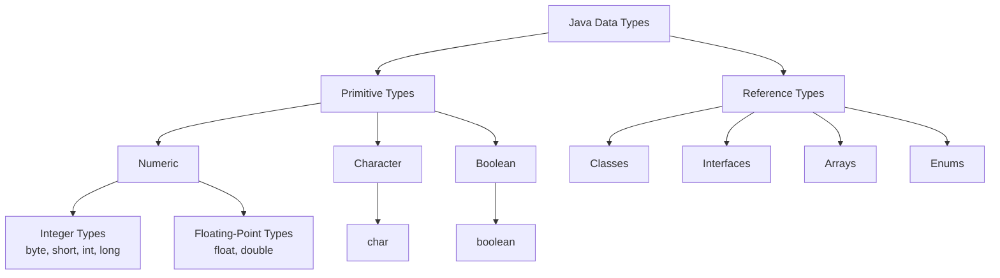
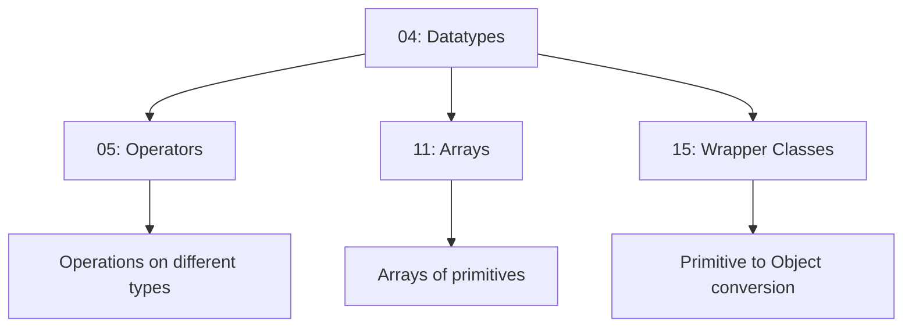

# Datatypes and Literals 🔢

> *"Data types are the foundation of type safety in Java."*

---

## 📚 Prerequisites / Basics

Before learning about datatypes, you should understand:

- ✅ **[01: Introduction to Java](01_Introduction.md)** – Java basics and JVM architecture
- ✅ **[03: Variables](03_Variables.md)** – Variable declaration and usage
- ✅ **Basic mathematical concepts** – Numbers, decimals, boolean logic

**What you'll learn:** Java's type system, primitive and reference types, type casting, and literals.

---

## 🧭 Core Concepts (in logical order)

### 1️⃣ What are Data Types? – *Definition*

**What it is:**  
A data type defines the **type of data** a variable can hold and determines:
- The size of memory allocated
- The range of values that can be stored
- The operations that can be performed

**Why it matters:**  
Data types ensure type safety, prevent errors, enable compiler optimizations, and help document code intent.

**Real-world analogy:**  
Think of data types as different types of containers: a water bottle holds liquids, a wallet holds money, a USB drive holds digital data. Each container has a specific purpose and capacity.

### 2️⃣ Java Type System – *Categories*

Java has two main categories of data types:



**Key Differences:**

| Feature | Primitive Types | Reference Types |
|---------|----------------|-----------------|
| **Storage** | Actual value | Memory address (reference) |
| **Memory Location** | Stack | Heap (object) + Stack (reference) |
| **Default Value** | 0, false, '\u0000' | null |
| **Can be null** | ❌ No | ✅ Yes |
| **Methods** | ❌ No | ✅ Yes |
| **Examples** | int, double, boolean | String, Integer, Object |

### 3️⃣ Primitive Data Types – *Eight Basic Types*

Java has **8 primitive types** that represent simple values:

#### 📊 Primitive Types Overview

| Type | Size | Range | Default | Description |
|------|------|-------|---------|-------------|
| `byte` | 8-bit | -128 to 127 | 0 | Smallest integer |
| `short` | 16-bit | -32,768 to 32,767 | 0 | Small integer |
| `int` | 32-bit | -2³¹ to 2³¹-1 | 0 | Standard integer |
| `long` | 64-bit | -2⁶³ to 2⁶³-1 | 0L | Large integer |
| `float` | 32-bit | ±3.4×10³⁸ (7 digits precision) | 0.0f | Single-precision decimal |
| `double` | 64-bit | ±1.7×10³⁰⁸ (15 digits precision) | 0.0d | Double-precision decimal |
| `char` | 16-bit | 0 to 65,535 (Unicode) | '\u0000' | Single character |
| `boolean` | 1-bit* | true or false | false | Logical value |

*Note: boolean size is JVM-dependent, but logically represents 1 bit

#### 🔢 Integer Types

**byte** (8-bit)
```java
byte age = 25;
byte temperature = -10;
byte maxByte = 127;      // Maximum value
byte minByte = -128;     // Minimum value
```

**Use cases:**
- Small numbers in arrays (saves memory)
- Reading/writing binary files
- Network protocols

**short** (16-bit)
```java
short year = 2024;
short population = 30000;
short maxShort = 32767;
short minShort = -32768;
```

**Use cases:**
- Medium-range integers
- Data structures where memory matters

**int** (32-bit) ⭐ Most Common
```java
int count = 1000000;
int maxInt = 2147483647;    // Integer.MAX_VALUE
int minInt = -2147483648;   // Integer.MIN_VALUE
```

**Use cases:**
- Default choice for integers
- Loop counters, indices
- Most calculations

**long** (64-bit)
```java
long distance = 9460730472580800L;  // Note the 'L' suffix
long population = 7900000000L;
long maxLong = 9223372036854775807L;  // Long.MAX_VALUE
```

**Use cases:**
- Very large numbers
- Timestamps (milliseconds since epoch)
- File sizes

#### 💧 Floating-Point Types

**float** (32-bit)
```java
float pi = 3.14f;          // Note the 'f' suffix
float price = 19.99f;
float scientificNotation = 1.5e6f;  // 1.5 × 10⁶
```

**Use cases:**
- Graphics and scientific computing
- When memory is constrained
- Single-precision is sufficient

**double** (64-bit) ⭐ Default for Decimals
```java
double pi = 3.141592653589793;
double salary = 75000.50;
double scientificNotation = 1.5e100;  // 1.5 × 10¹⁰⁰
```

**Use cases:**
- Financial calculations (though BigDecimal is better)
- Scientific computations requiring precision
- Default choice for decimal numbers

**Precision Comparison:**
```java
float f = 0.1f + 0.1f + 0.1f;    // 0.30000001
double d = 0.1 + 0.1 + 0.1;      // 0.30000000000000004
// Neither is exactly 0.3 due to binary representation!
```

#### 🔤 Character Type

**char** (16-bit Unicode)
```java
char letter = 'A';
char digit = '5';
char symbol = '$';
char unicode = '\u0041';    // 'A' in Unicode
char newline = '\n';         // Escape sequence
```

**Special Escape Sequences:**

| Sequence | Meaning |
|----------|---------|
| `\n` | Newline |
| `\t` | Tab |
| `\r` | Carriage return |
| `\\` | Backslash |
| `\'` | Single quote |
| `\"` | Double quote |
| `\b` | Backspace |
| `\f` | Form feed |

#### ✅ Boolean Type

**boolean** (true/false)
```java
boolean isActive = true;
boolean hasPermission = false;
boolean result = (10 > 5);    // true
```

**Use cases:**
- Conditional logic
- Flags and state indicators
- Control flow

### 4️⃣ Type Casting – *Converting Between Types*

**Type casting** is converting a value from one data type to another.

#### Widening (Implicit/Automatic Casting)

From smaller to larger type – no data loss, automatic.

```
byte → short → int → long → float → double
        char → int
```

**Example:**
```java
int numInt = 100;
long numLong = numInt;      // Automatic widening
double numDouble = numLong; // Automatic widening

System.out.println(numInt);    // 100
System.out.println(numLong);   // 100
System.out.println(numDouble); // 100.0
```

**Visualization:**
```
┌──────┐
│ byte │ ──┐
└──────┘   │
           ├──► ┌───────┐
┌───────┐  │    │  int  │ ──┐
│ short │──┘    └───────┘   │
└───────┘                    ├──► ┌──────┐
                 ┌──────┐   │    │ long │ ──► float ──► double
                 │ char │───┘    └──────┘
                 └──────┘

Smaller ────────────────────────────────────► Larger
        (Automatic - No Data Loss)
```

#### Narrowing (Explicit Casting)

From larger to smaller type – potential data loss, requires explicit cast.

```
double → float → long → int → short → byte
                          int → char
```

**Example:**
```java
double numDouble = 100.75;
int numInt = (int) numDouble;    // Explicit narrowing - decimal truncated!
byte numByte = (byte) numInt;    // Explicit narrowing

System.out.println(numDouble);  // 100.75
System.out.println(numInt);     // 100 (decimal lost!)
System.out.println(numByte);    // 100
```

**Data Loss Example:**
```java
int bigNum = 130;
byte smallNum = (byte) bigNum;  // Overflow!
System.out.println(smallNum);   // -126 (not 130!)

// Why? byte range: -128 to 127
// 130 wraps around: 130 - 256 = -126
```

#### Type Promotion in Expressions

When mixing types in expressions, Java automatically promotes smaller types:

```java
byte b = 10;
int i = 20;
long l = 30;
float f = 40.5f;
double d = 50.5;

// Result type is the largest type in the expression
double result = b + i + l + f + d;  // Promoted to double
```

**Rules:**
1. byte, short, char promoted to int in expressions
2. If any operand is double → result is double
3. If any operand is float → result is float
4. If any operand is long → result is long
5. Otherwise → result is int

### 5️⃣ Literals – *Constant Values in Code*

**What are Literals?**  
Literals are fixed values written directly in code, representing primitive types or strings.

#### Integer Literals

```java
int decimal = 100;           // Decimal (base 10)
int binary = 0b1100100;      // Binary (base 2) - Java 7+
int octal = 0144;            // Octal (base 8)
int hex = 0x64;              // Hexadecimal (base 16)

// All represent the same value: 100
```

**Underscore Separator (Java 7+):**
```java
int million = 1_000_000;      // More readable
long creditCard = 1234_5678_9012_3456L;
int binary = 0b1010_1010_1010;
```

#### Floating-Point Literals

```java
double d1 = 123.456;         // Standard notation
double d2 = 1.23456e2;       // Scientific notation (123.456)
double d3 = 1.23456E2;       // Scientific notation (123.456)

float f1 = 123.456f;         // Must use 'f' suffix for float
double d4 = 123.456;         // Default is double
double d5 = 123.456d;        // Optional 'd' suffix
```

#### Character Literals

```java
char c1 = 'A';               // Single character
char c2 = 65;                // ASCII value (same as 'A')
char c3 = '\u0041';          // Unicode (same as 'A')
char c4 = '\n';              // Escape sequence
```

#### Boolean Literals

```java
boolean isTrue = true;
boolean isFalse = false;
// Note: true and false are keywords, not strings
```

#### String Literals

```java
String text = "Hello, World!";
String multiline = "Line 1\n" +
                   "Line 2\n" +
                   "Line 3";

// Java 13+: Text Blocks
String textBlock = """
    This is a
    multi-line
    string!
    """;
```

### 6️⃣ Derived and User-Defined Data Types

#### Derived Types (Reference Types)

**Arrays:**
```java
int[] numbers = {1, 2, 3, 4, 5};
String[] names = new String[10];
```

**Classes:**
```java
String text = "Hello";
Scanner scanner = new Scanner(System.in);
```

**Interfaces:**
```java
List<Integer> list = new ArrayList<>();
Map<String, Integer> map = new HashMap<>();
```

#### User-Defined Types

```java
// Custom class
class Student {
    String name;
    int age;
}

// Custom enum
enum Day {
    MONDAY, TUESDAY, WEDNESDAY
}

// Custom interface
interface Drawable {
    void draw();
}
```

---

## 💻 Hands-On Code Samples

### Example 1: Integer Types Demonstration

```java
public class IntegerTypesDemo {
    public static void main(String[] args) {
        // byte: -128 to 127
        byte age = 25;
        byte temperature = -10;
        
        // short: -32,768 to 32,767
        short year = 2024;
        short distance = 15000;
        
        // int: -2³¹ to 2³¹-1 (most common)
        int population = 1000000;
        int maxInt = Integer.MAX_VALUE;
        
        // long: -2⁶³ to 2⁶³-1
        long worldPopulation = 7900000000L;  // Note the 'L'
        long lightYear = 9460730472580800L;
        
        // Display all values
        System.out.println("byte - age: " + age);
        System.out.println("byte - temperature: " + temperature);
        System.out.println("short - year: " + year);
        System.out.println("short - distance: " + distance);
        System.out.println("int - population: " + population);
        System.out.println("int - max value: " + maxInt);
        System.out.println("long - world population: " + worldPopulation);
        System.out.println("long - light year: " + lightYear);
        
        // Memory size
        System.out.println("\nMemory Sizes:");
        System.out.println("byte: " + Byte.BYTES + " bytes");
        System.out.println("short: " + Short.BYTES + " bytes");
        System.out.println("int: " + Integer.BYTES + " bytes");
        System.out.println("long: " + Long.BYTES + " bytes");
    }
}
```

**Output:**
```
byte - age: 25
byte - temperature: -10
short - year: 2024
short - distance: 15000
int - population: 1000000
int - max value: 2147483647
long - world population: 7900000000
long - light year: 9460730472580800

Memory Sizes:
byte: 1 bytes
short: 2 bytes
int: 4 bytes
long: 8 bytes
```

---

### Example 2: Floating-Point Types

```java
public class FloatDemo {
    public static void main(String[] args) {
        // float: 32-bit, ~7 decimal digits precision
        float piFloat = 3.14159f;       // Note 'f' suffix
        float priceFloat = 19.99f;
        
        // double: 64-bit, ~15 decimal digits precision (default)
        double piDouble = 3.14159265358979323846;
        double priceDouble = 19.99;
        
        // Scientific notation
        double speed = 3.0e8;    // 3.0 × 10⁸ (speed of light)
        float nano = 1e-9f;      // 1.0 × 10⁻⁹ (nanosecond)
        
        // Display values
        System.out.println("float pi: " + piFloat);
        System.out.println("double pi: " + piDouble);
        System.out.println("Speed of light: " + speed + " m/s");
        System.out.println("Nanosecond: " + nano + " seconds");
        
        // Precision comparison
        System.out.println("\nPrecision Test:");
        float f = 0.1f + 0.1f + 0.1f;
        double d = 0.1 + 0.1 + 0.1;
        System.out.println("float  0.1 + 0.1 + 0.1 = " + f);
        System.out.println("double 0.1 + 0.1 + 0.1 = " + d);
        System.out.println("Exactly 0.3? No, due to binary representation!");
        
        // Special values
        System.out.println("\nSpecial Values:");
        System.out.println("Positive Infinity: " + Double.POSITIVE_INFINITY);
        System.out.println("Negative Infinity: " + Double.NEGATIVE_INFINITY);
        System.out.println("NaN (Not a Number): " + Double.NaN);
        System.out.println("Division by zero: " + (10.0 / 0.0));
    }
}
```

**Output:**
```
float pi: 3.14159
double pi: 3.141592653589793
Speed of light: 3.0E8 m/s
Nanosecond: 1.0E-9 seconds

Precision Test:
float  0.1 + 0.1 + 0.1 = 0.30000001
double 0.1 + 0.1 + 0.1 = 0.30000000000000004
Exactly 0.3? No, due to binary representation!

Special Values:
Positive Infinity: Infinity
Negative Infinity: -Infinity
NaN (Not a Number): NaN
Division by zero: Infinity
```

---

### Example 3: Type Casting

```java
public class TypeCastingDemo {
    public static void main(String[] args) {
        // Widening (Automatic Casting)
        System.out.println("=== WIDENING CASTING (Automatic) ===");
        int intValue = 100;
        long longValue = intValue;        // int to long
        float floatValue = longValue;     // long to float
        double doubleValue = floatValue;  // float to double
        
        System.out.println("int: " + intValue);
        System.out.println("long: " + longValue);
        System.out.println("float: " + floatValue);
        System.out.println("double: " + doubleValue);
        
        // Narrowing (Manual Casting)
        System.out.println("\n=== NARROWING CASTING (Explicit) ===");
        double dValue = 100.75;
        int iValue = (int) dValue;        // double to int (decimal lost)
        short sValue = (short) iValue;    // int to short
        byte bValue = (byte) sValue;      // short to byte
        
        System.out.println("double: " + dValue);
        System.out.println("int (decimal truncated): " + iValue);
        System.out.println("short: " + sValue);
        System.out.println("byte: " + bValue);
        
        // Data Loss Example
        System.out.println("\n=== DATA LOSS EXAMPLE ===");
        int bigNumber = 130;
        byte smallByte = (byte) bigNumber;  // Overflow!
        System.out.println("int value: " + bigNumber);
        System.out.println("byte value (overflow): " + smallByte);
        System.out.println("Expected 130, got " + smallByte + " due to overflow!");
        
        // Type Promotion in Expressions
        System.out.println("\n=== TYPE PROMOTION ===");
        byte b1 = 10;
        byte b2 = 20;
        // byte + byte = int (automatic promotion)
        int sum = b1 + b2;
        System.out.println("byte + byte = int: " + sum);
        
        // Mixed types
        int i = 10;
        double d = 20.5;
        double result = i + d;  // int promoted to double
        System.out.println("int + double = double: " + result);
    }
}
```

**Output:**
```
=== WIDENING CASTING (Automatic) ===
int: 100
long: 100
float: 100.0
double: 100.0

=== NARROWING CASTING (Explicit) ===
double: 100.75
int (decimal truncated): 100
short: 100
byte: 100

=== DATA LOSS EXAMPLE ===
int value: 130
byte value (overflow): -126
Expected 130, got -126 due to overflow!

=== TYPE PROMOTION ===
byte + byte = int: 30
int + double = double: 30.5
```

---

### Example 4: Character Type

```java
public class CharDemo {
    public static void main(String[] args) {
        // Different ways to declare char
        char letter = 'A';
        char digit = '5';
        char symbol = '$';
        char unicodeChar = '\u0041';  // Unicode for 'A'
        char asciiValue = 65;          // ASCII for 'A'
        
        System.out.println("letter: " + letter);
        System.out.println("digit: " + digit);
        System.out.println("symbol: " + symbol);
        System.out.println("unicode \\u0041: " + unicodeChar);
        System.out.println("ASCII 65: " + asciiValue);
        
        // Escape sequences
        System.out.println("\nEscape Sequences:");
        System.out.println("Newline:\nLine 1\nLine 2");
        System.out.println("Tab:\tColumn1\tColumn2");
        System.out.println("Backslash: \\");
        System.out.println("Single quote: \'");
        System.out.println("Double quote: \"");
        
        // Char arithmetic
        System.out.println("\nChar Arithmetic:");
        char ch = 'A';
        System.out.println("char 'A': " + ch);
        System.out.println("'A' + 1: " + (char)(ch + 1));  // 'B'
        System.out.println("'A' + 32: " + (char)(ch + 32)); // 'a' (lowercase)
        
        // Check if char is a letter or digit
        char test1 = 'Z';
        char test2 = '9';
        System.out.println("\n" + test1 + " is letter: " + Character.isLetter(test1));
        System.out.println(test2 + " is digit: " + Character.isDigit(test2));
    }
}
```

**Output:**
```
letter: A
digit: 5
symbol: $
unicode \u0041: A
ASCII 65: A

Escape Sequences:
Newline:
Line 1
Line 2
Tab:	Column1	Column2
Backslash: \
Single quote: '
Double quote: "

Char Arithmetic:
char 'A': A
'A' + 1: B
'A' + 32: a

Z is letter: true
9 is digit: true
```

---

### Example 5: Literals

```java
public class LiteralsDemo {
    public static void main(String[] args) {
        // Integer literals in different bases
        int decimal = 100;
        int binary = 0b1100100;   // Binary literal (Java 7+)
        int octal = 0144;          // Octal literal
        int hex = 0x64;            // Hexadecimal literal
        
        System.out.println("=== INTEGER LITERALS ===");
        System.out.println("Decimal: " + decimal);
        System.out.println("Binary 0b1100100: " + binary);
        System.out.println("Octal 0144: " + octal);
        System.out.println("Hex 0x64: " + hex);
        System.out.println("All represent: 100\n");
        
        // Underscore for readability (Java 7+)
        int million = 1_000_000;
        long creditCard = 1234_5678_9012_3456L;
        int binary2 = 0b1010_1010_1010_1010;
        
        System.out.println("=== UNDERSCORE SEPARATOR ===");
        System.out.println("Million: " + million);
        System.out.println("Credit card: " + creditCard);
        System.out.println("Binary: " + binary2 + "\n");
        
        // Floating-point literals
        double d1 = 123.456;
        double d2 = 1.23456e2;     // Scientific notation
        float f1 = 123.456f;        // 'f' suffix for float
        
        System.out.println("=== FLOATING-POINT LITERALS ===");
        System.out.println("Double: " + d1);
        System.out.println("Scientific: " + d2);
        System.out.println("Float: " + f1 + "\n");
        
        // Character literals
        char c1 = 'A';
        char c2 = 65;              // ASCII
        char c3 = '\u0041';        // Unicode
        
        System.out.println("=== CHARACTER LITERALS ===");
        System.out.println("Character 'A': " + c1);
        System.out.println("ASCII 65: " + c2);
        System.out.println("Unicode \\u0041: " + c3 + "\n");
        
        // Boolean literals
        boolean isTrue = true;
        boolean isFalse = false;
        
        System.out.println("=== BOOLEAN LITERALS ===");
        System.out.println("true: " + isTrue);
        System.out.println("false: " + isFalse);
    }
}
```

**Output:**
```
=== INTEGER LITERALS ===
Decimal: 100
Binary 0b1100100: 100
Octal 0144: 100
Hex 0x64: 100
All represent: 100

=== UNDERSCORE SEPARATOR ===
Million: 1000000
Credit card: 1234567890123456
Binary: 43690

=== FLOATING-POINT LITERALS ===
Double: 123.456
Scientific: 123.456
Float: 123.456

=== CHARACTER LITERALS ===
Character 'A': A
ASCII 65: A
Unicode \u0041: A

=== BOOLEAN LITERALS ===
true: true
false: false
```

---

## 🎨 Visual Aids

### Primitive Types Memory Layout

```
┌─────────────────────────────────────────────────────┐
│           PRIMITIVE TYPES MEMORY                    │
├─────────────────────────────────────────────────────┤
│                                                     │
│  byte    [1 byte]   ████                           │
│  short   [2 bytes]  ████████                       │
│  int     [4 bytes]  ████████████████               │
│  long    [8 bytes]  ████████████████████████████   │
│  float   [4 bytes]  ████████████████               │
│  double  [8 bytes]  ████████████████████████████   │
│  char    [2 bytes]  ████████                       │
│  boolean [1 bit*]   █                              │
│                                                     │
└─────────────────────────────────────────────────────┘

* boolean size is JVM-dependent
```

### Type Casting Hierarchy

```
           Widening (Automatic) →
byte → short → int → long → float → double
         ↑
       char
           ← Narrowing (Explicit)

✅ Widening: No data loss, automatic
❌ Narrowing: Potential data loss, requires explicit cast
```

### Integer Types Range Visualization

```
byte    [-128 ────────────────── 127]
short   [-32,768 ────────────────────────── 32,767]
int     [-2,147,483,648 ──────────────────────────────────── 2,147,483,647]
long    [-9,223,372,036,854,775,808 ────────────────────── 9,223,372,036,854,775,807]
```

---

## ⚠️ Common Pitfalls & Anti-Patterns

### Pitfall 1: Integer Overflow

**❌ Problem:**
```java
int maxInt = Integer.MAX_VALUE;
int overflow = maxInt + 1;
System.out.println(overflow);  // -2147483648 (not what you expect!)
```

**Why:** Integer overflow wraps around to minimum value.

**✅ Solution:**
```java
long result = (long) Integer.MAX_VALUE + 1;
System.out.println(result);  // 2147483648 (correct!)

// Or use Math.addExact() (throws exception on overflow)
try {
    int safe = Math.addExact(Integer.MAX_VALUE, 1);
} catch (ArithmeticException e) {
    System.out.println("Overflow detected!");
}
```

---

### Pitfall 2: Floating-Point Precision

**❌ Wrong:**
```java
double result = 0.1 + 0.2;
if (result == 0.3) {  // Never true!
    System.out.println("Equal");
}
System.out.println(result);  // 0.30000000000000004
```

**✅ Correct:**
```java
double result = 0.1 + 0.2;
double epsilon = 0.00001;
if (Math.abs(result - 0.3) < epsilon) {
    System.out.println("Equal (within tolerance)");
}

// Better: Use BigDecimal for financial calculations
BigDecimal bd1 = new BigDecimal("0.1");
BigDecimal bd2 = new BigDecimal("0.2");
BigDecimal sum = bd1.add(bd2);
System.out.println(sum);  // Exactly 0.3
```

---

### Pitfall 3: Forgetting Literal Suffixes

**❌ Wrong:**
```java
long bigNumber = 10000000000;  // Compilation error!
float price = 19.99;            // Loss of precision warning
```

**Why:**
- Large integer literals default to `int` (need `L` for `long`)
- Decimal literals default to `double` (need `f` for `float`)

**✅ Correct:**
```java
long bigNumber = 10000000000L;  // Correct with 'L'
float price = 19.99f;            // Correct with 'f'
```

---

### Pitfall 4: Lossy Narrowing Casting

**❌ Data Loss:**
```java
double price = 29.99;
int dollars = (int) price;  // 29 (cents lost!)
```

**✅ Better:**
```java
double price = 29.99;
int cents = (int) (price * 100);  // 2999 (preserve precision)
// Or use BigDecimal for financial calculations
```

---

## 🔗 Inter-Topic Connections

### Flow to Related Topics



### Concepts Used in Later Topics

| Concept | Used In | Purpose |
|---------|---------|---------|
| **Primitive Types** | All topics | Foundation of Java programming |
| **Type Casting** | [05: Operators](05_Operators.md) | Expression evaluation |
| **Literals** | [12: Strings](12_Strings.md) | String literals and constants |
| **Integer Types** | [11: Arrays](11_Arrays.md) | Array indices and sizes |
| **Wrapper Classes** | [15: Wrapper Classes](15_Wrapper_Classes.md) | Autoboxing and unboxing |
| **Float/Double** | [20: Collections](20_Collections.md) | Numeric collections |

---

## 📑 Summary & Quick-Reference Checklist

### ✅ Key Takeaways

- ✅ Java has **8 primitive types**: byte, short, int, long, float, double, char, boolean
- ✅ **int** is default for integers, **double** is default for decimals
- ✅ **Widening casting** is automatic (no data loss)
- ✅ **Narrowing casting** requires explicit cast (potential data loss)
- ✅ Use **L** suffix for long literals, **f** for float literals
- ✅ Primitive types stored on **stack**, reference types on **heap**
- ✅ **Floating-point precision** issues exist – use BigDecimal for financial calculations
- ✅ **Type promotion** happens automatically in expressions

### 📋 Type Selection Guide

**Choose your type:**

```java
// Small integers (-128 to 127)
byte count = 100;

// Medium integers (-32K to 32K)
short population = 25000;

// Standard integers (DEFAULT)
int age = 25;

// Large integers
long distance = 9460730472580800L;

// Decimals (financial - use BigDecimal instead)
float price = 19.99f;
double salary = 75000.50;

// Single character
char initial = 'A';

// True/False
boolean isActive = true;
```

### 🎯 Interview Quick-Prep

**Q: What's the difference between primitive and reference types?**  
A: Primitives store actual values on stack. Reference types store memory addresses (references) to objects on heap. Primitives can't be null; references can.

**Q: Why does 0.1 + 0.2 != 0.3 in Java?**  
A: Due to binary representation of floating-point numbers. Binary can't exactly represent many decimal fractions, leading to precision errors.

**Q: What's type casting and when is it needed?**  
A: Converting value from one type to another. Widening (small to large) is automatic. Narrowing (large to small) requires explicit cast and may lose data.

**Q: What are the default values for primitive types?**  
A: Numeric types: 0, char: '\u0000', boolean: false. (Note: Local variables have NO default value!)

**Q: What's the size of boolean in Java?**  
A: The size is not precisely defined by Java specification. It's JVM-dependent but logically represents 1 bit.

---

## 📚 Further Reading / External Resources

### Official Documentation

- **[Primitive Data Types](https://docs.oracle.com/javase/tutorial/java/nutsandbolts/datatypes.html)** – Oracle tutorial
- **[Java Language Specification - Types](https://docs.oracle.com/javase/specs/jls/se17/html/jls-4.html)** – Complete type system specification
- **[Wrapper Classes](https://docs.oracle.com/javase/tutorial/java/data/numberclasses.html)** – Primitive wrappers

### Deep Dives

- **[Floating Point Arithmetic](https://docs.oracle.com/cd/E19957-01/806-3568/ncg_goldberg.html)** – What every programmer should know
- **[IEEE 754 Standard](https://en.wikipedia.org/wiki/IEEE_754)** – Floating-point representation
- **[BigDecimal Guide](https://www.baeldung.com/java-bigdecimal-biginteger)** – Precise decimal arithmetic

### Best Practices

- **[Effective Java](https://www.oreilly.com/library/view/effective-java/9780134686097/)** – Item 60: Avoid float and double for precise calculations
- **[Java Coding Standards](https://www.oracle.com/java/technologies/javase/codeconventions-contents.html)** – Type usage guidelines

---

## 🗂️ Video Index

**This tutorial corresponds to the following videos from the RBR Java playlist:**

### Section 4: Datatypes and Literals (14 videos)

31. `Java- Primitive Data types.mp4`
32. `Java- Integer datatypes.mp4`
33. `Java- Example on Integer data types.mp4`
34. `Java- Float type.mp4`
35. `Java- Example on Float type.mp4`
36. `Java- Boolean type.mp4`
37. `Java- Char type.mp4`
38. `Java- Example on char type.mp4`
39. `Java- Derived data types.mp4`
40. `Java- User defined data types.mp4`
41. `Java- Type casting.mp4`
42. `Java- Example on type casting.mp4`
43. `Java- Integer Literals.mp4`
44. `Java- Float, Char and Boolean Literals.mp4`

**Supporting Materials:**
- `5.datatypes.pdf`

---

## 🎓 Next Steps

**Continue to:** [05 - Operators](05_Operators.md) to learn how to perform operations on different data types.

**Or explore:**
- [11 - Arrays](11_Arrays.md) – Collections of primitive types
- [15 - Wrapper Classes](15_Wrapper_Classes.md) – Object wrappers for primitives

---

## 💬 Practice Exercises

### Exercise 1: Type Exploration
Write a program that displays the size (in bytes) and range for all primitive types using wrapper class constants (e.g., `Integer.MAX_VALUE`).

### Exercise 2: Type Casting Challenge
Create a program that demonstrates both widening and narrowing casting with all numeric types. Show data loss scenarios.

### Exercise 3: Precision Calculator
Build a calculator that compares results using:
- float
- double  
- BigDecimal

Show the precision differences for operations like 0.1 + 0.2.

### Exercise 4: Literal Practice
Create variables using different literal formats:
- Binary, octal, hexadecimal integers
- Scientific notation for floats
- Unicode characters
- Use underscores for readability

### Exercise 5: Data Type Selector
Build a program that asks the user for a number and suggests the most appropriate data type based on:
- Value range
- Precision requirements
- Memory efficiency

---

**🎉 Congratulations!** You now understand:
- All 8 primitive data types in Java
- The difference between primitive and reference types
- Type casting (widening and narrowing)
- Literals and their syntax
- Common pitfalls and how to avoid them
- When to use each data type

**Master datatypes to write efficient, bug-free code!** 💻✨

---

*End of Datatypes and Literals tutorial.*  
*Part of the [RBR Java Complete Tutorial Suite](README.md)*
