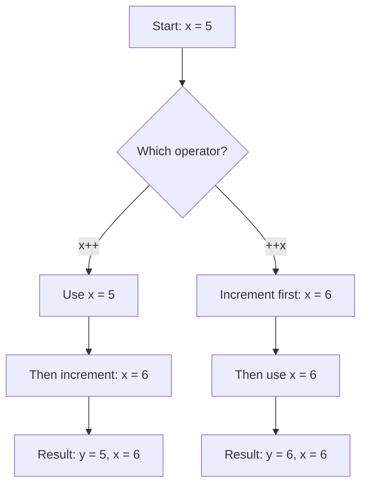
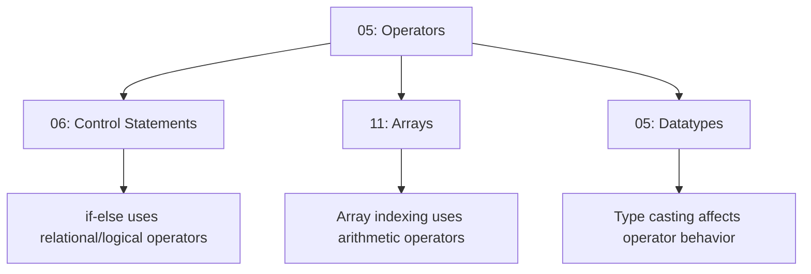

# Operators ⚡

> *"Operators are the symbols that perform operations on operands to produce results."*

---

## 📚 Prerequisites / Basics

Before learning about operators, you should understand:

- ✅ **[01: Introduction to Java](01_Introduction.md)** – Basic Java syntax
- ✅ **[03: Variables](03_Variables.md)** – Variable declaration and usage
- ✅ **[04: Datatypes](04_Datatypes_and_Literals.md)** – Primitive data types and type casting
- ✅ **Basic mathematics** – Arithmetic operations, logic gates, binary numbers

**What you'll learn:** All Java operator types, their precedence, associativity, bitwise operations, and practical applications in real-world programming.

---

## 🧭 Core Concepts (in logical order)

### 1️⃣ What are Operators? – *Definition*

**What it is:**  
An operator is a **special symbol** that performs specific operations on one, two, or three operands, and returns a result.

**Components:**
- **Operator**: The symbol (e.g., `+`, `-`, `*`, `==`)
- **Operand**: The value(s) the operator acts upon
- **Result**: The value produced by the operation

**Real-world analogy:**  
Think of operators as tools in a toolbox:
- `+` is like a glue gun (joins things together)
- `-` is like scissors (separates/reduces)
- `*` is like a copy machine (multiplies)
- `/` is like a pizza cutter (divides into parts)
- `==` is like a comparison scale (checks if equal)

### 2️⃣ Operator Categories – *Classification*

Java operators are classified into several categories:

```mermaid
flowchart TD
    A[Java Operators] --> B[Arithmetic]
    A --> C[Relational]
    A --> D[Logical]
    A --> E[Bitwise]
    A --> F[Assignment]
    A --> G[Unary]
    A --> H[Ternary]
    A --> I[Misc]
    
    B --> B1[+, -, *, /, %]
    C --> C1[==, !=, >, <, >=, <=]
    D --> D1[&&, ||, !]
    E --> E1[&, |, ^, ~, <<, >>, >>>]
    F --> F1[=, +=, -=, *=, /=]
    G --> G1[++, --, +, -, !]
    H --> H1[? :]
    I --> I1[instanceof, new, .]
```

### 3️⃣ Arithmetic Operators – *Mathematical Operations*

Arithmetic operators perform mathematical calculations on numeric operands.

#### Basic Arithmetic Operators

| Operator | Name | Description | Example | Result |
|----------|------|-------------|---------|--------|
| `+` | Addition | Adds two operands | `5 + 3` | `8` |
| `-` | Subtraction | Subtracts second from first | `5 - 3` | `2` |
| `*` | Multiplication | Multiplies operands | `5 * 3` | `15` |
| `/` | Division | Divides first by second | `10 / 3` | `3` (integer division) |
| `%` | Modulus | Returns remainder | `10 % 3` | `1` |

**Key Characteristics:**

**Integer Division:**
```java
int result = 10 / 3;  // Result: 3 (not 3.333...)
// Integer division truncates the decimal part
```

**Floating-Point Division:**
```java
double result = 10.0 / 3;  // Result: 3.3333333...
// At least one operand must be float/double
```

**Modulus Operation:**
```java
int remainder = 17 % 5;  // Result: 2
// 17 ÷ 5 = 3 remainder 2

// Common use: Check if number is even/odd
if (number % 2 == 0) {
    System.out.println("Even");
} else {
    System.out.println("Odd");
}
```

**Division by Zero:**
```java
// Integer division by zero
int result = 10 / 0;  // ❌ ArithmeticException at runtime!

// Floating-point division by zero
double result = 10.0 / 0.0;  // ✅ Result: Infinity (no exception)
double result = 0.0 / 0.0;   // ✅ Result: NaN (Not a Number)
```

### 4️⃣ Relational (Comparison) Operators – *Testing Relationships*

Relational operators compare two values and return a boolean (`true` or `false`).

| Operator | Name | Description | Example | Result |
|----------|------|-------------|---------|--------|
| `==` | Equal to | Checks equality | `5 == 5` | `true` |
| `!=` | Not equal | Checks inequality | `5 != 3` | `true` |
| `>` | Greater than | First > Second | `5 > 3` | `true` |
| `<` | Less than | First < Second | `5 < 3` | `false` |
| `>=` | Greater or equal | First >= Second | `5 >= 5` | `true` |
| `<=` | Less or equal | First <= Second | `5 <= 3` | `false` |

**Important Notes:**

**Comparing Primitives:**
```java
int a = 10;
int b = 10;
System.out.println(a == b);  // true (compares values)
```

**Comparing Objects (References):**
```java
String str1 = new String("Hello");
String str2 = new String("Hello");
System.out.println(str1 == str2);      // false (compares references)
System.out.println(str1.equals(str2)); // true (compares content)
```

### 5️⃣ Logical Operators – *Boolean Logic*

Logical operators perform boolean logic operations, used primarily in control flow.

| Operator | Name | Description | Example | Result |
|----------|------|-------------|---------|--------|
| `&&` | Logical AND | True if both true | `true && false` | `false` |
| `||` | Logical OR | True if either true | `true || false` | `true` |
| `!` | Logical NOT | Negates boolean | `!true` | `false` |

**Truth Tables:**

**AND (`&&`) Operator:**
| A | B | A && B |
|---|---|--------|
| false | false | false |
| false | true | false |
| true | false | false |
| true | true | true |

**OR (`||`) Operator:**
| A | B | A \|\| B |
|---|---|--------|
| false | false | false |
| false | true | true |
| true | false | true |
| true | true | true |

**NOT (`!`) Operator:**
| A | !A |
|---|---|
| false | true |
| true | false |

**Short-Circuit Evaluation:**

```java
// && stops if first operand is false
int x = 0;
if (x != 0 && (10 / x) > 0) {  // Second part NOT evaluated (prevents division by zero)
    System.out.println("Positive");
}

// || stops if first operand is true
if (isValid() || isBackup()) {  // isBackup() NOT called if isValid() returns true
    System.out.println("Proceed");
}
```

**Non-Short-Circuit Operators (`&`, `|`):**
```java
// Both sides ALWAYS evaluated
if (condition1() & condition2()) {  // Both methods called regardless
    // ...
}
```

### 6️⃣ Bitwise Operators – *Binary Manipulation*

Bitwise operators work on binary representations of integers.

#### Bitwise Logical Operators

| Operator | Name | Description | Example |
|----------|------|-------------|---------|
| `&` | Bitwise AND | 1 if both bits are 1 | `12 & 10` = `8` |
| `|` | Bitwise OR | 1 if either bit is 1 | `12 | 10` = `14` |
| `^` | Bitwise XOR | 1 if bits differ | `12 ^ 10` = `6` |
| `~` | Bitwise NOT | Inverts all bits | `~12` = `-13` |

**Visual Representation:**

```
   12 in binary:  0000 1100
   10 in binary:  0000 1010
                  ---------
   12 & 10:       0000 1000  = 8  (AND)
   12 | 10:       0000 1110  = 14 (OR)
   12 ^ 10:       0000 0110  = 6  (XOR)
   ~12:           1111 0011  = -13 (NOT - two's complement)
```

#### Bitwise Shift Operators

| Operator | Name | Description | Example |
|----------|------|-------------|---------|
| `<<` | Left Shift | Shifts bits left, fills with 0 | `12 << 2` = `48` |
| `>>` | Right Shift (Signed) | Shifts bits right, preserves sign | `12 >> 2` = `3` |
| `>>>` | Right Shift (Unsigned) | Shifts bits right, fills with 0 | `-12 >>> 2` |

**Left Shift (`<<`):**
```
12 << 2  (Multiply by 2²)
   12:  0000 1100
<< 2:   0011 0000  = 48

Formula: n << k  =  n * 2^k
```

**Right Shift (`>>`):**
```
12 >> 2  (Divide by 2²)
   12:  0000 1100
>> 2:   0000 0011  = 3

Formula: n >> k  =  n / 2^k  (rounded down)
```

**Unsigned Right Shift (`>>>`):**
```
-12 >>> 2  (Unsigned shift)
Fills with 0 regardless of sign bit
Used for treating numbers as unsigned
```

**Practical Uses:**
- **Optimization**: Multiplication/division by powers of 2
- **Bit Manipulation**: Flags, permissions, masks
- **Graphics**: Color manipulation (RGB)
- **Compression**: Bit packing
- **Cryptography**: Hash functions

### 7️⃣ Assignment Operators – *Value Assignment*

Assignment operators assign values to variables.

| Operator | Description | Example | Equivalent |
|----------|-------------|---------|------------|
| `=` | Simple assignment | `x = 5` | `x = 5` |
| `+=` | Add and assign | `x += 5` | `x = x + 5` |
| `-=` | Subtract and assign | `x -= 5` | `x = x - 5` |
| `*=` | Multiply and assign | `x *= 5` | `x = x * 5` |
| `/=` | Divide and assign | `x /= 5` | `x = x / 5` |
| `%=` | Modulus and assign | `x %= 5` | `x = x % 5` |
| `&=` | Bitwise AND and assign | `x &= 5` | `x = x & 5` |
| `|=` | Bitwise OR and assign | `x |= 5` | `x = x | 5` |
| `^=` | Bitwise XOR and assign | `x ^= 5` | `x = x ^ 5` |
| `<<=` | Left shift and assign | `x <<= 2` | `x = x << 2` |
| `>>=` | Right shift and assign | `x >>= 2` | `x = x >> 2` |
| `>>>=` | Unsigned right shift and assign | `x >>>= 2` | `x = x >>> 2` |

**Chained Assignment:**
```java
int a, b, c;
a = b = c = 10;  // All variables set to 10
// Evaluates right to left: c=10, b=c, a=b
```

### 8️⃣ Unary Operators – *Single Operand Operations*

Unary operators operate on a single operand.

| Operator | Name | Description | Example |
|----------|------|-------------|---------|
| `+` | Unary plus | Indicates positive value | `+5` |
| `-` | Unary minus | Negates value | `-5` |
| `++` | Increment | Increases by 1 | `x++` or `++x` |
| `--` | Decrement | Decreases by 1 | `x--` or `--x` |
| `!` | Logical NOT | Inverts boolean | `!true` |

**Increment/Decrement Operators:**

**Post-Increment (`x++`):**
```java
int x = 5;
int y = x++;  // y = 5, x = 6
// Steps: 1. Use current value (5)
//        2. Increment x (6)
```

**Pre-Increment (`++x`):**
```java
int x = 5;
int y = ++x;  // y = 6, x = 6
// Steps: 1. Increment x (6)
//        2. Use new value (6)
```

**Visual Comparison:**
```
Post-increment (x++):  Use → Increment
Pre-increment (++x):   Increment → Use

int x = 5;
System.out.println(x++);  // Prints 5, x becomes 6
System.out.println(x);    // Prints 6

int y = 5;
System.out.println(++y);  // Prints 6, y is now 6
```

### 9️⃣ Ternary Operator – *Conditional Expression*

The ternary operator is a compact if-else statement.

**Syntax:**
```java
condition ? value_if_true : value_if_false
```

**Example:**
```java
int age = 20;
String status = (age >= 18) ? "Adult" : "Minor";
// If age >= 18, status = "Adult", else status = "Minor"
```

**Nested Ternary:**
```java
int marks = 85;
String grade = (marks >= 90) ? "A" :
               (marks >= 80) ? "B" :
               (marks >= 70) ? "C" : "F";
// Equivalent to if-else-if chain
```

**Use Cases:**
- Simple conditional assignments
- Inline conditionals in method calls
- Default value assignments

**⚠️ Caution:** Avoid complex nested ternary operators—they reduce readability!

### 🔟 Operator Precedence & Associativity

**Precedence** determines the order of operations when multiple operators appear.

**Associativity** determines evaluation order when operators have the same precedence.

#### Precedence Table (Highest to Lowest)

| Precedence | Operators | Associativity |
|------------|-----------|---------------|
| 1 (Highest) | `()`, `[]`, `.` | Left to Right |
| 2 | `++`, `--` (postfix) | Right to Left |
| 3 | `++`, `--` (prefix), `+`, `-` (unary), `!`, `~` | Right to Left |
| 4 | `*`, `/`, `%` | Left to Right |
| 5 | `+`, `-` (binary) | Left to Right |
| 6 | `<<`, `>>`, `>>>` | Left to Right |
| 7 | `<`, `<=`, `>`, `>=`, `instanceof` | Left to Right |
| 8 | `==`, `!=` | Left to Right |
| 9 | `&` | Left to Right |
| 10 | `^` | Left to Right |
| 11 | `|` | Left to Right |
| 12 | `&&` | Left to Right |
| 13 | `||` | Left to Right |
| 14 | `?:` (ternary) | Right to Left |
| 15 (Lowest) | `=`, `+=`, `-=`, etc. | Right to Left |

**Examples:**

```java
int result = 10 + 5 * 2;  // Result: 20 (not 30)
// Multiplication has higher precedence than addition
// Evaluation: 10 + (5 * 2) = 10 + 10 = 20

int result = (10 + 5) * 2;  // Result: 30
// Parentheses have highest precedence
// Evaluation: (15) * 2 = 30

int x = 5;
int result = x++ * 2;  // Result: 10, x = 6
// Post-increment has higher precedence but executes after
```

---

## 💻 Hands-On Code Samples

### Example 1: Arithmetic Operators

```java
public class ArithmeticOperators {
    public static void main(String[] args) {
        int a = 10;
        int b = 3;
        
        System.out.println("=== ARITHMETIC OPERATORS ===");
        System.out.println("a = " + a + ", b = " + b);
        
        // Basic operations
        System.out.println("\nBasic Operations:");
        System.out.println("a + b = " + (a + b));  // 13
        System.out.println("a - b = " + (a - b));  // 7
        System.out.println("a * b = " + (a * b));  // 30
        System.out.println("a / b = " + (a / b));  // 3 (integer division)
        System.out.println("a % b = " + (a % b));  // 1 (remainder)
        
        // Integer vs Floating-point division
        System.out.println("\nDivision Types:");
        System.out.println("10 / 3 (int) = " + (10 / 3));        // 3
        System.out.println("10.0 / 3 (double) = " + (10.0 / 3)); // 3.333...
        System.out.println("10 / 3.0 (double) = " + (10 / 3.0)); // 3.333...
        
        // Modulus use cases
        System.out.println("\nModulus Use Cases:");
        int number = 17;
        if (number % 2 == 0) {
            System.out.println(number + " is even");
        } else {
            System.out.println(number + " is odd");
        }
        
        // Check if divisible
        if (number % 5 == 0) {
            System.out.println(number + " is divisible by 5");
        } else {
            System.out.println(number + " is NOT divisible by 5");
        }
        
        // Division by zero
        System.out.println("\nDivision by Zero:");
        try {
            int result = 10 / 0;  // Throws ArithmeticException
        } catch (ArithmeticException e) {
            System.out.println("Integer division by zero: " + e.getMessage());
        }
        
        double floatResult = 10.0 / 0.0;  // Infinity
        System.out.println("Float division by zero: " + floatResult);
        
        double nanResult = 0.0 / 0.0;  // NaN
        System.out.println("0.0 / 0.0 = " + nanResult);
    }
}
```

**Output:**
```
=== ARITHMETIC OPERATORS ===
a = 10, b = 3

Basic Operations:
a + b = 13
a - b = 7
a * b = 30
a / b = 3
a % b = 1

Division Types:
10 / 3 (int) = 3
10.0 / 3 (double) = 3.3333333333333335
10 / 3.0 (double) = 3.3333333333333335

Modulus Use Cases:
17 is odd
17 is NOT divisible by 5

Division by Zero:
Integer division by zero: / by zero
Float division by zero: Infinity
0.0 / 0.0 = NaN
```

---

### Example 2: Relational and Logical Operators

```java
public class RelationalLogicalOperators {
    public static void main(String[] args) {
        int a = 10;
        int b = 5;
        int c = 10;
        
        System.out.println("=== RELATIONAL OPERATORS ===");
        System.out.println("a = " + a + ", b = " + b + ", c = " + c);
        
        // Comparison operators
        System.out.println("\nComparisons:");
        System.out.println("a == b: " + (a == b));  // false
        System.out.println("a == c: " + (a == c));  // true
        System.out.println("a != b: " + (a != b));  // true
        System.out.println("a > b:  " + (a > b));   // true
        System.out.println("a < b:  " + (a < b));   // false
        System.out.println("a >= c: " + (a >= c));  // true
        System.out.println("a <= b: " + (a <= b));  // false
        
        System.out.println("\n=== LOGICAL OPERATORS ===");
        
        boolean isAdult = true;
        boolean hasLicense = false;
        
        System.out.println("isAdult = " + isAdult);
        System.out.println("hasLicense = " + hasLicense);
        
        // Logical AND
        System.out.println("\nLogical AND (&&):");
        System.out.println("isAdult && hasLicense: " + (isAdult && hasLicense));  // false
        System.out.println("Can drive: " + (isAdult && hasLicense));
        
        // Logical OR
        System.out.println("\nLogical OR (||):");
        System.out.println("isAdult || hasLicense: " + (isAdult || hasLicense));  // true
        System.out.println("Can enter: " + (isAdult || hasLicense));
        
        // Logical NOT
        System.out.println("\nLogical NOT (!):");
        System.out.println("!isAdult: " + (!isAdult));  // false
        System.out.println("!hasLicense: " + (!hasLicense));  // true
        
        // Complex expressions
        System.out.println("\nComplex Expressions:");
        int age = 25;
        int salary = 30000;
        boolean isEligible = (age >= 18 && age <= 60) && (salary >= 25000);
        System.out.println("Loan eligible: " + isEligible);  // true
        
        // Short-circuit evaluation
        System.out.println("\nShort-Circuit Evaluation:");
        int x = 0;
        // && short-circuits (second part not evaluated)
        if (x != 0 && (10 / x) > 0) {
            System.out.println("Positive");
        } else {
            System.out.println("Short-circuit prevented division by zero");
        }
        
        // Non-short-circuit
        System.out.println("\nNon-Short-Circuit (&):");
        boolean result = (x != 0) & (10 / x > 0);  // Would throw exception!
        // Both sides evaluated regardless
    }
}
```

**Output:**
```
=== RELATIONAL OPERATORS ===
a = 10, b = 5, c = 10

Comparisons:
a == b: false
a == c: true
a != b: true
a > b:  true
a < b:  false
a >= c: true
a <= b: false

=== LOGICAL OPERATORS ===
isAdult = true
hasLicense = false

Logical AND (&&):
isAdult && hasLicense: false
Can drive: false

Logical OR (||):
isAdult || hasLicense: true
Can enter: true

Logical NOT (!):
!isAdult: false
!hasLicense: true

Complex Expressions:
Loan eligible: true

Short-Circuit Evaluation:
Short-circuit prevented division by zero
```

---

### Example 3: Bitwise Operators

```java
public class BitwiseOperators {
    public static void main(String[] args) {
        int a = 12;  // 0000 1100 in binary
        int b = 10;  // 0000 1010 in binary
        
        System.out.println("=== BITWISE LOGICAL OPERATORS ===");
        System.out.println("a = " + a + " (" + Integer.toBinaryString(a) + ")");
        System.out.println("b = " + b + " (" + Integer.toBinaryString(b) + ")");
        
        // Bitwise AND
        System.out.println("\nBitwise AND (a & b):");
        int andResult = a & b;
        System.out.println("Result: " + andResult + " (" + Integer.toBinaryString(andResult) + ")");
        printBinaryOperation(a, b, "&");
        
        // Bitwise OR
        System.out.println("\nBitwise OR (a | b):");
        int orResult = a | b;
        System.out.println("Result: " + orResult + " (" + Integer.toBinaryString(orResult) + ")");
        printBinaryOperation(a, b, "|");
        
        // Bitwise XOR
        System.out.println("\nBitwise XOR (a ^ b):");
        int xorResult = a ^ b;
        System.out.println("Result: " + xorResult + " (" + Integer.toBinaryString(xorResult) + ")");
        printBinaryOperation(a, b, "^");
        
        // Bitwise NOT
        System.out.println("\nBitwise NOT (~a):");
        int notResult = ~a;
        System.out.println("Result: " + notResult);
        System.out.println("Binary: " + Integer.toBinaryString(notResult));
        
        System.out.println("\n=== BITWISE SHIFT OPERATORS ===");
        
        // Left shift
        System.out.println("\nLeft Shift (a << 2):");
        int leftShift = a << 2;
        System.out.println(a + " << 2 = " + leftShift);
        System.out.println("Before: " + Integer.toBinaryString(a));
        System.out.println("After:  " + Integer.toBinaryString(leftShift));
        System.out.println("Effect: Multiply by 2^2 = " + a + " * 4 = " + leftShift);
        
        // Right shift
        System.out.println("\nRight Shift (a >> 2):");
        int rightShift = a >> 2;
        System.out.println(a + " >> 2 = " + rightShift);
        System.out.println("Before: " + Integer.toBinaryString(a));
        System.out.println("After:  " + Integer.toBinaryString(rightShift));
        System.out.println("Effect: Divide by 2^2 = " + a + " / 4 = " + rightShift);
        
        // Unsigned right shift
        System.out.println("\nUnsigned Right Shift (>>> ):");
        int negative = -12;
        System.out.println("Signed shift (-12 >> 2): " + (negative >> 2));
        System.out.println("Unsigned shift (-12 >>> 2): " + (negative >>> 2));
        
        // Practical example: Swapping without temp variable
        System.out.println("\n=== PRACTICAL: XOR SWAP ===");
        int x = 5;
        int y = 10;
        System.out.println("Before: x = " + x + ", y = " + y);
        x = x ^ y;
        y = x ^ y;
        x = x ^ y;
        System.out.println("After:  x = " + x + ", y = " + y);
    }
    
    private static void printBinaryOperation(int a, int b, String op) {
        System.out.println("  " + String.format("%8s", Integer.toBinaryString(a)).replace(' ', '0'));
        System.out.println(op + " " + String.format("%8s", Integer.toBinaryString(b)).replace(' ', '0'));
        System.out.println("  --------");
        
        int result = 0;
        switch(op) {
            case "&": result = a & b; break;
            case "|": result = a | b; break;
            case "^": result = a ^ b; break;
        }
        System.out.println("  " + String.format("%8s", Integer.toBinaryString(result)).replace(' ', '0'));
    }
}
```

**Output:**
```
=== BITWISE LOGICAL OPERATORS ===
a = 12 (1100)
b = 10 (1010)

Bitwise AND (a & b):
Result: 8 (1000)
  00001100
& 00001010
  --------
  00001000

Bitwise OR (a | b):
Result: 14 (1110)
  00001100
| 00001010
  --------
  00001110

Bitwise XOR (a ^ b):
Result: 6 (110)
  00001100
^ 00001010
  --------
  00000110

Bitwise NOT (~a):
Result: -13
Binary: 11111111111111111111111111110011

=== BITWISE SHIFT OPERATORS ===

Left Shift (a << 2):
12 << 2 = 48
Before: 1100
After:  110000
Effect: Multiply by 2^2 = 12 * 4 = 48

Right Shift (a >> 2):
12 >> 2 = 3
Before: 1100
After:  11
Effect: Divide by 2^2 = 12 / 4 = 3

Unsigned Right Shift (>>> ):
Signed shift (-12 >> 2): -3
Unsigned shift (-12 >>> 2): 1073741821

=== PRACTICAL: XOR SWAP ===
Before: x = 5, y = 10
After:  x = 10, y = 5
```

---

### Example 4: Increment/Decrement Operators

```java
public class IncrementDecrementDemo {
    public static void main(String[] args) {
        System.out.println("=== POST-INCREMENT (x++) ===");
        int x = 5;
        System.out.println("Initial value: x = " + x);
        int y = x++;  // Use current value, then increment
        System.out.println("y = x++: y = " + y + ", x = " + x);
        System.out.println("Explanation: y gets old value (5), then x increments to 6");
        
        System.out.println("\n=== PRE-INCREMENT (++x) ===");
        x = 5;
        System.out.println("Initial value: x = " + x);
        y = ++x;  // Increment first, then use new value
        System.out.println("y = ++x: y = " + y + ", x = " + x);
        System.out.println("Explanation: x increments to 6, then y gets new value (6)");
        
        System.out.println("\n=== POST-DECREMENT (x--) ===");
        x = 5;
        System.out.println("Initial value: x = " + x);
        y = x--;  // Use current value, then decrement
        System.out.println("y = x--: y = " + y + ", x = " + x);
        
        System.out.println("\n=== PRE-DECREMENT (--x) ===");
        x = 5;
        System.out.println("Initial value: x = " + x);
        y = --x;  // Decrement first, then use new value
        System.out.println("y = --x: y = " + y + ", x = " + x);
        
        // Common pitfall
        System.out.println("\n=== COMMON PITFALL ===");
        x = 5;
        int result = x++ + ++x;  // What's the result?
        System.out.println("x = 5");
        System.out.println("x++ + ++x = " + result);
        System.out.println("Step 1: x++ uses 5, then x becomes 6");
        System.out.println("Step 2: ++x increments x to 7, uses 7");
        System.out.println("Result: 5 + 7 = 12");
    }
}
```

**Output:**
```
=== POST-INCREMENT (x++) ===
Initial value: x = 5
y = x++: y = 5, x = 6
Explanation: y gets old value (5), then x increments to 6

=== PRE-INCREMENT (++x) ===
Initial value: x = 5
y = ++x: y = 6, x = 6
Explanation: x increments to 6, then y gets new value (6)

=== POST-DECREMENT (x--) ===
Initial value: x = 5
y = x--: y = 5, x = 4

=== PRE-DECREMENT (--x) ===
Initial value: x = 5
y = --x: y = 4, x = 4

=== COMMON PITFALL ===
x = 5
x++ + ++x = 12
Step 1: x++ uses 5, then x becomes 6
Step 2: ++x increments x to 7, uses 7
Result: 5 + 7 = 12
```

---

### Example 5: Ternary Operator

```java
public class TernaryOperatorDemo {
    public static void main(String[] args) {
        System.out.println("=== BASIC TERNARY OPERATOR ===");
        
        // Simple example
        int age = 20;
        String status = (age >= 18) ? "Adult" : "Minor";
        System.out.println("Age: " + age + " → Status: " + status);
        
        // With different types
        int score = 75;
        String result = (score >= 60) ? "Pass" : "Fail";
        System.out.println("Score: " + score + " → Result: " + result);
        
        System.out.println("\n=== NESTED TERNARY ===");
        
        // Grade calculation
        int marks = 85;
        String grade = (marks >= 90) ? "A" :
                       (marks >= 80) ? "B" :
                       (marks >= 70) ? "C" :
                       (marks >= 60) ? "D" : "F";
        System.out.println("Marks: " + marks + " → Grade: " + grade);
        
        System.out.println("\n=== PRACTICAL USES ===");
        
        // Finding maximum
        int a = 15;
        int b = 20;
        int max = (a > b) ? a : b;
        System.out.println("Max(" + a + ", " + b + ") = " + max);
        
        // Absolute value
        int num = -5;
        int abs = (num < 0) ? -num : num;
        System.out.println("Abs(" + num + ") = " + abs);
        
        // Null-safe access
        String name = null;
        String displayName = (name != null) ? name : "Guest";
        System.out.println("Display name: " + displayName);
        
        System.out.println("\n=== TERNARY IN METHOD CALLS ===");
        
        int temperature = 25;
        System.out.println("It's " + ((temperature > 30) ? "hot" : "pleasant"));
        
        // Array access
        int[] numbers = {10, 20, 30};
        int index = 5;
        int value = (index < numbers.length) ? numbers[index] : -1;
        System.out.println("Safe array access: " + value);
    }
}
```

**Output:**
```
=== BASIC TERNARY OPERATOR ===
Age: 20 → Status: Adult
Score: 75 → Result: Pass

=== NESTED TERNARY ===
Marks: 85 → Grade: B

=== PRACTICAL USES ===
Max(15, 20) = 20
Abs(-5) = 5
Display name: Guest

=== TERNARY IN METHOD CALLS ===
It's pleasant
Safe array access: -1
```

---

### Example 6: Operator Precedence

```java
public class OperatorPrecedence {
    public static void main(String[] args) {
        System.out.println("=== OPERATOR PRECEDENCE ===");
        
        // Arithmetic precedence
        int result1 = 10 + 5 * 2;  // Multiplication first
        System.out.println("10 + 5 * 2 = " + result1);  // 20, not 30
        System.out.println("Evaluation: 10 + (5 * 2) = 10 + 10 = 20");
        
        // With parentheses
        int result2 = (10 + 5) * 2;
        System.out.println("\n(10 + 5) * 2 = " + result2);  // 30
        System.out.println("Evaluation: (15) * 2 = 30");
        
        // Mixed operators
        System.out.println("\n=== MIXED OPERATORS ===");
        int a = 10;
        int b = 20;
        int c = 5;
        
        int result3 = a + b / c;  // Division first
        System.out.println("10 + 20 / 5 = " + result3);  // 14
        System.out.println("Evaluation: 10 + (20 / 5) = 10 + 4 = 14");
        
        // Comparison and logical
        System.out.println("\n=== COMPARISON + LOGICAL ===");
        boolean result4 = a > 5 && b < 30;
        System.out.println("10 > 5 && 20 < 30 = " + result4);
        System.out.println("Evaluation: (10 > 5) && (20 < 30) = true && true = true");
        
        // Complex expression
        System.out.println("\n=== COMPLEX EXPRESSION ===");
        int x = 5;
        int result5 = x++ * 2 + ++x;
        System.out.println("x = 5");
        System.out.println("x++ * 2 + ++x = " + result5);
        System.out.println("Step 1: x++ * 2 → 5 * 2 = 10 (x becomes 6)");
        System.out.println("Step 2: ++x → x becomes 7");
        System.out.println("Step 3: 10 + 7 = 17");
        
        // Assignment precedence
        System.out.println("\n=== ASSIGNMENT PRECEDENCE ===");
        int m, n, p;
        m = n = p = 10;  // Right to left
        System.out.println("m = n = p = 10");
        System.out.println("m = " + m + ", n = " + n + ", p = " + p);
        System.out.println("Evaluation: p=10, then n=p, then m=n");
    }
}
```

**Output:**
```
=== OPERATOR PRECEDENCE ===
10 + 5 * 2 = 20
Evaluation: 10 + (5 * 2) = 10 + 10 = 20

(10 + 5) * 2 = 30
Evaluation: (15) * 2 = 30

=== MIXED OPERATORS ===
10 + 20 / 5 = 14
Evaluation: 10 + (20 / 5) = 10 + 4 = 14

=== COMPARISON + LOGICAL ===
10 > 5 && 20 < 30 = true
Evaluation: (10 > 5) && (20 < 30) = true && true = true

=== COMPLEX EXPRESSION ===
x = 5
x++ * 2 + ++x = 17
Step 1: x++ * 2 → 5 * 2 = 10 (x becomes 6)
Step 2: ++x → x becomes 7
Step 3: 10 + 7 = 17

=== ASSIGNMENT PRECEDENCE ===
m = n = p = 10
m = 10, n = 10, p = 10
Evaluation: p=10, then n=p, then m=n
```

---

## 🎨 Visual Aids

### Operator Categories Comparison

| Category | Operators | Operands | Returns | Use Case |
|----------|-----------|----------|---------|----------|
| **Arithmetic** | +, -, *, /, % | Numeric | Numeric | Mathematical calculations |
| **Relational** | ==, !=, >, <, >=, <= | Any (same type) | boolean | Comparisons |
| **Logical** | &&, \|\|, ! | boolean | boolean | Boolean logic |
| **Bitwise** | &, \|, ^, ~, <<, >>, >>> | Integer | Integer | Bit manipulation |
| **Assignment** | =, +=, -=, etc. | Any | Assigned value | Variable assignment |
| **Unary** | ++, --, +, -, ! | Single operand | Depends | Single value operations |
| **Ternary** | ?: | Three operands | Depends | Conditional expression |

### Precedence Visual Guide

```
┌────────────────────────────────────────────┐
│         OPERATOR PRECEDENCE                │
│         (Highest → Lowest)                 │
├────────────────────────────────────────────┤
│  1. ()  []  .           [Grouping/Access] │
│  2. ++  --  (postfix)   [Unary postfix]   │
│  3. ++  --  +  -  !  ~  [Unary prefix]    │
│  4. *  /  %             [Multiplicative]   │
│  5. +  -                [Additive]         │
│  6. <<  >>  >>>         [Shift]            │
│  7. <  <=  >  >=        [Relational]       │
│  8. ==  !=              [Equality]         │
│  9. &                   [Bitwise AND]      │
│ 10. ^                   [Bitwise XOR]      │
│ 11. |                   [Bitwise OR]       │
│ 12. &&                  [Logical AND]      │
│ 13. ||                  [Logical OR]       │
│ 14. ?:                  [Ternary]          │
│ 15. =  +=  -=  etc.     [Assignment]       │
└────────────────────────────────────────────┘
```

### Increment/Decrement Flow



### Bitwise Operations Visual

```
AND (&):  Both must be 1
  1100  (12)
& 1010  (10)
------
  1000  (8)

OR (|):   Either can be 1
  1100  (12)
| 1010  (10)
------
  1110  (14)

XOR (^):  Must be different
  1100  (12)
^ 1010  (10)
------
  0110  (6)

NOT (~):  Flip all bits
~ 1100  (12)
------
  0011  (-13 in two's complement)
```

---

## ⚠️ Common Pitfalls & Anti-Patterns

### Pitfall 1: Mixing `++`/`--` in Complex Expressions

**❌ Confusing:**
```java
int x = 5;
int result = x++ + ++x + x++;  // What's the result?
// Very hard to reason about!
```

**✅ Clear:**
```java
int x = 5;
int temp1 = x++;  // temp1 = 5, x = 6
int temp2 = ++x;  // x = 7, temp2 = 7
int temp3 = x++;  // temp3 = 7, x = 8
int result = temp1 + temp2 + temp3;  // 5 + 7 + 7 = 19
```

**Best Practice:** Don't use increment/decrement in complex expressions—use separate statements for clarity.

---

### Pitfall 2: Comparing Floating-Point Numbers with `==`

**❌ Wrong:**
```java
double a = 0.1 + 0.2;
if (a == 0.3) {  // false! Precision errors
    System.out.println("Equal");
}
```

**✅ Correct:**
```java
double a = 0.1 + 0.2;
double epsilon = 0.00001;
if (Math.abs(a - 0.3) < epsilon) {  // true
    System.out.println("Equal (within tolerance)");
}
```

---

### Pitfall 3: Integer Overflow in Multiplication

**❌ Problem:**
```java
int a = 50000;
int b = 50000;
int result = a * b;  // Overflow! Result: -1794967296
System.out.println(result);
```

**✅ Solution:**
```java
int a = 50000;
int b = 50000;
long result = (long) a * b;  // Cast before multiplication
System.out.println(result);  // 2500000000
```

---

### Pitfall 4: Bitwise `&`/`|` Instead of Logical `&&`/`||`

**❌ Wrong (Performance):**
```java
if (expensive1() & expensive2()) {  // Both always called!
    // ...
}
```

**✅ Correct:**
```java
if (expensive1() && expensive2()) {  // Short-circuit: expensive2() may not be called
    // ...
}
```

---

### Pitfall 5: Precedence Confusion

**❌ Unexpected:**
```java
int a = 10;
boolean result = a > 5 && a < 15 == true;
// Parses as: a > 5 && (a < 15 == true)
// NOT: (a > 5 && a < 15) == true
```

**✅ Clear:**
```java
boolean result = (a > 5 && a < 15) == true;
// Or simply:
boolean result = a > 5 && a < 15;
```

---

## 🔗 Inter-Topic Connections

### Flow to Related Topics



### Concepts Used in Later Topics

| Concept | Used In | Purpose |
|---------|---------|---------|
| **Arithmetic Operators** | All topics | Basic calculations |
| **Relational Operators** | [06: Control Statements](06_Control_Statements.md) | Conditional logic |
| **Logical Operators** | [06: Control Statements](06_Control_Statements.md) | Complex conditions |
| **Bitwise Operators** | [20: Collections](20_Collections.md) | Hash functions, flags |
| **Increment/Decrement** | [06: Control Statements](06_Control_Statements.md) | Loop counters |

---

## 📑 Summary & Quick-Reference Checklist

### ✅ Key Takeaways

- ✅ **Arithmetic operators** (+, -, *, /, %) perform mathematical operations
- ✅ **Relational operators** (==, !=, >, <, >=, <=) compare values, return boolean
- ✅ **Logical operators** (&&, ||, !) perform boolean logic with short-circuit evaluation
- ✅ **Bitwise operators** (&, |, ^, ~, <<, >>, >>>) manipulate bits directly
- ✅ **Assignment operators** (=, +=, -=, etc.) assign values to variables
- ✅ **Unary operators** (++, --, +, -, !) operate on single operands
- ✅ **Ternary operator** (? :) provides compact conditional expression
- ✅ **Operator precedence** determines evaluation order
- ✅ Use **parentheses** to clarify or override precedence

### 📋 Operator Quick Reference

```java
// Arithmetic
int sum = a + b;
int diff = a - b;
int product = a * b;
int quotient = a / b;
int remainder = a % b;

// Relational
boolean equal = (a == b);
boolean notEqual = (a != b);
boolean greater = (a > b);

// Logical
boolean and = (a > 5 && b < 10);
boolean or = (a > 5 || b < 10);
boolean not = !(a > 5);

// Bitwise
int bitwiseAnd = a & b;
int bitwiseOr = a | b;
int bitwiseXor = a ^ b;
int bitwiseNot = ~a;
int leftShift = a << 2;
int rightShift = a >> 2;

// Assignment
a += 5;  // a = a + 5
a -= 5;  // a = a - 5
a *= 5;  // a = a * 5

// Unary
a++;  // Post-increment
++a;  // Pre-increment
a--;  // Post-decrement
--a;  // Pre-decrement

// Ternary
int max = (a > b) ? a : b;
```

### 🎯 Interview Quick-Prep

**Q: What's the difference between `==` and `.equals()`?**  
A: `==` compares references (memory addresses) for objects, while `.equals()` compares content. For primitives, `==` compares values.

**Q: What's short-circuit evaluation?**  
A: `&&` stops if first operand is false; `||` stops if first operand is true. Prevents unnecessary evaluations and potential errors.

**Q: Why does `10 / 3` return `3` not `3.333`?**  
A: Integer division truncates the decimal part. Use `10.0 / 3` or cast to double for floating-point division.

**Q: What's the difference between `&` and `&&`?**  
A: `&&` is logical AND with short-circuit evaluation. `&` is bitwise AND (for integers) or non-short-circuit logical AND (for booleans).

**Q: When should I use bitwise operators?**  
A: For performance optimization (shift instead of multiply/divide), bit flags, masks, low-level programming, and graphics.

---

## 📚 Further Reading / External Resources

### Official Documentation

- **[Operators (Oracle Tutorial)](https://docs.oracle.com/javase/tutorial/java/nutsandbolts/operators.html)** – Official operator guide
- **[Java Language Specification - Operators](https://docs.oracle.com/javase/specs/jls/se17/html/jls-15.html)** – Complete operator specification
- **[Operator Precedence Table](https://docs.oracle.com/javase/tutorial/java/nutsandbolts/expressions.html)** – Full precedence reference

### Deep Dives

- **[Bitwise Operators Explained](https://www.baeldung.com/java-bitwise-operators)** – Bitwise operations tutorial
- **[Short-Circuit Evaluation](https://www.geeksforgeeks.org/short-circuit-logical-operators-in-java-with-examples/)** – Detailed explanation
- **[Operator Overloading in Java](https://stackoverflow.com/questions/77718/why-doesnt-java-offer-operator-overloading)** – Why Java doesn't have it

### Best Practices

- **[Effective Java](https://www.oreilly.com/library/view/effective-java/9780134686097/)** – Item 9: Prefer try-with-resources
- **[Clean Code](https://www.oreilly.com/library/view/clean-code-a/9780136083238/)** – Chapter on expressions and operators

---

## 🗂️ Video Index

**This tutorial corresponds to the following videos from the RBR Java playlist:**

### Section 5: Operators (10 videos)

45. `Java- Introduction to operators and Arithmetic operators.mp4`
46. `Java- Example on Arithmetic operator.mp4`
47. `Java- Bitwise operators (part -1).mp4`
48. `Java- Bitwise operators (part -2).mp4`
49. `Java- Bitwise logical operators.mp4`
50. `Java- Example of bitwise operators.mp4`
51. `Java- Bitwise Left shift operator.mp4`
52. `Java- Bitwise right shift.mp4`
53. `Java- operators.mp4`
54. `Java- compare two primitives use == operators.mp4`

---

## 🎓 Next Steps

**Continue to:** [06 - Control Statements](06_Control_Statements.md) to learn how to control program flow using operators.

**Or explore:**
- [04 - Datatypes](04_Datatypes_and_Literals.md) – Review type casting with operators
- [07 - Classes and Objects](07_Classes_and_Objects.md) – Use operators in object-oriented programming

---

## 💬 Practice Exercises

### Exercise 1: Arithmetic Calculator
Create a program that performs all arithmetic operations on two user-input numbers and displays results.

### Exercise 2: Even/Odd Checker
Use modulus operator to check if numbers from 1-20 are even or odd.

### Exercise 3: Bitwise Flag System
Implement a permission system using bitwise operators (READ=1, WRITE=2, EXECUTE=4).

### Exercise 4: Grade Calculator
Use ternary operators to assign letter grades based on numeric scores.

### Exercise 5: Swap Two Numbers
Implement three ways to swap: using temp variable, arithmetic operators, and XOR.

### Exercise 6: Operator Precedence Quiz
Create expressions that test understanding of operator precedence and associativity.

---

**🎉 Congratulations!** You now understand:
- All operator types in Java
- How operators work at binary level
- Operator precedence and associativity
- Short-circuit evaluation
- Common pitfalls and best practices
- Real-world applications

**Master operators to write efficient, expressive code!** 💻✨

---

*End of Operators tutorial.*  
*Part of the [RBR Java Complete Tutorial Suite](README.md)*
