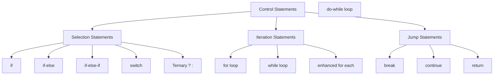
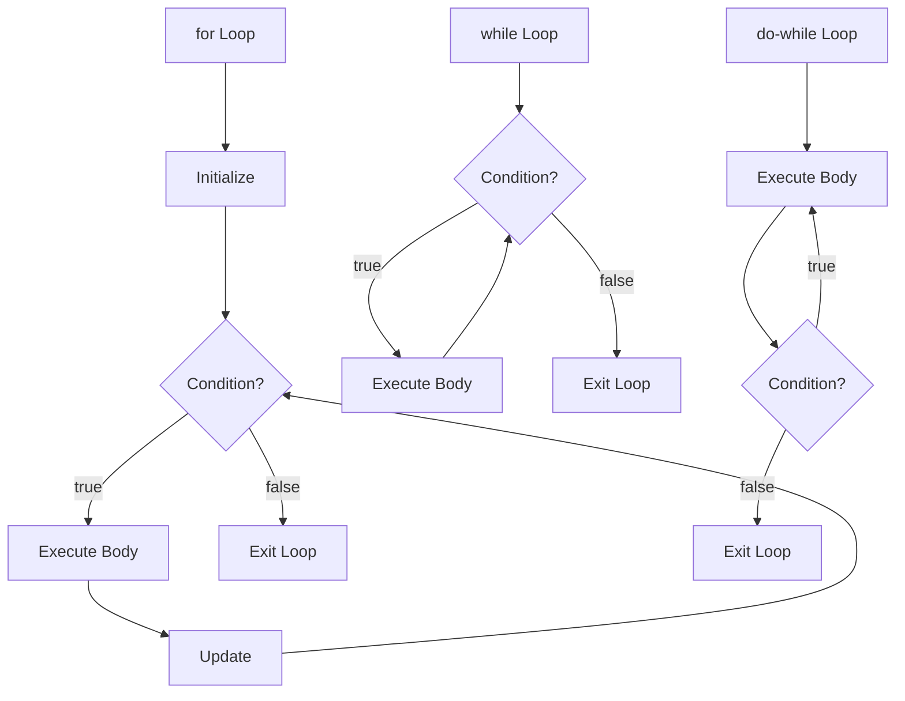
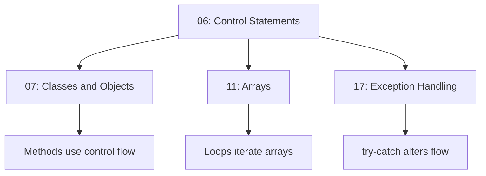

# Control Statements 🎮

> *"Control statements determine the flow of program execution, enabling decision-making and repetition."*

---

## 📚 Prerequisites / Basics

Before learning about control statements, you should understand:

- ✅ **[01: Introduction to Java](01_Introduction.md)** – Basic Java syntax
- ✅ **[03: Variables](03_Variables.md)** – Variable declaration and scope
- ✅ **[04: Datatypes](04_Datatypes_and_Literals.md)** – Data types, especially boolean
- ✅ **[05: Operators](05_Operators.md)** – Relational and logical operators
- ✅ **Basic logic** – Understanding of conditions and loops

**What you'll learn:** How to control program flow using conditional statements, loops, and flow control keywords (break, continue, return).

---

## 🧭 Core Concepts (in logical order)

### 1️⃣ What are Control Statements? – *Definition*

**What it is:**  
Control statements are **programming constructs** that determine the order in which statements are executed in a program. They enable:
- **Decision-making** (choosing between alternatives)
- **Repetition** (executing code multiple times)
- **Flow alteration** (jumping, breaking, continuing)

**Why it matters:**  
Without control statements, programs would execute linearly from top to bottom. Control statements enable:
- Conditional logic (if-else scenarios)
- Loops (processing collections, iteration)
- Complex algorithms and business logic

**Real-world analogy:**  
Think of control statements as traffic signals and road signs:
- **if-else**: Traffic light (go/stop based on condition)
- **switch**: Highway exit signs (choose one path from many)
- **loops**: Roundabout (keep circling until condition met)
- **break**: Emergency exit (leave immediately)
- **continue**: Skip this iteration (bypass obstacle)

### 2️⃣ Control Statement Categories – *Classification*

Java control statements fall into three main categories:



---

## 🎯 Selection Statements (Decision Making)

### 3️⃣ if Statement – *Simple Condition*

The `if` statement executes a block of code only if a condition is true.

**Syntax:**
```java
if (condition) {
    // code executes if condition is true
}
```

**Flowchart:**
```
     ┌──────────┐
     │  Start   │
     └────┬─────┘
          │
     ┌────▼────┐
     │Condition│
     │ true?   │
     └─┬────┬──┘
  true│    │false
   ┌──▼──┐ │
   │Code │ │
   │Block│ │
   └──┬──┘ │
      │    │
    ┌─▼────▼─┐
    │  End   │
    └────────┘
```

**Example:**
```java
int age = 20;
if (age >= 18) {
    System.out.println("You are an adult");
}
// Output: You are an adult
```

**Key Points:**
- Condition must be a `boolean` expression
- Curly braces `{}` optional for single statement (but recommended)
- Code inside executes only if condition is `true`

### 4️⃣ if-else Statement – *Two Alternatives*

The `if-else` statement chooses between two alternatives.

**Syntax:**
```java
if (condition) {
    // executes if condition is true
} else {
    // executes if condition is false
}
```

**Flowchart:**
```
     ┌──────────┐
     │  Start   │
     └────┬─────┘
          │
     ┌────▼────┐
     │Condition│
     │ true?   │
     └─┬────┬──┘
  true│    │false
   ┌──▼──┐ ┌▼───┐
   │Code │ │Code│
   │  A  │ │ B  │
   └──┬──┘ └┬───┘
      │     │
    ┌─▼─────▼─┐
    │   End   │
    └─────────┘
```

**Example:**
```java
int number = 7;
if (number % 2 == 0) {
    System.out.println("Even number");
} else {
    System.out.println("Odd number");
}
// Output: Odd number
```

### 5️⃣ if-else-if Ladder – *Multiple Conditions*

The `if-else-if` ladder tests multiple conditions sequentially.

**Syntax:**
```java
if (condition1) {
    // executes if condition1 is true
} else if (condition2) {
    // executes if condition1 false, condition2 true
} else if (condition3) {
    // executes if condition1,2 false, condition3 true
} else {
    // executes if all conditions are false (optional)
}
```

**Flow:**
```
Condition1 → true  → Execute Block1 → Exit
    ↓ false
Condition2 → true  → Execute Block2 → Exit
    ↓ false
Condition3 → true  → Execute Block3 → Exit
    ↓ false
    else Block → Exit
```

**Example:**
```java
int marks = 85;
if (marks >= 90) {
    System.out.println("Grade: A");
} else if (marks >= 80) {
    System.out.println("Grade: B");
} else if (marks >= 70) {
    System.out.println("Grade: C");
} else if (marks >= 60) {
    System.out.println("Grade: D");
} else {
    System.out.println("Grade: F");
}
// Output: Grade: B
```

**Key Points:**
- Conditions evaluated top-to-bottom
- First true condition executes, rest skipped
- `else` block is optional (default/fallback)
- Order matters (most specific conditions first)

### 6️⃣ Nested if Statements – *Conditions within Conditions*

Nested if statements place an if statement inside another if statement.

**Syntax:**
```java
if (outerCondition) {
    if (innerCondition) {
        // executes if both conditions true
    }
}
```

**Example:**
```java
int age = 25;
boolean hasLicense = true;

if (age >= 18) {
    if (hasLicense) {
        System.out.println("You can drive");
    } else {
        System.out.println("Get a license first");
    }
} else {
    System.out.println("You're too young to drive");
}
// Output: You can drive
```

**Alternative (Better):**
```java
// Using logical AND - cleaner
if (age >= 18 && hasLicense) {
    System.out.println("You can drive");
} else if (age >= 18) {
    System.out.println("Get a license first");
} else {
    System.out.println("You're too young to drive");
}
```

### 7️⃣ switch Statement – *Multi-way Branch*

The `switch` statement selects one of many code blocks to execute.

**Syntax:**
```java
switch (expression) {
    case value1:
        // code
        break;
    case value2:
        // code
        break;
    case value3:
        // code
        break;
    default:
        // code (optional)
}
```

**Supported Types (Java 17+):**
- `byte`, `short`, `int`, `char`
- `String` (Java 7+)
- `Enum` types
- Wrapper classes: `Byte`, `Short`, `Integer`, `Character`

**Example:**
```java
int dayOfWeek = 3;
switch (dayOfWeek) {
    case 1:
        System.out.println("Monday");
        break;
    case 2:
        System.out.println("Tuesday");
        break;
    case 3:
        System.out.println("Wednesday");
        break;
    case 4:
        System.out.println("Thursday");
        break;
    case 5:
        System.out.println("Friday");
        break;
    case 6:
        System.out.println("Saturday");
        break;
    case 7:
        System.out.println("Sunday");
        break;
    default:
        System.out.println("Invalid day");
}
// Output: Wednesday
```

**Fall-Through Behavior:**
```java
int month = 2;
int days;

switch (month) {
    case 1: case 3: case 5: case 7: case 8: case 10: case 12:
        days = 31;
        break;
    case 4: case 6: case 9: case 11:
        days = 30;
        break;
    case 2:
        days = 28;  // Ignoring leap years
        break;
    default:
        days = 0;
}
System.out.println("Days: " + days);  // Output: Days: 28
```

**Switch Expression (Java 14+):**
```java
String result = switch (dayOfWeek) {
    case 1, 2, 3, 4, 5 -> "Weekday";
    case 6, 7 -> "Weekend";
    default -> "Invalid";
};
System.out.println(result);
```

**Key Points:**
- `break` prevents fall-through to next case
- `default` handles unmatched cases (optional but recommended)
- Multiple cases can share same code block
- Switch expressions (Java 14+) don't need `break`

---

## 🔄 Iteration Statements (Loops)

### 8️⃣ for Loop – *Counter-Based Iteration*

The `for` loop repeats code a specific number of times.

**Syntax:**
```java
for (initialization; condition; update) {
    // code to repeat
}
```

**Components:**
1. **Initialization**: Executed once before loop starts
2. **Condition**: Checked before each iteration
3. **Update**: Executed after each iteration
4. **Body**: Code to repeat

**Flow:**
```
Initialize → Check Condition → true → Execute Body → Update → Loop back
                    ↓ false
                   Exit
```

**Example:**
```java
// Print numbers 1 to 5
for (int i = 1; i <= 5; i++) {
    System.out.println(i);
}
// Output: 1 2 3 4 5
```

**Variations:**
```java
// Decrementing loop
for (int i = 5; i >= 1; i--) {
    System.out.println(i);
}

// Step by 2
for (int i = 0; i <= 10; i += 2) {
    System.out.println(i);  // 0, 2, 4, 6, 8, 10
}

// Multiple variables
for (int i = 0, j = 10; i < j; i++, j--) {
    System.out.println(i + " " + j);
}

// Infinite loop (missing condition)
for (;;) {
    // runs forever (use break to exit)
}
```

### 9️⃣ Enhanced for Loop (for-each) – *Collection Iteration*

The enhanced for loop simplifies iteration over arrays and collections.

**Syntax:**
```java
for (dataType variable : array/collection) {
    // code using variable
}
```

**Example:**
```java
int[] numbers = {10, 20, 30, 40, 50};

for (int num : numbers) {
    System.out.println(num);
}
// Output: 10 20 30 40 50
```

**String Array:**
```java
String[] fruits = {"Apple", "Banana", "Cherry"};

for (String fruit : fruits) {
    System.out.println(fruit);
}
```

**Key Points:**
- ✅ Simpler, cleaner syntax
- ✅ No index management
- ✅ No risk of off-by-one errors
- ❌ Can't modify array elements
- ❌ Can't access index
- ❌ Can't iterate backward

### 🔟 while Loop – *Condition-Based Iteration*

The `while` loop repeats code while a condition is true.

**Syntax:**
```java
while (condition) {
    // code to repeat
}
```

**Flow:**
```
Check Condition → true → Execute Body → Loop back
        ↓ false
       Exit
```

**Example:**
```java
int count = 1;
while (count <= 5) {
    System.out.println(count);
    count++;
}
// Output: 1 2 3 4 5
```

**Use Cases:**
- Unknown number of iterations
- Loop until user input matches
- Processing until end of file

**Example - User Input:**
```java
Scanner scanner = new Scanner(System.in);
String input = "";

while (!input.equals("quit")) {
    System.out.print("Enter command (or 'quit' to exit): ");
    input = scanner.nextLine();
    System.out.println("You entered: " + input);
}
```

### 1️⃣1️⃣ do-while Loop – *Execute-Then-Check*

The `do-while` loop executes code at least once, then checks condition.

**Syntax:**
```java
do {
    // code to repeat (executes at least once)
} while (condition);
```

**Key Difference:**
- `while`: Check → Execute
- `do-while`: Execute → Check

**Flow:**
```
Execute Body → Check Condition → true → Loop back
                      ↓ false
                     Exit
```

**Example:**
```java
int count = 1;
do {
    System.out.println(count);
    count++;
} while (count <= 5);
// Output: 1 2 3 4 5
```

**When Condition is Initially False:**
```java
int x = 10;

// while loop: doesn't execute
while (x < 5) {
    System.out.println("while: " + x);
}

// do-while loop: executes once
do {
    System.out.println("do-while: " + x);
} while (x < 5);
// Output: do-while: 10
```

**Common Use Case - Menu:**
```java
Scanner scanner = new Scanner(System.in);
int choice;

do {
    System.out.println("1. Add");
    System.out.println("2. Delete");
    System.out.println("3. Exit");
    System.out.print("Enter choice: ");
    choice = scanner.nextInt();
    
    // Process choice...
} while (choice != 3);
```

### 1️⃣2️⃣ Nested Loops – *Loops within Loops*

Nested loops place one loop inside another loop.

**Syntax:**
```java
for (outer loop) {
    for (inner loop) {
        // code
    }
}
```

**Example - Multiplication Table:**
```java
for (int i = 1; i <= 5; i++) {
    for (int j = 1; j <= 10; j++) {
        System.out.print(i * j + "\t");
    }
    System.out.println();  // New line after each row
}
```

**Pattern Printing:**
```java
// Print triangle
for (int i = 1; i <= 5; i++) {
    for (int j = 1; j <= i; j++) {
        System.out.print("* ");
    }
    System.out.println();
}
// Output:
// *
// * *
// * * *
// * * * *
// * * * * *
```

---

## 🚀 Jump Statements (Flow Control)

### 1️⃣3️⃣ break Statement – *Exit Loop/Switch*

The `break` statement immediately exits a loop or switch statement.

**Syntax:**
```java
break;
```

**Use Cases:**

**1. Exit Loop Early:**
```java
for (int i = 1; i <= 10; i++) {
    if (i == 5) {
        break;  // Exit loop when i equals 5
    }
    System.out.println(i);
}
// Output: 1 2 3 4
```

**2. Search and Exit:**
```java
int[] numbers = {10, 20, 30, 40, 50};
int target = 30;
boolean found = false;

for (int num : numbers) {
    if (num == target) {
        found = true;
        break;  // Found it, no need to continue
    }
}

System.out.println("Found: " + found);  // true
```

**3. Break in Nested Loops:**
```java
// Only breaks inner loop
for (int i = 1; i <= 3; i++) {
    for (int j = 1; j <= 3; j++) {
        if (j == 2) {
            break;  // Breaks inner loop only
        }
        System.out.println(i + "," + j);
    }
}
// Output: 1,1  2,1  3,1
```

**4. Labeled break (Break Outer Loop):**
```java
outerLoop:
for (int i = 1; i <= 3; i++) {
    for (int j = 1; j <= 3; j++) {
        if (j == 2) {
            break outerLoop;  // Breaks outer loop
        }
        System.out.println(i + "," + j);
    }
}
// Output: 1,1
```

### 1️⃣4️⃣ continue Statement – *Skip Iteration*

The `continue` statement skips the current iteration and moves to the next.

**Syntax:**
```java
continue;
```

**Use Cases:**

**1. Skip Specific Values:**
```java
for (int i = 1; i <= 5; i++) {
    if (i == 3) {
        continue;  // Skip when i equals 3
    }
    System.out.println(i);
}
// Output: 1 2 4 5
```

**2. Process Only Even Numbers:**
```java
for (int i = 1; i <= 10; i++) {
    if (i % 2 != 0) {
        continue;  // Skip odd numbers
    }
    System.out.println(i);  // Print even numbers
}
// Output: 2 4 6 8 10
```

**3. Skip Invalid Data:**
```java
int[] scores = {85, -1, 92, 0, 78, -5, 88};

for (int score : scores) {
    if (score < 0) {
        continue;  // Skip invalid scores
    }
    System.out.println("Score: " + score);
}
// Output: 85, 92, 0, 78, 88
```

**4. Labeled continue:**
```java
outerLoop:
for (int i = 1; i <= 3; i++) {
    for (int j = 1; j <= 3; j++) {
        if (j == 2) {
            continue outerLoop;  // Skip to next outer iteration
        }
        System.out.println(i + "," + j);
    }
}
// Output: 1,1  2,1  3,1
```

### 1️⃣5️⃣ return Statement – *Exit Method*

The `return` statement exits the current method and optionally returns a value.

**Syntax:**
```java
return;           // void method
return value;     // return value from method
```

**Example:**
```java
public static int findMax(int[] numbers) {
    if (numbers == null || numbers.length == 0) {
        return -1;  // Early return for invalid input
    }
    
    int max = numbers[0];
    for (int num : numbers) {
        if (num > max) {
            max = num;
        }
    }
    return max;
}
```

---

## 💻 Hands-On Code Samples

### Example 1: Comprehensive if-else Example

```java
public class IfElseDemo {
    public static void main(String[] args) {
        System.out.println("=== SIMPLE IF ===");
        int age = 20;
        if (age >= 18) {
            System.out.println("You are an adult");
        }
        
        System.out.println("\n=== IF-ELSE ===");
        int number = 7;
        if (number % 2 == 0) {
            System.out.println(number + " is even");
        } else {
            System.out.println(number + " is odd");
        }
        
        System.out.println("\n=== IF-ELSE-IF LADDER ===");
        int marks = 85;
        if (marks >= 90) {
            System.out.println("Grade: A (Excellent!)");
        } else if (marks >= 80) {
            System.out.println("Grade: B (Very Good!)");
        } else if (marks >= 70) {
            System.out.println("Grade: C (Good)");
        } else if (marks >= 60) {
            System.out.println("Grade: D (Pass)");
        } else {
            System.out.println("Grade: F (Fail)");
        }
        
        System.out.println("\n=== NESTED IF ===");
        int studentAge = 25;
        boolean hasID = true;
        boolean isPaid = true;
        
        if (studentAge >= 18) {
            if (hasID) {
                if (isPaid) {
                    System.out.println("Access granted");
                } else {
                    System.out.println("Please pay first");
                }
            } else {
                System.out.println("ID required");
            }
        } else {
            System.out.println("Must be 18 or older");
        }
        
        System.out.println("\n=== LOGICAL OPERATORS (BETTER) ===");
        if (studentAge >= 18 && hasID && isPaid) {
            System.out.println("Access granted");
        } else if (studentAge < 18) {
            System.out.println("Must be 18 or older");
        } else if (!hasID) {
            System.out.println("ID required");
        } else {
            System.out.println("Please pay first");
        }
    }
}
```

**Output:**
```
=== SIMPLE IF ===
You are an adult

=== IF-ELSE ===
7 is odd

=== IF-ELSE-IF LADDER ===
Grade: B (Very Good!)

=== NESTED IF ===
Access granted

=== LOGICAL OPERATORS (BETTER) ===
Access granted
```

---

### Example 2: Switch Statement Examples

```java
public class SwitchDemo {
    public static void main(String[] args) {
        System.out.println("=== INTEGER SWITCH ===");
        int dayOfWeek = 3;
        switch (dayOfWeek) {
            case 1:
                System.out.println("Monday - Start of work week");
                break;
            case 2:
                System.out.println("Tuesday");
                break;
            case 3:
                System.out.println("Wednesday - Midweek");
                break;
            case 4:
                System.out.println("Thursday");
                break;
            case 5:
                System.out.println("Friday - TGIF!");
                break;
            case 6:
                System.out.println("Saturday - Weekend!");
                break;
            case 7:
                System.out.println("Sunday - Rest day");
                break;
            default:
                System.out.println("Invalid day");
        }
        
        System.out.println("\n=== STRING SWITCH (Java 7+) ===");
        String fruit = "Apple";
        switch (fruit) {
            case "Apple":
                System.out.println("Red and crunchy");
                break;
            case "Banana":
                System.out.println("Yellow and soft");
                break;
            case "Cherry":
                System.out.println("Small and red");
                break;
            default:
                System.out.println("Unknown fruit");
        }
        
        System.out.println("\n=== FALL-THROUGH EXAMPLE ===");
        int month = 2;
        int days;
        switch (month) {
            case 1: case 3: case 5: case 7: case 8: case 10: case 12:
                days = 31;
                System.out.println("Month " + month + " has 31 days");
                break;
            case 4: case 6: case 9: case 11:
                days = 30;
                System.out.println("Month " + month + " has 30 days");
                break;
            case 2:
                days = 28;
                System.out.println("Month " + month + " has 28/29 days");
                break;
            default:
                days = 0;
                System.out.println("Invalid month");
        }
        
        System.out.println("\n=== SWITCH EXPRESSION (Java 14+) ===");
        int day = 6;
        String dayType = switch (day) {
            case 1, 2, 3, 4, 5 -> "Weekday";
            case 6, 7 -> "Weekend";
            default -> "Invalid";
        };
        System.out.println("Day " + day + " is a " + dayType);
        
        System.out.println("\n=== CALCULATOR EXAMPLE ===");
        char operator = '+';
        int a = 10;
        int b = 5;
        int result;
        
        switch (operator) {
            case '+':
                result = a + b;
                System.out.println(a + " + " + b + " = " + result);
                break;
            case '-':
                result = a - b;
                System.out.println(a + " - " + b + " = " + result);
                break;
            case '*':
                result = a * b;
                System.out.println(a + " * " + b + " = " + result);
                break;
            case '/':
                if (b != 0) {
                    result = a / b;
                    System.out.println(a + " / " + b + " = " + result);
                } else {
                    System.out.println("Cannot divide by zero");
                }
                break;
            default:
                System.out.println("Invalid operator");
        }
    }
}
```

**Output:**
```
=== INTEGER SWITCH ===
Wednesday - Midweek

=== STRING SWITCH (Java 7+) ===
Red and crunchy

=== FALL-THROUGH EXAMPLE ===
Month 2 has 28/29 days

=== SWITCH EXPRESSION (Java 14+) ===
Day 6 is a Weekend

=== CALCULATOR EXAMPLE ===
10 + 5 = 15
```

---

### Example 3: for Loop Examples

```java
public class ForLoopDemo {
    public static void main(String[] args) {
        System.out.println("=== BASIC FOR LOOP ===");
        for (int i = 1; i <= 5; i++) {
            System.out.println("Count: " + i);
        }
        
        System.out.println("\n=== DECREMENTING LOOP ===");
        for (int i = 5; i >= 1; i--) {
            System.out.println("Countdown: " + i);
        }
        System.out.println("Blast off!");
        
        System.out.println("\n=== STEP BY 2 ===");
        for (int i = 0; i <= 10; i += 2) {
            System.out.print(i + " ");
        }
        System.out.println();
        
        System.out.println("\n=== MULTIPLICATION TABLE ===");
        int number = 5;
        for (int i = 1; i <= 10; i++) {
            System.out.println(number + " x " + i + " = " + (number * i));
        }
        
        System.out.println("\n=== SUM OF NUMBERS ===");
        int sum = 0;
        for (int i = 1; i <= 100; i++) {
            sum += i;
        }
        System.out.println("Sum of 1 to 100: " + sum);
        
        System.out.println("\n=== ENHANCED FOR LOOP ===");
        int[] numbers = {10, 20, 30, 40, 50};
        System.out.print("Array elements: ");
        for (int num : numbers) {
            System.out.print(num + " ");
        }
        System.out.println();
        
        System.out.println("\n=== STRING ARRAY ===");
        String[] fruits = {"Apple", "Banana", "Cherry", "Date"};
        for (String fruit : fruits) {
            System.out.println("Fruit: " + fruit);
        }
        
        System.out.println("\n=== NESTED LOOPS - PATTERN ===");
        for (int i = 1; i <= 5; i++) {
            for (int j = 1; j <= i; j++) {
                System.out.print("* ");
            }
            System.out.println();
        }
        
        System.out.println("\n=== NESTED LOOPS - GRID ===");
        for (int row = 1; row <= 3; row++) {
            for (int col = 1; col <= 4; col++) {
                System.out.print("[" + row + "," + col + "] ");
            }
            System.out.println();
        }
    }
}
```

**Output:**
```
=== BASIC FOR LOOP ===
Count: 1
Count: 2
Count: 3
Count: 4
Count: 5

=== DECREMENTING LOOP ===
Countdown: 5
Countdown: 4
Countdown: 3
Countdown: 2
Countdown: 1
Blast off!

=== STEP BY 2 ===
0 2 4 6 8 10 

=== MULTIPLICATION TABLE ===
5 x 1 = 5
5 x 2 = 10
5 x 3 = 15
5 x 4 = 20
5 x 5 = 25
5 x 6 = 30
5 x 7 = 35
5 x 8 = 40
5 x 9 = 45
5 x 10 = 50

=== SUM OF NUMBERS ===
Sum of 1 to 100: 5050

=== ENHANCED FOR LOOP ===
Array elements: 10 20 30 40 50 

=== STRING ARRAY ===
Fruit: Apple
Fruit: Banana
Fruit: Cherry
Fruit: Date

=== NESTED LOOPS - PATTERN ===
* 
* * 
* * * 
* * * * 
* * * * * 

=== NESTED LOOPS - GRID ===
[1,1] [1,2] [1,3] [1,4] 
[2,1] [2,2] [2,3] [2,4] 
[3,1] [3,2] [3,3] [3,4]
```

---

### Example 4: while and do-while Loop Examples

```java
public class WhileLoopDemo {
    public static void main(String[] args) {
        System.out.println("=== BASIC WHILE LOOP ===");
        int count = 1;
        while (count <= 5) {
            System.out.println("Count: " + count);
            count++;
        }
        
        System.out.println("\n=== WHILE LOOP - FACTORIAL ===");
        int n = 5;
        int factorial = 1;
        int i = 1;
        while (i <= n) {
            factorial *= i;
            i++;
        }
        System.out.println("Factorial of " + n + " = " + factorial);
        
        System.out.println("\n=== DO-WHILE LOOP ===");
        int num = 1;
        do {
            System.out.println("Number: " + num);
            num++;
        } while (num <= 5);
        
        System.out.println("\n=== WHILE vs DO-WHILE (False Condition) ===");
        int x = 10;
        
        System.out.println("while loop:");
        while (x < 5) {
            System.out.println("This won't print");
        }
        System.out.println("while loop ended without printing");
        
        System.out.println("\ndo-while loop:");
        do {
            System.out.println("This prints once: " + x);
        } while (x < 5);
        
        System.out.println("\n=== SUM UNTIL ZERO ===");
        int[] values = {5, 3, 8, 0, 2, 4};  // Stops at 0
        int sum = 0;
        int index = 0;
        
        while (index < values.length && values[index] != 0) {
            sum += values[index];
            System.out.println("Adding " + values[index] + ", sum = " + sum);
            index++;
        }
        System.out.println("Final sum: " + sum);
    }
}
```

**Output:**
```
=== BASIC WHILE LOOP ===
Count: 1
Count: 2
Count: 3
Count: 4
Count: 5

=== WHILE LOOP - FACTORIAL ===
Factorial of 5 = 120

=== DO-WHILE LOOP ===
Number: 1
Number: 2
Number: 3
Number: 4
Number: 5

=== WHILE vs DO-WHILE (False Condition) ===
while loop:
while loop ended without printing

do-while loop:
This prints once: 10

=== SUM UNTIL ZERO ===
Adding 5, sum = 5
Adding 3, sum = 8
Adding 8, sum = 16
Final sum: 16
```

---

### Example 5: break and continue Statements

```java
public class BreakContinueDemo {
    public static void main(String[] args) {
        System.out.println("=== BREAK STATEMENT ===");
        for (int i = 1; i <= 10; i++) {
            if (i == 6) {
                break;  // Exit loop at 6
            }
            System.out.print(i + " ");
        }
        System.out.println("\nLoop terminated at 6");
        
        System.out.println("\n=== CONTINUE STATEMENT ===");
        for (int i = 1; i <= 10; i++) {
            if (i % 2 == 0) {
                continue;  // Skip even numbers
            }
            System.out.print(i + " ");
        }
        System.out.println("\nOnly odd numbers printed");
        
        System.out.println("\n=== SEARCH WITH BREAK ===");
        int[] numbers = {10, 20, 30, 40, 50};
        int target = 30;
        int position = -1;
        
        for (int i = 0; i < numbers.length; i++) {
            if (numbers[i] == target) {
                position = i;
                break;  // Found it, stop searching
            }
        }
        
        if (position != -1) {
            System.out.println("Found " + target + " at index " + position);
        } else {
            System.out.println(target + " not found");
        }
        
        System.out.println("\n=== SKIP NEGATIVE WITH CONTINUE ===");
        int[] scores = {85, -1, 92, -5, 78, 88, 0};
        int validCount = 0;
        int totalScore = 0;
        
        for (int score : scores) {
            if (score < 0) {
                System.out.println("Skipping invalid score: " + score);
                continue;
            }
            validCount++;
            totalScore += score;
        }
        
        double average = (double) totalScore / validCount;
        System.out.println("Valid scores: " + validCount);
        System.out.println("Average: " + average);
        
        System.out.println("\n=== LABELED BREAK ===");
        outerLoop:
        for (int i = 1; i <= 3; i++) {
            for (int j = 1; j <= 3; j++) {
                System.out.println("i=" + i + ", j=" + j);
                if (i == 2 && j == 2) {
                    System.out.println("Breaking outer loop");
                    break outerLoop;
                }
            }
        }
        System.out.println("Exited both loops");
        
        System.out.println("\n=== LABELED CONTINUE ===");
        outerLoop2:
        for (int i = 1; i <= 3; i++) {
            System.out.println("Outer: " + i);
            for (int j = 1; j <= 3; j++) {
                if (j == 2) {
                    continue outerLoop2;  // Skip to next outer iteration
                }
                System.out.println("  Inner: " + j);
            }
        }
    }
}
```

**Output:**
```
=== BREAK STATEMENT ===
1 2 3 4 5 
Loop terminated at 6

=== CONTINUE STATEMENT ===
1 3 5 7 9 
Only odd numbers printed

=== SEARCH WITH BREAK ===
Found 30 at index 2

=== SKIP NEGATIVE WITH CONTINUE ===
Skipping invalid score: -1
Skipping invalid score: -5
Valid scores: 5
Average: 68.6

=== LABELED BREAK ===
i=1, j=1
i=1, j=2
i=1, j=3
i=2, j=1
i=2, j=2
Breaking outer loop
Exited both loops

=== LABELED CONTINUE ===
Outer: 1
  Inner: 1
Outer: 2
  Inner: 1
Outer: 3
  Inner: 1
```

---

## 🎨 Visual Aids

### Loop Comparison Table

| Feature | for | Enhanced for | while | do-while |
|---------|-----|--------------|-------|----------|
| **Best For** | Known iterations | Collections/arrays | Unknown iterations | Execute at least once |
| **Syntax Complexity** | Medium | Simple | Simple | Simple |
| **Counter Management** | Built-in | Automatic | Manual | Manual |
| **Min Executions** | 0 | 0 | 0 | 1 |
| **Access Index** | ✅ Yes | ❌ No | ✅ Yes | ✅ Yes |
| **Modify Collection** | ✅ Yes | ❌ No | ✅ Yes | ✅ Yes |
| **Infinite Loop** | `for(;;)` | ❌ No | `while(true)` | `do{}while(true)` |

### Control Flow Decision Tree

```
┌─────────────────────────────────────────┐
│     Which Control Statement?            │
└─────────────┬───────────────────────────┘
              │
      ┌───────┴───────┐
      │               │
   Decision?      Repetition?
      │               │
      │               ├─ Known count? → for loop
      │               ├─ Collection? → enhanced for
      │               ├─ Condition-based? → while
      │               └─ Run at least once? → do-while
      │
      ├─ 2 choices? → if-else
      ├─ Multiple choices? → if-else-if / switch
      └─ Simple? → ternary (?:)
```

### break vs continue Visual

```
┌──────────────────────────────────────────┐
│ break:    Exit loop immediately          │
│                                          │
│ Loop: 1 2 3 4 5 6 7 8 9 10              │
│            ↑                             │
│            break at 5                    │
│ Output: 1 2 3 4                         │
└──────────────────────────────────────────┘

┌──────────────────────────────────────────┐
│ continue: Skip current, move to next     │
│                                          │
│ Loop: 1 2 3 4 5 6 7 8 9 10              │
│          ↓       ↓       ↓               │
│          skip    skip    skip            │
│ Output: 1 3 5 7 9  (odd numbers only)   │
└──────────────────────────────────────────┘
```

### Loop Execution Flow



---

## ⚠️ Common Pitfalls & Anti-Patterns

### Pitfall 1: Missing break in switch

**❌ Wrong:**
```java
int day = 2;
switch (day) {
    case 1:
        System.out.println("Monday");
        // Missing break - falls through!
    case 2:
        System.out.println("Tuesday");
        // Missing break - falls through!
    case 3:
        System.out.println("Wednesday");
}
// Output: Tuesday
//         Wednesday  (unintended!)
```

**✅ Correct:**
```java
switch (day) {
    case 1:
        System.out.println("Monday");
        break;  // Prevents fall-through
    case 2:
        System.out.println("Tuesday");
        break;
    case 3:
        System.out.println("Wednesday");
        break;
}
// Output: Tuesday (only)
```

---

### Pitfall 2: Infinite Loop

**❌ Infinite Loop:**
```java
int i = 0;
while (i < 10) {
    System.out.println(i);
    // Forgot to increment i - infinite loop!
}
```

**✅ Correct:**
```java
int i = 0;
while (i < 10) {
    System.out.println(i);
    i++;  // Don't forget to update!
}
```

---

### Pitfall 3: Off-by-One Error

**❌ Wrong (Misses last element):**
```java
int[] numbers = {10, 20, 30, 40, 50};
for (int i = 0; i < numbers.length - 1; i++) {  // Wrong!
    System.out.println(numbers[i]);
}
// Doesn't print 50
```

**✅ Correct:**
```java
for (int i = 0; i < numbers.length; i++) {  // Correct
    System.out.println(numbers[i]);
}

// Or use enhanced for (safer)
for (int num : numbers) {
    System.out.println(num);
}
```

---

### Pitfall 4: Modifying Loop Variable in Enhanced for

**❌ Doesn't Work:**
```java
int[] numbers = {1, 2, 3, 4, 5};
for (int num : numbers) {
    num = num * 2;  // Doesn't modify array!
}
// Array unchanged: {1, 2, 3, 4, 5}
```

**✅ Use Regular for Loop:**
```java
for (int i = 0; i < numbers.length; i++) {
    numbers[i] = numbers[i] * 2;  // Modifies array
}
// Array now: {2, 4, 6, 8, 10}
```

---

### Pitfall 5: Using == for String Comparison in switch

**❌ Potential Issue:**
```java
String input = new String("hello");
switch (input) {
    case "hello":  // This works (switch uses .equals() internally)
        System.out.println("Matched");
        break;
}
```

**Key Point:** In switch statements with Strings, Java uses `.equals()` internally, not `==`. However, `input` cannot be `null`, or you'll get `NullPointerException`.

**✅ Null-Safe:**
```java
if (input != null) {
    switch (input) {
        case "hello":
            System.out.println("Matched");
            break;
    }
} else {
    System.out.println("Input is null");
}
```

---

## 🔗 Inter-Topic Connections

### Flow to Related Topics



### Concepts Used in Later Topics

| Concept | Used In | Purpose |
|---------|---------|---------|
| **if-else** | All topics | Decision making everywhere |
| **for loop** | [11: Arrays](11_Arrays.md) | Iterate arrays |
| **Enhanced for** | [20: Collections](20_Collections.md) | Iterate collections |
| **switch** | [09: Enum](09_Enum.md) | Enum-based logic |
| **break/continue** | [20: Collections](20_Collections.md) | Control iteration |
| **while loop** | [16: Threads](16_Threads.md) | Thread loops |

---

## 📑 Summary & Quick-Reference Checklist

### ✅ Key Takeaways

- ✅ **if-else** – Choose between 2 alternatives
- ✅ **if-else-if** – Choose from multiple conditions
- ✅ **switch** – Multi-way branch (cleaner than many if-else)
- ✅ **for loop** – Known number of iterations
- ✅ **Enhanced for** – Iterate collections/arrays (cleaner)
- ✅ **while loop** – Unknown iterations, check before execute
- ✅ **do-while** – Execute at least once, then check
- ✅ **break** – Exit loop/switch immediately
- ✅ **continue** – Skip to next iteration
- ✅ **return** – Exit method

### 📋 Control Statement Cheat Sheet

```java
// if-else
if (condition) {
    // code
} else {
    // code
}

// switch
switch (expression) {
    case value1:
        // code
        break;
    default:
        // code
}

// for loop
for (int i = 0; i < 10; i++) {
    // code
}

// Enhanced for
for (Type item : collection) {
    // code
}

// while loop
while (condition) {
    // code
}

// do-while
do {
    // code
} while (condition);

// break/continue
for (int i = 0; i < 10; i++) {
    if (i == 5) break;      // Exit loop
    if (i % 2 == 0) continue;  // Skip iteration
}
```

### 🎯 Interview Quick-Prep

**Q: What's the difference between while and do-while?**  
A: `while` checks condition first (may not execute), `do-while` executes once then checks (always executes at least once).

**Q: When should I use switch instead of if-else?**  
A: Use switch for multiple discrete values of a single variable. It's cleaner, more readable, and potentially faster than many if-else statements.

**Q: Can I use break without a loop?**  
A: Yes, in switch statements. You can also use labeled break to exit nested loops.

**Q: What happens if I forget break in switch?**  
A: Fall-through occurs – execution continues to the next case regardless of match.

**Q: Can enhanced for loop modify array elements?**  
A: No, the loop variable is a copy. Use regular for loop with index to modify elements.

---

## 📚 Further Reading / External Resources

### Official Documentation

- **[Control Flow Statements](https://docs.oracle.com/javase/tutorial/java/nutsandbolts/flow.html)** – Oracle tutorial
- **[Switch Expressions](https://docs.oracle.com/en/java/javase/17/language/switch-expressions.html)** – Java 14+ feature
- **[Enhanced for Loop](https://docs.oracle.com/javase/8/docs/technotes/guides/language/foreach.html)** – For-each loop guide

### Best Practices

- **[Effective Java](https://www.oreilly.com/library/view/effective-java/9780134686097/)** – Item 57: Minimize scope of local variables
- **[Clean Code](https://www.oreilly.com/library/view/clean-code-a/9780136083238/)** – Chapter 3: Functions (control flow)

---

## 🗂️ Video Index

**This tutorial corresponds to the following videos from the RBR Java playlist:**

### Section 6: Control Statements (3 videos)

55. `Java- Control statements.mp4`
56. `Java- Break statement.mp4`
57. `Java- Continue statement.mp4`

---

## 🎓 Next Steps

**Continue to:** [07 - Classes and Objects](07_Classes_and_Objects.md) to learn object-oriented programming.

**Or explore:**
- [05 - Operators](05_Operators.md) – Review operators used in conditions
- [11 - Arrays](11_Arrays.md) – Apply loops to array processing

---

## 💬 Practice Exercises

### Exercise 1: Grade Calculator
Write a program that takes marks (0-100) and prints letter grade (A-F) using if-else-if.

### Exercise 2: Menu-Driven Calculator
Create a calculator using switch statement with options: +, -, *, /, %.

### Exercise 3: Pattern Printer
Use nested loops to print various patterns (triangle, pyramid, diamond).

### Exercise 4: Prime Number Checker
Use loops and break to check if a number is prime.

### Exercise 5: Array Search
Implement linear search using for loop with break when found.

### Exercise 6: Sum of Digits
Use while loop to sum digits of a number (e.g., 12345 → 15).

### Exercise 7: Factorial Calculator
Calculate factorial using both for and while loops.

### Exercise 8: FizzBuzz
Print numbers 1-100, but:
- "Fizz" for multiples of 3
- "Buzz" for multiples of 5
- "FizzBuzz" for multiples of both

---

**🎉 Congratulations!** You now understand:
- All control flow statements in Java
- Decision making with if-else and switch
- Loops (for, while, do-while, enhanced for)
- Flow control (break, continue, return)
- When to use each statement
- Common pitfalls and best practices

**Master control flow to write dynamic, responsive programs!** 💻✨

---

*End of Control Statements tutorial.*  
*Part of the [RBR Java Complete Tutorial Suite](README.md)*
