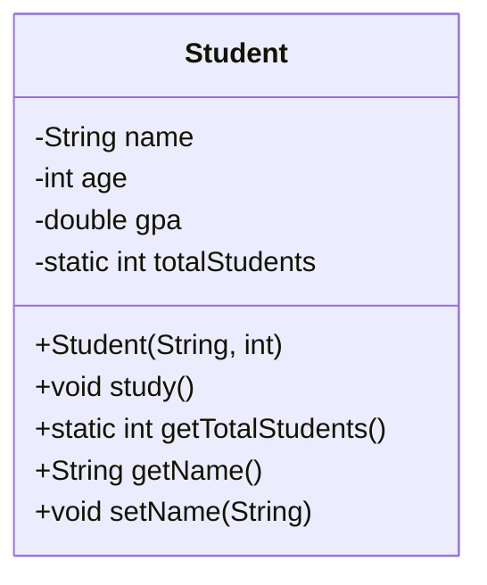
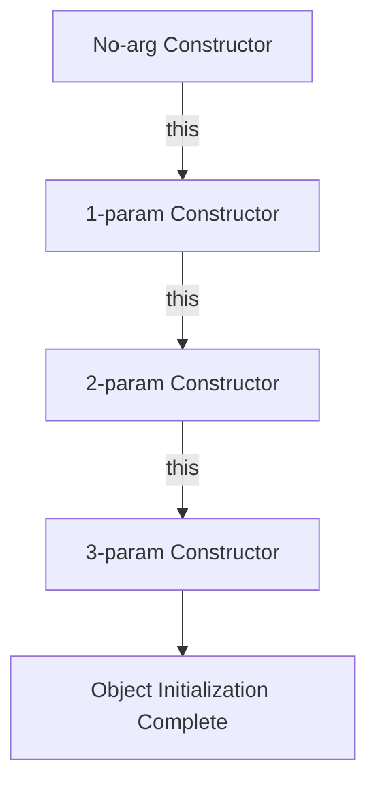
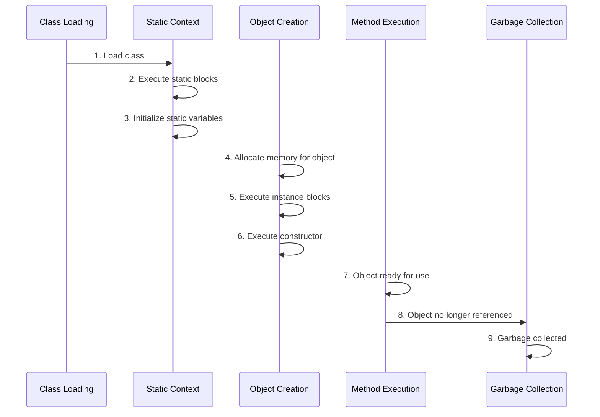

# Tutorial 07: Classes and Objects - The Foundation of OOP

## Table of Contents
- [Introduction](#introduction)
- [Prerequisites](#prerequisites)
- [What are Objects and Classes?](#what-are-objects-and-classes)
- [Creating Objects](#creating-objects)
- [Class Fields (Instance Variables)](#class-fields-instance-variables)
- [Methods](#methods)
- [Variable Scope in Classes](#variable-scope-in-classes)
- [Method Overloading](#method-overloading)
- [Constructors](#constructors)
- [The `this` Keyword](#the-this-keyword)
- [Constructor Chaining with `this()`](#constructor-chaining-with-this)
- [Initialization Blocks](#initialization-blocks)
- [Complete Object Lifecycle](#complete-object-lifecycle)
- [Memory Management](#memory-management)
- [Common Pitfalls](#common-pitfalls)
- [Best Practices](#best-practices)
- [Real-World Applications](#real-world-applications)
- [Interview Questions & Answers](#interview-questions--answers)
- [Practice Exercises](#practice-exercises)
- [Summary](#summary)
- [What's Next?](#whats-next)
- [Video Index](#video-index)
- [Further Reading](#further-reading)

---

## Introduction

**Classes and Objects** are the fundamental building blocks of Object-Oriented Programming (OOP) in Java. Understanding these concepts is crucial because Java is inherently an object-oriented language - everything in Java revolves around classes and objects.

### Why Classes and Objects Matter

```
Traditional Programming (Procedural):
┌─────────────┐
│   Data      │ ← Separate from logic
└─────────────┘
┌─────────────┐
│  Functions  │ ← Separate from data
└─────────────┘

Object-Oriented Programming:
┌─────────────────────────────┐
│         OBJECT              │
│  ┌─────────────┐            │
│  │    Data     │            │
│  │ (Attributes)│            │
│  └─────────────┘            │
│  ┌─────────────┐            │
│  │   Methods   │            │
│  │ (Behaviors) │            │
│  └─────────────┘            │
└─────────────────────────────┘
Data + Behavior = Cohesive Unit
```

### Real-World Analogy

Think of a **class** as a **blueprint** for a house:
- The blueprint defines what features a house will have (rooms, doors, windows)
- It specifies the structure but isn't the actual house
- Multiple houses can be built from the same blueprint

An **object** is the **actual house** built from that blueprint:
- Each house (object) has its own characteristics (color, furniture, owners)
- Each house exists independently with real, tangible properties
- Multiple houses can exist from one blueprint, each unique

### Topics Covered

This comprehensive tutorial covers:
1. **Classes** - Blueprints for objects
2. **Objects** - Instances of classes
3. **Fields** - Data that objects hold
4. **Methods** - Behaviors objects can perform
5. **Constructors** - Special methods for object creation
6. **Method Overloading** - Multiple methods with same name
7. **`this` Keyword** - Self-reference mechanism
8. **Initialization Blocks** - Advanced initialization techniques

---

## Prerequisites

Before diving into classes and objects, you should understand:

- **Java Basics**: JVM, compilation, execution
- **Variables**: Local, instance, and static variables
- **Data Types**: Primitives and references
- **Control Statements**: if-else, loops
- **Scope and Lifetime**: Variable accessibility

**Quick Recap:**
```java
// Variable types you should know
int localVar = 10;           // Local variable
String name;                  // Instance variable (in class context)
static int count = 0;         // Static variable (class-level)
```

---

## What are Objects and Classes?

### Class Definition

A **class** is a user-defined blueprint or prototype from which objects are created. It represents the set of properties or methods that are common to all objects of one type.

```java
public class Car {
    // Class body
}
```

**Key Points:**
- Template/blueprint for creating objects
- Contains fields (data) and methods (behavior)
- Does not occupy memory until instantiated
- Provides abstraction and encapsulation

### Object Definition

An **object** is an instance of a class. When a class is defined, no memory is allocated until an object of that class is created.

```java
Car myCar = new Car(); // Object creation
```

**Key Points:**
- Real entity with actual data
- Occupies memory on the heap
- Has state (field values) and behavior (methods)
- Each object is independent

### Class vs Object

```
┌─────────────────────────────────────────┐
│             CLASS                       │
│  ┌───────────────────────────────┐     │
│  │    Template/Blueprint         │     │
│  │    • No memory allocation     │     │
│  │    • Defines structure        │     │
│  │    • Contains fields/methods  │     │
│  └───────────────────────────────┘     │
└─────────────────────────────────────────┘
              │
              │ instantiation
              ▼
┌─────────────────────────────────────────┐
│           OBJECTS                       │
│  ┌──────────┐  ┌──────────┐  ┌────────┐│
│  │ Object 1 │  │ Object 2 │  │Object 3││
│  │ (State)  │  │ (State)  │  │(State) ││
│  └──────────┘  └──────────┘  └────────┘│
│   Each with unique data and memory     │
└─────────────────────────────────────────┘
```

### Anatomy of a Class

```java
// Class declaration
public class Student {
    // 1. Instance Variables (Fields)
    String name;
    int age;
    double gpa;
    
    // 2. Static Variables (Class Variables)
    static int totalStudents = 0;
    
    // 3. Constructors
    public Student(String name, int age) {
        this.name = name;
        this.age = age;
        totalStudents++;
    }
    
    // 4. Instance Methods
    public void study() {
        System.out.println(name + " is studying.");
    }
    
    // 5. Static Methods
    public static int getTotalStudents() {
        return totalStudents;
    }
    
    // 6. Getters/Setters
    public String getName() {
        return name;
    }
    
    public void setName(String name) {
        this.name = name;
    }
}
```

### Visual Representation



---

## Creating Objects

### Object Creation Process

Creating an object involves three steps:

1. **Declaration**: Declaring a variable of the class type
2. **Instantiation**: Using `new` keyword to allocate memory
3. **Initialization**: Calling constructor to initialize the object

```java
// Step 1: Declaration
Student student;

// Step 2: Instantiation + Step 3: Initialization
student = new Student("Alice", 20);

// Combined (most common)
Student student = new Student("Alice", 20);
```

### Memory Allocation During Object Creation

```
Stack Memory              Heap Memory
┌──────────────┐         ┌─────────────────────┐
│              │         │                     │
│  student  ───┼────────>│  Student Object     │
│  (reference) │         │  ┌───────────────┐  │
│              │         │  │ name: "Alice" │  │
│              │         │  │ age: 20       │  │
└──────────────┘         │  │ gpa: 0.0      │  │
                         │  └───────────────┘  │
                         └─────────────────────┘
```

### Example 1: Basic Object Creation

```java
public class Book {
    String title;
    String author;
    int pages;
    
    public Book(String title, String author, int pages) {
        this.title = title;
        this.author = author;
        this.pages = pages;
    }
    
    public void displayInfo() {
        System.out.println("Title: " + title);
        System.out.println("Author: " + author);
        System.out.println("Pages: " + pages);
    }
    
    public static void main(String[] args) {
        // Creating objects
        Book book1 = new Book("Java Programming", "James Gosling", 500);
        Book book2 = new Book("Clean Code", "Robert Martin", 450);
        
        // Using objects
        book1.displayInfo();
        System.out.println();
        book2.displayInfo();
        
        // Accessing fields
        System.out.println("\nBook 1 has " + book1.pages + " pages");
    }
}
```

**Output:**
```
Title: Java Programming
Author: James Gosling
Pages: 500

Title: Clean Code
Author: Robert Martin
Pages: 450

Book 1 has 500 pages
```

### Multiple Ways to Create Objects

```java
public class ObjectCreation {
    public static void main(String[] args) {
        // Method 1: Using new keyword (most common)
        Student s1 = new Student("Alice", 20);
        
        // Method 2: Using newInstance() method
        try {
            Student s2 = Student.class.newInstance();
        } catch (Exception e) {
            e.printStackTrace();
        }
        
        // Method 3: Using clone() method
        Student s3 = (Student) s1.clone();
        
        // Method 4: Using deserialization
        // (Covered in Serialization tutorial)
        
        // Method 5: Using factory methods
        Student s4 = Student.createStudent("Bob", 22);
    }
}
```

### Object References

```java
public class ReferenceDemo {
    public static void main(String[] args) {
        // One object, two references
        Student s1 = new Student("Alice", 20);
        Student s2 = s1; // s2 references same object as s1
        
        System.out.println("s1 name: " + s1.getName()); // Alice
        System.out.println("s2 name: " + s2.getName()); // Alice
        
        // Changing via s2 affects s1 (same object)
        s2.setName("Bob");
        System.out.println("s1 name: " + s1.getName()); // Bob
        System.out.println("s2 name: " + s2.getName()); // Bob
        
        // Two different objects
        Student s3 = new Student("Charlie", 21);
        Student s4 = new Student("David", 22);
        
        System.out.println("s3 == s4: " + (s3 == s4)); // false (different objects)
        System.out.println("s1 == s2: " + (s1 == s2)); // true (same object)
    }
}
```

### Visual: Object References

```
Two references to same object:
┌──────┐     ┌──────────────┐
│  s1  │────>│ Student      │
└──────┘     │ name: "Bob"  │
┌──────┐     │ age: 20      │
│  s2  │────>│              │
└──────┘     └──────────────┘

Two references to different objects:
┌──────┐     ┌──────────────┐
│  s3  │────>│ Student      │
└──────┘     │ name:"Charlie"│
             └──────────────┘
┌──────┐     ┌──────────────┐
│  s4  │────>│ Student      │
└──────┘     │ name: "David"│
             └──────────────┘
```

---

## Class Fields (Instance Variables)

### What are Fields?

**Fields** (also called **instance variables** or **attributes**) are variables declared inside a class but outside any method. They represent the state/data of an object.

```java
public class Person {
    // Instance variables (fields)
    String name;        // Reference type
    int age;           // Primitive type
    double salary;     // Primitive type
    boolean isEmployed; // Primitive type
    Address address;    // Reference type (another class)
}
```

### Field Characteristics

```
┌────────────────────────────────────────┐
│    INSTANCE VARIABLE PROPERTIES        │
├────────────────────────────────────────┤
│ • Declared inside class                │
│ • Outside all methods                  │
│ • Created when object is created       │
│ • Destroyed when object is destroyed   │
│ • Unique for each object instance      │
│ • Have default values if not init      │
│ • Accessible throughout the class      │
│ • Can have access modifiers            │
└────────────────────────────────────────┘
```

### Default Values for Fields

Unlike local variables, **instance variables get default values** if not explicitly initialized:

| Data Type | Default Value |
|-----------|---------------|
| `byte` | 0 |
| `short` | 0 |
| `int` | 0 |
| `long` | 0L |
| `float` | 0.0f |
| `double` | 0.0d |
| `char` | '\u0000' (null character) |
| `boolean` | false |
| Reference types | null |

```java
public class DefaultValues {
    // These get default values
    int number;           // 0
    double price;         // 0.0
    boolean flag;         // false
    String text;          // null
    
    public void display() {
        System.out.println("number: " + number);   // 0
        System.out.println("price: " + price);     // 0.0
        System.out.println("flag: " + flag);       // false
        System.out.println("text: " + text);       // null
    }
    
    public static void main(String[] args) {
        DefaultValues obj = new DefaultValues();
        obj.display();
    }
}
```

### Field Access Modifiers

```java
public class AccessModifiersDemo {
    // Public: accessible everywhere
    public String publicField = "Public";
    
    // Private: accessible only within this class
    private String privateField = "Private";
    
    // Protected: accessible in same package and subclasses
    protected String protectedField = "Protected";
    
    // Default (no modifier): accessible in same package
    String defaultField = "Default";
}
```

### Example: Complete Class with Fields

```java
public class BankAccount {
    // Instance variables (fields)
    private String accountNumber;
    private String accountHolder;
    private double balance;
    private String accountType;
    private boolean isActive;
    
    // Static variable (shared across all objects)
    private static int totalAccounts = 0;
    
    public BankAccount(String accountNumber, String accountHolder, double initialBalance) {
        this.accountNumber = accountNumber;
        this.accountHolder = accountHolder;
        this.balance = initialBalance;
        this.accountType = "Savings";
        this.isActive = true;
        totalAccounts++;
    }
    
    public void deposit(double amount) {
        if (amount > 0 && isActive) {
            balance += amount;
            System.out.println("Deposited: $" + amount);
            System.out.println("New balance: $" + balance);
        }
    }
    
    public void withdraw(double amount) {
        if (amount > 0 && amount <= balance && isActive) {
            balance -= amount;
            System.out.println("Withdrawn: $" + amount);
            System.out.println("New balance: $" + balance);
        } else {
            System.out.println("Insufficient balance or inactive account");
        }
    }
    
    public void displayAccountInfo() {
        System.out.println("Account Number: " + accountNumber);
        System.out.println("Account Holder: " + accountHolder);
        System.out.println("Balance: $" + balance);
        System.out.println("Account Type: " + accountType);
        System.out.println("Status: " + (isActive ? "Active" : "Inactive"));
    }
    
    public static void main(String[] args) {
        BankAccount acc1 = new BankAccount("ACC001", "John Doe", 1000.0);
        BankAccount acc2 = new BankAccount("ACC002", "Jane Smith", 2000.0);
        
        acc1.displayAccountInfo();
        System.out.println();
        
        acc1.deposit(500);
        acc1.withdraw(200);
        System.out.println();
        
        acc2.displayAccountInfo();
        System.out.println("\nTotal accounts: " + totalAccounts);
    }
}
```

**Output:**
```
Account Number: ACC001
Account Holder: John Doe
Balance: $1000.0
Account Type: Savings
Status: Active

Deposited: $500.0
New balance: $1500.0
Withdrawn: $200.0
New balance: $1300.0

Account Number: ACC002
Account Holder: Jane Smith
Balance: $2000.0
Account Type: Savings
Status: Active

Total accounts: 2
```

---

## Methods

### What are Methods?

**Methods** are blocks of code that perform specific tasks. They define the **behavior** of objects.

```java
accessModifier returnType methodName(parameters) {
    // method body
    return value; // if returnType is not void
}
```

### Method Components

```
┌─────────────────────────────────────────┐
│        METHOD ANATOMY                   │
├─────────────────────────────────────────┤
│ 1. Access Modifier (public, private)   │
│ 2. Return Type (void, int, String...)  │
│ 3. Method Name (camelCase convention)  │
│ 4. Parameter List (input values)       │
│ 5. Method Body (executable code)       │
│ 6. Return Statement (if not void)      │
└─────────────────────────────────────────┘
```

### Types of Methods

```java
public class MethodTypes {
    // 1. Instance Method (requires object)
    public void instanceMethod() {
        System.out.println("Instance method");
    }
    
    // 2. Static Method (called on class)
    public static void staticMethod() {
        System.out.println("Static method");
    }
    
    // 3. Method with return value
    public int add(int a, int b) {
        return a + b;
    }
    
    // 4. Method without return value (void)
    public void printMessage(String message) {
        System.out.println(message);
    }
    
    // 5. Method with variable arguments (varargs)
    public int sum(int... numbers) {
        int total = 0;
        for (int num : numbers) {
            total += num;
        }
        return total;
    }
}
```

### Method Calling

```java
public class MethodCalling {
    public void greet(String name) {
        System.out.println("Hello, " + name + "!");
    }
    
    public int multiply(int a, int b) {
        return a * b;
    }
    
    public static void main(String[] args) {
        // Create object to call instance methods
        MethodCalling obj = new MethodCalling();
        
        // Call void method
        obj.greet("Alice");
        
        // Call method with return value
        int result = obj.multiply(5, 3);
        System.out.println("Result: " + result);
    }
}
```

### Parameter Passing

```java
public class ParameterPassing {
    // Pass by Value (primitives)
    public void modifyPrimitive(int num) {
        num = 100; // Only changes local copy
    }
    
    // Pass by Value (references)
    public void modifyObject(StringBuilder sb) {
        sb.append(" Modified"); // Changes actual object
    }
    
    public void reassignObject(StringBuilder sb) {
        sb = new StringBuilder("New"); // Only changes local reference
    }
    
    public static void main(String[] args) {
        // Primitive example
        int x = 10;
        ParameterPassing obj = new ParameterPassing();
        obj.modifyPrimitive(x);
        System.out.println("x: " + x); // 10 (unchanged)
        
        // Object modification
        StringBuilder sb1 = new StringBuilder("Original");
        obj.modifyObject(sb1);
        System.out.println("sb1: " + sb1); // "Original Modified"
        
        // Object reassignment
        StringBuilder sb2 = new StringBuilder("Original");
        obj.reassignObject(sb2);
        System.out.println("sb2: " + sb2); // "Original" (unchanged)
    }
}
```

### Method Return Types

```java
public class ReturnTypes {
    // Return primitive
    public int getNumber() {
        return 42;
    }
    
    // Return object
    public String getName() {
        return "John";
    }
    
    // Return array
    public int[] getArray() {
        return new int[]{1, 2, 3, 4, 5};
    }
    
    // Return void (no return)
    public void printMessage() {
        System.out.println("Hello");
        // return; // optional for void methods
    }
    
    // Early return
    public String checkAge(int age) {
        if (age < 0) {
            return "Invalid age";
        }
        if (age < 18) {
            return "Minor";
        }
        return "Adult";
    }
}
```

---

## Variable Scope in Classes

### Types of Variable Scope

```
┌────────────────────────────────────────┐
│        VARIABLE SCOPES IN JAVA         │
├────────────────────────────────────────┤
│ 1. Local Variables                     │
│    • Declared inside methods           │
│    • Scope: Within the method only     │
│    • No default value                  │
│                                        │
│ 2. Instance Variables (Fields)         │
│    • Declared in class, outside methods│
│    • Scope: Entire class (via object)  │
│    • Have default values               │
│                                        │
│ 3. Static Variables (Class Variables)  │
│    • Declared with static keyword      │
│    • Scope: Entire class (via class)   │
│    • Shared across all instances       │
│                                        │
│ 4. Block Variables                     │
│    • Declared inside blocks {}         │
│    • Scope: Within that block only     │
└────────────────────────────────────────┘
```

### Example: All Variable Scopes

```java
public class VariableScope {
    // Instance variable (class scope)
    private int instanceVar = 10;
    
    // Static variable (class scope, shared)
    private static int staticVar = 20;
    
    public void method1() {
        // Local variable (method scope)
        int localVar = 30;
        
        // Block variable (block scope)
        {
            int blockVar = 40;
            System.out.println("Inside block:");
            System.out.println("  localVar: " + localVar);
            System.out.println("  blockVar: " + blockVar);
            System.out.println("  instanceVar: " + instanceVar);
            System.out.println("  staticVar: " + staticVar);
        }
        
        // blockVar is not accessible here
        // System.out.println(blockVar); // ERROR
        
        System.out.println("\nOutside block:");
        System.out.println("  localVar: " + localVar);
        System.out.println("  instanceVar: " + instanceVar);
        System.out.println("  staticVar: " + staticVar);
    }
    
    public void method2() {
        // localVar from method1 is not accessible here
        // System.out.println(localVar); // ERROR
        
        // But instance and static variables are accessible
        System.out.println("\nIn method2:");
        System.out.println("  instanceVar: " + instanceVar);
        System.out.println("  staticVar: " + staticVar);
    }
    
    public static void main(String[] args) {
        VariableScope obj = new VariableScope();
        obj.method1();
        obj.method2();
    }
}
```

### Difference Between Instance and Local Variables

| Aspect | Instance Variable | Local Variable |
|--------|------------------|----------------|
| **Declaration** | Inside class, outside methods | Inside method, constructor, or block |
| **Scope** | Throughout class (via object) | Only within method/block |
| **Lifetime** | As long as object exists | Only during method execution |
| **Default Value** | Yes (0, null, false) | No (must initialize) |
| **Access Modifier** | Can have (public, private) | Cannot have |
| **Memory** | Stored in heap | Stored in stack |
| **this keyword** | Can use `this.variable` | Cannot use `this` |

```java
public class VariableDifference {
    // Instance variable
    private int instanceCount = 0; // Default value: 0
    
    public void demonstrateDifference() {
        // Local variable
        int localCount; // No default value
        
        // Must initialize local variable before use
        localCount = 0;
        
        // Both can be accessed in method
        instanceCount++;
        localCount++;
        
        System.out.println("Instance: " + instanceCount);
        System.out.println("Local: " + localCount);
    }
    
    public void anotherMethod() {
        // instanceCount is accessible
        instanceCount++;
        System.out.println("Instance in another method: " + instanceCount);
        
        // localCount is NOT accessible here
        // System.out.println(localCount); // ERROR
    }
    
    public static void main(String[] args) {
        VariableDifference obj = new VariableDifference();
        
        obj.demonstrateDifference(); // Instance: 1, Local: 1
        obj.demonstrateDifference(); // Instance: 2, Local: 1
        obj.anotherMethod();         // Instance: 3
    }
}
```

### Shadowing (Variable Hiding)

```java
public class Shadowing {
    private int value = 100; // Instance variable
    
    public void demonstrateShadowing(int value) { // Parameter shadows instance variable
        System.out.println("Parameter value: " + value);
        System.out.println("Instance value: " + this.value);
        
        // Local variable shadows instance variable
        int localValue = 50;
        {
            int localValue = 75; // ERROR: cannot redeclare in nested scope
        }
    }
    
    public void methodWithShadowing() {
        int value = 200; // Local variable shadows instance variable
        
        System.out.println("Local value: " + value);       // 200
        System.out.println("Instance value: " + this.value); // 100
    }
    
    public static void main(String[] args) {
        Shadowing obj = new Shadowing();
        obj.demonstrateShadowing(300);
        obj.methodWithShadowing();
    }
}
```

---

## Method Overloading

### What is Method Overloading?

**Method overloading** allows multiple methods in the same class to have the **same name** but **different parameters**. It's a form of **compile-time polymorphism**.

```
┌────────────────────────────────────────┐
│      METHOD OVERLOADING RULES          │
├────────────────────────────────────────┤
│ ✓ Same method name                     │
│ ✓ Different parameters:                │
│   • Different number of parameters     │
│   • Different types of parameters      │
│   • Different order of parameters      │
│ ✗ Return type alone is NOT enough      │
│ ✗ Access modifiers don't matter        │
└────────────────────────────────────────┘
```

### Overloading by Number of Parameters

```java
public class Calculator {
    // Method with 2 parameters
    public int add(int a, int b) {
        return a + b;
    }
    
    // Overloaded method with 3 parameters
    public int add(int a, int b, int c) {
        return a + b + c;
    }
    
    // Overloaded method with 4 parameters
    public int add(int a, int b, int c, int d) {
        return a + b + c + d;
    }
    
    public static void main(String[] args) {
        Calculator calc = new Calculator();
        
        System.out.println("2 params: " + calc.add(10, 20));           // 30
        System.out.println("3 params: " + calc.add(10, 20, 30));       // 60
        System.out.println("4 params: " + calc.add(10, 20, 30, 40));   // 100
    }
}
```

### Overloading by Type of Parameters

```java
public class Display {
    // Method for int
    public void show(int value) {
        System.out.println("int: " + value);
    }
    
    // Overloaded method for double
    public void show(double value) {
        System.out.println("double: " + value);
    }
    
    // Overloaded method for String
    public void show(String value) {
        System.out.println("String: " + value);
    }
    
    // Overloaded method for boolean
    public void show(boolean value) {
        System.out.println("boolean: " + value);
    }
    
    public static void main(String[] args) {
        Display display = new Display();
        
        display.show(10);          // Calls int version
        display.show(10.5);        // Calls double version
        display.show("Hello");     // Calls String version
        display.show(true);        // Calls boolean version
    }
}
```

### Overloading by Order of Parameters

```java
public class OrderOverloading {
    // Method 1: int, double
    public void process(int a, double b) {
        System.out.println("int, double: " + a + ", " + b);
    }
    
    // Method 2: double, int
    public void process(double a, int b) {
        System.out.println("double, int: " + a + ", " + b);
    }
    
    public static void main(String[] args) {
        OrderOverloading obj = new OrderOverloading();
        
        obj.process(10, 20.5);     // Calls first method
        obj.process(10.5, 20);     // Calls second method
    }
}
```

### Type Promotion in Overloading

When an exact match is not found, Java performs type promotion:

```
Promotion Path:
byte → short → int → long → float → double
char → int
```

```java
public class TypePromotion {
    public void show(int value) {
        System.out.println("int version: " + value);
    }
    
    public void show(String value) {
        System.out.println("String version: " + value);
    }
    
    public static void main(String[] args) {
        TypePromotion obj = new TypePromotion();
        
        byte b = 10;
        obj.show(b);         // Promotes byte to int
        
        short s = 20;
        obj.show(s);         // Promotes short to int
        
        char c = 'A';
        obj.show(c);         // Promotes char to int
        
        obj.show("Hello");   // Exact match for String
    }
}
```

### Ambiguous Overloading (Compilation Error)

```java
public class AmbiguousOverloading {
    // This will cause ambiguity
    public void method(int a, double b) {
        System.out.println("int, double");
    }
    
    public void method(double a, int b) {
        System.out.println("double, int");
    }
    
    public static void main(String[] args) {
        AmbiguousOverloading obj = new AmbiguousOverloading();
        
        // obj.method(10, 20); // ERROR: Ambiguous - both can match
        
        // Fix: Be explicit
        obj.method(10, 20.0);  // Calls first method
        obj.method(10.0, 20);  // Calls second method
    }
}
```

### Complete Example: Overloaded Area Calculator

```java
public class AreaCalculator {
    // Calculate area of circle
    public double calculateArea(double radius) {
        return Math.PI * radius * radius;
    }
    
    // Calculate area of rectangle
    public double calculateArea(double length, double width) {
        return length * width;
    }
    
    // Calculate area of triangle
    public double calculateArea(double base, double height, boolean isTriangle) {
        return 0.5 * base * height;
    }
    
    // Calculate area of square
    public int calculateArea(int side) {
        return side * side;
    }
    
    public static void main(String[] args) {
        AreaCalculator calc = new AreaCalculator();
        
        System.out.println("Circle area: " + calc.calculateArea(5.0));
        System.out.println("Rectangle area: " + calc.calculateArea(4.0, 6.0));
        System.out.println("Triangle area: " + calc.calculateArea(4.0, 6.0, true));
        System.out.println("Square area: " + calc.calculateArea(5));
    }
}
```

---

## Constructors

### What is a Constructor?

A **constructor** is a special method used to initialize objects. It's called automatically when an object is created using the `new` keyword.

```
┌────────────────────────────────────────┐
│     CONSTRUCTOR CHARACTERISTICS        │
├────────────────────────────────────────┤
│ • Same name as class                   │
│ • No return type (not even void)       │
│ • Called automatically during creation │
│ • Can be overloaded                    │
│ • Cannot be abstract, static, final    │
│ • Used to initialize object state      │
└────────────────────────────────────────┘
```

### Constructor Syntax

```java
public class ClassName {
    // Constructor
    public ClassName() {
        // Initialization code
    }
}
```

### Types of Constructors

#### 1. Default Constructor (No-Arg Constructor)

```java
public class Student {
    String name;
    int age;
    
    // Default constructor
    public Student() {
        name = "Unknown";
        age = 0;
        System.out.println("Default constructor called");
    }
    
    public void display() {
        System.out.println("Name: " + name + ", Age: " + age);
    }
    
    public static void main(String[] args) {
        Student s1 = new Student(); // Calls default constructor
        s1.display();
    }
}
```

**Output:**
```
Default constructor called
Name: Unknown, Age: 0
```

#### 2. Parameterized Constructor

```java
public class Student {
    String name;
    int age;
    
    // Parameterized constructor
    public Student(String name, int age) {
        this.name = name;
        this.age = age;
        System.out.println("Parameterized constructor called");
    }
    
    public void display() {
        System.out.println("Name: " + name + ", Age: " + age);
    }
    
    public static void main(String[] args) {
        Student s1 = new Student("Alice", 20);
        s1.display();
    }
}
```

**Output:**
```
Parameterized constructor called
Name: Alice, Age: 20
```

#### 3. Copy Constructor

```java
public class Student {
    String name;
    int age;
    
    // Parameterized constructor
    public Student(String name, int age) {
        this.name = name;
        this.age = age;
    }
    
    // Copy constructor
    public Student(Student other) {
        this.name = other.name;
        this.age = other.age;
        System.out.println("Copy constructor called");
    }
    
    public void display() {
        System.out.println("Name: " + name + ", Age: " + age);
    }
    
    public static void main(String[] args) {
        Student s1 = new Student("Alice", 20);
        Student s2 = new Student(s1); // Copy constructor
        
        s1.display();
        s2.display();
    }
}
```

### Constructor Overloading

Like methods, constructors can be overloaded:

```java
public class Rectangle {
    int length;
    int width;
    
    // Default constructor
    public Rectangle() {
        length = 1;
        width = 1;
        System.out.println("Default constructor");
    }
    
    // Constructor with one parameter (square)
    public Rectangle(int side) {
        length = side;
        width = side;
        System.out.println("Square constructor");
    }
    
    // Constructor with two parameters
    public Rectangle(int length, int width) {
        this.length = length;
        this.width = width;
        System.out.println("Rectangle constructor");
    }
    
    public int area() {
        return length * width;
    }
    
    public static void main(String[] args) {
        Rectangle r1 = new Rectangle();           // 1x1
        Rectangle r2 = new Rectangle(5);          // 5x5
        Rectangle r3 = new Rectangle(4, 6);       // 4x6
        
        System.out.println("r1 area: " + r1.area());
        System.out.println("r2 area: " + r2.area());
        System.out.println("r3 area: " + r3.area());
    }
}
```

### Default Constructor Behavior

If you don't define ANY constructor, Java provides a default no-arg constructor automatically:

```java
public class Example {
    int value;
    
    // Java automatically provides:
    // public Example() {
    //     super();
    // }
}

// Can create object
Example obj = new Example();
```

**Important:** If you define ANY constructor (even parameterized), Java will NOT provide the default constructor:

```java
public class Example {
    int value;
    
    // Only parameterized constructor defined
    public Example(int value) {
        this.value = value;
    }
}

// Example obj = new Example(); // ERROR: no default constructor
Example obj = new Example(10);  // OK
```

### Constructor vs Method

| Aspect | Constructor | Method |
|--------|-------------|---------|
| **Name** | Same as class name | Any valid identifier |
| **Return Type** | No return type | Must have return type |
| **Invocation** | Automatically on object creation | Explicitly called |
| **Purpose** | Initialize object | Perform operations |
| **Inheritance** | Not inherited | Inherited |
| **Modifiers** | Cannot be abstract, static, final | Can be abstract, static, final |

---

## The `this` Keyword

### What is `this`?

The **`this` keyword** is a reference variable that refers to the **current object**.

```
┌────────────────────────────────────────┐
│        USES OF 'this' KEYWORD          │
├────────────────────────────────────────┤
│ 1. Refer to current object instance    │
│ 2. Distinguish instance var from param │
│ 3. Call one constructor from another   │
│ 4. Pass current object as parameter    │
│ 5. Return current object from method   │
└────────────────────────────────────────┘
```

### Use 1: Differentiate Instance Variables from Parameters

Most common use - when parameter names match field names:

```java
public class Person {
    String name;
    int age;
    
    // Without 'this' - WRONG
    public Person(String name, int age) {
        name = name;  // Assigns parameter to itself!
        age = age;    // Instance variables remain uninitialized
    }
    
    // With 'this' - CORRECT
    public Person(String name, int age) {
        this.name = name;  // this.name is instance variable
        this.age = age;    // this.age is instance variable
    }
}
```

### Use 2: Call Another Method in Same Class

```java
public class Calculator {
    public int add(int a, int b) {
        return a + b;
    }
    
    public int addThree(int a, int b, int c) {
        // Calling add method using this (optional but explicit)
        return this.add(this.add(a, b), c);
    }
    
    public static void main(String[] args) {
        Calculator calc = new Calculator();
        System.out.println(calc.addThree(5, 10, 15)); // 30
    }
}
```

### Use 3: Return Current Object

Useful for method chaining:

```java
public class Builder {
    String name;
    int age;
    String address;
    
    public Builder setName(String name) {
        this.name = name;
        return this;  // Return current object
    }
    
    public Builder setAge(int age) {
        this.age = age;
        return this;
    }
    
    public Builder setAddress(String address) {
        this.address = address;
        return this;
    }
    
    public void display() {
        System.out.println("Name: " + name);
        System.out.println("Age: " + age);
        System.out.println("Address: " + address);
    }
    
    public static void main(String[] args) {
        // Method chaining
        Builder builder = new Builder()
            .setName("Alice")
            .setAge(25)
            .setAddress("123 Main St");
        
        builder.display();
    }
}
```

### Use 4: Pass Current Object as Argument

```java
public class EventHandler {
    public void registerListener(EventListener listener) {
        listener.onEvent(this); // Pass current object
    }
}

public class Button extends EventHandler {
    public void click() {
        System.out.println("Button clicked");
        registerListener(new EventListener() {
            public void onEvent(Object source) {
                System.out.println("Event source: " + source.getClass());
            }
        });
    }
}
```

### Complete Example with `this`

```java
public class Employee {
    private String name;
    private int id;
    private double salary;
    
    // Constructor using this to differentiate
    public Employee(String name, int id, double salary) {
        this.name = name;
        this.id = id;
        this.salary = salary;
    }
    
    // Method using this for clarity
    public void giveRaise(double percentage) {
        this.salary = this.salary * (1 + percentage / 100);
    }
    
    // Method using this to return current object
    public Employee updateName(String name) {
        this.name = name;
        return this;
    }
    
    // Method that uses this to call another method
    public void displayFullInfo() {
        this.displayBasicInfo();
        System.out.println("Salary: $" + this.salary);
    }
    
    public void displayBasicInfo() {
        System.out.println("ID: " + this.id);
        System.out.println("Name: " + this.name);
    }
    
    public static void main(String[] args) {
        Employee emp = new Employee("John Doe", 101, 50000);
        
        emp.displayFullInfo();
        System.out.println();
        
        emp.giveRaise(10);
        emp.updateName("John Smith").displayFullInfo();
    }
}
```

---

## Constructor Chaining with `this()`

### What is Constructor Chaining?

**Constructor chaining** is the process of calling one constructor from another constructor in the same class using `this()`.

```
┌────────────────────────────────────────┐
│    CONSTRUCTOR CHAINING RULES          │
├────────────────────────────────────────┤
│ • this() calls another constructor     │
│ • Must be FIRST statement              │
│ • Avoid circular calls                 │
│ • Reduces code duplication             │
│ • Establishes initialization hierarchy │
└────────────────────────────────────────┘
```

### Basic Constructor Chaining

```java
public class Student {
    String name;
    int age;
    String course;
    
    // Constructor 1: Initialize all fields
    public Student(String name, int age, String course) {
        this.name = name;
        this.age = age;
        this.course = course;
        System.out.println("3-param constructor");
    }
    
    // Constructor 2: Chains to constructor 1
    public Student(String name, int age) {
        this(name, age, "Computer Science"); // Calls 3-param constructor
        System.out.println("2-param constructor");
    }
    
    // Constructor 3: Chains to constructor 2
    public Student(String name) {
        this(name, 18); // Calls 2-param constructor
        System.out.println("1-param constructor");
    }
    
    // Constructor 4: Chains to constructor 3
    public Student() {
        this("Unknown"); // Calls 1-param constructor
        System.out.println("No-arg constructor");
    }
    
    public void display() {
        System.out.println("Name: " + name);
        System.out.println("Age: " + age);
        System.out.println("Course: " + course);
    }
    
    public static void main(String[] args) {
        System.out.println("Creating student with no args:");
        Student s1 = new Student();
        s1.display();
        
        System.out.println("\nCreating student with name:");
        Student s2 = new Student("Alice");
        s2.display();
    }
}
```

**Output:**
```
Creating student with no args:
3-param constructor
2-param constructor
1-param constructor
No-arg constructor
Name: Unknown
Age: 18
Course: Computer Science

Creating student with name:
3-param constructor
2-param constructor
1-param constructor
Name: Alice
Age: 18
Course: Computer Science
```

### Constructor Chain Visualization



### Real-World Example: Bank Account

```java
public class BankAccount {
    private String accountNumber;
    private String accountHolder;
    private double balance;
    private String accountType;
    private double interestRate;
    
    // Most comprehensive constructor
    public BankAccount(String accountNumber, String accountHolder, 
                      double balance, String accountType, double interestRate) {
        this.accountNumber = accountNumber;
        this.accountHolder = accountHolder;
        this.balance = balance;
        this.accountType = accountType;
        this.interestRate = interestRate;
        System.out.println("Full constructor called");
    }
    
    // Constructor with default interest rate
    public BankAccount(String accountNumber, String accountHolder, 
                      double balance, String accountType) {
        this(accountNumber, accountHolder, balance, accountType, 2.5);
        System.out.println("Constructor without interest rate");
    }
    
    // Constructor with default account type and interest rate
    public BankAccount(String accountNumber, String accountHolder, double balance) {
        this(accountNumber, accountHolder, balance, "Savings");
        System.out.println("Constructor without account type");
    }
    
    // Constructor with zero initial balance
    public BankAccount(String accountNumber, String accountHolder) {
        this(accountNumber, accountHolder, 0.0);
        System.out.println("Constructor with zero balance");
    }
    
    public void display() {
        System.out.println("Account: " + accountNumber);
        System.out.println("Holder: " + accountHolder);
        System.out.println("Balance: $" + balance);
        System.out.println("Type: " + accountType);
        System.out.println("Interest Rate: " + interestRate + "%");
    }
    
    public static void main(String[] args) {
        BankAccount acc1 = new BankAccount("ACC001", "John Doe");
        acc1.display();
        
        System.out.println("\n" + "=".repeat(40) + "\n");
        
        BankAccount acc2 = new BankAccount("ACC002", "Jane Smith", 5000);
        acc2.display();
    }
}
```

### Common Mistakes with `this()`

```java
public class ConstructorMistakes {
    int value;
    
    // WRONG: this() not as first statement
    public ConstructorMistakes() {
        value = 10;
        this(20); // ERROR: must be first statement
    }
    
    public ConstructorMistakes(int value) {
        this.value = value;
    }
    
    // WRONG: Circular constructor chain
    public ConstructorMistakes(String msg) {
        this(100); // Calls constructor with int
    }
    
    public ConstructorMistakes(int v) {
        this("hello"); // ERROR: Circular chain!
    }
}
```

**Correct Version:**
```java
public class ConstructorFixed {
    int value;
    
    // CORRECT: this() as first statement
    public ConstructorFixed() {
        this(10); // First statement
        // Additional initialization after this()
    }
    
    public ConstructorFixed(int value) {
        this.value = value;
    }
}
```

---

## Initialization Blocks

### What are Initialization Blocks?

**Initialization blocks** are code blocks that execute when an object is created, before the constructor body runs.

```
┌────────────────────────────────────────┐
│     TYPES OF INITIALIZATION BLOCKS     │
├────────────────────────────────────────┤
│ 1. Instance Initialization Block (IIB) │
│    • Runs for every object creation    │
│    • Executes before constructor       │
│    • Syntax: { /* code */ }            │
│                                        │
│ 2. Static Initialization Block (SIB)   │
│    • Runs once when class is loaded    │
│    • Executes before any object        │
│    • Syntax: static { /* code */ }     │
└────────────────────────────────────────┘
```

### Instance Initialization Block

```java
public class InstanceBlockDemo {
    int value;
    
    // Instance initialization block
    {
        System.out.println("Instance block executed");
        value = 100;
    }
    
    // Constructor
    public InstanceBlockDemo() {
        System.out.println("Constructor executed");
        System.out.println("Value: " + value);
    }
    
    public static void main(String[] args) {
        System.out.println("Creating first object:");
        InstanceBlockDemo obj1 = new InstanceBlockDemo();
        
        System.out.println("\nCreating second object:");
        InstanceBlockDemo obj2 = new InstanceBlockDemo();
    }
}
```

**Output:**
```
Creating first object:
Instance block executed
Constructor executed
Value: 100

Creating second object:
Instance block executed
Constructor executed
Value: 100
```

### Static Initialization Block

```java
public class StaticBlockDemo {
    static int staticValue;
    int instanceValue;
    
    // Static initialization block
    static {
        System.out.println("Static block executed");
        staticValue = 50;
    }
    
    // Instance initialization block
    {
        System.out.println("Instance block executed");
        instanceValue = 100;
    }
    
    // Constructor
    public StaticBlockDemo() {
        System.out.println("Constructor executed");
    }
    
    public static void main(String[] args) {
        System.out.println("Main method started");
        
        System.out.println("\nCreating first object:");
        StaticBlockDemo obj1 = new StaticBlockDemo();
        
        System.out.println("\nCreating second object:");
        StaticBlockDemo obj2 = new StaticBlockDemo();
    }
}
```

**Output:**
```
Static block executed
Main method started

Creating first object:
Instance block executed
Constructor executed

Creating second object:
Instance block executed
Constructor executed
```

### Multiple Initialization Blocks

```java
public class MultipleBlocks {
    static {
        System.out.println("Static block 1");
    }
    
    {
        System.out.println("Instance block 1");
    }
    
    public MultipleBlocks() {
        System.out.println("Constructor");
    }
    
    static {
        System.out.println("Static block 2");
    }
    
    {
        System.out.println("Instance block 2");
    }
    
    public static void main(String[] args) {
        System.out.println("Main started");
        new MultipleBlocks();
    }
}
```

**Output:**
```
Static block 1
Static block 2
Main started
Instance block 1
Instance block 2
Constructor
```

### Order of Execution

```
┌────────────────────────────────────────┐
│      INITIALIZATION ORDER              │
├────────────────────────────────────────┤
│ 1. Static blocks (once, class loading) │
│ 2. Instance blocks (every object)      │
│ 3. Constructor (every object)          │
│                                        │
│ Within same type:                      │
│  → Top to bottom order                 │
└────────────────────────────────────────┘
```

### Practical Use of Initialization Blocks

```java
public class ComplexInitialization {
    private static Map<String, String> config;
    private List<String> data;
    
    // Static block for complex static initialization
    static {
        System.out.println("Loading configuration...");
        config = new HashMap<>();
        config.put("db.url", "jdbc:mysql://localhost:3306/mydb");
        config.put("db.user", "admin");
        config.put("max.connections", "10");
    }
    
    // Instance block for complex instance initialization
    {
        System.out.println("Initializing instance data...");
        data = new ArrayList<>();
        data.add("Item 1");
        data.add("Item 2");
        data.add("Item 3");
    }
    
    public ComplexInitialization() {
        System.out.println("Constructor called");
    }
    
    public void displayConfig() {
        System.out.println("Configuration:");
        config.forEach((key, value) -> 
            System.out.println("  " + key + " = " + value));
    }
    
    public void displayData() {
        System.out.println("Data: " + data);
    }
    
    public static void main(String[] args) {
        ComplexInitialization obj = new ComplexInitialization();
        obj.displayConfig();
        obj.displayData();
    }
}
```

---

## Complete Object Lifecycle

### Understanding the Full Lifecycle



### Complete Example

```java
public class LifecycleDemo {
    // Static variable
    private static int classCounter = 0;
    
    // Instance variable
    private int instanceId;
    
    // Static initialization block
    static {
        System.out.println("1. Static block: Class loaded");
        classCounter = 100;
    }
    
    // Instance initialization block
    {
        System.out.println("3. Instance block: Preparing object");
        instanceId = ++classCounter;
    }
    
    // Constructor
    public LifecycleDemo() {
        System.out.println("4. Constructor: Object " + instanceId + " created");
    }
    
    // Instance method
    public void useObject() {
        System.out.println("5. Method: Using object " + instanceId);
    }
    
    // finalize (deprecated but shows lifecycle)
    @Override
    protected void finalize() throws Throwable {
        System.out.println("6. Finalize: Object " + instanceId + " being collected");
    }
    
    public static void main(String[] args) {
        System.out.println("2. Main: Starting program\n");
        
        LifecycleDemo obj1 = new LifecycleDemo();
        obj1.useObject();
        
        System.out.println();
        
        LifecycleDemo obj2 = new LifecycleDemo();
        obj2.useObject();
        
        System.out.println("\n7. Main: Objects going out of scope");
        obj1 = null;
        obj2 = null;
        
        System.gc(); // Request garbage collection
        System.out.println("8. Main: Requested GC");
        
        try {
            Thread.sleep(1000); // Give GC time to run
        } catch (InterruptedException e) {
            e.printStackTrace();
        }
        
        System.out.println("9. Main: Program ending");
    }
}
```

---

## Memory Management

### Object Memory Allocation

```
JVM Memory Structure for Objects:

┌─────────────────────────────────┐
│         STACK                   │
│  ┌──────────────────┐           │
│  │ Reference        │           │
│  │ Variables        │───┐       │
│  └──────────────────┘   │       │
└─────────────────────────│───────┘
                          │
                          ▼
┌─────────────────────────────────┐
│         HEAP                    │
│  ┌──────────────────┐           │
│  │ Object 1         │           │
│  │ - instance vars  │           │
│  └──────────────────┘           │
│  ┌──────────────────┐           │
│  │ Object 2         │           │
│  │ - instance vars  │           │
│  └──────────────────┘           │
└─────────────────────────────────┘

┌─────────────────────────────────┐
│      METHOD AREA                │
│  ┌──────────────────┐           │
│  │ Class metadata   │           │
│  │ Static variables │           │
│  │ Method code      │           │
│  └──────────────────┘           │
└─────────────────────────────────┘
```

### Example: Memory Allocation

```java
public class MemoryAllocation {
    // Static variable - in Method Area
    static int staticVar = 10;
    
    // Instance variables - in Heap (per object)
    int instanceVar;
    String name;
    
    public MemoryAllocation(int value, String name) {
        this.instanceVar = value;  // Heap
        this.name = name;          // Reference in Heap, String in String Pool
    }
    
    public void method() {
        // Local variable - in Stack
        int localVar = 20;
        
        // Local reference - in Stack, object in Heap
        MemoryAllocation temp = new MemoryAllocation(30, "Temp");
    }
    
    public static void main(String[] args) {
        // Local reference - in Stack, object in Heap
        MemoryAllocation obj1 = new MemoryAllocation(100, "Object1");
        obj1.method();
        
        // Local reference - in Stack, object in Heap
        MemoryAllocation obj2 = new MemoryAllocation(200, "Object2");
    }
}
```

### Garbage Collection

When objects are no longer referenced, they become eligible for garbage collection:

```java
public class GarbageCollectionDemo {
    String name;
    
    public GarbageCollectionDemo(String name) {
        this.name = name;
        System.out.println(name + " created");
    }
    
    @Override
    protected void finalize() throws Throwable {
        System.out.println(name + " is being garbage collected");
    }
    
    public static void main(String[] args) {
        GarbageCollectionDemo obj1 = new GarbageCollectionDemo("Object1");
        GarbageCollectionDemo obj2 = new GarbageCollectionDemo("Object2");
        
        obj1 = null; // Object1 eligible for GC
        obj2 = null; // Object2 eligible for GC
        
        System.gc(); // Request garbage collection
        
        try {
            Thread.sleep(1000);
        } catch (InterruptedException e) {
            e.printStackTrace();
        }
    }
}
```

---

## Common Pitfalls

### 1. Forgetting to Initialize Objects

```java
public class UninitializedObject {
    public static void main(String[] args) {
        Student student; // Declared but not initialized
        
        // student.getName(); // ERROR: variable might not have been initialized
        
        // CORRECT: Initialize before use
        student = new Student("Alice", 20);
        student.getName(); // OK
    }
}
```

### 2. Confusing Object Reference with Object

```java
public class ReferenceConfusion {
    public static void main(String[] args) {
        Student s1 = new Student("Alice", 20);
        Student s2 = s1; // s2 references SAME object
        
        s2.setName("Bob");
        
        // Both show "Bob" - same object!
        System.out.println(s1.getName()); // Bob
        System.out.println(s2.getName()); // Bob
        
        // To create independent copy, use copy constructor
        Student s3 = new Student(s1);
        s3.setName("Charlie");
        System.out.println(s1.getName()); // Bob (unchanged)
        System.out.println(s3.getName()); // Charlie
    }
}
```

### 3. Not Using `this` When Needed

```java
public class ThisMissing {
    String name;
    
    // WRONG: Parameter shadows instance variable
    public ThisMissing(String name) {
        name = name; // Assigns parameter to itself!
    }
    
    // CORRECT: Use this
    public ThisMissing(String name) {
        this.name = name; // Assigns to instance variable
    }
}
```

### 4. Circular Constructor Calls

```java
public class CircularConstructor {
    // WRONG: Circular chain
    public CircularConstructor() {
        this(10); // Calls second constructor
    }
    
    public CircularConstructor(int value) {
        this(); // Calls first constructor - INFINITE LOOP!
    }
}
```

### 5. Modifying Parameters Expecting Change

```java
public class ParameterModification {
    public void modify(int num) {
        num = 100; // Only changes local copy
    }
    
    public void modifyObject(StringBuilder sb) {
        sb = new StringBuilder("New"); // Only changes local reference
    }
    
    public static void main(String[] args) {
        int x = 10;
        ParameterModification obj = new ParameterModification();
        obj.modify(x);
        System.out.println(x); // Still 10 - primitive not changed
        
        StringBuilder sb = new StringBuilder("Original");
        obj.modifyObject(sb);
        System.out.println(sb); // Still "Original" - reference not changed
    }
}
```

### 6. Not Understanding Default Constructor

```java
public class DefaultConstructorPitfall {
    int value;
    
    // Once you add ANY constructor...
    public DefaultConstructorPitfall(int value) {
        this.value = value;
    }
    
    public static void main(String[] args) {
        // DefaultConstructorPitfall obj = new DefaultConstructorPitfall(); // ERROR
        // Java no longer provides default constructor
        
        DefaultConstructorPitfall obj = new DefaultConstructorPitfall(10); // OK
    }
}
```

### 7. Overloading Based Only on Return Type

```java
public class InvalidOverloading {
    // WRONG: Cannot overload based only on return type
    // public int method() { return 1; }
    // public double method() { return 1.0; } // ERROR: duplicate method
    
    // CORRECT: Different parameters
    public int method(int x) { return x; }
    public double method(double x) { return x; }
}
```

---

## Best Practices

### 1. Use Private Fields with Public Getters/Setters (Encapsulation)

```java
public class GoodEncapsulation {
    // GOOD: Private fields
    private String name;
    private int age;
    
    // Public getters and setters
    public String getName() {
        return name;
    }
    
    public void setName(String name) {
        // Can add validation
        if (name != null && !name.trim().isEmpty()) {
            this.name = name;
        }
    }
    
    public int getAge() {
        return age;
    }
    
    public void setAge(int age) {
        // Can add validation
        if (age >= 0 && age <= 150) {
            this.age = age;
        }
    }
}
```

### 2. Initialize All Fields

```java
public class ProperInitialization {
    // Initialize at declaration
    private String status = "Active";
    private int count = 0;
    
    // Or in constructor
    private String name;
    private int age;
    
    public ProperInitialization(String name, int age) {
        this.name = name;
        this.age = age;
    }
}
```

### 3. Use Constructor Chaining to Reduce Duplication

```java
public class ConstructorChaining {
    private String name;
    private int age;
    private String department;
    
    // Most comprehensive constructor
    public ConstructorChaining(String name, int age, String department) {
        this.name = name;
        this.age = age;
        this.department = department;
    }
    
    // Chain to main constructor
    public ConstructorChaining(String name, int age) {
        this(name, age, "General"); // Reuse main constructor
    }
    
    public ConstructorChaining(String name) {
        this(name, 18); // Reuse 2-param constructor
    }
}
```

### 4. Override `toString()` for Better Debugging

```java
public class GoodToString {
    private String name;
    private int id;
    
    public GoodToString(String name, int id) {
        this.name = name;
        this.id = id;
    }
    
    @Override
    public String toString() {
        return "GoodToString{name='" + name + "', id=" + id + "}";
    }
    
    public static void main(String[] args) {
        GoodToString obj = new GoodToString("Alice", 101);
        System.out.println(obj); // Prints: GoodToString{name='Alice', id=101}
    }
}
```

### 5. Follow Naming Conventions

```java
public class NamingConventions {
    // Class name: PascalCase
    // Fields: camelCase
    private String firstName;
    private int accountNumber;
    
    // Constants: UPPER_SNAKE_CASE
    private static final int MAX_SIZE = 100;
    private static final String DEFAULT_NAME = "Unknown";
    
    // Methods: camelCase (verb-based)
    public void calculateTotal() { }
    public String getFullName() { return firstName; }
    public void setFirstName(String firstName) { this.firstName = firstName; }
}
```

### 6. Design for Single Responsibility

```java
// GOOD: Each class has single responsibility
public class User {
    private String username;
    private String email;
    
    // User-related methods only
    public void updateProfile() { }
    public void changePassword() { }
}

public class UserValidator {
    // Validation logic separated
    public boolean isValidEmail(String email) { return true; }
    public boolean isValidPassword(String password) { return true; }
}

public class UserRepository {
    // Database operations separated
    public void save(User user) { }
    public User findById(int id) { return null; }
}
```

### 7. Use Method Overloading Thoughtfully

```java
public class ThoughtfulOverloading {
    // Clear, related overloaded methods
    public double calculateArea(double radius) {
        return Math.PI * radius * radius;
    }
    
    public double calculateArea(double length, double width) {
        return length * width;
    }
    
    // Avoid confusing overloads
    // BAD: public double calculateArea(double base, double height) { ... }
    // Better: Use descriptive method names
    public double calculateTriangleArea(double base, double height) {
        return 0.5 * base * height;
    }
}
```

---

## Real-World Applications

### 1. E-Commerce Product System

```java
public class Product {
    private String id;
    private String name;
    private double price;
    private int stockQuantity;
    private String category;
    private boolean isActive;
    
    public Product(String id, String name, double price, int stockQuantity) {
        this.id = id;
        this.name = name;
        this.price = price;
        this.stockQuantity = stockQuantity;
        this.category = "General";
        this.isActive = true;
    }
    
    public boolean isInStock() {
        return stockQuantity > 0 && isActive;
    }
    
    public double calculateDiscount(double percentage) {
        return price * (1 - percentage / 100);
    }
    
    public void reduceStock(int quantity) {
        if (quantity <= stockQuantity) {
            stockQuantity -= quantity;
        } else {
            throw new IllegalArgumentException("Insufficient stock");
        }
    }
    
    public void restockProduct(int quantity) {
        if (quantity > 0) {
            stockQuantity += quantity;
        }
    }
    
    @Override
    public String toString() {
        return String.format("Product[id=%s, name=%s, price=%.2f, stock=%d]",
                           id, name, price, stockQuantity);
    }
}
```

### 2. Banking System

```java
public class BankAccount {
    private final String accountNumber;
    private String accountHolder;
    private double balance;
    private AccountType type;
    private static int totalAccounts = 0;
    
    public enum AccountType {
        SAVINGS, CHECKING, BUSINESS
    }
    
    public BankAccount(String accountNumber, String accountHolder, double initialBalance, AccountType type) {
        this.accountNumber = accountNumber;
        this.accountHolder = accountHolder;
        this.balance = initialBalance;
        this.type = type;
        totalAccounts++;
    }
    
    public synchronized void deposit(double amount) {
        if (amount <= 0) {
            throw new IllegalArgumentException("Amount must be positive");
        }
        balance += amount;
    }
    
    public synchronized boolean withdraw(double amount) {
        if (amount <= 0) {
            throw new IllegalArgumentException("Amount must be positive");
        }
        if (amount > balance) {
            return false; // Insufficient funds
        }
        balance -= amount;
        return true;
    }
    
    public synchronized boolean transfer(BankAccount target, double amount) {
        if (this.withdraw(amount)) {
            target.deposit(amount);
            return true;
        }
        return false;
    }
    
    public double getBalance() {
        return balance;
    }
    
    public String getAccountNumber() {
        return accountNumber;
    }
    
    public static int getTotalAccounts() {
        return totalAccounts;
    }
}
```

### 3. Student Management System

```java
public class Student {
    private int studentId;
    private String name;
    private int age;
    private String major;
    private double gpa;
    private List<String> courses;
    
    private static int nextId = 1000;
    
    public Student(String name, int age, String major) {
        this.studentId = nextId++;
        this.name = name;
        this.age = age;
        this.major = major;
        this.gpa = 0.0;
        this.courses = new ArrayList<>();
    }
    
    public void enrollCourse(String courseName) {
        if (!courses.contains(courseName)) {
            courses.add(courseName);
        }
    }
    
    public void dropCourse(String courseName) {
        courses.remove(courseName);
    }
    
    public void updateGPA(double newGPA) {
        if (newGPA >= 0.0 && newGPA <= 4.0) {
            this.gpa = newGPA;
        }
    }
    
    public String getAcademicStanding() {
        if (gpa >= 3.5) return "Dean's List";
        if (gpa >= 3.0) return "Good Standing";
        if (gpa >= 2.0) return "Probation";
        return "Academic Warning";
    }
    
    @Override
    public String toString() {
        return String.format("Student[ID=%d, Name=%s, Major=%s, GPA=%.2f, Courses=%d]",
                           studentId, name, major, gpa, courses.size());
    }
}
```

### 4. Library Management System

```java
public class Book {
    private String isbn;
    private String title;
    private String author;
    private int publicationYear;
    private boolean isAvailable;
    private String borrowedBy;
    private LocalDate dueDate;
    
    public Book(String isbn, String title, String author, int publicationYear) {
        this.isbn = isbn;
        this.title = title;
        this.author = author;
        this.publicationYear = publicationYear;
        this.isAvailable = true;
        this.borrowedBy = null;
        this.dueDate = null;
    }
    
    public boolean borrowBook(String borrowerName, int daysToReturn) {
        if (!isAvailable) {
            return false;
        }
        isAvailable = false;
        borrowedBy = borrowerName;
        dueDate = LocalDate.now().plusDays(daysToReturn);
        return true;
    }
    
    public void returnBook() {
        isAvailable = true;
        borrowedBy = null;
        dueDate = null;
    }
    
    public boolean isOverdue() {
        return !isAvailable && dueDate != null && LocalDate.now().isAfter(dueDate);
    }
    
    public long getDaysOverdue() {
        if (isOverdue()) {
            return ChronoUnit.DAYS.between(dueDate, LocalDate.now());
        }
        return 0;
    }
    
    @Override
    public String toString() {
        return String.format("Book[ISBN=%s, Title='%s', Author='%s', Available=%s]",
                           isbn, title, author, isAvailable);
    }
}
```

---

## Interview Questions & Answers

### Q1: What is the difference between a class and an object?

**Answer:**
- **Class**: A blueprint or template that defines the structure and behavior. It's a logical entity that doesn't occupy memory until instantiated.
- **Object**: An instance of a class that exists in memory. It's a physical entity with actual data.

Example: If `Car` is a class, then `myCar` is an object of the `Car` class.

### Q2: Can a class have multiple constructors?

**Answer:** Yes, this is called **constructor overloading**. A class can have multiple constructors with different parameter lists.

```java
public class Example {
    public Example() { }
    public Example(int x) { }
    public Example(int x, String y) { }
}
```

### Q3: What happens if you don't define any constructor?

**Answer:** If you don't define any constructor, Java automatically provides a **default no-arg constructor** that calls the superclass constructor. However, if you define any constructor (even a parameterized one), Java will not provide the default constructor.

### Q4: What is the `this` keyword and when is it used?

**Answer:** `this` is a reference to the current object. It's used to:
1. Differentiate between instance variables and parameters with the same name
2. Call one constructor from another (`this()`)
3. Pass the current object as a parameter
4. Return the current object for method chaining

### Q5: Can constructors be private?

**Answer:** Yes, constructors can be private. This is commonly used in:
- **Singleton pattern** - to prevent multiple instances
- **Factory methods** - to control object creation
- **Utility classes** - to prevent instantiation

```java
public class Singleton {
    private static Singleton instance;
    
    private Singleton() { } // Private constructor
    
    public static Singleton getInstance() {
        if (instance == null) {
            instance = new Singleton();
        }
        return instance;
    }
}
```

### Q6: What is method overloading? How is it different from method overriding?

**Answer:**
- **Method Overloading**: Multiple methods in the same class with the same name but different parameters. It's compile-time polymorphism.
- **Method Overriding**: Subclass provides a specific implementation of a method already defined in its superclass. It's runtime polymorphism.

| Aspect | Overloading | Overriding |
|--------|-------------|------------|
| Where | Same class | Subclass |
| Parameters | Must differ | Must be same |
| Return type | Can differ | Must be same or covariant |
| Access modifier | Any | Cannot be more restrictive |
| Polymorphism | Compile-time | Runtime |

### Q7: What are initialization blocks? When are they executed?

**Answer:**
- **Static initialization block**: Runs once when the class is loaded, before any object is created
- **Instance initialization block**: Runs every time an object is created, before the constructor

**Execution Order:**
1. Static blocks (once, when class loads)
2. Instance blocks (per object)
3. Constructor (per object)

### Q8: Can a constructor call another constructor in the same class?

**Answer:** Yes, using `this()`. However:
- It must be the **first statement** in the constructor
- Cannot create circular calls
- Used for constructor chaining to reduce code duplication

### Q9: What is the difference between instance and local variables?

**Answer:**

| Feature | Instance Variable | Local Variable |
|---------|------------------|----------------|
| **Location** | Declared in class | Declared in method/block |
| **Memory** | Heap | Stack |
| **Lifetime** | As long as object exists | During method execution |
| **Default value** | Yes (0, null, false) | No (must initialize) |
| **Access modifier** | Can have | Cannot have |
| **Scope** | Throughout class | Only in method/block |

### Q10: How is Java's pass-by-value different for primitives and objects?

**Answer:** Java is **always pass-by-value**, but the behavior appears different:

**Primitives:** A copy of the actual value is passed. Changes inside the method don't affect the original.

**Objects:** A copy of the reference is passed. You can modify the object's state through the reference, but cannot change which object the original reference points to.

```java
public void modify(int num) {
    num = 100; // Doesn't affect original
}

public void modify(StringBuilder sb) {
    sb.append("X"); // Modifies the object
    sb = new StringBuilder(); // Doesn't affect original reference
}
```

---

## Practice Exercises

### Exercise 1: Create a Rectangle Class

**Task:** Create a `Rectangle` class with length and width. Include:
- Constructors (default, parameterized, square)
- Methods to calculate area and perimeter
- Method to check if it's a square
- `toString()` method

<details>
<summary>Solution</summary>

```java
public class Rectangle {
    private double length;
    private double width;
    
    // Default constructor
    public Rectangle() {
        this(1.0, 1.0);
    }
    
    // Square constructor
    public Rectangle(double side) {
        this(side, side);
    }
    
    // Full constructor
    public Rectangle(double length, double width) {
        this.length = length;
        this.width = width;
    }
    
    public double calculateArea() {
        return length * width;
    }
    
    public double calculatePerimeter() {
        return 2 * (length + width);
    }
    
    public boolean isSquare() {
        return length == width;
    }
    
    @Override
    public String toString() {
        return String.format("Rectangle[length=%.2f, width=%.2f, area=%.2f]",
                           length, width, calculateArea());
    }
    
    public static void main(String[] args) {
        Rectangle r1 = new Rectangle();
        Rectangle r2 = new Rectangle(5);
        Rectangle r3 = new Rectangle(4, 6);
        
        System.out.println(r1 + " - Square: " + r1.isSquare());
        System.out.println(r2 + " - Square: " + r2.isSquare());
        System.out.println(r3 + " - Square: " + r3.isSquare());
    }
}
```
</details>

### Exercise 2: Employee Management System

**Task:** Create an `Employee` class with:
- Fields: id, name, department, salary
- Static counter for auto-generating IDs
- Constructor chaining
- Methods: giveRaise(), changeDepartment(), displayInfo()
- Method overloading for different types of raises

<details>
<summary>Solution</summary>

```java
public class Employee {
    private int id;
    private String name;
    private String department;
    private double salary;
    
    private static int nextId = 1000;
    
    public Employee(String name, String department, double salary) {
        this.id = nextId++;
        this.name = name;
        this.department = department;
        this.salary = salary;
    }
    
    public Employee(String name, double salary) {
        this(name, "General", salary);
    }
    
    public Employee(String name) {
        this(name, 30000.0);
    }
    
    // Give raise by percentage
    public void giveRaise(double percentage) {
        salary += salary * (percentage / 100);
    }
    
    // Give raise by fixed amount
    public void giveRaise(int amount) {
        salary += amount;
    }
    
    public void changeDepartment(String newDepartment) {
        this.department = newDepartment;
    }
    
    public void displayInfo() {
        System.out.println("ID: " + id);
        System.out.println("Name: " + name);
        System.out.println("Department: " + department);
        System.out.println("Salary: $" + salary);
    }
    
    public static void main(String[] args) {
        Employee emp1 = new Employee("Alice", "Engineering", 50000);
        Employee emp2 = new Employee("Bob", 40000);
        Employee emp3 = new Employee("Charlie");
        
        emp1.giveRaise(10); // 10% raise
        emp2.giveRaise(5000); // $5000 raise
        emp3.changeDepartment("Sales");
        
        emp1.displayInfo();
        System.out.println();
        emp2.displayInfo();
        System.out.println();
        emp3.displayInfo();
    }
}
```
</details>

### Exercise 3: Shopping Cart System

**Task:** Create `Product` and `ShoppingCart` classes:
- Product: id, name, price, quantity
- ShoppingCart: list of products, methods to add/remove/calculate total

<details>
<summary>Solution</summary>

```java
import java.util.ArrayList;
import java.util.List;

class Product {
    private String id;
    private String name;
    private double price;
    private int quantity;
    
    public Product(String id, String name, double price, int quantity) {
        this.id = id;
        this.name = name;
        this.price = price;
        this.quantity = quantity;
    }
    
    public double getTotalPrice() {
        return price * quantity;
    }
    
    @Override
    public String toString() {
        return String.format("%s - $%.2f x %d = $%.2f",
                           name, price, quantity, getTotalPrice());
    }
    
    public String getId() { return id; }
}

public class ShoppingCart {
    private List<Product> products;
    
    public ShoppingCart() {
        products = new ArrayList<>();
    }
    
    public void addProduct(Product product) {
        products.add(product);
    }
    
    public boolean removeProduct(String productId) {
        return products.removeIf(p -> p.getId().equals(productId));
    }
    
    public double calculateTotal() {
        double total = 0;
        for (Product product : products) {
            total += product.getTotalPrice();
        }
        return total;
    }
    
    public void displayCart() {
        System.out.println("Shopping Cart:");
        System.out.println("=".repeat(50));
        for (Product product : products) {
            System.out.println(product);
        }
        System.out.println("=".repeat(50));
        System.out.printf("Total: $%.2f\n", calculateTotal());
    }
    
    public static void main(String[] args) {
        ShoppingCart cart = new ShoppingCart();
        
        cart.addProduct(new Product("P001", "Laptop", 999.99, 1));
        cart.addProduct(new Product("P002", "Mouse", 29.99, 2));
        cart.addProduct(new Product("P003", "Keyboard", 79.99, 1));
        
        cart.displayCart();
        
        System.out.println("\nRemoving mouse...");
        cart.removeProduct("P002");
        
        cart.displayCart();
    }
}
```
</details>

### Exercise 4: Temperature Converter

**Task:** Create a `Temperature` class with method overloading for conversions:
- Celsius to Fahrenheit
- Fahrenheit to Celsius
- Celsius to Kelvin
- Kelvin to Celsius

<details>
<summary>Solution</summary>

```java
public class Temperature {
    // Celsius to Fahrenheit
    public double convert(double celsius, char toUnit) {
        if (toUnit == 'F' || toUnit == 'f') {
            return (celsius * 9/5) + 32;
        } else if (toUnit == 'K' || toUnit == 'k') {
            return celsius + 273.15;
        }
        return celsius;
    }
    
    // Fahrenheit to Celsius
    public double convertFromFahrenheit(double fahrenheit) {
        return (fahrenheit - 32) * 5/9;
    }
    
    // Kelvin to Celsius
    public double convertFromKelvin(double kelvin) {
        return kelvin - 273.15;
    }
    
    public void displayConversions(double celsius) {
        System.out.printf("%.2f°C = %.2f°F\n", celsius, convert(celsius, 'F'));
        System.out.printf("%.2f°C = %.2fK\n", celsius, convert(celsius, 'K'));
    }
    
    public static void main(String[] args) {
        Temperature temp = new Temperature();
        
        temp.displayConversions(25.0);
        System.out.println();
        temp.displayConversions(0.0);
        System.out.println();
        temp.displayConversions(100.0);
    }
}
```
</details>

### Exercise 5: Build a Person Class with Method Chaining

**Task:** Create a `Person` class using the builder pattern with method chaining.

<details>
<summary>Solution</summary>

```java
public class Person {
    private String firstName;
    private String lastName;
    private int age;
    private String email;
    private String phone;
    
    public Person() { }
    
    public Person setFirstName(String firstName) {
        this.firstName = firstName;
        return this;
    }
    
    public Person setLastName(String lastName) {
        this.lastName = lastName;
        return this;
    }
    
    public Person setAge(int age) {
        this.age = age;
        return this;
    }
    
    public Person setEmail(String email) {
        this.email = email;
        return this;
    }
    
    public Person setPhone(String phone) {
        this.phone = phone;
        return this;
    }
    
    public void display() {
        System.out.println("Person Details:");
        System.out.println("Name: " + firstName + " " + lastName);
        System.out.println("Age: " + age);
        System.out.println("Email: " + email);
        System.out.println("Phone: " + phone);
    }
    
    public static void main(String[] args) {
        Person person = new Person()
            .setFirstName("John")
            .setLastName("Doe")
            .setAge(30)
            .setEmail("john.doe@email.com")
            .setPhone("555-1234");
        
        person.display();
    }
}
```
</details>

---

## Summary

### Key Takeaways

1. **Classes are blueprints**, objects are instances
2. **Constructors** initialize objects automatically
3. **`this` keyword** refers to the current object
4. **Method overloading** allows same name, different parameters
5. **Constructor chaining** reduces code duplication
6. **Initialization blocks** run before constructors
7. **Encapsulation**: private fields with public getters/setters
8. **Memory**: Objects in heap, references in stack
9. **Pass-by-value**: Primitives copy value, objects copy reference
10. **Garbage Collection**: Automatic memory management

### Core Principles

```
CLASS → OBJECT → STATE + BEHAVIOR

Key Concepts:
• Encapsulation: Hide implementation details
• Abstraction: Expose essential features
• Modularity: Self-contained, reusable components
• Information Hiding: Private fields, public interface
```

---

## What's Next?

After mastering classes and objects, you're ready to explore:

### Tutorial 08: Static Variables and Methods
- Understanding class-level vs instance-level
- When to use static
- Static methods and their limitations
- Static imports
- Memory implications

### Tutorial 10: Object-Oriented Concepts (Full OOP)
- **Encapsulation**: Data hiding and access control
- **Inheritance**: Code reuse through class hierarchies
- **Polymorphism**: Method overriding, dynamic binding
- **Abstraction**: Abstract classes and interfaces
- **super keyword**: Accessing parent class members
- **instanceof**: Type checking
- Design patterns and principles

### Related Topics to Explore
- **Inner Classes** (Tutorial 18)
- **Generics** (Tutorial 19) 
- **Collections** (Tutorial 20)
- **Exception Handling** (Tutorial 17)

---

## Video Index

This tutorial is based on the following RBR Java video series:

### Video 58: Objects and Classes
**Key Topics:**
- Introduction to OOP
- Class structure
- Object concept
- Real-world analogies

**Timestamp Topics:**
- 00:00 - Introduction to OOP
- 05:30 - What is a class?
- 10:15 - What is an object?
- 15:00 - Difference between class and object
- 20:45 - First class example

### Video 59: How to Create an Object
**Key Topics:**
- Object creation syntax
- Memory allocation
- `new` keyword
- Object initialization

**Timestamp Topics:**
- 00:00 - Object creation process
- 03:20 - Using `new` keyword
- 07:45 - Declaration vs instantiation
- 12:00 - Multiple object creation
- 16:30 - Object references

### Video 60: Class Fields
**Key Topics:**
- Instance variables
- Field declaration
- Field access
- Default values

**Timestamp Topics:**
- 00:00 - What are fields?
- 04:15 - Declaring fields
- 08:30 - Accessing fields
- 13:00 - Default initialization
- 17:20 - Field naming conventions

### Video 61: Methods
**Key Topics:**
- Method definition
- Method calling
- Parameters and arguments
- Return values

**Timestamp Topics:**
- 00:00 - Introduction to methods
- 05:00 - Method syntax
- 10:30 - Calling methods
- 15:45 - Return statements
- 20:00 - Method parameters

### Video 62: Difference Between Instance and Local Variables
**Key Topics:**
- Instance vs local scope
- Lifetime differences
- Default values
- Memory location

**Timestamp Topics:**
- 00:00 - Variable types recap
- 03:30 - Instance variable characteristics
- 08:00 - Local variable characteristics
- 12:45 - Scope demonstration
- 17:00 - Memory differences

### Video 63: Variable Scope
**Key Topics:**
- Scope rules
- Block scope
- Method scope
- Class scope

**Timestamp Topics:**
- 00:00 - Understanding scope
- 04:20 - Block-level scope
- 09:15 - Method-level scope
- 14:00 - Class-level scope
- 18:30 - Shadowing

### Video 64: Method Overloading
**Key Topics:**
- Overloading concept
- Compile-time polymorphism
- Parameter differences
- Type promotion

**Timestamp Topics:**
- 00:00 - What is overloading?
- 05:15 - Overloading rules
- 10:30 - Number of parameters
- 15:00 - Type of parameters
- 20:15 - Order of parameters
- 25:00 - Common mistakes

### Video 65: Introduction to Constructors
**Key Topics:**
- Constructor purpose
- Constructor syntax
- Default constructor
- Constructor rules

**Timestamp Topics:**
- 00:00 - Why constructors?
- 04:00 - Constructor characteristics
- 09:00 - Default constructor
- 14:30 - Constructor syntax
- 19:00 - Constructor vs method

### Video 66: Types of Constructors
**Key Topics:**
- Default constructor
- Parameterized constructor
- Copy constructor
- Constructor overloading

**Timestamp Topics:**
- 00:00 - Constructor types overview
- 03:45 - Default constructor details
- 08:30 - Parameterized constructors
- 14:00 - Constructor overloading
- 19:15 - Copy constructor

### Video 67: Difference Between Method and Constructor
**Key Topics:**
- Naming rules
- Return types
- Invocation
- Inheritance behavior

**Timestamp Topics:**
- 00:00 - Key differences
- 05:00 - Naming conventions
- 10:00 - Return type rules
- 15:00 - When they're called
- 20:00 - Inheritance aspects

### Video 68: this Keyword
**Key Topics:**
- Current object reference
- Resolving name conflicts
- Passing current object
- Method chaining

**Timestamp Topics:**
- 00:00 - Introduction to `this`
- 04:30 - Differentiating variables
- 09:00 - Calling methods with `this`
- 14:00 - Returning `this`
- 18:30 - Common use cases

### Video 69: this() Keyword
**Key Topics:**
- Constructor chaining
- Constructor calls
- Execution order
- Best practices

**Timestamp Topics:**
- 00:00 - Constructor chaining concept
- 05:00 - Using `this()`
- 10:15 - Chaining rules
- 15:30 - Practical examples
- 20:00 - Common mistakes

### Video 70: Example on this()
**Key Topics:**
- Real-world examples
- Multiple constructor chains
- Debugging techniques
- Design patterns

**Timestamp Topics:**
- 00:00 - Bank account example
- 06:00 - Employee system
- 12:00 - Product catalog
- 18:00 - Best practices
- 24:00 - Common pitfalls

### Video 71: Initialization Blocks
**Key Topics:**
- Instance initialization blocks
- Static initialization blocks
- Execution order
- Use cases

**Timestamp Topics:**
- 00:00 - Introduction to blocks
- 04:00 - Instance blocks
- 09:00 - Static blocks
- 14:30 - Execution order
- 19:00 - Practical applications
- 24:00 - When to use

---

## Further Reading

### Official Documentation
- [Oracle Java Tutorials - Classes and Objects](https://docs.oracle.com/javase/tutorial/java/javaOO/)
- [Oracle Java Tutorials - Constructors](https://docs.oracle.com/javase/tutorial/java/javaOO/constructors.html)
- [Oracle Java Tutorials - this Keyword](https://docs.oracle.com/javase/tutorial/java/javaOO/thiskey.html)
- [Java Language Specification - Classes](https://docs.oracle.com/javase/specs/jls/se17/html/jls-8.html)

### Books
1. **"Effective Java" by Joshua Bloch**
   - Item 1: Consider static factory methods instead of constructors
   - Item 2: Consider a builder when faced with many constructor parameters
   - Item 15: Minimize mutability
   - Item 16: Favor composition over inheritance

2. **"Head First Java" by Kathy Sierra & Bert Bates**
   - Chapter 2: Classes and Objects
   - Chapter 4: Methods use instance variables
   - Chapter 9: Constructors and garbage collection

3. **"Clean Code" by Robert C. Martin**
   - Chapter 3: Functions (applies to methods)
   - Chapter 6: Objects and Data Structures
   - Chapter 10: Classes

4. **"Java: The Complete Reference" by Herbert Schildt**
   - Chapter 6: Introducing Classes
   - Chapter 7: A Closer Look at Methods and Classes
   - Chapter 8: Inheritance

### Online Resources

#### Tutorials & Guides
- [Baeldung - Java Classes and Objects](https://www.baeldung.com/java-classes-objects)
- [GeeksforGeeks - Classes and Objects in Java](https://www.geeksforgeeks.org/classes-objects-java/)
- [JournalDev - Java Constructor](https://www.journaldev.com/1668/java-constructor)
- [DZone - Understanding Java Constructors](https://dzone.com/articles/understanding-java-constructors)

#### Video Courses
- [Java Programming Masterclass - Udemy](https://www.udemy.com/course/java-the-complete-java-developer-course/)
- [Java In-Depth - Udemy](https://www.udemy.com/course/java-in-depth-become-a-complete-java-engineer/)
- [Complete Java Development Bootcamp - Udemy](https://www.udemy.com/course/the-complete-java-development-bootcamp/)

#### Practice Platforms
- [LeetCode - Object-Oriented Design](https://leetcode.com/problemset/all/?topicSlugs=object-oriented-design)
- [HackerRank - Java](https://www.hackerrank.com/domains/java)
- [CodingBat - Java](https://codingbat.com/java)
- [Exercism - Java Track](https://exercism.org/tracks/java)

### Design Patterns Related to Classes
- **Creational Patterns:**
  - Singleton Pattern
  - Factory Method Pattern
  - Builder Pattern
  - Prototype Pattern
  
- **Structural Patterns:**
  - Adapter Pattern
  - Decorator Pattern
  - Facade Pattern
  
- **Behavioral Patterns:**
  - Strategy Pattern
  - Observer Pattern
  - Template Method Pattern

### Advanced Topics
- **Java Memory Model**: Understanding how objects are stored
- **Garbage Collection**: Automatic memory management
- **Serialization**: Object persistence
- **Reflection API**: Runtime class inspection
- **Annotations**: Metadata for classes and methods
- **Lambda Expressions**: Functional programming with objects
- **Records (Java 14+)**: Compact data carriers

### Best Practices Resources
- [Google Java Style Guide](https://google.github.io/styleguide/javaguide.html)
- [Oracle Code Conventions for Java](https://www.oracle.com/java/technologies/javase/codeconventions-contents.html)
- [SOLID Principles in Java](https://www.baeldung.com/solid-principles)
- [Java Design Patterns](https://java-design-patterns.com/)

### Community & Forums
- [Stack Overflow - Java Tag](https://stackoverflow.com/questions/tagged/java)
- [r/learnjava](https://www.reddit.com/r/learnjava/)
- [Java Ranch Forums](https://coderanch.com/forums)
- [Oracle Java Community](https://community.oracle.com/tech/developers/categories/java)

### Tools for Practice
- **IDEs:**
  - IntelliJ IDEA
  - Eclipse
  - NetBeans
  - VS Code with Java extensions

- **Online Compilers:**
  - [JDoodle](https://www.jdoodle.com/online-java-compiler/)
  - [OnlineGDB](https://www.onlinegdb.com/online_java_compiler)
  - [Repl.it](https://replit.com/languages/java)

### Related Tutorials in This Series
- **Previous:** [Tutorial 06 - Control Statements](06_Control_Statements.md)
- **Next:** [Tutorial 08 - Static Variables and Methods](08_Static_Variables_and_Methods.md)
- **See Also:** 
  - [Tutorial 10 - Object Oriented Concepts](10_Object_Oriented.md)
  - [Tutorial 11 - Arrays](11_Arrays.md)
  - [Tutorial 17 - Exception Handling](17_Exception_Handling.md)

---

**🎓 Tutorial Complete!**

You've now mastered the fundamentals of classes and objects in Java. This is a crucial foundation for all Java programming. Practice creating your own classes, experiment with constructors and methods, and move on to the next tutorial to deepen your understanding of static members and object-oriented programming principles.

**Remember:** The best way to learn is by doing. Write code, make mistakes, debug, and improve!

**Happy Coding! 🚀**

---

*This tutorial is part of the comprehensive RBR Java Tutorial Series. For the complete index and additional resources, see the [main README](README.md).*
