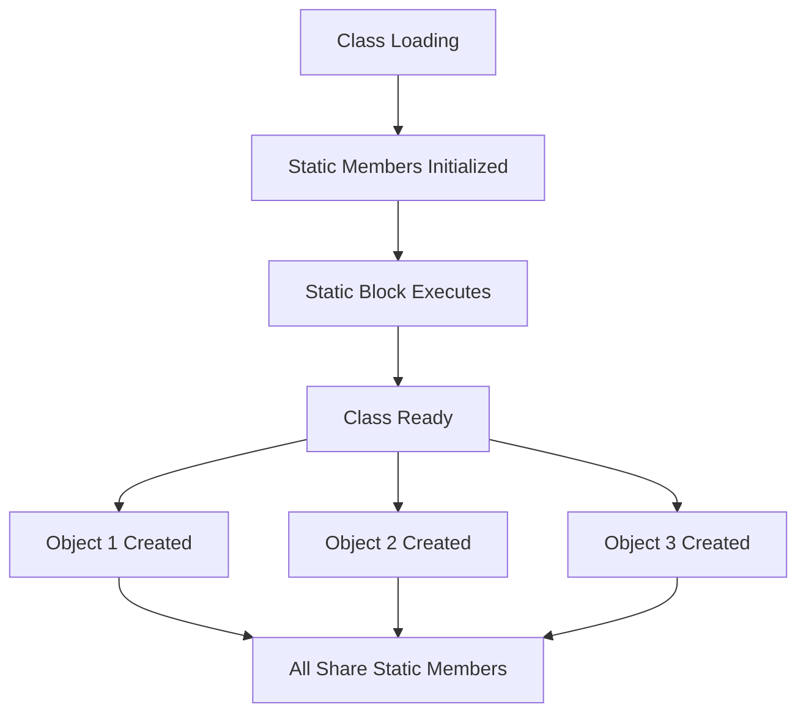

# Tutorial 08: Static Variables and Methods - Understanding Class-Level Members

## Table of Contents
- [Introduction](#introduction)
- [Prerequisites](#prerequisites)
- [What is the Static Keyword?](#what-is-the-static-keyword)
- [Static Variables (Class Variables)](#static-variables-class-variables)
- [Static Methods](#static-methods)
- [Static Blocks](#static-blocks)
- [Static Import](#static-import)
- [When to Use Static](#when-to-use-static)
- [Memory Management](#memory-management)
- [Scope and Lifetime](#scope-and-lifetime)
- [Common Pitfalls](#common-pitfalls)
- [Best Practices](#best-practices)
- [Real-World Applications](#real-world-applications)
- [Interview Questions & Answers](#interview-questions--answers)
- [Practice Exercises](#practice-exercises)
- [Summary](#summary)
- [What's Next?](#whats-next)
- [Video Index](#video-index)
- [Further Reading](#further-reading)

---

## Introduction

The **`static` keyword** in Java is one of the most important and frequently used keywords. It fundamentally changes how variables and methods behave, making them belong to the **class itself** rather than to individual objects.

### Why Static Matters

```
Instance-Level (Non-Static):
┌─────────────────────────────────┐
│  Object 1                       │
│  ┌─────────────┐                │
│  │ count: 1    │                │
│  └─────────────┘                │
└─────────────────────────────────┘
┌─────────────────────────────────┐
│  Object 2                       │
│  ┌─────────────┐                │
│  │ count: 1    │  Each has own  │
│  └─────────────┘                │
└─────────────────────────────────┘

Class-Level (Static):
┌─────────────────────────────────┐
│  Class                          │
│  ┌─────────────┐                │
│  │ count: 2    │  Shared by all │
│  └─────────────┘                │
└─────────────────────────────────┘
      ▲           ▲
      │           │
  Object 1    Object 2
```

### Topics Covered

1. **Static Variables** - Shared across all instances
2. **Static Methods** - Called without creating objects
3. **Static Blocks** - Class initialization
4. **Static Import** - Direct access to static members
5. **Memory Management** - Where static members reside
6. **Best Practices** - When and when not to use static

---

## Prerequisites

Before learning about static members, you should understand:

- **Classes and Objects**: Object creation and instantiation
- **Instance Variables**: Non-static fields
- **Methods**: Instance and class methods
- **Scope**: Variable visibility and lifetime
- **Memory Structure**: Stack, heap, and method area

**Quick Recap:**
```java
public class Example {
    int instanceVar;        // Instance variable (per object)
    static int staticVar;   // Static variable (per class)
    
    void instanceMethod() { }  // Instance method
    static void staticMethod() { }  // Static method
}
```

---

## What is the Static Keyword?

### Definition

The **`static` keyword** indicates that a particular member (variable or method) belongs to the **class itself**, rather than to instances of the class.

```java
public class Counter {
    // Instance variable - each object has its own copy
    int instanceCount = 0;
    
    // Static variable - one copy shared by all objects
    static int staticCount = 0;
    
    public Counter() {
        instanceCount++;
        staticCount++;
    }
}
```

### Key Characteristics

```
┌────────────────────────────────────────┐
│      STATIC vs NON-STATIC              │
├────────────────────────────────────────┤
│ Static Members:                        │
│ • Belong to class, not objects         │
│ • Shared across all instances          │
│ • Accessed via class name              │
│ • Loaded when class is loaded          │
│ • Exist even if no objects created     │
│ • One copy per class                   │
│                                        │
│ Non-Static Members:                    │
│ • Belong to individual objects         │
│ • Separate copy per instance           │
│ • Accessed via object reference        │
│ • Created when object is created       │
│ • Require object to exist              │
│ • Multiple copies (one per object)     │
└────────────────────────────────────────┘
```

### Visual Representation



---

## Static Variables (Class Variables)

### What are Static Variables?

**Static variables** (also called **class variables**) are variables declared with the `static` keyword. They are shared by all instances of the class.

```java
public class Student {
    // Instance variable - each student has own name
    String name;
    
    // Static variable - shared across all students
    static int totalStudents = 0;
    
    public Student(String name) {
        this.name = name;
        totalStudents++;  // Shared counter
    }
}
```

### Characteristics of Static Variables

```
┌────────────────────────────────────────┐
│    STATIC VARIABLE PROPERTIES          │
├────────────────────────────────────────┤
│ • One copy per class                   │
│ • Shared by all instances              │
│ • Initialized when class loads         │
│ • Exist without object creation        │
│ • Stored in method area (not heap)     │
│ • Accessed via class name              │
│ • Can be accessed via object too       │
│ • Default values if not initialized    │
└────────────────────────────────────────┘
```

### Example 1: Counter Application

```java
public class Counter {
    // Static variable - shared by all Counter objects
    static int count = 0;
    
    // Instance variable - each Counter has its own
    int instanceId;
    
    public Counter() {
        count++;  // Increment shared counter
        instanceId = count;  // Assign unique ID
    }
    
    public void displayInfo() {
        System.out.println("Instance ID: " + instanceId);
        System.out.println("Total instances: " + count);
    }
    
    public static void main(String[] args) {
        Counter c1 = new Counter();
        Counter c2 = new Counter();
        Counter c3 = new Counter();
        
        System.out.println("Counter 1:");
        c1.displayInfo();
        
        System.out.println("\nCounter 2:");
        c2.displayInfo();
        
        System.out.println("\nCounter 3:");
        c3.displayInfo();
        
        // Accessing static variable via class name
        System.out.println("\nTotal via class: " + Counter.count);
    }
}
```

**Output:**
```
Counter 1:
Instance ID: 1
Total instances: 3

Counter 2:
Instance ID: 2
Total instances: 3

Counter 3:
Instance ID: 3
Total instances: 3

Total via class: 3
```

### Example 2: Bank Account with Static Interest Rate

```java
public class BankAccount {
    // Instance variables
    private String accountNumber;
    private String holder;
    private double balance;
    
    // Static variable - shared interest rate for all accounts
    private static double interestRate = 3.5;
    
    // Static variable - total accounts created
    private static int totalAccounts = 0;
    
    public BankAccount(String accountNumber, String holder, double balance) {
        this.accountNumber = accountNumber;
        this.holder = holder;
        this.balance = balance;
        totalAccounts++;
    }
    
    public void applyInterest() {
        double interest = balance * (interestRate / 100);
        balance += interest;
        System.out.printf("Interest applied: $%.2f (Rate: %.2f%%)\n", 
                         interest, interestRate);
    }
    
    // Static method to change interest rate for ALL accounts
    public static void setInterestRate(double newRate) {
        interestRate = newRate;
        System.out.println("Interest rate updated to: " + newRate + "%");
    }
    
    public static int getTotalAccounts() {
        return totalAccounts;
    }
    
    public void display() {
        System.out.printf("Account: %s, Holder: %s, Balance: $%.2f\n",
                         accountNumber, holder, balance);
    }
    
    public static void main(String[] args) {
        BankAccount acc1 = new BankAccount("ACC001", "Alice", 1000);
        BankAccount acc2 = new BankAccount("ACC002", "Bob", 2000);
        
        System.out.println("Initial state:");
        acc1.display();
        acc2.display();
        System.out.println("Total accounts: " + BankAccount.getTotalAccounts());
        
        System.out.println("\nApplying interest at 3.5%:");
        acc1.applyInterest();
        acc2.applyInterest();
        
        System.out.println("\nChanging interest rate to 4.5%:");
        BankAccount.setInterestRate(4.5);
        
        System.out.println("\nApplying new interest rate:");
        acc1.applyInterest();
        acc2.applyInterest();
        
        System.out.println("\nFinal state:");
        acc1.display();
        acc2.display();
    }
}
```

### Accessing Static Variables

```java
public class AccessDemo {
    static int staticVar = 100;
    int instanceVar = 200;
    
    public static void main(String[] args) {
        // Accessing static variable via class name (preferred)
        System.out.println("Via class: " + AccessDemo.staticVar);
        
        // Accessing via object reference (allowed but not recommended)
        AccessDemo obj = new AccessDemo();
        System.out.println("Via object: " + obj.staticVar);
        
        // Modifying static variable affects all instances
        AccessDemo obj1 = new AccessDemo();
        AccessDemo obj2 = new AccessDemo();
        
        System.out.println("obj1.staticVar: " + obj1.staticVar);  // 100
        System.out.println("obj2.staticVar: " + obj2.staticVar);  // 100
        
        obj1.staticVar = 500;  // Change via obj1
        
        System.out.println("After obj1.staticVar = 500:");
        System.out.println("obj1.staticVar: " + obj1.staticVar);  // 500
        System.out.println("obj2.staticVar: " + obj2.staticVar);  // 500 (affected!)
        System.out.println("AccessDemo.staticVar: " + AccessDemo.staticVar);  // 500
    }
}
```

---

## Static Methods

### What are Static Methods?

**Static methods** belong to the class rather than to any specific instance. They can be called without creating an object of the class.

```java
public class MathUtils {
    // Static method - can be called without object
    public static int add(int a, int b) {
        return a + b;
    }
    
    public static void main(String[] args) {
        // Call static method using class name
        int result = MathUtils.add(5, 3);
        System.out.println("Result: " + result);
    }
}
```

### Characteristics of Static Methods

```
┌────────────────────────────────────────┐
│     STATIC METHOD PROPERTIES           │
├────────────────────────────────────────┤
│ • Called via class name                │
│ • No object required                   │
│ • Can only access static members       │
│ • Cannot use 'this' keyword            │
│ • Cannot use 'super' keyword           │
│ • Cannot be overridden (hidden)        │
│ • Can be overloaded                    │
│ • Loaded when class is loaded          │
└────────────────────────────────────────┘
```

### Restrictions on Static Methods

```java
public class StaticRestrictions {
    int instanceVar = 10;
    static int staticVar = 20;
    
    // Static method
    public static void staticMethod() {
        // ✓ Can access static variables
        System.out.println("Static var: " + staticVar);
        
        // ✓ Can call other static methods
        staticMethod2();
        
        // ✗ CANNOT access instance variables directly
        // System.out.println(instanceVar);  // ERROR
        
        // ✗ CANNOT use 'this' keyword
        // System.out.println(this.instanceVar);  // ERROR
        
        // ✓ CAN access instance variables via object
        StaticRestrictions obj = new StaticRestrictions();
        System.out.println("Instance var via object: " + obj.instanceVar);
    }
    
    public static void staticMethod2() {
        System.out.println("Static method 2");
    }
    
    // Instance method
    public void instanceMethod() {
        // ✓ Can access both static and instance members
        System.out.println("Instance var: " + instanceVar);
        System.out.println("Static var: " + staticVar);
        
        // ✓ Can call both static and instance methods
        staticMethod();
        instanceMethod2();
    }
    
    public void instanceMethod2() {
        System.out.println("Instance method 2");
    }
}
```

### Example: Utility Class with Static Methods

```java
public class StringUtils {
    // Private constructor to prevent instantiation
    private StringUtils() {
        throw new AssertionError("Utility class - do not instantiate");
    }
    
    // Static utility methods
    public static boolean isEmpty(String str) {
        return str == null || str.trim().isEmpty();
    }
    
    public static String reverse(String str) {
        if (isEmpty(str)) return str;
        return new StringBuilder(str).reverse().toString();
    }
    
    public static int countVowels(String str) {
        if (isEmpty(str)) return 0;
        
        int count = 0;
        String vowels = "aeiouAEIOU";
        for (char c : str.toCharArray()) {
            if (vowels.indexOf(c) != -1) {
                count++;
            }
        }
        return count;
    }
    
    public static String capitalize(String str) {
        if (isEmpty(str)) return str;
        return str.substring(0, 1).toUpperCase() + str.substring(1).toLowerCase();
    }
    
    public static void main(String[] args) {
        // Using static methods without creating object
        String text = "hello world";
        
        System.out.println("Original: " + text);
        System.out.println("Reversed: " + StringUtils.reverse(text));
        System.out.println("Vowels: " + StringUtils.countVowels(text));
        System.out.println("Capitalized: " + StringUtils.capitalize(text));
        System.out.println("Is empty: " + StringUtils.isEmpty(text));
    }
}
```

### Example: Factory Pattern with Static Method

```java
public class DatabaseConnection {
    private String url;
    private String username;
    
    // Private constructor
    private DatabaseConnection(String url, String username) {
        this.url = url;
        this.username = username;
    }
    
    // Static factory method
    public static DatabaseConnection createMySQLConnection(String database) {
        String url = "jdbc:mysql://localhost:3306/" + database;
        return new DatabaseConnection(url, "root");
    }
    
    public static DatabaseConnection createPostgreSQLConnection(String database) {
        String url = "jdbc:postgresql://localhost:5432/" + database;
        return new DatabaseConnection(url, "postgres");
    }
    
    public void connect() {
        System.out.println("Connecting to: " + url);
        System.out.println("Username: " + username);
    }
    
    public static void main(String[] args) {
        DatabaseConnection mysql = DatabaseConnection.createMySQLConnection("mydb");
        DatabaseConnection postgres = DatabaseConnection.createPostgreSQLConnection("mydb");
        
        System.out.println("MySQL Connection:");
        mysql.connect();
        
        System.out.println("\nPostgreSQL Connection:");
        postgres.connect();
    }
}
```

### Main Method - A Special Static Method

```java
public class MainMethod {
    // The main method is static
    public static void main(String[] args) {
        System.out.println("Main method is static");
        System.out.println("Can be called without creating object");
        
        // Can access static members
        staticMethod();
        
        // Need object to access instance members
        MainMethod obj = new MainMethod();
        obj.instanceMethod();
    }
    
    public static void staticMethod() {
        System.out.println("Static method");
    }
    
    public void instanceMethod() {
        System.out.println("Instance method");
    }
}
```

---

## Static Blocks

### What are Static Blocks?

**Static blocks** (or **static initializer blocks**) are used to initialize static variables or perform one-time class-level initialization.

```java
public class StaticBlockDemo {
    static int value;
    
    // Static block - executes when class is loaded
    static {
        System.out.println("Static block executed");
        value = 100;
    }
    
    public static void main(String[] args) {
        System.out.println("Main method");
        System.out.println("Value: " + value);
    }
}
```

**Output:**
```
Static block executed
Main method
Value: 100
```

### Multiple Static Blocks

```java
public class MultipleStaticBlocks {
    static int x;
    static int y;
    
    // First static block
    static {
        System.out.println("First static block");
        x = 10;
    }
    
    // Second static block
    static {
        System.out.println("Second static block");
        y = 20;
    }
    
    // Third static block
    static {
        System.out.println("Third static block");
        System.out.println("x = " + x + ", y = " + y);
    }
    
    public static void main(String[] args) {
        System.out.println("Main method");
    }
}
```

**Output:**
```
First static block
Second static block
Third static block
x = 10, y = 20
Main method
```

### Execution Order: Static vs Instance

```java
public class ExecutionOrder {
    static int staticVar = initStaticVar();
    int instanceVar = initInstanceVar();
    
    // Static block
    static {
        System.out.println("1. Static block");
    }
    
    // Instance block
    {
        System.out.println("3. Instance block");
    }
    
    // Constructor
    public ExecutionOrder() {
        System.out.println("4. Constructor");
    }
    
    // Static variable initializer
    static int initStaticVar() {
        System.out.println("0. Static variable initializer");
        return 100;
    }
    
    // Instance variable initializer
    int initInstanceVar() {
        System.out.println("2. Instance variable initializer");
        return 200;
    }
    
    public static void main(String[] args) {
        System.out.println("\n=== Creating first object ===");
        ExecutionOrder obj1 = new ExecutionOrder();
        
        System.out.println("\n=== Creating second object ===");
        ExecutionOrder obj2 = new ExecutionOrder();
    }
}
```

**Output:**
```
0. Static variable initializer
1. Static block

=== Creating first object ===
2. Instance variable initializer
3. Instance block
4. Constructor

=== Creating second object ===
2. Instance variable initializer
3. Instance block
4. Constructor
```

### Practical Use: Database Configuration

```java
public class DatabaseConfig {
    private static String url;
    private static String username;
    private static String password;
    private static boolean isConfigured = false;
    
    // Static block for configuration
    static {
        System.out.println("Loading database configuration...");
        try {
            // Simulate loading from properties file
            url = "jdbc:mysql://localhost:3306/mydb";
            username = "admin";
            password = "secret";
            isConfigured = true;
            System.out.println("Configuration loaded successfully");
        } catch (Exception e) {
            System.err.println("Failed to load configuration");
            isConfigured = false;
        }
    }
    
    public static String getUrl() {
        return url;
    }
    
    public static String getUsername() {
        return username;
    }
    
    public static boolean isConfigured() {
        return isConfigured;
    }
    
    public static void main(String[] args) {
        if (DatabaseConfig.isConfigured()) {
            System.out.println("\nDatabase URL: " + DatabaseConfig.getUrl());
            System.out.println("Username: " + DatabaseConfig.getUsername());
        }
    }
}
```

---

## Static Import

### What is Static Import?

**Static import** allows you to access static members of a class directly without qualifying them with the class name.

```java
// Without static import
import java.lang.Math;

public class WithoutStaticImport {
    public static void main(String[] args) {
        double result = Math.sqrt(Math.pow(3, 2) + Math.pow(4, 2));
        System.out.println("Result: " + result);
    }
}

// With static import
import static java.lang.Math.*;

public class WithStaticImport {
    public static void main(String[] args) {
        double result = sqrt(pow(3, 2) + pow(4, 2));
        System.out.println("Result: " + result);
    }
}
```

### Static Import Syntax

```java
// Import specific static member
import static package.ClassName.staticMember;

// Import all static members
import static package.ClassName.*;
```

### Example: Using Static Import

```java
// Import specific members
import static java.lang.Math.PI;
import static java.lang.Math.sqrt;
import static java.lang.Math.pow;

// Import all System.out methods
import static java.lang.System.out;

public class StaticImportExample {
    public static void main(String[] args) {
        // Use without class name prefix
        double radius = 5.0;
        double area = PI * pow(radius, 2);
        
        out.println("Radius: " + radius);
        out.println("Area: " + area);
        out.println("Circumference: " + (2 * PI * radius));
        
        double diagonal = sqrt(pow(3, 2) + pow(4, 2));
        out.println("Diagonal: " + diagonal);
    }
}
```

### When to Use Static Import

```
✓ Use Static Import When:
  • Frequently using static members from a class
  • Code becomes more readable
  • No naming conflicts
  • Working with constants (PI, E, etc.)
  • Using utility methods extensively

✗ Avoid Static Import When:
  • Multiple classes have same static member names
  • Code becomes ambiguous
  • Reduces code clarity
  • Working with unfamiliar code
  • In large codebases
```

---

## When to Use Static

### Appropriate Uses of Static

```java
public class AppropriateStatic {
    // 1. Constants
    public static final double PI = 3.14159;
    public static final int MAX_SIZE = 100;
    
    // 2. Utility methods
    public static int max(int a, int b) {
        return (a > b) ? a : b;
    }
    
    // 3. Factory methods
    public static AppropriateStatic create(String type) {
        return new AppropriateStatic();
    }
    
    // 4. Counter/shared state
    private static int instanceCount = 0;
    
    public AppropriateStatic() {
        instanceCount++;
    }
    
    public static int getInstanceCount() {
        return instanceCount;
    }
}
```

### When NOT to Use Static

```java
public class InappropriateStatic {
    // ✗ DON'T: Make everything static
    static String name;           // Should be instance variable
    static int age;               // Should be instance variable
    
    // ✗ DON'T: Use static for object-specific behavior
    static void updateName(String newName) {
        // Which object's name?
    }
    
    // ✓ DO: Use instance variables and methods
    String instanceName;
    int instanceAge;
    
    void updateInstanceName(String newName) {
        this.instanceName = newName;
    }
}
```

### Decision Matrix

| Use Case | Static? | Reason |
|----------|---------|--------|
| Mathematical constants (PI, E) | ✓ Yes | Universal values |
| Utility methods (Math.max) | ✓ Yes | No state dependency |
| Factory methods | ✓ Yes | Create instances |
| Counters across instances | ✓ Yes | Shared state |
| Configuration settings | ✓ Yes | Application-wide |
| Object-specific data | ✗ No | Belongs to instance |
| Behavior depending on state | ✗ No | Requires instance |
| Methods using instance variables | ✗ No | Needs object context |

---

## Memory Management

### Memory Allocation for Static Members

```
JVM Memory Structure:

┌─────────────────────────────────────┐
│      METHOD AREA (MetaSpace)        │
│  ┌───────────────────────────────┐  │
│  │  Class Metadata               │  │
│  │  Static Variables             │  │
│  │  Static Methods (code)        │  │
│  │  Constant Pool                │  │
│  └───────────────────────────────┘  │
└─────────────────────────────────────┘
           ▲
           │ Loaded once
           │
┌──────────┴──────────────────────────┐
│         HEAP                        │
│  ┌────────────┐  ┌────────────┐    │
│  │ Object 1   │  │ Object 2   │    │
│  │ Instance   │  │ Instance   │    │
│  │ Variables  │  │ Variables  │    │
│  └────────────┘  └────────────┘    │
└─────────────────────────────────────┘

┌─────────────────────────────────────┐
│         STACK                       │
│  ┌────────────┐                     │
│  │ Local Vars │                     │
│  │ References │                     │
│  └────────────┘                     │
└─────────────────────────────────────┘
```

### Example: Memory Demonstration

```java
public class MemoryDemo {
    // Static variable - in Method Area
    static int staticCounter = 0;
    
    // Instance variable - in Heap (per object)
    int instanceCounter = 0;
    
    public MemoryDemo() {
        staticCounter++;    // Shared counter in Method Area
        instanceCounter++;  // Individual counter in Heap
    }
    
    public void display() {
        System.out.println("Instance counter: " + instanceCounter);
        System.out.println("Static counter: " + staticCounter);
    }
    
    public static void main(String[] args) {
        System.out.println("Creating 3 objects:\n");
        
        MemoryDemo obj1 = new MemoryDemo();
        System.out.println("Object 1:");
        obj1.display();
        System.out.println();
        
        MemoryDemo obj2 = new MemoryDemo();
        System.out.println("Object 2:");
        obj2.display();
        System.out.println();
        
        MemoryDemo obj3 = new MemoryDemo();
        System.out.println("Object 3:");
        obj3.display();
        
        System.out.println("\nMemory Analysis:");
        System.out.println("- 3 instance variables (one per object) in Heap");
        System.out.println("- 1 static variable (shared) in Method Area");
    }
}
```

**Output:**
```
Creating 3 objects:

Object 1:
Instance counter: 1
Static counter: 1

Object 2:
Instance counter: 1
Static counter: 2

Object 3:
Instance counter: 1
Static counter: 3

Memory Analysis:
- 3 instance variables (one per object) in Heap
- 1 static variable (shared) in Method Area
```

---

## Scope and Lifetime

### Example 1: Variable Scope

```java
public class ScopeExample1 {
    // Static variable - class scope
    static int staticVar = 100;
    
    // Instance variable - object scope
    int instanceVar = 200;
    
    public void demonstrateScope() {
        // Local variable - method scope
        int localVar = 300;
        
        System.out.println("Inside method:");
        System.out.println("  Static var: " + staticVar);
        System.out.println("  Instance var: " + instanceVar);
        System.out.println("  Local var: " + localVar);
    }
    
    public static void staticMethod() {
        // Can access static variable
        System.out.println("In static method:");
        System.out.println("  Static var: " + staticVar);
        
        // Cannot access instance variable directly
        // System.out.println(instanceVar);  // ERROR
        
        // Need object to access instance variable
        ScopeExample1 obj = new ScopeExample1();
        System.out.println("  Instance var via object: " + obj.instanceVar);
    }
    
    public static void main(String[] args) {
        ScopeExample1 obj = new ScopeExample1();
        obj.demonstrateScope();
        System.out.println();
        staticMethod();
    }
}
```

### Example 2: Complex Scope Demonstration

```java
public class ScopeExample2 {
    static int classLevel = 1;
    int objectLevel = 2;
    
    public void method1() {
        int methodLevel = 3;
        
        {
            int blockLevel = 4;
            System.out.println("Inside block:");
            System.out.println("  Block level: " + blockLevel);
            System.out.println("  Method level: " + methodLevel);
            System.out.println("  Object level: " + objectLevel);
            System.out.println("  Class level: " + classLevel);
        }
        
        // blockLevel not accessible here
        // System.out.println(blockLevel);  // ERROR
        
        System.out.println("Outside block:");
        System.out.println("  Method level: " + methodLevel);
        System.out.println("  Object level: " + objectLevel);
        System.out.println("  Class level: " + classLevel);
    }
    
    public static void main(String[] args) {
        ScopeExample2 obj = new ScopeExample2();
        obj.method1();
    }
}
```

**Output:**
```
Inside block:
  Block level: 4
  Method level: 3
  Object level: 2
  Class level: 1
Outside block:
  Method level: 3
  Object level: 2
  Class level: 1
```

### Lifetime Comparison

```
┌─────────────────────────────────────────────┐
│         VARIABLE LIFETIME                   │
├─────────────────────────────────────────────┤
│ Static Variable:                            │
│ • Created: When class is loaded             │
│ • Destroyed: When JVM shuts down            │
│ • Lifetime: Entire program execution        │
│                                             │
│ Instance Variable:                          │
│ • Created: When object is created           │
│ • Destroyed: When object is garbage         │
│   collected                                 │
│ • Lifetime: Object's lifetime               │
│                                             │
│ Local Variable:                             │
│ • Created: When method/block is entered     │
│ • Destroyed: When method/block exits        │
│ • Lifetime: Method/block execution          │
└─────────────────────────────────────────────┘
```

### Example: Lifetime Demonstration

```java
public class LifetimeDemo {
    static int staticCounter = 0;
    int instanceCounter = 0;
    
    public LifetimeDemo() {
        staticCounter++;
        instanceCounter++;
        System.out.println("Object created - Instance: " + instanceCounter + 
                         ", Static: " + staticCounter);
    }
    
    public void demonstrateLocal() {
        int localVar = 100;
        System.out.println("Local variable created: " + localVar);
        // localVar dies here when method returns
    }
    
    public static void main(String[] args) {
        System.out.println("Static counter before objects: " + staticCounter);
        
        LifetimeDemo obj1 = new LifetimeDemo();
        obj1.demonstrateLocal();
        
        LifetimeDemo obj2 = new LifetimeDemo();
        obj2.demonstrateLocal();
        
        obj1 = null;  // obj1 eligible for garbage collection
        
        LifetimeDemo obj3 = new LifetimeDemo();
        
        System.out.println("\nStatic counter persists: " + staticCounter);
    }
}
```

---

## Common Pitfalls

### Pitfall 1: Confusing Static and Instance Members

```java
public class Pitfall1 {
    static int staticVar = 10;
    int instanceVar = 20;
    
    // ✗ WRONG: Static method accessing instance variable
    public static void wrongMethod() {
        // System.out.println(instanceVar);  // ERROR
    }
    
    // ✓ CORRECT: Use object to access instance variable
    public static void correctMethod() {
        Pitfall1 obj = new Pitfall1();
        System.out.println(obj.instanceVar);
    }
}
```

### Pitfall 2: Shared State Bugs

```java
public class Pitfall2 {
    static int sharedCounter = 0;
    
    public void increment() {
        sharedCounter++;
    }
    
    public static void main(String[] args) {
        Pitfall2 obj1 = new Pitfall2();
        Pitfall2 obj2 = new Pitfall2();
        
        obj1.increment();  // sharedCounter = 1
        obj2.increment();  // sharedCounter = 2 (not 1!)
        
        System.out.println("Counter: " + sharedCounter);  // 2
        
        // Both objects affected by the change!
    }
}
```

### Pitfall 3: Static Method Hiding (Not Overriding)

```java
class Parent {
    public static void staticMethod() {
        System.out.println("Parent static method");
    }
}

class Child extends Parent {
    // This HIDES, not overrides
    public static void staticMethod() {
        System.out.println("Child static method");
    }
}

public class Pitfall3 {
    public static void main(String[] args) {
        Parent p = new Child();
        p.staticMethod();  // Calls Parent's method!
        
        Child c = new Child();
        c.staticMethod();  // Calls Child's method
    }
}
```

**Output:**
```
Parent static method
Child static method
```

### Pitfall 4: Thread Safety Issues

```java
public class Pitfall4 {
    static int unsafeCounter = 0;
    
    public static void increment() {
        // NOT thread-safe!
        unsafeCounter++;
    }
    
    // ✓ CORRECT: Use synchronization
    public static synchronized void safeIncrement() {
        unsafeCounter++;
    }
}
```

### Pitfall 5: Initialization Order Issues

```java
public class Pitfall5 {
    // ✗ WRONG: Using static variable before initialization
    static int value1 = value2 + 10;  // value2 is 0 here!
    static int value2 = 20;
    
    static {
        System.out.println("value1: " + value1);  // 10 (not 30!)
        System.out.println("value2: " + value2);  // 20
    }
    
    public static void main(String[] args) {
        // Already executed
    }
}
```

### Pitfall 6: Memory Leaks with Static References

```java
public class Pitfall6 {
    // ✗ PROBLEMATIC: Static collection holding objects
    static List<LargeObject> cache = new ArrayList<>();
    
    public static void addToCache(LargeObject obj) {
        cache.add(obj);
        // Objects never removed - memory leak!
    }
    
    // ✓ BETTER: Provide cleanup mechanism
    public static void clearCache() {
        cache.clear();
    }
}
```

---

## Best Practices

### 1. Use Static for Constants

```java
public class BestPractice1 {
    // ✓ GOOD: Constants as static final
    public static final double PI = 3.14159;
    public static final int MAX_SIZE = 100;
    public static final String APP_NAME = "MyApp";
    
    // ✓ GOOD: Complex constants
    public static final List<String> VALID_TYPES = 
        Collections.unmodifiableList(Arrays.asList("A", "B", "C"));
}
```

### 2. Use Static for Utility Methods

```java
public class BestPractice2 {
    // Private constructor to prevent instantiation
    private BestPractice2() {
        throw new AssertionError("Utility class");
    }
    
    // ✓ GOOD: Stateless utility methods
    public static int max(int a, int b) {
        return (a > b) ? a : b;
    }
    
    public static boolean isValidEmail(String email) {
        return email != null && email.contains("@");
    }
}
```

### 3. Prefer Instance Variables When Appropriate

```java
public class BestPractice3 {
    // ✓ GOOD: Instance variable for object-specific data
    private String name;
    private int age;
    
    // ✓ GOOD: Static for shared configuration
    private static final int MIN_AGE = 18;
    private static final int MAX_AGE = 100;
    
    public boolean isValidAge() {
        return age >= MIN_AGE && age <= MAX_AGE;
    }
}
```

### 4. Use Static Blocks for Complex Initialization

```java
public class BestPractice4 {
    private static final Map<String, Integer> CONFIG;
    
    // ✓ GOOD: Complex initialization in static block
    static {
        Map<String, Integer> temp = new HashMap<>();
        temp.put("timeout", 30);
        temp.put("retries", 3);
        temp.put("poolSize", 10);
        CONFIG = Collections.unmodifiableMap(temp);
    }
}
```

### 5. Document Thread Safety

```java
public class BestPractice5 {
    /**
     * Thread-safe counter using synchronization.
     * All methods are synchronized for thread safety.
     */
    private static int counter = 0;
    
    // ✓ GOOD: Synchronized access to shared state
    public static synchronized void increment() {
        counter++;
    }
    
    public static synchronized int getCount() {
        return counter;
    }
}
```

### 6. Avoid Mutable Static Fields

```java
public class BestPractice6 {
    // ✗ BAD: Mutable static field
    public static List<String> items = new ArrayList<>();
    
    // ✓ BETTER: Immutable or encapsulated
    private static final List<String> ITEMS = new ArrayList<>();
    
    public static List<String> getItems() {
        return Collections.unmodifiableList(ITEMS);
    }
    
    public static void addItem(String item) {
        ITEMS.add(item);
    }
}
```

### 7. Use Static Import Wisely

```java
// ✓ GOOD: For frequently used constants
import static java.lang.Math.PI;
import static java.lang.Math.sqrt;

public class BestPractice7 {
    public double calculateArea(double radius) {
        return PI * radius * radius;
    }
    
    public double calculateDistance(double x, double y) {
        return sqrt(x * x + y * y);
    }
}
```

---

## Real-World Applications

### Application 1: Configuration Manager

```java
public class ConfigurationManager {
    // Singleton instance
    private static ConfigurationManager instance;
    
    // Configuration properties
    private static final Properties properties = new Properties();
    
    // Static block for loading configuration
    static {
        try {
            properties.load(new FileInputStream("config.properties"));
            System.out.println("Configuration loaded successfully");
        } catch (IOException e) {
            System.err.println("Failed to load configuration: " + e.getMessage());
        }
    }
    
    // Private constructor for singleton
    private ConfigurationManager() { }
    
    // Singleton getter
    public static synchronized ConfigurationManager getInstance() {
        if (instance == null) {
            instance = new ConfigurationManager();
        }
        return instance;
    }
    
    // Configuration access methods
    public static String getProperty(String key) {
        return properties.getProperty(key);
    }
    
    public static String getProperty(String key, String defaultValue) {
        return properties.getProperty(key, defaultValue);
    }
    
    public static int getIntProperty(String key, int defaultValue) {
        String value = properties.getProperty(key);
        try {
            return value != null ? Integer.parseInt(value) : defaultValue;
        } catch (NumberFormatException e) {
            return defaultValue;
        }
    }
}
```

### Application 2: Logger Utility

```java
public class Logger {
    private static final String LOG_FILE = "application.log";
    private static PrintWriter writer;
    
    // Log levels
    public static final int DEBUG = 1;
    public static final int INFO = 2;
    public static final int WARNING = 3;
    public static final int ERROR = 4;
    
    private static int currentLevel = INFO;
    
    // Initialize logger
    static {
        try {
            writer = new PrintWriter(new FileWriter(LOG_FILE, true));
            log(INFO, "Logger initialized");
        } catch (IOException e) {
            System.err.println("Failed to initialize logger: " + e.getMessage());
        }
    }
    
    // Private constructor
    private Logger() { }
    
    // Set log level
    public static void setLevel(int level) {
        currentLevel = level;
    }
    
    // Log method
    public static void log(int level, String message) {
        if (level >= currentLevel) {
            String timestamp = new SimpleDateFormat("yyyy-MM-dd HH:mm:ss").format(new Date());
            String levelStr = getLevelString(level);
            String logEntry = String.format("[%s] [%s] %s", timestamp, levelStr, message);
            
            System.out.println(logEntry);
            if (writer != null) {
                writer.println(logEntry);
                writer.flush();
            }
        }
    }
    
    private static String getLevelString(int level) {
        switch (level) {
            case DEBUG: return "DEBUG";
            case INFO: return "INFO";
            case WARNING: return "WARNING";
            case ERROR: return "ERROR";
            default: return "UNKNOWN";
        }
    }
    
    // Convenience methods
    public static void debug(String message) { log(DEBUG, message); }
    public static void info(String message) { log(INFO, message); }
    public static void warning(String message) { log(WARNING, message); }
    public static void error(String message) { log(ERROR, message); }
    
    // Cleanup
    public static void close() {
        if (writer != null) {
            writer.close();
        }
    }
}
```

### Application 3: ID Generator

```java
public class IDGenerator {
    private static long currentId = 0;
    private static final Object lock = new Object();
    
    // Private constructor
    private IDGenerator() { }
    
    // Thread-safe ID generation
    public static long generateID() {
        synchronized (lock) {
            return ++currentId;
        }
    }
    
    // Generate multiple IDs
    public static List<Long> generateIDs(int count) {
        List<Long> ids = new ArrayList<>();
        synchronized (lock) {
            for (int i = 0; i < count; i++) {
                ids.add(++currentId);
            }
        }
        return ids;
    }
    
    // Get current ID without incrementing
    public static long getCurrentID() {
        synchronized (lock) {
            return currentId;
        }
    }
    
    // Reset (for testing)
    public static void reset() {
        synchronized (lock) {
            currentId = 0;
        }
    }
}
```

### Application 4: Database Connection Pool

```java
public class ConnectionPool {
    private static final int MAX_CONNECTIONS = 10;
    private static Queue<Connection> availableConnections = new LinkedList<>();
    private static Set<Connection> usedConnections = new HashSet<>();
    
    // Initialize pool
    static {
        try {
            for (int i = 0; i < MAX_CONNECTIONS; i++) {
                availableConnections.add(createConnection());
            }
            System.out.println("Connection pool initialized with " + MAX_CONNECTIONS + " connections");
        } catch (SQLException e) {
            System.err.println("Failed to initialize connection pool: " + e.getMessage());
        }
    }
    
    // Private constructor
    private ConnectionPool() { }
    
    private static Connection createConnection() throws SQLException {
        // Create actual database connection
        return DriverManager.getConnection("jdbc:mysql://localhost:3306/mydb", "user", "pass");
    }
    
    // Get connection from pool
    public static synchronized Connection getConnection() throws SQLException {
        if (availableConnections.isEmpty()) {
            if (usedConnections.size() < MAX_CONNECTIONS) {
                availableConnections.add(createConnection());
            } else {
                throw new SQLException("Maximum pool size reached");
            }
        }
        
        Connection connection = availableConnections.poll();
        usedConnections.add(connection);
        return connection;
    }
    
    // Return connection to pool
    public static synchronized void releaseConnection(Connection connection) {
        if (usedConnections.remove(connection)) {
            availableConnections.add(connection);
        }
    }
    
    // Get pool statistics
    public static synchronized String getStats() {
        return String.format("Available: %d, In Use: %d, Total: %d",
                           availableConnections.size(),
                           usedConnections.size(),
                           availableConnections.size() + usedConnections.size());
    }
}
```

---

## Interview Questions & Answers

### Q1: What is the static keyword in Java?

**Answer:**
The `static` keyword indicates that a member (variable or method) belongs to the class itself rather than to instances of the class. Static members are:
- Shared across all instances
- Loaded when the class is loaded
- Accessible without creating objects
- Stored in method area (not heap)

**Example:**
```java
class Counter {
    static int count = 0;  // Class variable
    int id;                 // Instance variable
    
    Counter() {
        count++;           // Shared
        id = count;        // Per object
    }
}
```

### Q2: Can we override static methods in Java?

**Answer:**
No, static methods cannot be overridden. They can be **hidden** but not overridden. This is because:
- Static methods belong to the class, not objects
- Method overriding is based on runtime polymorphism
- Static method calls are resolved at compile-time

**Example:**
```java
class Parent {
    static void display() {
        System.out.println("Parent");
    }
}

class Child extends Parent {
    static void display() {  // Hiding, not overriding
        System.out.println("Child");
    }
}

// Usage
Parent p = new Child();
p.display();  // Outputs: Parent (not Child!)
```

### Q3: Why is the main method static?

**Answer:**
The main method is static because:
1. **JVM needs to call it without creating objects** - The JVM can invoke `main()` before any objects are created
2. **Entry point** - It's the starting point of the program
3. **No object dependency** - It makes sense to start execution without requiring an instance
4. **Consistency** - All Java applications have the same entry point

**Example:**
```java
public class MainExample {
    // Static - JVM can call without creating MainExample object
    public static void main(String[] args) {
        System.out.println("Program starts here");
        
        // Now we can create objects
        MainExample obj = new MainExample();
    }
}
```

### Q4: Can we have a static block in Java? What is its purpose?

**Answer:**
Yes, static blocks are used for:
- **Complex static variable initialization**
- **Loading native libraries**
- **Registering JDBC drivers**
- **One-time class-level setup**

**Characteristics:**
- Executed when class is loaded
- Executed before main method
- Can have multiple static blocks
- Execute in order of appearance

**Example:**
```java
public class StaticBlockExample {
    static int value;
    static String config;
    
    static {
        System.out.println("Static block 1");
        value = 100;
    }
    
    static {
        System.out.println("Static block 2");
        config = "Production";
    }
    
    public static void main(String[] args) {
        System.out.println("Main method");
        System.out.println("Value: " + value);
        System.out.println("Config: " + config);
    }
}
```

### Q5: Can we use this keyword in a static method?

**Answer:**
No, we cannot use `this` in static methods because:
- `this` refers to the current object instance
- Static methods belong to the class, not objects
- There's no "current object" context in static methods

**Example:**
```java
class Example {
    int instanceVar = 10;
    static int staticVar = 20;
    
    public static void staticMethod() {
        // System.out.println(this.instanceVar);  // ERROR
        System.out.println(staticVar);  // OK
        
        // Need object to access instance members
        Example obj = new Example();
        System.out.println(obj.instanceVar);  // OK
    }
}
```

### Q6: Difference between static and non-static methods?

**Answer:**

| Feature | Static Methods | Non-Static Methods |
|---------|---------------|-------------------|
| Belongs to | Class | Object |
| Access | ClassName.method() | object.method() |
| Object required | No | Yes |
| Can access | Static members only | All members |
| this keyword | Cannot use | Can use |
| Memory | Method Area | Heap (object data) |
| Inheritance | Hidden (not overridden) | Overridden |

**Example:**
```java
class MethodTypes {
    static int staticVar = 10;
    int instanceVar = 20;
    
    // Static method
    public static void staticMethod() {
        System.out.println(staticVar);     // OK
        // System.out.println(instanceVar); // ERROR
    }
    
    // Non-static method
    public void instanceMethod() {
        System.out.println(staticVar);    // OK
        System.out.println(instanceVar);  // OK
    }
}
```

### Q7: Can we declare a class as static?

**Answer:**
We can declare **nested classes** as static, but not top-level classes.

**Static Nested Class:**
```java
class Outer {
    static int outerStatic = 10;
    int outerInstance = 20;
    
    // Static nested class
    static class StaticNested {
        void display() {
            System.out.println(outerStatic);     // OK
            // System.out.println(outerInstance); // ERROR
            
            // Need Outer instance
            Outer outer = new Outer();
            System.out.println(outer.outerInstance);  // OK
        }
    }
}

// Usage
Outer.StaticNested nested = new Outer.StaticNested();
```

### Q8: What happens when we declare a variable as static final?

**Answer:**
`static final` creates a **constant**:
- `static` - One copy shared by all
- `final` - Cannot be changed after initialization
- Must be initialized at declaration or in static block
- By convention, named in UPPER_CASE

**Example:**
```java
public class Constants {
    // Static final - constant
    public static final double PI = 3.14159;
    public static final int MAX_SIZE = 100;
    
    // Can initialize in static block
    public static final String APP_NAME;
    
    static {
        APP_NAME = "MyApplication";
    }
    
    public static void main(String[] args) {
        System.out.println(PI);
        // PI = 3.14;  // ERROR - cannot modify
    }
}
```

### Q9: Can static variables be serialized?

**Answer:**
No, static variables are **not serialized** because:
- Serialization is per-object
- Static variables belong to the class, not objects
- They exist in method area, not heap
- Their state is class-level, not object-level

**Example:**
```java
class SerializationExample implements Serializable {
    static int staticVar = 100;
    int instanceVar = 200;
    
    // Only instanceVar will be serialized
    // staticVar won't be part of serialized data
}
```

### Q10: What is static import and when should we use it?

**Answer:**
Static import allows direct access to static members without class name qualification.

**Syntax:**
```java
import static package.ClassName.staticMember;
import static package.ClassName.*;
```

**When to use:**
- Frequently used constants (Math.PI, Math.E)
- Utility methods used extensively
- When it improves readability
- No naming conflicts

**Example:**
```java
// Without static import
import java.lang.Math;

public class WithoutStaticImport {
    public double calculate() {
        return Math.sqrt(Math.pow(3, 2) + Math.pow(4, 2));
    }
}

// With static import
import static java.lang.Math.*;

public class WithStaticImport {
    public double calculate() {
        return sqrt(pow(3, 2) + pow(4, 2));  // Cleaner
    }
}
```

---

## Practice Exercises

### Exercise 1: Student Management System
**Problem:** Create a Student class that tracks the total number of students created and assigns unique IDs.

**Requirements:**
- Static variable for total student count
- Static variable for next available ID
- Instance variables for student details
- Static method to get statistics

<details>
<summary>Solution</summary>

```java
public class Student {
    // Static variables
    private static int totalStudents = 0;
    private static int nextId = 1000;
    
    // Instance variables
    private int id;
    private String name;
    private double gpa;
    
    // Constructor
    public Student(String name, double gpa) {
        this.id = nextId++;
        this.name = name;
        this.gpa = gpa;
        totalStudents++;
    }
    
    // Static method for statistics
    public static String getStatistics() {
        return String.format("Total Students: %d, Next ID: %d", 
                           totalStudents, nextId);
    }
    
    // Instance method
    public void display() {
        System.out.printf("ID: %d, Name: %s, GPA: %.2f\n", 
                         id, name, gpa);
    }
    
    public static void main(String[] args) {
        System.out.println("Initial: " + Student.getStatistics());
        
        Student s1 = new Student("Alice", 3.8);
        Student s2 = new Student("Bob", 3.5);
        Student s3 = new Student("Charlie", 3.9);
        
        s1.display();
        s2.display();
        s3.display();
        
        System.out.println("Final: " + Student.getStatistics());
    }
}
```
</details>

### Exercise 2: Temperature Converter Utility
**Problem:** Create a utility class with static methods to convert between Celsius, Fahrenheit, and Kelvin.

**Requirements:**
- Private constructor (utility class)
- Static methods for all conversions
- Static constants for absolute zero

<details>
<summary>Solution</summary>

```java
public class TemperatureConverter {
    // Constants
    private static final double ABSOLUTE_ZERO_C = -273.15;
    private static final double ABSOLUTE_ZERO_F = -459.67;
    private static final double ABSOLUTE_ZERO_K = 0;
    
    // Private constructor
    private TemperatureConverter() {
        throw new AssertionError("Utility class - do not instantiate");
    }
    
    // Celsius conversions
    public static double celsiusToFahrenheit(double celsius) {
        return (celsius * 9/5) + 32;
    }
    
    public static double celsiusToKelvin(double celsius) {
        return celsius + 273.15;
    }
    
    // Fahrenheit conversions
    public static double fahrenheitToCelsius(double fahrenheit) {
        return (fahrenheit - 32) * 5/9;
    }
    
    public static double fahrenheitToKelvin(double fahrenheit) {
        return celsiusToKelvin(fahrenheitToCelsius(fahrenheit));
    }
    
    // Kelvin conversions
    public static double kelvinToCelsius(double kelvin) {
        return kelvin - 273.15;
    }
    
    public static double kelvinToFahrenheit(double kelvin) {
        return celsiusToFahrenheit(kelvinToCelsius(kelvin));
    }
    
    // Validation
    public static boolean isValidCelsius(double celsius) {
        return celsius >= ABSOLUTE_ZERO_C;
    }
    
    public static boolean isValidFahrenheit(double fahrenheit) {
        return fahrenheit >= ABSOLUTE_ZERO_F;
    }
    
    public static boolean isValidKelvin(double kelvin) {
        return kelvin >= ABSOLUTE_ZERO_K;
    }
    
    public static void main(String[] args) {
        double celsius = 25;
        System.out.println(celsius + "°C = " + 
                         celsiusToFahrenheit(celsius) + "°F");
        System.out.println(celsius + "°C = " + 
                         celsiusToKelvin(celsius) + "K");
        
        System.out.println("Valid: " + isValidCelsius(-300));  // false
    }
}
```
</details>

### Exercise 3: Counter with Reset Tracking
**Problem:** Create a Counter class that tracks how many times it has been reset using a static variable.

**Requirements:**
- Instance variable for count
- Static variable for reset count
- Instance methods: increment, decrement, reset
- Static method to get total resets

<details>
<summary>Solution</summary>

```java
public class Counter {
    // Static variable
    private static int totalResets = 0;
    
    // Instance variable
    private int count;
    
    public Counter() {
        this.count = 0;
    }
    
    public Counter(int initialValue) {
        this.count = initialValue;
    }
    
    public void increment() {
        count++;
    }
    
    public void decrement() {
        count--;
    }
    
    public void reset() {
        count = 0;
        totalResets++;
    }
    
    public int getCount() {
        return count;
    }
    
    public static int getTotalResets() {
        return totalResets;
    }
    
    public void display() {
        System.out.println("Count: " + count + 
                         ", Total Resets (all counters): " + totalResets);
    }
    
    public static void main(String[] args) {
        Counter c1 = new Counter(10);
        Counter c2 = new Counter(20);
        
        System.out.println("Initial state:");
        c1.display();
        c2.display();
        
        c1.increment();
        c1.increment();
        c2.decrement();
        
        System.out.println("\nAfter modifications:");
        c1.display();
        c2.display();
        
        System.out.println("\nResetting c1:");
        c1.reset();
        c1.display();
        
        System.out.println("\nResetting c2:");
        c2.reset();
        c2.display();
        
        System.out.println("\nTotal resets across all counters: " + 
                         Counter.getTotalResets());
    }
}
```
</details>

### Exercise 4: Singleton Pattern
**Problem:** Implement a Singleton class that ensures only one instance exists.

**Requirements:**
- Private static instance variable
- Private constructor
- Public static getInstance() method
- Thread-safe implementation

<details>
<summary>Solution</summary>

```java
public class Singleton {
    // Private static instance
    private static Singleton instance;
    
    // Instance variable
    private int value;
    
    // Private constructor
    private Singleton() {
        value = 100;
        System.out.println("Singleton instance created");
    }
    
    // Thread-safe getInstance method
    public static synchronized Singleton getInstance() {
        if (instance == null) {
            instance = new Singleton();
        }
        return instance;
    }
    
    public int getValue() {
        return value;
    }
    
    public void setValue(int value) {
        this.value = value;
    }
    
    public static void main(String[] args) {
        // First call creates instance
        Singleton s1 = Singleton.getInstance();
        System.out.println("s1 value: " + s1.getValue());
        
        // Second call returns same instance
        Singleton s2 = Singleton.getInstance();
        System.out.println("s2 value: " + s2.getValue());
        
        // Verify both references point to same object
        System.out.println("s1 == s2: " + (s1 == s2));
        
        // Modify via s1
        s1.setValue(200);
        
        // Change reflects in s2 (same object)
        System.out.println("s2 value after s1 change: " + s2.getValue());
    }
}
```
</details>

### Exercise 5: Math Utility Library
**Problem:** Create a comprehensive math utility library with various mathematical operations.

**Requirements:**
- Private constructor
- Static methods for common operations
- Static constants for common values
- Use static import in main for testing

<details>
<summary>Solution</summary>

```java
public class MathLibrary {
    // Mathematical constants
    public static final double PI = 3.14159265358979323846;
    public static final double E = 2.71828182845904523536;
    public static final double GOLDEN_RATIO = 1.61803398874989484820;
    
    // Private constructor
    private MathLibrary() {
        throw new AssertionError("Utility class");
    }
    
    // Power function
    public static double pow(double base, int exponent) {
        if (exponent == 0) return 1;
        if (exponent < 0) return 1.0 / pow(base, -exponent);
        
        double result = 1;
        for (int i = 0; i < exponent; i++) {
            result *= base;
        }
        return result;
    }
    
    // Square root (Newton's method)
    public static double sqrt(double number) {
        if (number < 0) throw new IllegalArgumentException("Cannot compute sqrt of negative");
        if (number == 0) return 0;
        
        double guess = number / 2;
        double epsilon = 0.00001;
        
        while (Math.abs(guess * guess - number) > epsilon) {
            guess = (guess + number / guess) / 2;
        }
        return guess;
    }
    
    // Factorial
    public static long factorial(int n) {
        if (n < 0) throw new IllegalArgumentException("Factorial of negative number");
        if (n <= 1) return 1;
        
        long result = 1;
        for (int i = 2; i <= n; i++) {
            result *= i;
        }
        return result;
    }
    
    // GCD (Greatest Common Divisor)
    public static int gcd(int a, int b) {
        a = Math.abs(a);
        b = Math.abs(b);
        
        while (b != 0) {
            int temp = b;
            b = a % b;
            a = temp;
        }
        return a;
    }
    
    // LCM (Least Common Multiple)
    public static int lcm(int a, int b) {
        return Math.abs(a * b) / gcd(a, b);
    }
    
    // Check if prime
    public static boolean isPrime(int number) {
        if (number <= 1) return false;
        if (number == 2) return true;
        if (number % 2 == 0) return false;
        
        for (int i = 3; i * i <= number; i += 2) {
            if (number % i == 0) return false;
        }
        return true;
    }
    
    // Circle area
    public static double circleArea(double radius) {
        return PI * radius * radius;
    }
    
    // Circle circumference
    public static double circleCircumference(double radius) {
        return 2 * PI * radius;
    }
    
    public static void main(String[] args) {
        System.out.println("Math Library Demo:");
        System.out.println("==================");
        
        System.out.println("\nConstants:");
        System.out.println("PI: " + PI);
        System.out.println("E: " + E);
        System.out.println("Golden Ratio: " + GOLDEN_RATIO);
        
        System.out.println("\nPower:");
        System.out.println("2^10 = " + pow(2, 10));
        
        System.out.println("\nSquare Root:");
        System.out.println("√25 = " + sqrt(25));
        
        System.out.println("\nFactorial:");
        System.out.println("5! = " + factorial(5));
        
        System.out.println("\nGCD and LCM:");
        System.out.println("GCD(48, 18) = " + gcd(48, 18));
        System.out.println("LCM(48, 18) = " + lcm(48, 18));
        
        System.out.println("\nPrime Check:");
        System.out.println("Is 17 prime? " + isPrime(17));
        System.out.println("Is 20 prime? " + isPrime(20));
        
        System.out.println("\nCircle Calculations:");
        double radius = 5;
        System.out.println("Radius: " + radius);
        System.out.println("Area: " + circleArea(radius));
        System.out.println("Circumference: " + circleCircumference(radius));
    }
}
```
</details>

---

## Summary

### Key Takeaways

1. **Static Variables**
   - Belong to the class, not objects
   - Shared across all instances
   - One copy in method area
   - Initialized when class loads
   - Accessed via class name

2. **Static Methods**
   - Called without object creation
   - Can only access static members directly
   - Cannot use `this` or `super`
   - Hidden, not overridden in inheritance
   - Perfect for utility methods

3. **Static Blocks**
   - Execute when class loads
   - Used for complex initialization
   - Execute before constructors
   - Execute in order of appearance
   - Run only once per class

4. **Static Import**
   - Direct access to static members
   - Improves code readability
   - Use sparingly to avoid confusion
   - Best for frequently used constants

5. **Memory Management**
   - Static members in method area
   - Instance members in heap
   - One copy per class (static)
   - Multiple copies (instance)

6. **Best Practices**
   - Use for constants (`static final`)
   - Use for utility methods
   - Avoid mutable static state
   - Consider thread safety
   - Document static behavior

### Visual Summary

```
┌──────────────────────────────────────────────────────┐
│              STATIC KEYWORD SUMMARY                  │
├──────────────────────────────────────────────────────┤
│                                                      │
│  Static Variable          Static Method              │
│  ──────────────          ─────────────               │
│  • Class-level           • No object needed          │
│  • Shared               • Class.method()             │
│  • One copy             • Static members only        │
│  • Method area          • No this/super              │
│                                                      │
│  Static Block            Static Import               │
│  ─────────────          ──────────────               │
│  • Class init           • Direct access              │
│  • Before main          • No class prefix            │
│  • One-time setup       • Cleaner code               │
│  • In order             • Use sparingly              │
│                                                      │
└──────────────────────────────────────────────────────┘
```

### When to Use Static

| Scenario | Use Static? | Reason |
|----------|-------------|--------|
| Mathematical constants | ✅ Yes | Universal values |
| Utility methods | ✅ Yes | No state dependency |
| Factory methods | ✅ Yes | Object creation |
| Configuration | ✅ Yes | Application-wide |
| Counters | ✅ Yes | Shared tracking |
| Object-specific data | ❌ No | Per-instance data |
| State-dependent logic | ❌ No | Requires object |
| Polymorphic behavior | ❌ No | Needs overriding |

### Common Mistakes to Avoid

1. ❌ Accessing instance members from static methods
2. ❌ Expecting static methods to be overridden
3. ❌ Using `this` in static context
4. ❌ Creating mutable static collections without synchronization
5. ❌ Forgetting static initialization order
6. ❌ Memory leaks with static references
7. ❌ Overusing static (everything static)
8. ❌ Thread-unsafe static state

---

## What's Next?

After mastering static variables and methods, continue your Java journey with:

### Next Tutorial
**Tutorial 09: Enum** - Learn about enumeration types
- Introduction to enums
- Declaring enums with fields and methods
- Enum constructors
- Built-in enum methods
- Advanced enum patterns

### Related Topics to Explore

1. **Tutorial 10: Object Oriented Concepts**
   - Inheritance and polymorphism
   - Abstract classes vs interfaces
   - Encapsulation patterns
   - Design principles

2. **Tutorial 07: Classes and Objects (Review)**
   - Constructors and initialization
   - `this` keyword
   - Method overloading
   - Initialization blocks

3. **Advanced Static Concepts**
   - Static nested classes
   - Static initialization order
   - Double-checked locking
   - Thread-safe singleton patterns

### Practice Projects

1. **Library Management System**
   - Use static counters for book/member IDs
   - Static configuration for library rules
   - Static utility methods for validation

2. **Banking Application**
   - Static interest rates
   - Static transaction ID generator
   - Static account number generator

3. **Game Score Tracker**
   - Static high score tracking
   - Static player count
   - Static game statistics

### Additional Resources

- Java Language Specification (JLS) on Static Members
- Effective Java by Joshua Bloch (Item 3, 4, 22)
- Design Patterns involving static (Singleton, Factory)
- Java Memory Model and static variables

---

## Video Index

This tutorial covers the following videos from the RBR Java playlist:

| Video # | Title | Key Topics | Duration |
|---------|-------|------------|----------|
| **72** | Static keyword | Introduction to static, static vs instance | ~15 min |
| **73** | Static method | Static method characteristics, restrictions, usage | ~15 min |
| **74** | Example 1 on scope | Variable scope demonstration, access patterns | ~10 min |
| **75** | Example 2 on scope | Complex scope examples, lifetime comparison | ~10 min |

### Video Timestamps and Topics

#### Video 72: Static Keyword (0:00 - 15:00)
- 0:00 - Introduction to static keyword
- 2:30 - Static variables explained
- 5:00 - Memory allocation for static
- 8:00 - Static vs instance comparison
- 11:00 - When to use static
- 13:30 - Common use cases

#### Video 73: Static Method (0:00 - 15:00)
- 0:00 - What are static methods
- 3:00 - Calling static methods
- 5:30 - Static method restrictions
- 8:00 - Accessing instance members
- 10:30 - Static method examples
- 13:00 - Best practices

#### Video 74: Example 1 on Scope (0:00 - 10:00)
- 0:00 - Variable scope introduction
- 2:00 - Class-level scope
- 4:00 - Method-level scope
- 6:00 - Block-level scope
- 8:00 - Scope demonstration code
- 9:30 - Common scope issues

#### Video 75: Example 2 on Scope (0:00 - 10:00)
- 0:00 - Complex scope scenarios
- 2:30 - Variable lifetime
- 5:00 - Static vs instance lifetime
- 7:00 - Memory management
- 8:30 - Practical examples
- 9:30 - Summary and tips

---

## Further Reading

### Official Documentation
- [Oracle Java Tutorial - Class Variables](https://docs.oracle.com/javase/tutorial/java/javaOO/classvars.html)
- [Oracle Java Tutorial - Static Methods](https://docs.oracle.com/javase/tutorial/java/javaOO/classmethods.html)
- [Java Language Specification - Static Members](https://docs.oracle.com/javase/specs/jls/se17/html/jls-8.html#jls-8.3.1.1)

### Books
1. **Effective Java (3rd Edition)** by Joshua Bloch
   - Item 3: Enforce the singleton property with a private constructor
   - Item 4: Enforce noninstantiability with a private constructor
   - Item 22: Use interfaces only to define types
   - Item 83: Use lazy initialization judiciously

2. **Java: The Complete Reference** by Herbert Schildt
   - Chapter 7: A Closer Look at Methods and Classes
   - Static keyword section
   - Memory management

3. **Head First Java** by Kathy Sierra and Bert Bates
   - Chapter 10: Numbers Matter (Static)
   - Static variables and methods explained visually

### Online Resources

1. **Baeldung**
   - [Guide to the Static Keyword in Java](https://www.baeldung.com/java-static)
   - [Static Variables in Java with Example](https://www.baeldung.com/java-static-variables)
   - [When to Use Static Methods in Java](https://www.baeldung.com/java-static-methods-use-cases)

2. **GeeksforGeeks**
   - [Static Keyword in Java](https://www.geeksforgeeks.org/static-keyword-java/)
   - [Static Methods vs Instance Methods](https://www.geeksforgeeks.org/static-methods-vs-instance-methods-java/)
   - [Static Block in Java](https://www.geeksforgeeks.org/g-fact-79/)

3. **JavaPoint**
   - [Static Keyword in Java](https://www.javatpoint.com/static-keyword-in-java)
   - [Java Static Variable](https://www.javatpoint.com/static-variable-in-java)
   - [Java Static Method](https://www.javatpoint.com/static-method-in-java)

### Design Patterns Using Static

1. **Singleton Pattern**
   - Ensure only one instance
   - Global access point
   - Lazy vs eager initialization

2. **Factory Pattern**
   - Static factory methods
   - Object creation abstraction
   - Flexible instance creation

3. **Utility Classes**
   - Collections of static methods
   - No instance creation
   - Helper functionality

### Advanced Topics

1. **Thread Safety**
   - Synchronizing static methods
   - Double-checked locking
   - Volatile with static
   - Static initialization race conditions

2. **Memory Leaks**
   - Static collection dangers
   - Class loader leaks
   - Proper cleanup strategies

3. **Class Loading**
   - When static members are loaded
   - Class initialization order
   - Static block execution timing

4. **Static in Different Contexts**
   - Static nested classes
   - Static imports
   - Static interfaces (Java 8+)

### Video Tutorials

1. **YouTube Channels**
   - Programming with Mosh - Java Static Keyword
   - Derek Banas - Java Static
   - Cave of Programming - Static in Java

2. **Online Courses**
   - Udemy: Java Programming Masterclass
   - Coursera: Object Oriented Programming in Java
   - Pluralsight: Java Fundamentals

### Practice Platforms

1. **Coding Practice**
   - HackerRank - Java (Static Initializer Block)
   - LeetCode - Design problems using static
   - CodeWars - Java kata involving static

2. **Interactive Learning**
   - Codecademy - Learn Java
   - JetBrains Academy - Java Developer Track
   - SoloLearn - Java Course

---

## Congratulations! 🎉

You've completed **Tutorial 08: Static Variables and Methods**!

You now understand:
- ✅ What static means and why it matters
- ✅ How to use static variables effectively
- ✅ When to use static methods
- ✅ Static blocks for initialization
- ✅ Memory management for static members
- ✅ Best practices and common pitfalls
- ✅ Real-world applications

Keep practicing, and see you in the next tutorial on **Enums**! 🚀

---

**[⬅️ Previous: Tutorial 07 - Classes and Objects](./07_Classes_and_Objects.md)** | **[🏠 Back to Index](./README.md)** | **[Next: Tutorial 09 - Enum ➡️](./09_Enum.md)**

---

*Last Updated: November 2025*  
*Part of RBR Java Tutorial Series*  
*Based on Videos 72-75 from RBR Java Playlist*
