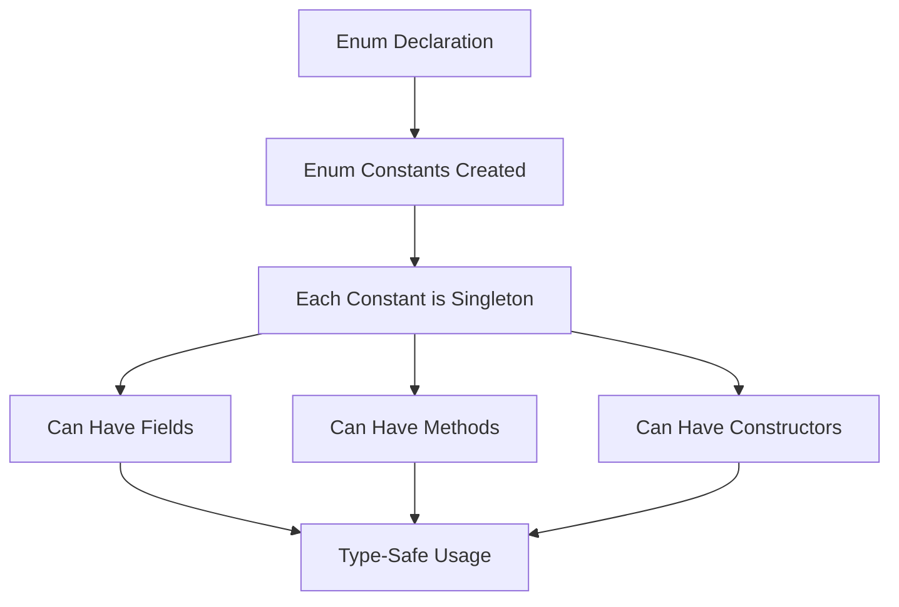

# Tutorial 09: Enum - Type-Safe Constants and Beyond

## Table of Contents
- [Introduction](#introduction)
- [Prerequisites](#prerequisites)
- [What is an Enum?](#what-is-an-enum)
- [Basic Enum Declaration](#basic-enum-declaration)
- [Enum with Constructors](#enum-with-constructors)
- [Enum with Methods](#enum-with-methods)
- [Enum with Fields](#enum-with-fields)
- [The java.lang.Enum Class](#the-javalang-enum-class)
- [Built-in Enum Methods](#built-in-enum-methods)
- [Advanced Enum Patterns](#advanced-enum-patterns)
- [Enum vs Constants](#enum-vs-constants)
- [Common Pitfalls](#common-pitfalls)
- [Best Practices](#best-practices)
- [Real-World Applications](#real-world-applications)
- [Interview Questions & Answers](#interview-questions--answers)
- [Practice Exercises](#practice-exercises)
- [Summary](#summary)
- [What's Next?](#whats-next)
- [Video Index](#video-index)
- [Further Reading](#further-reading)

---

## Introduction

**Enums** (short for enumerations) are a special data type in Java that enable a variable to be a set of predefined constants. Introduced in **Java 5**, enums are much more powerful than simple constant definitions and provide **type safety**, **readability**, and **maintainability**.

### Why Enums Matter

```
Without Enum (Traditional Approach):
┌─────────────────────────────────┐
│  public static final int MONDAY = 1;     │
│  public static final int TUESDAY = 2;    │
│  public static final int WEDNESDAY = 3;  │
│                                          │
│  Problems:                               │
│  • No type safety                        │
│  • Magic numbers                         │
│  • No namespace                          │
│  • Cannot add behavior                   │
└──────────────────────────────────────────┘

With Enum (Modern Approach):
┌─────────────────────────────────┐
│  enum Day {                              │
│      MONDAY, TUESDAY, WEDNESDAY          │
│  }                                       │
│                                          │
│  Benefits:                               │
│  • Type safe                             │
│  • Readable                              │
│  • Can have methods                      │
│  • Can have constructors                 │
└──────────────────────────────────────────┘
```

### Topics Covered

1. **Basic Enums** - Simple enumeration types
2. **Enum Constructors** - Initialize enum constants
3. **Enum Methods** - Add behavior to enums
4. **Enum Fields** - Store data in enums
5. **java.lang.Enum** - The base enum class
6. **Advanced Patterns** - Enum-based design patterns
7. **Best Practices** - When and how to use enums

---

## Prerequisites

Before learning about enums, you should understand:

- **Classes and Objects**: Basic OOP concepts
- **Static Members**: Static fields and methods
- **Constants**: final keyword
- **Switch Statements**: Control flow with enums
- **Inheritance**: Enum extends java.lang.Enum

**Quick Recap:**
```java
// Traditional constants approach
public class Constants {
    public static final int RED = 1;
    public static final int GREEN = 2;
    public static final int BLUE = 3;
}

// Modern enum approach
public enum Color {
    RED, GREEN, BLUE
}
```

---

## What is an Enum?

### Definition

An **enum** is a special Java type used to define collections of constants. It provides **type safety** and enables you to create a fixed set of related constants.

```java
public enum Season {
    SPRING, SUMMER, FALL, WINTER
}
```

### Key Characteristics

```
┌────────────────────────────────────────┐
│        ENUM CHARACTERISTICS            │
├────────────────────────────────────────┤
│ • Type-safe constants                  │
│ • Extends java.lang.Enum               │
│ • Cannot be instantiated directly      │
│ • Cannot be extended (implicitly final)│
│ • Can implement interfaces             │
│ • Can have constructors (private)      │
│ • Can have methods and fields          │
│ • Singleton pattern for each constant  │
│ • Compile-time constant                │
└────────────────────────────────────────┘
```

### Visual Representation



### Why Use Enums?

**Type Safety:**
```java
// Traditional approach - NO type safety
public static final int SMALL = 1;
public static final int MEDIUM = 2;
public static final int LARGE = 3;

void setSize(int size) {
    // Can pass ANY int - even invalid ones!
    setSize(999);  // Compiles but wrong!
}

// Enum approach - TYPE SAFE
enum Size { SMALL, MEDIUM, LARGE }

void setSize(Size size) {
    // Can only pass valid Size values
    // setSize(999);  // Compile error!
    setSize(Size.MEDIUM);  // Only valid values allowed
}
```

---

## Basic Enum Declaration

### Simple Enum

```java
public enum Day {
    MONDAY, TUESDAY, WEDNESDAY, THURSDAY, FRIDAY, SATURDAY, SUNDAY
}
```

### Using Enums

```java
public class EnumBasics {
    public static void main(String[] args) {
        // Declaring enum variable
        Day today = Day.MONDAY;
        
        // Printing enum
        System.out.println("Today is: " + today);
        
        // Comparing enums
        if (today == Day.MONDAY) {
            System.out.println("Start of the work week!");
        }
        
        // Switch with enum
        switch (today) {
            case MONDAY:
                System.out.println("Mondays are tough");
                break;
            case FRIDAY:
                System.out.println("TGIF!");
                break;
            case SATURDAY:
            case SUNDAY:
                System.out.println("Weekend!");
                break;
            default:
                System.out.println("Midweek");
        }
    }
}
```

**Output:**
```
Today is: MONDAY
Start of the work week!
Mondays are tough
```

### Enum in Collections

```java
import java.util.*;

public class EnumCollections {
    enum Priority { LOW, MEDIUM, HIGH, CRITICAL }
    
    public static void main(String[] args) {
        // EnumSet - specialized Set for enums
        EnumSet<Priority> workPriorities = EnumSet.of(
            Priority.HIGH, Priority.CRITICAL
        );
        
        System.out.println("Work priorities: " + workPriorities);
        
        // EnumMap - specialized Map for enums
        EnumMap<Priority, String> tasks = new EnumMap<>(Priority.class);
        tasks.put(Priority.HIGH, "Fix critical bug");
        tasks.put(Priority.MEDIUM, "Code review");
        tasks.put(Priority.LOW, "Update documentation");
        
        System.out.println("\nTasks by priority:");
        for (Map.Entry<Priority, String> entry : tasks.entrySet()) {
            System.out.println(entry.getKey() + ": " + entry.getValue());
        }
        
        // Regular List
        List<Priority> priorityList = new ArrayList<>();
        priorityList.add(Priority.HIGH);
        priorityList.add(Priority.LOW);
        priorityList.add(Priority.MEDIUM);
        
        System.out.println("\nPriority list: " + priorityList);
    }
}
```

---

## Enum with Constructors

### Why Constructors in Enums?

Enum constructors allow you to **initialize** each enum constant with specific values.

```
┌──────────────────────────────────┐
│   ENUM CONSTRUCTOR RULES         │
├──────────────────────────────────┤
│ • Must be private or default     │
│ • Cannot be public or protected  │
│ • Called for each enum constant  │
│ • Called when enum is loaded     │
│ • Cannot be invoked explicitly   │
└──────────────────────────────────┘
```

### Example: Size Enum with Constructor

```java
public enum Size {
    // Enum constants with constructor arguments
    SMALL("S", 10),
    MEDIUM("M", 20),
    LARGE("L", 30),
    EXTRA_LARGE("XL", 40);
    
    // Fields
    private final String abbreviation;
    private final int value;
    
    // Constructor (private by default)
    Size(String abbreviation, int value) {
        this.abbreviation = abbreviation;
        this.value = value;
    }
    
    // Getters
    public String getAbbreviation() {
        return abbreviation;
    }
    
    public int getValue() {
        return value;
    }
    
    @Override
    public String toString() {
        return abbreviation + " (" + value + ")";
    }
    
    public static void main(String[] args) {
        for (Size size : Size.values()) {
            System.out.println(size.name() + " = " + size);
        }
    }
}
```

**Output:**
```
SMALL = S (10)
MEDIUM = M (20)
LARGE = L (30)
EXTRA_LARGE = XL (40)
```

### Example: Planet Enum with Multiple Fields

```java
public enum Planet {
    MERCURY(3.303e+23, 2.4397e6),
    VENUS(4.869e+24, 6.0518e6),
    EARTH(5.976e+24, 6.37814e6),
    MARS(6.421e+23, 3.3972e6),
    JUPITER(1.9e+27, 7.1492e7),
    SATURN(5.688e+26, 6.0268e7),
    URANUS(8.686e+25, 2.5559e7),
    NEPTUNE(1.024e+26, 2.4746e7);
    
    private final double mass;    // in kilograms
    private final double radius;  // in meters
    
    // Universal gravitational constant (m3 kg-1 s-2)
    private static final double G = 6.67300E-11;
    
    // Constructor
    Planet(double mass, double radius) {
        this.mass = mass;
        this.radius = radius;
    }
    
    public double getMass() {
        return mass;
    }
    
    public double getRadius() {
        return radius;
    }
    
    // Calculate surface gravity
    public double surfaceGravity() {
        return G * mass / (radius * radius);
    }
    
    // Calculate weight on planet
    public double surfaceWeight(double otherMass) {
        return otherMass * surfaceGravity();
    }
    
    public static void main(String[] args) {
        double earthWeight = 75; // kg
        double mass = earthWeight / EARTH.surfaceGravity();
        
        System.out.printf("Your weight on Earth: %.2f kg%n", earthWeight);
        System.out.println("\nYour weight on other planets:");
        
        for (Planet p : Planet.values()) {
            System.out.printf("%-10s: %10.2f kg%n", 
                            p, p.surfaceWeight(mass));
        }
    }
}
```

---

## Enum with Methods

### Instance Methods

```java
public enum TrafficLight {
    RED("Stop"), 
    YELLOW("Caution"), 
    GREEN("Go");
    
    private final String action;
    
    TrafficLight(String action) {
        this.action = action;
    }
    
    // Instance method
    public String getAction() {
        return action;
    }
    
    // Custom instance method
    public void displayAction() {
        System.out.println(this.name() + " means: " + action);
    }
    
    // Method with logic
    public TrafficLight next() {
        switch (this) {
            case RED: return GREEN;
            case YELLOW: return RED;
            case GREEN: return YELLOW;
            default: throw new IllegalStateException();
        }
    }
    
    public static void main(String[] args) {
        TrafficLight current = TrafficLight.RED;
        
        for (int i = 0; i < 5; i++) {
            current.displayAction();
            current = current.next();
        }
    }
}
```

### Static Methods in Enums

```java
public enum Operation {
    PLUS, MINUS, MULTIPLY, DIVIDE;
    
    // Static method
    public static Operation fromSymbol(String symbol) {
        switch (symbol) {
            case "+": return PLUS;
            case "-": return MINUS;
            case "*": return MULTIPLY;
            case "/": return DIVIDE;
            default: throw new IllegalArgumentException("Unknown: " + symbol);
        }
    }
    
    // Instance method
    public double apply(double x, double y) {
        switch (this) {
            case PLUS: return x + y;
            case MINUS: return x - y;
            case MULTIPLY: return x * y;
            case DIVIDE: return x / y;
            default: throw new AssertionError("Unknown op: " + this);
        }
    }
    
    public static void main(String[] args) {
        double x = 10, y = 5;
        
        // Using enum directly
        System.out.println("10 + 5 = " + Operation.PLUS.apply(x, y));
        
        // Using static method
        Operation op = Operation.fromSymbol("*");
        System.out.println("10 * 5 = " + op.apply(x, y));
    }
}
```

### Abstract Methods in Enums

```java
public enum PaymentMethod {
    CASH {
        @Override
        public void processPayment(double amount) {
            System.out.println("Processing cash payment: $" + amount);
        }
    },
    
    CREDIT_CARD {
        @Override
        public void processPayment(double amount) {
            System.out.println("Processing credit card payment: $" + amount);
            System.out.println("Applying 2% transaction fee");
        }
    },
    
    PAYPAL {
        @Override
        public void processPayment(double amount) {
            System.out.println("Processing PayPal payment: $" + amount);
            System.out.println("Sending confirmation email");
        }
    },
    
    BITCOIN {
        @Override
        public void processPayment(double amount) {
            System.out.println("Processing Bitcoin payment: $" + amount);
            System.out.println("Waiting for blockchain confirmation");
        }
    };
    
    // Abstract method - must be implemented by each constant
    public abstract void processPayment(double amount);
    
    public static void main(String[] args) {
        double amount = 100.00;
        
        for (PaymentMethod method : PaymentMethod.values()) {
            System.out.println("\n" + method + ":");
            method.processPayment(amount);
        }
    }
}
```

---

## Enum with Fields

### Mutable vs Immutable Fields

```java
public enum Configuration {
    DEVELOPMENT("dev", "localhost", 3000),
    STAGING("staging", "staging.example.com", 80),
    PRODUCTION("prod", "www.example.com", 443);
    
    // Immutable fields (recommended)
    private final String environment;
    private final String host;
    private final int port;
    
    // Constructor
    Configuration(String environment, String host, int port) {
        this.environment = environment;
        this.host = host;
        this.port = port;
    }
    
    // Getters
    public String getEnvironment() {
        return environment;
    }
    
    public String getHost() {
        return host;
    }
    
    public int getPort() {
        return port;
    }
    
    public String getUrl() {
        String protocol = (port == 443) ? "https" : "http";
        return protocol + "://" + host + ":" + port;
    }
    
    public void displayConfig() {
        System.out.println("Environment: " + environment);
        System.out.println("Host: " + host);
        System.out.println("Port: " + port);
        System.out.println("URL: " + getUrl());
    }
    
    public static void main(String[] args) {
        Configuration config = Configuration.PRODUCTION;
        config.displayConfig();
    }
}
```

### Example: HTTP Status Codes

```java
public enum HttpStatus {
    // Success codes
    OK(200, "OK"),
    CREATED(201, "Created"),
    ACCEPTED(202, "Accepted"),
    
    // Redirection codes
    MOVED_PERMANENTLY(301, "Moved Permanently"),
    FOUND(302, "Found"),
    NOT_MODIFIED(304, "Not Modified"),
    
    // Client error codes
    BAD_REQUEST(400, "Bad Request"),
    UNAUTHORIZED(401, "Unauthorized"),
    FORBIDDEN(403, "Forbidden"),
    NOT_FOUND(404, "Not Found"),
    
    // Server error codes
    INTERNAL_SERVER_ERROR(500, "Internal Server Error"),
    NOT_IMPLEMENTED(501, "Not Implemented"),
    BAD_GATEWAY(502, "Bad Gateway"),
    SERVICE_UNAVAILABLE(503, "Service Unavailable");
    
    private final int code;
    private final String message;
    
    HttpStatus(int code, String message) {
        this.code = code;
        this.message = message;
    }
    
    public int getCode() {
        return code;
    }
    
    public String getMessage() {
        return message;
    }
    
    public boolean isSuccess() {
        return code >= 200 && code < 300;
    }
    
    public boolean isRedirection() {
        return code >= 300 && code < 400;
    }
    
    public boolean isClientError() {
        return code >= 400 && code < 500;
    }
    
    public boolean isServerError() {
        return code >= 500 && code < 600;
    }
    
    public static HttpStatus fromCode(int code) {
        for (HttpStatus status : values()) {
            if (status.code == code) {
                return status;
            }
        }
        throw new IllegalArgumentException("Unknown HTTP status code: " + code);
    }
    
    @Override
    public String toString() {
        return code + " " + message;
    }
    
    public static void main(String[] args) {
        HttpStatus status = HttpStatus.NOT_FOUND;
        
        System.out.println("Status: " + status);
        System.out.println("Code: " + status.getCode());
        System.out.println("Message: " + status.getMessage());
        System.out.println("Is client error: " + status.isClientError());
        
        System.out.println("\nAll Success Codes:");
        for (HttpStatus s : HttpStatus.values()) {
            if (s.isSuccess()) {
                System.out.println("  " + s);
            }
        }
    }
}
```

---

## The java.lang.Enum Class

### Enum Class Hierarchy

```
┌─────────────────────────────────┐
│     java.lang.Object            │
└─────────────────┬───────────────┘
                  │
        ┌─────────▼──────────┐
        │  java.lang.Enum<E> │
        └─────────┬──────────┘
                  │
        ┌─────────▼──────────┐
        │    Your Enum       │
        │  (e.g., Day)       │
        └────────────────────┘
```

All enum types implicitly extend `java.lang.Enum<E>`, which provides:
- `name()` - Returns the name of the enum constant
- `ordinal()` - Returns the position (starting from 0)
- `compareTo()` - Compares based on ordinal
- `equals()` - Tests equality
- `hashCode()` - Returns hash code
- `toString()` - Returns name (can be overridden)

### Key Methods from java.lang.Enum

```java
public enum Color {
    RED, GREEN, BLUE, YELLOW, BLACK, WHITE;
    
    public static void main(String[] args) {
        Color color = Color.GREEN;
        
        // name() - returns the name as declared
        System.out.println("name(): " + color.name());
        
        // ordinal() - returns position (0-based index)
        System.out.println("ordinal(): " + color.ordinal());
        
        // toString() - default returns name()
        System.out.println("toString(): " + color.toString());
        
        // compareTo() - compares ordinals
        System.out.println("GREEN vs BLUE: " + 
                         color.compareTo(Color.BLUE));
        
        // equals() - tests equality
        System.out.println("equals(GREEN): " + 
                         color.equals(Color.GREEN));
        
        // getDeclaringClass() - returns the Class object
        System.out.println("Declaring class: " + 
                         color.getDeclaringClass());
    }
}
```

**Output:**
```
name(): GREEN
ordinal(): 1
toString(): GREEN
GREEN vs BLUE: -1
equals(GREEN): true
Declaring class: class Color
```

---

## Built-in Enum Methods

### values() Method

Returns an array of all enum constants.

```java
public enum Month {
    JANUARY, FEBRUARY, MARCH, APRIL, MAY, JUNE,
    JULY, AUGUST, SEPTEMBER, OCTOBER, NOVEMBER, DECEMBER;
    
    public static void main(String[] args) {
        // values() returns array of all constants
        Month[] months = Month.values();
        
        System.out.println("All months:");
        for (int i = 0; i < months.length; i++) {
            System.out.printf("%2d. %s%n", (i + 1), months[i]);
        }
        
        // Using enhanced for loop
        System.out.println("\nUsing enhanced for:");
        for (Month month : Month.values()) {
            System.out.println(month);
        }
    }
}
```

### valueOf() Method

Converts a string to an enum constant.

```java
public enum Status {
    PENDING, APPROVED, REJECTED, CANCELLED;
    
    public static void main(String[] args) {
        // valueOf() - string to enum
        String statusStr = "APPROVED";
        Status status = Status.valueOf(statusStr);
        
        System.out.println("Parsed status: " + status);
        System.out.println("Ordinal: " + status.ordinal());
        
        // Case-sensitive!
        try {
            Status invalid = Status.valueOf("approved");  // lowercase
        } catch (IllegalArgumentException e) {
            System.out.println("\nError: " + e.getMessage());
        }
        
        // Safe parsing with error handling
        String input = "PENDING";
        try {
            Status parsed = Status.valueOf(input.toUpperCase());
            System.out.println("\nSuccessfully parsed: " + parsed);
        } catch (IllegalArgumentException e) {
            System.out.println("Invalid status: " + input);
        }
    }
}
```

### Custom valueOf Alternative

```java
public enum Priority {
    LOW(1), MEDIUM(2), HIGH(3), CRITICAL(4);
    
    private final int level;
    
    Priority(int level) {
        this.level = level;
    }
    
    public int getLevel() {
        return level;
    }
    
    // Custom valueOf by level
    public static Priority fromLevel(int level) {
        for (Priority p : values()) {
            if (p.level == level) {
                return p;
            }
        }
        throw new IllegalArgumentException("Invalid level: " + level);
    }
    
    // Safe valueOf with default
    public static Priority fromString(String name, Priority defaultValue) {
        try {
            return valueOf(name.toUpperCase());
        } catch (IllegalArgumentException e) {
            return defaultValue;
        }
    }
    
    public static void main(String[] args) {
        // Using custom fromLevel
        Priority p1 = Priority.fromLevel(3);
        System.out.println("Level 3: " + p1);
        
        // Using safe fromString
        Priority p2 = Priority.fromString("medium", Priority.LOW);
        System.out.println("Parsed 'medium': " + p2);
        
        Priority p3 = Priority.fromString("invalid", Priority.LOW);
        System.out.println("Parsed 'invalid' with default: " + p3);
    }
}
```

---

## Advanced Enum Patterns

### Enum Singleton Pattern

```java
public enum DatabaseConnection {
    INSTANCE;
    
    private Connection connection;
    
    // Private constructor (called once)
    DatabaseConnection() {
        try {
            connection = DriverManager.getConnection(
                "jdbc:mysql://localhost:3306/mydb", "user", "pass"
            );
            System.out.println("Database connected");
        } catch (SQLException e) {
            throw new RuntimeException("Failed to connect", e);
        }
    }
    
    public Connection getConnection() {
        return connection;
    }
    
    public void executeQuery(String sql) {
        System.out.println("Executing: " + sql);
        // Execute query logic
    }
}

// Usage
class DatabaseClient {
    public static void main(String[] args) {
        // Thread-safe singleton
        DatabaseConnection db = DatabaseConnection.INSTANCE;
        db.executeQuery("SELECT * FROM users");
        
        // Always same instance
        DatabaseConnection db2 = DatabaseConnection.INSTANCE;
        System.out.println("Same instance: " + (db == db2));
    }
}
```

### Strategy Pattern with Enums

```java
public enum DiscountStrategy {
    NONE {
        @Override
        public double applyDiscount(double price) {
            return price;
        }
    },
    
    PERCENTAGE_10 {
        @Override
        public double applyDiscount(double price) {
            return price * 0.90;
        }
    },
    
    PERCENTAGE_20 {
        @Override
        public double applyDiscount(double price) {
            return price * 0.80;
        }
    },
    
    FIXED_AMOUNT_50 {
        @Override
        public double applyDiscount(double price) {
            return Math.max(0, price - 50);
        }
    },
    
    BUY_ONE_GET_ONE {
        @Override
        public double applyDiscount(double price) {
            return price / 2;
        }
    };
    
    public abstract double applyDiscount(double price);
    
    public static void main(String[] args) {
        double price = 200.0;
        
        System.out.println("Original price: $" + price);
        System.out.println();
        
        for (DiscountStrategy strategy : values()) {
            double finalPrice = strategy.applyDiscount(price);
            System.out.printf("%-20s: $%.2f (saved $%.2f)%n", 
                            strategy, finalPrice, price - finalPrice);
        }
    }
}
```

### State Machine with Enums

```java
public enum OrderState {
    NEW {
        @Override
        public OrderState next() {
            return PROCESSING;
        }
        
        @Override
        public boolean canCancel() {
            return true;
        }
    },
    
    PROCESSING {
        @Override
        public OrderState next() {
            return SHIPPED;
        }
        
        @Override
        public boolean canCancel() {
            return true;
        }
    },
    
    SHIPPED {
        @Override
        public OrderState next() {
            return DELIVERED;
        }
        
        @Override
        public boolean canCancel() {
            return false;
        }
    },
    
    DELIVERED {
        @Override
        public OrderState next() {
            return DELIVERED; // Final state
        }
        
        @Override
        public boolean canCancel() {
            return false;
        }
    },
    
    CANCELLED {
        @Override
        public OrderState next() {
            return CANCELLED; // Final state
        }
        
        @Override
        public boolean canCancel() {
            return false;
        }
    };
    
    public abstract OrderState next();
    public abstract boolean canCancel();
    
    public OrderState cancel() {
        if (canCancel()) {
            return CANCELLED;
        }
        throw new IllegalStateException("Cannot cancel in state: " + this);
    }
}

class Order {
    private OrderState state = OrderState.NEW;
    
    public void processNext() {
        state = state.next();
        System.out.println("Order moved to: " + state);
    }
    
    public void cancel() {
        state = state.cancel();
        System.out.println("Order cancelled");
    }
    
    public static void main(String[] args) {
        Order order = new Order();
        
        order.processNext();  // NEW -> PROCESSING
        order.processNext();  // PROCESSING -> SHIPPED
        
        try {
            order.cancel();  // Cannot cancel SHIPPED
        } catch (IllegalStateException e) {
            System.out.println("Error: " + e.getMessage());
        }
        
        order.processNext();  // SHIPPED -> DELIVERED
    }
}
```

---

## Enum vs Constants

### Traditional Constants

```java
public class TraditionalConstants {
    public static final int STATUS_PENDING = 0;
    public static final int STATUS_APPROVED = 1;
    public static final int STATUS_REJECTED = 2;
    
    // Problems:
    // 1. No type safety
    public static void setStatus(int status) {
        // Can pass ANY int, even invalid ones
        setStatus(999);  // Compiles!
        setStatus(-1);   // Compiles!
    }
    
    // 2. No namespace
    public static final int PRIORITY_LOW = 0;
    // Same value as STATUS_PENDING - confusing!
    
    // 3. Cannot iterate over constants
    // 4. Cannot add behavior/methods
    // 5. Prone to errors
}
```

### Modern Enum Approach

```java
public enum Status {
    PENDING, APPROVED, REJECTED;
    
    // Benefits:
    // 1. Type-safe - can only pass Status values
    public static void setStatus(Status status) {
        // status is guaranteed to be valid
    }
    
    // 2. Has its own namespace
    // 3. Can iterate over values
    public static void printAll() {
        for (Status s : Status.values()) {
            System.out.println(s);
        }
    }
    
    // 4. Can have methods and behavior
    public boolean isPending() {
        return this == PENDING;
    }
}
```

### Comparison Table

| Feature | Traditional Constants | Enums |
|---------|----------------------|-------|
| Type Safety | ❌ No | ✅ Yes |
| Namespace | ❌ No | ✅ Yes |
| Iterate | ❌ No | ✅ Yes (values()) |
| Methods | ❌ No | ✅ Yes |
| Constructors | ❌ No | ✅ Yes |
| Fields | ❌ No | ✅ Yes |
| Switch Support | ❌ Any int | ✅ Type-safe |
| Singleton | ❌ Manual | ✅ Automatic |
| Serialization | ❌ Manual | ✅ Automatic |

---

## Common Pitfalls

### Pitfall 1: Relying on Ordinal Values

```java
public enum Priority {
    LOW, MEDIUM, HIGH;  // ordinals: 0, 1, 2
}

// ✗ BAD: Relying on ordinal values
class BadExample {
    void process(Priority p) {
        int level = p.ordinal();  // Fragile!
        // If enum order changes, code breaks
    }
}

// ✓ GOOD: Use explicit values
public enum BetterPriority {
    LOW(1), MEDIUM(2), HIGH(3);
    
    private final int level;
    
    BetterPriority(int level) {
        this.level = level;
    }
    
    public int getLevel() {
        return level;
    }
}
```

### Pitfall 2: Using == vs equals()

```java
public class EnumComparison {
    enum Color { RED, GREEN, BLUE }
    
    public static void main(String[] args) {
        Color c1 = Color.RED;
        Color c2 = Color.RED;
        
        // ✓ GOOD: Use == for enums (preferred)
        if (c1 == c2) {
            System.out.println("Same enum constant");
        }
        
        // ✓ ALSO OK: equals() works but unnecessary
        if (c1.equals(c2)) {
            System.out.println("Equal");
        }
        
        // ✓ BEST: Use == - it's null-safe and faster
        Color c3 = null;
        // if (c3.equals(Color.RED)) {}  // NullPointerException!
        if (c3 == Color.RED) {}          // Safe!
    }
}
```

### Pitfall 3: Mutable Enum Fields

```java
// ✗ BAD: Mutable fields
public enum BadEnum {
    INSTANCE;
    
    public int count = 0;  // Mutable - bad practice!
    
    public void increment() {
        count++;  // Breaks immutability
    }
}

// ✓ GOOD: Immutable fields
public enum GoodEnum {
    INSTANCE;
    
    private final AtomicInteger count = new AtomicInteger(0);
    
    public void increment() {
        count.incrementAndGet();
    }
    
    public int getCount() {
        return count.get();
    }
}
```

### Pitfall 4: valueOf() Without Error Handling

```java
public class ValueOfPitfall {
    enum Status { ACTIVE, INACTIVE, SUSPENDED }
    
    public static void main(String[] args) {
        // ✗ BAD: No error handling
        String input = "DELETED";  // Not a valid status
        // Status status = Status.valueOf(input);  // Throws exception!
        
        // ✓ GOOD: Proper error handling
        try {
            Status status = Status.valueOf(input.toUpperCase());
            System.out.println("Status: " + status);
        } catch (IllegalArgumentException e) {
            System.out.println("Invalid status: " + input);
            // Use default or handle appropriately
        }
        
        // ✓ BETTER: Custom safe method
        Status safe = parseStatus(input, Status.ACTIVE);
        System.out.println("Parsed status: " + safe);
    }
    
    static Status parseStatus(String name, Status defaultValue) {
        try {
            return Status.valueOf(name.toUpperCase());
        } catch (IllegalArgumentException e) {
            return defaultValue;
        }
    }
}
```

### Pitfall 5: Adding State to Enum Constants

```java
// ✗ PROBLEMATIC: Shared mutable state
public enum Counter {
    INSTANCE;
    
    private int count = 0;  // Shared across all usages
    
    public void increment() {
        count++;
    }
    
    public int getCount() {
        return count;
    }
}

// Usage shows the problem:
// Counter.INSTANCE.increment();  // count = 1
// Counter.INSTANCE.increment();  // count = 2
// State persists across entire application!
```

---

## Best Practices

### 1. Use Enums for Fixed Sets of Constants

```java
// ✓ GOOD: Fixed set of seasons
public enum Season {
    SPRING, SUMMER, FALL, WINTER
}

// ✓ GOOD: Fixed set of directions
public enum Direction {
    NORTH, SOUTH, EAST, WEST
}

// ✗ BAD: Don't use for dynamic/unbounded sets
// enum User { ALICE, BOB, CHARLIE }  // Users can change!
```

### 2. Make Enum Fields Final

```java
// ✓ GOOD: Immutable fields
public enum Configuration {
    DEV("localhost", 8080),
    PROD("api.example.com", 443);
    
    private final String host;
    private final int port;
    
    Configuration(String host, int port) {
        this.host = host;
        this.port = port;
    }
    
    public String getHost() { return host; }
    public int getPort() { return port; }
}
```

### 3. Implement Interfaces for Behavior

```java
interface Describable {
    String getDescription();
}

public enum HttpMethod implements Describable {
    GET("Retrieve resource"),
    POST("Create resource"),
    PUT("Update resource"),
    DELETE("Remove resource");
    
    private final String description;
    
    HttpMethod(String description) {
        this.description = description;
    }
    
    @Override
    public String getDescription() {
        return description;
    }
}
```

### 4. Use EnumSet and EnumMap

```java
import java.util.*;

public class EnumCollectionsBest {
    enum Day { MON, TUE, WED, THU, FRI, SAT, SUN }
    
    public static void main(String[] args) {
        // ✓ GOOD: EnumSet (very efficient)
        EnumSet<Day> weekend = EnumSet.of(Day.SAT, Day.SUN);
        EnumSet<Day> weekdays = EnumSet.complementOf(weekend);
        
        // ✓ GOOD: EnumMap (very efficient)
        EnumMap<Day, String> schedule = new EnumMap<>(Day.class);
        schedule.put(Day.MON, "Team meeting");
        schedule.put(Day.FRI, "Code review");
        
        System.out.println("Weekdays: " + weekdays);
        System.out.println("Schedule: " + schedule);
    }
}
```

### 5. Override toString() When Needed

```java
public enum FileType {
    PDF("Portable Document Format", ".pdf"),
    DOCX("Microsoft Word Document", ".docx"),
    XLSX("Microsoft Excel Spreadsheet", ".xlsx");
    
    private final String fullName;
    private final String extension;
    
    FileType(String fullName, String extension) {
        this.fullName = fullName;
        this.extension = extension;
    }
    
    @Override
    public String toString() {
        return fullName + " (" + extension + ")";
    }
    
    public String getExtension() {
        return extension;
    }
}
```

### 6. Document Enum Purpose

```java
/**
 * Represents the lifecycle states of an order in the system.
 * 
 * State transitions:
 * PENDING -> CONFIRMED -> SHIPPED -> DELIVERED
 * PENDING -> CANCELLED
 * CONFIRMED -> CANCELLED
 * 
 * @author YourName
 * @since 1.0
 */
public enum OrderStatus {
    /**
     * Order has been placed but not yet confirmed.
     * Can be cancelled by customer.
     */
    PENDING,
    
    /**
     * Order has been confirmed and payment received.
     * Can be cancelled within 24 hours.
     */
    CONFIRMED,
    
    /**
     * Order has been shipped to customer.
     * Cannot be cancelled.
     */
    SHIPPED,
    
    /**
     * Order has been delivered to customer.
     * Final state.
     */
    DELIVERED,
    
    /**
     * Order has been cancelled.
     * Final state.
     */
    CANCELLED
}
```

### 7. Use Enums in Switch Statements

```java
public class EnumSwitch {
    enum TrafficLight { RED, YELLOW, GREEN }
    
    public static String getAction(TrafficLight light) {
        // ✓ GOOD: Type-safe switch
        switch (light) {
            case RED:
                return "Stop";
            case YELLOW:
                return "Slow down";
            case GREEN:
                return "Go";
            default:
                throw new IllegalArgumentException("Unknown: " + light);
        }
    }
    
    public static void main(String[] args) {
        for (TrafficLight light : TrafficLight.values()) {
            System.out.println(light + ": " + getAction(light));
        }
    }
}
```

---

## Real-World Applications

### Application 1: RESTful API Response

```java
public enum ApiResponse {
    SUCCESS(200, "Operation successful"),
    CREATED(201, "Resource created"),
    BAD_REQUEST(400, "Invalid request"),
    UNAUTHORIZED(401, "Authentication required"),
    FORBIDDEN(403, "Access denied"),
    NOT_FOUND(404, "Resource not found"),
    SERVER_ERROR(500, "Internal server error");
    
    private final int code;
    private final String message;
    
    ApiResponse(int code, String message) {
        this.code = code;
        this.message = message;
    }
    
    public int getCode() {
        return code;
    }
    
    public String getMessage() {
        return message;
    }
    
    public String toJson() {
        return String.format(
            "{\"code\": %d, \"message\": \"%s\"}",
            code, message
        );
    }
    
    public static void main(String[] args) {
        ApiResponse response = ApiResponse.SUCCESS;
        System.out.println("JSON: " + response.toJson());
    }
}
```

### Application 2: Database Operations

```java
public enum DatabaseOperation {
    SELECT("SELECT", false),
    INSERT("INSERT", true),
    UPDATE("UPDATE", true),
    DELETE("DELETE", true),
    CREATE("CREATE", true),
    DROP("DROP", true),
    ALTER("ALTER", true);
    
    private final String sql;
    private final boolean modifiesData;
    
    DatabaseOperation(String sql, boolean modifiesData) {
        this.sql = sql;
        this.modifiesData = modifiesData;
    }
    
    public String getSql() {
        return sql;
    }
    
    public boolean modifiesData() {
        return modifiesData;
    }
    
    public boolean requiresTransaction() {
        return modifiesData;
    }
    
    public String buildQuery(String table, String... conditions) {
        StringBuilder query = new StringBuilder(sql);
        query.append(" ");
        
        switch (this) {
            case SELECT:
                query.append("* FROM ").append(table);
                break;
            case DELETE:
                query.append("FROM ").append(table);
                break;
            case INSERT:
                query.append("INTO ").append(table);
                break;
            case UPDATE:
                query.append(table).append(" SET");
                break;
            default:
                query.append(table);
        }
        
        if (conditions.length > 0) {
            query.append(" WHERE ").append(String.join(" AND ", conditions));
        }
        
        return query.toString();
    }
    
    public static void main(String[] args) {
        DatabaseOperation op = DatabaseOperation.SELECT;
        String query = op.buildQuery("users", "id = 1", "active = true");
        System.out.println("Query: " + query);
        System.out.println("Requires transaction: " + op.requiresTransaction());
    }
}
```

### Application 3: Logger with Levels

```java
public enum LogLevel {
    DEBUG(1, "DEBUG"),
    INFO(2, "INFO"),
    WARN(3, "WARN"),
    ERROR(4, "ERROR"),
    FATAL(5, "FATAL");
    
    private final int severity;
    private final String label;
    
    LogLevel(int severity, String label) {
        this.severity = severity;
        this.label = label;
    }
    
    public int getSeverity() {
        return severity;
    }
    
    public String getLabel() {
        return label;
    }
    
    public boolean isAtLeast(LogLevel threshold) {
        return this.severity >= threshold.severity;
    }
    
    public void log(String message) {
        if (isAtLeast(INFO)) {  // Threshold
            String timestamp = java.time.LocalDateTime.now().toString();
            System.out.printf("[%s] [%s] %s%n", timestamp, label, message);
        }
    }
}

class Logger {
    private LogLevel threshold = LogLevel.INFO;
    
    public void setThreshold(LogLevel threshold) {
        this.threshold = threshold;
    }
    
    public void log(LogLevel level, String message) {
        if (level.isAtLeast(threshold)) {
            level.log(message);
        }
    }
    
    public static void main(String[] args) {
        Logger logger = new Logger();
        
        logger.log(LogLevel.DEBUG, "Debug message");  // Not logged
        logger.log(LogLevel.INFO, "Info message");    // Logged
        logger.log(LogLevel.ERROR, "Error occurred"); // Logged
    }
}
```

### Application 4: Payment Processing

```java
public enum PaymentStatus {
    PENDING("Payment initiated", false, false),
    PROCESSING("Payment being processed", false, false),
    COMPLETED("Payment successful", true, false),
    FAILED("Payment failed", false, true),
    REFUNDED("Payment refunded", true, true),
    CANCELLED("Payment cancelled", false, true);
    
    private final String description;
    private final boolean isSuccessful;
    private final boolean isFinal;
    
    PaymentStatus(String description, boolean isSuccessful, boolean isFinal) {
        this.description = description;
        this.isSuccessful = isSuccessful;
        this.isFinal = isFinal;
    }
    
    public String getDescription() {
        return description;
    }
    
    public boolean isSuccessful() {
        return isSuccessful;
    }
    
    public boolean isFinal() {
        return isFinal;
    }
    
    public boolean canTransitionTo(PaymentStatus newStatus) {
        if (this.isFinal) return false;
        
        switch (this) {
            case PENDING:
                return newStatus == PROCESSING || newStatus == CANCELLED;
            case PROCESSING:
                return newStatus == COMPLETED || newStatus == FAILED;
            case COMPLETED:
                return newStatus == REFUNDED;
            default:
                return false;
        }
    }
    
    public void sendNotification(String email) {
        String subject = "Payment " + this.name();
        String body = "Your payment status: " + this.description;
        System.out.printf("Sending email to %s: %s - %s%n", 
                         email, subject, body);
    }
}

class Payment {
    private PaymentStatus status = PaymentStatus.PENDING;
    private final String customerEmail;
    
    public Payment(String customerEmail) {
        this.customerEmail = customerEmail;
    }
    
    public void updateStatus(PaymentStatus newStatus) {
        if (status.canTransitionTo(newStatus)) {
            status = newStatus;
            status.sendNotification(customerEmail);
        } else {
            throw new IllegalStateException(
                "Cannot transition from " + status + " to " + newStatus
            );
        }
    }
    
    public static void main(String[] args) {
        Payment payment = new Payment("customer@example.com");
        
        payment.updateStatus(PaymentStatus.PROCESSING);
        payment.updateStatus(PaymentStatus.COMPLETED);
        payment.updateStatus(PaymentStatus.REFUNDED);
    }
}
```

---

## Interview Questions & Answers

### Q1: What is an enum in Java?

**Answer:**
An enum is a special Java type used to define a collection of constants. Key characteristics:
- Type-safe: Can only hold predefined values
- Extends java.lang.Enum implicitly
- Cannot be instantiated with `new`
- Each constant is a singleton instance
- Can have constructors, methods, and fields

**Example:**
```java
public enum Day {
    MONDAY, TUESDAY, WEDNESDAY, THURSDAY, FRIDAY, SATURDAY, SUNDAY;
}

// Usage
Day today = Day.MONDAY;
if (today == Day.MONDAY) {
    System.out.println("Start of week!");
}
```

### Q2: Can we add constructors to enums?

**Answer:**
Yes, enums can have constructors, but they must be private or package-private. The constructor is called once for each enum constant when the enum is loaded.

**Example:**
```java
public enum Planet {
    EARTH(5.976e+24, 6.37814e6),
    MARS(6.421e+23, 3.3972e6);
    
    private final double mass;
    private final double radius;
    
    // Private constructor
    Planet(double mass, double radius) {
        this.mass = mass;
        this.radius = radius;
    }
    
    public double getMass() { return mass; }
    public double getRadius() { return radius; }
}
```

### Q3: Can we extend an enum?

**Answer:**
No, enums cannot be extended. All enums implicitly extend `java.lang.Enum`, and Java doesn't support multiple inheritance. Enums are implicitly final.

However, enums can **implement interfaces**:

```java
interface Describable {
    String getDescription();
}

public enum Status implements Describable {
    ACTIVE("Currently active"),
    INACTIVE("Currently inactive");
    
    private final String desc;
    
    Status(String desc) {
        this.desc = desc;
    }
    
    @Override
    public String getDescription() {
        return desc;
    }
}
```

### Q4: What are values() and valueOf() methods?

**Answer:**
These are automatically generated methods for every enum:

- **values()**: Returns an array of all enum constants
- **valueOf(String)**: Converts a string to an enum constant

**Example:**
```java
public enum Color {
    RED, GREEN, BLUE;
    
    public static void main(String[] args) {
        // values() - get all constants
        for (Color c : Color.values()) {
            System.out.println(c);
        }
        
        // valueOf() - string to enum
        Color color = Color.valueOf("RED");
        System.out.println(color);  // RED
        
        // Case sensitive!
        // Color invalid = Color.valueOf("red");  // Exception!
    }
}
```

### Q5: Can we have abstract methods in enums?

**Answer:**
Yes, enums can have abstract methods, but then each enum constant must provide an implementation.

**Example:**
```java
public enum Operation {
    PLUS {
        @Override
        public double apply(double x, double y) {
            return x + y;
        }
    },
    MINUS {
        @Override
        public double apply(double x, double y) {
            return x - y;
        }
    },
    MULTIPLY {
        @Override
        public double apply(double x, double y) {
            return x * y;
        }
    };
    
    public abstract double apply(double x, double y);
}

// Usage
double result = Operation.PLUS.apply(5, 3);  // 8.0
```

### Q6: What is the difference between enum and constants?

**Answer:**

| Feature | Static Final Constants | Enums |
|---------|------------------------|-------|
| Type Safety | No | Yes |
| Namespace | No | Yes (enum name) |
| Iteration | Not possible | values() method |
| Methods | No | Yes |
| Constructors | No | Yes (private) |
| Fields | No | Yes |
| Switch | Not type-safe | Type-safe |

**Example:**
```java
// Constants - not type-safe
class Constants {
    public static final int RED = 0;
    public static final int GREEN = 1;
    
    void setColor(int color) {
        // Can pass ANY int!
        setColor(999);  // Compiles but wrong
    }
}

// Enum - type-safe
enum Color {
    RED, GREEN, BLUE;
}

void setColor(Color color) {
    // Can only pass Color values
    // setColor(999);  // Compile error!
}
```

### Q7: Can enums be serialized?

**Answer:**
Yes, enums are serializable by default. The JVM ensures that only one instance of each enum constant exists, even after deserialization.

**Special handling:**
- Only the name of the enum constant is serialized
- During deserialization, `valueOf()` is used to get the constant
- This guarantees singleton property is maintained

**Example:**
```java
import java.io.*;

public enum Status implements Serializable {
    ACTIVE, INACTIVE;
}

// Serialization maintains singleton
Status s1 = Status.ACTIVE;
// Serialize and deserialize
Status s2 = deserialize(serialize(s1));
System.out.println(s1 == s2);  // true - same instance!
```

### Q8: Can we use enums in switch statements?

**Answer:**
Yes, enums work excellently with switch statements and provide type safety.

**Example:**
```java
public enum Day {
    MONDAY, TUESDAY, WEDNESDAY, THURSDAY, FRIDAY, SATURDAY, SUNDAY;
}

public static String getDayType(Day day) {
    switch (day) {
        case MONDAY:
        case TUESDAY:
        case WEDNESDAY:
        case THURSDAY:
        case FRIDAY:
            return "Weekday";
        case SATURDAY:
        case SUNDAY:
            return "Weekend";
        default:
            throw new IllegalArgumentException("Unknown day");
    }
}
```

### Q9: What is EnumSet and EnumMap?

**Answer:**
**EnumSet** and **EnumMap** are specialized, high-performance collections for enums.

**EnumSet:**
- Set implementation optimized for enums
- Uses bit vectors internally
- Very fast and memory efficient
- All elements must be from single enum type

**EnumMap:**
- Map implementation optimized for enum keys
- Internally uses array (very fast)
- Keys must be from single enum type

**Example:**
```java
import java.util.*;

enum Day { MON, TUE, WED, THU, FRI, SAT, SUN }

public class EnumCollections {
    public static void main(String[] args) {
        // EnumSet
        EnumSet<Day> weekend = EnumSet.of(Day.SAT, Day.SUN);
        EnumSet<Day> weekdays = EnumSet.range(Day.MON, Day.FRI);
        
        // EnumMap
        EnumMap<Day, String> schedule = new EnumMap<>(Day.class);
        schedule.put(Day.MON, "Team meeting");
        schedule.put(Day.FRI, "Code review");
        
        System.out.println("Weekend: " + weekend);
        System.out.println("Schedule: " + schedule);
    }
}
```

### Q10: Can we create instances of enums using new keyword?

**Answer:**
No, enum constants cannot be instantiated using the `new` keyword. Enum constants are implicitly `public static final` and are created when the enum class is loaded.

**Example:**
```java
public enum Color {
    RED, GREEN, BLUE;
}

// ✗ CANNOT DO THIS:
// Color c = new Color();  // Compile error!

// ✓ CORRECT WAY:
Color c = Color.RED;  // Use predefined constants
```

---

## Practice Exercises

### Exercise 1: Create a comprehensive Season enum
**Problem:** Create a Season enum with temperature ranges, months, and activities.

**Requirements:**
- Four seasons with constructors
- Temperature range (min/max)
- List of months
- Typical activities
- Methods to check if a month belongs to the season

<details>
<summary>Solution</summary>

```java
import java.util.*;

public enum Season {
    SPRING(10, 20, "Spring activities: gardening, hiking", 
           Arrays.asList("March", "April", "May")),
    SUMMER(20, 35, "Summer activities: swimming, beach", 
           Arrays.asList("June", "July", "August")),
    FALL(10, 20, "Fall activities: harvest, leaf-peeping", 
           Arrays.asList("September", "October", "November")),
    WINTER(-10, 10, "Winter activities: skiing, snowboarding", 
           Arrays.asList("December", "January", "February"));
    
    private final int minTemp;
    private final int maxTemp;
    private final String activities;
    private final List<String> months;
    
    Season(int minTemp, int maxTemp, String activities, List<String> months) {
        this.minTemp = minTemp;
        this.maxTemp = maxTemp;
        this.activities = activities;
        this.months = months;
    }
    
    public int getMinTemp() { return minTemp; }
    public int getMaxTemp() { return maxTemp; }
    public String getActivities() { return activities; }
    public List<String> getMonths() { return months; }
    
    public boolean hasMonth(String month) {
        return months.contains(month);
    }
    
    public boolean isTempInRange(int temp) {
        return temp >= minTemp && temp <= maxTemp;
    }
    
    public static Season getSeasonForMonth(String month) {
        for (Season season : values()) {
            if (season.hasMonth(month)) {
                return season;
            }
        }
        return null;
    }
    
    public void displayInfo() {
        System.out.println("Season: " + this);
        System.out.println("Temperature range: " + minTemp + "°C to " + maxTemp + "°C");
        System.out.println("Months: " + months);
        System.out.println(activities);
    }
    
    public static void main(String[] args) {
        Season summer = Season.SUMMER;
        summer.displayInfo();
        
        System.out.println("\nIs July in summer? " + summer.hasMonth("July"));
        System.out.println("Season for December: " + Season.getSeasonForMonth("December"));
    }
}
```
</details>

### Exercise 2: Create a CoffeeSize enum with pricing
**Problem:** Create a CoffeeSize enum that calculates prices based on size and extras.

**Requirements:**
- Sizes: SMALL, MEDIUM, LARGE
- Base prices for each size
- Method to calculate price with extras

<details>
<summary>Solution</summary>

```java
public enum CoffeeSize {
    SMALL("Small", 8, 2.50),
    MEDIUM("Medium", 12, 3.50),
    LARGE("Large", 16, 4.50);
    
    private final String displayName;
    private final int ounces;
    private final double basePrice;
    
    CoffeeSize(String displayName, int ounces, double basePrice) {
        this.displayName = displayName;
        this.ounces = ounces;
        this.basePrice = basePrice;
    }
    
    public String getDisplayName() { return displayName; }
    public int getOunces() { return ounces; }
    public double getBasePrice() { return basePrice; }
    
    public double calculatePrice(boolean extraShot, boolean whippedCream) {
        double price = basePrice;
        if (extraShot) price += 0.50;
        if (whippedCream) price += 0.75;
        return price;
    }
    
    public void displayInfo() {
        System.out.printf("%s: %d oz - $%.2f%n", 
                         displayName, ounces, basePrice);
    }
    
    public static void main(String[] args) {
        System.out.println("Coffee Sizes:");
        for (CoffeeSize size : values()) {
            size.displayInfo();
        }
        
        System.out.println("\nPrice examples:");
        CoffeeSize size = MEDIUM;
        System.out.printf("Medium: $%.2f%n", size.getBasePrice());
        System.out.printf("Medium + extra shot: $%.2f%n", 
                         size.calculatePrice(true, false));
        System.out.printf("Medium + extra shot + whipped cream: $%.2f%n", 
                         size.calculatePrice(true, true));
    }
}
```
</details>

### Exercise 3: Create a DayOfWeek enum with business logic
**Problem:** Create a DayOfWeek enum with methods to determine if it's a workday, weekend, etc.

<details>
<summary>Solution</summary>

```java
public enum DayOfWeek {
    MONDAY(true, 1),
    TUESDAY(true, 2),
    WEDNESDAY(true, 3),
    THURSDAY(true, 4),
    FRIDAY(true, 5),
    SATURDAY(false, 6),
    SUNDAY(false, 7);
    
    private final boolean isWorkday;
    private final int dayNumber;
    
    DayOfWeek(boolean isWorkday, int dayNumber) {
        this.isWorkday = isWorkday;
        this.dayNumber = dayNumber;
    }
    
    public boolean isWorkday() {
        return isWorkday;
    }
    
    public boolean isWeekend() {
        return !isWorkday;
    }
    
    public int getDayNumber() {
        return dayNumber;
    }
    
    public DayOfWeek next() {
        int nextDay = (dayNumber % 7) + 1;
        for (DayOfWeek day : values()) {
            if (day.dayNumber == nextDay) {
                return day;
            }
        }
        return this;
    }
    
    public DayOfWeek previous() {
        int prevDay = ((dayNumber - 2 + 7) % 7) + 1;
        for (DayOfWeek day : values()) {
            if (day.dayNumber == prevDay) {
                return day;
            }
        }
        return this;
    }
    
    public int daysUntil(DayOfWeek target) {
        int diff = target.dayNumber - this.dayNumber;
        return (diff + 7) % 7;
    }
    
    public static void main(String[] args) {
        DayOfWeek today = WEDNESDAY;
        
        System.out.println("Today: " + today);
        System.out.println("Is workday: " + today.isWorkday());
        System.out.println("Is weekend: " + today.isWeekend());
        System.out.println("Next day: " + today.next());
        System.out.println("Previous day: " + today.previous());
        System.out.println("Days until Friday: " + today.daysUntil(FRIDAY));
        
        System.out.println("\nAll workdays:");
        for (DayOfWeek day : values()) {
            if (day.isWorkday()) {
                System.out.println("  " + day);
            }
        }
    }
}
```
</details>

---

## Summary

### Key Takeaways

1. **What are Enums?**
   - Type-safe constants
   - Special class extending java.lang.Enum
   - Cannot be instantiated with `new`
   - Each constant is singleton

2. **Enum Features**
   - Can have constructors (private)
   - Can have methods (instance and static)
   - Can have fields (prefer final)
   - Can implement interfaces
   - Can have abstract methods

3. **Built-in Methods**
   - `values()` - Returns all constants
   - `valueOf()` - String to enum
   - `name()` - Returns constant name
   - `ordinal()` - Returns position
   - `compareTo()` - Compares ordinals

4. **Advanced Patterns**
   - Singleton pattern
   - Strategy pattern
   - State machine pattern
   - Command pattern

5. **Best Practices**
   - Use for fixed sets of constants
   - Make fields final (immutable)
   - Use EnumSet and EnumMap
   - Override toString() when needed
   - Document enum purpose
   - Avoid relying on ordinals

6. **Common Pitfalls**
   - Don't rely on ordinal values
   - Use == for comparison (null-safe)
   - Avoid mutable fields
   - Handle valueOf() exceptions
   - Don't use for dynamic data

### Visual Summary

```
┌──────────────────────────────────────────────────────┐
│                 ENUM SUMMARY                         │
├──────────────────────────────────────────────────────┤
│                                                      │
│  Declaration        Properties                       │
│  ───────────        ──────────                       │
│  enum Color {       • Type-safe                      │
│    RED, GREEN,      • Extends Enum<E>                │
│    BLUE             • Singleton constants             │
│  }                  • Can have behavior               │
│                                                      │
│  Methods            Collections                      │
│  ───────            ───────────                      │
│  • values()         • EnumSet (fast)                 │
│  • valueOf()        • EnumMap (fast)                 │
│  • name()           • Type-safe                      │
│  • ordinal()        • Optimized                      │
│                                                      │
└──────────────────────────────────────────────────────┘
```

### Enum vs Other Approaches

| Aspect | Enum | Constants | Class |
|--------|------|-----------|-------|
| Type Safety | ✅ | ❌ | ✅ |
| Fixed Set | ✅ | ❌ | ❌ |
| Methods | ✅ | ❌ | ✅ |
| Immutable | ✅ | ✅ | ⚠️ |
| Singleton | ✅ | ❌ | ⚠️ |
| Switch | ✅ | ⚠️ | ❌ |

---

## What's Next?

After mastering enums, continue your Java journey with:

### Next Tutorial
**Tutorial 10: Object Oriented Concepts** - Deep dive into OOP
- Encapsulation and data hiding
- Inheritance and polymorphism
- Abstract classes and interfaces
- Design principles (SOLID)
- Real-world OOP patterns

### Related Topics to Explore

1. **Tutorial 08: Static Variables and Methods (Review)**
   - Static context and enums
   - Singleton pattern
   - Utility classes

2. **Collections Framework**
   - EnumSet usage
   - EnumMap usage
   - Collection best practices

3. **Design Patterns**
   - Strategy pattern with enums
   - State pattern with enums
   - Factory pattern
   - Command pattern

### Practice Projects

1. **Traffic Light Simulator**
   - Use enum for light states
   - State transitions
   - Timing logic

2. **Card Game**
   - Enum for Suit and Rank
   - Deck implementation
   - Hand evaluation

3. **Order Management System**
   - Order status enum
   - State machine
   - Workflow management

### Additional Resources

- Effective Java by Joshua Bloch (Item 34: Use enums instead of int constants)
- Java Enum documentation
- Design Patterns with enums

---

## Video Index

This tutorial covers the following videos from the RBR Java playlist:

| Video # | Title | Key Topics | Duration |
|---------|-------|------------|----------|
| **76** | Introduction to Enum | What are enums, basic declaration, usage | ~15 min |
| **77** | Declaring constructors, methods and variables in an enum | Enum constructors, methods, fields | ~20 min |
| **78** | Java.Lang.Enum | java.lang.Enum class, built-in methods | ~15 min |
| **79** | Example on Enum | Comprehensive examples, best practices | ~15 min |

### Video Timestamps and Topics

#### Video 76: Introduction to Enum (0:00 - 15:00)
- 0:00 - What are enums?
- 2:30 - Why use enums vs constants
- 5:00 - Basic enum declaration
- 7:30 - Using enums in code
- 10:00 - Switch statements with enums
- 12:30 - Common use cases

#### Video 77: Constructors, Methods and Variables (0:00 - 20:00)
- 0:00 - Adding constructors to enums
- 4:00 - Enum fields (instance variables)
- 8:00 - Instance methods
- 12:00 - Static methods
- 16:00 - Abstract methods
- 18:30 - Best practices

#### Video 78: Java.Lang.Enum (0:00 - 15:00)
- 0:00 - The java.lang.Enum class
- 3:00 - name() and ordinal()
- 6:00 - values() method
- 9:00 - valueOf() method
- 11:30 - compareTo() and equals()
- 13:30 - Other built-in methods

#### Video 79: Example on Enum (0:00 - 15:00)
- 0:00 - Comprehensive enum example
- 4:00 - Real-world applications
- 8:00 - Advanced patterns
- 11:00 - Common pitfalls
- 13:30 - Best practices summary

---

## Further Reading

### Official Documentation
- [Oracle Java Tutorial - Enum Types](https://docs.oracle.com/javase/tutorial/java/javaOO/enum.html)
- [Java Language Specification - Enum Types](https://docs.oracle.com/javase/specs/jls/se17/html/jls-8.html#jls-8.9)
- [java.lang.Enum API](https://docs.oracle.com/en/java/javase/17/docs/api/java.base/java/lang/Enum.html)

### Books
1. **Effective Java (3rd Edition)** by Joshua Bloch
   - Item 34: Use enums instead of int constants
   - Item 35: Use instance fields instead of ordinals
   - Item 36: Use EnumSet instead of bit fields
   - Item 37: Use EnumMap instead of ordinal indexing
   - Item 38: Emulate extensible enums with interfaces

2. **Java: The Complete Reference** by Herbert Schildt
   - Chapter 12: Enumerations, Autoboxing, and Annotations
   - Enum fundamentals
   - Advanced enum features

3. **Head First Java** by Kathy Sierra and Bert Bates
   - Chapter 3: Know Your Variables (includes enums)
   - Visual explanation of enums

### Online Resources

1. **Baeldung**
   - [A Guide to Java Enums](https://www.baeldung.com/a-guide-to-java-enums)
   - [Java Enum with Multiple Values](https://www.baeldung.com/java-enum-values)
   - [Java EnumSet Guide](https://www.baeldung.com/java-enumset)
   - [Java EnumMap Guide](https://www.baeldung.com/java-enummap)

2. **GeeksforGeeks**
   - [Enum in Java](https://www.geeksforgeeks.org/enum-in-java/)
   - [Enum with Customized Value in Java](https://www.geeksforgeeks.org/enum-customized-value-java/)
   - [Comparing enum members in Java](https://www.geeksforgeeks.org/comparing-enum-members-java/)

3. **JavaPoint**
   - [Enum in Java](https://www.javatpoint.com/enum-in-java)
   - [Java Enum Constructor](https://www.javatpoint.com/enum-constructor-in-java)
   - [Java Enum Methods](https://www.javatpoint.com/enum-methods-in-java)

### Design Patterns with Enums

1. **Singleton Pattern**
   - Thread-safe singleton
   - Best implementation using enum
   - Joshua Bloch recommendation

2. **Strategy Pattern**
   - Enum-based strategies
   - Behavior encapsulation
   - Type-safe design

3. **State Pattern**
   - State machines with enums
   - State transitions
   - Workflow management

### Advanced Topics

1. **EnumSet and EnumMap**
   - Performance characteristics
   - Internal implementation
   - Use cases and examples

2. **Enum and Interfaces**
   - Implementing interfaces
   - Emulating extensible enums
   - Polymorphic behavior

3. **Enum Serialization**
   - How enums are serialized
   - Singleton guarantee
   - Custom serialization

4. **Enum in Different Contexts**
   - Enums in annotations
   - Enums in switch expressions (Java 12+)
   - Pattern matching with enums (Java 17+)

### Video Tutorials

1. **YouTube Channels**
   - Programming with Mosh - Java Enum Tutorial
   - Derek Banas - Java Enums
   - Cave of Programming - Working with Enums

2. **Online Courses**
   - Udemy: Java Programming Masterclass
   - Coursera: Object Oriented Programming in Java
   - Pluralsight: Java Fundamentals: The Core Platform

### Practice Platforms

1. **Coding Practice**
   - HackerRank - Java Enum problems
   - LeetCode - Design problems using enums
   - CodeWars - Java kata involving enums

2. **Interactive Learning**
   - Codecademy - Learn Java
   - JetBrains Academy - Java Developer Track
   - SoloLearn - Java Course

### Real-World Examples

1. **Java Standard Library**
   - java.time.DayOfWeek
   - java.time.Month
   - java.nio.file.StandardOpenOption
   - javax.swing.SwingConstants

2. **Popular Frameworks**
   - Spring Framework status codes
   - Hibernate fetch types
   - Android Activity states

---

## Congratulations! 🎉

You've completed **Tutorial 09: Enum**!

You now understand:
- ✅ What enums are and why they matter
- ✅ How to create enums with constructors
- ✅ Adding methods and fields to enums
- ✅ Built-in enum methods (values, valueOf)
- ✅ Advanced patterns (Strategy, State, Singleton)
- ✅ Best practices and common pitfalls
- ✅ Real-world applications

**Key Insight:** Enums are not just constants - they're powerful, type-safe tools for modeling fixed sets of values with behavior.

Keep practicing, and see you in the next tutorial on **Object Oriented Programming**! 🚀

---

**[⬅️ Previous: Tutorial 08 - Static Variables and Methods](./08_Static_Variables_and_Methods.md)** | **[🏠 Back to Index](./README.md)** | **[Next: Tutorial 10 - Object Oriented Concepts ➡️](./10_Object_Oriented.md)**

---

*Last Updated: November 2025*  
*Part of RBR Java Tutorial Series*  
*Based on Videos 76-79 from RBR Java Playlist*
