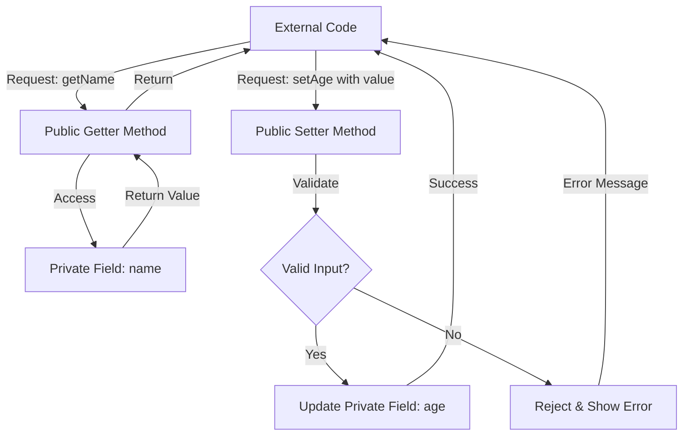
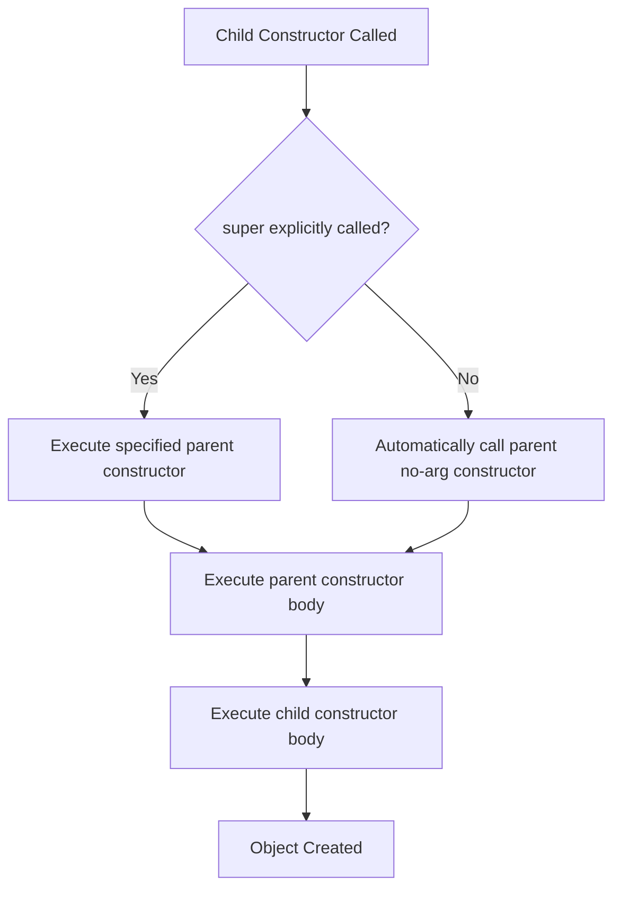

# Tutorial 10: Object Oriented Concepts

**Video References:** Videos 80-104 (25 videos)

**Prerequisites:** Classes and Objects (Tutorial 07), Static Variables and Methods (Tutorial 08)

**Estimated Learning Time:** 8-10 hours

---

## Table of Contents

1. [Introduction to Object-Oriented Programming](#introduction-to-object-oriented-programming)
2. [Encapsulation](#encapsulation)
3. [Inheritance](#inheritance)
4. [Polymorphism](#polymorphism)
5. [Abstraction](#abstraction)
6. [Interfaces](#interfaces)
7. [Final Keyword](#final-keyword)
8. [Singleton Design Pattern](#singleton-design-pattern)
9. [Garbage Collection](#garbage-collection)
10. [Coupling and Cohesion](#coupling-and-cohesion)
11. [Complete Code Examples](#complete-code-examples)
12. [Common Pitfalls and Best Practices](#common-pitfalls-and-best-practices)
13. [Interview Preparation](#interview-preparation)
14. [Practice Exercises](#practice-exercises)
15. [Further Reading](#further-reading)

---

## Introduction to Object-Oriented Programming

### What is Object-Oriented Programming?

Object-Oriented Programming (OOP) is a programming paradigm based on the concept of "objects," which contain data (fields/attributes) and code (methods). OOP focuses on organizing software design around data, or objects, rather than functions and logic.

### The Four Pillars of OOP

```
┌──────────────────────────────────────────────────────────┐
│          The Four Pillars of OOP                         │
├──────────────────────────────────────────────────────────┤
│                                                          │
│  ┌──────────────┐  ┌──────────────┐                     │
│  │Encapsulation │  │ Inheritance  │                     │
│  │              │  │              │                     │
│  │  Data Hiding │  │ Code Reuse   │                     │
│  │  Bundling    │  │ IS-A         │                     │
│  └──────────────┘  └──────────────┘                     │
│                                                          │
│  ┌──────────────┐  ┌──────────────┐                     │
│  │Polymorphism  │  │ Abstraction  │                     │
│  │              │  │              │                     │
│  │ Many Forms   │  │ Hiding       │                     │
│  │ Same Interface│ │ Complexity   │                     │
│  └──────────────┘  └──────────────┘                     │
└──────────────────────────────────────────────────────────┘
```

### Why OOP?

**Benefits:**

1. **Modularity:** Code is organized into self-contained objects
2. **Reusability:** Objects and classes can be reused across programs
3. **Maintainability:** Changes to one part don't affect others
4. **Scalability:** Easy to add new features without modifying existing code
5. **Security:** Data hiding through encapsulation
6. **Real-world modeling:** Objects represent real-world entities

### OOP vs Procedural Programming

| Aspect | Procedural | Object-Oriented |
|--------|------------|-----------------|
| **Focus** | Functions/Procedures | Objects and Classes |
| **Data** | Global, accessible anywhere | Encapsulated in objects |
| **Approach** | Top-down | Bottom-up |
| **Code Reuse** | Function calls | Inheritance |
| **Security** | Less secure | More secure (data hiding) |
| **Examples** | C, Pascal | Java, C++, Python |

---

## Encapsulation

### Video 80: Introduction to Encapsulation

**Video Reference:** `80.Java- Encapsulation.mp4`

### What is Encapsulation?

**Definition:** Encapsulation is the bundling of data (variables) and methods that operate on that data into a single unit (class), and restricting direct access to some of the object's components.

**Key Concept:** Data hiding - keeping the internal state of an object private and providing public methods to access/modify it.

```
┌─────────────────────────────────────────┐
│          Encapsulation Concept          │
├─────────────────────────────────────────┤
│                                         │
│  ┌─────────────────────────────────┐   │
│  │         Class (Capsule)         │   │
│  │                                 │   │
│  │  ┌───────────────────────────┐ │   │
│  │  │  Private Data (Hidden)    │ │   │
│  │  │                           │ │   │
│  │  │  - String name            │ │   │
│  │  │  - int age                │ │   │
│  │  │  - double salary          │ │   │
│  │  └───────────────────────────┘ │   │
│  │                                 │   │
│  │  Public Interface (Visible)     │   │
│  │  ┌───────────────────────────┐ │   │
│  │  │ + getName()               │ │   │
│  │  │ + setName(String)         │ │   │
│  │  │ + getAge()                │ │   │
│  │  │ + setAge(int)             │ │   │
│  │  └───────────────────────────┘ │   │
│  └─────────────────────────────────┘   │
│                                         │
│  Outside World: Can only use public     │
│  methods, cannot directly access data   │
└─────────────────────────────────────────┘
```

### Principles of Encapsulation

1. **Declare variables as private:** Restrict direct access
2. **Provide public getter methods:** To read private data
3. **Provide public setter methods:** To modify private data with validation
4. **Control access:** Decide what can be read, written, or both

### Real-World Analogy

**TV Remote Control:**
```
The TV has complex internal electronics (private data)
You don't access them directly
You use the remote (public interface) with buttons
Each button performs a specific operation
You don't need to know how it works internally
```

### Benefits of Encapsulation

1. **Data Hiding:** Internal representation hidden from outside
2. **Increased Flexibility:** Can change internal implementation without affecting external code
3. **Reusability:** Well-encapsulated classes are easier to reuse
4. **Easy Testing:** Can test and debug individual components
5. **Security:** Prevents unauthorized access to data

### Video 81: Example on Encapsulation

**Video Reference:** `81.Java- Example on encapsulation.mp4`

### Basic Encapsulation Example

```java
/**
 * Poorly Encapsulated Class (BAD PRACTICE)
 */
class StudentBad {
    public String name;
    public int age;
    public double marks;
    
    // Anyone can set invalid data!
    // student.age = -5; // Invalid but allowed
    // student.marks = 150; // Out of range but allowed
}

/**
 * Well-Encapsulated Class (BEST PRACTICE)
 */
class Student {
    // Private data members - cannot be accessed directly
    private String name;
    private int age;
    private double marks;
    
    // Constructor
    public Student(String name, int age, double marks) {
        this.name = name;
        setAge(age);      // Use setter for validation
        setMarks(marks);  // Use setter for validation
    }
    
    // Getter for name
    public String getName() {
        return name;
    }
    
    // Setter for name with validation
    public void setName(String name) {
        if (name == null || name.trim().isEmpty()) {
            System.out.println("Name cannot be empty!");
            return;
        }
        this.name = name;
    }
    
    // Getter for age
    public int getAge() {
        return age;
    }
    
    // Setter for age with validation
    public void setAge(int age) {
        if (age < 0 || age > 150) {
            System.out.println("Invalid age! Must be between 0 and 150");
            return;
        }
        this.age = age;
    }
    
    // Getter for marks
    public double getMarks() {
        return marks;
    }
    
    // Setter for marks with validation
    public void setMarks(double marks) {
        if (marks < 0 || marks > 100) {
            System.out.println("Invalid marks! Must be between 0 and 100");
            return;
        }
        this.marks = marks;
    }
    
    // Business logic method
    public String getGrade() {
        if (marks >= 90) return "A+";
        if (marks >= 80) return "A";
        if (marks >= 70) return "B";
        if (marks >= 60) return "C";
        if (marks >= 50) return "D";
        return "F";
    }
    
    // Display method
    public void displayInfo() {
        System.out.println("Name: " + name);
        System.out.println("Age: " + age);
        System.out.println("Marks: " + marks);
        System.out.println("Grade: " + getGrade());
    }
}

public class EncapsulationDemo {
    public static void main(String[] args) {
        // Creating student object
        Student student = new Student("John Doe", 20, 85.5);
        
        // Accessing data through public methods (getters)
        System.out.println("Student Name: " + student.getName());
        System.out.println("Student Age: " + student.getAge());
        System.out.println("Student Marks: " + student.getMarks());
        
        System.out.println("\n--- Attempting Invalid Operations ---");
        
        // Attempting to set invalid age
        student.setAge(-5);      // Validation prevents this
        student.setAge(200);     // Validation prevents this
        
        // Attempting to set invalid marks
        student.setMarks(150);   // Validation prevents this
        student.setMarks(-10);   // Validation prevents this
        
        System.out.println("\n--- Valid Updates ---");
        
        // Valid updates
        student.setName("Jane Smith");
        student.setAge(21);
        student.setMarks(92.0);
        
        student.displayInfo();
        
        // Cannot access private fields directly:
        // student.name = "Hacker"; // Compilation error!
        // student.age = -999;      // Compilation error!
    }
}
```

**Output:**
```
Student Name: John Doe
Student Age: 20
Student Marks: 85.5

--- Attempting Invalid Operations ---
Invalid age! Must be between 0 and 150
Invalid age! Must be between 0 and 150
Invalid marks! Must be between 0 and 100
Invalid marks! Must be between 0 and 100

--- Valid Updates ---
Name: Jane Smith
Age: 21
Marks: 92.0
Grade: A+
```

### Advanced Encapsulation: Read-Only and Write-Only Properties

```java
class BankAccount {
    private String accountNumber;  // Read-only
    private double balance;        // Read-only (can only be changed through deposit/withdraw)
    private String pin;            // Write-only (for security)
    
    public BankAccount(String accountNumber, String pin) {
        this.accountNumber = accountNumber;
        this.balance = 0.0;
        this.pin = pin;
    }
    
    // Read-only: Only getter, no setter
    public String getAccountNumber() {
        return accountNumber;
    }
    
    // Read-only: Balance can only change through business methods
    public double getBalance() {
        return balance;
    }
    
    // Write-only: Can set PIN but cannot read it
    public void setPin(String oldPin, String newPin) {
        if (this.pin.equals(oldPin)) {
            this.pin = newPin;
            System.out.println("PIN changed successfully");
        } else {
            System.out.println("Invalid old PIN");
        }
    }
    
    // Business methods that modify balance
    public void deposit(double amount) {
        if (amount > 0) {
            balance += amount;
            System.out.println("Deposited: $" + amount);
        }
    }
    
    public boolean withdraw(String pin, double amount) {
        if (!this.pin.equals(pin)) {
            System.out.println("Invalid PIN");
            return false;
        }
        if (amount > balance) {
            System.out.println("Insufficient funds");
            return false;
        }
        if (amount > 0) {
            balance -= amount;
            System.out.println("Withdrawn: $" + amount);
            return true;
        }
        return false;
    }
}
```

### Encapsulation Flow Diagram



### Best Practices for Encapsulation

1. **Always make fields private** unless you have a very good reason
2. **Provide getters and setters** only when necessary
3. **Validate in setters:** Check input before updating
4. **Use meaningful names:** `getName()` not `getN()`
5. **Don't expose internal collections directly:**
   ```java
   // BAD
   public List<String> getStudents() {
       return students;  // Can be modified externally!
   }
   
   // GOOD
   public List<String> getStudents() {
       return new ArrayList<>(students);  // Return copy
   }
   ```
6. **Immutable classes:** No setters at all for immutable objects
7. **Use final for read-only fields**

---

## Inheritance

### Video 82: Introduction to Inheritance

**Video Reference:** `82.Java- Introduction to Inheritance.mp4`

### What is Inheritance?

**Definition:** Inheritance is a mechanism where a new class (child/subclass/derived class) acquires properties and behaviors of an existing class (parent/superclass/base class).

**Key Concept:** Code reusability and establishing an "IS-A" relationship between classes.

```
┌─────────────────────────────────────────┐
│        Inheritance Hierarchy            │
├─────────────────────────────────────────┤
│                                         │
│            ┌──────────────┐             │
│            │    Animal    │             │
│            │  (Parent)    │             │
│            │              │             │
│            │ + eat()      │             │
│            │ + sleep()    │             │
│            └──────┬───────┘             │
│                   │                     │
│         ┌─────────┴─────────┐           │
│         │                   │           │
│    ┌────▼─────┐      ┌─────▼────┐      │
│    │   Dog    │      │   Cat    │      │
│    │ (Child)  │      │ (Child)  │      │
│    │          │      │          │      │
│    │ + bark() │      │ + meow() │      │
│    │ + eat()  │      │ + eat()  │      │
│    │ + sleep()│      │ + sleep()│      │
│    └──────────┘      └──────────┘      │
│                                         │
│  Dog IS-A Animal                        │
│  Cat IS-A Animal                        │
└─────────────────────────────────────────┘
```

### Types of Inheritance in Java

```
┌─────────────────────────────────────────────────────────┐
│              Types of Inheritance                       │
├─────────────────────────────────────────────────────────┤
│                                                         │
│  1. Single Inheritance                                  │
│     A → B                                               │
│                                                         │
│  2. Multilevel Inheritance                              │
│     A → B → C                                           │
│                                                         │
│  3. Hierarchical Inheritance                            │
│        A                                                │
│       ↙ ↘                                              │
│      B   C                                              │
│                                                         │
│  4. Multiple Inheritance (NOT SUPPORTED in Java)        │
│     A   B                                               │
│      ↘ ↙                                               │
│       C                                                 │
│     (Diamond Problem - Use Interfaces instead)          │
│                                                         │
│  5. Hybrid Inheritance (Combination - Partial Support)  │
│                                                         │
└─────────────────────────────────────────────────────────┘
```

### Why Inheritance?

**Benefits:**
1. **Code Reusability:** Don't write the same code again
2. **Method Overriding:** Runtime polymorphism
3. **Abstraction:** Can work with parent type
4. **Extensibility:** Easy to add new features
5. **Organized Code:** Hierarchical classification

### Real-World Analogy

```
Think of Vehicle hierarchy:

Vehicle (General)
├── Car (Specific)
│   ├── Sedan
│   ├── SUV
│   └── Hatchback
├── Bike
└── Truck

A Sedan IS-A Car
A Car IS-A Vehicle
A Sedan inherits properties from Car and Vehicle
```

### Video 83: Implementation of Inheritance

**Video Reference:** `83.Java- Implementation of Inheritance.mp4`

### Basic Inheritance Syntax

```java
// Parent/Super/Base Class
class ParentClass {
    // Parent class members
}

// Child/Sub/Derived Class
class ChildClass extends ParentClass {
    // Child class members
    // Inherits all non-private members of ParentClass
}
```

### Simple Inheritance Example

```java
// Parent class
class Animal {
    String name;
    int age;
    
    // Constructor
    public Animal(String name, int age) {
        this.name = name;
        this.age = age;
        System.out.println("Animal constructor called");
    }
    
    // Methods
    public void eat() {
        System.out.println(name + " is eating");
    }
    
    public void sleep() {
        System.out.println(name + " is sleeping");
    }
    
    public void displayInfo() {
        System.out.println("Name: " + name);
        System.out.println("Age: " + age);
    }
}

// Child class
class Dog extends Animal {
    String breed;
    
    // Constructor
    public Dog(String name, int age, String breed) {
        super(name, age);  // Call parent constructor
        this.breed = breed;
        System.out.println("Dog constructor called");
    }
    
    // Dog-specific method
    public void bark() {
        System.out.println(name + " is barking: Woof! Woof!");
    }
    
    // Override parent method to add specific behavior
    @Override
    public void displayInfo() {
        super.displayInfo();  // Call parent method
        System.out.println("Breed: " + breed);
    }
}

// Another child class
class Cat extends Animal {
    String color;
    
    public Cat(String name, int age, String color) {
        super(name, age);
        this.color = color;
        System.out.println("Cat constructor called");
    }
    
    public void meow() {
        System.out.println(name + " is meowing: Meow!");
    }
    
    @Override
    public void displayInfo() {
        super.displayInfo();
        System.out.println("Color: " + color);
    }
}

public class InheritanceDemo {
    public static void main(String[] args) {
        System.out.println("=== Creating Dog ===");
        Dog dog = new Dog("Buddy", 3, "Golden Retriever");
        dog.displayInfo();
        dog.eat();      // Inherited from Animal
        dog.sleep();    // Inherited from Animal
        dog.bark();     // Dog-specific method
        
        System.out.println("\n=== Creating Cat ===");
        Cat cat = new Cat("Whiskers", 2, "White");
        cat.displayInfo();
        cat.eat();      // Inherited from Animal
        cat.sleep();    // Inherited from Animal
        cat.meow();     // Cat-specific method
    }
}
```

**Output:**
```
=== Creating Dog ===
Animal constructor called
Dog constructor called
Name: Buddy
Age: 3
Breed: Golden Retriever
Buddy is eating
Buddy is sleeping
Buddy is barking: Woof! Woof!

=== Creating Cat ===
Animal constructor called
Cat constructor called
Name: Whiskers
Age: 2
Color: White
Whiskers is eating
Whiskers is sleeping
Whiskers is meowing: Meow!
```

### Video 84: Example 1 on Inheritance

**Video Reference:** `84.Java- Example 1 on Inheritance.mp4`

### Multilevel Inheritance Example

```java
// Level 1: Base class
class Vehicle {
    protected String brand;
    protected String model;
    protected int year;
    
    public Vehicle(String brand, String model, int year) {
        this.brand = brand;
        this.model = model;
        this.year = year;
    }
    
    public void displayInfo() {
        System.out.println("Brand: " + brand);
        System.out.println("Model: " + model);
        System.out.println("Year: " + year);
    }
    
    public void start() {
        System.out.println("Vehicle is starting...");
    }
}

// Level 2: Intermediate class
class Car extends Vehicle {
    protected int numberOfDoors;
    protected String fuelType;
    
    public Car(String brand, String model, int year, int numberOfDoors, String fuelType) {
        super(brand, model, year);
        this.numberOfDoors = numberOfDoors;
        this.fuelType = fuelType;
    }
    
    @Override
    public void displayInfo() {
        super.displayInfo();
        System.out.println("Doors: " + numberOfDoors);
        System.out.println("Fuel Type: " + fuelType);
    }
    
    public void drive() {
        System.out.println("Car is being driven");
    }
}

// Level 3: Most derived class
class ElectricCar extends Car {
    private int batteryCapacity;
    private int range;
    
    public ElectricCar(String brand, String model, int year, int numberOfDoors,
                      int batteryCapacity, int range) {
        super(brand, model, year, numberOfDoors, "Electric");
        this.batteryCapacity = batteryCapacity;
        this.range = range;
    }
    
    @Override
    public void displayInfo() {
        super.displayInfo();
        System.out.println("Battery Capacity: " + batteryCapacity + " kWh");
        System.out.println("Range: " + range + " km");
    }
    
    @Override
    public void start() {
        System.out.println("Electric motor starting silently...");
    }
    
    public void charge() {
        System.out.println("Charging battery...");
    }
}

public class MultilevelInheritanceDemo {
    public static void main(String[] args) {
        ElectricCar tesla = new ElectricCar("Tesla", "Model 3", 2024, 4, 75, 500);
        
        tesla.displayInfo();    // From all three levels
        tesla.start();          // Overridden in ElectricCar
        tesla.drive();          // From Car
        tesla.charge();         // From ElectricCar
        
        System.out.println("\n=== Inheritance Chain ===");
        System.out.println("ElectricCar IS-A Car");
        System.out.println("Car IS-A Vehicle");
        System.out.println("Therefore, ElectricCar IS-A Vehicle");
    }
}
```

### Hierarchical Inheritance Example

```java
// Base class
class Employee {
    protected String name;
    protected int id;
    protected double basicSalary;
    
    public Employee(String name, int id, double basicSalary) {
        this.name = name;
        this.id = id;
        this.basicSalary = basicSalary;
    }
    
    public void displayInfo() {
        System.out.println("Employee ID: " + id);
        System.out.println("Name: " + name);
        System.out.println("Basic Salary: $" + basicSalary);
    }
    
    public double calculateSalary() {
        return basicSalary;
    }
}

// Child class 1
class Manager extends Employee {
    private double bonus;
    private int teamSize;
    
    public Manager(String name, int id, double basicSalary, double bonus, int teamSize) {
        super(name, id, basicSalary);
        this.bonus = bonus;
        this.teamSize = teamSize;
    }
    
    @Override
    public void displayInfo() {
        super.displayInfo();
        System.out.println("Position: Manager");
        System.out.println("Team Size: " + teamSize);
        System.out.println("Bonus: $" + bonus);
    }
    
    @Override
    public double calculateSalary() {
        return basicSalary + bonus;
    }
    
    public void conductMeeting() {
        System.out.println("Manager is conducting a team meeting");
    }
}

// Child class 2
class Developer extends Employee {
    private String programmingLanguage;
    private int projectCount;
    
    public Developer(String name, int id, double basicSalary, 
                    String programmingLanguage, int projectCount) {
        super(name, id, basicSalary);
        this.programmingLanguage = programmingLanguage;
        this.projectCount = projectCount;
    }
    
    @Override
    public void displayInfo() {
        super.displayInfo();
        System.out.println("Position: Developer");
        System.out.println("Primary Language: " + programmingLanguage);
        System.out.println("Projects Completed: " + projectCount);
    }
    
    @Override
    public double calculateSalary() {
        // Bonus based on project count
        return basicSalary + (projectCount * 500);
    }
    
    public void writeCode() {
        System.out.println("Developer is writing code in " + programmingLanguage);
    }
}

// Child class 3
class Tester extends Employee {
    private int bugsFound;
    
    public Tester(String name, int id, double basicSalary, int bugsFound) {
        super(name, id, basicSalary);
        this.bugsFound = bugsFound;
    }
    
    @Override
    public void displayInfo() {
        super.displayInfo();
        System.out.println("Position: Tester");
        System.out.println("Bugs Found: " + bugsFound);
    }
    
    @Override
    public double calculateSalary() {
        // Bonus based on bugs found
        return basicSalary + (bugsFound * 50);
    }
    
    public void testSoftware() {
        System.out.println("Tester is testing the application");
    }
}

public class HierarchicalInheritanceDemo {
    public static void main(String[] args) {
        Manager manager = new Manager("Alice Smith", 101, 5000, 2000, 10);
        Developer developer = new Developer("Bob Johnson", 102, 4000, "Java", 8);
        Tester tester = new Tester("Charlie Brown", 103, 3000, 150);
        
        System.out.println("=== Manager Info ===");
        manager.displayInfo();
        System.out.println("Total Salary: $" + manager.calculateSalary());
        manager.conductMeeting();
        
        System.out.println("\n=== Developer Info ===");
        developer.displayInfo();
        System.out.println("Total Salary: $" + developer.calculateSalary());
        developer.writeCode();
        
        System.out.println("\n=== Tester Info ===");
        tester.displayInfo();
        System.out.println("Total Salary: $" + tester.calculateSalary());
        tester.testSoftware();
        
        // Polymorphism - treating all as Employee
        System.out.println("\n=== Polymorphism Demo ===");
        Employee[] employees = {manager, developer, tester};
        double totalPayroll = 0;
        
        for (Employee emp : employees) {
            totalPayroll += emp.calculateSalary();
        }
        System.out.println("Total Company Payroll: $" + totalPayroll);
    }
}
```

### Video 85: Usage of Access Modifiers in Inheritance

**Video Reference:** `85.Java- Usage of access modifier in Inheritance.mp4`

### Access Modifiers and Inheritance

| Modifier | Same Class | Same Package | Subclass (Same Package) | Subclass (Different Package) | Other Class |
|----------|------------|--------------|-------------------------|------------------------------|-------------|
| **private** | ✓ | ✗ | ✗ | ✗ | ✗ |
| **default** | ✓ | ✓ | ✓ | ✗ | ✗ |
| **protected** | ✓ | ✓ | ✓ | ✓ | ✗ |
| **public** | ✓ | ✓ | ✓ | ✓ | ✓ |

```java
// Parent class (in package com.example.parent)
package com.example.parent;

public class Parent {
    // Private - only accessible within Parent class
    private String privateField = "Private Field";
    
    // Default - accessible within same package
    String defaultField = "Default Field";
    
    // Protected - accessible in same package and subclasses
    protected String protectedField = "Protected Field";
    
    // Public - accessible everywhere
    public String publicField = "Public Field";
    
    // Private method
    private void privateMethod() {
        System.out.println("Private method");
    }
    
    // Default method
    void defaultMethod() {
        System.out.println("Default method");
    }
    
    // Protected method
    protected void protectedMethod() {
        System.out.println("Protected method");
    }
    
    // Public method
    public void publicMethod() {
        System.out.println("Public method");
    }
}

// Child class in SAME package
package com.example.parent;

class ChildSamePackage extends Parent {
    public void accessParentMembers() {
        // privateField - NOT accessible (compilation error)
        // System.out.println(privateField);
        
        // defaultField - accessible (same package)
        System.out.println(defaultField);
        
        // protectedField - accessible (subclass + same package)
        System.out.println(protectedField);
        
        // publicField - accessible
        System.out.println(publicField);
        
        // Can call default, protected, and public methods
        defaultMethod();
        protectedMethod();
        publicMethod();
    }
}

// Child class in DIFFERENT package
package com.example.child;

import com.example.parent.Parent;

class ChildDifferentPackage extends Parent {
    public void accessParentMembers() {
        // privateField - NOT accessible
        // System.out.println(privateField);
        
        // defaultField - NOT accessible (different package)
        // System.out.println(defaultField);
        
        // protectedField - accessible (subclass, even in different package)
        System.out.println(protectedField);
        
        // publicField - accessible
        System.out.println(publicField);
        
        // Cannot call default method (different package)
        // defaultMethod();
        
        // Can call protected and public methods
        protectedMethod();
        publicMethod();
    }
}
```

**Key Points:**
1. **Private members:** Never inherited, not accessible in child classes
2. **Default members:** Accessible only within same package
3. **Protected members:** Accessible in subclasses (even different package) and same package
4. **Public members:** Accessible everywhere

### Video 86: Super Keyword

**Video Reference:** `86.Java- Super keyword.mp4`

### What is the `super` Keyword?

**Definition:** `super` is a reference variable used to refer to the immediate parent class object. It's used to access parent class members (fields, methods, constructors).

### Uses of `super` Keyword

```
┌────────────────────────────────────────┐
│      Uses of super Keyword             │
├────────────────────────────────────────┤
│                                        │
│  1. Access parent class fields         │
│     super.fieldName                    │
│                                        │
│  2. Call parent class methods          │
│     super.methodName()                 │
│                                        │
│  3. Call parent class constructor      │
│     super(arguments)                   │
│     (Must be first statement)          │
│                                        │
└────────────────────────────────────────┘
```

### 1. Accessing Parent Class Fields

```java
class Vehicle {
    int maxSpeed = 120;
}

class Car extends Vehicle {
    int maxSpeed = 180;  // Hiding parent field
    
    public void displaySpeeds() {
        System.out.println("Car max speed: " + maxSpeed);        // 180
        System.out.println("Car max speed: " + this.maxSpeed);   // 180
        System.out.println("Vehicle max speed: " + super.maxSpeed);  // 120
    }
}
```

### 2. Calling Parent Class Methods

```java
class Animal {
    public void eat() {
        System.out.println("Animal is eating");
    }
}

class Dog extends Animal {
    @Override
    public void eat() {
        // Call parent version first
        super.eat();
        // Add child-specific behavior
        System.out.println("Dog is eating dog food");
    }
    
    public void demonstrate() {
        eat();        // Calls Dog's eat()
        super.eat();  // Calls Animal's eat()
    }
}
```

### Comprehensive Example

```java
class BankAccount {
    protected String accountHolder;
    protected double balance;
    
    public BankAccount(String accountHolder, double balance) {
        this.accountHolder = accountHolder;
        this.balance = balance;
    }
    
    public void displayInfo() {
        System.out.println("Account Holder: " + accountHolder);
        System.out.println("Balance: $" + balance);
    }
    
    public void withdraw(double amount) {
        if (amount <= balance) {
            balance -= amount;
            System.out.println("Withdrawn: $" + amount);
        } else {
            System.out.println("Insufficient funds");
        }
    }
}

class SavingsAccount extends BankAccount {
    private double interestRate;
    private double minimumBalance = 500;
    
    public SavingsAccount(String accountHolder, double balance, double interestRate) {
        super(accountHolder, balance);  // Call parent constructor
        this.interestRate = interestRate;
    }
    
    @Override
    public void displayInfo() {
        super.displayInfo();  // Call parent method
        System.out.println("Account Type: Savings");
        System.out.println("Interest Rate: " + interestRate + "%");
        System.out.println("Minimum Balance: $" + minimumBalance);
    }
    
    @Override
    public void withdraw(double amount) {
        // Check minimum balance requirement
        if (balance - amount >= minimumBalance) {
            super.withdraw(amount);  // Use parent's withdraw logic
        } else {
            System.out.println("Cannot withdraw: Minimum balance $" + minimumBalance + " required");
        }
    }
    
    public void addInterest() {
        double interest = balance * (interestRate / 100);
        balance += interest;
        System.out.println("Interest added: $" + interest);
    }
}

public class SuperKeywordDemo {
    public static void main(String[] args) {
        SavingsAccount account = new SavingsAccount("John Doe", 1000, 5.5);
        
        account.displayInfo();
        System.out.println();
        
        account.withdraw(300);  // Uses overridden method
        account.withdraw(600);  // Will be rejected due to minimum balance
        account.addInterest();
        
        System.out.println("\nFinal Balance: $" + account.balance);
    }
}
```

### Video 87: Super to Invoke Parent Class Constructor

**Video Reference:** `87.Java- Super is used to invoke parent class constructor.mp4`

### Constructor Chaining with `super()`

**Rule:** If a child class constructor doesn't explicitly call a parent constructor using `super()`, Java automatically inserts `super()` (no-argument constructor call) as the first statement.

```
┌──────────────────────────────────────────┐
│     Constructor Chaining Rules           │
├──────────────────────────────────────────┤
│                                          │
│  1. super() must be FIRST statement      │
│     in constructor                       │
│                                          │
│  2. If not specified, Java adds          │
│     super() automatically                │
│                                          │
│  3. If parent has no no-arg constructor, │
│     MUST explicitly call parameterized   │
│     constructor                          │
│                                          │
│  4. Constructor chaining: Child → Parent │
│     → Grandparent → ... → Object         │
│                                          │
└──────────────────────────────────────────┘
```

### Example: Explicit Constructor Chaining

```java
class Person {
    private String name;
    private int age;
    
    // No-arg constructor
    public Person() {
        this("Unknown", 0);
        System.out.println("Person() no-arg constructor");
    }
    
    // Parameterized constructor
    public Person(String name, int age) {
        this.name = name;
        this.age = age;
        System.out.println("Person(String, int) constructor");
    }
    
    public void displayInfo() {
        System.out.println("Name: " + name + ", Age: " + age);
    }
}

class Student extends Person {
    private String studentId;
    private String course;
    
    // Constructor 1
    public Student() {
        super();  // Calls Person() - explicit
        this.studentId = "N/A";
        this.course = "N/A";
        System.out.println("Student() no-arg constructor");
    }
    
    // Constructor 2
    public Student(String name, int age) {
        super(name, age);  // Calls Person(String, int)
        this.studentId = "N/A";
        this.course = "N/A";
        System.out.println("Student(String, int) constructor");
    }
    
    // Constructor 3
    public Student(String name, int age, String studentId, String course) {
        super(name, age);  // Calls Person(String, int)
        this.studentId = studentId;
        this.course = course;
        System.out.println("Student(String, int, String, String) constructor");
    }
    
    @Override
    public void displayInfo() {
        super.displayInfo();
        System.out.println("Student ID: " + studentId + ", Course: " + course);
    }
}

public class ConstructorChainingDemo {
    public static void main(String[] args) {
        System.out.println("=== Creating Student 1 ===");
        Student s1 = new Student();
        s1.displayInfo();
        
        System.out.println("\n=== Creating Student 2 ===");
        Student s2 = new Student("Alice", 20);
        s2.displayInfo();
        
        System.out.println("\n=== Creating Student 3 ===");
        Student s3 = new Student("Bob", 22, "S12345", "Computer Science");
        s3.displayInfo();
    }
}
```

**Output:**
```
=== Creating Student 1 ===
Person(String, int) constructor
Person() no-arg constructor
Student() no-arg constructor
Name: Unknown, Age: 0
Student ID: N/A, Course: N/A

=== Creating Student 2 ===
Person(String, int) constructor
Student(String, int) constructor
Name: Alice, Age: 20
Student ID: N/A, Course: N/A

=== Creating Student 3 ===
Person(String, int) constructor
Student(String, int, String, String) constructor
Name: Bob, Age: 22
Student ID: S12345, Course: Computer Science
```

### Constructor Execution Order



### Common Error: Missing No-Arg Constructor

```java
class ParentWithoutNoArg {
    private String name;
    
    // Only parameterized constructor - NO no-arg constructor
    public ParentWithoutNoArg(String name) {
        this.name = name;
    }
}

class ChildError extends ParentWithoutNoArg {
    // COMPILATION ERROR!
    // Java tries to call super() but ParentWithoutNoArg has no no-arg constructor
    public ChildError() {
        // Implicit super() call fails
    }
}

// FIX: Explicitly call parent's parameterized constructor
class ChildFixed extends ParentWithoutNoArg {
    public ChildFixed() {
        super("Default Name");  // Explicit call required
    }
    
    public ChildFixed(String name) {
        super(name);  // Pass parameter to parent
    }
}
```

### Video 88: Why this() and super() Can't Be Used Together

**Video Reference:** `88.Java- why this() and super() can't be used together.mp4`

### The Rule: Only ONE Constructor Call

**Why can't `this()` and `super()` be used together?**

1. Both `this()` and `super()` **must be the first statement** in a constructor
2. You can't have two "first statements"
3. Therefore, you can use either `this()` OR `super()`, but not both

```
┌──────────────────────────────────────────┐
│   Constructor Call Rules                 │
├──────────────────────────────────────────┤
│                                          │
│  ✓ VALID: this() only                    │
│  ✓ VALID: super() only                   │
│  ✗ INVALID: this() and super() together  │
│                                          │
│  Reason: Both must be first statement    │
│                                          │
└──────────────────────────────────────────┘
```

### Example: Invalid Usage

```java
class Parent {
    public Parent() {
        System.out.println("Parent constructor");
    }
    
    public Parent(String msg) {
        System.out.println("Parent: " + msg);
    }
}

class Child extends Parent {
    // COMPILATION ERROR!
    public Child() {
        super();     // First statement
        this("Hi");  // ERROR: Can't be here - this() must be first!
    }
    
    public Child(String msg) {
        System.out.println("Child: " + msg);
    }
}
```

### Solution: Constructor Chaining Pattern

```java
class Parent {
    protected String parentData;
    
    public Parent() {
        this("Default Parent Data");
    }
    
    public Parent(String parentData) {
        this.parentData = parentData;
        System.out.println("Parent initialized: " + parentData);
    }
}

class Child extends Parent {
    private String childData;
    
    // Constructor 1: Calls Constructor 3 using this()
    public Child() {
        this("Default Child Data");  // Calls Constructor 3
        // Constructor 3 will handle super() call
    }
    
    // Constructor 2: Calls Constructor 3 using this()
    public Child(String parentData) {
        this(parentData, "Default Child Data");  // Calls Constructor 3
    }
    
    // Constructor 3: The only one that calls super()
    public Child(String parentData, String childData) {
        super(parentData);  // Call parent constructor
        this.childData = childData;
        System.out.println("Child initialized: " + childData);
    }
    
    public void displayInfo() {
        System.out.println("Parent Data: " + parentData);
        System.out.println("Child Data: " + childData);
    }
}

public class ConstructorChainingPattern {
    public static void main(String[] args) {
        System.out.println("=== Child() ===");
        Child c1 = new Child();
        c1.displayInfo();
        
        System.out.println("\n=== Child(String) ===");
        Child c2 = new Child("Custom Parent Data");
        c2.displayInfo();
        
        System.out.println("\n=== Child(String, String) ===");
        Child c3 = new Child("Parent Info", "Child Info");
        c3.displayInfo();
    }
}
```

**Output:**
```
=== Child() ===
Parent initialized: Default Parent Data
Child initialized: Default Child Data
Parent Data: Default Parent Data
Child Data: Default Child Data

=== Child(String) ===
Parent initialized: Custom Parent Data
Child initialized: Default Child Data
Parent Data: Custom Parent Data
Child Data: Default Child Data

=== Child(String, String) ===
Parent initialized: Parent Info
Child initialized: Child Info
Parent Data: Parent Info
Child Data: Child Info
```

### Best Practice Pattern

```
Constructor Chaining Strategy:

1. Create ONE master constructor that calls super()
2. All other constructors call this master using this()
3. This ensures:
   - Parent is always properly initialized
   - No duplication of initialization logic
   - Clean, maintainable code
```

### Video 89: instanceof Keyword

**Video Reference:** `89Java- InstanceOf() keyword.mp4`

### What is `instanceof`?

**Definition:** `instanceof` is a binary operator that tests whether an object is an instance of a specific class or implements a specific interface.

**Syntax:**
```java
object instanceof ClassName
```

**Returns:** `true` if object is an instance of the class, `false` otherwise

### Basic Usage

```java
class Animal { }
class Dog extends Animal { }
class Cat extends Animal { }

public class InstanceofDemo {
    public static void main(String[] args) {
        Animal animal = new Animal();
        Dog dog = new Dog();
        Cat cat = new Cat();
        
        // Direct instance checks
        System.out.println("animal instanceof Animal: " + (animal instanceof Animal));  // true
        System.out.println("dog instanceof Dog: " + (dog instanceof Dog));              // true
        System.out.println("dog instanceof Animal: " + (dog instanceof Animal));        // true (inheritance)
        System.out.println("dog instanceof Cat: " + (dog instanceof Cat));              // false
        
        // Null check
        Animal nullAnimal = null;
        System.out.println("null instanceof Animal: " + (nullAnimal instanceof Animal)); // false
    }
}
```

### Polymorphism and instanceof

```java
class Shape {
    public void draw() {
        System.out.println("Drawing shape");
    }
}

class Circle extends Shape {
    private double radius;
    
    public Circle(double radius) {
        this.radius = radius;
    }
    
    @Override
    public void draw() {
        System.out.println("Drawing circle with radius " + radius);
    }
    
    public double getArea() {
        return Math.PI * radius * radius;
    }
}

class Rectangle extends Shape {
    private double width, height;
    
    public Rectangle(double width, double height) {
        this.width = width;
        this.height = height;
    }
    
    @Override
    public void draw() {
        System.out.println("Drawing rectangle " + width + "x" + height);
    }
    
    public double getArea() {
        return width * height;
    }
}

class Triangle extends Shape {
    private double base, height;
    
    public Triangle(double base, double height) {
        this.base = base;
        this.height = height;
    }
    
    @Override
    public void draw() {
        System.out.println("Drawing triangle");
    }
    
    public double getArea() {
        return 0.5 * base * height;
    }
}

public class InstanceofPolymorphism {
    public static void processShape(Shape shape) {
        // Safe type checking before downcasting
        if (shape instanceof Circle) {
            Circle circle = (Circle) shape;  // Downcast
            System.out.println("Circle area: " + circle.getArea());
        } else if (shape instanceof Rectangle) {
            Rectangle rect = (Rectangle) shape;
            System.out.println("Rectangle area: " + rect.getArea());
        } else if (shape instanceof Triangle) {
            Triangle tri = (Triangle) shape;
            System.out.println("Triangle area: " + tri.getArea());
        } else {
            System.out.println("Unknown shape type");
        }
        
        shape.draw();
    }
    
    public static void main(String[] args) {
        Shape[] shapes = {
            new Circle(5),
            new Rectangle(4, 6),
            new Triangle(3, 4),
            new Shape()
        };
        
        for (Shape shape : shapes) {
            processShape(shape);
            System.out.println();
        }
    }
}
```

### Modern Java Pattern Matching (Java 16+)

```java
// Modern approach with pattern matching
public static void processShapeModern(Shape shape) {
    if (shape instanceof Circle c) {  // Pattern variable
        System.out.println("Circle area: " + c.getArea());
    } else if (shape instanceof Rectangle r) {
        System.out.println("Rectangle area: " + r.getArea());
    } else if (shape instanceof Triangle t) {
        System.out.println("Triangle area: " + t.getArea());
    }
    
    shape.draw();
}
```

### Best Practices with instanceof

1. **Use for type-safe downcasting:**
   ```java
   if (object instanceof SpecificClass) {
       SpecificClass specific = (SpecificClass) object;
       specific.specificMethod();
   }
   ```

2. **Avoid excessive instanceof (code smell):**
   - If you have many `instanceof` checks, consider redesigning with polymorphism
   - Use abstract methods or interfaces instead

3. **Null safety:**
   ```java
   // instanceof returns false for null - no NullPointerException
   if (object instanceof MyClass) {  // Safe even if object is null
       // Process
   }
   ```

### Video 90: Diamond Problem

**Video Reference:** `90.Java- Diamond Problem.mp4`

### What is the Diamond Problem?

**Definition:** The Diamond Problem occurs in multiple inheritance when a class inherits from two classes that have a common parent, creating ambiguity about which parent's method to use.

```
┌─────────────────────────────────────────┐
│         Diamond Problem                 │
├─────────────────────────────────────────┤
│                                         │
│            A (Grandparent)              │
│           / \                           │
│          /   \                          │
│         B     C (Parents)               │
│          \   /                          │
│           \ /                           │
│            D (Child)                    │
│                                         │
│  Problem: If B and C both override      │
│  a method from A, which version         │
│  should D inherit?                      │
└─────────────────────────────────────────┘
```

### Why Java Doesn't Support Multiple Inheritance

```java
// This is NOT allowed in Java!
class A {
    public void display() {
        System.out.println("A's display");
    }
}

class B extends A {
    @Override
    public void display() {
        System.out.println("B's display");
    }
}

class C extends A {
    @Override
    public void display() {
        System.out.println("C's display");
    }
}

// COMPILATION ERROR: Java doesn't support multiple inheritance
// class D extends B, C {  // ERROR!
//     // Which display() should D inherit? B's or C's?
// }
```

### Java's Solution: Interfaces

Java solves the diamond problem by:
1. **Not allowing multiple inheritance** of classes
2. **Allowing multiple inheritance** of interfaces
3. **Using default methods** (Java 8+) with conflict resolution rules

```java
// Interfaces can have default methods (Java 8+)
interface InterfaceA {
    default void display() {
        System.out.println("InterfaceA's display");
    }
}

interface InterfaceB {
    default void display() {
        System.out.println("InterfaceB's display");
    }
}

// Multiple interface implementation is allowed
class MyClass implements InterfaceA, InterfaceB {
    // MUST override display() to resolve ambiguity
    @Override
    public void display() {
        System.out.println("MyClass's display");
        
        // Can explicitly call interface methods
        InterfaceA.super.display();
        InterfaceB.super.display();
    }
}

public class DiamondProblemSolution {
    public static void main(String[] args) {
        MyClass obj = new MyClass();
        obj.display();
    }
}
```

**Output:**
```
MyClass's display
InterfaceA's display
InterfaceB's display
```

### Conflict Resolution Rules

```
┌──────────────────────────────────────────┐
│  Interface Default Method Conflicts      │
├──────────────────────────────────────────┤
│                                          │
│  1. Class methods win over interface     │
│     default methods                      │
│                                          │
│  2. More specific interface wins         │
│     (if one extends another)             │
│                                          │
│  3. If ambiguous, must explicitly        │
│     override and choose                  │
│                                          │
└──────────────────────────────────────────┘
```

### Complex Example

```java
interface Flyable {
    default void move() {
        System.out.println("Flying in the air");
    }
    
    void fly();  // Abstract method
}

interface Swimmable {
    default void move() {
        System.out.println("Swimming in water");
    }
    
    void swim();  // Abstract method
}

interface Walkable {
    default void move() {
        System.out.println("Walking on land");
    }
    
    void walk();  // Abstract method
}

// Duck can fly, swim, and walk
class Duck implements Flyable, Swimmable, Walkable {
    // Must override move() due to conflict
    @Override
    public void move() {
        System.out.println("Duck moves by:");
        Flyable.super.move();
        Swimmable.super.move();
        Walkable.super.move();
    }
    
    @Override
    public void fly() {
        System.out.println("Duck is flying");
    }
    
    @Override
    public void swim() {
        System.out.println("Duck is swimming");
    }
    
    @Override
    public void walk() {
        System.out.println("Duck is walking");
    }
}

public class MultipleInterfaceDemo {
    public static void main(String[] args) {
        Duck duck = new Duck();
        duck.move();
        System.out.println();
        duck.fly();
        duck.swim();
        duck.walk();
    }
}
```

### Video 91: Aggregation (HAS-A Relationship)

**Video Reference:** `91.Java- Aggregation (HAS-A).mp4`

### What is Aggregation?

**Definition:** Aggregation represents a HAS-A relationship where one class contains a reference to another class. Unlike inheritance (IS-A), aggregation models ownership or containment.

### IS-A vs HAS-A

```
┌─────────────────────────────────────────┐
│       IS-A vs HAS-A                     │
├─────────────────────────────────────────┤
│                                         │
│  IS-A (Inheritance):                    │
│  └─ Dog IS-A Animal                     │
│  └─ Car IS-A Vehicle                    │
│  └─ Manager IS-A Employee               │
│                                         │
│  HAS-A (Aggregation/Composition):       │
│  └─ Car HAS-A Engine                    │
│  └─ Person HAS-A Address                │
│  └─ University HAS-A Departments        │
│                                         │
└─────────────────────────────────────────┘
```

### Types of HAS-A Relationships

1. **Aggregation:** Weak relationship - parts can exist independently
   - Example: University HAS-A Student (student can exist without university)

2. **Composition:** Strong relationship - parts cannot exist independently
   - Example: Car HAS-A Engine (engine is part of car, doesn't exist without it)

### Aggregation Example

```java
// Independent class - can exist on its own
class Address {
    private String street;
    private String city;
    private String state;
    private String zipCode;
    
    public Address(String street, String city, String state, String zipCode) {
        this.street = street;
        this.city = city;
        this.state = state;
        this.zipCode = zipCode;
    }
    
    public String getFullAddress() {
        return street + ", " + city + ", " + state + " " + zipCode;
    }
    
    @Override
    public String toString() {
        return getFullAddress();
    }
}

// Person HAS-A Address (Aggregation)
class Person {
    private String name;
    private int age;
    private Address address;  // HAS-A relationship
    
    public Person(String name, int age, Address address) {
        this.name = name;
        this.age = age;
        this.address = address;  // Address passed from outside
    }
    
    public void displayInfo() {
        System.out.println("Name: " + name);
        System.out.println("Age: " + age);
        System.out.println("Address: " + address);
    }
}

public class AggregationDemo {
    public static void main(String[] args) {
        // Create address independently
        Address address = new Address("123 Main St", "Springfield", "IL", "62701");
        
        // Create person with address
        Person person1 = new Person("John Doe", 30, address);
        person1.displayInfo();
        
        System.out.println();
        
        // Same address can be shared
        Person person2 = new Person("Jane Doe", 28, address);
        person2.displayInfo();
        
        // Address exists independently - even if persons are destroyed,
        // address object still exists
    }
}
```

### Composition Example

```java
// Engine is PART OF Car (Composition - strong relationship)
class Engine {
    private String type;
    private int horsepower;
    
    public Engine(String type, int horsepower) {
        this.type = type;
        this.horsepower = horsepower;
    }
    
    public void start() {
        System.out.println(type + " engine starting...");
    }
    
    public String getInfo() {
        return type + " engine, " + horsepower + " HP";
    }
}

// Car HAS-A Engine (Composition)
class Car {
    private String brand;
    private Engine engine;  // Engine created inside Car
    
    public Car(String brand, String engineType, int horsepower) {
        this.brand = brand;
        // Engine is created as part of Car - strong ownership
        this.engine = new Engine(engineType, horsepower);
    }
    
    public void start() {
        System.out.println(brand + " car starting...");
        engine.start();
    }
    
    public void displayInfo() {
        System.out.println("Car: " + brand);
        System.out.println("Engine: " + engine.getInfo());
    }
    
    // When Car is destroyed, Engine is also destroyed
}

public class CompositionDemo {
    public static void main(String[] args) {
        Car car = new Car("Tesla", "Electric", 450);
        car.displayInfo();
        car.start();
        
        // Engine cannot exist independently - it's part of the car
        // When car is garbage collected, engine is also collected
    }
}
```

### Aggregation vs Composition

| Aspect | Aggregation | Composition |
|--------|-------------|-------------|
| **Relationship** | Weak | Strong |
| **Lifetime** | Independent | Dependent |
| **Example** | University HAS-A Student | Car HAS-A Engine |
| **Ownership** | Shared | Exclusive |
| **Survival** | Part can exist without whole | Part dies with whole |

---

## Polymorphism

### Video 92: Method Overriding (Polymorphism)

**Video Reference:** `92.Java- Method overidding( polymorphism ).mp4`

### What is Polymorphism?

**Definition:** Polymorphism means "many forms" - the ability of an object to take on many forms. In Java, it allows one interface to be used for a general class of actions.

### Types of Polymorphism

```
┌────────────────────────────────────────┐
│      Types of Polymorphism             │
├────────────────────────────────────────┤
│                                        │
│  1. Compile-time (Static)              │
│     └─ Method Overloading              │
│     └─ Operator Overloading (not Java) │
│                                        │
│  2. Runtime (Dynamic)                  │
│     └─ Method Overriding               │
│     └─ Dynamic Method Dispatch         │
│                                        │
└────────────────────────────────────────┘
```

### Method Overriding

**Definition:** When a child class provides a specific implementation of a method that is already defined in its parent class.

```java
class Animal {
    public void makeSound() {
        System.out.println("Animal makes a sound");
    }
    
    public void sleep() {
        System.out.println("Animal is sleeping");
    }
}

class Dog extends Animal {
    @Override
    public void makeSound() {
        System.out.println("Dog barks: Woof! Woof!");
    }
    
    // sleep() is inherited as-is
}

class Cat extends Animal {
    @Override
    public void makeSound() {
        System.out.println("Cat meows: Meow!");
    }
}

public class PolymorphismDemo {
    public static void main(String[] args) {
        // Polymorphism: Parent reference, child object
        Animal myAnimal;
        
        myAnimal = new Dog();
        myAnimal.makeSound();  // Calls Dog's version - Runtime polymorphism
        
        myAnimal = new Cat();
        myAnimal.makeSound();  // Calls Cat's version - Runtime polymorphism
        
        // Array of Animals demonstrating polymorphism
        Animal[] animals = {new Dog(), new Cat(), new Animal()};
        
        for (Animal animal : animals) {
            animal.makeSound();  // Different behavior based on actual object
        }
    }
}
```

### Video 93: Rules for Method Overriding

**Video Reference:** `93.Java- Rules for method overidding.mp4`

### Method Overriding Rules

```
┌────────────────────────────────────────────────┐
│    Method Overriding Rules                     │
├────────────────────────────────────────────────┤
│                                                │
│  1. Method signature must be SAME              │
│     (name + parameters)                        │
│                                                │
│  2. Return type must be same or covariant      │
│                                                │
│  3. Access modifier: same or more permissive   │
│     Cannot reduce visibility                   │
│                                                │
│  4. Cannot override: static, final, private    │
│                                                │
│  5. Must not throw broader checked exceptions  │
│                                                │
│  6. Use @Override annotation (best practice)   │
│                                                │
└────────────────────────────────────────────────┘
```

**Detailed Examples:**

```java
class Parent {
    // Original method
    protected Number getValue() throws IOException {
        return 100;
    }
    
    public void display() {
        System.out.println("Parent display");
    }
    
    public static void staticMethod() {
        System.out.println("Parent static");
    }
    
    private void privateMethod() {
        System.out.println("Parent private");
    }
    
    public final void finalMethod() {
        System.out.println("Parent final");
    }
}

class Child extends Parent {
    // VALID: Covariant return type (Integer is subclass of Number)
    @Override
    protected Integer getValue() throws IOException {
        return 200;
    }
    
    // VALID: More permissive access (public > protected)
    @Override
    public void display() {
        System.out.println("Child display");
    }
    
    // NOT OVERRIDING: Static methods are hidden, not overridden
    public static void staticMethod() {
        System.out.println("Child static");
    }
    
    // NOT OVERRIDING: Can't override private (it's not inherited)
    public void privateMethod() {
        System.out.println("Child private - NEW method");
    }
    
    // COMPILATION ERROR: Cannot override final method
    // public void finalMethod() { }
}
```

### Video 94: Method Overriding vs Overloading

**Video Reference:** `94.Java- Example on method overidding vs overloadding.mp4`

### Overloading vs Overriding Comparison

| Feature | Overloading | Overriding |
|---------|-------------|------------|
| **Definition** | Same name, different parameters | Same signature in parent and child |
| **Purpose** | Provide multiple versions | Change inherited behavior |
| **Binding** | Compile-time (static) | Runtime (dynamic) |
| **Inheritance** | Not required | Required |
| **Class** | Same class or child | Must be in child class |
| **Return Type** | Can be different | Must be same or covariant |
| **Access Modifier** | Can be any | Cannot reduce visibility |
| **@Override** | Not used | Should use |

**Complete Example:**

```java
class Calculator {
    // Method Overloading - Same class, different parameters
    public int add(int a, int b) {
        System.out.println("Adding two integers");
        return a + b;
    }
    
    public int add(int a, int b, int c) {
        System.out.println("Adding three integers");
        return a + b + c;
    }
    
    public double add(double a, double b) {
        System.out.println("Adding two doubles");
        return a + b;
    }
    
    // Method to be overridden
    public void display() {
        System.out.println("Calculator display");
    }
}

class ScientificCalculator extends Calculator {
    // Method Overriding - Changing parent behavior
    @Override
    public void display() {
        System.out.println("Scientific Calculator display");
    }
    
    // Method Overloading in child class
    public int add(int a, int b, int c, int d) {
        System.out.println("Adding four integers");
        return a + b + c + d;
    }
}

public class OverloadingVsOverriding {
    public static void main(String[] args) {
        Calculator calc = new Calculator();
        
        // Overloading - resolved at compile time
        calc.add(5, 10);           // Calls first version
        calc.add(5, 10, 15);       // Calls second version
        calc.add(5.5, 10.5);       // Calls third version
        
        System.out.println("\n--- Overriding Demo ---");
        
        // Overriding - resolved at runtime
        Calculator calc2 = new ScientificCalculator();
        calc2.display();  // Calls ScientificCalculator's version (runtime polymorphism)
        
        ScientificCalculator sciCalc = new ScientificCalculator();
        sciCalc.add(1, 2, 3, 4);  // Calls child's overloaded method
    }
}
```

---

## Abstraction

### Video 95: Introduction to Abstraction

**Video Reference:** `95.Java- Abstraction.mp4`

### What is Abstraction?

**Definition:** Abstraction is the process of hiding implementation details and showing only essential features to the user.

**Key Concept:** Focus on WHAT an object does, not HOW it does it.

### Abstraction in Java

Java provides two ways to achieve abstraction:
1. **Abstract Classes** (0-100% abstraction)
2. **Interfaces** (100% abstraction until Java 8, now can have default methods)

### Abstract Class

```java
abstract class Shape {
    protected String color;
    
    // Abstract method - no implementation
    public abstract double calculateArea();
    public abstract double calculatePerimeter();
    
    // Concrete method - has implementation
    public void setColor(String color) {
        this.color = color;
    }
    
    public String getColor() {
        return color;
    }
    
    // Concrete method using abstract methods
    public void displayInfo() {
        System.out.println("Color: " + color);
        System.out.println("Area: " + calculateArea());
        System.out.println("Perimeter: " + calculatePerimeter());
    }
}

class Circle extends Shape {
    private double radius;
    
    public Circle(double radius) {
        this.radius = radius;
    }
    
    @Override
    public double calculateArea() {
        return Math.PI * radius * radius;
    }
    
    @Override
    public double calculatePerimeter() {
        return 2 * Math.PI * radius;
    }
}

class Rectangle extends Shape {
    private double length;
    private double width;
    
    public Rectangle(double length, double width) {
        this.length = length;
        this.width = width;
    }
    
    @Override
    public double calculateArea() {
        return length * width;
    }
    
    @Override
    public double calculatePerimeter() {
        return 2 * (length + width);
    }
}
```

### Video 96: Example on Abstraction

**Video Reference:** `96.Java- Example on abstraction.mp4`

### Real-World Abstraction Example

```java
// Abstract class representing a bank account
abstract class BankAccount {
    protected String accountNumber;
    protected String accountHolder;
    protected double balance;
    
    public BankAccount(String accountNumber, String accountHolder, double initialBalance) {
        this.accountNumber = accountNumber;
        this.accountHolder = accountHolder;
        this.balance = initialBalance;
    }
    
    // Abstract methods - each account type implements differently
    public abstract void calculateInterest();
    public abstract boolean withdraw(double amount);
    public abstract double getMinimumBalance();
    
    // Concrete methods - common to all accounts
    public void deposit(double amount) {
        if (amount > 0) {
            balance += amount;
            System.out.println("Deposited: $" + amount);
        }
    }
    
    public double getBalance() {
        return balance;
    }
    
    public void displayAccountInfo() {
        System.out.println("Account Number: " + accountNumber);
        System.out.println("Account Holder: " + accountHolder);
        System.out.println("Balance: $" + balance);
        System.out.println("Minimum Balance: $" + getMinimumBalance());
    }
}

class SavingsAccount extends BankAccount {
    private double interestRate;
    private static final double MIN_BALANCE = 500.0;
    
    public SavingsAccount(String accountNumber, String accountHolder, double initialBalance, double interestRate) {
        super(accountNumber, accountHolder, initialBalance);
        this.interestRate = interestRate;
    }
    
    @Override
    public void calculateInterest() {
        double interest = balance * (interestRate / 100);
        balance += interest;
        System.out.println("Interest added: $" + interest);
    }
    
    @Override
    public boolean withdraw(double amount) {
        if (balance - amount >= MIN_BALANCE) {
            balance -= amount;
            System.out.println("Withdrawn: $" + amount);
            return true;
        }
        System.out.println("Insufficient balance. Minimum balance required: $" + MIN_BALANCE);
        return false;
    }
    
    @Override
    public double getMinimumBalance() {
        return MIN_BALANCE;
    }
}

class CurrentAccount extends BankAccount {
    private double overdraftLimit;
    private static final double MIN_BALANCE = 0.0;
    
    public CurrentAccount(String accountNumber, String accountHolder, double initialBalance, double overdraftLimit) {
        super(accountNumber, accountHolder, initialBalance);
        this.overdraftLimit = overdraftLimit;
    }
    
    @Override
    public void calculateInterest() {
        // No interest for current accounts
        System.out.println("No interest for current accounts");
    }
    
    @Override
    public boolean withdraw(double amount) {
        if (balance + overdraftLimit >= amount) {
            balance -= amount;
            System.out.println("Withdrawn: $" + amount);
            return true;
        }
        System.out.println("Insufficient balance. Overdraft limit: $" + overdraftLimit);
        return false;
    }
    
    @Override
    public double getMinimumBalance() {
        return MIN_BALANCE;
    }
}

public class AbstractionDemo {
    public static void main(String[] args) {
        // Cannot create instance of abstract class
        // BankAccount account = new BankAccount(...); // ERROR!
        
        BankAccount savings = new SavingsAccount("SA001", "John Doe", 5000, 5.0);
        BankAccount current = new CurrentAccount("CA001", "Jane Smith", 2000, 5000);
        
        System.out.println("=== Savings Account ===");
        savings.displayAccountInfo();
        savings.deposit(1000);
        savings.calculateInterest();
        savings.withdraw(500);
        savings.withdraw(6000);  // Will fail - minimum balance
        
        System.out.println("\n=== Current Account ===");
        current.displayAccountInfo();
        current.deposit(1000);
        current.calculateInterest();
        current.withdraw(5000);  // Uses overdraft
    }
}
```

### Abstract Class Rules

```
┌───────────────────────────────────────────┐
│     Abstract Class Rules                  │
├───────────────────────────────────────────┤
│                                           │
│  1. Cannot be instantiated               │
│  2. Can have constructors                │
│  3. Can have abstract and concrete methods│
│  4. Can have instance variables          │
│  5. Can have static methods              │
│  6. Child must implement all abstract    │
│     methods (or be abstract itself)      │
│  7. Can extend only one abstract class   │
│                                           │
└───────────────────────────────────────────┘
```

---

## Interfaces

### Video 97: Interface

**Video Reference:** `97.Java- Interface.mp4`

### What is an Interface?

**Definition:** An interface is a completely abstract class that contains only abstract methods and constants. It defines a contract that implementing classes must follow.

### Interface Syntax

```java
interface InterfaceName {
    // All fields are public static final by default
    int CONSTANT = 100;
    
    // All methods are public abstract by default (before Java 8)
    void method1();
    int method2(String param);
    
    // Java 8+: Default methods
    default void defaultMethod() {
        System.out.println("Default implementation");
    }
    
    // Java 8+: Static methods
    static void staticMethod() {
        System.out.println("Static method in interface");
    }
    
    // Java 9+: Private methods
    private void privateHelper() {
        System.out.println("Private helper method");
    }
}
```

### Basic Interface Example

```java
interface Animal {
    // Constants (public static final by default)
    int MAX_AGE = 100;
    
    // Abstract methods (public abstract by default)
    void eat();
    void sleep();
    void makeSound();
}

class Dog implements Animal {
    @Override
    public void eat() {
        System.out.println("Dog is eating dog food");
    }
    
    @Override
    public void sleep() {
        System.out.println("Dog is sleeping");
    }
    
    @Override
    public void makeSound() {
        System.out.println("Dog barks: Woof!");
    }
    
    public void fetch() {
        System.out.println("Dog is fetching the ball");
    }
}

public class InterfaceDemo {
    public static void main(String[] args) {
        Animal myDog = new Dog();
        myDog.eat();
        myDog.sleep();
        myDog.makeSound();
        
        // Can access constant
        System.out.println("Max age: " + Animal.MAX_AGE);
        
        // Cannot access Dog-specific method through Animal reference
        // myDog.fetch(); // Compilation error
        
        // Need Dog reference for Dog-specific methods
        Dog dog = new Dog();
        dog.fetch();
    }
}
```

### Multiple Interface Implementation

```java
interface Flyable {
    void fly();
    
    default void takeOff() {
        System.out.println("Taking off...");
    }
}

interface Swimmable {
    void swim();
    
    default void dive() {
        System.out.println("Diving...");
    }
}

// Class can implement multiple interfaces
class Duck implements Flyable, Swimmable {
    @Override
    public void fly() {
        System.out.println("Duck is flying");
    }
    
    @Override
    public void swim() {
        System.out.println("Duck is swimming");
    }
}

public class MultipleInterfaceDemo {
    public static void main(String[] args) {
        Duck duck = new Duck();
        duck.fly();
        duck.takeOff();
        duck.swim();
        duck.dive();
        
        // Polymorphism with interfaces
        Flyable flyable = new Duck();
        flyable.fly();
        
        Swimmable swimmable = new Duck();
        swimmable.swim();
    }
}
```

### Interface vs Abstract Class

| Feature | Interface | Abstract Class |
|---------|-----------|----------------|
| **Methods** | All abstract (before Java 8) | Can mix abstract and concrete |
| **Variables** | public static final only | Any type of variables |
| **Multiple Inheritance** | Yes (multiple interfaces) | No (single class) |
| **Constructor** | Cannot have | Can have |
| **Access Modifiers** | public only (methods) | Any modifier |
| **When to Use** | Define capability/contract | Related classes with common base |

---

## Final Keyword

### Video 98: Final Keyword

**Video Reference:** `98.Java- final keyword.mp4`

### What is the `final` Keyword?

**Definition:** `final` is a keyword used to restrict the user. It can be applied to variables, methods, and classes.

### Uses of `final`

```
┌────────────────────────────────────────┐
│      Uses of final Keyword             │
├────────────────────────────────────────┤
│                                        │
│  1. final variable: Cannot be changed  │
│     (constant)                         │
│                                        │
│  2. final method: Cannot be overridden │
│                                        │
│  3. final class: Cannot be extended    │
│                                        │
└────────────────────────────────────────┘
```

### 1. Final Variables

```java
class FinalVariableDemo {
    // final instance variable - must be initialized
    final int MAX_VALUE = 100;
    
    // Blank final variable - must be initialized in constructor
    final String name;
    
    // Static final variable (constant)
    static final double PI = 3.14159;
    
    public FinalVariableDemo(String name) {
        this.name = name;  // Must initialize in constructor
    }
    
    public void demonstrateFinal() {
        // Local final variable
        final int localConst = 50;
        
        // Cannot reassign final variables
        // MAX_VALUE = 200;     // Compilation error
        // this.name = "New";   // Compilation error
        // localConst = 60;     // Compilation error
        
        System.out.println("MAX_VALUE: " + MAX_VALUE);
        System.out.println("Name: " + name);
        System.out.println("PI: " + PI);
    }
}
```

### 2. Final Methods

```java
class Parent {
    // Final method cannot be overridden
    public final void criticalMethod() {
        System.out.println("This method cannot be overridden");
    }
    
    public void normalMethod() {
        System.out.println("This method can be overridden");
    }
}

class Child extends Parent {
    // ERROR: Cannot override final method
    // public void criticalMethod() { }
    
    @Override
    public void normalMethod() {
        System.out.println("Overridden normal method");
    }
}
```

### 3. Final Classes

```java
// Final class cannot be extended
final class ImmutableClass {
    private final int value;
    
    public ImmutableClass(int value) {
        this.value = value;
    }
    
    public int getValue() {
        return value;
    }
}

// ERROR: Cannot extend final class
// class SubClass extends ImmutableClass { }

// Real-world examples of final classes:
// - String class
// - Integer, Double, etc. (wrapper classes)
// - System class
```

### Complete Final Example

```java
// Final class - cannot be inherited
final class MathConstants {
    // Final static variables - constants
    public static final double PI = 3.14159265359;
    public static final double E = 2.71828182846;
    public static final double GOLDEN_RATIO = 1.61803398875;
    
    // Private constructor - prevent instantiation
    private MathConstants() {
        throw new AssertionError("Cannot instantiate constants class");
    }
}

class Calculator {
    // Final method - cannot be overridden
    public final double calculateCircleArea(double radius) {
        return MathConstants.PI * radius * radius;
    }
    
    public double add(double a, double b) {
        return a + b;
    }
}

public class FinalDemo {
    public static void main(String[] args) {
        // Using final constants
        System.out.println("PI: " + MathConstants.PI);
        
        // Final local variable
        final Calculator calc = new Calculator();
        System.out.println("Circle area: " + calc.calculateCircleArea(5));
        
        // Can call methods on final reference
        System.out.println("Sum: " + calc.add(10, 20));
        
        // Cannot reassign final reference
        // calc = new Calculator(); // ERROR!
    }
}
```

### Benefits of `final`

1. **Immutability:** Creates constants that cannot change
2. **Security:** Prevents method overriding and class extension
3. **Performance:** Compiler optimizations possible
4. **Thread Safety:** Final variables are inherently thread-safe
5. **Design:** Enforces design decisions

---

## Singleton Design Pattern

### Video 99: Design a Singleton Class

**Video Reference:** `99.Java- Design a singleton class.mp4`

### What is Singleton Pattern?

**Definition:** Singleton is a design pattern that ensures a class has only one instance and provides a global point of access to it.

### Singleton Implementation

```java
// Thread-safe Singleton using eager initialization
class EagerSingleton {
    // Instance created at class loading
    private static final EagerSingleton instance = new EagerSingleton();
    
    // Private constructor prevents instantiation
    private EagerSingleton() {
        System.out.println("Eager Singleton instance created");
    }
    
    // Public method to get instance
    public static EagerSingleton getInstance() {
        return instance;
    }
    
    public void showMessage() {
        System.out.println("Hello from Eager Singleton!");
    }
}

// Lazy initialization (not thread-safe)
class LazySingleton {
    private static LazySingleton instance;
    
    private LazySingleton() {
        System.out.println("Lazy Singleton instance created");
    }
    
    public static LazySingleton getInstance() {
        if (instance == null) {
            instance = new LazySingleton();
        }
        return instance;
    }
}

// Thread-safe lazy initialization
class ThreadSafeSingleton {
    private static ThreadSafeSingleton instance;
    
    private ThreadSafeSingleton() {
        System.out.println("Thread-Safe Singleton instance created");
    }
    
    // Synchronized method - thread-safe but slower
    public static synchronized ThreadSafeSingleton getInstance() {
        if (instance == null) {
            instance = new ThreadSafeSingleton();
        }
        return instance;
    }
}

// Double-checked locking (best performance)
class DoubleCheckedSingleton {
    // volatile ensures visibility across threads
    private static volatile DoubleCheckedSingleton instance;
    
    private DoubleCheckedSingleton() {
        System.out.println("Double-Checked Singleton instance created");
    }
    
    public static DoubleCheckedSingleton getInstance() {
        if (instance == null) {  // First check (no locking)
            synchronized (DoubleCheckedSingleton.class) {
                if (instance == null) {  // Second check (with locking)
                    instance = new DoubleCheckedSingleton();
                }
            }
        }
        return instance;
    }
}

// Bill Pugh Singleton (recommended - uses inner static class)
class BillPughSingleton {
    private BillPughSingleton() {
        System.out.println("Bill Pugh Singleton instance created");
    }
    
    // Inner static class - loaded only when getInstance() is called
    private static class SingletonHelper {
        private static final BillPughSingleton INSTANCE = new BillPughSingleton();
    }
    
    public static BillPughSingleton getInstance() {
        return SingletonHelper.INSTANCE;
    }
}

// Enum Singleton (simplest and most secure)
enum EnumSingleton {
    INSTANCE;
    
    public void showMessage() {
        System.out.println("Hello from Enum Singleton!");
    }
}

public class SingletonDemo {
    public static void main(String[] args) {
        // Test Eager Singleton
        EagerSingleton eager1 = EagerSingleton.getInstance();
        EagerSingleton eager2 = EagerSingleton.getInstance();
        System.out.println("Same instance? " + (eager1 == eager2));  // true
        
        // Test Enum Singleton
        EnumSingleton enumSingleton = EnumSingleton.INSTANCE;
        enumSingleton.showMessage();
        
        // Test Bill Pugh Singleton
        BillPughSingleton bp1 = BillPughSingleton.getInstance();
        BillPughSingleton bp2 = BillPughSingleton.getInstance();
        System.out.println("Same instance? " + (bp1 == bp2));  // true
    }
}
```

### Real-World Singleton Example

```java
class DatabaseConnection {
    private static volatile DatabaseConnection instance;
    private String connectionString;
    private boolean isConnected;
    
    private DatabaseConnection() {
        // Simulate database connection setup
        this.connectionString = "jdbc:mysql://localhost:3306/mydb";
        this.isConnected = false;
        System.out.println("Database connection object created");
    }
    
    public static DatabaseConnection getInstance() {
        if (instance == null) {
            synchronized (DatabaseConnection.class) {
                if (instance == null) {
                    instance = new DatabaseConnection();
                }
            }
        }
        return instance;
    }
    
    public void connect() {
        if (!isConnected) {
            System.out.println("Connecting to: " + connectionString);
            isConnected = true;
        } else {
            System.out.println("Already connected");
        }
    }
    
    public void disconnect() {
        if (isConnected) {
            System.out.println("Disconnecting from database");
            isConnected = false;
        }
    }
    
    public void executeQuery(String query) {
        if (isConnected) {
            System.out.println("Executing query: " + query);
        } else {
            System.out.println("Not connected to database");
        }
    }
}
```

### Singleton Benefits

1. **Controlled access** to single instance
2. **Reduced namespace** pollution
3. **Permits refinement** of operations and representation
4. **Reduced resource usage** (one instance shared)
5. **Global access point**

---

## Garbage Collection

### Video 100-102: Garbage Collection and finalize()

**Video References:** `100.Java- Garbage collection.mp4`, `101.Java- finalize() method.mp4`, `102.Java- Example on Garbage collection.mp4`

### What is Garbage Collection?

**Definition:** Garbage Collection (GC) is the automatic memory management process where the JVM identifies and removes objects that are no longer needed, freeing up memory.

### How GC Works

```
┌────────────────────────────────────────┐
│     Garbage Collection Process         │
├────────────────────────────────────────┤
│                                        │
│  1. Mark Phase: Identify live objects │
│  2. Sweep Phase: Remove dead objects  │
│  3. Compact Phase: Defragment memory  │
│                                        │
│  Triggers:                             │
│  - Heap memory full                    │
│  - System.gc() called (suggestion)     │
│  - JVM decision                        │
│                                        │
└────────────────────────────────────────┘
```

### Objects Eligible for GC

An object is eligible for garbage collection when:
1. **No references** point to it
2. All references are **null**
3. Reference is **reassigned**
4. Object created inside a method (when method completes)

```java
class GCDemo {
    String name;
    
    public GCDemo(String name) {
        this.name = name;
    }
    
    @Override
    protected void finalize() throws Throwable {
        System.out.println(name + " is being garbage collected");
    }
}

public class GarbageCollectionDemo {
    public static void main(String[] args) {
        // Creating objects
        GCDemo obj1 = new GCDemo("Object 1");
        GCDemo obj2 = new GCDemo("Object 2");
        
        // Making obj1 eligible for GC - nullifying reference
        obj1 = null;
        
        // Making obj2 eligible for GC - reassigning reference
        obj2 = new GCDemo("Object 3");
        
        // Request garbage collection (not guaranteed to run immediately)
        System.gc();
        
        // Give GC time to run
        try {
            Thread.sleep(1000);
        } catch (InterruptedException e) {
            e.printStackTrace();
        }
        
        System.out.println("End of main method");
    }
}
```

### Ways to Make Object Eligible for GC

```java
class GCEligibility {
    public static void main(String[] args) {
        // 1. Nullifying reference
        String s1 = new String("Hello");
        s1 = null; // Eligible for GC
        
        // 2. Reassigning reference
        String s2 = new String("World");
        s2 = new String("Java"); // "World" eligible for GC
        
        // 3. Anonymous object
        new String("Anonymous"); // Immediately eligible
        
        // 4. Island of isolation
        class Node {
            Node next;
        }
        Node n1 = new Node();
        Node n2 = new Node();
        n1.next = n2;
        n2.next = n1;
        n1 = null;
        n2 = null; // Both nodes eligible (island of isolation)
    }
}
```

### finalize() Method

**Definition:** `finalize()` is called by garbage collector before object is destroyed. Used for cleanup activities.

**Important Notes:**
- Called **at most once** per object
- No guarantee **when** it will be called
- Not recommended for critical cleanup (use try-finally or AutoCloseable)

---

## Coupling and Cohesion

### Video 103: Coupling

**Video Reference:** `103.Java- Coupling.mp4`

### What is Coupling?

**Definition:** Coupling refers to the degree of interdependence between software modules. It measures how closely connected two classes/modules are.

### Types of Coupling

```
High Coupling (BAD)  ←→  Low Coupling (GOOD)
    Tight                   Loose
```

```java
// High Coupling (BAD) - Class A directly depends on Class B
class Engine {
    public void start() {
        System.out.println("Engine started");
    }
}

class Car {
    private Engine engine = new Engine(); // Tight coupling
    
    public void start() {
        engine.start();
    }
}

// Low Coupling (GOOD) - Using abstraction
interface IEngine {
    void start();
}

class PetrolEngine implements IEngine {
    public void start() {
        System.out.println("Petrol engine started");
    }
}

class ElectricEngine implements IEngine {
    public void start() {
        System.out.println("Electric engine started");
    }
}

class FlexibleCar {
    private IEngine engine; // Loose coupling through interface
    
    public FlexibleCar(IEngine engine) {
        this.engine = engine; // Dependency injection
    }
    
    public void start() {
        engine.start();
    }
}
```

### Video 104: Cohesion

**Video Reference:** `104.Java- Cohesion.mp4`

### What is Cohesion?

**Definition:** Cohesion refers to how closely related and focused the responsibilities of a single module are.

```
Low Cohesion (BAD)  ←→  High Cohesion (GOOD)
   Scattered            Focused
```

```java
// Low Cohesion (BAD) - Multiple unrelated responsibilities
class BadEmployee {
    public void calculateSalary() { }
    public void saveToDatabase() { }
    public void sendEmail() { }
    public void generateReport() { }
    public void validateInput() { }
}

// High Cohesion (GOOD) - Single, focused responsibility
class Employee {
    private String name;
    private double salary;
    
    public double calculateSalary() {
        // Only salary calculation logic
        return salary * 1.1;
    }
}

class EmployeeRepository {
    public void save(Employee emp) {
        // Only database operations
    }
}

class EmailService {
    public void sendEmail(String to, String message) {
        // Only email operations
    }
}
```

### Coupling vs Cohesion

| Aspect | Coupling | Cohesion |
|--------|----------|----------|
| **Definition** | Inter-module dependency | Intra-module relatedness |
| **Goal** | Minimize (loose coupling) | Maximize (high cohesion) |
| **Focus** | Between classes | Within a class |
| **Best Practice** | Low coupling | High cohesion |

---

## Common Pitfalls and Best Practices

### 1. Overusing Inheritance

**Pitfall:**
```java
// BAD: Deep inheritance hierarchies
class A { }
class B extends A { }
class C extends B { }
class D extends C { }
class E extends D { } // Too deep!
```

**Best Practice:**
```java
// GOOD: Favor composition over inheritance
interface Flyable { void fly(); }
interface Swimmable { void swim(); }

class Bird implements Flyable {
    public void fly() { /* implementation */ }
}
```

### 2. Breaking Encapsulation

**Pitfall:**
```java
// BAD: Exposing internal state
class BankAccount {
    public double balance; // Direct access!
}
```

**Best Practice:**
```java
// GOOD: Proper encapsulation
class BankAccount {
    private double balance;
    
    public double getBalance() {
        return balance;
    }
    
    public void deposit(double amount) {
        if (amount > 0) balance += amount;
    }
}
```

### 3. Improper Use of Static

**Pitfall:**
```java
// BAD: Everything static
class Utils {
    public static int value;
    public static void doSomething() { }
}
```

**Best Practice:**
- Use static for utilities and constants
- Avoid static for state that should be instance-specific

### 4. Not Following SOLID Principles

**SOLID:**
- **S**ingle Responsibility Principle
- **O**pen/Closed Principle
- **L**iskov Substitution Principle
- **I**nterface Segregation Principle
- **D**ependency Inversion Principle

---

## Interview Preparation

### Frequently Asked Questions

**Q1: What are the four pillars of OOP?**
- Encapsulation, Inheritance, Polymorphism, Abstraction

**Q2: Difference between abstract class and interface?**
- Abstract class: Can have concrete methods, constructors, any variables
- Interface: All methods abstract (pre-Java 8), only constants, no constructors

**Q3: Can we override static methods?**
- No, static methods are hidden, not overridden (method hiding)

**Q4: What is the diamond problem?**
- Ambiguity in multiple inheritance when parent classes have same method

**Q5: Difference between aggregation and composition?**
- Aggregation: Weak (HAS-A), parts exist independently
- Composition: Strong (PART-OF), parts don't exist without whole

**Q6: Why is String class final?**
- Security, immutability, thread safety, performance (string pooling)

**Q7: Can constructor be private?**
- Yes, used in Singleton pattern

**Q8: Difference between method overloading and overriding?**
- Overloading: Compile-time, same name different parameters
- Overriding: Runtime, same signature in parent-child

---

## Practice Exercises

### Exercise 1: Design a Banking System
Create a banking system with:
- Abstract BankAccount class
- SavingsAccount and CurrentAccount subclasses
- Proper encapsulation
- Exception handling

### Exercise 2: Shape Hierarchy
Implement:
- Shape interface with area() and perimeter()
- Circle, Rectangle, Triangle classes
- Demonstrate polymorphism

### Exercise 3: Library Management
Design:
- Book, Member, Library classes
- Aggregation relationships
- Search and borrow functionality

### Exercise 4: Singleton Logger
Create:
- Thread-safe Singleton logger
- Multiple log levels
- File writing capability

---

## Further Reading

### Books
1. **"Effective Java"** by Joshua Bloch
2. **"Head First Design Patterns"** by Freeman & Freeman
3. **"Clean Code"** by Robert C. Martin

### Online Resources
1. [Oracle Java Tutorials - OOP Concepts](https://docs.oracle.com/javase/tutorial/java/concepts/)
2. [Refactoring Guru - Design Patterns](https://refactoring.guru/design-patterns)
3. [SOLID Principles](https://www.baeldung.com/solid-principles)

### Advanced Topics
- Design Patterns (Creational, Structural, Behavioral)
- SOLID Principles in depth
- Dependency Injection
- Aspect-Oriented Programming

---

## Summary

Tutorial 10 covered all four pillars of OOP:

**Encapsulation:**
- Data hiding with private fields
- Public getters/setters with validation
- Controlled access to object state

**Inheritance:**
- IS-A relationship
- Code reuse through extends
- super keyword for parent access
- Constructor chaining

**Polymorphism:**
- Method overriding (runtime)
- Method overloading (compile-time)
- Dynamic method dispatch

**Abstraction:**
- Abstract classes (0-100% abstraction)
- Interfaces (contracts)
- Hiding implementation details

**Additional Concepts:**
- Final keyword (variables, methods, classes)
- Singleton design pattern
- Garbage collection
- Coupling and Cohesion

**Key Takeaway:** Master OOP principles for writing maintainable, scalable, and robust Java applications.

---

**Next Tutorial:** [Tutorial 11: Arrays](11_Arrays.md)

**Previous Tutorial:** [Tutorial 09: Enum](09_Enum.md)

---

**Video Index Mapping:**
- Videos 80-81: Encapsulation
- Videos 82-85: Inheritance Basics
- Videos 86-88: Super Keyword and Constructors
- Videos 89-91: instanceof, Diamond Problem, Aggregation
- Videos 92-94: Polymorphism and Method Overriding
- Videos 95-96: Abstraction
- Video 97: Interfaces
- Video 98: Final Keyword
- Video 99: Singleton Pattern
- Videos 100-102: Garbage Collection
- Videos 103-104: Coupling and Cohesion

---

*Tutorial completed with 25 videos covered comprehensively.*
