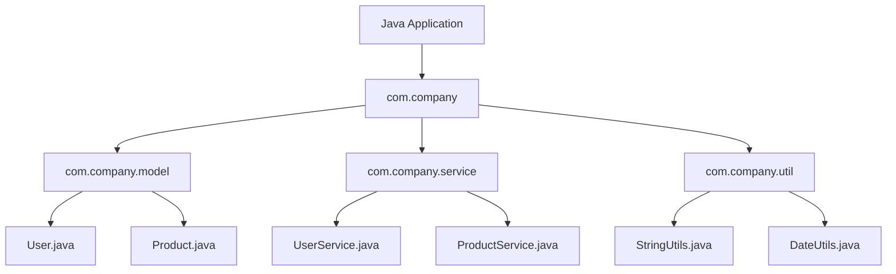
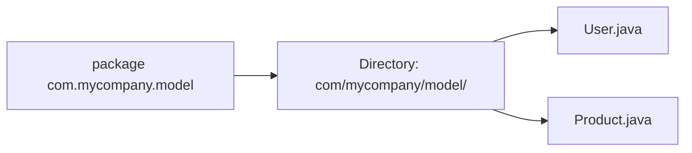
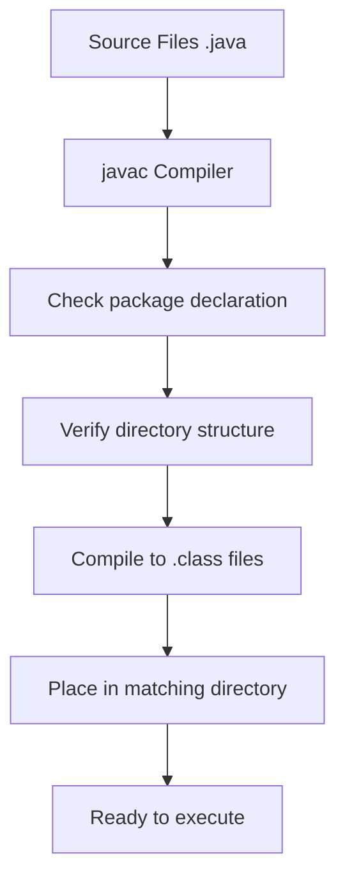
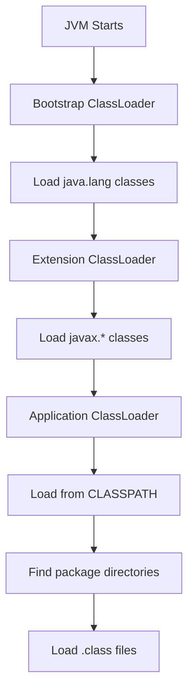
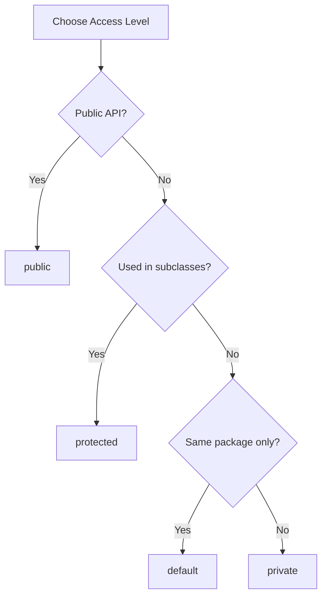

# Tutorial 14: Packages

## 📋 Table of Contents
- [Video Index](#video-index)
- [Introduction to Packages](#introduction-to-packages)
- [Creating and Using Packages](#creating-and-using-packages)
- [Package Naming Conventions](#package-naming-conventions)
- [Package Directory Structure](#package-directory-structure)
- [Import Statements](#import-statements)
- [Static Import](#static-import)
- [CLASSPATH and Package Resolution](#classpath-and-package-resolution)
- [Access Modifiers in Detail](#access-modifiers-in-detail)
- [Built-in Java Packages](#built-in-java-packages)
- [Best Practices](#best-practices)
- [Common Pitfalls](#common-pitfalls)
- [Interview Preparation](#interview-preparation)
- [Practice Exercises](#practice-exercises)
- [Further Reading](#further-reading)

---

## Video Index

| Video # | Topic | Key Concepts |
|---------|-------|--------------|
| 138 | Package | Package definition, purpose, organization, naming conventions |
| 139 | Example on package | Creating packages, compiling, running packaged classes |
| 140 | Access modifiers | public, private, protected, default access levels |

---

## Introduction to Packages

### What is a Package?

A **package** in Java is a namespace that organizes a set of related classes and interfaces. Conceptually, you can think of packages as being similar to different folders on your computer.

**Real-World Analogy:**
Think of packages like organizing files in your computer:
- **Documents** folder → `com.mycompany.documents`
- **Photos** folder → `com.mycompany.photos`
- **Music** folder → `com.mycompany.music`

Just as you wouldn't keep all files in one folder, you shouldn't keep all Java classes in one package.

### Why Use Packages?

```
┌─────────────────────────────────────────────────┐
│          Benefits of Using Packages             │
├─────────────────────────────────────────────────┤
│                                                 │
│  1. Organization                                │
│     └─ Group related classes logically         │
│                                                 │
│  2. Namespace Management                        │
│     └─ Avoid naming conflicts                  │
│                                                 │
│  3. Access Control                              │
│     └─ Package-private members                 │
│                                                 │
│  4. Modularization                              │
│     └─ Better code maintenance                 │
│                                                 │
│  5. Reusability                                 │
│     └─ Easy distribution and reuse             │
│                                                 │
│  6. Security                                    │
│     └─ Control visibility and access           │
│                                                 │
└─────────────────────────────────────────────────┘
```

### Package Hierarchy Visualization



### Types of Packages

**1. Built-in Packages (Standard Library)**
```java
java.lang    // Core classes (String, Math, System)
java.util    // Utility classes (Collections, Date)
java.io      // Input/Output classes
java.net     // Networking classes
java.sql     // Database connectivity
```

**2. User-defined Packages**
```java
com.mycompany.project
org.myorganization.module
```

---

## Creating and Using Packages

### Video 138: Package Basics

#### Creating a Package

**Syntax:**
```java
package package_name;
```

**Example 1: Simple Package**
```java
// File: MyClass.java
package com.example;

public class MyClass {
    public void display() {
        System.out.println("Hello from com.example package!");
    }
}
```

**Example 2: Multi-level Package**
```java
// File: Calculator.java
package com.mycompany.utilities.math;

public class Calculator {
    public int add(int a, int b) {
        return a + b;
    }
    
    public int subtract(int a, int b) {
        return a - b;
    }
}
```

#### Package Declaration Rules

```
┌──────────────────────────────────────────────┐
│         Package Declaration Rules            │
├──────────────────────────────────────────────┤
│                                              │
│  1. Must be the FIRST statement             │
│     └─ (except comments)                    │
│                                              │
│  2. Only ONE package statement per file     │
│     └─ A class can belong to only one pkg   │
│                                              │
│  3. Package names are lowercase             │
│     └─ Convention: all lowercase            │
│                                              │
│  4. Use domain name in reverse              │
│     └─ com.google, org.apache               │
│                                              │
│  5. No special characters except . and _    │
│     └─ Avoid hyphens and spaces             │
│                                              │
└──────────────────────────────────────────────┘
```

---

## Package Naming Conventions

### Standard Naming Convention

```java
// Recommended naming pattern
domain.company.project.module.submodule

// Examples
com.google.maps.navigation
org.apache.commons.lang
edu.mit.media.lab
gov.nasa.jpl.robotics
```

### Naming Convention Table

| Component | Convention | Example |
|-----------|------------|---------|
| **Commercial** | com.company | com.ibm.database |
| **Organization** | org.organization | org.apache.commons |
| **Educational** | edu.institution | edu.stanford.ai |
| **Government** | gov.agency | gov.nasa.apollo |
| **Network** | net.provider | net.cloudflare.dns |

### Package Naming Best Practices

```java
// ✅ GOOD - Clear, hierarchical, lowercase
package com.mycompany.inventory.management.warehouse;

// ✅ GOOD - Domain-based
package org.apache.maven.plugins;

// ❌ BAD - Mixed case
package com.MyCompany.Inventory;

// ❌ BAD - Using Java keywords
package com.company.class.public;

// ❌ BAD - Starting with digits
package com.company.2ndproject;

// ❌ BAD - Too generic
package utils;  // What kind of utils?
```

---

## Package Directory Structure

### File System Mapping

```
Project Root
│
├── src/
│   └── com/
│       └── mycompany/
│           ├── model/
│           │   ├── User.java
│           │   └── Product.java
│           │
│           ├── service/
│           │   ├── UserService.java
│           │   └── ProductService.java
│           │
│           └── util/
│               └── StringHelper.java
│
└── bin/  (or classes/)
    └── com/
        └── mycompany/
            ├── model/
            │   ├── User.class
            │   └── Product.class
            │
            ├── service/
            │   ├── UserService.class
            │   └── ProductService.class
            │
            └── util/
                └── StringHelper.class
```

### Package-to-Directory Mapping



**Rule:** Each dot (.) in package name = directory separator in file system

```java
package com.example.project.utils;
// Maps to: com/example/project/utils/
```

---

## Video 139: Example on Package

### Complete Package Example

#### Step 1: Create Package Structure

**Directory Structure:**
```
MyProject/
├── com/
│   └── ecommerce/
│       ├── model/
│       │   ├── Product.java
│       │   └── Customer.java
│       │
│       ├── service/
│       │   └── OrderService.java
│       │
│       └── Main.java
```

#### Step 2: Create Classes in Packages

**Product.java**
```java
// File: com/ecommerce/model/Product.java
package com.ecommerce.model;

public class Product {
    private int id;
    private String name;
    private double price;
    
    public Product(int id, String name, double price) {
        this.id = id;
        this.name = name;
        this.price = price;
    }
    
    // Getters
    public int getId() { return id; }
    public String getName() { return name; }
    public double getPrice() { return price; }
    
    @Override
    public String toString() {
        return "Product{id=" + id + ", name='" + name + 
               "', price=" + price + "}";
    }
}
```

**Customer.java**
```java
// File: com/ecommerce/model/Customer.java
package com.ecommerce.model;

public class Customer {
    private int id;
    private String name;
    private String email;
    
    public Customer(int id, String name, String email) {
        this.id = id;
        this.name = name;
        this.email = email;
    }
    
    // Getters
    public int getId() { return id; }
    public String getName() { return name; }
    public String getEmail() { return email; }
    
    @Override
    public String toString() {
        return "Customer{id=" + id + ", name='" + name + 
               "', email='" + email + "'}";
    }
}
```

**OrderService.java**
```java
// File: com/ecommerce/service/OrderService.java
package com.ecommerce.service;

import com.ecommerce.model.Product;
import com.ecommerce.model.Customer;

public class OrderService {
    public void placeOrder(Customer customer, Product product) {
        System.out.println("=== Order Placed ===");
        System.out.println("Customer: " + customer.getName());
        System.out.println("Product: " + product.getName());
        System.out.println("Price: $" + product.getPrice());
        System.out.println("Order confirmation sent to: " + 
                         customer.getEmail());
    }
    
    public double calculateTotal(Product[] products) {
        double total = 0.0;
        for (Product product : products) {
            total += product.getPrice();
        }
        return total;
    }
}
```

**Main.java**
```java
// File: com/ecommerce/Main.java
package com.ecommerce;

import com.ecommerce.model.Product;
import com.ecommerce.model.Customer;
import com.ecommerce.service.OrderService;

public class Main {
    public static void main(String[] args) {
        // Create products
        Product laptop = new Product(1, "Laptop", 999.99);
        Product mouse = new Product(2, "Mouse", 29.99);
        Product keyboard = new Product(3, "Keyboard", 79.99);
        
        // Create customer
        Customer customer = new Customer(101, "John Doe", 
                                       "john@example.com");
        
        // Create service
        OrderService orderService = new OrderService();
        
        // Place orders
        orderService.placeOrder(customer, laptop);
        
        // Calculate total
        Product[] cart = {laptop, mouse, keyboard};
        double total = orderService.calculateTotal(cart);
        System.out.println("\nCart Total: $" + total);
    }
}
```

#### Step 3: Compile and Run

**Compilation:**
```bash
# Compile all files (from project root)
javac com/ecommerce/model/*.java
javac com/ecommerce/service/*.java
javac com/ecommerce/Main.java

# Or compile all at once
javac com/ecommerce/model/*.java com/ecommerce/service/*.java com/ecommerce/Main.java
```

**Execution:**
```bash
# Run from project root
java com.ecommerce.Main
```

**Output:**
```
=== Order Placed ===
Customer: John Doe
Product: Laptop
Price: $999.99
Order confirmation sent to: john@example.com

Cart Total: $1109.97
```

### Compilation Flow Diagram



---

## Import Statements

### Types of Import

**1. Single Type Import**
```java
import java.util.ArrayList;
import java.util.HashMap;
```

**2. Import on Demand (Wildcard)**
```java
import java.util.*;  // Imports all classes from java.util
```

**3. Static Import**
```java
import static java.lang.Math.PI;
import static java.lang.Math.sqrt;
```

### Import Examples

**Example 1: Specific Imports**
```java
package com.example.test;

import java.util.ArrayList;
import java.util.List;
import com.ecommerce.model.Product;

public class ImportDemo {
    public static void main(String[] args) {
        List<Product> products = new ArrayList<>();
        // Use imported classes
    }
}
```

**Example 2: Wildcard Import**
```java
package com.example.test;

import java.util.*;  // All utility classes
import com.ecommerce.model.*;  // All model classes

public class WildcardDemo {
    public static void main(String[] args) {
        List<String> list = new ArrayList<>();
        Map<Integer, String> map = new HashMap<>();
    }
}
```

**Example 3: Fully Qualified Names (No Import)**
```java
package com.example.test;

public class NoImportDemo {
    public static void main(String[] args) {
        // Use fully qualified names
        java.util.List<String> list = new java.util.ArrayList<>();
        java.util.Date date = new java.util.Date();
    }
}
```

### Import Best Practices

```
┌─────────────────────────────────────────────┐
│          Import Best Practices              │
├─────────────────────────────────────────────┤
│                                             │
│  ✅ DO:                                     │
│     • Import specific classes when possible │
│     • Group imports logically               │
│     • Remove unused imports                 │
│     • Use IDE auto-import features          │
│                                             │
│  ❌ DON'T:                                  │
│     • Import java.lang.* (automatic)        │
│     • Overuse wildcard imports              │
│     • Import classes from default package   │
│     • Import classes you don't use          │
│                                             │
└─────────────────────────────────────────────┘
```

---

## Static Import

### What is Static Import?

Static import allows you to access static members of a class without qualifying them with the class name.

**Syntax:**
```java
import static package.ClassName.staticMember;
import static package.ClassName.*;  // All static members
```

### Static Import Examples

**Example 1: Math Class**
```java
// Without static import
public class MathDemo1 {
    public static void main(String[] args) {
        double result = Math.sqrt(Math.pow(3, 2) + Math.pow(4, 2));
        System.out.println("Hypotenuse: " + result);
        System.out.println("PI: " + Math.PI);
    }
}

// With static import
import static java.lang.Math.*;

public class MathDemo2 {
    public static void main(String[] args) {
        double result = sqrt(pow(3, 2) + pow(4, 2));
        System.out.println("Hypotenuse: " + result);
        System.out.println("PI: " + PI);
    }
}
```

**Example 2: System.out**
```java
import static java.lang.System.out;

public class StaticImportDemo {
    public static void main(String[] args) {
        out.println("No need to write System.out!");
        out.println("This is cleaner and shorter");
    }
}
```

**Example 3: Custom Static Members**
```java
// Constants.java
package com.example.config;

public class Constants {
    public static final String APP_NAME = "MyApp";
    public static final String VERSION = "1.0.0";
    public static final int MAX_USERS = 1000;
    
    public static String getFullName() {
        return APP_NAME + " v" + VERSION;
    }
}

// Main.java
package com.example;

import static com.example.config.Constants.*;

public class Main {
    public static void main(String[] args) {
        System.out.println("Application: " + APP_NAME);
        System.out.println("Version: " + VERSION);
        System.out.println("Max Users: " + MAX_USERS);
        System.out.println("Full Name: " + getFullName());
    }
}
```

### Static Import Pros and Cons

| Aspect | Pros | Cons |
|--------|------|------|
| **Readability** | Shorter code | Can be confusing |
| **Typing** | Less typing | Origin unclear |
| **Maintenance** | Cleaner for constants | Hard to track source |
| **Use Cases** | Math operations, Constants | General methods |

**Guidelines:**
- ✅ Good for: Mathematical operations, well-known constants
- ❌ Avoid for: Regular methods, unclear context

---

## CLASSPATH and Package Resolution

### Understanding CLASSPATH

**CLASSPATH** is an environment variable that tells the JVM where to look for user-defined classes and packages.

```
┌─────────────────────────────────────────┐
│         CLASSPATH Components            │
├─────────────────────────────────────────┤
│                                         │
│  1. Current Directory (.)               │
│  2. JAR Files                           │
│  3. Directory Paths                     │
│  4. ZIP Files containing classes        │
│                                         │
└─────────────────────────────────────────┘
```

### Setting CLASSPATH

**Windows:**
```cmd
# Temporary (current session)
set CLASSPATH=.;C:\myproject\classes;C:\libs\mylib.jar

# Permanent (System Properties → Environment Variables)
CLASSPATH=.;C:\myproject\classes;C:\libs\mylib.jar
```

**Linux/Mac:**
```bash
# Temporary (current session)
export CLASSPATH=.:"/home/user/myproject/classes:/libs/mylib.jar"

# Permanent (add to ~/.bashrc or ~/.bash_profile)
export CLASSPATH=.:"/home/user/myproject/classes:/libs/mylib.jar"
```

### CLASSPATH Examples

**Example 1: Using -cp Flag**
```bash
# Compile with classpath
javac -cp .:lib/mylib.jar com/example/Main.java

# Run with classpath
java -cp .:lib/mylib.jar com.example.Main
```

**Example 2: Multiple Paths**
```bash
# Windows
java -cp .;C:\libs\lib1.jar;C:\libs\lib2.jar com.example.Main

# Linux/Mac
java -cp .:libs/lib1.jar:libs/lib2.jar com.example.Main
```

### Class Loading Process



---

## Video 140: Access Modifiers in Detail

### The Four Access Levels

Java provides four access modifiers to control visibility:

```
┌──────────────────────────────────────────────────┐
│         Access Modifier Hierarchy                │
├──────────────────────────────────────────────────┤
│                                                  │
│  public      ████████████████  (Most Open)      │
│  protected   ████████████                        │
│  default     ████████                            │
│  private     ████              (Most Restricted) │
│                                                  │
└──────────────────────────────────────────────────┘
```

### Access Modifier Comparison Table

| Modifier | Same Class | Same Package | Subclass (Different Package) | Other Package |
|----------|------------|--------------|------------------------------|---------------|
| **public** | ✅ Yes | ✅ Yes | ✅ Yes | ✅ Yes |
| **protected** | ✅ Yes | ✅ Yes | ✅ Yes | ❌ No |
| **default** | ✅ Yes | ✅ Yes | ❌ No | ❌ No |
| **private** | ✅ Yes | ❌ No | ❌ No | ❌ No |

### 1. Public Access Modifier

**Characteristics:**
- Most permissive access level
- Accessible from anywhere
- Used for API classes meant for external use

**Example:**
```java
// File: com/example/model/User.java
package com.example.model;

public class User {
    public String name;
    
    public void displayName() {
        System.out.println("Name: " + name);
    }
}

// File: com/other/application/Main.java
package com.other.application;

import com.example.model.User;

public class Main {
    public static void main(String[] args) {
        User user = new User();
        user.name = "Alice";  // Accessible
        user.displayName();   // Accessible
    }
}
```

### 2. Private Access Modifier

**Characteristics:**
- Most restrictive access level
- Only accessible within the same class
- Supports encapsulation

**Example:**
```java
package com.example;

public class BankAccount {
    private double balance;  // Private field
    
    private void auditLog(String message) {  // Private method
        System.out.println("[AUDIT] " + message);
    }
    
    public void deposit(double amount) {
        if (amount > 0) {
            balance += amount;
            auditLog("Deposited: " + amount);
        }
    }
    
    public double getBalance() {
        return balance;
    }
}

// Usage
public class Main {
    public static void main(String[] args) {
        BankAccount account = new BankAccount();
        // account.balance = 1000;  // ❌ Error: balance has private access
        // account.auditLog("test"); // ❌ Error: auditLog has private access
        account.deposit(1000);      // ✅ OK: public method
        System.out.println(account.getBalance()); // ✅ OK
    }
}
```

### 3. Protected Access Modifier

**Characteristics:**
- Accessible within same package
- Accessible in subclasses (even different package)
- Used for inheritance scenarios

**Example:**
```java
// File: com/example/parent/Animal.java
package com.example.parent;

public class Animal {
    protected String species;
    
    protected void makeSound() {
        System.out.println("Some sound");
    }
}

// File: com/example/parent/Cat.java (Same package)
package com.example.parent;

public class Cat extends Animal {
    public void display() {
        species = "Feline";  // ✅ Accessible (same package)
        makeSound();         // ✅ Accessible (same package)
    }
}

// File: com/other/child/Dog.java (Different package)
package com.other.child;

import com.example.parent.Animal;

public class Dog extends Animal {
    public void display() {
        species = "Canine";  // ✅ Accessible (through inheritance)
        makeSound();         // ✅ Accessible (through inheritance)
    }
}

// File: com/other/Main.java (Different package, not subclass)
package com.other;

import com.example.parent.Animal;

public class Main {
    public static void main(String[] args) {
        Animal animal = new Animal();
        // animal.species = "Test";  // ❌ Error: protected access
        // animal.makeSound();       // ❌ Error: protected access
    }
}
```

### 4. Default (Package-Private) Access Modifier

**Characteristics:**
- No keyword needed (absence of modifier)
- Accessible only within same package
- Most restrictive after private

**Example:**
```java
// File: com/example/utils/Helper.java
package com.example.utils;

class Helper {  // Default (package-private) class
    String message = "Hello";  // Default field
    
    void display() {  // Default method
        System.out.println(message);
    }
}

// File: com/example/utils/Manager.java (Same package)
package com.example.utils;

public class Manager {
    public void test() {
        Helper helper = new Helper();  // ✅ Accessible (same package)
        helper.display();              // ✅ Accessible (same package)
    }
}

// File: com/other/Main.java (Different package)
package com.other;

import com.example.utils.Helper;  // ❌ Error: Helper is not public

public class Main {
    public static void main(String[] args) {
        // Helper helper = new Helper();  // ❌ Cannot access
    }
}
```

### Access Modifiers with Class Members

**Comprehensive Example:**
```java
package com.example;

public class AccessDemo {
    // Different access levels for fields
    public String publicField = "Public";
    protected String protectedField = "Protected";
    String defaultField = "Default";
    private String privateField = "Private";
    
    // Different access levels for methods
    public void publicMethod() {
        System.out.println("Public method");
    }
    
    protected void protectedMethod() {
        System.out.println("Protected method");
    }
    
    void defaultMethod() {
        System.out.println("Default method");
    }
    
    private void privateMethod() {
        System.out.println("Private method");
    }
    
    // All accessible within same class
    public void testAccess() {
        System.out.println(publicField);
        System.out.println(protectedField);
        System.out.println(defaultField);
        System.out.println(privateField);  // ✅ All accessible
        
        publicMethod();
        protectedMethod();
        defaultMethod();
        privateMethod();  // ✅ All accessible
    }
}
```

### Access Modifiers for Classes

**Top-level Classes:**
```java
// Only public or default (package-private)
public class PublicClass {  // ✅ OK
    // ...
}

class DefaultClass {  // ✅ OK (package-private)
    // ...
}

// protected class ProtectedClass { }  // ❌ Error: not allowed
// private class PrivateClass { }      // ❌ Error: not allowed
```

**Inner Classes:**
```java
public class OuterClass {
    public class PublicInner { }     // ✅ OK
    protected class ProtectedInner { }  // ✅ OK
    class DefaultInner { }           // ✅ OK
    private class PrivateInner { }   // ✅ OK
}
```

### Access Modifier Decision Tree



---

## Built-in Java Packages

### Core Java Packages

**1. java.lang**
```java
// Automatically imported
String str = "Hello";  // java.lang.String
int num = Integer.parseInt("123");  // java.lang.Integer
System.out.println("Output");  // java.lang.System
Math.sqrt(16);  // java.lang.Math
```

**2. java.util**
```java
import java.util.*;

List<String> list = new ArrayList<>();
Map<String, Integer> map = new HashMap<>();
Date date = new Date();
Scanner scanner = new Scanner(System.in);
```

**3. java.io**
```java
import java.io.*;

FileReader reader = new FileReader("file.txt");
BufferedReader buffered = new BufferedReader(reader);
FileWriter writer = new FileWriter("output.txt");
```

**4. java.net**
```java
import java.net.*;

URL url = new URL("https://example.com");
Socket socket = new Socket("localhost", 8080);
```

**5. java.sql**
```java
import java.sql.*;

Connection conn = DriverManager.getConnection(url, user, password);
Statement stmt = conn.createStatement();
ResultSet rs = stmt.executeQuery("SELECT * FROM users");
```

### Package Organization Map

```
java.*
├── java.lang (Core classes - auto-imported)
│   ├── String, Integer, Double, etc.
│   ├── System, Math, Thread
│   └── Exception classes
│
├── java.util (Utilities)
│   ├── Collections (List, Set, Map)
│   ├── Date, Calendar
│   └── Scanner, Random
│
├── java.io (Input/Output)
│   ├── File, FileReader, FileWriter
│   ├── InputStream, OutputStream
│   └── Serialization classes
│
├── java.net (Networking)
│   ├── URL, URLConnection
│   └── Socket, ServerSocket
│
├── java.sql (Database)
│   ├── Connection, Statement
│   └── ResultSet, DriverManager
│
└── java.awt / javax.swing (GUI)
    ├── Frame, Panel, Button
    └── JFrame, JButton, JTextField
```

---

## Best Practices

### 1. Package Organization Guidelines

```
✅ DO:
├─ Use meaningful, hierarchical names
├─ Follow reverse domain naming
├─ Keep packages cohesive (related classes together)
├─ Separate concerns (model, service, util, etc.)
├─ Use consistent naming across project
└─ Document package purposes

❌ DON'T:
├─ Create overly deep hierarchies
├─ Mix unrelated classes in same package
├─ Use generic names (utils, misc, common)
├─ Violate package dependencies
├─ Create circular dependencies
└─ Put everything in one package
```

### 2. Access Modifier Guidelines

**When to Use Each Modifier:**

```java
// public - For API classes and methods meant for external use
public class PublicAPI {
    public void publicMethod() { }
}

// protected - For inheritance-based design
public class Parent {
    protected void inheritableMethod() { }
}

// default - For package-internal collaborators
class PackageHelper {
    void packageMethod() { }
}

// private - For implementation details
public class EncapsulatedClass {
    private int internalData;
    private void internalLogic() { }
}
```

### 3. Import Organization

**Recommended Import Order:**
```java
// 1. Java standard library
import java.io.File;
import java.util.ArrayList;
import java.util.List;

// 2. Third-party libraries
import org.apache.commons.lang3.StringUtils;
import com.google.gson.Gson;

// 3. Your own packages
import com.mycompany.model.User;
import com.mycompany.service.UserService;

public class MyClass {
    // Class implementation
}
```

### 4. Package Size and Cohesion

**Good Package Structure:**
```
com.myapp
├── model/          (5-10 domain classes)
├── repository/     (Data access layer)
├── service/        (Business logic)
├── controller/     (REST endpoints)
├── util/           (Helper utilities)
├── exception/      (Custom exceptions)
└── config/         (Configuration classes)
```

**Too Granular (Avoid):**
```
com.myapp.model.user.entity
com.myapp.model.user.dto
com.myapp.model.user.validator
```

### 5. Dependency Management

**Principle of Least Knowledge (Law of Demeter):**
```java
// ❌ BAD - Violates Law of Demeter
customer.getAddress().getCity().getName()

// ✅ GOOD - Encapsulate navigation
customer.getCityName()
```

**Avoid Circular Dependencies:**
```
❌ BAD:
com.app.service → depends on → com.app.repository
com.app.repository → depends on → com.app.service

✅ GOOD:
com.app.service → depends on → com.app.repository
com.app.repository → no dependency on service
```

### 6. Package Naming Checklist

```
✅ Checklist for Good Package Names:
□ All lowercase letters
□ Uses reverse domain notation
□ No underscores or hyphens
□ No Java keywords
□ Descriptive and meaningful
□ Not too long (3-4 levels ideal)
□ Consistent with project structure
```

---

## Common Pitfalls

### Pitfall 1: Forgetting Package Declaration

```java
// ❌ BAD - No package declaration
public class MyClass {
    // This goes into default (unnamed) package
    // Cannot be imported from other packages
}

// ✅ GOOD
package com.mycompany.project;

public class MyClass {
    // Properly organized
}
```

**Problem:** Classes in default package cannot be imported.
**Solution:** Always declare a package.

### Pitfall 2: Mismatched Package and Directory Structure

```
❌ BAD:
File Location: src/com/example/MyClass.java
Package Declaration: package com.mycompany;  // Mismatch!

✅ GOOD:
File Location: src/com/example/MyClass.java
Package Declaration: package com.example;  // Matches!
```

**Problem:** Compiler error - "class is public, should be declared in a file named..."
**Solution:** Ensure directory structure matches package declaration.

### Pitfall 3: Wildcard Import Ambiguity

```java
// ❌ BAD - Ambiguous imports
import java.util.*;
import java.sql.*;

public class DateDemo {
    public static void main(String[] args) {
        Date date = new Date();  // Which Date? util or sql?
    }
}

// ✅ GOOD - Explicit imports
import java.util.Date;
// OR
import java.sql.Date;

public class DateDemo {
    public static void main(String[] args) {
        Date date = new Date();  // Clear which one
    }
}
```

**Problem:** Ambiguity when multiple packages have same class name.
**Solution:** Use specific imports or fully qualified names.

### Pitfall 4: Overusing Static Import

```java
// ❌ BAD - Too many static imports
import static java.lang.Math.*;
import static java.util.Collections.*;
import static com.mycompany.Constants.*;

public class ConfusingClass {
    public void method() {
        sort(list);  // Where does 'sort' come from?
        max(a, b);   // What about 'max'?
    }
}

// ✅ GOOD - Judicious use
import static java.lang.Math.PI;
import static java.lang.Math.sqrt;
import java.util.Collections;

public class ClearClass {
    public void method() {
        Collections.sort(list);  // Clear origin
        double circumference = 2 * PI * radius;  // OK for constants
    }
}
```

**Problem:** Code becomes hard to understand.
**Solution:** Use static import sparingly, mainly for constants.

### Pitfall 5: Incorrect Access Modifier Usage

```java
// ❌ BAD - Exposing implementation details
package com.example;

public class User {
    public String password;  // Security risk!
    public List<String> internalCache;  // Implementation detail exposed
}

// ✅ GOOD - Proper encapsulation
package com.example;

public class User {
    private String password;  // Encapsulated
    private List<String> internalCache;  // Hidden
    
    // Controlled access
    public boolean verifyPassword(String input) {
        // Secure verification logic
        return password.equals(hash(input));
    }
}
```

**Problem:** Breaking encapsulation, security issues.
**Solution:** Use private by default, expose only necessary APIs.

### Pitfall 6: Package Dependency Cycles

```java
// ❌ BAD - Circular dependency
// File: com/example/service/UserService.java
package com.example.service;
import com.example.repository.UserRepository;

public class UserService {
    private UserRepository repository;
}

// File: com/example/repository/UserRepository.java
package com.example.repository;
import com.example.service.UserService;  // Circular!

public class UserRepository {
    private UserService service;  // Creates cycle
}

// ✅ GOOD - One-way dependency
// File: com/example/service/UserService.java
package com.example.service;
import com.example.repository.UserRepository;

public class UserService {
    private UserRepository repository;  // Service depends on Repository
}

// File: com/example/repository/UserRepository.java
package com.example.repository;
// No import of UserService

public class UserRepository {
    // No dependency on service layer
}
```

**Problem:** Tight coupling, hard to maintain.
**Solution:** Ensure unidirectional dependencies (service → repository → model).

---

## Interview Preparation

### Conceptual Questions

**Q1: What is a package in Java? Why do we use packages?**

**Answer:**
A package is a namespace that organizes related classes and interfaces. We use packages for:
- **Organization**: Grouping related classes logically
- **Namespace Management**: Avoiding naming conflicts
- **Access Control**: Package-private access level
- **Distribution**: Easier code reuse and library distribution
- **Modularity**: Better code structure and maintenance

**Q2: What is the difference between import and static import?**

**Answer:**
```java
// Regular import - imports classes/interfaces
import java.util.ArrayList;
ArrayList<String> list = new ArrayList<>();

// Static import - imports static members
import static java.lang.Math.PI;
import static java.lang.Math.sqrt;
double area = PI * sqrt(radius);  // No need for Math.PI
```

Regular import brings in types (classes, interfaces), while static import brings in static members (methods, constants) allowing direct usage without class qualification.

**Q3: Can we have multiple public classes in a single Java file?**

**Answer:**
No. A Java source file can have only ONE public class, and the file name must match the public class name. However, you can have multiple non-public (default access) classes in the same file.

```java
// File: MyClass.java
public class MyClass {  // ✅ OK
    // ...
}

class Helper {  // ✅ OK - default access
    // ...
}

// public class Another { }  // ❌ Error: Only one public class allowed
```

**Q4: What is the default package? Why should we avoid it?**

**Answer:**
The default package is the unnamed package for classes without package declaration. We should avoid it because:
1. Classes in default package cannot be imported
2. Not suitable for real applications
3. Poor organization and maintainability
4. No namespace protection

```java
// ❌ BAD - Default package
public class MyClass { }

// ✅ GOOD - Named package
package com.mycompany.project;
public class MyClass { }
```

**Q5: Explain the four access modifiers with examples.**

**Answer:**

| Modifier | Visibility | Use Case |
|----------|------------|----------|
| **public** | Everywhere | Public APIs, main classes |
| **protected** | Package + subclasses | Methods meant for inheritance |
| **default** | Package only | Package-internal helpers |
| **private** | Class only | Implementation details |

```java
public class AccessDemo {
    public int publicVar;        // Accessible everywhere
    protected int protectedVar;  // Package + subclasses
    int defaultVar;              // Package only
    private int privateVar;      // Class only
}
```

**Q6: What is CLASSPATH? How does it work?**

**Answer:**
CLASSPATH is an environment variable that tells JVM where to look for user-defined classes and packages. It can include:
- Directories containing .class files
- JAR files
- Current directory (.)

```bash
# Set CLASSPATH
export CLASSPATH=.:lib/mylib.jar:classes/

# Or use -cp flag
java -cp .:lib/mylib.jar com.example.Main
```

The JVM searches locations in order specified in CLASSPATH.

**Q7: Can a class be private or protected at the top level?**

**Answer:**
No. Top-level classes can only be **public** or **default (package-private)**.
Private and protected are only allowed for inner/nested classes.

```java
public class Outer { }        // ✅ OK
class PackagePrivate { }      // ✅ OK
// private class Private { }  // ❌ Error
// protected class Prot { }   // ❌ Error

public class Container {
    private class Inner { }      // ✅ OK for inner classes
    protected class Protected { } // ✅ OK for inner classes
}
```

**Q8: What happens if we don't import java.lang classes?**

**Answer:**
Nothing - `java.lang` is automatically imported by default. We don't need to explicitly import classes like String, Integer, System, Math, etc.

```java
// No import needed
public class Demo {
    public static void main(String[] args) {
        String str = "Hello";  // java.lang.String
        System.out.println(str);  // java.lang.System
        int num = Integer.parseInt("123");  // java.lang.Integer
    }
}
```

### Coding Questions

**Q9: Create a package structure for an e-commerce application.**

**Answer:**
```
com.ecommerce
├── model/
│   ├── Product.java
│   ├── Customer.java
│   ├── Order.java
│   └── Payment.java
│
├── repository/
│   ├── ProductRepository.java
│   ├── CustomerRepository.java
│   └── OrderRepository.java
│
├── service/
│   ├── ProductService.java
│   ├── OrderService.java
│   └── PaymentService.java
│
├── controller/
│   ├── ProductController.java
│   └── OrderController.java
│
├── util/
│   ├── ValidationUtil.java
│   └── DateUtil.java
│
└── exception/
    ├── ProductNotFoundException.java
    └── InvalidOrderException.java
```

**Q10: Demonstrate all four access modifiers in a practical scenario.**

**Answer:**
```java
// File: com/example/BankAccount.java
package com.example;

public class BankAccount {
    // private - Internal implementation detail
    private double balance;
    private String accountNumber;
    
    // default - Package-level helper
    void logTransaction(String message) {
        System.out.println("[LOG] " + message);
    }
    
    // protected - For subclasses (e.g., SavingsAccount)
    protected double calculateInterest(double rate) {
        return balance * rate;
    }
    
    // public - External API
    public void deposit(double amount) {
        if (amount > 0) {
            balance += amount;
            logTransaction("Deposited: " + amount);
        }
    }
    
    public double getBalance() {
        return balance;
    }
}

// Subclass in different package
package com.example.savings;

import com.example.BankAccount;

public class SavingsAccount extends BankAccount {
    public void addInterest() {
        double interest = calculateInterest(0.05);  // ✅ protected accessible
        deposit(interest);  // ✅ public accessible
        // balance += interest;  // ❌ private not accessible
        // logTransaction("Interest added");  // ❌ default not accessible
    }
}
```

**Q11: Write code showing protected access from subclass vs non-subclass.**

**Answer:**
```java
// File: com/parent/Animal.java
package com.parent;

public class Animal {
    protected void makeSound() {
        System.out.println("Animal sound");
    }
}

// File: com/child/Dog.java - Subclass in different package
package com.child;

import com.parent.Animal;

public class Dog extends Animal {
    public void bark() {
        makeSound();  // ✅ Accessible through inheritance
    }
    
    public void test() {
        Dog dog = new Dog();
        dog.makeSound();  // ✅ Accessible on Dog instance
        
        Animal animal = new Animal();
        // animal.makeSound();  // ❌ Error: protected, not accessible
    }
}

// File: com/other/Main.java - Non-subclass in different package
package com.other;

import com.parent.Animal;

public class Main {
    public static void main(String[] args) {
        Animal animal = new Animal();
        // animal.makeSound();  // ❌ Error: protected access
    }
}
```

---

## Practice Exercises

### Exercise 1: Build a Library Management System

**Objective:** Create a package structure for a library management system with proper access modifiers.

**Requirements:**
1. Create packages: `model`, `service`, `util`
2. Model classes: `Book`, `Member`, `Loan`
3. Service class: `LibraryService`
4. Use appropriate access modifiers

**Solution:**
```java
// File: com/library/model/Book.java
package com.library.model;

public class Book {
    private String isbn;
    private String title;
    private String author;
    private boolean available;
    
    public Book(String isbn, String title, String author) {
        this.isbn = isbn;
        this.title = title;
        this.author = author;
        this.available = true;
    }
    
    // Getters and setters
    public String getIsbn() { return isbn; }
    public String getTitle() { return title; }
    public String getAuthor() { return author; }
    public boolean isAvailable() { return available; }
    
    protected void setAvailable(boolean available) {
        this.available = available;
    }
    
    @Override
    public String toString() {
        return "Book{isbn='" + isbn + "', title='" + title + 
               "', author='" + author + "', available=" + available + "}";
    }
}

// File: com/library/model/Member.java
package com.library.model;

public class Member {
    private String memberId;
    private String name;
    private String email;
    
    public Member(String memberId, String name, String email) {
        this.memberId = memberId;
        this.name = name;
        this.email = email;
    }
    
    public String getMemberId() { return memberId; }
    public String getName() { return name; }
    public String getEmail() { return email; }
    
    @Override
    public String toString() {
        return "Member{id='" + memberId + "', name='" + name + 
               "', email='" + email + "'}";
    }
}

// File: com/library/model/Loan.java
package com.library.model;

import java.time.LocalDate;

public class Loan {
    private Book book;
    private Member member;
    private LocalDate loanDate;
    private LocalDate dueDate;
    
    public Loan(Book book, Member member) {
        this.book = book;
        this.member = member;
        this.loanDate = LocalDate.now();
        this.dueDate = loanDate.plusDays(14);  // 2-week loan
    }
    
    public Book getBook() { return book; }
    public Member getMember() { return member; }
    public LocalDate getDueDate() { return dueDate; }
    
    public boolean isOverdue() {
        return LocalDate.now().isAfter(dueDate);
    }
}

// File: com/library/service/LibraryService.java
package com.library.service;

import com.library.model.Book;
import com.library.model.Member;
import com.library.model.Loan;
import java.util.ArrayList;
import java.util.List;

public class LibraryService {
    private List<Book> books;
    private List<Member> members;
    private List<Loan> loans;
    
    public LibraryService() {
        this.books = new ArrayList<>();
        this.members = new ArrayList<>();
        this.loans = new ArrayList<>();
    }
    
    public void addBook(Book book) {
        books.add(book);
        System.out.println("Book added: " + book.getTitle());
    }
    
    public void registerMember(Member member) {
        members.add(member);
        System.out.println("Member registered: " + member.getName());
    }
    
    public boolean loanBook(String isbn, String memberId) {
        Book book = findBookByIsbn(isbn);
        Member member = findMemberById(memberId);
        
        if (book != null && member != null && book.isAvailable()) {
            book.setAvailable(false);  // protected method accessible
            Loan loan = new Loan(book, member);
            loans.add(loan);
            System.out.println("Book loaned: " + book.getTitle() + 
                             " to " + member.getName());
            return true;
        }
        return false;
    }
    
    public void returnBook(String isbn) {
        for (Loan loan : loans) {
            if (loan.getBook().getIsbn().equals(isbn)) {
                loan.getBook().setAvailable(true);
                loans.remove(loan);
                System.out.println("Book returned: " + 
                                 loan.getBook().getTitle());
                return;
            }
        }
    }
    
    private Book findBookByIsbn(String isbn) {
        for (Book book : books) {
            if (book.getIsbn().equals(isbn)) {
                return book;
            }
        }
        return null;
    }
    
    private Member findMemberById(String memberId) {
        for (Member member : members) {
            if (member.getMemberId().equals(memberId)) {
                return member;
            }
        }
        return null;
    }
    
    public void listAvailableBooks() {
        System.out.println("\n=== Available Books ===");
        for (Book book : books) {
            if (book.isAvailable()) {
                System.out.println(book);
            }
        }
    }
}

// File: com/library/Main.java
package com.library;

import com.library.model.Book;
import com.library.model.Member;
import com.library.service.LibraryService;

public class Main {
    public static void main(String[] args) {
        LibraryService library = new LibraryService();
        
        // Add books
        library.addBook(new Book("ISBN001", "Java Programming", "John Doe"));
        library.addBook(new Book("ISBN002", "Data Structures", "Jane Smith"));
        library.addBook(new Book("ISBN003", "Algorithms", "Bob Johnson"));
        
        // Register members
        library.registerMember(new Member("M001", "Alice", "alice@email.com"));
        library.registerMember(new Member("M002", "Bob", "bob@email.com"));
        
        // List available books
        library.listAvailableBooks();
        
        // Loan books
        library.loanBook("ISBN001", "M001");
        library.loanBook("ISBN002", "M002");
        
        // List available books after loans
        library.listAvailableBooks();
        
        // Return book
        library.returnBook("ISBN001");
        
        // List available books after return
        library.listAvailableBooks();
    }
}
```

**Compilation and Execution:**
```bash
# Compile
javac com/library/model/*.java
javac com/library/service/*.java
javac com/library/Main.java

# Run
java com.library.Main
```

### Exercise 2: Package Access Modifier Demonstration

**Objective:** Create classes demonstrating all four access levels.

**Solution:**
```java
// File: com/demo/AccessLevels.java
package com.demo;

public class AccessLevels {
    public int publicVar = 1;
    protected int protectedVar = 2;
    int defaultVar = 3;
    private int privateVar = 4;
    
    public void printAll() {
        System.out.println("All accessible within same class:");
        System.out.println("public: " + publicVar);
        System.out.println("protected: " + protectedVar);
        System.out.println("default: " + defaultVar);
        System.out.println("private: " + privateVar);
    }
}

// File: com/demo/SamePackageClass.java
package com.demo;

public class SamePackageClass {
    public void test() {
        AccessLevels obj = new AccessLevels();
        System.out.println("\nSame package access:");
        System.out.println("public: " + obj.publicVar);        // ✅
        System.out.println("protected: " + obj.protectedVar);  // ✅
        System.out.println("default: " + obj.defaultVar);      // ✅
        // System.out.println("private: " + obj.privateVar);   // ❌
    }
}

// File: com/other/DifferentPackageClass.java
package com.other;

import com.demo.AccessLevels;

public class DifferentPackageClass {
    public void test() {
        AccessLevels obj = new AccessLevels();
        System.out.println("\nDifferent package access:");
        System.out.println("public: " + obj.publicVar);        // ✅
        // System.out.println("protected: " + obj.protectedVar); // ❌
        // System.out.println("default: " + obj.defaultVar);     // ❌
        // System.out.println("private: " + obj.privateVar);     // ❌
    }
}

// File: com/other/SubclassAccess.java
package com.other;

import com.demo.AccessLevels;

public class SubclassAccess extends AccessLevels {
    public void test() {
        System.out.println("\nSubclass in different package:");
        System.out.println("public: " + publicVar);        // ✅
        System.out.println("protected: " + protectedVar);  // ✅
        // System.out.println("default: " + defaultVar);   // ❌
        // System.out.println("private: " + privateVar);   // ❌
    }
}
```

### Exercise 3: Static Import Practice

**Objective:** Refactor code using static import appropriately.

**Before (Without Static Import):**
```java
import java.lang.Math;

public class MathOperations {
    public double calculateCircleArea(double radius) {
        return Math.PI * Math.pow(radius, 2);
    }
    
    public double calculateDistance(double x1, double y1, 
                                   double x2, double y2) {
        return Math.sqrt(Math.pow(x2 - x1, 2) + Math.pow(y2 - y1, 2));
    }
    
    public double calculateHypotenuse(double a, double b) {
        return Math.sqrt(Math.pow(a, 2) + Math.pow(b, 2));
    }
}
```

**After (With Static Import):**
```java
import static java.lang.Math.PI;
import static java.lang.Math.pow;
import static java.lang.Math.sqrt;

public class MathOperations {
    public double calculateCircleArea(double radius) {
        return PI * pow(radius, 2);
    }
    
    public double calculateDistance(double x1, double y1, 
                                   double x2, double y2) {
        return sqrt(pow(x2 - x1, 2) + pow(y2 - y1, 2));
    }
    
    public double calculateHypotenuse(double a, double b) {
        return sqrt(pow(a, 2) + pow(b, 2));
    }
}
```

### Exercise 4: Fix Package Structure Problems

**Problem Code:**
```java
// File: MyClass.java (in default package)
public class MyClass {
    public void display() {
        System.out.println("Hello");
    }
}

// File: Main.java (in default package)
import MyClass;  // Error!

public class Main {
    public static void main(String[] args) {
        MyClass obj = new MyClass();
        obj.display();
    }
}
```

**Fixed Code:**
```java
// File: com/myapp/util/MyClass.java
package com.myapp.util;

public class MyClass {
    public void display() {
        System.out.println("Hello");
    }
}

// File: com/myapp/Main.java
package com.myapp;

import com.myapp.util.MyClass;

public class Main {
    public static void main(String[] args) {
        MyClass obj = new MyClass();
        obj.display();
    }
}
```

---

## Further Reading

### Books

1. **"Effective Java" by Joshua Bloch**
   - Item 15: Minimize the accessibility of classes and members
   - Item 16: In public classes, use accessor methods, not public fields
   - Item 25: Limit source files to a single top-level class

2. **"Clean Code" by Robert C. Martin**
   - Chapter 10: Classes (organization and encapsulation)
   - Chapter 13: Concurrency (package organization)

3. **"Java: The Complete Reference" by Herbert Schildt**
   - Chapter 9: Packages and Interfaces

### Online Resources

1. **Oracle Java Documentation**
   - [Packages Tutorial](https://docs.oracle.com/javase/tutorial/java/package/)
   - [Access Control](https://docs.oracle.com/javase/tutorial/java/javaOO/accesscontrol.html)

2. **Baeldung**
   - [Java Packages](https://www.baeldung.com/java-packages)
   - [Java Access Modifiers](https://www.baeldung.com/java-access-modifiers)

3. **JavaPoint**
   - [Java Package Tutorial](https://www.javatpoint.com/package)

### Best Practices Resources

1. **Google Java Style Guide**
   - Package naming conventions
   - Import ordering

2. **Oracle Code Conventions**
   - File organization
   - Package structure

### Advanced Topics

1. **Module System (Java 9+)**
   - Understanding modules vs packages
   - Module declarations
   - Encapsulation at module level

2. **OSGi Framework**
   - Advanced package management
   - Dynamic module loading

3. **Maven/Gradle**
   - Package organization in build tools
   - Dependency management

### Key Takeaways

```
┌──────────────────────────────────────────────┐
│         Package Mastery Checklist            │
├──────────────────────────────────────────────┤
│                                              │
│  ✓ Packages organize related classes        │
│  ✓ Use reverse domain notation              │
│  ✓ Four access levels: public, protected,   │
│    default, private                          │
│  ✓ Choose access level based on need        │
│  ✓ Import specific classes when possible    │
│  ✓ Use static import judiciously            │
│  ✓ CLASSPATH tells JVM where to find classes│
│  ✓ Directory structure must match package   │
│  ✓ Avoid default package in production      │
│  ✓ Minimize accessibility - encapsulation   │
│                                              │
└──────────────────────────────────────────────┘
```

---

## Summary

This tutorial covered **Java Packages** based on videos 138-140:

1. **Package Basics** (Video 138)
   - Package definition and purpose
   - Creating packages
   - Naming conventions
   - Package organization

2. **Package Examples** (Video 139)
   - Complete e-commerce example
   - Compilation and execution
   - Import statements
   - Static imports

3. **Access Modifiers** (Video 140)
   - Four access levels: public, protected, default, private
   - Visibility rules and examples
   - Access modifier decision-making
   - Top-level vs inner class modifiers

**Key Concepts:**
- Packages provide namespace management and organization
- Use reverse domain notation for package names
- Access modifiers control visibility at different scopes
- Proper encapsulation requires choosing appropriate access levels
- CLASSPATH determines where JVM looks for classes
- Directory structure must match package declaration

**Next Steps:**
- Practice creating well-organized package structures
- Experiment with different access modifiers
- Build multi-package applications
- Study Java standard library package organization

---

*Related Videos: 138-140 | Total: 3 videos | RBR Java Full Course*
