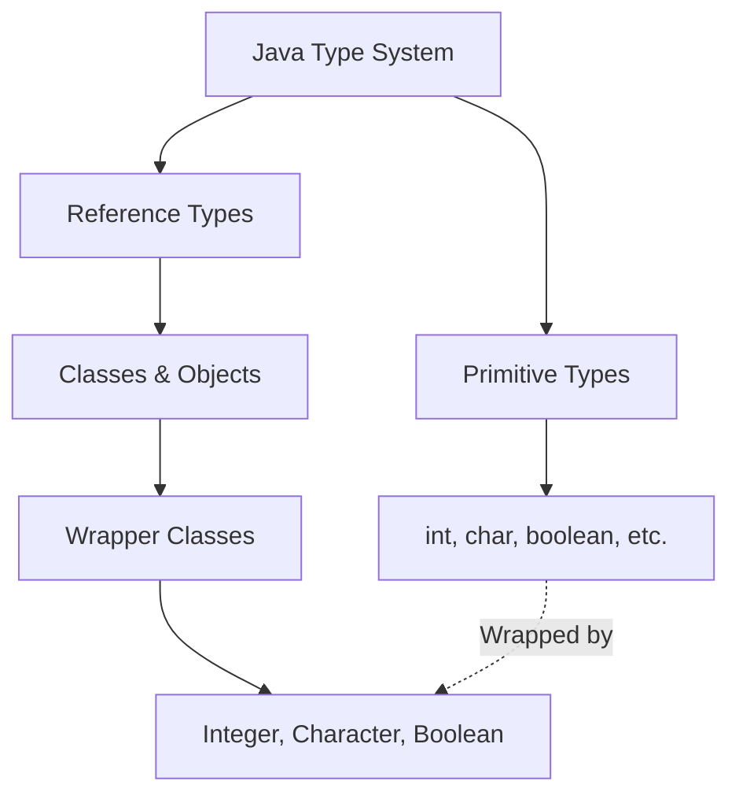
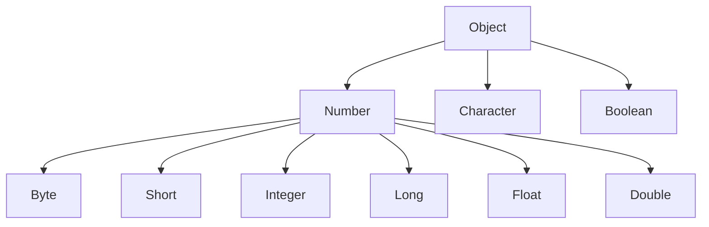
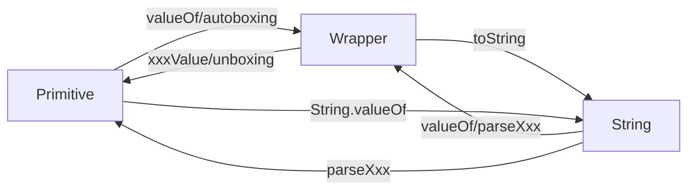

# Tutorial 15: Wrapper Classes

## 📋 Table of Contents
- [Video Index](#video-index)
- [Introduction to Wrapper Classes](#introduction-to-wrapper-classes)
- [The Eight Wrapper Classes](#the-eight-wrapper-classes)
- [Why Wrapper Classes Exist](#why-wrapper-classes-exist)
- [Creating Wrapper Objects](#creating-wrapper-objects)
- [Wrapper Class Conversions](#wrapper-class-conversions)
- [Autoboxing and Unboxing](#autoboxing-and-unboxing)
- [Comparing Wrapper Objects](#comparing-wrapper-objects)
- [Utility Methods in Wrapper Classes](#utility-methods-in-wrapper-classes)
- [Wrapper Class Caching](#wrapper-class-caching)
- [Performance Considerations](#performance-considerations)
- [Common Pitfalls](#common-pitfalls)
- [Best Practices](#best-practices)
- [Interview Preparation](#interview-preparation)
- [Practice Exercises](#practice-exercises)
- [Further Reading](#further-reading)

---

## Video Index

| Video # | Topic | Key Concepts |
|---------|-------|--------------|
| 141 | Introduction to wrapper class | Wrapper class definition, purpose, primitive-to-object conversion |
| 142 | Example on wrapper class | Creating wrapper objects, using wrapper methods |
| 143 | Wrapper Conversion | Converting between primitives and wrappers |
| 144 | Converting primitive numbers to object numbers using constructor method | Constructor-based conversions, valueOf() methods |
| 145 | Auto boxing and unboxing | Automatic conversions, Java 5+ feature |
| 146 | ==, !=, and equals | Comparing wrapper objects correctly |

---

## Introduction to Wrapper Classes

### What are Wrapper Classes?

**Wrapper classes** provide a way to use primitive data types (`int`, `char`, `boolean`, etc.) as objects. Each primitive type has a corresponding wrapper class in the `java.lang` package.

**Real-World Analogy:**
Think of wrapper classes like gift wrapping:
- **Primitive** = The actual gift (simple, direct)
- **Wrapper** = Gift box with ribbon (adds features, makes it presentable)

The wrapper doesn't change the gift, but it makes it compatible with situations that require "wrapped" items (like objects in Java collections).

### The Fundamental Concept

```
┌─────────────────────────────────────────────┐
│         Primitive vs Wrapper                │
├─────────────────────────────────────────────┤
│                                             │
│  Primitive Type    →    Wrapper Class      │
│  ─────────────          ─────────────       │
│  int               →    Integer            │
│  char              →    Character          │
│  boolean           →    Boolean            │
│  double            →    Double             │
│                                             │
│  Simple Value           Object with         │
│  No methods             Methods & Features  │
│                                             │
└─────────────────────────────────────────────┘
```

### Object-Oriented Principle

In Java, everything should ideally be an object for maximum flexibility. However, primitives exist for performance reasons. Wrapper classes bridge this gap by providing object versions of primitives.



---

## The Eight Wrapper Classes

### Video 141: Complete Mapping

Java provides **eight wrapper classes** for the eight primitive types:

| Primitive Type | Wrapper Class | Package | Size |
|----------------|---------------|---------|------|
| `byte` | `Byte` | java.lang | 8 bits |
| `short` | `Short` | java.lang | 16 bits |
| `int` | `Integer` | java.lang | 32 bits |
| `long` | `Long` | java.lang | 64 bits |
| `float` | `Float` | java.lang | 32 bits |
| `double` | `Double` | java.lang | 64 bits |
| `char` | `Character` | java.lang | 16 bits |
| `boolean` | `Boolean` | java.lang | 1 bit |

### Wrapper Class Hierarchy



**Key Points:**
- All wrapper classes are in `java.lang` package (auto-imported)
- Six numeric wrappers extend `Number` abstract class
- `Character` and `Boolean` directly extend `Object`
- All wrapper classes are **immutable** and **final**

### Immutability of Wrapper Classes

```java
public class ImmutabilityDemo {
    public static void main(String[] args) {
        Integer num = 100;
        System.out.println("Original: " + num);  // 100
        
        // You cannot change the value of num
        // num++; actually creates a NEW Integer object
        num++;
        System.out.println("After increment: " + num);  // 101
        
        // The original Integer(100) object is unchanged
        // A new Integer(101) object was created
    }
}
```

---

## Why Wrapper Classes Exist

### Primary Reasons

```
┌──────────────────────────────────────────────────┐
│        Why We Need Wrapper Classes               │
├──────────────────────────────────────────────────┤
│                                                  │
│  1. Collections Framework                        │
│     └─ Collections only store objects           │
│                                                  │
│  2. Generics                                     │
│     └─ Type parameters require reference types  │
│                                                  │
│  3. Utility Methods                              │
│     └─ Conversion, parsing, comparison methods  │
│                                                  │
│  4. Null Values                                  │
│     └─ Primitives can't be null, wrappers can   │
│                                                  │
│  5. Synchronization                              │
│     └─ Only objects can be synchronized         │
│                                                  │
│  6. Reflection & Serialization                   │
│     └─ Work with objects, not primitives        │
│                                                  │
└──────────────────────────────────────────────────┘
```

### Use Case 1: Collections

```java
import java.util.ArrayList;
import java.util.List;

public class CollectionsExample {
    public static void main(String[] args) {
        // ❌ Cannot use primitives in collections
        // List<int> numbers = new ArrayList<>();  // Compile error!
        
        // ✅ Must use wrapper classes
        List<Integer> numbers = new ArrayList<>();
        numbers.add(10);      // Autoboxing: int → Integer
        numbers.add(20);
        numbers.add(30);
        
        System.out.println("Numbers: " + numbers);
        
        // Unboxing: Integer → int
        int sum = 0;
        for (Integer num : numbers) {
            sum += num;  // Automatic unboxing
        }
        System.out.println("Sum: " + sum);
    }
}
```

### Use Case 2: Null Values

```java
public class NullValueExample {
    public static void main(String[] args) {
        // Primitives cannot be null
        // int age = null;  // ❌ Compile error!
        
        // Wrappers can be null
        Integer age = null;  // ✅ OK
        
        if (age == null) {
            System.out.println("Age not set");
        } else {
            System.out.println("Age: " + age);
        }
        
        // Useful for database values, optional parameters
        Integer salary = getDatabaseValue();  // Might return null
        if (salary != null) {
            System.out.println("Salary: $" + salary);
        } else {
            System.out.println("Salary information not available");
        }
    }
    
    static Integer getDatabaseValue() {
        // Simulating database query that might return null
        return null;
    }
}
```

### Use Case 3: Utility Methods

```java
public class UtilityMethodsDemo {
    public static void main(String[] args) {
        // String to int conversion
        String str = "12345";
        int num = Integer.parseInt(str);
        System.out.println("Parsed number: " + num);
        
        // Number system conversions
        System.out.println("Binary: " + Integer.toBinaryString(42));
        System.out.println("Octal: " + Integer.toOctalString(42));
        System.out.println("Hex: " + Integer.toHexString(42));
        
        // Character utility methods
        char ch = 'A';
        System.out.println("Is letter: " + Character.isLetter(ch));
        System.out.println("Is digit: " + Character.isDigit(ch));
        System.out.println("Lowercase: " + Character.toLowerCase(ch));
        
        // Min/Max values
        System.out.println("Max Integer: " + Integer.MAX_VALUE);
        System.out.println("Min Integer: " + Integer.MIN_VALUE);
    }
}
```

---

## Creating Wrapper Objects

### Video 142 & 144: Multiple Creation Methods

### Method 1: Using Constructors (Deprecated in Java 9+)

```java
public class ConstructorMethod {
    public static void main(String[] args) {
        // Using constructors (deprecated since Java 9)
        Integer num1 = new Integer(100);
        Double num2 = new Double(3.14);
        Boolean flag = new Boolean(true);
        Character ch = new Character('A');
        
        System.out.println("Integer: " + num1);
        System.out.println("Double: " + num2);
        System.out.println("Boolean: " + flag);
        System.out.println("Character: " + ch);
        
        // Constructor from String
        Integer num3 = new Integer("500");
        Double num4 = new Double("2.71828");
        Boolean flag2 = new Boolean("true");
        
        System.out.println("From String - Integer: " + num3);
        System.out.println("From String - Double: " + num4);
        System.out.println("From String - Boolean: " + flag2);
    }
}
```

**⚠️ Important:** Constructors are deprecated since Java 9. Use `valueOf()` instead!

### Method 2: Using valueOf() Method (Recommended)

```java
public class ValueOfMethod {
    public static void main(String[] args) {
        // ✅ Preferred method - uses caching for better performance
        Integer num1 = Integer.valueOf(100);
        Double num2 = Double.valueOf(3.14);
        Boolean flag = Boolean.valueOf(true);
        Character ch = Character.valueOf('A');
        
        System.out.println("Integer: " + num1);
        System.out.println("Double: " + num2);
        System.out.println("Boolean: " + flag);
        System.out.println("Character: " + ch);
        
        // valueOf from String
        Integer num3 = Integer.valueOf("500");
        Double num4 = Double.valueOf("2.71828");
        Boolean flag2 = Boolean.valueOf("true");
        Long num5 = Long.valueOf("999999999");
        
        System.out.println("\nFrom String:");
        System.out.println("Integer: " + num3);
        System.out.println("Double: " + num4);
        System.out.println("Boolean: " + flag2);
        System.out.println("Long: " + num5);
    }
}
```

### Method 3: Autoboxing (Java 5+)

```java
public class AutoboxingMethod {
    public static void main(String[] args) {
        // ✅ Simplest method - automatic conversion
        Integer num1 = 100;        // int → Integer
        Double num2 = 3.14;        // double → Double
        Boolean flag = true;       // boolean → Boolean
        Character ch = 'A';        // char → Character
        
        System.out.println("Integer: " + num1);
        System.out.println("Double: " + num2);
        System.out.println("Boolean: " + flag);
        System.out.println("Character: " + ch);
    }
}
```

### Complete Example: All Wrapper Types

```java
public class AllWrappersExample {
    public static void main(String[] args) {
        // Creating all eight wrapper types
        Byte byteObj = Byte.valueOf((byte) 10);
        Short shortObj = Short.valueOf((short) 100);
        Integer intObj = Integer.valueOf(1000);
        Long longObj = Long.valueOf(10000L);
        Float floatObj = Float.valueOf(3.14f);
        Double doubleObj = Double.valueOf(3.14159);
        Character charObj = Character.valueOf('J');
        Boolean boolObj = Boolean.valueOf(true);
        
        System.out.println("=== All Wrapper Types ===");
        System.out.println("Byte: " + byteObj);
        System.out.println("Short: " + shortObj);
        System.out.println("Integer: " + intObj);
        System.out.println("Long: " + longObj);
        System.out.println("Float: " + floatObj);
        System.out.println("Double: " + doubleObj);
        System.out.println("Character: " + charObj);
        System.out.println("Boolean: " + boolObj);
    }
}
```

---

## Wrapper Class Conversions

### Video 143: Conversion Methods

### Wrapper to Primitive (Unboxing)

```java
public class WrapperToPrimitive {
    public static void main(String[] args) {
        // Wrapper objects
        Integer intObj = 100;
        Double doubleObj = 3.14;
        Boolean boolObj = true;
        Character charObj = 'A';
        
        // Converting to primitives using xxxValue() methods
        int intVal = intObj.intValue();
        double doubleVal = doubleObj.doubleValue();
        boolean boolVal = boolObj.booleanValue();
        char charVal = charObj.charValue();
        
        System.out.println("int: " + intVal);
        System.out.println("double: " + doubleVal);
        System.out.println("boolean: " + boolVal);
        System.out.println("char: " + charVal);
        
        // Number class provides multiple conversion methods
        Integer num = 42;
        byte b = num.byteValue();
        short s = num.shortValue();
        int i = num.intValue();
        long l = num.longValue();
        float f = num.floatValue();
        double d = num.doubleValue();
        
        System.out.println("\nNumber conversions from Integer(42):");
        System.out.println("byte: " + b);
        System.out.println("short: " + s);
        System.out.println("int: " + i);
        System.out.println("long: " + l);
        System.out.println("float: " + f);
        System.out.println("double: " + d);
    }
}
```

### String to Wrapper

```java
public class StringToWrapper {
    public static void main(String[] args) {
        // Method 1: Using valueOf()
        Integer int1 = Integer.valueOf("123");
        Double double1 = Double.valueOf("3.14");
        Boolean bool1 = Boolean.valueOf("true");
        
        System.out.println("Using valueOf():");
        System.out.println("Integer: " + int1);
        System.out.println("Double: " + double1);
        System.out.println("Boolean: " + bool1);
        
        // Method 2: Using parseXxx() (returns primitive)
        int int2 = Integer.parseInt("456");
        double double2 = Double.parseDouble("2.71");
        boolean bool2 = Boolean.parseBoolean("false");
        
        System.out.println("\nUsing parseXxx():");
        System.out.println("int: " + int2);
        System.out.println("double: " + double2);
        System.out.println("boolean: " + bool2);
        
        // Parsing with different radix (for Integer)
        int binary = Integer.parseInt("1010", 2);    // Base 2
        int octal = Integer.parseInt("77", 8);       // Base 8
        int hex = Integer.parseInt("FF", 16);        // Base 16
        
        System.out.println("\nDifferent radix parsing:");
        System.out.println("Binary '1010': " + binary);
        System.out.println("Octal '77': " + octal);
        System.out.println("Hex 'FF': " + hex);
    }
}
```

### Wrapper to String

```java
public class WrapperToString {
    public static void main(String[] args) {
        Integer num = 100;
        Double pi = 3.14159;
        Boolean flag = true;
        Character ch = 'X';
        
        // Method 1: Using toString() instance method
        String str1 = num.toString();
        String str2 = pi.toString();
        String str3 = flag.toString();
        String str4 = ch.toString();
        
        System.out.println("Using toString():");
        System.out.println(str1 + ", " + str2 + ", " + str3 + ", " + str4);
        
        // Method 2: Using static toString()
        String str5 = Integer.toString(200);
        String str6 = Double.toString(2.71828);
        String str7 = Boolean.toString(false);
        
        System.out.println("\nUsing static toString():");
        System.out.println(str5 + ", " + str6 + ", " + str7);
        
        // Method 3: String concatenation (implicit toString())
        String str8 = num + "";
        String str9 = pi + "";
        
        System.out.println("\nUsing concatenation:");
        System.out.println(str8 + ", " + str9);
        
        // Method 4: String.valueOf()
        String str10 = String.valueOf(num);
        String str11 = String.valueOf(pi);
        
        System.out.println("\nUsing String.valueOf():");
        System.out.println(str10 + ", " + str11);
    }
}
```

### Conversion Flow Diagram



---

## Autoboxing and Unboxing

### Video 145: Automatic Conversions (Java 5+)

### What is Autoboxing?

**Autoboxing** is the automatic conversion that the Java compiler makes between primitive types and their corresponding wrapper classes.

**Unboxing** is the reverse process - converting a wrapper object back to a primitive.

```
┌─────────────────────────────────────────────┐
│     Autoboxing & Unboxing                   │
├─────────────────────────────────────────────┤
│                                             │
│  Autoboxing:   primitive → Wrapper          │
│  Unboxing:     Wrapper → primitive          │
│                                             │
│  Happens automatically since Java 5         │
│  Compiler inserts conversion code           │
│                                             │
└─────────────────────────────────────────────┘
```

### Autoboxing Examples

```java
public class AutoboxingExamples {
    public static void main(String[] args) {
        // Autoboxing: primitive → wrapper
        Integer num1 = 100;              // int → Integer
        Double num2 = 3.14;              // double → Double
        Boolean flag = true;             // boolean → Boolean
        Character ch = 'A';              // char → Character
        
        System.out.println("Autoboxed values:");
        System.out.println("Integer: " + num1);
        System.out.println("Double: " + num2);
        System.out.println("Boolean: " + flag);
        System.out.println("Character: " + ch);
        
        // Autoboxing in method calls
        printInteger(50);                // int automatically boxed to Integer
        printDouble(2.71);               // double automatically boxed to Double
        
        // Autoboxing in collections
        java.util.List<Integer> numbers = new java.util.ArrayList<>();
        numbers.add(10);                 // int → Integer
        numbers.add(20);
        numbers.add(30);
        System.out.println("List: " + numbers);
        
        // Autoboxing in expressions
        Integer sum = 10 + 20;           // Result (int) → Integer
        System.out.println("Sum: " + sum);
    }
    
    static void printInteger(Integer n) {
        System.out.println("Integer method: " + n);
    }
    
    static void printDouble(Double d) {
        System.out.println("Double method: " + d);
    }
}
```

### Unboxing Examples

```java
public class UnboxingExamples {
    public static void main(String[] args) {
        // Unboxing: wrapper → primitive
        Integer intObj = 100;
        int intVal = intObj;             // Integer → int
        
        Double doubleObj = 3.14;
        double doubleVal = doubleObj;    // Double → double
        
        Boolean boolObj = true;
        boolean boolVal = boolObj;       // Boolean → boolean
        
        System.out.println("Unboxed values:");
        System.out.println("int: " + intVal);
        System.out.println("double: " + doubleVal);
        System.out.println("boolean: " + boolVal);
        
        // Unboxing in arithmetic operations
        Integer num1 = 50;
        Integer num2 = 30;
        int result = num1 + num2;        // Both unboxed, then added
        System.out.println("Result: " + result);
        
        // Unboxing in comparisons
        Integer x = 100;
        if (x > 50) {                    // x unboxed to int for comparison
            System.out.println("x is greater than 50");
        }
        
        // Unboxing in method calls
        printPrimitive(intObj);          // Integer automatically unboxed to int
    }
    
    static void printPrimitive(int n) {
        System.out.println("Primitive method: " + n);
    }
}
```

### Mixed Operations

```java
public class MixedOperations {
    public static void main(String[] args) {
        // Mixing primitives and wrappers
        Integer a = 10;
        int b = 20;
        
        // Both can be used in arithmetic (automatic unboxing/boxing)
        int sum1 = a + b;                // a unboxed, result is int
        Integer sum2 = a + b;            // a unboxed, sum autoboxed
        
        System.out.println("sum1 (int): " + sum1);
        System.out.println("sum2 (Integer): " + sum2);
        
        // Complex expression
        Integer x = 5;
        Integer y = 10;
        Integer z = 15;
        
        // Unboxing, arithmetic, then autoboxing
        Integer result = x * 2 + y / 2 - z;
        System.out.println("Result: " + result);
        
        // Increment/Decrement
        Integer count = 0;
        count++;                         // Unbox, increment, rebox
        System.out.println("Count: " + count);
        
        // Compound assignment
        Integer value = 100;
        value += 50;                     // Unbox, add, rebox
        System.out.println("Value: " + value);
    }
}
```

### Behind the Scenes

```java
// What you write (with autoboxing/unboxing):
Integer num = 100;
int val = num + 50;

// What the compiler actually generates:
Integer num = Integer.valueOf(100);           // Autoboxing
int val = num.intValue() + 50;                // Unboxing
```

### Performance Consideration

```java
public class PerformanceDemo {
    public static void main(String[] args) {
        long startTime, endTime;
        
        // Using primitives (faster)
        startTime = System.nanoTime();
        int sum1 = 0;
        for (int i = 0; i < 1000000; i++) {
            sum1 += i;
        }
        endTime = System.nanoTime();
        System.out.println("Primitive time: " + (endTime - startTime) + " ns");
        System.out.println("Sum: " + sum1);
        
        // Using wrappers (slower due to boxing/unboxing)
        startTime = System.nanoTime();
        Integer sum2 = 0;
        for (Integer i = 0; i < 1000000; i++) {
            sum2 += i;  // Unbox sum2, unbox i, add, box result
        }
        endTime = System.nanoTime();
        System.out.println("\nWrapper time: " + (endTime - startTime) + " ns");
        System.out.println("Sum: " + sum2);
    }
}
```

---

## Comparing Wrapper Objects

### Video 146: ==, !=, and equals()

### The Critical Difference

```
┌──────────────────────────────────────────────────┐
│         Comparing Wrapper Objects                │
├──────────────────────────────────────────────────┤
│                                                  │
│  == operator:                                    │
│    • Compares object references (memory address) │
│    • Returns true only if same object            │
│    • May give unexpected results with caching    │
│                                                  │
│  equals() method:                                │
│    • Compares actual values                      │
│    • Returns true if values are equal            │
│    • ✅ ALWAYS use for wrapper comparison        │
│                                                  │
└──────────────────────────────────────────────────┘
```

### The Problem with ==

```java
public class ComparisonProblem {
    public static void main(String[] args) {
        // Small values (-128 to 127) - cached
        Integer a = 100;
        Integer b = 100;
        System.out.println("a == b: " + (a == b));  // true (cached)
        System.out.println("a.equals(b): " + a.equals(b));  // true
        
        // Large values - NOT cached
        Integer x = 1000;
        Integer y = 1000;
        System.out.println("\nx == y: " + (x == y));  // false (different objects!)
        System.out.println("x.equals(y): " + x.equals(y));  // true
        
        // ⚠️ This inconsistency is confusing!
    }
}
```

**Output:**
```
a == b: true
a.equals(b): true

x == y: false
x.equals(y): true
```

### Correct Comparison Method

```java
public class CorrectComparison {
    public static void main(String[] args) {
        Integer num1 = 500;
        Integer num2 = 500;
        Integer num3 = 500;
        
        // ❌ WRONG - Using ==
        if (num1 == num2) {
            System.out.println("num1 == num2");  // Won't print
        } else {
            System.out.println("num1 != num2");  // This prints!
        }
        
        // ✅ CORRECT - Using equals()
        if (num1.equals(num2)) {
            System.out.println("num1.equals(num2)");  // This prints
        }
        
        // Comparing multiple values
        if (num1.equals(num2) && num2.equals(num3)) {
            System.out.println("All three are equal");
        }
        
        // Different types
        Integer intVal = 100;
        Double doubleVal = 100.0;
        System.out.println("\nintVal.equals(doubleVal): " + 
                         intVal.equals(doubleVal));  // false (different types)
    }
}
```

### Null Safety

```java
public class NullSafeComparison {
    public static void main(String[] args) {
        Integer num1 = 100;
        Integer num2 = null;
        Integer num3 = null;
        
        // ❌ DANGEROUS - NullPointerException
        // if (num2.equals(num1)) { }  // Throws exception!
        
        // ✅ SAFE - Check for null first
        if (num1 != null && num1.equals(num2)) {
            System.out.println("Equal");
        } else {
            System.out.println("Not equal or one is null");
        }
        
        // ✅ SAFE - Using Objects.equals() (Java 7+)
        if (java.util.Objects.equals(num1, num2)) {
            System.out.println("Equal");
        } else {
            System.out.println("Not equal");  // This prints
        }
        
        // Comparing two null values
        System.out.println("\nnum2 == num3: " + (num2 == num3));  // true
        System.out.println("Objects.equals(num2, num3): " + 
                         java.util.Objects.equals(num2, num3));  // true
    }
}
```

### Complete Comparison Example

```java
public class ComprehensiveComparison {
    public static void main(String[] args) {
        // Various scenarios
        Integer a = 127;      // Cached
        Integer b = 127;      // Same cached object
        Integer c = 128;      // Not cached
        Integer d = 128;      // Different object
        Integer e = new Integer(127);  // Explicitly new object
        
        System.out.println("=== Comparison Results ===\n");
        
        // Scenario 1: Cached values
        System.out.println("a = 127, b = 127 (cached)");
        System.out.println("a == b: " + (a == b));        // true
        System.out.println("a.equals(b): " + a.equals(b));  // true
        
        // Scenario 2: Non-cached values
        System.out.println("\nc = 128, d = 128 (not cached)");
        System.out.println("c == d: " + (c == d));        // false
        System.out.println("c.equals(d): " + c.equals(d));  // true
        
        // Scenario 3: Explicitly created object
        System.out.println("\na = 127 (cached), e = new Integer(127)");
        System.out.println("a == e: " + (a == e));        // false
        System.out.println("a.equals(e): " + a.equals(e));  // true
        
        // Best practice: Always use equals()
        System.out.println("\n✅ Best Practice: Always use equals()");
    }
}
```

---

## Utility Methods in Wrapper Classes

### Integer Utility Methods

```java
public class IntegerUtilities {
    public static void main(String[] args) {
        // Parsing and conversion
        int num1 = Integer.parseInt("123");
        Integer num2 = Integer.valueOf("456");
        
        // Number system conversions
        String binary = Integer.toBinaryString(42);
        String octal = Integer.toOctalString(42);
        String hex = Integer.toHexString(42);
        
        System.out.println("Number 42:");
        System.out.println("Binary: " + binary);
        System.out.println("Octal: " + octal);
        System.out.println("Hexadecimal: " + hex);
        
        // Min/Max values
        System.out.println("\nInteger limits:");
        System.out.println("MAX_VALUE: " + Integer.MAX_VALUE);
        System.out.println("MIN_VALUE: " + Integer.MIN_VALUE);
        System.out.println("SIZE (bits): " + Integer.SIZE);
        System.out.println("BYTES: " + Integer.BYTES);
        
        // Comparison
        int result = Integer.compare(100, 50);
        System.out.println("\nCompare 100 and 50: " + result);  // positive
        
        // Sum, max, min
        System.out.println("Sum: " + Integer.sum(10, 20));
        System.out.println("Max: " + Integer.max(10, 20));
        System.out.println("Min: " + Integer.min(10, 20));
        
        // Bit operations
        System.out.println("\nBit count of 15: " + Integer.bitCount(15));
        System.out.println("Highest one bit of 10: " + Integer.highestOneBit(10));
        System.out.println("Reverse 5: " + Integer.reverse(5));
    }
}
```

### Double Utility Methods

```java
public class DoubleUtilities {
    public static void main(String[] args) {
        // Parsing
        double num1 = Double.parseDouble("3.14159");
        Double num2 = Double.valueOf("2.71828");
        
        System.out.println("Parsed values: " + num1 + ", " + num2);
        
        // Special values
        System.out.println("\nSpecial Double values:");
        System.out.println("POSITIVE_INFINITY: " + Double.POSITIVE_INFINITY);
        System.out.println("NEGATIVE_INFINITY: " + Double.NEGATIVE_INFINITY);
        System.out.println("NaN: " + Double.NaN);
        System.out.println("MAX_VALUE: " + Double.MAX_VALUE);
        System.out.println("MIN_VALUE: " + Double.MIN_VALUE);
        
        // Checking special values
        double zero = 0.0;
        double inf = 1.0 / zero;
        double nan = 0.0 / zero;
        
        System.out.println("\nChecking values:");
        System.out.println("Is infinite: " + Double.isInfinite(inf));
        System.out.println("Is NaN: " + Double.isNaN(nan));
        System.out.println("Is finite: " + Double.isFinite(3.14));
        
        // Comparison
        System.out.println("\nCompare 3.14 and 2.71: " + 
                         Double.compare(3.14, 2.71));
        
        // Sum, max, min
        System.out.println("Sum: " + Double.sum(1.5, 2.5));
        System.out.println("Max: " + Double.max(1.5, 2.5));
        System.out.println("Min: " + Double.min(1.5, 2.5));
    }
}
```

### Character Utility Methods

```java
public class CharacterUtilities {
    public static void main(String[] args) {
        char ch = 'A';
        
        // Character classification
        System.out.println("Character: " + ch);
        System.out.println("Is letter: " + Character.isLetter(ch));
        System.out.println("Is digit: " + Character.isDigit(ch));
        System.out.println("Is uppercase: " + Character.isUpperCase(ch));
        System.out.println("Is lowercase: " + Character.isLowerCase(ch));
        System.out.println("Is whitespace: " + Character.isWhitespace(ch));
        
        // Case conversion
        System.out.println("\nCase conversion:");
        System.out.println("To lowercase: " + Character.toLowerCase('A'));
        System.out.println("To uppercase: " + Character.toUpperCase('a'));
        
        // Digit operations
        System.out.println("\nDigit operations:");
        System.out.println("Digit '5' to int: " + Character.digit('5', 10));
        System.out.println("Digit 'F' to int (hex): " + Character.digit('F', 16));
        System.out.println("Int 15 to char (hex): " + Character.forDigit(15, 16));
        
        // Unicode operations
        System.out.println("\nUnicode:");
        System.out.println("Numeric value of '5': " + Character.getNumericValue('5'));
        System.out.println("Type of 'A': " + Character.getType('A'));
    }
}
```

### Boolean Utility Methods

```java
public class BooleanUtilities {
    public static void main(String[] args) {
        // Parsing
        boolean flag1 = Boolean.parseBoolean("true");
        boolean flag2 = Boolean.parseBoolean("false");
        boolean flag3 = Boolean.parseBoolean("yes");  // false (not "true")
        
        System.out.println("Parsed values:");
        System.out.println("'true': " + flag1);
        System.out.println("'false': " + flag2);
        System.out.println("'yes': " + flag3);
        
        // Conversion to String
        String str1 = Boolean.toString(true);
        String str2 = Boolean.toString(false);
        System.out.println("\nTo String: " + str1 + ", " + str2);
        
        // Logical operations
        System.out.println("\nLogical operations:");
        System.out.println("AND: " + Boolean.logicalAnd(true, false));
        System.out.println("OR: " + Boolean.logicalOr(true, false));
        System.out.println("XOR: " + Boolean.logicalXor(true, false));
        
        // Comparison
        System.out.println("\nComparison:");
        System.out.println("Compare true and false: " + 
                         Boolean.compare(true, false));
    }
}
```

---

## Wrapper Class Caching

### Understanding the Cache

Java caches wrapper objects for certain ranges to improve performance:

| Wrapper Class | Cached Range |
|---------------|--------------|
| **Byte** | All values (-128 to 127) |
| **Short** | -128 to 127 |
| **Integer** | -128 to 127 (configurable) |
| **Long** | -128 to 127 |
| **Character** | 0 to 127 |
| **Boolean** | true and false |
| **Float** | Not cached |
| **Double** | Not cached |

### Cache Demonstration

```java
public class CachingDemo {
    public static void main(String[] args) {
        System.out.println("=== Integer Caching ===");
        
        // Values in cache range (-128 to 127)
        Integer a1 = 127;
        Integer a2 = 127;
        System.out.println("a1 (127) == a2 (127): " + (a1 == a2));  // true
        
        Integer b1 = -128;
        Integer b2 = -128;
        System.out.println("b1 (-128) == b2 (-128): " + (b1 == b2));  // true
        
        // Values outside cache range
        Integer c1 = 128;
        Integer c2 = 128;
        System.out.println("c1 (128) == c2 (128): " + (c1 == c2));  // false
        
        Integer d1 = 1000;
        Integer d2 = 1000;
        System.out.println("d1 (1000) == d2 (1000): " + (d1 == d2));  // false
        
        // Explicitly creating new objects bypasses cache
        Integer e1 = new Integer(127);
        Integer e2 = new Integer(127);
        System.out.println("new Integer(127) == new Integer(127): " + 
                         (e1 == e2));  // false
        
        System.out.println("\n=== Character Caching ===");
        Character ch1 = 'A';  // 65, in cache
        Character ch2 = 'A';
        System.out.println("'A' == 'A': " + (ch1 == ch2));  // true
        
        Character ch3 = 200;  // Outside cache
        Character ch4 = 200;
        System.out.println("200 == 200: " + (ch3 == ch4));  // false
        
        System.out.println("\n=== Boolean Caching ===");
        Boolean bool1 = true;
        Boolean bool2 = true;
        System.out.println("true == true: " + (bool1 == bool2));  // true
        
        Boolean bool3 = Boolean.valueOf(false);
        Boolean bool4 = Boolean.valueOf(false);
        System.out.println("false == false: " + (bool3 == bool4));  // true
    }
}
```

### Cache Configuration

The Integer cache can be configured using JVM argument:
```bash
# Extend cache range to -128 to 1000
java -XX:AutoBoxCacheMax=1000 MyClass
```

---

## Performance Considerations

### Primitive vs Wrapper Performance

```java
public class PerformanceComparison {
    public static void main(String[] args) {
        int iterations = 10_000_000;
        
        // Test 1: Primitive operations
        long start = System.currentTimeMillis();
        int sum1 = 0;
        for (int i = 0; i < iterations; i++) {
            sum1 += i;
        }
        long end = System.currentTimeMillis();
        System.out.println("Primitive: " + (end - start) + " ms");
        System.out.println("Sum: " + sum1);
        
        // Test 2: Wrapper operations
        start = System.currentTimeMillis();
        Integer sum2 = 0;
        for (Integer i = 0; i < iterations; i++) {
            sum2 += i;
        }
        end = System.currentTimeMillis();
        System.out.println("\nWrapper: " + (end - start) + " ms");
        System.out.println("Sum: " + sum2);
        
        // Test 3: valueOf() vs constructor
        start = System.currentTimeMillis();
        for (int i = 0; i < 1_000_000; i++) {
            Integer num = Integer.valueOf(100);  // Uses cache
        }
        end = System.currentTimeMillis();
        System.out.println("\nvalueOf(): " + (end - start) + " ms");
        
        start = System.currentTimeMillis();
        for (int i = 0; i < 1_000_000; i++) {
            Integer num = new Integer(100);  // Always creates new object
        }
        end = System.currentTimeMillis();
        System.out.println("Constructor: " + (end - start) + " ms");
    }
}
```

### Memory Overhead

```java
public class MemoryOverhead {
    public static void main(String[] args) {
        // Primitive: 4 bytes
        int primitiveInt = 100;
        
        // Wrapper: Object overhead + value
        // ~16 bytes (object header) + 4 bytes (int value) = ~20 bytes
        Integer wrapperInt = 100;
        
        System.out.println("Memory comparison:");
        System.out.println("Primitive int: ~4 bytes");
        System.out.println("Integer wrapper: ~20 bytes (5x more!)");
        
        // Array comparison
        System.out.println("\nArray of 1 million integers:");
        System.out.println("int[]: ~4 MB");
        System.out.println("Integer[]: ~20 MB (5x more!)");
    }
}
```

### Best Practices for Performance

```
┌──────────────────────────────────────────────────┐
│       Performance Best Practices                 │
├──────────────────────────────────────────────────┤
│                                                  │
│  1. Use primitives for:                          │
│     • Local variables in loops                   │
│     • Mathematical calculations                  │
│     • Large arrays                               │
│     • Performance-critical code                  │
│                                                  │
│  2. Use wrappers for:                            │
│     • Collections (ArrayList, HashMap, etc.)     │
│     • Generics type parameters                   │
│     • When null values are needed                │
│     • API/library requirements                   │
│                                                  │
│  3. Avoid:                                       │
│     • Unnecessary boxing/unboxing in loops       │
│     • Using wrappers in tight loops              │
│     • Creating wrappers with 'new' keyword       │
│                                                  │
└──────────────────────────────────────────────────┘
```

---

## Common Pitfalls

### Pitfall 1: NullPointerException on Unboxing

```java
public class UnboxingNPE {
    public static void main(String[] args) {
        Integer num = null;
        
        // ❌ DANGEROUS - NullPointerException!
        try {
            int value = num;  // Unboxing null throws NPE
            System.out.println(value);
        } catch (NullPointerException e) {
            System.out.println("Error: Cannot unbox null!");
        }
        
        // ❌ DANGEROUS - NPE in arithmetic
        try {
            Integer a = null;
            Integer b = 10;
            int sum = a + b;  // a unboxing causes NPE
        } catch (NullPointerException e) {
            System.out.println("Error: Arithmetic on null wrapper!");
        }
        
        // ✅ SAFE - Check for null
        Integer safeNum = getUserInput();  // Might return null
        if (safeNum != null) {
            int value = safeNum;
            System.out.println("Safe value: " + value);
        } else {
            System.out.println("Null value handled safely");
        }
    }
    
    static Integer getUserInput() {
        return null;  // Simulating no input
    }
}
```

**Problem:** Unboxing a null wrapper throws NullPointerException.  
**Solution:** Always check for null before unboxing.

### Pitfall 2: Using == Instead of equals()

```java
public class ComparisonPitfall {
    public static void main(String[] args) {
        Integer score1 = getScore("Player1");  // Returns 200
        Integer score2 = getScore("Player2");  // Returns 200
        
        // ❌ WRONG - Compares references, not values
        if (score1 == score2) {
            System.out.println("Scores are equal");  // Won't print!
        } else {
            System.out.println("Scores are different");  // This prints!
        }
        
        // ✅ CORRECT - Compares values
        if (score1.equals(score2)) {
            System.out.println("Scores are equal");  // This prints
        }
    }
    
    static Integer getScore(String player) {
        return 200;  // Outside cache range
    }
}
```

**Problem:** `==` compares references, giving unpredictable results.  
**Solution:** Always use `equals()` to compare wrapper values.

### Pitfall 3: Performance Issues in Loops

```java
public class LoopPerformance {
    public static void main(String[] args) {
        // ❌ SLOW - Unnecessary boxing/unboxing
        long start = System.currentTimeMillis();
        Integer sum1 = 0;
        for (Integer i = 0; i < 1_000_000; i++) {
            sum1 += i;  // Multiple unbox/box operations
        }
        long time1 = System.currentTimeMillis() - start;
        System.out.println("Wrapper time: " + time1 + " ms");
        
        // ✅ FAST - Using primitives
        start = System.currentTimeMillis();
        int sum2 = 0;
        for (int i = 0; i < 1_000_000; i++) {
            sum2 += i;  // Direct primitive operations
        }
        long time2 = System.currentTimeMillis() - start;
        System.out.println("Primitive time: " + time2 + " ms");
        
        System.out.println("Speedup: " + (time1 / (double)time2) + "x");
    }
}
```

**Problem:** Wrappers in loops cause excessive boxing/unboxing.  
**Solution:** Use primitives for loop variables and accumulators.

### Pitfall 4: Immutability Misconception

```java
public class ImmutabilityMisunderstanding {
    public static void main(String[] args) {
        Integer num = 100;
        System.out.println("Original: " + num);
        
        // ❌ MISCONCEPTION: This modifies num
        // Reality: Creates NEW Integer object
        increment(num);
        System.out.println("After increment(): " + num);  // Still 100!
        
        // ✅ CORRECT: Return and reassign
        num = incrementCorrect(num);
        System.out.println("After incrementCorrect(): " + num);  // 101
    }
    
    // Doesn't work as expected
    static void increment(Integer n) {
        n++;  // Creates new object, original unchanged
    }
    
    // Correct approach
    static Integer incrementCorrect(Integer n) {
        return n + 1;
    }
}
```

**Problem:** Wrappers are immutable; operations create new objects.  
**Solution:** Return and reassign to capture modified values.

### Pitfall 5: Mixing Wrapper Types

```java
public class TypeMixing {
    public static void main(String[] args) {
        Integer intNum = 100;
        Long longNum = 100L;
        
        // ❌ DOESN'T COMPILE - Different wrapper types
        // if (intNum == longNum) { }  // Compile error!
        
        // ❌ FALSE - Different types
        System.out.println("intNum.equals(longNum): " + 
                         intNum.equals(longNum));  // false
        
        // ✅ CORRECT - Compare after conversion
        System.out.println("intNum.longValue() == longNum: " + 
                         (intNum.longValue() == longNum));  // true
        
        // Or compare as primitives
        long l1 = intNum;
        long l2 = longNum;
        System.out.println("As primitives: " + (l1 == l2));  // true
    }
}
```

**Problem:** Different wrapper types are not interchangeable.  
**Solution:** Convert to same type or compare as primitives.

---

## Best Practices

### 1. Choosing Between Primitive and Wrapper

```java
public class ChoosingType {
    // ✅ Use primitive for performance-critical code
    public double calculateDistance(double x1, double y1, double x2, double y2) {
        return Math.sqrt(Math.pow(x2 - x1, 2) + Math.pow(y2 - y1, 2));
    }
    
    // ✅ Use wrapper when null is meaningful
    public Integer getOptionalAge(String userId) {
        // null indicates "age not set"
        if (userExists(userId)) {
            return 25;
        }
        return null;
    }
    
    // ✅ Use wrapper for collections
    public List<Integer> getScores() {
        List<Integer> scores = new ArrayList<>();
        scores.add(100);
        scores.add(95);
        return scores;
    }
    
    private boolean userExists(String id) {
        return true;
    }
}
```

### 2. Safe Comparison Guidelines

```java
public class SafeComparison {
    public static boolean areEqual(Integer a, Integer b) {
        // ✅ Handle null cases
        if (a == null && b == null) return true;
        if (a == null || b == null) return false;
        
        // ✅ Use equals() for value comparison
        return a.equals(b);
    }
    
    // ✅ Or use Objects.equals() (Java 7+)
    public static boolean areEqualSimple(Integer a, Integer b) {
        return java.util.Objects.equals(a, b);
    }
    
    public static void main(String[] args) {
        System.out.println(areEqual(100, 100));        // true
        System.out.println(areEqual(null, null));      // true
        System.out.println(areEqual(100, null));       // false
        System.out.println(areEqualSimple(100, 100));  // true
    }
}
```

### 3. valueOf() Over Constructors

```java
public class ValueOfBestPractice {
    public static void main(String[] args) {
        // ❌ DEPRECATED - Don't use constructors
        Integer bad1 = new Integer(100);
        Double bad2 = new Double(3.14);
        
        // ✅ GOOD - Use valueOf()
        Integer good1 = Integer.valueOf(100);
        Double good2 = Double.valueOf(3.14);
        
        // ✅ BEST - Use autoboxing when possible
        Integer best1 = 100;
        Double best2 = 3.14;
        
        // valueOf() benefits from caching
        Integer a = Integer.valueOf(127);
        Integer b = Integer.valueOf(127);
        System.out.println("Cached: " + (a == b));  // true
    }
}
```

### 4. Null-Safe Operations

```java
public class NullSafeOperations {
    public static void main(String[] args) {
        Integer num = getUserInput();
        
        // ✅ Safe unboxing with default value
        int value = (num != null) ? num : 0;
        System.out.println("Value: " + value);
        
        // ✅ Safe arithmetic
        Integer a = 10;
        Integer b = null;
        Integer sum = (a != null && b != null) ? a + b : null;
        System.out.println("Sum: " + sum);
        
        // ✅ Using Optional (Java 8+)
        java.util.Optional<Integer> optNum = java.util.Optional.ofNullable(num);
        int safeValue = optNum.orElse(0);
        System.out.println("Optional value: " + safeValue);
    }
    
    static Integer getUserInput() {
        return null;  // Simulating no input
    }
}
```

### 5. Performance Optimization

```java
public class PerformanceOptimization {
    // ❌ BAD - Wrappers in loop
    public static long sumBad(int n) {
        Long sum = 0L;  // Wrapper
        for (Long i = 0L; i < n; i++) {  // Wrapper
            sum += i;  // Multiple box/unbox operations
        }
        return sum;
    }
    
    // ✅ GOOD - Primitives in loop
    public static long sumGood(int n) {
        long sum = 0;  // Primitive
        for (long i = 0; i < n; i++) {  // Primitive
            sum += i;  // Direct operation
        }
        return sum;
    }
    
    public static void main(String[] args) {
        int n = 1_000_000;
        
        long start = System.nanoTime();
        long result1 = sumBad(n);
        long time1 = System.nanoTime() - start;
        
        start = System.nanoTime();
        long result2 = sumGood(n);
        long time2 = System.nanoTime() - start;
        
        System.out.println("Bad: " + time1 / 1_000_000 + " ms");
        System.out.println("Good: " + time2 / 1_000_000 + " ms");
        System.out.println("Speedup: " + (time1 / (double)time2) + "x");
    }
}
```

---

## Interview Preparation

### Conceptual Questions

**Q1: What are wrapper classes and why do we need them?**

**Answer:**
Wrapper classes provide object versions of primitive types. We need them because:
1. **Collections** require objects, not primitives
2. **Generics** require reference types
3. **Null values** - primitives can't be null
4. **Utility methods** - parsing, conversion, validation
5. **Synchronization** - only objects can be synchronized

```java
// Collections need wrappers
List<Integer> list = new ArrayList<>();  // Can't use List<int>
list.add(10);  // int autoboxed to Integer

// Null values
Integer age = null;  // OK
// int age = null;   // Compile error
```

**Q2: What is autoboxing and unboxing?**

**Answer:**
- **Autoboxing**: Automatic conversion from primitive to wrapper
- **Unboxing**: Automatic conversion from wrapper to primitive
- Introduced in Java 5 to simplify code

```java
// Autoboxing
Integer num = 100;  // int → Integer (compiler inserts Integer.valueOf(100))

// Unboxing
int value = num;    // Integer → int (compiler inserts num.intValue())

// In expressions
Integer a = 10, b = 20;
int sum = a + b;    // Both unboxed, then added
```

**Q3: Why does == give inconsistent results with Integer?**

**Answer:**
Because of caching:
- Integers from -128 to 127 are cached
- `==` compares references, not values
- Cached values share same object reference
- Non-cached values create different objects

```java
Integer a = 127;
Integer b = 127;
System.out.println(a == b);  // true (cached)

Integer x = 128;
Integer y = 128;
System.out.println(x == y);  // false (not cached, different objects)

// ALWAYS use equals()
System.out.println(x.equals(y));  // true
```

**Q4: What is the difference between parseInt() and valueOf()?**

**Answer:**

| Method | Return Type | Usage |
|--------|-------------|-------|
| `parseInt()` | primitive (`int`) | When you need primitive |
| `valueOf()` | wrapper (`Integer`) | When you need object |

```java
int primitive = Integer.parseInt("123");      // Returns int
Integer wrapper = Integer.valueOf("123");     // Returns Integer

// valueOf() uses caching, parseInt() doesn't matter
Integer a = Integer.valueOf("100");  // May return cached
Integer b = Integer.valueOf("100");  // May return same cached object
System.out.println(a == b);  // true (if cached)
```

**Q5: Are wrapper classes immutable?**

**Answer:**
Yes, all wrapper classes are immutable. Once created, their values cannot be changed.

```java
Integer num = 100;
num++;  // Doesn't modify original object
        // Creates new Integer(101) and reassigns reference

// This is why wrapper classes are thread-safe
```

**Q6: What happens when you unbox a null wrapper?**

**Answer:**
You get a `NullPointerException`.

```java
Integer num = null;
int value = num;  // NullPointerException!

// Safe approach
Integer num = null;
int value = (num != null) ? num : 0;  // Safe with default
```

**Q7: Which wrapper classes are cached and what are the ranges?**

**Answer:**

| Wrapper | Cache Range |
|---------|-------------|
| Byte | All values (-128 to 127) |
| Short | -128 to 127 |
| Integer | -128 to 127 (configurable) |
| Long | -128 to 127 |
| Character | 0 to 127 |
| Boolean | true and false |
| Float | Not cached |
| Double | Not cached |

### Coding Questions

**Q8: Write a method to safely sum Integer objects that might be null.**

**Answer:**
```java
public class SafeSum {
    public static Integer safeSum(Integer... numbers) {
        if (numbers == null || numbers.length == 0) {
            return 0;
        }
        
        int sum = 0;
        for (Integer num : numbers) {
            if (num != null) {
                sum += num;
            }
        }
        return sum;
    }
    
    public static void main(String[] args) {
        System.out.println(safeSum(10, 20, 30));           // 60
        System.out.println(safeSum(10, null, 30));         // 40
        System.out.println(safeSum(null, null, null));     // 0
        System.out.println(safeSum());                     // 0
    }
}
```

**Q9: Demonstrate the difference between == and equals() with Integer.**

**Answer:**
```java
public class ComparisonDemo {
    public static void main(String[] args) {
        // Test cached range
        Integer a = 100, b = 100;
        System.out.println("Cached (100):");
        System.out.println("  a == b: " + (a == b));          // true
        System.out.println("  a.equals(b): " + a.equals(b));  // true
        
        // Test non-cached range
        Integer x = 200, y = 200;
        System.out.println("\nNon-cached (200):");
        System.out.println("  x == y: " + (x == y));          // false
        System.out.println("  x.equals(y): " + x.equals(y));  // true
        
        System.out.println("\n✅ Lesson: Always use equals() for value comparison!");
    }
}
```

**Q10: Write code showing all conversion methods between String, primitive, and wrapper.**

**Answer:**
```java
public class ConversionMatrix {
    public static void main(String[] args) {
        // String → Primitive
        int i1 = Integer.parseInt("100");
        
        // String → Wrapper
        Integer i2 = Integer.valueOf("100");
        
        // Primitive → Wrapper
        int prim = 50;
        Integer i3 = Integer.valueOf(prim);  // Explicit
        Integer i4 = prim;                   // Autoboxing
        
        // Wrapper → Primitive
        Integer wrap = 75;
        int i5 = wrap.intValue();            // Explicit
        int i6 = wrap;                       // Unboxing
        
        // Primitive → String
        String s1 = String.valueOf(100);
        String s2 = Integer.toString(100);
        String s3 = "" + 100;
        
        // Wrapper → String
        Integer num = 100;
        String s4 = num.toString();
        String s5 = String.valueOf(num);
        
        System.out.println("All conversions demonstrated!");
    }
}
```

---

## Practice Exercises

### Exercise 1: Wrapper Class Operations

**Objective:** Practice creating and using wrapper objects.

**Problem:** Create a program that demonstrates all eight wrapper types with various operations.

**Solution:**
```java
import java.util.ArrayList;
import java.util.List;

public class WrapperOperations {
    public static void main(String[] args) {
        // Create all wrapper types
        Byte byteVal = 10;
        Short shortVal = 1000;
        Integer intVal = 100000;
        Long longVal = 10000000L;
        Float floatVal = 3.14f;
        Double doubleVal = 2.71828;
        Character charVal = 'J';
        Boolean boolVal = true;
        
        // Store in collection
        List<Number> numbers = new ArrayList<>();
        numbers.add(byteVal);
        numbers.add(shortVal);
        numbers.add(intVal);
        numbers.add(longVal);
        numbers.add(floatVal);
        numbers.add(doubleVal);
        
        // Calculate sum
        double sum = 0;
        for (Number num : numbers) {
            sum += num.doubleValue();
        }
        
        System.out.println("Sum of all numeric values: " + sum);
        System.out.println("Character: " + charVal);
        System.out.println("Boolean: " + boolVal);
        
        // Demonstrate parsing
        String[] stringNumbers = {"10", "20", "30", "40", "50"};
        int total = 0;
        for (String str : stringNumbers) {
            total += Integer.parseInt(str);
        }
        System.out.println("\nSum of parsed strings: " + total);
    }
}
```

### Exercise 2: Safe Null Handling

**Objective:** Write null-safe wrapper operations.

**Problem:** Create a calculator that handles null Integer values safely.

**Solution:**
```java
public class SafeCalculator {
    // Addition with null safety
    public static Integer safeAdd(Integer a, Integer b) {
        if (a == null && b == null) return null;
        if (a == null) return b;
        if (b == null) return a;
        return a + b;
    }
    
    // Multiply with null safety (null treated as 0)
    public static Integer safeMultiply(Integer a, Integer b) {
        if (a == null || b == null) return 0;
        return a * b;
    }
    
    // Division with null safety
    public static Integer safeDivide(Integer a, Integer b) {
        if (a == null || b == null) return null;
        if (b == 0) throw new ArithmeticException("Division by zero");
        return a / b;
    }
    
    // Find maximum with null safety
    public static Integer safeMax(Integer... numbers) {
        Integer max = null;
        for (Integer num : numbers) {
            if (num != null) {
                if (max == null || num > max) {
                    max = num;
                }
            }
        }
        return max;
    }
    
    public static void main(String[] args) {
        System.out.println("Add 10 + 20: " + safeAdd(10, 20));
        System.out.println("Add 10 + null: " + safeAdd(10, null));
        System.out.println("Add null + null: " + safeAdd(null, null));
        
        System.out.println("\nMultiply 5 * 4: " + safeMultiply(5, 4));
        System.out.println("Multiply 5 * null: " + safeMultiply(5, null));
        
        System.out.println("\nMax of 10, 50, 30, null, 25: " + 
                         safeMax(10, 50, 30, null, 25));
    }
}
```

### Exercise 3: Caching Investigation

**Objective:** Understand wrapper caching behavior.

**Problem:** Write a program to test and demonstrate caching for different wrapper types.

**Solution:**
```java
public class CachingInvestigation {
    public static void main(String[] args) {
        System.out.println("=== Integer Caching Investigation ===\n");
        
        // Test boundary values
        testInteger(-129);
        testInteger(-128);
        testInteger(0);
        testInteger(127);
        testInteger(128);
        
        System.out.println("\n=== Character Caching Investigation ===\n");
        testCharacter((char) 0);
        testCharacter('A');     // 65
        testCharacter((char) 127);
        testCharacter((char) 128);
        
        System.out.println("\n=== Boolean Caching Investigation ===\n");
        testBoolean(true);
        testBoolean(false);
    }
    
    static void testInteger(int value) {
        Integer a = value;
        Integer b = value;
        boolean cached = (a == b);
        System.out.println("Integer " + value + ": " + 
                         (cached ? "CACHED ✓" : "NOT cached ✗"));
    }
    
    static void testCharacter(char value) {
        Character a = value;
        Character b = value;
        boolean cached = (a == b);
        System.out.println("Character '" + value + "' (" + (int)value + "): " + 
                         (cached ? "CACHED ✓" : "NOT cached ✗"));
    }
    
    static void testBoolean(boolean value) {
        Boolean a = value;
        Boolean b = value;
        boolean cached = (a == b);
        System.out.println("Boolean " + value + ": " + 
                         (cached ? "CACHED ✓" : "NOT cached ✗"));
    }
}
```

### Exercise 4: Performance Benchmark

**Objective:** Compare performance of primitives vs wrappers.

**Problem:** Benchmark different operations to understand performance impact.

**Solution:**
```java
public class PerformanceBenchmark {
    static final int ITERATIONS = 10_000_000;
    
    public static void main(String[] args) {
        System.out.println("Benchmarking with " + ITERATIONS + " iterations\n");
        
        // Test 1: Simple addition
        benchmarkAddition();
        
        // Test 2: Array operations
        benchmarkArrayOperations();
        
        // Test 3: Object creation
        benchmarkObjectCreation();
    }
    
    static void benchmarkAddition() {
        System.out.println("=== Addition Benchmark ===");
        
        // Primitive addition
        long start = System.nanoTime();
        int sum1 = 0;
        for (int i = 0; i < ITERATIONS; i++) {
            sum1 += i;
        }
        long primitiveTime = System.nanoTime() - start;
        
        // Wrapper addition
        start = System.nanoTime();
        Integer sum2 = 0;
        for (Integer i = 0; i < ITERATIONS; i++) {
            sum2 += i;
        }
        long wrapperTime = System.nanoTime() - start;
        
        System.out.println("Primitive: " + primitiveTime / 1_000_000 + " ms");
        System.out.println("Wrapper: " + wrapperTime / 1_000_000 + " ms");
        System.out.println("Wrapper is " + (wrapperTime / primitiveTime) + "x slower\n");
    }
    
    static void benchmarkArrayOperations() {
        System.out.println("=== Array Operations Benchmark ===");
        int size = 1_000_000;
        
        // Primitive array
        long start = System.nanoTime();
        int[] primArray = new int[size];
        for (int i = 0; i < size; i++) {
            primArray[i] = i;
        }
        long primitiveTime = System.nanoTime() - start;
        
        // Wrapper array
        start = System.nanoTime();
        Integer[] wrapArray = new Integer[size];
        for (int i = 0; i < size; i++) {
            wrapArray[i] = i;
        }
        long wrapperTime = System.nanoTime() - start;
        
        System.out.println("Primitive: " + primitiveTime / 1_000_000 + " ms");
        System.out.println("Wrapper: " + wrapperTime / 1_000_000 + " ms");
        System.out.println("Wrapper is " + (wrapperTime / primitiveTime) + "x slower\n");
    }
    
    static void benchmarkObjectCreation() {
        System.out.println("=== Object Creation Benchmark ===");
        
        // Using valueOf (cached)
        long start = System.nanoTime();
        for (int i = 0; i < 1_000_000; i++) {
            Integer num = Integer.valueOf(100);
        }
        long valueOfTime = System.nanoTime() - start;
        
        // Using constructor (deprecated, but for comparison)
        start = System.nanoTime();
        for (int i = 0; i < 1_000_000; i++) {
            Integer num = new Integer(100);
        }
        long constructorTime = System.nanoTime() - start;
        
        System.out.println("valueOf(): " + valueOfTime / 1_000_000 + " ms");
        System.out.println("Constructor: " + constructorTime / 1_000_000 + " ms");
        System.out.println("Constructor is " + (constructorTime / valueOfTime) + "x slower");
    }
}
```

---

## Further Reading

### Books

1. **"Effective Java" by Joshua Bloch**
   - Item 6: Avoid creating unnecessary objects
   - Item 61: Prefer primitive types to boxed primitives
   - Item 62: Avoid strings where other types are more appropriate

2. **"Java Performance: The Definitive Guide" by Scott Oaks**
   - Chapter 4: Working with Collections (wrapper performance)
   - Chapter 6: Garbage Collection (object allocation costs)

3. **"Core Java Volume I" by Cay S. Horstmann**
   - Chapter 3: Fundamental Programming Structures in Java
   - Detailed coverage of wrapper classes and autoboxing

### Online Resources

1. **Oracle Java Documentation**
   - [Autoboxing and Unboxing](https://docs.oracle.com/javase/tutorial/java/data/autoboxing.html)
   - [Number Classes](https://docs.oracle.com/javase/tutorial/java/data/numberclasses.html)
   - [Wrapper Classes API](https://docs.oracle.com/en/java/javase/17/docs/api/java.base/java/lang/package-summary.html)

2. **Baeldung**
   - [Guide to Java Wrapper Classes](https://www.baeldung.com/java-wrapper-classes)
   - [Autoboxing and Unboxing in Java](https://www.baeldung.com/java-autoboxing-unboxing)

3. **JavaPoint**
   - [Java Wrapper Classes](https://www.javatpoint.com/wrapper-class-in-java)

### Key Takeaways

```
┌──────────────────────────────────────────────────┐
│         Wrapper Classes Mastery Checklist        │
├──────────────────────────────────────────────────┤
│                                                  │
│  ✓ 8 wrapper classes for 8 primitive types      │
│  ✓ Wrappers enable objects where needed         │
│  ✓ Autoboxing/unboxing since Java 5             │
│  ✓ Always use equals() for comparison           │
│  ✓ Watch for NullPointerException on unboxing   │
│  ✓ Understand caching (-128 to 127)             │
│  ✓ Wrappers are immutable and thread-safe       │
│  ✓ Use primitives for performance               │
│  ✓ Use wrappers for collections/generics        │
│  ✓ valueOf() preferred over constructors        │
│                                                  │
└──────────────────────────────────────────────────┘
```

---

## Summary

This tutorial covered **Wrapper Classes** based on videos 141-146:

### Video 141: Introduction to Wrapper Classes
- Definition and purpose of wrapper classes
- Eight wrapper classes for eight primitive types
- Why wrappers exist (collections, null values, utility methods)
- Immutability and thread-safety

### Video 142-144: Creating and Converting Wrappers
- Three creation methods: constructors (deprecated), valueOf(), autoboxing
- Wrapper-to-primitive conversions using xxxValue()
- String-to-wrapper conversions using valueOf() and parseXxx()
- Wrapper-to-string conversions

### Video 145: Autoboxing and Unboxing
- Automatic primitive ↔ wrapper conversions
- How autoboxing works behind the scenes
- Performance considerations
- Mixed operations

### Video 146: Comparing Wrappers
- The == vs equals() problem
- Caching behavior and its impact
- Null-safe comparison techniques
- Best practices

**Key Concepts Mastered:**
- Wrapper class hierarchy (Number, Character, Boolean)
- Autoboxing and unboxing mechanisms
- Caching ranges for different wrappers
- Performance implications
- Safe null handling
- Proper comparison techniques

**Common Pitfalls Avoided:**
- NullPointerException on unboxing
- Using == instead of equals()
- Performance issues in loops
- Immutability misconceptions
- Type mixing errors

**Next Steps:**
- Practice with collections using wrappers
- Understand performance trade-offs
- Master null-safe programming
- Prepare for multithreading (Tutorial 16)

---

*Related Videos: 141-146 | Total: 6 videos | RBR Java Full Course*
