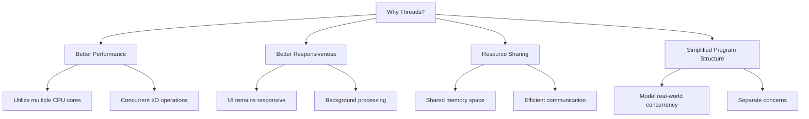
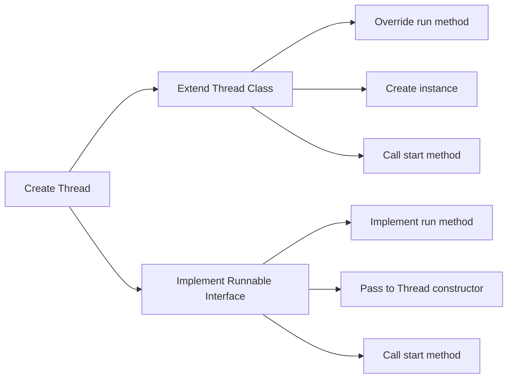
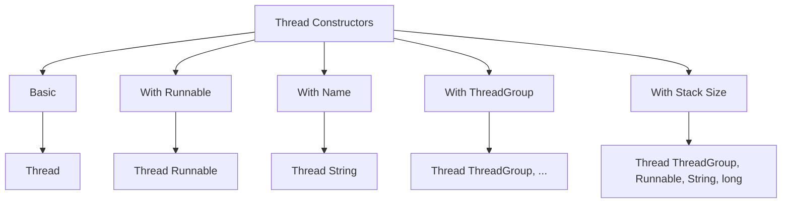
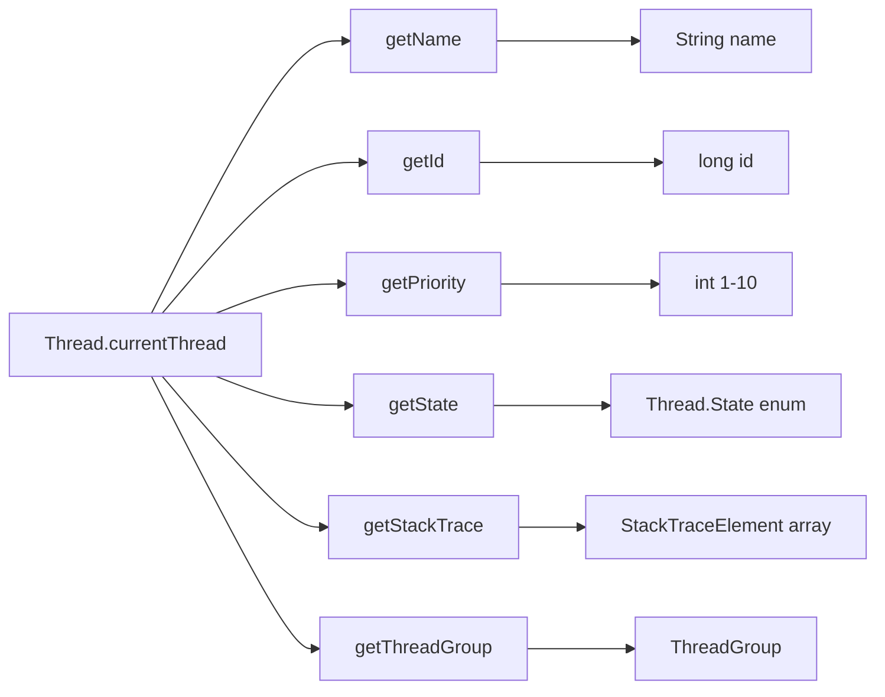
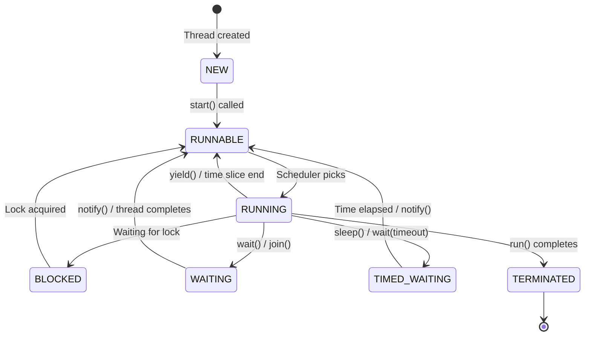
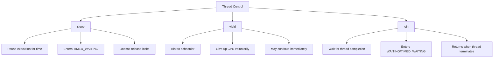
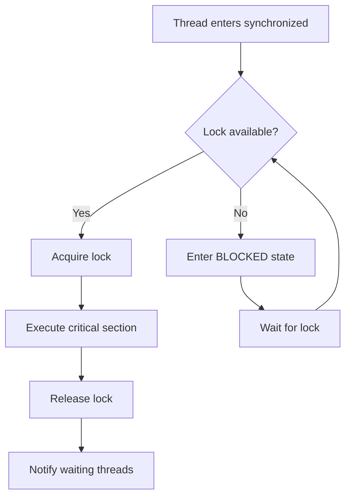
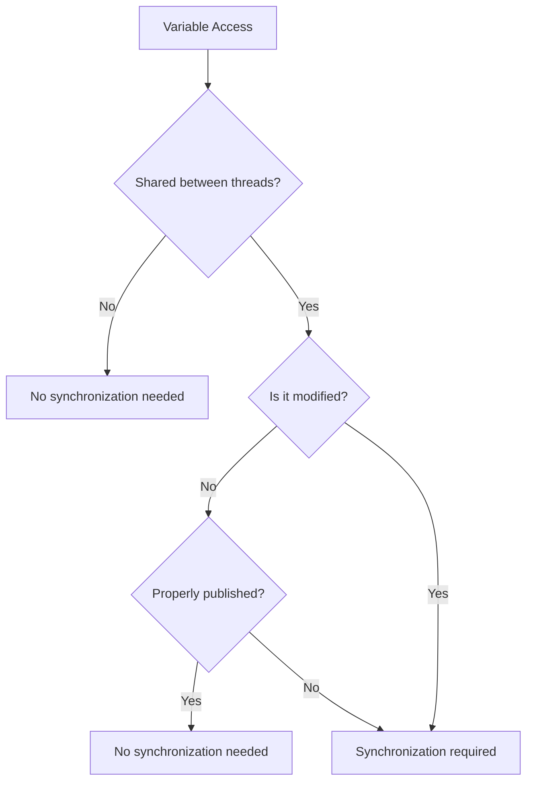
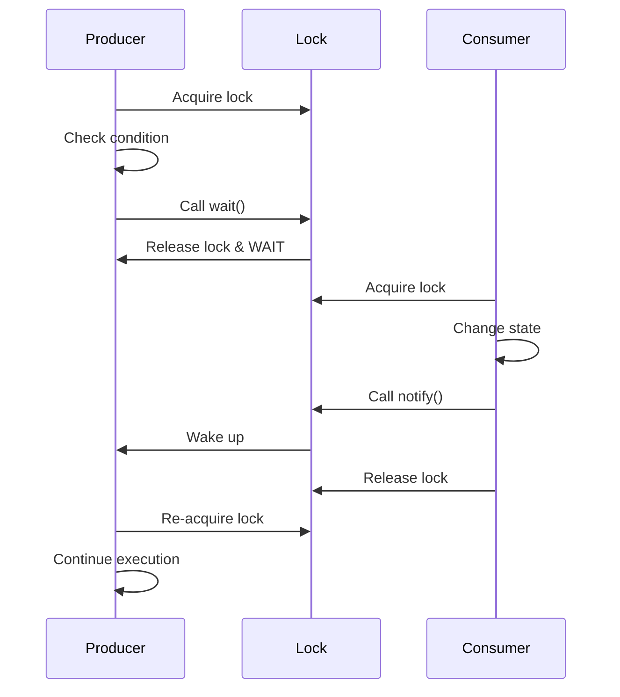

# Tutorial 16: Java Threads - Complete Guide

> **Video Coverage**: Videos 147-165 (19 videos)  
> **Topics**: Thread fundamentals, creation, lifecycle, synchronization, thread interaction, priorities, and coordination

---

## Table of Contents

1. [Introduction to Threads](#introduction-to-threads)
2. [What Are Threads?](#what-are-threads)
3. [Creating Threads in Java](#creating-threads-in-java)
4. [Thread Class Constructors](#thread-class-constructors)
5. [Multiple Threads](#multiple-threads)
6. [Getting Current Thread Reference](#getting-current-thread-reference)
7. [Thread States and Lifecycle](#thread-states-and-lifecycle)
8. [Thread Priorities](#thread-priorities)
9. [Controlling Thread Execution](#controlling-thread-execution)
10. [Thread Synchronization](#thread-synchronization)
11. [Synchronization Internals](#synchronization-internals)
12. [Static Method Synchronization](#static-method-synchronization)
13. [Synchronization Best Practices](#synchronization-best-practices)
14. [Resources to Synchronize](#resources-to-synchronize)
15. [Thread Interaction (wait/notify)](#thread-interaction)
16. [Common Pitfalls](#common-pitfalls)
17. [Best Practices](#best-practices)
18. [Interview Preparation](#interview-preparation)
19. [Practice Exercises](#practice-exercises)
20. [Further Reading](#further-reading)

---

## Introduction to Threads

### Real-World Analogy: The Restaurant Kitchen

Imagine a busy restaurant kitchen:

**Single-Threaded (One Chef)**:
```
┌─────────────────────────────────────┐
│  Chef doing everything sequentially │
│  1. Prep ingredients                │
│  2. Cook meal 1                     │
│  3. Cook meal 2                     │
│  4. Cook meal 3                     │
│  5. Wash dishes                     │
└─────────────────────────────────────┘
        ⏱️ Very slow service
```

**Multi-Threaded (Multiple Chefs)**:
```
┌──────────────┐  ┌──────────────┐  ┌──────────────┐
│   Chef 1     │  │   Chef 2     │  │   Chef 3     │
│ Cooking meal │  │ Cooking meal │  │ Washing      │
│      1       │  │      2       │  │   dishes     │
└──────────────┘  └──────────────┘  └──────────────┘
        ⚡ Fast, efficient service
```

**Key Insight**: Threads allow a program to do multiple things simultaneously, just like having multiple chefs allows a kitchen to serve multiple customers at once.

### Why Do We Need Threads?



**Video Reference**: Video 147 - Introduction to Threads

---

## What Are Threads?

### Definition

A **thread** is a lightweight subprocess, the smallest unit of execution within a process. Multiple threads share the same memory space but execute independently.

### Process vs Thread

```
┌──────────────────────────────────────────────────────────┐
│                    PROCESS                               │
│  ┌────────────────────────────────────────────────────┐ │
│  │            SHARED MEMORY                           │ │
│  │  • Heap                                           │ │
│  │  • Static variables                               │ │
│  │  • Code segment                                   │ │
│  └────────────────────────────────────────────────────┘ │
│                                                          │
│  ┌──────────┐  ┌──────────┐  ┌──────────┐            │
│  │ Thread 1 │  │ Thread 2 │  │ Thread 3 │            │
│  │          │  │          │  │          │            │
│  │  Stack   │  │  Stack   │  │  Stack   │            │
│  │  PC      │  │  PC      │  │  PC      │            │
│  │  Locals  │  │  Locals  │  │  Locals  │            │
│  └──────────┘  └──────────┘  └──────────┘            │
└──────────────────────────────────────────────────────────┘
```

**Key Differences**:

| Aspect | Process | Thread |
|--------|---------|--------|
| **Memory** | Separate memory space | Shared memory space |
| **Communication** | IPC (expensive) | Direct (cheap) |
| **Creation Time** | Slow (~milliseconds) | Fast (~microseconds) |
| **Context Switch** | Heavy | Light |
| **Independence** | Fully independent | Dependent on process |
| **Resource Usage** | Heavy | Lightweight |

### Thread Components

Every thread has:

1. **Program Counter (PC)**: Tracks current instruction
2. **Stack**: Stores local variables and method calls
3. **Thread State**: NEW, RUNNABLE, BLOCKED, etc.
4. **Priority**: Scheduling hint (1-10)
5. **Name**: Optional identifier

**Video Reference**: Video 148 - Threads

---

## Creating Threads in Java

### Two Main Approaches



### Method 1: Extending Thread Class

```java
/**
 * Creating thread by extending Thread class
 * Video 149: Example on Threads
 */
class MyThread extends Thread {
    @Override
    public void run() {
        // Thread's execution logic
        for (int i = 1; i <= 5; i++) {
            System.out.println(Thread.currentThread().getName() + 
                             ": Count = " + i);
            try {
                Thread.sleep(500); // Sleep for 500ms
            } catch (InterruptedException e) {
                e.printStackTrace();
            }
        }
    }
}

// Usage
public class ThreadExample1 {
    public static void main(String[] args) {
        MyThread thread1 = new MyThread();
        MyThread thread2 = new MyThread();
        
        thread1.setName("Worker-1");
        thread2.setName("Worker-2");
        
        thread1.start(); // Starts thread1
        thread2.start(); // Starts thread2
        
        System.out.println("Main thread continues...");
    }
}
```

**Output** (order may vary):
```
Main thread continues...
Worker-1: Count = 1
Worker-2: Count = 1
Worker-1: Count = 2
Worker-2: Count = 2
Worker-1: Count = 3
Worker-2: Count = 3
Worker-1: Count = 4
Worker-2: Count = 4
Worker-1: Count = 5
Worker-2: Count = 5
```

### Method 2: Implementing Runnable Interface (Preferred)

```java
/**
 * Creating thread by implementing Runnable interface
 * Video 150: Creating threads in java
 */
class MyTask implements Runnable {
    private String taskName;
    
    public MyTask(String taskName) {
        this.taskName = taskName;
    }
    
    @Override
    public void run() {
        for (int i = 1; i <= 5; i++) {
            System.out.println(taskName + ": Processing step " + i);
            try {
                Thread.sleep(300);
            } catch (InterruptedException e) {
                e.printStackTrace();
            }
        }
    }
}

// Usage
public class ThreadExample2 {
    public static void main(String[] args) {
        // Create Runnable tasks
        MyTask task1 = new MyTask("Download");
        MyTask task2 = new MyTask("Upload");
        
        // Create threads with tasks
        Thread thread1 = new Thread(task1);
        Thread thread2 = new Thread(task2);
        
        thread1.start();
        thread2.start();
    }
}
```

### Method 3: Using Lambda (Java 8+)

```java
public class ThreadExample3 {
    public static void main(String[] args) {
        // Lambda expression for Runnable
        Thread thread1 = new Thread(() -> {
            for (int i = 1; i <= 3; i++) {
                System.out.println("Lambda thread: " + i);
                try {
                    Thread.sleep(200);
                } catch (InterruptedException e) {
                    e.printStackTrace();
                }
            }
        });
        
        thread1.start();
    }
}
```

### Comparison: Thread vs Runnable

| Aspect | Extends Thread | Implements Runnable |
|--------|---------------|---------------------|
| **Inheritance** | Can't extend other class | Can extend other class ✅ |
| **Flexibility** | Limited | High ✅ |
| **Design** | Tight coupling | Loose coupling ✅ |
| **Reusability** | Low | High ✅ |
| **Best Practice** | ❌ | ✅ Preferred |
| **Thread Pool** | Not compatible | Compatible ✅ |

**Recommendation**: Always prefer `Runnable` interface unless you need to override other Thread methods.

**Video Reference**: Video 150 - Creating threads in java

---

## Thread Class Constructors

### Available Constructors

```java
/**
 * Thread class provides multiple constructors
 * Video 151: Thread class constructors
 */
public class ThreadConstructors {
    public static void main(String[] args) {
        
        // 1. No-argument constructor
        Thread t1 = new Thread();
        System.out.println("t1 name: " + t1.getName()); // Thread-0
        
        // 2. Constructor with Runnable
        Thread t2 = new Thread(() -> System.out.println("Running..."));
        System.out.println("t2 name: " + t2.getName()); // Thread-1
        
        // 3. Constructor with name
        Thread t3 = new Thread("MyWorker");
        System.out.println("t3 name: " + t3.getName()); // MyWorker
        
        // 4. Constructor with Runnable and name
        Thread t4 = new Thread(() -> System.out.println("Working..."), 
                               "CustomWorker");
        System.out.println("t4 name: " + t4.getName()); // CustomWorker
        
        // 5. Constructor with ThreadGroup
        ThreadGroup group = new ThreadGroup("MyGroup");
        Thread t5 = new Thread(group, "GroupedThread");
        System.out.println("t5 group: " + t5.getThreadGroup().getName());
        
        // 6. Constructor with ThreadGroup, Runnable, and name
        Thread t6 = new Thread(group, 
                               () -> System.out.println("Group task"), 
                               "TaskInGroup");
        
        // 7. Constructor with stack size (advanced)
        Thread t7 = new Thread(null, 
                               () -> System.out.println("Custom stack"), 
                               "LargeStack", 
                               2 * 1024 * 1024); // 2MB stack
    }
}
```

### Constructor Details



### Constructor Usage Examples

```java
public class ThreadConstructorExamples {
    
    // Example 1: Named threads for debugging
    public static void example1() {
        Thread dbThread = new Thread(() -> {
            // Database operations
        }, "DatabaseWorker");
        
        Thread netThread = new Thread(() -> {
            // Network operations
        }, "NetworkWorker");
        
        dbThread.start();
        netThread.start();
    }
    
    // Example 2: Thread groups for management
    public static void example2() {
        ThreadGroup workerGroup = new ThreadGroup("Workers");
        
        for (int i = 0; i < 5; i++) {
            Thread t = new Thread(workerGroup, 
                                 () -> doWork(), 
                                 "Worker-" + i);
            t.start();
        }
        
        // Can manage all threads in group
        System.out.println("Active threads in group: " + 
                          workerGroup.activeCount());
    }
    
    private static void doWork() {
        System.out.println(Thread.currentThread().getName() + 
                          " is working");
    }
}
```

**Video Reference**: Video 151 - Thread class constructors

---

## Multiple Threads

### Running Multiple Threads Concurrently

```java
/**
 * Demonstrating multiple threads execution
 * Video 152: Multiple threads
 */
class PrintNumbers implements Runnable {
    private String threadName;
    private int start;
    private int end;
    
    public PrintNumbers(String name, int start, int end) {
        this.threadName = name;
        this.start = start;
        this.end = end;
    }
    
    @Override
    public void run() {
        System.out.println(threadName + " started");
        for (int i = start; i <= end; i++) {
            System.out.println(threadName + ": " + i);
            try {
                Thread.sleep(100);
            } catch (InterruptedException e) {
                System.out.println(threadName + " interrupted");
            }
        }
        System.out.println(threadName + " finished");
    }
}

public class MultipleThreadsExample {
    public static void main(String[] args) {
        // Create multiple threads
        Thread t1 = new Thread(new PrintNumbers("Thread-A", 1, 5));
        Thread t2 = new Thread(new PrintNumbers("Thread-B", 10, 15));
        Thread t3 = new Thread(new PrintNumbers("Thread-C", 20, 25));
        
        // Start all threads
        t1.start();
        t2.start();
        t3.start();
        
        System.out.println("All threads started from main");
    }
}
```

**Output** (interleaved, order varies):
```
All threads started from main
Thread-A started
Thread-B started
Thread-C started
Thread-A: 1
Thread-B: 10
Thread-C: 20
Thread-A: 2
Thread-B: 11
Thread-C: 21
...
```

### Thread Execution Visualization

```
Timeline →
─────────────────────────────────────────────────────
Main    : ████ starts threads, continues
Thread-A: ─────████████████████──────────────
Thread-B: ──────████████████████─────────────
Thread-C: ───────████████████████────────────
─────────────────────────────────────────────────────
          ↑    ↑                           ↑
          |    |                           |
        start  concurrent execution      finish
```

### Real-World Example: Parallel File Processing

```java
public class ParallelFileProcessor {
    
    static class FileProcessor implements Runnable {
        private String filename;
        
        public FileProcessor(String filename) {
            this.filename = filename;
        }
        
        @Override
        public void run() {
            System.out.println("Processing " + filename + 
                             " on " + Thread.currentThread().getName());
            try {
                // Simulate file processing
                Thread.sleep(2000);
                System.out.println("Completed " + filename);
            } catch (InterruptedException e) {
                e.printStackTrace();
            }
        }
    }
    
    public static void main(String[] args) {
        String[] files = {"data1.txt", "data2.txt", "data3.txt", 
                         "data4.txt", "data5.txt"};
        
        Thread[] threads = new Thread[files.length];
        
        // Create and start all threads
        for (int i = 0; i < files.length; i++) {
            threads[i] = new Thread(new FileProcessor(files[i]));
            threads[i].start();
        }
        
        System.out.println("All file processors started");
    }
}
```

**Video Reference**: Video 152 - Multiple threads

---

## Getting Current Thread Reference

### Thread.currentThread() Method

```java
/**
 * Getting reference to current thread
 * Video 153: Getting the reference of the current thread
 */
public class CurrentThreadExample {
    
    public static void main(String[] args) {
        // Get main thread reference
        Thread mainThread = Thread.currentThread();
        
        System.out.println("Current thread: " + mainThread.getName());
        System.out.println("Thread ID: " + mainThread.getId());
        System.out.println("Priority: " + mainThread.getPriority());
        System.out.println("State: " + mainThread.getState());
        System.out.println("Is alive: " + mainThread.isAlive());
        System.out.println("Is daemon: " + mainThread.isDaemon());
        
        // Rename main thread
        mainThread.setName("MainWorker");
        System.out.println("New name: " + mainThread.getName());
        
        // Create and start new thread
        Thread worker = new Thread(() -> {
            Thread current = Thread.currentThread();
            System.out.println("\nInside worker:");
            System.out.println("Thread: " + current.getName());
            System.out.println("ID: " + current.getId());
        }, "Worker-1");
        
        worker.start();
    }
}
```

**Output**:
```
Current thread: main
Thread ID: 1
Priority: 5
State: RUNNABLE
Is alive: true
Is daemon: false
New name: MainWorker

Inside worker:
Thread: Worker-1
ID: 12
```

### Practical Uses of currentThread()

```java
public class CurrentThreadPractical {
    
    // Use case 1: Thread identification in logs
    public static void log(String message) {
        System.out.println("[" + Thread.currentThread().getName() + 
                          "] " + message);
    }
    
    // Use case 2: Thread-specific processing
    public static void processData() {
        Thread current = Thread.currentThread();
        if (current.getName().startsWith("Priority")) {
            // High priority processing
        } else {
            // Normal processing
        }
    }
    
    // Use case 3: Debugging
    public static void debugInfo() {
        Thread t = Thread.currentThread();
        StackTraceElement[] stack = t.getStackTrace();
        
        System.out.println("Thread: " + t.getName());
        System.out.println("Call stack:");
        for (StackTraceElement element : stack) {
            System.out.println("  " + element);
        }
    }
    
    public static void main(String[] args) {
        log("Application started");
        
        Thread t1 = new Thread(() -> {
            log("Worker started");
            processData();
            debugInfo();
        }, "Worker-1");
        
        t1.start();
    }
}
```

### Thread Information Methods



**Video Reference**: Video 153 - Getting the reference of the current thread

---

## Thread States and Lifecycle

### Thread State Diagram



### Six Thread States

```java
/**
 * Complete thread lifecycle demonstration
 * Video 154: Thread states and transitions
 */
public class ThreadStatesDemo {
    
    public static void main(String[] args) throws InterruptedException {
        
        // State 1: NEW
        Thread thread = new Thread(() -> {
            try {
                // State 3: RUNNABLE (executing)
                System.out.println("Inside run method");
                
                // State 5: TIMED_WAITING
                Thread.sleep(2000);
                
                synchronized (ThreadStatesDemo.class) {
                    // State 4: WAITING
                    ThreadStatesDemo.class.wait();
                }
            } catch (InterruptedException e) {
                e.printStackTrace();
            }
        });
        
        System.out.println("1. NEW: " + thread.getState()); // NEW
        
        thread.start();
        Thread.sleep(100);
        
        // State 2: RUNNABLE
        System.out.println("2. RUNNABLE: " + thread.getState());
        
        Thread.sleep(1000);
        // State 5: TIMED_WAITING
        System.out.println("3. TIMED_WAITING: " + thread.getState());
        
        Thread.sleep(2000);
        // State 4: WAITING (waiting for notify)
        System.out.println("4. WAITING: " + thread.getState());
        
        // Wake up the thread
        synchronized (ThreadStatesDemo.class) {
            ThreadStatesDemo.class.notify();
        }
        
        thread.join();
        // State 6: TERMINATED
        System.out.println("5. TERMINATED: " + thread.getState());
    }
}
```

### State Details

| State | Description | How to Enter | How to Exit |
|-------|-------------|--------------|-------------|
| **NEW** | Thread created but not started | `new Thread()` | `start()` |
| **RUNNABLE** | Ready to run or running | `start()` called | OS scheduler |
| **BLOCKED** | Waiting for monitor lock | Trying to enter synchronized block | Lock acquired |
| **WAITING** | Indefinitely waiting | `wait()`, `join()` | `notify()`, thread completes |
| **TIMED_WAITING** | Waiting with timeout | `sleep(ms)`, `wait(ms)`, `join(ms)` | Time elapsed or notification |
| **TERMINATED** | Execution complete | `run()` returns | Cannot restart |

### BLOCKED vs WAITING

```java
public class BlockedVsWaiting {
    private static final Object lock = new Object();
    
    public static void main(String[] args) throws InterruptedException {
        
        // Thread demonstrating BLOCKED state
        Thread t1 = new Thread(() -> {
            synchronized (lock) {
                try {
                    Thread.sleep(5000); // Hold lock for 5 seconds
                } catch (InterruptedException e) {
                    e.printStackTrace();
                }
            }
        }, "Thread-1");
        
        // Thread that will be BLOCKED
        Thread t2 = new Thread(() -> {
            synchronized (lock) { // Will wait for lock
                System.out.println("Thread-2 got lock");
            }
        }, "Thread-2");
        
        // Thread demonstrating WAITING state
        Thread t3 = new Thread(() -> {
            synchronized (lock) {
                try {
                    lock.wait(); // Release lock and wait
                } catch (InterruptedException e) {
                    e.printStackTrace();
                }
            }
        }, "Thread-3");
        
        t1.start();
        Thread.sleep(100); // Let t1 acquire lock
        
        t2.start();
        Thread.sleep(100);
        System.out.println("t2 state: " + t2.getState()); // BLOCKED
        
        t3.start();
        Thread.sleep(100);
        System.out.println("t3 state: " + t3.getState()); // WAITING
    }
}
```

**Output**:
```
t2 state: BLOCKED
t3 state: WAITING
```

**Key Difference**:
- **BLOCKED**: Waiting to acquire a lock (passive waiting)
- **WAITING**: Explicitly waiting via `wait()`, `join()` (active waiting)

**Video Reference**: Video 154 - Thread states and transitions

---

## Thread Priorities

### Priority Levels

```java
/**
 * Thread priority demonstration
 * Video 155: Thread priorities
 */
public class ThreadPriorityExample {
    
    public static void main(String[] args) {
        
        System.out.println("Main thread priority: " + 
                          Thread.currentThread().getPriority());
        
        // Priority constants
        System.out.println("MIN_PRIORITY: " + Thread.MIN_PRIORITY);  // 1
        System.out.println("NORM_PRIORITY: " + Thread.NORM_PRIORITY); // 5
        System.out.println("MAX_PRIORITY: " + Thread.MAX_PRIORITY);  // 10
        
        // Create threads with different priorities
        Thread lowPriority = new Thread(() -> {
            for (int i = 0; i < 5; i++) {
                System.out.println("Low priority: " + i);
            }
        });
        lowPriority.setPriority(Thread.MIN_PRIORITY);
        
        Thread normalPriority = new Thread(() -> {
            for (int i = 0; i < 5; i++) {
                System.out.println("Normal priority: " + i);
            }
        });
        normalPriority.setPriority(Thread.NORM_PRIORITY);
        
        Thread highPriority = new Thread(() -> {
            for (int i = 0; i < 5; i++) {
                System.out.println("High priority: " + i);
            }
        });
        highPriority.setPriority(Thread.MAX_PRIORITY);
        
        // Start all threads
        lowPriority.start();
        normalPriority.start();
        highPriority.start();
    }
}
```

### Priority Behavior

```
Priority Scale: 1 (MIN) ────────── 5 (NORM) ────────── 10 (MAX)
                 ↓                    ↓                   ↓
              Lowest             Default              Highest
           Less CPU time      Normal time         More CPU time
```

### Important Priority Concepts

```java
public class PriorityConceptsDemo {
    
    // Concept 1: Priority Inheritance
    public static void demonstratePriorityInheritance() {
        Thread parent = Thread.currentThread();
        parent.setPriority(8);
        
        Thread child = new Thread(() -> {
            // Child inherits parent's priority
            System.out.println("Child priority: " + 
                             Thread.currentThread().getPriority()); // 8
        });
        
        child.start();
    }
    
    // Concept 2: Priority is a Hint, Not a Guarantee
    public static void demonstratePriorityHint() {
        Thread t1 = new Thread(() -> {
            long count = 0;
            for (int i = 0; i < 1000000; i++) {
                count++;
            }
            System.out.println("High priority finished: " + count);
        });
        t1.setPriority(Thread.MAX_PRIORITY);
        
        Thread t2 = new Thread(() -> {
            long count = 0;
            for (int i = 0; i < 1000000; i++) {
                count++;
            }
            System.out.println("Low priority finished: " + count);
        });
        t2.setPriority(Thread.MIN_PRIORITY);
        
        t1.start();
        t2.start();
        
        // Note: Results may vary - priority is not deterministic
    }
    
    // Concept 3: Platform Dependency
    public static void demonstratePlatformDependency() {
        /*
         * Thread priorities map differently on different OS:
         * 
         * Windows: 7 priority levels (priorities 1-3 map to low,
         *          4-6 to normal, 7-10 to high)
         * 
         * Linux: Uses nice values, may not honor all 10 priorities
         * 
         * macOS: Similar to Linux with native thread priorities
         * 
         * Priority behavior is JVM and OS dependent!
         */
    }
    
    public static void main(String[] args) {
        demonstratePriorityInheritance();
        demonstratePriorityHint();
    }
}
```

### Priority Best Practices

**DO**:
- Use default priority (5) for most threads
- Use priorities for hints, not guarantees
- Test priority behavior on target platform
- Document why non-default priorities are used

**DON'T**:
- Rely on priorities for correctness
- Use priorities to solve race conditions
- Assume all priorities work equally across platforms
- Set extreme priorities (1 or 10) without good reason

**Video Reference**: Video 155 - Thread priorities

---

## Controlling Thread Execution

### Thread Control Methods Overview



### 1. Thread.sleep() - Pause Execution

```java
/**
 * Thread sleep demonstration
 * Video 156: Preventing thread execution
 */
public class ThreadSleepExample {
    
    public static void main(String[] args) {
        System.out.println("Starting at: " + System.currentTimeMillis());
        
        try {
            // Sleep for 2 seconds (2000 milliseconds)
            Thread.sleep(2000);
        } catch (InterruptedException e) {
            System.out.println("Sleep was interrupted");
            e.printStackTrace();
        }
        
        System.out.println("Ending at: " + System.currentTimeMillis());
    }
    
    // Practical example: Polling with delays
    public static void pollWithDelay() {
        while (true) {
            boolean dataAvailable = checkForData();
            
            if (dataAvailable) {
                processData();
                break;
            }
            
            try {
                Thread.sleep(1000); // Wait 1 second before next check
            } catch (InterruptedException e) {
                System.out.println("Polling interrupted");
                break;
            }
        }
    }
    
    private static boolean checkForData() {
        // Check if data is available
        return false;
    }
    
    private static void processData() {
        // Process the data
    }
}
```

**Sleep Characteristics**:
- **Always throws** `InterruptedException` (must handle)
- **Doesn't release locks** - holds onto synchronized locks
- **Not precise** - may sleep longer than specified
- **TIMED_WAITING state** - thread is not runnable

### 2. Thread.yield() - Cooperative Scheduling

```java
/**
 * Thread yield demonstration
 * Video 157: yield()
 */
public class ThreadYieldExample {
    
    static class YieldingThread extends Thread {
        private String name;
        
        public YieldingThread(String name) {
            this.name = name;
        }
        
        @Override
        public void run() {
            for (int i = 0; i < 5; i++) {
                System.out.println(name + ": " + i);
                
                // Yield to other threads
                Thread.yield();
            }
        }
    }
    
    public static void main(String[] args) {
        YieldingThread t1 = new YieldingThread("Thread-1");
        YieldingThread t2 = new YieldingThread("Thread-2");
        YieldingThread t3 = new YieldingThread("Thread-3");
        
        t1.start();
        t2.start();
        t3.start();
    }
}
```

**Yield Characteristics**:
- **Hint to scheduler** - may be ignored
- **Stays RUNNABLE** - doesn't enter waiting state
- **Doesn't throw exceptions**
- **May continue immediately** - scheduler decides
- **Use sparingly** - rarely needed in modern Java

**yield() vs sleep()**:

| Aspect | yield() | sleep(ms) |
|--------|---------|-----------|
| **State** | RUNNABLE | TIMED_WAITING |
| **Throws Exception** | No | Yes (InterruptedException) |
| **Guaranteed Pause** | No | Yes (minimum time) |
| **Releases Lock** | No | No |
| **Use Case** | Cooperative scheduling | Timed delays |

### 3. Thread.join() - Wait for Completion

```java
/**
 * Thread join demonstration
 * Video 158: join()
 */
public class ThreadJoinExample {
    
    static class Worker extends Thread {
        private String taskName;
        private int duration;
        
        public Worker(String taskName, int duration) {
            this.taskName = taskName;
            this.duration = duration;
        }
        
        @Override
        public void run() {
            System.out.println(taskName + " started");
            try {
                Thread.sleep(duration);
            } catch (InterruptedException e) {
                e.printStackTrace();
            }
            System.out.println(taskName + " completed");
        }
    }
    
    public static void main(String[] args) throws InterruptedException {
        Worker w1 = new Worker("Task-1", 2000);
        Worker w2 = new Worker("Task-2", 3000);
        Worker w3 = new Worker("Task-3", 1000);
        
        System.out.println("Starting all workers");
        w1.start();
        w2.start();
        w3.start();
        
        // Wait for all workers to complete
        System.out.println("Main waiting for workers...");
        w1.join(); // Wait for w1 to finish
        w2.join(); // Wait for w2 to finish
        w3.join(); // Wait for w3 to finish
        
        System.out.println("All workers completed. Main continues.");
    }
}
```

**Output**:
```
Starting all workers
Main waiting for workers...
Task-1 started
Task-2 started
Task-3 started
Task-3 completed
Task-1 completed
Task-2 completed
All workers completed. Main continues.
```

### join() Variants

```java
public class JoinVariants {
    
    public static void demonstrateJoinVariants() throws InterruptedException {
        
        Thread longRunning = new Thread(() -> {
            try {
                Thread.sleep(10000); // 10 seconds
            } catch (InterruptedException e) {
                e.printStackTrace();
            }
        });
        
        longRunning.start();
        
        // 1. join() - Wait indefinitely
        // longRunning.join(); // Would wait full 10 seconds
        
        // 2. join(timeout) - Wait for specified time
        longRunning.join(2000); // Wait max 2 seconds
        
        if (longRunning.isAlive()) {
            System.out.println("Thread still running after 2 seconds");
        } else {
            System.out.println("Thread completed within 2 seconds");
        }
        
        // 3. join(timeout, nanos) - High precision wait
        longRunning.join(1000, 500000); // 1000ms + 500000 nanoseconds
    }
}
```

### Practical Join Example: Sequential Processing

```java
public class SequentialProcessing {
    
    static class DataLoader extends Thread {
        private String[] data;
        
        @Override
        public void run() {
            System.out.println("Loading data...");
            try {
                Thread.sleep(1000);
                data = new String[]{"data1", "data2", "data3"};
                System.out.println("Data loaded");
            } catch (InterruptedException e) {
                e.printStackTrace();
            }
        }
        
        public String[] getData() {
            return data;
        }
    }
    
    public static void main(String[] args) throws InterruptedException {
        DataLoader loader = new DataLoader();
        loader.start();
        
        // Must wait for data to be loaded
        loader.join();
        
        // Now safe to use data
        String[] data = loader.getData();
        System.out.println("Processing " + data.length + " items");
    }
}
```

**Video References**: 
- Video 156 - Preventing thread execution
- Video 157 - yield()
- Video 158 - join()

---

## Thread Synchronization

### The Race Condition Problem

```java
/**
 * Demonstrating race condition
 * Video 159: Synchronization
 */
class Counter {
    private int count = 0;
    
    // Unsafe increment - race condition!
    public void increment() {
        count++; // NOT atomic! Actually 3 operations:
                // 1. Read count
                // 2. Add 1
                // 3. Write back
    }
    
    public int getCount() {
        return count;
    }
}

public class RaceConditionDemo {
    public static void main(String[] args) throws InterruptedException {
        Counter counter = new Counter();
        
        // Create 10 threads, each incrementing 1000 times
        Thread[] threads = new Thread[10];
        for (int i = 0; i < 10; i++) {
            threads[i] = new Thread(() -> {
                for (int j = 0; j < 1000; j++) {
                    counter.increment();
                }
            });
            threads[i].start();
        }
        
        // Wait for all threads
        for (Thread thread : threads) {
            thread.join();
        }
        
        // Expected: 10,000
        // Actual: Less than 10,000 (race condition!)
        System.out.println("Final count: " + counter.getCount());
    }
}
```

**Output** (unpredictable):
```
Final count: 9847  // Should be 10000!
```

### What Went Wrong?

```
Thread 1              Thread 2
────────────────────────────────────────
Read count (5)    
                      Read count (5)
Add 1 (6)         
                      Add 1 (6)
Write 6           
                      Write 6  ← Lost update!
────────────────────────────────────────
Result: count = 6 (should be 7)
```

### Solution: synchronized Keyword

```java
/**
 * Thread-safe counter using synchronization
 * Video 159: Synchronization
 */
class SynchronizedCounter {
    private int count = 0;
    
    // Synchronized method - thread-safe!
    public synchronized void increment() {
        count++;
    }
    
    public synchronized int getCount() {
        return count;
    }
}

public class SynchronizedDemo {
    public static void main(String[] args) throws InterruptedException {
        SynchronizedCounter counter = new SynchronizedCounter();
        
        Thread[] threads = new Thread[10];
        for (int i = 0; i < 10; i++) {
            threads[i] = new Thread(() -> {
                for (int j = 0; j < 1000; j++) {
                    counter.increment();
                }
            });
            threads[i].start();
        }
        
        for (Thread thread : threads) {
            thread.join();
        }
        
        // Now correct: 10,000
        System.out.println("Final count: " + counter.getCount());
    }
}
```

**Output**:
```
Final count: 10000  ✓ Correct!
```

### Synchronized Block vs Method

```java
public class SynchronizationTypes {
    private int count = 0;
    private final Object lock = new Object();
    
    // 1. Synchronized method - locks on 'this'
    public synchronized void incrementMethod() {
        count++;
    }
    
    // 2. Synchronized block - locks on 'this'
    public void incrementBlockThis() {
        synchronized (this) {
            count++;
        }
    }
    
    // 3. Synchronized block - custom lock object
    public void incrementBlockCustom() {
        synchronized (lock) {
            count++;
        }
    }
    
    // 4. Synchronized block - fine-grained locking
    public void incrementFineGrained() {
        // Non-critical section - can run concurrently
        System.out.println("Before critical section");
        
        // Critical section only
        synchronized (this) {
            count++;
        }
        
        // Non-critical section - can run concurrently
        System.out.println("After critical section");
    }
}
```

### Synchronization Visualization

```
Without Synchronization:
─────────────────────────────────────
Thread 1: ████████████
Thread 2:   ████████████
Thread 3:     ████████████
─────────────────────────────────────
          Overlap → Race condition!

With Synchronization:
─────────────────────────────────────
Thread 1: ████████████
Thread 2:             ████████████
Thread 3:                         ████████████
─────────────────────────────────────
          Sequential → Thread-safe!
```

**Video Reference**: Video 159 - Synchronization

---

## Synchronization Internals

### How Synchronization Works



### Monitor Concept

```java
/**
 * Understanding monitors and locks
 * Video 160: How does synchronization works in java
 */
public class MonitorExample {
    
    // Every object has an intrinsic lock (monitor)
    private final Object monitor = new Object();
    private int sharedResource = 0;
    
    public void criticalSection() {
        synchronized (monitor) {
            // Only one thread can be here at a time
            // The thread "owns" the monitor
            System.out.println(Thread.currentThread().getName() + 
                             " entered critical section");
            sharedResource++;
            
            try {
                Thread.sleep(100);
            } catch (InterruptedException e) {
                e.printStackTrace();
            }
            
            System.out.println(Thread.currentThread().getName() + 
                             " leaving critical section");
            // Lock released when block exits
        }
    }
    
    public static void main(String[] args) {
        MonitorExample example = new MonitorExample();
        
        // Create multiple threads trying to access critical section
        for (int i = 0; i < 5; i++) {
            new Thread(() -> example.criticalSection(), 
                      "Thread-" + i).start();
        }
    }
}
```

**Output** (sequential):
```
Thread-0 entered critical section
Thread-0 leaving critical section
Thread-1 entered critical section
Thread-1 leaving critical section
Thread-2 entered critical section
Thread-2 leaving critical section
...
```

### Intrinsic Lock Properties

```java
public class IntrinsicLockProperties {
    
    // Property 1: Reentrant (same thread can acquire again)
    private synchronized void method1() {
        System.out.println("method1");
        method2(); // Can call another synchronized method
    }
    
    private synchronized void method2() {
        System.out.println("method2");
        // Same thread already owns lock
    }
    
    // Property 2: Per-object lock
    public void demonstratePerObjectLock() {
        Object lock1 = new Object();
        Object lock2 = new Object();
        
        Thread t1 = new Thread(() -> {
            synchronized (lock1) {
                System.out.println("Thread 1 has lock1");
            }
        });
        
        Thread t2 = new Thread(() -> {
            synchronized (lock2) {
                // Can run concurrently with t1
                System.out.println("Thread 2 has lock2");
            }
        });
        
        t1.start();
        t2.start();
    }
    
    // Property 3: Synchronized methods lock on 'this'
    public synchronized void instanceMethod() {
        // Locks on 'this' object
    }
    
    // Same as above
    public void equivalentMethod() {
        synchronized (this) {
            // Locks on 'this' object
        }
    }
}
```

### Memory Visibility Guarantee

```java
public class MemoryVisibilityExample {
    private int value = 0;
    private boolean ready = false;
    
    // Without synchronization - may not see updates!
    public void writerUnsafe() {
        value = 42;
        ready = true; // Other threads may not see this
    }
    
    public void readerUnsafe() {
        while (!ready) {
            // May loop forever - ready might never be visible!
        }
        System.out.println(value); // May print 0 or 42
    }
    
    // With synchronization - guaranteed visibility
    public synchronized void writerSafe() {
        value = 42;
        ready = true;
    }
    
    public synchronized void readerSafe() {
        while (!ready) {
            // Will see updates eventually
        }
        System.out.println(value); // Guaranteed to print 42
    }
}
```

**Key Synchronization Guarantees**:

1. **Mutual Exclusion**: Only one thread in synchronized block
2. **Visibility**: Changes visible to other threads
3. **Ordering**: Operations happen in program order within synchronized block
4. **Reentrancy**: Same thread can acquire lock multiple times

**Video Reference**: Video 160 - How does synchronization works in java

---

## Static Method Synchronization

### Static vs Instance Synchronization

```java
/**
 * Static method synchronization
 * Video 161: Can the static methods be synchronized
 */
public class StaticSynchronizationExample {
    private static int staticCounter = 0;
    private int instanceCounter = 0;
    
    // Synchronized static method - locks on Class object
    public static synchronized void incrementStatic() {
        staticCounter++;
    }
    
    // Equivalent to above
    public static void incrementStaticEquivalent() {
        synchronized (StaticSynchronizationExample.class) {
            staticCounter++;
        }
    }
    
    // Synchronized instance method - locks on 'this'
    public synchronized void incrementInstance() {
        instanceCounter++;
    }
    
    // Can run concurrently with static synchronized methods!
    public synchronized void instanceMethod() {
        System.out.println("Instance method");
    }
    
    public static synchronized void staticMethod() {
        System.out.println("Static method");
    }
}
```

### Lock Comparison

```
Instance Method Synchronization:
───────────────────────────────────────
Object 1: synchronized(this) → Lock on obj1
Object 2: synchronized(this) → Lock on obj2
Result: Different locks, can run concurrently

Static Method Synchronization:
───────────────────────────────────────
All calls: synchronized(ClassName.class) → Lock on Class object
Result: Same lock for all instances, sequential execution
```

### Practical Example

```java
public class BankAccount {
    private static int totalAccounts = 0;  // Shared across all instances
    private int balance;                   // Per-instance data
    
    public BankAccount(int initialBalance) {
        this.balance = initialBalance;
        incrementTotalAccounts();
    }
    
    // Static synchronized - protects static data
    private static synchronized void incrementTotalAccounts() {
        totalAccounts++;
    }
    
    // Instance synchronized - protects instance data
    public synchronized void deposit(int amount) {
        balance += amount;
    }
    
    public synchronized void withdraw(int amount) {
        balance -= amount;
    }
    
    public synchronized int getBalance() {
        return balance;
    }
    
    public static synchronized int getTotalAccounts() {
        return totalAccounts;
    }
}
```

### Demonstration

```java
public class StaticSyncDemo {
    public static void main(String[] args) throws InterruptedException {
        
        // Multiple threads accessing static method
        Thread[] threads = new Thread[5];
        for (int i = 0; i < 5; i++) {
            threads[i] = new Thread(() -> {
                for (int j = 0; j < 1000; j++) {
                    StaticSynchronizationExample.incrementStatic();
                }
            });
            threads[i].start();
        }
        
        for (Thread thread : threads) {
            thread.join();
        }
        
        // Multiple instances, but static method still synchronized
        StaticSynchronizationExample obj1 = new StaticSynchronizationExample();
        StaticSynchronizationExample obj2 = new StaticSynchronizationExample();
        
        Thread t1 = new Thread(() -> {
            for (int i = 0; i < 1000; i++) {
                obj1.incrementInstance(); // Locks on obj1
            }
        });
        
        Thread t2 = new Thread(() -> {
            for (int i = 0; i < 1000; i++) {
                obj2.incrementInstance(); // Locks on obj2, runs concurrently with t1
            }
        });
        
        t1.start();
        t2.start();
        t1.join();
        t2.join();
    }
}
```

### Key Differences

| Aspect | Instance Synchronized | Static Synchronized |
|--------|----------------------|---------------------|
| **Lock Object** | `this` | `ClassName.class` |
| **Scope** | Per instance | Per class (all instances) |
| **Protects** | Instance variables | Static variables |
| **Concurrent Execution** | Different instances: Yes | All calls: No |
| **Usage** | Instance methods | Static methods |

**Video Reference**: Video 161 - Can the static methods be synchronized

---

## Synchronization Best Practices

### Important Points to Note

```java
/**
 * Critical synchronization concepts
 * Video 162: Some points to be noted
 */
public class SynchronizationPoints {
    
    // Point 1: Minimize synchronized block scope
    private int counter = 0;
    private List<String> logs = new ArrayList<>();
    
    // Bad: Too much in synchronized block
    public synchronized void badMethod() {
        // Expensive computation (doesn't need lock)
        int result = expensiveComputation();
        
        // Critical section (needs lock)
        counter += result;
        
        // I/O operation (doesn't need lock)
        System.out.println("Counter: " + counter);
    }
    
    // Good: Minimal critical section
    public void goodMethod() {
        // Expensive computation outside lock
        int result = expensiveComputation();
        
        // Only critical section synchronized
        synchronized (this) {
            counter += result;
        }
        
        // I/O outside lock
        System.out.println("Counter: " + counter);
    }
    
    // Point 2: Avoid synchronizing on public objects
    public static final Object PUBLIC_LOCK = new Object(); // BAD!
    
    private final Object privateLock = new Object(); // GOOD!
    
    public void safeMethod() {
        synchronized (privateLock) {
            // External code can't interfere
        }
    }
    
    // Point 3: Don't synchronize on String literals
    public void stringLockBad() {
        synchronized ("LOCK") { // BAD! String literals are interned
            // Different classes using "LOCK" share same lock!
        }
    }
    
    // Point 4: Be careful with nested locks (deadlock risk)
    private final Object lock1 = new Object();
    private final Object lock2 = new Object();
    
    public void nestedLocks() {
        synchronized (lock1) {
            synchronized (lock2) {
                // Deadlock risk if another thread acquires in opposite order
            }
        }
    }
    
    // Point 5: Synchronized doesn't prevent object state changes
    private List<Integer> numbers = new ArrayList<>();
    
    public synchronized void addNumber(int num) {
        numbers.add(num);
    }
    
    // Returns reference to mutable object - NOT thread-safe!
    public synchronized List<Integer> getNumbers() {
        return numbers; // Caller can modify without synchronization!
    }
    
    // Better: Return defensive copy
    public synchronized List<Integer> getNumbersSafe() {
        return new ArrayList<>(numbers);
    }
    
    private int expensiveComputation() {
        return 42;
    }
}
```

### Common Synchronization Mistakes

```java
public class SynchronizationMistakes {
    
    // Mistake 1: Synchronizing on boxed primitives
    private Integer count = 0; // BAD!
    
    public void incrementWrong() {
        synchronized (count) { // Lock object changes with each increment!
            count++;
        }
    }
    
    // Correct: Synchronize on stable object
    private final Object countLock = new Object();
    private int countValue = 0;
    
    public void incrementCorrect() {
        synchronized (countLock) {
            countValue++;
        }
    }
    
    // Mistake 2: Partial synchronization
    private int value = 0;
    
    public synchronized void setValue(int val) {
        value = val;
    }
    
    public int getValue() { // NOT synchronized - can see partial update!
        return value;
    }
    
    // Correct: Synchronize all access
    public synchronized int getValueSafe() {
        return value;
    }
    
    // Mistake 3: Locking too coarsely
    private Map<String, Integer> cache = new HashMap<>();
    
    public synchronized void updateCacheBad(String key, int value) {
        // Entire map locked - blocks all other updates
        cache.put(key, value);
    }
    
    // Better: Use ConcurrentHashMap
    private Map<String, Integer> concurrentCache = new ConcurrentHashMap<>();
    
    public void updateCacheGood(String key, int value) {
        concurrentCache.put(key, value); // Fine-grained locking internally
    }
}
```

**Video Reference**: Video 162 - Some points to be noted

---

## Resources to Synchronize

### What Needs Synchronization?

```java
/**
 * Determining what resources need synchronization
 * Video 163: What kind of resources to be synchronized
 */
public class ResourceSynchronization {
    
    // 1. MUST synchronize: Mutable shared state
    private int sharedCounter = 0;
    
    public synchronized void incrementCounter() {
        sharedCounter++; // Multiple threads modify
    }
    
    // 2. NO synchronization needed: Immutable objects
    private final String immutableString = "constant";
    
    public String getImmutableString() {
        return immutableString; // Safe without synchronization
    }
    
    // 3. MUST synchronize: Collections
    private List<String> sharedList = new ArrayList<>();
    
    public synchronized void addToList(String item) {
        sharedList.add(item);
    }
    
    // 4. NO synchronization: Thread-local variables
    public void processData() {
        int localVariable = 0; // Each thread has its own copy
        localVariable++;
    }
    
    // 5. MUST synchronize: Object state changes
    private boolean ready = false;
    private int result = 0;
    
    public synchronized void setResult(int value) {
        result = value;
        ready = true; // Compound operation needs atomicity
    }
    
    public synchronized int getResult() {
        while (!ready) {
            try {
                wait(); // Will cover in thread interaction
            } catch (InterruptedException e) {
                e.printStackTrace();
            }
        }
        return result;
    }
    
    // 6. NO synchronization: Atomic variables (thread-safe by design)
    private java.util.concurrent.atomic.AtomicInteger atomicCounter = 
        new java.util.concurrent.atomic.AtomicInteger(0);
    
    public void incrementAtomic() {
        atomicCounter.incrementAndGet(); // Already thread-safe
    }
    
    // 7. MUST synchronize: 64-bit primitives (long, double) on 32-bit JVMs
    private long largeNumber = 0L;
    
    public synchronized void setLargeNumber(long value) {
        largeNumber = value; // Non-atomic on 32-bit systems
    }
    
    // 8. NO synchronization: Final fields after construction
    private final Map<String, Integer> config;
    
    public ResourceSynchronization() {
        config = new HashMap<>();
        config.put("timeout", 5000);
        // After constructor, config reference is safely published
    }
}
```

### Decision Tree



### Synchronization Checklist

**Synchronize if:**
- ✅ Variable is shared between threads
- ✅ At least one thread modifies the variable
- ✅ Multiple operations need to be atomic
- ✅ Using non-thread-safe collections
- ✅ Managing compound state

**Don't synchronize if:**
- ❌ Variable is thread-local (method parameters, local variables)
- ❌ Object is immutable
- ❌ Using thread-safe classes (AtomicInteger, ConcurrentHashMap, etc.)
- ❌ Final fields (after safe publication)
- ❌ Read-only access to properly published immutable objects

**Video Reference**: Video 163 - What kind of resources to be synchronized

---

## Thread Interaction

### wait(), notify(), and notifyAll()

```java
/**
 * Thread interaction using wait/notify
 * Video 164: Thread interaction
 * Video 165: Example on thread interaction
 */
public class ThreadInteractionExample {
    
    // Shared resource
    private static class SharedResource {
        private int data = 0;
        private boolean available = false;
        
        // Producer produces data
        public synchronized void produce(int value) {
            while (available) {
                try {
                    wait(); // Wait until data is consumed
                } catch (InterruptedException e) {
                    e.printStackTrace();
                }
            }
            
            data = value;
            available = true;
            System.out.println("Produced: " + value);
            notify(); // Notify consumer
        }
        
        // Consumer consumes data
        public synchronized int consume() {
            while (!available) {
                try {
                    wait(); // Wait until data is produced
                } catch (InterruptedException e) {
                    e.printStackTrace();
                }
            }
            
            available = false;
            System.out.println("Consumed: " + data);
            notify(); // Notify producer
            return data;
        }
    }
    
    public static void main(String[] args) {
        SharedResource resource = new SharedResource();
        
        // Producer thread
        Thread producer = new Thread(() -> {
            for (int i = 1; i <= 5; i++) {
                resource.produce(i);
                try {
                    Thread.sleep(500);
                } catch (InterruptedException e) {
                    e.printStackTrace();
                }
            }
        });
        
        // Consumer thread
        Thread consumer = new Thread(() -> {
            for (int i = 1; i <= 5; i++) {
                int value = resource.consume();
                try {
                    Thread.sleep(500);
                } catch (InterruptedException e) {
                    e.printStackTrace();
                }
            }
        });
        
        producer.start();
        consumer.start();
    }
}
```

**Output**:
```
Produced: 1
Consumed: 1
Produced: 2
Consumed: 2
Produced: 3
Consumed: 3
Produced: 4
Consumed: 4
Produced: 5
Consumed: 5
```

### wait/notify Mechanics



### Important wait/notify Rules

```java
public class WaitNotifyRules {
    private final Object lock = new Object();
    
    // Rule 1: Must be called within synchronized block
    public void correctUsage() {
        synchronized (lock) {
            try {
                lock.wait(); // Correct: Inside synchronized
            } catch (InterruptedException e) {
                e.printStackTrace();
            }
        }
    }
    
    public void incorrectUsage() {
        try {
            lock.wait(); // WRONG: Throws IllegalMonitorStateException
        } catch (InterruptedException e) {
            e.printStackTrace();
        }
    }
    
    // Rule 2: Always use wait() in a loop
    private boolean condition = false;
    
    public void correctWaitLoop() {
        synchronized (lock) {
            while (!condition) { // Correct: Loop checks condition
                try {
                    lock.wait();
                } catch (InterruptedException e) {
                    e.printStackTrace();
                }
            }
            // Proceed when condition is true
        }
    }
    
    public void incorrectWaitIf() {
        synchronized (lock) {
            if (!condition) { // WRONG: Spurious wakeups possible
                try {
                    lock.wait();
                } catch (InterruptedException e) {
                    e.printStackTrace();
                }
            }
        }
    }
    
    // Rule 3: notify() wakes one thread, notifyAll() wakes all
    public synchronized void useNotify() {
        condition = true;
        notify(); // Wakes ONE waiting thread
    }
    
    public synchronized void useNotifyAll() {
        condition = true;
        notifyAll(); // Wakes ALL waiting threads
    }
}
```

### Producer-Consumer Pattern

```java
public class ProducerConsumerPattern {
    
    static class Buffer {
        private Queue<Integer> queue = new LinkedList<>();
        private int capacity;
        
        public Buffer(int capacity) {
            this.capacity = capacity;
        }
        
        public synchronized void produce(int value) throws InterruptedException {
            while (queue.size() == capacity) {
                wait(); // Wait if buffer is full
            }
            
            queue.add(value);
            System.out.println("Produced: " + value + ", Buffer size: " + queue.size());
            notifyAll(); // Notify consumers
        }
        
        public synchronized int consume() throws InterruptedException {
            while (queue.isEmpty()) {
                wait(); // Wait if buffer is empty
            }
            
            int value = queue.poll();
            System.out.println("Consumed: " + value + ", Buffer size: " + queue.size());
            notifyAll(); // Notify producers
            return value;
        }
    }
    
    public static void main(String[] args) {
        Buffer buffer = new Buffer(5);
        
        // Multiple producers
        for (int i = 0; i < 3; i++) {
            final int producerId = i;
            new Thread(() -> {
                try {
                    for (int j = 0; j < 10; j++) {
                        buffer.produce(producerId * 100 + j);
                        Thread.sleep(100);
                    }
                } catch (InterruptedException e) {
                    e.printStackTrace();
                }
            }, "Producer-" + i).start();
        }
        
        // Multiple consumers
        for (int i = 0; i < 2; i++) {
            new Thread(() -> {
                try {
                    for (int j = 0; j < 15; j++) {
                        buffer.consume();
                        Thread.sleep(150);
                    }
                } catch (InterruptedException e) {
                    e.printStackTrace();
                }
            }, "Consumer-" + i).start();
        }
    }
}
```

### wait() vs sleep()

| Aspect | wait() | sleep() |
|--------|--------|---------|
| **Class** | Object | Thread |
| **Must be in sync block** | Yes ✅ | No |
| **Releases lock** | Yes ✅ | No ❌ |
| **Wake up** | notify()/notifyAll() | Time expires |
| **Exception** | InterruptedException | InterruptedException |
| **Purpose** | Thread coordination | Delay execution |

**Video References**:
- Video 164 - Thread interaction
- Video 165 - Example on thread interaction

---

## Common Pitfalls

### 1. Deadlock

```java
public class DeadlockExample {
    private final Object lock1 = new Object();
    private final Object lock2 = new Object();
    
    public void method1() {
        synchronized (lock1) {
            System.out.println(Thread.currentThread().getName() + " acquired lock1");
            try { Thread.sleep(50); } catch (InterruptedException e) {}
            
            synchronized (lock2) {
                System.out.println(Thread.currentThread().getName() + " acquired lock2");
            }
        }
    }
    
    public void method2() {
        synchronized (lock2) {
            System.out.println(Thread.currentThread().getName() + " acquired lock2");
            try { Thread.sleep(50); } catch (InterruptedException e) {}
            
            synchronized (lock1) {
                System.out.println(Thread.currentThread().getName() + " acquired lock1");
            }
        }
    }
    
    public static void main(String[] args) {
        DeadlockExample example = new DeadlockExample();
        
        Thread t1 = new Thread(() -> example.method1(), "Thread-1");
        Thread t2 = new Thread(() -> example.method2(), "Thread-2");
        
        t1.start();
        t2.start();
        
        // Deadlock! Both threads wait forever
    }
}
```

**Solution**: Always acquire locks in same order:
```java
// Both methods acquire lock1 first, then lock2
public void method1Safe() {
    synchronized (lock1) {
        synchronized (lock2) {
            // Work
        }
    }
}

public void method2Safe() {
    synchronized (lock1) { // Same order!
        synchronized (lock2) {
            // Work
        }
    }
}
```

### 2. Race Conditions

```java
// Problem: Non-atomic check-then-act
public class RaceCondition {
    private int counter = 0;
    
    public void increment() {
        if (counter < 100) { // Check
            counter++; // Act - NOT atomic!
        }
    }
}

// Solution: Synchronize the entire operation
public class NoRaceCondition {
    private int counter = 0;
    
    public synchronized void increment() {
        if (counter < 100) {
            counter++;
        }
    }
}
```

### 3. Visibility Issues

```java
// Problem: Changes not visible to other threads
public class VisibilityIssue {
    private boolean stop = false;
    
    public void writer() {
        stop = true; // May not be visible to reader!
    }
    
    public void reader() {
        while (!stop) {
            // May loop forever
        }
    }
}

// Solution 1: Use volatile
public class VolatileSolution {
    private volatile boolean stop = false;
    
    public void writer() {
        stop = true; // Visible immediately
    }
    
    public void reader() {
        while (!stop) {
            // Will see update
        }
    }
}

// Solution 2: Use synchronization
public class SynchronizedSolution {
    private boolean stop = false;
    
    public synchronized void writer() {
        stop = true;
    }
    
    public synchronized boolean isStop() {
        return stop;
    }
    
    public void reader() {
        while (!isStop()) {
            // Will see update
        }
    }
}
```

### 4. Calling start() vs run()

```java
public class StartVsRun {
    
    public static void main(String[] args) {
        Thread thread = new Thread(() -> {
            System.out.println("Thread: " + Thread.currentThread().getName());
        });
        
        // WRONG: Runs in current thread
        thread.run(); // Output: Thread: main
        
        // CORRECT: Runs in new thread
        thread.start(); // Output: Thread: Thread-0
    }
}
```

### 5. Not Handling InterruptedException

```java
// Bad: Swallow exception
public void badInterruptHandling() {
    try {
        Thread.sleep(1000);
    } catch (InterruptedException e) {
        // Ignoring - BAD!
    }
}

// Good: Restore interrupt status
public void goodInterruptHandling() {
    try {
        Thread.sleep(1000);
    } catch (InterruptedException e) {
        Thread.currentThread().interrupt(); // Restore status
        // Handle appropriately
    }
}
```

---

## Best Practices

### 1. Prefer High-Level Concurrency Utilities

```java
// Instead of wait/notify
import java.util.concurrent.*;

// Use BlockingQueue
BlockingQueue<Integer> queue = new LinkedBlockingQueue<>(10);
queue.put(item); // Blocks if full
int item = queue.take(); // Blocks if empty

// Use CountDownLatch for coordination
CountDownLatch latch = new CountDownLatch(3);
latch.countDown(); // Decrement
latch.await(); // Wait until zero

// Use Executors for thread pools
ExecutorService executor = Executors.newFixedThreadPool(10);
executor.submit(() -> { /* task */ });
executor.shutdown();
```

### 2. Minimize Lock Scope

```java
// Bad: Large synchronized block
public synchronized void processData() {
    loadFromDisk(); // Slow I/O
    int result = compute(); // CPU intensive
    counter += result; // Only this needs sync!
    saveToDisk(); // Slow I/O
}

// Good: Minimal synchronized block
public void processDataOptimized() {
    loadFromDisk();
    int result = compute();
    
    synchronized (this) {
        counter += result; // Only critical section
    }
    
    saveToDisk();
}
```

### 3. Use Immutable Objects

```java
// Thread-safe without synchronization
public final class ImmutablePoint {
    private final int x;
    private final int y;
    
    public ImmutablePoint(int x, int y) {
        this.x = x;
        this.y = y;
    }
    
    public int getX() { return x; }
    public int getY() { return y; }
    
    // No setters - immutable!
}
```

### 4. Document Thread Safety

```java
/**
 * Thread-safe counter implementation.
 * All public methods are synchronized.
 * 
 * @ThreadSafe
 */
public class Counter {
    private int count = 0;
    
    public synchronized void increment() {
        count++;
    }
    
    public synchronized int getCount() {
        return count;
    }
}

/**
 * NOT thread-safe. External synchronization required.
 * 
 * @NotThreadSafe
 */
public class UnsafeCounter {
    private int count = 0;
    
    public void increment() {
        count++;
    }
}
```

### 5. Use Thread-Safe Collections

```java
// Instead of synchronized wrappers
Map<String, Integer> map = Collections.synchronizedMap(new HashMap<>());

// Use concurrent collections
Map<String, Integer> concurrentMap = new ConcurrentHashMap<>();
List<String> copyOnWriteList = new CopyOnWriteArrayList<>();
Queue<Integer> concurrentQueue = new ConcurrentLinkedQueue<>();
```

---

## Interview Preparation

### Question 1: Explain the difference between processes and threads

**Answer**: 
- **Process**: Independent execution unit with its own memory space. Heavy to create and context-switch.
- **Thread**: Lightweight execution unit within a process. Shares memory with other threads in same process. Faster to create and switch.

**Key Differences**:
- Threads share heap and static data
- Each thread has its own stack
- Inter-thread communication is cheaper than inter-process
- Thread creation is faster than process creation

---

### Question 2: What are the different ways to create threads in Java?

**Answer**:
1. **Extend Thread class**: Direct but limits inheritance
2. **Implement Runnable**: Preferred, allows extending other classes
3. **Implement Callable**: Returns result and can throw exceptions
4. **Use Lambda**: Concise syntax (Java 8+)
5. **Use Thread Pools**: ExecutorService for managed threads

**Best Practice**: Use Runnable/Callable with ExecutorService for production code.

---

### Question 3: Explain thread states and lifecycle

**Answer**: Six states in Thread.State enum:
1. **NEW**: Created but not started
2. **RUNNABLE**: Ready to run or executing
3. **BLOCKED**: Waiting for monitor lock
4. **WAITING**: Waiting indefinitely (wait(), join())
5. **TIMED_WAITING**: Waiting with timeout (sleep(), wait(ms))
6. **TERMINATED**: Execution completed

---

### Question 4: What is synchronization and why is it needed?

**Answer**: 
Synchronization ensures that only one thread accesses a shared resource at a time, preventing race conditions.

**Need**:
- **Mutual Exclusion**: Prevent simultaneous access
- **Visibility**: Ensure changes are visible across threads
- **Ordering**: Maintain operation order

**Implementation**: 
- synchronized keyword (methods or blocks)
- Locks (ReentrantLock, ReadWriteLock)
- Atomic variables

---

### Question 5: Difference between wait() and sleep()

**Answer**:

| wait() | sleep() |
|--------|---------|
| Object class method | Thread class method |
| Must be in synchronized block | Can be called anywhere |
| Releases lock | Holds lock |
| Woken by notify()/notifyAll() | Wakes after timeout |
| Used for thread coordination | Used for delays |

---

### Question 6: What is a deadlock? How to prevent it?

**Answer**:
**Deadlock**: Two or more threads waiting for each other's locks, causing infinite wait.

**Prevention**:
1. **Lock Ordering**: Always acquire locks in same order
2. **Lock Timeout**: Use tryLock() with timeout
3. **Deadlock Detection**: Monitor and break cycles
4. **Avoid Nested Locks**: Minimize lock nesting

**Example**:
```java
// Always acquire lock1 before lock2
synchronized(lock1) {
    synchronized(lock2) {
        // Work
    }
}
```

---

### Question 7: What is thread priority? Does it guarantee execution order?

**Answer**:
Thread priority (1-10) is a hint to the scheduler about thread importance.

**Key Points**:
- MIN_PRIORITY (1), NORM_PRIORITY (5), MAX_PRIORITY (10)
- Higher priority threads *may* get more CPU time
- **Not a guarantee** - depends on OS scheduler
- Platform-dependent behavior
- Should not be used for correctness

**Best Practice**: Don't rely on priorities for program logic.

---

### Question 8: Explain Producer-Consumer problem and solution

**Answer**:
**Problem**: Coordinate producers (creating data) and consumers (processing data) sharing a bounded buffer.

**Solution**: Use wait/notify or BlockingQueue
```java
// Producer
synchronized void produce(int val) {
    while (bufferFull) wait();
    addToBuffer(val);
    notifyAll();
}

// Consumer
synchronized int consume() {
    while (bufferEmpty) wait();
    int val = removeFromBuffer();
    notifyAll();
    return val;
}
```

**Modern Solution**: Use `BlockingQueue<T>` from java.util.concurrent.

---

### Question 9: What is the purpose of join() method?

**Answer**:
`join()` makes the calling thread wait until the thread being joined completes execution.

**Use Cases**:
- Sequential task execution
- Waiting for worker threads
- Aggregating results from multiple threads

**Example**:
```java
Thread t1 = new Thread(task1);
Thread t2 = new Thread(task2);
t1.start();
t2.start();
t1.join(); // Wait for t1
t2.join(); // Wait for t2
// Both completed, continue
```

---

### Question 10: Difference between synchronized method and synchronized block

**Answer**:

**Synchronized Method**:
```java
public synchronized void method() {
    // Entire method synchronized
    // Locks on 'this'
}
```

**Synchronized Block**:
```java
public void method() {
    // Non-critical code
    synchronized(lockObject) {
        // Only critical section synchronized
        // Can use custom lock
    }
    // Non-critical code
}
```

**Advantages of Block**:
- Fine-grained locking
- Custom lock objects
- Better concurrency
- Reduced contention

---

## Practice Exercises

### Exercise 1: Thread-Safe Bank Account

**Task**: Implement a thread-safe `BankAccount` class supporting concurrent deposits and withdrawals.

**Requirements**:
- deposit(amount): Add money
- withdraw(amount): Remove money (return false if insufficient)
- getBalance(): Return current balance
- Multiple threads should be able to operate safely

**Solution**:
```java
public class BankAccount {
    private double balance;
    private final Object lock = new Object();
    
    public BankAccount(double initialBalance) {
        this.balance = initialBalance;
    }
    
    public void deposit(double amount) {
        synchronized (lock) {
            balance += amount;
            System.out.println(Thread.currentThread().getName() + 
                             " deposited " + amount + ", balance: " + balance);
        }
    }
    
    public boolean withdraw(double amount) {
        synchronized (lock) {
            if (balance >= amount) {
                balance -= amount;
                System.out.println(Thread.currentThread().getName() + 
                                 " withdrew " + amount + ", balance: " + balance);
                return true;
            }
            return false;
        }
    }
    
    public double getBalance() {
        synchronized (lock) {
            return balance;
        }
    }
}

// Test
public class BankAccountTest {
    public static void main(String[] args) throws InterruptedException {
        BankAccount account = new BankAccount(1000);
        
        // Multiple threads depositing
        Thread[] depositors = new Thread[5];
        for (int i = 0; i < 5; i++) {
            depositors[i] = new Thread(() -> {
                for (int j = 0; j < 10; j++) {
                    account.deposit(10);
                }
            }, "Depositor-" + i);
            depositors[i].start();
        }
        
        // Multiple threads withdrawing
        Thread[] withdrawers = new Thread[3];
        for (int i = 0; i < 3; i++) {
            withdrawers[i] = new Thread(() -> {
                for (int j = 0; j < 10; j++) {
                    account.withdraw(5);
                }
            }, "Withdrawer-" + i);
            withdrawers[i].start();
        }
        
        // Wait for all
        for (Thread t : depositors) t.join();
        for (Thread t : withdrawers) t.join();
        
        System.out.println("Final balance: " + account.getBalance());
        // Should be: 1000 + (5*10*10) - (3*10*5) = 1000 + 500 - 150 = 1350
    }
}
```

---

### Exercise 2: Print Numbers Alternately

**Task**: Create two threads that print numbers alternately from 1 to 10.

**Example Output**:
```
Thread-A: 1
Thread-B: 2
Thread-A: 3
Thread-B: 4
...
Thread-B: 10
```

**Solution**:
```java
public class AlternatePrinting {
    private int number = 1;
    private final int MAX = 10;
    private boolean isThreadATurn = true;
    
    public synchronized void printByThreadA() {
        while (number <= MAX) {
            while (!isThreadATurn) {
                try {
                    wait();
                } catch (InterruptedException e) {
                    e.printStackTrace();
                }
            }
            
            if (number <= MAX) {
                System.out.println("Thread-A: " + number);
                number++;
                isThreadATurn = false;
                notifyAll();
            }
        }
    }
    
    public synchronized void printByThreadB() {
        while (number <= MAX) {
            while (isThreadATurn) {
                try {
                    wait();
                } catch (InterruptedException e) {
                    e.printStackTrace();
                }
            }
            
            if (number <= MAX) {
                System.out.println("Thread-B: " + number);
                number++;
                isThreadATurn = true;
                notifyAll();
            }
        }
    }
    
    public static void main(String[] args) {
        AlternatePrinting printer = new AlternatePrinting();
        
        Thread threadA = new Thread(() -> printer.printByThreadA(), "Thread-A");
        Thread threadB = new Thread(() -> printer.printByThreadB(), "Thread-B");
        
        threadA.start();
        threadB.start();
    }
}
```

---

### Exercise 3: Bounded Buffer Implementation

**Task**: Implement a bounded buffer (fixed size queue) with thread-safe put() and take() methods.

**Solution**:
```java
public class BoundedBuffer<T> {
    private final Queue<T> buffer;
    private final int capacity;
    
    public BoundedBuffer(int capacity) {
        this.capacity = capacity;
        this.buffer = new LinkedList<>();
    }
    
    public synchronized void put(T item) throws InterruptedException {
        while (buffer.size() == capacity) {
            wait(); // Wait if buffer is full
        }
        buffer.add(item);
        System.out.println("Put: " + item + ", Size: " + buffer.size());
        notifyAll(); // Notify waiting consumers
    }
    
    public synchronized T take() throws InterruptedException {
        while (buffer.isEmpty()) {
            wait(); // Wait if buffer is empty
        }
        T item = buffer.remove();
        System.out.println("Take: " + item + ", Size: " + buffer.size());
        notifyAll(); // Notify waiting producers
        return item;
    }
    
    public static void main(String[] args) {
        BoundedBuffer<Integer> buffer = new BoundedBuffer<>(5);
        
        // Producer
        Thread producer = new Thread(() -> {
            try {
                for (int i = 1; i <= 20; i++) {
                    buffer.put(i);
                    Thread.sleep(100);
                }
            } catch (InterruptedException e) {
                e.printStackTrace();
            }
        });
        
        // Consumer
        Thread consumer = new Thread(() -> {
            try {
                for (int i = 1; i <= 20; i++) {
                    buffer.take();
                    Thread.sleep(200);
                }
            } catch (InterruptedException e) {
                e.printStackTrace();
            }
        });
        
        producer.start();
        consumer.start();
    }
}
```

---

### Exercise 4: Thread-Safe Singleton

**Task**: Implement a thread-safe Singleton pattern.

**Solution**:
```java
// Double-checked locking with volatile
public class ThreadSafeSingleton {
    private static volatile ThreadSafeSingleton instance;
    private int counter = 0;
    
    private ThreadSafeSingleton() {
        // Private constructor
    }
    
    public static ThreadSafeSingleton getInstance() {
        if (instance == null) {
            synchronized (ThreadSafeSingleton.class) {
                if (instance == null) {
                    instance = new ThreadSafeSingleton();
                }
            }
        }
        return instance;
    }
    
    public synchronized void increment() {
        counter++;
    }
    
    public synchronized int getCounter() {
        return counter;
    }
}

// Better: Use static initialization
public class BetterSingleton {
    private static final BetterSingleton INSTANCE = new BetterSingleton();
    
    private BetterSingleton() {}
    
    public static BetterSingleton getInstance() {
        return INSTANCE;
    }
}

// Best: Use enum
public enum BestSingleton {
    INSTANCE;
    
    private int counter = 0;
    
    public void increment() {
        counter++;
    }
    
    public int getCounter() {
        return counter;
    }
}
```

---

## Further Reading

### Official Documentation
- [Java Tutorial - Concurrency](https://docs.oracle.com/javase/tutorial/essential/concurrency/)
- [Thread API Documentation](https://docs.oracle.com/en/java/javase/17/docs/api/java.base/java/lang/Thread.html)
- [java.util.concurrent Package](https://docs.oracle.com/en/java/javase/17/docs/api/java.base/java/util/concurrent/package-summary.html)

### Books
- **Java Concurrency in Practice** by Brian Goetz
- **Effective Java** by Joshua Bloch (Item 78-84)
- **Java Performance: The Definitive Guide** by Scott Oaks

### Advanced Topics
- **Thread Pools**: ExecutorService, ThreadPoolExecutor
- **Concurrent Collections**: ConcurrentHashMap, CopyOnWriteArrayList
- **Locks**: ReentrantLock, ReadWriteLock, StampedLock
- **Atomic Variables**: AtomicInteger, AtomicReference, LongAdder
- **CompletableFuture**: Asynchronous programming
- **Virtual Threads**: Project Loom (Java 21+)
- **Fork/Join Framework**: Parallel algorithms
- **Memory Model**: Happens-before, visibility guarantees

### Online Resources
- [Baeldung - Java Concurrency](https://www.baeldung.com/java-concurrency)
- [Oracle Java Tutorials](https://docs.oracle.com/javase/tutorial/)
- [Java Memory Model](https://shipilev.net/blog/2016/close-encounters-of-jmm-kind/)

### Video Courses
- Udemy: Java Multithreading, Concurrency & Performance Optimization
- Coursera: Parallel, Concurrent, and Distributed Programming in Java
- Pluralsight: Java Concurrency

---

## Summary

In this comprehensive tutorial on Java Threads, we covered:

✅ **Fundamentals**:
- What threads are and why we need them
- Process vs Thread differences
- Thread components and architecture

✅ **Thread Creation**:
- Extending Thread class
- Implementing Runnable interface
- Lambda expressions
- Thread constructors and naming

✅ **Thread Lifecycle**:
- Six thread states (NEW, RUNNABLE, BLOCKED, WAITING, TIMED_WAITING, TERMINATED)
- State transitions
- Thread priorities

✅ **Thread Control**:
- sleep() for delays
- yield() for cooperative scheduling
- join() for waiting on thread completion

✅ **Synchronization**:
- Race conditions and solutions
- synchronized keyword (methods and blocks)
- Monitor concept and intrinsic locks
- Static vs instance synchronization
- Memory visibility guarantees

✅ **Thread Interaction**:
- wait(), notify(), notifyAll()
- Producer-Consumer pattern
- Proper usage of wait/notify

✅ **Best Practices**:
- Minimize lock scope
- Use immutable objects
- Prefer high-level utilities
- Document thread safety
- Use concurrent collections

✅ **Common Pitfalls**:
- Deadlocks
- Race conditions
- Visibility issues
- Incorrect wait/notify usage

This tutorial covered videos 147-165, providing a solid foundation in Java multithreading. For advanced concurrency patterns, explore java.util.concurrent package and frameworks like Fork/Join and CompletableFuture.

---

**Congratulations!** You now have a comprehensive understanding of Java threads. Practice the exercises, study the examples, and experiment with multithreaded programs to master concurrent programming.

**Next Tutorial**: Exception Handling - Learn how to handle errors and exceptions gracefully in
