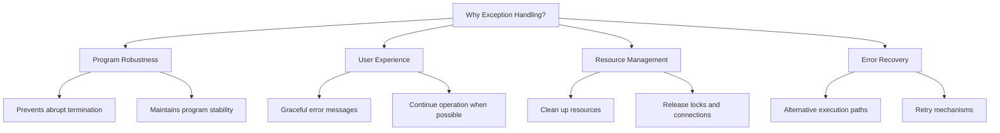
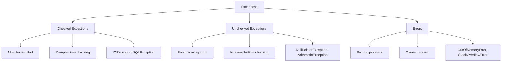
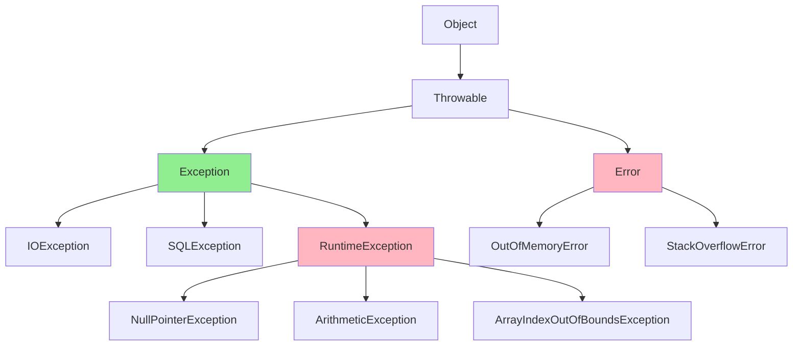
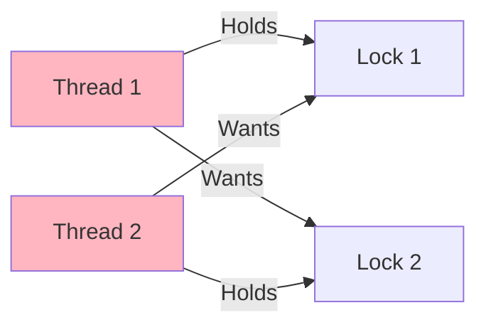

# Tutorial 17: Java Exception Handling - Complete Guide

> **Video Coverage**: Videos 166-177 (12 videos)  
> **Topics**: Exception fundamentals, try-catch, exception hierarchy, throws, finally, custom exceptions, deadlock

---

## Table of Contents

1. [Introduction to Exception Handling](#introduction-to-exception-handling)
2. [Types of Exceptions](#types-of-exceptions)
3. [Exception Hierarchy](#exception-hierarchy)
4. [Try-Catch Block](#try-catch-block)
5. [Multiple Catch Blocks](#multiple-catch-blocks)
6. [Nested Try-Catch](#nested-try-catch)
7. [Throws Keyword](#throws-keyword)
8. [Finally Block](#finally-block)
9. [When Finally Doesn't Execute](#when-finally-doesnt-execute)
10. [User-Defined Exceptions](#user-defined-exceptions)
11. [Thread Deadlock](#thread-deadlock)
12. [Best Practices](#best-practices)
13. [Common Pitfalls](#common-pitfalls)
14. [Interview Preparation](#interview-preparation)
15. [Practice Exercises](#practice-exercises)
16. [Further Reading](#further-reading)

---

## Introduction to Exception Handling

### Real-World Analogy: The Safety Net

Think of exception handling like safety measures in everyday life:

**Without Exception Handling** (No Safety Net):
```
Walking on a tightrope with no safety net below
↓
Fall occurs (error)
↓
Disaster! (program crashes)
```

**With Exception Handling** (Safety Net):
```
Walking on a tightrope with safety net below
↓
Fall occurs (exception thrown)
↓
Caught by net (exception caught)
↓
Recover and continue (handle gracefully)
```

### What is an Exception?

An **exception** is an event that disrupts the normal flow of program execution. It's an object that represents an error or unexpected condition.

```java
/**
 * Simple exception example
 * Video 166: Introduction to Exception handling
 */
public class BasicExceptionExample {
    public static void main(String[] args) {
        int[] numbers = {1, 2, 3};
        
        // This will throw ArrayIndexOutOfBoundsException
        System.out.println(numbers[5]); // Index 5 doesn't exist!
        
        // This line will never execute if exception occurs
        System.out.println("Program continues...");
    }
}
```

**Output**:
```
Exception in thread "main" java.lang.ArrayIndexOutOfBoundsException: 5
    at BasicExceptionExample.main(BasicExceptionExample.java:7)
```

### Why Exception Handling?



### Benefits of Exception Handling

1. **Separation of Concerns**: Error handling code separate from normal logic
2. **Propagation**: Errors can be passed up the call stack
3. **Grouping**: Different types of errors can be handled differently
4. **Type Safety**: Compile-time checking for checked exceptions

**Video Reference**: Video 166 - Introduction to Exception handling

---

## Types of Exceptions

### Three Categories of Exceptions



### 1. Checked Exceptions

**Definition**: Exceptions that must be caught or declared in the method signature. Checked at compile-time.

```java
/**
 * Checked exception example
 * Video 167: Types of Exception
 */
import java.io.*;

public class CheckedExceptionExample {
    
    // Must declare 'throws IOException' or use try-catch
    public static void readFile(String filename) throws IOException {
        FileReader reader = new FileReader(filename);
        BufferedReader br = new BufferedReader(reader);
        
        String line = br.readLine();
        System.out.println(line);
        
        br.close();
    }
    
    public static void main(String[] args) {
        try {
            readFile("data.txt");
        } catch (IOException e) {
            System.out.println("File not found or cannot be read");
            e.printStackTrace();
        }
    }
}
```

**Common Checked Exceptions**:
- `IOException` - Input/output operations
- `SQLException` - Database operations
- `FileNotFoundException` - File access
- `ClassNotFoundException` - Class loading
- `InterruptedException` - Thread interruption

### 2. Unchecked Exceptions (Runtime Exceptions)

**Definition**: Exceptions that occur at runtime. Not checked at compile-time.

```java
/**
 * Unchecked exception examples
 * Video 167: Types of Exception
 */
public class UncheckedExceptionExample {
    
    public static void main(String[] args) {
        
        // 1. NullPointerException
        String str = null;
        try {
            System.out.println(str.length()); // NPE!
        } catch (NullPointerException e) {
            System.out.println("Null pointer: " + e.getMessage());
        }
        
        // 2. ArithmeticException
        try {
            int result = 10 / 0; // Division by zero!
        } catch (ArithmeticException e) {
            System.out.println("Arithmetic error: " + e.getMessage());
        }
        
        // 3. ArrayIndexOutOfBoundsException
        try {
            int[] arr = {1, 2, 3};
            System.out.println(arr[5]); // Index out of bounds!
        } catch (ArrayIndexOutOfBoundsException e) {
            System.out.println("Array index error: " + e.getMessage());
        }
        
        // 4. NumberFormatException
        try {
            int num = Integer.parseInt("abc"); // Not a number!
        } catch (NumberFormatException e) {
            System.out.println("Number format error: " + e.getMessage());
        }
        
        // 5. ClassCastException
        try {
            Object obj = "Hello";
            Integer num = (Integer) obj; // Wrong cast!
        } catch (ClassCastException e) {
            System.out.println("Class cast error: " + e.getMessage());
        }
    }
}
```

**Common Unchecked Exceptions**:
- `NullPointerException` - Null reference access
- `ArithmeticException` - Math errors (division by zero)
- `ArrayIndexOutOfBoundsException` - Array access errors
- `NumberFormatException` - Invalid number parsing
- `IllegalArgumentException` - Invalid method arguments
- `ClassCastException` - Invalid type casting

### 3. Errors

**Definition**: Serious problems that applications should not try to catch. Indicate severe issues beyond program control.

```java
/**
 * Error example (demonstration only)
 * Video 167: Types of Exception
 */
public class ErrorExample {
    
    // This will cause StackOverflowError
    public static void causeStackOverflow() {
        causeStackOverflow(); // Infinite recursion!
    }
    
    // This will cause OutOfMemoryError
    public static void causeOutOfMemory() {
        int[] huge = new int[Integer.MAX_VALUE]; // Too much memory!
    }
    
    public static void main(String[] args) {
        // Don't actually catch Errors in production!
        try {
            causeStackOverflow();
        } catch (StackOverflowError e) {
            System.out.println("Stack overflow occurred");
        }
    }
}
```

**Common Errors** (DO NOT catch these):
- `OutOfMemoryError` - JVM out of memory
- `StackOverflowError` - Stack space exhausted
- `VirtualMachineError` - JVM issues
- `AssertionError` - Assertion failures

### Checked vs Unchecked Comparison

| Aspect | Checked | Unchecked |
|--------|---------|-----------|
| **Compile-time checking** | Yes ✅ | No ❌ |
| **Must handle** | Yes | No |
| **Extends** | Exception | RuntimeException |
| **When to use** | Recoverable conditions | Programming errors |
| **Examples** | IOException, SQLException | NPE, ArithmeticException |
| **Best practice** | Handle explicitly | Prevent with validation |

**Video Reference**: Video 167 - Types of Exception

---

## Exception Hierarchy

### The Exception Class Hierarchy



### Throwable Class Structure

```java
/**
 * Understanding the exception hierarchy
 * Video 168: Exception Hierarchy
 */
public class ExceptionHierarchy {
    
    public static void demonstrateHierarchy() {
        // All exceptions are Throwable
        Throwable t1 = new Exception("Exception");
        Throwable t2 = new RuntimeException("Runtime");
        Throwable t3 = new Error("Error");
        
        // Can catch at different levels
        try {
            throw new IOException("IO problem");
        } catch (IOException e) {
            // Specific catch
            System.out.println("IO Exception: " + e.getMessage());
        } catch (Exception e) {
            // General catch
            System.out.println("General Exception: " + e.getMessage());
        }
    }
    
    // Demonstrating IS-A relationships
    public static void checkInheritance() {
        RuntimeException re = new NullPointerException();
        
        System.out.println(re instanceof RuntimeException); // true
        System.out.println(re instanceof Exception); // true
        System.out.println(re instanceof Throwable); // true
        System.out.println(re instanceof Object); // true
    }
}
```

### Key Classes in Hierarchy

**1. java.lang.Throwable**
- Root of exception hierarchy
- All exceptions and errors extend Throwable
- Key methods: `getMessage()`, `printStackTrace()`, `getCause()`

**2. java.lang.Exception**
- Base class for all checked exceptions
- Represents conditions that programs should catch

**3. java.lang.RuntimeException**
- Base class for all unchecked exceptions
- Represents programming errors

**4. java.lang.Error**
- Serious problems that applications shouldn't catch
- Indicates fatal problems

### Exception Hierarchy Visualization

```
Throwable (abstract root)
├── Exception (checked by default)
│   ├── IOException
│   │   ├── FileNotFoundException
│   │   ├── EOFException
│   │   └── SocketException
│   ├── SQLException
│   ├── ClassNotFoundException
│   ├── InterruptedException
│   └── RuntimeException (unchecked)
│       ├── NullPointerException
│       ├── ArithmeticException
│       ├── ArrayIndexOutOfBoundsException
│       ├── NumberFormatException
│       ├── IllegalArgumentException
│       └── ClassCastException
└── Error (serious problems)
    ├── OutOfMemoryError
    ├── StackOverflowError
    ├── VirtualMachineError
    └── AssertionError
```

**Video Reference**: Video 168 - Exception Hierarchy

---

## Try-Catch Block

### Basic Syntax

```java
try {
    // Code that might throw exception
} catch (ExceptionType e) {
    // Handle the exception
}
```

### Simple Try-Catch Example

```java
/**
 * Basic try-catch demonstration
 * Video 169: Try-catch
 */
public class TryCatchBasics {
    
    public static void main(String[] args) {
        System.out.println("Program starts");
        
        try {
            int[] numbers = {1, 2, 3};
            System.out.println("Accessing index 5...");
            System.out.println(numbers[5]); // Exception here!
            
            System.out.println("This line won't execute");
        } catch (ArrayIndexOutOfBoundsException e) {
            System.out.println("Exception caught: " + e.getMessage());
            System.out.println("Array index is out of bounds");
        }
        
        System.out.println("Program continues after exception");
    }
}
```

**Output**:
```
Program starts
Accessing index 5...
Exception caught: 5
Array index is out of bounds
Program continues after exception
```

### Control Flow in Try-Catch

```
Normal Execution (No Exception):
┌────────────────────────┐
│ Code before try        │
└───────────┬────────────┘
            │
┌───────────▼────────────┐
│ try block              │
│ (all statements)       │
└───────────┬────────────┘
            │
┌───────────▼────────────┐
│ Code after try-catch   │
└────────────────────────┘

With Exception:
┌────────────────────────┐
│ Code before try        │
└───────────┬────────────┘
            │
┌───────────▼────────────┐
│ try block              │
│ Exception occurs!  ────┼───┐
│ (rest skipped)         │   │
└────────────────────────┘   │
                             │
            ┌────────────────┘
            │
┌───────────▼────────────┐
│ catch block            │
│ (handle exception)     │
└───────────┬────────────┘
            │
┌───────────▼────────────┐
│ Code after try-catch   │
└────────────────────────┘
```

### Detailed Try-Catch Example

```java
public class TryCatchDetailed {
    
    // Example 1: Division by zero
    public static void safeDivision(int a, int b) {
        try {
            int result = a / b;
            System.out.println("Result: " + result);
        } catch (ArithmeticException e) {
            System.out.println("Cannot divide by zero!");
            System.out.println("Error: " + e.getMessage());
        }
    }
    
    // Example 2: File operations
    public static void readFile(String filename) {
        BufferedReader reader = null;
        try {
            reader = new BufferedReader(new FileReader(filename));
            String line = reader.readLine();
            System.out.println("First line: " + line);
        } catch (FileNotFoundException e) {
            System.out.println("File not found: " + filename);
        } catch (IOException e) {
            System.out.println("Error reading file: " + e.getMessage());
        }
    }
    
    // Example 3: Number parsing
    public static void parseNumber(String str) {
        try {
            int number = Integer.parseInt(str);
            System.out.println("Parsed number: " + number);
        } catch (NumberFormatException e) {
            System.out.println("'" + str + "' is not a valid number");
        }
    }
    
    public static void main(String[] args) {
        safeDivision(10, 2);  // Normal: Result: 5
        safeDivision(10, 0);  // Exception: Cannot divide by zero!
        
        parseNumber("123");   // Normal: Parsed number: 123
        parseNumber("abc");   // Exception: 'abc' is not a valid number
    }
}
```

### Exception Object Methods

```java
public class ExceptionMethods {
    
    public static void main(String[] args) {
        try {
            int result = 10 / 0;
        } catch (ArithmeticException e) {
            // 1. getMessage() - Short description
            System.out.println("Message: " + e.getMessage());
            
            // 2. toString() - Exception class and message
            System.out.println("ToString: " + e.toString());
            
            // 3. printStackTrace() - Full stack trace
            System.out.println("Stack trace:");
            e.printStackTrace();
            
            // 4. getStackTrace() - Array of stack trace elements
            StackTraceElement[] trace = e.getStackTrace();
            System.out.println("\nFirst element: " + trace[0]);
        }
    }
}
```

**Output**:
```
Message: / by zero
ToString: java.lang.ArithmeticException: / by zero
Stack trace:
java.lang.ArithmeticException: / by zero
    at ExceptionMethods.main(ExceptionMethods.java:5)

First element: ExceptionMethods.main(ExceptionMethods.java:5)
```

**Video Reference**: Video 169 - Try-catch

---

## Multiple Catch Blocks

### Handling Different Exception Types

```java
/**
 * Multiple catch blocks demonstration
 * Video 170: Multiple catch block
 */
public class MultipleCatchExample {
    
    public static void processArray(String[] args, int index) {
        try {
            // Multiple potential exceptions here
            int number = Integer.parseInt(args[index]);
            int result = 100 / number;
            System.out.println("Result: " + result);
            
        } catch (ArrayIndexOutOfBoundsException e) {
            System.out.println("Error: Array index " + index + " doesn't exist");
            
        } catch (NumberFormatException e) {
            System.out.println("Error: Invalid number format");
            
        } catch (ArithmeticException e) {
            System.out.println("Error: Division by zero");
        }
    }
    
    public static void main(String[] args) {
        String[] data = {"10", "0", "abc"};
        
        processArray(data, 0);  // Success: Result: 10
        processArray(data, 1);  // ArithmeticException
        processArray(data, 2);  // NumberFormatException
        processArray(data, 5);  // ArrayIndexOutOfBoundsException
    }
}
```

### Catch Block Ordering Rules

**Rule**: Catch blocks must be ordered from **most specific to most general**.

```java
public class CatchBlockOrdering {
    
    // CORRECT: Specific to general
    public static void correctOrdering() {
        try {
            // code
        } catch (FileNotFoundException e) {
            // Most specific
            System.out.println("File not found");
        } catch (IOException e) {
            // More general
            System.out.println("IO error");
        } catch (Exception e) {
            // Most general
            System.out.println("General exception");
        }
    }
    
    // WRONG: Won't compile!
    /*
    public static void wrongOrdering() {
        try {
            // code
        } catch (Exception e) {
            // Too general first - catches everything!
            System.out.println("General exception");
        } catch (IOException e) {
            // Unreachable code - compile error!
            System.out.println("IO error");
        }
    }
    */
}
```

### Multi-Catch (Java 7+)

```java
/**
 * Multi-catch feature from Java 7
 * Video 170: Multiple catch block
 */
public class MultiCatchExample {
    
    // Old way: Separate catch blocks
    public static void oldWay(String input) {
        try {
            int number = Integer.parseInt(input);
            int result = 100 / number;
        } catch (NumberFormatException e) {
            System.out.println("Invalid number");
        } catch (ArithmeticException e) {
            System.out.println("Math error");
        }
    }
    
    // New way: Multi-catch (Java 7+)
    public static void newWay(String input) {
        try {
            int number = Integer.parseInt(input);
            int result = 100 / number;
        } catch (NumberFormatException | ArithmeticException e) {
            System.out.println("Error: " + e.getMessage());
            // Note: 'e' is effectively final in multi-catch
        }
    }
    
    // Multi-catch with multiple types
    public static void readAndProcess(String filename) {
        try {
            FileReader reader = new FileReader(filename);
            // Process file
        } catch (FileNotFoundException | SecurityException e) {
            System.out.println("Cannot access file: " + e.getMessage());
        } catch (IOException e) {
            System.out.println("Error reading file: " + e.getMessage());
        }
    }
}
```

### Exception Handling Patterns

```java
public class ExceptionPatterns {
    
    // Pattern 1: Catch and log
    public static void catchAndLog() {
        try {
            riskyOperation();
        } catch (Exception e) {
            logger.error("Operation failed", e);
        }
    }
    
    // Pattern 2: Catch and rethrow
    public static void catchAndRethrow() throws CustomException {
        try {
            riskyOperation();
        } catch (IOException e) {
            throw new CustomException("Wrapped exception", e);
        }
    }
    
    // Pattern 3: Catch, handle, and continue
    public static void catchAndContinue() {
        for (String item : items) {
            try {
                processItem(item);
            } catch (Exception e) {
                System.out.println("Failed to process: " + item);
                // Continue with next item
            }
        }
    }
    
    // Pattern 4: Catch specific, let others propagate
    public static void selectiveCatch() throws IOException {
        try {
            complexOperation();
        } catch (FileNotFoundException e) {
            // Handle this specific case
            createDefaultFile();
        }
        // Other IOExceptions propagate up
    }
}
```

**Video Reference**: Video 170 - Multiple catch block

---

## Nested Try-Catch

### Concept and Usage

```java
/**
 * Nested try-catch blocks
 * Video 171: Nested try-catch
 */
public class NestedTryCatchExample {
    
    public static void main(String[] args) {
        // Outer try-catch
        try {
            System.out.println("Outer try block starts");
            
            int[] arr = {1, 2, 3};
            System.out.println(arr[1]); // OK
            
            // Inner try-catch
            try {
                System.out.println("Inner try block starts");
                int result = 10 / 0; // ArithmeticException
                System.out.println("This won't print");
                
            } catch (ArithmeticException e) {
                System.out.println("Inner catch: Division by zero");
            }
            
            System.out.println("Between inner and outer");
            
            // This will be caught by outer catch
            System.out.println(arr[5]); // ArrayIndexOutOfBoundsException
            
        } catch (ArrayIndexOutOfBoundsException e) {
            System.out.println("Outer catch: Array index error");
        }
        
        System.out.println("Program continues");
    }
}
```

**Output**:
```
Outer try block starts
2
Inner try block starts
Inner catch: Division by zero
Between inner and outer
Outer catch: Array index error
Program continues
```

### Nested Try-Catch Flow

```
┌─────────────────────────────────┐
│      Outer Try Block            │
│  ┌──────────────────────────┐   │
│  │   Inner Try Block        │   │
│  │   Exception occurs! ─────┼───┼──> Inner Catch
│  └──────────────────────────┘   │    Handles it
│                                  │
│  Execution continues in outer    │
│  Another exception! ─────────────┼──> Outer Catch
└─────────────────────────────────┘    Handles it
```

### Real-World Example: File Processing

```java
public class NestedFileProcessing {
    
    public static void processFiles(String[] filenames) {
        // Outer try: Handle general errors
        try {
            System.out.println("Starting file processing batch");
            
            for (String filename : filenames) {
                // Inner try: Handle individual file errors
                try {
                    processFile(filename);
                    System.out.println("Successfully processed: " + filename);
                    
                } catch (FileNotFoundException e) {
                    System.out.println("File not found: " + filename);
                    // Continue with next file
                    
                } catch (IOException e) {
                    System.out.println("Error reading: " + filename);
                    // Continue with next file
                }
            }
            
            System.out.println("Batch processing complete");
            
        } catch (Exception e) {
            System.out.println("Fatal error in batch processing");
            e.printStackTrace();
        }
    }
    
    private static void processFile(String filename) throws IOException {
        BufferedReader reader = new BufferedReader(new FileReader(filename));
        String line;
        while ((line = reader.readLine()) != null) {
            // Process line
        }
        reader.close();
    }
}
```

### When to Use Nested Try-Catch

**Use Cases**:
1. **Different scopes of error handling**
   - Outer: Critical errors that stop execution
   - Inner: Recoverable errors that allow continuation

2. **Resource cleanup at different levels**
   ```java
   try {
       // Open database connection
       try {
           // Execute query
       } catch (SQLException e) {
           // Handle query error
       }
   } catch (Exception e) {
       // Handle connection error
   }
   ```

3. **Processing collections with error isolation**
   ```java
   try {
       for (Item item : items) {
           try {
               processItem(item);
           } catch (ProcessingException e) {
               // Skip this item, continue with others
           }
       }
   } catch (Exception e) {
       // Fatal error, stop all processing
   }
   ```

**Best Practices**:
- ✅ Keep nesting shallow (max 2-3 levels)
- ✅ Use clear, descriptive error messages
- ✅ Consider try-with-resources instead
- ❌ Avoid deep nesting (hard to read/maintain)
- ❌ Don't catch exceptions you can't handle

**Video Reference**: Video 171 - Nested try-catch

---

## Throws Keyword

### Purpose and Syntax

The `throws` keyword declares that a method might throw specified exceptions, delegating handling to the caller.

```java
returnType methodName(parameters) throws ExceptionType1, ExceptionType2 {
    // method body
}
```

### Basic Throws Example

```java
/**
 * Throws keyword demonstration
 * Video 172: Throws
 */
public class ThrowsExample {
    
    // Method declares it may throw IOException
    public static void readFile(String filename) throws IOException {
        FileReader reader = new FileReader(filename);
        BufferedReader br = new BufferedReader(reader);
        
        String line = br.readLine();
        System.out.println(line);
        
        br.close();
        // IOException might occur - caller must handle
    }
    
    // Multiple exceptions can be declared
    public static void processData(String data) 
            throws IOException, SQLException {
        // May throw IOException
        saveToFile(data);
        
        // May throw SQLException
        saveToDatabase(data);
    }
    
    public static void main(String[] args) {
        // Caller must handle declared exceptions
        try {
            readFile("data.txt");
        } catch (IOException e) {
            System.out.println("Error reading file: " + e.getMessage());
        }
    }
}
```

### Throws vs Try-Catch

```java
public class ThrowsVsTryCatch {
    
    // Approach 1: Handle exception locally (try-catch)
    public static void approach1() {
        try {
            FileReader reader = new FileReader("file.txt");
            // work with file
        } catch (FileNotFoundException e) {
            System.out.println("File not found");
        }
    }
    
    // Approach 2: Declare exception (throws)
    public static void approach2() throws FileNotFoundException {
        FileReader reader = new FileReader("file.txt");
        // work with file
        // Caller must handle FileNotFoundException
    }
    
    // Can combine both approaches
    public static void combined() throws IOException {
        try {
            FileReader reader = new FileReader("file.txt");
            // work with file
        } catch (FileNotFoundException e) {
            // Handle file not found specifically
            System.out.println("File not found, using default");
            // Other IOExceptions still propagate
        }
    }
}
```

### Exception Propagation

```java
/**
 * Understanding exception propagation
 * Video 172: Throws
 */
public class ExceptionPropagation {
    
    // Level 3: Throws exception
    public static void level3() throws IOException {
        throw new IOException("Error at level 3");
    }
    
    // Level 2: Propagates exception
    public static void level2() throws IOException {
        System.out.println("Level 2 called");
        level3(); // Exception propagates up
    }
    
    // Level 1: Propagates exception
    public static void level1() throws IOException {
        System.out.println("Level 1 called");
        level2(); // Exception propagates up
    }
    
    // Main: Handles exception
    public static void main(String[] args) {
        try {
            level1();
        } catch (IOException e) {
            System.out.println("Exception caught in main: " + e.getMessage());
            e.printStackTrace();
        }
    }
}
```

**Output**:
```
Level 1 called
Level 2 called
Exception caught in main: Error at level 3
java.io.IOException: Error at level 3
    at ExceptionPropagation.level3(ExceptionPropagation.java:8)
    at ExceptionPropagation.level2(ExceptionPropagation.java:14)
    at ExceptionPropagation.level1(ExceptionPropagation.java:20)
    at ExceptionPropagation.main(ExceptionPropagation.java:26)
```

### Propagation Visualization

```
main()
  │
  ├──> calls level1()
  │      │
  │      ├──> calls level2()
  │      │      │
  │      │      ├──> calls level3()
  │      │      │      │
  │      │      │      └──> throws IOException
  │      │      │
  │      │      └──> propagates IOException
  │      │
  │      └──> propagates IOException
  │
  └──> catches IOException
```

### When to Use Throws

**Use `throws` when**:
- ✅ Caller is better positioned to handle the exception
- ✅ Method is part of an interface/API contract
- ✅ Exception represents recoverable condition
- ✅ Multiple methods in call chain need to coordinate

**Use `try-catch` when**:
- ✅ You can handle the exception meaningfully
- ✅ You want to provide fallback behavior
- ✅ You need to log or wrap the exception
- ✅ You want to prevent exception propagation

**Video Reference**: Video 172 - Throws

---

## Finally Block

### Purpose and Syntax

The `finally` block **always executes** (with rare exceptions), making it perfect for cleanup code.

```java
try {
    // Risky code
} catch (Exception e) {
    // Handle exception
} finally {
    // Always executes (cleanup code)
}
```

### Basic Finally Example

```java
/**
 * Finally block demonstration
 * Video 173: finally block
 */
public class FinallyBasicExample {
    
    public static void main(String[] args) {
        System.out.println("Start");
        
        try {
            System.out.println("Inside try block");
            int result = 10 / 2;
            System.out.println("Result: " + result);
            
        } catch (ArithmeticException e) {
            System.out.println("Inside catch block");
            
        } finally {
            System.out.println("Inside finally block - Always executes!");
        }
        
        System.out.println("End");
    }
}
```

**Output**:
```
Start
Inside try block
Result: 5
Inside finally block - Always executes!
End
```

### Finally with Exception

```java
public class FinallyWithException {
    
    public static void demonstrateFinally() {
        try {
            System.out.println("Try block");
            int result = 10 / 0; // Exception!
            System.out.println("This won't execute");
            
        } catch (ArithmeticException e) {
            System.out.println("Catch block");
            
        } finally {
            System.out.println("Finally block - Still executes!");
        }
        
        System.out.println("After try-catch-finally");
    }
}
```

**Output**:
```
Try block
Catch block
Finally block - Still executes!
After try-catch-finally
```

### Finally Without Catch

```java
public class FinallyWithoutCatch {
    
    // Finally can be used without catch
    public static void method1() {
        try {
            System.out.println("Opening resource");
            // Work with resource
        } finally {
            System.out.println("Closing resource");
            // Cleanup always happens
        }
    }
    
    // Useful for guaranteed cleanup
    public static void method2() throws IOException {
        FileInputStream fis = null;
        try {
            fis = new FileInputStream("file.txt");
            // Read file
        } finally {
            if (fis != null) {
                fis.close(); // Always close
            }
        }
    }
}
```

### Resource Cleanup Example

```java
/**
 * Using finally for resource cleanup
 * Video 173: finally block
 */
public class FinallyResourceCleanup {
    
    public static void readFile(String filename) {
        BufferedReader reader = null;
        
        try {
            reader = new BufferedReader(new FileReader(filename));
            String line = reader.readLine();
            System.out.println("First line: " + line);
            
        } catch (FileNotFoundException e) {
            System.out.println("File not found: " + filename);
            
        } catch (IOException e) {
            System.out.println("Error reading file");
            
        } finally {
            // Cleanup code - always executes
            System.out.println("Cleanup: Closing file");
            if (reader != null) {
                try {
                    reader.close();
                } catch (IOException e) {
                    System.out.println("Error closing file");
                }
            }
        }
    }
}
```

### Try-with-Resources (Java 7+)

Modern alternative to finally for resource management:

```java
/**
 * Try-with-resources: Better than finally for resources
 * Automatically closes resources that implement AutoCloseable
 */
public class TryWithResourcesExample {
    
    // Old way: Manual cleanup in finally
    public static void oldWay(String filename) {
        BufferedReader reader = null;
        try {
            reader = new BufferedReader(new FileReader(filename));
            String line = reader.readLine();
            System.out.println(line);
        } catch (IOException e) {
            e.printStackTrace();
        } finally {
            if (reader != null) {
                try {
                    reader.close();
                } catch (IOException e) {
                    e.printStackTrace();
                }
            }
        }
    }
    
    // New way: Try-with-resources
    public static void newWay(String filename) {
        try (BufferedReader reader = new BufferedReader(new FileReader(filename))) {
            String line = reader.readLine();
            System.out.println(line);
            // reader automatically closed!
        } catch (IOException e) {
            e.printStackTrace();
        }
    }
    
    // Multiple resources
    public static void multipleResources(String input, String output) {
        try (FileInputStream fis = new FileInputStream(input);
             FileOutputStream fos = new FileOutputStream(output)) {
            // Both streams automatically closed
            int data;
            while ((data = fis.read()) != -1) {
                fos.write(data);
            }
        } catch (IOException e) {
            e.printStackTrace();
        }
    }
}
```

### Finally Execution Flow

```
Scenario 1: No Exception
┌────────┐
│  try   │ → executes fully
└────┬───┘
     │
     ↓
┌────────┐
│finally │ → executes
└────┬───┘
     │
     ↓
Continue

Scenario 2: Exception Caught
┌────────┐
│  try   │ → exception occurs
└────┬───┘
     │
     ↓
┌────────┐
│ catch  │ → handles exception
└────┬───┘
     │
     ↓
┌────────┐
│finally │ → executes
└────┬───┘
     │
     ↓
Continue

Scenario 3: Exception Not Caught
┌────────┐
│  try   │ → exception occurs
└────┬───┘
     │
     ↓
┌────────┐
│finally │ → executes
└────┬───┘
     │
     ↓
Exception propagates
```

**Video Reference**: Video 173 - finally block

---

## When Finally Doesn't Execute

### Rare Cases Where Finally Won't Run

```java
/**
 * Cases where finally doesn't execute
 * Video 174: when finally is not get executed
 */
public class FinallyDoesntExecute {
    
    // Case 1: System.exit()
    public static void case1SystemExit() {
        try {
            System.out.println("Try block");
            System.exit(0); // JVM terminates!
        } finally {
            System.out.println("Finally - WON'T execute");
        }
    }
    
    // Case 2: Fatal JVM crash
    public static void case2FatalError() {
        try {
            System.out.println("Try block");
            // Cause OutOfMemoryError
            int[] huge = new int[Integer.MAX_VALUE];
        } finally {
            System.out.println("Finally - May not execute if JVM crashes");
        }
    }
    
    // Case 3: Infinite loop in try
    public static void case3InfiniteLoop() {
        try {
            System.out.println("Try block");
            while (true) {
                // Infinite loop - finally never reached
            }
        } finally {
            System.out.println("Finally - WON'T execute");
        }
    }
    
    // Case 4: Thread death
    public static void case4ThreadDeath() {
        try {
            System.out.println("Try block");
            Thread.currentThread().stop(); // Deprecated and dangerous!
        } finally {
            System.out.println("Finally - May not execute");
        }
    }
    
    // Case 5: Power failure or OS crash
    // Obviously finally can't execute if hardware/OS fails!
}
```

### Normal Cases - Finally Always Executes

```java
public class FinallyAlwaysExecutes {
    
    // Case 1: Even with return statement
    public static int withReturn() {
        try {
            System.out.println("Try block");
            return 1;
        } finally {
            System.out.println("Finally executes before return!");
        }
    }
    
    // Case 2: Even with uncaught exception
    public static void withUnca

ughtException() {
        try {
            System.out.println("Try block");
            throw new RuntimeException("Uncaught");
        } finally {
            System.out.println("Finally executes before exception propagates!");
        }
    }
    
    // Case 3: With multiple return paths
    public static int multipleReturns(int x) {
        try {
            if (x > 0) {
                return 1;
            } else if (x < 0) {
                return -1;
            } else {
                return 0;
            }
        } finally {
            System.out.println("Finally executes regardless of which return!");
        }
    }
}
```

### Finally and Return Value

```java
public class FinallyAndReturn {
    
    // Finally can't override try/catch return value
    public static int normalReturn() {
        try {
            return 10;
        } finally {
            System.out.println("Finally executes");
            // Can't change return value
        }
        // Returns 10
    }
    
    // Unless finally has its own return (BAD PRACTICE!)
    public static int finallyReturn() {
        try {
            return 10;
        } finally {
            return 20; // BAD! Overrides try return
        }
        // Returns 20 (confusing!)
    }
    
    // Finally can modify mutable objects
    public static StringBuilder modifyInFinally() {
        StringBuilder sb = new StringBuilder("Try");
        try {
            return sb;
        } finally {
            sb.append(" - Finally"); // Modifies the object
        }
        // Returns "Try - Finally"
    }
}
```

### Summary: When Finally Doesn't Execute

| Case | Finally Executes? | Reason |
|------|-------------------|---------|
| **Normal flow** | ✅ Yes | Default behavior |
| **Exception caught** | ✅ Yes | Before catch completes |
| **Exception uncaught** | ✅ Yes | Before propagation |
| **return statement** | ✅ Yes | Before method returns |
| **System.exit()** | ❌ No | JVM terminates immediately |
| **Fatal JVM error** | ❌ No | JVM crashes |
| **Infinite loop** | ❌ No | Never reaches finally |
| **Power failure** | ❌ No | Physical impossibility |

**Video Reference**: Video 174 - when finally is not get executed

---

## User-Defined Exceptions

### Creating Custom Exceptions

```java
/**
 * User-defined (custom) exception
 * Video 175: User defined Exception
 * Video 176: Example on user defined Exception
 */

// Custom checked exception
class InsufficientFundsException extends Exception {
    private double amount;
    
    public InsufficientFundsException(double amount) {
        super("Insufficient funds: Need " + amount + " more");
        this.amount = amount;
    }
    
    public double getAmount() {
        return amount;
    }
}

// Custom unchecked exception
class InvalidAgeException extends RuntimeException {
    public InvalidAgeException(String message) {
        super(message);
    }
    
    public InvalidAgeException(String message, Throwable cause) {
        super(message, cause);
    }
}
```

### Using Custom Exceptions

```java
/**
 * Practical custom exception examples
 * Video 176: Example on user defined Exception
 */
public class CustomExceptionExample {
    
    static class BankAccount {
        private double balance;
        
        public BankAccount(double initialBalance) {
            this.balance = initialBalance;
        }
        
        public void withdraw(double amount) throws InsufficientFundsException {
            if (amount > balance) {
                double shortage = amount - balance;
                throw new InsufficientFundsException(shortage);
            }
            balance -= amount;
            System.out.println("Withdrew: $" + amount);
            System.out.println("Remaining balance: $" + balance);
        }
        
        public void deposit(double amount) {
            balance += amount;
            System.out.println("Deposited: $" + amount);
        }
        
        public double getBalance() {
            return balance;
        }
    }
    
    public static void main(String[] args) {
        BankAccount account = new BankAccount(1000.00);
        
        try {
            account.withdraw(500.00);  // OK
            account.withdraw(700.00);  // Throws InsufficientFundsException
            
        } catch (InsufficientFundsException e) {
            System.out.println("Transaction failed: " + e.getMessage());
            System.out.println("Short by: $" + e.getAmount());
        }
    }
}
```

**Output**:
```
Withdrew: $500.0
Remaining balance: $500.0
Transaction failed: Insufficient funds: Need 200.0 more
Short by: $200.0
```

### More Custom Exception Examples

```java
// Age validation exception
class AgeValidationException extends Exception {
    public AgeValidationException(int age) {
        super("Invalid age: " + age + ". Must be between 0 and 150");
    }
}

// Email validation exception
class InvalidEmailException extends Exception {
    public InvalidEmailException(String email) {
        super("Invalid email format: " + email);
    }
}

// Application using custom exceptions
class User {
    private String name;
    private int age;
    private String email;
    
    public void setAge(int age) throws AgeValidationException {
        if (age < 0 || age > 150) {
            throw new AgeValidationException(age);
        }
        this.age = age;
    }
    
    public void setEmail(String email) throws InvalidEmailException {
        if (!email.contains("@") || !email.contains(".")) {
            throw new InvalidEmailException(email);
        }
        this.email = email;
    }
}
```

### Best Practices for Custom Exceptions

```java
// GOOD: Meaningful exception with context
class OrderProcessingException extends Exception {
    private String orderId;
    private String reason;
    
    public OrderProcessingException(String orderId, String reason) {
        super("Order " + orderId + " failed: " + reason);
        this.orderId = orderId;
        this.reason = reason;
    }
    
    public String getOrderId() { return orderId; }
    public String getReason() { return reason; }
}

// GOOD: Exception chaining (wrapping)
class DataAccessException extends Exception {
    public DataAccessException(String message, Throwable cause) {
        super(message, cause);
    }
}

// Usage of exception chaining
public class ExceptionChaining {
    public static void fetchData() throws DataAccessException {
        try {
            // Database operation
            throw new SQLException("Connection lost");
        } catch (SQLException e) {
            // Wrap low-level exception
            throw new DataAccessException("Failed to fetch data", e);
        }
    }
}
```

### Custom Exception Guidelines

**DO**:
- ✅ Extend Exception (checked) or RuntimeException (unchecked)
- ✅ Provide meaningful exception names (end with "Exception")
- ✅ Include detailed error messages
- ✅ Add fields for error context
- ✅ Provide multiple constructors
- ✅ Use exception chaining for root cause

**DON'T**:
- ❌ Create too many custom exceptions
- ❌ Use exceptions for control flow
- ❌ Swallow important information
- ❌ Make all exceptions checked
- ❌ Forget to document with Javadoc

**Video References**:
- Video 175 - User defined Exception
- Video 176 - Example on user defined Exception

---

## Thread Deadlock

### Understanding Deadlock

**Deadlock**: A situation where two or more threads are blocked forever, waiting for each other.



### Deadlock Example

```java
/**
 * Thread deadlock demonstration
 * Video 177: Thread Dead Lock
 */
public class DeadlockExample {
    private static final Object lock1 = new Object();
    private static final Object lock2 = new Object();
    
    public static void main(String[] args) {
        // Thread 1: Acquires lock1, then lock2
        Thread thread1 = new Thread(() -> {
            synchronized (lock1) {
                System.out.println("Thread 1: Holding lock 1...");
                
                try { Thread.sleep(100); } catch (InterruptedException e) {}
                
                System.out.println("Thread 1: Waiting for lock 2...");
                synchronized (lock2) {
                    System.out.println("Thread 1: Holding lock 1 & 2");
                }
            }
        });
        
        // Thread 2: Acquires lock2, then lock1 (opposite order!)
        Thread thread2 = new Thread(() -> {
            synchronized (lock2) {
                System.out.println("Thread 2: Holding lock 2...");
                
                try { Thread.sleep(100); } catch (InterruptedException e) {}
                
                System.out.println("Thread 2: Waiting for lock 1...");
                synchronized (lock1) {
                    System.out.println("Thread 2: Holding lock 1 & 2");
                }
            }
        });
        
        thread1.start();
        thread2.start();
        
        // Threads will deadlock!
    }
}
```

**Output** (program hangs):
```
Thread 1: Holding lock 1...
Thread 2: Holding lock 2...
Thread 1: Waiting for lock 2...
Thread 2: Waiting for lock 1...
[Program hangs forever - DEADLOCK!]
```

### Deadlock Conditions

All four conditions must be present for deadlock:

1. **Mutual Exclusion**: Resources cannot be shared
2. **Hold and Wait**: Thread holds resources while waiting for others
3. **No Preemption**: Resources cannot be forcibly taken
4. **Circular Wait**: Circular chain of threads waiting for resources

```
Thread 1          Thread 2
   │                 │
   ├─ Lock A         ├─ Lock B
   │  held           │  held
   │                 │
   ├─ Wait for B ────┼─ Wait for A
   │                 │
   └─ DEADLOCK ──────┘
```

### Preventing Deadlock

```java
/**
 * Deadlock prevention strategies
 * Video 177: Thread Dead Lock
 */
public class DeadlockPrevention {
    private static final Object lock1 = new Object();
    private static final Object lock2 = new Object();
    
    // Solution 1: Acquire locks in same order
    public static void solution1() {
        Thread thread1 = new Thread(() -> {
            synchronized (lock1) {
                synchronized (lock2) {
                    System.out.println("Thread 1: Got both locks");
                }
            }
        });
        
        Thread thread2 = new Thread(() -> {
            synchronized (lock1) {  // Same order as thread1!
                synchronized (lock2) {
                    System.out.println("Thread 2: Got both locks");
                }
            }
        });
        
        thread1.start();
        thread2.start();
        // No deadlock - both threads acquire locks in same order
    }
    
    // Solution 2: Use tryLock with timeout
    public static void solution2() {
        Lock lock1 = new ReentrantLock();
        Lock lock2 = new ReentrantLock();
        
        Thread thread1 = new Thread(() -> {
            try {
                if (lock1.tryLock(1000, TimeUnit.MILLISECONDS)) {
                    try {
                        if (lock2.tryLock(1000, TimeUnit.MILLISECONDS)) {
                            try {
                                System.out.println("Thread 1: Got both locks");
                            } finally {
                                lock2.unlock();
                            }
                        }
                    } finally {
                        lock1.unlock();
                    }
                }
            } catch (InterruptedException e) {
                e.printStackTrace();
            }
        });
        
        thread1.start();
        // With timeout, threads can back off and retry
    }
    
    // Solution 3: Single lock for related operations
    public static void solution3() {
        Object singleLock = new Object();
        
        Thread thread1 = new Thread(() -> {
            synchronized (singleLock) {
                // All operations under one lock
                System.out.println("Thread 1: Working");
            }
        });
        
        Thread thread2 = new Thread(() -> {
            synchronized (singleLock) {
                System.out.println("Thread 2: Working");
            }
        });
        
        thread1.start();
        thread2.start();
        // Sequential execution, no deadlock possible
    }
}
```

### Detecting Deadlock

```java
public class DeadlockDetection {
    
    public static void detectDeadlock() {
        ThreadMXBean bean = ManagementFactory.getThreadMXBean();
        long[] threadIds = bean.findDeadlockedThreads();
        
        if (threadIds != null) {
            System.out.println("Deadlock detected!");
            ThreadInfo[] threadInfos = bean.getThreadInfo(threadIds);
            
            for (ThreadInfo info : threadInfos) {
                System.out.println("Thread: " + info.getThreadName());
                System.out.println("State: " + info.getThreadState());
                System.out.println("Locked on: " + info.getLockName());
            }
        } else {
            System.out.println("No deadlock detected");
        }
    }
}
```

### Deadlock Prevention Strategies

| Strategy | Description | Pros | Cons |
|----------|-------------|------|------|
| **Lock Ordering** | Always acquire locks in same order | Simple, effective | Requires discipline |
| **Lock Timeout** | Use tryLock with timeout | Can recover | More complex code |
| **Single Lock** | Use one lock for related operations | No deadlock possible | Reduced concurrency |
| **No Nested Locks** | Avoid acquiring multiple locks | Eliminates deadlock | May not be feasible |

**Video Reference**: Video 177 - Thread Dead Lock

---

## Best Practices

### 1. Use Specific Exception Types

```java
// BAD: Too general
public void processData() throws Exception {
    // What kind of exception?
}

// GOOD: Specific exceptions
public void processData() throws IOException, SQLException {
    // Clear what can go wrong
}
```

### 2. Don't Catch Throwable or Error

```java
// BAD: Catches everything, including VirtualMachineError!
try {
    // code
} catch (Throwable t) {
    // Catches errors that shouldn't be caught
}

// GOOD: Catch specific exceptions
try {
    // code
} catch (IOException | SQLException e) {
    // Handle specific cases
}
```

### 3. Never Swallow Exceptions

```java
// BAD: Silent failure
try {
    riskyOperation();
} catch (Exception e) {
    // Do nothing - exception disappears!
}

// GOOD: Log or handle
try {
    riskyOperation();
} catch (Exception e) {
    logger.error("Operation failed", e);
    // Or rethrow, or handle appropriately
}
```

### 4. Use Try-with-Resources

```java
// BAD: Manual resource management
BufferedReader br = null;
try {
    br = new BufferedReader(new FileReader("file.txt"));
    // use br
} finally {
    if (br != null) {
        try {
            br.close();
        } catch (IOException e) {
            // handle
        }
    }
}

// GOOD: Automatic resource management
try (BufferedReader br = new BufferedReader(new FileReader("file.txt"))) {
    // use br - automatically closed
}
```

### 5. Document Exceptions

```java
/**
 * Processes user data from file.
 * 
 * @param filename the file to process
 * @return processed data
 * @throws FileNotFoundException if file doesn't exist
 * @throws IOException if error reading file
 * @throws IllegalArgumentException if filename is null
 */
public Data processFile(String filename) 
        throws FileNotFoundException, IOException {
    // implementation
}
```

### 6. Fail Fast

```java
// GOOD: Validate early
public void processOrder(Order order) {
    if (order == null) {
        throw new IllegalArgumentException("Order cannot be null");
    }
    if (order.getItems().isEmpty()) {
        throw new IllegalStateException("Order has no items");
    }
    // Process order
}
```

### 7. Use Exception Chaining

```java
// GOOD: Preserve root cause
try {
    // database operation
} catch (SQLException e) {
    throw new DataAccessException("Failed to save order", e);
    // Original exception is preserved as cause
}
```

---

## Common Pitfalls

### 1. Catching Exception Too Broadly

```java
// BAD: Masks all exceptions
try {
    process();
} catch (Exception e) {
    // Catches even programming errors!
}

// GOOD: Catch specific exceptions
try {
    process();
} catch (IOException e) {
    // Handle I/O errors
} catch (SQLException e) {
    // Handle database errors
}
```

### 2. Returning in Finally

```java
// BAD: Overwrites try/catch return value
public int badMethod() {
    try {
        return 10;
    } finally {
        return 20; // BAD! Overwrites 10
    }
}

// GOOD: No return in finally
public int goodMethod() {
    int result = 0;
    try {
        result = 10;
    } finally {
        // Cleanup only
    }
    return result;
}
```

### 3. Empty Catch Block

```java
// BAD: Silent failure
try {
    riskyOperation();
} catch (Exception e) {
}

// GOOD: At least log it
try {
    riskyOperation();
} catch (Exception e) {
    logger.warn("Operation failed, using default", e);
}
```

### 4. Using Exceptions for Control Flow

```java
// BAD: Exception for control flow
try {
    int index = 0;
    while (true) {
        System.out.println(array[index++]);
    }
} catch (ArrayIndexOutOfBoundsException e) {
    // Bad way to exit loop!
}

// GOOD: Proper control flow
for (int i = 0; i < array.length; i++) {
    System.out.println(array[i]);
}
```

### 5. Not Closing Resources

```java
// BAD: Resource leak
FileInputStream fis = new FileInputStream("file.txt");
// If exception occurs here, fis never closed!

// GOOD: Always close resources
try (FileInputStream fis = new FileInputStream("file.txt")) {
    // use fis - automatically closed
}
```

---

## Interview Preparation

### Question 1: Difference between checked and unchecked exceptions

**Answer**:

| Aspect | Checked | Unchecked |
|--------|---------|-----------|
| **Compile-time** | Must handle | Optional |
| **Extends** | Exception | RuntimeException |
| **When** | Recoverable conditions | Programming errors |
| **Examples** | IOException, SQLException | NPE, IllegalArgumentException |

**Checked**: Compiler forces you to handle  
**Unchecked**: Runtime exceptions, not checked by compiler

---

### Question 2: What is the exception hierarchy in Java?

**Answer**:
```
Object
  └── Throwable
      ├── Exception (checked)
      │   ├── IOException
      │   ├── SQLException
      │   └── RuntimeException (unchecked)
      │       ├── NullPointerException
      │       └── ArithmeticException
      └── Error (don't catch)
          ├── OutOfMemoryError
          └── StackOverflowError
```

---

### Question 3: Can we have try without catch?

**Answer**: Yes! Try can be used with:
- `try-catch`
- `try-finally`
- `try-catch-finally`

Example:
```java
try {
    riskyOperation();
} finally {
    cleanup(); // Always executes
}
```

---

### Question 4: What is the difference between throw and throws?

**Answer**:

| Aspect | throw | throws |
|--------|-------|--------|
| **Purpose** | Explicitly throw exception | Declare possible exceptions |
| **Usage** | Inside method body | In method signature |
| **Syntax** | `throw new Exception()` | `throws Exception` |
| **Followed by** | Exception instance | Exception class name |
| **Multiple** | One at a time | Multiple declarations |

**Example**:
```java
// throws - declaration
public void method() throws IOException {
    // throw - actual throwing
    throw new IOException("Error");
}
```

---

### Question 5: Can we override a method that throws checked exceptions?

**Answer**: Yes, but with restrictions:

**Rules**:
1. Can throw **same** exception
2. Can throw **subclass** (more specific)
3. Can throw **fewer** exceptions
4. **Cannot** throw **broader** or **new** checked exceptions

```java
class Parent {
    void method() throws IOException { }
}

class Child extends Parent {
    // VALID: Same exception
    void method() throws IOException { }
    
    // VALID: Subclass (more specific)
    void method() throws FileNotFoundException { }
    
    // VALID: No exception
    void method() { }
    
    // INVALID: Broader exception
    // void method() throws Exception { }
    
    // INVALID: New checked exception
    // void method() throws SQLException { }
}
```

---

### Question 6: Explain exception chaining

**Answer**: Exception chaining is wrapping one exception inside another, preserving the root cause.

**Purpose**:
- Maintain exception context
- Translate low-level to high-level exceptions
- Preserve stack trace

```java
public class ExceptionChaining {
    public void businessMethod() throws BusinessException {
        try {
            databaseOperation();
        } catch (SQLException e) {
            // Wrap SQLException in BusinessException
            throw new BusinessException("Business operation failed", e);
        }
    }
}
```

**Benefits**:
- Original cause not lost
- Can add contextual information
- Maintains complete error trail

---

### Question 7: What is try-with-resources?

**Answer**: Try-with-resources (Java 7+) automatically closes resources that implement `AutoCloseable`.

**Syntax**:
```java
try (ResourceType resource = new ResourceType()) {
    // Use resource
} catch (Exception e) {
    // Handle exception
}
// Resource automatically closed
```

**Advantages**:
- ✅ Automatic resource management
- ✅ No explicit finally needed
- ✅ Cleaner, less error-prone code
- ✅ Handles suppressed exceptions

**Example**:
```java
// Multiple resources
try (FileInputStream fis = new FileInputStream("input.txt");
     FileOutputStream fos = new FileOutputStream("output.txt")) {
    // Use both streams
} // Both automatically closed in reverse order
```

---

### Question 8: What are suppressed exceptions?

**Answer**: Suppressed exceptions occur when an exception is thrown while closing resources in try-with-resources.

```java
try (MyResource res = new MyResource()) {
    throw new Exception("Primary"); // Primary exception
} // close() throws exception - suppressed

// Retrieve suppressed exceptions
catch (Exception e) {
    System.out.println("Primary: " + e.getMessage());
    for (Throwable t : e.getSuppressed()) {
        System.out.println("Suppressed: " + t.getMessage());
    }
}
```

**Why important**:
- Prevents information loss
- Both exceptions preserved
- Available via `getSuppressed()`

---

### Question 9: Can finally block throw an exception?

**Answer**: Yes, but it's **bad practice** and can mask the original exception.

```java
// BAD: Finally exception masks try exception
try {
    throw new IOException("IO Error");
} finally {
    throw new RuntimeException("Finally Error");
}
// Only RuntimeException propagates - IOException lost!
```

**Best Practice**: Catch and log exceptions in finally:
```java
try {
    riskyOperation();
} finally {
    try {
        cleanup();
    } catch (Exception e) {
        logger.error("Cleanup failed", e);
    }
}
```

---

### Question 10: Explain the difference between Error and Exception

**Answer**:

| Aspect | Error | Exception |
|--------|-------|-----------|
| **Purpose** | Serious JVM problems | Recoverable conditions |
| **Recovery** | Cannot recover | Can recover |
| **Handling** | Should NOT catch | Should handle |
| **Causes** | External to application | Application logic |
| **Examples** | OutOfMemoryError, StackOverflowError | IOException, SQLException |

**When to catch**:
- ❌ Don't catch `Error`
- ✅ Catch `Exception` (when appropriate)

**Example**:
```java
// DON'T do this
try {
    // code
} catch (OutOfMemoryError e) {
    // Can't do anything meaningful
}

// DO this
try {
    // code
} catch (IOException e) {
    // Can handle gracefully
}
```

---

## Practice Exercises

### Exercise 1: ATM Withdrawal System

**Problem**: Create an ATM system with custom exceptions for various error conditions.

**Requirements**:
- Custom exception: `InsufficientBalanceException`
- Custom exception: `InvalidAmountException`
- Custom exception: `DailyLimitExceededException`
- Implement withdrawal with proper exception handling

<details>
<summary>Click to see solution</summary>

```java
// Custom Exceptions
class InsufficientBalanceException extends Exception {
    private double balance;
    private double requestedAmount;
    
    public InsufficientBalanceException(double balance, double requested) {
        super("Insufficient balance. Available: $" + balance + 
              ", Requested: $" + requested);
        this.balance = balance;
        this.requestedAmount = requested;
    }
    
    public double getShortage() {
        return requestedAmount - balance;
    }
}

class InvalidAmountException extends Exception {
    public InvalidAmountException(String message) {
        super(message);
    }
}

class DailyLimitExceededException extends Exception {
    private double dailyLimit;
    private double todayWithdrawn;
    
    public DailyLimitExceededException(double limit, double withdrawn) {
        super("Daily limit exceeded. Limit: $" + limit + 
              ", Already withdrawn today: $" + withdrawn);
        this.dailyLimit = limit;
        this.todayWithdrawn = withdrawn;
    }
}

// ATM System
class ATMAccount {
    private String accountNumber;
    private double balance;
    private double todayWithdrawn;
    private static final double DAILY_LIMIT = 1000.00;
    
    public ATMAccount(String accountNumber, double initialBalance) {
        this.accountNumber = accountNumber;
        this.balance = initialBalance;
        this.todayWithdrawn = 0;
    }
    
    public void withdraw(double amount) 
            throws InsufficientBalanceException, 
                   InvalidAmountException, 
                   DailyLimitExceededException {
        
        // Validate amount
        if (amount <= 0) {
            throw new InvalidAmountException("Amount must be positive");
        }
        
        if (amount % 10 != 0) {
            throw new InvalidAmountException("Amount must be multiple of $10");
        }
        
        // Check daily limit
        if (todayWithdrawn + amount > DAILY_LIMIT) {
            throw new DailyLimitExceededException(DAILY_LIMIT, todayWithdrawn);
        }
        
        // Check balance
        if (amount > balance) {
            throw new InsufficientBalanceException(balance, amount);
        }
        
        // Perform withdrawal
        balance -= amount;
        todayWithdrawn += amount;
        System.out.println("Withdrawal successful: $" + amount);
        System.out.println("Remaining balance: $" + balance);
    }
    
    public double getBalance() {
        return balance;
    }
}

// Test
public class ATMTest {
    public static void main(String[] args) {
        ATMAccount account = new ATMAccount("12345", 500.00);
        
        try {
            account.withdraw(200);  // Success
            account.withdraw(400);  // InsufficientBalanceException
        } catch (InsufficientBalanceException e) {
            System.out.println("Error: " + e.getMessage());
            System.out.println("Short by: $" + e.getShortage());
        } catch (InvalidAmountException e) {
            System.out.println("Error: " + e.getMessage());
        } catch (DailyLimitExceededException e) {
            System.out.println("Error: " + e.getMessage());
        }
    }
}
```
</details>

---

### Exercise 2: File Processing with Multiple Exceptions

**Problem**: Create a file processor that handles multiple exception scenarios gracefully.

**Requirements**:
- Read multiple files in a batch
- Handle file not found
- Handle read errors
- Use nested try-catch appropriately
- Ensure resources are properly closed

<details>
<summary>Click to see solution</summary>

```java
import java.io.*;
import java.util.*;

public class FileProcessor {
    
    private List<String> successFiles = new ArrayList<>();
    private Map<String, String> failedFiles = new HashMap<>();
    
    public void processBatch(String[] filenames) {
        System.out.println("Starting batch processing of " + 
                          filenames.length + " files");
        
        for (String filename : filenames) {
            try {
                processFile(filename);
                successFiles.add(filename);
                System.out.println("✓ Successfully processed: " + filename);
                
            } catch (FileNotFoundException e) {
                failedFiles.put(filename, "File not found");
                System.out.println("✗ File not found: " + filename);
                
            } catch (IOException e) {
                failedFiles.put(filename, "Read error: " + e.getMessage());
                System.out.println("✗ Error reading: " + filename);
                
            } catch (Exception e) {
                failedFiles.put(filename, "Unexpected error: " + e.getMessage());
                System.out.println("✗ Unexpected error: " + filename);
            }
        }
        
        printSummary();
    }
    
    private void processFile(String filename) throws IOException {
        // Using try-with-resources for automatic cleanup
        try (BufferedReader reader = new BufferedReader(
                new FileReader(filename))) {
            
            String line;
            int lineCount = 0;
            
            while ((line = reader.readLine()) != null) {
                lineCount++;
                // Process line (example: just count)
            }
            
            System.out.println("  Processed " + lineCount + " lines");
        }
        // Reader automatically closed, even if exception occurs
    }
    
    private void printSummary() {
        System.out.println("\n=== Processing Summary ===");
        System.out.println("Successful: " + successFiles.size());
        System.out.println("Failed: " + failedFiles.size());
        
        if (!failedFiles.isEmpty()) {
            System.out.println("\nFailed files:");
            failedFiles.forEach((file, reason) -> 
                System.out.println("  " + file + ": " + reason));
        }
    }
    
    public static void main(String[] args) {
        FileProcessor processor = new FileProcessor();
        String[] files = {
            "data1.txt",
            "data2.txt",
            "nonexistent.txt",
            "data3.txt"
        };
        processor.processBatch(files);
    }
}
```
</details>

---

### Exercise 3: Calculator with Exception Handling

**Problem**: Create a robust calculator that handles all error cases gracefully.

**Requirements**:
- Custom exception: `InvalidOperatorException`
- Custom exception: `DivisionByZeroException`
- Handle invalid input formats
- Provide user-friendly error messages

<details>
<summary>Click to see solution</summary>

```java
class InvalidOperatorException extends Exception {
    public InvalidOperatorException(char operator) {
        super("Invalid operator: '" + operator + 
              "'. Valid operators: +, -, *, /");
    }
}

class DivisionByZeroException extends ArithmeticException {
    public DivisionByZeroException() {
        super("Cannot divide by zero");
    }
}

public class RobustCalculator {
    
    public double calculate(double num1, double num2, char operator) 
            throws InvalidOperatorException, DivisionByZeroException {
        
        switch (operator) {
            case '+':
                return num1 + num2;
            case '-':
                return num1 - num2;
            case '*':
                return num1 * num2;
            case '/':
                if (num2 == 0) {
                    throw new DivisionByZeroException();
                }
                return num1 / num2;
            default:
                throw new InvalidOperatorException(operator);
        }
    }
    
    public double parseAndCalculate(String expression) {
        try {
            // Parse expression: "10 + 5"
            String[] parts = expression.trim().split("\\s+");
            
            if (parts.length != 3) {
                throw new IllegalArgumentException(
                    "Invalid expression format. Use: 'number operator number'");
            }
            
            double num1 = Double.parseDouble(parts[0]);
            char operator = parts[1].charAt(0);
            double num2 = Double.parseDouble(parts[2]);
            
            return calculate(num1, num2, operator);
            
        } catch (NumberFormatException e) {
            System.out.println("Error: Invalid number format");
            throw new IllegalArgumentException("Numbers must be valid decimals", e);
            
        } catch (DivisionByZeroException e) {
            System.out.println("Error: " + e.getMessage());
            throw e;
            
        } catch (InvalidOperatorException e) {
            System.out.println("Error: " + e.getMessage());
            throw new IllegalArgumentException(e);
            
        } catch (IllegalArgumentException e) {
            System.out.println("Error: " + e.getMessage());
            throw e;
        }
    }
    
    public static void main(String[] args) {
        RobustCalculator calc = new RobustCalculator();
        
        String[] expressions = {
            "10 + 5",
            "20 - 8",
            "6 * 7",
            "15 / 3",
            "10 / 0",    // Division by zero
            "5 % 2",     // Invalid operator
            "abc + 5"    // Invalid number
        };
        
        for (String expr : expressions) {
            System.out.println("\nExpression: " + expr);
            try {
                double result = calc.parseAndCalculate(expr);
                System.out.println("Result: " + result);
            } catch (Exception e) {
                System.out.println("Calculation failed");
            }
        }
    }
}
```
</details>

---

### Exercise 4: User Registration with Validation

**Problem**: Create a user registration system with comprehensive validation and custom exceptions.

**Requirements**:
- Validate username (length, characters)
- Validate email format
- Validate password strength
- Validate age range
- Multiple custom exceptions

<details>
<summary>Click to see solution</summary>

```java
// Custom Exceptions
class InvalidUsernameException extends Exception {
    public InvalidUsernameException(String message) {
        super(message);
    }
}

class InvalidEmailException extends Exception {
    public InvalidEmailException(String email) {
        super("Invalid email format: " + email);
    }
}

class WeakPasswordException extends Exception {
    public WeakPasswordException(String message) {
        super(message);
    }
}

class InvalidAgeException extends Exception {
    public InvalidAgeException(int age) {
        super("Invalid age: " + age + ". Must be between 13 and 120");
    }
}

// User Registration System
class UserRegistration {
    
    public void registerUser(String username, String email, 
                           String password, int age) 
            throws InvalidUsernameException, InvalidEmailException,
                   WeakPasswordException, InvalidAgeException {
        
        validateUsername(username);
        validateEmail(email);
        validatePassword(password);
        validateAge(age);
        
        // If all validations pass
        System.out.println("✓ User registered successfully!");
        System.out.println("  Username: " + username);
        System.out.println("  Email: " + email);
    }
    
    private void validateUsername(String username) 
            throws InvalidUsernameException {
        if (username == null || username.trim().isEmpty()) {
            throw new InvalidUsernameException("Username cannot be empty");
        }
        
        if (username.length() < 3) {
            throw new InvalidUsernameException(
                "Username must be at least 3 characters");
        }
        
        if (username.length() > 20) {
            throw new InvalidUsernameException(
                "Username cannot exceed 20 characters");
        }
        
        if (!username.matches("[a-zA-Z0-9_]+")) {
            throw new InvalidUsernameException(
                "Username can only contain letters, numbers, and underscore");
        }
    }
    
    private void validateEmail(String email) throws InvalidEmailException {
        if (email == null || !email.contains("@") || !email.contains(".")) {
            throw new InvalidEmailException(email);
        }
        
        String[] parts = email.split("@");
        if (parts.length != 2 || parts[0].isEmpty() || parts[1].isEmpty()) {
            throw new InvalidEmailException(email);
        }
    }
    
    private void validatePassword(String password) 
            throws WeakPasswordException {
        if (password == null || password.length() < 8) {
            throw new WeakPasswordException(
                "Password must be at least 8 characters");
        }
        
        boolean hasUpper = false, hasLower = false, hasDigit = false;
        
        for (char c : password.toCharArray()) {
            if (Character.isUpperCase(c)) hasUpper = true;
            if (Character.isLowerCase(c)) hasLower = true;
            if (Character.isDigit(c)) hasDigit = true;
        }
        
        if (!hasUpper || !hasLower || !hasDigit) {
            throw new WeakPasswordException(
                "Password must contain uppercase, lowercase, and digit");
        }
    }
    
    private void validateAge(int age) throws InvalidAgeException {
        if (age < 13 || age > 120) {
            throw new InvalidAgeException(age);
        }
    }
}

// Test
public class RegistrationTest {
    public static void main(String[] args) {
        UserRegistration registration = new UserRegistration();
        
        // Test cases
        Object[][] testCases = {
            {"john_doe", "john@example.com", "Pass1234", 25},
            {"ab", "john@example.com", "Pass1234", 25},        // Short username
            {"john", "invalid-email", "Pass1234", 25},          // Invalid email
            {"john", "john@example.com", "weak", 25},           // Weak password
            {"john", "john@example.com", "Pass1234", 10}        // Invalid age
        };
        
        for (Object[] testCase : testCases) {
            System.out.println("\n--- Registration Attempt ---");
            try {
                registration.registerUser(
                    (String) testCase[0],
                    (String) testCase[1],
                    (String) testCase[2],
                    (int) testCase[3]
                );
            } catch (InvalidUsernameException | InvalidEmailException | 
                     WeakPasswordException | InvalidAgeException e) {
                System.out.println("✗ Registration failed: " + e.getMessage());
            }
        }
    }
}
```
</details>

---

### Exercise 5: Resource Manager with Complex Exception Handling

**Problem**: Create a database connection manager that handles multiple resource types and error conditions.

**Requirements**:
- Manage database connections
- Handle connection failures
- Implement retry logic
- Proper resource cleanup
- Exception chaining

<details>
<summary>Click to see solution</summary>

```java
class ConnectionException extends Exception {
    public ConnectionException(String message, Throwable cause) {
        super(message, cause);
    }
}

class ResourceExhaustedException extends Exception {
    public ResourceExhaustedException(String message) {
        super(message);
    }
}

class DatabaseConnection {
    private String url;
    private boolean connected;
    
    public DatabaseConnection(String url) {
        this.url = url;
        this.connected = false;
    }
    
    public void connect() throws ConnectionException {
        // Simulate connection (50% failure rate)
        if (Math.random() < 0.5) {
            throw new ConnectionException(
                "Failed to connect to: " + url,
                new IOException("Network timeout")
            );
        }
        connected = true;
        System.out.println("Connected to: " + url);
    }
    
    public void execute(String query) throws SQLException {
        if (!connected) {
            throw new SQLException("Not connected to database");
        }
        System.out.println("Executing: " + query);
    }
    
    public void close() {
        if (connected) {
            connected = false;
            System.out.println("Connection closed");
        }
    }
    
    public boolean isConnected() {
        return connected;
    }
}

class ConnectionPool {
    private static final int MAX_CONNECTIONS = 5;
    private static final int MAX_RETRIES = 3;
    private List<DatabaseConnection> pool = new ArrayList<>();
    
    public DatabaseConnection getConnection(String url) 
            throws ConnectionException, ResourceExhaustedException {
        
        if (pool.size() >= MAX_CONNECTIONS) {
            throw new ResourceExhaustedException(
                "Connection pool exhausted. Max: " + MAX_CONNECTIONS);
        }
        
        DatabaseConnection conn = new DatabaseConnection(url);
        int retries = 0;
        
        while (retries < MAX_RETRIES) {
            try {
                conn.connect();
                pool.add(conn);
                return conn;
                
            } catch (ConnectionException e) {
                retries++;
                System.out.println("Connection attempt " + retries + 
                                 " failed. Retrying...");
                
                if (retries >= MAX_RETRIES) {
                    throw new ConnectionException(
                        "Failed after " + MAX_RETRIES + " attempts",
                        e
                    );
                }
                
                try {
                    Thread.sleep(1000); // Wait before retry
                } catch (InterruptedException ie) {
                    Thread.currentThread().interrupt();
                    throw new ConnectionException(
                        "Interrupted during retry", ie);
                }
            }
        }
        
        throw new ConnectionException("Should not reach here", null);
    }
    
    public void releaseConnection(DatabaseConnection conn) {
        if (conn != null) {
            conn.close();
            pool.remove(conn);
            System.out.println("Connection released back to pool");
        }
    }
    
    public void shutdown() {
        System.out.println("\nShutting down connection pool...");
        for (DatabaseConnection conn : pool) {
            conn.close();
        }
        pool.clear();
        System.out.println("Pool shutdown complete");
    }
}

// Test
public class ResourceManagerTest {
    public static void main(String[] args) {
        ConnectionPool pool = new ConnectionPool();
        DatabaseConnection conn = null;
        
        try {
            System.out.println("=== Attempting to get connection ===");
            conn = pool.getConnection("jdbc:mysql://localhost:3306/mydb");
            
            System.out.println("\n=== Executing query ===");
            conn.execute("SELECT * FROM users");
            
        } catch (ConnectionException e) {
            System.out.println("Connection error: " + e.getMessage());
            if (e.getCause() != null) {
                System.out.println("Root cause: " + e.getCause().getMessage());
            }
            
        } catch (ResourceExhaustedException e) {
            System.out.println("Resource error: " + e.getMessage());
            
        } catch (SQLException e) {
            System.out.println("SQL error: " + e.getMessage());
            
        } finally {
            // Always release connection
            if (conn != null) {
                pool.releaseConnection(conn);
            }
            pool.shutdown();
        }
    }
}
```
</details>

---

## Further Reading

### Official Java Documentation

1. **[The Java Tutorials - Exceptions](https://docs.oracle.com/javase/tutorial/essential/exceptions/)**
   - Oracle's official exception handling guide
   - Comprehensive coverage with examples
   - Best practices and design patterns

2. **[Java Language Specification - Exceptions](https://docs.oracle.com/javase/specs/jls/se11/html/jls-11.html)**
   - Formal specification of exception handling
   - Deep technical details
   - Language semantics

3. **[Java API Documentation - java.lang.Throwable](https://docs.oracle.com/en/java/javase/11/docs/api/java.base/java/lang/Throwable.html)**
   - Throwable class reference
   - All exception-related classes
   - Method descriptions

### Recommended Books

1. **"Effective Java" by Joshua Bloch**
   - Chapter 10: Exceptions (Items 69-77)
   - Industry best practices
   - Real-world examples

2. **"Java Concurrency in Practice" by Brian Goetz**
   - Exception handling in concurrent programs
   - Thread interruption
   - Deadlock prevention

3. **"Clean Code" by Robert C. Martin**
   - Chapter 7: Error Handling
   - Writing clean exception handling code
   - Anti-patterns to avoid

### Online Resources

1. **[Baeldung - Exception Handling in Java](https://www.baeldung.com/java-exceptions)**
   - Practical tutorials
   - Modern Java approaches
   - Code examples

2. **[Oracle Java Tutorials - Try-with-resources](https://docs.oracle.com/javase/tutorial/essential/exceptions/tryResourceClose.html)**
   - Automatic resource management
   - Multiple resources
   - Suppressed exceptions

3. **[Stack Overflow - Exception Handling Tag](https://stackoverflow.com/questions/tagged/exception-handling+java)**
   - Community Q&A
   - Common problems and solutions
   - Real-world scenarios

### Video Tutorials

1. **RBR Java Playlist - Exception Handling Section**
   - Videos 166-177 (this tutorial's basis)
   - Visual demonstrations
   - Practical examples

2. **Java Brains - Exception Handling Playlist**
   - Comprehensive video series
   - Clear explanations
   - Best practices

### Practice Platforms

1. **[LeetCode](https://leetcode.com/)** - Error handling in algorithm problems
2. **[HackerRank Java Track](https://www.hackerrank.com/domains/java)** - Exception handling challenges
3. **[Codingbat Java](https://codingbat.com/java)** - Practice problems

### Related Topics to Explore

1. **Logging Frameworks**
   - SLF4J and Logback
   - Log4j2
   - Exception logging strategies

2. **Testing Exception Handling**
   - JUnit exception testing
   - Mockito for exception scenarios
   - Test coverage

3. **Design Patterns**
   - Exception translation
   - Fail-fast vs fail-safe
   - Circuit breaker pattern

4. **Functional Programming**
   - Optional class (avoiding null exceptions)
   - Try monads
   - Functional error handling

### Best Practice References

1. **[Google Java Style Guide - Exceptions](https://google.github.io/styleguide/javaguide.html#s6.2-caught-exceptions)**
   - Industry coding standards
   - Google's exception practices
   - Code review guidelines

2. **[Oracle Code Conventions](https://www.oracle.com/java/technologies/javase/codeconventions-contents.html)**
   - Official Java conventions
   - Exception documentation
   - Naming standards

---

## Summary

Exception handling is a critical aspect of writing robust, production-ready Java applications. This tutorial covered:

✅ **Exception Fundamentals**: Checked, unchecked, and errors  
✅ **Exception Hierarchy**: Understanding the Throwable family tree  
✅ **Try-Catch Mechanics**: Handling exceptions gracefully  
✅ **Advanced Features**: Multi-catch, try-with-resources, finally  
✅ **Custom Exceptions**: Creating domain-specific exceptions  
✅ **Thread Safety**: Deadlock prevention and detection  
✅ **Best Practices**: Industry-standard exception handling  
✅ **Common Pitfalls**: What to avoid  
✅ **Interview Prep**: Common questions and answers  
✅ **Hands-On Practice**: Real-world exercises

### Key Takeaways

1. **Use specific exception types** - Don't catch `Exception` unless absolutely necessary
2. **Never swallow exceptions** - Always log or handle appropriately
3. **Use try-with-resources** - Automatic resource management is cleaner
4. **Document exceptions** - Use `@throws` Javadoc tags
5. **Fail fast** - Validate inputs early
6. **Chain exceptions** - Preserve root cause information
7. **Don't use exceptions for control flow** - They're for exceptional conditions

---

## Video Index

This tutorial covers the following videos from the RBR Java playlist:

- **Video 166**: Introduction to Exception handling
- **Video 167**: Types of Exception
- **Video 168**: Exception Hierarchy
- **Video 169**: Try-catch
- **Video 170**: Multiple catch block
- **Video 171**: Nested try-catch
- **Video 172**: Throws
- **Video 173**: finally block
- **Video 174**: when finally is not get executed
- **Video 175**: User defined Exception
- **Video 176**: Example on user defined Exception
- **Video 177**: Thread Dead Lock

---

## Next Steps

After mastering exception handling, continue with:

📚 **[Tutorial 18: Inner Classes](18_Inner_Classes.md)** - Nested classes, anonymous classes, and static nested classes

---

**Navigation**:  
[← Previous: Tutorial 16 - Threads](16_Threads.md) | [Next: Tutorial 18 - Inner Classes →](18_Inner_Classes.md)

[🏠 Back to Tutorial Index](README.md)

---

*Last Updated: November 2025*  
*Part of the RBR Java Complete Tutorial Suite*
