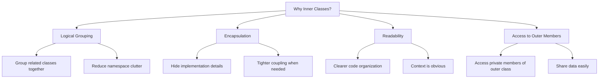
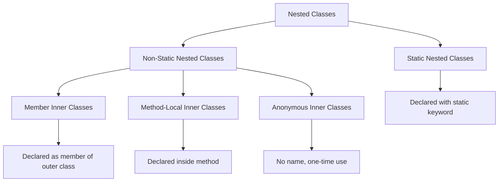
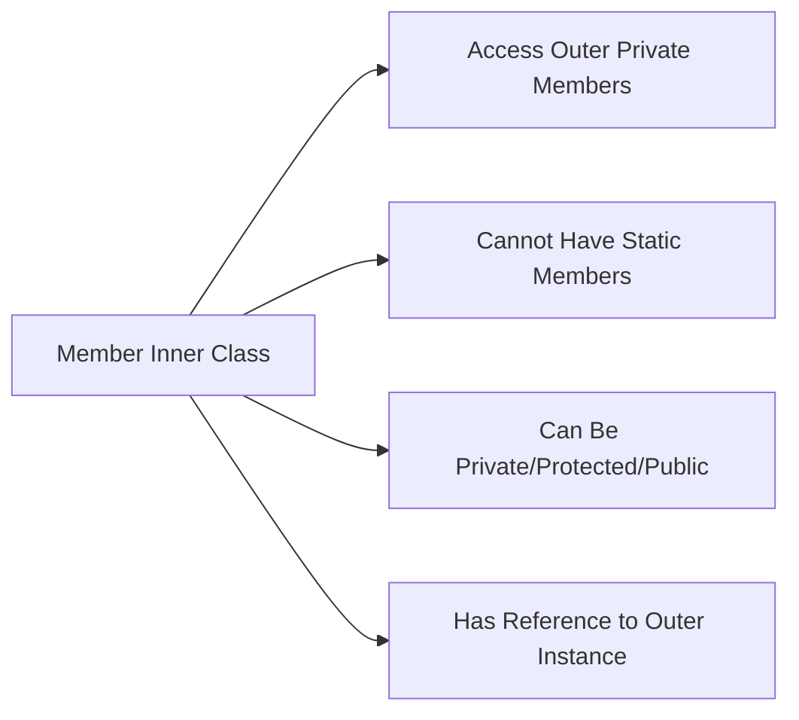
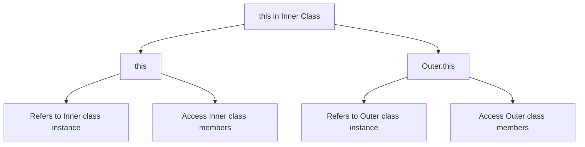
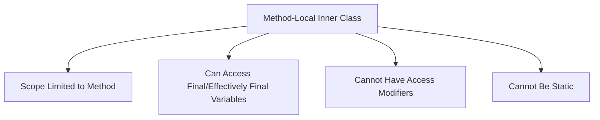
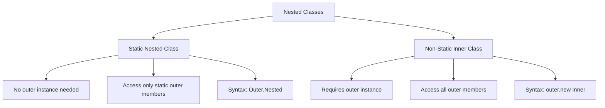
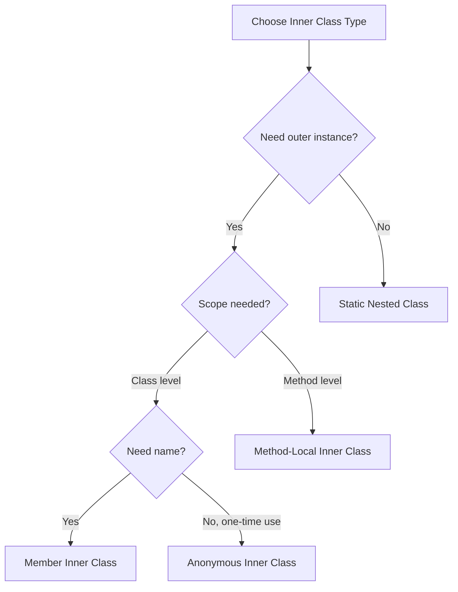

# Tutorial 18: Java Inner Classes - Complete Guide

> **Video Coverage**: Videos 178-186 (9 videos)  
> **Topics**: Inner classes, nested classes, method-local inner classes, anonymous inner classes, static nested classes

---

## Table of Contents

1. [Introduction to Inner Classes](#introduction-to-inner-classes)
2. [Types of Inner Classes](#types-of-inner-classes)
3. [Member Inner Classes](#member-inner-classes)
4. [Creating Objects for Inner Classes](#creating-objects-for-inner-classes)
5. [Referencing Outer Instance](#referencing-outer-instance)
6. [Method-Local Inner Classes](#method-local-inner-classes)
7. [Anonymous Inner Classes](#anonymous-inner-classes)
8. [Passing Anonymous Classes as Arguments](#passing-anonymous-classes-as-arguments)
9. [Static Nested Classes](#static-nested-classes)
10. [Best Practices](#best-practices)
11. [Common Use Cases](#common-use-cases)
12. [Interview Preparation](#interview-preparation)
13. [Practice Exercises](#practice-exercises)
14. [Further Reading](#further-reading)

---

## Introduction to Inner Classes

### What is an Inner Class?

An **inner class** (also called **nested class**) is a class defined within another class. Inner classes provide a way to logically group classes that are only used in one place and increase encapsulation.

### Real-World Analogy: Building Structure

Think of inner classes like rooms in a building:

```
Building (Outer Class)
├── Living Room (Inner Class 1)
│   └── Has access to building facilities
├── Kitchen (Inner Class 2)
│   └── Has access to building facilities
└── Bedroom (Inner Class 3)
    └── Has access to building facilities
```

Each room (inner class) has access to the building's (outer class) resources.

### Why Use Inner Classes?



### Benefits of Inner Classes

1. **Logical Grouping**: Classes used in only one place can be nested
2. **Increased Encapsulation**: Inner class can access outer class private members
3. **More Readable Code**: Smaller, focused classes
4. **Reduced Namespace Pollution**: Fewer top-level classes
5. **Easier Maintenance**: Related code kept together

**Video Reference**: Video 178 - Introduction to Inner class

---

## Types of Inner Classes

### Classification of Nested Classes



### Four Types of Inner Classes

```java
/**
 * Overview of all inner class types
 * Video 179: Types of inner class
 */
public class OuterClass {
    
    // 1. Member Inner Class (Non-static)
    class MemberInner {
        void display() {
            System.out.println("Member Inner Class");
        }
    }
    
    // 2. Static Nested Class
    static class StaticNested {
        void display() {
            System.out.println("Static Nested Class");
        }
    }
    
    // 3. Method-Local Inner Class
    void method() {
        class MethodLocal {
            void display() {
                System.out.println("Method-Local Inner Class");
            }
        }
        MethodLocal local = new MethodLocal();
        local.display();
    }
    
    // 4. Anonymous Inner Class
    Runnable anonymousExample = new Runnable() {
        @Override
        public void run() {
            System.out.println("Anonymous Inner Class");
        }
    };
}
```

### Comparison Table

| Type | Static? | Scope | Access to Outer | Use Case |
|------|---------|-------|-----------------|----------|
| **Member Inner** | No | Class level | All members | Tightly coupled helper classes |
| **Static Nested** | Yes | Class level | Only static members | Logically grouped utility classes |
| **Method-Local** | No | Method level | Final/effectively final local vars | One-time use within method |
| **Anonymous** | No | Expression level | Outer members | Quick implementations |

**Video Reference**: Video 179 - Types of inner class

---

## Member Inner Classes

### Definition and Characteristics

A **member inner class** is defined at the member level of outer class (same level as methods and fields).

```java
/**
 * Member inner class example
 * Video 179: Types of inner class
 */
public class Outer {
    private int outerData = 100;
    
    // Member inner class
    class Inner {
        private int innerData = 200;
        
        void display() {
            System.out.println("Outer data: " + outerData);  // Access outer
            System.out.println("Inner data: " + innerData);
        }
    }
}
```

### Key Characteristics



### Complete Example

```java
/**
 * Comprehensive member inner class example
 * Video 179: Types of inner class
 */
public class University {
    private String universityName;
    private int establishedYear;
    
    public University(String name, int year) {
        this.universityName = name;
        this.establishedYear = year;
    }
    
    // Member inner class
    class Department {
        private String deptName;
        private int numStudents;
        
        public Department(String name, int students) {
            this.deptName = name;
            this.numStudents = students;
        }
        
        void displayInfo() {
            // Access outer class private members
            System.out.println("University: " + universityName);
            System.out.println("Established: " + establishedYear);
            System.out.println("Department: " + deptName);
            System.out.println("Students: " + numStudents);
        }
    }
    
    // Method to demonstrate inner class usage
    void createDepartment() {
        Department csDept = new Department("Computer Science", 500);
        csDept.displayInfo();
    }
}

public class TestInnerClass {
    public static void main(String[] args) {
        University uni = new University("MIT", 1861);
        uni.createDepartment();
    }
}
```

**Output**:
```
University: MIT
Established: 1861
Department: Computer Science
Students: 500
```

### Access Modifiers for Inner Classes

```java
public class Outer {
    
    // Private inner class - only accessible within Outer
    private class PrivateInner {
        void method() { }
    }
    
    // Protected inner class - accessible in subclasses
    protected class ProtectedInner {
        void method() { }
    }
    
    // Public inner class - accessible everywhere
    public class PublicInner {
        void method() { }
    }
    
    // Default (package-private) inner class
    class DefaultInner {
        void method() { }
    }
}
```

**Video Reference**: Video 179 - Types of inner class

---

## Creating Objects for Inner Classes

### Syntax for Creating Inner Class Objects

```java
/**
 * Creating inner class objects
 * Video 180: How to create an object for an Inner class
 */
public class Outer {
    private int x = 10;
    
    class Inner {
        void display() {
            System.out.println("x = " + x);
        }
    }
    
    // Method 1: Create inside outer class
    void createInner() {
        Inner inner = new Inner();
        inner.display();
    }
}

public class Test {
    public static void main(String[] args) {
        // Method 2: Create from outside outer class
        // Step 1: Create outer object
        Outer outer = new Outer();
        
        // Step 2: Create inner object using outer
        Outer.Inner inner = outer.new Inner();
        inner.display();
    }
}
```

### Different Ways to Create Inner Objects

```java
public class OuterClass {
    private String message = "Hello from Outer";
    
    class InnerClass {
        void show() {
            System.out.println(message);
        }
    }
    
    // Way 1: In outer class method
    void method1() {
        InnerClass inner = new InnerClass();
        inner.show();
    }
    
    // Way 2: Return inner class instance
    InnerClass getInner() {
        return new InnerClass();
    }
}

public class Demo {
    public static void main(String[] args) {
        OuterClass outer = new OuterClass();
        
        // Way 3: Direct creation from outside
        OuterClass.InnerClass inner1 = outer.new InnerClass();
        inner1.show();
        
        // Way 4: Using returned instance
        OuterClass.InnerClass inner2 = outer.getInner();
        inner2.show();
        
        // Way 5: Anonymous - create and use immediately
        outer.new InnerClass().show();
    }
}
```

### Memory Representation

```
Heap Memory:
┌─────────────────────────────┐
│ Outer Object                │
│  - outerField: 100          │
│  - reference to methods     │
└──────────────┬──────────────┘
               │
               │ Inner object maintains
               │ reference to outer
               ↓
┌─────────────────────────────┐
│ Inner Object                │
│  - innerField: 200          │
│  - this$0 → Outer Object    │  (implicit reference)
└─────────────────────────────┘
```

**Video Reference**: Video 180 - How to create an object for an Inner class

---

## Referencing Outer Instance

### The `this` Keyword in Inner Classes

```java
/**
 * Referencing outer and inner instances
 * Video 181: Referencing the inner or outer instance from within the inner class
 */
public class Outer {
    private int x = 100;
    
    class Inner {
        private int x = 200;
        
        void display(int x) {
            System.out.println("Local x: " + x);           // 300 (parameter)
            System.out.println("Inner x: " + this.x);      // 200 (inner field)
            System.out.println("Outer x: " + Outer.this.x); // 100 (outer field)
        }
    }
    
    public static void main(String[] args) {
        Outer outer = new Outer();
        Outer.Inner inner = outer.new Inner();
        inner.display(300);
    }
}
```

**Output**:
```
Local x: 300
Inner x: 200
Outer x: 100
```

### Understanding `this` References



### Practical Example

```java
public class BankAccount {
    private double balance;
    private String accountNumber;
    
    public BankAccount(String accountNumber, double balance) {
        this.accountNumber = accountNumber;
        this.balance = balance;
    }
    
    class Transaction {
        private String type;
        private double amount;
        
        public Transaction(String type, double amount) {
            this.type = type;
            this.amount = amount;
        }
        
        void execute() {
            if (type.equals("deposit")) {
                // Access outer class private field
                BankAccount.this.balance += amount;
                System.out.println("Deposited: $" + amount);
            } else if (type.equals("withdraw")) {
                if (BankAccount.this.balance >= amount) {
                    BankAccount.this.balance -= amount;
                    System.out.println("Withdrawn: $" + amount);
                } else {
                    System.out.println("Insufficient balance");
                }
            }
            System.out.println("Account: " + BankAccount.this.accountNumber);
            System.out.println("Balance: $" + BankAccount.this.balance);
        }
    }
    
    void performTransaction(String type, double amount) {
        Transaction txn = new Transaction(type, amount);
        txn.execute();
    }
}

public class TestBank {
    public static void main(String[] args) {
        BankAccount account = new BankAccount("ACC001", 1000.00);
        account.performTransaction("deposit", 500.00);
        account.performTransaction("withdraw", 200.00);
    }
}
```

**Output**:
```
Deposited: $500.0
Account: ACC001
Balance: $1500.0
Withdrawn: $200.0
Account: ACC001
Balance: $1300.0
```

**Video Reference**: Video 181 - Referencing the inner or outer instance from within the inner class

---

## Method-Local Inner Classes

### Definition and Characteristics

A **method-local inner class** is defined inside a method and has scope only within that method.

```java
/**
 * Method-local inner class
 * Video 182: Method local inner class
 */
public class Outer {
    void outerMethod() {
        System.out.println("Outer method called");
        
        // Method-local inner class
        class MethodLocal {
            void display() {
                System.out.println("Method-local inner class");
            }
        }
        
        // Create and use within same method
        MethodLocal local = new MethodLocal();
        local.display();
        
        // Cannot access outside this method
    }
}
```

### Key Characteristics



### Accessing Local Variables

```java
/**
 * Local variable access in method-local inner class
 * Video 182: Method local inner class
 */
public class LocalVariableAccess {
    
    void demonstrateAccess() {
        // Must be final or effectively final
        final int finalVar = 100;
        int effectivelyFinal = 200;  // Not modified, so effectively final
        
        class LocalInner {
            void display() {
                System.out.println("Final variable: " + finalVar);
                System.out.println("Effectively final: " + effectivelyFinal);
                // Both accessible because they're not modified
            }
        }
        
        LocalInner inner = new LocalInner();
        inner.display();
        
        // effectivelyFinal = 300;  // Would cause compile error
    }
    
    void demonstrateError() {
        int nonFinal = 100;
        
        // This would cause compile error:
        /*
        class LocalInner {
            void display() {
                System.out.println(nonFinal);  // Error if nonFinal is modified below
            }
        }
        */
        
        nonFinal = 200;  // Modification makes it non-effectively-final
    }
}
```

### Practical Example

```java
public class Calculator {
    
    int calculate(int a, int b, String operation) {
        final int x = a;
        final int y = b;
        
        // Method-local inner class for operation
        class Operation {
            int execute() {
                switch (operation) {
                    case "add":
                        return x + y;
                    case "subtract":
                        return x - y;
                    case "multiply":
                        return x * y;
                    case "divide":
                        return y != 0 ? x / y : 0;
                    default:
                        return 0;
                }
            }
        }
        
        Operation op = new Operation();
        return op.execute();
    }
    
    public static void main(String[] args) {
        Calculator calc = new Calculator();
        System.out.println("10 + 5 = " + calc.calculate(10, 5, "add"));
        System.out.println("10 - 5 = " + calc.calculate(10, 5, "subtract"));
        System.out.println("10 * 5 = " + calc.calculate(10, 5, "multiply"));
        System.out.println("10 / 5 = " + calc.calculate(10, 5, "divide"));
    }
}
```

**Output**:
```
10 + 5 = 15
10 - 5 = 5
10 * 5 = 50
10 / 5 = 2
```

**Video Reference**: Video 182 - Method local inner class

---

## Anonymous Inner Classes

### What is an Anonymous Inner Class?

An **anonymous inner class** is an inner class without a name, declared and instantiated in a single expression. Used for one-time implementations.

### Basic Syntax

```java
/**
 * Anonymous inner class basics
 * Video 183: Anonymous inner class
 */

// Interface to implement
interface Greeting {
    void greet(String name);
}

public class AnonymousDemo {
    public static void main(String[] args) {
        // Anonymous inner class implementing interface
        Greeting greeting = new Greeting() {
            @Override
            public void greet(String name) {
                System.out.println("Hello, " + name + "!");
            }
        };
        
        greeting.greet("World");
    }
}
```

### Anonymous Class from Abstract Class

```java
/**
 * Anonymous inner class from abstract class
 * Video 183: Anonymous inner class
 */
abstract class Animal {
    abstract void makeSound();
    
    void sleep() {
        System.out.println("Sleeping...");
    }
}

public class AnonymousAnimal {
    public static void main(String[] args) {
        // Anonymous class extending abstract class
        Animal dog = new Animal() {
            @Override
            void makeSound() {
                System.out.println("Woof! Woof!");
            }
        };
        
        dog.makeSound();
        dog.sleep();
        
        // Another anonymous class
        Animal cat = new Animal() {
            @Override
            void makeSound() {
                System.out.println("Meow! Meow!");
            }
        };
        
        cat.makeSound();
        cat.sleep();
    }
}
```

**Output**:
```
Woof! Woof!
Sleeping...
Meow! Meow!
Sleeping...
```

### Anonymous Class from Concrete Class

```java
public class Vehicle {
    void start() {
        System.out.println("Vehicle starting");
    }
}

public class AnonymousConcrete {
    public static void main(String[] args) {
        // Anonymous class extending concrete class
        Vehicle customVehicle = new Vehicle() {
            @Override
            void start() {
                System.out.println("Custom vehicle starting with special procedure");
                super.start();  // Call parent method
            }
            
            // Can add new methods (but can't be called via Vehicle reference)
            void specialFeature() {
                System.out.println("Special feature activated");
            }
        };
        
        customVehicle.start();
    }
}
```

### Real-World Example: Event Handling

```java
/**
 * Practical anonymous inner class example
 * Video 184: Example on anonymous inner class
 */

interface EventListener {
    void onEvent(String event);
}

class Button {
    private String label;
    private EventListener listener;
    
    public Button(String label) {
        this.label = label;
    }
    
    void setOnClickListener(EventListener listener) {
        this.listener = listener;
    }
    
    void click() {
        System.out.println(label + " clicked!");
        if (listener != null) {
            listener.onEvent("click");
        }
    }
}

public class AnonymousEventHandling {
    public static void main(String[] args) {
        Button submitButton = new Button("Submit");
        Button cancelButton = new Button("Cancel");
        
        // Anonymous inner class for submit button
        submitButton.setOnClickListener(new EventListener() {
            @Override
            public void onEvent(String event) {
                System.out.println("Processing form submission...");
                System.out.println("Form submitted successfully!");
            }
        });
        
        // Anonymous inner class for cancel button
        cancelButton.setOnClickListener(new EventListener() {
            @Override
            public void onEvent(String event) {
                System.out.println("Cancelling operation...");
                System.out.println("Operation cancelled!");
            }
        });
        
        // Test clicks
        submitButton.click();
        System.out.println();
        cancelButton.click();
    }
}
```

**Output**:
```
Submit clicked!
Processing form submission...
Form submitted successfully!

Cancel clicked!
Cancelling operation...
Operation cancelled!
```

### Anonymous Class with Runnable

```java
public class AnonymousThread {
    public static void main(String[] args) {
        // Traditional way with anonymous inner class
        Thread thread1 = new Thread(new Runnable() {
            @Override
            public void run() {
                for (int i = 1; i <= 5; i++) {
                    System.out.println("Thread 1: " + i);
                    try {
                        Thread.sleep(500);
                    } catch (InterruptedException e) {
                        e.printStackTrace();
                    }
                }
            }
        });
        
        // Modern way with lambda (Java 8+)
        Thread thread2 = new Thread(() -> {
            for (int i = 1; i <= 5; i++) {
                System.out.println("Thread 2: " + i);
                try {
                    Thread.sleep(500);
                } catch (InterruptedException e) {
                    e.printStackTrace();
                }
            }
        });
        
        thread1.start();
        thread2.start();
    }
}
```

**Video References**:
- Video 183 - Anonymous inner class
- Video 184 - Example on anonymous inner class

---

## Passing Anonymous Classes as Arguments

### Direct Method Argument

```java
/**
 * Passing anonymous inner class as method argument
 * Video 185: Passing anonymous inner class as a method argument
 */

interface Processor {
    void process(String data);
}

class DataHandler {
    void handleData(String data, Processor processor) {
        System.out.println("Preparing to process: " + data);
        processor.process(data);
        System.out.println("Processing complete");
    }
}

public class AnonymousArgument {
    public static void main(String[] args) {
        DataHandler handler = new DataHandler();
        
        // Pass anonymous inner class directly as argument
        handler.handleData("Important Data", new Processor() {
            @Override
            public void process(String data) {
                System.out.println("Processing: " + data.toUpperCase());
            }
        });
        
        System.out.println("\n---\n");
        
        // Another processing strategy
        handler.handleData("Sensitive Info", new Processor() {
            @Override
            public void process(String data) {
                String encrypted = "***" + data.length() + " chars***";
                System.out.println("Encrypted: " + encrypted);
            }
        });
    }
}
```

**Output**:
```
Preparing to process: Important Data
Processing: IMPORTANT DATA
Processing complete

---

Preparing to process: Sensitive Info
Encrypted: ***14 chars***
Processing complete
```

### Comparator Example

```java
import java.util.*;

class Student {
    String name;
    int age;
    double gpa;
    
    public Student(String name, int age, double gpa) {
        this.name = name;
        this.age = age;
        this.gpa = gpa;
    }
    
    @Override
    public String toString() {
        return name + " (Age: " + age + ", GPA: " + gpa + ")";
    }
}

public class AnonymousComparator {
    public static void main(String[] args) {
        List<Student> students = new ArrayList<>();
        students.add(new Student("Alice", 20, 3.8));
        students.add(new Student("Bob", 19, 3.9));
        students.add(new Student("Charlie", 21, 3.7));
        
        System.out.println("Original order:");
        students.forEach(System.out::println);
        
        // Sort by GPA using anonymous Comparator
        Collections.sort(students, new Comparator<Student>() {
            @Override
            public int compare(Student s1, Student s2) {
                return Double.compare(s2.gpa, s1.gpa);  // Descending
            }
        });
        
        System.out.println("\nSorted by GPA (descending):");
        students.forEach(System.out::println);
        
        // Sort by age using anonymous Comparator
        Collections.sort(students, new Comparator<Student>() {
            @Override
            public int compare(Student s1, Student s2) {
                return Integer.compare(s1.age, s2.age);  // Ascending
            }
        });
        
        System.out.println("\nSorted by Age (ascending):");
        students.forEach(System.out::println);
    }
}
```

**Output**:
```
Original order:
Alice (Age: 20, GPA: 3.8)
Bob (Age: 19, GPA: 3.9)
Charlie (Age: 21, GPA: 3.7)

Sorted by GPA (descending):
Bob (Age: 19, GPA: 3.9)
Alice (Age: 20, GPA: 3.8)
Charlie (Age: 21, GPA: 3.7)

Sorted by Age (ascending):
Bob (Age: 19, GPA: 3.9)
Alice (Age: 20, GPA: 3.8)
Charlie (Age: 21, GPA: 3.7)
```

**Video Reference**: Video 185 - Passing anonymous inner class as a method argument

---

## Static Nested Classes

### Definition and Characteristics

A **static nested class** is a static member of the outer class. It doesn't require an instance of the outer class.

```java
/**
 * Static nested class
 * Video 186: Static nested classes
 */
public class Outer {
    private static int staticOuter = 100;
    private int instanceOuter = 200;
    
    // Static nested class
    static class StaticNested {
        void display() {
            System.out.println("Static outer: " + staticOuter);  // OK
            // System.out.println(instanceOuter);  // ERROR! Can't access non-static
        }
    }
}

public class TestStatic {
    public static void main(String[] args) {
        // Create static nested class object without outer instance
        Outer.StaticNested nested = new Outer.StaticNested();
        nested.display();
    }
}
```

### Static Nested vs Non-Static Inner



### Comparison Table

| Feature | Static Nested Class | Non-Static Inner Class |
|---------|-------------------|----------------------|
| **Outer instance required** | No ❌ | Yes ✅ |
| **Access to outer static members** | Yes ✅ | Yes ✅ |
| **Access to outer instance members** | No ❌ | Yes ✅ |
| **Can have static members** | Yes ✅ | No ❌ (except final) |
| **Creation syntax** | `new Outer.Nested()` | `outer.new Inner()` |
| **Use case** | Utility/helper class | Tightly coupled with outer |

### Practical Example: Builder Pattern

```java
/**
 * Static nested class in Builder pattern
 * Video 186: Static nested classes
 */
public class Person {
    // Required parameters
    private final String firstName;
    private final String lastName;
    
    // Optional parameters
    private final int age;
    private final String phone;
    private final String address;
    
    // Private constructor
    private Person(Builder builder) {
        this.firstName = builder.firstName;
        this.lastName = builder.lastName;
        this.age = builder.age;
        this.phone = builder.phone;
        this.address = builder.address;
    }
    
    // Static nested Builder class
    public static class Builder {
        // Required parameters
        private final String firstName;
        private final String lastName;
        
        // Optional parameters - initialized to default values
        private int age = 0;
        private String phone = "";
        private String address = "";
        
        public Builder(String firstName, String lastName) {
            this.firstName = firstName;
            this.lastName = lastName;
        }
        
        public Builder age(int age) {
            this.age = age;
            return this;
        }
        
        public Builder phone(String phone) {
            this.phone = phone;
            return this;
        }
        
        public Builder address(String address) {
            this.address = address;
            return this;
        }
        
        public Person build() {
            return new Person(this);
        }
    }
    
    @Override
    public String toString() {
        return "Person{" +
                "firstName='" + firstName + '\'' +
                ", lastName='" + lastName + '\'' +
                ", age=" + age +
                ", phone='" + phone + '\'' +
                ", address='" + address + '\'' +
                '}';
    }
}

// Usage
public class BuilderDemo {
    public static void main(String[] args) {
        // Build person with all fields
        Person person1 = new Person.Builder("John", "Doe")
                .age(30)
                .phone("123-456-7890")
                .address("123 Main St")
                .build();
        
        // Build person with only required fields
        Person person2 = new Person.Builder("Jane", "Smith")
                .age(25)
                .build();
        
        System.out.println(person1);
        System.out.println(person2);
    }
}
```

**Output**:
```
Person{firstName='John', lastName='Doe', age=30, phone='123-456-7890', address='123 Main St'}
Person{firstName='Jane', lastName='Smith', age=25, phone='', address=''}
```

### Another Example: Entry in Map

```java
import java.util.*;

public class MapEntry {
    
    // Java's Map.Entry is typically a static nested class
    public static class Entry<K, V> {
        private K key;
        private V value;
        
        public Entry(K key, V value) {
            this.key = key;
            this.value = value;
        }
        
        public K getKey() { return key; }
        public V getValue() { return value; }
        
        public void setValue(V value) { this.value = value; }
        
        @Override
        public String toString() {
            return key + "=" + value;
        }
    }
    
    public static void main(String[] args) {
        // Create entries without outer instance
        Entry<String, Integer> entry1 = new Entry<>("Age", 25);
        Entry<String, String> entry2 = new Entry<>("Name", "John");
        
        System.out.println(entry1);
        System.out.println(entry2);
    }
}
```

**Video Reference**: Video 186 - Static nested classes

---

## Best Practices

### When to Use Each Type



### 1. Use Static Nested Classes for Logical Grouping

```java
// GOOD: Static nested class for builder
public class Product {
    private String name;
    private double price;
    
    public static class Builder {
        // Builder implementation
    }
}
```

### 2. Use Member Inner Classes for Tight Coupling

```java
// GOOD: Inner class needs access to outer's private data
public class LinkedList {
    private Node head;
    
    private class Node {
        Object data;
        Node next;
        // Needs access to LinkedList's private members
    }
}
```

### 3. Use Anonymous Classes for Quick Implementations

```java
// GOOD: One-time implementation
button.addActionListener(new ActionListener() {
    public void actionPerformed(ActionEvent e) {
        // Handle click
    }
});

// BETTER: Use lambda (Java 8+) for functional interfaces
button.addActionListener(e -> {
    // Handle click
});
```

### 4. Keep Inner Classes Small

```java
// BAD: Large inner class
public class Outer {
    class Inner {
        // 100+ lines of code
        // Many methods
        // Complex logic
    }
}

// GOOD: Extract to separate class if too large
public class Outer {
    class Inner {
        // Small, focused responsibility
    }
}
```

### 5. Consider Access Levels

```java
public class Outer {
    // Private inner class - implementation detail
    private class Implementation {
        // Hidden from outside
    }
    
    // Public inner class - part of API
    public class PublicAPI {
        // Exposed to users
    }
}
```

---

## Common Use Cases

### 1. Iterator Pattern

```java
public class CustomList<T> {
    private Object[] elements = new Object[10];
    private int size = 0;
    
    public void add(T element) {
        elements[size++] = element;
    }
    
    // Member inner class for iterator
    public Iterator<T> iterator() {
        return new ListIterator();
    }
    
    private class ListIterator implements Iterator<T> {
        private int index = 0;
        
        @Override
        public boolean hasNext() {
            return index < size;
        }
        
        @Override
        @SuppressWarnings("unchecked")
        public T next() {
            return (T) elements[index++];
        }
    }
}
```

### 2. Event Listeners

```java
public class CustomButton {
    private List<ClickListener> listeners = new ArrayList<>();
    
    public interface ClickListener {
        void onClick();
    }
    
    public void addClickListener(ClickListener listener) {
        listeners.add(listener);
    }
    
    public void click() {
        for (ClickListener listener : listeners) {
            listener.onClick();
        }
    }
}

// Usage with anonymous inner class
CustomButton button = new CustomButton();
button.addClickListener(new CustomButton.ClickListener() {
    @Override
    public void onClick() {
        System.out.println("Button clicked!");
    }
});
```

### 3. Data Structures

```java
public class BinaryTree<T> {
    private Node root;
    
    // Inner class for tree node
    private class Node {
        T data;
        Node left;
        Node right;
        
        Node(T data) {
            this.data = data;
        }
    }
    
    public void insert(T data) {
        root = insertRec(root, data);
    }
    
    private Node insertRec(Node node, T data) {
        if (node == null) {
            return new Node(data);
        }
        // Insert logic...
        return node;
    }
}
```

### 4. Strategy Pattern

```java
public class Sorter {
    
    public interface SortStrategy {
        void sort(int[] array);
    }
    
    // Static nested class for bubble sort
    public static class BubbleSort implements SortStrategy {
        @Override
        public void sort(int[] array) {
            // Bubble sort implementation
        }
    }
    
    // Static nested class for quick sort
    public static class QuickSort implements SortStrategy {
        @Override
        public void sort(int[] array) {
            // Quick sort implementation
        }
    }
}
```

---

## Interview Preparation

### Question 1: What are the types of inner classes in Java?

**Answer**: There are four types:

1. **Member Inner Class** - Non-static class at member level
2. **Method-Local Inner Class** - Class inside a method
3. **Anonymous Inner Class** - Class without name, for one-time use
4. **Static Nested Class** - Static class inside another class

**Key Difference**: Only member inner class requires outer instance.

---

### Question 2: Can we create an object of inner class without outer class?

**Answer**: 
- **Non-static inner class**: NO - requires outer instance
  ```java
  Outer outer = new Outer();
  Outer.Inner inner = outer.new Inner();
  ```

- **Static nested class**: YES - no outer instance needed
  ```java
  Outer.StaticNested nested = new Outer.StaticNested();
  ```

---

### Question 3: Can inner class access private members of outer class?

**Answer**: YES, for non-static inner classes.

```java
public class Outer {
    private int x = 10;
    
    class Inner {
        void display() {
            System.out.println(x);  // Access private member
        }
    }
}
```

**Static nested classes**: Can only access static members of outer class.

---

### Question 4: Why do method-local inner classes require final or effectively final variables?

**Answer**: For **variable capture consistency**.

```java
void method() {
    int x = 10;  // Must be effectively final
    
    class Local {
        void print() {
            System.out.println(x);  // Captures x
        }
    }
    
    // x = 20;  // Would break effectively final
}
```

**Reason**: Local variable lives on stack (dies after method). Inner class object lives on heap (may outlive method). Java captures variable value, which must remain constant.

---

### Question 5: Difference between static and non-static nested classes?

**Answer**:

| Aspect | Static Nested | Non-Static Inner |
|--------|--------------|------------------|
| **Outer instance** | Not required | Required |
| **Access to outer members** | Only static | All members |
| **Can have static members** | Yes | No (except final) |
| **Creation** | `new Outer.Nested()` | `outer.new Inner()` |
| **Memory** | Independent | Holds outer reference |

---

### Question 6: Can we declare an inner class private?

**Answer**: YES, for member inner classes.

```java
public class Outer {
    private class PrivateInner {
        // Only accessible within Outer
    }
    
    protected class ProtectedInner {
        // Accessible in subclasses
    }
    
    public class PublicInner {
        // Accessible everywhere
    }
}
```

**Note**: Method-local and anonymous classes cannot have access modifiers.

---

### Question 7: What is the purpose of `Outer.this` syntax?

**Answer**: To access outer class instance from inner class when variable names conflict.

```java
public class Outer {
    int x = 10;
    
    class Inner {
        int x = 20;
        
        void show() {
            System.out.println(x);              // 20 (inner)
            System.out.println(this.x);         // 20 (inner)
            System.out.println(Outer.this.x);   // 10 (outer)
        }
    }
}
```

---

### Question 8: Can we have static methods in inner class?

**Answer**: 
- **Non-static inner class**: NO (except static final fields)
- **Static nested class**: YES

```java
public class Outer {
    class Inner {
        // static void method() { }  // ERROR!
        static final int CONSTANT = 10;  // OK
    }
    
    static class Nested {
        static void method() { }  // OK
    }
}
```

---

### Question 9: When would you use anonymous inner class vs lambda?

**Answer**:

**Anonymous Inner Class**:
- Multiple methods to implement
- Need to maintain state
- Pre-Java 8 code

```java
Runnable r = new Runnable() {
    int count = 0;  // State
    
    public void run() { count++; }
    public int getCount() { return count; }  // Extra method
};
```

**Lambda** (Java 8+):
- Single abstract method (functional interface)
- Simpler, cleaner syntax
- No state needed

```java
Runnable r = () -> System.out.println("Running");
```

---

### Question 10: What is the output?

```java
public class Outer {
    int x = 10;
    
    class Inner {
        int x = 20;
        
        void print() {
            int x = 30;
            System.out.println(x);
            System.out.println(this.x);
            System.out.println(Outer.this.x);
        }
    }
    
    public static void main(String[] args) {
        new Outer().new Inner().print();
    }
}
```

**Answer**:
```
30   // Local variable
20   // Inner class field
10   // Outer class field
```

---

## Practice Exercises

### Exercise 1: LinkedList with Inner Node Class

**Problem**: Implement a simple linked list using an inner class for nodes.

**Requirements**:
- Inner `Node` class
- Methods: `add()`, `display()`, `size()`
- Proper encapsulation

<details>
<summary>Click to see solution</summary>

```java
public class SimpleLinkedList<T> {
    private Node head;
    private int size;
    
    // Member inner class for Node
    private class Node {
        T data;
        Node next;
        
        Node(T data) {
            this.data = data;
            this.next = null;
        }
    }
    
    public SimpleLinkedList() {
        this.head = null;
        this.size = 0;
    }
    
    public void add(T data) {
        Node newNode = new Node(data);
        
        if (head == null) {
            head = newNode;
        } else {
            Node current = head;
            while (current.next != null) {
                current = current.next;
            }
            current.next = newNode;
        }
        size++;
    }
    
    public void display() {
        Node current = head;
        System.out.print("[");
        while (current != null) {
            System.out.print(current.data);
            if (current.next != null) {
                System.out.print(" -> ");
            }
            current = current.next;
        }
        System.out.println("]");
    }
    
    public int size() {
        return size;
    }
    
    // Iterator using inner class
    public Iterator iterator() {
        return new LinkedListIterator();
    }
    
    private class LinkedListIterator implements Iterator {
        private Node current = head;
        
        @Override
        public boolean hasNext() {
            return current != null;
        }
        
        @Override
        public T next() {
            T data = current.data;
            current = current.next;
            return data;
        }
    }
    
    public static void main(String[] args) {
        SimpleLinkedList<String> list = new SimpleLinkedList<>();
        list.add("Apple");
        list.add("Banana");
        list.add("Cherry");
        
        list.display();
        System.out.println("Size: " + list.size());
        
        System.out.print("Using iterator: ");
        Iterator iter = list.iterator();
        while (iter.hasNext()) {
            System.out.print(iter.next() + " ");
        }
    }
}
```
</details>

---

### Exercise 2: Custom ArrayList with Anonymous Comparator

**Problem**: Create a custom ArrayList that can be sorted using anonymous inner classes.

<details>
<summary>Click to see solution</summary>

```java
import java.util.*;

interface Comparator<T> {
    int compare(T o1, T o2);
}

public class CustomArrayList<T> {
    private Object[] elements;
    private int size;
    
    public CustomArrayList() {
        elements = new Object[10];
        size = 0;
    }
    
    public void add(T element) {
        if (size == elements.length) {
            resize();
        }
        elements[size++] = element;
    }
    
    @SuppressWarnings("unchecked")
    public T get(int index) {
        if (index < 0 || index >= size) {
            throw new IndexOutOfBoundsException();
        }
        return (T) elements[index];
    }
    
    public int size() {
        return size;
    }
    
    private void resize() {
        elements = Arrays.copyOf(elements, elements.length * 2);
    }
    
    @SuppressWarnings("unchecked")
    public void sort(Comparator<T> comparator) {
        for (int i = 0; i < size - 1; i++) {
            for (int j = 0; j < size - i - 1; j++) {
                if (comparator.compare((T) elements[j], (T) elements[j + 1]) > 0) {
                    Object temp = elements[j];
                    elements[j] = elements[j + 1];
                    elements[j + 1] = temp;
                }
            }
        }
    }
    
    public void display() {
        System.out.print("[");
        for (int i = 0; i < size; i++) {
            System.out.print(elements[i]);
            if (i < size - 1) System.out.print(", ");
        }
        System.out.println("]");
    }
    
    public static void main(String[] args) {
        CustomArrayList<Integer> numbers = new CustomArrayList<>();
        numbers.add(5);
        numbers.add(2);
        numbers.add(8);
        numbers.add(1);
        numbers.add(9);
        
        System.out.println("Original:");
        numbers.display();
        
        // Sort ascending using anonymous inner class
        numbers.sort(new Comparator<Integer>() {
            @Override
            public int compare(Integer o1, Integer o2) {
                return o1 - o2;
            }
        });
        
        System.out.println("Sorted (ascending):");
        numbers.display();
        
        // Sort descending using anonymous inner class
        numbers.sort(new Comparator<Integer>() {
            @Override
            public int compare(Integer o1, Integer o2) {
                return o2 - o1;
            }
        });
        
        System.out.println("Sorted (descending):");
        numbers.display();
    }
}
```
</details>

---

### Exercise 3: GUI Event System with Anonymous Classes

**Problem**: Create a simple GUI event system using anonymous inner classes.

<details>
<summary>Click to see solution</summary>

```java
import java.util.*;

interface ClickListener {
    void onClick(String buttonName);
}

interface HoverListener {
    void onHover(String buttonName);
}

class Button {
    private String name;
    private List<ClickListener> clickListeners = new ArrayList<>();
    private List<HoverListener> hoverListeners = new ArrayList<>();
    
    public Button(String name) {
        this.name = name;
    }
    
    public void addClickListener(ClickListener listener) {
        clickListeners.add(listener);
    }
    
    public void addHoverListener(HoverListener listener) {
        hoverListeners.add(listener);
    }
    
    public void click() {
        System.out.println("\n[EVENT] " + name + " clicked");
        for (ClickListener listener : clickListeners) {
            listener.onClick(name);
        }
    }
    
    public void hover() {
        System.out.println("\n[EVENT] Mouse hovering over " + name);
        for (HoverListener listener : hoverListeners) {
            listener.onHover(name);
        }
    }
}

public class GUIEventSystem {
    public static void main(String[] args) {
        Button submitButton = new Button("Submit Button");
        Button cancelButton = new Button("Cancel Button");
        
        // Add click listeners using anonymous inner classes
        submitButton.addClickListener(new ClickListener() {
            @Override
            public void onClick(String buttonName) {
                System.out.println("  → Validating form data...");
                System.out.println("  → Submitting form...");
                System.out.println("  → Success!");
            }
        });
        
        cancelButton.addClickListener(new ClickListener() {
            @Override
            public void onClick(String buttonName) {
                System.out.println("  → Cancelling operation...");
                System.out.println("  → Clearing form...");
                System.out.println("  → Done!");
            }
        });
        
        // Add hover listeners using anonymous inner classes
        submitButton.addHoverListener(new HoverListener() {
            @Override
            public void onHover(String buttonName) {
                System.out.println("  → Showing tooltip: 'Click to submit'");
            }
        });
        
        cancelButton.addHoverListener(new HoverListener() {
            @Override
            public void onHover(String buttonName) {
                System.out.println("  → Showing tooltip: 'Click to cancel'");
            }
        });
        
        // Simulate events
        submitButton.hover();
        submitButton.click();
        
        cancelButton.hover();
        cancelButton.click();
    }
}
```
</details>

---

## Further Reading

### Official Java Documentation

1. **[Nested Classes (Oracle)](https://docs.oracle.com/javase/tutorial/java/javaOO/nested.html)**
   - Comprehensive official guide
   - All types explained with examples

2. **[Inner Classes Specification](https://docs.oracle.com/javase/specs/jls/se11/html/jls-8.html#jls-8.1.3)**
   - Technical specification
   - Language rules and semantics

3. **[Lambda Expressions vs Anonymous Classes](https://docs.oracle.com/javase/tutorial/java/javaOO/lambdaexpressions.html)**
   - Modern alternatives
   - When to use each

### Recommended Books

1. **"Effective Java" by Joshua Bloch**
   - Item 24: Favor static member classes over nonstatic
   - Best practices and guidelines

2. **"Head First Design Patterns"**
   - Iterator pattern using inner classes
   - Strategy pattern examples

3. **"Java Concurrency in Practice"**
   - Thread-safe inner classes
   - Synchronization considerations

### Online Resources

1. **[Baeldung - Java Nested Classes](https://www.baeldung.com/java-nested-classes)**
   - Practical tutorials
   - Modern examples

2. **[Java Point - Inner Classes](https://www.javatpoint.com/java-inner-class)**
   - Comprehensive coverage
   - Multiple examples

### Related Topics

1. **Lambda Expressions** - Modern alternative to anonymous classes
2. **Functional Interfaces** - Single abstract method interfaces
3. **Design Patterns** - Iterator, Strategy, Builder patterns
4. **Memory Management** - How inner classes affect memory

---

## Summary

Inner classes are a powerful Java feature that enables better encapsulation and code organization. This tutorial covered:

✅ **Four Types**: Member, Method-local, Anonymous, Static nested  
✅ **Access Rules**: How inner classes access outer members  
✅ **Object Creation**: Different ways to instantiate inner classes  
✅ **Use Cases**: Iterator pattern, event listeners, builders  
✅ **Best Practices**: When to use each type  
✅ **Interview Prep**: Common questions and answers

### Key Takeaways

1. **Member inner classes** need outer instance, access all outer members
2. **Static nested classes** are independent, cleaner for utility classes
3. **Anonymous classes** perfect for one-time implementations
4. **Method-local classes** limited scope, access final/effectively final variables
5. **Use `Outer.this`** to reference outer instance when names conflict
6. **Prefer lambdas** over anonymous classes for functional interfaces (Java 8+)

---

## Video Index

This tutorial covers the following videos from the RBR Java playlist:

- **Video 178**: Introduction to Inner class
- **Video 179**: Types of inner class
- **Video 180**: How to create an object for an Inner class
- **Video 181**: Referencing the inner or outer instance from within the inner class
- **Video 182**: Method local inner class
- **Video 183**: Anonymous inner class
- **Video 184**: Example on anonymous inner class
- **Video 185**: Passing anonymous inner class as a method argument
- **Video 186**: Static nested classes

---

## Next Steps

After mastering inner classes, continue with:

📚 **[Tutorial 19: Generics](19_Generics.md)** - Generic classes, interfaces, bounded types, and type parameters

---

**Navigation**:  
[← Previous: Tutorial 17 - Exception Handling](17_Exception_Handling.md) | [Next: Tutorial 19 - Generics →](19_Generics.md)

[🏠 Back to Tutorial Index](README.md)

---

*Last Updated: November 2025*  
*Part of the RBR Java Complete Tutorial Suite*
