# Tutorial 19: Generics in Java

> **Master type-safe programming with Java Generics - from basic concepts to advanced bounded types**

---

## 📋 Table of Contents

1. [Prerequisites](#prerequisites)
2. [Introduction to Generics](#introduction-to-generics)
3. [Why Generics? The Problem They Solve](#why-generics-the-problem-they-solve)
4. [Generic Classes](#generic-classes)
5. [Generic Interfaces](#generic-interfaces)
6. [Generic Methods and Constructors](#generic-methods-and-constructors)
7. [Bounded Type Parameters](#bounded-type-parameters)
8. [Multiple Bounds](#multiple-bounds)
9. [Wildcards in Generics](#wildcards-in-generics)
10. [Type Erasure](#type-erasure)
11. [Generic Restrictions and Limitations](#generic-restrictions-and-limitations)
12. [Best Practices](#best-practices)
13. [Common Pitfalls](#common-pitfalls)
14. [Real-World Use Cases](#real-world-use-cases)
15. [Interview Preparation](#interview-preparation)
16. [Practice Exercises](#practice-exercises)
17. [Summary](#summary)
18. [Further Reading](#further-reading)
19. [Navigation](#navigation)
20. [Video Index](#video-index)

---

## Prerequisites

Before diving into Generics, you should be comfortable with:

- ✅ **Classes and Objects** ([Tutorial 07](07_Classes_and_Objects.md))
- ✅ **Inheritance and Polymorphism** ([Tutorial 10](10_Object_Oriented_Concepts.md))
- ✅ **Interfaces** ([Tutorial 10](10_Object_Oriented_Concepts.md))
- ✅ **Collections basics** (will be covered in detail in [Tutorial 20](20_Collections.md))
- ✅ **Arrays** ([Tutorial 11](11_Arrays.md))

---

## Introduction to Generics

**Generics** enable types (classes and interfaces) to be **parameters** when defining classes, interfaces, and methods. This powerful feature provides **stronger type checks at compile time**, eliminates the need for casting, and enables programmers to implement generic algorithms.

### 🎯 The Core Concept

Think of generics as **creating a blueprint that works with any type**:

```
Regular Class:     Box specifically for Strings
Generic Class:     Box<T> that works for ANY type T
```

**Real-World Analogy:**

Imagine a **shipping container**:
- **Without Generics**: You need different containers for cars, furniture, electronics (specific types)
- **With Generics**: One universal container that can hold ANY cargo type, but you specify what's inside

### 📊 Generics Classification


---

## Why Generics? The Problem They Solve

### ❌ Problems Before Generics (Pre-Java 5)

```java
// Before Generics - Using Object type
class BoxWithoutGenerics {
    private Object content;
    
    public void set(Object content) {
        this.content = content;
    }
    
    public Object get() {
        return content;
    }
}

// Usage
BoxWithoutGenerics box = new BoxWithoutGenerics();
box.set("Hello");  // Store String

// Problem 1: Type casting required
String str = (String) box.get();  // Must cast

// Problem 2: No type safety at compile time
box.set(123);  // Can store Integer
String str2 = (String) box.get();  // Runtime ClassCastException! 💥
```

**Issues:**
1. ⚠️ **No compile-time type checking** - errors caught only at runtime
2. ⚠️ **Explicit casting required** - verbose and error-prone
3. ⚠️ **Type safety compromised** - can accidentally mix types

### ✅ Solution With Generics

```java
// With Generics
class Box<T> {
    private T content;
    
    public void set(T content) {
        this.content = content;
    }
    
    public T get() {
        return content;
    }
}

// Usage
Box<String> stringBox = new Box<>();
stringBox.set("Hello");  // Type-safe

// Benefit 1: No casting needed
String str = stringBox.get();  // Direct assignment

// Benefit 2: Compile-time type safety
// stringBox.set(123);  // ❌ Compile error! Type mismatch detected early
```

**Benefits:**
1. ✅ **Compile-time type checking** - errors caught before runtime
2. ✅ **No explicit casting** - cleaner, more readable code
3. ✅ **Type safety guaranteed** - cannot mix incompatible types

### 📊 Comparison Table

| Aspect | Without Generics | With Generics |
|--------|------------------|---------------|
| **Type Safety** | Runtime only | Compile-time |
| **Casting** | Required (verbose) | Not required |
| **Error Detection** | Late (runtime) | Early (compile-time) |
| **Code Clarity** | Lower | Higher |
| **Performance** | Same (after erasure) | Same (after erasure) |
| **Reusability** | Limited | Excellent |

---

## Generic Classes

A **generic class** is a class that can work with any data type. The type is specified when creating an instance.

### 🎨 Basic Syntax

```java
class ClassName<T> {
    // T is a type parameter
    private T data;
    
    public void setData(T data) {
        this.data = data;
    }
    
    public T getData() {
        return data;
    }
}
```

**Convention for Type Parameter Names:**
- `T` - Type
- `E` - Element (used in collections)
- `K` - Key (used in maps)
- `V` - Value (used in maps)
- `N` - Number
- `S`, `U`, `V` - 2nd, 3rd, 4th types

### 📝 Example 1: Generic Box Class

```java
/**
 * Generic Box that can hold any type of object
 * @param <T> the type of object to store
 */
class Box<T> {
    private T content;
    
    // Generic constructor
    public Box(T content) {
        this.content = content;
    }
    
    // Setter
    public void setContent(T content) {
        this.content = content;
    }
    
    // Getter
    public T getContent() {
        return content;
    }
    
    // Generic method
    public boolean isEmpty() {
        return content == null;
    }
    
    @Override
    public String toString() {
        return "Box[" + content + "]";
    }
}

// Usage Examples
public class GenericBoxDemo {
    public static void main(String[] args) {
        // Box for String
        Box<String> stringBox = new Box<>("Hello Generics");
        System.out.println("String Box: " + stringBox.getContent());
        
        // Box for Integer
        Box<Integer> intBox = new Box<>(42);
        System.out.println("Integer Box: " + intBox.getContent());
        
        // Box for custom objects
        Box<Person> personBox = new Box<>(new Person("Alice", 30));
        System.out.println("Person Box: " + personBox.getContent());
        
        // Type safety enforced
        // stringBox.setContent(123);  // ❌ Compile error!
    }
}

class Person {
    private String name;
    private int age;
    
    public Person(String name, int age) {
        this.name = name;
        this.age = age;
    }
    
    @Override
    public String toString() {
        return name + " (" + age + ")";
    }
}
```

**Output:**
```
String Box: Hello Generics
Integer Box: 42
Person Box: Alice (30)
```

### 📝 Example 2: Generic Pair Class (Multiple Type Parameters)

```java
/**
 * Generic Pair that holds two values of potentially different types
 * @param <K> type of the key (first value)
 * @param <V> type of the value (second value)
 */
class Pair<K, V> {
    private K key;
    private V value;
    
    public Pair(K key, V value) {
        this.key = key;
        this.value = value;
    }
    
    public K getKey() {
        return key;
    }
    
    public V getValue() {
        return value;
    }
    
    public void setKey(K key) {
        this.key = key;
    }
    
    public void setValue(V value) {
        this.value = value;
    }
    
    @Override
    public String toString() {
        return "(" + key + ", " + value + ")";
    }
}

// Usage
public class PairDemo {
    public static void main(String[] args) {
        // String-Integer pair
        Pair<String, Integer> studentGrade = new Pair<>("Alice", 95);
        System.out.println("Student: " + studentGrade.getKey() + 
                          ", Grade: " + studentGrade.getValue());
        
        // Integer-String pair
        Pair<Integer, String> idName = new Pair<>(101, "Bob");
        System.out.println("ID: " + idName.getKey() + 
                          ", Name: " + idName.getValue());
        
        // String-String pair
        Pair<String, String> countryCapital = new Pair<>("India", "New Delhi");
        System.out.println(countryCapital);
        
        // Pair of complex objects
        Pair<Person, Address> personAddress = 
            new Pair<>(new Person("Charlie", 25), new Address("123 Main St"));
        System.out.println("Person-Address: " + personAddress);
    }
}

class Address {
    private String street;
    
    public Address(String street) {
        this.street = street;
    }
    
    @Override
    public String toString() {
        return street;
    }
}
```

**Output:**
```
Student: Alice, Grade: 95
ID: 101, Name: Bob
(India, New Delhi)
Person-Address: (Charlie (25), 123 Main St)
```

### 📝 Example 3: Generic Stack Implementation

```java
/**
 * Generic Stack data structure using array
 * @param <T> type of elements in the stack
 */
class GenericStack<T> {
    private T[] elements;
    private int top;
    private static final int DEFAULT_CAPACITY = 10;
    
    @SuppressWarnings("unchecked")
    public GenericStack() {
        // Cannot create generic array directly: new T[size]
        // Must use Object array and cast
        elements = (T[]) new Object[DEFAULT_CAPACITY];
        top = -1;
    }
    
    @SuppressWarnings("unchecked")
    public GenericStack(int capacity) {
        elements = (T[]) new Object[capacity];
        top = -1;
    }
    
    public void push(T element) {
        if (isFull()) {
            resize();
        }
        elements[++top] = element;
    }
    
    public T pop() {
        if (isEmpty()) {
            throw new IllegalStateException("Stack is empty");
        }
        T element = elements[top];
        elements[top--] = null;  // Avoid memory leak
        return element;
    }
    
    public T peek() {
        if (isEmpty()) {
            throw new IllegalStateException("Stack is empty");
        }
        return elements[top];
    }
    
    public boolean isEmpty() {
        return top == -1;
    }
    
    public boolean isFull() {
        return top == elements.length - 1;
    }
    
    public int size() {
        return top + 1;
    }
    
    @SuppressWarnings("unchecked")
    private void resize() {
        int newCapacity = elements.length * 2;
        T[] newElements = (T[]) new Object[newCapacity];
        System.arraycopy(elements, 0, newElements, 0, elements.length);
        elements = newElements;
    }
    
    @Override
    public String toString() {
        StringBuilder sb = new StringBuilder("[");
        for (int i = 0; i <= top; i++) {
            sb.append(elements[i]);
            if (i < top) sb.append(", ");
        }
        sb.append("]");
        return sb.toString();
    }
}

// Usage
public class GenericStackDemo {
    public static void main(String[] args) {
        // Stack of Integers
        GenericStack<Integer> intStack = new GenericStack<>();
        intStack.push(10);
        intStack.push(20);
        intStack.push(30);
        System.out.println("Integer Stack: " + intStack);
        System.out.println("Popped: " + intStack.pop());
        System.out.println("After pop: " + intStack);
        
        // Stack of Strings
        GenericStack<String> stringStack = new GenericStack<>();
        stringStack.push("Java");
        stringStack.push("Python");
        stringStack.push("C++");
        System.out.println("\nString Stack: " + stringStack);
        System.out.println("Peek: " + stringStack.peek());
        System.out.println("Size: " + stringStack.size());
        
        // Stack of custom objects
        GenericStack<Person> personStack = new GenericStack<>();
        personStack.push(new Person("Alice", 30));
        personStack.push(new Person("Bob", 25));
        System.out.println("\nPerson Stack: " + personStack);
    }
}
```

**Output:**
```
Integer Stack: [10, 20, 30]
Popped: 30
After pop: [10, 20]

String Stack: [Java, Python, C++]
Peek: C++
Size: 3

Person Stack: [Alice (30), Bob (25)]
```

---

## Generic Interfaces

**Generic interfaces** work similarly to generic classes. Any class implementing a generic interface must specify the type parameter.

### 🎨 Basic Syntax

```java
interface InterfaceName<T> {
    void method(T param);
    T method();
}

// Implementation - specify type
class Implementation implements InterfaceName<String> {
    @Override
    public void method(String param) {
        // Implementation
    }
    
    @Override
    public String method() {
        // Implementation
        return null;
    }
}

// OR Implementation - keep generic
class GenericImplementation<T> implements InterfaceName<T> {
    @Override
    public void method(T param) {
        // Implementation
    }
    
    @Override
    public T method() {
        // Implementation
        return null;
    }
}
```

### 📝 Example 1: Generic Repository Interface

```java
/**
 * Generic repository interface for CRUD operations
 * @param <T> type of entity
 * @param <ID> type of entity identifier
 */
interface Repository<T, ID> {
    void save(T entity);
    T findById(ID id);
    List<T> findAll();
    void update(T entity);
    void delete(ID id);
    boolean exists(ID id);
}

/**
 * Implementation for Person repository
 */
class PersonRepository implements Repository<Person, Integer> {
    private Map<Integer, Person> database = new HashMap<>();
    private int nextId = 1;
    
    @Override
    public void save(Person entity) {
        database.put(nextId++, entity);
    }
    
    @Override
    public Person findById(Integer id) {
        return database.get(id);
    }
    
    @Override
    public List<Person> findAll() {
        return new ArrayList<>(database.values());
    }
    
    @Override
    public void update(Person entity) {
        // In real implementation, would update based on ID
        System.out.println("Updating: " + entity);
    }
    
    @Override
    public void delete(Integer id) {
        database.remove(id);
    }
    
    @Override
    public boolean exists(Integer id) {
        return database.containsKey(id);
    }
}

// Usage
public class RepositoryDemo {
    public static void main(String[] args) {
        PersonRepository repo = new PersonRepository();
        
        // Save persons
        repo.save(new Person("Alice", 30));
        repo.save(new Person("Bob", 25));
        repo.save(new Person("Charlie", 35));
        
        // Find by ID
        Person person = repo.findById(2);
        System.out.println("Found: " + person);
        
        // Find all
        System.out.println("\nAll persons:");
        for (Person p : repo.findAll()) {
            System.out.println("  " + p);
        }
        
        // Check existence
        System.out.println("\nExists ID 2: " + repo.exists(2));
        
        // Delete
        repo.delete(2);
        System.out.println("After delete, exists ID 2: " + repo.exists(2));
    }
}
```

**Output:**
```
Found: Bob (25)

All persons:
  Alice (30)
  Bob (25)
  Charlie (35)

Exists ID 2: true
After delete, exists ID 2: false
```

### 📝 Example 2: Generic Comparable Interface

```java
/**
 * Generic Comparator interface
 * @param <T> type of objects to compare
 */
interface GenericComparator<T> {
    int compare(T obj1, T obj2);
}

/**
 * Comparator for integers
 */
class IntegerComparator implements GenericComparator<Integer> {
    @Override
    public int compare(Integer obj1, Integer obj2) {
        return obj1 - obj2;
    }
}

/**
 * Comparator for strings by length
 */
class StringLengthComparator implements GenericComparator<String> {
    @Override
    public int compare(String obj1, String obj2) {
        return obj1.length() - obj2.length();
    }
}

/**
 * Comparator for persons by age
 */
class PersonAgeComparator implements GenericComparator<Person> {
    @Override
    public int compare(Person obj1, Person obj2) {
        return obj1.getAge() - obj2.getAge();
    }
}

/**
 * Generic sorting utility
 */
class Sorter {
    public static <T> void sort(T[] array, GenericComparator<T> comparator) {
        // Bubble sort implementation
        for (int i = 0; i < array.length - 1; i++) {
            for (int j = 0; j < array.length - i - 1; j++) {
                if (comparator.compare(array[j], array[j + 1]) > 0) {
                    // Swap
                    T temp = array[j];
                    array[j] = array[j + 1];
                    array[j + 1] = temp;
                }
            }
        }
    }
}

// Usage
public class ComparatorDemo {
    public static void main(String[] args) {
        // Sort integers
        Integer[] numbers = {5, 2, 8, 1, 9};
        Sorter.sort(numbers, new IntegerComparator());
        System.out.println("Sorted numbers: " + Arrays.toString(numbers));
        
        // Sort strings by length
        String[] words = {"Java", "C", "Python", "Go", "JavaScript"};
        Sorter.sort(words, new StringLengthComparator());
        System.out.println("Sorted by length: " + Arrays.toString(words));
        
        // Sort persons by age
        Person[] persons = {
            new Person("Alice", 30),
            new Person("Bob", 25),
            new Person("Charlie", 35)
        };
        Sorter.sort(persons, new PersonAgeComparator());
        System.out.println("Sorted by age: " + Arrays.toString(persons));
    }
}

// Update Person class with getAge method
class Person {
    private String name;
    private int age;
    
    public Person(String name, int age) {
        this.name = name;
        this.age = age;
    }
    
    public int getAge() {
        return age;
    }
    
    @Override
    public String toString() {
        return name + " (" + age + ")";
    }
}
```

**Output:**
```
Sorted numbers: [1, 2, 5, 8, 9]
Sorted by length: [C, Go, Java, Python, JavaScript]
Sorted by age: [Bob (25), Alice (30), Charlie (35)]
```

### 📝 Example 3: Generic Predicate Interface

```java
/**
 * Generic Predicate interface for filtering
 * @param <T> type to test
 */
interface Predicate<T> {
    boolean test(T value);
}

/**
 * Predicate for even numbers
 */
class EvenPredicate implements Predicate<Integer> {
    @Override
    public boolean test(Integer value) {
        return value % 2 == 0;
    }
}

/**
 * Predicate for strings starting with specific prefix
 */
class StartsWithPredicate implements Predicate<String> {
    private String prefix;
    
    public StartsWithPredicate(String prefix) {
        this.prefix = prefix;
    }
    
    @Override
    public boolean test(String value) {
        return value.startsWith(prefix);
    }
}

/**
 * Generic filter utility
 */
class Filter {
    public static <T> List<T> filter(List<T> list, Predicate<T> predicate) {
        List<T> result = new ArrayList<>();
        for (T item : list) {
            if (predicate.test(item)) {
                result.add(item);
            }
        }
        return result;
    }
}

// Usage
public class PredicateDemo {
    public static void main(String[] args) {
        // Filter even numbers
        List<Integer> numbers = Arrays.asList(1, 2, 3, 4, 5, 6, 7, 8);
        List<Integer> evens = Filter.filter(numbers, new EvenPredicate());
        System.out.println("Even numbers: " + evens);
        
        // Filter strings starting with "J"
        List<String> languages = Arrays.asList("Java", "Python", "JavaScript", "C++", "Julia");
        List<String> jLanguages = Filter.filter(languages, new StartsWithPredicate("J"));
        System.out.println("Languages starting with J: " + jLanguages);
    }
}
```

**Output:**
```
Even numbers: [2, 4, 6, 8]
Languages starting with J: [Java, JavaScript, Julia]
```

---

## Generic Methods and Constructors

**Generic methods** are methods that introduce their own type parameters. These can be static or instance methods.

### 🎨 Generic Method Syntax

```java
class MyClass {
    // Generic instance method
    public <T> void instanceMethod(T param) {
        // Method body
    }
    
    // Generic static method
    public static <T> T staticMethod(T param) {
        return param;
    }
    
    // Generic method with multiple type parameters
    public static <K, V> void printPair(K key, V value) {
        System.out.println(key + " -> " + value);
    }
}
```

### 📝 Example 1: Generic Array Printer

```java
/**
 * Utility class with generic methods
 */
class ArrayUtils {
    /**
     * Generic method to print array of any type
     * @param <T> type of array elements
     * @param array array to print
     */
    public static <T> void printArray(T[] array) {
        System.out.print("[");
        for (int i = 0; i < array.length; i++) {
            System.out.print(array[i]);
            if (i < array.length - 1) {
                System.out.print(", ");
            }
        }
        System.out.println("]");
    }
    
    /**
     * Generic method to find element in array
     * @param <T> type of array elements
     * @param array array to search
     * @param element element to find
     * @return index of element or -1 if not found
     */
    public static <T> int indexOf(T[] array, T element) {
        for (int i = 0; i < array.length; i++) {
            if (array[i].equals(element)) {
                return i;
            }
        }
        return -1;
    }
    
    /**
     * Generic method to reverse array
     * @param <T> type of array elements
     * @param array array to reverse
     */
    public static <T> void reverse(T[] array) {
        int left = 0;
        int right = array.length - 1;
        while (left < right) {
            T temp = array[left];
            array[left] = array[right];
            array[right] = temp;
            left++;
            right--;
        }
    }
    
    /**
     * Generic method to swap elements
     * @param <T> type of array elements
     * @param array array containing elements
     * @param i first index
     * @param j second index
     */
    public static <T> void swap(T[] array, int i, int j) {
        T temp = array[i];
        array[i] = array[j];
        array[j] = temp;
    }
}

// Usage
public class GenericMethodDemo {
    public static void main(String[] args) {
        // Print Integer array
        Integer[] intArray = {1, 2, 3, 4, 5};
        System.out.print("Integer array: ");
        ArrayUtils.printArray(intArray);
        
        // Print String array
        String[] stringArray = {"Java", "Python", "C++"};
        System.out.print("String array: ");
        ArrayUtils.printArray(stringArray);
        
        // Find element
        int index = ArrayUtils.indexOf(stringArray, "Python");
        System.out.println("Index of 'Python': " + index);
        
        // Reverse array
        ArrayUtils.reverse(intArray);
        System.out.print("Reversed integer array: ");
        ArrayUtils.printArray(intArray);
        
        // Swap elements
        ArrayUtils.swap(stringArray, 0, 2);
        System.out.print("After swap: ");
        ArrayUtils.printArray(stringArray);
    }
}
```

**Output:**
```
Integer array: [1, 2, 3, 4, 5]
String array: [Java, Python, C++]
Index of 'Python': 1
Reversed integer array: [5, 4, 3, 2, 1]
After swap: [C++, Python, Java]
```

### 📝 Example 2: Generic Constructor

```java
/**
 * Class with generic constructor
 */
class Container {
    private Object content;
    
    // Generic constructor
    public <T> Container(T content) {
        this.content = content;
        System.out.println("Created container with: " + content + 
                          " (Type: " + content.getClass().getSimpleName() + ")");
    }
    
    public Object getContent() {
        return content;
    }
}

// Usage
public class GenericConstructorDemo {
    public static void main(String[] args) {
        // Create containers with different types
        Container c1 = new Container("Hello");
        Container c2 = new Container(42);
        Container c3 = new Container(new Person("Alice", 30));
        Container c4 = new Container(Arrays.asList(1, 2, 3));
    }
}
```

**Output:**
```
Created container with: Hello (Type: String)
Created container with: 42 (Type: Integer)
Created container with: Alice (30) (Type: Person)
Created container with: [1, 2, 3] (Type: ArrayList)
```

### 📝 Example 3: Generic Method with Multiple Type Parameters

```java
/**
 * Utility class with multi-parameter generic methods
 */
class PairUtils {
    /**
     * Create a pair from two values
     * @param <K> type of key
     * @param <V> type of value
     * @param key the key
     * @param value the value
     * @return new Pair object
     */
    public static <K, V> Pair<K, V> of(K key, V value) {
        return new Pair<>(key, value);
    }
    
    /**
     * Swap key and value in a pair
     * @param <K> type of key
     * @param <V> type of value
     * @param pair original pair
     * @return new pair with swapped elements
     */
    public static <K, V> Pair<V, K> swap(Pair<K, V> pair) {
        return new Pair<>(pair.getValue(), pair.getKey());
    }
    
    /**
     * Check if two pairs are equal
     * @param <K> type of key
     * @param <V> type of value
     * @param pair1 first pair
     * @param pair2 second pair
     * @return true if both key and value are equal
     */
    public static <K, V> boolean areEqual(Pair<K, V> pair1, Pair<K, V> pair2) {
        return pair1.getKey().equals(pair2.getKey()) && 
               pair1.getValue().equals(pair2.getValue());
    }
}

// Usage
public class PairUtilsDemo {
    public static void main(String[] args) {
        // Create pairs using factory method
        Pair<String, Integer> p1 = PairUtils.of("Alice", 30);
        Pair<Integer, String> p2 = PairUtils.of(101, "Bob");
        System.out.println("Pair 1: " + p1);
        System.out.println("Pair 2: " + p2);
        
        // Swap pair
        Pair<Integer, String> swapped = PairUtils.swap(p1);
        System.out.println("Swapped: " + swapped);
        
        // Check equality
        Pair<String, Integer> p3 = PairUtils.of("Alice", 30);
        System.out.println("p1 equals p3: " + PairUtils.areEqual(p1, p3));
    }
}
```

**Output:**
```
Pair 1: (Alice, 30)
Pair 2: (101, Bob)
Swapped: (30, Alice)
p1 equals p3: true
```

---

## Bounded Type Parameters

**Bounded type parameters** restrict the types that can be used as type arguments. This is useful when you need to ensure that the type has certain capabilities.

### 🎨 Upper Bounded Types

**Syntax:** `<T extends UpperBound>`

This restricts `T` to be a subtype of `UpperBound` (or `UpperBound` itself).

```java
class NumberBox<T extends Number> {
    // T must be Number or its subclass
    // Valid: Integer, Double, Float, Long, etc.
    // Invalid: String, Object, etc.
}
```

### 📝 Example 1: Bounded Generic Class

```java
/**
 * Box that only accepts Number types
 * @param <T> type parameter bounded by Number
 */
class NumberBox<T extends Number> {
    private T number;
    
    public NumberBox(T number) {
        this.number = number;
    }
    
    public T getNumber() {
        return number;
    }
    
    // Can call Number methods since T extends Number
    public double getDoubleValue() {
        return number.doubleValue();
    }
    
    public int getIntValue() {
        return number.intValue();
    }
    
    @Override
    public String toString() {
        return "NumberBox[" + number + "]";
    }
}

// Usage
public class BoundedTypeDemo {
    public static void main(String[] args) {
        // Valid: Integer extends Number
        NumberBox<Integer> intBox = new NumberBox<>(42);
        System.out.println(intBox);
        System.out.println("Double value: " + intBox.getDoubleValue());
        
        // Valid: Double extends Number
        NumberBox<Double> doubleBox = new NumberBox<>(3.14);
        System.out.println(doubleBox);
        System.out.println("Int value: " + doubleBox.getIntValue());
        
        // Valid: Long extends Number
        NumberBox<Long> longBox = new NumberBox<>(1000000L);
        System.out.println(longBox);
        
        // Invalid: String does not extend Number
        // NumberBox<String> stringBox = new NumberBox<>("Hello");  // ❌ Compile error!
    }
}
```

**Output:**
```
NumberBox[42]
Double value: 42.0
NumberBox[3.14]
Int value: 3
NumberBox[1000000]
```

### 📝 Example 2: Bounded Generic Method

```java
/**
 * Utility class with bounded generic methods
 */
class MathUtils {
    /**
     * Find maximum of two numbers
     * @param <T> type extending Comparable
     * @param a first number
     * @param b second number
     * @return maximum of a and b
     */
    public static <T extends Comparable<T>> T max(T a, T b) {
        return a.compareTo(b) > 0 ? a : b;
    }
    
    /**
     * Find minimum of two numbers
     * @param <T> type extending Comparable
     * @param a first number
     * @param b second number
     * @return minimum of a and b
     */
    public static <T extends Comparable<T>> T min(T a, T b) {
        return a.compareTo(b) < 0 ? a : b;
    }
    
    /**
     * Sum of numbers
     * @param <T> type extending Number
     * @param numbers array of numbers
     * @return sum as double
     */
    public static <T extends Number> double sum(T[] numbers) {
        double total = 0;
        for (T num : numbers) {
            total += num.doubleValue();
        }
        return total;
    }
    
    /**
     * Average of numbers
     * @param <T> type extending Number
     * @param numbers array of numbers
     * @return average as double
     */
    public static <T extends Number> double average(T[] numbers) {
        if (numbers.length == 0) {
            return 0;
        }
        return sum(numbers) / numbers.length;
    }
}

// Usage
public class BoundedMethodDemo {
    public static void main(String[] args) {
        // Max with integers
        System.out.println("Max(10, 20): " + MathUtils.max(10, 20));
        
        // Max with strings (String implements Comparable)
        System.out.println("Max(\"apple\", \"banana\"): " + 
                          MathUtils.max("apple", "banana"));
        
        // Min with doubles
        System.out.println("Min(3.14, 2.71): " + MathUtils.min(3.14, 2.71));
        
        // Sum of integers
        Integer[] intArray = {1, 2, 3, 4, 5};
        System.out.println("Sum of integers: " + MathUtils.sum(intArray));
        
        // Average of doubles
        Double[] doubleArray = {1.5, 2.5, 3.5, 4.5};
        System.out.println("Average of doubles: " + MathUtils.average(doubleArray));
    }
}
```

**Output:**
```
Max(10, 20): 20
Max("apple", "banana"): banana
Min(3.14, 2.71): 2.71
Sum of integers: 15.0
Average of doubles: 3.0
```

### 📝 Example 3: Generic Class with Bounded Type for Comparable Objects

```java
/**
 * Generic MinMax class that finds minimum and maximum
 * @param <T> type that must be Comparable
 */
class MinMax<T extends Comparable<T>> {
    private T[] array;
    
    @SuppressWarnings("unchecked")
    public MinMax(T... elements) {
        this.array = elements;
    }
    
    public T min() {
        if (array.length == 0) {
            return null;
        }
        T minimum = array[0];
        for (int i = 1; i < array.length; i++) {
            if (array[i].compareTo(minimum) < 0) {
                minimum = array[i];
            }
        }
        return minimum;
    }
    
    public T max() {
        if (array.length == 0) {
            return null;
        }
        T maximum = array[0];
        for (int i = 1; i < array.length; i++) {
            if (array[i].compareTo(maximum) > 0) {
                maximum = array[i];
            }
        }
        return maximum;
    }
    
    public void display() {
        System.out.print("Elements: [");
        for (int i = 0; i < array.length; i++) {
            System.out.print(array[i]);
            if (i < array.length - 1) System.out.print(", ");
        }
        System.out.println("]");
    }
}

// Usage
public class MinMaxDemo {
    public static void main(String[] args) {
        // MinMax for integers
        MinMax<Integer> intMinMax = new MinMax<>(5, 2, 8, 1, 9, 3);
        intMinMax.display();
        System.out.println("Min: " + intMinMax.min());
        System.out.println("Max: " + intMinMax.max());
        
        // MinMax for strings
        MinMax<String> stringMinMax = new MinMax<>("Java", "Python", "C++", "Go");
        stringMinMax.display();
        System.out.println("Min: " + stringMinMax.min());
        System.out.println("Max: " + stringMinMax.max());
    }
}
```

**Output:**
```
Elements: [5, 2, 8, 1, 9, 3]
Min: 1
Max: 9
Elements: [Java, Python, C++, Go]
Min: C++
Max: Python
```

---

## Multiple Bounds

A type parameter can have **multiple bounds** using the `&` operator. The class bound (if any) must come first, followed by interface bounds.

### 🎨 Syntax

```java
<T extends ClassBound & Interface1 & Interface2>
```

**Rules:**
- At most **one class** can be in the bounds
- Multiple **interfaces** are allowed
- Class bound must come **first** (if present)

### 📝 Example: Multiple Bounds

```java
/**
 * Interface for objects that can be displayed
 */
interface Displayable {
    void display();
}

/**
 * Interface for objects that can be serialized
 */
interface Serializable {
    String serialize();
}

/**
 * Base class
 */
class Entity {
    protected String id;
    
    public Entity(String id) {
        this.id = id;
    }
    
    public String getId() {
        return id;
    }
}

/**
 * Product class implementing multiple interfaces
 */
class Product extends Entity implements Displayable, Serializable {
    private String name;
    private double price;
    
    public Product(String id, String name, double price) {
        super(id);
        this.name = name;
        this.price = price;
    }
    
    @Override
    public void display() {
        System.out.println("Product[ID=" + id + ", Name=" + name + ", Price=$" + price + "]");
    }
    
    @Override
    public String serialize() {
        return id + "," + name + "," + price;
    }
}

/**
 * Generic processor with multiple bounds
 * @param <T> type that extends Entity and implements both Displayable and Serializable
 */
class Processor<T extends Entity & Displayable & Serializable> {
    private T item;
    
    public Processor(T item) {
        this.item = item;
    }
    
    public void process() {
        // Can call methods from Entity, Displayable, and Serializable
        System.out.println("Processing item with ID: " + item.getId());
        item.display();
        System.out.println("Serialized: " + item.serialize());
    }
}

// Usage
public class MultipleBoundsDemo {
    public static void main(String[] args) {
        Product product = new Product("P001", "Laptop", 999.99);
        Processor<Product> processor = new Processor<>(product);
        processor.process();
    }
}
```

**Output:**
```
Processing item with ID: P001
Product[ID=P001, Name=Laptop, Price=$999.99]
Serialized: P001,Laptop,999.99
```

---

## Wildcards in Generics

**Wildcards** (`?`) represent an unknown type. They are used when you want to work with generic types but don't need to know the exact type.

### 📊 Types of Wildcards


### 🎨 Wildcard Types

1. **Unbounded Wildcard:** `<?>`
   - Represents any type
   - Used when type doesn't matter

2. **Upper Bounded Wildcard:** `<? extends Type>`
   - Represents Type or any subtype
   - Used for reading (covariance)

3. **Lower Bounded Wildcard:** `<? super Type>`
   - Represents Type or any supertype
   - Used for writing (contravariance)

### 📝 Example 1: Unbounded Wildcard

```java
/**
 * Utility with unbounded wildcard methods
 */
class WildcardUtils {
    /**
     * Print any list (unbounded wildcard)
     * @param list list of any type
     */
    public static void printList(List<?> list) {
        for (Object element : list) {
            System.out.print(element + " ");
        }
        System.out.println();
    }
    
    /**
     * Get size of any list
     * @param list list of any type
     * @return size of list
     */
    public static int getSize(List<?> list) {
        return list.size();
    }
}

// Usage
public class UnboundedWildcardDemo {
    public static void main(String[] args) {
        List<Integer> intList = Arrays.asList(1, 2, 3, 4, 5);
        List<String> stringList = Arrays.asList("Java", "Python", "C++");
        List<Double> doubleList = Arrays.asList(1.1, 2.2, 3.3);
        
        System.out.print("Integer list: ");
        WildcardUtils.printList(intList);
        
        System.out.print("String list: ");
        WildcardUtils.printList(stringList);
        
        System.out.print("Double list: ");
        WildcardUtils.printList(doubleList);
        
        System.out.println("Size of integer list: " + WildcardUtils.getSize(intList));
    }
}
```

**Output:**
```
Integer list: 1 2 3 4 5 
String list: Java Python C++ 
Double list: 1.1 2.2 3.3 
Size of integer list: 5
```

### 📝 Example 2: Upper Bounded Wildcard

```java
/**
 * Utility with upper bounded wildcards
 */
class NumberUtils {
    /**
     * Sum numbers in a list (upper bounded)
     * @param list list of Number or subtype
     * @return sum as double
     */
    public static double sum(List<? extends Number> list) {
        double total = 0;
        for (Number num : list) {
            total += num.doubleValue();
        }
        return total;
    }
    
    /**
     * Find maximum in a list of comparable objects
     * @param <T> type extending Comparable
     * @param list list to search
     * @return maximum element
     */
    public static <T extends Comparable<T>> T findMax(List<? extends T> list) {
        if (list.isEmpty()) {
            return null;
        }
        T max = list.get(0);
        for (T element : list) {
            if (element.compareTo(max) > 0) {
                max = element;
            }
        }
        return max;
    }
}

// Usage
public class UpperBoundedWildcardDemo {
    public static void main(String[] args) {
        // Sum of integers
        List<Integer> intList = Arrays.asList(1, 2, 3, 4, 5);
        System.out.println("Sum of integers: " + NumberUtils.sum(intList));
        
        // Sum of doubles
        List<Double> doubleList = Arrays.asList(1.5, 2.5, 3.5);
        System.out.println("Sum of doubles: " + NumberUtils.sum(doubleList));
        
        // Max of integers
        System.out.println("Max integer: " + NumberUtils.findMax(intList));
        
        // Max of strings
        List<String> stringList = Arrays.asList("Java", "Python", "C++");
        System.out.println("Max string: " + NumberUtils.findMax(stringList));
    }
}
```

**Output:**
```
Sum of integers: 15.0
Sum of doubles: 7.5
Max integer: 5
Max string: Python
```

### 📝 Example 3: Lower Bounded Wildcard

```java
/**
 * Utility with lower bounded wildcards
 */
class CollectionUtils {
    /**
     * Add integers to a list that accepts Integer or supertype
     * @param list list that accepts Integer or supertype
     */
    public static void addIntegers(List<? super Integer> list) {
        for (int i = 1; i <= 5; i++) {
            list.add(i);
        }
    }
    
    /**
     * Add numbers to a list that accepts Number or supertype
     * @param list list that accepts Number or supertype
     */
    public static void addNumbers(List<? super Number> list) {
        list.add(10);
        list.add(20.5);
        list.add(30L);
    }
}

// Usage
public class LowerBoundedWildcardDemo {
    public static void main(String[] args) {
        // Add to List<Integer>
        List<Integer> intList = new ArrayList<>();
        CollectionUtils.addIntegers(intList);
        System.out.println("Integer list: " + intList);
        
        // Add to List<Number> (supertype of Integer)
        List<Number> numberList = new ArrayList<>();
        CollectionUtils.addIntegers(numberList);
        System.out.println("Number list (from addIntegers): " + numberList);
        
        // Add to List<Object> (supertype of Integer)
        List<Object> objectList = new ArrayList<>();
        CollectionUtils.addIntegers(objectList);
        System.out.println("Object list: " + objectList);
        
        // Add various numbers
        List<Number> mixedList = new ArrayList<>();
        CollectionUtils.addNumbers(mixedList);
        System.out.println("Mixed number list: " + mixedList);
    }
}
```

**Output:**
```
Integer list: [1, 2, 3, 4, 5]
Number list (from addIntegers): [1, 2, 3, 4, 5]
Object list: [1, 2, 3, 4, 5]
Mixed number list: [10, 20.5, 30]
```

### 📊 PECS Principle (Producer Extends, Consumer Super)

**Mnemonic for when to use which wildcard:**

- **Producer Extends:** Use `<? extends T>` when you **read** from a structure (it produces T objects)
- **Consumer Super:** Use `<? super T>` when you **write** to a structure (it consumes T objects)

```java
// Producer - reading from list
public void processItems(List<? extends Item> items) {
    for (Item item : items) {
        // Read items
    }
}

// Consumer - writing to list
public void addItems(List<? super Item> items) {
    items.add(new Item());  // Write items
}
```

---

## Type Erasure

**Type Erasure** is the process by which the Java compiler removes all generic type information during compilation. This ensures backward compatibility with pre-Java 5 code.

### 🎯 How Type Erasure Works

```java
// Generic code (source)
class Box<T> {
    private T content;
    public void set(T content) { this.content = content; }
    public T get() { return content; }
}

// After type erasure (bytecode)
class Box {
    private Object content;  // T replaced with Object
    public void set(Object content) { this.content = content; }
    public Object get() { return content; }
}
```

### 📊 Type Erasure Rules

```mermaid
flowchart TD
    A[Type Erasure Process] --> B[Unbounded Type Parameter]
    A --> C[Bounded Type Parameter]
    A --> D[Generic Method]
    
    B --> B1["T → Object"]
    C --> C1["T extends Number → Number"]
    C --> C2["T extends Comparable → Comparable"]
    D --> D1[Add Casts Where Needed]
    D --> D2[Add Bridge Methods]
```



### 📝 Example: Understanding Type Erasure

```java
/**
 * Before type erasure
 */
class Node<T> {
    private T data;
    private Node<T> next;
    
    public Node(T data, Node<T> next) {
        this.data = data;
        this.next = next;
    }
    
    public T getData() {
        return data;
    }
}

/**
 * After type erasure (conceptual representation)
 */
class NodeAfterErasure {
    private Object data;  // T becomes Object
    private NodeAfterErasure next;  // Node<T> becomes Node
    
    public NodeAfterErasure(Object data, NodeAfterErasure next) {
        this.data = data;
        this.next = next;
    }
    
    public Object getData() {  // T becomes Object
        return data;
    }
}

// Usage
public class TypeErasureDemo {
    public static void main(String[] args) {
        // Your code
        Node<String> node = new Node<>("Hello", null);
        String data = node.getData();  // No cast needed in source
        
        // After compilation (conceptual)
        // NodeAfterErasure node = new NodeAfterErasure("Hello", null);
        // String data = (String) node.getData();  // Compiler adds cast
        
        System.out.println("Data: " + data);
    }
}
```

### ⚠️ Implications of Type Erasure

1. **Cannot create instances of type parameters:**
   ```java
   class Box<T> {
       // ❌ Error: Cannot create instance of T
       // T obj = new T();
   }
   ```

2. **Cannot create arrays of parameterized types:**
   ```java
   // ❌ Error: Cannot create generic array
   // List<String>[] array = new List<String>[10];
   
   // ✅ Workaround
   @SuppressWarnings("unchecked")
   List<String>[] array = (List<String>[]) new List<?>[10];
   ```

3. **Cannot use instanceof with parameterized types:**
   ```java
   // ❌ Error
   // if (obj instanceof List<String>) { }
   
   // ✅ Only raw type
   if (obj instanceof List) { }
   ```

4. **Cannot have two overloaded methods that differ only in type parameters:**
   ```java
   class Example {
       // ❌ Error: Both methods have same erasure
       // void print(List<String> list) { }
       // void print(List<Integer> list) { }
   }
   ```

---

## Generic Restrictions and Limitations

Understanding these restrictions helps avoid common pitfalls.

### 🚫 What You Cannot Do With Generics

```java
class Restrictions<T> {
    // 1. ❌ Cannot instantiate type parameters
    // T obj = new T();  // Compile error
    
    // 2. ❌ Cannot create arrays of parameterized types
    // T[] array = new T[10];  // Compile error
    
    // 3. ❌ Cannot declare static fields of type parameter
    // static T staticField;  // Compile error
    
    // 4. ❌ Cannot use instanceof with parameterized types
    public boolean check(Object obj) {
        // return obj instanceof List<String>;  // Compile error
        return obj instanceof List;  // OK - raw type
    }
    
    // 5. ❌ Cannot create instances of type parameters
    public T createInstance() {
        // return new T();  // Compile error
        return null;
    }
    
    // 6. ❌ Cannot catch or throw objects of generic class
    // class MyException<T> extends Exception { }  // Compile error
    
    // 7. ❌ Cannot overload based on type parameters
    // void print(List<String> list) { }
    // void print(List<Integer> list) { }  // Both have same erasure
}
```

### 📝 Workarounds for Common Restrictions

```java
/**
 * Factory pattern to create instances
 */
interface Factory<T> {
    T create();
}

class GenericFactory<T> {
    private Factory<T> factory;
    
    public GenericFactory(Factory<T> factory) {
        this.factory = factory;
    }
    
    public T createInstance() {
        return factory.create();
    }
}

/**
 * Using Class<T> to create instances via reflection
 */
class GenericCreator<T> {
    private Class<T> type;
    
    public GenericCreator(Class<T> type) {
        this.type = type;
    }
    
    public T createInstance() throws Exception {
        return type.getDeclaredConstructor().newInstance();
    }
}

// Usage
public class WorkaroundsDemo {
    public static void main(String[] args) throws Exception {
        // Factory pattern
        Factory<String> stringFactory = () -> "New String";
        GenericFactory<String> factory = new GenericFactory<>(stringFactory);
        String str = factory.createInstance();
        System.out.println("Created: " + str);
        
        // Reflection
        GenericCreator<StringBuilder> creator = new GenericCreator<>(StringBuilder.class);
        StringBuilder sb = creator.createInstance();
        sb.append("Hello");
        System.out.println("Created StringBuilder: " + sb);
    }
}
```

**Output:**
```
Created: New String
Created StringBuilder: Hello
```

---

## Best Practices

### ✅ DO

1. **Use meaningful type parameter names:**
   ```java
   // ❌ Bad
   class Box<X> { }
   
   // ✅ Good
   class Box<T> { }
   class Pair<K, V> { }
   class Repository<Entity, ID> { }
   ```

2. **Prefer bounded types when behavior is needed:**
   ```java
   // ✅ Good - can call compareTo
   public <T extends Comparable<T>> T max(T a, T b) {
       return a.compareTo(b) > 0 ? a : b;
   }
   ```

3. **Use wildcards for API flexibility:**
   ```java
   // ✅ Good - accepts any list
   public void printList(List<?> list) {
       for (Object obj : list) {
           System.out.println(obj);
       }
   }
   ```

4. **Follow PECS principle:**
   ```java
   // Producer Extends
   public void process(List<? extends Number> numbers) {
       for (Number n : numbers) {
           // Read numbers
       }
   }
   
   // Consumer Super
   public void addNumbers(List<? super Integer> list) {
       list.add(42);  // Write integers
   }
   ```

5. **Document generic types:**
   ```java
   /**
    * Generic repository for entities
    * @param <T> the entity type
    * @param <ID> the identifier type
    */
   interface Repository<T, ID> {
       T findById(ID id);
   }
   ```

### ❌ DON'T

1. **Don't use raw types:**
   ```java
   // ❌ Bad - no type safety
   List list = new ArrayList();
   list.add("String");
   list.add(123);
   
   // ✅ Good - type safe
   List<String> list = new ArrayList<>();
   list.add("String");
   // list.add(123);  // Compile error
   ```

2. **Don't ignore generic type warnings:**
   ```java
   // ❌ Bad - suppressing without understanding
   @SuppressWarnings("unchecked")
   List<String> list = (List<String>) getRawList();
   ```

3. **Don't create unnecessary generic complexity:**
   ```java
   // ❌ Bad - overly complex
   class ComplexGeneric<T extends Comparable<? super T> & Serializable> { }
   
   // ✅ Good - only as complex as needed
   class SimpleGeneric<T extends Comparable<T>> { }
   ```

---

## Common Pitfalls

### ⚠️ Pitfall 1: Raw Types

```java
// ❌ Pitfall: Using raw types loses type safety
List list = new ArrayList();  // Raw type
list.add("Hello");
list.add(123);  // No compile error, but dangerous
String str = (String) list.get(1);  // Runtime ClassCastException!

// ✅ Solution: Always use parameterized types
List<String> list = new ArrayList<>();
list.add("Hello");
// list.add(123);  // Compile error - caught early!
```

### ⚠️ Pitfall 2: Generic Array Creation

```java
// ❌ Pitfall: Cannot create generic arrays
// List<String>[] array = new List<String>[10];  // Compile error

// ✅ Solution: Use ArrayList or suppress warning carefully
@SuppressWarnings("unchecked")
List<String>[] array = (List<String>[]) new List<?>[10];
// Or better: use ArrayList of ArrayList
List<List<String>> betterSolution = new ArrayList<>();
```

### ⚠️ Pitfall 3: Type Erasure Confusion

```java
// ❌ Pitfall: Assuming type information available at runtime
class GenericClass<T> {
    public void printType() {
        // System.out.println(T.class);  // ❌ Cannot access T.class
    }
}

// ✅ Solution: Pass Class<T> explicitly
class GenericClass<T> {
    private Class<T> type;
    
    public GenericClass(Class<T> type) {
        this.type = type;
    }
    
    public void printType() {
        System.out.println("Type: " + type.getName());
    }
}
```

### ⚠️ Pitfall 4: Wildcard Capture Error

```java
// ❌ Pitfall: Cannot add to unknown wildcard type
void addToList(List<?> list) {
    // list.add("Hello");  // Compile error! Cannot add to List<?>
}

// ✅ Solution: Use specific type or helper method
void addToList(List<String> list) {
    list.add("Hello");  // OK
}

// Or use generic method
<T> void addToList(List<T> list, T element) {
    list.add(element);  // OK
}
```

---

## Real-World Use Cases

### 🌍 Use Case 1: Collections Framework

The entire Java Collections Framework is built on generics:

```java
// Lists
List<String> names = new ArrayList<>();
Set<Integer> numbers = new HashSet<>();
Map<String, Person> people = new HashMap<>();

// Type-safe operations
names.add("Alice");
// names.add(123);  // Compile error!

// No casting needed
String name = names.get(0);
```

### 🌍 Use Case 2: Data Access Layer (DAO Pattern)

```java
/**
 * Generic DAO interface
 */
interface GenericDAO<T, ID> {
    void save(T entity);
    T findById(ID id);
    List<T> findAll();
    void update(T entity);
    void delete(ID id);
}

/**
 * Abstract implementation
 */
abstract class AbstractDAO<T, ID> implements GenericDAO<T, ID> {
    protected Map<ID, T> storage = new HashMap<>();
    
    @Override
    public void save(T entity) {
        ID id = extractId(entity);
        storage.put(id, entity);
    }
    
    @Override
    public T findById(ID id) {
        return storage.get(id);
    }
    
    @Override
    public List<T> findAll() {
        return new ArrayList<>(storage.values());
    }
    
    protected abstract ID extractId(T entity);
}

/**
 * Concrete User DAO
 */
class User {
    private Integer id;
    private String name;
    
    public User(Integer id, String name) {
        this.id = id;
        this.name = name;
    }
    
    public Integer getId() { return id; }
    public String getName() { return name; }
}

class UserDAO extends AbstractDAO<User, Integer> {
    @Override
    protected Integer extractId(User entity) {
        return entity.getId();
    }
    
    @Override
    public void update(User entity) {
        storage.put(entity.getId(), entity);
    }
    
    @Override
    public void delete(Integer id) {
        storage.remove(id);
    }
}
```

### 🌍 Use Case 3: Builder Pattern with Generics

```java
/**
 * Generic builder for fluent API
 */
class Query<T> {
    private Class<T> entityClass;
    private String table;
    private List<String> conditions = new ArrayList<>();
    
    private Query(Class<T> entityClass) {
        this.entityClass = entityClass;
    }
    
    public static <T> Query<T> from(Class<T> entityClass) {
        return new Query<>(entityClass);
    }
    
    public Query<T> where(String condition) {
        conditions.add(condition);
        return this;
    }
    
    public Query<T> and(String condition) {
        conditions.add("AND " + condition);
        return this;
    }
    
    public List<T> execute() {
        System.out.println("Executing query for: " + entityClass.getSimpleName());
        for (String condition : conditions) {
            System.out.println("  " + condition);
        }
        return new ArrayList<>();  // Simulated result
    }
}

// Usage with fluent API
List<User> users = Query.from(User.class)
    .where("age > 18")
    .and("status = 'active'")
    .execute();
```

### 🌍 Use Case 4: Generic Response Wrapper for APIs

```java
/**
 * Generic API response wrapper
 */
class ApiResponse<T> {
    private int statusCode;
    private String message;
    private T data;
    private List<String> errors;
    
    private ApiResponse(int statusCode, String message, T data, List<String> errors) {
        this.statusCode = statusCode;
        this.message = message;
        this.data = data;
        this.errors = errors;
    }
    
    public static <T> ApiResponse<T> success(T data) {
        return new ApiResponse<>(200, "Success", data, null);
    }
    
    public static <T> ApiResponse<T> error(int statusCode, String message, List<String> errors) {
        return new ApiResponse<>(statusCode, message, null, errors);
    }
    
    public boolean isSuccess() {
        return statusCode >= 200 && statusCode < 300;
    }
    
    // Getters
    public T getData() { return data; }
    public int getStatusCode() { return statusCode; }
    public String getMessage() { return message; }
}

// Usage
ApiResponse<User> userResponse = ApiResponse.success(new User(1, "Alice"));
ApiResponse<List<String>> listResponse = ApiResponse.success(Arrays.asList("Item1", "Item2"));
ApiResponse<Void> errorResponse = ApiResponse.error(404, "Not Found", Arrays.asList("User not found"));
```

---

## Interview Preparation

### 📝 Question 1: What are Generics in Java and why were they introduced?

**Answer:**

Generics are a feature that allows types (classes and interfaces) to be parameters when defining classes, interfaces, and methods. They were introduced in Java 5 to provide:

1. **Compile-time type safety** - Errors are caught at compilation rather than runtime
2. **Elimination of casting** - No need for explicit type casting
3. **Enabling of generic algorithms** - Write code that works with different types

**Before Generics:**
```java
List list = new ArrayList();
list.add("String");
String str = (String) list.get(0);  // Cast required
```

**With Generics:**
```java
List<String> list = new ArrayList<>();
list.add("String");
String str = list.get(0);  // No cast needed
```

---

### 📝 Question 2: Explain the difference between `<? extends T>` and `<? super T>`

**Answer:**

- **`<? extends T>` (Upper Bounded Wildcard)**:
  - Represents T or any subtype of T
  - Used for **reading** (Producer)
  - Provides **covariance**
  - Example: `List<? extends Number>` can hold `List<Integer>`, `List<Double>`, etc.
  
  ```java
  public void process(List<? extends Number> numbers) {
      for (Number n : numbers) {
          System.out.println(n.doubleValue());  // Read OK
      }
      // numbers.add(10);  // ❌ Cannot write!
  }
  ```

- **`<? super T>` (Lower Bounded Wildcard)**:
  - Represents T or any supertype of T
  - Used for **writing** (Consumer)
  - Provides **contravariance**
  - Example: `List<? super Integer>` can hold `List<Integer>`, `List<Number>`, `List<Object>`
  
  ```java
  public void addIntegers(List<? super Integer> list) {
      list.add(10);  // Write OK
      // Integer num = list.get(0);  // ❌ Cannot read as Integer!
  }
  ```

**PECS Principle**: Producer Extends, Consumer Super

---

### 📝 Question 3: What is Type Erasure and what are its implications?

**Answer:**

**Type Erasure** is the process where the Java compiler removes all generic type information during compilation to ensure backward compatibility with pre-Java 5 code.

**Process:**
1. Replace type parameters with their bounds (or Object if unbounded)
2. Insert type casts where necessary
3. Generate bridge methods to preserve polymorphism

**Example:**
```java
// Source code
class Box<T> {
    private T content;
    public T get() { return content; }
}

// After erasure (bytecode equivalent)
class Box {
    private Object content;
    public Object get() { return content; }
}
```

**Implications:**
1. Cannot create instances of type parameters: `new T()`
2. Cannot create arrays of parameterized types: `new List<String>[10]`
3. Cannot use instanceof with parameterized types
4. Cannot have static fields of type parameters
5. All generic information lost at runtime

---

### 📝 Question 4: Can you have a generic method in a non-generic class?

**Answer:**

Yes! Generic methods can exist in both generic and non-generic classes. They introduce their own type parameters independent of the class.

```java
// Non-generic class with generic method
class Utility {
    // Generic method
    public static <T> void printArray(T[] array) {
        for (T element : array) {
            System.out.print(element + " ");
        }
        System.out.println();
    }
    
    // Another generic method
    public static <T extends Comparable<T>> T findMax(T[] array) {
        T max = array[0];
        for (T element : array) {
            if (element.compareTo(max) > 0) {
                max = element;
            }
        }
        return max;
    }
}

// Usage
Integer[] numbers = {1, 5, 3, 9, 2};
Utility.printArray(numbers);
System.out.println("Max: " + Utility.findMax(numbers));
```

---

### 📝 Question 5: What are bounded type parameters and when would you use them?

**Answer:**

**Bounded type parameters** restrict the types that can be used as type arguments using the `extends` keyword.

**Syntax:** `<T extends UpperBound>`

**Use Cases:**
1. When you need to call specific methods on the type parameter
2. To ensure type has certain capabilities

**Example:**
```java
// Without bound - cannot call Number methods
class Calculator<T> {
    public void add(T a, T b) {
        // Cannot call doubleValue() - T could be anything
    }
}

// With bound - can call Number methods
class NumberCalculator<T extends Number> {
    public double add(T a, T b) {
        return a.doubleValue() + b.doubleValue();  // OK!
    }
}

// Multiple bounds
class Processor<T extends Comparable<T> & Serializable> {
    public void process(T item) {
        // Can call compareTo() and serialization methods
    }
}
```

---

### 📝 Question 6: Explain the difference between `List<Object>` and `List<?>`

**Answer:**

**`List<Object>`:**
- A list that holds Objects
- Can add any Object to it
- Specific type

**`List<?>`:**
- A list of unknown type
- Cannot add anything except null
- Wildcard (any type)

```java
// List<Object> - can add elements
List<Object> objectList = new ArrayList<>();
objectList.add("String");
objectList.add(123);
objectList.add(new Date());  // All OK

// List<?> - cannot add elements
List<?> wildcardList = new ArrayList<String>();
// wildcardList.add("String");  // ❌ Compile error!
// wildcardList.add(123);       // ❌ Compile error!
wildcardList.add(null);         // ✅ Only null allowed

// Reading
Object obj = wildcardList.get(0);  // OK - returns Object

// Key difference in method parameters
void processObjectList(List<Object> list) {
    list.add("New");  // OK
}

void processWildcardList(List<?> list) {
    // list.add("New");  // ❌ Cannot add
    int size = list.size();  // OK - read operations work
}

// Usage difference
List<String> strings = new ArrayList<>();
// processObjectList(strings);  // ❌ Compile error!
processWildcardList(strings);   // ✅ OK!
```

**Key Point:** `List<Object>` and `List<String>` are not compatible, but `List<?>` can accept any `List<T>`.

---

### 📝 Question 7: What are the restrictions on using Generics?

**Answer:**

**7 Main Restrictions:**

1. **Cannot instantiate type parameters:**
   ```java
   // T obj = new T();  // ❌
   ```

2. **Cannot create arrays of parameterized types:**
   ```java
   // List<String>[] array = new List<String>[10];  // ❌
   ```

3. **Cannot declare static fields of type parameters:**
   ```java
   class MyClass<T> {
       // static T staticField;  // ❌
   }
   ```

4. **Cannot use instanceof with parameterized types:**
   ```java
   // if (obj instanceof List<String>) { }  // ❌
   if (obj instanceof List) { }  // ✅ Raw type OK
   ```

5. **Cannot create, catch, or throw generic exceptions:**
   ```java
   // class MyException<T> extends Exception { }  // ❌
   ```

6. **Cannot overload methods with same erasure:**
   ```java
   class Example {
       // void print(List<String> list) { }
       // void print(List<Integer> list) { }  // ❌ Same erasure
   }
   ```

7. **Cannot have static context access to type parameters:**
   ```java
   class MyClass<T> {
       // static void method(T param) { }  // ❌
   }
   ```

---

### 📝 Question 8: How do you create a generic Singleton class?

**Answer:**

```java
/**
 * Generic Singleton implementation
 * @param <T> type of singleton instance
 */
class GenericSingleton<T> {
    private static final Map<Class<?>, Object> instances = new HashMap<>();
    
    private GenericSingleton() {}
    
    @SuppressWarnings("unchecked")
    public static <T> T getInstance(Class<T> clazz) {
        synchronized (instances) {
            if (!instances.containsKey(clazz)) {
                try {
                    T instance = clazz.getDeclaredConstructor().newInstance();
                    instances.put(clazz, instance);
                } catch (Exception e) {
                    throw new RuntimeException("Failed to create instance", e);
                }
            }
            return (T) instances.get(clazz);
        }
    }
}

// Usage
class DatabaseConnection {
    public DatabaseConnection() {
        System.out.println("Creating DB connection");
    }
}

class CacheManager {
    public CacheManager() {
        System.out.println("Creating cache manager");
    }
}

// Get singletons
DatabaseConnection db1 = GenericSingleton.getInstance(DatabaseConnection.class);
DatabaseConnection db2 = GenericSingleton.getInstance(DatabaseConnection.class);
System.out.println("Same instance: " + (db1 == db2));  // true

CacheManager cache = GenericSingleton.getInstance(CacheManager.class);
```

---

### 📝 Question 9: What is the difference between `T`, `E`, `K`, `V`, `N` in Generics?

**Answer:**

These are **type parameter naming conventions**, not different functionalities:

| Symbol | Meaning | Common Usage |
|--------|---------|--------------|
| **T** | Type | Generic type parameter |
| **E** | Element | Collections (List<E>) |
| **K** | Key | Maps (Map<K, V>) |
| **V** | Value | Maps (Map<K, V>) |
| **N** | Number | Numeric types |
| **S, U, V** | 2nd, 3rd, 4th types | Multiple type parameters |

**Examples:**
```java
// T - Type
class Box<T> {
    private T content;
}

// E - Element
class CustomList<E> {
    private List<E> elements;
}

// K, V - Key, Value
class CustomMap<K, V> {
    private K key;
    private V value;
}

// N - Number
class Statistics<N extends Number> {
    private N value;
}

// Multiple types
class Triple<S, T, U> {
    private S first;
    private T second;
    private U third;
}
```

**Note:** You can use any identifier (e.g., `<Type>`, `<Data>`), but conventions improve readability.

---

### 📝 Question 10: Explain covariance and contravariance in Java Generics

**Answer:**

**Invariance (Default):**
- Generic types are **invariant** by default
- `List<Integer>` is NOT a subtype of `List<Number>`
- Cannot assign one to another

```java
List<Number> numbers = new ArrayList<Integer>();  // ❌ Compile error!
```

**Covariance (Producer Extends):**
- Use `<? extends T>` for covariance
- Allows reading (producing) values
- Cannot add elements (except null)

```java
List<? extends Number> numbers = new ArrayList<Integer>();  // ✅ OK!
Number num = numbers.get(0);  // Read OK
// numbers.add(10);  // ❌ Write not allowed
```

**Contravariance (Consumer Super):**
- Use `<? super T>` for contravariance
- Allows writing (consuming) values
- Reading returns Object

```java
List<? super Integer> numbers = new ArrayList<Number>();  // ✅ OK!
numbers.add(10);  // Write OK
// Integer num = numbers.get(0);  // ❌ Cannot read as Integer
Object obj = numbers.get(0);  // ✅ Can read as Object
```

**Visual Representation:**
```
              Object
                 ↑
              Number
              ↗    ↖
         Integer  Double
```

- **Covariance** (`? extends`): Can pass subtypes (go up the hierarchy)
- **Contravariance** (`? super`): Can accept supertypes (go down the hierarchy)

**PECS Rule:** Producer Extends, Consumer Super

---

## Practice Exercises

### 🏋️ Exercise 1: Generic Linked List

**Problem:** Implement a generic singly linked list with basic operations.

**Requirements:**
1. Generic Node class
2. Add elements at head and tail
3. Remove element by value
4. Find element
5. Print list
6. Get size

**Solution:**

```java
/**
 * Generic Node class
 */
class Node<T> {
    T data;
    Node<T> next;
    
    public Node(T data) {
        this.data = data;
        this.next = null;
    }
}

/**
 * Generic Linked List implementation
 */
class LinkedList<T> {
    private Node<T> head;
    private int size;
    
    public LinkedList() {
        this.head = null;
        this.size = 0;
    }
    
    // Add at head
    public void addFirst(T data) {
        Node<T> newNode = new Node<>(data);
        newNode.next = head;
        head = newNode;
        size++;
    }
    
    // Add at tail
    public void addLast(T data) {
        Node<T> newNode = new Node<>(data);
        if (head == null) {
            head = newNode;
        } else {
            Node<T> current = head;
            while (current.next != null) {
                current = current.next;
            }
            current.next = newNode;
        }
        size++;
    }
    
    // Remove by value
    public boolean remove(T data) {
        if (head == null) return false;
        
        if (head.data.equals(data)) {
            head = head.next;
            size--;
            return true;
        }
        
        Node<T> current = head;
        while (current.next != null) {
            if (current.next.data.equals(data)) {
                current.next = current.next.next;
                size--;
                return true;
            }
            current = current.next;
        }
        return false;
    }
    
    // Find element
    public boolean contains(T data) {
        Node<T> current = head;
        while (current != null) {
            if (current.data.equals(data)) {
                return true;
            }
            current = current.next;
        }
        return false;
    }
    
    // Get size
    public int size() {
        return size;
    }
    
    // Print list
    public void print() {
        Node<T> current = head;
        System.out.print("[");
        while (current != null) {
            System.out.print(current.data);
            if (current.next != null) System.out.print(" -> ");
            current = current.next;
        }
        System.out.println("]");
    }
}

// Test
public class LinkedListTest {
    public static void main(String[] args) {
        LinkedList<Integer> intList = new LinkedList<>();
        intList.addLast(1);
        intList.addLast(2);
        intList.addLast(3);
        intList.addFirst(0);
        intList.print();
        
        System.out.println("Contains 2: " + intList.contains(2));
        intList.remove(2);
        intList.print();
        System.out.println("Size: " + intList.size());
    }
}
```

---

### 🏋️ Exercise 2: Generic Binary Search Tree

**Problem:** Implement a generic Binary Search Tree with insert, search, and in-order traversal.

**Solution:**

```java
/**
 * Generic BST Node
 */
class BSTNode<T extends Comparable<T>> {
    T data;
    BSTNode<T> left;
    BSTNode<T> right;
    
    public BSTNode(T data) {
        this.data = data;
        this.left = null;
        this.right = null;
    }
}

/**
 * Generic Binary Search Tree
 */
class BinarySearchTree<T extends Comparable<T>> {
    private BSTNode<T> root;
    
    public BinarySearchTree() {
        this.root = null;
    }
    
    // Insert
    public void insert(T data) {
        root = insertRec(root, data);
    }
    
    private BSTNode<T> insertRec(BSTNode<T> node, T data) {
        if (node == null) {
            return new BSTNode<>(data);
        }
        
        if (data.compareTo(node.data) < 0) {
            node.left = insertRec(node.left, data);
        } else if (data.compareTo(node.data) > 0) {
            node.right = insertRec(node.right, data);
        }
        
        return node;
    }
    
    // Search
    public boolean search(T data) {
        return searchRec(root, data);
    }
    
    private boolean searchRec(BSTNode<T> node, T data) {
        if (node == null) return false;
        
        if (data.equals(node.data)) return true;
        
        if (data.compareTo(node.data) < 0) {
            return searchRec(node.left, data);
        } else {
            return searchRec(node.right, data);
        }
    }
    
    // In-order traversal
    public void inOrder() {
        inOrderRec(root);
        System.out.println();
    }
    
    private void inOrderRec(BSTNode<T> node) {
        if (node != null) {
            inOrderRec(node.left);
            System.out.print(node.data + " ");
            inOrderRec(node.right);
        }
    }
}

// Test
public class BSTTest {
    public static void main(String[] args) {
        BinarySearchTree<Integer> bst = new BinarySearchTree<>();
        bst.insert(50);
        bst.insert(30);
        bst.insert(70);
        bst.insert(20);
        bst.insert(40);
        
        System.out.print("In-order: ");
        bst.inOrder();
        
        System.out.println("Search 40: " + bst.search(40));
        System.out.println("Search 100: " + bst.search(100));
    }
}
```

---

### 🏋️ Exercise 3: Generic Cache with LRU Eviction

**Problem:** Implement a generic LRU (Least Recently Used) cache.

**Solution:**

```java
/**
 * Generic LRU Cache implementation
 */
class LRUCache<K, V> {
    private final int capacity;
    private final Map<K, Node<K, V>> cache;
    private Node<K, V> head;
    private Node<K, V> tail;
    
    private static class Node<K, V> {
        K key;
        V value;
        Node<K, V> prev;
        Node<K, V> next;
        
        Node(K key, V value) {
            this.key = key;
            this.value = value;
        }
    }
    
    public LRUCache(int capacity) {
        this.capacity = capacity;
        this.cache = new HashMap<>();
        // Initialize dummy head and tail
        this.head = new Node<>(null, null);
        this.tail = new Node<>(null, null);
        head.next = tail;
        tail.prev = head;
    }
    
    public V get(K key) {
        Node<K, V> node = cache.get(key);
        if (node == null) {
            return null;
        }
        // Move to front (most recently used)
        moveToFront(node);
        return node.value;
    }
    
    public void put(K key, V value) {
        Node<K, V> node = cache.get(key);
        
        if (node != null) {
            // Update existing node
            node.value = value;
            moveToFront(node);
        } else {
            // Create new node
            Node<K, V> newNode = new Node<>(key, value);
            cache.put(key, newNode);
            addToFront(newNode);
            
            // Check capacity
            if (cache.size() > capacity) {
                // Remove least recently used (tail)
                Node<K, V> lru = removeTail();
                cache.remove(lru.key);
            }
        }
    }
    
    private void moveToFront(Node<K, V> node) {
        removeNode(node);
        addToFront(node);
    }
    
    private void addToFront(Node<K, V> node) {
        node.next = head.next;
        node.prev = head;
        head.next.prev = node;
        head.next = node;
    }
    
    private void removeNode(Node<K, V> node) {
        node.prev.next = node.next;
        node.next.prev = node.prev;
    }
    
    private Node<K, V> removeTail() {
        Node<K, V> node = tail.prev;
        removeNode(node);
        return node;
    }
    
    public void print() {
        System.out.print("Cache: ");
        Node<K, V> current = head.next;
        while (current != tail) {
            System.out.print(current.key + "=" + current.value + " ");
            current = current.next;
        }
        System.out.println();
    }
}

// Test
public class LRUCacheTest {
    public static void main(String[] args) {
        LRUCache<Integer, String> cache = new LRUCache<>(3);
        
        cache.put(1, "One");
        cache.put(2, "Two");
        cache.put(3, "Three");
        cache.print();
        
        cache.get(1);  // Access 1 (moves to front)
        cache.put(4, "Four");  // Evicts 2
        cache.print();
        
        System.out.println("Get 2: " + cache.get(2));  // null
        System.out.println("Get 1: " + cache.get(1));  // One
    }
}
```

---

## Summary

### 🎯 Key Takeaways

1. **Generics provide compile-time type safety** - Errors caught early
2. **No casting required** - Cleaner, more readable code
3. **Type parameters can be bounded** - Restrict to specific types
4. **Wildcards provide flexibility** - `?`, `? extends T`, `? super T`
5. **Type erasure ensures backward compatibility** - Generic info removed at runtime
6. **PECS principle** - Producer Extends, Consumer Super
7. **Cannot instantiate type parameters** - Use factory pattern or Class<T>
8. **Generic methods can exist independently** - Don't need generic class

### 📊 Quick Reference Card

| Feature | Syntax | Purpose |
|---------|--------|---------|
| Generic Class | `class Box<T>` | Type-safe container |
| Generic Interface | `interface List<E>` | Type-safe contract |
| Generic Method | `<T> void method(T param)` | Type-safe method |
| Bounded Type | `<T extends Number>` | Restrict to subtype |
| Multiple Bounds | `<T extends A & B>` | Multiple constraints |
| Unbounded Wildcard | `<?>` | Accept any type |
| Upper Bounded | `<? extends T>` | T or subtype |
| Lower Bounded | `<? super T>` | T or supertype |

---

## Further Reading

### 📚 Official Documentation

1. **[Oracle Java Generics Tutorial](https://docs.oracle.com/javase/tutorial/java/generics/)**
   - Comprehensive official guide
   - Covers all generic features

2. **[Java Language Specification - Generics](https://docs.oracle.com/javase/specs/jls/se8/html/jls-4.html#jls-4.5)**
   - Formal specification
   - Technical details

3. **[Effective Java by Joshua Bloch](https://www.oreilly.com/library/view/effective-java/9780134686097/)**
   - Chapter 5: Generics
   - Best practices and idioms

### 🌐 Online Resources

1. **[Baeldung - Java Generics](https://www.baeldung.com/java-generics)**
   - Practical examples
   - Common use cases

2. **[Java Generics FAQ](http://www.angelikalanger.com/GenericsFAQ/JavaGenericsFAQ.html)**
   - Comprehensive Q&A
   - Advanced topics

3. **[GeeksforGeeks - Generics in Java](https://www.geeksforgeeks.org/generics-in-java/)**
   - Beginner-friendly explanations
   - Code examples

### 📖 Books

1. **Java Generics and Collections** by Maurice Naftalin and Philip Wadler
   - In-depth coverage
   - Advanced patterns

2. **Core Java Volume I** by Cay S. Horstmann
   - Fundamentals chapter
   - Clear explanations

3. **Thinking in Java** by Bruce Eckel
   - Conceptual understanding
   - Design patterns

### 🎓 Related Topics to Explore

- **Collections Framework** - Built on generics ([Tutorial 20](20_Collections.md))
- **Lambda Expressions** - Work with generic functional interfaces
- **Stream API** - Generic pipelines
- **Type Inference** - Diamond operator, var keyword
- **Reflection and Generics** - Runtime type information

---

## Navigation

### ⬅️ Previous Tutorial
[Tutorial 18: Inner Classes](18_Inner_Classes.md)
- Member inner classes
- Method-local inner classes
- Anonymous inner classes
- Static nested classes

### ➡️ Next Tutorial
[Tutorial 20: Collections](20_Collections.md) *(Coming Next)*
- Collection Framework overview
- List, Set, Map interfaces
- ArrayList, HashMap, TreeSet
- Iterators and comparators

### 🏠 Back to Main Index
[RBR Java Tutorial Suite](README.md)

---

## Video Index

This tutorial covers the following videos from the RBR Java playlist:

| Video # | Topic | Description |
|---------|-------|-------------|
| **187** | Introduction to generics | Why generics? Type safety benefits |
| **188** | Define generic class | Creating parameterized classes |
| **189** | Generic interface | Implementing generic contracts |
| **190** | Constructors and methods as generics | Generic methods and constructors |
| **191** | Bounded types | Upper bounded type parameters |
| **192** | Bounded type in generic methods | Method-level type constraints |

**Total: 6 videos** (Videos 187-192)

---

### 🎓 What You've Learned

By completing this tutorial, you now understand:

✅ **Core Concepts:**
- What generics are and why they exist
- Type parameters and type arguments
- Generic classes, interfaces, and methods
- The difference between raw types and parameterized types

✅ **Advanced Features:**
- Bounded type parameters (`<T extends Bound>`)
- Multiple bounds (`<T extends A & B>`)
- Wildcards (`?`, `? extends T`, `? super T`)
- PECS principle (Producer Extends, Consumer Super)

✅ **Technical Details:**
- Type erasure and its implications
- Generic restrictions and limitations
- Workarounds for common limitations

✅ **Practical Skills:**
- Building type-safe data structures
- Implementing generic algorithms
- Using generics in real-world applications
- Following best practices and avoiding pitfalls

✅ **Interview Preparation:**
- 10 comprehensive interview questions with detailed answers
- Real-world use cases and design patterns
- Common mistakes and how to avoid them

---

### 🚀 Next Steps

1. **Practice Exercises** - Complete the three practice exercises in this tutorial
2. **Explore Collections** - Move on to [Tutorial 20: Collections](20_Collections.md) to see generics in action
3. **Build Projects** - Apply generics in your own projects:
   - Generic data structures (Stack, Queue, Tree)
   - Generic utilities (Sorters, Filters, Validators)
   - Generic DAOs and repositories
4. **Study Source Code** - Read Java Collections Framework source code
5. **Advanced Topics** - Explore:
   - Type inference with diamond operator
   - Generic method type inference
   - Intersection types
   - Bridge methods

---

### 📊 Tutorial Statistics

- **Sections:** 20 comprehensive sections
- **Code Examples:** 50+ complete, runnable examples
- **Diagrams:** 3 Mermaid flowcharts
- **Interview Questions:** 10 detailed Q&A
- **Practice Exercises:** 3 advanced exercises with solutions
- **Videos Covered:** 6 videos (187-192)
- **Estimated Reading Time:** 90-120 minutes
- **Difficulty Level:** Intermediate to Advanced

---

### 💬 Feedback & Questions

Found an error or have a question? Here's how to get help:

1. **Review Prerequisites** - Ensure you understand [Classes and Objects](07_Classes_and_Objects.md) and [Interfaces](10_Object_Oriented_Concepts.md)
2. **Check Examples** - All code examples are complete and runnable
3. **Practice** - Work through the exercises to solidify understanding
4. **Next Tutorial** - Continue to [Collections](20_Collections.md) to see generics in action

---

### 🏆 Achievement Unlocked!

**🎉 Generics Master** - You've completed one of the most important topics in Java!

You can now:
- Write type-safe generic classes and methods
- Understand and use wildcards effectively
- Apply bounded type parameters appropriately
- Avoid common generic pitfalls
- Implement complex generic data structures
- Prepare confidently for technical interviews on generics

**Keep up the excellent work! Onward to Collections! 🚀**

---

## Quick Navigation

| Previous | Home | Next |
|:---------|:----:|-----:|
| [← Inner Classes](18_Inner_Classes.md) | [📚 Index](README.md) | [Collections →](20_Collections.md) |

---

**Tutorial 19 Complete** ✅

*Part of the [RBR Java Complete Tutorial Suite](README.md) - 19/25 tutorials complete (76%)*

---

**Last Updated:** November 2025  
**Author:** RBR Java Tutorial Series  
**Difficulty:** ⭐⭐⭐ Intermediate to Advanced  
**Estimated Time:** 2-3 hours for thorough understanding

---
