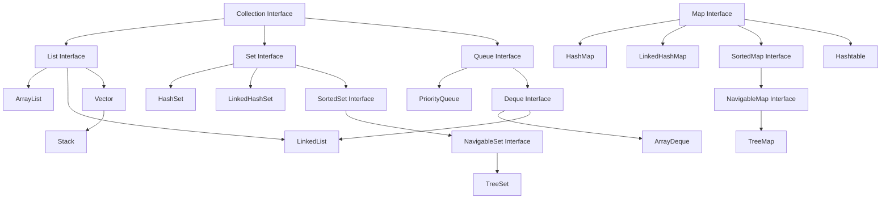

# Tutorial 20: Collections Framework in Java

> **Master Java Collections - from ArrayList to TreeMap, with complete coverage of the most powerful data structure framework**

---

## 📋 Table of Contents

1. [Prerequisites](#prerequisites)
2. [Introduction to Collections Framework](#introduction-to-collections-framework)
3. [Collection Hierarchy](#collection-hierarchy)
4. [Core Interfaces](#core-interfaces)
5. [List Interface](#list-interface)
6. [ArrayList](#arraylist)
7. [LinkedList](#linkedlist)
8. [Vector and Stack](#vector-and-stack)
9. [Set Interface](#set-interface)
10. [HashSet](#hashset)
11. [LinkedHashSet](#linkedhashset)
12. [TreeSet](#treeset)
13. [Map Interface](#map-interface)
14. [HashMap](#hashmap)
15. [LinkedHashMap](#linkedhashmap)
16. [TreeMap](#treemap)
17. [Hashtable](#hashtable)
18. [Queue Interface](#queue-interface)
19. [PriorityQueue](#priorityqueue)
20. [Iterators](#iterators)
21. [Comparator and Comparable](#comparator-and-comparable)
22. [Sorting and Searching](#sorting-and-searching)
23. [Collections Utility Class](#collections-utility-class)
24. [Best Practices](#best-practices)
25. [Common Pitfalls](#common-pitfalls)
26. [Performance Comparison](#performance-comparison)
27. [Interview Preparation](#interview-preparation)
28. [Practice Exercises](#practice-exercises)
29. [Summary](#summary)
30. [Further Reading](#further-reading)
31. [Navigation](#navigation)
32. [Video Index](#video-index)

---

## Prerequisites

Before diving into Collections, you should be comfortable with:

- ✅ **Classes and Objects** ([Tutorial 07](07_Classes_and_Objects.md))
- ✅ **Interfaces** ([Tutorial 10](10_Object_Oriented_Concepts.md))
- ✅ **Generics** ([Tutorial 19](19_Generics.md)) - **Critical for understanding Collections**
- ✅ **Arrays** ([Tutorial 11](11_Arrays.md))
- ✅ **Exception Handling** ([Tutorial 17](17_Exception_Handling.md))

---

## Introduction to Collections Framework

The **Java Collections Framework** is a unified architecture for representing and manipulating collections. It provides:

- **Interfaces**: Abstract data types representing collections
- **Implementations**: Concrete implementations of collection interfaces
- **Algorithms**: Methods for searching, sorting, and manipulating collections

### 🎯 Why Collections Framework?

**Before Collections Framework (Pre-Java 1.2):**
```java
// Limited options: Arrays, Vector, Hashtable, Properties
Vector v = new Vector();
v.addElement("Hello");  // No generics
String s = (String) v.elementAt(0);  // Casting required
```

**With Collections Framework:**
```java
// Type-safe, flexible, powerful
List<String> list = new ArrayList<>();
list.add("Hello");  // Type-safe
String s = list.get(0);  // No casting
```

### 📊 Key Benefits

| Benefit | Description |
|---------|-------------|
| **Reduced Effort** | Pre-built data structures save development time |
| **Increased Quality** | Well-tested, optimized implementations |
| **Interoperability** | Common interfaces enable code reuse |
| **Easy Learning** | Consistent design patterns |
| **Reusability** | Algorithms work with any collection |
| **Type Safety** | Generics prevent runtime errors |

---

## Collection Hierarchy



### 📝 Two Main Interface Hierarchies

**1. Collection Interface Hierarchy:**
- `Collection` → `List`, `Set`, `Queue`
- Used for groups of individual objects

**2. Map Interface Hierarchy:**
- `Map` → Separate hierarchy
- Used for key-value pairs

---

## Core Interfaces

### 📌 Collection Interface

Root interface in the collection hierarchy.

```java
public interface Collection<E> extends Iterable<E> {
    // Basic operations
    boolean add(E e);
    boolean remove(Object o);
    boolean contains(Object o);
    
    // Bulk operations
    boolean addAll(Collection<? extends E> c);
    boolean removeAll(Collection<?> c);
    boolean retainAll(Collection<?> c);
    void clear();
    
    // Query operations
    int size();
    boolean isEmpty();
    
    // Array operations
    Object[] toArray();
    <T> T[] toArray(T[] a);
    
    // Java 8+ operations
    Stream<E> stream();
    Stream<E> parallelStream();
}
```

### 📊 Collection Interface Methods

| Method | Description | Return Type |
|--------|-------------|-------------|
| `add(E e)` | Adds element | boolean |
| `remove(Object o)` | Removes element | boolean |
| `contains(Object o)` | Checks if contains | boolean |
| `size()` | Returns size | int |
| `isEmpty()` | Checks if empty | boolean |
| `clear()` | Removes all | void |
| `iterator()` | Returns iterator | Iterator<E> |
| `toArray()` | Converts to array | Object[] |

---

## List Interface

**List** is an ordered collection (sequence) that allows duplicate elements and positional access.

### 🎯 Key Characteristics

- ✅ **Ordered**: Elements maintain insertion order
- ✅ **Indexed**: Access elements by position (0-based)
- ✅ **Duplicates Allowed**: Can contain duplicate elements
- ✅ **Null Elements**: Can contain null elements

### 📝 List Interface Methods

```java
public interface List<E> extends Collection<E> {
    // Positional access
    E get(int index);
    E set(int index, E element);
    void add(int index, E element);
    E remove(int index);
    
    // Search operations
    int indexOf(Object o);
    int lastIndexOf(Object o);
    
    // List iterators
    ListIterator<E> listIterator();
    ListIterator<E> listIterator(int index);
    
    // View
    List<E> subList(int fromIndex, int toIndex);
}
```

### 📊 List Implementations Comparison

| Feature | ArrayList | LinkedList | Vector |
|---------|-----------|------------|--------|
| **Underlying DS** | Dynamic array | Doubly linked list | Dynamic array |
| **Random Access** | O(1) - Fast | O(n) - Slow | O(1) - Fast |
| **Insert/Delete** | O(n) - Slow | O(1) - Fast | O(n) - Slow |
| **Thread-Safe** | No | No | Yes |
| **Performance** | Best for reads | Best for inserts | Synchronized overhead |
| **Memory** | Contiguous | Non-contiguous | Contiguous |

---

## ArrayList

**ArrayList** is a resizable array implementation of the List interface.

### 🎯 Key Features

- Dynamic sizing (grows automatically)
- Fast random access O(1)
- Slow insertion/deletion in middle O(n)
- Not synchronized (not thread-safe)
- Allows null elements and duplicates

### 📝 ArrayList Constructors

```java
// Default constructor - initial capacity 10
ArrayList<String> list1 = new ArrayList<>();

// With initial capacity
ArrayList<Integer> list2 = new ArrayList<>(20);

// From another collection
ArrayList<String> list3 = new ArrayList<>(Arrays.asList("A", "B", "C"));
```

### 💻 Example 1: Basic ArrayList Operations

```java
import java.util.*;

public class ArrayListBasics {
    public static void main(String[] args) {
        // Create ArrayList
        ArrayList<String> fruits = new ArrayList<>();
        
        // Add elements
        fruits.add("Apple");
        fruits.add("Banana");
        fruits.add("Cherry");
        System.out.println("Initial list: " + fruits);
        
        // Add at specific index
        fruits.add(1, "Mango");
        System.out.println("After adding at index 1: " + fruits);
        
        // Get element
        String fruit = fruits.get(0);
        System.out.println("First fruit: " + fruit);
        
        // Update element
        fruits.set(2, "Blueberry");
        System.out.println("After update: " + fruits);
        
        // Remove element
        fruits.remove("Banana");
        System.out.println("After removing Banana: " + fruits);
        
        // Remove by index
        fruits.remove(0);
        System.out.println("After removing index 0: " + fruits);
        
        // Check if contains
        boolean hasCherry = fruits.contains("Cherry");
        System.out.println("Contains Cherry: " + hasCherry);
        
        // Get size
        System.out.println("Size: " + fruits.size());
        
        // Check if empty
        System.out.println("Is empty: " + fruits.isEmpty());
        
        // Clear all
        fruits.clear();
        System.out.println("After clear: " + fruits);
    }
}
```

**Output:**
```
Initial list: [Apple, Banana, Cherry]
After adding at index 1: [Apple, Mango, Banana, Cherry]
First fruit: Apple
After update: [Apple, Mango, Blueberry, Cherry]
After removing Banana: [Apple, Mango, Blueberry, Cherry]
After removing index 0: [Mango, Blueberry, Cherry]
Contains Cherry: true
Size: 3
Is empty: false
After clear: []
```

### 💻 Example 2: ArrayList Iteration Methods

```java
import java.util.*;

public class ArrayListIteration {
    public static void main(String[] args) {
        ArrayList<Integer> numbers = new ArrayList<>(Arrays.asList(1, 2, 3, 4, 5));
        
        // Method 1: Traditional for loop
        System.out.println("Method 1: Traditional for loop");
        for (int i = 0; i < numbers.size(); i++) {
            System.out.print(numbers.get(i) + " ");
        }
        System.out.println();
        
        // Method 2: Enhanced for loop (for-each)
        System.out.println("\nMethod 2: Enhanced for loop");
        for (Integer num : numbers) {
            System.out.print(num + " ");
        }
        System.out.println();
        
        // Method 3: Iterator
        System.out.println("\nMethod 3: Iterator");
        Iterator<Integer> iterator = numbers.iterator();
        while (iterator.hasNext()) {
            System.out.print(iterator.next() + " ");
        }
        System.out.println();
        
        // Method 4: ListIterator (bidirectional)
        System.out.println("\nMethod 4: ListIterator (forward)");
        ListIterator<Integer> listIterator = numbers.listIterator();
        while (listIterator.hasNext()) {
            System.out.print(listIterator.next() + " ");
        }
        System.out.println();
        
        System.out.println("\nListIterator (backward)");
        while (listIterator.hasPrevious()) {
            System.out.print(listIterator.previous() + " ");
        }
        System.out.println();
        
        // Method 5: forEach with lambda (Java 8+)
        System.out.println("\nMethod 5: forEach with lambda");
        numbers.forEach(num -> System.out.print(num + " "));
        System.out.println();
        
        // Method 6: Stream API (Java 8+)
        System.out.println("\nMethod 6: Stream API");
        numbers.stream().forEach(num -> System.out.print(num + " "));
        System.out.println();
    }
}
```

**Output:**
```
Method 1: Traditional for loop
1 2 3 4 5 

Method 2: Enhanced for loop
1 2 3 4 5 

Method 3: Iterator
1 2 3 4 5 

Method 4: ListIterator (forward)
1 2 3 4 5 

ListIterator (backward)
5 4 3 2 1 

Method 5: forEach with lambda
1 2 3 4 5 

Method 6: Stream API
1 2 3 4 5 
```

### 💻 Example 3: ArrayList with Custom Objects

```java
import java.util.*;

class Student {
    private int id;
    private String name;
    private double gpa;
    
    public Student(int id, String name, double gpa) {
        this.id = id;
        this.name = name;
        this.gpa = gpa;
    }
    
    // Getters
    public int getId() { return id; }
    public String getName() { return name; }
    public double getGpa() { return gpa; }
    
    @Override
    public String toString() {
        return String.format("Student[id=%d, name=%s, gpa=%.2f]", id, name, gpa);
    }
    
    @Override
    public boolean equals(Object obj) {
        if (this == obj) return true;
        if (obj == null || getClass() != obj.getClass()) return false;
        Student student = (Student) obj;
        return id == student.id;
    }
    
    @Override
    public int hashCode() {
        return Objects.hash(id);
    }
}

public class ArrayListCustomObjects {
    public static void main(String[] args) {
        ArrayList<Student> students = new ArrayList<>();
        
        // Add students
        students.add(new Student(1, "Alice", 3.8));
        students.add(new Student(2, "Bob", 3.5));
        students.add(new Student(3, "Charlie", 3.9));
        students.add(new Student(4, "Diana", 3.7));
        
        // Display all students
        System.out.println("All Students:");
        for (Student student : students) {
            System.out.println(student);
        }
        
        // Find student by ID
        int searchId = 2;
        Student found = null;
        for (Student student : students) {
            if (student.getId() == searchId) {
                found = student;
                break;
            }
        }
        System.out.println("\nStudent with ID " + searchId + ": " + found);
        
        // Filter students by GPA > 3.7
        System.out.println("\nStudents with GPA > 3.7:");
        for (Student student : students) {
            if (student.getGpa() > 3.7) {
                System.out.println(student);
            }
        }
        
        // Using Stream API (Java 8+)
        System.out.println("\nUsing Stream - Students with GPA > 3.7:");
        students.stream()
                .filter(s -> s.getGpa() > 3.7)
                .forEach(System.out::println);
        
        // Calculate average GPA
        double averageGpa = students.stream()
                .mapToDouble(Student::getGpa)
                .average()
                .orElse(0.0);
        System.out.println("\nAverage GPA: " + String.format("%.2f", averageGpa));
    }
}
```

**Output:**
```
All Students:
Student[id=1, name=Alice, gpa=3.80]
Student[id=2, name=Bob, gpa=3.50]
Student[id=3, name=Charlie, gpa=3.90]
Student[id=4, name=Diana, gpa=3.70]

Student with ID 2: Student[id=2, name=Bob, gpa=3.50]

Students with GPA > 3.7:
Student[id=1, name=Alice, gpa=3.80]
Student[id=3, name=Charlie, gpa=3.90]

Using Stream - Students with GPA > 3.7:
Student[id=1, name=Alice, gpa=3.80]
Student[id=3, name=Charlie, gpa=3.90]

Average GPA: 3.73
```

### 💻 Example 4: ArrayList Bulk Operations

```java
import java.util.*;

public class ArrayListBulkOperations {
    public static void main(String[] args) {
        ArrayList<Integer> list1 = new ArrayList<>(Arrays.asList(1, 2, 3, 4, 5));
        ArrayList<Integer> list2 = new ArrayList<>(Arrays.asList(4, 5, 6, 7, 8));
        
        System.out.println("List1: " + list1);
        System.out.println("List2: " + list2);
        
        // addAll - Add all elements from another collection
        ArrayList<Integer> combined = new ArrayList<>(list1);
        combined.addAll(list2);
        System.out.println("\nAfter addAll: " + combined);
        
        // removeAll - Remove all elements that exist in another collection
        ArrayList<Integer> difference = new ArrayList<>(list1);
        difference.removeAll(list2);
        System.out.println("After removeAll (list1 - list2): " + difference);
        
        // retainAll - Keep only elements that exist in another collection
        ArrayList<Integer> intersection = new ArrayList<>(list1);
        intersection.retainAll(list2);
        System.out.println("After retainAll (intersection): " + intersection);
        
        // containsAll - Check if contains all elements
        boolean containsAll = list1.containsAll(Arrays.asList(1, 2, 3));
        System.out.println("\nList1 contains [1,2,3]: " + containsAll);
        
        // subList - Get a view of portion of list
        List<Integer> subList = list1.subList(1, 4);  // from index 1 to 3
        System.out.println("SubList (1 to 3): " + subList);
        
        // toArray - Convert to array
        Integer[] array = list1.toArray(new Integer[0]);
        System.out.println("Array: " + Arrays.toString(array));
    }
}
```

**Output:**
```
List1: [1, 2, 3, 4, 5]
List2: [4, 5, 6, 7, 8]

After addAll: [1, 2, 3, 4, 5, 4, 5, 6, 7, 8]
After removeAll (list1 - list2): [1, 2, 3]
After retainAll (intersection): [4, 5]

List1 contains [1,2,3]: true
SubList (1 to 3): [2, 3, 4]
Array: [1, 2, 3, 4, 5]
```

### ⚙️ ArrayList Internal Working

**How ArrayList Grows:**

```java
// Initial capacity
private static final int DEFAULT_CAPACITY = 10;

// When full, creates new array with 50% more capacity
int newCapacity = oldCapacity + (oldCapacity >> 1);  // 1.5x growth

// Example: 10 → 15 → 22 → 33 → 49 → 73...
```

**Memory Layout:**
```
ArrayList stores elements in contiguous memory:
[0] [1] [2] [3] [4] [ ] [ ] [ ] [ ] [ ]
 ^                           ^
 elements                    unused capacity
```

### ⚡ ArrayList Performance

| Operation | Time Complexity | Notes |
|-----------|----------------|-------|
| `get(index)` | O(1) | Direct array access |
| `set(index, e)` | O(1) | Direct array access |
| `add(e)` | O(1) amortized | O(n) when resizing |
| `add(index, e)` | O(n) | Shift elements |
| `remove(index)` | O(n) | Shift elements |
| `contains(o)` | O(n) | Linear search |
| `indexOf(o)` | O(n) | Linear search |

---

## LinkedList

**LinkedList** is a doubly-linked list implementation of List and Deque interfaces.

### 🎯 Key Features

- Doubly-linked list structure
- Fast insertion/deletion O(1) at ends
- Slow random access O(n)
- Not synchronized (not thread-safe)
- Implements both List and Deque interfaces

### 📝 LinkedList Structure

```
Each node contains three parts:
┌─────────┬──────────┬─────────┐
│  prev   │   data   │  next   │
└─────────┴──────────┴─────────┘
    ↓          ↓          ↓
Previous   Element     Next
  Node                  Node
```

### 💻 Example 1: Basic LinkedList Operations

```java
import java.util.*;

public class LinkedListBasics {
    public static void main(String[] args) {
        LinkedList<String> list = new LinkedList<>();
        
        // Add elements
        list.add("B");
        list.add("C");
        System.out.println("Initial list: " + list);
        
        // Add at beginning (Deque operation)
        list.addFirst("A");
        System.out.println("After addFirst: " + list);
        
        // Add at end (Deque operation)
        list.addLast("D");
        System.out.println("After addLast: " + list);
        
        // Add at specific position
        list.add(2, "X");
        System.out.println("After add at index 2: " + list);
        
        // Get first and last
        System.out.println("\nFirst element: " + list.getFirst());
        System.out.println("Last element: " + list.getLast());
        
        // Remove first and last
        list.removeFirst();
        list.removeLast();
        System.out.println("\nAfter removing first and last: " + list);
        
        // Peek operations (without removal)
        System.out.println("Peek first: " + list.peekFirst());
        System.out.println("Peek last: " + list.peekLast());
        
        // Poll operations (with removal)
        System.out.println("\nPoll first: " + list.pollFirst());
        System.out.println("After poll: " + list);
    }
}
```

**Output:**
```
Initial list: [B, C]
After addFirst: [A, B, C]
After addLast: [A, B, C, D]
After add at index 2: [A, B, X, C, D]

First element: A
Last element: D

After removing first and last: [B, X, C]
Peek first: B
Peek last: C

Poll first: B
After poll: [X, C]
```

### 💻 Example 2: LinkedList as Queue

```java
import java.util.*;

public class LinkedListAsQueue {
    public static void main(String[] args) {
        LinkedList<String> queue = new LinkedList<>();
        
        // Enqueue (add to end)
        queue.offer("First");
        queue.offer("Second");
        queue.offer("Third");
        System.out.println("Queue: " + queue);
        
        // Peek (view front without removing)
        System.out.println("Peek: " + queue.peek());
        
        // Dequeue (remove from front)
        System.out.println("Dequeue: " + queue.poll());
        System.out.println("After dequeue: " + queue);
        
        // Process all elements
        System.out.println("\nProcessing queue:");
        while (!queue.isEmpty()) {
            System.out.println("Processing: " + queue.poll());
        }
        System.out.println("Queue empty: " + queue.isEmpty());
    }
}
```

**Output:**
```
Queue: [First, Second, Third]
Peek: First
Dequeue: First
After dequeue: [Second, Third]

Processing queue:
Processing: Second
Processing: Third
Queue empty: true
```

### 💻 Example 3: LinkedList as Stack

```java
import java.util.*;

public class LinkedListAsStack {
    public static void main(String[] args) {
        LinkedList<Integer> stack = new LinkedList<>();
        
        // Push (add to top)
        stack.push(10);
        stack.push(20);
        stack.push(30);
        System.out.println("Stack: " + stack);
        
        // Peek (view top without removing)
        System.out.println("Peek: " + stack.peek());
        
        // Pop (remove from top)
        System.out.println("Pop: " + stack.pop());
        System.out.println("After pop: " + stack);
        
        // Process all elements
        System.out.println("\nProcessing stack:");
        while (!stack.isEmpty()) {
            System.out.println("Popping: " + stack.pop());
        }
    }
}
```

**Output:**
```
Stack: [30, 20, 10]
Peek: 30
Pop: 30
After pop: [20, 10]

Processing stack:
Popping: 20
Popping: 10
```

### 📊 ArrayList vs LinkedList

```java
import java.util.*;

public class ArrayListVsLinkedList {
    public static void main(String[] args) {
        int n = 100000;
        
        // Test 1: Add elements
        long start = System.currentTimeMillis();
        ArrayList<Integer> arrayList = new ArrayList<>();
        for (int i = 0; i < n; i++) {
            arrayList.add(i);
        }
        long arrayListAddTime = System.currentTimeMillis() - start;
        
        start = System.currentTimeMillis();
        LinkedList<Integer> linkedList = new LinkedList<>();
        for (int i = 0; i < n; i++) {
            linkedList.add(i);
        }
        long linkedListAddTime = System.currentTimeMillis() - start;
        
        System.out.println("Adding " + n + " elements:");
        System.out.println("ArrayList: " + arrayListAddTime + " ms");
        System.out.println("LinkedList: " + linkedListAddTime + " ms");
        
        // Test 2: Random access
        start = System.currentTimeMillis();
        for (int i = 0; i < 1000; i++) {
            arrayList.get(n / 2);
        }
        long arrayListGetTime = System.currentTimeMillis() - start;
        
        start = System.currentTimeMillis();
        for (int i = 0; i < 1000; i++) {
            linkedList.get(n / 2);
        }
        long linkedListGetTime = System.currentTimeMillis() - start;
        
        System.out.println("\nRandom access (1000 times at middle):");
        System.out.println("ArrayList: " + arrayListGetTime + " ms");
        System.out.println("LinkedList: " + linkedListGetTime + " ms");
        
        // Test 3: Insert at beginning
        start = System.currentTimeMillis();
        for (int i = 0; i < 1000; i++) {
            arrayList.add(0, i);
        }
        long arrayListInsertTime = System.currentTimeMillis() - start;
        
        start = System.currentTimeMillis();
        for (int i = 0; i < 1000; i++) {
            linkedList.addFirst(i);
        }
        long linkedListInsertTime = System.currentTimeMillis() - start;
        
        System.out.println("\nInsert at beginning (1000 times):");
        System.out.println("ArrayList: " + arrayListInsertTime + " ms");
        System.out.println("LinkedList: " + linkedListInsertTime + " ms");
    }
}
```

### ⚡ LinkedList Performance

| Operation | Time Complexity | Notes |
|-----------|----------------|-------|
| `get(index)` | O(n) | Must traverse from head/tail |
| `set(index, e)` | O(n) | Must traverse to find |
| `add(e)` | O(1) | Add at end |
| `addFirst(e)` | O(1) | Direct head insertion |
| `addLast(e)` | O(1) | Direct tail insertion |
| `add(index, e)` | O(n) | Must traverse to find |
| `remove(index)` | O(n) | Must traverse to find |
| `removeFirst()` | O(1) | Direct head removal |
| `removeLast()` | O(1) | Direct tail removal |

### 🎯 When to Use LinkedList vs ArrayList

**Use LinkedList when:**
- ✅ Frequent insertions/deletions at beginning/end
- ✅ Implementing queue or deque
- ✅ No random access needed
- ✅ Memory overhead acceptable

**Use ArrayList when:**
- ✅ Frequent random access needed
- ✅ Mostly reading operations
- ✅ Memory efficiency important
- ✅ Predictable size or slow growth

---

## Vector and Stack

### 📌 Vector

**Vector** is a synchronized (thread-safe) version of ArrayList.

```java
import java.util.*;

public class VectorExample {
    public static void main(String[] args) {
        Vector<String> vector = new Vector<>();
        
        // Add elements
        vector.add("A");
        vector.add("B");
        vector.add("C");
        System.out.println("Vector: " + vector);
        
        // Vector-specific methods
        vector.addElement("D");  // Legacy method
        System.out.println("After addElement: " + vector);
        
        System.out.println("First element: " + vector.firstElement());
        System.out.println("Last element: " + vector.lastElement());
        System.out.println("Element at 1: " + vector.elementAt(1));
        
        // Capacity management
        System.out.println("\nCapacity: " + vector.capacity());
        System.out.println("Size: " + vector.size());
        
        // Ensure capacity
        vector.ensureCapacity(20);
        System.out.println("After ensureCapacity(20): " + vector.capacity());
        
        // Remove element
        vector.removeElement("B");
        System.out.println("After removeElement: " + vector);
        
        // Vector enumeration (legacy method)
        System.out.println("\nEnumeration:");
        Enumeration<String> enumeration = vector.elements();
        while (enumeration.hasMoreElements()) {
            System.out.println(enumeration.nextElement());
        }
    }
}
```

**Output:**
```
Vector: [A, B, C]
After addElement: [A, B, C, D]
First element: A
Last element: D
Element at 1: B

Capacity: 10
Size: 4
After ensureCapacity(20): 20
After removeElement: [A, C, D]

Enumeration:
A
C
D
```

### 📊 Vector vs ArrayList

| Feature | Vector | ArrayList |
|---------|--------|-----------|
| **Thread-Safe** | Yes (synchronized) | No |
| **Performance** | Slower (synchronization overhead) | Faster |
| **Growth** | Doubles capacity | 50% increase |
| **Legacy** | Yes (Java 1.0) | No (Java 1.2+) |
| **Modern Usage** | ❌ Use Collections.synchronizedList() | ✅ Preferred |

**⚠️ Important:** Vector is considered **legacy**. Use `Collections.synchronizedList(new ArrayList<>())` for thread-safe lists in modern Java.

### 📌 Stack

**Stack** is a LIFO (Last-In-First-Out) data structure that extends Vector.

```java
import java.util.*;

public class StackExample {
    public static void main(String[] args) {
        Stack<Integer> stack = new Stack<>();
        
        // Push elements
        stack.push(10);
        stack.push(20);
        stack.push(30);
        stack.push(40);
        System.out.println("Stack: " + stack);
        
        // Peek (view top without removing)
        System.out.println("Peek: " + stack.peek());
        
        // Pop (remove and return top)
        System.out.println("Pop: " + stack.pop());
        System.out.println("After pop: " + stack);
        
        // Search (returns 1-based position from top)
        int position = stack.search(20);
        System.out.println("Position of 20: " + position);
        
        // Check if empty
        System.out.println("Is empty: " + stack.empty());
        
        // Process all elements
        System.out.println("\nProcessing stack:");
        while (!stack.empty()) {
            System.out.println("Popping: " + stack.pop());
        }
    }
}
```

**Output:**
```
Stack: [10, 20, 30, 40]
Peek: 40
Pop: 40
After pop: [10, 20, 30]
Position of 20: 2
Is empty: false

Processing stack:
Popping: 30
Popping: 20
Popping: 10
```

### 🎯 Stack Methods

| Method | Description | Return Type |
|--------|-------------|-------------|
| `push(E item)` | Pushes item onto stack | E |
| `pop()` | Removes and returns top | E |
| `peek()` | Returns top without removing | E |
| `empty()` | Tests if stack is empty | boolean |
| `search(Object o)` | Returns 1-based position from top | int |

**⚠️ Modern Alternative:** Use `Deque` interface with `ArrayDeque` or `LinkedList` instead of Stack.

```java
// Modern approach
Deque<Integer> stack = new ArrayDeque<>();
stack.push(10);
stack.push(20);
System.out.println(stack.pop());  // 20
```

---

## Set Interface

**Set** is a collection that contains no duplicate elements and at most one null element.

### 🎯 Key Characteristics

- ❌ **No Duplicates**: Each element can appear only once
- ❌ **No Indexing**: Cannot access elements by position
- ✅ **Null Element**: Most implementations allow one null (TreeSet doesn't)
- ❌ **No Order Guarantee**: Basic Set doesn't guarantee order (depends on implementation)

### 📝 Set Interface Methods

```java
public interface Set<E> extends Collection<E> {
    // All Collection methods plus:
    // Set-specific behavior: no duplicates
    boolean add(E e);  // Returns false if already present
    boolean remove(Object o);
    boolean contains(Object o);
    
    // Set algebra operations
    boolean containsAll(Collection<?> c);
    boolean addAll(Collection<? extends E> c);  // Union
    boolean retainAll(Collection<?> c);  // Intersection
    boolean removeAll(Collection<?> c);  // Difference
}
```

### 📊 Set Implementations Comparison

| Feature | HashSet | LinkedHashSet | TreeSet |
|---------|---------|---------------|---------|
| **Ordering** | No order | Insertion order | Sorted (natural/comparator) |
| **Null Elements** | One null allowed | One null allowed | ❌ No null |
| **Performance** | O(1) average | O(1) average | O(log n) |
| **Underlying DS** | HashMap | LinkedHashMap | Red-Black Tree |
| **Memory** | Lower | Higher (links) | Higher (tree) |
| **Use Case** | Fast lookup | Order matters | Sorted access |

---

## HashSet

**HashSet** is a Set implementation backed by a HashMap. It uses hashing for fast operations.

### 🎯 Key Features

- Fast operations: O(1) average for add, remove, contains
- No duplicates
- No ordering guarantee
- Allows one null element
- Not synchronized (not thread-safe)

### 📝 HashSet Constructors

```java
// Default constructor - initial capacity 16, load factor 0.75
HashSet<String> set1 = new HashSet<>();

// With initial capacity
HashSet<Integer> set2 = new HashSet<>(32);

// With initial capacity and load factor
HashSet<String> set3 = new HashSet<>(32, 0.80f);

// From another collection
HashSet<String> set4 = new HashSet<>(Arrays.asList("A", "B", "C"));
```

### 💻 Example 1: Basic HashSet Operations

```java
import java.util.*;

public class HashSetBasics {
    public static void main(String[] args) {
        HashSet<String> set = new HashSet<>();
        
        // Add elements
        set.add("Apple");
        set.add("Banana");
        set.add("Cherry");
        System.out.println("Initial set: " + set);
        
        // Try to add duplicate
        boolean added = set.add("Apple");
        System.out.println("Adding duplicate 'Apple': " + added);
        System.out.println("Set after duplicate: " + set);
        
        // Contains check
        System.out.println("\nContains 'Banana': " + set.contains("Banana"));
        System.out.println("Contains 'Mango': " + set.contains("Mango"));
        
        // Remove element
        set.remove("Banana");
        System.out.println("After removing Banana: " + set);
        
        // Size
        System.out.println("Size: " + set.size());
        
        // Iterate
        System.out.println("\nIterating:");
        for (String fruit : set) {
            System.out.println(fruit);
        }
        
        // Clear
        set.clear();
        System.out.println("\nAfter clear: " + set);
        System.out.println("Is empty: " + set.isEmpty());
    }
}
```

**Output:**
```
Initial set: [Apple, Cherry, Banana]
Adding duplicate 'Apple': false
Set after duplicate: [Apple, Cherry, Banana]

Contains 'Banana': true
Contains 'Mango': false
After removing Banana: [Apple, Cherry]
Size: 2

Iterating:
Apple
Cherry

After clear: []
Is empty: true
```

### 💻 Example 2: HashSet with Custom Objects

```java
import java.util.*;

class Person {
    private int id;
    private String name;
    
    public Person(int id, String name) {
        this.id = id;
        this.name = name;
    }
    
    // MUST override equals() and hashCode() for HashSet
    @Override
    public boolean equals(Object obj) {
        if (this == obj) return true;
        if (obj == null || getClass() != obj.getClass()) return false;
        Person person = (Person) obj;
        return id == person.id;
    }
    
    @Override
    public int hashCode() {
        return Objects.hash(id);
    }
    
    @Override
    public String toString() {
        return "Person[id=" + id + ", name=" + name + "]";
    }
}

public class HashSetCustomObjects {
    public static void main(String[] args) {
        HashSet<Person> people = new HashSet<>();
        
        people.add(new Person(1, "Alice"));
        people.add(new Person(2, "Bob"));
        people.add(new Person(3, "Charlie"));
        
        System.out.println("People set: " + people);
        
        // Try to add duplicate (same ID)
        boolean added = people.add(new Person(1, "Alice Johnson"));
        System.out.println("\nAdding duplicate ID: " + added);
        System.out.println("Set size: " + people.size());
        
        // Contains check with new object
        boolean contains = people.contains(new Person(2, "Bob"));
        System.out.println("Contains Person(2, Bob): " + contains);
    }
}
```

**Output:**
```
People set: [Person[id=1, name=Alice], Person[id=2, name=Bob], Person[id=3, name=Charlie]]

Adding duplicate ID: false
Set size: 3
Contains Person(2, Bob): true
```

### 💻 Example 3: Set Operations (Union, Intersection, Difference)

```java
import java.util.*;

public class HashSetOperations {
    public static void main(String[] args) {
        HashSet<Integer> set1 = new HashSet<>(Arrays.asList(1, 2, 3, 4, 5));
        HashSet<Integer> set2 = new HashSet<>(Arrays.asList(4, 5, 6, 7, 8));
        
        System.out.println("Set1: " + set1);
        System.out.println("Set2: " + set2);
        
        // Union: set1 ∪ set2
        HashSet<Integer> union = new HashSet<>(set1);
        union.addAll(set2);
        System.out.println("\nUnion (set1 ∪ set2): " + union);
        
        // Intersection: set1 ∩ set2
        HashSet<Integer> intersection = new HashSet<>(set1);
        intersection.retainAll(set2);
        System.out.println("Intersection (set1 ∩ set2): " + intersection);
        
        // Difference: set1 - set2
        HashSet<Integer> difference = new HashSet<>(set1);
        difference.removeAll(set2);
        System.out.println("Difference (set1 - set2): " + difference);
        
        // Symmetric Difference: (set1 - set2) ∪ (set2 - set1)
        HashSet<Integer> symDiff = new HashSet<>(set1);
        symDiff.addAll(set2);
        HashSet<Integer> temp = new HashSet<>(set1);
        temp.retainAll(set2);
        symDiff.removeAll(temp);
        System.out.println("Symmetric Difference: " + symDiff);
        
        // Subset check
        HashSet<Integer> subset = new HashSet<>(Arrays.asList(1, 2, 3));
        boolean isSubset = set1.containsAll(subset);
        System.out.println("\n{1,2,3} is subset of set1: " + isSubset);
    }
}
```

**Output:**
```
Set1: [1, 2, 3, 4, 5]
Set2: [4, 5, 6, 7, 8]

Union (set1 ∪ set2): [1, 2, 3, 4, 5, 6, 7, 8]
Intersection (set1 ∩ set2): [4, 5]
Difference (set1 - set2): [1, 2, 3]
Symmetric Difference: [1, 2, 3, 6, 7, 8]

{1,2,3} is subset of set1: true
```

### ⚙️ HashSet Internal Working

**Backed by HashMap:**
```java
// HashSet internally uses HashMap
private transient HashMap<E,Object> map;
private static final Object PRESENT = new Object();

public boolean add(E e) {
    return map.put(e, PRESENT) == null;
}
```

**Hashing Process:**
```
1. hashCode() called on element
2. Hash function applied to determine bucket
3. equals() used to check for duplicates in bucket
4. Element stored if unique
```

### ⚡ HashSet Performance

| Operation | Average Case | Worst Case |
|-----------|-------------|------------|
| `add(e)` | O(1) | O(n) |
| `remove(o)` | O(1) | O(n) |
| `contains(o)` | O(1) | O(n) |
| `size()` | O(1) | O(1) |
| Iteration | O(n) | O(n) |

**Note:** Worst case occurs when all elements hash to same bucket (poor hash function).

---

## LinkedHashSet

**LinkedHashSet** extends HashSet and maintains insertion order using a doubly-linked list.

### 🎯 Key Features

- Maintains **insertion order**
- Same performance as HashSet
- Slightly more memory (for links)
- Allows one null element
- Not synchronized

### 💻 Example 1: LinkedHashSet Basics

```java
import java.util.*;

public class LinkedHashSetExample {
    public static void main(String[] args) {
        // LinkedHashSet maintains insertion order
        LinkedHashSet<String> linkedSet = new LinkedHashSet<>();
        linkedSet.add("Banana");
        linkedSet.add("Apple");
        linkedSet.add("Cherry");
        linkedSet.add("Date");
        
        System.out.println("LinkedHashSet (insertion order): " + linkedSet);
        
        // Compare with HashSet (no order)
        HashSet<String> hashSet = new HashSet<>(linkedSet);
        System.out.println("HashSet (no guaranteed order): " + hashSet);
        
        // Iteration maintains insertion order
        System.out.println("\nIterating LinkedHashSet:");
        for (String fruit : linkedSet) {
            System.out.println(fruit);
        }
        
        // Adding duplicate doesn't change order
        linkedSet.add("Apple");
        System.out.println("\nAfter adding duplicate 'Apple': " + linkedSet);
        
        // Removing and re-adding changes position
        linkedSet.remove("Apple");
        linkedSet.add("Apple");
        System.out.println("After remove and re-add 'Apple': " + linkedSet);
    }
}
```

**Output:**
```
LinkedHashSet (insertion order): [Banana, Apple, Cherry, Date]
HashSet (no guaranteed order): [Apple, Cherry, Banana, Date]

Iterating LinkedHashSet:
Banana
Apple
Cherry
Date

After adding duplicate 'Apple': [Banana, Apple, Cherry, Date]
After remove and re-add 'Apple': [Banana, Cherry, Date, Apple]
```

### 💻 Example 2: Removing Duplicates While Preserving Order

```java
import java.util.*;

public class RemoveDuplicatesPreserveOrder {
    public static void main(String[] args) {
        List<Integer> numbers = Arrays.asList(3, 1, 4, 1, 5, 9, 2, 6, 5, 3, 5);
        System.out.println("Original list: " + numbers);
        
        // Using LinkedHashSet to remove duplicates
        LinkedHashSet<Integer> uniqueNumbers = new LinkedHashSet<>(numbers);
        System.out.println("After removing duplicates: " + uniqueNumbers);
        
        // Convert back to list if needed
        List<Integer> resultList = new ArrayList<>(uniqueNumbers);
        System.out.println("As ArrayList: " + resultList);
        
        // Generic method to remove duplicates
        List<String> words = Arrays.asList("hello", "world", "hello", "java", "world");
        List<String> uniqueWords = removeDuplicates(words);
        System.out.println("\nOriginal words: " + words);
        System.out.println("Unique words: " + uniqueWords);
    }
    
    public static <T> List<T> removeDuplicates(List<T> list) {
        return new ArrayList<>(new LinkedHashSet<>(list));
    }
}
```

**Output:**
```
Original list: [3, 1, 4, 1, 5, 9, 2, 6, 5, 3, 5]
After removing duplicates: [3, 1, 4, 5, 9, 2, 6]
As ArrayList: [3, 1, 4, 5, 9, 2, 6]

Original words: [hello, world, hello, java, world]
Unique words: [hello, world, java]
```

### 📊 HashSet vs LinkedHashSet

| Feature | HashSet | LinkedHashSet |
|---------|---------|---------------|
| **Order** | No order | Insertion order |
| **Performance** | Slightly faster | Slightly slower |
| **Memory** | Lower | Higher (doubly-linked list) |
| **Use Case** | Order doesn't matter | Order preservation needed |

---

## TreeSet

**TreeSet** is a NavigableSet implementation based on a Red-Black Tree. Elements are stored in sorted order.

### 🎯 Key Features

- Elements stored in **sorted order** (natural or custom)
- Implements NavigableSet (with navigation methods)
- O(log n) time for add, remove, contains
- ❌ **No null elements** (throws NullPointerException)
- Not synchronized

### 📝 TreeSet Constructors

```java
// Natural ordering (Comparable)
TreeSet<Integer> set1 = new TreeSet<>();

// Custom ordering (Comparator)
TreeSet<String> set2 = new TreeSet<>(Comparator.reverseOrder());

// From another collection
TreeSet<Integer> set3 = new TreeSet<>(Arrays.asList(5, 2, 8, 1));
```

### 💻 Example 1: TreeSet with Natural Ordering

```java
import java.util.*;

public class TreeSetNaturalOrdering {
    public static void main(String[] args) {
        TreeSet<Integer> numbers = new TreeSet<>();
        
        // Add elements in random order
        numbers.add(50);
        numbers.add(20);
        numbers.add(80);
        numbers.add(10);
        numbers.add(60);
        
        System.out.println("TreeSet (sorted): " + numbers);
        
        // Navigation methods
        System.out.println("\nFirst element: " + numbers.first());
        System.out.println("Last element: " + numbers.last());
        
        // Ceiling: smallest element >= given element
        System.out.println("Ceiling of 45: " + numbers.ceiling(45));
        
        // Floor: largest element <= given element
        System.out.println("Floor of 45: " + numbers.floor(45));
        
        // Higher: smallest element > given element
        System.out.println("Higher than 50: " + numbers.higher(50));
        
        // Lower: largest element < given element
        System.out.println("Lower than 50: " + numbers.lower(50));
        
        // SubSet operations
        System.out.println("\nHeadSet (<50): " + numbers.headSet(50));
        System.out.println("TailSet (>=50): " + numbers.tailSet(50));
        System.out.println("SubSet [20, 80): " + numbers.subSet(20, 80));
        
        // Poll operations (remove and return)
        System.out.println("\nPoll first: " + numbers.pollFirst());
        System.out.println("Poll last: " + numbers.pollLast());
        System.out.println("After polls: " + numbers);
    }
}
```

**Output:**
```
TreeSet (sorted): [10, 20, 50, 60, 80]

First element: 10
Last element: 80
Ceiling of 45: 50
Floor of 45: 20
Higher than 50: 60
Lower than 50: 20

HeadSet (<50): [10, 20]
TailSet (>=50): [50, 60, 80]
SubSet [20, 80): [20, 50, 60]

Poll first: 10
Poll last: 80
After polls: [20, 50, 60]
```

### 💻 Example 2: TreeSet with Custom Comparator

```java
import java.util.*;

public class TreeSetCustomComparator {
    public static void main(String[] args) {
        // Sort strings by length, then alphabetically
        TreeSet<String> words = new TreeSet<>((s1, s2) -> {
            int lengthCompare = Integer.compare(s1.length(), s2.length());
            return lengthCompare != 0 ? lengthCompare : s1.compareTo(s2);
        });
        
        words.add("banana");
        words.add("apple");
        words.add("kiwi");
        words.add("pear");
        words.add("grape");
        
        System.out.println("Sorted by length, then alphabetically:");
        for (String word : words) {
            System.out.println(word);
        }
        
        // Reverse order TreeSet
        TreeSet<Integer> reverseNumbers = new TreeSet<>(Comparator.reverseOrder());
        reverseNumbers.addAll(Arrays.asList(5, 2, 8, 1, 9, 3));
        System.out.println("\nReverse order: " + reverseNumbers);
        
        // Case-insensitive string TreeSet
        TreeSet<String> caseInsensitive = new TreeSet<>(String.CASE_INSENSITIVE_ORDER);
        caseInsensitive.add("Apple");
        caseInsensitive.add("BANANA");
        caseInsensitive.add("cherry");
        System.out.println("\nCase-insensitive: " + caseInsensitive);
    }
}
```

**Output:**
```
Sorted by length, then alphabetically:
kiwi
pear
apple
grape
banana

Reverse order: [9, 8, 5, 3, 2, 1]

Case-insensitive: [Apple, BANANA, cherry]
```

### 💻 Example 3: TreeSet with Custom Objects

```java
import java.util.*;

class Employee implements Comparable<Employee> {
    private int id;
    private String name;
    private double salary;
    
    public Employee(int id, String name, double salary) {
        this.id = id;
        this.name = name;
        this.salary = salary;
    }
    
    public int getId() { return id; }
    public String getName() { return name; }
    public double getSalary() { return salary; }
    
    // Natural ordering by ID
    @Override
    public int compareTo(Employee other) {
        return Integer.compare(this.id, other.id);
    }
    
    @Override
    public String toString() {
        return String.format("Employee[id=%d, name=%s, salary=%.2f]", id, name, salary);
    }
}

public class TreeSetCustomObjects {
    public static void main(String[] args) {
        // TreeSet with natural ordering (by ID)
        TreeSet<Employee> employees = new TreeSet<>();
        employees.add(new Employee(103, "Charlie", 60000));
        employees.add(new Employee(101, "Alice", 55000));
        employees.add(new Employee(102, "Bob", 58000));
        
        System.out.println("Sorted by ID (natural ordering):");
        employees.forEach(System.out::println);
        
        // TreeSet with custom comparator (by salary)
        TreeSet<Employee> bySalary = new TreeSet<>(Comparator.comparingDouble(Employee::getSalary));
        bySalary.addAll(employees);
        
        System.out.println("\nSorted by salary:");
        bySalary.forEach(System.out::println);
        
        // TreeSet with custom comparator (by name)
        TreeSet<Employee> byName = new TreeSet<>(Comparator.comparing(Employee::getName));
        byName.addAll(employees);
        
        System.out.println("\nSorted by name:");
        byName.forEach(System.out::println);
    }
}
```

**Output:**
```
Sorted by ID (natural ordering):
Employee[id=101, name=Alice, salary=55000.00]
Employee[id=102, name=Bob, salary=58000.00]
Employee[id=103, name=Charlie, salary=60000.00]

Sorted by salary:
Employee[id=101, name=Alice, salary=55000.00]
Employee[id=102, name=Bob, salary=58000.00]
Employee[id=103, name=Charlie, salary=60000.00]

Sorted by name:
Employee[id=101, name=Alice, salary=55000.00]
Employee[id=102, name=Bob, salary=58000.00]
Employee[id=103, name=Charlie, salary=60000.00]
```

### ⚡ TreeSet Performance

| Operation | Time Complexity | Notes |
|-----------|----------------|-------|
| `add(e)` | O(log n) | Red-Black Tree insertion |
| `remove(o)` | O(log n) | Tree deletion |
| `contains(o)` | O(log n) | Tree search |
| `first()`, `last()` | O(log n) | Tree traversal |
| Navigation methods | O(log n) | ceiling, floor, higher, lower |

### 🎯 When to Use Each Set Implementation

```java
// HashSet - Fast, no order
HashSet<String> fast = new HashSet<>();  // O(1) average

// LinkedHashSet - Fast with insertion order
LinkedHashSet<String> ordered = new LinkedHashSet<>();  // O(1) + order

// TreeSet - Sorted, navigable
TreeSet<String> sorted = new TreeSet<>();  // O(log n) + sorted
```

---

## Map Interface

**Map** is an object that maps keys to values. A map cannot contain duplicate keys; each key maps to at most one value.

### 🎯 Key Characteristics

- ✅ **Key-Value Pairs**: Each entry has a key and a value
- ❌ **No Duplicate Keys**: Each key is unique
- ✅ **Duplicate Values**: Multiple keys can map to same value
- ❌ **Not a Collection**: Map doesn't extend Collection interface

### 📝 Map Interface Methods

```java
public interface Map<K, V> {
    // Basic operations
    V put(K key, V value);
    V get(Object key);
    V remove(Object key);
    boolean containsKey(Object key);
    boolean containsValue(Object value);
    
    // Bulk operations
    void putAll(Map<? extends K, ? extends V> m);
    void clear();
    
    // Views
    Set<K> keySet();
    Collection<V> values();
    Set<Map.Entry<K, V>> entrySet();
    
    // Query operations
    int size();
    boolean isEmpty();
    
    // Java 8+ operations
    V getOrDefault(Object key, V defaultValue);
    V putIfAbsent(K key, V value);
    boolean remove(Object key, Object value);
    V replace(K key, V value);
    void forEach(BiConsumer<? super K, ? super V> action);
    V compute(K key, BiFunction<? super K, ? super V, ? extends V> remappingFunction);
    V merge(K key, V value, BiFunction<? super V, ? super V, ? extends V> remappingFunction);
}
```

### 📊 Map Implementations Comparison

| Feature | HashMap | LinkedHashMap | TreeMap | Hashtable |
|---------|---------|---------------|---------|-----------|
| **Ordering** | No order | Insertion order | Sorted | No order |
| **Null Key** | One null | One null | ❌ No null | ❌ No null |
| **Null Values** | Multiple | Multiple | Multiple | ❌ No null |
| **Synchronized** | No | No | No | Yes |
| **Performance** | O(1) average | O(1) average | O(log n) | O(1) + sync overhead |
| **Legacy** | No | No | No | Yes (Java 1.0) |

---

## HashMap

**HashMap** is a hash table based implementation of the Map interface. It provides O(1) average time performance for get and put operations.

### 🎯 Key Features

- Fast operations: O(1) average for get, put, remove
- Allows one null key and multiple null values
- No ordering guarantee
- Not synchronized (not thread-safe)
- Backed by an array of linked lists/trees (Java 8+)

### 📝 HashMap Constructors

```java
// Default constructor - initial capacity 16, load factor 0.75
HashMap<String, Integer> map1 = new HashMap<>();

// With initial capacity
HashMap<String, Integer> map2 = new HashMap<>(32);

// With initial capacity and load factor
HashMap<String, Integer> map3 = new HashMap<>(32, 0.80f);

// From another map
HashMap<String, Integer> map4 = new HashMap<>(existingMap);
```

### 💻 Example 1: Basic HashMap Operations

```java
import java.util.*;

public class HashMapBasics {
    public static void main(String[] args) {
        HashMap<String, Integer> scores = new HashMap<>();
        
        // Put key-value pairs
        scores.put("Alice", 95);
        scores.put("Bob", 87);
        scores.put("Charlie", 92);
        System.out.println("Scores: " + scores);
        
        // Get value by key
        int aliceScore = scores.get("Alice");
        System.out.println("Alice's score: " + aliceScore);
        
        // Get with default value
        int davidScore = scores.getOrDefault("David", 0);
        System.out.println("David's score: " + davidScore);
        
        // Check if key exists
        System.out.println("\nContains 'Bob': " + scores.containsKey("Bob"));
        System.out.println("Contains 'Eve': " + scores.containsKey("Eve"));
        
        // Check if value exists
        System.out.println("Contains value 92: " + scores.containsValue(92));
        
        // Update value
        scores.put("Bob", 90);  // Replaces old value
        System.out.println("\nAfter updating Bob: " + scores);
        
        // Put if absent
        scores.putIfAbsent("Alice", 100);  // Won't replace
        scores.putIfAbsent("Diana", 88);   // Will add
        System.out.println("After putIfAbsent: " + scores);
        
        // Remove by key
        scores.remove("Charlie");
        System.out.println("\nAfter removing Charlie: " + scores);
        
        // Size
        System.out.println("Size: " + scores.size());
        
        // Clear all
        scores.clear();
        System.out.println("After clear: " + scores);
    }
}
```

**Output:**
```
Scores: {Alice=95, Bob=87, Charlie=92}
Alice's score: 95
David's score: 0

Contains 'Bob': true
Contains 'Eve': false
Contains value 92: true

After updating Bob: {Alice=95, Bob=90, Charlie=92}
After putIfAbsent: {Alice=95, Bob=90, Charlie=92, Diana=88}

After removing Charlie: {Alice=95, Bob=90, Diana=88}
Size: 3
After clear: {}
```

### 💻 Example 2: Iterating HashMap

```java
import java.util.*;

public class HashMapIteration {
    public static void main(String[] args) {
        HashMap<String, Integer> map = new HashMap<>();
        map.put("Apple", 10);
        map.put("Banana", 20);
        map.put("Cherry", 30);
        
        // Method 1: Using keySet()
        System.out.println("Method 1: Using keySet()");
        for (String key : map.keySet()) {
            System.out.println(key + " = " + map.get(key));
        }
        
        // Method 2: Using values()
        System.out.println("\nMethod 2: Using values()");
        for (Integer value : map.values()) {
            System.out.println(value);
        }
        
        // Method 3: Using entrySet() (Most efficient)
        System.out.println("\nMethod 3: Using entrySet()");
        for (Map.Entry<String, Integer> entry : map.entrySet()) {
            System.out.println(entry.getKey() + " = " + entry.getValue());
        }
        
        // Method 4: forEach with lambda (Java 8+)
        System.out.println("\nMethod 4: forEach with lambda");
        map.forEach((key, value) -> System.out.println(key + " = " + value));
        
        // Method 5: Stream API (Java 8+)
        System.out.println("\nMethod 5: Stream API");
        map.entrySet().stream()
            .forEach(entry -> System.out.println(entry.getKey() + " = " + entry.getValue()));
    }
}
```

**Output:**
```
Method 1: Using keySet()
Apple = 10
Banana = 20
Cherry = 30

Method 2: Using values()
10
20
30

Method 3: Using entrySet()
Apple = 10
Banana = 20
Cherry = 30

Method 4: forEach with lambda
Apple = 10
Banana = 20
Cherry = 30

Method 5: Stream API
Apple = 10
Banana = 20
Cherry = 30
```

### 💻 Example 3: HashMap with Custom Objects

```java
import java.util.*;

class Product {
    private int id;
    private String name;
    private double price;
    
    public Product(int id, String name, double price) {
        this.id = id;
        this.name = name;
        this.price = price;
    }
    
    public int getId() { return id; }
    public String getName() { return name; }
    public double getPrice() { return price; }
    
    @Override
    public String toString() {
        return String.format("Product[id=%d, name=%s, price=%.2f]", id, name, price);
    }
}

public class HashMapCustomObjects {
    public static void main(String[] args) {
        // Map: Product ID -> Product
        HashMap<Integer, Product> inventory = new HashMap<>();
        
        inventory.put(101, new Product(101, "Laptop", 999.99));
        inventory.put(102, new Product(102, "Mouse", 29.99));
        inventory.put(103, new Product(103, "Keyboard", 79.99));
        
        // Retrieve product
        Product laptop = inventory.get(101);
        System.out.println("Product 101: " + laptop);
        
        // Check if product exists
        if (inventory.containsKey(102)) {
            System.out.println("Mouse is in stock");
        }
        
        // Display all products
        System.out.println("\nAll products:");
        inventory.forEach((id, product) -> 
            System.out.println("ID " + id + ": " + product));
        
        // Find expensive products (price > 50)
        System.out.println("\nExpensive products (>$50):");
        inventory.values().stream()
            .filter(p -> p.getPrice() > 50)
            .forEach(System.out::println);
    }
}
```

**Output:**
```
Product 101: Product[id=101, name=Laptop, price=999.99]
Mouse is in stock

All products:
ID 101: Product[id=101, name=Laptop, price=999.99]
ID 102: Product[id=102, name=Mouse, price=29.99]
ID 103: Product[id=103, name=Keyboard, price=79.99]

Expensive products (>$50):
Product[id=101, name=Laptop, price=999.99]
Product[id=103, name=Keyboard, price=79.99]
```

### 💻 Example 4: HashMap Java 8+ Methods

```java
import java.util.*;

public class HashMapJava8Methods {
    public static void main(String[] args) {
        HashMap<String, Integer> map = new HashMap<>();
        map.put("A", 1);
        map.put("B", 2);
        map.put("C", 3);
        
        System.out.println("Original map: " + map);
        
        // compute - compute new value for key
        map.compute("B", (k, v) -> v * 10);
        System.out.println("After compute on 'B': " + map);
        
        // computeIfAbsent - compute value if key absent
        map.computeIfAbsent("D", k -> 4);
        map.computeIfAbsent("A", k -> 100);  // Won't replace
        System.out.println("After computeIfAbsent: " + map);
        
        // computeIfPresent - compute value if key present
        map.computeIfPresent("C", (k, v) -> v * 2);
        System.out.println("After computeIfPresent on 'C': " + map);
        
        // merge - merge value with existing value
        map.merge("A", 10, (oldVal, newVal) -> oldVal + newVal);
        map.merge("E", 5, (oldVal, newVal) -> oldVal + newVal);  // E doesn't exist
        System.out.println("After merge: " + map);
        
        // replace - replace value for key
        map.replace("B", 25);
        System.out.println("After replace: " + map);
        
        // replaceAll - replace all values using function
        map.replaceAll((k, v) -> v + 1);
        System.out.println("After replaceAll (+1): " + map);
    }
}
```

**Output:**
```
Original map: {A=1, B=2, C=3}
After compute on 'B': {A=1, B=20, C=3}
After computeIfAbsent: {A=1, B=20, C=3, D=4}
After computeIfPresent on 'C': {A=1, B=20, C=6, D=4}
After merge: {A=11, B=20, C=6, D=4, E=5}
After replace: {A=11, B=25, C=6, D=4, E=5}
After replaceAll (+1): {A=12, B=26, C=7, D=5, E=6}
```

### ⚙️ HashMap Internal Working

**Hash Function:**
```java
static final int hash(Object key) {
    int h;
    return (key == null) ? 0 : (h = key.hashCode()) ^ (h >>> 16);
}
```

**Bucket Structure (Java 8+):**
```
┌───────────────────────────────────┐
│   HashMap (Array of Buckets)     │
├───────────────────────────────────┤
│ [0] → null                        │
│ [1] → Entry(k1,v1) → Entry(k2,v2)│  Linked List
│ [2] → TreeNode (Red-Black Tree)  │  When bucket size > 8
│ [3] → Entry(k3,v3)                │
│ ...                               │
└───────────────────────────────────┘
```

**Load Factor and Rehashing:**
```java
// Default load factor: 0.75
// When size > capacity * loadFactor, resize to double capacity
// Example: capacity=16, threshold=12, when size=13, resize to 32
```

### ⚡ HashMap Performance

| Operation | Average Case | Worst Case |
|-----------|-------------|------------|
| `get(key)` | O(1) | O(n) |
| `put(key, value)` | O(1) | O(n) |
| `remove(key)` | O(1) | O(n) |
| `containsKey(key)` | O(1) | O(n) |
| Iteration | O(n) | O(n) |

**Note:** Java 8+ uses Red-Black Trees when bucket size > 8, improving worst case to O(log n).

---

## LinkedHashMap

**LinkedHashMap** extends HashMap and maintains insertion order or access order.

### 🎯 Key Features

- Maintains **insertion order** by default
- Can maintain **access order** (LRU cache)
- Same performance as HashMap
- Slightly more memory (doubly-linked list)
- Allows one null key and multiple null values

### 📝 LinkedHashMap Constructors

```java
// Insertion order (default)
LinkedHashMap<String, Integer> map1 = new LinkedHashMap<>();

// Access order (for LRU cache)
LinkedHashMap<String, Integer> map2 = new LinkedHashMap<>(16, 0.75f, true);
```

### 💻 Example 1: LinkedHashMap with Insertion Order

```java
import java.util.*;

public class LinkedHashMapInsertionOrder {
    public static void main(String[] args) {
        LinkedHashMap<String, Integer> map = new LinkedHashMap<>();
        
        map.put("Banana", 2);
        map.put("Apple", 1);
        map.put("Cherry", 3);
        map.put("Date", 4);
        
        System.out.println("LinkedHashMap (insertion order): " + map);
        
        // Compare with HashMap (no order guarantee)
        HashMap<String, Integer> hashMap = new HashMap<>(map);
        System.out.println("HashMap (no guaranteed order): " + hashMap);
        
        // Iteration maintains insertion order
        System.out.println("\nIterating LinkedHashMap:");
        map.forEach((k, v) -> System.out.println(k + " = " + v));
    }
}
```

**Output:**
```
LinkedHashMap (insertion order): {Banana=2, Apple=1, Cherry=3, Date=4}
HashMap (no guaranteed order): {Apple=1, Cherry=3, Banana=2, Date=4}

Iterating LinkedHashMap:
Banana = 2
Apple = 1
Cherry = 3
Date = 4
```

### 💻 Example 2: LinkedHashMap as LRU Cache

```java
import java.util.*;

class LRUCache<K, V> extends LinkedHashMap<K, V> {
    private final int capacity;
    
    public LRUCache(int capacity) {
        super(capacity, 0.75f, true);  // access-order = true
        this.capacity = capacity;
    }
    
    @Override
    protected boolean removeEldestEntry(Map.Entry<K, V> eldest) {
        return size() > capacity;
    }
}

public class LinkedHashMapLRUCache {
    public static void main(String[] args) {
        LRUCache<Integer, String> cache = new LRUCache<>(3);
        
        cache.put(1, "One");
        cache.put(2, "Two");
        cache.put(3, "Three");
        System.out.println("Cache: " + cache);
        
        // Access key 1 (moves to end)
        cache.get(1);
        System.out.println("After accessing 1: " + cache);
        
        // Add key 4 (removes eldest, which is 2)
        cache.put(4, "Four");
        System.out.println("After adding 4: " + cache);
        
        // Access key 3
        cache.get(3);
        System.out.println("After accessing 3: " + cache);
        
        // Add key 5 (removes eldest, which is 1)
        cache.put(5, "Five");
        System.out.println("After adding 5: " + cache);
    }
}
```

**Output:**
```
Cache: {1=One, 2=Two, 3=Three}
After accessing 1: {2=Two, 3=Three, 1=One}
After adding 4: {3=Three, 1=One, 4=Four}
After accessing 3: {1=One, 4=Four, 3=Three}
After adding 5: {4=Four, 3=Three, 5=Five}
```

---

## TreeMap

**TreeMap** is a Red-Black Tree based NavigableMap implementation. Keys are stored in sorted order.

### 🎯 Key Features

- Keys stored in **sorted order** (natural or comparator)
- Implements NavigableMap interface
- O(log n) time for get, put, remove
- ❌ **No null keys** (but allows null values)
- Not synchronized

### 💻 Example 1: TreeMap with Natural Ordering

```java
import java.util.*;

public class TreeMapNaturalOrdering {
    public static void main(String[] args) {
        TreeMap<Integer, String> map = new TreeMap<>();
        
        map.put(50, "Fifty");
        map.put(20, "Twenty");
        map.put(80, "Eighty");
        map.put(10, "Ten");
        map.put(60, "Sixty");
        
        System.out.println("TreeMap (sorted by keys): " + map);
        
        // Navigation methods
        System.out.println("\nFirst entry: " + map.firstEntry());
        System.out.println("Last entry: " + map.lastEntry());
        System.out.println("First key: " + map.firstKey());
        System.out.println("Last key: " + map.lastKey());
        
        // Ceiling/Floor
        System.out.println("\nCeiling entry for 45: " + map.ceilingEntry(45));
        System.out.println("Floor entry for 45: " + map.floorEntry(45));
        
        // Higher/Lower
        System.out.println("Higher entry than 50: " + map.higherEntry(50));
        System.out.println("Lower entry than 50: " + map.lowerEntry(50));
        
        // SubMap operations
        System.out.println("\nHeadMap (<50): " + map.headMap(50));
        System.out.println("TailMap (>=50): " + map.tailMap(50));
        System.out.println("SubMap [20, 80): " + map.subMap(20, 80));
    }
}
```

**Output:**
```
TreeMap (sorted by keys): {10=Ten, 20=Twenty, 50=Fifty, 60=Sixty, 80=Eighty}

First entry: 10=Ten
Last entry: 80=Eighty
First key: 10
Last key: 80

Ceiling entry for 45: 50=Fifty
Floor entry for 45: 20=Twenty
Higher entry than 50: 60=Sixty
Lower entry than 50: 20=Twenty

HeadMap (<50): {10=Ten, 20=Twenty}
TailMap (>=50): {50=Fifty, 60=Sixty, 80=Eighty}
SubMap [20, 80): {20=Twenty, 50=Fifty, 60=Sixty}
```

### 💻 Example 2: TreeMap with Custom Comparator

```java
import java.util.*;

public class TreeMapCustomComparator {
    public static void main(String[] args) {
        // Reverse order TreeMap
        TreeMap<String, Integer> reverseMap = new TreeMap<>(Comparator.reverseOrder());
        reverseMap.put("Apple", 1);
        reverseMap.put("Banana", 2);
        reverseMap.put("Cherry", 3);
        
        System.out.println("Reverse order: " + reverseMap);
        
        // Case-insensitive TreeMap
        TreeMap<String, Integer> caseInsensitive = new TreeMap<>(String.CASE_INSENSITIVE_ORDER);
        caseInsensitive.put("apple", 1);
        caseInsensitive.put("BANANA", 2);
        caseInsensitive.put("Cherry", 3);
        
        System.out.println("Case-insensitive: " + caseInsensitive);
        
        // Sort by string length
        TreeMap<String, Integer> byLength = new TreeMap<>((s1, s2) -> {
            int lenCompare = Integer.compare(s1.length(), s2.length());
            return lenCompare != 0 ? lenCompare : s1.compareTo(s2);
        });
        byLength.put("apple", 1);
        byLength.put("kiwi", 2);
        byLength.put("banana", 3);
        byLength.put("pear", 4);
        
        System.out.println("By length: " + byLength);
    }
}
```

**Output:**
```
Reverse order: {Cherry=3, Banana=2, Apple=1}
Case-insensitive: {apple=1, BANANA=2, Cherry=3}
By length: {kiwi=2, pear=4, apple=1, banana=3}
```

---

## Hashtable

**Hashtable** is a legacy synchronized implementation of Map. **Not recommended for new code.**

### ⚠️ Important Notes

- **Legacy class** from Java 1.0
- **Synchronized** - thread-safe but slow
- ❌ **No null keys or values**
- Use `ConcurrentHashMap` for thread-safe operations
- Use `HashMap` for non-thread-safe operations

### 📊 HashMap vs Hashtable

| Feature | HashMap | Hashtable |
|---------|---------|-----------|
| **Null Keys** | One allowed | ❌ Not allowed |
| **Null Values** | Multiple | ❌ Not allowed |
| **Synchronized** | No | Yes |
| **Performance** | Faster | Slower |
| **Legacy** | No (Java 1.2) | Yes (Java 1.0) |
| **Iterator** | Fail-fast | Enumeration-based |

**Modern Alternative:**
```java
// Instead of Hashtable
Map<String, Integer> map = new ConcurrentHashMap<>();  // Thread-safe
// OR
Map<String, Integer> map = Collections.synchronizedMap(new HashMap<>());
```

---

## Queue Interface

**Queue** is a collection designed for holding elements prior to processing. Typically orders elements in FIFO manner.

### 🎯 Key Characteristics

- ✅ **FIFO**: First-In-First-Out (typically)
- ✅ **Head/Tail**: Operations at both ends
- ✅ **Two forms**: Throwing exceptions vs. returning special values

### 📝 Queue Interface Methods

```java
public interface Queue<E> extends Collection<E> {
    // Insertion
    boolean add(E e);      // Throws exception if fails
    boolean offer(E e);    // Returns false if fails
    
    // Removal
    E remove();            // Throws exception if empty
    E poll();              // Returns null if empty
    
    // Examination
    E element();           // Throws exception if empty
    E peek();              // Returns null if empty
}
```

### 📊 Queue Methods Comparison

| Operation | Throws Exception | Returns Special Value |
|-----------|-----------------|----------------------|
| **Insert** | `add(e)` | `offer(e)` |
| **Remove** | `remove()` | `poll()` |
| **Examine** | `element()` | `peek()` |

---

## PriorityQueue

**PriorityQueue** is an unbounded priority queue based on a priority heap. Elements are ordered by natural ordering or by a Comparator.

### 🎯 Key Features

- Elements ordered by **priority** (not FIFO)
- Head is the **least element** (min-heap)
- O(log n) for add and poll
- O(1) for peek
- ❌ **No null elements**
- Not synchronized

### 💻 Example 1: PriorityQueue with Natural Ordering

```java
import java.util.*;

public class PriorityQueueNaturalOrdering {
    public static void main(String[] args) {
        PriorityQueue<Integer> pq = new PriorityQueue<>();
        
        // Add elements in random order
        pq.offer(50);
        pq.offer(20);
        pq.offer(80);
        pq.offer(10);
        pq.offer(60);
        
        System.out.println("Priority Queue: " + pq);
        System.out.println("Note: toString() doesn't show sorted order");
        
        // Poll elements (removed in priority order)
        System.out.println("\nPolling elements:");
        while (!pq.isEmpty()) {
            System.out.println(pq.poll());
        }
    }
}
```

**Output:**
```
Priority Queue: [10, 20, 80, 50, 60]
Note: toString() doesn't show sorted order

Polling elements:
10
20
50
60
80
```

### 💻 Example 2: PriorityQueue with Custom Comparator

```java
import java.util.*;

class Task implements Comparable<Task> {
    private String name;
    private int priority;  // 1 = highest, 5 = lowest
    
    public Task(String name, int priority) {
        this.name = name;
        this.priority = priority;
    }
    
    public String getName() { return name; }
    public int getPriority() { return priority; }
    
    @Override
    public int compareTo(Task other) {
        return Integer.compare(this.priority, other.priority);
    }
    
    @Override
    public String toString() {
        return String.format("Task[name=%s, priority=%d]", name, priority);
    }
}

public class PriorityQueueCustomObjects {
    public static void main(String[] args) {
        PriorityQueue<Task> taskQueue = new PriorityQueue<>();
        
        taskQueue.offer(new Task("Write code", 2));
        taskQueue.offer(new Task("Fix bug", 1));
        taskQueue.offer(new Task("Update docs", 3));
        taskQueue.offer(new Task("Code review", 2));
        
        System.out.println("Processing tasks by priority:");
        while (!taskQueue.isEmpty()) {
            Task task = taskQueue.poll();
            System.out.println("Processing: " + task);
        }
        
        // Max heap (reverse order)
        PriorityQueue<Integer> maxHeap = new PriorityQueue<>(Comparator.reverseOrder());
        maxHeap.addAll(Arrays.asList(5, 2, 8, 1, 9, 3));
        
        System.out.println("\nMax Heap polling:");
        while (!maxHeap.isEmpty()) {
            System.out.print(maxHeap.poll() + " ");
        }
    }
}
```

**Output:**
```
Processing tasks by priority:
Processing: Task[name=Fix bug, priority=1]
Processing: Task[name=Write code, priority=2]
Processing: Task[name=Code review, priority=2]
Processing: Task[name=Update docs, priority=3]

Max Heap polling:
9 8 5 3 2 1 
```

---

## Iterators

Iterators provide a way to access elements of a collection sequentially without exposing underlying representation.

### 📌 Iterator Interface

```java
public interface Iterator<E> {
    boolean hasNext();
    E next();
    void remove();  // Optional operation
    default void forEachRemaining(Consumer<? super E> action);  // Java 8+
}
```

### 💻 Example: Iterator Usage

```java
import java.util.*;

public class IteratorExample {
    public static void main(String[] args) {
        ArrayList<String> list = new ArrayList<>(Arrays.asList("A", "B", "C", "D", "E"));
        
        // Basic iteration
        System.out.println("Basic iteration:");
        Iterator<String> iterator = list.iterator();
        while (iterator.hasNext()) {
            String element = iterator.next();
            System.out.print(element + " ");
        }
        System.out.println();
        
        // Remove during iteration
        System.out.println("\nRemoving elements containing 'B':");
        iterator = list.iterator();
        while (iterator.hasNext()) {
            String element = iterator.next();
            if (element.contains("B")) {
                iterator.remove();
            }
        }
        System.out.println("After removal: " + list);
        
        // forEach remaining (Java 8+)
        System.out.println("\nUsing forEachRemaining:");
        iterator = list.iterator();
        iterator.forEachRemaining(System.out::println);
    }
}
```

**Output:**
```
Basic iteration:
A B C D E 

Removing elements containing 'B':
After removal: [A, C, D, E]

Using forEachRemaining:
A
C
D
E
```

### 📌 ListIterator Interface

**ListIterator** extends Iterator and allows bidirectional traversal and modification during iteration.

```java
public interface ListIterator<E> extends Iterator<E> {
    // Iteration
    boolean hasNext();
    E next();
    boolean hasPrevious();
    E previous();
    
    // Indices
    int nextIndex();
    int previousIndex();
    
    // Modification
    void remove();
    void set(E e);
    void add(E e);
}
```

### 💻 Example: ListIterator Usage

```java
import java.util.*;

public class ListIteratorExample {
    public static void main(String[] args) {
        ArrayList<Integer> list = new ArrayList<>(Arrays.asList(1, 2, 3, 4, 5));
        
        ListIterator<Integer> listIterator = list.listIterator();
        
        // Forward iteration
        System.out.println("Forward:");
        while (listIterator.hasNext()) {
            int index = listIterator.nextIndex();
            int value = listIterator.next();
            System.out.println("Index " + index + ": " + value);
        }
        
        // Backward iteration
        System.out.println("\nBackward:");
        while (listIterator.hasPrevious()) {
            int index = listIterator.previousIndex();
            int value = listIterator.previous();
            System.out.println("Index " + index + ": " + value);
        }
        
        // Modify during iteration
        System.out.println("\nModifying during iteration:");
        listIterator = list.listIterator();
        while (listIterator.hasNext()) {
            int value = listIterator.next();
            if (value % 2 == 0) {
                listIterator.set(value * 10);  // Multiply even numbers by 10
            }
        }
        System.out.println("After modification: " + list);
        
        // Add during iteration
        listIterator = list.listIterator();
        while (listIterator.hasNext()) {
            int value = listIterator.next();
            if (value == 1) {
                listIterator.add(100);  // Add after 1
            }
        }
        System.out.println("After adding: " + list);
    }
}
```

**Output:**
```
Forward:
Index 0: 1
Index 1: 2
Index 2: 3
Index 3: 4
Index 4: 5

Backward:
Index 4: 5
Index 3: 4
Index 2: 3
Index 1: 2
Index 0: 1

Modifying during iteration:
After modification: [1, 20, 3, 40, 5]

After adding: [1, 100, 20, 3, 40, 5]
```

### 📊 Iterator vs ListIterator

| Feature | Iterator | ListIterator |
|---------|----------|--------------|
| **Direction** | Forward only | Bidirectional |
| **Modification** | remove() only | add(), set(), remove() |
| **Index Access** | No | Yes (nextIndex, previousIndex) |
| **Works With** | All Collections | Lists only |

---

## Comparator and Comparable

Two interfaces for defining custom ordering of objects.

### 📌 Comparable Interface

**Comparable** defines **natural ordering** for a class.

```java
public interface Comparable<T> {
    int compareTo(T o);
    // Returns: negative if this < o, zero if equal, positive if this > o
}
```

### 💻 Example 1: Comparable Implementation

```java
import java.util.*;

class Student implements Comparable<Student> {
    private int id;
    private String name;
    private double gpa;
    
    public Student(int id, String name, double gpa) {
        this.id = id;
        this.name = name;
        this.gpa = gpa;
    }
    
    public int getId() { return id; }
    public String getName() { return name; }
    public double getGpa() { return gpa; }
    
    // Natural ordering by ID
    @Override
    public int compareTo(Student other) {
        return Integer.compare(this.id, other.id);
    }
    
    @Override
    public String toString() {
        return String.format("Student[id=%d, name=%s, gpa=%.2f]", id, name, gpa);
    }
}

public class ComparableExample {
    public static void main(String[] args) {
        List<Student> students = new ArrayList<>();
        students.add(new Student(103, "Charlie", 3.9));
        students.add(new Student(101, "Alice", 3.8));
        students.add(new Student(102, "Bob", 3.5));
        
        System.out.println("Before sorting:");
        students.forEach(System.out::println);
        
        Collections.sort(students);  // Uses compareTo()
        
        System.out.println("\nAfter sorting (by ID):");
        students.forEach(System.out::println);
    }
}
```

**Output:**
```
Before sorting:
Student[id=103, name=Charlie, gpa=3.90]
Student[id=101, name=Alice, gpa=3.80]
Student[id=102, name=Bob, gpa=3.50]

After sorting (by ID):
Student[id=101, name=Alice, gpa=3.80]
Student[id=102, name=Bob, gpa=3.50]
Student[id=103, name=Charlie, gpa=3.90]
```

### 📌 Comparator Interface

**Comparator** defines **custom ordering** separate from the class.

```java
public interface Comparator<T> {
    int compare(T o1, T o2);
    // Returns: negative if o1 < o2, zero if equal, positive if o1 > o2
}
```

### 💻 Example 2: Comparator Usage

```java
import java.util.*;

class Student {
    private int id;
    private String name;
    private double gpa;
    
    public Student(int id, String name, double gpa) {
        this.id = id;
        this.name = name;
        this.gpa = gpa;
    }
    
    public int getId() { return id; }
    public String getName() { return name; }
    public double getGpa() { return gpa; }
    
    @Override
    public String toString() {
        return String.format("Student[id=%d, name=%s, gpa=%.2f]", id, name, gpa);
    }
}

public class ComparatorExample {
    public static void main(String[] args) {
        List<Student> students = new ArrayList<>();
        students.add(new Student(103, "Charlie", 3.9));
        students.add(new Student(101, "Alice", 3.8));
        students.add(new Student(102, "Bob", 3.5));
        
        // Sort by GPA (ascending)
        Collections.sort(students, new Comparator<Student>() {
            @Override
            public int compare(Student s1, Student s2) {
                return Double.compare(s1.getGpa(), s2.getGpa());
            }
        });
        
        System.out.println("Sorted by GPA (ascending):");
        students.forEach(System.out::println);
        
        // Sort by name (using lambda)
        students.sort((s1, s2) -> s1.getName().compareTo(s2.getName()));
        
        System.out.println("\nSorted by name:");
        students.forEach(System.out::println);
        
        // Sort by GPA descending (using Comparator methods)
        students.sort(Comparator.comparingDouble(Student::getGpa).reversed());
        
        System.out.println("\nSorted by GPA (descending):");
        students.forEach(System.out::println);
    }
}
```

**Output:**
```
Sorted by GPA (ascending):
Student[id=102, name=Bob, gpa=3.50]
Student[id=101, name=Alice, gpa=3.80]
Student[id=103, name=Charlie, gpa=3.90]

Sorted by name:
Student[id=101, name=Alice, gpa=3.80]
Student[id=102, name=Bob, gpa=3.50]
Student[id=103, name=Charlie, gpa=3.90]

Sorted by GPA (descending):
Student[id=103, name=Charlie, gpa=3.90]
Student[id=101, name=Alice, gpa=3.80]
Student[id=102, name=Bob, gpa=3.50]
```

### 📊 Comparable vs Comparator

| Feature | Comparable | Comparator |
|---------|-----------|------------|
| **Package** | java.lang | java.util |
| **Method** | `compareTo(T o)` | `compare(T o1, T o2)` |
| **Purpose** | Natural ordering | Custom ordering |
| **Implementation** | Modify class | Separate class/lambda |
| **Sorting** | `Collections.sort(list)` | `Collections.sort(list, comparator)` |
| **Count** | One per class | Multiple possible |

---

## Sorting and Searching

### 📌 Sorting Collections

```java
import java.util.*;

public class SortingCollections {
    public static void main(String[] args) {
        // Sorting List
        List<Integer> numbers = Arrays.asList(5, 2, 8, 1, 9, 3);
        System.out.println("Original: " + numbers);
        
        Collections.sort(numbers);
        System.out.println("Sorted (ascending): " + numbers);
        
        Collections.sort(numbers, Collections.reverseOrder());
        System.out.println("Sorted (descending): " + numbers);
        
        // Sorting with custom comparator
        List<String> words = Arrays.asList("banana", "apple", "kiwi", "pear");
        words.sort(Comparator.comparing(String::length));
        System.out.println("\nSorted by length: " + words);
        
        // Sorting arrays
        Integer[] arr = {5, 2, 8, 1, 9, 3};
        Arrays.sort(arr);
        System.out.println("\nArray sorted: " + Arrays.toString(arr));
        
        Arrays.sort(arr, Collections.reverseOrder());
        System.out.println("Array reverse sorted: " + Arrays.toString(arr));
    }
}
```

**Output:**
```
Original: [5, 2, 8, 1, 9, 3]
Sorted (ascending): [1, 2, 3, 5, 8, 9]
Sorted (descending): [9, 8, 5, 3, 2, 1]

Sorted by length: [kiwi, pear, apple, banana]

Array sorted: [1, 2, 3, 5, 8, 9]
Array reverse sorted: [9, 8, 5, 3, 2, 1]
```

### 📌 Searching Collections

```java
import java.util.*;

public class SearchingCollections {
    public static void main(String[] args) {
        List<Integer> numbers = Arrays.asList(1, 2, 3, 5, 8, 9);
        
        // Binary search (list must be sorted)
        int index = Collections.binarySearch(numbers, 5);
        System.out.println("Index of 5: " + index);
        
        int notFound = Collections.binarySearch(numbers, 4);
        System.out.println("Index of 4 (not found): " + notFound);
        System.out.println("Insertion point: " + (-notFound - 1));
        
        // Binary search with comparator
        List<String> words = Arrays.asList("apple", "banana", "kiwi", "pear");
        int wordIndex = Collections.binarySearch(words, "kiwi");
        System.out.println("\nIndex of 'kiwi': " + wordIndex);
        
        // Searching arrays
        Integer[] arr = {1, 2, 3, 5, 8, 9};
        int arrIndex = Arrays.binarySearch(arr, 8);
        System.out.println("\nArray index of 8: " + arrIndex);
    }
}
```

**Output:**
```
Index of 5: 3
Index of 4 (not found): -4
Insertion point: 3

Index of 'kiwi': 2

Array index of 8: 4
```

---

## Collections Utility Class

The `Collections` class provides static methods for manipulating collections.

### 💻 Example: Collections Utility Methods

```java
import java.util.*;

public class CollectionsUtilityExample {
    public static void main(String[] args) {
        List<Integer> list = new ArrayList<>(Arrays.asList(5, 2, 8, 1, 9, 3));
        System.out.println("Original: " + list);
        
        // Sort
        Collections.sort(list);
        System.out.println("Sorted: " + list);
        
        // Reverse
        Collections.reverse(list);
        System.out.println("Reversed: " + list);
        
        // Shuffle
        Collections.shuffle(list);
        System.out.println("Shuffled: " + list);
        
        // Rotate
        Collections.rotate(list, 2);
        System.out.println("Rotated by 2: " + list);
        
        // Swap
        Collections.swap(list, 0, list.size() - 1);
        System.out.println("Swapped first and last: " + list);
        
        // Fill
        Collections.fill(list, 0);
        System.out.println("Filled with 0: " + list);
        
        // Copy
        List<Integer> source = Arrays.asList(1, 2, 3, 4, 5);
        List<Integer> dest = new ArrayList<>(Arrays.asList(0, 0, 0, 0, 0));
        Collections.copy(dest, source);
        System.out.println("\nCopied list: " + dest);
        
        // Min and Max
        List<Integer> numbers = Arrays.asList(5, 2, 8, 1, 9, 3);
        System.out.println("\nMin: " + Collections.min(numbers));
        System.out.println("Max: " + Collections.max(numbers));
        
        // Frequency
        List<String> words = Arrays.asList("apple", "banana", "apple", "cherry", "apple");
        System.out.println("\nFrequency of 'apple': " + Collections.frequency(words, "apple"));
        
        // Disjoint (no common elements)
        List<Integer> list1 = Arrays.asList(1, 2, 3);
        List<Integer> list2 = Arrays.asList(4, 5, 6);
        System.out.println("Are list1 and list2 disjoint: " + Collections.disjoint(list1, list2));
        
        // Synchronized wrappers
        List<String> syncList = Collections.synchronizedList(new ArrayList<>());
        Set<String> syncSet = Collections.synchronizedSet(new HashSet<>());
        Map<String, Integer> syncMap = Collections.synchronizedMap(new HashMap<>());
        
        // Unmodifiable wrappers
        List<Integer> unmodList = Collections.unmodifiableList(Arrays.asList(1, 2, 3));
        System.out.println("\nUnmodifiable list: " + unmodList);
        // unmodList.add(4);  // Throws UnsupportedOperationException
        
        // Singleton collections
        Set<String> singleton = Collections.singleton("Only");
        System.out.println("Singleton set: " + singleton);
        
        List<String> singletonList = Collections.singletonList("One");
        System.out.println("Singleton list: " + singletonList);
        
        Map<String, Integer> singletonMap = Collections.singletonMap("key", 1);
        System.out.println("Singleton map: " + singletonMap);
        
        // Empty collections
        List<String> emptyList = Collections.emptyList();
        Set<String> emptySet = Collections.emptySet();
        Map<String, Integer> emptyMap = Collections.emptyMap();
    }
}
```

### 📊 Collections Utility Methods Summary

| Method | Description |
|--------|-------------|
| `sort(List)` | Sorts list in ascending order |
| `reverse(List)` | Reverses order of elements |
| `shuffle(List)` | Randomly permutes elements |
| `rotate(List, int)` | Rotates elements by distance |
| `swap(List, int, int)` | Swaps elements at two positions |
| `fill(List, Object)` | Replaces all elements with value |
| `copy(List dest, List src)` | Copies source to destination |
| `min(Collection)` | Returns minimum element |
| `max(Collection)` | Returns maximum element |
| `frequency(Collection, Object)` | Counts occurrences |
| `disjoint(Collection, Collection)` | Checks if no common elements |
| `binarySearch(List, Object)` | Searches sorted list |
| `synchronizedXXX()` | Returns synchronized wrapper |
| `unmodifiableXXX()` | Returns unmodifiable wrapper |

---

## Best Practices

### ✅ Collection Selection

```java
// Use interface types for declarations
List<String> list = new ArrayList<>();  // ✅ Good
ArrayList<String> list = new ArrayList<>();  // ❌ Avoid

// Choose appropriate implementation
List<String> frequent Access = new ArrayList<>();  // Random access
List<String> frequentInserts = new LinkedList<>();  // Insert/delete at ends
Set<String> uniqueItems = new HashSet<>();  // Fast lookup
Set<String> sortedItems = new TreeSet<>();  // Sorted unique items
Map<String, Integer> fastLookup = new HashMap<>();  // Fast key-value
```

### ✅ Generics Usage

```java
// Always use generics
List<String> list = new ArrayList<>();  // ✅ Type-safe
List list = new ArrayList();  // ❌ Raw type

// Diamond operator (Java 7+)
Map<String, List<Integer>> map = new HashMap<>();  // ✅ Concise
Map<String, List<Integer>> map = new HashMap<String, List<Integer>>();  // ❌ Verbose
```

### ✅ Initialization

```java
// Use Arrays.asList() for fixed-size lists
List<String> list = Arrays.asList("A", "B", "C");

// Use List.of() for immutable lists (Java 9+)
List<String> immutable = List.of("A", "B", "C");

// Use proper initial capacity
List<String> large = new ArrayList<>(10000);  // ✅ Avoid resizing
List<String> large = new ArrayList<>();  // ❌ Multiple resizes
```

### ✅ Iteration

```java
// Use for-each for simple iteration
for (String item : list) {
    System.out.println(item);
}

// Use iterator when removing during iteration
Iterator<String> it = list.iterator();
while (it.hasNext()) {
    if (condition) {
        it.remove();  // ✅ Safe
    }
}

// Use Stream API for complex operations (Java 8+)
list.stream()
    .filter(s -> s.length() > 5)
    .map(String::toUpperCase)
    .forEach(System.out::println);
```

### ✅ Thread Safety

```java
// For concurrent access
Map<String, Integer> concurrent = new ConcurrentHashMap<>();

// Or use synchronized wrappers
List<String> syncList = Collections.synchronizedList(new ArrayList<>());

// Always synchronize on wrapper when iterating
synchronized (syncList) {
    for (String item : syncList) {
        // Process item
    }
}
```

### ✅ Performance Considerations

```java
// Pre-size collections when size is known
List<String> list = new ArrayList<>(1000);

// Use appropriate collection for use case
Set<String> uniqueCheck = new HashSet<>();  // O(1) contains
List<String> indexedAccess = new ArrayList<>();  // O(1) get

// Avoid repeated boxing/unboxing
List<Integer> numbers = new ArrayList<>();  // Boxing overhead
// Consider primitive arrays or specialized libraries for primitives
```

---

## Common Pitfalls

### ❌ Pitfall 1: Modifying Collection During Iteration

```java
// ❌ WRONG - ConcurrentModificationException
List<String> list = new ArrayList<>(Arrays.asList("A", "B", "C"));
for (String item : list) {
    if (item.equals("B")) {
        list.remove(item);  // Throws exception!
    }
}

// ✅ CORRECT - Use Iterator
Iterator<String> it = list.iterator();
while (it.hasNext()) {
    if (it.next().equals("B")) {
        it.remove();  // Safe
    }
}

// ✅ ALTERNATIVE - Use removeIf (Java 8+)
list.removeIf(item -> item.equals("B"));
```

### ❌ Pitfall 2: Using == Instead of equals()

```java
// ❌ WRONG - Compares references
List<String> list = new ArrayList<>(Arrays.asList("Hello"));
if (list.get(0) == "Hello") {  // May fail
    // ...
}

// ✅ CORRECT - Use equals()
if (list.get(0).equals("Hello")) {
    // ...
}
```

### ❌ Pitfall 3: Not Overriding equals() and hashCode()

```java
class Person {
    String name;
    int age;
    
    // ❌ WRONG - Using default equals() and hashCode()
}

Set<Person> set = new HashSet<>();
set.add(new Person("Alice", 25));
set.contains(new Person("Alice", 25));  // Returns false!

// ✅ CORRECT - Override both
class Person {
    String name;
    int age;
    
    @Override
    public boolean equals(Object obj) {
        if (this == obj) return true;
        if (obj == null || getClass() != obj.getClass()) return false;
        Person person = (Person) obj;
        return age == person.age && Objects.equals(name, person.name);
    }
    
    @Override
    public int hashCode() {
        return Objects.hash(name, age);
    }
}
```

### ❌ Pitfall 4: Using ArrayList.contains() in Loops

```java
// ❌ WRONG - O(n²) complexity
List<Integer> list = new ArrayList<>(/* large list */);
for (Integer num : otherList) {
    if (list.contains(num)) {  // O(n) for each iteration
        // ...
    }
}

// ✅ CORRECT - Convert to Set first
Set<Integer> set = new HashSet<>(list);  // O(n)
for (Integer num : otherList) {
    if (set.contains(num)) {  // O(1) for each iteration
        // ...
    }
}
```

### ❌ Pitfall 5: Not Specifying Comparator for TreeSet/TreeMap

```java
// ❌ WRONG - ClassCastException if no Comparable
class Person {
    String name;
    int age;
}

TreeSet<Person> set = new TreeSet<>();
set.add(new Person());  // Throws ClassCastException!

// ✅ CORRECT - Provide Comparator
TreeSet<Person> set = new TreeSet<>(Comparator.comparing(p -> p.name));
```

### ❌ Pitfall 6: Null Keys in TreeMap/TreeSet

```java
// ❌ WRONG - NullPointerException
TreeSet<String> set = new TreeSet<>();
set.add(null);  // Throws NullPointerException!

// ✅ CORRECT - Use HashSet for null values
HashSet<String> set = new HashSet<>();
set.add(null);  // OK
```

---

## Performance Comparison

### 📊 List Implementations

| Operation | ArrayList | LinkedList | Vector |
|-----------|-----------|------------|--------|
| `get(index)` | O(1) | O(n) | O(1) |
| `add(e)` | O(1) amortized | O(1) | O(1) amortized |
| `add(index, e)` | O(n) | O(n) | O(n) |
| `remove(index)` | O(n) | O(n) | O(n) |
| `contains(o)` | O(n) | O(n) | O(n) |
| **Memory** | Lower | Higher | Lower |
| **Thread-Safe** | No | No | Yes |

**Recommendation:**
- **ArrayList**: Default choice for most use cases
- **LinkedList**: When frequent insertions/deletions at ends
- **Vector**: Avoid (legacy); use `Collections.synchronizedList()` instead

### 📊 Set Implementations

| Operation | HashSet | LinkedHashSet | TreeSet |
|-----------|---------|---------------|---------|
| `add(e)` | O(1) | O(1) | O(log n) |
| `remove(o)` | O(1) | O(1) | O(log n) |
| `contains(o)` | O(1) | O(1) | O(log n) |
| **Ordering** | No | Insertion | Sorted |
| **Null Elements** | Yes (one) | Yes (one) | No |
| **Memory** | Lower | Higher | Higher |

**Recommendation:**
- **HashSet**: When order doesn't matter, fastest
- **LinkedHashSet**: When insertion order matters
- **TreeSet**: When sorted order or range operations needed

### 📊 Map Implementations

| Operation | HashMap | LinkedHashMap | TreeMap | Hashtable |
|-----------|---------|---------------|---------|-----------|
| `get(key)` | O(1) | O(1) | O(log n) | O(1) |
| `put(key, value)` | O(1) | O(1) | O(log n) | O(1) |
| `remove(key)` | O(1) | O(1) | O(log n) | O(1) |
| **Ordering** | No | Insertion | Sorted | No |
| **Null Key** | Yes (one) | Yes (one) | No | No |
| **Null Values** | Yes | Yes | Yes | No |
| **Thread-Safe** | No | No | No | Yes |

**Recommendation:**
- **HashMap**: Default choice for key-value storage
- **LinkedHashMap**: When insertion order matters or LRU cache
- **TreeMap**: When sorted keys or range operations needed
- **Hashtable**: Avoid (legacy); use `ConcurrentHashMap` instead

---

## Interview Preparation

### ❓ Question 1: What is the difference between ArrayList and LinkedList?

**Answer:**

**ArrayList:**
- Backed by dynamic array
- Fast random access: O(1)
- Slow insertion/deletion in middle: O(n)
- Better for read-heavy operations

**LinkedList:**
- Backed by doubly-linked list
- Slow random access: O(n)
- Fast insertion/deletion at ends: O(1)
- Better for insert/delete-heavy operations at ends

**When to use:**
- ArrayList: Default choice for most cases
- LinkedList: Frequent insertions/deletions at beginning/end, implementing queue/deque

---

### ❓ Question 2: Why must we override both equals() and hashCode()?

**Answer:**

**Contract between equals() and hashCode():**
- If two objects are equal according to `equals()`, they must have the same `hashCode()`
- If two objects have different `hashCode()`, they must not be equal

**Why it matters:**
```java
class Person {
    String name;
    
    @Override
    public boolean equals(Object obj) {
        return ((Person) obj).name.equals(this.name);
    }
    // Missing hashCode() override!
}

Set<Person> set = new HashSet<>();
set.add(new Person("Alice"));
set.contains(new Person("Alice"));  // Returns false!
// Reason: Different hashCodes, stored in different buckets
```

**Correct implementation:**
```java
@Override
public int hashCode() {
    return Objects.hash(name);
}
```

---

### ❓ Question 3: What is the difference between HashMap and Hashtable?

**Answer:**

| Feature | HashMap | Hashtable |
|---------|---------|-----------|
| **Null Keys** | Allows one null key | No nulls allowed |
| **Null Values** | Allows null values | No nulls allowed |
| **Synchronization** | Not synchronized | Synchronized |
| **Performance** | Faster | Slower (sync overhead) |
| **Legacy** | Modern (Java 1.2) | Legacy (Java 1.0) |
| **Iterator** | Fail-fast | Enumeration-safe |

**Modern alternatives:**
- For non-thread-safe: Use `HashMap`
- For thread-safe: Use `ConcurrentHashMap` (better than Hashtable)

---

### ❓ Question 4: Explain the internal working of HashMap

**Answer:**

**Structure:**
- Array of buckets (default size: 16)
- Each bucket contains linked list or tree (Java 8+)
- Uses hashing to determine bucket index

**Process:**
1. `hashCode()` called on key
2. Hash function applies additional mixing
3. Index calculated: `hash & (capacity - 1)`
4. Key stored in bucket at index
5. If collision, chaining used (linked list or tree)

**Load Factor:**
- Default: 0.75
- When `size > capacity * loadFactor`, rehashing occurs
- Capacity doubles, all entries rehashed

**Java 8 Optimization:**
- When bucket size > 8, linked list converts to Red-Black Tree
- Improves worst-case from O(n) to O(log n)

---

### ❓ Question 5: What is the difference between Comparable and Comparator?

**Answer:**

**Comparable:**
- Interface in `java.lang` package
- Method: `compareTo(T o)`
- Defines natural ordering within the class
- One implementation per class
- Modifies the class itself

**Comparator:**
- Interface in `java.util` package
- Method: `compare(T o1, T o2)`
- Defines custom ordering external to class
- Multiple implementations possible
- No class modification needed

**Example:**
```java
// Comparable - natural ordering
class Student implements Comparable<Student> {
    int id;
    
    public int compareTo(Student other) {
        return Integer.compare(this.id, other.id);
    }
}

// Comparator - custom ordering
Comparator<Student> byName = (s1, s2) -> s1.name.compareTo(s2.name);
Comparator<Student> byGpa = Comparator.comparingDouble(Student::getGpa);
```

---

### ❓ Question 6: How does HashSet ensure uniqueness?

**Answer:**

HashSet internally uses HashMap:

```java
private transient HashMap<E, Object> map;
private static final Object PRESENT = new Object();

public boolean add(E e) {
    return map.put(e, PRESENT) == null;
}
```

**Process:**
1. When adding element, it becomes HashMap key
2. `hashCode()` determines bucket
3. `equals()` checks for duplicate in bucket
4. If duplicate found, add() returns false
5. If unique, element stored as key with dummy value (PRESENT)

**Why it works:**
- HashMap doesn't allow duplicate keys
- HashSet leverages this property for uniqueness

---

### ❓ Question 7: What is fail-fast behavior in iterators?

**Answer:**

**Fail-fast:** Iterator throws `ConcurrentModificationException` if collection is modified during iteration (except through iterator's own methods).

**Example:**
```java
List<String> list = new ArrayList<>(Arrays.asList("A", "B", "C"));

// ❌ Fail-fast - throws ConcurrentModificationException
for (String s : list) {
    list.remove(s);  // Modifying collection directly
}

// ✅ Correct - using iterator's remove()
Iterator<String> it = list.iterator();
while (it.hasNext()) {
    it.next();
    it.remove();  // Iterator's method - safe
}
```

**Implementation:**
- Collection maintains `modCount` (modification count)
- Iterator copies `modCount` at creation
- Before each operation, iterator checks if `modCount` changed
- If changed, throws exception

**Fail-safe alternative:**
- `ConcurrentHashMap`, `CopyOnWriteArrayList`
- Allow concurrent modifications
- May not reflect latest changes

---

### ❓ Question 8: When to use TreeMap vs HashMap?

**Answer:**

**Use HashMap when:**
- No ordering required
- Fast O(1) operations needed
- Memory efficiency important
- Null keys/values needed

**Use TreeMap when:**
- Sorted order required (natural or custom)
- Range operations needed (headMap, tailMap, subMap)
- Navigation methods needed (ceiling, floor, higher, lower)

**Example:**
```java
// HashMap - fast lookups
Map<String, Integer> fast = new HashMap<>();

// TreeMap - sorted keys with navigation
TreeMap<Integer, String> sorted = new TreeMap<>();
sorted.put(5, "Five");
sorted.put(1, "One");
sorted.put(3, "Three");
System.out.println(sorted);  // {1=One, 3=Three, 5=Five}
```

---

### ❓ Question 9: What are the differences between Iterator and ListIterator?

**Answer:**

| Feature | Iterator | ListIterator |
|---------|----------|--------------|
| **Direction** | Forward only | Bidirectional (forward & backward) |
| **Modification** | `remove()` only | `add()`, `set()`, `remove()` |
| **Index Access** | No | Yes (`nextIndex()`, `previousIndex()`) |
| **Works With** | All Collections | Lists only |
| **Methods** | hasNext(), next(), remove() | hasPrevious(), previous(), add(), set() |

**Example:**
```java
List<Integer> list = Arrays.asList(1, 2, 3, 4, 5);

// Iterator - forward only
Iterator<Integer> it = list.iterator();
while (it.hasNext()) {
    System.out.println(it.next());
}

// ListIterator - bidirectional
ListIterator<Integer> lit = list.listIterator();
while (lit.hasNext()) {
    System.out.println(lit.next());
}
while (lit.hasPrevious()) {
    System.out.println(lit.previous());
}
```

---

### ❓ Question 10: Explain ConcurrentModificationException and how to avoid it

**Answer:**

**What is it:**
- Thrown when a collection is modified while iterating (except through iterator's own methods)
- Part of fail-fast behavior to detect concurrent modifications

**When it occurs:**
```java
List<String> list = new ArrayList<>(Arrays.asList("A", "B", "C"));

// ❌ Causes ConcurrentModificationException
for (String s : list) {
    list.remove(s);  // Modifying during iteration
}
```

**How to avoid:**

**1. Use Iterator's remove() method:**
```java
Iterator<String> it = list.iterator();
while (it.hasNext()) {
    if (it.next().equals("B")) {
        it.remove();  // Safe
    }
}
```

**2. Use removeIf() (Java 8+):**
```java
list.removeIf(s -> s.equals("B"));
```

**3. Use CopyOnWriteArrayList for concurrent access:**
```java
List<String> list = new CopyOnWriteArrayList<>(Arrays.asList("A", "B", "C"));
for (String s : list) {
    list.remove(s);  // Safe with CopyOnWriteArrayList
}
```

**4. Collect to remove, then remove:**
```java
List<String> toRemove = new ArrayList<>();
for (String s : list) {
    if (condition) {
        toRemove.add(s);
    }
}
list.removeAll(toRemove);
```

---

## Practice Exercises

### 🏋️ Exercise 1: Find Duplicate Elements

**Problem:** Write a program to find all duplicate elements in an array and count their frequency.

**Input:** `[1, 2, 3, 2, 4, 5, 3, 6, 3]`

**Expected Output:**
```
Duplicate elements:
2: 2 times
3: 3 times
```

<details>
<summary><b>💡 Solution</b></summary>

```java
import java.util.*;

public class FindDuplicates {
    public static void main(String[] args) {
        int[] arr = {1, 2, 3, 2, 4, 5, 3, 6, 3};
        
        // Method 1: Using HashMap
        Map<Integer, Integer> frequencyMap = new HashMap<>();
        for (int num : arr) {
            frequencyMap.put(num, frequencyMap.getOrDefault(num, 0) + 1);
        }
        
        System.out.println("Duplicate elements:");
        for (Map.Entry<Integer, Integer> entry : frequencyMap.entrySet()) {
            if (entry.getValue() > 1) {
                System.out.println(entry.getKey() + ": " + entry.getValue() + " times");
            }
        }
        
        // Method 2: Using Stream API (Java 8+)
        System.out.println("\nUsing Stream API:");
        Arrays.stream(arr)
            .boxed()
            .collect(Collectors.groupingBy(e -> e, Collectors.counting()))
            .entrySet().stream()
            .filter(e -> e.getValue() > 1)
            .forEach(e -> System.out.println(e.getKey() + ": " + e.getValue() + " times"));
    }
}
```

**Key Concepts:**
- HashMap for frequency counting
- `getOrDefault()` for handling missing keys
- Stream API for functional approach
- `Collectors.groupingBy()` for grouping and counting

</details>

---

### 🏋️ Exercise 2: Implement LRU Cache

**Problem:** Implement an LRU (Least Recently Used) Cache with `get(key)` and `put(key, value)` operations, both in O(1) time.

**Requirements:**
- Maximum capacity
- When full, remove least recently used item
- `get()` marks item as recently used
- `put()` adds/updates item and marks as recently used

<details>
<summary><b>💡 Solution</b></summary>

```java
import java.util.*;

class LRUCache<K, V> extends LinkedHashMap<K, V> {
    private final int capacity;
    
    public LRUCache(int capacity) {
        super(capacity, 0.75f, true);  // access-order mode
        this.capacity = capacity;
    }
    
    @Override
    protected boolean removeEldestEntry(Map.Entry<K, V> eldest) {
        return size() > capacity;
    }
    
    public V get(K key) {
        return super.getOrDefault(key, null);
    }
    
    public void put(K key, V value) {
        super.put(key, value);
    }
}

public class LRUCacheTest {
    public static void main(String[] args) {
        LRUCache<Integer, String> cache = new LRUCache<>(3);
        
        cache.put(1, "One");
        cache.put(2, "Two");
        cache.put(3, "Three");
        System.out.println("Cache: " + cache);
        
        cache.get(1);  // Access 1, makes it most recent
        System.out.println("After get(1): " + cache);
        
        cache.put(4, "Four");  // Evicts 2 (least recently used)
        System.out.println("After put(4): " + cache);
        
        cache.get(3);  // Access 3
        cache.put(5, "Five");  // Evicts 1 (least recently used)
        System.out.println("After put(5): " + cache);
    }
}
```

**Output:**
```
Cache: {1=One, 2=Two, 3=Three}
After get(1): {2=Two, 3=Three, 1=One}
After put(4): {3=Three, 1=One, 4=Four}
After put(5): {4=Four, 3=Three, 5=Five}
```

**Key Concepts:**
- LinkedHashMap with access-order mode
- `removeEldestEntry()` for automatic eviction
- O(1) get and put operations
- Perfect for implementing caches

</details>

---

### 🏋️ Exercise 3: Group Anagrams

**Problem:** Given an array of strings, group anagrams together.

**Input:** `["eat", "tea", "tan", "ate", "nat", "bat"]`

**Expected Output:**
```
[
  ["eat", "tea", "ate"],
  ["tan", "nat"],
  ["bat"]
]
```

<details>
<summary><b>💡 Solution</b></summary>

```java
import java.util.*;

public class GroupAnagrams {
    public static List<List<String>> groupAnagrams(String[] strs) {
        Map<String, List<String>> map = new HashMap<>();
        
        for (String str : strs) {
            // Sort characters to create key
            char[] chars = str.toCharArray();
            Arrays.sort(chars);
            String key = new String(chars);
            
            // Add to map
            map.computeIfAbsent(key, k -> new ArrayList<>()).add(str);
        }
        
        return new ArrayList<>(map.values());
    }
    
    public static void main(String[] args) {
        String[] words = {"eat", "tea", "tan", "ate", "nat", "bat"};
        
        List<List<String>> result = groupAnagrams(words);
        
        System.out.println("Grouped anagrams:");
        for (List<String> group : result) {
            System.out.println(group);
        }
        
        // Alternative: Using Stream API
        System.out.println("\nUsing Stream API:");
        Map<String, List<String>> grouped = Arrays.stream(words)
            .collect(Collectors.groupingBy(word -> {
                char[] chars = word.toCharArray();
                Arrays.sort(chars);
                return new String(chars);
            }));
        
        grouped.values().forEach(System.out::println);
    }
}
```

**Output:**
```
Grouped anagrams:
[eat, tea, ate]
[bat]
[tan, nat]

Using Stream API:
[eat, tea, ate]
[bat]
[tan, nat]
```

**Key Concepts:**
- HashMap for grouping
- Sorted string as key for anagrams
- `computeIfAbsent()` for efficient adding
- Stream API with `Collectors.groupingBy()`

</details>

---

## Summary

### 🎯 Key Takeaways

**Collection Framework Hierarchy:**
- **Collection**: List, Set, Queue
- **Map**: Separate hierarchy for key-value pairs

**List Implementations:**
- **ArrayList**: Fast random access (O(1)), slow inserts (O(n))
- **LinkedList**: Slow random access (O(n)), fast inserts at ends (O(1))
- **Vector**: Legacy, synchronized, avoid in new code

**Set Implementations:**
- **HashSet**: Fast (O(1)), no order
- **LinkedHashSet**: Fast (O(1)), maintains insertion order
- **TreeSet**: Sorted (O(log n)), no nulls

**Map Implementations:**
- **HashMap**: Fast (O(1)), allows one null key
- **LinkedHashMap**: Fast (O(1)), maintains insertion order
- **TreeMap**: Sorted (O(log n)), no null keys
- **Hashtable**: Legacy, synchronized, avoid in new code

**Critical Concepts:**
- Always override `equals()` and `hashCode()` together
- Use interface types for declarations
- Choose collection based on use case
- Be aware of fail-fast iterators
- Use appropriate comparators for custom sorting

**Performance Guidelines:**
- ArrayList for random access
- LinkedList for queue/deque operations
- HashSet/HashMap for fast lookups
- TreeSet/TreeMap for sorted data
- Use proper initial capacity to avoid resizing

---

## Further Reading

### 📚 Official Documentation

- [Java Collections Framework Overview](https://docs.oracle.com/javase/8/docs/technotes/guides/collections/overview.html)
- [Collection Interface JavaDoc](https://docs.oracle.com/javase/8/docs/api/java/util/Collection.html)
- [Map Interface JavaDoc](https://docs.oracle.com/javase/8/docs/api/java/util/Map.html)
- [Collections Utility Class](https://docs.oracle.com/javase/8/docs/api/java/util/Collections.html)

### 📖 Recommended Books

- **Effective Java** by Joshua Bloch - Items on collections best practices
- **Java Concurrency in Practice** by Brian Goetz - Thread-safe collections
- **Algorithms** by Robert Sedgewick - Data structures deep dive

### 🔗 Useful Resources

- [Baeldung Java Collections](https://www.baeldung.com/java-collections)
- [Oracle Collections Tutorial](https://docs.oracle.com/javase/tutorial/collections/)
- [Java Performance Tuning Guide](https://docs.oracle.com/cd/E13150_01/jrockit_jvm/jrockit/geninfo/diagnos/garbage_collect.html)

---

## Navigation

### ⬅️ Previous Tutorial
[Tutorial 19: Generics](19_Generics.md) - Learn about generic types and type parameters

### ➡️ Next Tutorial
[Tutorial 21: Java IO](21_Java_IO.md) - Master input/output operations

### 🏠 Return to Index
[RBR Java Tutorial Suite](README.md) - Complete tutorial collection

---

## Video Index

This tutorial covers **RBR Java Playlist Videos 193-240** (48 videos):

### Core Collection Interfaces (Videos 193-197)
- 193: toString() method
- 194: equals() method  
- 195: How string equals work
- 196: Collection framework introduction
- 197: Methods in Collection Interface

### List Interface & Implementations (Videos 198-212)
- 198: List Interface
- 199: ArrayList
- 200: Autoboxing with collections
- 201: Array vs ArrayList
- 202: Importance of equals
- 203-205: ArrayList operations
- 206: Analysis of quick sort
- 207: Sorting collections
- 208: Sorting ArrayList of strings
- 209: Comparator interface
- 210: Searching arrays and collections
- 211: Example on searching
- 212: Introduction to Vector

### Iterators (Videos 213-215)
- 213: Iterator
- 214: Enumeration interface
- 215: ListIterator interface

### LinkedList & Stack (Videos 216-219)
- 216: Creating linked list and deleting node
- 217: LinkedList
- 218: Stack
- 219: Example on Stack

### Map Interface & Implementations (Videos 220-226)
- 220: Map interface
- 221: HashMap
- 222: Example on HashMap
- 223: HashTable
- 224: LinkedHashMap
- 225: SortedMap and NavigableMap
- 226: TreeMap

### Set Interface & Implementations (Videos 227-232)
- 227: Set Interface
- 228: HashSet
- 229: Important methods in HashSet
- 230: Example on HashSet
- 231: LinkedHashSet
- 232: TreeSet

### Queue & PriorityQueue (Videos 233-234)
- 233: Queue Interface
- 234: PriorityQueue

### Practice Problems (Videos 235-240)
- 235: Find smallest and largest element in array
- 236: Find number of duplicates using HashSet
- 237: Find kth smallest element
- 238: Find next largest element
- 239: Check for pair with given sum
- 240: Find maximum occurring character

---

**🎉 Congratulations!** You've completed the comprehensive Collections Framework tutorial covering all 48 videos. You now have mastery over Java's most powerful data structure framework!

**Next Steps:**
1. Practice with the exercises above
2. Implement your own data structures for deeper understanding
3. Move on to [Tutorial 21: Java IO](21_Java_IO.md)
4. Review the interview questions regularly

---

**[⬆ Back to Top](#tutorial-20-collections-framework-in-java)**

---

*Tutorial 20 of 25 | RBR Java Complete Tutorial Suite*  
*48 videos | Comprehensive Collections Framework Coverage*  
*Last Updated: November 2025*
