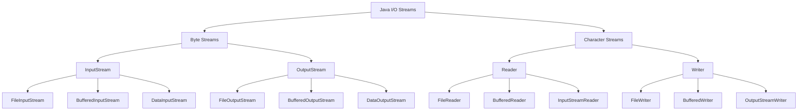

# Tutorial 21: Java I/O (Input/Output)

> **Master Java I/O - from byte streams to buffered I/O, with complete coverage of file operations and character encoding**

---

## 📋 Table of Contents

1. [Prerequisites](#prerequisites)
2. [Introduction to Java I/O](#introduction-to-java-io)
3. [I/O Stream Hierarchy](#io-stream-hierarchy)
4. [Byte Streams](#byte-streams)
5. [InputStream and OutputStream](#inputstream-and-outputstream)
6. [FileInputStream and FileOutputStream](#fileinputstream-and-fileoutputstream)
7. [Buffered Streams](#buffered-streams)
8. [Data Streams](#data-streams)
9. [File Class](#file-class)
10. [Character Streams](#character-streams)
11. [Reader and Writer](#reader-and-writer)
12. [FileReader and FileWriter](#filereader-and-filewriter)
13. [BufferedReader and BufferedWriter](#bufferedreader-and-bufferedwriter)
14. [Standard I/O Streams](#standard-io-streams)
15. [Reading from Console](#reading-from-console)
16. [Best Practices](#best-practices)
17. [Common Pitfalls](#common-pitfalls)
18. [Performance Optimization](#performance-optimization)
19. [Interview Preparation](#interview-preparation)
20. [Practice Exercises](#practice-exercises)
21. [Summary](#summary)
22. [Further Reading](#further-reading)
23. [Navigation](#navigation)
24. [Video Index](#video-index)

---

## Prerequisites

Before diving into Java I/O, you should be comfortable with:

- ✅ **Exception Handling** ([Tutorial 17](17_Exception_Handling.md)) - **Critical for I/O operations**
- ✅ **Classes and Objects** ([Tutorial 07](07_Classes_and_Objects.md))
- ✅ **Strings** ([Tutorial 12](12_Strings.md))
- ✅ **Arrays** ([Tutorial 11](11_Arrays.md))

---

## Introduction to Java I/O

**Java I/O (Input/Output)** is used to process input and produce output. Java uses the concept of **streams** to make I/O operations fast and efficient.

### 🎯 What is a Stream?

A **stream** is a sequence of data. In Java, a stream is composed of bytes or characters.

```
Input Stream:  Data Source → Program
Output Stream: Program → Data Destination
```

### 📊 Types of Streams



### 📝 Byte Streams vs Character Streams

| Feature          | Byte Streams               | Character Streams          |
|------------------|----------------------------|----------------------------|
| **Data Unit**    | 8-bit bytes                | 16-bit Unicode characters  |
| **Use Case**     | Binary data, images, audio | Text data                  |
| **Encoding**     | No character encoding      | Handles character encoding |
| **Base Classes** | InputStream, OutputStream  | Reader, Writer             |
| **Performance**  | Faster for binary          | Better for text            |

---

## I/O Stream Hierarchy

### 📌 Byte Stream Hierarchy

```
java.io.InputStream
    ├── FileInputStream
    ├── FilterInputStream
    │   ├── BufferedInputStream
    │   ├── DataInputStream
    │   └── PushbackInputStream
    ├── ObjectInputStream
    └── ByteArrayInputStream

java.io.OutputStream
    ├── FileOutputStream
    ├── FilterOutputStream
    │   ├── BufferedOutputStream
    │   ├── DataOutputStream
    │   └── PrintStream
    ├── ObjectOutputStream
    └── ByteArrayOutputStream
```

### 📌 Character Stream Hierarchy

```
java.io.Reader
    ├── InputStreamReader
    │   └── FileReader
    ├── BufferedReader
    ├── CharArrayReader
    └── StringReader

java.io.Writer
    ├── OutputStreamWriter
    │   └── FileWriter
    ├── BufferedWriter
    ├── CharArrayWriter
    ├── StringWriter
    └── PrintWriter
```

---

## Byte Streams

**Byte streams** are used to perform input and output of 8-bit bytes. All byte stream classes descend from `InputStream` and `OutputStream`.

### 🎯 When to Use Byte Streams

- ✅ Reading/writing binary files (images, audio, video)
- ✅ Network sockets
- ✅ Low-level file operations
- ✅ When character encoding is not a concern

---

## InputStream and OutputStream

### 📌 InputStream (Abstract Class)

```java
public abstract class InputStream implements Closeable {

  // Read single byte
  public abstract int read() throws IOException;

  // Read bytes into array
  public int read(byte[] b) throws IOException;

  public int read(byte[] b, int off, int len) throws IOException;

  // Skip bytes
  public long skip(long n) throws IOException;

  // Available bytes
  public int available() throws IOException;

  // Mark and reset
  public void mark(int readlimit);

  public void reset() throws IOException;

  public boolean markSupported();

  // Close stream
  public void close() throws IOException;
}
```

### 📌 OutputStream (Abstract Class)

```java
public abstract class OutputStream implements Closeable, Flushable {

  // Write single byte
  public abstract void write(int b) throws IOException;

  // Write byte array
  public void write(byte[] b) throws IOException;

  public void write(byte[] b, int off, int len) throws IOException;

  // Flush buffer
  public void flush() throws IOException;

  // Close stream
  public void close() throws IOException;
}
```

---

## FileInputStream and FileOutputStream

### 📌 FileInputStream

**FileInputStream** reads bytes from a file in the file system.

### 💻 Example 1: Reading Single Byte

```java
import java.io.*;

public class FileInputStreamSingleByte {

  public static void main(String[] args) {

    FileInputStream fis = null;
    try {
      fis = new FileInputStream("input.txt");

      int data;
      while ((data = fis.read()) != -1) {
        System.out.print((char) data);
      }
    } catch (FileNotFoundException e) {
      System.out.println("File not found: " + e.getMessage());
    } catch (IOException e) {
      System.out.println("Error reading file: " + e.getMessage());
    } finally {
      try {
        if (fis != null) {
          fis.close();
        }
      } catch (IOException e) {
        System.out.println("Error closing file: " + e.getMessage());
      }
    }
  }
}
```

### 💻 Example 2: Reading Byte Array

```java
import java.io.*;

public class FileInputStreamByteArray {

  public static void main(String[] args) {

    try (FileInputStream fis = new FileInputStream("input.txt")) {
      byte[] buffer = new byte[1024];
      int bytesRead;

      while ((bytesRead = fis.read(buffer)) != -1) {
        String data = new String(buffer, 0, bytesRead);
        System.out.print(data);
      }
    } catch (FileNotFoundException e) {
      System.out.println("File not found: " + e.getMessage());
    } catch (IOException e) {
      System.out.println("Error reading file: " + e.getMessage());
    }
  }
}
```

### 📌 FileOutputStream

**FileOutputStream** writes bytes to a file.

### 💻 Example 3: Writing to File

```java
import java.io.*;

public class FileOutputStreamExample {

  public static void main(String[] args) {

    String data = "Hello, World!\nWelcome to Java I/O.";

    try (FileOutputStream fos = new FileOutputStream("output.txt")) {
      // Convert string to bytes
      byte[] bytes = data.getBytes();

      // Write bytes to file
      fos.write(bytes);

      System.out.println("Data written to file successfully");
    } catch (IOException e) {
      System.out.println("Error writing to file: " + e.getMessage());
    }
  }
}
```

### 💻 Example 4: Append to File

```java
import java.io.*;

public class FileOutputStreamAppend {

  public static void main(String[] args) {

    String data = "\nAppending new line";

    // Second parameter 'true' enables append mode
    try (FileOutputStream fos = new FileOutputStream("output.txt", true)) {
      fos.write(data.getBytes());
      System.out.println("Data appended successfully");
    } catch (IOException e) {
      System.out.println("Error: " + e.getMessage());
    }
  }
}
```

### 💻 Example 5: Copy File

```java
import java.io.*;

public class CopyFile {

  public static void main(String[] args) {

    String sourceFile = "source.jpg";
    String destFile = "destination.jpg";

    try (FileInputStream fis = new FileInputStream(sourceFile);
      FileOutputStream fos = new FileOutputStream(destFile)) {

      byte[] buffer = new byte[1024];
      int bytesRead;

      while ((bytesRead = fis.read(buffer)) != -1) {
        fos.write(buffer, 0, bytesRead);
      }

      System.out.println("File copied successfully");
    } catch (IOException e) {
      System.out.println("Error: " + e.getMessage());
    }
  }
}
```

### ⚡ FileInputStream/FileOutputStream Methods

| Method            | Description             | Return Type      |
|-------------------|-------------------------|------------------|
| `read()`          | Reads single byte       | int (-1 if EOF)  |
| `read(byte[] b)`  | Reads bytes into array  | int (bytes read) |
| `write(int b)`    | Writes single byte      | void             |
| `write(byte[] b)` | Writes byte array       | void             |
| `available()`     | Returns available bytes | int              |
| `skip(long n)`    | Skips n bytes           | long             |
| `close()`         | Closes stream           | void             |

---

## Buffered Streams

**Buffered streams** use an internal buffer to reduce the number of physical I/O operations, significantly improving performance.

### 🎯 Why Use Buffered Streams?

```
Without Buffering:
Program → [OS I/O] → Disk (for every byte)
Slow: Multiple system calls

With Buffering:
Program → [Buffer] → [OS I/O] → Disk (when buffer full)
Fast: Fewer system calls
```

### 📌 BufferedInputStream

```java
import java.io.*;

public class BufferedInputStreamExample {

  public static void main(String[] args) {

    try (FileInputStream fis = new FileInputStream("input.txt");
      BufferedInputStream bis = new BufferedInputStream(fis)) {

      int data;
      while ((data = bis.read()) != -1) {
        System.out.print((char) data);
      }
    } catch (IOException e) {
      System.out.println("Error: " + e.getMessage());
    }
  }
}
```

### 📌 BufferedOutputStream

```java
import java.io.*;

public class BufferedOutputStreamExample {

  public static void main(String[] args) {

    String data = "Using BufferedOutputStream for better performance";

    try (FileOutputStream fos = new FileOutputStream("output.txt");
      BufferedOutputStream bos = new BufferedOutputStream(fos)) {

      byte[] bytes = data.getBytes();
      bos.write(bytes);

      // Flush buffer to ensure all data is written
      bos.flush();

      System.out.println("Data written successfully");
    } catch (IOException e) {
      System.out.println("Error: " + e.getMessage());
    }
  }
}
```

### 💻 Example: Performance Comparison

```java
import java.io.*;

public class BufferedVsUnbuffered {

  public static void main(String[] args) throws IOException {

    String sourceFile = "largefile.dat";

    // Test 1: Without buffering
    long startTime = System.currentTimeMillis();
    try (FileInputStream fis = new FileInputStream(sourceFile);
      FileOutputStream fos = new FileOutputStream("copy1.dat")) {

      int data;
      while ((data = fis.read()) != -1) {
        fos.write(data);
      }
    }
    long unbufferedTime = System.currentTimeMillis() - startTime;
    System.out.println("Unbuffered: " + unbufferedTime + " ms");

    // Test 2: With buffering
    startTime = System.currentTimeMillis();
    try (FileInputStream fis = new FileInputStream(sourceFile);
      BufferedInputStream bis = new BufferedInputStream(fis);
      FileOutputStream fos = new FileOutputStream("copy2.dat");
      BufferedOutputStream bos = new BufferedOutputStream(fos)) {

      int data;
      while ((data = bis.read()) != -1) {
        bos.write(data);
      }
    }
    long bufferedTime = System.currentTimeMillis() - startTime;
    System.out.println("Buffered: " + bufferedTime + " ms");

    System.out.println("Speed improvement: " + (unbufferedTime / bufferedTime) + "x");
  }
}
```

### 📊 Buffered Stream Methods

| Method    | Description                                |
|-----------|--------------------------------------------|
| `flush()` | Writes buffered data to destination        |
| `read()`  | Reads from buffer (fills buffer if needed) |
| `write()` | Writes to buffer (flushes if full)         |

---

## Data Streams

**Data streams** support reading and writing of primitive Java data types in a machine-independent way.

### 📌 DataInputStream

```java
public class DataInputStream extends FilterInputStream implements DataInput {

  // Read primitive types
  boolean readBoolean() throws IOException;

  byte readByte() throws IOException;

  char readChar() throws IOException;

  short readShort() throws IOException;

  int readInt() throws IOException;

  long readLong() throws IOException;

  float readFloat() throws IOException;

  double readDouble() throws IOException;

  String readUTF() throws IOException;
}
```

### 📌 DataOutputStream

```java
public class DataOutputStream extends FilterOutputStream implements DataOutput {

  // Write primitive types
  void writeBoolean(boolean v) throws IOException;

  void writeByte(int v) throws IOException;

  void writeChar(int v) throws IOException;

  void writeShort(int v) throws IOException;

  void writeInt(int v) throws IOException;

  void writeLong(long v) throws IOException;

  void writeFloat(float v) throws IOException;

  void writeDouble(double v) throws IOException;

  void writeUTF(String str) throws IOException;
}
```

### 💻 Example: Data Streams Usage

```java
import java.io.*;

public class DataStreamsExample {

  public static void main(String[] args) {
    // Write data
    writeData();

    // Read data
    readData();
  }

  public static void writeData() {

    try (DataOutputStream dos = new DataOutputStream(
      new FileOutputStream("data.dat"))) {

      // Write different types
      dos.writeInt(42);
      dos.writeDouble(3.14159);
      dos.writeBoolean(true);
      dos.writeUTF("Hello, Data Streams!");

      System.out.println("Data written successfully");
    } catch (IOException e) {
      System.out.println("Error writing: " + e.getMessage());
    }
  }

  public static void readData() {

    try (DataInputStream dis = new DataInputStream(
      new FileInputStream("data.dat"))) {

      // Read in same order as written
      int intValue = dis.readInt();
      double doubleValue = dis.readDouble();
      boolean boolValue = dis.readBoolean();
      String strValue = dis.readUTF();

      System.out.println("Read data:");
      System.out.println("Int: " + intValue);
      System.out.println("Double: " + doubleValue);
      System.out.println("Boolean: " + boolValue);
      System.out.println("String: " + strValue);
    } catch (IOException e) {
      System.out.println("Error reading: " + e.getMessage());
    }
  }
}
```

**Output:**

```
Data written successfully
Read data:
Int: 42
Double: 3.14159
Boolean: true
String: Hello, Data Streams!
```

### ⚠️ Important Notes

- **Read in Same Order**: Data must be read in the same order it was written
- **Type Matching**: Use matching read/write methods
- **Binary Format**: Data is stored in binary format (not human-readable)
- **Platform Independent**: Can be read on any platform

---

## File Class

The **File** class represents file and directory pathnames and provides methods for file system operations.

### 💻 Example 1: File Information

```java
import java.io.*;

public class FileInformation {

  public static void main(String[] args) {

    File file = new File("example.txt");

    if (file.exists()) {
      System.out.println("File Information:");
      System.out.println("Name: " + file.getName());
      System.out.println("Path: " + file.getPath());
      System.out.println("Absolute Path: " + file.getAbsolutePath());
      System.out.println("Parent: " + file.getParent());
      System.out.println("Size: " + file.length() + " bytes");
      System.out.println("Is File: " + file.isFile());
      System.out.println("Is Directory: " + file.isDirectory());
      System.out.println("Can Read: " + file.canRead());
      System.out.println("Can Write: " + file.canWrite());
      System.out.println("Can Execute: " + file.canExecute());
      System.out.println("Is Hidden: " + file.isHidden());
      System.out.println("Last Modified: " + new java.util.Date(file.lastModified()));
    } else {
      System.out.println("File does not exist");
    }
  }
}
```

### 💻 Example 2: File Operations

```java
import java.io.*;

public class FileOperations {

  public static void main(String[] args) {
    // Create new file
    File file = new File("newfile.txt");
    try {
      if (file.createNewFile()) {
        System.out.println("File created: " + file.getName());
      } else {
        System.out.println("File already exists");
      }
    } catch (IOException e) {
      System.out.println("Error creating file: " + e.getMessage());
    }

    // Create directory
    File dir = new File("newdirectory");
    if (dir.mkdir()) {
      System.out.println("Directory created: " + dir.getName());
    }

    // Create nested directories
    File nestedDir = new File("parent/child/grandchild");
    if (nestedDir.mkdirs()) {
      System.out.println("Nested directories created");
    }

    // Rename file
    File oldFile = new File("oldname.txt");
    File newFile = new File("newname.txt");
    if (oldFile.renameTo(newFile)) {
      System.out.println("File renamed successfully");
    }

    // Delete file
    if (file.delete()) {
      System.out.println("File deleted: " + file.getName());
    }
  }
}
```

### 💻 Example 3: List Directory Contents

```java
import java.io.*;

public class ListDirectoryContents {

  public static void main(String[] args) {

    File dir = new File(".");

    // List all files and directories
    String[] contents = dir.list();
    if (contents != null) {
      System.out.println("Directory contents:");
      for (String name : contents) {
        System.out.println(name);
      }
    }

    // List with File objects
    File[] files = dir.listFiles();
    if (files != null) {
      System.out.println("\nDetailed listing:");
      for (File file : files) {
        String type = file.isDirectory() ? "[DIR]" : "[FILE]";
        System.out.println(type + " " + file.getName());
      }
    }

    // List only files with filter
    File[] txtFiles = dir.listFiles((d, name) -> name.endsWith(".txt"));
    if (txtFiles != null) {
      System.out.println("\nText files:");
      for (File file : txtFiles) {
        System.out.println(file.getName());
      }
    }
  }
}
```

### 📊 File Class Methods

| Method              | Description                | Return Type |
|---------------------|----------------------------|-------------|
| `exists()`          | Tests if file exists       | boolean     |
| `createNewFile()`   | Creates new empty file     | boolean     |
| `delete()`          | Deletes file/directory     | boolean     |
| `getName()`         | Returns file name          | String      |
| `getPath()`         | Returns pathname           | String      |
| `getAbsolutePath()` | Returns absolute pathname  | String      |
| `isFile()`          | Tests if file              | boolean     |
| `isDirectory()`     | Tests if directory         | boolean     |
| `length()`          | Returns file size          | long        |
| `lastModified()`    | Returns last modified time | long        |
| `mkdir()`           | Creates directory          | boolean     |
| `mkdirs()`          | Creates nested directories | boolean     |
| `list()`            | Lists directory contents   | String[]    |
| `listFiles()`       | Lists as File objects      | File[]      |

---

## Character Streams

**Character streams** are used to perform input and output for 16-bit Unicode characters. All character stream classes descend from `Reader` and `Writer`.

### 🎯 Why Use Character Streams?

- ✅ **Automatic character encoding**: Handles UTF-8, UTF-16, etc.
- ✅ **Internationalization**: Supports multiple languages
- ✅ **Text processing**: Better for text files
- ✅ **Line-oriented operations**: Easy line reading

### 📊 Character Encoding

```
Byte Stream:     [01101000] [01100101] (bytes)
                       ↓           ↓
Character Stream:    'h'         'e'      (characters)
                (with encoding: UTF-8, UTF-16, etc.)
```

---

## Reader and Writer

### 📌 Reader (Abstract Class)

```java
public abstract class Reader implements Readable, Closeable {

  // Read single character
  public int read() throws IOException;

  // Read characters into array
  public int read(char[] cbuf) throws IOException;

  public abstract int read(char[] cbuf, int off, int len) throws IOException;

  // Skip characters
  public long skip(long n) throws IOException;

  // Ready to read
  public boolean ready() throws IOException;

  // Mark and reset
  public void mark(int readAheadLimit) throws IOException;

  public void reset() throws IOException;

  public boolean markSupported();

  // Close
  public abstract void close() throws IOException;
}
```

### 📌 Writer (Abstract Class)

```java
public abstract class Writer implements Appendable, Closeable, Flushable {

  // Write single character
  public void write(int c) throws IOException;

  // Write character array
  public void write(char[] cbuf) throws IOException;

  public abstract void write(char[] cbuf, int off, int len) throws IOException;

  // Write string
  public void write(String str) throws IOException;

  public void write(String str, int off, int len) throws IOException;

  // Append
  public Writer append(CharSequence csq) throws IOException;

  // Flush and close
  public abstract void flush() throws IOException;

  public abstract void close() throws IOException;
}
```

---

## FileReader and FileWriter

### 📌 FileReader

**FileReader** reads character files using default character encoding.

### 💻 Example 1: Reading with FileReader

```java
import java.io.*;

public class FileReaderExample {

  public static void main(String[] args) {

    try (FileReader fr = new FileReader("input.txt")) {
      int data;
      while ((data = fr.read()) != -1) {
        System.out.print((char) data);
      }
    } catch (IOException e) {
      System.out.println("Error: " + e.getMessage());
    }
  }
}
```

### 📌 FileWriter

**FileWriter** writes character files.

### 💻 Example 2: Writing with FileWriter

```java
import java.io.*;

public class FileWriterExample {

  public static void main(String[] args) {

    String content = "Hello, FileWriter!\nSecond line here.";

    try (FileWriter fw = new FileWriter("output.txt")) {
      fw.write(content);
      System.out.println("Data written successfully");
    } catch (IOException e) {
      System.out.println("Error: " + e.getMessage());
    }
  }
}
```

### 💻 Example 3: Append Mode

```java
import java.io.*;

public class FileWriterAppend {

  public static void main(String[] args) {

    try (FileWriter fw = new FileWriter("output.txt", true)) {
      fw.write("\nAppended line");
      System.out.println("Data appended");
    } catch (IOException e) {
      System.out.println("Error: " + e.getMessage());
    }
  }
}
```

---

## BufferedReader and BufferedWriter

**Buffered character streams** provide efficient reading and writing of characters, arrays, and lines.

### 📌 BufferedReader

**BufferedReader** reads text from a character-input stream, buffering characters for efficient reading.

### 💻 Example 1: BufferedReader Basics

```java
import java.io.*;

public class BufferedReaderExample {

  public static void main(String[] args) {

    try (FileReader fr = new FileReader("input.txt");
      BufferedReader br = new BufferedReader(fr)) {

      String line;
      int lineNumber = 1;

      while ((line = br.readLine()) != null) {
        System.out.println(lineNumber + ": " + line);
        lineNumber++;
      }
    } catch (IOException e) {
      System.out.println("Error: " + e.getMessage());
    }
  }
}
```

### 💻 Example 2: Reading Large File Efficiently

```java
import java.io.*;

public class ReadLargeFile {

  public static void main(String[] args) {

    try (BufferedReader br = new BufferedReader(new FileReader("largefile.txt"))) {
      String line;
      long lineCount = 0;
      long wordCount = 0;
      long charCount = 0;

      while ((line = br.readLine()) != null) {
        lineCount++;
        charCount += line.length();

        // Count words
        String[] words = line.trim().split("\\s+");
        if (!line.trim().isEmpty()) {
          wordCount += words.length;
        }
      }

      System.out.println("Lines: " + lineCount);
      System.out.println("Words: " + wordCount);
      System.out.println("Characters: " + charCount);
    } catch (IOException e) {
      System.out.println("Error: " + e.getMessage());
    }
  }
}
```

### 📌 BufferedWriter

**BufferedWriter** writes text to a character-output stream, buffering characters for efficient writing.

### 💻 Example 3: BufferedWriter Usage

```java
import java.io.*;

public class BufferedWriterExample {

  public static void main(String[] args) {

    try (FileWriter fw = new FileWriter("output.txt");
      BufferedWriter bw = new BufferedWriter(fw)) {

      bw.write("First line");
      bw.newLine();  // Platform-independent line separator
      bw.write("Second line");
      bw.newLine();
      bw.write("Third line");

      System.out.println("Data written successfully");
    } catch (IOException e) {
      System.out.println("Error: " + e.getMessage());
    }
  }
}
```

### 💻 Example 4: Copy Text File

```java
import java.io.*;

public class CopyTextFile {

  public static void main(String[] args) {

    try (BufferedReader br = new BufferedReader(new FileReader("input.txt"));
      BufferedWriter bw = new BufferedWriter(new FileWriter("output.txt"))) {

      String line;
      while ((line = br.readLine()) != null) {
        bw.write(line);
        bw.newLine();
      }

      System.out.println("File copied successfully");
    } catch (IOException e) {
      System.out.println("Error: " + e.getMessage());
    }
  }
}
```

### 📊 BufferedReader/BufferedWriter Methods

| Method            | Description           | Return Type |
|-------------------|-----------------------|-------------|
| `readLine()`      | Reads line of text    | String      |
| `newLine()`       | Writes line separator | void        |
| `write(String s)` | Writes string         | void        |
| `flush()`         | Flushes buffer        | void        |
| `close()`         | Closes stream         | void        |

---

## Standard I/O Streams

Java provides three standard streams:

- **System.in** - Standard input stream (keyboard)
- **System.out** - Standard output stream (console)
- **System.err** - Standard error stream (console)

### 💻 Example: Using System Streams

```java
import java.io.*;

public class SystemStreamsExample {

  public static void main(String[] args) {
    // System.out - PrintStream
    System.out.println("Standard output");
    System.out.print("No newline");
    System.out.printf("Formatted: %d, %.2f%n", 42, 3.14);

    // System.err - PrintStream
    System.err.println("Error message");

    // System.in - InputStream
    try {
      System.out.print("Press Enter...");
      System.in.read();
    } catch (IOException e) {
      e.printStackTrace();
    }
  }
}
```

---

## Reading from Console

### 💻 Example 1: Reading with BufferedReader

```java
import java.io.*;

public class ConsoleInputBufferedReader {

  public static void main(String[] args) {

    BufferedReader reader = new BufferedReader(
      new InputStreamReader(System.in));

    try {
      System.out.print("Enter your name: ");
      String name = reader.readLine();

      System.out.print("Enter your age: ");
      int age = Integer.parseInt(reader.readLine());

      System.out.println("Hello, " + name + "! You are " + age + " years old.");
    } catch (IOException e) {
      System.out.println("Error reading input: " + e.getMessage());
    } catch (NumberFormatException e) {
      System.out.println("Invalid number format");
    }
  }
}
```

### 💻 Example 2: Reading with Scanner

```java
import java.util.Scanner;

public class ConsoleInputScanner {

  public static void main(String[] args) {

    Scanner scanner = new Scanner(System.in);

    System.out.print("Enter your name: ");
    String name = scanner.nextLine();

    System.out.print("Enter your age: ");
    int age = scanner.nextInt();

    System.out.println("Hello, " + name + "! You are " + age + " years old.");

    scanner.close();
  }
}
```

### 📊 Console Input Methods Comparison

| Method          | Scanner                 | BufferedReader        |
|-----------------|-------------------------|-----------------------|
| **Ease of Use** | Easy (parsing built-in) | Manual parsing needed |
| **Performance** | Slower                  | Faster                |
| **Type Safety** | Built-in                | Manual conversion     |
| **Buffering**   | Internal                | Yes                   |
| **Best For**    | Simple input            | High-performance      |

---

## Best Practices

### ✅ Use Try-with-Resources

```java
// ✅ GOOD - Auto-closes stream
try(FileReader fr = new FileReader("file.txt")){
  // Use fr
  }catch(
IOException e){
  e.

printStackTrace();
}

// ❌ BAD - Manual close required
FileReader fr = new FileReader("file.txt");
try{
  // Use fr
  }finally{
  fr.

close();  // May throw exception
}
```

### ✅ Use Buffered Streams for Performance

```java
// ✅ GOOD - Buffered for performance
try(BufferedReader br = new BufferedReader(new FileReader("file.txt"))){
String line;
    while((line =br.

readLine())!=null){
  // Process line
  }
  }

  // ❌ BAD - Unbuffered, slow
  try(
FileReader fr = new FileReader("file.txt")){
int c;
    while((c =fr.

read())!=-1){
  // Process character
  }
  }
```

### ✅ Choose Appropriate Stream Type

```java
// ✅ GOOD - Character stream for text
BufferedReader br = new BufferedReader(new FileReader("text.txt"));

// ❌ BAD - Byte stream for text (encoding issues)
FileInputStream fis = new FileInputStream("text.txt");

// ✅ GOOD - Byte stream for binary
FileInputStream fis = new FileInputStream("image.jpg");
```

### ✅ Specify Character Encoding

```java
// ✅ GOOD - Explicit encoding
try(FileReader fr = new FileReader("file.txt", StandardCharsets.UTF_8)){
  // Use fr
  }

  // ✅ BETTER - Using InputStreamReader
  try(
InputStreamReader isr = new InputStreamReader(
  new FileInputStream("file.txt"), StandardCharsets.UTF_8)){
  // Use isr
  }
```

### ✅ Handle Exceptions Properly

```java
// ✅ GOOD - Specific exception handling
try{
  // I/O operations
  }catch(FileNotFoundException e){
  System.err.

println("File not found: "+e.getMessage());
  }catch(
IOException e){
  System.err.

println("I/O error: "+e.getMessage());
  }
```

---

## Common Pitfalls

### ❌ Pitfall 1: Not Closing Streams

```java
// ❌ WRONG - Stream not closed if exception occurs
FileWriter fw = new FileWriter("file.txt");
fw.

write("data");
fw.

close();  // Won't execute if write() throws exception

// ✅ CORRECT - Use try-with-resources
try(
FileWriter fw = new FileWriter("file.txt")){
  fw.

write("data");
}
```

### ❌ Pitfall 2: Forgetting to Flush

```java
// ❌ WRONG - Data may not be written
BufferedWriter bw = new BufferedWriter(new FileWriter("file.txt"));
bw.

write("data");
bw.

close();  // What if close() throws exception?

// ✅ CORRECT - Explicit flush
try(
BufferedWriter bw = new BufferedWriter(new FileWriter("file.txt"))){
  bw.

write("data");
    bw.

flush();  // Ensure data is written
}
```

### ❌ Pitfall 3: Wrong Stream Type

```java
// ❌ WRONG - Byte stream for text
FileInputStream fis = new FileInputStream("text.txt");
int b;
while((b =fis.

read())!=-1){
  System.out.

print((char) b);  // Encoding issues!
  }

// ✅ CORRECT - Character stream for text
FileReader fr = new FileReader("text.txt");
int c;
while((c =fr.

read())!=-1){
  System.out.

print((char) c);
  }
```

### ❌ Pitfall 4: Reading Order Mismatch

```java
// Write data
DataOutputStream dos = new DataOutputStream(new FileOutputStream("data.dat"));
dos.

writeInt(42);
dos.

writeDouble(3.14);
dos.

close();

// ❌ WRONG - Reading in wrong order
DataInputStream dis = new DataInputStream(new FileInputStream("data.dat"));
double d = dis.readDouble();  // Should read int first!
int i = dis.readInt();

// ✅ CORRECT - Same order
DataInputStream dis = new DataInputStream(new FileInputStream("data.dat"));
int i = dis.readInt();
double d = dis.readDouble();
```

---

## Performance Optimization

### 🎯 Buffer Size Tuning

```java
// Default buffer size: 8192 bytes
BufferedInputStream bis = new BufferedInputStream(fis);

// Custom buffer size for large files
BufferedInputStream bis = new BufferedInputStream(fis, 65536);  // 64KB
```

### 🎯 Batch Operations

```java
// ❌ SLOW - Writing one byte at a time
for(byte b :data){
  fos.

write(b);
}

  // ✅ FAST - Writing in batches
  fos.

write(data);  // Write entire array
```

### 🎯 NIO for Large Files

```java
// For very large files, consider NIO

import java.nio.file.*;

// Copy file using NIO
Files.copy(Paths.get("source.txt"),Paths.

get("dest.txt"));

// Read all lines
List<String> lines = Files.readAllLines(Paths.get("file.txt"));
```

---

## Interview Preparation

### ❓ Question 1: What's the difference between byte streams and character streams?

**Answer:**

**Byte Streams:**

- Read/write 8-bit bytes
- Use InputStream/OutputStream
- For binary data (images, audio, video)
- No character encoding handling

**Character Streams:**

- Read/write 16-bit Unicode characters
- Use Reader/Writer
- For text data
- Handle character encoding automatically

**When to use:**

- Byte streams: Binary files, network sockets
- Character streams: Text files, internationalized applications

---

### ❓ Question 2: Why use buffered streams?

**Answer:**

Buffered streams improve performance by reducing the number of physical I/O operations:

**Without buffering:**

- Each read()/write() triggers a system call
- Slow due to OS overhead
- Example: 1000 reads = 1000 system calls

**With buffering:**

- Reads/writes happen to internal buffer
- Fewer system calls
- Example: 1000 reads = 10 system calls (with 100-byte buffer)

**Performance gain:** Often 10-100x faster

```java
// Unbuffered: ~1000ms for 100KB file
FileInputStream fis = new FileInputStream("file.dat");

// Buffered: ~10ms for same file
BufferedInputStream bis = new BufferedInputStream(fis);
```

---

### ❓ Question 3: Explain try-with-resources

**Answer:**

**try-with-resources** automatically closes resources that implement `AutoCloseable`:

**Syntax:**

```java
try(Resource1 r1 = new Resource1();
Resource2 r2 = new Resource2()){
  // Use resources
  } // Resources automatically closed
```

**Benefits:**

- No need for explicit close()
- No need for finally block
- Handles multiple resources
- Suppressed exceptions handled properly

**Example:**

```java
// Old way
FileReader fr = null;
try{
fr =new

FileReader("file.txt");
// Use fr
}finally{
  if(fr !=null){
  try{
  fr.

close();
        }catch(
IOException e){
  // Handle
  }
  }
  }

  // New way (Java 7+)
  try(
FileReader fr = new FileReader("file.txt")){
  // Use fr
  } // Automatically closed
```

---

### ❓ Question 4: What's the difference between flush() and close()?

**Answer:**

**flush():**

- Writes buffered data to destination
- Stream remains open
- Can continue writing after flush
- Useful for periodic data persistence

**close():**

- Calls flush() first
- Then closes the stream
- Releases system resources
- Cannot use stream after close

**Example:**

```java
BufferedWriter bw = new BufferedWriter(new FileWriter("file.txt"));

bw.

write("Line 1");
bw.

flush();  // Write to file, stream still open

bw.

write("Line 2");
bw.

close();  // Flush and close stream
```

---

### ❓ Question 5: How to handle large files efficiently?

**Answer:**

**Strategies:**

1. **Use Buffered Streams:**

```java
BufferedInputStream bis = new BufferedInputStream(fis, 65536);  // 64KB buffer
```

2. **Read in Chunks:**

```java
byte[] buffer = new byte[8192];
int bytesRead;
while((bytesRead =fis.

read(buffer))!=-1){
  // Process buffer
  }
```

3. **Use NIO for Very Large Files:**

```java
// Memory-mapped file
FileChannel channel = FileChannel.open(path);
MappedByteBuffer buffer = channel.map(FileChannel.MapMode.READ_ONLY, 0, channel.size());
```

4. **Stream Processing:**

```java
Files.lines(Paths.get("large.txt"))
  .

parallel()
     .

forEach(line ->

processLine(line));
```

---

## Practice Exercises

### 🏋️ Exercise 1: Count Lines, Words, Characters

**Problem:** Create a program that counts lines, words, and characters in a text file.

<details>
<summary><b>💡 Solution</b></summary>

```java
import java.io.*;

public class FileStats {

  public static void main(String[] args) {

    if (args.length < 1) {
      System.out.println("Usage: java FileStats <filename>");
      return;
    }

    String filename = args[0];

    try (BufferedReader br = new BufferedReader(new FileReader(filename))) {
      long lineCount = 0;
      long wordCount = 0;
      long charCount = 0;

      String line;
      while ((line = br.readLine()) != null) {
        lineCount++;
        charCount += line.length();

        String[] words = line.trim().split("\\s+");
        if (!line.trim().isEmpty()) {
          wordCount += words.length;
        }
      }

      System.out.println("File Statistics for: " + filename);
      System.out.println("Lines: " + lineCount);
      System.out.println("Words: " + wordCount);
      System.out.println("Characters: " + charCount);

    } catch (FileNotFoundException e) {
      System.err.println("File not found: " + filename);
    } catch (IOException e) {
      System.err.println("Error reading file: " + e.getMessage());
    }
  }
}
```

</details>

---

### 🏋️ Exercise 2: File Encryption/Decryption

**Problem:** Create a simple file encryption program using XOR cipher.

<details>
<summary><b>💡 Solution</b></summary>

```java
import java.io.*;

public class FileEncryption {

  private static final int KEY = 123;  // Simple XOR key

  public static void encryptFile(String inputFile, String outputFile) throws IOException {

    try (FileInputStream fis = new FileInputStream(inputFile);
      FileOutputStream fos = new FileOutputStream(outputFile)) {

      int data;
      while ((data = fis.read()) != -1) {
        fos.write(data ^ KEY);  // XOR encryption
      }

      System.out.println("File encrypted successfully");
    }
  }

  public static void decryptFile(String inputFile, String outputFile) throws IOException {
    // XOR is symmetric: encryption = decryption
    encryptFile(inputFile, outputFile);
    System.out.println("File decrypted successfully");
  }

  public static void main(String[] args) {

    try {
      // Encrypt
      encryptFile("original.txt", "encrypted.dat");

      // Decrypt
      decryptFile("encrypted.dat", "decrypted.txt");

    } catch (IOException e) {
      System.err.println("Error: " + e.getMessage());
    }
  }
}
```

</details>

---

## Summary

### 🎯 Key Takeaways

**Stream Types:**

- **Byte Streams**: InputStream/OutputStream for binary data
- **Character Streams**: Reader/Writer for text data

**Common Classes:**

- **FileInputStream/FileOutputStream**: Read/write binary files
- **FileReader/FileWriter**: Read/write text files
- **BufferedInputStream/BufferedOutputStream**: Buffered binary I/O
- **BufferedReader/BufferedWriter**: Buffered text I/O
- **DataInputStream/DataOutputStream**: Primitive data I/O

**Best Practices:**

- Use try-with-resources for automatic resource management
- Use buffered streams for better performance
- Choose appropriate stream type (byte vs character)
- Specify character encoding explicitly
- Handle exceptions properly
- Always flush buffered streams before closing

**Performance Tips:**

- Use buffered streams (8-10x faster)
- Read/write in chunks, not byte-by-byte
- Use appropriate buffer sizes
- Consider NIO for very large files

---

## Further Reading

### 📚 Official Documentation

- [Java I/O Tutorial](https://docs.oracle.com/javase/tutorial/essential/io/)
- [InputStream JavaDoc](https://docs.oracle.com/javase/8/docs/api/java/io/InputStream.html)
- [Reader JavaDoc](https://docs.oracle.com/javase/8/docs/api/java/io/Reader.html)
- [File JavaDoc](https://docs.oracle.com/javase/8/docs/api/java/io/File.html)

### 🔗 Related Topics

- Java NIO (New I/O) for advanced file operations
- Object Serialization (Tutorial 22)
- Network I/O and Sockets (Tutorial 23)

---

## Navigation

### ⬅️ Previous Tutorial

[Tutorial 20: Collections](20_Collections.md) - Master the Collections Framework

### ➡️ Next Tutorial

[Tutorial 22: Serialization and Deserialization](22_Serialization_and_Deserialization.md) - Object persistence

### 🏠 Return to Index

[RBR Java Tutorial Suite](README.md) - Complete tutorial collection

---

## Video Index

This tutorial covers **RBR Java Playlist Videos 241-274** (34 videos):

### Introduction to Java I/O (Video 241)

- 241: Introduction to Java IO

### Byte Streams (Videos 242-249)

- 242: Byte Streams
- 243: InputStream
- 244: FileInputStream class
- 245: Reading Single Byte
- 246: OutputStream
- 247: FileOutputStream
- 248: Example on FileOutputStream
- 249: Example 2 on FileOutputStream

### Filter Streams (Videos 250-254)

- 250: Filter streams
- 251: BufferedInputStream
- 252: BufferedInputStream Methods
- 253: BufferedOutputStream
- 254: Example on BufferedOutputStream

### Data Streams (Videos 255-259)

- 255: Data Streams
- 256: DataInputStream
- 257: DataInputStream methods
- 258: DataOutputStream
- 259: Example on DataStreams

### File Class (Video 260)

- 260: File

### Character Streams (Videos 261-273)

- 261: Character streams
- 262: Reader
- 263: Writer
- 264: InputStreamReader introduction
- 265: InputStreamReader
- 266: FileReader
- 267: FileWriter
- 268: BufferedReader
- 269: BufferedReader methods
- 270: Example on BufferedReader
- 271: BufferedWriter
- 272: BufferedWriter methods
- 273: Standard I/O streams
- 274: Reading data from console

---

**🎉 Congratulations!** You've completed the Java I/O tutorial. You now understand how to efficiently read and write data using Java's I/O framework!

**Next Steps:**

1. Practice with the exercises
2. Experiment with different stream types
3. Move on to [Tutorial 22: Serialization and Deserialization](22_Serialization_and_Deserialization.md)

---

**[⬆ Back to Top](#tutorial-21-java-io-inputoutput)**

---

*Tutorial 21 of 25 | RBR Java Complete Tutorial Suite*  
*34 videos | Comprehensive Java I/O Coverage*  
*Last Updated: November 2025*
