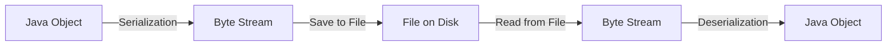

# Tutorial 22: Serialization and Deserialization

> **Master Object Persistence - Learn how to save and restore Java objects to/from files**

---

## 📋 Table of Contents

1. [Prerequisites](#prerequisites)
2. [Introduction to Serialization](#introduction-to-serialization)
3. [Serialization Basics](#serialization-basics)
4. [Deserialization](#deserialization)
5. [Serializable Interface](#serializable-interface)
6. [Transient Keyword](#transient-keyword)
7. [Serialization with Inheritance](#serialization-with-inheritance)
8. [Serial Version UID](#serial-version-uid)
9. [Custom Serialization](#custom-serialization)
10. [Best Practices](#best-practices)
11. [Common Pitfalls](#common-pitfalls)
12. [Interview Preparation](#interview-preparation)
13. [Practice Exercises](#practice-exercises)
14. [Summary](#summary)
15. [Further Reading](#further-reading)
16. [Navigation](#navigation)
17. [Video Index](#video-index)

---

## Prerequisites

Before diving into Serialization, you should be comfortable with:

- ✅ **Java I/O** ([Tutorial 21](21_Java_IO.md)) - **Critical for serialization**
- ✅ **Exception Handling** ([Tutorial 17](17_Exception_Handling.md))
- ✅ **Classes and Objects** ([Tutorial 07](07_Classes_and_Objects.md))
- ✅ **Inheritance** ([Tutorial 10](10_Object_Oriented_Concepts.md))

---

## Introduction to Serialization

**Serialization** is the process of converting an object's state into a byte stream, which can be saved to a file, database, or transmitted over a network. **Deserialization** is the reverse process of reconstructing the object from the byte stream.

### 🎯 Why Serialization?

- ✅ **Persistence**: Save objects to disk
- ✅ **Communication**: Send objects over network
- ✅ **Deep Copying**: Clone complex objects
- ✅ **Caching**: Store object state
- ✅ **Session Management**: Save user sessions in web apps

### 📊 Serialization Process



### 📝 Real-World Use Cases

```java
// Example scenarios:
1. Saving game state
2. Caching frequently accessed objects
3. Storing user preferences
4. Remote Method Invocation (RMI)
5. Distributed computing
6. Deep cloning objects
```

---

## Serialization Basics

### 📌 Making a Class Serializable

To make a class serializable, implement the `Serializable` interface:

```java
import java.io.Serializable;

public class Student implements Serializable {
    private int id;
    private String name;
    private int age;
    
    public Student(int id, String name, int age) {
        this.id = id;
        this.name = name;
        this.age = age;
    }
    
    // Getters and setters
    public int getId() { return id; }
    public String getName() { return name; }
    public int getAge() { return age; }
    
    @Override
    public String toString() {
        return "Student[id=" + id + ", name=" + name + ", age=" + age + "]";
    }
}
```

### 💻 Example 1: Basic Serialization

```java
import java.io.*;

public class SerializationExample {
    public static void main(String[] args) {
        Student student = new Student(101, "Alice", 20);
        
        // Serialize object to file
        try (FileOutputStream fos = new FileOutputStream("student.ser");
             ObjectOutputStream oos = new ObjectOutputStream(fos)) {
            
            oos.writeObject(student);
            System.out.println("Object serialized successfully");
            System.out.println("Serialized: " + student);
            
        } catch (IOException e) {
            System.out.println("Error during serialization: " + e.getMessage());
        }
    }
}
```

**Output:**
```
Object serialized successfully
Serialized: Student[id=101, name=Alice, age=20]
```

### 📊 Serialization Classes

| Class | Purpose |
|-------|---------|
| `ObjectOutputStream` | Writes objects to output stream |
| `ObjectInputStream` | Reads objects from input stream |
| `Serializable` | Marker interface for serializability |

---

## Deserialization

**Deserialization** is the process of reading the serialized object from a file and reconstructing it in memory.

### 💻 Example 2: Basic Deserialization

```java
import java.io.*;

public class DeserializationExample {
    public static void main(String[] args) {
        // Deserialize object from file
        try (FileInputStream fis = new FileInputStream("student.ser");
             ObjectInputStream ois = new ObjectInputStream(fis)) {
            
            Student student = (Student) ois.readObject();
            System.out.println("Object deserialized successfully");
            System.out.println("Deserialized: " + student);
            
        } catch (IOException e) {
            System.out.println("Error during deserialization: " + e.getMessage());
        } catch (ClassNotFoundException e) {
            System.out.println("Class not found: " + e.getMessage());
        }
    }
}
```

**Output:**
```
Object deserialized successfully
Deserialized: Student[id=101, name=Alice, age=20]
```

### 💻 Example 3: Complete Serialization-Deserialization

```java
import java.io.*;

class Employee implements Serializable {
    private int empId;
    private String name;
    private double salary;
    
    public Employee(int empId, String name, double salary) {
        this.empId = empId;
        this.name = name;
        this.salary = salary;
    }
    
    @Override
    public String toString() {
        return String.format("Employee[id=%d, name=%s, salary=%.2f]", 
                           empId, name, salary);
    }
}

public class CompleteSerializationDemo {
    public static void main(String[] args) {
        Employee emp = new Employee(1001, "John Doe", 75000.00);
        
        // Serialize
        try (ObjectOutputStream oos = new ObjectOutputStream(
                new FileOutputStream("employee.ser"))) {
            oos.writeObject(emp);
            System.out.println("Serialized: " + emp);
        } catch (IOException e) {
            e.printStackTrace();
        }
        
        // Deserialize
        try (ObjectInputStream ois = new ObjectInputStream(
                new FileInputStream("employee.ser"))) {
            Employee deserializedEmp = (Employee) ois.readObject();
            System.out.println("Deserialized: " + deserializedEmp);
        } catch (IOException | ClassNotFoundException e) {
            e.printStackTrace();
        }
    }
}
```

**Output:**
```
Serialized: Employee[id=1001, name=John Doe, salary=75000.00]
Deserialized: Employee[id=1001, name=John Doe, salary=75000.00]
```

---

## Serializable Interface

The `Serializable` interface is a **marker interface** (no methods to implement). It signals to the JVM that the class can be serialized.

### 📝 Key Points

```java
public interface Serializable {
    // No methods - marker interface
}
```

**Requirements:**
- Class must implement `Serializable`
- All instance variables must be serializable
- Static variables are NOT serialized
- Transient variables are NOT serialized

### 💻 Example 4: Serializing Multiple Objects

```java
import java.io.*;
import java.util.*;

public class SerializeMultipleObjects {
    public static void main(String[] args) {
        List<Student> students = new ArrayList<>();
        students.add(new Student(101, "Alice", 20));
        students.add(new Student(102, "Bob", 21));
        students.add(new Student(103, "Charlie", 22));
        
        // Serialize list
        try (ObjectOutputStream oos = new ObjectOutputStream(
                new FileOutputStream("students.ser"))) {
            oos.writeObject(students);
            System.out.println("List serialized: " + students.size() + " students");
        } catch (IOException e) {
            e.printStackTrace();
        }
        
        // Deserialize list
        try (ObjectInputStream ois = new ObjectInputStream(
                new FileInputStream("students.ser"))) {
            @SuppressWarnings("unchecked")
            List<Student> deserializedStudents = (List<Student>) ois.readObject();
            System.out.println("List deserialized: " + deserializedStudents.size() + " students");
            
            for (Student s : deserializedStudents) {
                System.out.println(s);
            }
        } catch (IOException | ClassNotFoundException e) {
            e.printStackTrace();
        }
    }
}
```

**Output:**
```
List serialized: 3 students
List deserialized: 3 students
Student[id=101, name=Alice, age=20]
Student[id=102, name=Bob, age=21]
Student[id=103, name=Charlie, age=22]
```

---

## Transient Keyword

The **transient** keyword indicates that a field should NOT be serialized.

### 🎯 When to Use Transient

- ✅ Sensitive data (passwords, credit cards)
- ✅ Derived/calculated fields
- ✅ Cache or temporary data
- ✅ Non-serializable references

### 💻 Example 5: Transient Fields

```java
import java.io.*;

class User implements Serializable {
    private int userId;
    private String username;
    private transient String password;  // Not serialized
    private transient int loginCount;    // Not serialized
    
    public User(int userId, String username, String password) {
        this.userId = userId;
        this.username = username;
        this.password = password;
        this.loginCount = 0;
    }
    
    public void incrementLogin() {
        loginCount++;
    }
    
    @Override
    public String toString() {
        return String.format("User[id=%d, username=%s, password=%s, logins=%d]",
                           userId, username, password, loginCount);
    }
}

public class TransientExample {
    public static void main(String[] args) {
        User user = new User(1, "alice", "secret123");
        user.incrementLogin();
        user.incrementLogin();
        
        System.out.println("Before serialization: " + user);
        
        // Serialize
        try (ObjectOutputStream oos = new ObjectOutputStream(
                new FileOutputStream("user.ser"))) {
            oos.writeObject(user);
        } catch (IOException e) {
            e.printStackTrace();
        }
        
        // Deserialize
        try (ObjectInputStream ois = new ObjectInputStream(
                new FileInputStream("user.ser"))) {
            User deserializedUser = (User) ois.readObject();
            System.out.println("After deserialization: " + deserializedUser);
        } catch (IOException | ClassNotFoundException e) {
            e.printStackTrace();
        }
    }
}
```

**Output:**
```
Before serialization: User[id=1, username=alice, password=secret123, logins=2]
After deserialization: User[id=1, username=alice, password=null, logins=0]
```

**Note:** Transient fields are set to their default values (null for objects, 0 for primitives) after deserialization.

---

## Serialization with Inheritance

### 🎯 Inheritance Rules

1. **If parent is Serializable**, all children are automatically serializable
2. **If parent is NOT Serializable**, parent fields are not serialized
3. **Parent's no-arg constructor** is called during deserialization if parent is not serializable

### 💻 Example 6: Serializable Parent

```java
import java.io.*;

class Animal implements Serializable {
    protected String species;
    
    public Animal(String species) {
        this.species = species;
    }
}

class Dog extends Animal {
    private String breed;
    private int age;
    
    public Dog(String species, String breed, int age) {
        super(species);
        this.breed = breed;
        this.age = age;
    }
    
    @Override
    public String toString() {
        return String.format("Dog[species=%s, breed=%s, age=%d]", 
                           species, breed, age);
    }
}

public class SerializableParentExample {
    public static void main(String[] args) {
        Dog dog = new Dog("Canis familiaris", "Golden Retriever", 3);
        
        System.out.println("Before serialization: " + dog);
        
        // Serialize
        try (ObjectOutputStream oos = new ObjectOutputStream(
                new FileOutputStream("dog.ser"))) {
            oos.writeObject(dog);
        } catch (IOException e) {
            e.printStackTrace();
        }
        
        // Deserialize
        try (ObjectInputStream ois = new ObjectInputStream(
                new FileInputStream("dog.ser"))) {
            Dog deserializedDog = (Dog) ois.readObject();
            System.out.println("After deserialization: " + deserializedDog);
        } catch (IOException | ClassNotFoundException e) {
            e.printStackTrace();
        }
    }
}
```

**Output:**
```
Before serialization: Dog[species=Canis familiaris, breed=Golden Retriever, age=3]
After deserialization: Dog[species=Canis familiaris, breed=Golden Retriever, age=3]
```

### 💻 Example 7: Non-Serializable Parent

```java
import java.io.*;

class Vehicle {  // NOT Serializable
    protected String manufacturer;
    
    public Vehicle() {
        this.manufacturer = "Unknown";
        System.out.println("Vehicle no-arg constructor called");
    }
    
    public Vehicle(String manufacturer) {
        this.manufacturer = manufacturer;
    }
}

class Car extends Vehicle implements Serializable {
    private String model;
    private int year;
    
    public Car(String manufacturer, String model, int year) {
        super(manufacturer);
        this.model = model;
        this.year = year;
    }
    
    @Override
    public String toString() {
        return String.format("Car[manufacturer=%s, model=%s, year=%d]",
                           manufacturer, model, year);
    }
}

public class NonSerializableParentExample {
    public static void main(String[] args) {
        Car car = new Car("Toyota", "Camry", 2023);
        
        System.out.println("Before serialization: " + car);
        
        // Serialize
        try (ObjectOutputStream oos = new ObjectOutputStream(
                new FileOutputStream("car.ser"))) {
            oos.writeObject(car);
        } catch (IOException e) {
            e.printStackTrace();
        }
        
        // Deserialize
        try (ObjectInputStream ois = new ObjectInputStream(
                new FileInputStream("car.ser"))) {
            Car deserializedCar = (Car) ois.readObject();
            System.out.println("After deserialization: " + deserializedCar);
        } catch (IOException | ClassNotFoundException e) {
            e.printStackTrace();
        }
    }
}
```

**Output:**
```
Before serialization: Car[manufacturer=Toyota, model=Camry, year=2023]
Vehicle no-arg constructor called
After deserialization: Car[manufacturer=Unknown, model=Camry, year=2023]
```

**Important:** Parent's no-arg constructor is called, resetting `manufacturer` to "Unknown".

---

## Serial Version UID

The **serialVersionUID** is a unique identifier for each Serializable class. It's used during deserialization to verify that sender and receiver are compatible.

### 🎯 Why serialVersionUID?

```
Without serialVersionUID:
1. Serialize object with class version 1
2. Modify class (add/remove field)
3. Try to deserialize → InvalidClassException!

With explicit serialVersionUID:
1. Serialize object
2. Modify class (but keep serialVersionUID same)
3. Deserialize successfully (with version control)
```

### 💻 Example 8: serialVersionUID

```java
import java.io.*;

class Product implements Serializable {
    // Explicit serialVersionUID
    private static final long serialVersionUID = 1L;
    
    private int productId;
    private String name;
    private double price;
    
    public Product(int productId, String name, double price) {
        this.productId = productId;
        this.name = name;
        this.price = price;
    }
    
    @Override
    public String toString() {
        return String.format("Product[id=%d, name=%s, price=%.2f]",
                           productId, name, price);
    }
}

public class SerialVersionUIDExample {
    public static void main(String[] args) {
        Product product = new Product(1, "Laptop", 999.99);
        
        // Serialize
        try (ObjectOutputStream oos = new ObjectOutputStream(
                new FileOutputStream("product.ser"))) {
            oos.writeObject(product);
            System.out.println("Serialized: " + product);
        } catch (IOException e) {
            e.printStackTrace();
        }
        
        // Deserialize
        try (ObjectInputStream ois = new ObjectInputStream(
                new FileInputStream("product.ser"))) {
            Product deserializedProduct = (Product) ois.readObject();
            System.out.println("Deserialized: " + deserializedProduct);
        } catch (IOException | ClassNotFoundException e) {
            e.printStackTrace();
        }
    }
}
```

### 📊 serialVersionUID Best Practices

| Practice | Description |
|----------|-------------|
| **Always declare it** | `private static final long serialVersionUID = 1L;` |
| **Increment on incompatible changes** | Change version when breaking compatibility |
| **Keep same for compatible changes** | Adding methods is usually compatible |
| **Use IDE to generate** | IntelliJ/Eclipse can auto-generate |

---

## Custom Serialization

You can customize serialization by implementing `writeObject()` and `readObject()` methods.

### 💻 Example 9: Custom Serialization

```java
import java.io.*;

class SecureData implements Serializable {
    private static final long serialVersionUID = 1L;
    
    private String username;
    private transient String password;  // Don't serialize directly
    
    public SecureData(String username, String password) {
        this.username = username;
        this.password = password;
    }
    
    // Custom serialization
    private void writeObject(ObjectOutputStream oos) throws IOException {
        oos.defaultWriteObject();  // Serialize non-transient fields
        
        // Encrypt password before serializing
        String encryptedPassword = encrypt(password);
        oos.writeObject(encryptedPassword);
    }
    
    // Custom deserialization
    private void readObject(ObjectInputStream ois) 
            throws IOException, ClassNotFoundException {
        ois.defaultReadObject();  // Deserialize non-transient fields
        
        // Decrypt password after deserializing
        String encryptedPassword = (String) ois.readObject();
        password = decrypt(encryptedPassword);
    }
    
    private String encrypt(String data) {
        // Simple XOR encryption (for demo only!)
        StringBuilder encrypted = new StringBuilder();
        for (char c : data.toCharArray()) {
            encrypted.append((char) (c ^ 42));
        }
        return encrypted.toString();
    }
    
    private String decrypt(String data) {
        // XOR decryption (symmetric)
        return encrypt(data);
    }
    
    @Override
    public String toString() {
        return String.format("SecureData[username=%s, password=%s]",
                           username, password);
    }
}

public class CustomSerializationExample {
    public static void main(String[] args) {
        SecureData data = new SecureData("alice", "mySecret123");
        
        System.out.println("Before serialization: " + data);
        
        // Serialize
        try (ObjectOutputStream oos = new ObjectOutputStream(
                new FileOutputStream("secure.ser"))) {
            oos.writeObject(data);
        } catch (IOException e) {
            e.printStackTrace();
        }
        
        // Deserialize
        try (ObjectInputStream ois = new ObjectInputStream(
                new FileInputStream("secure.ser"))) {
            SecureData deserializedData = (SecureData) ois.readObject();
            System.out.println("After deserialization: " + deserializedData);
        } catch (IOException | ClassNotFoundException e) {
            e.printStackTrace();
        }
    }
}
```

**Output:**
```
Before serialization: SecureData[username=alice, password=mySecret123]
After deserialization: SecureData[username=alice, password=mySecret123]
```

---

## Best Practices

### ✅ Always Declare serialVersionUID

```java
// ✅ GOOD - Explicit version control
class MyClass implements Serializable {
    private static final long serialVersionUID = 1L;
    // ...
}

// ❌ BAD - Auto-generated (changes with class modifications)
class MyClass implements Serializable {
    // No serialVersionUID
}
```

### ✅ Use Transient for Sensitive Data

```java
// ✅ GOOD - Don't serialize sensitive data
class User implements Serializable {
    private String username;
    private transient String password;
    private transient String creditCard;
}
```

### ✅ Validate Deserialized Data

```java
// ✅ GOOD - Validate after deserialization
private void readObject(ObjectInputStream ois) 
        throws IOException, ClassNotFoundException {
    ois.defaultReadObject();
    
    // Validation
    if (age < 0 || age > 150) {
        throw new InvalidObjectException("Invalid age: " + age);
    }
}
```

### ✅ Handle Evolution Carefully

```java
// ✅ GOOD - Provide defaults for new fields
class Person implements Serializable {
    private static final long serialVersionUID = 2L;  // Incremented
    
    private String name;
    private int age = 0;  // Default value
    private String email = "";  // New field with default
}
```

---

## Common Pitfalls

### ❌ Pitfall 1: Serializing Non-Serializable Objects

```java
// ❌ WRONG - Thread is not serializable
class Task implements Serializable {
    private Thread worker;  // NotSerializableException!
}

// ✅ CORRECT - Mark as transient
class Task implements Serializable {
    private transient Thread worker;
}
```

### ❌ Pitfall 2: Missing serialVersionUID

```java
// ❌ WRONG - No version control
class Data implements Serializable {
    private int value;
}
// Modifying class breaks deserialization!

// ✅ CORRECT - Explicit version
class Data implements Serializable {
    private static final long serialVersionUID = 1L;
    private int value;
}
```

### ❌ Pitfall 3: Forgetting Parent's No-Arg Constructor

```java
// ❌ WRONG - No no-arg constructor
class Parent {
    private String name;
    public Parent(String name) { this.name = name; }
}

class Child extends Parent implements Serializable {
    // Deserialization will fail!
}

// ✅ CORRECT - Add no-arg constructor
class Parent {
    private String name;
    public Parent() { this.name = "default"; }
    public Parent(String name) { this.name = name; }
}
```

---

## Interview Preparation

### ❓ Question 1: What is Serialization?

**Answer:**

**Serialization** is the process of converting an object into a byte stream for:
- Saving to file
- Sending over network
- Caching in memory

**Requirements:**
- Class must implement `Serializable`
- All fields must be serializable (or transient)
- Use `ObjectOutputStream` to serialize

**Example:**
```java
ObjectOutputStream oos = new ObjectOutputStream(new FileOutputStream("file.ser"));
oos.writeObject(myObject);
```

---

### ❓ Question 2: What is the purpose of serialVersionUID?

**Answer:**

`serialVersionUID` is a unique identifier for each Serializable class used to verify version compatibility during deserialization.

**Purpose:**
- Version control for serialized objects
- Prevents `InvalidClassException`
- Allows backward compatibility

**Best Practice:**
```java
private static final long serialVersionUID = 1L;
```

**When to change:**
- Incompatible changes (removing fields, changing types)

**When to keep same:**
- Compatible changes (adding fields, adding methods)

---

### ❓ Question 3: What is the difference between Serializable and Externalizable?

**Answer:**

| Feature | Serializable | Externalizable |
|---------|-------------|----------------|
| **Interface** | Marker (no methods) | Has methods |
| **Control** | Automatic | Manual |
| **Performance** | Slower | Faster |
| **Complexity** | Simple | Complex |
| **Methods** | None | `writeExternal()`, `readExternal()` |

**Serializable:**
```java
class MyClass implements Serializable {
    // Automatic serialization
}
```

**Externalizable:**
```java
class MyClass implements Externalizable {
    public void writeExternal(ObjectOutput out) throws IOException {
        // Manual write
    }
    
    public void readExternal(ObjectInput in) throws IOException {
        // Manual read
    }
}
```

---

### ❓ Question 4: What happens to static and transient fields during serialization?

**Answer:**

**Static Fields:**
- NOT serialized (belong to class, not object)
- Value not saved to file
- After deserialization, gets current static value

**Transient Fields:**
- NOT serialized (marked to skip)
- Reset to default values after deserialization
  - Objects → null
  - Primitives → 0, false, etc.

**Example:**
```java
class Example implements Serializable {
    private static int staticField = 10;  // Not serialized
    private transient String transientField = "secret";  // Not serialized
    private String normalField = "data";  // Serialized
}

// After deserialization:
// staticField = current static value
// transientField = null
// normalField = "data"
```

---

### ❓ Question 5: How to prevent a class from being serialized?

**Answer:**

**Methods:**

1. **Don't implement Serializable**
2. **Throw exception in writeObject():**
```java
private void writeObject(ObjectOutputStream oos) throws IOException {
    throw new NotSerializableException("This class cannot be serialized");
}
```

3. **Make all fields transient** (not practical)

**Use Case:** Security-sensitive classes that should never be persisted.

---

## Practice Exercises

### 🏋️ Exercise 1: Serialize ArrayList of Objects

**Problem:** Create a program to serialize and deserialize an ArrayList of custom objects.

<details>
<summary><b>💡 Solution</b></summary>

```java
import java.io.*;
import java.util.*;

class Book implements Serializable {
    private static final long serialVersionUID = 1L;
    private String title;
    private String author;
    private double price;
    
    public Book(String title, String author, double price) {
        this.title = title;
        this.author = author;
        this.price = price;
    }
    
    @Override
    public String toString() {
        return String.format("Book[title=%s, author=%s, price=%.2f]",
                           title, author, price);
    }
}

public class SerializeArrayListExample {
    public static void main(String[] args) {
        List<Book> library = new ArrayList<>();
        library.add(new Book("1984", "George Orwell", 15.99));
        library.add(new Book("To Kill a Mockingbird", "Harper Lee", 12.99));
        library.add(new Book("The Great Gatsby", "F. Scott Fitzgerald", 10.99));
        
        // Serialize
        try (ObjectOutputStream oos = new ObjectOutputStream(
                new FileOutputStream("library.ser"))) {
            oos.writeObject(library);
            System.out.println("Library serialized: " + library.size() + " books");
        } catch (IOException e) {
            e.printStackTrace();
        }
        
        // Deserialize
        try (ObjectInputStream ois = new ObjectInputStream(
                new FileInputStream("library.ser"))) {
            @SuppressWarnings("unchecked")
            List<Book> deserializedLibrary = (List<Book>) ois.readObject();
            System.out.println("Library deserialized: " + deserializedLibrary.size() + " books");
            deserializedLibrary.forEach(System.out::println);
        } catch (IOException | ClassNotFoundException e) {
            e.printStackTrace();
        }
    }
}
```

</details>

---

## Summary

### 🎯 Key Takeaways

**Serialization Basics:**
- Converts objects to byte streams
- Use `ObjectOutputStream` to serialize
- Use `ObjectInputStream` to deserialize
- Class must implement `Serializable`

**Key Concepts:**
- **serialVersionUID**: Version control identifier
- **transient**: Skip field during serialization
- **static**: Not serialized (class-level)
- **Inheritance**: Parent serializable → all children serializable

**Custom Serialization:**
- Implement `writeObject()` and `readObject()`
- For custom logic (encryption, validation)

**Best Practices:**
- Always declare `serialVersionUID`
- Use `transient` for sensitive data
- Validate deserialized data
- Handle class evolution carefully

---

## Further Reading

### 📚 Official Documentation

- [Java Serialization Specification](https://docs.oracle.com/javase/8/docs/platform/serialization/spec/serialTOC.html)
- [Serializable Interface](https://docs.oracle.com/javase/8/docs/api/java/io/Serializable.html)
- [ObjectOutputStream](https://docs.oracle.com/javase/8/docs/api/java/io/ObjectOutputStream.html)

### 🔗 Related Topics

- Object Cloning
- Java Persistence API (JPA)
- JSON/XML Serialization

---

## Navigation

### ⬅️ Previous Tutorial
[Tutorial 21: Java I/O](21_Java_IO.md) - Master input/output operations

### ➡️ Next Tutorial
[Tutorial 23: Socket Programming](23_Socket_Programming.md) - Network communication

### 🏠 Return to Index
[RBR Java Tutorial Suite](README.md) - Complete tutorial collection

---

## Video Index

This tutorial covers **RBR Java Playlist Videos 275-280** (6 videos):

### Serialization Fundamentals (Videos 275-277)
- 275: Serialization
- 276: Example on Serialization
- 277: Deserialization

### Advanced Serialization Topics (Videos 278-280)
- 278: transient keyword
- 279: How inheritance affects serialization
- 280: Importance of serial version UID

---

**🎉 Congratulations!** You've completed the Serialization tutorial. You now understand how to persist Java objects!

**Next Steps:**
1. Practice with the exercises
2. Experiment with custom serialization
3. Move on to [Tutorial 23: Socket Programming](23_Socket_Programming.md)

---

**[⬆ Back to Top](#tutorial-22-serialization-and-deserialization)**

---

*Tutorial 22 of 25 | RBR Java Complete Tutorial Suite*  
*6 videos | Comprehensive Serialization Coverage*  
*Last Updated: November 2025*
