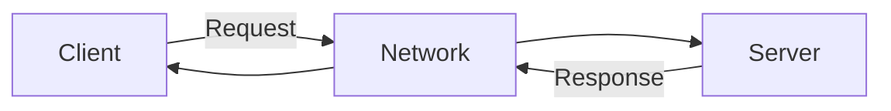

# Tutorial 23: Socket Programming

> **Master Network Communication - Learn client-server programming with TCP and UDP sockets**

---

## 📋 Table of Contents

1. [Prerequisites](#prerequisites)
2. [Introduction to Socket Programming](#introduction-to-socket-programming)
3. [TCP vs UDP](#tcp-vs-udp)
4. [TCP Socket Programming](#tcp-socket-programming)
5. [Creating TCP Server](#creating-tcp-server)
6. [Creating TCP Client](#creating-tcp-client)
7. [Multi-Client Server](#multi-client-server)
8. [UDP Socket Programming](#udp-socket-programming)
9. [Best Practices](#best-practices)
10. [Common Pitfalls](#common-pitfalls)
11. [Interview Preparation](#interview-preparation)
12. [Summary](#summary)
13. [Further Reading](#further-reading)
14. [Navigation](#navigation)
15. [Video Index](#video-index)

---

## Prerequisites

- ✅ **Java I/O** ([Tutorial 21](21_Java_IO.md))
- ✅ **Exception Handling** ([Tutorial 17](17_Exception_Handling.md))
- ✅ **Threads** ([Tutorial 16](16_Threads.md)) - For multi-client servers

---

## Introduction to Socket Programming

**Socket Programming** enables communication between two computers over a network using sockets.

### 🎯 What is a Socket?

A **socket** is an endpoint for sending or receiving data across a network.

```
Client Socket  ←→  Network  ←→  Server Socket
```

### 📊 Socket Communication Model



---

## TCP vs UDP

| Feature | TCP | UDP |
|---------|-----|-----|
| **Connection** | Connection-oriented | Connectionless |
| **Reliability** | Guaranteed delivery | No guarantee |
| **Speed** | Slower | Faster |
| **Order** | Maintains order | No order guarantee |
| **Use Case** | Web, Email, File transfer | Video streaming, Gaming |

---

## TCP Socket Programming

### 📌 Key Classes

- **Socket**: Client-side TCP socket
- **ServerSocket**: Server-side TCP socket listening for connections

---

## Creating TCP Server

### 💻 Example 1: Simple TCP Server

```java
import java.io.*;
import java.net.*;

public class SimpleTCPServer {
    public static void main(String[] args) {
        int port = 5000;
        
        try (ServerSocket serverSocket = new ServerSocket(port)) {
            System.out.println("Server started on port " + port);
            System.out.println("Waiting for client...");
            
            // Accept client connection
            Socket clientSocket = serverSocket.accept();
            System.out.println("Client connected: " + clientSocket.getInetAddress());
            
            // Create input/output streams
            BufferedReader in = new BufferedReader(
                new InputStreamReader(clientSocket.getInputStream()));
            PrintWriter out = new PrintWriter(
                clientSocket.getOutputStream(), true);
            
            // Read message from client
            String message = in.readLine();
            System.out.println("Received: " + message);
            
            // Send response to client
            out.println("Echo: " + message);
            
            clientSocket.close();
            
        } catch (IOException e) {
            System.out.println("Server error: " + e.getMessage());
        }
    }
}
```

---

## Creating TCP Client

### 💻 Example 2: Simple TCP Client

```java
import java.io.*;
import java.net.*;

public class SimpleTCPClient {
    public static void main(String[] args) {
        String host = "localhost";
        int port = 5000;
        
        try (Socket socket = new Socket(host, port)) {
            System.out.println("Connected to server");
            
            // Create input/output streams
            PrintWriter out = new PrintWriter(
                socket.getOutputStream(), true);
            BufferedReader in = new BufferedReader(
                new InputStreamReader(socket.getInputStream()));
            
            // Send message to server
            String message = "Hello Server!";
            out.println(message);
            System.out.println("Sent: " + message);
            
            // Read response from server
            String response = in.readLine();
            System.out.println("Received: " + response);
            
        } catch (IOException e) {
            System.out.println("Client error: " + e.getMessage());
        }
    }
}
```

---

## Multi-Client Server

### 💻 Example 3: Multi-Client Chat Server

```java
import java.io.*;
import java.net.*;
import java.util.*;

public class ChatServer {
    private static Set<ClientHandler> clientHandlers = new HashSet<>();
    
    public static void main(String[] args) {
        int port = 5000;
        
        try (ServerSocket serverSocket = new ServerSocket(port)) {
            System.out.println("Chat Server started on port " + port);
            
            while (true) {
                Socket clientSocket = serverSocket.accept();
                System.out.println("New client connected: " + 
                                 clientSocket.getInetAddress());
                
                ClientHandler handler = new ClientHandler(clientSocket);
                clientHandlers.add(handler);
                new Thread(handler).start();
            }
        } catch (IOException e) {
            System.out.println("Server error: " + e.getMessage());
        }
    }
    
    static class ClientHandler implements Runnable {
        private Socket socket;
        private PrintWriter out;
        private BufferedReader in;
        
        public ClientHandler(Socket socket) {
            this.socket = socket;
        }
        
        @Override
        public void run() {
            try {
                in = new BufferedReader(
                    new InputStreamReader(socket.getInputStream()));
                out = new PrintWriter(socket.getOutputStream(), true);
                
                String message;
                while ((message = in.readLine()) != null) {
                    System.out.println("Received: " + message);
                    broadcast(message);
                }
            } catch (IOException e) {
                System.out.println("Client disconnected");
            } finally {
                try {
                    socket.close();
                } catch (IOException e) {
                    e.printStackTrace();
                }
                clientHandlers.remove(this);
            }
        }
        
        private void broadcast(String message) {
            for (ClientHandler handler : clientHandlers) {
                handler.out.println(message);
            }
        }
    }
}
```

---

## UDP Socket Programming

### 📌 Key Classes

- **DatagramSocket**: UDP socket for sending/receiving
- **DatagramPacket**: UDP data packet

### 💻 Example 4: UDP Server

```java
import java.net.*;

public class UDPServer {
    public static void main(String[] args) {
        int port = 5000;
        
        try (DatagramSocket socket = new DatagramSocket(port)) {
            System.out.println("UDP Server started on port " + port);
            
            byte[] buffer = new byte[1024];
            
            while (true) {
                // Receive packet
                DatagramPacket packet = new DatagramPacket(buffer, buffer.length);
                socket.receive(packet);
                
                String message = new String(packet.getData(), 0, packet.getLength());
                System.out.println("Received: " + message);
                
                // Send response
                String response = "Echo: " + message;
                byte[] responseData = response.getBytes();
                DatagramPacket responsePacket = new DatagramPacket(
                    responseData, responseData.length,
                    packet.getAddress(), packet.getPort());
                socket.send(responsePacket);
            }
        } catch (Exception e) {
            System.out.println("Server error: " + e.getMessage());
        }
    }
}
```

### 💻 Example 5: UDP Client

```java
import java.net.*;

public class UDPClient {
    public static void main(String[] args) {
        String host = "localhost";
        int port = 5000;
        
        try (DatagramSocket socket = new DatagramSocket()) {
            InetAddress address = InetAddress.getByName(host);
            
            // Send packet
            String message = "Hello UDP Server!";
            byte[] data = message.getBytes();
            DatagramPacket packet = new DatagramPacket(
                data, data.length, address, port);
            socket.send(packet);
            System.out.println("Sent: " + message);
            
            // Receive response
            byte[] buffer = new byte[1024];
            DatagramPacket responsePacket = new DatagramPacket(buffer, buffer.length);
            socket.receive(responsePacket);
            
            String response = new String(responsePacket.getData(), 
                                       0, responsePacket.getLength());
            System.out.println("Received: " + response);
            
        } catch (Exception e) {
            System.out.println("Client error: " + e.getMessage());
        }
    }
}
```

---

## Best Practices

### ✅ Use try-with-resources

```java
try (Socket socket = new Socket(host, port)) {
    // Auto-closes
}
```

### ✅ Handle Timeouts

```java
socket.setSoTimeout(5000);  // 5 second timeout
```

### ✅ Use Thread Pools for Servers

```java
ExecutorService pool = Executors.newFixedThreadPool(10);
```

---

## Common Pitfalls

### ❌ Not Closing Sockets

```java
// ❌ WRONG
Socket socket = new Socket(host, port);
// Forgot to close

// ✅ CORRECT
try (Socket socket = new Socket(host, port)) {
    // Auto-closes
}
```

---

## Interview Preparation

### ❓ What is the difference between TCP and UDP?

**TCP:**
- Connection-oriented
- Reliable, guaranteed delivery
- Slower, more overhead
- Use: HTTP, FTP, Email

**UDP:**
- Connectionless
- No delivery guarantee
- Faster, less overhead
- Use: Streaming, Gaming, DNS

---

## Summary

### 🎯 Key Takeaways

**TCP Sockets:**
- Use `ServerSocket` and `Socket`
- Connection-oriented, reliable
- For critical data transfer

**UDP Sockets:**
- Use `DatagramSocket` and `DatagramPacket`
- Connectionless, fast
- For real-time applications

---

## Further Reading

- [Java Networking Tutorial](https://docs.oracle.com/javase/tutorial/networking/)
- [Socket API Documentation](https://docs.oracle.com/javase/8/docs/api/java/net/Socket.html)

---

## Navigation

### ⬅️ Previous Tutorial
[Tutorial 22: Serialization](22_Serialization_and_Deserialization.md)

### ➡️ Next Tutorial
[Tutorial 24: JDBC](24_JDBC.md) - Database connectivity

### 🏠 Return to Index
[RBR Java Tutorial Suite](README.md)

---

## Video Index

This tutorial covers **RBR Java Playlist Videos 281-289** (9 videos):

### TCP Socket Programming (Videos 281-285)
- 281: Introduction to socket programming
- 282: Creating server
- 283: Creating client
- 284: Simple client chat
- 285: Multiple client single server

### UDP Socket Programming (Videos 286-289)
- 286: Creating user datagram protocol (UDP) servers
- 287: Simple UDP Server
- 288: Creating UDP clients
- 289: Sample code on UDP client

---

**🎉 Congratulations!** You've completed Socket Programming!

---

*Tutorial 23 of 25 | RBR Java Complete Tutorial Suite*  
*9 videos | Network Communication*  
*Last Updated: November 2025*
