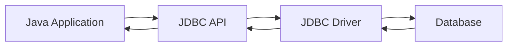

# Tutorial 24: JDBC (Java Database Connectivity)

> **Master Database Programming - Learn to connect Java applications with databases**

---

## 📋 Table of Contents

1. [Prerequisites](#prerequisites)
2. [Introduction to JDBC](#introduction-to-jdbc)
3. [JDBC Architecture](#jdbc-architecture)
4. [JDBC Drivers](#jdbc-drivers)
5. [Setting Up MySQL](#setting-up-mysql)
6. [Establishing Connection](#establishing-connection)
7. [Statement Interface](#statement-interface)
8. [ResultSet Interface](#resultset-interface)
9. [PreparedStatement](#preparedstatement)
10. [Batch Processing](#batch-processing)
11. [Best Practices](#best-practices)
12. [Common Pitfalls](#common-pitfalls)
13. [Interview Preparation](#interview-preparation)
14. [Summary](#summary)
15. [Further Reading](#further-reading)
16. [Navigation](#navigation)
17. [Video Index](#video-index)

---

## Prerequisites

- ✅ **Java I/O** ([Tutorial 21](21_Java_IO.md))
- ✅ **Exception Handling** ([Tutorial 17](17_Exception_Handling.md))
- ✅ **Basic SQL knowledge** (CREATE, SELECT, INSERT, UPDATE, DELETE)

---

## Introduction to JDBC

**JDBC (Java Database Connectivity)** is a Java API for connecting and executing queries with databases.

### 🎯 What is JDBC?

JDBC provides methods to:
- Connect to databases
- Execute SQL queries
- Retrieve and update data
- Handle transactions

### 📊 JDBC Flow



---

## JDBC Architecture

### 📌 JDBC Components

1. **DriverManager**: Manages database drivers
2. **Driver**: Handles communication with database
3. **Connection**: Represents database connection
4. **Statement**: Executes SQL queries
5. **ResultSet**: Holds query results

---

## JDBC Drivers

### 📊 Types of JDBC Drivers

| Type | Name | Description |
|------|------|-------------|
| **Type 1** | JDBC-ODBC Bridge | Uses ODBC driver (deprecated) |
| **Type 2** | Native-API Driver | Uses native database libraries |
| **Type 3** | Network Protocol Driver | Pure Java, middleware |
| **Type 4** | Thin Driver | Pure Java, direct to database (most common) |

**Recommended:** Type 4 (Thin Driver) - Pure Java, best performance

---

## Setting Up MySQL

### 💻 Download MySQL Connector

```xml
<!-- Maven Dependency -->
<dependency>
    <groupId>mysql</groupId>
    <artifactId>mysql-connector-java</artifactId>
    <version>8.0.33</version>
</dependency>
```

Or download JAR from: [MySQL Connector/J](https://dev.mysql.com/downloads/connector/j/)

---

## Establishing Connection

### 💻 Example 1: Basic Connection

```java
import java.sql.*;

public class JDBCConnection {
    public static void main(String[] args) {
        String url = "jdbc:mysql://localhost:3306/mydb";
        String username = "root";
        String password = "password";
        
        try {
            // Load driver (optional in JDBC 4.0+)
            Class.forName("com.mysql.cj.jdbc.Driver");
            
            // Establish connection
            Connection conn = DriverManager.getConnection(url, username, password);
            System.out.println("Connected to database successfully!");
            
            conn.close();
            
        } catch (ClassNotFoundException e) {
            System.out.println("MySQL JDBC Driver not found");
            e.printStackTrace();
        } catch (SQLException e) {
            System.out.println("Connection failed");
            e.printStackTrace();
        }
    }
}
```

### 💻 Example 2: Connection with try-with-resources

```java
public class SafeConnection {
    public static void main(String[] args) {
        String url = "jdbc:mysql://localhost:3306/mydb";
        String user = "root";
        String password = "password";
        
        try (Connection conn = DriverManager.getConnection(url, user, password)) {
            System.out.println("Connected!");
            System.out.println("Database: " + conn.getCatalog());
            System.out.println("User: " + conn.getMetaData().getUserName());
            
        } catch (SQLException e) {
            System.out.println("Connection error: " + e.getMessage());
        }
    }
}
```

---

## Statement Interface

**Statement** is used to execute SQL queries.

### 💻 Example 3: Creating Table

```java
import java.sql.*;

public class CreateTableExample {
    public static void main(String[] args) {
        String url = "jdbc:mysql://localhost:3306/mydb";
        String user = "root";
        String password = "password";
        
        String createTableSQL = "CREATE TABLE IF NOT EXISTS students (" +
                              "id INT PRIMARY KEY AUTO_INCREMENT," +
                              "name VARCHAR(100) NOT NULL," +
                              "age INT," +
                              "grade VARCHAR(2)" +
                              ")";
        
        try (Connection conn = DriverManager.getConnection(url, user, password);
             Statement stmt = conn.createStatement()) {
            
            stmt.execute(createTableSQL);
            System.out.println("Table created successfully!");
            
        } catch (SQLException e) {
            e.printStackTrace();
        }
    }
}
```

### 💻 Example 4: Inserting Data

```java
public class InsertDataExample {
    public static void main(String[] args) {
        String url = "jdbc:mysql://localhost:3306/mydb";
        String user = "root";
        String password = "password";
        
        try (Connection conn = DriverManager.getConnection(url, user, password);
             Statement stmt = conn.createStatement()) {
            
            String insertSQL = "INSERT INTO students (name, age, grade) " +
                             "VALUES ('Alice', 20, 'A')";
            
            int rowsAffected = stmt.executeUpdate(insertSQL);
            System.out.println(rowsAffected + " row(s) inserted");
            
        } catch (SQLException e) {
            e.printStackTrace();
        }
    }
}
```

---

## ResultSet Interface

**ResultSet** holds data retrieved from database.

### 💻 Example 5: Querying Data

```java
public class QueryDataExample {
    public static void main(String[] args) {
        String url = "jdbc:mysql://localhost:3306/mydb";
        String user = "root";
        String password = "password";
        
        String query = "SELECT * FROM students";
        
        try (Connection conn = DriverManager.getConnection(url, user, password);
             Statement stmt = conn.createStatement();
             ResultSet rs = stmt.executeQuery(query)) {
            
            System.out.println("ID\tName\t\tAge\tGrade");
            System.out.println("----------------------------------------");
            
            while (rs.next()) {
                int id = rs.getInt("id");
                String name = rs.getString("name");
                int age = rs.getInt("age");
                String grade = rs.getString("grade");
                
                System.out.printf("%d\t%-15s\t%d\t%s%n", id, name, age, grade);
            }
            
        } catch (SQLException e) {
            e.printStackTrace();
        }
    }
}
```

### 📊 ResultSet Methods

| Method | Description |
|--------|-------------|
| `next()` | Move to next row |
| `getInt(column)` | Get integer value |
| `getString(column)` | Get string value |
| `getDouble(column)` | Get double value |
| `getDate(column)` | Get date value |
| `wasNull()` | Check if last value was NULL |

---

## PreparedStatement

**PreparedStatement** is precompiled and prevents SQL injection.

### 💻 Example 6: Using PreparedStatement

```java
public class PreparedStatementExample {
    public static void main(String[] args) {
        String url = "jdbc:mysql://localhost:3306/mydb";
        String user = "root";
        String password = "password";
        
        String insertSQL = "INSERT INTO students (name, age, grade) VALUES (?, ?, ?)";
        
        try (Connection conn = DriverManager.getConnection(url, user, password);
             PreparedStatement pstmt = conn.prepareStatement(insertSQL)) {
            
            // Insert multiple students
            String[][] students = {
                {"Bob", "21", "B"},
                {"Charlie", "22", "A"},
                {"Diana", "20", "B+"}
            };
            
            for (String[] student : students) {
                pstmt.setString(1, student[0]);
                pstmt.setInt(2, Integer.parseInt(student[1]));
                pstmt.setString(3, student[2]);
                
                int rows = pstmt.executeUpdate();
                System.out.println(student[0] + " inserted (" + rows + " row)");
            }
            
        } catch (SQLException e) {
            e.printStackTrace();
        }
    }
}
```

### 📊 Statement vs PreparedStatement

| Feature | Statement | PreparedStatement |
|---------|-----------|------------------|
| **Precompiled** | No | Yes |
| **Performance** | Slower for repeated queries | Faster |
| **SQL Injection** | Vulnerable | Protected |
| **Parameterized** | No | Yes |
| **Use Case** | One-time queries | Repeated queries |

---

## Batch Processing

**Batch Processing** executes multiple SQL statements together for better performance.

### 💻 Example 7: Batch Insert

```java
public class BatchProcessingExample {
    public static void main(String[] args) {
        String url = "jdbc:mysql://localhost:3306/mydb";
        String user = "root";
        String password = "password";
        
        String insertSQL = "INSERT INTO students (name, age, grade) VALUES (?, ?, ?)";
        
        try (Connection conn = DriverManager.getConnection(url, user, password);
             PreparedStatement pstmt = conn.prepareStatement(insertSQL)) {
            
            conn.setAutoCommit(false);  // Disable auto-commit
            
            // Add multiple batches
            for (int i = 1; i <= 100; i++) {
                pstmt.setString(1, "Student" + i);
                pstmt.setInt(2, 18 + (i % 5));
                pstmt.setString(3, "A");
                pstmt.addBatch();
                
                // Execute batch every 50 records
                if (i % 50 == 0) {
                    int[] results = pstmt.executeBatch();
                    System.out.println("Batch executed: " + results.length + " rows");
                }
            }
            
            conn.commit();  // Commit transaction
            System.out.println("All batches completed successfully!");
            
        } catch (SQLException e) {
            e.printStackTrace();
        }
    }
}
```

---

## Best Practices

### ✅ Use PreparedStatement

```java
// ✅ GOOD - Prevents SQL injection
PreparedStatement pstmt = conn.prepareStatement(
    "SELECT * FROM users WHERE username = ?");
pstmt.setString(1, username);

// ❌ BAD - Vulnerable to SQL injection
Statement stmt = conn.createStatement();
String query = "SELECT * FROM users WHERE username = '" + username + "'";
```

### ✅ Use try-with-resources

```java
// ✅ GOOD - Auto-closes resources
try (Connection conn = DriverManager.getConnection(url, user, pass);
     Statement stmt = conn.createStatement();
     ResultSet rs = stmt.executeQuery(query)) {
    // Use resources
}
```

### ✅ Handle Transactions

```java
try {
    conn.setAutoCommit(false);
    // Execute operations
    conn.commit();
} catch (SQLException e) {
    conn.rollback();
}
```

---

## Common Pitfalls

### ❌ Not Closing Resources

```java
// ❌ WRONG - Resource leak
Connection conn = DriverManager.getConnection(url, user, pass);
Statement stmt = conn.createStatement();
// Forgot to close

// ✅ CORRECT
try (Connection conn = DriverManager.getConnection(url, user, pass);
     Statement stmt = conn.createStatement()) {
    // Auto-closes
}
```

### ❌ SQL Injection

```java
// ❌ WRONG - SQL Injection vulnerability
String query = "SELECT * FROM users WHERE name = '" + userInput + "'";

// ✅ CORRECT - Use PreparedStatement
PreparedStatement pstmt = conn.prepareStatement(
    "SELECT * FROM users WHERE name = ?");
pstmt.setString(1, userInput);
```

---

## Interview Preparation

### ❓ What is JDBC?

**Answer:**

JDBC (Java Database Connectivity) is a Java API for:
- Connecting to databases
- Executing SQL queries
- Processing results

**Steps:**
1. Load driver
2. Establish connection
3. Create statement
4. Execute query
5. Process results
6. Close resources

---

### ❓ Difference between Statement and PreparedStatement?

**Answer:**

| Feature | Statement | PreparedStatement |
|---------|-----------|------------------|
| **Compilation** | Compiled every time | Precompiled |
| **Performance** | Slower | Faster for repeated queries |
| **SQL Injection** | Vulnerable | Protected |
| **Parameters** | No | Yes (?) |

**PreparedStatement is preferred** for security and performance.

---

### ❓ What is a ResultSet?

**Answer:**

**ResultSet** is an object that holds data returned from a database query.

**Types:**
1. **TYPE_FORWARD_ONLY**: Default, forward only
2. **TYPE_SCROLL_INSENSITIVE**: Scrollable, not sensitive to changes
3. **TYPE_SCROLL_SENSITIVE**: Scrollable, sensitive to changes

**Common Methods:**
- `next()`: Move to next row
- `getInt()`, `getString()`: Retrieve values
- `first()`, `last()`: Navigate (scrollable only)

---

## Summary

### 🎯 Key Takeaways

**JDBC Basics:**
- Use `DriverManager` to get connections
- Use `PreparedStatement` for parameterized queries
- Use `ResultSet` to process query results
- Always close resources (use try-with-resources)

**Best Practices:**
- Use PreparedStatement to prevent SQL injection
- Use batch processing for bulk operations
- Handle transactions properly
- Close resources to avoid memory leaks

---

## Further Reading

- [JDBC Tutorial](https://docs.oracle.com/javase/tutorial/jdbc/)
- [JDBC API Documentation](https://docs.oracle.com/javase/8/docs/api/java/sql/package-summary.html)
- [MySQL Connector/J](https://dev.mysql.com/doc/connector-j/8.0/en/)

---

## Navigation

### ⬅️ Previous Tutorial
[Tutorial 23: Socket Programming](23_Socket_Programming.md)

### ➡️ Next Tutorial
[Tutorial 25: Full Course Assignment](25_Full_Course_Assignment.md) - Final practice

### 🏠 Return to Index
[RBR Java Tutorial Suite](README.md)

---

## Video Index

This tutorial covers **RBR Java Playlist Videos 290-305** (16 videos):

### Introduction to JDBC (Videos 290-294)
- 290: Introduction to API's
- 291: Introduction to JDBC
- 292: Components of JDBC
- 293: JDBC driver
- 294: Typical flow of JDBC

### Setting Up (Video 295)
- 295: Download and install MySQL connector

### Core JDBC Classes (Videos 296-302)
- 296: Driver manager class
- 297: Example on create connection
- 298: Statement
- 299: Example on statement
- 300: ResultSet
- 301: ResultSet methods
- 302: Example on ResultSet

### Batch Processing (Videos 303-305)
- 303: Batch processing
- 304: Example on batch processing
- 305: Best practices to write JDBC code

---

**🎉 Congratulations!** You've completed JDBC!

---

*Tutorial 24 of 25 | RBR Java Complete Tutorial Suite*  
*16 videos | Database Connectivity*  
*Last Updated: November 2025*
